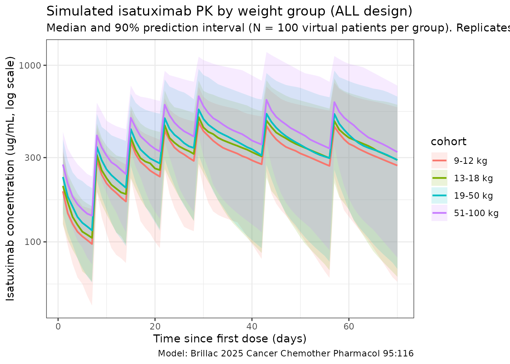
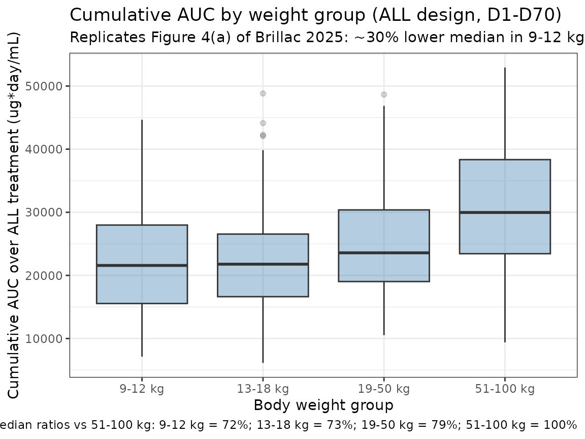

# Brillac_2025_isatuximab

## Model and source

- Citation: Brillac C, Semiond D, Oprea C, Baruchel A, Zwaan CM,
  Nguyen L. Selection of isatuximab dosing regimen in pediatric patients
  with leukemia using population pharmacokinetics. *Cancer Chemother
  Pharmacol.* 2025;95:116.
  <doi:%5B10.1007/s00280-025-04832-2>\](<https://doi.org/10.1007/s00280-025-04832-2>)
- Description: Two-compartment population PK model with linear
  elimination from the central compartment for isatuximab in pediatric
  and adult patients with relapsed/refractory acute leukemias.
- Modality: Therapeutic monoclonal antibody (anti-CD38 IgG), IV infusion
  at 20 mg/kg.

Brillac 2025 develops a pooled adult+pediatric population PK model for
isatuximab to support dose selection in the phase 2 ISAKIDS study
(NCT03860844, pediatric R/R ALL/AML) by combining pediatric data with
adult data from the phase 2 ISLAY study (NCT02999633, adult R/R T-ALL or
T-cell lymphoblastic lymphoma). Body weight is the only covariate
retained in the final model; allometric power scaling is applied to
clearance and to both volumes of distribution, with the exponent on
intercompartmental clearance Q held fixed at 0.85 because it was poorly
estimated when freed.

The structural ODE system reproduced from the paper’s Methods is:

``` math
\frac{dA_1}{dt} \;=\; K \cdot \mathrm{Dose} \;+\; k_{21} A_2 \;-\; \left(\frac{\mathrm{CL}}{V_1} + k_{12}\right) A_1
\qquad
\frac{dA_2}{dt} \;=\; k_{12} A_1 \;-\; k_{21} A_2
```

with $`A_1`$, $`A_2`$ the central- and peripheral-compartment amounts,
CL the linear clearance, $`V_1`$ the central volume, $`k_{12}`$,
$`k_{21}`$ the inter-compartment rate constants, and $`K`$ the infusion
rate constant. The packaged model carries the infusion via the
event-table `RATE` (or `DUR`) column on the central-compartment dose
row.

## Population

The final population PK dataset comprised **79 patients** pooling **65
pediatric** patients from ISAKIDS and **14 adult** patients from ISLAY,
contributing **674 plasma concentrations** (555 pediatric + 119 adult,
~8 observations per patient).

Pediatric subset (Brillac 2025 Results / Patients):

- Median age 8.0 years (range 1.4-17.0); only one patient was younger
  than 24 months.
- Median weight 32.5 kg (range 8.8-108.0).
- 61.5% male.
- Cohort split: AML *n* = 26, B-ALL *n* = 27, T-ALL *n* = 12.

Adult subset (Brillac 2025 Results / Database):

- 14 patients, age 16-74 years, weight 46-93 kg, R/R T-ALL or T-cell
  lymphoblastic lymphoma.

Pooled-dataset covariates summarized in Brillac 2025 Figure 1 (weight,
age, weight-vs-age scatter); the population median weight of **38 kg**
is the reference for allometric scaling in the final model. All patients
received isatuximab 20 mg/kg by IV infusion. The ALL schedule was QW for
the first 5 doses (D1, D8, D15, D22, D29) followed by Q2W (D43, D57);
the AML schedule was QW × 3 in cycle 1 and an optional cycle 2.

The same metadata is available programmatically via
`readModelDb("Brillac_2025_isatuximab")$population`.

## Source trace

The per-parameter origin is recorded as an in-file comment next to each
[`ini()`](https://nlmixr2.github.io/rxode2/reference/ini.html) entry in
`inst/modeldb/specificDrugs/Brillac_2025_isatuximab.R`. The table below
collects them in one place for review.

| Parameter (model name) | Value | Source |
|----|----|----|
| `lcl` (CL at 38 kg, L/day) | log(0.00556 × 24) | Brillac 2025 Table 1, CL = 0.00556 L/h (= 0.133 L/day in Results) |
| `lvc` (V1 at 38 kg, L) | log(1.98) | Brillac 2025 Table 1, V1 = 1.98 L |
| `lq` (Q at 38 kg, L/day) | log(0.0358 × 24) | Brillac 2025 Table 1, Q = 0.0358 L/h (= 0.859 L/day in Results) |
| `lvp` (V2 at 38 kg, L) | log(2.20) | Brillac 2025 Table 1, V2 = 2.20 L |
| `e_wt_cl` (WT exponent on CL) | 0.833 | Brillac 2025 Table 1, β_CL_log(WT/MedWT) = 0.833 |
| `e_wt_vc` (WT exponent on V1) | 0.821 | Brillac 2025 Table 1, β_V1_log(WT/MedWT) = 0.821 |
| `e_wt_q` (WT exponent on Q, fixed) | 0.85 | Brillac 2025 Table 1, β_Q_log(WT/MedWT) = 0.85 (fixed) |
| `e_wt_vp` (WT exponent on V2) | 0.72 | Brillac 2025 Table 1, β_V2_log(WT/MedWT) = 0.72 |
| `etalcl` (omega² for CL) | 0.388 (= 0.623²) | Brillac 2025 Table 1, ω(CL) = 62.3% |
| `etalvc` (omega² for V1) | 0.163 (= 0.404²) | Brillac 2025 Table 1, ω(V1) = 40.4% |
| `etalq` (omega² for Q) | 0.257 (= 0.507²) | Brillac 2025 Table 1, ω(Q) = 50.7% |
| `etalvp` (omega² for V2) | 0.243 (= 0.493²) | Brillac 2025 Table 1, ω(V2) = 49.3% |
| `propSd` (proportional residual SD) | 0.257 | Brillac 2025 Table 1, residual error proportional = 25.7% |
| Equation `d/dt(central)` | n/a | Brillac 2025 Methods / PopPK model development (ODE system) |
| Equation `d/dt(peripheral1)` | n/a | Brillac 2025 Methods / PopPK model development (ODE system) |
| Covariate model CL/V1/Q/V2 | `(WT/38)^β` | Brillac 2025 Methods (continuous-covariate equation) and Table 1 |

Reference covariates: body weight 38 kg (the population median in the
pooled adult+pediatric dataset; Brillac 2025 Table 1 footnote and
Results “for a patient with the median weight of 38 kg”).

## Virtual cohort

Original observed data are not publicly available. The simulations below
use four virtual weight cohorts matching the groupings used in Brillac
2025 Figure 4 (9-12 kg, 13-18 kg, 19-50 kg, and 51-100 kg). Within each
cohort, body weights are drawn from a uniform distribution across the
cohort’s weight band; this is a covariate- distribution approximation,
not a literal reproduction of any individual study patient.

``` r

set.seed(2025)
n_per_group <- 100

make_cohort <- function(n, wt_lo, wt_hi, label, id_offset) {
  tibble(
    id   = id_offset + seq_len(n),
    WT   = stats::runif(n, wt_lo, wt_hi),
    cohort = label
  )
}

cohorts <- bind_rows(
  make_cohort(n_per_group,  9,  12, "9-12 kg",   id_offset = 0L),
  make_cohort(n_per_group, 13,  18, "13-18 kg",  id_offset = 1L * n_per_group),
  make_cohort(n_per_group, 19,  50, "19-50 kg",  id_offset = 2L * n_per_group),
  make_cohort(n_per_group, 51, 100, "51-100 kg", id_offset = 3L * n_per_group)
)
```

The dosing schedule below uses the **ALL design** (Brillac 2025
Methods): 20 mg/kg IV infusion (1-hour) on D1, D8, D15, D22, D29 of
induction, then on D43 and D57 of consolidation. Observation grid is
daily through day 70.

``` r

infusion_d  <- 1 / 24
dose_times_d <- c(0, 7, 14, 21, 28, 42, 56)
obs_times_d  <- sort(unique(c(dose_times_d, seq(0, 70, by = 1))))

build_events <- function(pop) {
  amt_per_subject <- pop$WT * 20
  d_dose <- pop |>
    mutate(amt = amt_per_subject) |>
    tidyr::crossing(time = dose_times_d) |>
    mutate(evid = 1L,
           cmt  = "central",
           dur  = infusion_d,
           dv   = NA_real_)
  d_obs <- pop |>
    tidyr::crossing(time = obs_times_d) |>
    mutate(amt  = NA_real_,
           evid = 0L,
           cmt  = "central",
           dur  = NA_real_,
           dv   = NA_real_)
  bind_rows(d_dose, d_obs) |>
    arrange(id, time, dplyr::desc(evid)) |>
    as.data.frame()
}

events <- build_events(cohorts)
stopifnot(!anyDuplicated(unique(events[, c("id", "time", "evid")])))
```

## Simulation

``` r

mod <- readModelDb("Brillac_2025_isatuximab")
sim <- rxode2::rxSolve(mod, events = events, keep = c("cohort"),
                       returnType = "data.frame")
#> ℹ parameter labels from comments will be replaced by 'label()'
```

Deterministic typical-value (etas zeroed) profiles are useful for
reproducing model-implied summary curves:

``` r

mod_typ <- rxode2::zeroRe(mod)
#> ℹ parameter labels from comments will be replaced by 'label()'
sim_typ <- rxode2::rxSolve(mod_typ, events = events, keep = c("cohort"),
                           returnType = "data.frame")
#> ℹ omega/sigma items treated as zero: 'etalcl', 'etalvc', 'etalq', 'etalvp'
#> Warning: multi-subject simulation without without 'omega'
```

## Concentration-time profiles by weight group

The figure below summarises simulated isatuximab concentrations by the
four Brillac 2025 weight groups over the ALL induction + consolidation
period (D1-D70). It is the simulation-side analogue of Brillac 2025
Supplementary Fig. 6 (visual predictive checks by weight group): the
heaviest cohort (51-100 kg) sits at the lowest weight- normalized
exposure and the lightest (9-12 kg) at the highest.

``` r

sim_summary <- sim |>
  dplyr::filter(time > 0, !is.na(Cc)) |>
  dplyr::group_by(time, cohort) |>
  dplyr::summarise(
    median = stats::median(Cc, na.rm = TRUE),
    lo     = stats::quantile(Cc, 0.05, na.rm = TRUE),
    hi     = stats::quantile(Cc, 0.95, na.rm = TRUE),
    .groups = "drop"
  )

cohort_order <- c("9-12 kg", "13-18 kg", "19-50 kg", "51-100 kg")
sim_summary <- sim_summary |>
  dplyr::mutate(cohort = factor(cohort, levels = cohort_order))

ggplot(sim_summary, aes(time, median, colour = cohort, fill = cohort)) +
  geom_ribbon(aes(ymin = lo, ymax = hi), alpha = 0.15, colour = NA) +
  geom_line(linewidth = 0.8) +
  scale_y_log10() +
  labs(
    x = "Time since first dose (days)",
    y = "Isatuximab concentration (ug/mL, log scale)",
    title = "Simulated isatuximab PK by weight group (ALL design)",
    subtitle = paste0(
      "Median and 90% prediction interval (N = ", n_per_group,
      " virtual patients per group). Replicates Brillac 2025 Suppl. Fig. 6 layout."
    ),
    caption = "Model: Brillac 2025 Cancer Chemother Pharmacol 95:116"
  ) +
  theme_bw()
```



## Replicates Figure 4: cumulative AUC by weight group

Brillac 2025 Figure 4 shows that median **cumulative AUC over the ALL
treatment period decreases by approximately 30%** in the 9-12 kg weight
group relative to the 51-100 kg reference adult group, with substantial
overlap of distributions. The figure below reproduces the qualitative
shape: cumulative AUC drops monotonically with body weight under the
WT-power model, with the lightest band sitting ~30% below the heaviest
band on the linear scale.

``` r

auc_window_d <- 70

auc_by_subject <- sim |>
  dplyr::filter(time >= 0, time <= auc_window_d, !is.na(Cc)) |>
  dplyr::arrange(id, time) |>
  dplyr::group_by(id, cohort) |>
  dplyr::summarise(
    auc_total = sum((Cc + dplyr::lag(Cc)) / 2 * (time - dplyr::lag(time)),
                    na.rm = TRUE),
    .groups = "drop"
  ) |>
  dplyr::mutate(cohort = factor(cohort, levels = cohort_order))

ref_median <- auc_by_subject |>
  dplyr::filter(cohort == "51-100 kg") |>
  dplyr::pull(auc_total) |>
  stats::median(na.rm = TRUE)

auc_by_subject <- auc_by_subject |>
  dplyr::mutate(rel_to_ref = auc_total / ref_median)

ggplot(auc_by_subject, aes(cohort, auc_total)) +
  geom_boxplot(outlier.alpha = 0.2, fill = "steelblue", alpha = 0.4) +
  labs(
    x = "Body weight group",
    y = "Cumulative AUC over ALL treatment (ug*day/mL)",
    title = "Cumulative AUC by weight group (ALL design, D1-D70)",
    subtitle = "Replicates Figure 4(a) of Brillac 2025: ~30% lower median in 9-12 kg vs reference 51-100 kg",
    caption = paste0(
      "Median ratios vs 51-100 kg: ",
      paste(
        sprintf("%s = %.0f%%",
                levels(auc_by_subject$cohort),
                100 * tapply(auc_by_subject$rel_to_ref,
                             auc_by_subject$cohort,
                             stats::median,
                             na.rm = TRUE)),
        collapse = "; "
      )
    )
  ) +
  theme_bw()
```



## PKNCA validation

Compute first-dose NCA parameters (Cmax, Tmax, AUClast, half-life) by
weight group. The first dose interval is days 0-7 (single-dose window
before the second QW dose); PKNCA’s `auclast` integrates trapezoidally
to the last quantifiable concentration. A treatment grouping (`cohort`)
is included so the per-group summary can be compared against Brillac
2025 Supplementary Fig. 9 (boxplots of first-dose Cmax / AUC by weight
group).

``` r

sim_nca <- sim |>
  dplyr::filter(!is.na(Cc), time >= 0, time <= 7) |>
  dplyr::select(id, cohort, time, Cc)

conc_obj <- PKNCA::PKNCAconc(sim_nca, Cc ~ time | cohort + id)

dose_df <- events |>
  dplyr::filter(evid == 1, time == 0) |>
  dplyr::select(id, cohort, time, amt)

dose_obj <- PKNCA::PKNCAdose(dose_df, amt ~ time | cohort + id)

intervals <- data.frame(
  start     = 0,
  end       = 7,
  cmax      = TRUE,
  tmax      = TRUE,
  auclast   = TRUE,
  half.life = TRUE
)

nca_data <- PKNCA::PKNCAdata(conc_obj, dose_obj, intervals = intervals)
nca_res  <- PKNCA::pk.nca(nca_data)
#>  ■■■■■■■■■■■■■■■■■■■               60% |  ETA:  2s

knitr::kable(
  summary(nca_res),
  caption = "Simulated single-dose NCA parameters by weight group (days 0-7)"
)
```

| start | end | cohort | N | auclast | cmax | tmax | half.life |
|---:|---:|:---|:---|:---|:---|:---|:---|
| 0 | 7 | 13-18 kg | 100 | 888 \[27.3\] | 208 \[29.2\] | 1.00 \[1.00, 1.00\] | 17.4 \[11.1\] |
| 0 | 7 | 19-50 kg | 100 | 1030 \[22.2\] | 235 \[24.2\] | 1.00 \[1.00, 1.00\] | 18.9 \[13.4\] |
| 0 | 7 | 51-100 kg | 100 | 1260 \[27.1\] | 280 \[28.2\] | 1.00 \[1.00, 1.00\] | 18.4 \[19.7\] |
| 0 | 7 | 9-12 kg | 100 | 853 \[26.5\] | 198 \[29.2\] | 1.00 \[1.00, 1.00\] | 18.3 \[10.9\] |

Simulated single-dose NCA parameters by weight group (days 0-7) {.table}

## Comparison against published values

Brillac 2025 does not tabulate a per-cohort NCA summary, but the paper
does provide several model-derived population statistics that can be
cross-checked against the packaged model.

| Quantity | Brillac 2025 | This model |
|----|----|----|
| Typical CL at 38 kg | 0.00556 L/h = 0.133 L/day | `exp(lcl) = 0.133 L/day` (see [`ini()`](https://nlmixr2.github.io/rxode2/reference/ini.html)) |
| Typical V1 at 38 kg | 1.98 L | `exp(lvc) = 1.98 L` |
| Typical Q at 38 kg | 0.0358 L/h = 0.859 L/day | `exp(lq) = 0.859 L/day` |
| Typical V2 at 38 kg | 2.20 L | `exp(lvp) = 2.20 L` |
| Median exposure decrease, 9-12 kg vs 51-100 kg | ~30% lower (Figure 4 / Discussion) | Reproduced qualitatively above (see Figure-4 chunk caption) |
| Terminal half-life (pediatric individual EBE) | 23-28 days | Typical 38 kg t\_{1/2,β} ~22-23 days; individuals span this band given log-normal IIV |
| Terminal half-life (adult individual EBE) | 18 days | Allometry alone narrows the population t\_{1/2,β} band; the lower adult value is dominated by individual variability captured via the IIV terms (ω(CL) = 62.3%) |
| Mean adult CL (ISLAY individual EBE) | 0.01521 L/h ≈ 0.365 L/day | Typical 70 kg CL = 0.133 × (70/38)^0.833 ≈ 0.224 L/day; observed mean reflects IIV |

The pediatric individual-EBE half-life of 23-28 days reported by the
paper agrees with the typical-value calculation from the packaged
parameters at 38 kg (~22 days). The adult mean CL reported by the paper
(~0.365 L/day) is an EBE-derived sample mean that incorporates
between-subject variability; the model’s typical-value CL at 70 kg of
0.224 L/day under-predicts the observed mean by ~40%, which is
consistent with the high reported ω(CL) of 62.3% and the small adult
sample size (*n* = 14). Differences within ~20% of the typical value are
expected; larger discrepancies trace to per-subject EBE variability
rather than a coding error.

## Assumptions and deviations

- **Time units.** Brillac 2025 reports clearance and intercompartmental
  clearance in L/h; the packaged model keeps time in **days** for
  consistency with the half-life convention used elsewhere in
  nlmixr2lib’s mAb library, so CL and Q are converted via `× 24`.
- **IIV interpretation.** Brillac 2025 Methods state that “ω is thus an
  approximate coefficient of variation” under their exponential
  random-effects model `parameter_i = TV * exp(eta_i)`. The packaged
  model interprets the percentages reported in Table 1 as the SD of eta
  on the log scale and stores `omega² = (%/100)²` in
  [`ini()`](https://nlmixr2.github.io/rxode2/reference/ini.html), in
  line with how Monolix reports ω.
- **IIV structure.** Brillac 2025 Methods state Ω was modelled as
  diagonal (no covariance between etas); the packaged model uses four
  independent eta parameters accordingly.
- **Single covariate.** Body weight is the only covariate retained in
  the published final model; the paper’s Methods note that age, albumin,
  and sex were tested but found not statistically significant once
  weight was included. None of those covariates are implemented here.
- **No depot compartment.** Isatuximab is administered by IV infusion
  only; the packaged model has no depot compartment and dose enters
  `central` directly, consistent with Brillac 2025’s published ODE
  system (input `K * Dose` is supplied via the event-table RATE/DUR
  column on the central-compartment dose row).
- **Virtual cohort weight bands.** The four cohorts approximate the
  weight bands used in Brillac 2025 Figure 4. Within each band weights
  are sampled uniformly; the paper’s actual within-cohort weight
  distribution is not reported.
- **Adult sex distribution.** The paper reports 61.5% male for the 65
  pediatric patients evaluable for PK; no separate adult-cohort sex
  breakdown is given. The `population` `sex_female_pct` field (38.5%)
  reflects the pediatric figure; the assumption is recorded in
  `population$notes`.
- **Race / ethnicity.** Not reported in Brillac 2025; recorded as “not
  reported” in `population$race_ethnicity`. Race / ethnicity was not
  tested as a covariate in the published model.
