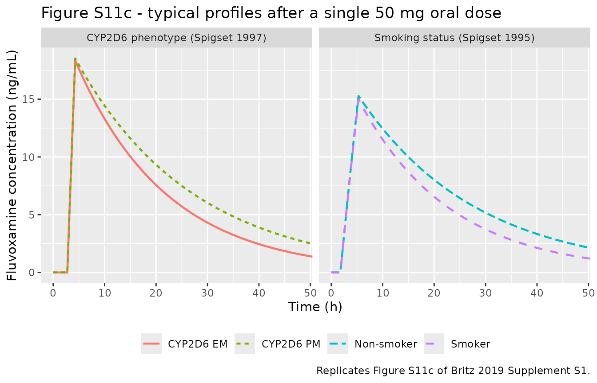
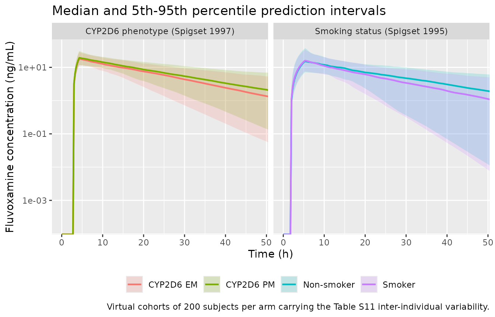

# Fluvoxamine: CYP2D6 phenotype and smoking (Britz 2019)

## Model and source

Britz 2019 is primarily a whole-body PBPK paper: it builds PK-Sim / MoBi
models of fluvoxamine and theophylline and couples them with existing
caffeine, rifampicin and midazolam models into a CYP1A2
drug-drug-interaction network. Alongside that work the authors ran a
**NONMEM population-PK analysis of fluvoxamine**, reported in full in
Supplement S1 section 4, to quantify the effect of CYP2D6 poor
metabolism and of cigarette smoking on fluvoxamine clearance and to
check those effect sizes against the PBPK predictions.

It is that population-PK analysis that is packaged here. The two source
studies were **analysed separately** (Supplement S1 section 4.2: “The
two studies were analyzed separately using ADVAN6”), each yielding its
own set of parameter estimates in Table S11, so the analysis is packaged
as two independent model files following the paper’s own structure. The
PK-Sim whole-body PBPK layer is not reproduced: its tissue-plasma
partition coefficients are reported only as a calculation-method name
(“Schmitt”, “PK-Sim”, “R+R”) and its organ volumes and blood flows are
platform database outputs that appear nowhere in the paper.

``` r

mod_cyp2d6 <- readModelDb("Britz_2019_fluvoxamine_cyp2d6")
mod_smoking <- readModelDb("Britz_2019_fluvoxamine_smoking")
```

- Citation: Britz H, Hanke N, Volz AK, Spigset O, Schwab M, Eissing T,
  Wendl T, Frechen S, Lehr T. Physiologically-Based Pharmacokinetic
  Models for CYP1A2 Drug-Drug Interaction Prediction: A Modeling Network
  of Fluvoxamine, Theophylline, Caffeine, Rifampicin, and Midazolam. CPT
  Pharmacometrics Syst Pharmacol. 2019;8(5):296-307.
  <doi:10.1002/psp4.12397>. Population-PK parameters from Supplement S1,
  Table S11 (column ‘Spigset 1997’). Underlying clinical study: Spigset
  O, Granberg K, Hagg S, Norstrom A, Dahlqvist R. Relationship between
  fluvoxamine pharmacokinetics and CYP2D6/CYP2C19 phenotype
  polymorphisms. Eur J Clin Pharmacol. 1997;52(2):129-133.
- Article: <https://doi.org/10.1002/psp4.12397>
- Supplement S1 (model documentation, Tables S1a-S11): distributed with
  the article on the CPT:PSP website and via Europe PMC (`PMC6539736`,
  supplementary file `psp412397-sup-0001-SupplementS1.pdf`).

### `Britz_2019_fluvoxamine_cyp2d6`

One-compartment population PK model for a single 50 mg oral dose of
fluvoxamine in 10 healthy volunteers phenotyped for CYP2D6 (Britz 2019,
Supplement S1 section 4, dataset of Spigset 1997). Zero-order absorption
of duration D into the central compartment preceded by an absorption lag
time ALAG, and first-order elimination; volume and clearance are
apparent (Vc/F, CL/F). The single retained covariate is the CYP2D6
poor-metabolizer phenotype, which multiplies CL/F by 0.775 (a 22 percent
reduction) relative to extensive metabolizers. All subjects were
non-smokers. This is the NONMEM population-PK analysis reported
alongside, and used to corroborate, the paper’s PK-Sim whole-body PBPK
model; the PBPK layer itself is not reproduced here.

### `Britz_2019_fluvoxamine_smoking`

One-compartment population PK model for a single 50 mg oral dose of
fluvoxamine in 24 healthy volunteers stratified by cigarette smoking
(Britz 2019, Supplement S1 section 4, dataset of Spigset 1995).
Zero-order absorption of duration D into the central compartment
preceded by an absorption lag time ALAG, and first-order elimination;
volume and clearance are apparent (Vc/F, CL/F). The single retained
covariate is current cigarette smoking, which multiplies CL/F by 1.28 (a
28 percent increase) relative to non-smokers, reflecting induction of
CYP1A2. All subjects were CYP2D6 extensive metabolizers. This is the
NONMEM population-PK analysis reported alongside, and used to
corroborate, the paper’s PK-Sim whole-body PBPK model; the PBPK layer
itself is not reproduced here.

## Population

Both models describe a **single 50 mg oral dose of fluvoxamine in
healthy volunteers**, with blood sampled pre-dose and at 1, 2, 3, 4, 5,
6, 7, 8, 10, 12, 24, 32 and 48 h; plasma concentrations were measured by
HPLC with a lower limit of quantification of 0.5 nmol/L (Supplement S1
section 4.2).

**Spigset 1997 (CYP2D6 model).** Ten young healthy volunteers
categorised by CYP2D6 phenotype: five extensive metabolizers (the single
female plus four males) and five poor metabolizers (all male). All
subjects were non-smokers. Mean age 25 years, body weight 55-86 kg. 139
concentrations entered the analysis.

**Spigset 1995 (smoking model).** Twenty-four young healthy volunteers,
12 non-smokers and 12 smokers, with five females and seven males in each
group. All were CYP2D6 extensive metabolizers. Mean age 36.5 years, body
weight 51-95 kg. 311 concentrations entered the analysis.

Because each study varies only one factor and holds the other fixed, the
two covariates are cleanly separated: the CYP2D6 model is estimated
entirely in non-smokers and the smoking model entirely in CYP2D6
extensive metabolizers. Neither model can therefore speak to the
combination of the two.

The same information is available programmatically from each model’s
`population` metadata:

``` r

str(readModelDb("Britz_2019_fluvoxamine_cyp2d6")()$population, max.level = 1)
#> List of 13
#>  $ species         : chr "human"
#>  $ n_subjects      : num 10
#>  $ n_studies       : num 1
#>  $ age_median      : chr "25 years"
#>  $ weight_range    : chr "55-86 kg"
#>  $ sex_female_pct  : num 10
#>  $ disease_state   : chr "healthy volunteers"
#>  $ dose_range      : chr "50 mg oral single dose (tablet)"
#>  $ regions         : chr "Sweden"
#>  $ smoking_status  : chr "all subjects non-smokers"
#>  $ cyp2d6_phenotype: chr "5 extensive metabolizers, 5 poor metabolizers"
#>  $ n_observations  : num 139
#>  $ notes           : chr "Britz 2019 Supplement S1 section 4.3 'Study population': 'The population of the study by Spigset et al. 1997 co"| __truncated__
```

## Source trace

Every value below is transcribed from **Britz 2019 Supplement S1, Table
S11** (“Parameter estimates of the final population pharmacokinetic
models”), whose two numeric columns are headed “Spigset 1997” and
“Spigset 1995”. The same citations appear as in-file comments beside
each `ini()` entry in
`inst/modeldb/specificDrugs/Britz_2019_fluvoxamine_cyp2d6.R` and
`inst/modeldb/specificDrugs/Britz_2019_fluvoxamine_smoking.R`.

| Equation / parameter | `_cyp2d6` (Spigset 1997) | `_smoking` (Spigset 1995) | Source location |
|----|----|----|----|
| `ld1` - zero-order input duration D | 1.53 h (RSE 12%) | 3.51 h (RSE 9%) | Table S11 row “D (h)”; corroborated in section 4.3 prose |
| `ltlag` - absorption lag time ALAG | 2.75 h (RSE 1%) | 1.79 h (RSE 6%) | Table S11 row “ALAG (h)”; corroborated in section 4.3 prose |
| `lvc` - apparent central volume Vc/F | 2610 L (RSE 11%) | 3030 L (RSE 12%) | Table S11 row “VCentral (l/F)”; corroborated in section 4.3 prose |
| `lcl` - apparent clearance CL/F | 147 L/h (RSE 25%) | 133 L/h (RSE 18%) | Table S11 row “CL (l/h/F)”; corroborated in section 4.3 prose |
| `e_cyp2d6_pm_cl` - CYP2D6 PM effect on CL/F | 0.775 (RSE 33%) | n/a | Table S11 row “CYP2D6 poor metabolism on CL” |
| `e_smoke_cl` - smoking effect on CL/F | n/a | 1.28 (RSE 21%) | Table S11 row “Smoking on CL” |
| `etalvc` - IIV on Vc/F | 29 %CV (RSE 21%) -\> 0.0807501 | 53 %CV (RSE 18%) -\> 0.2475630 | Table S11 row “IIV VCentral (%CV)”; `omega^2 = log(1 + CV^2)` |
| `etalcl` - IIV on CL/F | 49 %CV (RSE 17%) -\> 0.2151920 | 49 %CV (RSE 22%) -\> 0.2151920 | Table S11 row “IIV CL (%CV)”; `omega^2 = log(1 + CV^2)` |
| `propSd` - proportional residual SD | 0.34 (RSE 13%) | 0.49 (RSE 18%) | Table S11 row “Proportional (%)” |
| `addSd` - additive residual SD | `fixed(2.86506e-07)` ng/mL | 9.5502e-04 ng/mL (RSE 50%) | Table S11 row “Additive (nmol/ml)”: (9e-10) fixed, and 3e-6; converted with MW 318.34 g/mol from Table S1b |
| Structure: 1 compartment, zero-order input, lag, linear elimination | n/a | n/a | Section 4.3 “Population pharmacokinetic model”; section 4.2 model-building narrative |
| Exponential (log-normal) IIV | n/a | n/a | Section 4.2: “IIVs were modelled exponentially” |
| Combined proportional + additive residual error | n/a | n/a | Section 4.3: “Residual variability was best described with a combined error model” |
| MW 318.34 g/mol (unit conversion only) | n/a | n/a | Supplement S1 Table S1b row “MW” |

Reference values used later for validation come from **Supplement S1
Table S1d** (“Observed and predicted AUC and Cmax values of
fluvoxamine”), rows for Spigset 1995 and Spigset 1997 at 50 mg p.o.
single dose.

## Virtual cohort

The original subject-level data are not public, so the figures below use
virtual cohorts of 200 subjects per arm. Only the covariate that each
study varied is set; no body-weight or age covariate enters either
model, so nothing else needs to be sampled.

Observation times combine a 0.25 h grid over the absorption phase with
an hourly grid to 72 h, plus the exact end-of-input time `tlag + d1` for
each model so that Cmax and Tmax are resolved exactly rather than to the
nearest grid point.

``` r

dose_mg <- 50

# End of the zero-order input = tlag + d1, the exact time of the peak.
peak_time <- c(cyp2d6 = 2.75 + 1.53, smoking = 1.79 + 3.51)

obs_grid <- function(peak) {
  sort(unique(c(seq(0, 12, by = 0.25), seq(12, 72, by = 1), peak)))
}

# One arm's event table. `rate = -2` is mandatory: it tells rxode2 to use the
# modelled duration dur(central) = d1. Without it the dose collapses to an
# instantaneous bolus.
make_arm <- function(n, cov_name, cov_value, arm, peak, id_offset = 0L) {
  sched <-
    rxode2::et(amt = dose_mg, cmt = "central", rate = -2) |>
    rxode2::et(obs_grid(peak), cmt = "central") |>
    as.data.frame()
  out <- do.call(rbind, lapply(seq_len(n), function(i) {
    x <- sched
    x$id <- id_offset + i
    x
  }))
  out[[cov_name]] <- cov_value
  out$arm <- arm
  out
}

n_per_arm <- 200L

ev_cyp2d6 <- dplyr::bind_rows(
  make_arm(n_per_arm, "CYP2D6_PM", 0L, "CYP2D6 EM", peak_time[["cyp2d6"]], 0L),
  make_arm(n_per_arm, "CYP2D6_PM", 1L, "CYP2D6 PM", peak_time[["cyp2d6"]], n_per_arm)
)
ev_smoking <- dplyr::bind_rows(
  make_arm(n_per_arm, "SMOKE", 0L, "Non-smoker", peak_time[["smoking"]], 0L),
  make_arm(n_per_arm, "SMOKE", 1L, "Smoker", peak_time[["smoking"]], n_per_arm)
)

# Disjoint ids per arm: duplicate ids would silently merge into one subject
# receiving the summed dose.
stopifnot(
  !anyDuplicated(unique(ev_cyp2d6[, c("id", "time", "evid")])),
  !anyDuplicated(unique(ev_smoking[, c("id", "time", "evid")]))
)
```

## Simulation

Two simulations are run for each model: a stochastic cohort that carries
the published inter-individual variability (used for the
prediction-interval figures) and a typical-value solve with the random
effects zeroed (used for the NCA comparison and the structural checks,
both of which must be exactly reproducible).

``` r

rxode2::rxSetSeed(20190501)
sim_cyp2d6 <- rxode2::rxSolve(mod_cyp2d6, ev_cyp2d6, keep = "arm") |>
  as.data.frame()
#> ℹ parameter labels from comments will be replaced by 'label()'

rxode2::rxSetSeed(20190502)
sim_smoking <- rxode2::rxSolve(mod_smoking, ev_smoking, keep = "arm") |>
  as.data.frame()
#> ℹ parameter labels from comments will be replaced by 'label()'
```

``` r

typ_arm <- function(cov_name, cov_value, arm, peak, id_offset) {
  make_arm(1L, cov_name, cov_value, arm, peak, id_offset)
}

ev_typ_cyp2d6 <- dplyr::bind_rows(
  typ_arm("CYP2D6_PM", 0L, "CYP2D6 EM", peak_time[["cyp2d6"]], 1L),
  typ_arm("CYP2D6_PM", 1L, "CYP2D6 PM", peak_time[["cyp2d6"]], 2L)
)
ev_typ_smoking <- dplyr::bind_rows(
  typ_arm("SMOKE", 0L, "Non-smoker", peak_time[["smoking"]], 1L),
  typ_arm("SMOKE", 1L, "Smoker", peak_time[["smoking"]], 2L)
)

typ_cyp2d6 <- rxode2::rxSolve(
  rxode2::zeroRe(mod_cyp2d6), ev_typ_cyp2d6, keep = "arm"
) |> as.data.frame()
#> ℹ parameter labels from comments will be replaced by 'label()'
#> ℹ omega/sigma items treated as zero: 'etalvc', 'etalcl'
#> Warning: multi-subject simulation without without 'omega'
typ_smoking <- rxode2::rxSolve(
  rxode2::zeroRe(mod_smoking), ev_typ_smoking, keep = "arm"
) |> as.data.frame()
#> ℹ parameter labels from comments will be replaced by 'label()'
#> ℹ omega/sigma items treated as zero: 'etalvc', 'etalcl'
#> Warning: multi-subject simulation without without 'omega'
```

## Replicate published figures

### Figure S11c - impact of CYP2D6 phenotype and smoking

Supplement S1 Figure S11c plots simulated typical plasma
concentration-time profiles for a single 50 mg oral dose from the two
final population-PK models: CYP2D6 extensive versus poor metabolizers in
the left panel, and non-smokers versus smokers in the right panel. The
chunk below reproduces both panels.

``` r

# Replicates Figure S11c of Britz 2019 Supplement S1.
dplyr::bind_rows(
  typ_cyp2d6 |> dplyr::mutate(panel = "CYP2D6 phenotype (Spigset 1997)"),
  typ_smoking |> dplyr::mutate(panel = "Smoking status (Spigset 1995)")
) |>
  dplyr::filter(!is.na(Cc)) |>
  ggplot(aes(time, Cc, colour = arm, linetype = arm)) +
  geom_line(linewidth = 0.8) +
  facet_wrap(~panel) +
  coord_cartesian(xlim = c(0, 48)) +
  labs(
    x = "Time (h)", y = "Fluvoxamine concentration (ng/mL)",
    colour = NULL, linetype = NULL,
    title = "Figure S11c - typical profiles after a single 50 mg oral dose",
    caption = "Replicates Figure S11c of Britz 2019 Supplement S1."
  ) +
  theme(legend.position = "bottom")
```



The two published qualitative findings are reproduced: poor metabolizers
show the higher and longer-lasting exposure of the two CYP2D6 strata,
and smokers show the lower exposure of the two smoking strata. In both
panels the curves are indistinguishable during the absorption phase and
separate only after the peak, because each covariate acts on clearance
alone.

### Prediction intervals across the published variability

``` r

dplyr::bind_rows(
  sim_cyp2d6 |> dplyr::mutate(panel = "CYP2D6 phenotype (Spigset 1997)"),
  sim_smoking |> dplyr::mutate(panel = "Smoking status (Spigset 1995)")
) |>
  dplyr::filter(!is.na(Cc)) |>
  dplyr::group_by(panel, arm, time) |>
  dplyr::summarise(
    Q05 = quantile(Cc, 0.05),
    Q50 = quantile(Cc, 0.50),
    Q95 = quantile(Cc, 0.95),
    .groups = "drop"
  ) |>
  ggplot(aes(time, Q50, colour = arm, fill = arm)) +
  geom_ribbon(aes(ymin = Q05, ymax = Q95), alpha = 0.18, colour = NA) +
  geom_line(linewidth = 0.8) +
  facet_wrap(~panel) +
  coord_cartesian(xlim = c(0, 48)) +
  scale_y_log10() +
  labs(
    x = "Time (h)", y = "Fluvoxamine concentration (ng/mL)",
    colour = NULL, fill = NULL,
    title = "Median and 5th-95th percentile prediction intervals",
    caption = paste(
      "Virtual cohorts of", n_per_arm,
      "subjects per arm carrying the Table S11 inter-individual variability."
    )
  ) +
  theme(legend.position = "bottom")
#> Warning in scale_y_log10(): log-10 transformation introduced infinite values.
#> log-10 transformation introduced infinite values.
#> log-10 transformation introduced infinite values.
#> log-10 transformation introduced infinite values.
```



## Structural checks

Because the models are one-compartment and linear, several quantities
have exact closed forms. Both sides of each comparison below use the
same parameter values, so the only difference is ODE-solver and NCA
numerical error and a tight bound is appropriate.

``` r

p_cyp2d6 <- rxode2::rxode2(mod_cyp2d6)$theta
#> ℹ parameter labels from comments will be replaced by 'label()'
p_smoking <- rxode2::rxode2(mod_smoking)$theta
#> ℹ parameter labels from comments will be replaced by 'label()'

expected <- tibble::tibble(
  arm = c("CYP2D6 EM", "CYP2D6 PM", "Non-smoker", "Smoker"),
  cl = c(
    exp(p_cyp2d6[["lcl"]]),
    exp(p_cyp2d6[["lcl"]]) * p_cyp2d6[["e_cyp2d6_pm_cl"]],
    exp(p_smoking[["lcl"]]),
    exp(p_smoking[["lcl"]]) * p_smoking[["e_smoke_cl"]]
  ),
  vc = c(
    exp(p_cyp2d6[["lvc"]]), exp(p_cyp2d6[["lvc"]]),
    exp(p_smoking[["lvc"]]), exp(p_smoking[["lvc"]])
  ),
  tlag_plus_d1 = c(
    rep(exp(p_cyp2d6[["ltlag"]]) + exp(p_cyp2d6[["ld1"]]), 2),
    rep(exp(p_smoking[["ltlag"]]) + exp(p_smoking[["ld1"]]), 2)
  )
) |>
  dplyr::mutate(
    # AUC0-inf = Dose / (CL/F); dose in mg, CL in L/h, Cc reported in ng/mL.
    aucinf_expected = dose_mg / cl * 1000,
    half_life_expected = log(2) * vc / cl,
    tmax_expected = tlag_plus_d1
  )

knitr::kable(
  expected |>
    dplyr::select(arm, cl, vc, tmax_expected, half_life_expected, aucinf_expected) |>
    dplyr::rename(
      "Arm" = arm,
      "CL/F (L/h)" = cl,
      "Vc/F (L)" = vc,
      "Expected Tmax (h)" = tmax_expected,
      "Expected t1/2 (h)" = half_life_expected,
      "Expected AUC0-inf (ng*h/mL)" = aucinf_expected
    ),
  digits = 3,
  caption = "Closed-form expectations implied by the Table S11 estimates."
)
```

| Arm | CL/F (L/h) | Vc/F (L) | Expected Tmax (h) | Expected t1/2 (h) | Expected AUC0-inf (ng\*h/mL) |
|:---|---:|---:|---:|---:|---:|
| CYP2D6 EM | 147.000 | 2610 | 4.28 | 12.307 | 340.136 |
| CYP2D6 PM | 113.925 | 2610 | 4.28 | 15.880 | 438.885 |
| Non-smoker | 133.000 | 3030 | 5.30 | 15.791 | 375.940 |
| Smoker | 170.240 | 3030 | 5.30 | 12.337 | 293.703 |

Closed-form expectations implied by the Table S11 estimates. {.table}

``` r

typ_all <- dplyr::bind_rows(typ_cyp2d6, typ_smoking) |>
  dplyr::filter(!is.na(Cc))

observed_peaks <- typ_all |>
  dplyr::group_by(arm) |>
  dplyr::summarise(
    cmax = max(Cc),
    tmax = time[which.max(Cc)],
    .groups = "drop"
  ) |>
  dplyr::left_join(expected, by = "arm")

# Tmax must equal tlag + d1 exactly: the zero-order input stops there and
# elimination takes over.
stopifnot(all(abs(observed_peaks$tmax - observed_peaks$tmax_expected) < 1e-6))

# The covariate effects are pure multipliers on CL/F, so the exposure ratios
# invert the Table S11 multipliers exactly.
auc_ratio <- function(df, num, den) {
  a <- function(k) {
    d <- dplyr::filter(df, arm == k)
    sum(diff(d$time) * (head(d$Cc, -1) + tail(d$Cc, -1)) / 2)
  }
  a(num) / a(den)
}
# Truncated AUCs are used here, so allow a little room for the different
# extrapolated tails; the exact test on AUC0-inf is in the NCA section below.
stopifnot(
  abs(auc_ratio(typ_cyp2d6, "CYP2D6 PM", "CYP2D6 EM") - 1 / 0.775) < 0.05,
  abs(auc_ratio(typ_smoking, "Smoker", "Non-smoker") - 1 / 1.28) < 0.05
)
```

## PKNCA validation

NCA is run on the typical-value profiles, which makes the result exactly
reproducible and directly comparable with the closed forms above.

``` r

nca_for <- function(sim, events) {
  conc <- sim |>
    dplyr::filter(!is.na(Cc)) |>
    dplyr::select(id, time, Cc, arm)
  dose <- events |>
    dplyr::filter(evid == 1) |>
    dplyr::select(id, time, amt, arm)
  PKNCA::pk.nca(PKNCA::PKNCAdata(
    PKNCA::PKNCAconc(conc, Cc ~ time | arm + id),
    PKNCA::PKNCAdose(dose, amt ~ time | arm + id),
    intervals = data.frame(
      start = 0, end = Inf,
      cmax = TRUE, tmax = TRUE, aucinf.obs = TRUE, half.life = TRUE
    )
  ))
}

nca_cyp2d6 <- nca_for(typ_cyp2d6, ev_typ_cyp2d6)
nca_smoking <- nca_for(typ_smoking, ev_typ_smoking)

nca_all <- dplyr::bind_rows(
  as.data.frame(nca_cyp2d6),
  as.data.frame(nca_smoking)
) |>
  dplyr::filter(PPTESTCD %in% c("cmax", "tmax", "aucinf.obs", "half.life")) |>
  dplyr::select(arm, PPTESTCD, PPORRES)
```

The NCA output reproduces every closed form to within numerical error,
which confirms that the packaged models carry the Table S11 values the
paper printed:

``` r

check <- nca_all |>
  tidyr::pivot_wider(names_from = PPTESTCD, values_from = PPORRES) |>
  dplyr::left_join(expected, by = "arm")

stopifnot(
  all(abs(check$aucinf.obs / check$aucinf_expected - 1) < 0.002),
  all(abs(check$half.life / check$half_life_expected - 1) < 0.002),
  all(abs(check$tmax - check$tmax_expected) < 1e-6)
)

knitr::kable(
  check |>
    dplyr::select(arm, tmax, cmax, half.life, aucinf.obs) |>
    dplyr::rename(
      "Arm" = arm,
      "Tmax (h)" = tmax,
      "Cmax (ng/mL)" = cmax,
      "t1/2 (h)" = half.life,
      "AUC0-inf (ng*h/mL)" = aucinf.obs
    ),
  digits = 2,
  caption = "Typical-value NCA from the packaged models."
)
```

| Arm        | Tmax (h) | Cmax (ng/mL) | t1/2 (h) | AUC0-inf (ng\*h/mL) |
|:-----------|---------:|-------------:|---------:|--------------------:|
| CYP2D6 EM  |     4.28 |        18.35 |    12.31 |              340.13 |
| CYP2D6 PM  |     4.28 |        18.53 |    15.88 |              438.88 |
| Non-smoker |     5.30 |        15.29 |    15.79 |              375.96 |
| Smoker     |     5.30 |        14.98 |    12.34 |              293.72 |

Typical-value NCA from the packaged models. {.table}

### Comparison against published NCA

Supplement S1 Table S1d reports the **observed** AUC0-inf and Cmax of
the two Spigset studies at 50 mg p.o., separately for each covariate
stratum. Those observed values are the data the population-PK models
were fitted to, so they are the right reference for this comparison.

``` r

# Britz 2019 Supplement S1 Table S1d, rows "50 po (tab), s.d." for
# Spigset 1997 (CYP2D6 EM n=10, PM n=5) and Spigset 1995 (non-smokers n=12,
# smokers n=12). AUC values are AUC0-inf.
published <- tibble::tribble(
  ~arm,         ~cmax,  ~aucinf.obs,
  "CYP2D6 EM",  14.20,  318.30,
  "CYP2D6 PM",  16.00,  417.00,
  "Non-smoker", 18.40,  353.36,
  "Smoker",     12.45,  245.44
)

cmp <- nlmixr2lib::ncaComparisonTable(
  simulated = nca_all,
  reference = published,
  by = "arm",
  units = c(cmax = "ng/mL", aucinf.obs = "ng*h/mL"),
  tolerance_pct = 20
)

knitr::kable(
  cmp,
  caption = "Typical-value NCA vs. the observed values in Britz 2019 Supplement S1 Table S1d. * differs from the reference by more than 20%.",
  align = c("l", "l", "r", "r", "r")
)
```

| NCA parameter           | arm        | Reference | Simulated |   % diff |
|:------------------------|:-----------|----------:|----------:|---------:|
| Cmax (ng/mL)            | CYP2D6 EM  |      14.2 |      18.4 | +29.3%\* |
| Cmax (ng/mL)            | CYP2D6 PM  |        16 |      18.5 |   +15.8% |
| Cmax (ng/mL)            | Non-smoker |      18.4 |      15.3 |   -16.9% |
| Cmax (ng/mL)            | Smoker     |      12.4 |        15 | +20.3%\* |
| AUC0-∞ (obs) (ng\*h/mL) | CYP2D6 EM  |       318 |       340 |    +6.9% |
| AUC0-∞ (obs) (ng\*h/mL) | CYP2D6 PM  |       417 |       439 |    +5.2% |
| AUC0-∞ (obs) (ng\*h/mL) | Non-smoker |       353 |       376 |    +6.4% |
| AUC0-∞ (obs) (ng\*h/mL) | Smoker     |       245 |       294 |   +19.7% |

Typical-value NCA vs. the observed values in Britz 2019 Supplement S1
Table S1d. \* differs from the reference by more than 20%. {.table}

``` r

attr(cmp, "footnote")
#> [1] "* differs from reference by more than ±20%."
```

**AUC0-inf** agrees closely in every arm: the typical-value AUC is
`Dose / (CL/F)` by construction, and the three non-smoker arms land
within 7% of the observed means. The smoker arm is the weakest at about
+20%, which is also the arm where the paper’s own PBPK model performed
worst on AUC (Table S1d gives a PBPK predicted/observed AUC ratio of
1.04 for smokers against 1.18-1.49 for the other three arms, but its
smoker prediction was tuned by the optimised 1.38-fold CYP1A2 induction
factor, whereas the population-PK model estimates a single clearance
multiplier of 1.28 from the same data).

**Cmax** is reproduced less well, and the CYP2D6 EM arm is flagged. Two
structural features of the model explain this and neither is a
transcription error:

- Table S11 estimates **no inter-individual variability on `D` or
  `ALAG`**, so every simulated subject reaches its peak at exactly the
  same time. Real subjects do not, so averaging observed profiles across
  subjects with differing individual Tmax flattens and lowers the
  observed mean peak relative to any single typical profile. The models
  were fitted by FOCE-I to the whole concentration-time profile, not to
  Cmax.
- Because both covariates act on clearance only, and because the
  absorption phase is long relative to the half-life, Cmax is nearly
  insensitive to the covariate: the model predicts a CYP2D6 PM/EM Cmax
  ratio of about 1.01 against an observed 1.13. The covariate’s effect
  lives in the terminal phase and hence in AUC, which the model does
  reproduce.

The paper’s own PBPK model shows the same direction of error on the
flagged arm, predicting a Cmax of 16.53 ng/mL against the observed 14.20
ng/mL for Spigset 1997 extensive metabolizers (Table S1d). No parameter
has been adjusted to improve any of these comparisons.

## Assumptions and deviations

- **Only the population-PK layer of the paper is packaged.** Britz 2019
  is mainly a PK-Sim / MoBi whole-body PBPK study of fluvoxamine and
  theophylline embedded in a five-drug CYP1A2 DDI network. That PBPK
  layer is not reproducible from the publication: Supplement S1 Tables
  S1b and S2b give the organ-plasma partition coefficients only as a
  calculation-method name (“Schmitt”, “PK-Sim”, “R+R”) with no values,
  and no organ volume, blood flow or tissue composition appears anywhere
  in the paper or supplement. Those are PK-Sim database outputs. The
  drug-dependent parameters that *are* published (MW 318.34 g/mol, logP
  3.57, fu 23%, CYP1A2 KM 7.35 nmol/L and kcat 0.016/min non-smoker and
  0.022/min smoker, CYP2D6 KM 76.30 umol/L and kcat 110.56/min for
  extensive metabolizers and 0 for poor metabolizers) are recorded here
  for provenance but are not sufficient to rebuild the model.
- **Two model files, one per study.** Supplement S1 section 4.2 states
  that “The two studies were analyzed separately using ADVAN6”, and
  Table S11 reports two independent parameter columns. The two fits are
  therefore packaged as two separate model files rather than as one
  model with two covariates. Neither model was fitted to data varying
  both factors, so combining the CYP2D6 and smoking multipliers on a
  single clearance would go beyond what the paper supports.
- **IIV scale.** Table S11 reports the inter-individual variability as a
  percent coefficient of variation and section 4.2 states that IIVs were
  “modelled exponentially”, so the variances are computed as
  `omega^2 = log(1 + CV^2)`. If the authors instead used the common
  NONMEM shorthand `%CV = 100 * omega`, the variances would be up to 13%
  larger (for example 0.2809 instead of 0.2476 at 53 %CV); that is well
  inside the 18-22% relative standard errors Table S11 reports for those
  omegas, and no control stream was published that could settle the
  convention. The supplement ships only PK-Sim project files (SQLite
  `.pksim5` archives), not the NONMEM control streams.
- **Additive residual error units.** Table S11 labels the additive
  residual error “nmol/ml” while section 4.2 reports the assay’s limit
  of quantification as 0.5 nmol/l. The printed label is taken at face
  value and converted to the ng/mL scale used by `Cc` with the MW of
  318.34 g/mol from Table S1b. The choice is immaterial: under either
  reading the additive term is below 0.001 ng/mL against a Cmax near 15
  ng/mL and a proportional error of 34-49%, so it contributes less than
  0.01% of the residual. The paper says as much (“Although the additive
  error is very low, it was necessary to adequately describe the data”).
- **The additive error of the CYP2D6 model was fixed, not estimated.**
  Table S11 prints it in parentheses and the table footnote states
  “Parameter values in parentheses were fixed”, so it is wrapped in
  `fixed()`.
- **No inter-individual variability on `D`, `ALAG` or the covariate
  effects.** Table S11 reports omegas only for Vc/F and CL/F, so the
  packaged models carry only those two etas. No off-diagonal covariance
  is reported, so the etas are diagonal.
- **No covariate other than the study’s own factor.** Neither model
  carries body weight, age or sex. The paper tested CYP2D6 phenotype as
  a continuous covariate (the dextromethorphan metabolic ratio, linear
  and logarithmic) as well as categorically and retained the categorical
  form; body weight was not among the covariates reported as tested.
- **Dosing.** Both models must be dosed into `central` with `rate = -2`
  so that rxode2 applies the modelled zero-order duration
  `dur(central) = d1`. A dose record without `rate = -2` collapses to an
  instantaneous bolus and produces a peak at the lag time with a
  substantially higher Cmax.
- **Virtual cohorts.** The figures use 200 subjects per arm rather than
  the studies’ 5-12 subjects per stratum, so the prediction intervals
  reflect the published variability rather than the small-sample scatter
  of the original trials. The NCA comparison uses typical-value
  profiles, not cohort summaries, so it does not depend on the cohort
  size or on the random-number stream.
