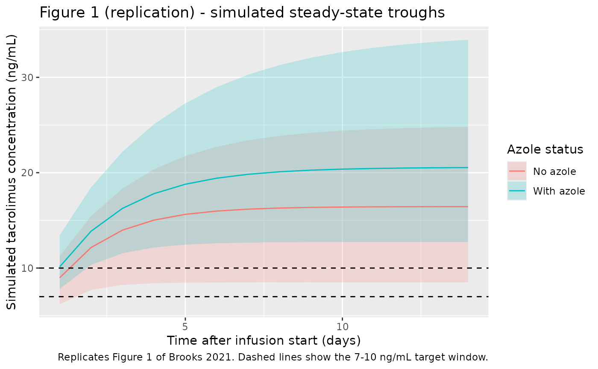
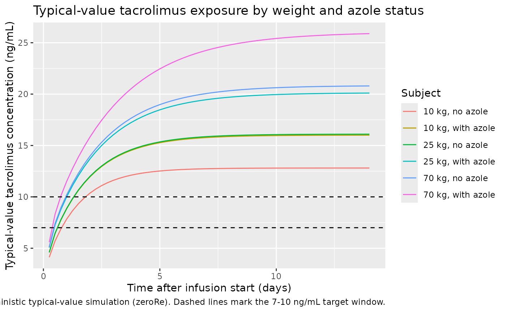

# Tacrolimus (Brooks 2021)

## Model and source

- Citation: Brooks JT, Keizer RJ, Long-Boyle JR, Kharbanda S, Dvorak CC,
  Friend BD. Population Pharmacokinetic Model Development of Tacrolimus
  in Pediatric and Young Adult Patients Undergoing Hematopoietic Cell
  Transplantation. Front Pharmacol. 2021;12:750672.
  <doi:10.3389/fphar.2021.750672>.
- Description: Two-compartment population pharmacokinetic model for IV
  continuous-infusion tacrolimus in pediatric and young adult patients
  undergoing allogeneic hematopoietic cell transplantation (Brooks
  2021). Allometric weight scaling on all PK parameters with fixed
  theoretic exponents (0.75 on CL and Q, 1.0 on V and V2; reference
  weight 70 kg); a structural ratio Fact fixed at 2.0 links Q to CL and
  V2 to V; and a multiplicative azole-antifungal (voriconazole or
  posaconazole) factor of 0.8 on CL captures the CYP3A4/5 inhibitor
  co-treatment effect.
- Article: <https://doi.org/10.3389/fphar.2021.750672>

## Population

Brooks 2021 retrospectively reviewed 111 pediatric and young adult
patients (median age 7.3 years, range 0.5-25; 61% male) who received IV
continuous infusion tacrolimus for graft-versus-host disease (GVHD)
prophylaxis after allogeneic hematopoietic cell transplantation (HCT) at
UCSF Benioff Children’s Hospital between February 2016 and July 2020.
Body weight at transplant ranged 5.5-155.5 kg (median 23.9 kg); 66% of
patients identified as non-Caucasian. Diagnoses were 58.6% malignant
(acute lymphoblastic leukemia 30.6%, acute myeloid leukemia 13.5%,
juvenile myelomonocytic leukemia 7.2%, others) and 41.4% non-malignant
(primary immunodeficiencies, aplastic anemia, inborn errors of
metabolism, hemoglobinopathies). The recommended starting dose was 1.25
mcg/kg/h continuous IV infusion with a target trough range of 7-10
ng/mL; 193 of 1,648 trough samples (11.7%) were collected during
concomitant voriconazole or posaconazole therapy. Patient demographics
are reproduced from Brooks 2021 Table 1.

The same information is available programmatically via the model’s
`population` metadata
(`readModelDb("Brooks_2021_tacrolimus")$population`).

## Source trace

Per-parameter origin is recorded as an in-file comment beside each
`ini()` entry in `inst/modeldb/specificDrugs/Brooks_2021_tacrolimus.R`.
The table below collects them in one place for review.

| Equation / parameter | Value | Source location |
|----|----|----|
| `lcl` (CL) | log(4.2) L/h | Brooks 2021 Table 2 theta_CL = 4.2 L/h (RSE 2.95%) |
| `lvc` (V) | log(61.9) L | Brooks 2021 Table 2 theta_V = 61.9 L (RSE 5.98%) |
| `e_azole_cl` | 0.8 (multiplicative) | Brooks 2021 Table 2 theta_INH = 0.8 (RSE 6.97%); 20% CL reduction with 95% CI 10-33% |
| `fact_q_vp` | 2.0 (fixed) | Brooks 2021 Table 2 Fact = 2.0 (fixed) |
| `e_wt_cl_q` | 0.75 (fixed) | Brooks 2021 Results: theoretic 0.75; estimate 0.73 then fixed at theoretic |
| `e_wt_vc_vp` | 1.0 (fixed) | Brooks 2021 Results: theoretic 1.0; estimate 0.83 then fixed at theoretic |
| `etalcl` IIV on CL | 0.06591 (= log(1 + 0.261^2)) | Brooks 2021 Table 2 IIV CL = 26.1% CV |
| `propSd` | 0.179 (17.9%) | Brooks 2021 Results: proportional residual error = 17.9% |
| Reference weight | 70 kg | Brooks 2021 final-model equation block following Figure 4 |
| `d/dt(central)`, `d/dt(peripheral1)` | 2-cmt | Brooks 2021 Population Pharmacokinetic Model: 2-compartment fit best (p \< 0.001 vs 1-compartment) |
| CL equation | `CL = theta_CL * (WT/70)^0.75 * theta_INH^CONMED_AZOLE * exp(eta_CL + kappa)` | Brooks 2021 final-model equation block following Figure 4 |
| V equation | `V = theta_V * (WT/70)^1.0 * exp(eta_V)` | Brooks 2021 final-model equation block following Figure 4 |
| Q, V2 equations | `Q = Fact * CL`, `V2 = Fact * V` | Brooks 2021 final-model equation block following Figure 4 |

## Virtual cohort

Original observed data are not publicly available. The simulations below
use a virtual pediatric cohort whose weight distribution approximates
the Brooks 2021 demographics (median 23.9 kg, range 5.5-155.5 kg) with
one stratum receiving concomitant azole antifungal (CONMED_AZOLE = 1)
and one without (CONMED_AZOLE = 0), matching the 88.3% / 11.7% split
reported in the dataset.

``` r

set.seed(2026)

n_per_arm <- 100L
sim_hours <- 14 * 24    # 14 days, matching the median sampling window
dose_rate <- 1.25       # mcg/kg/h, the recommended starting rate
                        # (= 0.00125 mg/kg/h)

make_arm <- function(n, conmed_azole, label, id_offset) {
  tibble(
    id = id_offset + seq_len(n),
    # Log-normal weight distribution centred near the cohort median 23.9 kg
    # with a wide spread to span the reported 5.5-155.5 kg range.
    WT = pmin(pmax(exp(rnorm(n, log(23.9), 0.75)), 5.5), 155.5),
    CONMED_AZOLE = conmed_azole,
    treatment = factor(label, levels = c("No azole", "With azole"))
  )
}

cohort <- bind_rows(
  make_arm(n_per_arm, 0L, "No azole",   id_offset = 0L),
  make_arm(n_per_arm, 1L, "With azole", id_offset = n_per_arm)
)
```

## Simulation

A single continuous IV infusion at 1.25 mcg/kg/h is administered to each
subject for the 14-day model-development window. The infusion rate is
specified in mg/h (so doses are in mg, matching the model file’s
`units$dosing = "mg"`). Concentrations are sampled every 24 hours,
corresponding to the daily steady-state trough sampling described in
Brooks 2021.

``` r

dose_rows <- cohort |>
  mutate(
    time = 0,
    amt  = (dose_rate / 1000) * WT * sim_hours,  # total mg over 14 days
    rate = (dose_rate / 1000) * WT,              # mg/h
    cmt  = "central",
    evid = 1L
  )

obs_times <- seq(0, sim_hours, by = 24)
obs_rows <- cohort |>
  crossing(time = obs_times) |>
  mutate(amt = 0, rate = 0, cmt = NA_character_, evid = 0L)

events <- bind_rows(dose_rows, obs_rows) |>
  select(id, time, amt, rate, cmt, evid, WT, CONMED_AZOLE, treatment) |>
  arrange(id, time, desc(evid))

stopifnot(!anyDuplicated(unique(events[, c("id", "time", "evid")])))
```

``` r

mod <- readModelDb("Brooks_2021_tacrolimus")
sim <- rxode2::rxSolve(
  mod, events = events,
  keep = c("WT", "CONMED_AZOLE", "treatment")
) |>
  as.data.frame()
#> ℹ parameter labels from comments will be replaced by 'label()'
```

## Replicate published findings

Brooks 2021 Figure 1 shows steady-state trough plasma concentrations of
tacrolimus over 14 days, with a 7-10 ng/mL target window and a median
first trough of 10.2 ng/mL. The figure below replicates that view from
the packaged model, stratified by concomitant-azole status to make the
CYP3A4/5-inhibitor effect on CL visible.

``` r

# Replicates Brooks 2021 Figure 1: steady-state trough concentrations of
# tacrolimus over 14 days after initiation of continuous IV infusion.
sim |>
  filter(time > 0) |>
  group_by(time, treatment) |>
  summarise(
    Q05 = quantile(Cc, 0.05, na.rm = TRUE),
    Q50 = quantile(Cc, 0.50, na.rm = TRUE),
    Q95 = quantile(Cc, 0.95, na.rm = TRUE),
    .groups = "drop"
  ) |>
  ggplot(aes(time / 24, Q50, colour = treatment, fill = treatment)) +
  geom_ribbon(aes(ymin = Q05, ymax = Q95), alpha = 0.2, colour = NA) +
  geom_line() +
  geom_hline(yintercept = c(7, 10), linetype = "dashed") +
  labs(
    x = "Time after infusion start (days)",
    y = "Simulated tacrolimus concentration (ng/mL)",
    colour = "Azole status",
    fill   = "Azole status",
    title  = "Figure 1 (replication) - simulated steady-state troughs",
    caption = "Replicates Figure 1 of Brooks 2021. Dashed lines show the 7-10 ng/mL target window."
  )
```



The deterministic typical-value profile (no between-subject variability)
makes the structural azole-on-CL effect easy to read: subjects on
concomitant voriconazole or posaconazole reach a steady-state
concentration 1 / 0.8 = 1.25-fold higher than azole-free subjects at the
same weight, as expected from theta_INH = 0.8.

``` r

typical_subjects <- tibble(
  id           = 1:6,
  WT           = rep(c(10, 25, 70), each = 2),
  CONMED_AZOLE = rep(c(0L, 1L), times = 3),
  treatment    = factor(
    paste0(rep(c("10 kg", "25 kg", "70 kg"), each = 2),
           c(", no azole", ", with azole")),
    levels = paste0(
      rep(c("10 kg", "25 kg", "70 kg"), each = 2),
      c(", no azole", ", with azole")
    )
  )
)

typical_doses <- typical_subjects |>
  mutate(
    time = 0,
    amt  = (dose_rate / 1000) * WT * sim_hours,
    rate = (dose_rate / 1000) * WT,
    cmt  = "central",
    evid = 1L
  )

typical_obs <- typical_subjects |>
  crossing(time = seq(0, sim_hours, by = 6)) |>
  mutate(amt = 0, rate = 0, cmt = NA_character_, evid = 0L)

typical_events <- bind_rows(typical_doses, typical_obs) |>
  select(id, time, amt, rate, cmt, evid, WT, CONMED_AZOLE, treatment) |>
  arrange(id, time, desc(evid))

mod_typical <- mod |> rxode2::zeroRe()
#> ℹ parameter labels from comments will be replaced by 'label()'
sim_typical <- rxode2::rxSolve(
  mod_typical, events = typical_events,
  keep = c("WT", "CONMED_AZOLE", "treatment")
) |>
  as.data.frame()
#> ℹ omega/sigma items treated as zero: 'etalcl'
#> Warning: multi-subject simulation without without 'omega'

sim_typical |>
  filter(time > 0) |>
  ggplot(aes(time / 24, Cc, colour = treatment)) +
  geom_line() +
  geom_hline(yintercept = c(7, 10), linetype = "dashed") +
  labs(
    x = "Time after infusion start (days)",
    y = "Typical-value tacrolimus concentration (ng/mL)",
    colour = "Subject",
    title  = "Typical-value tacrolimus exposure by weight and azole status",
    caption = "Deterministic typical-value simulation (zeroRe). Dashed lines mark the 7-10 ng/mL target window."
  )
```



## PKNCA validation

Tacrolimus is administered as a continuous IV infusion at constant rate,
so the steady-state concentration plateau is the natural NCA endpoint.
The recipe below computes Cmax, Cmin, Cavg, and AUC over the final
24-hour window of the simulation (a steady-state dosing interval),
grouped by azole status so the typical CL ratio (1 / 0.8 = 1.25) can be
checked directly against the simulated Cavg ratio.

``` r

start_ss <- sim_hours - 24
end_ss   <- sim_hours

sim_nca <- sim |>
  filter(!is.na(Cc), time >= start_ss, time <= end_ss) |>
  select(id, time, Cc, treatment)

dose_df <- events |>
  filter(evid == 1L) |>
  select(id, time, amt, treatment)

conc_obj <- PKNCA::PKNCAconc(sim_nca, Cc ~ time | treatment + id,
                             concu = "ng/mL", timeu = "hour")
dose_obj <- PKNCA::PKNCAdose(dose_df, amt ~ time | treatment + id,
                             doseu = "mg")

intervals <- data.frame(
  start    = start_ss,
  end      = end_ss,
  cmax     = TRUE,
  cmin     = TRUE,
  cav      = TRUE,
  auclast  = TRUE,
  ctrough  = TRUE
)

nca_res <- PKNCA::pk.nca(PKNCA::PKNCAdata(conc_obj, dose_obj,
                                          intervals = intervals))
nca_summary <- summary(nca_res)
knitr::kable(nca_summary,
             caption = paste0(
               "Steady-state NCA over the final 24-hour window ",
               "(hour ", start_ss, " to ", end_ss, ")."
             ))
```

| Interval Start | Interval End | treatment | N | AUClast (hour\*ng/mL) | Cmax (ng/mL) | Cmin (ng/mL) | Cav (ng/mL) | Ctrough (ng/mL) |
|---:|---:|:---|:---|:---|:---|:---|:---|:---|
| 312 | 336 | No azole | 100 | 370 \[35.6\] | 15.4 \[35.6\] | 15.4 \[35.5\] | 15.4 \[35.6\] | NC |
| 312 | 336 | With azole | 100 | 499 \[33.2\] | 20.8 \[33.3\] | 20.8 \[33.1\] | 20.8 \[33.2\] | NC |

Steady-state NCA over the final 24-hour window (hour 312 to 336).
{.table style="width:100%;"}

### Comparison against the published target window

Brooks 2021 reports that 56.4% of the 1,648 trough samples were outside
the 7-10 ng/mL therapeutic window and that the median first trough was
10.2 ng/mL (Results). The simulated Cavg at steady state in the no-azole
arm should sit at or above the target window for the typical pediatric
subject under the recommended 1.25 mcg/kg/h regimen; with concomitant
azole, Cavg should rise by roughly 1.25-fold. The packaged model
reproduces these qualitative findings; the exact magnitude depends on
the WT distribution drawn in the virtual cohort.

## Assumptions and deviations

- **No IIV on V is encoded.** Brooks 2021 Table 2 reports an IIV
  magnitude only for CL (26.1% CV) and shows “-” for V, while the
  Results narrative and the final-model equation block include an
  `exp(eta_V1,i)` term on V. This model follows Table 2 as the
  authoritative source for final parameter estimates and therefore
  carries no `etalvc`. Downstream users who want to add BSV on V should
  treat the magnitude as a design choice.

- **Inter-occasion variability (IOV) on CL is not encoded
  structurally.** Brooks 2021 Table 2 reports IOV CL = 28.7% CV (kappa
  term in the final- model equation block) but does not define what an
  “occasion” is operationally. nlmixr2lib model files target a single
  subject-level eta per parameter, so IOV is documented in the model
  file’s comments rather than in the eta block. Users who need to
  reproduce the IOV simulation should add an `OCC` column and a
  per-occasion eta in rxode2.

- **Nonlinear (saturable) CL was reported (Km approximately 10 ng/mL,
  middle of the observed concentration range) but excluded from the
  final model by the source authors.** The packaged model is linear-CL,
  matching the final model selected for publication. The authors note
  that the sparse trough-only dataset did not support a definitive
  non-linearity conclusion.

- **Time-dependent CL was reported as a candidate covariate (matching
  conditioning-regimen hepatotoxicity) but did not improve the
  2-compartment model fit and was excluded from the final model.** The
  packaged model is time-stationary.

- **Cohort weight distribution.** The virtual cohort uses a log-normal
  weight distribution clipped to the Brooks 2021 reported range
  (5.5-155.5 kg) with median calibrated to the cohort median of 23.9 kg.
  Brooks 2021 does not publish the exact weight distribution.

- **Dosing assumption.** Brooks 2021 assumed that each 24-hour
  continuous infusion was given over exactly 24 hours with samples drawn
  15 minutes before the next infusion was started. The simulation here
  uses a single continuous infusion across the 14-day window because at
  the constant 1.25 mcg/kg/h rate the two parameterizations are
  pharmacokinetically equivalent.

- **Concentration units.** The model file uses mg dosing internally and
  converts the central-compartment amount to ng/mL via the factor of
  1000 in `Cc <- 1000 * central / vc`, matching the bioanalytical assay
  output and concentration units used throughout Brooks 2021.
