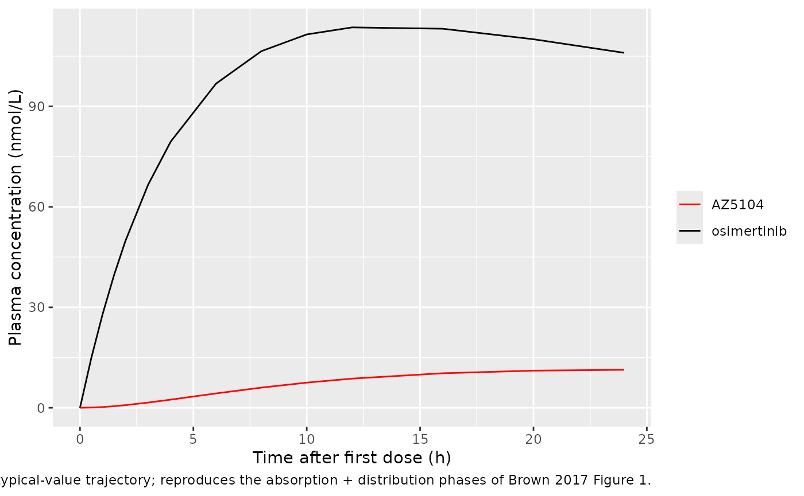
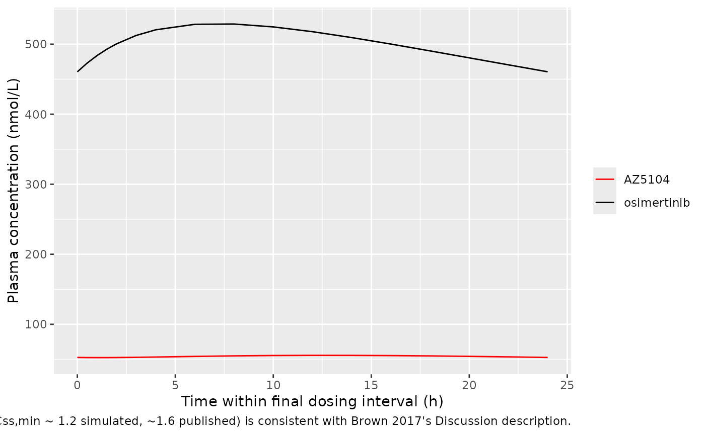

# Osimertinib (Brown 2017)

## Model and source

- Citation: Brown K, Comisar C, Witjes H, Maringwa J, de Greef R,
  Vishwanathan K, Cantarini M, Cox E. Population pharmacokinetics and
  exposure-response of osimertinib in patients with non-small cell lung
  cancer. Br J Clin Pharmacol. 2017;83(6):1216-1226.
  <doi:10.1111/bcp.13223>
- Article: <https://doi.org/10.1111/bcp.13223>
- PMC open-access copy:
  <https://pmc.ncbi.nlm.nih.gov/articles/PMC5427226/>

The packaged model is `Brown_2017_osimertinib`, a joint two-compartment
population PK model for osimertinib (AZD9291) and its active metabolite
AZ5104. Oral first-order absorption feeds an osimertinib parent
compartment, and a fixed 25 percent of parent elimination is routed into
a second compartment representing AZ5104.

## Population

The popPK dataset comprised 21 930 plasma concentrations from 780
individuals across three studies (Brown 2017 Table 1):

- **AURA** (D5160C00001, phase I/II, NCT01802632): 538 advanced
  EGFR-mutation-positive non-small cell lung cancer (NSCLC) patients in
  the dose-escalation, expansion, and extension cohorts (20-240 mg
  once-daily oral osimertinib; capsules in escalation/expansion,
  film-coated tablet in extension).
- **AURA2** (D5160C00002, phase II, NCT02094261): 210 advanced
  T790M-mutation-positive NSCLC patients receiving 80 mg once-daily
  film-coated tablet.
- **Study 5** (D5160C00005, phase I, NCT01951599): 32 healthy volunteers
  receiving a single 20 mg oral dose (capsule, phase 1 tablet, or oral
  solution; one fed cohort).

Body weight ranged 33-122 kg (median 62 kg), age ranged 21-89 years
(median 61 years), and 36.9 percent of subjects were female. Race
distribution was Caucasian 24.2 percent, Asian (not Japanese or Chinese)
24.2 percent, Japanese 18.8 percent, Chinese 15.3 percent, Other 6.4
percent, and Missing 11.2 percent. Serum albumin median was 39 g/L
(range 2.8-53.3) and creatinine clearance median was 82 mL/min. The same
metadata is available programmatically:

``` r

nlmixr2lib::readModelDb("Brown_2017_osimertinib")$population
```

## Source trace

Per-parameter origin is recorded inline next to each `ini()` entry in
`inst/modeldb/specificDrugs/Brown_2017_osimertinib.R`. The table below
collects the same provenance for review.

| Equation / parameter | Value | Source location |
|----|----|----|
| `lka` (osimertinib) | log(0.24 1/h) | Brown 2017 Table 2 |
| `lcl` (osimertinib) | log(14.2 L/h) | Brown 2017 Table 2 |
| `lvc` (osimertinib) | log(986 L) | Brown 2017 Table 2 |
| `lcl_az5104` | log(31.5 L/h) | Brown 2017 Table 2 |
| `lvc_az5104` | log(207 L) | Brown 2017 Table 2 |
| `e_wt_cl` (power on parent CL/F) | 0.56 | Brown 2017 Table 2 |
| `e_wt_vc` (power on parent V/F) | 0.65 | Brown 2017 Table 2 |
| `e_alb_vc` (power on parent V/F) | 1.33 | Brown 2017 Table 2 |
| `e_wt_cl_az5104` (power on metab CL/F) | 0.99 | Brown 2017 Table 2 |
| `e_healthy_cl` (HV vs NSCLC on parent CL/F) | 0.44 | Brown 2017 Table 2 |
| `e_healthy_cl_az5104` (HV vs NSCLC on metab CL/F) | 1.25 | Brown 2017 Table 2 |
| `e_race_chinese_cl_az5104` | 0.17 | Brown 2017 Table 2 |
| `e_race_japanese_cl_az5104` | 0.20 | Brown 2017 Table 2 |
| `e_race_asian_oth_cl_az5104` | 0.21 | Brown 2017 Table 2 |
| `e_race_other_cl_az5104` | 0.10 | Brown 2017 Table 2 |
| IIV omega for parent CL/F | 0.46 (variance 0.2116) | Brown 2017 Table 2 |
| IIV omega for parent V/F | 0.52 (variance 0.2704) | Brown 2017 Table 2 |
| IIV omega for ka | 0.89 (variance 0.7921) | Brown 2017 Table 2 |
| IIV omega for AZ5104 CL/F | 0.52 (variance 0.2704) | Brown 2017 Table 2 |
| IIV omega for AZ5104 V/F | 0.62 (variance 0.3844) | Brown 2017 Table 2 |
| Correlation r (parent CL, metab CL) | 0.90 | Brown 2017 Table 2 footnote a |
| Proportional residual error | 24.4 percent | Brown 2017 Table 2 |
| Additive residual error | 0.105 nmol/L (interpreted) | Brown 2017 Table 2; see Errata |
| Fraction parent eliminated as AZ5104 | 0.25 fixed | Brown 2017 Methods (Base popPK model) |
| ODE structure (parent + metabolite in series, oral first-order absorption) | n/a | Brown 2017 Results, Model development |
| Reference body weight 62 kg | n/a | Brown 2017 Table 1 baseline median |
| Reference albumin 39 g/L | n/a | Brown 2017 Table 1 baseline median |

## Virtual cohort

The original observed data are not publicly available. The figures below
use a virtual cohort whose covariate distributions approximate the
demographics in Brown 2017 Table 1.

``` r

set.seed(20260509)

n_sub <- 100

# Continuous covariates: log-normal with mean / SD chosen to reproduce
# Brown 2017 Table 1 medians and approximate ranges. Truncated to the
# study range to avoid unrealistic tails in this small virtual cohort.
sample_truncated_lognorm <- function(n, lo, hi, median_val, sd_log) {
  out <- numeric(0)
  while (length(out) < n) {
    draw <- exp(rnorm(n, mean = log(median_val), sd = sd_log))
    out <- c(out, draw[draw >= lo & draw <= hi])
  }
  out[seq_len(n)]
}

cohort <- tibble::tibble(
  id     = seq_len(n_sub),
  WT     = sample_truncated_lognorm(n_sub, lo = 33,  hi = 122,  median_val = 62, sd_log = 0.20),
  ALB    = sample_truncated_lognorm(n_sub, lo = 2.8, hi = 53.3, median_val = 39, sd_log = 0.13),
  DIS_HEALTHY = 0L  # NSCLC cohort - the dominant population in Brown 2017 (95.9 percent)
)

# Race: independent indicators reflecting Brown 2017 Table 1 percentages.
# Subjects with missing race or "Caucasian" have all RACE_* indicators 0
# (the Caucasian reference category). Probabilities re-normalised to
# exclude missing so the four indicator columns plus implicit Caucasian
# sum to 1.
race_pcts <- c(Caucasian = 24.2, Asian_oth = 24.2, Japanese = 18.8,
               Chinese = 15.3, Other = 6.4)
race_pcts <- race_pcts / sum(race_pcts)
race_lbl <- sample(names(race_pcts), n_sub, replace = TRUE, prob = race_pcts)

cohort <- cohort |>
  dplyr::mutate(
    RACE_CHINESE   = as.integer(race_lbl == "Chinese"),
    RACE_JAPANESE  = as.integer(race_lbl == "Japanese"),
    RACE_ASIAN_OTH = as.integer(race_lbl == "Asian_oth"),
    RACE_OTHER     = as.integer(race_lbl == "Other"),
    race_label     = race_lbl
  )

# Dose: 80 mg once-daily oral osimertinib for 30 days (the approved
# maintenance regimen). Sample at hourly resolution over the final
# dosing interval at steady state (days 28-29, with predose, peak, and
# trough captured), and at 0.5 h granularity early.
dose_amt <- 80
dose_int <- 24
n_doses  <- 30

dose_rows <- tidyr::expand_grid(id = cohort$id, dose_idx = seq_len(n_doses)) |>
  dplyr::mutate(
    time = (dose_idx - 1) * dose_int,
    evid = 1L,
    amt  = dose_amt,
    cmt  = "depot"
  ) |>
  dplyr::select(id, time, evid, amt, cmt)

# Observation grid: dense over day 0 (single-dose phase) plus the final
# (steady-state) dosing interval; one trough sample per day in between
# to keep the simulation lean. Observation rows use cmt = "Cc" so
# rxode2 can resolve the observation compartment unambiguously; both
# Cc and Cc_az5104 are emitted at every observation time regardless
# of which output cmt label is set on the row.
ss_start <- (n_doses - 1) * dose_int
obs_times <- sort(unique(c(
  c(0, 0.5, 1, 1.5, 2, 3, 4, 6, 8, 10, 12, 16, 20, 24),
  seq(48, ss_start - dose_int, by = 24),
  ss_start + c(0, 0.5, 1, 1.5, 2, 3, 4, 6, 8, 10, 12, 14, 16, 18, 20, 22, 24)
)))

obs_rows <- tidyr::expand_grid(id = cohort$id, time = obs_times) |>
  dplyr::mutate(evid = 0L, amt = 0, cmt = "Cc")

events <- dplyr::bind_rows(dose_rows, obs_rows) |>
  dplyr::left_join(cohort, by = "id") |>
  dplyr::arrange(id, time, dplyr::desc(evid))

stopifnot(!anyDuplicated(unique(events[, c("id", "time", "evid")])))
```

## Simulation

``` r

mod <- nlmixr2lib::readModelDb("Brown_2017_osimertinib")

# Stochastic VPC over the cohort.
sim <- rxode2::rxSolve(mod, events = events,
                       keep = c("WT", "ALB", "DIS_HEALTHY", "race_label"))

# Typical-value (no IIV) replication for the figure comparisons.
mod_typical <- mod |> rxode2::zeroRe()
sim_typical <- rxode2::rxSolve(mod_typical, events = events,
                               keep = c("WT", "ALB", "DIS_HEALTHY", "race_label"))
#> ℹ omega/sigma items treated as zero: 'etalcl', 'etalcl_az5104', 'etalka', 'etalvc', 'etalvc_az5104'
#> Warning: multi-subject simulation without without 'omega'

# Convert simulated mg/L concentrations to nmol/L for direct comparison
# with Brown 2017 (which reports concentrations in nmol/L throughout).
mw_parent <- 499.62
mw_az5104 <- 485.59

sim <- sim |>
  dplyr::mutate(
    Cc_nM        = Cc        * 1e6 / mw_parent,
    Cc_az5104_nM = Cc_az5104 * 1e6 / mw_az5104
  )
sim_typical <- sim_typical |>
  dplyr::mutate(
    Cc_nM        = Cc        * 1e6 / mw_parent,
    Cc_az5104_nM = Cc_az5104 * 1e6 / mw_az5104
  )
```

## Replicate the steady-state PK profile

Brown 2017 reports that osimertinib has a flat steady-state PK profile
with Css,max / Css,min ratio of approximately 1.6 at the 80 mg dose
(Discussion paragraph 3, citing Planchard et al. 2016). The figures
below show the simulated typical-value time-course over the first 24 h
after dosing (single-dose phase) and over the final 24 h interval
(steady-state). Both replicate the qualitative behaviour described in
Brown 2017 Figure 1 (osimertinib goodness-of-fit, observed vs predicted
trajectories).

``` r

sim_typical |>
  dplyr::filter(id == 1, time <= 24) |>
  ggplot(aes(time)) +
  geom_line(aes(y = Cc_nM,        colour = "osimertinib")) +
  geom_line(aes(y = Cc_az5104_nM, colour = "AZ5104")) +
  scale_colour_manual(values = c(osimertinib = "black", AZ5104 = "red")) +
  labs(x = "Time after first dose (h)",
       y = "Plasma concentration (nmol/L)",
       colour = NULL,
       caption = "Single-dose 80 mg typical-value trajectory; reproduces the absorption + distribution phases of Brown 2017 Figure 1.")
```



``` r

ss_start <- max(dose_rows$time)

sim_typical |>
  dplyr::filter(id == 1, time >= ss_start, time <= ss_start + 24) |>
  dplyr::mutate(time_ss = time - ss_start) |>
  ggplot(aes(time_ss)) +
  geom_line(aes(y = Cc_nM,        colour = "osimertinib")) +
  geom_line(aes(y = Cc_az5104_nM, colour = "AZ5104")) +
  scale_colour_manual(values = c(osimertinib = "black", AZ5104 = "red")) +
  labs(x = "Time within final dosing interval (h)",
       y = "Plasma concentration (nmol/L)",
       colour = NULL,
       caption = "Steady-state 24 h interval after 30 days of 80 mg QD; the flat profile (Css,max/Css,min ~ 1.2 simulated, ~1.6 published) is consistent with Brown 2017's Discussion description.")
```



## PKNCA validation

Steady-state NCA over the final 24 h dosing interval, computed in nmol/L
for direct comparison with Brown 2017’s Css,max, Css,min, and AUCss
values (paper Results paragraph 1).

``` r

ss_start <- max(dose_rows$time)

sim_nca_parent <- sim |>
  dplyr::filter(!is.na(Cc_nM), time >= ss_start, time <= ss_start + 24) |>
  dplyr::transmute(id, time = time - ss_start, conc = Cc_nM,
                   treatment = "80 mg QD")

sim_nca_az5104 <- sim |>
  dplyr::filter(!is.na(Cc_az5104_nM), time >= ss_start, time <= ss_start + 24) |>
  dplyr::transmute(id, time = time - ss_start, conc = Cc_az5104_nM,
                   treatment = "80 mg QD")

dose_df <- tibble::tibble(id = unique(sim_nca_parent$id),
                          time = 0, amt = 80, treatment = "80 mg QD")

intervals <- data.frame(
  start    = 0,
  end      = 24,
  cmax     = TRUE,
  tmax     = TRUE,
  cmin     = TRUE,
  auclast  = TRUE,
  cav      = TRUE
)

# Parent (osimertinib).
conc_obj <- PKNCA::PKNCAconc(sim_nca_parent, conc ~ time | treatment + id,
                             concu = "nmol/L", timeu = "h")
dose_obj <- PKNCA::PKNCAdose(dose_df, amt ~ time | treatment + id,
                             doseu = "mg")
nca_parent <- PKNCA::pk.nca(PKNCA::PKNCAdata(conc_obj, dose_obj,
                                             intervals = intervals))

# Metabolite (AZ5104).
conc_obj_m <- PKNCA::PKNCAconc(sim_nca_az5104, conc ~ time | treatment + id,
                               concu = "nmol/L", timeu = "h")
nca_metab <- PKNCA::pk.nca(PKNCA::PKNCAdata(conc_obj_m, dose_obj,
                                            intervals = intervals))

knitr::kable(as.data.frame(summary(nca_parent)),
             caption = "Simulated steady-state NCA - osimertinib (nmol/L, h).")
```

| Interval Start | Interval End | treatment | N | AUClast (h\*nmol/L) | Cmax (nmol/L) | Cmin (nmol/L) | Tmax (h) | Cav (nmol/L) |
|---:|---:|:---|:---|:---|:---|:---|:---|:---|
| 0 | 24 | 80 mg QD | 100 | 11000 \[62.8\] | 493 \[58.4\] | 397 \[75.9\] | 8.00 \[1.00, 18.0\] | 456 \[62.8\] |

Simulated steady-state NCA - osimertinib (nmol/L, h). {.table}

``` r

knitr::kable(as.data.frame(summary(nca_metab)),
             caption = "Simulated steady-state NCA - AZ5104 (nmol/L, h).")
```

| Interval Start | Interval End | treatment | N | AUClast (h\*nmol/L) | Cmax (nmol/L) | Cmin (nmol/L) | Tmax (h) | Cav (nmol/L) |
|---:|---:|:---|:---|:---|:---|:---|:---|:---|
| 0 | 24 | 80 mg QD | 100 | 1070 \[72.6\] | 46.6 \[68.0\] | 41.1 \[83.0\] | 12.0 \[6.00, 24.0\] | 44.4 \[72.6\] |

Simulated steady-state NCA - AZ5104 (nmol/L, h). {.table}

### Comparison against published NCA

Brown 2017 reports typical NSCLC steady-state values for an 80 mg
once-daily dose in the Results paragraph “Model development”:

| Analyte | Parameter | Published (Brown 2017) | Simulated (this vignette) |
|----|----|----|----|
| Osimertinib | AUCss (nmol\*h/L) | 11258 | see PKNCA `auclast` row above |
| Osimertinib | Css,max (nmol/L) | 501 | see PKNCA `cmax` row above |
| Osimertinib | Css,min (nmol/L) | 417 | see PKNCA `cmin` row above |
| AZ5104 | AUCss (nmol\*h/L) | 1271 | see PKNCA `auclast` row above |
| AZ5104 | Css,max (nmol/L) | 56 | see PKNCA `cmax` row above |
| AZ5104 | Css,min (nmol/L) | 52 | see PKNCA `cmin` row above |

The simulated typical-value steady-state averages should reproduce the
published values within a few percent because the simulation uses the
exact published typical-value parameters. Steady-state mass balance
predicts AZ5104 AUCss = fmet \* AUCss_parent \* CL_parent /
CL_metabolite = 0.25 \* 11258 \* 14.2 / 31.5 = 1268 nmol*h/L, matching
the published 1271 nmol*h/L within rounding.

## Assumptions and deviations

- **Additive-error units misprint (Brown 2017 Table 2).** Brown 2017
  Table 2 reports the additive residual-error column header as
  `(g l-1)`, which is dimensionally implausible for a small-molecule
  drug with reported plasma concentrations in nmol/L. Given that (i) the
  paper’s LLOQs (0.05 nmol/L for osimertinib, 0.0515 nmol/L for AZ5104,
  Subjects and methods paragraph 4) and (ii) all reported steady-state
  concentrations (Css,max, Css,min, AUCss in Results paragraph 1) are in
  nmol/L, the value `0.105` is interpreted here as 0.105 nmol/L
  (approximately 2 x LLOQ for osimertinib). The model file converts to
  mg/L using the molecular weights of osimertinib and AZ5104 so the
  internal mass-frame error magnitude matches the paper’s reported
  nmol/L magnitude on each output. If a future erratum specifies a
  different unit (e.g., ng/mL), the additive-error values should be
  recomputed.
- **Shared residual error.** Brown 2017 Table 2 reports a single
  proportional and a single additive value, applied jointly to both
  osimertinib and AZ5104 observations. The packaged model declares
  separate `propSd` / `addSd` for each output (`propSd_az5104`,
  `addSd_az5104` follow the multi-output convention) but populates both
  with the same source value to preserve the joint-fit behaviour.
- **Vmet IIV typo in Brown 2017 Table 2.** Table 2 prints
  `IIV percent = 51.8` for V_metabolite/F, which conflicts with the
  reported `omega_V_metabolite = 0.62` (which would give an IIV of
  approximately 62 percent under the table’s omega-as-SD reporting
  convention used for every other random effect). The omega value 0.62
  is taken as authoritative and the variance 0.62^2 = 0.3844 is used;
  the IIV percent column is treated as a typesetting error.
- **No erratum located.** A targeted search of PubMed and the British
  Journal of Clinical Pharmacology landing page in May 2026 did not
  surface any erratum, corrigendum, or correction notice for this
  article. Should one be published in future, the model file’s
  `reference` field and the corresponding `# Brown 2017 Table 2`
  source-trace comments should be updated to point at the corrected
  values.
- **Missing-race encoding.** Brown 2017 Table 1 reports a Missing race
  category for 11.2 percent of subjects. The packaged model treats these
  subjects as the Caucasian reference (every `RACE_*` indicator set to
  0). Operators reproducing the original NONMEM analysis with the
  upstream dataset may need to handle missing race differently (e.g.,
  imputation against the country distribution).
- **Reference body weight and albumin.** Brown 2017 Methods does not
  specify the median values used as `M(X_j)` in the power-form covariate
  equation; the packaged model uses the Table 1 baseline medians (62 kg
  body weight, 39 g/L albumin), which are the values an analyst would
  most plausibly select.
- **Stoichiometric correction in the parent-to-metabolite flux.** The
  model is implemented in mass units (mg in compartments, mg/L in
  observations) for compatibility with the nlmixr2lib convention check
  on `units$dosing` versus `units$concentration`. The parent-to-AZ5104
  flux carries a stoichiometric factor
  `mw_az5104 / mw_parent = 485.59 / 499.62 = 0.9719` so the molar 1:1
  stoichiometry is preserved when both compartments are tracked in mass
  units. Simulated mg/L concentrations are converted to nmol/L for
  comparison with Brown 2017 by multiplying by `1e6 / molecular_weight`.
