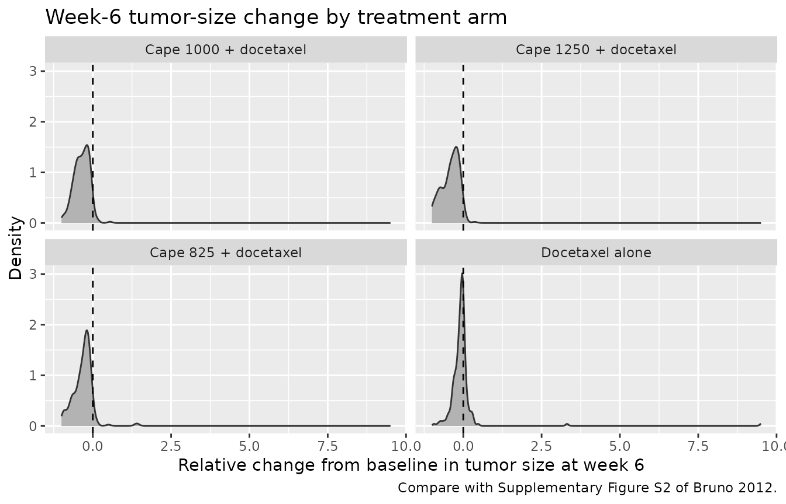
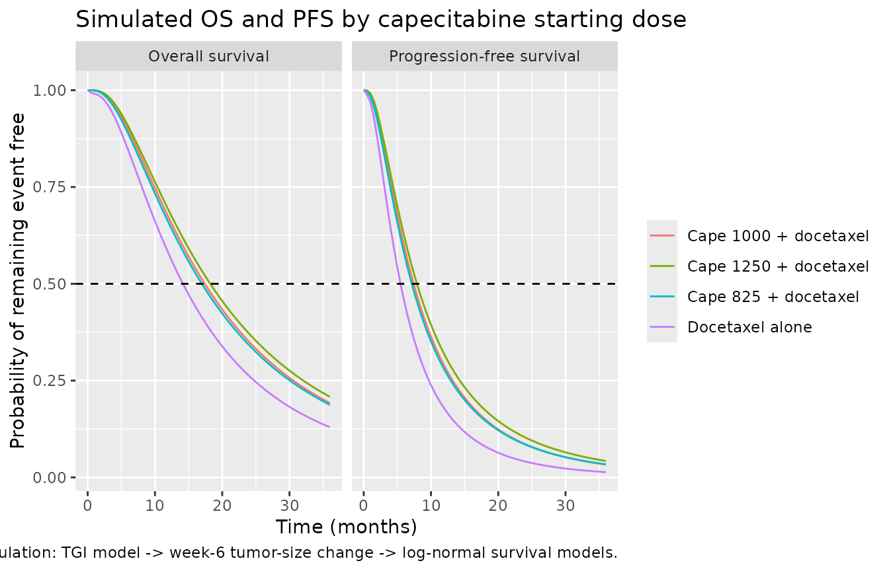

# Capecitabine + docetaxel tumor growth inhibition, PFS and survival in metastatic breast cancer (Bruno 2012)

## Model and source

Bruno 2012 built a three-part modeling framework to work out which
capecitabine starting dose, combined with docetaxel, would be
noninferior to the registered 1,250 mg/m^2 dose in second-line
metastatic breast cancer. The framework has three independently fitted
models, extracted here as three model files:

- `Bruno_2012_capecitabine_docetaxel_tgi` – longitudinal tumor growth
  inhibition (TGI) model, NONMEM VI, Supplementary Information +
  Supplementary Table S1.
- `Bruno_2012_capecitabine_docetaxel_os` – log-normal parametric overall
  survival model, S-PLUS `censorReg`, Table 1.
- `Bruno_2012_capecitabine_docetaxel_pfs` – log-normal parametric
  progression-free survival model, S-PLUS `censorReg`, Table 2.

The two survival models are *drug-independent*: their only
treatment-dependent input is the model-predicted relative change from
baseline in tumor size at week 6 (end of cycle 2), so any TGI model can
drive them.

- Article: <https://doi.org/10.1038/psp.2012.20> (open access,
  PMC3600724)
- Supplement: Supplementary Information (model equations, inter-patient
  variability and residual-error forms, and the full NONMEM control
  stream) and Supplementary Table S1 (TGI final parameter estimates),
  both accompanying the article on the journal website and mirrored in
  PMC.

``` r

tgi_fun <- readModelDb("Bruno_2012_capecitabine_docetaxel_tgi")
os_fun  <- readModelDb("Bruno_2012_capecitabine_docetaxel_os")
pfs_fun <- readModelDb("Bruno_2012_capecitabine_docetaxel_pfs")

cat(tgi_fun()$reference)
#> Bruno R, Lindbom L, Schaedeli Stark F, Chanu P, Gilberg F, Frey N, Claret L. Simulations to assess phase II noninferiority trials of different doses of capecitabine in combination with docetaxel for metastatic breast cancer. CPT Pharmacometrics Syst Pharmacol. 2012;1(12):e19. doi:10.1038/psp.2012.20. Structural equations, parameter definitions and the NONMEM control stream are in the Supplementary Information; final parameter estimates are in Supplementary Table S1.
```

## Population

The TGI model was fitted to a pooled longitudinal tumor-size database of
888 patients with locally advanced or metastatic breast cancer: 463 from
the pivotal phase III study SO14999 and 425 from the randomized phase II
noninferiority study NO16853. Those patients contributed 2,988
tumor-size observations, a mean of 3.4 measurements per patient, and
baseline tumor size (sum of the longest diameters) ranged from 10 to 520
mm.

The same 888 patients supported both survival models. 556 (63%) died
during the observation period, with a median (95% CI) survival of 14.8
months (13.6-16.0); 790 (89%) progressed or died, with a median PFS of
5.8 months (5.5-6.3). ECOG performance status was 1 rather than 0 in 319
patients (36%), and 687 (77%) had more than one metastatic site.
Estrogen- and progesterone-receptor status were missing in 220 patients
(25%), which is why those covariates were dropped from the final models.
Bruno 2012 does not tabulate age, weight, sex or race for this cohort.

Tumor response used WHO criteria in SO14999 and RECIST in NO16853; that
difference is one of the reasons the authors give for the study effect
that both survival models retain.

``` r

str(tgi_fun()$population)
#> List of 7
#>  $ species       : chr "human"
#>  $ n_subjects    : int 888
#>  $ n_studies     : int 2
#>  $ n_observations: int 2988
#>  $ disease_state : chr "locally advanced / metastatic breast cancer, second line after anthracycline pretreatment"
#>  $ dose_range    : chr "capecitabine 825 or 1,250 mg/m^2 twice daily on days 1-14 of each 3-week cycle plus docetaxel 75 mg/m^2 on day "| __truncated__
#>  $ notes         : chr "Pooled longitudinal tumor-size database of 888 patients (463 from the pivotal phase III study SO14999, 425 from"| __truncated__
```

## Source trace

Every `ini()` entry in the three model files carries an in-file comment
naming its source location. They are collected here for review.

### Tumor growth inhibition model

| Equation / parameter | Value | Source location |
|----|----|----|
| `lkgrow` (KL) | 0.00437 /week | Suppl. Table S1, RSE 15%; `$THETA(1)` |
| `lkkill_docetaxel` (KD,0,Doc) | 0.00128 | Suppl. Table S1, RSE 31%; `$THETA(2)` |
| `lkkill_capecitabine` (KD,0,Cap) | 0.00470 | Suppl. Table S1, RSE 20%; `$THETA(3)` |
| `lres_docetaxel` (lambda_Doc) | 0.0450 /week | Suppl. Table S1, RSE 39%; `$THETA(4)` |
| `lres_capecitabine` (lambda_Cap) | 0.240 /week | Suppl. Table S1, RSE 23%; `$THETA(5)` |
| `lkel_docetaxel` (KP,Doc) | 0.1 /week, FIXED | Suppl. Table S1 “Fixed”; `$THETA(7) 0.1 FIXED` |
| `lkel_capecitabine` (KP,Cap) | 3 /week, FIXED | Suppl. Table S1 “Fixed”; `$THETA(8) 3 FIXED` |
| `etalkgrow` | omega^2 = 1.60 | Suppl. Table S1, RSE 5% |
| `etalkkill_docetaxel` | omega^2 = 1.31 | Suppl. Table S1, RSE 15% |
| `etalkkill_capecitabine` | omega^2 = 1.30 | Suppl. Table S1, RSE 19% |
| `addSdStudySO14999` | sqrt(332) = 18.22 mm | Suppl. Table S1 sigma^2 = 332 mm^2, RSE 11%; `$THETA(6)` |
| `addSdStudyNO16853` | sqrt(112) = 10.58 mm | Suppl. Table S1 sigma^2 = 112 mm^2, RSE 18%; `$THETA(9)` |
| ODE system, K-PD biophase + additive drug effects | n/a | Suppl. Information equations and `$DES` block |
| `tumor_size(0) <- TUM_SLD` | n/a | `$PK`: `A_0(3) = BASE` |
| study-selected additive residual error | n/a | `$ERROR`: `Y = F + REE*ERR(1)`, `IF(STUD.EQ.2) REE = SQRT(THETA(9))` |

### Overall survival model

| Parameter | Value | Source location |
|----|----|----|
| `ltmed0` (beta_0) | 3.02 | Table 1, RSE 5%, 95% CI 2.72-3.31 |
| `e_tumsld_tmed` (beta_1) | -0.00231 /mm | Table 1, RSE 19%, 95% CI -0.00316 to -0.00146 |
| `e_rcfb6sld_tmed` (beta_2) | -0.801 | Table 1, RSE 17%, 95% CI -1.060 to -0.541 |
| `e_whops_tmed` (beta_3) | -0.352 | Table 1, RSE 17%, 95% CI -0.468 to -0.236 |
| `e_metge2_tmed` (beta_4) | -0.200 | Table 1, RSE 36%; footnote c gives the 1/2 coding |
| `e_studyno16853_tmed` (beta_5) | 0.131 | Table 1, RSE 44%; footnote c gives the 1/2 coding |
| `sdlogt` (sigma) | 0.773 | Table 1, “Random variability” |
| log-normal AFT form | n/a | Suppl. Information survival-model equation |

### Progression-free survival model

| Parameter | Value | Source location |
|----|----|----|
| `ltmed0` (beta_0) | 1.38 | Table 2, RSE 7%, 95% CI 1.20-1.56 |
| `e_tumsld_tmed` (beta_1) | -0.00165 /mm | Table 2, RSE 26%, 95% CI -0.00248 to -0.00082 |
| `e_rcfb6sld_tmed` (beta_2) | -1.18 | Table 2, RSE 11%, 95% CI -1.43 to -0.92 |
| `e_whops_tmed` (beta_3) | -0.195 | Table 2, RSE 29%; printed CI has a typesetting error, see Errata |
| `e_studyno16853_tmed` (beta_4) | 0.216 | Table 2, RSE 26%, 95% CI 0.107-0.325; footnote c gives the 1/2 coding |
| `sdlogt` (sigma) | 0.799 | Table 2, “Random variability” |

## Check 1: the survival models reproduce the paper’s own worked examples

Bruno 2012 Results quote four expected event times as a function of the
week-6 fractional change in tumor size:

- overall survival: 11.8 months (95% CI 10.1-14.0) at a 30% tumor-size
  progression, 19.3 months (17.3-21.6) at a 30% shrinkage (Supplementary
  Figure S5);
- PFS: 3.8 months (3.2-4.5) at a 30% progression, 7.7 months (7.1-8.5)
  at a 30% shrinkage (Supplementary Figure S8).

The *ratio* of the two values within each model depends only on beta_2,
so it is a covariate-free transcription check on the single most
influential coefficient in each model.

``` r

os_par  <- rxode2::rxode2(os_fun)$theta
pfs_par <- rxode2::rxode2(pfs_fun)$theta

ratio_chk <- tibble::tibble(
  model     = c("Overall survival", "Progression-free survival"),
  published = c(19.3 / 11.8, 7.7 / 3.8),
  model_ratio = c(exp(-os_par[["e_rcfb6sld_tmed"]] * 0.6),
                  exp(-pfs_par[["e_rcfb6sld_tmed"]] * 0.6))
) |>
  mutate(pct_diff = 100 * (model_ratio - published) / published)

ratio_chk |>
  rename("Model" = model,
         "Published ratio (shrinkage / progression)" = published,
         "Model ratio" = model_ratio,
         "Difference (%)" = pct_diff) |>
  knitr::kable(digits = 4,
               caption = "Ratio of the published expected event times at -30% versus +30% week-6 tumor-size change. Depends only on beta_2.")
```

| Model | Published ratio (shrinkage / progression) | Model ratio | Difference (%) |
|:---|---:|---:|---:|
| Overall survival | 1.6356 | 1.6170 | -1.1341 |
| Progression-free survival | 2.0263 | 2.0299 | 0.1782 |

Ratio of the published expected event times at -30% versus +30% week-6
tumor-size change. Depends only on beta_2. {.table}

``` r


# Deterministic: no random numbers are involved, so a tight bound is correct.
stopifnot(all(abs(ratio_chk$pct_diff) < 3))
```

The absolute values additionally pin down the reference patient the
figures were drawn at. Bruno 2012 states that the clinical trial
simulations were conditioned on study NO16853, and 77% of the cohort had
more than one metastatic site; solving the PFS relation for the
remaining unknown gives a baseline tumor size of about 75 mm, which then
reproduces all four published values.

``` r

reference_patient <- tibble::tibble(
  TUM_SLD       = 75,   # inferred by inversion, see Errata
  WHO_PS        = 0,
  MET_GE2       = 1,
  STUDY_NO16853 = 1
)

eval_surv <- function(model_fun, rcfb6) {
  mod <- rxode2::rxode2(model_fun)
  ev <- reference_patient[rep(1, length(rcfb6)), ]
  ev$id        <- seq_along(rcfb6)
  ev$time      <- 0
  ev$evid      <- 0
  ev$RCFB6_SLD <- rcfb6
  as.data.frame(rxode2::rxSolve(mod, events = as.data.frame(ev)))$tmed
}

worked <- tibble::tibble(
  endpoint  = c("Overall survival", "Overall survival",
                "Progression-free survival", "Progression-free survival"),
  rcfb6     = c(0.30, -0.30, 0.30, -0.30),
  published = c(11.8, 19.3, 3.8, 7.7),
  model     = c(eval_surv(os_fun,  c(0.30, -0.30)),
                eval_surv(pfs_fun, c(0.30, -0.30)))
) |>
  mutate(pct_diff = 100 * (model - published) / published)

worked |>
  rename("Endpoint" = endpoint,
         "Week-6 tumor-size change" = rcfb6,
         "Published median (months)" = published,
         "Model median (months)" = model,
         "Difference (%)" = pct_diff) |>
  knitr::kable(digits = 3,
               caption = "Bruno 2012 Results worked examples versus the packaged models at the inferred reference patient.")
```

| Endpoint | Week-6 tumor-size change | Published median (months) | Model median (months) | Difference (%) |
|:---|---:|---:|---:|---:|
| Overall survival | 0.3 | 11.8 | 11.804 | 0.035 |
| Overall survival | -0.3 | 19.3 | 19.088 | -1.099 |
| Progression-free survival | 0.3 | 3.8 | 3.797 | -0.075 |
| Progression-free survival | -0.3 | 7.7 | 7.708 | 0.103 |

Bruno 2012 Results worked examples versus the packaged models at the
inferred reference patient. {.table style="width:100%;"}

``` r


# Deterministic (no random effects, no residual error) -- a tight bound is
# correct here. The single 1.1% residual is the rounding of the published
# 19.3 months, see Errata.
stopifnot(all(abs(worked$pct_diff) < 2))
```

## Check 2: the log-normal survival function is internally consistent

For a log-normal accelerated-failure-time model, `exp(mu)` is by
construction the median survival time, so `surv(tmed)` must equal
exactly 0.5, and the model must be a proper survival function (monotone,
`surv(0) = 1`).

``` r

check_lognormal <- function(model_fun) {
  mod <- rxode2::rxode2(model_fun)
  ev <- reference_patient
  ev$id <- 1L; ev$evid <- 0L; ev$RCFB6_SLD <- -0.10
  tmed <- as.data.frame(rxode2::rxSolve(
    mod, events = as.data.frame(dplyr::mutate(ev, time = 0))))$tmed[1]
  grid <- as.data.frame(rxode2::rxSolve(
    mod,
    events = as.data.frame(dplyr::mutate(ev[rep(1, 61), ],
                                         time = c(0, tmed, seq(0.5, 60, length.out = 59))))))
  grid <- grid[order(grid$time), ]
  list(
    at_median = grid$surv[which.min(abs(grid$time - tmed))],
    at_zero   = grid$surv[1],
    monotone  = all(diff(grid$surv) <= 1e-12)
  )
}

lognorm_chk <- lapply(list(OS = os_fun, PFS = pfs_fun), check_lognormal)
str(lognorm_chk)
#> List of 2
#>  $ OS :List of 3
#>   ..$ at_median: num 0.5
#>   ..$ at_zero  : num 1
#>   ..$ monotone : logi TRUE
#>  $ PFS:List of 3
#>   ..$ at_median: num 0.5
#>   ..$ at_zero  : num 1
#>   ..$ monotone : logi TRUE

stopifnot(
  abs(lognorm_chk$OS$at_median  - 0.5) < 1e-6,
  abs(lognorm_chk$PFS$at_median - 0.5) < 1e-6,
  abs(lognorm_chk$OS$at_zero  - 1) < 1e-9,
  abs(lognorm_chk$PFS$at_zero - 1) < 1e-9,
  lognorm_chk$OS$monotone,
  lognorm_chk$PFS$monotone
)
```

## Virtual cohort and dosing

The original patient-level data are not public. The cohort below
approximates the published trial demographics: baseline tumor size
log-normally distributed with a median of 75 mm truncated to the
reported 10-520 mm range, ECOG 1 in 36% of subjects, more than one
metastatic site in 77%, and every subject assigned to study NO16853 (the
study Bruno 2012 conditioned its simulations on).

Four arms are simulated, matching the dose levels Bruno 2012 studied:
docetaxel alone, and docetaxel plus capecitabine at 825, 1,000 and 1,250
mg/m^2 twice daily. Capecitabine is given on days 1-14 of each 3-week
cycle and docetaxel on day 1; two cycles (6 weeks) are needed to reach
the week-6 tumor assessment. Body surface area is not reported in Bruno
2012 and is held at 1.7 m^2 (see Errata).

``` r

# set.seed() seeds R's RNG; rxSetSeed() seeds rxode2's, which is partitioned per
# solver thread. Neither makes the draw identical across machines with different
# thread counts, so every assertion below is written to hold for any cohort the
# model can produce.
set.seed(20120026)
rxode2::rxSetSeed(20120026)

n_per_arm <- 200L
bsa       <- 1.7     # m^2; not reported by Bruno 2012, see Errata
cycle_wk  <- 3       # weeks per treatment cycle
n_cycles  <- 2
horizon   <- 6       # weeks; the week-6 (end of cycle 2) assessment

arms <- tibble::tribble(
  ~arm,                       ~cape_mgm2,
  "Docetaxel alone",          0,
  "Cape 825 + docetaxel",     825,
  "Cape 1000 + docetaxel",    1000,
  "Cape 1250 + docetaxel",    1250
)

# Capecitabine: twice daily on days 1-14 of each cycle; docetaxel: day 1.
cape_times <- as.vector(outer(seq(0, 13.5, by = 0.5) / 7,
                              (seq_len(n_cycles) - 1) * cycle_wk, "+"))
doc_times  <- (seq_len(n_cycles) - 1) * cycle_wk
obs_times  <- sort(unique(c(seq(0, horizon, by = 0.25), horizon)))

make_subjects <- function(n, id_offset = 0L) {
  sld <- pmin(pmax(rlnorm(n, meanlog = log(75), sdlog = 0.55), 10), 520)
  tibble::tibble(
    id            = id_offset + seq_len(n),
    TUM_SLD       = sld,
    WHO_PS        = rbinom(n, 1, 0.36),
    MET_GE2       = rbinom(n, 1, 0.77),
    STUDY_NO16853 = 1
  )
}

make_arm_events <- function(subjects, cape_mgm2, arm_label) {
  doses <- dplyr::bind_rows(
    tidyr::expand_grid(subjects, time = doc_times) |>
      dplyr::mutate(evid = 1L, amt = 75 * bsa, cmt = "depot_kpd_docetaxel"),
    if (cape_mgm2 > 0) {
      tidyr::expand_grid(subjects, time = cape_times) |>
        dplyr::mutate(evid = 1L, amt = cape_mgm2 * bsa,
                      cmt = "depot_kpd_capecitabine")
    } else NULL
  )
  obs <- tidyr::expand_grid(subjects, time = obs_times) |>
    dplyr::mutate(evid = 0L, amt = NA_real_, cmt = "tumor_size")
  dplyr::bind_rows(doses, obs) |>
    dplyr::mutate(arm = arm_label) |>
    dplyr::arrange(id, time, dplyr::desc(evid)) |>
    as.data.frame()
}

subjects <- make_subjects(n_per_arm)
events <- dplyr::bind_rows(lapply(seq_len(nrow(arms)), function(i) {
  s <- subjects
  s$id <- s$id + (i - 1L) * n_per_arm
  make_arm_events(s, arms$cape_mgm2[i], arms$arm[i])
}))

stopifnot(!anyDuplicated(unique(events[, c("id", "time", "evid")])))
```

## Check 3: the ODE solution matches a hand-derived closed form

With every subject at the typical value the model is a linear
first-order biophase feeding an exponential-growth tumor state, so the
tumor-size trajectory has an exact closed form. Integrating the kill
term for a series of doses of amount `D_j` given at times `t_j`,

    log(y(T) / y(0)) = KL * T - sum_X KD_X * KP_X * sum_j D_j * exp(-lambda_X * t_j)
                                * (1 - exp(-(KP_X + lambda_X) * (T - t_j))) / (KP_X + lambda_X)

with the capecitabine doses divided by 1,000 to match the g^-1 unit of
KD,0,Cap. Both sides use the same parameter values, so the only
difference is ODE solver error and a tight bound is the correct
assertion.

``` r

tgi_mod <- rxode2::rxode2(tgi_fun)
#> ℹ parameter labels from comments will be replaced by 'label()'
th <- tgi_mod$theta
p <- list(
  kgrow    = exp(th[["lkgrow"]]),
  kd_doc   = exp(th[["lkkill_docetaxel"]]),
  kd_cap   = exp(th[["lkkill_capecitabine"]]),
  res_doc  = exp(th[["lres_docetaxel"]]),
  res_cap  = exp(th[["lres_capecitabine"]]),
  kel_doc  = exp(th[["lkel_docetaxel"]]),
  kel_cap  = exp(th[["lkel_capecitabine"]])
)

kill_integral <- function(tt, dose, dose_times, kel, res) {
  vapply(tt, function(T) {
    j <- dose_times <= T
    if (!any(j)) return(0)
    sum(dose * exp(-res * dose_times[j]) *
          (1 - exp(-(kel + res) * (T - dose_times[j]))) / (kel + res))
  }, numeric(1))
}

closed_form <- function(tt, sld0, cape_mgm2) {
  i_doc <- p$kd_doc * p$kel_doc *
    kill_integral(tt, 75 * bsa, doc_times, p$kel_doc, p$res_doc)
  i_cap <- if (cape_mgm2 > 0) {
    p$kd_cap * (p$kel_cap / 1000) *
      kill_integral(tt, cape_mgm2 * bsa, cape_times, p$kel_cap, p$res_cap)
  } else 0
  sld0 * exp(p$kgrow * tt - i_doc - i_cap)
}

typ_subject <- tibble::tibble(id = 1L, TUM_SLD = 75, WHO_PS = 0,
                              MET_GE2 = 1, STUDY_NO16853 = 1)
typ_events <- dplyr::bind_rows(lapply(seq_len(nrow(arms)), function(i) {
  s <- typ_subject
  s$id <- i
  make_arm_events(s, arms$cape_mgm2[i], arms$arm[i])
}))

sim_typ <- rxode2::rxSolve(rxode2::zeroRe(tgi_mod), events = typ_events,
                           omega = NA, sigma = NA, keep = "arm") |>
  as.data.frame() |>
  dplyr::left_join(dplyr::select(arms, arm, cape_mgm2), by = "arm") |>
  dplyr::group_by(arm) |>
  dplyr::mutate(analytic = closed_form(time, 75, dplyr::first(cape_mgm2))) |>
  dplyr::ungroup() |>
  dplyr::mutate(rel_err = abs(tumor_size - analytic) / analytic)
#> Warning: No sigma parameters in the model

sim_typ |>
  dplyr::group_by(arm) |>
  dplyr::summarise("Max relative error" = max(rel_err), .groups = "drop") |>
  dplyr::rename("Arm" = arm) |>
  knitr::kable(digits = 12,
               caption = "ODE solution versus the closed-form solution, typical values.")
```

| Arm                   | Max relative error |
|:----------------------|-------------------:|
| Cape 1000 + docetaxel |       7.834470e-07 |
| Cape 1250 + docetaxel |       1.028571e-06 |
| Cape 825 + docetaxel  |       6.246060e-07 |
| Docetaxel alone       |       3.797840e-07 |

ODE solution versus the closed-form solution, typical values. {.table}

``` r


stopifnot(max(sim_typ$rel_err) < 1e-5)
```

## Check 4: dose-response ordering at typical values

Increasing the capecitabine starting dose must monotonically increase
the predicted week-6 tumor shrinkage. At typical values this is
deterministic.

``` r

wk6_typ <- sim_typ |>
  dplyr::filter(abs(time - horizon) < 1e-9) |>
  dplyr::transmute(arm, cape_mgm2, rcfb6 = tumor_size / 75 - 1) |>
  dplyr::arrange(cape_mgm2)

wk6_typ |>
  dplyr::rename("Arm" = arm,
                "Capecitabine (mg/m^2 BID)" = cape_mgm2,
                "Week-6 relative change from baseline" = rcfb6) |>
  knitr::kable(digits = 4,
               caption = "Typical-value week-6 tumor-size change by arm.")
```

| Arm | Capecitabine (mg/m^2 BID) | Week-6 relative change from baseline |
|:---|---:|---:|
| Docetaxel alone | 0 | -0.0712 |
| Cape 825 + docetaxel | 825 | -0.2420 |
| Cape 1000 + docetaxel | 1000 | -0.2740 |
| Cape 1250 + docetaxel | 1250 | -0.3174 |

Typical-value week-6 tumor-size change by arm. {.table}

``` r


stopifnot(
  all(diff(wk6_typ$rcfb6) < 0),   # more capecitabine -> more shrinkage
  all(wk6_typ$rcfb6 < 0)          # every arm shrinks the typical tumor
)
```

## Replicating Supplementary Figure S2: week-6 tumor-size change

Supplementary Figure S2 is the posterior predictive check of the TGI
model, comparing the observed 25th percentile, median and 75th
percentile of the week-6 fractional change in tumor size against the
simulated distributions in each treatment group. Bruno 2012 Results note
a slight bias, most visible in the 25th percentile of the docetaxel plus
capecitabine 1,250 mg/m^2 group.

``` r

sim <- rxode2::rxSolve(tgi_mod, events = events, keep = "arm") |>
  as.data.frame()

wk6 <- sim |>
  dplyr::filter(abs(time - horizon) < 1e-9) |>
  dplyr::transmute(id, arm, TUM_SLD, RCFB6_SLD = tumor_size / TUM_SLD - 1)

wk6 |>
  dplyr::group_by(arm) |>
  dplyr::summarise(Q25 = quantile(RCFB6_SLD, 0.25),
                   Median = median(RCFB6_SLD),
                   Q75 = quantile(RCFB6_SLD, 0.75),
                   .groups = "drop") |>
  dplyr::rename("Arm" = arm) |>
  knitr::kable(digits = 3,
               caption = "Simulated quartiles of the week-6 relative change from baseline in tumor size (200 subjects per arm). Compare with the three panels of Bruno 2012 Supplementary Figure S2.")
```

| Arm                   |    Q25 | Median |    Q75 |
|:----------------------|-------:|-------:|-------:|
| Cape 1000 + docetaxel | -0.513 | -0.344 | -0.163 |
| Cape 1250 + docetaxel | -0.623 | -0.369 | -0.201 |
| Cape 825 + docetaxel  | -0.470 | -0.275 | -0.146 |
| Docetaxel alone       | -0.202 | -0.068 | -0.003 |

Simulated quartiles of the week-6 relative change from baseline in tumor
size (200 subjects per arm). Compare with the three panels of Bruno 2012
Supplementary Figure S2. {.table}

``` r

ggplot(wk6, aes(x = RCFB6_SLD)) +
  geom_density(fill = "grey70", colour = "grey20") +
  geom_vline(xintercept = 0, linetype = 2) +
  facet_wrap(~arm) +
  labs(x = "Relative change from baseline in tumor size at week 6",
       y = "Density",
       title = "Week-6 tumor-size change by treatment arm",
       caption = "Compare with Supplementary Figure S2 of Bruno 2012.")
```



The panels of Supplementary Figure S2 carry the observed quartiles as
vertical reference lines. Reading them off the figure (operator
digitisation, not a tabulated value, so treat the numbers as
approximate) gives the comparison below.

``` r

# Operator digitisation of the vertical observed-value lines in Bruno 2012
# Supplementary Figure S2. Panel A = docetaxel alone, panel B = docetaxel +
# capecitabine 825 mg/m^2, panel C = docetaxel + capecitabine 1,250 mg/m^2.
# Approximate to about +/- 0.02; not a tabulated source value.
figS2 <- tibble::tribble(
  ~arm,                     ~obs_Q25, ~obs_median, ~obs_Q75,
  "Docetaxel alone",        -0.33,    -0.13,        0.00,
  "Cape 825 + docetaxel",   -0.33,    -0.16,        0.00,
  "Cape 1250 + docetaxel",  -0.40,    -0.22,       -0.05
)

wk6 |>
  dplyr::group_by(arm) |>
  dplyr::summarise(sim_Q25 = quantile(RCFB6_SLD, 0.25),
                   sim_median = median(RCFB6_SLD),
                   sim_Q75 = quantile(RCFB6_SLD, 0.75), .groups = "drop") |>
  dplyr::inner_join(figS2, by = "arm") |>
  dplyr::select(arm, obs_Q25, sim_Q25, obs_median, sim_median, obs_Q75, sim_Q75) |>
  dplyr::rename("Arm" = arm,
                "Observed Q25" = obs_Q25, "Simulated Q25" = sim_Q25,
                "Observed median" = obs_median, "Simulated median" = sim_median,
                "Observed Q75" = obs_Q75, "Simulated Q75" = sim_Q75) |>
  knitr::kable(digits = 3,
               caption = "Simulated versus observed week-6 tumor-size change quartiles. Observed values digitised from Bruno 2012 Supplementary Figure S2; see Errata.")
```

| Arm | Observed Q25 | Simulated Q25 | Observed median | Simulated median | Observed Q75 | Simulated Q75 |
|:---|---:|---:|---:|---:|---:|---:|
| Cape 1250 + docetaxel | -0.40 | -0.623 | -0.22 | -0.369 | -0.05 | -0.201 |
| Cape 825 + docetaxel | -0.33 | -0.470 | -0.16 | -0.275 | 0.00 | -0.146 |
| Docetaxel alone | -0.33 | -0.202 | -0.13 | -0.068 | 0.00 | -0.003 |

Simulated versus observed week-6 tumor-size change quartiles. Observed
values digitised from Bruno 2012 Supplementary Figure S2; see Errata.
{.table style="width:100%;"}

The docetaxel-alone arm lands close to the figure (simulated median
about -0.07 against an observed -0.13 and a posterior-predictive median
centred near -0.09), which is the arm where nominal full-intensity
dosing is the most realistic assumption. The capecitabine arms
overshoot: simulating at the nominal dose gives more shrinkage than
Bruno 2012’s own posterior predictive check, which resampled the
observed cycle-1 and cycle-2 dosing histories including the dose
reductions and treatment interruptions that concentrate on the
14-days-on capecitabine schedule. That is also the safety problem the
paper set out to address, so the direction of the discrepancy is the
expected one. See the Assumptions section.

``` r

wk6_summary <- wk6 |>
  dplyr::group_by(arm) |>
  dplyr::summarise(med = median(RCFB6_SLD), .groups = "drop")

# Centre-of-distribution assertions only. Per-subject extremes of a random
# cohort are not reproducible across rxode2 builds, and the inter-patient
# variances here are very large (omega^2 = 1.3 to 1.6), so the tails are wide.
stopifnot(
  all(wk6_summary$med < 0),
  wk6_summary$med[wk6_summary$arm == "Cape 1250 + docetaxel"] <
    wk6_summary$med[wk6_summary$arm == "Docetaxel alone"]
)
```

## The full framework: linking tumor shrinkage to PFS and survival

The week-6 relative change computed above is the `RCFB6_SLD` covariate
the two survival models consume. This two-stage pipeline is exactly the
simulation framework Bruno 2012 used to compare capecitabine starting
doses.

``` r

# Each arm re-uses the same base subjects with an id offset, so the base id
# recovers the ECOG and metastases covariates the TGI model does not carry.
lookup <- dplyr::select(subjects, base_id = id, WHO_PS, MET_GE2)

surv_events <- wk6 |>
  dplyr::mutate(base_id = (id - 1L) %% n_per_arm + 1L) |>
  dplyr::left_join(lookup, by = "base_id") |>
  dplyr::mutate(STUDY_NO16853 = 1) |>
  dplyr::select(id, arm, TUM_SLD, RCFB6_SLD, WHO_PS, MET_GE2, STUDY_NO16853) |>
  tidyr::expand_grid(time = seq(0, 36, by = 0.5)) |>
  dplyr::mutate(evid = 0L) |>
  as.data.frame()

stopifnot(!anyNA(surv_events$WHO_PS), !anyNA(surv_events$RCFB6_SLD))

os_mod  <- rxode2::rxode2(os_fun)
pfs_mod <- rxode2::rxode2(pfs_fun)

sim_os  <- as.data.frame(rxode2::rxSolve(os_mod,  events = surv_events, keep = "arm"))
sim_pfs <- as.data.frame(rxode2::rxSolve(pfs_mod, events = surv_events, keep = "arm"))

surv_curves <- dplyr::bind_rows(
  dplyr::mutate(sim_os,  endpoint = "Overall survival"),
  dplyr::mutate(sim_pfs, endpoint = "Progression-free survival")
) |>
  dplyr::group_by(endpoint, arm, time) |>
  dplyr::summarise(s = mean(surv), .groups = "drop")

ggplot(surv_curves, aes(time, s, colour = arm)) +
  geom_line() +
  geom_hline(yintercept = 0.5, linetype = 2) +
  facet_wrap(~endpoint) +
  labs(x = "Time (months)", y = "Probability of remaining event free",
       colour = NULL,
       title = "Simulated OS and PFS by capecitabine starting dose",
       caption = "Two-stage simulation: TGI model -> week-6 tumor-size change -> log-normal survival models.")
```



``` r

median_from_curve <- function(d) {
  d <- d[order(d$time), ]
  i <- which(d$s <= 0.5)[1]
  if (is.na(i)) NA_real_ else approx(d$s[c(i - 1, i)], d$time[c(i - 1, i)], xout = 0.5)$y
}

med_tbl <- surv_curves |>
  dplyr::group_by(endpoint, arm) |>
  dplyr::group_modify(~ tibble::tibble(median_months = median_from_curve(.x))) |>
  dplyr::ungroup()

med_tbl |>
  tidyr::pivot_wider(names_from = endpoint, values_from = median_months) |>
  dplyr::rename("Arm" = arm) |>
  knitr::kable(digits = 2,
               caption = "Cohort median OS and PFS (months) by capecitabine starting dose. Bruno 2012 reports observed pooled medians of 14.8 months (OS) and 5.8 months (PFS) over a cohort that also contains SO14999 patients and a docetaxel-only arm.")
```

| Arm                   | Overall survival | Progression-free survival |
|:----------------------|-----------------:|--------------------------:|
| Cape 1000 + docetaxel |            17.40 |                      7.41 |
| Cape 1250 + docetaxel |            18.22 |                      7.91 |
| Cape 825 + docetaxel  |            16.98 |                      7.15 |
| Docetaxel alone       |            14.16 |                      5.47 |

Cohort median OS and PFS (months) by capecitabine starting dose. Bruno
2012 reports observed pooled medians of 14.8 months (OS) and 5.8 months
(PFS) over a cohort that also contains SO14999 patients and a
docetaxel-only arm. {.table}

``` r


pfs_med <- med_tbl |> dplyr::filter(endpoint == "Progression-free survival")
os_med  <- med_tbl |> dplyr::filter(endpoint == "Overall survival")

stopifnot(
  # The framework must order the doses the same way in both endpoints.
  pfs_med$median_months[pfs_med$arm == "Cape 1250 + docetaxel"] >
    pfs_med$median_months[pfs_med$arm == "Docetaxel alone"],
  os_med$median_months[os_med$arm == "Cape 1250 + docetaxel"] >
    os_med$median_months[os_med$arm == "Docetaxel alone"],
  # Simulated medians land in a clinically plausible band around the published
  # pooled observed medians (5.8 months PFS, 14.8 months OS). Deliberately wide:
  # the virtual cohort is not the published cohort.
  all(pfs_med$median_months > 2, pfs_med$median_months < 15),
  all(os_med$median_months > 8, os_med$median_months < 35)
)
```

## Why there is no PKNCA section

Neither the TGI model nor the two survival models contains a
pharmacokinetic compartment. Bruno 2012 uses dose as the exposure metric
and drives the drug effect through a K-PD virtual biophase, so there is
no concentration-time profile to run non-compartmental analysis on. The
validation strategy above follows the mechanistic-model pattern instead:
an exact closed-form identity for the ODE system (Check 3), internal
consistency of the survival function (Check 2), and reproduction of the
source paper’s own published worked examples (Check 1).

## Assumptions and deviations

- **Dose unit and body surface area.** The doses entering the K-PD
  biophase compartments are absolute amounts in mg, not mg/m^2. Three
  independent pieces of source evidence agree on this: the NONMEM
  `$INPUT` column is `AMT`, described as “drug amount”, and carries no
  companion BSA column; Supplementary Table S1 gives KD,0,Doc in mg^-1
  and KD,0,Cap in g^-1 with no per-m^2 term; and the `$DES` block
  divides the capecitabine biophase amount by 1,000, which is a mg-to-g
  conversion. Bruno 2012 does not report the cohort’s body surface area,
  so the vignette converts the published mg/m^2 doses at a fixed 1.7
  m^2. That choice is corroborated by the docetaxel-alone arm, whose
  simulated week-6 median lands close to Supplementary Figure S2;
  simulating the same arm as if `AMT` held mg/m^2 would understate the
  shrinkage roughly threefold. The assumption affects only the
  vignette’s simulated dose amounts, not the model file.
- **Nominal versus delivered dose.** Bruno 2012’s own simulations
  resample the observed cycle-1 and cycle-2 dosing histories, which
  include dose reductions and delays, whereas this vignette doses at the
  nominal full intensity. The simulated week-6 shrinkage in the
  capecitabine arms is therefore larger than the observed quartiles in
  Supplementary Figure S2, and the assertions above are on ordering and
  on the centre of the distribution rather than on matching those
  quartiles.
- **Baseline tumor size distribution.** Bruno 2012 reports only the
  range (10-520 mm). The cohort uses a log-normal with a median of 75 mm
  truncated to that range; 75 mm is the value recovered by inverting the
  published expected-PFS worked example (see Check 1) and is consistent
  with the OS worked example to about 1%.
- **Reference patient for the worked examples.** Supplementary Figures
  S5 and S8 do not state the covariate values they are drawn at. Study
  NO16853 and more-than-one metastatic site follow from the paper’s own
  text (simulations were conditioned on NO16853; 77% of the cohort had
  more than one metastatic site); ECOG 0 and 75 mm baseline tumor size
  are recovered by inversion and reproduce all four published values to
  within 1.1%.
- **ECOG coding.** Table 1 and Table 2 footnote c puts the
  number-of-metastases and study covariates on a 1/2 code but says
  nothing about ECOG. Reproducing the published worked examples requires
  ECOG on its raw 0/1 score; on a 1/2 code no positive baseline tumor
  size can reproduce them. The model files encode ECOG as `WHO_PS`
  entered linearly.
- **Attempted baseline random effect.** The Supplementary Information
  describes an attempt to add a random effect to the predicted baseline
  tumor size with the same variance as the residual error. The printed
  `$PK` block sets `A_0(3) = BASE` with no such term and Supplementary
  Table S1 reports no corresponding variance, although the printed
  `$OMEGA` block carries an unused sixth `1 FIXED` element that would be
  consistent with it. The extraction encodes the final model as printed,
  without the baseline random effect.
- **`RCFB6_SLD` is a derived quantity, not a measured covariate.** Bruno
  2012 computes it from individual predictions of the TGI model. Using
  the survival models therefore requires the two-stage simulation
  demonstrated above, or an externally supplied week-6 fractional
  change.

## Errata and source observations

- **Table 2, ECOG confidence interval.** The printed 95% CI for the PFS
  ECOG coefficient, `(-0.306; 0.083)`, does not bracket its own point
  estimate of -0.195. The reported RSE of 29% implies a standard error
  of 0.0566 and a Wald interval of (-0.306; -0.084), so the upper limit
  lost its minus sign in typesetting. Only the point estimate is used by
  the model file, so nothing is affected; the other eleven confidence
  intervals in Tables 1 and 2 all bracket their estimates.
- **Supplementary Table S1 units.** KD,0,Doc and KD,0,Cap are printed as
  `week^-2 mg^-1` and `week^-2 g^-1`. Those exponents on `week` are not
  dimensionally consistent with the `$DES` block, where the kill
  coefficient multiplies a virtual infusion rate in mg/week (or g/week)
  to give a first-order rate in week^-1, which requires units of mg^-1
  and g^-1. The mass units, which are what the model file depends on,
  are unambiguous and agree between the table and the `$DES` `A(2)/1000`
  conversion; the control stream is taken as authoritative for the
  implementation.
- **Published 19.3 months.** The OS model at the inferred reference
  patient gives 19.09 months where Bruno 2012 quotes 19.3 months, a 1.1%
  difference; the other three worked examples match to better than 0.1%.
  The difference is consistent with rounding of the inferred 75 mm
  baseline tumor size.
- **Supplementary Figure S2 observed values.** The three observed
  quartiles per panel are drawn as vertical lines with no accompanying
  table, so the values in the comparison table above are an operator
  digitisation of the figure (approximately +/- 0.02), not a
  source-tabulated number. They are used for orientation only; no
  assertion in this vignette depends on them.
- **Docetaxel monotherapy dose.** Study SO14999 contributed a
  single-agent docetaxel arm to the pooled TGI dataset, but Bruno 2012
  does not state that arm’s docetaxel dose. It is therefore not recorded
  in the `population` metadata and the “docetaxel alone” arm in this
  vignette uses the combination arm’s 75 mg/m^2.
