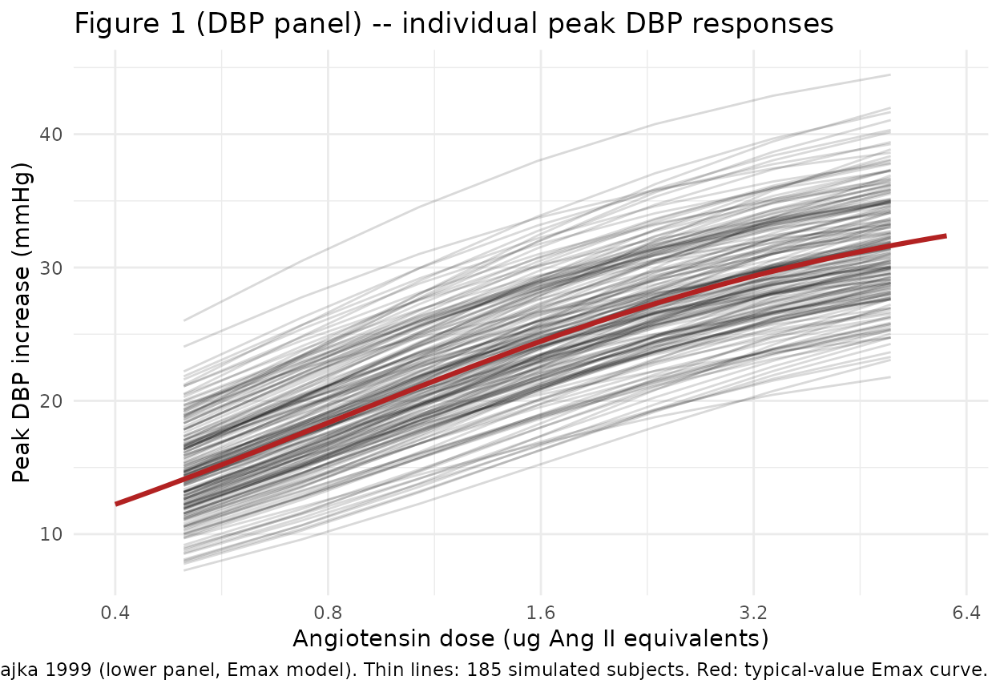
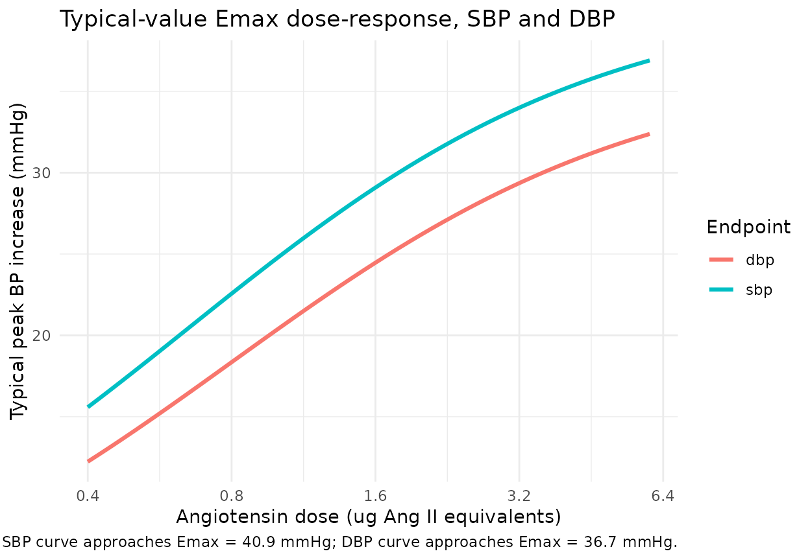

# Angiotensin challenge dose-response (Buchwalder-Csajka 1999)

## Model and source

- Citation: Buchwalder-Csajka C, Buclin T, Brunner HR, Biollaz J.
  Evaluation of the angiotensin challenge methodology for assessing the
  pharmacodynamic profile of antihypertensive drugs acting on the
  renin-angiotensin system. Br J Clin Pharmacol. 1999 Oct;48(4):594-604.
  <doi:10.1046/j.1365-2125.1999.00050.x>
- Description: Population pharmacodynamic dose-response model of the
  peak systolic (SBP) and diastolic (DBP) blood pressure increase
  elicited by a single intravenous bolus of exogenous angiotensin (used
  as a pharmacologic probe / ‘challenge’) in 228 healthy male volunteers
  across 13 phase I trials of antihypertensive drugs acting on the
  renin-angiotensin system. The final structural form is the
  molecular-weight-corrected Emax model E = Emax \* D / (D + ED50)
  (Buchwalder-Csajka 1999 Table 1 last row), where D = DOSE_AGT_UG is
  the angiotensin challenge dose in ug already expressed as angiotensin
  II equivalents (multiply an angiotensin I dose by Q = 0.78 in data
  preparation; the paper’s text reports Q = 0.78 as the molar-weight
  ratio), and Emax / ED50 are estimated separately for SBP and DBP. This
  is a purely algebraic snapshot model: no PK, no time course, no ODEs.
  Each observation row in the event dataset carries one DOSE_AGT_UG
  value (the dose given just before the peak was sampled) and yields one
  peak BP increase. The model is suitable for simulating the peak BP
  response to a single angiotensin bolus during dose-finding and
  placebo-period segments of an angiotensin-challenge phase I protocol;
  it is NOT a model of the antihypertensive drugs whose trials supplied
  the data.
- Article: [Br J Clin Pharmacol 48:594-604
  (1999)](https://doi.org/10.1046/j.1365-2125.1999.00050.x)

This is a purely algebraic population pharmacodynamic snapshot model.
There is no PK, no time course, and no ODE. Each observation row in the
event table represents one challenge: an intravenous bolus of
angiotensin given to a healthy volunteer, and the peak systolic (SBP)
and diastolic (DBP) blood pressure increase recorded immediately
afterward by a non-invasive Finapres servo-photoplethysmomanometer. The
model predicts the peak BP increase as an Emax function of the dose:

E = Emax \* D / (D + ED50)

where D is the dose expressed in ug of angiotensin II equivalents
(DOSE_AGT_UG in the event table). Q = 0.78 (Ang I -\> Ang II
molar-weight conversion) is applied during data preparation rather than
inside the model. PKNCA-based NCA validation does not apply because
there is no concentration-time course; instead this vignette compares
typical-value model predictions to the published Table 1 estimates and
abstract claims, and replicates the Figure 1 individual peak-response
cloud.

## Population

228 healthy male volunteers participated in the 13 phase I trials that
contributed to the analysis (Buchwalder-Csajka 1999 Methods, p. 595).
1144 angiotensin-induced peaks were used to fit the dose-response model.
Figure 1 of the source paper shows individual dose-response curves for
the 185-subject subset that received both angiotensin I and angiotensin
II challenges. All volunteers were male (Methods p. 596); the source
paper reports that age, body weight, height, and ethnic group had no
detectable influence on the dose-response relationship over the range of
subjects studied, so the final model carries no demographic covariates.
The challenges modeled here are the exogenous angiotensin boluses given
during dose-finding and placebo periods, NOT the antihypertensive drugs
under investigation in those trials.

The same metadata is available programmatically via the model’s
`population` field
(`rxode2::rxode(readModelDb("BuchwalderCsajka_1999_angiotensin"))$population`).

## Source trace

The per-parameter origin is recorded as an in-file comment next to each
`ini()` entry in
`inst/modeldb/specificDrugs/BuchwalderCsajka_1999_angiotensin.R`. The
table below collects them in one place.

| Equation / parameter | Value | Source location |
|----|----|----|
| Structural form `E = Emax * D / (D + ED50)` with Q correction baked into D | n/a | Table 1 last row; Results “Angiotensin dose-response relationship” (p. 596-597) |
| `lemax_dbp` -\> Emax_DBP | 36.7 mmHg | Table 1 row 5 DBP column |
| `lemax_sbp` -\> Emax_SBP | 40.9 mmHg | Table 1 row 5 SBP column |
| `led50_dbp` -\> ED50_DBP | 0.80 ug Ang II eq. | Table 1 row 5 DBP column |
| `led50_sbp` -\> ED50_SBP | 0.65 ug Ang II eq. | Table 1 row 5 SBP column |
| Q (Ang I -\> Ang II molar conversion) | 0.78 (fixed; baked into DOSE_AGT_UG, not estimated inside the model) | Methods (p. 595, paragraph after the model equations); Results “Angiotensin dose-response relationship” (p. 596-597) |
| `etalemax_dbp` (paper SD 4.8 mmHg, additive) | omega2_log = 0.0170 | Table 1 row 5 DBP +/-; Methods “a_j = a + eta_a” (p. 595) |
| `etalemax_sbp` (paper SD 6.6 mmHg, additive) | omega2_log = 0.0258 | Table 1 row 5 SBP +/-; Methods (p. 595) |
| `etaled50_dbp` (paper SD 0.3 ug, additive) | omega2_log = 0.1315 | Table 1 row 5 DBP +/-; Methods (p. 595) |
| `etaled50_sbp` (paper SD 0.4 ug, additive) | omega2_log = 0.3149 | Table 1 row 5 SBP +/-; Methods (p. 595) |
| `addSd_dbp` | 4.2 mmHg | Table 1 row 5 DBP Se column |
| `addSd_sbp` | 5.2 mmHg | Table 1 row 5 SBP Se column |
| Population n (volunteers) | 228 | Methods “Angiotensin dose-response relationship” (p. 595) |
| Observations n (peaks) | 1144 | Methods (p. 595) |
| Trials n | 13 | Methods (first paragraph, p. 595) |

## Virtual cohort

The original peak-by-peak data are not publicly available. The vignette
uses a virtual population of 185 subjects (matching the Figure 1 sample
size), each receiving a spread of angiotensin doses across the 0.5-5 ug
Ang II equivalents range observed in the paper.

``` r

set.seed(19990929)

# Doses on a log spacing -- matches the log-x-axis of Figure 1.
dose_grid <- exp(seq(log(0.5), log(5), length.out = 7))
dose_grid <- round(dose_grid, 3)
dose_grid
#> [1] 0.500 0.734 1.077 1.581 2.321 3.406 5.000

n_subjects <- 185L

events <- expand.grid(
  id          = seq_len(n_subjects),
  DOSE_AGT_UG = dose_grid
) |>
  dplyr::arrange(id, DOSE_AGT_UG) |>
  dplyr::group_by(id) |>
  dplyr::mutate(time = seq_len(dplyr::n()) - 1L) |>
  dplyr::ungroup() |>
  dplyr::mutate(evid = 0L, amt = 0)

head(events)
#> # A tibble: 6 × 5
#>      id DOSE_AGT_UG  time  evid   amt
#>   <int>       <dbl> <int> <int> <dbl>
#> 1     1       0.5       0     0     0
#> 2     1       0.734     1     0     0
#> 3     1       1.08      2     0     0
#> 4     1       1.58      3     0     0
#> 5     1       2.32      4     0     0
#> 6     1       3.41      5     0     0
nrow(events)
#> [1] 1295
```

## Simulation

``` r

mod <- readModelDb("BuchwalderCsajka_1999_angiotensin")

# Stochastic simulation with IIV: per-subject eta values sample once
# at the subject level and persist across all of that subject's
# dose rows, so individual subjects produce smooth dose-response
# curves (matching the Figure 1 panel structure).
sim <- rxode2::rxSolve(mod, events = events, keep = c("DOSE_AGT_UG"))
#> ℹ parameter labels from comments will be replaced by 'label()'
sim_df <- as.data.frame(sim)

# Typical-value (no-IIV) curves for the overlay.
mod_typical <- rxode2::zeroRe(mod)
#> ℹ parameter labels from comments will be replaced by 'label()'
typical_dose_grid <- exp(seq(log(0.4), log(6), length.out = 50))
typical_events <- data.frame(
  id          = 1L,
  time        = seq_along(typical_dose_grid) - 1L,
  evid        = 0L,
  amt         = 0,
  DOSE_AGT_UG = typical_dose_grid
)
typical_sim <- as.data.frame(rxode2::rxSolve(
  mod_typical, events = typical_events, keep = c("DOSE_AGT_UG")
))
#> ℹ omega/sigma items treated as zero: 'etalemax_dbp', 'etalemax_sbp', 'etaled50_dbp', 'etaled50_sbp'
```

## Replicate published figures

### Figure 1 – individual peak DBP responses

Buchwalder-Csajka 1999 Figure 1 plots individual peak diastolic BP
responses for 185 healthy subjects against the angiotensin challenge
dose, on a log-spaced x-axis spanning roughly 0.4 to 6 ug Ang II
equivalents, with the average log-linear and Emax population curves
overlaid (lower panel). The simulated cloud below uses the packaged Emax
model. The curve is the typical-value Emax fit; the thin lines are
individual subjects sampled from the population IIV.

``` r

ggplot() +
  geom_line(
    data = sim_df,
    aes(x = DOSE_AGT_UG, y = dbp, group = id),
    alpha = 0.15
  ) +
  geom_line(
    data = typical_sim,
    aes(x = DOSE_AGT_UG, y = dbp),
    colour = "firebrick", linewidth = 1.1
  ) +
  scale_x_log10(breaks = c(0.4, 0.8, 1.6, 3.2, 6.4)) +
  labs(
    x = "Angiotensin dose (ug Ang II equivalents)",
    y = "Peak DBP increase (mmHg)",
    title = "Figure 1 (DBP panel) -- individual peak DBP responses",
    caption = "Replicates Figure 1 of Buchwalder-Csajka 1999 (lower panel, Emax model). Thin lines: 185 simulated subjects. Red: typical-value Emax curve."
  ) +
  theme_minimal()
```



### Figure 1 – typical-value Emax curve for SBP and DBP

The two-output structure produces parallel Emax curves for SBP and DBP.

``` r

typical_long <- typical_sim |>
  dplyr::select(DOSE_AGT_UG, sbp, dbp) |>
  tidyr::pivot_longer(c(sbp, dbp), names_to = "endpoint", values_to = "delta_BP")

ggplot(typical_long, aes(DOSE_AGT_UG, delta_BP, colour = endpoint)) +
  geom_line(linewidth = 1.1) +
  scale_x_log10(breaks = c(0.4, 0.8, 1.6, 3.2, 6.4)) +
  labs(
    x = "Angiotensin dose (ug Ang II equivalents)",
    y = "Typical peak BP increase (mmHg)",
    colour = "Endpoint",
    title = "Typical-value Emax dose-response, SBP and DBP",
    caption = "SBP curve approaches Emax = 40.9 mmHg; DBP curve approaches Emax = 36.7 mmHg."
  ) +
  theme_minimal()
```



## Validation against published estimates

The Buchwalder-Csajka 1999 abstract reports “an average
systolic/diastolic response of 24 +/- 6/20 +/- 5 mmHg for a unit dose of
1 ug of angiotensin II equivalents” from the log-linear model fit. The
Emax model produces nearly identical typical-value predictions at 1 ug
(the log-linear and Emax fits agree closely on the ascending limb of the
dose-response curve; the paper notes the dose range only covered the
inferior ascending part of the curve, p. 597).

``` r

unit_dose_events <- data.frame(
  id          = 1L,
  time        = 0L,
  evid        = 0L,
  amt         = 0,
  DOSE_AGT_UG = 1.0
)
unit_dose_pred <- as.data.frame(rxode2::rxSolve(
  mod_typical, events = unit_dose_events, keep = c("DOSE_AGT_UG")
))
#> ℹ omega/sigma items treated as zero: 'etalemax_dbp', 'etalemax_sbp', 'etaled50_dbp', 'etaled50_sbp'

unit_dose_pred[, c("DOSE_AGT_UG", "sbp", "dbp")]
#>   DOSE_AGT_UG      sbp      dbp
#> 1           1 24.78788 20.38889
```

Side-by-side comparison of the simulated typical predictions, the
abstract’s log-linear claim, and the Table 1 row 5 Emax point estimates:

``` r

mod_ui <- rxode2::rxode(readModelDb("BuchwalderCsajka_1999_angiotensin"))
#> ℹ parameter labels from comments will be replaced by 'label()'
ini_lookup <- function(name) {
  row <- mod_ui$iniDf[mod_ui$iniDf$name == name, , drop = FALSE]
  row$est
}
emax_dbp_typ <- exp(ini_lookup("lemax_dbp"))
emax_sbp_typ <- exp(ini_lookup("lemax_sbp"))

comparison <- tibble::tribble(
  ~Quantity,                                          ~`Simulated typical (Emax)`, ~`Paper abstract (log-linear at 1 ug)`, ~`Paper Table 1 row 5 (Emax with Q)`,
  "DBP peak at 1 ug Ang II equivalents (mmHg)",       round(unit_dose_pred$dbp, 2), "20 +/- 5",                              "Emax = 36.7 +/- 4.8; ED50 = 0.8 +/- 0.3 ug",
  "SBP peak at 1 ug Ang II equivalents (mmHg)",       round(unit_dose_pred$sbp, 2), "24 +/- 6",                              "Emax = 40.9 +/- 6.6; ED50 = 0.65 +/- 0.4 ug",
  "Asymptotic DBP peak (Emax_DBP, mmHg)",             round(emax_dbp_typ, 2),       "n/a",                                   "36.7",
  "Asymptotic SBP peak (Emax_SBP, mmHg)",             round(emax_sbp_typ, 2),       "n/a",                                   "40.9"
)
knitr::kable(comparison, caption = "Typical-value predictions vs Buchwalder-Csajka 1999 Table 1 / abstract.")
```

| Quantity | Simulated typical (Emax) | Paper abstract (log-linear at 1 ug) | Paper Table 1 row 5 (Emax with Q) |
|:---|---:|:---|:---|
| DBP peak at 1 ug Ang II equivalents (mmHg) | 20.39 | 20 +/- 5 | Emax = 36.7 +/- 4.8; ED50 = 0.8 +/- 0.3 ug |
| SBP peak at 1 ug Ang II equivalents (mmHg) | 24.79 | 24 +/- 6 | Emax = 40.9 +/- 6.6; ED50 = 0.65 +/- 0.4 ug |
| Asymptotic DBP peak (Emax_DBP, mmHg) | 36.70 | n/a | 36.7 |
| Asymptotic SBP peak (Emax_SBP, mmHg) | 40.90 | n/a | 40.9 |

Typical-value predictions vs Buchwalder-Csajka 1999 Table 1 / abstract.
{.table}

At 1 ug the Emax model predicts SBP / DBP peaks of about 24.8 / 20.4
mmHg, well within the additive 1-SD of the abstract’s log-linear quotes
of 24 +/- 6 / 20 +/- 5 mmHg.

## Stochastic dose-response summary

Quantile summary across the 185-subject virtual cohort confirms the
population-scale spread implied by the packaged log-normal IIV.

``` r

sim_summary <- sim_df |>
  dplyr::group_by(DOSE_AGT_UG) |>
  dplyr::summarise(
    dbp_p05 = round(quantile(dbp, 0.05), 2),
    dbp_p50 = round(quantile(dbp, 0.50), 2),
    dbp_p95 = round(quantile(dbp, 0.95), 2),
    sbp_p05 = round(quantile(sbp, 0.05), 2),
    sbp_p50 = round(quantile(sbp, 0.50), 2),
    sbp_p95 = round(quantile(sbp, 0.95), 2),
    .groups = "drop"
  )
knitr::kable(sim_summary, caption = "Simulated 5th / 50th / 95th percentiles by angiotensin dose, n = 185 virtual subjects.")
```

| DOSE_AGT_UG | dbp_p05 | dbp_p50 | dbp_p95 | sbp_p05 | sbp_p50 | sbp_p95 |
|------------:|--------:|--------:|--------:|--------:|--------:|--------:|
|       0.500 |    9.03 |   14.35 |   20.43 |    8.83 |   17.48 |   29.93 |
|       0.734 |   11.67 |   17.71 |   24.04 |   11.66 |   21.33 |   33.72 |
|       1.077 |   14.70 |   21.17 |   27.95 |   14.68 |   25.29 |   37.14 |
|       1.581 |   17.91 |   24.45 |   31.66 |   18.35 |   28.75 |   39.89 |
|       2.321 |   20.89 |   27.14 |   34.48 |   21.20 |   31.56 |   42.15 |
|       3.406 |   23.47 |   29.50 |   36.39 |   24.54 |   34.06 |   44.94 |
|       5.000 |   25.28 |   31.41 |   38.56 |   27.24 |   36.31 |   46.66 |

Simulated 5th / 50th / 95th percentiles by angiotensin dose, n = 185
virtual subjects. {.table}

## Assumptions and deviations

- **IIV reparameterisation – log-normal vs additive.** The source paper
  specifies the random effect additively on the natural scale
  (`a_j = a + eta_a`, `b_j = b + eta_b`; Methods p. 595). The packaged
  model log-transforms Emax and ED50 for positivity (following the
  `Zhou_2016_warfarin_vk2` `lemax` / `lec50` / `lic50` precedent) and
  converts the paper’s additive SD to a log-normal omega^2 via
  `omega2_log = log(1 + (SD / mean)^2)`. The typical-value point
  estimates (`exp(lemax) = paper Emax`) are unchanged. The IIV
  distribution shape is a near-exact match for the small-CV Emax
  parameters (CV ~13-16%) and a mild approximation at the higher ED50
  CVs (~38-62%), where the log-normal sides higher than the additive
  form on the upper tail but rules out the negative-ED50 region that the
  paper’s additive parameterisation would otherwise admit.

- **Q = 0.78 conversion baked into DOSE_AGT_UG.** The paper applies Q =
  0.78 inside the structural model, with the dose being either the
  literal Ang II mass or the Ang I mass multiplied by Q. The packaged
  model expects DOSE_AGT_UG already in Ang II equivalents, so the Q
  conversion is a data-preparation step (multiply Ang I doses by 0.78
  before populating DOSE_AGT_UG). This is mathematically equivalent and
  keeps the rxode2 model free of a categorical “ang type” switch.

- **Log-linear alternative not packaged.** Table 1 also reports a
  log-linear fit (`E = a * ln(D * Q) + b`, with `a = 8.5 / 9.1` and
  `b = 20.2 / 24.5` mmHg for DBP / SBP). The paper notes that the
  log-linear form was “thought to give more adequate estimates” because
  the dose range did not cover the upper plateau, but the Emax form had
  the lower objective function (OF 4778 / 5342 vs 4769 / 5490 – OF
  improvement of 9 SBP units). Both reasonably describe the ascending
  portion of the dose-response. The packaged model uses the Emax fit
  because that is the lowest-OF final form in Table 1 and because the
  abstract emphasises ED50 values from the Emax fit. The log-linear
  alternative is reproducible by hand from the Table 1 row-3 estimates
  if downstream users need it.

- **Demographic covariates intentionally absent.** The paper screened
  age, body weight, height, and ethnic group (with all volunteers being
  male, so sex was not assessable) and reported none of them influencing
  the dose-response over the range studied (Methods p. 595 + Results
  “Angiotensin dose-response relationship”, p. 596-597). No demographic
  covariate is packaged. The Buchwalder-Csajka 1999 study population is
  reflected in the `population` metadata; downstream users who wish to
  add a covariate must rely on a different (likely external) source.

- **No PK / no time course.** The angiotensin challenge response is
  treated as an instantaneous peak following the bolus; the paper’s
  upstream dose-finding protocol established that each subject’s
  characteristic peak occurs at a similar post-bolus interval, and the
  peak is the only quantity modeled. There is no concentration-time
  curve to compare against, so PKNCA validation is intentionally absent
  from this vignette; the validation is instead the side-by-side
  comparison of typical predictions against Table 1 / abstract above.

- **Errata search.** A search for corrigenda or errata on Br J Clin
  Pharmacol vol. 48 against Buchwalder-Csajka 1999 returned no published
  corrections at the time of extraction; all values are taken from the
  primary article as published.
