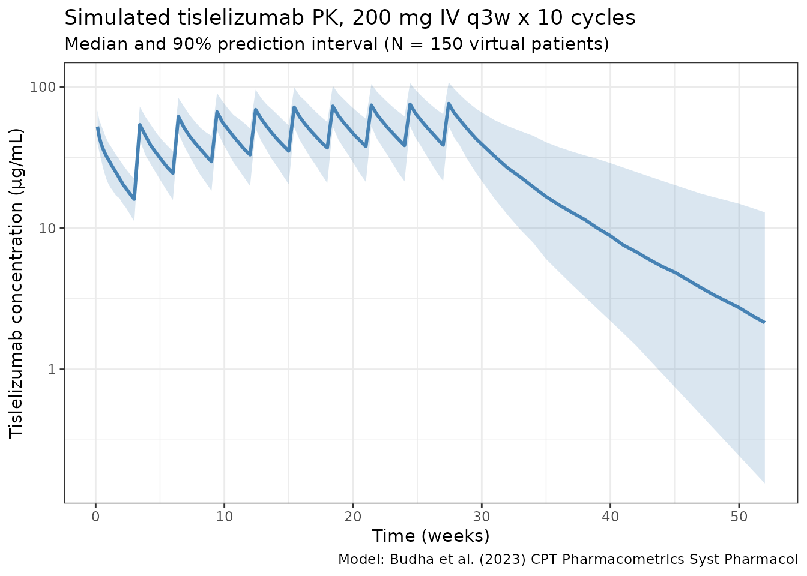
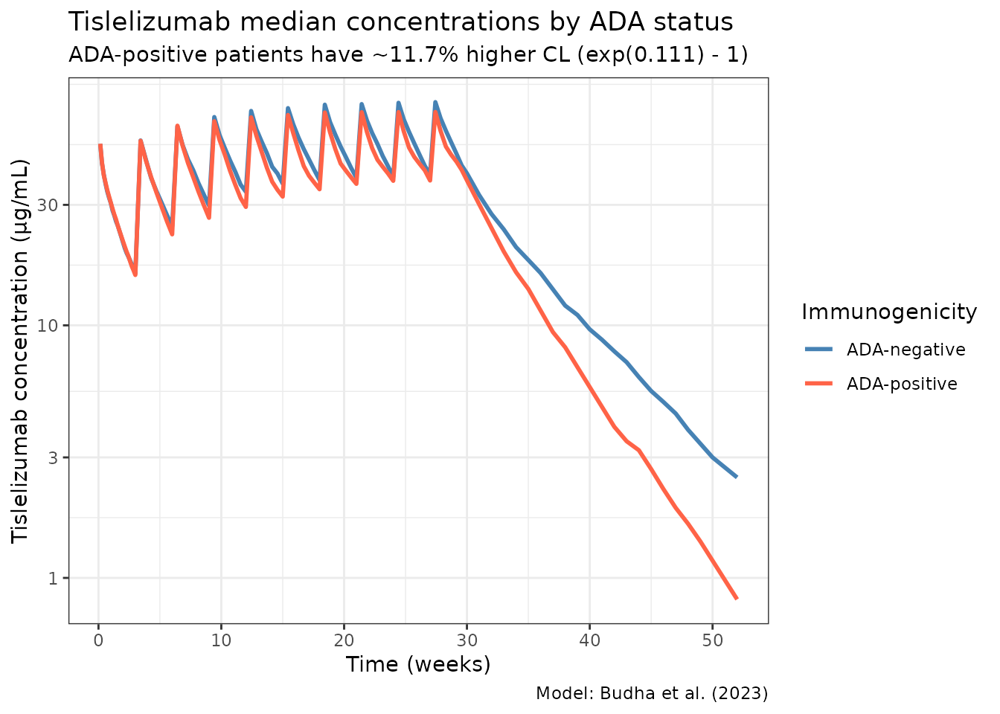

# Budha_2023_tislelizumab

``` r
library(nlmixr2lib)
library(rxode2)
#> rxode2 5.0.2 using 2 threads (see ?getRxThreads)
#>   no cache: create with `rxCreateCache()`
library(dplyr)
#> 
#> Attaching package: 'dplyr'
#> The following objects are masked from 'package:stats':
#> 
#>     filter, lag
#> The following objects are masked from 'package:base':
#> 
#>     intersect, setdiff, setequal, union
library(tidyr)
library(ggplot2)
library(PKNCA)
#> 
#> Attaching package: 'PKNCA'
#> The following object is masked from 'package:stats':
#> 
#>     filter
```

## Tislelizumab population PK simulation

Simulate tislelizumab (anti-PD-1 IgG4) concentration-time profiles using
the final three-compartment population PK model from Budha et
al. (2023). The pooled analysis included 2596 patients with advanced
tumors from 12 studies (14,473 serum concentration observations).

The structural model is a three-compartment IV model with linear
elimination. Final covariates: body weight, albumin, baseline tumor
size, ADA status, and tumor-type indicators for classical Hodgkin
lymphoma and gastric cancer on CL; and body weight, age, and sex on Vc.
Tislelizumab PK were linear across the 0.5–10 mg/kg dose range, and the
approved dose is 200 mg IV every 3 weeks.

### Source trace

| Element                | Source location                      | Value / form                                                  |
|------------------------|--------------------------------------|---------------------------------------------------------------|
| CL, Vc, Q2, V2, Q3, V3 | Budha 2023 Table 3                   | 0.153 L/day, 3.05 L, 0.740 L/day, 1.27 L, 0.092 L/day, 2.10 L |
| WT on CL               | Budha 2023 Eq. 5 / Table 3 (theta7)  | Power: (WT/65)^0.565                                          |
| ALB on CL              | Budha 2023 Eq. 5 / Table 3 (theta10) | Power: (ALB/41)^-0.457                                        |
| TUMSZ on CL            | Budha 2023 Eq. 5 / Table 3 (theta11) | Power: (TUMSZ/63)^0.0735                                      |
| ADA on CL              | Budha 2023 Eq. 5 / Table 3 (theta13) | Exponential: exp(0.111 \* ADA_POS)                            |
| TUMTP=GC on CL         | Budha 2023 Eq. 5 / Table 3 (theta14) | Exponential: exp(0.069 \* TUMTP_GC)                           |
| TUMTP=cHL on CL        | Budha 2023 Eq. 5 / Table 3 (theta15) | Exponential: exp(-0.216 \* TUMTP_CHL)                         |
| WT on Vc               | Budha 2023 Eq. 6 / Table 3 (theta8)  | Power: (WT/65)^0.397                                          |
| SEX on Vc              | Budha 2023 Eq. 6 / Table 3 (theta9)  | Exponential: exp(-0.116 \* SEXF)                              |
| AGE on Vc              | Budha 2023 Eq. 6 / Table 3 (theta12) | Power: (AGE/60)^0.0966                                        |
| IIV CL / Vc            | Budha 2023 Table 3                   | 26.3% / 16.7% CV, covariance 0.020 (log-scale)                |
| IIV V2, V3             | Budha 2023 Table 3                   | 74.7% CV (shrinkage 55.8%), 99.9% CV (shrinkage 44.4%)        |
| Residual error         | Budha 2023 Table 3                   | Proportional 12.6%, additive 2.09 μg/mL                       |
| Reference dose         | Budha 2023 Methods; label            | 200 mg IV q3w (flat)                                          |

### Covariate column naming

| Source column                            | Canonical column used here                                                          |
|------------------------------------------|-------------------------------------------------------------------------------------|
| `SEX` (character “Female” / “Male”)      | `SEXF` (1 = female, 0 = male)                                                       |
| `ADA` (Positive / Negative)              | `ADA_POS` (1 = ADA-positive, 0 = negative)                                          |
| `TUMTP` (categorical: cHL, GC, NSCLC, …) | split into `TUMTP_CHL` and `TUMTP_GC` indicators; reference = all other tumor types |
| `TUMSZ`                                  | `TUMSZ` (baseline tumor size, mm)                                                   |

See `inst/references/covariate-columns.md` for the canonical register.

### Virtual population

Approximate the Budha 2023 Table 2 distributions for the pooled
2596-patient cohort (medians and ranges only — the paper does not
publish individual covariates or covariate correlations).

``` r
set.seed(2023)
n_subj <- 500

# Weight and age: log-normal / normal fits to reported medians and ranges
WT  <- pmin(pmax(rlnorm(n_subj, log(65), 0.20), 31.9), 130)
AGE <- pmin(pmax(rnorm(n_subj, 60, 12), 18), 90)

# Albumin (g/L): normal around median, clipped to observed range
ALB <- pmin(pmax(rnorm(n_subj, 41, 5), 17), 61.3)

# Tumor size (mm): log-normal around median 63.3, clipped to observed range
TUMSZ <- pmin(pmax(rlnorm(n_subj, log(63), 0.75), 10), 408)

# Sex: 26.0% female
SEXF <- rbinom(n_subj, 1, 0.26)

# ADA: 16.6% positive (of the 98.9% non-missing; treat missing as negative here)
ADA_POS <- rbinom(n_subj, 1, 0.166)

# Tumor type: sample from Table 2 proportions; only cHL and GC get indicators
tumtp_p <- c(
  cHL   = 0.027,
  CRC   = 0.031,
  EC    = 0.144,
  GC    = 0.039,
  HCC   = 0.122,
  NPC   = 0.008,
  NSCLC = 0.443,
  OC    = 0.020,
  UC    = 0.058,
  Other = 0.108
)
TUMTP <- sample(names(tumtp_p), n_subj, replace = TRUE, prob = tumtp_p)
TUMTP_CHL <- as.integer(TUMTP == "cHL")
TUMTP_GC  <- as.integer(TUMTP == "GC")

pop <- data.frame(
  ID        = seq_len(n_subj),
  WT, AGE, ALB, TUMSZ,
  SEXF, ADA_POS,
  TUMTP, TUMTP_CHL, TUMTP_GC
)
```

### Dosing dataset

Approved flat regimen: 200 mg IV q3w. Simulate 10 cycles (≈ 30 weeks)
followed by an observation tail to capture terminal disposition.

``` r
cycle_days <- 21
n_cycles   <- 10
dose_times <- seq(0, (n_cycles - 1) * cycle_days, by = cycle_days)

obs_times <- sort(unique(c(
  seq(0, 21, by = 0.5),                     # intensive profile through cycle 1
  seq(21, n_cycles * cycle_days, by = 3),   # pre/post dose through multi-dose
  seq(n_cycles * cycle_days, 365, by = 7)   # washout tail
)))

d_dose <- pop |>
  tidyr::crossing(TIME = dose_times) |>
  dplyr::mutate(
    AMT  = 200,          # flat 200 mg
    EVID = 1,
    CMT  = "central",
    DUR  = 30 / (60 * 24), # 30-minute IV infusion in days
    DV   = NA_real_
  )

d_obs <- pop |>
  tidyr::crossing(TIME = obs_times) |>
  dplyr::mutate(
    AMT  = NA_real_,
    EVID = 0,
    CMT  = "central",
    DUR  = NA_real_,
    DV   = NA_real_
  )

d_sim <- dplyr::bind_rows(d_dose, d_obs) |>
  dplyr::arrange(ID, TIME, dplyr::desc(EVID)) |>
  as.data.frame()
```

### Simulate

``` r
mod <- readModelDb("Budha_2023_tislelizumab")
set.seed(20230331)
sim <- rxSolve(mod, d_sim, returnType = "data.frame")
#> ℹ parameter labels from comments will be replaced by 'label()'
```

### Concentration-time profile

``` r
sim_summary <- sim |>
  dplyr::filter(time > 0) |>
  dplyr::group_by(time) |>
  dplyr::summarise(
    median = median(Cc, na.rm = TRUE),
    lo     = quantile(Cc, 0.05, na.rm = TRUE),
    hi     = quantile(Cc, 0.95, na.rm = TRUE),
    .groups = "drop"
  )

ggplot(sim_summary, aes(x = time / 7)) +
  geom_ribbon(aes(ymin = lo, ymax = hi), alpha = 0.2, fill = "steelblue") +
  geom_line(aes(y = median), color = "steelblue", linewidth = 1) +
  scale_y_log10() +
  labs(
    x = "Time (weeks)",
    y = "Tislelizumab concentration (\u03bcg/mL)",
    title = "Simulated tislelizumab PK, 200 mg IV q3w x 10 cycles",
    subtitle = "Median and 90% prediction interval (N = 500 virtual patients)",
    caption = "Model: Budha et al. (2023) CPT Pharmacometrics Syst Pharmacol"
  ) +
  theme_bw()
```



### Effect of ADA status on PK

``` r
sim_ada <- sim |>
  dplyr::filter(time > 0) |>
  dplyr::mutate(ADA_label = ifelse(ADA_POS == 1, "ADA-positive", "ADA-negative")) |>
  dplyr::group_by(time, ADA_label) |>
  dplyr::summarise(median = median(Cc, na.rm = TRUE), .groups = "drop")

ggplot(sim_ada, aes(x = time / 7, y = median, color = ADA_label)) +
  geom_line(linewidth = 1) +
  scale_y_log10() +
  scale_color_manual(values = c("ADA-negative" = "steelblue", "ADA-positive" = "tomato")) +
  labs(
    x = "Time (weeks)",
    y = "Tislelizumab concentration (\u03bcg/mL)",
    title = "Tislelizumab median concentrations by ADA status",
    subtitle = "ADA-positive patients have ~11.7% higher CL (exp(0.111) - 1)",
    color = "Immunogenicity",
    caption = "Model: Budha et al. (2023)"
  ) +
  theme_bw()
```



### NCA validation

Run PKNCA on the first dosing interval (day 0–21) and a
pseudo-steady-state interval (cycle 10, days 189–210), stratified by ADA
status. Terminal half-life is expected to approximate the paper’s
reported ≈ 23.8 days (Budha 2023 Methods) in the ADA-negative arm.

``` r
# Per-subject treatment grouping for PKNCA
pop$treatment <- ifelse(pop$ADA_POS == 1, "ADA-positive", "ADA-negative")

# Cycle 1 interval
conc1 <- sim |>
  dplyr::filter(time >= 0, time <= 21, Cc > 0) |>
  dplyr::rename(ID = id) |>
  dplyr::left_join(dplyr::select(pop, ID, treatment), by = "ID") |>
  dplyr::transmute(ID, time_rel = time, Cc, treatment, interval = "Cycle 1")

dose1 <- pop |>
  dplyr::transmute(ID, time_rel = 0, AMT = 200, treatment, interval = "Cycle 1")

conc_obj <- PKNCAconc(conc1, Cc ~ time_rel | treatment + ID)
dose_obj <- PKNCAdose(dose1, AMT ~ time_rel | treatment + ID)
nca_data <- PKNCAdata(
  conc_obj, dose_obj,
  intervals = data.frame(
    start     = 0,
    end       = 21,
    cmax      = TRUE,
    tmax      = TRUE,
    auclast   = TRUE,
    half.life = TRUE
  )
)
nca_results <- pk.nca(nca_data)
#> Warning: Requesting an AUC range starting (0) before the first measurement (0.5) is not allowed
#> Requesting an AUC range starting (0) before the first measurement (0.5) is not allowed
#> Requesting an AUC range starting (0) before the first measurement (0.5) is not allowed
#> Requesting an AUC range starting (0) before the first measurement (0.5) is not allowed
#> Requesting an AUC range starting (0) before the first measurement (0.5) is not allowed
#> Requesting an AUC range starting (0) before the first measurement (0.5) is not allowed
#> Requesting an AUC range starting (0) before the first measurement (0.5) is not allowed
#> Requesting an AUC range starting (0) before the first measurement (0.5) is not allowed
#> Requesting an AUC range starting (0) before the first measurement (0.5) is not allowed
#> Requesting an AUC range starting (0) before the first measurement (0.5) is not allowed
#> Requesting an AUC range starting (0) before the first measurement (0.5) is not allowed
#> Requesting an AUC range starting (0) before the first measurement (0.5) is not allowed
#> Requesting an AUC range starting (0) before the first measurement (0.5) is not allowed
#> Requesting an AUC range starting (0) before the first measurement (0.5) is not allowed
#> Requesting an AUC range starting (0) before the first measurement (0.5) is not allowed
#> Requesting an AUC range starting (0) before the first measurement (0.5) is not allowed
#> Requesting an AUC range starting (0) before the first measurement (0.5) is not allowed
#> Requesting an AUC range starting (0) before the first measurement (0.5) is not allowed
#> Requesting an AUC range starting (0) before the first measurement (0.5) is not allowed
#> Requesting an AUC range starting (0) before the first measurement (0.5) is not allowed
#> Requesting an AUC range starting (0) before the first measurement (0.5) is not allowed
#> Requesting an AUC range starting (0) before the first measurement (0.5) is not allowed
#> Requesting an AUC range starting (0) before the first measurement (0.5) is not allowed
#>  ■■                                 5% |  ETA: 21s
#> Warning: Requesting an AUC range starting (0) before the first measurement (0.5) is not allowed
#> Requesting an AUC range starting (0) before the first measurement (0.5) is not allowed
#> Requesting an AUC range starting (0) before the first measurement (0.5) is not allowed
#> Requesting an AUC range starting (0) before the first measurement (0.5) is not allowed
#> Requesting an AUC range starting (0) before the first measurement (0.5) is not allowed
#> Requesting an AUC range starting (0) before the first measurement (0.5) is not allowed
#> Requesting an AUC range starting (0) before the first measurement (0.5) is not allowed
#> Requesting an AUC range starting (0) before the first measurement (0.5) is not allowed
#> Requesting an AUC range starting (0) before the first measurement (0.5) is not allowed
#> Requesting an AUC range starting (0) before the first measurement (0.5) is not allowed
#> Requesting an AUC range starting (0) before the first measurement (0.5) is not allowed
#> Requesting an AUC range starting (0) before the first measurement (0.5) is not allowed
#> Requesting an AUC range starting (0) before the first measurement (0.5) is not allowed
#> Requesting an AUC range starting (0) before the first measurement (0.5) is not allowed
#> Requesting an AUC range starting (0) before the first measurement (0.5) is not allowed
#> Requesting an AUC range starting (0) before the first measurement (0.5) is not allowed
#> Requesting an AUC range starting (0) before the first measurement (0.5) is not allowed
#> Requesting an AUC range starting (0) before the first measurement (0.5) is not allowed
#> Requesting an AUC range starting (0) before the first measurement (0.5) is not allowed
#> Requesting an AUC range starting (0) before the first measurement (0.5) is not allowed
#> Requesting an AUC range starting (0) before the first measurement (0.5) is not allowed
#> Requesting an AUC range starting (0) before the first measurement (0.5) is not allowed
#> Requesting an AUC range starting (0) before the first measurement (0.5) is not allowed
#> Requesting an AUC range starting (0) before the first measurement (0.5) is not allowed
#> Requesting an AUC range starting (0) before the first measurement (0.5) is not allowed
#> Requesting an AUC range starting (0) before the first measurement (0.5) is not allowed
#> Requesting an AUC range starting (0) before the first measurement (0.5) is not allowed
#> Requesting an AUC range starting (0) before the first measurement (0.5) is not allowed
#> Requesting an AUC range starting (0) before the first measurement (0.5) is not allowed
#> Requesting an AUC range starting (0) before the first measurement (0.5) is not allowed
#> Requesting an AUC range starting (0) before the first measurement (0.5) is not allowed
#> Requesting an AUC range starting (0) before the first measurement (0.5) is not allowed
#> Requesting an AUC range starting (0) before the first measurement (0.5) is not allowed
#> Requesting an AUC range starting (0) before the first measurement (0.5) is not allowed
#> Requesting an AUC range starting (0) before the first measurement (0.5) is not allowed
#> Requesting an AUC range starting (0) before the first measurement (0.5) is not allowed
#> Requesting an AUC range starting (0) before the first measurement (0.5) is not allowed
#> Requesting an AUC range starting (0) before the first measurement (0.5) is not allowed
#> Requesting an AUC range starting (0) before the first measurement (0.5) is not allowed
#> Requesting an AUC range starting (0) before the first measurement (0.5) is not allowed
#> Requesting an AUC range starting (0) before the first measurement (0.5) is not allowed
#> Requesting an AUC range starting (0) before the first measurement (0.5) is not allowed
#> Requesting an AUC range starting (0) before the first measurement (0.5) is not allowed
#> Requesting an AUC range starting (0) before the first measurement (0.5) is not allowed
#> Requesting an AUC range starting (0) before the first measurement (0.5) is not allowed
#> Requesting an AUC range starting (0) before the first measurement (0.5) is not allowed
#> Requesting an AUC range starting (0) before the first measurement (0.5) is not allowed
#> Requesting an AUC range starting (0) before the first measurement (0.5) is not allowed
#> Requesting an AUC range starting (0) before the first measurement (0.5) is not allowed
#> Requesting an AUC range starting (0) before the first measurement (0.5) is not allowed
#> Requesting an AUC range starting (0) before the first measurement (0.5) is not allowed
#> Requesting an AUC range starting (0) before the first measurement (0.5) is not allowed
#> Requesting an AUC range starting (0) before the first measurement (0.5) is not allowed
#> Requesting an AUC range starting (0) before the first measurement (0.5) is not allowed
#> Requesting an AUC range starting (0) before the first measurement (0.5) is not allowed
#> Requesting an AUC range starting (0) before the first measurement (0.5) is not allowed
#> Requesting an AUC range starting (0) before the first measurement (0.5) is not allowed
#> Requesting an AUC range starting (0) before the first measurement (0.5) is not allowed
#> Requesting an AUC range starting (0) before the first measurement (0.5) is not allowed
#> Requesting an AUC range starting (0) before the first measurement (0.5) is not allowed
#> Requesting an AUC range starting (0) before the first measurement (0.5) is not allowed
#> Requesting an AUC range starting (0) before the first measurement (0.5) is not allowed
#> Requesting an AUC range starting (0) before the first measurement (0.5) is not allowed
#> Requesting an AUC range starting (0) before the first measurement (0.5) is not allowed
#> Requesting an AUC range starting (0) before the first measurement (0.5) is not allowed
#> Requesting an AUC range starting (0) before the first measurement (0.5) is not allowed
#> Requesting an AUC range starting (0) before the first measurement (0.5) is not allowed
#> Requesting an AUC range starting (0) before the first measurement (0.5) is not allowed
#> Requesting an AUC range starting (0) before the first measurement (0.5) is not allowed
#> Requesting an AUC range starting (0) before the first measurement (0.5) is not allowed
#> Requesting an AUC range starting (0) before the first measurement (0.5) is not allowed
#> Requesting an AUC range starting (0) before the first measurement (0.5) is not allowed
#> Requesting an AUC range starting (0) before the first measurement (0.5) is not allowed
#> Requesting an AUC range starting (0) before the first measurement (0.5) is not allowed
#> Requesting an AUC range starting (0) before the first measurement (0.5) is not allowed
#> Requesting an AUC range starting (0) before the first measurement (0.5) is not allowed
#> Requesting an AUC range starting (0) before the first measurement (0.5) is not allowed
#> Requesting an AUC range starting (0) before the first measurement (0.5) is not allowed
#> Requesting an AUC range starting (0) before the first measurement (0.5) is not allowed
#> Requesting an AUC range starting (0) before the first measurement (0.5) is not allowed
#> Requesting an AUC range starting (0) before the first measurement (0.5) is not allowed
#> Requesting an AUC range starting (0) before the first measurement (0.5) is not allowed
#>  ■■■■■■■                           21% |  ETA: 15s
#> Warning: Requesting an AUC range starting (0) before the first measurement (0.5) is not allowed
#> Requesting an AUC range starting (0) before the first measurement (0.5) is not allowed
#> Requesting an AUC range starting (0) before the first measurement (0.5) is not allowed
#> Requesting an AUC range starting (0) before the first measurement (0.5) is not allowed
#> Requesting an AUC range starting (0) before the first measurement (0.5) is not allowed
#> Requesting an AUC range starting (0) before the first measurement (0.5) is not allowed
#> Requesting an AUC range starting (0) before the first measurement (0.5) is not allowed
#> Requesting an AUC range starting (0) before the first measurement (0.5) is not allowed
#> Requesting an AUC range starting (0) before the first measurement (0.5) is not allowed
#> Requesting an AUC range starting (0) before the first measurement (0.5) is not allowed
#> Requesting an AUC range starting (0) before the first measurement (0.5) is not allowed
#> Requesting an AUC range starting (0) before the first measurement (0.5) is not allowed
#> Requesting an AUC range starting (0) before the first measurement (0.5) is not allowed
#> Requesting an AUC range starting (0) before the first measurement (0.5) is not allowed
#> Requesting an AUC range starting (0) before the first measurement (0.5) is not allowed
#> Requesting an AUC range starting (0) before the first measurement (0.5) is not allowed
#> Requesting an AUC range starting (0) before the first measurement (0.5) is not allowed
#> Requesting an AUC range starting (0) before the first measurement (0.5) is not allowed
#> Requesting an AUC range starting (0) before the first measurement (0.5) is not allowed
#> Requesting an AUC range starting (0) before the first measurement (0.5) is not allowed
#> Requesting an AUC range starting (0) before the first measurement (0.5) is not allowed
#> Requesting an AUC range starting (0) before the first measurement (0.5) is not allowed
#> Requesting an AUC range starting (0) before the first measurement (0.5) is not allowed
#> Requesting an AUC range starting (0) before the first measurement (0.5) is not allowed
#> Requesting an AUC range starting (0) before the first measurement (0.5) is not allowed
#> Requesting an AUC range starting (0) before the first measurement (0.5) is not allowed
#> Requesting an AUC range starting (0) before the first measurement (0.5) is not allowed
#> Requesting an AUC range starting (0) before the first measurement (0.5) is not allowed
#> Requesting an AUC range starting (0) before the first measurement (0.5) is not allowed
#> Requesting an AUC range starting (0) before the first measurement (0.5) is not allowed
#> Requesting an AUC range starting (0) before the first measurement (0.5) is not allowed
#> Requesting an AUC range starting (0) before the first measurement (0.5) is not allowed
#> Requesting an AUC range starting (0) before the first measurement (0.5) is not allowed
#> Requesting an AUC range starting (0) before the first measurement (0.5) is not allowed
#> Requesting an AUC range starting (0) before the first measurement (0.5) is not allowed
#> Requesting an AUC range starting (0) before the first measurement (0.5) is not allowed
#> Requesting an AUC range starting (0) before the first measurement (0.5) is not allowed
#> Requesting an AUC range starting (0) before the first measurement (0.5) is not allowed
#> Requesting an AUC range starting (0) before the first measurement (0.5) is not allowed
#> Requesting an AUC range starting (0) before the first measurement (0.5) is not allowed
#> Requesting an AUC range starting (0) before the first measurement (0.5) is not allowed
#> Requesting an AUC range starting (0) before the first measurement (0.5) is not allowed
#> Requesting an AUC range starting (0) before the first measurement (0.5) is not allowed
#> Requesting an AUC range starting (0) before the first measurement (0.5) is not allowed
#> Requesting an AUC range starting (0) before the first measurement (0.5) is not allowed
#> Requesting an AUC range starting (0) before the first measurement (0.5) is not allowed
#> Requesting an AUC range starting (0) before the first measurement (0.5) is not allowed
#> Requesting an AUC range starting (0) before the first measurement (0.5) is not allowed
#> Requesting an AUC range starting (0) before the first measurement (0.5) is not allowed
#> Requesting an AUC range starting (0) before the first measurement (0.5) is not allowed
#> Requesting an AUC range starting (0) before the first measurement (0.5) is not allowed
#> Requesting an AUC range starting (0) before the first measurement (0.5) is not allowed
#> Requesting an AUC range starting (0) before the first measurement (0.5) is not allowed
#> Requesting an AUC range starting (0) before the first measurement (0.5) is not allowed
#> Requesting an AUC range starting (0) before the first measurement (0.5) is not allowed
#> Requesting an AUC range starting (0) before the first measurement (0.5) is not allowed
#> Requesting an AUC range starting (0) before the first measurement (0.5) is not allowed
#> Requesting an AUC range starting (0) before the first measurement (0.5) is not allowed
#> Requesting an AUC range starting (0) before the first measurement (0.5) is not allowed
#> Requesting an AUC range starting (0) before the first measurement (0.5) is not allowed
#> Requesting an AUC range starting (0) before the first measurement (0.5) is not allowed
#> Requesting an AUC range starting (0) before the first measurement (0.5) is not allowed
#> Requesting an AUC range starting (0) before the first measurement (0.5) is not allowed
#> Requesting an AUC range starting (0) before the first measurement (0.5) is not allowed
#> Requesting an AUC range starting (0) before the first measurement (0.5) is not allowed
#> Requesting an AUC range starting (0) before the first measurement (0.5) is not allowed
#> Requesting an AUC range starting (0) before the first measurement (0.5) is not allowed
#> Requesting an AUC range starting (0) before the first measurement (0.5) is not allowed
#> Requesting an AUC range starting (0) before the first measurement (0.5) is not allowed
#> Requesting an AUC range starting (0) before the first measurement (0.5) is not allowed
#> Requesting an AUC range starting (0) before the first measurement (0.5) is not allowed
#> Requesting an AUC range starting (0) before the first measurement (0.5) is not allowed
#> Requesting an AUC range starting (0) before the first measurement (0.5) is not allowed
#> Requesting an AUC range starting (0) before the first measurement (0.5) is not allowed
#> Requesting an AUC range starting (0) before the first measurement (0.5) is not allowed
#> Requesting an AUC range starting (0) before the first measurement (0.5) is not allowed
#> Requesting an AUC range starting (0) before the first measurement (0.5) is not allowed
#> Requesting an AUC range starting (0) before the first measurement (0.5) is not allowed
#> Requesting an AUC range starting (0) before the first measurement (0.5) is not allowed
#> Requesting an AUC range starting (0) before the first measurement (0.5) is not allowed
#> Requesting an AUC range starting (0) before the first measurement (0.5) is not allowed
#> Requesting an AUC range starting (0) before the first measurement (0.5) is not allowed
#>  ■■■■■■■■■■■■                      37% |  ETA: 12s
#> Warning: Requesting an AUC range starting (0) before the first measurement (0.5) is not allowed
#> Requesting an AUC range starting (0) before the first measurement (0.5) is not allowed
#> Requesting an AUC range starting (0) before the first measurement (0.5) is not allowed
#> Requesting an AUC range starting (0) before the first measurement (0.5) is not allowed
#> Requesting an AUC range starting (0) before the first measurement (0.5) is not allowed
#> Requesting an AUC range starting (0) before the first measurement (0.5) is not allowed
#> Requesting an AUC range starting (0) before the first measurement (0.5) is not allowed
#> Requesting an AUC range starting (0) before the first measurement (0.5) is not allowed
#> Requesting an AUC range starting (0) before the first measurement (0.5) is not allowed
#> Requesting an AUC range starting (0) before the first measurement (0.5) is not allowed
#> Requesting an AUC range starting (0) before the first measurement (0.5) is not allowed
#> Requesting an AUC range starting (0) before the first measurement (0.5) is not allowed
#> Requesting an AUC range starting (0) before the first measurement (0.5) is not allowed
#> Requesting an AUC range starting (0) before the first measurement (0.5) is not allowed
#> Requesting an AUC range starting (0) before the first measurement (0.5) is not allowed
#> Requesting an AUC range starting (0) before the first measurement (0.5) is not allowed
#> Requesting an AUC range starting (0) before the first measurement (0.5) is not allowed
#> Requesting an AUC range starting (0) before the first measurement (0.5) is not allowed
#> Requesting an AUC range starting (0) before the first measurement (0.5) is not allowed
#> Requesting an AUC range starting (0) before the first measurement (0.5) is not allowed
#> Requesting an AUC range starting (0) before the first measurement (0.5) is not allowed
#> Requesting an AUC range starting (0) before the first measurement (0.5) is not allowed
#> Requesting an AUC range starting (0) before the first measurement (0.5) is not allowed
#> Requesting an AUC range starting (0) before the first measurement (0.5) is not allowed
#> Requesting an AUC range starting (0) before the first measurement (0.5) is not allowed
#> Requesting an AUC range starting (0) before the first measurement (0.5) is not allowed
#> Requesting an AUC range starting (0) before the first measurement (0.5) is not allowed
#> Requesting an AUC range starting (0) before the first measurement (0.5) is not allowed
#> Requesting an AUC range starting (0) before the first measurement (0.5) is not allowed
#> Requesting an AUC range starting (0) before the first measurement (0.5) is not allowed
#> Requesting an AUC range starting (0) before the first measurement (0.5) is not allowed
#> Requesting an AUC range starting (0) before the first measurement (0.5) is not allowed
#> Requesting an AUC range starting (0) before the first measurement (0.5) is not allowed
#> Requesting an AUC range starting (0) before the first measurement (0.5) is not allowed
#> Requesting an AUC range starting (0) before the first measurement (0.5) is not allowed
#> Requesting an AUC range starting (0) before the first measurement (0.5) is not allowed
#> Requesting an AUC range starting (0) before the first measurement (0.5) is not allowed
#> Requesting an AUC range starting (0) before the first measurement (0.5) is not allowed
#> Requesting an AUC range starting (0) before the first measurement (0.5) is not allowed
#> Requesting an AUC range starting (0) before the first measurement (0.5) is not allowed
#> Requesting an AUC range starting (0) before the first measurement (0.5) is not allowed
#> Requesting an AUC range starting (0) before the first measurement (0.5) is not allowed
#> Requesting an AUC range starting (0) before the first measurement (0.5) is not allowed
#> Requesting an AUC range starting (0) before the first measurement (0.5) is not allowed
#> Requesting an AUC range starting (0) before the first measurement (0.5) is not allowed
#> Requesting an AUC range starting (0) before the first measurement (0.5) is not allowed
#> Requesting an AUC range starting (0) before the first measurement (0.5) is not allowed
#> Requesting an AUC range starting (0) before the first measurement (0.5) is not allowed
#> Requesting an AUC range starting (0) before the first measurement (0.5) is not allowed
#> Requesting an AUC range starting (0) before the first measurement (0.5) is not allowed
#> Requesting an AUC range starting (0) before the first measurement (0.5) is not allowed
#> Requesting an AUC range starting (0) before the first measurement (0.5) is not allowed
#> Requesting an AUC range starting (0) before the first measurement (0.5) is not allowed
#> Requesting an AUC range starting (0) before the first measurement (0.5) is not allowed
#> Requesting an AUC range starting (0) before the first measurement (0.5) is not allowed
#> Requesting an AUC range starting (0) before the first measurement (0.5) is not allowed
#> Requesting an AUC range starting (0) before the first measurement (0.5) is not allowed
#> Requesting an AUC range starting (0) before the first measurement (0.5) is not allowed
#> Requesting an AUC range starting (0) before the first measurement (0.5) is not allowed
#> Requesting an AUC range starting (0) before the first measurement (0.5) is not allowed
#> Requesting an AUC range starting (0) before the first measurement (0.5) is not allowed
#> Requesting an AUC range starting (0) before the first measurement (0.5) is not allowed
#> Requesting an AUC range starting (0) before the first measurement (0.5) is not allowed
#> Requesting an AUC range starting (0) before the first measurement (0.5) is not allowed
#> Requesting an AUC range starting (0) before the first measurement (0.5) is not allowed
#> Requesting an AUC range starting (0) before the first measurement (0.5) is not allowed
#> Requesting an AUC range starting (0) before the first measurement (0.5) is not allowed
#> Requesting an AUC range starting (0) before the first measurement (0.5) is not allowed
#> Requesting an AUC range starting (0) before the first measurement (0.5) is not allowed
#> Requesting an AUC range starting (0) before the first measurement (0.5) is not allowed
#> Requesting an AUC range starting (0) before the first measurement (0.5) is not allowed
#> Requesting an AUC range starting (0) before the first measurement (0.5) is not allowed
#> Requesting an AUC range starting (0) before the first measurement (0.5) is not allowed
#> Requesting an AUC range starting (0) before the first measurement (0.5) is not allowed
#> Requesting an AUC range starting (0) before the first measurement (0.5) is not allowed
#> Requesting an AUC range starting (0) before the first measurement (0.5) is not allowed
#> Requesting an AUC range starting (0) before the first measurement (0.5) is not allowed
#> Requesting an AUC range starting (0) before the first measurement (0.5) is not allowed
#> Requesting an AUC range starting (0) before the first measurement (0.5) is not allowed
#> Requesting an AUC range starting (0) before the first measurement (0.5) is not allowed
#> Requesting an AUC range starting (0) before the first measurement (0.5) is not allowed
#> Requesting an AUC range starting (0) before the first measurement (0.5) is not allowed
#>  ■■■■■■■■■■■■■■■■■                 54% |  ETA:  9s
#> Warning: Requesting an AUC range starting (0) before the first measurement (0.5) is not allowed
#> Requesting an AUC range starting (0) before the first measurement (0.5) is not allowed
#> Requesting an AUC range starting (0) before the first measurement (0.5) is not allowed
#> Requesting an AUC range starting (0) before the first measurement (0.5) is not allowed
#> Requesting an AUC range starting (0) before the first measurement (0.5) is not allowed
#> Requesting an AUC range starting (0) before the first measurement (0.5) is not allowed
#> Requesting an AUC range starting (0) before the first measurement (0.5) is not allowed
#> Requesting an AUC range starting (0) before the first measurement (0.5) is not allowed
#> Requesting an AUC range starting (0) before the first measurement (0.5) is not allowed
#> Requesting an AUC range starting (0) before the first measurement (0.5) is not allowed
#> Requesting an AUC range starting (0) before the first measurement (0.5) is not allowed
#> Requesting an AUC range starting (0) before the first measurement (0.5) is not allowed
#> Requesting an AUC range starting (0) before the first measurement (0.5) is not allowed
#> Requesting an AUC range starting (0) before the first measurement (0.5) is not allowed
#> Requesting an AUC range starting (0) before the first measurement (0.5) is not allowed
#> Requesting an AUC range starting (0) before the first measurement (0.5) is not allowed
#> Requesting an AUC range starting (0) before the first measurement (0.5) is not allowed
#> Requesting an AUC range starting (0) before the first measurement (0.5) is not allowed
#> Requesting an AUC range starting (0) before the first measurement (0.5) is not allowed
#> Requesting an AUC range starting (0) before the first measurement (0.5) is not allowed
#> Requesting an AUC range starting (0) before the first measurement (0.5) is not allowed
#> Requesting an AUC range starting (0) before the first measurement (0.5) is not allowed
#> Requesting an AUC range starting (0) before the first measurement (0.5) is not allowed
#> Requesting an AUC range starting (0) before the first measurement (0.5) is not allowed
#> Requesting an AUC range starting (0) before the first measurement (0.5) is not allowed
#> Requesting an AUC range starting (0) before the first measurement (0.5) is not allowed
#> Requesting an AUC range starting (0) before the first measurement (0.5) is not allowed
#> Requesting an AUC range starting (0) before the first measurement (0.5) is not allowed
#> Requesting an AUC range starting (0) before the first measurement (0.5) is not allowed
#> Requesting an AUC range starting (0) before the first measurement (0.5) is not allowed
#> Requesting an AUC range starting (0) before the first measurement (0.5) is not allowed
#> Requesting an AUC range starting (0) before the first measurement (0.5) is not allowed
#> Requesting an AUC range starting (0) before the first measurement (0.5) is not allowed
#> Requesting an AUC range starting (0) before the first measurement (0.5) is not allowed
#> Requesting an AUC range starting (0) before the first measurement (0.5) is not allowed
#> Requesting an AUC range starting (0) before the first measurement (0.5) is not allowed
#> Requesting an AUC range starting (0) before the first measurement (0.5) is not allowed
#> Requesting an AUC range starting (0) before the first measurement (0.5) is not allowed
#> Requesting an AUC range starting (0) before the first measurement (0.5) is not allowed
#> Requesting an AUC range starting (0) before the first measurement (0.5) is not allowed
#> Requesting an AUC range starting (0) before the first measurement (0.5) is not allowed
#> Requesting an AUC range starting (0) before the first measurement (0.5) is not allowed
#> Requesting an AUC range starting (0) before the first measurement (0.5) is not allowed
#> Requesting an AUC range starting (0) before the first measurement (0.5) is not allowed
#> Requesting an AUC range starting (0) before the first measurement (0.5) is not allowed
#> Requesting an AUC range starting (0) before the first measurement (0.5) is not allowed
#> Requesting an AUC range starting (0) before the first measurement (0.5) is not allowed
#> Requesting an AUC range starting (0) before the first measurement (0.5) is not allowed
#> Requesting an AUC range starting (0) before the first measurement (0.5) is not allowed
#> Requesting an AUC range starting (0) before the first measurement (0.5) is not allowed
#> Requesting an AUC range starting (0) before the first measurement (0.5) is not allowed
#> Requesting an AUC range starting (0) before the first measurement (0.5) is not allowed
#> Requesting an AUC range starting (0) before the first measurement (0.5) is not allowed
#> Requesting an AUC range starting (0) before the first measurement (0.5) is not allowed
#> Requesting an AUC range starting (0) before the first measurement (0.5) is not allowed
#> Requesting an AUC range starting (0) before the first measurement (0.5) is not allowed
#> Requesting an AUC range starting (0) before the first measurement (0.5) is not allowed
#> Requesting an AUC range starting (0) before the first measurement (0.5) is not allowed
#> Requesting an AUC range starting (0) before the first measurement (0.5) is not allowed
#> Requesting an AUC range starting (0) before the first measurement (0.5) is not allowed
#> Requesting an AUC range starting (0) before the first measurement (0.5) is not allowed
#> Requesting an AUC range starting (0) before the first measurement (0.5) is not allowed
#> Requesting an AUC range starting (0) before the first measurement (0.5) is not allowed
#> Requesting an AUC range starting (0) before the first measurement (0.5) is not allowed
#> Requesting an AUC range starting (0) before the first measurement (0.5) is not allowed
#> Requesting an AUC range starting (0) before the first measurement (0.5) is not allowed
#> Requesting an AUC range starting (0) before the first measurement (0.5) is not allowed
#> Requesting an AUC range starting (0) before the first measurement (0.5) is not allowed
#> Requesting an AUC range starting (0) before the first measurement (0.5) is not allowed
#> Requesting an AUC range starting (0) before the first measurement (0.5) is not allowed
#> Requesting an AUC range starting (0) before the first measurement (0.5) is not allowed
#> Requesting an AUC range starting (0) before the first measurement (0.5) is not allowed
#> Requesting an AUC range starting (0) before the first measurement (0.5) is not allowed
#> Requesting an AUC range starting (0) before the first measurement (0.5) is not allowed
#> Requesting an AUC range starting (0) before the first measurement (0.5) is not allowed
#> Requesting an AUC range starting (0) before the first measurement (0.5) is not allowed
#> Requesting an AUC range starting (0) before the first measurement (0.5) is not allowed
#> Requesting an AUC range starting (0) before the first measurement (0.5) is not allowed
#> Requesting an AUC range starting (0) before the first measurement (0.5) is not allowed
#> Requesting an AUC range starting (0) before the first measurement (0.5) is not allowed
#> Requesting an AUC range starting (0) before the first measurement (0.5) is not allowed
#> Requesting an AUC range starting (0) before the first measurement (0.5) is not allowed
#> Requesting an AUC range starting (0) before the first measurement (0.5) is not allowed
#>  ■■■■■■■■■■■■■■■■■■■■■■            70% |  ETA:  5s
#> Warning: Requesting an AUC range starting (0) before the first measurement (0.5) is not allowed
#> Requesting an AUC range starting (0) before the first measurement (0.5) is not allowed
#> Requesting an AUC range starting (0) before the first measurement (0.5) is not allowed
#> Requesting an AUC range starting (0) before the first measurement (0.5) is not allowed
#> Requesting an AUC range starting (0) before the first measurement (0.5) is not allowed
#> Requesting an AUC range starting (0) before the first measurement (0.5) is not allowed
#> Requesting an AUC range starting (0) before the first measurement (0.5) is not allowed
#> Requesting an AUC range starting (0) before the first measurement (0.5) is not allowed
#> Requesting an AUC range starting (0) before the first measurement (0.5) is not allowed
#> Requesting an AUC range starting (0) before the first measurement (0.5) is not allowed
#> Requesting an AUC range starting (0) before the first measurement (0.5) is not allowed
#> Requesting an AUC range starting (0) before the first measurement (0.5) is not allowed
#> Requesting an AUC range starting (0) before the first measurement (0.5) is not allowed
#> Requesting an AUC range starting (0) before the first measurement (0.5) is not allowed
#> Requesting an AUC range starting (0) before the first measurement (0.5) is not allowed
#> Requesting an AUC range starting (0) before the first measurement (0.5) is not allowed
#> Requesting an AUC range starting (0) before the first measurement (0.5) is not allowed
#> Requesting an AUC range starting (0) before the first measurement (0.5) is not allowed
#> Requesting an AUC range starting (0) before the first measurement (0.5) is not allowed
#> Requesting an AUC range starting (0) before the first measurement (0.5) is not allowed
#> Requesting an AUC range starting (0) before the first measurement (0.5) is not allowed
#> Requesting an AUC range starting (0) before the first measurement (0.5) is not allowed
#> Requesting an AUC range starting (0) before the first measurement (0.5) is not allowed
#> Requesting an AUC range starting (0) before the first measurement (0.5) is not allowed
#> Requesting an AUC range starting (0) before the first measurement (0.5) is not allowed
#> Requesting an AUC range starting (0) before the first measurement (0.5) is not allowed
#> Requesting an AUC range starting (0) before the first measurement (0.5) is not allowed
#> Requesting an AUC range starting (0) before the first measurement (0.5) is not allowed
#> Requesting an AUC range starting (0) before the first measurement (0.5) is not allowed
#> Requesting an AUC range starting (0) before the first measurement (0.5) is not allowed
#> Requesting an AUC range starting (0) before the first measurement (0.5) is not allowed
#> Requesting an AUC range starting (0) before the first measurement (0.5) is not allowed
#> Requesting an AUC range starting (0) before the first measurement (0.5) is not allowed
#> Requesting an AUC range starting (0) before the first measurement (0.5) is not allowed
#> Requesting an AUC range starting (0) before the first measurement (0.5) is not allowed
#> Requesting an AUC range starting (0) before the first measurement (0.5) is not allowed
#> Requesting an AUC range starting (0) before the first measurement (0.5) is not allowed
#> Requesting an AUC range starting (0) before the first measurement (0.5) is not allowed
#> Requesting an AUC range starting (0) before the first measurement (0.5) is not allowed
#> Requesting an AUC range starting (0) before the first measurement (0.5) is not allowed
#> Requesting an AUC range starting (0) before the first measurement (0.5) is not allowed
#> Requesting an AUC range starting (0) before the first measurement (0.5) is not allowed
#> Requesting an AUC range starting (0) before the first measurement (0.5) is not allowed
#> Requesting an AUC range starting (0) before the first measurement (0.5) is not allowed
#> Requesting an AUC range starting (0) before the first measurement (0.5) is not allowed
#> Requesting an AUC range starting (0) before the first measurement (0.5) is not allowed
#> Requesting an AUC range starting (0) before the first measurement (0.5) is not allowed
#> Requesting an AUC range starting (0) before the first measurement (0.5) is not allowed
#> Requesting an AUC range starting (0) before the first measurement (0.5) is not allowed
#> Requesting an AUC range starting (0) before the first measurement (0.5) is not allowed
#> Requesting an AUC range starting (0) before the first measurement (0.5) is not allowed
#> Requesting an AUC range starting (0) before the first measurement (0.5) is not allowed
#> Requesting an AUC range starting (0) before the first measurement (0.5) is not allowed
#> Requesting an AUC range starting (0) before the first measurement (0.5) is not allowed
#> Requesting an AUC range starting (0) before the first measurement (0.5) is not allowed
#> Requesting an AUC range starting (0) before the first measurement (0.5) is not allowed
#> Requesting an AUC range starting (0) before the first measurement (0.5) is not allowed
#> Requesting an AUC range starting (0) before the first measurement (0.5) is not allowed
#> Requesting an AUC range starting (0) before the first measurement (0.5) is not allowed
#> Requesting an AUC range starting (0) before the first measurement (0.5) is not allowed
#> Requesting an AUC range starting (0) before the first measurement (0.5) is not allowed
#> Requesting an AUC range starting (0) before the first measurement (0.5) is not allowed
#> Requesting an AUC range starting (0) before the first measurement (0.5) is not allowed
#> Requesting an AUC range starting (0) before the first measurement (0.5) is not allowed
#> Requesting an AUC range starting (0) before the first measurement (0.5) is not allowed
#> Requesting an AUC range starting (0) before the first measurement (0.5) is not allowed
#> Requesting an AUC range starting (0) before the first measurement (0.5) is not allowed
#> Requesting an AUC range starting (0) before the first measurement (0.5) is not allowed
#> Requesting an AUC range starting (0) before the first measurement (0.5) is not allowed
#> Requesting an AUC range starting (0) before the first measurement (0.5) is not allowed
#> Requesting an AUC range starting (0) before the first measurement (0.5) is not allowed
#> Requesting an AUC range starting (0) before the first measurement (0.5) is not allowed
#> Requesting an AUC range starting (0) before the first measurement (0.5) is not allowed
#> Requesting an AUC range starting (0) before the first measurement (0.5) is not allowed
#> Requesting an AUC range starting (0) before the first measurement (0.5) is not allowed
#> Requesting an AUC range starting (0) before the first measurement (0.5) is not allowed
#> Requesting an AUC range starting (0) before the first measurement (0.5) is not allowed
#> Requesting an AUC range starting (0) before the first measurement (0.5) is not allowed
#> Requesting an AUC range starting (0) before the first measurement (0.5) is not allowed
#> Requesting an AUC range starting (0) before the first measurement (0.5) is not allowed
#> Requesting an AUC range starting (0) before the first measurement (0.5) is not allowed
#>  ■■■■■■■■■■■■■■■■■■■■■■■■■■■       87% |  ETA:  2s
#> Warning: Requesting an AUC range starting (0) before the first measurement (0.5) is not allowed
#> Requesting an AUC range starting (0) before the first measurement (0.5) is not allowed
#> Requesting an AUC range starting (0) before the first measurement (0.5) is not allowed
#> Requesting an AUC range starting (0) before the first measurement (0.5) is not allowed
#> Requesting an AUC range starting (0) before the first measurement (0.5) is not allowed
#> Requesting an AUC range starting (0) before the first measurement (0.5) is not allowed
#> Requesting an AUC range starting (0) before the first measurement (0.5) is not allowed
#> Requesting an AUC range starting (0) before the first measurement (0.5) is not allowed
#> Requesting an AUC range starting (0) before the first measurement (0.5) is not allowed
#> Requesting an AUC range starting (0) before the first measurement (0.5) is not allowed
#> Requesting an AUC range starting (0) before the first measurement (0.5) is not allowed
#> Requesting an AUC range starting (0) before the first measurement (0.5) is not allowed
#> Requesting an AUC range starting (0) before the first measurement (0.5) is not allowed
#> Requesting an AUC range starting (0) before the first measurement (0.5) is not allowed
#> Requesting an AUC range starting (0) before the first measurement (0.5) is not allowed
#> Requesting an AUC range starting (0) before the first measurement (0.5) is not allowed
#> Requesting an AUC range starting (0) before the first measurement (0.5) is not allowed
#> Requesting an AUC range starting (0) before the first measurement (0.5) is not allowed
#> Requesting an AUC range starting (0) before the first measurement (0.5) is not allowed
#> Requesting an AUC range starting (0) before the first measurement (0.5) is not allowed
#> Requesting an AUC range starting (0) before the first measurement (0.5) is not allowed
#> Requesting an AUC range starting (0) before the first measurement (0.5) is not allowed
#> Requesting an AUC range starting (0) before the first measurement (0.5) is not allowed
#> Requesting an AUC range starting (0) before the first measurement (0.5) is not allowed
#> Requesting an AUC range starting (0) before the first measurement (0.5) is not allowed
#> Requesting an AUC range starting (0) before the first measurement (0.5) is not allowed
#> Requesting an AUC range starting (0) before the first measurement (0.5) is not allowed
#> Requesting an AUC range starting (0) before the first measurement (0.5) is not allowed
#> Requesting an AUC range starting (0) before the first measurement (0.5) is not allowed
#> Requesting an AUC range starting (0) before the first measurement (0.5) is not allowed
#> Requesting an AUC range starting (0) before the first measurement (0.5) is not allowed
#> Requesting an AUC range starting (0) before the first measurement (0.5) is not allowed
#> Requesting an AUC range starting (0) before the first measurement (0.5) is not allowed
#> Requesting an AUC range starting (0) before the first measurement (0.5) is not allowed
#> Requesting an AUC range starting (0) before the first measurement (0.5) is not allowed
#> Requesting an AUC range starting (0) before the first measurement (0.5) is not allowed
#> Requesting an AUC range starting (0) before the first measurement (0.5) is not allowed
#> Requesting an AUC range starting (0) before the first measurement (0.5) is not allowed
#> Requesting an AUC range starting (0) before the first measurement (0.5) is not allowed
#> Requesting an AUC range starting (0) before the first measurement (0.5) is not allowed
#> Requesting an AUC range starting (0) before the first measurement (0.5) is not allowed
#> Requesting an AUC range starting (0) before the first measurement (0.5) is not allowed
#> Requesting an AUC range starting (0) before the first measurement (0.5) is not allowed
#> Requesting an AUC range starting (0) before the first measurement (0.5) is not allowed
#> Requesting an AUC range starting (0) before the first measurement (0.5) is not allowed
#> Requesting an AUC range starting (0) before the first measurement (0.5) is not allowed
#> Requesting an AUC range starting (0) before the first measurement (0.5) is not allowed
#> Requesting an AUC range starting (0) before the first measurement (0.5) is not allowed
#> Requesting an AUC range starting (0) before the first measurement (0.5) is not allowed
#> Requesting an AUC range starting (0) before the first measurement (0.5) is not allowed
#> Requesting an AUC range starting (0) before the first measurement (0.5) is not allowed
#> Requesting an AUC range starting (0) before the first measurement (0.5) is not allowed
#> Requesting an AUC range starting (0) before the first measurement (0.5) is not allowed
#> Requesting an AUC range starting (0) before the first measurement (0.5) is not allowed
#> Requesting an AUC range starting (0) before the first measurement (0.5) is not allowed
#> Requesting an AUC range starting (0) before the first measurement (0.5) is not allowed
#> Requesting an AUC range starting (0) before the first measurement (0.5) is not allowed
#> Requesting an AUC range starting (0) before the first measurement (0.5) is not allowed
#> Requesting an AUC range starting (0) before the first measurement (0.5) is not allowed
#> Requesting an AUC range starting (0) before the first measurement (0.5) is not allowed
#> Requesting an AUC range starting (0) before the first measurement (0.5) is not allowed
#> Requesting an AUC range starting (0) before the first measurement (0.5) is not allowed
#> Requesting an AUC range starting (0) before the first measurement (0.5) is not allowed
#> Requesting an AUC range starting (0) before the first measurement (0.5) is not allowed
#> Requesting an AUC range starting (0) before the first measurement (0.5) is not allowed
#> Requesting an AUC range starting (0) before the first measurement (0.5) is not allowed
#> Requesting an AUC range starting (0) before the first measurement (0.5) is not allowed
knitr::kable(
  summary(nca_results),
  digits  = 2,
  caption = "Cycle 1 NCA summary (days 0-21), stratified by ADA status"
)
```

| start | end | treatment    | N   | auclast | cmax          | tmax                   | half.life     |
|------:|----:|:-------------|:----|:--------|:--------------|:-----------------------|:--------------|
|     0 |  21 | ADA-negative | 410 | NC      | 58.5 \[17.4\] | 0.500 \[0.500, 0.500\] | 20.4 \[8.17\] |
|     0 |  21 | ADA-positive | 90  | NC      | 59.4 \[18.0\] | 0.500 \[0.500, 0.500\] | 18.5 \[7.65\] |

Cycle 1 NCA summary (days 0-21), stratified by ADA status

``` r
# Steady-state-ish interval at cycle 10 (day 189-210)
conc_ss <- sim |>
  dplyr::filter(time >= 189, time <= 210, Cc > 0) |>
  dplyr::rename(ID = id) |>
  dplyr::left_join(dplyr::select(pop, ID, treatment), by = "ID") |>
  dplyr::transmute(ID, time_rel = time - 189, Cc, treatment)

dose_ss <- pop |>
  dplyr::transmute(ID, time_rel = 0, AMT = 200, treatment)

conc_obj_ss <- PKNCAconc(conc_ss, Cc ~ time_rel | treatment + ID)
dose_obj_ss <- PKNCAdose(dose_ss, AMT ~ time_rel | treatment + ID)
nca_data_ss <- PKNCAdata(
  conc_obj_ss, dose_obj_ss,
  intervals = data.frame(
    start     = 0,
    end       = 21,
    cmax      = TRUE,
    cmin      = TRUE,
    auclast   = TRUE
  )
)
nca_results_ss <- pk.nca(nca_data_ss)
#>  ■■■■■■■■■■■■■■■■■■■■■■■■■■■■■     92% |  ETA:  0s
knitr::kable(
  summary(nca_results_ss),
  digits  = 2,
  caption = "Cycle 10 NCA summary (days 189-210, pseudo-steady state), stratified by ADA status"
)
```

| start | end | treatment    | N   | auclast       | cmax          | cmin          |
|------:|----:|:-------------|:----|:--------------|:--------------|:--------------|
|     0 |  21 | ADA-negative | 410 | 1170 \[30.1\] | 77.3 \[24.0\] | 40.2 \[38.5\] |
|     0 |  21 | ADA-positive | 90  | 1050 \[34.3\] | 72.2 \[26.3\] | 34.7 \[45.6\] |

Cycle 10 NCA summary (days 189-210, pseudo-steady state), stratified by
ADA status

### Volume of distribution at steady state

The paper reports Vss = 6.42 L (Budha 2023 Results). With the nlmixr2
model, Vss is simply the sum of the central and peripheral volumes at
typical covariates:

``` r
vss <- 3.05 + 1.27 + 2.10
cat(sprintf("Typical-subject Vss = %.2f L (Budha 2023 reports 6.42 L)\n", vss))
#> Typical-subject Vss = 6.42 L (Budha 2023 reports 6.42 L)
```

### Assumptions and deviations

Budha 2023 does not publish individual PK or covariate tables, so the
virtual population approximates Table 2 medians and ranges:

- **Weight**: log-normal, median 65 kg, clipped to 31.9–130 kg.
- **Age**: normal, median 60 y, clipped to 18–90 y.
- **Albumin**: normal, median 41 g/L, clipped to 17–61.3 g/L. The paper
  uses g/L (SI), not g/dL.
- **Tumor size**: log-normal, median 63.3 mm (matched to Budha 2023
  Table 2 median 63.3 mm), clipped to 10–408 mm.
- **Sex**: 26% female (Budha 2023 Table 2).
- **ADA status**: 16.6% positive (Budha 2023 Table 2; 1.1% missing
  re-coded as negative for simulation).
- **Tumor-type mix**: sampled independently from Table 2 proportions;
  only cHL (2.7%) and GC (3.9%) get indicator columns — all other types
  are reference.
- **No covariate correlations** are imposed (paper does not report
  them).
- **Dose regimen** uses the approved 200 mg q3w flat dose (Budha 2023
  Methods and label); the model is also valid over 0.5–10 mg/kg per the
  PopPK dataset.
- **Infusion duration** is set to 30 min (clinical administration); the
  final PopPK model treats infusions as bolus after deriving
  concentration-time profiles from study EDC.

### Notes on the model

- **Structure**: three-compartment IV with linear elimination.
- **Reference covariates**: WT 65 kg, AGE 60 y, ALB 41 g/L, TUMSZ 63 mm,
  male, ADA-negative, non-cHL / non-GC tumor.
- **Strongest covariates on CL** (Budha 2023 Figures 6–7, not clinically
  meaningful): ±20% range of WT (0.565 exponent) and ALB (-0.457
  exponent).
- **cHL patients** have ~19% lower CL (`exp(-0.216) = 0.806`) than the
  reference tumor mix.
- **Shrinkage on V2 and V3 IIV** is high (55.8%, 44.4%). The paper
  retains these etas; this implementation follows the paper.

### Reference

- Budha N, Wu CY, Tang Z, et al. Model-based population pharmacokinetic
  analysis of tislelizumab in patients with advanced tumors. CPT
  Pharmacometrics Syst Pharmacol. 2023;12(1):95-109.
  <doi:10.1002/psp4.12880>
