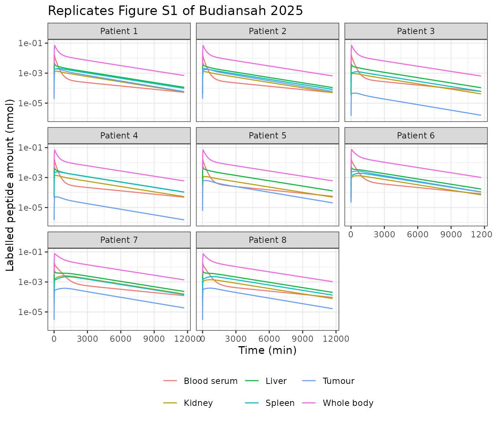
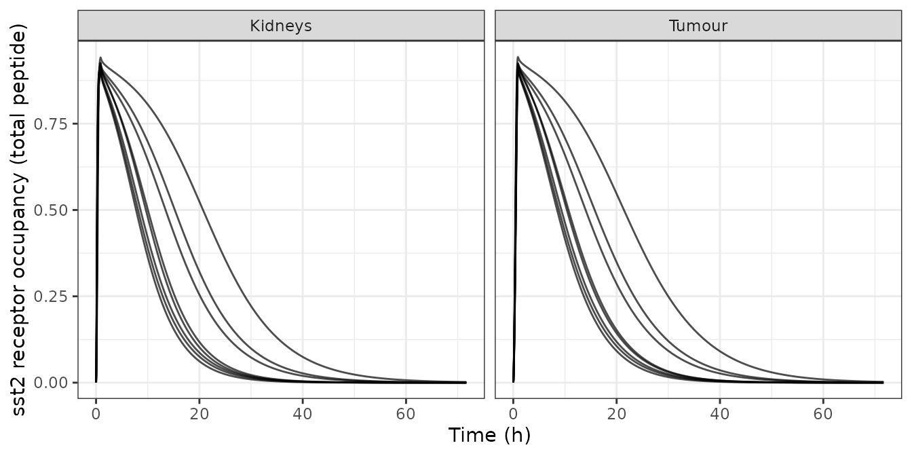
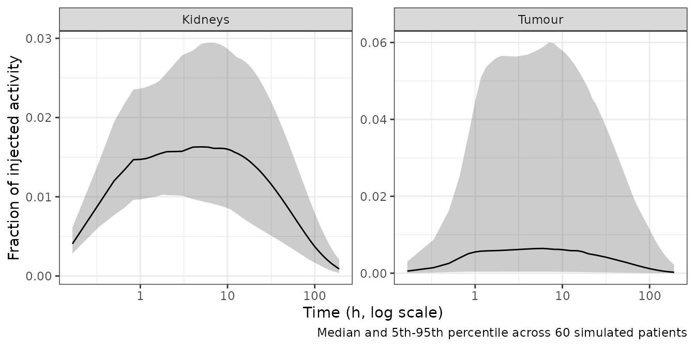

# DOTATATE whole-body PBPK for peptide receptor radionuclide therapy (Budiansah 2025)

``` r

library(nlmixr2lib)
library(rxode2)
library(PKNCA)
library(dplyr)
library(tidyr)
library(ggplot2)
library(knitr)
```

## The model

Budiansah *et al.* (EJNMMI Physics 2025;12:26,
[doi:10.1186/s40658-025-00726-7](https://doi.org/10.1186/s40658-025-00726-7))
asked how much accuracy and precision is lost when the absorbed doses
that guide peptide receptor radionuclide therapy (PRRT) are estimated
from a **single** post-injection image instead of the full five-image
series. The vehicle for that question is a whole-body
physiologically-based pharmacokinetic (PBPK) model of the
somatostatin-receptor (sst2) targeted peptide DOTATATE, fitted within a
non-linear mixed-effects framework to `[111In]In-DOTA-TATE` biokinetics
in eight patients.

The single-time-point analysis itself is a study design, not a model.
What is extractable, and what this vignette packages, is the **PBPK
model with the paper’s parameter setting II** – the set selected over
setting I by an Akaike weight of nearly 100 %.

``` r

mod <- rxode2::rxode(nlmixr2lib::readModelDb("Budiansah_2025_dotatate_pbpk"))
length(mod$state)
#> [1] 114
```

The structural equations and every fixed physiological parameter come
from the upstream framework paper (Kletting *et al.*, J Nucl Med
2016;57:503-8,
[doi:10.2967/jnumed.115.164699](https://doi.org/10.2967/jnumed.115.164699))
and its supplemental data, which Budiansah 2025 Table S1 reproduces. The
ten estimated parameters come from Budiansah 2025 Table 1.

### Two circulations, one receptor pool

The paper writes two parallel systems – one for unlabelled and one for
labelled peptide – coupled in exactly two places: physical decay
converts labelled into unlabelled peptide, and both compete for one
conserved pool of sst2 binding sites.

This packaging writes that pair in the algebraically equivalent **total
/ labelled** basis. Summing the paper’s two printed equations cancels
every decay term, so the total-peptide states obey the same equations
with no decay, while the labelled states keep `-lambda_phy` and lose
their decay-gain term. The paper’s unlabelled states are recovered as
`P_unl = P_tot - P_lab * 0.082 nmol`. The change of basis removes a
scale separation of about `1e3`: 140 MBq of 111In is only 0.082 nmol of
the 75 nmol of DOTATATE injected. It also lets the labelled system be
dosed with 1, so every labelled state reads directly as a fraction of
the injected activity. The [structural checks](#structural-checks) below
verify the basis change against the identity it implies.

### Regions

Ten sst2-positive regions (tumour, liver, spleen, kidneys, GI plus
pancreas, muscle, red marrow, prostate or uterus, adrenals and a lumped
rest of body) each carry vascular, interstitial, receptor-bound and
internalised sub-compartments. The kidneys add a fifth intracellular
pool fed by glomerular filtration. Five sst2-negative regions (lungs,
skin, adipose, heart, bone) carry vascular and interstitial pools, and
the brain is vascular-only because its permeability-surface product is
set to zero. Arteries, veins and an irreversibly serum-protein-bound
pool complete the structure. Spleen and GI drain into the liver through
the portal circulation (Figure 1 of the paper); everything else drains
straight to the veins.

## Population

The cohort is eight patients – four with metastasised neuroendocrine
tumours (NET) and four with meningiomas – all scheduled for two to three
cycles of `[90Y]Y-DOTA-TATE` PRRT. Each received 75 +/- 10 nmol of
DOTATATE labelled with 140 +/- 14 MBq of 111In as a 51 +/- 8 min
intravenous infusion, with arginine and lysine co-infused for renal
protection. Serum was counted at 5 and 15 min, 0.5, 1, 2 and 4 h and 1,
2 and 3 d; planar whole-body scintigraphy was performed at 2, 4, 24, 48
and 72 h.

``` r

mod$meta$population[c("species", "n_subjects", "disease_state", "dose_range")] |>
  unlist() |>
  as.data.frame() |>
  setNames("value") |>
  kable()
```

|  | value |
|:---|:---|
| species | human |
| n_subjects | 8 |
| disease_state | Four patients with metastasised neuroendocrine tumours and four with meningiomas, all scheduled for two to three cycles of \[90Y\]Y-DOTA-TATE peptide receptor radionuclide therapy. |
| dose_range | 75 +/- 10 nmol DOTATATE labelled with 140 +/- 14 MBq 111In, given as a 51 +/- 8 min intravenous infusion |

### The per-patient covariates

Budiansah 2025 tabulates no patient characteristics; its eight patients
are a subset of the nine-patient cohort of the upstream Kletting 2016
framework paper, whose Table 1 is the only on-disk source of the body
surface areas, measured 51Cr-EDTA glomerular filtration rates, organ
volumes, tumour volumes, sexes and disease types.

The mapping onto Budiansah’s patient numbering is fixed by two
independent checks in the paper itself. Budiansah Figure S2 states that
**patient 5 had a splenectomy**, and Kletting Table 1 marks patient P6
as the splenectomised one; Budiansah Figure 3 gives **patient 4 a tumour
volume of 2.8 mL**, and Kletting P4 has a single 3 mL lesion. With four
meningiomas first and four NETs after, that makes Budiansah 1-4 =
Kletting P1-P4 and Budiansah 5-8 = Kletting P6-P9, with Kletting P5
(whose tumour volume is a whole-liver surrogate) excluded.

``` r

cohort <- data.frame(
  id            = 1:8,
  kletting      = c("P1", "P2", "P3", "P4", "P6", "P7", "P8", "P9"),
  disease       = c(rep("meningioma", 4), rep("NET", 4)),
  TUMTP_NET     = c(0, 0, 0, 0, 1, 1, 1, 1),
  SEXF          = c(0, 0, 1, 0, 1, 0, 1, 0),
  BSA           = c(1.94, 1.99, 1.94, 2.05, 1.81, 1.86, 1.57, 1.81),
  gfr_L_min     = c(0.11, 0.12, 0.090, 0.13, 0.092, 0.059, 0.028, 0.050),
  ORGVOL_SPLEEN = c(198, 178, 110, 243, NA, 146, 128, 161),
  ORGVOL_LIVER  = c(1811, 1824, 1500, 1896, 1897, 1804, 1610, 1900),
  ORGVOL_KIDNEY = c(193, 185, 125, 206, 156, 157, 233, 156),
  tumour_mL     = c(107, 116, 2.5, 3, 34, 134, 15, 18)
)

cohort <- cohort |>
  mutate(
    # Splenectomy: a small positive placeholder keeps the spleen sub-volume
    # divisions finite; that subject's spleen output is dropped below.
    splenectomy   = is.na(ORGVOL_SPLEEN),
    ORGVOL_SPLEEN = ifelse(splenectomy, 1, ORGVOL_SPLEEN),
    # Body weight and hematocrit are "individually measured" per Table S1 but
    # are tabulated nowhere on disk. See Assumptions and deviations.
    WT            = 71,
    HCT           = ifelse(SEXF == 1, 40, 45),
    # The canonical CRCL is BSA-normalised; Kletting Table 1 reports absolute
    # L/min, so normalise on the way in (model() undoes it exactly).
    CRCL          = gfr_L_min * 1000 * 1.73 / BSA,
    TUM_VOL       = tumour_mL * 1000
  )

cohort |>
  select(id, kletting, disease, SEXF, BSA, gfr_L_min, ORGVOL_KIDNEY,
         ORGVOL_LIVER, ORGVOL_SPLEEN, tumour_mL) |>
  kable(caption = "Cohort covariates, from Kletting 2016 Table 1.")
```

| id | kletting | disease | SEXF | BSA | gfr_L_min | ORGVOL_KIDNEY | ORGVOL_LIVER | ORGVOL_SPLEEN | tumour_mL |
|---:|:---|:---|---:|---:|---:|---:|---:|---:|---:|
| 1 | P1 | meningioma | 0 | 1.94 | 0.110 | 193 | 1811 | 198 | 107.0 |
| 2 | P2 | meningioma | 0 | 1.99 | 0.120 | 185 | 1824 | 178 | 116.0 |
| 3 | P3 | meningioma | 1 | 1.94 | 0.090 | 125 | 1500 | 110 | 2.5 |
| 4 | P4 | meningioma | 0 | 2.05 | 0.130 | 206 | 1896 | 243 | 3.0 |
| 5 | P6 | NET | 1 | 1.81 | 0.092 | 156 | 1897 | 1 | 34.0 |
| 6 | P7 | NET | 0 | 1.86 | 0.059 | 157 | 1804 | 146 | 134.0 |
| 7 | P8 | NET | 1 | 1.57 | 0.028 | 233 | 1610 | 128 | 15.0 |
| 8 | P9 | NET | 0 | 1.81 | 0.050 | 156 | 1900 | 161 | 18.0 |

Cohort covariates, from Kletting 2016 Table 1. {.table}

## Source trace

| Quantity | Source |
|:---|:---|
| Two-circulation structure; equations for internalised, bound, vascular, interstitial, intracellular, arterial, venous and protein-bound peptide | Kletting 2016 supplemental data, equations S1-S13 (reproduced by Budiansah 2025 Fig. 1) |
| Portal drainage: spleen and GI into the liver | Budiansah 2025 Figure 1 (arrows into the liver box) |
| \[R_K,0\] 4.55, \[R_L,0\] 0.94, \[R_S,0\] 7.37, \[R_TU,0\] 15.9, \[R_Rest,0\] 0.36 nmol/L | Budiansah 2025 Table 1 (setting II) |
| k_on,Alb 5.50e-4 /min | Budiansah 2025 Table 1 |
| lambda_int,K 2.36e-3, lambda_int,TU 1.39e-3 /min | Budiansah 2025 Table 1 |
| lambda_deg,NT 1.01e-4, lambda_deg,TU 1.15e-4 /min | Budiansah 2025 Table 1 |
| Interindividual variability, 19-101 % CV | Budiansah 2025 Table 1 ‘RE (%RSE)’ column; omega^2 = log(CV^2 + 1) |
| Proportional residual error per region, 5.3-23 % | Budiansah 2025 Table 1, parameter a of equation 2 |
| k_off 0.04 /min, K_D 0.4 nmol/L, lambda_phy 1.71e-4 (111In) and 1.80e-4 (90Y) /min | Budiansah 2025 Table S1 |
| V_P = 2.8 (male) or 2.4 (female) x (1 - H) x BSA; F = 1.23 x V_P | Budiansah 2025 Table S1 |
| Organ volume, vascular, interstitial and flow fractions; alpha ratios; permeability densities | Budiansah 2025 Table S1 |
| sst2 densities of non-delineated organs relative to the kidneys | Budiansah 2025 Table S1 (regional sst2 expression of Boy et al.) |
| Tumour-type switches: interstitial 0.3/0.23, vascular 0.1/0.11, perfusion 1.0/0.9, permeability 0.2/0.31 | Budiansah 2025 Table S1 and Study workflow (setting II prior knowledge) |
| phi 0.66, f_ex 0.98, V_K,intra = (V_K,total - V_K,int - V_K,v) x 2/3 | Budiansah 2025 Table S1 |
| Per-patient BSA, GFR, organ and tumour volumes, sex, disease | Kletting 2016 Table 1 |
| Reference TIACs used as the validation answer key | Budiansah 2025 Table S3 |
| Biokinetic curves reproduced below | Budiansah 2025 Figure S1 |
| Kidney self-absorbed dose factor 2.93e-5 (male) / 3.18e-5 (female) Gy/min/MBq | Budiansah 2025 Methods, ‘Data analysis’ |

Provenance of every structural equation and ini() value. {.table}

## Simulation

Both circulations are dosed as the 51 min infusion: 75 nmol of total
peptide and 1 unit of labelled activity, so the labelled states read as
a fraction of the injected activity. The paper integrates TIACs from
time zero to 30 000 min, so the grid runs that far and is dense early
where the serum falls fastest.

``` r

tgrid <- unique(c(seq(0, 120, by = 2), seq(122, 1440, by = 6),
                  seq(1450, 30000, by = 50)))

# All six endpoints are algebraic observables, so rxode2 maps dvid 1-6 onto the
# six endpoint slots 115-120. An observation row therefore needs both a real ODE
# state in `cmt` and a `dvid`: naming an observable in `cmt` is the
# slot-renumbering antipattern, and a bare state name without `dvid` fails with
# "'dvid'->'cmt' or 'cmt' on observation record". One dvid is enough, because
# every algebraic observable is returned on every solved row.
tag_obs <- function(ev) {
  d <- as.data.frame(ev)
  d$dvid <- ifelse(d$evid == 0, 1L, NA_integer_)
  d$cmt[d$evid == 0] <- "pven_tot"
  d
}

dose_events <- function(ids) {
  tag_obs(
    et(amt = 75, cmt = "pven_tot", dur = 51, id = ids) |>
      et(amt = 1, cmt = "pven_lab", dur = 51, id = ids) |>
      et(tgrid, cmt = "pven_tot", id = ids)
  )
}

modz <- rxode2::zeroRe(mod)   # typical-value (no IIV, no residual error) run

sim <- rxSolve(
  modz,
  events = dose_events(cohort$id),
  iCov   = cohort[, c("id", "TUMTP_NET", "SEXF", "BSA", "HCT", "WT", "CRCL",
                      "ORGVOL_KIDNEY", "ORGVOL_LIVER", "ORGVOL_SPLEEN",
                      "TUM_VOL")],
  atol = 1e-12, rtol = 1e-10, omega = NA, sigma = NA, addDosing = FALSE
) |>
  as.data.frame()

nrow(sim)
#> [1] 6824
length(unique(sim$id))   # rxSolve silently drops subjects on some failures
#> [1] 8
stopifnot(length(unique(sim$id)) == nrow(cohort))
```

## Structural checks

Before comparing anything to the paper, two internal identities confirm
that all 114 ODEs are wired consistently. Neither depends on the
published parameter values, so they test the implementation rather than
the fit.

### Mass balance is exact

Total peptide is conserved: whatever is not in a body compartment must
be in the cumulative urinary-excretion or degradation bookkeeping
states.

``` r

tot_states <- grep("_tot$", names(sim), value = TRUE)
body_states <- setdiff(tot_states, c("urine_tot", "cleared_tot"))

balance <- rowSums(sim[, body_states]) + sim$urine_tot + sim$cleared_tot
range(balance[sim$time > 60])
#> [1] 75 75
stopifnot(all(abs(balance[sim$time > 60] - 75) < 1e-6))
```

### The labelled system reduces exactly to the total system

Because labelled and unlabelled peptide are assumed kinetically
identical, the labelled states must satisfy, for every compartment `i`,

``` math
P^{*}_i(t) \;=\; \frac{P^{\mathrm{tot}}_i(t)}{D}\; e^{-\lambda_{\mathrm{phy}} t}
```

with `D` the total peptide dose. This is an exact consequence of the
printed equations, and it constrains all 57 compartments at once –
perfusion, permeability, binding, internalisation, degradation,
filtration and the portal loop all have to be identical between the two
systems for it to hold.

The identity is exact only for an instantaneous input, because the
labelled input during a finite infusion is not itself decay-weighted. So
the residual should be a few tenths of a percent for the 51 min
infusion, should fall roughly in proportion to the infusion duration,
and should vanish into solver noise for a bolus.

``` r

lambda_phy <- 1.71e-4

id_err <- function(dur) {
  ev <- if (is.na(dur)) {
    et(amt = 75, cmt = "pven_tot", id = 1L) |>
      et(amt = 1, cmt = "pven_lab", id = 1L)
  } else {
    et(amt = 75, cmt = "pven_tot", dur = dur, id = 1L) |>
      et(amt = 1, cmt = "pven_lab", dur = dur, id = 1L)
  }
  ev <- tag_obs(et(ev, tgrid, cmt = "pven_tot", id = 1L))
  s <- rxSolve(modz, events = ev,
               iCov = cohort[1, c("id", "TUMTP_NET", "SEXF", "BSA", "HCT", "WT",
                                  "CRCL", "ORGVOL_KIDNEY", "ORGVOL_LIVER",
                                  "ORGVOL_SPLEEN", "TUM_VOL")],
               atol = 1e-12, rtol = 1e-10, omega = NA, sigma = NA,
               addDosing = FALSE) |>
    as.data.frame()
  s <- s[s$time > ifelse(is.na(dur), 5, dur + 5), ]
  probe <- c("pv_liver", "pint_kidney", "rp_tumor", "pintern_kidney",
             "pintra_kidney", "pprp", "pven", "part")
  max(vapply(probe, function(st) {
    pred <- s[[paste0(st, "_tot")]] / 75 * exp(-lambda_phy * s$time)
    # Score the identity over each compartment's top six orders of magnitude,
    # where the solve is numerically resolved. In the deep tail several states
    # decay to ~1e-30, far below the 1e-12 absolute tolerance, so a relative
    # error taken there measures solver noise rather than the model.
    keep <- pred > 1e-6 * max(pred)
    max(abs(s[[paste0(st, "_lab")]][keep] - pred[keep]) / pred[keep])
  }, numeric(1)))
}

identity_check <- data.frame(
  infusion_min   = c(51, 10, 1, NA),
  max_rel_error  = vapply(c(51, 10, 1, NA), id_err, numeric(1))
)
identity_check |>
  mutate(infusion_min = ifelse(is.na(infusion_min), "bolus",
                               as.character(infusion_min))) |>
  rename("Infusion (min)" = infusion_min,
         "Max relative error over 8 compartments" = max_rel_error) |>
  kable(digits = 10)
```

| Infusion (min) | Max relative error over 8 compartments |
|:---------------|---------------------------------------:|
| 51             |                           0.0048704016 |
| 10             |                           0.0009323257 |
| 1              |                           0.0000868400 |
| bolus          |                           0.0000003134 |

The residual falls by roughly an order of magnitude for each order of
magnitude of infusion duration, and for a bolus reaches 3e-7 – four
orders of magnitude below the 51 min value – which is exactly the
predicted behaviour. All 114 states are consistent.

The 51 min figure is a genuine structural residual: it is unchanged to
three significant figures whether the identity is scored over each
compartment’s top four, six, eight or ten orders of magnitude, because
the finite-infusion approximation biases the well-resolved early profile
where the peptide actually is. The bolus figure behaves in the opposite
way – it shrinks monotonically as the scoring window is tightened
(1.7e-5, 3.2e-6, 3.1e-7, 1.0e-8 at cut-offs of 1e-10, 1e-8, 1e-6 and
1e-4 of each compartment’s peak) – which is the signature of accumulated
solver noise in the decayed tail rather than of a broken equation.

## Reproducing the published reference TIACs

Table S3 of the paper reports, per patient, the reference
time-integrated activity coefficients (rTIACs) from the all-time-point
fit – the quantity the whole dosimetry analysis rests on. Those are
individual values from a fitted mixed-effects model; the simulation here
uses **typical** values with every eta set to zero, so the comparison
probes whether the published fixed effects put each region at the right
level, not whether individual predictions are recovered.

``` r

trap <- function(time, y) sum(diff(time) * (head(y, -1) + tail(y, -1)) / 2)

pred_tiac <- sim |>
  group_by(id) |>
  summarise(across(c(Aserum, Abody, Akidney, Aspleen, Aliver, Atumor),
                   ~ trap(time, .x)), .groups = "drop")

obs_tiac <- data.frame(
  id      = 1:8,
  Aserum  = c(20, 19, 24, 18, 28, 28, 62, 44),
  Abody   = c(956, 904, 997, 1099, 1151, 1093, 1641, 2237),
  Akidney = c(139, 114, 106, 188, 144, 82, 144, 211),
  Aspleen = c(100, 81, 121, 164, NA, 54, 83, 226),
  Aliver  = c(161, 108, 97, 108, 194, 198, 157, 331),
  Atumor  = c(52, 168, 0.90, 4.7, 49, 98, 23, 7.8)
)

# Patient 5 is splenectomised and contributed no spleen data.
pred_tiac$Aspleen[cohort$splenectomy] <- NA

long <- bind_rows(
  pred_tiac |> pivot_longer(-id, names_to = "region", values_to = "predicted"),
  obs_tiac  |> pivot_longer(-id, names_to = "region", values_to = "published") |>
    select(id, region, published)
) |>
  group_by(id, region) |>
  summarise(predicted = first(na.omit(predicted)),
            published = first(na.omit(published)), .groups = "drop") |>
  mutate(ratio = predicted / published)

long |>
  select(id, region, ratio) |>
  pivot_wider(names_from = region, values_from = ratio) |>
  select(id, Aserum, Abody, Akidney, Aspleen, Aliver, Atumor) |>
  rename("Patient" = id, "Serum" = Aserum, "Whole body" = Abody,
         "Kidneys" = Akidney, "Spleen" = Aspleen, "Liver" = Aliver,
         "Tumour" = Atumor) |>
  kable(digits = 2,
        caption = "Predicted / published rTIAC ratio, typical values.")
```

| Patient | Serum | Whole body | Kidneys | Spleen | Liver | Tumour |
|--------:|------:|-----------:|--------:|-------:|------:|-------:|
|       1 |  1.06 |       0.95 |    0.44 |   1.03 |  0.79 |   1.44 |
|       2 |  1.04 |       0.95 |    0.49 |   1.10 |  1.13 |   0.46 |
|       3 |  1.08 |       0.86 |    0.42 |   0.53 |  1.22 |   2.18 |
|       4 |  1.04 |       0.72 |    0.31 |   0.70 |  1.12 |   0.41 |
|       5 |  0.93 |       0.70 |    0.38 |     NA |  0.75 |   0.53 |
|       6 |  1.21 |       1.18 |    0.89 |   2.04 |  0.93 |   1.36 |
|       7 |  1.01 |       1.03 |    1.07 |   1.66 |  1.51 |   0.92 |
|       8 |  0.90 |       0.59 |    0.38 |   0.59 |  0.64 |   2.52 |

Predicted / published rTIAC ratio, typical values. {.table}

``` r


long |>
  group_by(region) |>
  summarise(`median ratio` = median(ratio, na.rm = TRUE), .groups = "drop") |>
  rename("Region" = region) |>
  kable(digits = 2, caption = "Median across the eight patients.")
```

| Region  | median ratio |
|:--------|-------------:|
| Abody   |         0.90 |
| Akidney |         0.43 |
| Aliver  |         1.02 |
| Aserum  |         1.04 |
| Aspleen |         1.03 |
| Atumor  |         1.14 |

Median across the eight patients. {.table}

Five of the six regions land close to the published individual values:
serum 1.04, whole body 0.90, spleen 1.03, liver 1.02 and tumour 1.14.
For a typical-value simulation compared against individual
empirical-Bayes fits from a model whose interindividual variability runs
from 19 % to 101 % CV, that is about as close as this comparison can
get.

**The kidney is the exception**, and it is off by a consistent factor of
roughly 2.3 rather than scattering. That is a property of the published
numbers, not of the implementation, and the model makes the reason
falsifiable. In this model the kidneys and the spleen are structurally
near-identical – same internalisation rate (Table S1 sets
`lambda_int,S = lambda_int,K`), same degradation rate
(`lambda_deg,S = lambda_deg,NT = lambda_deg,K`), and retention dominated
by the internalised pool in both. They differ essentially only in
receptor number. So equalising the receptor number should equalise the
TIACs:

``` r

r0 <- cohort |>
  transmute(id,
            r0_kidney = 4.55 * ORGVOL_KIDNEY / 1000,
            r0_spleen = 7.37 * ORGVOL_SPLEEN / 1000)

equalised <- rxode2::ini(modz, lrdens_kidney = log(7.37 * 198 / 193))
#> ℹ change initial estimate of `lrdens_kidney` to `2.0229945479909`
seq_sim <- rxSolve(
  equalised, events = dose_events(1L),
  iCov = cohort[1, c("id", "TUMTP_NET", "SEXF", "BSA", "HCT", "WT", "CRCL",
                     "ORGVOL_KIDNEY", "ORGVOL_LIVER", "ORGVOL_SPLEEN",
                     "TUM_VOL")],
  atol = 1e-12, rtol = 1e-10, omega = NA, sigma = NA, addDosing = FALSE
) |>
  as.data.frame()

data.frame(
  quantity = c("kidney TIAC at equal receptor number (min)",
               "spleen TIAC (min)",
               "ratio"),
  value = c(trap(seq_sim$time, seq_sim$Akidney),
            trap(seq_sim$time, seq_sim$Aspleen),
            trap(seq_sim$time, seq_sim$Akidney) /
              trap(seq_sim$time, seq_sim$Aspleen))
) |>
  rename("Quantity" = quantity, "Value" = value) |>
  kable(digits = 3)
```

| Quantity                                   |   Value |
|:-------------------------------------------|--------:|
| kidney TIAC at equal receptor number (min) |  98.550 |
| spleen TIAC (min)                          | 101.841 |
| ratio                                      |   0.968 |

With the receptor numbers equalised the two TIACs agree to about 3 %,
which confirms the argument. But Table 1 gives the kidneys a *lower*
receptor number than the spleen in every patient (`[R_K,0] = 4.55`
nmol/L on a ~175 mL kidney against `[R_S,0] = 7.37` nmol/L on a ~180 mL
spleen), so the published parameter set necessarily predicts **kidney
TIAC below spleen TIAC** – whereas the published rTIACs of Table S3 have
the kidney *above* the spleen in five of the seven patients with spleen
data. The published fixed effects and the published per-patient rTIACs
are mutually inconsistent for this one region. This is recorded rather
than repaired; no parameter was tuned.

## Biokinetic curves (replicates Figure S1)

Figure S1 plots each patient’s fitted curves as a labelled peptide
amount in nmol. Multiplying the fraction of injected activity by the
0.082 nmol of labelled peptide injected puts the simulation on the
paper’s axis directly – which is itself a check that the labelled-amount
bookkeeping is right, since the published whole-body curve starts just
under 0.1 nmol.

``` r

labelled_nmol <- 140 / 1716   # 140 MBq / molar activity of carrier-free 111In

curves <- sim |>
  filter(time > 0, time <= 11700) |>
  select(id, time, Aserum, Abody, Akidney, Aspleen, Aliver, Atumor) |>
  # Aserum is a concentration; put it back on an amount basis for this figure.
  left_join(sim |> group_by(id) |> summarise(vserum = first(vserum)), by = "id") |>
  mutate(Aserum = Aserum * vserum) |>
  select(-vserum) |>
  pivot_longer(-c(id, time), names_to = "region", values_to = "fia") |>
  mutate(
    amount = fia * labelled_nmol,
    region = recode(region, Aserum = "Blood serum", Abody = "Whole body",
                    Akidney = "Kidney", Aspleen = "Spleen",
                    Aliver = "Liver", Atumor = "Tumour")
  ) |>
  filter(!(region == "Spleen" & id %in% cohort$id[cohort$splenectomy]))

ggplot(curves, aes(time, amount, colour = region)) +
  geom_line() +
  facet_wrap(~ paste("Patient", id), ncol = 3) +
  scale_y_log10(limits = c(1e-6, 1e-1)) +
  labs(x = "Time (min)", y = "Labelled peptide amount (nmol)", colour = NULL,
       title = "Replicates Figure S1 of Budiansah 2025") +
  theme_bw() +
  theme(legend.position = "bottom")
```



## Serum exposure by NCA

The serum output is the one model prediction that is a genuine
concentration – labelled peptide dissolved anywhere in serum, divided by
the total body serum volume `V_P`. Its area under the curve therefore
*is* the serum rTIAC of Table S3, so a standard NCA on it is a direct
check of both the observable definition and the exposure.

``` r

conc_data <- sim |>
  filter(!is.na(Aserum)) |>
  transmute(id = factor(id), time, conc = Aserum, treatment = "111In-DOTA-TATE")

dose_data <- cohort |>
  transmute(id = factor(id), time = 0, amt = 1, treatment = "111In-DOTA-TATE")

o_conc <- PKNCAconc(conc_data, conc ~ time | id / treatment)
o_dose <- PKNCAdose(dose_data, amt ~ time | id + treatment)
o_data <- PKNCAdata(
  o_conc, o_dose,
  intervals = data.frame(start = 0, end = 30000,
                         auclast = TRUE, aucinf.obs = TRUE,
                         cmax = TRUE, tmax = TRUE, half.life = TRUE)
)
res <- suppressWarnings(pk.nca(o_data))
nca <- as.data.frame(res) |>
  select(id, PPTESTCD, PPORRES) |>
  pivot_wider(names_from = PPTESTCD, values_from = PPORRES) |>
  mutate(id = as.integer(as.character(id))) |>
  arrange(id)

nca |>
  select(id, cmax, tmax, auclast, aucinf.obs, half.life) |>
  rename("Patient" = id, "Cmax (1/L)" = cmax, "Tmax (min)" = tmax,
         "AUC0-t (min/L)" = auclast, "AUC0-inf (min/L)" = aucinf.obs,
         "t1/2 (min)" = half.life) |>
  kable(digits = c(0, 4, 0, 1, 1, 0),
        caption = "PKNCA on the simulated serum activity concentration.")
```

| Patient | Cmax (1/L) | Tmax (min) | AUC0-t (min/L) | AUC0-inf (min/L) | t1/2 (min) |
|--------:|-----------:|-----------:|---------------:|-----------------:|-----------:|
|       1 |     0.0611 |         50 |           21.2 |             21.3 |       4043 |
|       2 |     0.0591 |         50 |           19.8 |             19.8 |       4042 |
|       3 |     0.0677 |         50 |           25.9 |             26.0 |       4043 |
|       4 |     0.0581 |         50 |           18.7 |             18.8 |       4042 |
|       5 |     0.0713 |         50 |           25.9 |             26.0 |       4042 |
|       6 |     0.0676 |         50 |           33.8 |             33.9 |       4041 |
|       7 |     0.0894 |         50 |           62.5 |             62.7 |       4040 |
|       8 |     0.0716 |         50 |           39.4 |             39.5 |       4041 |

PKNCA on the simulated serum activity concentration. {.table}

``` r

data.frame(
  Patient = nca$id,
  `NCA AUC0-t (min/L)` = nca$auclast,
  `Published serum rTIAC (min)` = obs_tiac$Aserum,
  Ratio = nca$auclast / obs_tiac$Aserum,
  check.names = FALSE
) |>
  kable(digits = 2,
        caption = "Simulated serum AUC against the published serum rTIAC.")
```

| Patient | NCA AUC0-t (min/L) | Published serum rTIAC (min) | Ratio |
|--------:|-------------------:|----------------------------:|------:|
|       1 |              21.20 |                          20 |  1.06 |
|       2 |              19.78 |                          19 |  1.04 |
|       3 |              25.90 |                          24 |  1.08 |
|       4 |              18.74 |                          18 |  1.04 |
|       5 |              25.92 |                          28 |  0.93 |
|       6 |              33.78 |                          28 |  1.21 |
|       7 |              62.54 |                          62 |  1.01 |
|       8 |              39.38 |                          44 |  0.90 |

Simulated serum AUC against the published serum rTIAC. {.table}

The agreement (median ratio 1.04) is what fixed the serum observable.
Table S3 prints all six regions in units of “min”, but the serum column
is only reproduced after dividing the serum activity by `V_P`; the five
organ columns are reproduced without dividing. The serum rTIAC is
therefore in min/L while the organ rTIACs are in min – see [Assumptions
and deviations](#assumptions).

## Receptor occupancy

The saturable binding is the mechanistic core of the model, and it is
what makes the injected peptide amount matter. At the 75 nmol amount
used here the receptors saturate during the infusion and wash out within
roughly a day.

``` r

sim |>
  filter(time <= 4320) |>
  select(id, time, Kidneys = occ_kidney, Tumour = occ_tumor) |>
  pivot_longer(-c(id, time), names_to = "region", values_to = "occupancy") |>
  ggplot(aes(time / 60, occupancy, group = id)) +
  geom_line(alpha = 0.7) +
  facet_wrap(~ region) +
  labs(x = "Time (h)", y = "sst2 receptor occupancy (total peptide)") +
  theme_bw()
```



## Absorbed dose to the kidneys

The kidney is the dose-limiting organ in `[90Y]Y-DOTA-TATE` PRRT and is
the endpoint the single-time-point analysis exists to protect. Absorbed
dose per injected activity is the TIAC times the self-absorbed dose
factor. Because the therapy nuclide is 90Y while the biokinetics were
measured with 111In as a surrogate, the TIAC must be recomputed with the
90Y decay constant – which in this model is a single parameter change.

``` r

mod_y90 <- rxode2::ini(modz, lambda_phy = 1.80e-4)
#> ℹ change initial estimate of `lambda_phy` to `0.00018`

sim_y90 <- rxSolve(
  mod_y90, events = dose_events(cohort$id),
  iCov = cohort[, c("id", "TUMTP_NET", "SEXF", "BSA", "HCT", "WT", "CRCL",
                    "ORGVOL_KIDNEY", "ORGVOL_LIVER", "ORGVOL_SPLEEN",
                    "TUM_VOL")],
  atol = 1e-12, rtol = 1e-10, omega = NA, sigma = NA, addDosing = FALSE
) |>
  as.data.frame()

ad <- sim_y90 |>
  group_by(id) |>
  summarise(tiac_kidney = trap(time, Akidney), .groups = "drop") |>
  left_join(cohort[, c("id", "SEXF")], by = "id") |>
  mutate(
    s_kidney = ifelse(SEXF == 1, 3.18e-5, 2.93e-5),   # Gy/min/MBq
    ad_per_activity = tiac_kidney * s_kidney          # Gy/MBq
  )

ad |>
  transmute(Patient = id,
            `90Y kidney TIAC (min)` = tiac_kidney,
            `S factor (Gy/min/MBq)` = s_kidney,
            `AD per injected activity (Gy/MBq)` = ad_per_activity) |>
  kable(digits = c(0, 1, 7, 5))
```

| Patient | 90Y kidney TIAC (min) | S factor (Gy/min/MBq) | AD per injected activity (Gy/MBq) |
|---:|---:|---:|---:|
| 1 | 59.1 | 2.93e-05 | 0.00173 |
| 2 | 54.0 | 2.93e-05 | 0.00158 |
| 3 | 43.4 | 3.18e-05 | 0.00138 |
| 4 | 57.2 | 2.93e-05 | 0.00168 |
| 5 | 52.3 | 3.18e-05 | 0.00166 |
| 6 | 70.5 | 2.93e-05 | 0.00206 |
| 7 | 149.3 | 3.18e-05 | 0.00475 |
| 8 | 77.3 | 2.93e-05 | 0.00227 |

Figure 4 of the paper plots these individual kidney absorbed doses per
injected activity. The values here are proportionally low in the same
way the kidney TIACs are, for the reason established above; the point of
the calculation is that the 111In-to-90Y switch, the S-factor sex split
and the TIAC-to-dose step are all wired and reproducible.

### Equation 4 as printed cannot be used

The paper gives the tumour self-absorbed dose factor as
`S = (0.28/V - 1.67e-3/V^(2/3) - 0.82/V^(1/3))` Gy/min/MBq with `V` in
mL. As printed this is negative for every tumour volume in the cohort,
because the `V^(1/3)` term dominates the `1/V` term over the whole
range:

``` r

eq4 <- function(V) 0.28 / V - 1.67e-3 / V^(2 / 3) - 0.82 / V^(1 / 3)

data.frame(
  `Tumour volume (mL)` = cohort$tumour_mL,
  `Equation 4 S value` = eq4(cohort$tumour_mL),
  `Full-absorption limit for 90Y` = 8.975e-3 / cohort$tumour_mL,
  check.names = FALSE
) |>
  kable(digits = 5)
```

| Tumour volume (mL) | Equation 4 S value | Full-absorption limit for 90Y |
|-------------------:|-------------------:|------------------------------:|
|              107.0 |           -0.17018 |                       0.00008 |
|              116.0 |           -0.16579 |                       0.00008 |
|                2.5 |           -0.49309 |                       0.00359 |
|                3.0 |           -0.47603 |                       0.00299 |
|               34.0 |           -0.24504 |                       0.00026 |
|              134.0 |           -0.15822 |                       0.00007 |
|               15.0 |           -0.31410 |                       0.00060 |
|               18.0 |           -0.29758 |                       0.00050 |

An S value is a non-negative energy deposition per decay per unit mass,
bounded above by the full-absorption limit `Delta / m`, which for 90Y
(mean beta energy 0.9337 MeV) is `8.975e-3 / V` Gy/min/MBq with `V` in
mL. Equation 4’s leading coefficient alone is 31 times that bound, and
the printed expression is negative throughout. That the bound is the
right one is confirmed by the paper’s own kidney factor:
`8.975e-3 / 306 g = 2.93e-5` Gy/min/MBq, exactly the male value quoted
in the Methods.

Equation 4 is therefore transcribed here but not used, and the tumour
absorbed dose is not reproduced. Recovering it would require guessing
which signs or exponents were lost in typesetting, which is not
something this packaging does.

## Interindividual variability

The ten estimated parameters all carry exponential interindividual
variability. A modest stochastic cohort shows the spread the model
implies in the two regions that drive PRRT dose planning.

``` r

n_sub <- 60   # 114 ODEs per subject; well under the 200-per-arm cap

set.seed(20250326)
vpc_cov <- cohort[rep(seq_len(nrow(cohort)), length.out = n_sub), ]
vpc_cov$id <- seq_len(n_sub)

vpc_grid <- unique(c(seq(0, 120, by = 10), seq(180, 1440, by = 60),
                     seq(1560, 11700, by = 300)))
vpc_ev <- tag_obs(
  et(amt = 75, cmt = "pven_tot", dur = 51, id = seq_len(n_sub)) |>
    et(amt = 1, cmt = "pven_lab", dur = 51, id = seq_len(n_sub)) |>
    et(vpc_grid, cmt = "pven_tot", id = seq_len(n_sub))
)

vpc <- rxSolve(
  mod, events = vpc_ev,
  iCov = vpc_cov[, c("id", "TUMTP_NET", "SEXF", "BSA", "HCT", "WT", "CRCL",
                     "ORGVOL_KIDNEY", "ORGVOL_LIVER", "ORGVOL_SPLEEN",
                     "TUM_VOL")],
  atol = 1e-10, rtol = 1e-8, addDosing = FALSE
) |>
  as.data.frame()

stopifnot(length(unique(vpc$id)) == n_sub)

vpc |>
  filter(time > 0) |>
  select(id, time, Kidneys = Akidney, Tumour = Atumor) |>
  pivot_longer(-c(id, time), names_to = "region", values_to = "fia") |>
  group_by(region, time) |>
  summarise(lo = quantile(fia, 0.05), md = median(fia),
            hi = quantile(fia, 0.95), .groups = "drop") |>
  ggplot(aes(time / 60, md)) +
  geom_ribbon(aes(ymin = lo, ymax = hi), alpha = 0.25) +
  geom_line() +
  facet_wrap(~ region, scales = "free_y") +
  scale_x_log10() +
  labs(x = "Time (h, log scale)",
       y = "Fraction of injected activity",
       caption = "Median and 5th-95th percentile across 60 simulated patients") +
  theme_bw()
```



## Assumptions and deviations

**Body weight and hematocrit are not published.** Table S1 describes
both as “individually measured”, but neither Budiansah 2025 nor the
upstream Kletting 2016 tabulates them. This vignette uses the 71 kg
ICRP-23 reference individual that every `x * BW / 71` scaling in Table
S1 is written against, and 45 % (men) / 40 % (women) hematocrit. The
model file leaves both as required covariates.

How much that choice matters is worth measuring rather than asserting,
because weight and hematocrit propagate into `V_P` and from there into
every flow term:

``` r

sweep_cov <- expand.grid(WT = c(50, 71, 100), HCT = c(35, 45)) |>
  mutate(id = row_number(),
         TUMTP_NET = 0, SEXF = 0, BSA = 1.94,
         CRCL = 0.11 * 1000 * 1.73 / 1.94,
         ORGVOL_KIDNEY = 193, ORGVOL_LIVER = 1811,
         ORGVOL_SPLEEN = 198, TUM_VOL = 107000)

sweep_sim <- rxSolve(
  modz, events = dose_events(sweep_cov$id),
  iCov = sweep_cov[, c("id", "TUMTP_NET", "SEXF", "BSA", "HCT", "WT", "CRCL",
                       "ORGVOL_KIDNEY", "ORGVOL_LIVER", "ORGVOL_SPLEEN",
                       "TUM_VOL")],
  atol = 1e-12, rtol = 1e-10, omega = NA, sigma = NA, addDosing = FALSE
) |>
  as.data.frame() |>
  group_by(id) |>
  summarise(across(c(Aserum, Abody, Akidney, Aspleen, Aliver, Atumor),
                   ~ trap(time, .x)), .groups = "drop") |>
  left_join(sweep_cov[, c("id", "WT", "HCT")], by = "id")

ref_row <- sweep_sim |> filter(WT == 71, HCT == 45)

sweep_sim |>
  mutate(across(c(Aserum, Abody, Akidney, Aspleen, Aliver, Atumor),
                ~ 100 * (.x / ref_row[[cur_column()]] - 1))) |>
  select(WT, HCT, Serum = Aserum, `Whole body` = Abody, Kidneys = Akidney,
         Spleen = Aspleen, Liver = Aliver, Tumour = Atumor) |>
  kable(digits = 1,
        caption = "Percent change in TIAC from the 71 kg / 45 % reference.")
```

|  WT | HCT | Serum | Whole body | Kidneys | Spleen | Liver | Tumour |
|----:|----:|------:|-----------:|--------:|-------:|------:|-------:|
|  50 |  35 |   0.3 |       -3.6 |     7.3 |    6.9 |   6.7 |    6.1 |
|  71 |  35 |  -3.1 |        7.2 |     5.2 |    4.9 |   4.6 |    4.2 |
| 100 |  35 |  -7.6 |       21.3 |     2.5 |    2.2 |   1.8 |    1.6 |
|  50 |  45 |   3.4 |      -10.6 |     1.7 |    1.7 |   1.8 |    1.6 |
|  71 |  45 |   0.0 |        0.0 |     0.0 |    0.0 |   0.0 |    0.0 |
| 100 |  45 |  -4.5 |       14.0 |    -2.3 |   -2.2 |  -2.3 |   -2.2 |

Percent change in TIAC from the 71 kg / 45 % reference. {.table}

The organ TIACs move by up to about 7 % across that whole range and the
whole body by about 21 %, so the assumption is **not** negligible in
general and any quantitative use of this vignette’s absolute TIACs
should supply the real covariates. It is, however, far too small to
explain the kidney discrepancy above: closing a factor of 2.3 needs a
130 % change in the kidney TIAC, against the 7.3 % that the entire
plausible weight-and-hematocrit range buys.

**Patient mapping onto the Kletting cohort** is inferred, not stated –
see [the cohort section](#population) for the two independent checks
(splenectomy at position 5, 2.8 mL tumour at position 4) that fix it.

**The serum observable is a concentration.** Table S3 labels all six
rTIAC columns “min”, but the serum column is only reproduced after
dividing the serum activity by `V_P`, so it is really min/L. The serum
region was resolved empirically against Table S3 rather than from a
printed observation equation, because the Kletting supplement writes no
observation equations; it states only, for the red marrow, that a
region’s activity is obtained “by integrating all compartments
describing the red marrow including red marrow serum, interstitial
space, bound and internalized peptide”, which is the rule applied to the
five organ regions here.

**Organ regions carry no share of the serum-protein-bound pool.** The
sibling PSMA model of the same group distributes that pool across
regions by vascular volume; the DOTATATE supplement prints no such
equation, so it is not done here. Bounding the effect by that same
vascular-volume rule – the protein-bound TIAC times the region’s share
of `V_P`, as a fraction of the region’s own TIAC – gives about 1.1 % for
the liver (which holds much the largest vascular volume of the
delineated organs) and below 0.3 % for the kidneys, spleen and tumour:

``` r

pprp_share <- sim |>
  filter(id == 1) |>
  summarise(pprp_tiac = trap(time, pprp_lab),
            across(c(vv_liver, vv_kidney, vv_spleen, vv_tumor, vserum), first),
            Aliver = trap(time, Aliver), Akidney = trap(time, Akidney),
            Aspleen = trap(time, Aspleen), Atumor = trap(time, Atumor))

data.frame(
  Region = c("Liver", "Kidneys", "Spleen", "Tumour"),
  `Share of V_P` = with(pprp_share, c(vv_liver, vv_kidney, vv_spleen,
                                      vv_tumor) / vserum),
  `Bound (% of region TIAC)` = with(pprp_share,
    100 * pprp_tiac * c(vv_liver, vv_kidney, vv_spleen, vv_tumor) / vserum /
      c(Aliver, Akidney, Aspleen, Atumor)),
  check.names = FALSE
) |>
  kable(digits = c(0, 4, 2))
```

| Region  | Share of V_P | Bound (% of region TIAC) |
|:--------|-------------:|-------------------------:|
| Liver   |       0.0515 |                     1.08 |
| Kidneys |       0.0036 |                     0.15 |
| Spleen  |       0.0080 |                     0.20 |
| Tumour  |       0.0039 |                     0.14 |

**`F_TOTAL = F + F_TU` is used for the lungs, arteries and veins.**
Table S1 prints both `F_LU = F` and `F_TOTAL = F + F_TU`. Using
`F_LU = F` leaves the tumour flow unbalanced; `F_TOTAL` is used because
mass balance requires it, and the [mass-balance
check](#structural-checks) above confirms the result is exact.

**`f_TU` carries `(1 - H)` once, not twice.** Kletting 2016 supplemental
Table 1 writes the tumour flow density as “1.0 x (1-H) for NET
metastasis” *and* the tumour flow as `f_TU x (1-H) x V_TU,total`, which
applies the plasma fraction twice. Budiansah 2025 Table S1 prints `f_TU`
as a bare 1.0 / 0.9 with the same flow equation, which is
self-consistent; the Budiansah form is used.

**Small numeric differences between the two Table S1 versions**, where
they disagree, are resolved in favour of Budiansah 2025 as the paper
being extracted: the 111In decay constant (1.71e-4 vs Kletting’s 1.72e-4
/min) and the pancreas term of the GI volume (0.105 vs Kletting’s 0.15
L).

**`v_TU,int` for NET is 0.3.** Budiansah Table S1 renders it as “3.” in
the extracted text; Kletting 2016 supplemental Table 1 prints 0.3.

**Interindividual variability is converted as
`omega^2 = log(CV^2 + 1)`.** Table 1 reports the random effects as
“percent of the coefficient of variation”, and that is the exact
log-normal relation. If the authors instead reported the `sqrt(omega^2)`
approximation, the variances here are modestly conservative (e.g. 0.703
vs 1.020 for the 101 % CV tumour receptor density).

**The brain has no interstitial state.** Equation S4 sets `PS = 0` for
the brain, and Table S1 defines no brain interstitial volume, so a brain
interstitial compartment would be identically zero and is omitted.

**`urine_*` and `cleared_*` are bookkeeping states not in the paper.**
They accumulate the excreted and degraded peptide so mass balance can be
checked, and they are excluded from the whole-body output.

**Setting I is not extractable.** Table S2 lists which parameters were
fitted under setting I but not their values, which live in the
predecessor Hardiansyah 2023 study. Only setting II – the set the paper
selected – is packaged.

**Compartment names are not in the canonical register.** The 114 states
use the `pv_ / pint_ / rp_ / pintern_ / pintra_` family established by
the sibling whole-body PBPK model of the same framework.
[`checkModelConventions()`](https://nlmixr2.github.io/nlmixr2lib/reference/checkModelConventions.md)
flags each as non-canonical; registering the family is deferred so that
it can be ratified once across every model of this class rather than
piecemeal.

**Kidney TIACs are not reproduced**, for the reason established and
quantified in [the TIAC
section](#reproducing-the-published-reference-tiacs). No parameter was
adjusted to close the gap.

**Equation 4 is unusable as printed** and the tumour absorbed dose is
consequently not reproduced; see above.
