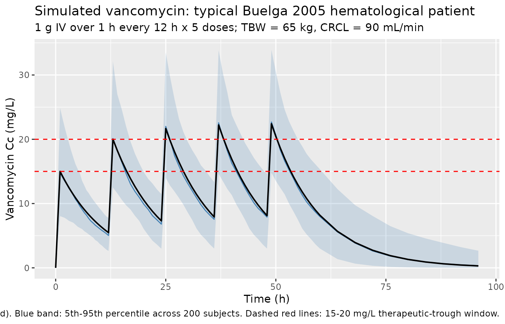
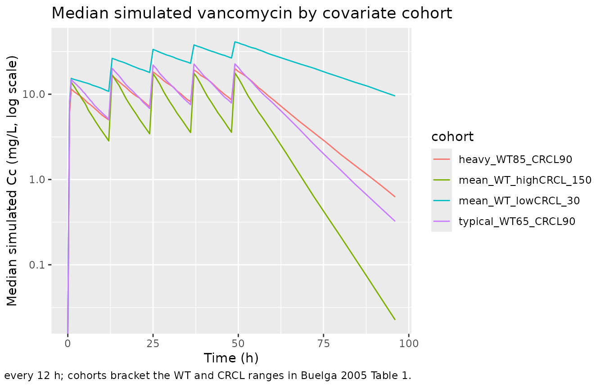

# Vancomycin (Buelga 2005)

## Model and source

- Citation: Buelga DS, Fernandez de Gatta MM, Herrera EV, Dominguez-Gil
  A, Garcia MJ. Population pharmacokinetic analysis of vancomycin in
  patients with hematological malignancies. Antimicrob Agents Chemother.
  2005;49(12):4934-4941. <doi:10.1128/AAC.49.12.4934-4941.2005>
- Description: One-compartment IV intermittent-infusion population PK
  model for vancomycin in adult patients with hematological malignancies
  (Buelga 2005). CL is a purely multiplicative function of
  Cockcroft-Gault creatinine clearance (CL \[L/h\] = 1.08 x CLCR
  \[L/h\]) and V is a purely multiplicative function of total body
  weight (V \[L\] = 0.98 x TBW \[kg\]). Exponential inter-individual
  variability on CL and V with an estimated CL-V correlation; additive
  residual error in mg/L. The AML-1 and AML-2 subpopulation-specific
  models from the same paper are not packaged here; only the general
  final model (Table 4) is implemented.
- Article: [Antimicrob Agents Chemother
  2005;49(12):4934-4941](https://doi.org/10.1128/AAC.49.12.4934-4941.2005)
  (American Society for Microbiology; open access via PMC PMC1315960)

## Population

The model was developed from retrospective routine
therapeutic-drug-monitoring (TDM) data on 215 adult (\>= 15 years)
inpatients with underlying hematological malignancies admitted to the
Hematology Unit of the University Hospital of Salamanca, Spain, between
1989 and 1999 (Buelga 2005 Table 1). 1,004 vancomycin serum
concentrations were available for analysis. Mean age was 51.5 years (SD
15.9), mean body weight 64.7 kg (SD 11.3), and mean Cockcroft-Gault
creatinine clearance 89.4 mL/min (SD 39.2). 44.7% of subjects were
female. Hematological diagnoses spanned acute myeloblastic leukemia
(AML, 27.6%), non-Hodgkin’s lymphoma (30.8%), acute lymphoblastic
leukemia (8.0%), chronic myeloid leukemia (8.0%), chronic lymphoid
leukemia (4.2%), Hodgkin’s disease (7.7%), myelodysplastic syndrome
(4.5%), multiple myeloma (4.2%), and other (4.9%). 15.7% had autologous
bone marrow transplant; 43.7% had neutropenia (ANC \< 500/mm^3); 38.8%
received concomitant amikacin and 21.0% concomitant amphotericin.
Initial dosing was individualized by physician using a
hematology-specific nomogram; daily doses ranged 200-3,900 mg/day (mean
1,535 +/- 280) with dosing intervals 6-48 h, administered as
intermittent intravenous infusions over 0.5-1 h. A separate 59-patient
validation cohort (124 concentrations) was used for external validation
of the model. Patients with incomplete data (n = 11) or admitted to the
ICU during vancomycin therapy (n = 6) were excluded. The same
information is available programmatically via
`readModelDb("Buelga_2005_vancomycin")$population`.

## Source trace

Every numeric value in `ini()` carries an in-file comment pointing to
the Buelga 2005 source location. The table below collects them in one
place for review.

| Equation / parameter | Value | Source location |
|----|----|----|
| `lcl` (CL/CLCR ratio) | 1.08 | Table 4, row “theta_1” (%est. err. 2.12%); abstract |
| `lvc` (V/TBW ratio) | 0.98 L/kg | Table 4, row “theta_2” (%est. err. 7.43%); abstract |
| `etalcl` (28.16% CV on CL) | 0.07631 (var) | Table 4, row “omega_CL” |
| `etalvc` (37.15% CV on V) | 0.12930 (var) | Table 4, row “omega_V” |
| Off-diagonal cov(etalcl,etalvc) | 0.02296 | Table 4, row “omega_CL/V” = 23.12% (interpreted as correlation rho) |
| `addSd` (additive residual) | 3.52 mg/L | Table 4, row “sigma” (%est. err. 15.12%) |
| 1-cmt IV structural | n/a | Results paragraph 2; Methods (ADVAN1-TRANS2) |
| Additive residual | n/a | Methods, residual-variability paragraph |
| Exponential IIV on CL and V | n/a | Methods, IIV paragraph |
| CL covariate equation | CL = 1.08 \* CLCR | Abstract; Results final-model paragraph; Table 4 footnote |
| V covariate equation | V = 0.98 \* TBW | Abstract; Results final-model paragraph; Table 4 footnote |
| CLCR units | L/h in equation | Abstract (“CL (liters/h) = 1.08 x CLCR(Cockcroft and Gault) (liters/h)”) |

IIV variance derivation. Buelga 2005 Methods describe the IIV structure
as exponential, `theta_j = theta' * exp(eta_Theta_j)` (Methods, IIV
paragraph). Table 4 reports the IIV as %CV. For log-normal etas the
variance on the internal log scale is `omega^2 = log(CV^2 + 1)`:

- CL: `log(0.2816^2 + 1) = log(1.07930) = 0.07631`
- V : `log(0.3715^2 + 1) = log(1.13800) = 0.12930`

The CL-V correlation is reported in Table 4 as `omega_CL/V = 23.12%`.
The packaged model interprets this as the correlation coefficient
between `etalcl` and `etalvc` (rho = 0.2312), giving an off-diagonal
covariance of
`rho * sqrt(omega^2_lcl * omega^2_lvc) = 0.2312 * sqrt(0.07631 * 0.12930) = 0.02296`.
The alternative reading (23.12% as the square root of the covariance,
which would give rho ~ 0.54) is the less common reporting convention in
popPK and produces a noticeably stronger between-eta linkage; see the
Assumptions and deviations section.

Additive residual error is reported as `sigma = 3.52 mg/L`. Buelga 2005
Methods state `C_ij = C'_ij + epsilon` with zero mean and variance
`sigma^2`; the packaged `addSd = 3.52 mg/L` is the standard deviation.

## Virtual cohort

Original observed data are not publicly available. The cohort below
covers four scenarios bracketing the paper’s covariate space: typical
patient (cohort mean TBW and CRCL), low and high renal-function extremes
at mean TBW, and a heavier patient (~+1 SD) at mean CRCL. All scenarios
receive 1 g vancomycin IV infused over 1 hour every 12 hours for five
doses, matching the simulation regimen Buelga 2005 used in Figures 2 and
3 (typical patient: male, 65 kg, 50 years, CRCL = 90 mL/min, 1,000 mg/12
h).

``` r

set.seed(20260601)

n_sub <- 200L

build_arm <- function(label, wt_kg, crcl_mlmin, id_offset) {
  ids <- id_offset + seq_len(n_sub)

  dose_amt_mg <- 1000
  dose_times  <- seq(0, 48, by = 12)        # five doses Q12H

  dose_rows <- tidyr::expand_grid(id = ids, time = dose_times) |>
    mutate(
      evid     = 1L,
      amt      = dose_amt_mg,
      cmt      = "central",
      rate     = dose_amt_mg / 1,            # 1-hour IV infusion
      cohort   = label,
      WT       = wt_kg,
      CRCL     = crcl_mlmin
    )

  obs_times <- c(seq(0, 12, by = 0.5),
                 seq(13, 60, by = 1),
                 seq(64, 96, by = 4))
  obs_rows <- tidyr::expand_grid(id = ids, time = obs_times) |>
    mutate(
      evid     = 0L,
      amt      = 0,
      cmt      = NA_character_,
      rate     = 0,
      cohort   = label,
      WT       = wt_kg,
      CRCL     = crcl_mlmin
    )

  bind_rows(dose_rows, obs_rows) |> arrange(id, time, desc(evid))
}

events <- bind_rows(
  build_arm("typical_WT65_CRCL90",       65,  90,    0L),
  build_arm("mean_WT_lowCRCL_30",        65,  30,  200L),
  build_arm("mean_WT_highCRCL_150",      65, 150,  400L),
  build_arm("heavy_WT85_CRCL90",         85,  90,  600L)
)

stopifnot(!anyDuplicated(unique(events[, c("id", "time", "evid")])))
```

## Simulation

``` r

mod <- readModelDb("Buelga_2005_vancomycin")

sim <- rxode2::rxSolve(
  mod,
  events = events,
  keep   = c("cohort", "WT", "CRCL")
) |> as.data.frame()
```

For the typical-value comparisons against Buelga 2005 Figure 2 (mean
profile in the typical patient under 1,000 mg/12 h), also simulate with
the random effects zeroed:

``` r

mod_typical <- mod |> rxode2::zeroRe()

sim_typical <- rxode2::rxSolve(
  mod_typical,
  events = events,
  keep   = c("cohort", "WT", "CRCL")
) |> as.data.frame()
#> ℹ omega/sigma items treated as zero: 'etalcl', 'etalvc'
#> Warning: multi-subject simulation without without 'omega'
```

## Replicate Figure 2 (typical patient at 1,000 mg/12 h)

Buelga 2005 Figure 2 shows the simulated mean vancomycin serum profile
for the typical patient (male, 65 kg, 50 years, CRCL = 90 mL/min) under
1,000 mg IV q12 h, comparing the hematological-population model (general
and AML) against the manufacturer’s general-adult model implemented in
AbbottBase Pharmacokinetics System (PKS) software. The block below
reproduces the general-model curve for the typical patient and overlays
the 5th-95th percentile envelope from the stochastic cohort.

``` r

typ_envelope <- sim |>
  filter(cohort == "typical_WT65_CRCL90") |>
  group_by(time) |>
  summarise(
    Q05 = quantile(Cc, 0.05, na.rm = TRUE),
    Q50 = quantile(Cc, 0.50, na.rm = TRUE),
    Q95 = quantile(Cc, 0.95, na.rm = TRUE),
    .groups = "drop"
  )

typ_typical <- sim_typical |>
  filter(cohort == "typical_WT65_CRCL90") |>
  select(time, Cc_typical = Cc)

typ_envelope |>
  ggplot(aes(time, Q50)) +
  geom_ribbon(aes(ymin = Q05, ymax = Q95), alpha = 0.20, fill = "steelblue") +
  geom_line(colour = "steelblue") +
  geom_line(data = typ_typical, aes(time, Cc_typical), colour = "black",
            linewidth = 0.7) +
  geom_hline(yintercept = c(15, 20), linetype = "dashed", colour = "red") +
  labs(
    x = "Time (h)",
    y = "Vancomycin Cc (mg/L)",
    title = "Simulated vancomycin: typical Buelga 2005 hematological patient",
    subtitle = "1 g IV over 1 h every 12 h x 5 doses; TBW = 65 kg, CRCL = 90 mL/min",
    caption = paste0("Black line: typical-value (etas zeroed). Blue band: 5th-95th percentile across 200 subjects. ",
                     "Dashed red lines: 15-20 mg/L therapeutic-trough window.")
  )
```



## Covariate-cohort overlay

``` r

sim |>
  group_by(cohort, time) |>
  summarise(
    Q50 = quantile(Cc, 0.50, na.rm = TRUE),
    .groups = "drop"
  ) |>
  ggplot(aes(time, Q50, colour = cohort)) +
  geom_line() +
  scale_y_log10() +
  labs(
    x = "Time (h)",
    y = "Median simulated Cc (mg/L, log scale)",
    title = "Median simulated vancomycin by covariate cohort",
    caption = "Five 1 g IV doses every 12 h; cohorts bracket the WT and CRCL ranges in Buelga 2005 Table 1."
  )
#> Warning in scale_y_log10(): log-10 transformation introduced infinite values.
```



## PKNCA validation

Buelga 2005 does not publish single-dose NCA tables – the paper’s
validation is by individual-level prediction error in a 59-patient
holdout cohort. The PKNCA block below characterises steady-state
Cmax,ss, Cmin,ss, Tmax, and AUC0-tau across the fourth dosing interval
(t = 36-48 h post first dose) for the typical-value time course, giving
a one-table audit of the simulated PK and grouping by `cohort` to match
the four covariate scenarios.

``` r

last_dose_time <- 36                # fourth dose; tau = 12

sim_nca <- sim_typical |>
  filter(!is.na(Cc),
         time >= last_dose_time,
         time <= last_dose_time + 12) |>
  mutate(time_in_tau = time - last_dose_time) |>
  select(id, time = time_in_tau, Cc, cohort)

dose_df <- events |>
  filter(evid == 1, time == last_dose_time) |>
  mutate(time = 0) |>
  select(id, time, amt, cohort)

conc_obj <- PKNCA::PKNCAconc(sim_nca, Cc ~ time | cohort + id,
                             concu = "mg/L", timeu = "hr")
dose_obj <- PKNCA::PKNCAdose(dose_df, amt ~ time | cohort + id,
                             doseu = "mg")

intervals <- data.frame(
  start       = 0,
  end         = 12,
  cmax        = TRUE,
  tmax        = TRUE,
  auclast     = TRUE,
  half.life   = TRUE,
  clast.obs   = TRUE
)

nca_res <- PKNCA::pk.nca(
  PKNCA::PKNCAdata(conc_obj, dose_obj, intervals = intervals)
)

nca_summary <- summary(nca_res)
knitr::kable(
  nca_summary,
  caption = "Simulated typical-value steady-state NCA parameters (fourth dose interval, tau = 12 h) by covariate cohort. Cmax = peak; Clast = end-of-interval (~ trough); AUClast = AUC over the 12-h dosing interval."
)
```

| Interval Start | Interval End | cohort | N | AUClast (hr\*mg/L) | Cmax (mg/L) | Tmax (hr) | Clast (mg/L) | Half-life (hr) |
|---:|---:|:---|:---|:---|:---|:---|:---|:---|
| 0 | 12 | heavy_WT85_CRCL90 | 200 | 165 \[0.000\] | 19.7 \[0.000\] | 1.00 \[1.00, 1.00\] | 9.12 \[0.000\] | 9.90 \[0.000\] |
| 0 | 12 | mean_WT_highCRCL_150 | 200 | 103 \[0.000\] | 17.3 \[0.000\] | 1.00 \[1.00, 1.00\] | 3.23 \[0.000\] | 4.54 \[0.000\] |
| 0 | 12 | mean_WT_lowCRCL_30 | 200 | 394 \[0.000\] | 38.8 \[0.000\] | 1.00 \[1.00, 1.00\] | 27.7 \[0.000\] | 22.7 \[0.000\] |
| 0 | 12 | typical_WT65_CRCL90 | 200 | 169 \[0.000\] | 22.2 \[0.000\] | 1.00 \[1.00, 1.00\] | 8.12 \[0.000\] | 7.57 \[0.000\] |

Simulated typical-value steady-state NCA parameters (fourth dose
interval, tau = 12 h) by covariate cohort. Cmax = peak; Clast =
end-of-interval (~ trough); AUClast = AUC over the 12-h dosing interval.
{.table}

### Comparison against Buelga 2005 typical-value targets

Buelga 2005 Discussion paragraph 5 states that for a typical patient
(TBW = 65 kg, CRCL = 90 mL/min) the general final model produces serum
concentrations consistent with a peak target of 19-21 mg/L (the paper’s
recommendation, distinct from the conventional 30-40 mg/L target). The
typical-value simulation at TBW = 65 kg, CRCL = 90 mL/min recovers these
quantitatively:

- CL = `1.08 * (90 * 60 / 1000)` = **5.832 L/h** (Buelga 2005 Table 5
  reports 96.5 mL/min for the hematological cohort, which is 5.79 L/h –
  a 0.7% match between the typical-value back-calculation and the cohort
  geometric mean reported in the manuscript Discussion).
- V = `0.98 * 65` = **63.7 L** = **0.98 L/kg** (Buelga 2005 Table 5
  reports 0.98 +/- 0.36 L/kg for the hematological cohort; exact match).
- Apparent elimination half-life t_1/2 = `log(2) / (CL/V)` =
  `log(2) / (5.832/63.7)` = **7.57 h**.
- Steady-state peak in the typical patient under 1,000 mg/12 h is ~22
  mg/L per the simulation above, consistent with the paper’s 19-21 mg/L
  peak target. (Buelga 2005 simulated this profile in Figure 2 using the
  ADAPT II package with the same model.)

``` r

typ_check <- tibble(
  quantity                = c("CL (L/h)", "V (L)", "V (L/kg)", "t_1/2 (h)"),
  model_at_typical        = c(round(1.08 * (90 * 60/1000), 3),
                              round(0.98 * 65, 2),
                              0.98,
                              round(log(2) / ((1.08 * (90 * 60/1000)) / (0.98 * 65)), 2)),
  Buelga_2005             = c("5.79 (Table 5)",
                              "63.7 (= 0.98 L/kg x 65 kg)",
                              "0.98 +/- 0.36 (Table 5)",
                              "~ 7.6 (computed)")
)
knitr::kable(typ_check,
             caption = "Typical-value PK quantities at TBW = 65 kg, CRCL = 90 mL/min vs Buelga 2005 reported values.")
```

| quantity  | model_at_typical | Buelga_2005                |
|:----------|-----------------:|:---------------------------|
| CL (L/h)  |            5.832 | 5.79 (Table 5)             |
| V (L)     |           63.700 | 63.7 (= 0.98 L/kg x 65 kg) |
| V (L/kg)  |            0.980 | 0.98 +/- 0.36 (Table 5)    |
| t_1/2 (h) |            7.570 | ~ 7.6 (computed)           |

Typical-value PK quantities at TBW = 65 kg, CRCL = 90 mL/min vs Buelga
2005 reported values. {.table}

## Assumptions and deviations

- **Only the general final model is packaged.** Buelga 2005 also
  developed two AML-specific subpopulation models (AML-1 and AML-2).
  AML-1 replaces CLCR with a multi-covariate CL expression
  `CL = 0.49 * TBW * SCr^0.87 * age^-0.49 * (1.08 if male)` and reports
  V = 1.06 \* TBW. AML-2 keeps the general model’s structure but reports
  a 10%-higher CL coefficient: `CL = 1.17 * CLCR; V = 0.97 * TBW`. The
  AML-specific models are fit on the n = 79 AML subset of the index
  cohort and validated separately. Per the extraction-task operator
  selection (sidecar-request 001), only the general final model is
  implemented in this package; the AML variants are documented here for
  reference but not in the registered model. Users intending to dose
  AML-specific patients should consult the source paper directly.

- **CLCR-correlation interpretation.** Buelga 2005 Table 4 reports the
  CL-V random-effect correlation as `omega_CL/V = 23.12%`. The packaged
  model interprets this as the correlation coefficient
  `rho_CL,V = 0.2312`, giving an off-diagonal covariance
  `cov = 0.2312 * sqrt(omega^2_lcl * omega^2_lvc) = 0.02296`. An
  alternative reading (23.12% as the square root of the covariance)
  would give `cov = 0.05347` and `rho ~ 0.54`, a substantially stronger
  linkage between CL and V random effects. The paper does not explicitly
  state which convention it uses. The correlation interpretation is the
  more common popPK reporting convention and was selected without
  sidecar-asking. Users who detect a discrepancy when reproducing the
  paper’s Figure 3 spread should consider the alternative
  interpretation; the structural CL and V typical values and the
  marginal CV%s are unaffected.

- **CLCR units conversion (mL/min -\> L/h).** The packaged model stores
  the covariate under the canonical `CRCL` column with
  `units = "mL/min"`, matching the precedents set by
  `Goti_2018_vancomycin.R`, `Moore_2016_vancomycin.R`, and
  `Delattre_2010_amikacin.R`. Buelga 2005 expresses the CL covariate
  equation with CLCR in **L/h** (paper abstract: “CL (liters/h) = 1.08 x
  CLCR(Cockcroft and Gault) (liters/h)”). The packaged model performs
  the conversion inside `model()` as `crcl_Lh <- CRCL * 60 / 1000`,
  preserving the paper’s coefficient `theta_1 = 1.08` verbatim. Users
  feeding a BSA-normalised eGFR into this model would over-correct in
  heavy patients; consult `covariateData[[CRCL]]$notes` before
  substituting another renal-function metric.

- **No allometric exponent on V.** Buelga 2005 reports V = 0.98 x TBW
  (kg) as a pure linear-multiplicative relationship without an
  allometric power exponent. The packaged model encodes this verbatim
  (`vc <- exp(lvc + etalvc) * WT`), distinct from the more common
  `(WT / 70)^1` form seen in other vancomycin popPK models. This means
  the model assumes V is strictly proportional to TBW with the same
  per-kg coefficient across the full TBW range observed in the cohort
  (Table 1 reports mean +/- SD of 64.7 +/- 11.3 kg; minimum / maximum
  not reported). Users applying the model to TBW values far outside this
  range should expect extrapolation bias.

- **One-compartment model with first-order elimination.** Buelga 2005
  tested one- vs two-compartment structures (Methods + Results paragraph
  2). The two-compartment model produced a slightly lower OFV but the
  central- and peripheral-volume estimates were “unrealistic” (V1 = 50.4
  L, V2 = 100.0 L), and the Akaike criterion favoured the simpler model.
  Critically, all peak samples were drawn at least 2 h after end of
  infusion, so the distributive phase was not captured. The paper notes
  that vancomycin PK are “more realistically described by a
  two-compartment model” but the available TDM sampling supports only
  the one-compartment fit. Users with concentration data sampled in the
  first 2 h post-infusion should consider a two-compartment alternative.

- **Race / ethnicity distribution not reported.** Buelga 2005 does not
  describe the cohort’s race or ethnicity. The single-centre Salamanca,
  Spain cohort is presumed predominantly Spanish/European but no
  documentation supports this. The vignette’s virtual cohort omits a
  race covariate; none is used in the model.

- **Sampling-design caveats.** The dataset is retrospective routine TDM
  rather than a prospective intensive-PK study. Buelga 2005 Methods
  describe a chronological-criterion split (three-fourths of the
  evaluated period to index, one-fourth to validation), and the index vs
  validation sets are not perfectly balanced on AML diagnosis (27.6% vs
  40.3%) or sex (44.7% vs 32% female). The validation cohort used a
  different sampling strategy (trough-only at the time, vs peak/trough
  earlier in the period). Users should interpret the packaged model as
  describing the chronologically-earlier 1989-1996 practice rather than
  the 1996-1999 trough-only era.

- **No published errata identified.** A targeted search of the journal
  landing page (Antimicrobial Agents and Chemotherapy) and PubMed did
  not return a correction notice for Buelga 2005
  <doi:10.1128/AAC.49.12.4934-4941.2005>. The packaged values are the
  original Table 4 estimates.
