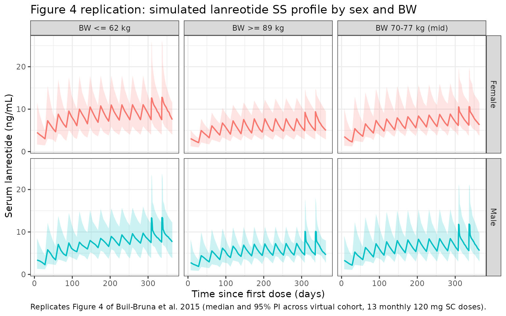
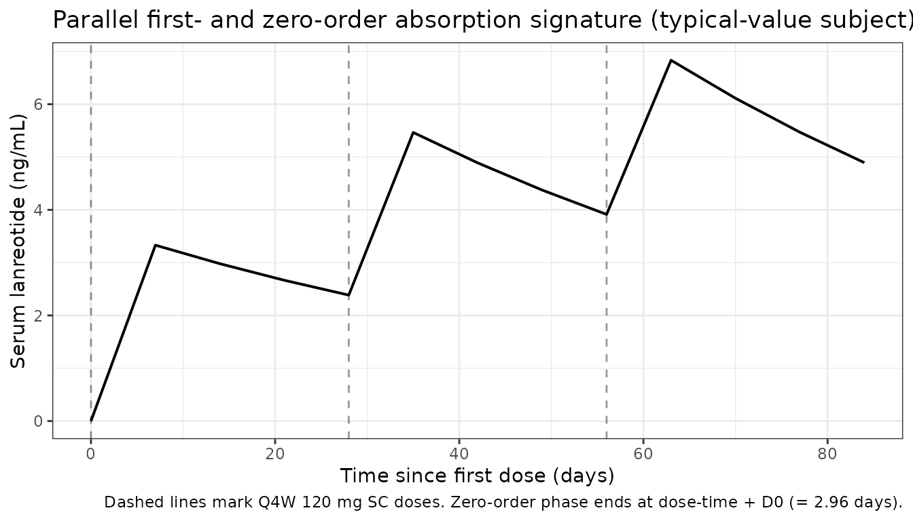

# Buil-Bruna_2015_lanreotide

``` r

library(nlmixr2lib)
library(rxode2)
#> rxode2 5.1.2 using 2 threads (see ?getRxThreads)
#>   no cache: create with `rxCreateCache()`
library(dplyr)
#> 
#> Attaching package: 'dplyr'
#> The following objects are masked from 'package:stats':
#> 
#>     filter, lag
#> The following objects are masked from 'package:base':
#> 
#>     intersect, setdiff, setequal, union
library(tidyr)
library(ggplot2)
library(PKNCA)
#> 
#> Attaching package: 'PKNCA'
#> The following object is masked from 'package:stats':
#> 
#>     filter
```

## Model and source

- Citation: Buil-Bruna N, Garrido MJ, Dehez M, Manon A, Nguyen TXQ,
  Gomez-Panzani EL, Troconiz IF. Population Pharmacokinetic Analysis of
  Lanreotide Autogel/Depot in the Treatment of Neuroendocrine Tumors:
  Pooled Analysis of Four Clinical Trials. Clin Pharmacokinet.
  2016;55(4):461-473. <doi:10.1007/s40262-015-0329-4>
- Description: One-compartment population PK model with parallel first-
  and zero-order subcutaneous absorption for lanreotide Autogel/Depot in
  patients with gastroenteropancreatic neuroendocrine tumors (Buil-Bruna
  2015). A linear effect of body weight on apparent clearance and a
  small categorical effect of sex on the first-order absorbed fraction
  are retained; absolute bioavailability F is not identifiable and is
  structurally anchored at 1, so apparent CL/F and Vd/F are reported.
  Concentrations are predicted in ng/mL; residual error is additive on
  the log-transformed observations (LTBS), mapped to proportional in
  linear space.
- Article: [Clin Pharmacokinet
  55(4):461-473](https://doi.org/10.1007/s40262-015-0329-4)

## Lanreotide Autogel/Depot population PK simulation (Buil-Bruna 2015)

Buil-Bruna et al. 2015 pooled four clinical trials (CLARINET, ELECT, a
Spanish multicentre study, and a dose-titration study; 290 patients,
1541 serum samples) to develop a one-compartment population PK model for
lanreotide Autogel/Depot administered every 4 weeks by deep subcutaneous
injection in patients with gastroenteropancreatic neuroendocrine tumors
(GEP-NETs). Absorption is modeled as two parallel mechanisms: a
first-order pathway (rate constant `ka`, absorbed fraction `F1`)
responsible for the long apparent terminal half-life (43.6 days,
flip-flop kinetics) and a small zero-order pathway (duration `D0 = 2.96`
days, fraction `F2 = 1 - F1`) that contributes the early-time
concentration peak. The only retained covariates are a linear effect of
body weight on apparent clearance and a small categorical effect of sex
on the first-order absorbed fraction.

### Population

From Buil-Bruna 2015 Table 1 and Methods (Sect. 2.1, 2.3): the pooled
dataset is 290 patients with functioning or non-functioning GEP-NETs.
Pooled mean age 60.7 years (CV 18.2%; per-study means 58.5-63.3); pooled
mean body weight 75.1 kg (CV 22.2%; per-study means 69.3-78.0 kg;
population median 74 kg used as the BW covariate reference).
Predominantly White patients (race not tested as a covariate); 10 Asian
and 10 Black/African American patients (Fig. 5b) provided a
retrospective ethnicity sanity check. Renal function spans normal (\>90
mL/min, n = 130), mild (60-89, n = 100), moderate (30-59, n = 58), and
severe (\<30, n = 2). Lanreotide was administered at 60, 90, or 120 mg
every 4 weeks; CLARINET, ELECT, and Study 3 were 120 mg only, while
Study 4 dose-titrated between 60, 90, and 120 mg. Serum lanreotide was
quantified by validated radioimmunoassay (LLOQ 0.078 ng/mL).

The same information is available programmatically as
`readModelDb("Buil-Bruna_2015_lanreotide")$population`.

### Source trace

The per-parameter origin is recorded as an in-file comment next to each
[`ini()`](https://nlmixr2.github.io/rxode2/reference/ini.html) entry in
`inst/modeldb/specificDrugs/Buil-Bruna_2015_lanreotide.R`. The table
below collects them in one place for review.

| Element | Source location | Value / form |
|----|----|----|
| Structural model | Fig. 2 + Methods Sect. 2.4.2; Results Sect. 3.3.1 | One-compartment disposition; parallel first-order (ka) + zero-order (D0) SC absorption |
| Apparent clearance CL/F | Table 2; Conclusions | 513 L/day at WT = 74 kg |
| Apparent volume Vd/F | Table 2; Abstract | 18.3 L |
| First-order absorption rate ka | Table 2 | 1.59e-2 /day (absorption half-life 43.6 day) |
| First-order absorbed fraction F1 | Table 2; Eq. 1 | 0.994 (female reference) |
| Sex effect on F1 | Table 2; Eq. 1 | -0.024 multiplied by the male indicator (1 - SEXF) |
| Zero-order duration D0 | Table 2 | 2.96 day |
| Body-weight effect on CL/F | Table 2; Eq. 2 | linear: CL/F = theta_CL \* \[1 + 9.77e-3 \* (BW - 74)\] |
| Median BW reference | Sect. 3.3.3 | 74 kg |
| IPV CL/F | Table 2 | 27% CV (variance log(1 + 0.27^2) = 0.07031) |
| IPV Vd/F | Table 2 | 150% CV (variance log(1 + 1.50^2) = 1.17865) |
| IPV ka | Table 2 | 61% CV (variance log(1 + 0.61^2) = 0.31641) |
| IPV F1 | Table 2 | 1.05% CV (variance log(1 + 0.0105^2) = 0.0001103) |
| Residual error (LTBS) | Table 2; Methods Sect. 2.4 | sigma_log = 0.275 in log(ng/mL); maps to proportional in linear-space nlmixr2 |
| Bioavailability F (absolute) | Fig. 2 caption | Not identifiable; structurally anchored at 1 (F1 + F2 = 1) |

### Virtual cohort

Individual subject-level demographics were not published. We build a
virtual cohort of 300 subjects (close to the 290-patient pooled dataset)
whose covariate marginals match Buil-Bruna 2015 Table 1: weight
log-normal with geometric mean 74 kg and CV ~22%, balanced sex (no sex
breakdown is tabulated in the paper but the pooled cohort is clearly
mixed). Each subject receives 120 mg lanreotide Autogel/Depot every 4
weeks for 13 doses (about one year of treatment, matching Fig. 4 of the
source paper).

``` r

set.seed(2015)

n_subj <- 300L

pop <- tibble(
  id     = seq_len(n_subj),
  SEXF   = rbinom(n_subj, size = 1, prob = 0.5),
  WT     = exp(rnorm(n_subj, mean = log(74), sd = sqrt(log(1 + 0.22^2))))
)

# Map each subject's WT into the same three Table-3 categories the paper
# stratifies (BW <= 62, 70-77, >= 89 kg correspond to the 20th, 50th,
# 80th percentiles of the studied population). Sit each remaining
# subject in the dominant 'mid' band so the BW grouping covers the
# entire cohort.
pop <- pop |>
  mutate(
    bw_group = case_when(
      WT <= 62 ~ "BW <= 62 kg",
      WT >= 89 ~ "BW >= 89 kg",
      TRUE     ~ "BW 70-77 kg (mid)"
    ),
    sex_group = if_else(SEXF == 1, "Female", "Male")
  )

summary(pop$WT)
#>    Min. 1st Qu.  Median    Mean 3rd Qu.    Max. 
#>   37.71   64.88   73.03   75.53   85.91  151.20
table(pop$bw_group, pop$sex_group)
#>                    
#>                     Female Male
#>   BW <= 62 kg           32   32
#>   BW >= 89 kg           20   30
#>   BW 70-77 kg (mid)     85  101
```

### Dosing and event table

Doses are delivered into the `depot` compartment. The packaged model
splits each dose internally: the `F1` fraction is absorbed via
first-order kinetics with rate `ka`, while the `F2 = 1 - F1` fraction is
delivered into `central` at a constant rate `F2 * Dose / D0` over the
first `D0 = 2.96` days after each dose (via `kzero` computed from
`podo(depot)` and `tad(depot)`). A single dose record per administration
therefore drives both pathways.

``` r

dose_amount   <- 120                            # mg lanreotide per administration
dose_interval <- 28                             # day (Q4W)
n_doses       <- 13L                            # ~1 year of treatment
last_dose_t   <- (n_doses - 1L) * dose_interval # time of the final dose
end_time      <- last_dose_t + dose_interval    # follow-up to one full SS interval

dose_times <- seq(from = 0, by = dose_interval, length.out = n_doses)

# Observation grid: coarse over the build-up phase, dense over the last
# (steady-state) dosing interval so NCA captures Cmax, Tmax, Cmin
# faithfully.
obs_times <- sort(unique(c(
  seq(0,             last_dose_t - dose_interval, by = 7),    # weekly through pre-SS
  seq(last_dose_t - dose_interval,
      last_dose_t,                                by = 1),    # daily over the penultimate interval
  seq(last_dose_t,   end_time,                    by = 0.5),  # 12-h over the final SS interval
  end_time
)))

dose_rows <- pop |>
  select(id, SEXF, WT, sex_group, bw_group) |>
  tidyr::crossing(time = dose_times) |>
  mutate(
    amt  = dose_amount,
    evid = 1L,
    cmt  = "depot",
    dv   = NA_real_
  )

obs_rows <- pop |>
  select(id, SEXF, WT, sex_group, bw_group) |>
  tidyr::crossing(time = obs_times) |>
  mutate(
    amt  = NA_real_,
    evid = 0L,
    cmt  = NA_character_,
    dv   = NA_real_
  )

events <- bind_rows(dose_rows, obs_rows) |>
  arrange(id, time, desc(evid))

stopifnot(!anyDuplicated(unique(events[, c("id", "time", "evid")])))
```

### Simulation

Two simulations are run. The deterministic typical-value simulation
([`zeroRe()`](https://nlmixr2.github.io/rxode2/reference/zeroRe.html))
replicates the noise-free curves used in Buil-Bruna 2015 Fig. 4. The
stochastic simulation carries the full Table 2 IPV structure and is the
basis of the SS NCA comparison against Table 3.

``` r

mod_typical <- rxode2::zeroRe(readModelDb("Buil-Bruna_2015_lanreotide"))
#> ℹ parameter labels from comments will be replaced by 'label()'

sim_typical <- rxSolve(
  object     = mod_typical,
  events     = events,
  returnType = "data.frame",
  keep       = c("sex_group", "bw_group", "WT", "SEXF")
) |>
  as_tibble()
#> ℹ omega/sigma items treated as zero: 'etalcl', 'etalvc', 'etalka', 'etalfdepot'
#> Warning: multi-subject simulation without without 'omega'
```

``` r

mod <- readModelDb("Buil-Bruna_2015_lanreotide")

sim <- rxSolve(
  object     = mod,
  events     = events,
  returnType = "data.frame",
  keep       = c("sex_group", "bw_group", "WT", "SEXF")
) |>
  as_tibble()
#> ℹ parameter labels from comments will be replaced by 'label()'
```

### Replicate Figure 4: 1-year SS profile by sex and body weight

Figure 4 of Buil-Bruna 2015 shows simulated serum lanreotide profiles
during 1 year of Q4W 120 mg dosing, stratified by sex and body weight
(2.5th / 50th / 97.5th percentiles by sex). The figure plots median and
2.5th-97.5th percentile envelopes of 1000 simulations per panel. The
replication below uses the same stratification but pools the virtual
cohort’s sampled weights (a smooth log-normal centred at 74 kg, CV 22%)
into three bins matching Table 3.

``` r

fig4 <- sim |>
  filter(time >= 0, !is.na(Cc), Cc > 0) |>
  group_by(sex_group, bw_group, time) |>
  summarise(
    med = median(Cc),
    q05 = quantile(Cc, 0.025),
    q95 = quantile(Cc, 0.975),
    .groups = "drop"
  )

ggplot(fig4, aes(x = time, y = med, colour = sex_group, fill = sex_group)) +
  geom_ribbon(aes(ymin = q05, ymax = q95), alpha = 0.2, colour = NA) +
  geom_line(linewidth = 0.7) +
  facet_grid(sex_group ~ bw_group) +
  labs(
    x       = "Time since first dose (days)",
    y       = "Serum lanreotide (ng/mL)",
    colour  = "Sex",
    fill    = "Sex",
    title   = "Figure 4 replication: simulated lanreotide SS profile by sex and BW",
    caption = "Replicates Figure 4 of Buil-Bruna et al. 2015 (median and 95% PI across virtual cohort, 13 monthly 120 mg SC doses)."
  ) +
  theme_bw() +
  theme(legend.position = "none")
```



### Inspect the parallel-absorption signature near each dose

The typical-value profile makes the parallel-absorption signature
visible: a small `D0`-bounded zero-order ledge in the first ~3 days
after each dose riding on top of the slow first-order rise/decay.

``` r

sim_typical |>
  filter(id %in% c(1L), time <= 84) |>   # first three doses for one subject
  ggplot(aes(x = time, y = Cc)) +
  geom_line(linewidth = 0.7) +
  geom_vline(xintercept = dose_times[1:3], linetype = "dashed", alpha = 0.4) +
  labs(
    x       = "Time since first dose (days)",
    y       = "Serum lanreotide (ng/mL)",
    title   = "Parallel first- and zero-order absorption signature (typical-value subject)",
    caption = "Dashed lines mark Q4W 120 mg SC doses. Zero-order phase ends at dose-time + D0 (= 2.96 days)."
  ) +
  theme_bw()
```



## PKNCA validation

We compute steady-state pharmacokinetic descriptors (Cmin, Cmax, Cavg,
AUCs) over the last dosing interval and compare against Buil-Bruna 2015
Table 3, which reports geometric mean and range for the same descriptors
stratified by sex and body weight at the 120 mg dose level. The PKNCA
formula groups by treatment to match the paper’s reporting units.

``` r

# Restrict NCA to the final SS interval [last_dose_t, end_time]
nca_conc <- sim |>
  filter(time >= last_dose_t, time <= end_time, !is.na(Cc), Cc > 0) |>
  select(id, time, Cc, sex_group, bw_group)

# One dose row per subject for the final dose
nca_dose <- dose_rows |>
  filter(time == last_dose_t) |>
  transmute(id, time, amt, sex_group, bw_group)
```

``` r

conc_obj <- PKNCAconc(nca_conc, Cc ~ time | sex_group + bw_group + id,
                      concu = "ng/mL", timeu = "day")
dose_obj <- PKNCAdose(nca_dose, amt ~ time | sex_group + bw_group + id,
                      doseu = "mg")

# AUC over [start_ss, start_ss + tau], plus Cmax, Tmax, Cmin, Cav
intervals <- data.frame(
  start    = last_dose_t,
  end      = end_time,
  cmax     = TRUE,
  tmax     = TRUE,
  cmin     = TRUE,
  auclast  = TRUE,
  cav      = TRUE
)

nca_data <- PKNCAdata(conc_obj, dose_obj, intervals = intervals)
nca_res  <- pk.nca(nca_data)
```

``` r

# Geometric-mean summary by overall, sex, and BW group, matching the
# stratifications in Buil-Bruna 2015 Table 3.
gmean <- function(x) exp(mean(log(x[is.finite(x) & x > 0])))

results_long <- as.data.frame(nca_res$result) |>
  filter(PPTESTCD %in% c("cmin", "cmax", "cav", "auclast")) |>
  inner_join(pop |> select(id, sex_group, bw_group),
             by = c("id", "sex_group", "bw_group"))

# Sex-only stratification
sex_tbl <- results_long |>
  group_by(sex_group, PPTESTCD) |>
  summarise(
    gmean = gmean(PPORRES),
    pmin  = min(PPORRES,    na.rm = TRUE),
    pmax  = max(PPORRES,    na.rm = TRUE),
    .groups = "drop"
  )

# BW-only stratification (Table 3 BW columns)
bw_tbl <- results_long |>
  group_by(bw_group, PPTESTCD) |>
  summarise(
    gmean = gmean(PPORRES),
    pmin  = min(PPORRES,    na.rm = TRUE),
    pmax  = max(PPORRES,    na.rm = TRUE),
    .groups = "drop"
  )

# Whole-population
whole_tbl <- results_long |>
  group_by(PPTESTCD) |>
  summarise(
    gmean = gmean(PPORRES),
    pmin  = min(PPORRES,    na.rm = TRUE),
    pmax  = max(PPORRES,    na.rm = TRUE),
    .groups = "drop"
  )

knitr::kable(whole_tbl, digits = 2, caption = "Simulated whole-population SS NCA (compare against Buil-Bruna 2015 Table 3 'Whole population').")
```

| PPTESTCD |  gmean |  pmin |   pmax |
|:---------|-------:|------:|-------:|
| auclast  | 220.42 | 53.77 | 457.06 |
| cav      |   7.87 |  1.92 |  16.32 |
| cmax     |  11.31 |  2.97 |  25.53 |
| cmin     |   5.86 |  1.29 |  12.76 |

Simulated whole-population SS NCA (compare against Buil-Bruna 2015 Table
3 ‘Whole population’). {.table}

``` r

knitr::kable(sex_tbl,   digits = 2, caption = "Simulated SS NCA by sex (compare against Table 3 'Males' / 'Females').")
```

| sex_group | PPTESTCD |  gmean |  pmin |   pmax |
|:----------|:---------|-------:|------:|-------:|
| Female    | auclast  | 230.32 | 92.93 | 457.06 |
| Female    | cav      |   8.23 |  3.32 |  16.32 |
| Female    | cmax     |  10.98 |  3.64 |  25.53 |
| Female    | cmin     |   6.20 |  2.66 |  12.72 |
| Male      | auclast  | 212.43 | 53.77 | 451.63 |
| Male      | cav      |   7.59 |  1.92 |  16.13 |
| Male      | cmax     |  11.60 |  2.97 |  24.21 |
| Male      | cmin     |   5.59 |  1.29 |  12.76 |

Simulated SS NCA by sex (compare against Table 3 ‘Males’ / ‘Females’).
{.table}

``` r

knitr::kable(bw_tbl,    digits = 2, caption = "Simulated SS NCA by BW band (compare against Table 3 BW columns).")
```

| bw_group          | PPTESTCD |  gmean |   pmin |   pmax |
|:------------------|:---------|-------:|-------:|-------:|
| BW 70-77 kg (mid) | auclast  | 223.33 | 125.45 | 457.06 |
| BW 70-77 kg (mid) | cav      |   7.98 |   4.48 |  16.32 |
| BW 70-77 kg (mid) | cmax     |  11.58 |   5.49 |  25.53 |
| BW 70-77 kg (mid) | cmin     |   5.84 |   1.29 |  12.76 |
| BW \<= 62 kg      | auclast  | 268.40 | 142.84 | 428.01 |
| BW \<= 62 kg      | cav      |   9.59 |   5.10 |  15.29 |
| BW \<= 62 kg      | cmax     |  13.69 |   5.54 |  23.96 |
| BW \<= 62 kg      | cmin     |   7.18 |   3.75 |  12.72 |
| BW \>= 89 kg      | auclast  | 163.13 |  53.77 | 330.00 |
| BW \>= 89 kg      | cav      |   5.83 |   1.92 |  11.79 |
| BW \>= 89 kg      | cmax     |   8.14 |   2.97 |  18.00 |
| BW \>= 89 kg      | cmin     |   4.57 |   1.66 |   8.17 |

Simulated SS NCA by BW band (compare against Table 3 BW columns).
{.table}

### Comparison against Buil-Bruna 2015 Table 3

Table 3 of the paper reports geometric mean (range) for Cmin, Cavg, Cmax
(ng/mL), and AUCs (ug.day/L, numerically equal to ng.day/mL):

| Stratum | Cmin (ng/mL) | Cavg (ng/mL) | Cmax (ng/mL) | AUCs (ng.day/mL) |
|----|----|----|----|----|
| Whole population | 6.23 (0.3-14.7) | 8.35 (3.8-18.0) | 12.77 (4.2-63.8) | 231.5 (103.1-492.0) |
| Males | 5.5 (0.3-14.5) | 7.7 (4.5-17.9) | 13.7 (6-63.7) | 216 (124-490) |
| Females | 7 (2-14.7) | 9 (3.8-18) | 11.9 (4.2-40.2) | 247 (103-492) |
| BW \<= 62 kg | 7.7 (2-14.7) | 10.3 (6.3-17.3) | 15.3 (7-63.7) | 285 (170-489) |
| BW 70-77 kg | 6.4 (3.5-12.4) | 8.3 (5.9-14.6) | 12.2 (6.8-31.8) | 228 (160-398) |
| BW \>= 89 kg | 5.3 (2.8-14.5) | 6.8 (3.8-17.9) | 10.1 (4.2-23.6) | 188 (103-490) |

The simulated tables above should land in the same range. The direction
of the body-weight effect (lower Cmax / Cavg / AUC for heavier patients)
is mechanistic in the model (CL/F linear in WT) and must reproduce; sex
differences are very small because the F1-on-sex effect is only 2.4% in
absolute terms (Table 2 theta_SEX = -0.024 applied to the male
indicator).

## Assumptions and deviations

- **Absolute bioavailability F = 1 (structural anchor).** The paper
  declares F is not identifiable (Fig. 2 caption: “F absolute
  bioavailability (not known and arbitrarily set to 1)”). All reported
  parameters are therefore apparent (CL/F, Vd/F); the model faithfully
  preserves this anchor by routing the F1 fraction into `depot` and the
  F2 = 1 - F1 fraction into `central` so that F1 + F2 =
  1.  
- **F1 IPV close to its bound.** Buil-Bruna 2015 Methods state IPV was
  modeled exponentially. The reported IPV for F1 is 1.05% CV (Table 2)
  applied to a typical value of 0.994 (females), which sits very close
  to the structural upper bound F1 \<= 1. Under exponential IIV a
  meaningful fraction of simulated subjects can sample F1 \> 1; in the
  model the resulting F2 = 1 - F1 \< 0 keeps mass balance intact (depot
  delivers F1 \* dose and `kzero` removes the complementary excess from
  central over D0), but the F2 -\> negative interpretation is
  non-physical. Stochastic simulations near this boundary are expected
  to be numerically robust because the magnitude of the out-of-bound
  excursion is tiny; users sensitive to the boundary should clip F1 to
  (0, 1\] in the simulation post-processing.
- **Race / ethnicity not modeled.** Buil-Bruna 2015 did not test RACE as
  a covariate because the cohort was predominantly White (Sect. 3.2).
  Fig. 5b confirmed retrospectively that observed Asian (n = 10) and
  Black/African American (n = 10) profiles fell within the population
  90% PI. The virtual cohort here does not stratify by race.
- **Sex split assumed 50/50.** The paper does not tabulate sex
  proportions in the pooled population; per-study male/female counts are
  not given in the extractable Table 1 layout. The virtual cohort uses a
  50/50 split for illustration.
- **Body-weight distribution.** Individual weights were not published.
  The virtual cohort draws WT from a log-normal with geometric mean 74
  kg (the published median) and CV 22% (Buil-Bruna 2015 Table 1
  pooled-CV row); the resulting BW band counts are not exactly the
  paper’s 20/50/80 percentile bins but cover the same range.
- **Time-varying covariates not exercised.** The paper applies the
  Wahlby et al. 2004 time-varying-covariate adjustment for BW changes
  during the study (Sect. 3.3.3); the virtual cohort holds WT constant
  at baseline. The reported impact of including time-varying BW was a
  -2LL reduction of 7.96 points with no change in IPV or other
  parameters, so the constant-WT approximation is a faithful
  simplification.
- **NCA stratification approximates Table 3.** The paper’s BW bands
  (\<=62, 70-77, \>=89 kg) correspond to the 20th, 50th, and 80th
  percentiles of the studied population (Methods Sect. 2.4.4). The
  virtual cohort uses the same numerical band edges; the resulting
  per-band sample sizes are determined by the log-normal sampling.
