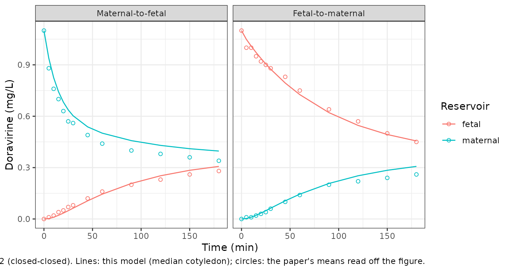

# Doravirine placental cotyledon perfusion (Bukkems 2022)

## Model and source

    #> ℹ parameter labels from comments will be replaced by 'label()'

- Citation: Bukkems VE, van Hove H, Roelofsen D, Freriksen JJM, van
  Ewijk-Beneken Kolmer EWJ, Burger DM, van Drongelen J, Svensson EM,
  Greupink R, Colbers A. Prediction of Maternal and Fetal Doravirine
  Exposure by Integrating Physiologically Based Pharmacokinetic Modeling
  and Human Placenta Perfusion Experiments. Clin Pharmacokinet.
  2022;61:1129-1141. <doi:10.1007/s40262-022-01127-0>. PMCID:
  PMC9349081. Structure: Section 2.2, Figure 1A and Equations 1, 2, 4, 6
  and 7; fixed inputs: Table 1; final estimates: Table 2; cotyledon
  weights: Electronic Supplementary Material Online Resource 4.

- Article: <https://doi.org/10.1007/s40262-022-01127-0>

- Open-access full text: <https://europepmc.org/article/MED/PMC9349081>

## What these files are, and what they are not

Bukkems and colleagues built two kinds of model:

| \# | Model | Implementation | In this package? |
|----|----|----|----|
| 1 | **Ex vivo cotyledon perfusion model** (Section 2.2, Figure 1A, Equations 1-7, Tables 1-2; closed-open re-fit in ESM Online Resources 13-19) | NONMEM 7.4 | **yes** |
| 2 | Whole-body maternal-fetal pregnancy PBPK model with a permeability-limited placenta (ESM Online Resource 10) | Simcyp V20 | no |

Model 2 is a Simcyp platform model: its organ volumes and blood flows,
tissue partition coefficients and CYP3A4 reference concentrations are
computed inside the Simcyp pregnancy population database and are not
printed in the paper, so it cannot be reconstructed from the
publication. What transfers between the two is a pair of numbers: the
fitted maternal- and fetal-facing transfer clearances, `CLpdm` and
`CLpdf`, which the authors converted to 0.0507 and 0.0075 L/h/mL
placenta and imputed into the placenta sub-model of the Simcyp model
(Section 3.3).

Model 1 is self-contained. It is five ODEs whose rate laws are printed
as Equations 1-7, whose volumes, flows and fractions unbound are in
Table 1, and whose two fitted clearances and the residual error are in
Table 2. The diffusion-only structure (Figure 1A) was selected over the
diffusion + P-glycoprotein structure (Figure 1B) because adding active
transport did not improve the fit (dOFV 0.007) and the transport
clearance was tiny and imprecise (Section 3.2).

The authors fitted the same structure twice, to two experimental
configurations, and this package ships both:

- **`Bukkems_2022_doravirine_placentaperfusion`** – the primary
  **closed-closed** fit (both circulations recirculating; `CLpdm` 37.2,
  `CLpdf` 5.5 mL/min), used for the PBPK predictions.
- **`Bukkems_2022_doravirine_placentaperfusion_closedopen`** – the
  **closed-open** re-fit (the dosed circulation recirculates, the other
  is single-pass; `CLpdm` 11.0, `CLpdf` 4.3 mL/min), a sensitivity
  analysis of the perfusion configuration (Section 2.5, 3.5; Online
  Resources 13-19).

``` r

mod_cc <- readModelDb("Bukkems_2022_doravirine_placentaperfusion")
mod_co <- readModelDb("Bukkems_2022_doravirine_placentaperfusion_closedopen")
ui_cc <- rxode2::rxode(mod_cc)
#> ℹ parameter labels from comments will be replaced by 'label()'
ui_co <- rxode2::rxode(mod_co)
#> ℹ parameter labels from comments will be replaced by 'label()'
```

## Population

The model describes an isolated human term placenta, not a patient
population. One intact cotyledon per placenta was perfused in a dual
circuit, with maternal and fetal flows of 12 and 6 mL/min. Doravirine
was added to the maternal circulation (maternal-to-fetal, MTF,
direction) or to the fetal circulation (fetal-to-maternal, FTM,
direction) at a nominal 0.96 mg/L (192 ug in a 200 mL reservoir) to
mimic the Cmax in nonpregnant adults. Samples were drawn over 180 min.

The closed-closed experiments used eight placentas (four per direction)
from deliveries at 37-40 weeks (seven by caesarean section) with
cotyledon weights 18.9-64.4 g, median 32.55 g (ESM Online Resource 4).
The closed-open experiments used six placentas (three per direction),
38-40 weeks, cotyledon weights 22.5-41.4 g, median 33.15 g (ESM Online
Resource 14).

The perfused cotyledon weight is carried as the covariate
`WT_COTYLEDON`: the three placental sub-volumes and both transfer
clearances scale linearly with `WT_COTYLEDON / 42` from the typical 42 g
(44.02 mL) cotyledon the parameters are reported for. The perfusion
direction is carried as `PERFUSION_FETAL_TO_MATERNAL` (0 = maternal
dosing, 1 = fetal dosing); it selects the direction-specific residual
error, and in the closed-open model it also selects which circulation is
the single-pass (open) one.

## Source trace

| Quantity | Value | Source |
|----|----|----|
| Maternal flow `Q_M` (`q_mat`) | 12 mL/min | Table 1 / OR 17 |
| Fetal flow `Q_F` (`q_fet`) | 6 mL/min | Table 1 / OR 17 |
| Reservoir volume (closed) | 200 mL | Table 1 / OR 17 |
| Open-side collecting reservoir | 3 mL | OR 17 (closed-open) |
| Maternal placenta `V_MP` | 11.55% of 44.02 (5.08 mL) | Table 1 / OR 17 |
| Placental barrier `V_PB` | 11.05% of 44.02 (4.86 mL) | Table 1 / OR 17 |
| Fetal placenta `V_FP` | 8.25% of 44.02 (3.63 mL) | Table 1 / OR 17 |
| Ex vivo fraction unbound `FU` | 0.529 | Table 1 / OR 17 |
| Barrier fraction unbound `FUp` | 0.01 | Table 1 / OR 17 |
| `CLpdm` (closed-closed) | 37.2 mL/min (95% CI 19.8-73.7) | Table 2 |
| `CLpdf` (closed-closed) | 5.5 mL/min (95% CI 3.1-9.8) | Table 2 |
| `CLpdm` (closed-open) | 11.0 mL/min (95% CI 5.6-22.7) | OR 19 |
| `CLpdf` (closed-open) | 4.3 mL/min (95% CI 2.3-8.3) | OR 19 |
| IIV `CLpdm`, `CLpdf` | fixed 100% CV | Table 2 / OR 19 |
| Additive residual error (closed-closed) | 0.000007 ug/mL | Table 2 |
| Proportional residual error (closed-closed) | 7.5% (MTF), 12.6% (FTM) | Table 2 |
| Additive residual error (closed-open) | 0.00188 (MTF), 0.00007 (FTM) ug/mL | OR 19 |
| Proportional residual error (closed-open) | 4.5% (MTF), 8.7% (FTM) | OR 19 |
| Equations 1, 2, 4, 6, 7 | diffusion-only balances | Section 2.2 |
| Reservoir concentrations at 180 min | see below | Results 3.1 |

The two P-gp equations (3 and 5) replace equations 2 and 4 in the
rejected transport model; both files use the diffusion-only equations 1,
2, 4, 6, 7. Proportional CVs are back-transformed to SDs with the
footnote-b lognormal relation `SD = sqrt(log(1 + CV^2))`.

## Simulation helper

Each experiment is one bolus of doravirine into the dosed reservoir,
followed for 180 min. The random effects are set to zero (the fixed 100%
CV between-placenta variability is exercised separately below). The
covariate columns – cotyledon weight and perfusion direction – are
supplied in the event data frame.

``` r

tgrid <- c(0, 5, 10, 15, 20, 25, 30, 45, 60, 90, 120, 150, 180)

solve_perfusion <- function(ui, ftm, wt, dose_ug = 192) {
  modT <- rxode2::zeroRe(ui)
  dose_cmt <- if (ftm == 1L) "fetal_reservoir" else "maternal_reservoir"
  ev <- rbind(
    data.frame(time = 0, evid = 1L, amt = dose_ug, cmt = dose_cmt, dvid = NA_integer_),
    data.frame(time = tgrid, evid = 0L, amt = 0, cmt = "maternal_reservoir", dvid = 1L)
  )
  ev$id <- 1L
  ev$WT_COTYLEDON <- wt
  ev$PERFUSION_FETAL_TO_MATERNAL <- ftm
  out <- as.data.frame(rxode2::rxSolve(modT, ev, returnType = "data.frame"))
  out[, c("time", "Cmaternal", "Cfetal")]
}
```

## Closed-closed model: reservoir concentrations at 180 min

Results 3.1 reports the median total reservoir concentrations at the end
of the experiment. After dosing the maternal circulation the maternal
and fetal medians were 0.34 and 0.28 mg/L (FTM ratio 0.82); after dosing
the fetal circulation they were 0.28 and 0.42 mg/L (MTF ratio 0.61). The
model is simulated at the cohort-median 32.55 g cotyledon in both
directions.

``` r

mtf_cc <- solve_perfusion(ui_cc, ftm = 0L, wt = 32.55)
#> Warning: No sigma parameters in the model
#> ℹ omega/sigma items treated as zero: 'etalcl_pdm', 'etalcl_pdf'
ftm_cc <- solve_perfusion(ui_cc, ftm = 1L, wt = 32.55)
#> Warning: No sigma parameters in the model
#> ℹ omega/sigma items treated as zero: 'etalcl_pdm', 'etalcl_pdf'

end_cc <- tibble::tibble(
  Direction = c("Maternal-to-fetal", "Fetal-to-maternal"),
  `Maternal 180 min (model)` = c(
    mtf_cc$Cmaternal[mtf_cc$time == 180], ftm_cc$Cmaternal[ftm_cc$time == 180]
  ),
  `Maternal 180 min (paper)` = c(0.34, 0.28),
  `Fetal 180 min (model)` = c(
    mtf_cc$Cfetal[mtf_cc$time == 180], ftm_cc$Cfetal[ftm_cc$time == 180]
  ),
  `Fetal 180 min (paper)` = c(0.28, 0.42)
)
knitr::kable(end_cc, digits = 3)
```

| Direction | Maternal 180 min (model) | Maternal 180 min (paper) | Fetal 180 min (model) | Fetal 180 min (paper) |
|:---|---:|---:|---:|---:|
| Maternal-to-fetal | 0.346 | 0.34 | 0.268 | 0.28 |
| Fetal-to-maternal | 0.268 | 0.28 | 0.398 | 0.42 |

``` r


stopifnot(
  # Structural check: a mis-transcribed flow, volume or clearance moves these
  # end concentrations by tens of percent. Each of the four reported medians is
  # reproduced within 10% at the median cotyledon.
  abs(end_cc$`Maternal 180 min (model)` - end_cc$`Maternal 180 min (paper)`) /
    end_cc$`Maternal 180 min (paper)` < 0.10,
  abs(end_cc$`Fetal 180 min (model)` - end_cc$`Fetal 180 min (paper)`) /
    end_cc$`Fetal 180 min (paper)` < 0.10
)
```

## Replicate Figure 3 (closed-closed curves)

Figure 3 shows the mean maternal- and fetal-reservoir doravirine curves
for each direction. The points below were read off the figure by the
maintainers at the plotted time points (reading precision about 0.02
mg/L). The observed curves start near 1.1 mg/L rather than the nominal
0.96; the model is linear, so it is dosed to the observed start (220 ug)
to overlay the transfer shape directly.

``` r

fig3 <- tibble::tribble(
  ~direction, ~time, ~maternal, ~fetal,
  "MTF",   0, 1.10, 0.00,
  "MTF",   5, 0.88, 0.01,
  "MTF",  10, 0.76, 0.02,
  "MTF",  15, 0.70, 0.04,
  "MTF",  20, 0.63, 0.05,
  "MTF",  25, 0.57, 0.07,
  "MTF",  30, 0.56, 0.08,
  "MTF",  45, 0.49, 0.12,
  "MTF",  60, 0.44, 0.16,
  "MTF",  90, 0.40, 0.20,
  "MTF", 120, 0.38, 0.23,
  "MTF", 150, 0.36, 0.26,
  "MTF", 180, 0.34, 0.28,
  "FTM",   0, 0.00, 1.10,
  "FTM",   5, 0.01, 1.00,
  "FTM",  10, 0.01, 1.00,
  "FTM",  15, 0.02, 0.95,
  "FTM",  20, 0.03, 0.92,
  "FTM",  25, 0.04, 0.90,
  "FTM",  30, 0.06, 0.88,
  "FTM",  45, 0.10, 0.83,
  "FTM",  60, 0.14, 0.75,
  "FTM",  90, 0.20, 0.64,
  "FTM", 120, 0.22, 0.57,
  "FTM", 150, 0.24, 0.50,
  "FTM", 180, 0.26, 0.45
)

mtf_fig <- solve_perfusion(ui_cc, ftm = 0L, wt = 32.55, dose_ug = 220)
#> Warning: No sigma parameters in the model
#> ℹ omega/sigma items treated as zero: 'etalcl_pdm', 'etalcl_pdf'
ftm_fig <- solve_perfusion(ui_cc, ftm = 1L, wt = 32.55, dose_ug = 220)
#> Warning: No sigma parameters in the model
#> ℹ omega/sigma items treated as zero: 'etalcl_pdm', 'etalcl_pdf'

sim_long <- bind_rows(
  mtf_fig |> mutate(direction = "MTF"),
  ftm_fig |> mutate(direction = "FTM")
) |>
  pivot_longer(c(Cmaternal, Cfetal), names_to = "reservoir", values_to = "sim") |>
  mutate(reservoir = recode(reservoir, Cmaternal = "maternal", Cfetal = "fetal"))

obs_long <- fig3 |>
  pivot_longer(c(maternal, fetal), names_to = "reservoir", values_to = "obs")
```

``` r

ggplot(sim_long, aes(time, sim, colour = reservoir)) +
  geom_line() +
  geom_point(
    data = obs_long, aes(time, obs, colour = reservoir),
    inherit.aes = FALSE, shape = 1
  ) +
  facet_wrap(~ factor(direction, c("MTF", "FTM")),
    labeller = as_labeller(c(MTF = "Maternal-to-fetal", FTM = "Fetal-to-maternal"))
  ) +
  labs(
    x = "Time (min)", y = "Doravirine (mg/L)", colour = "Reservoir",
    caption = "Replicates Figure 3 of Bukkems 2022 (closed-closed). Lines: this model (median cotyledon); circles: the paper's means read off the figure."
  ) +
  theme_bw()
```



``` r

cmp <- sim_long |>
  inner_join(obs_long, by = c("direction", "time", "reservoir")) |>
  filter(time > 0)
cmp_dosed <- cmp |>
  filter((direction == "MTF" & reservoir == "maternal") |
    (direction == "FTM" & reservoir == "fetal"))
stopifnot(
  # Dosed-reservoir decline: a wrong flow, volume or clearance moves the
  # whole curve by tens of percent.
  median(abs(cmp_dosed$sim - cmp_dosed$obs) / cmp_dosed$obs) < 0.12,
  # Whole-figure envelope, both reservoirs, both directions.
  quantile(abs(cmp$sim - cmp$obs), 0.9) < 0.1
)
```

The transfer shape is reproduced in both directions. The model is for
the median cotyledon, whereas the observed curves are means over
placentas of 18.9-64.4 g, which is why the dosed reservoir sits slightly
off the observed mean late in the fetal-to-maternal experiment.

## Closed-open model: configuration sensitivity analysis

The closed-open re-fit lowered `CLpdm` from 37.2 to 11.0 mL/min and
`CLpdf` from 5.5 to 4.3 mL/min (70% and 22% lower; Section 3.5), but the
95% CIs overlapped and the impact on the PBPK predictions was marginal.
In the closed-open circuit the dosed circulation recirculates (200 mL
reservoir) while the other is single-pass, so its collecting reservoir
(3 mL) only ever holds a dilute effluent.

``` r

mtf_co <- solve_perfusion(ui_co, ftm = 0L, wt = 33.15)
#> Warning: No sigma parameters in the model
#> ℹ omega/sigma items treated as zero: 'etalcl_pdm', 'etalcl_pdf'
ftm_co <- solve_perfusion(ui_co, ftm = 1L, wt = 33.15)
#> Warning: No sigma parameters in the model
#> ℹ omega/sigma items treated as zero: 'etalcl_pdm', 'etalcl_pdf'

co_end <- tibble::tibble(
  Direction = c("Maternal-to-fetal", "Fetal-to-maternal"),
  `Closed reservoir 180 min` = c(
    mtf_co$Cmaternal[mtf_co$time == 180], ftm_co$Cfetal[ftm_co$time == 180]
  ),
  `Open effluent 180 min` = c(
    mtf_co$Cfetal[mtf_co$time == 180], ftm_co$Cmaternal[ftm_co$time == 180]
  )
)
knitr::kable(co_end, digits = 3)
```

| Direction         | Closed reservoir 180 min | Open effluent 180 min |
|:------------------|-------------------------:|----------------------:|
| Maternal-to-fetal |                    0.329 |                 0.062 |
| Fetal-to-maternal |                    0.384 |                 0.038 |

``` r


stopifnot(
  # The dosed (closed) reservoir declines to a few tenths of the start, and the
  # single-pass open side stays an order of magnitude below it (Online Resource
  # 15 A/B, digitised: closed reservoir ~0.33-0.40, open effluent ~0.03-0.06).
  co_end$`Closed reservoir 180 min` > 0.20,
  co_end$`Closed reservoir 180 min` < 0.50,
  co_end$`Open effluent 180 min` < 0.5 * co_end$`Closed reservoir 180 min`
)
```

The closed reservoir declines to roughly a third of its starting value
while the open-side effluent stays low, matching the Online Resource 15
A/B curves for the two directions.

## Between-placenta variability

Both fits carried a between-placenta variability fixed at 100% CV on
each transfer clearance. Simulating a cohort of 200 cotyledons in the
maternal-to-fetal direction (closed-closed) shows the spread this
produces in the fetal reservoir at 180 min.

``` r

set.seed(74)
n_cot <- 200
obs_t <- c(0, 60, 120, 180)
ev <- do.call(rbind, lapply(seq_len(n_cot), function(i) {
  d <- rbind(
    data.frame(time = 0, evid = 1L, amt = 192, cmt = "maternal_reservoir", dvid = NA_integer_),
    data.frame(time = obs_t, evid = 0L, amt = 0, cmt = "maternal_reservoir", dvid = 1L)
  )
  d$id <- i
  d
}))
ev$WT_COTYLEDON <- 32.55
ev$PERFUSION_FETAL_TO_MATERNAL <- 0L
sim_pop <- as.data.frame(rxode2::rxSolve(ui_cc, ev, returnType = "data.frame"))
f180 <- sim_pop$Cfetal[sim_pop$time == 180]
summary(f180)
#>    Min. 1st Qu.  Median    Mean 3rd Qu.    Max. 
#> 0.04568 0.21540 0.26410 0.24527 0.29044 0.31417
stopifnot(
  # The typical-value fetal reservoir at 180 min (~0.27) sits inside the
  # cohort, and the 100% CV spread is wide.
  median(f180) > 0.15, median(f180) < 0.40,
  stats::IQR(f180) > 0.02
)
```

## NCA

The paper reports no non-compartmental parameters for the ex vivo
experiment, so there is no published NCA to compare with. For reference,
PKNCA summarises the simulated dosed- and receiving-reservoir exposures
over the 180-min maternal-to-fetal closed-closed experiment.

``` r

conc <- mtf_fig |>
  pivot_longer(c(Cmaternal, Cfetal), names_to = "reservoir", values_to = "conc") |>
  mutate(id = 1L, reservoir = recode(reservoir, Cmaternal = "maternal", Cfetal = "fetal")) |>
  filter(!is.na(conc))
dose_df <- tibble::tibble(
  id = 1L, time = 0,
  amt = c(220, 0),
  reservoir = c("maternal", "fetal")
)
conc_obj <- PKNCAconc(conc, conc ~ time | reservoir + id)
dose_obj <- PKNCAdose(dose_df, amt ~ time | reservoir + id)
intervals <- data.frame(start = 0, end = 180, cmax = TRUE, tmax = TRUE, auclast = TRUE)
nca <- pk.nca(PKNCAdata(conc_obj, dose_obj, intervals = intervals))
as.data.frame(nca$result) |>
  select(reservoir, PPTESTCD, PPORRES) |>
  pivot_wider(names_from = PPTESTCD, values_from = PPORRES) |>
  dplyr::rename(
    "Reservoir" = reservoir,
    "Cmax (mg/L)" = cmax,
    "Tmax (min)" = tmax,
    "AUC0-180 (min*mg/L)" = auclast
  ) |>
  knitr::kable(digits = 2)
```

| Reservoir | AUC0-180 (min\*mg/L) | Cmax (mg/L) | Tmax (min) |
|:----------|---------------------:|------------:|-----------:|
| fetal     |                33.00 |        0.31 |        180 |
| maternal  |                92.07 |        1.10 |          0 |

## Assumptions and deviations

- **Only the ex vivo model is packaged.** The whole-body maternal-fetal
  pregnancy PBPK model is a Simcyp platform model whose physiological
  parameters are database outputs not printed in the paper, so it is out
  of scope. The two quantities that bridge the two models, `CLpdm` and
  `CLpdf`, are in these files.
- **Cotyledon weight is a covariate.** Table 1 / Online Resource 17
  standardise the placental sub-volumes to a 42 g (44.02 mL) cotyledon
  and report `CLpdm` / `CLpdf` for that typical cotyledon (footnote a).
  The paper scaled volumes and clearances by each placenta’s individual
  cotyledon weight; this is encoded as `WT_COTYLEDON`, and the figures
  above are simulated at the cohort-median weight (32.55 g
  closed-closed, 33.15 g closed-open).
- **Diffusion-only structure.** The P-glycoprotein transport model
  (Figure 1B, Equations 3 and 5) was rejected by the authors and is not
  implemented.
- **Mass balance of the printed equations.** Equations 1-7 are written
  as `dN/dt = (flux terms in N) / V` with “N denotes amount”. Read
  literally the reservoir inflow would not balance the outflow; the
  balances conserve mass only if the right-hand-side `N` are
  concentrations (amount / volume), which is how they are implemented
  and which reproduces the reported 180-min concentrations.
- **Observed starting concentration for Figure 3.** The Figure 3 overlay
  doses to the observed starting concentration of about 1.1 mg/L (220 ug
  in 200 mL) rather than the nominal 0.96 mg/L, so the linear model’s
  transfer shape overlays the figure directly; the 180-min comparison
  above uses the nominal 192 ug dose.
- **Closed-open values were read off Online Resource 15.** The paper
  reports no end concentrations for the closed-open experiment in the
  text; the closed-open gate uses the digitised Online Resource 15 A/B
  curves (reading error about 0.02-0.03 mg/L) and the published
  direction-specific estimates.
