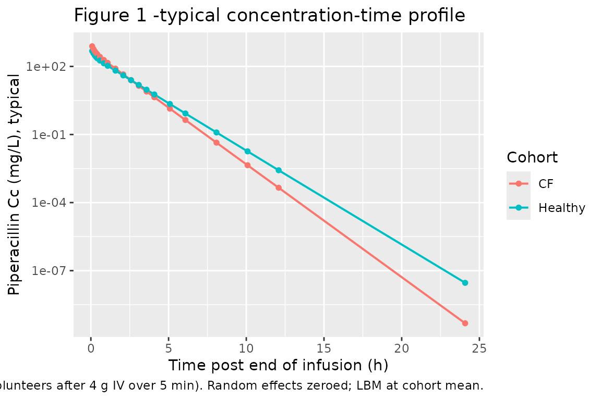
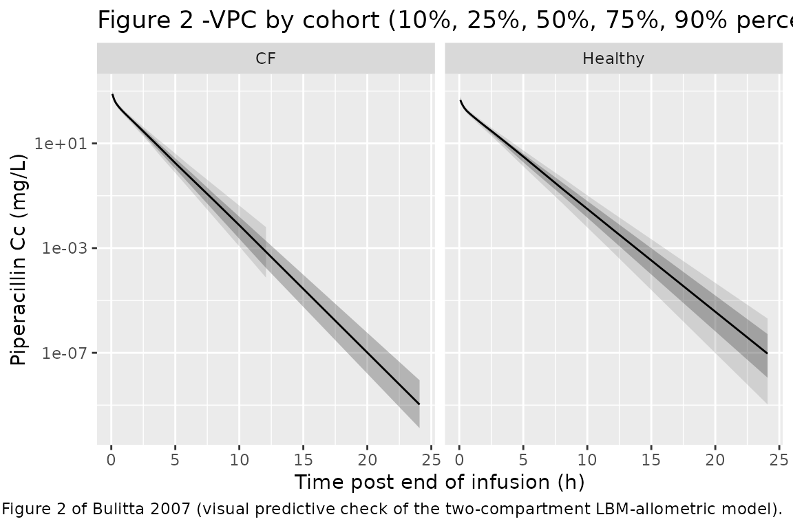

# Piperacillin (Bulitta 2007)

## Model and source

- Citation: Bulitta JB, Duffull SB, Kinzig-Schippers M, Holzgrabe U,
  Stephan U, Drusano GL, Sorgel F. Systematic comparison of the
  population pharmacokinetics and pharmacodynamics of piperacillin in
  cystic fibrosis patients and healthy volunteers. Antimicrob Agents
  Chemother. 2007;51(7):2497-2507. <doi:10.1128/AAC.01477-06>.
- Description: Two-compartment first-order IV population PK model for
  piperacillin in 8 adult cystic-fibrosis patients and 26 adult healthy
  volunteers receiving 4 g piperacillin as a 5-min intravenous infusion
  (Bulitta 2007). Lean body mass (LBM) is the size descriptor with
  allometric scaling (exponents 0.75 on CL and Q, 1.0 on V1 and V2;
  LBM_STD = 53 kg). A cystic-fibrosis disease-state indicator
  multiplicatively scales V1 and V2 via fcyf_vss^DIS_CF (fcyf_vss =
  0.926), with fcyf_cl^DIS_CF retained on CL at its boundary estimate of
  1.00 for model-form traceability.
- Article: <https://doi.org/10.1128/AAC.01477-06>

## Population

The study enrolled 34 Caucasian adults at a single centre in Germany: 8
cystic-fibrosis (CF) patients (5 male, 3 female; age 21 +/- 4 years;
total body weight 43.1 +/- 7.8 kg; lean body mass \[LBM\] 37.2 +/- 6.9
kg; body mass index 16.7 +/- 1.1 kg/m^2) and 26 healthy adult volunteers
(13 male, 13 female; age 25 +/- 4 years; total body weight 71.1 +/- 11.8
kg; LBM 56.4 +/- 7.2 kg; body mass index 23.6 +/- 3.7 kg/m^2). CF
diagnosis was confirmed by sweat test and clinical history; patients
were studied during an infection-free period and had no concomitant
anti-infective treatment. Each subject received a single 5-min IV
infusion of 4 g piperacillin (one CF patient received 3 g). Plasma
piperacillin concentrations were measured by HPLC at 21 nominal time
points to 24 h post-infusion (LOQ 0.200 mg/L). Demographics are from
Bulitta 2007 Table 1. The same demographics are available
programmatically via
`readModelDb("Bulitta_2007_piperacillin")()$population`.

The final structural model is a two-compartment first-order IV
disposition with lean body mass as the size descriptor (LBM_STD = 53 kg,
allometric exponents 0.75 on clearances and 1.0 on volumes; Bulitta 2007
Materials and Methods “Size models”). A cystic-fibrosis disease-state
indicator (`DIS_CF`) scales V1 and V2 multiplicatively by
`fcyf_vss^DIS_CF` with `fcyf_vss = 0.926` (Table 4, LBM-allometric row);
the corresponding clearance factor `fcyf_cl` was estimated at the model
boundary 1.00 and is retained in the encoding for model-form
traceability with no numerical effect at the published point estimate.

## Source trace

The per-parameter origin is recorded as an in-file comment next to each
`ini()` entry in
`inst/modeldb/specificDrugs/Bulitta_2007_piperacillin.R`. The table
below collects them in one place for review.

| Equation / parameter | Value | Source location |
|----|----|----|
| `lcl` (typical CL, healthy, LBM = 53 kg) | `log(11.3)` L/h | Bulitta 2007 Table 3, “Estimates from original dataset” |
| `lvc` (typical V1, healthy, LBM = 53 kg) | `log(7.01)` L | Bulitta 2007 Table 3 |
| `lvp` (typical V2, healthy, LBM = 53 kg) | `log(3.37)` L | Bulitta 2007 Table 3 |
| `lq` (typical CLic) | `log(12.8)` L/h | Bulitta 2007 Table 3 (CLic row) |
| `fcyf_cl` (CF / healthy CL ratio) | 1.00 | Bulitta 2007 Table 4, LBM-allometric row (FCYF_CL; CI 0.92-1.09) |
| `fcyf_vss` (CF / healthy V1, V2 ratio) | 0.926 | Bulitta 2007 Table 4, LBM-allometric row (FCYF_VSS; CI 0.82-1.02) |
| `e_lbm_cl` / `e_lbm_q` (LBM allometric exponent on clearances) | 0.75 (fixed) | Bulitta 2007 Methods, “Size models” |
| `e_lbm_vc` / `e_lbm_vp` (LBM allometric exponent on volumes) | 1.00 (fixed) | Bulitta 2007 Methods, “Size models” |
| `lbm_std` (reference LBM) | 53 kg (fixed) | Bulitta 2007 Methods, “Size models” |
| `etalcl` (BSV CL, log-normal) | 10.4% CV -\> omega^2 = 0.010758 | Bulitta 2007 Table 3 |
| `etalvc + etalvp` (BSV V1, V2 with correlation) | 26.0% / 34.2% CV, r = -0.80 | Bulitta 2007 Table 3 and footnote e |
| `propSd` (proportional residual) | 0.132 | Bulitta 2007 Table 3 (CVC = 13.2%) |
| `addSd` (additive residual) | 1.88 mg/L | Bulitta 2007 Table 3 (SDC = 1.88 mg/L) |
| ODE system: two-compartment IV with first-order elimination | n/a | Bulitta 2007 Results, “Population PK analysis” |
| Zero-order input duration (TK0) | 5 min (fixed; supplied via the event table) | Bulitta 2007 Table 3 (TK0) |

## Virtual cohort

Original observed data are not publicly available. The figures below use
virtual populations whose covariate distributions approximate the
published demographics: 100 CF patients with LBM ~ Normal(37.2, 6.9) kg
and 200 healthy participants with LBM ~ Normal(56.4, 7.2) kg, each dosed
with a single 4 g piperacillin IV infusion over 5 min.

``` r

set.seed(20260607)

n_cf      <- 100L
n_healthy <- 200L

obs_grid <- c(
  0,
  5 / 60,                                # end of 5-min infusion
  (5 + c(5, 10, 15, 20, 30, 45, 60, 90)) / 60,  # min post-end -> hours
  5/60 + c(2, 2.5, 3, 3.5, 4, 5, 6, 8, 10, 12, 24)
)
obs_grid <- sort(unique(obs_grid))

make_cohort <- function(n, lbm_mean, lbm_sd, dis_cf, cohort_label,
                        dose_mg = 4000, infusion_min = 5, id_offset = 0L) {
  ids <- id_offset + seq_len(n)
  lbm_per <- pmax(15, rnorm(n, mean = lbm_mean, sd = lbm_sd))

  # Dose row: IV infusion into the central compartment. `dur` (hours) sets
  # the zero-order input duration; piperacillin enters cmt = "central"
  # since the model has no depot.
  dose_rows <- data.frame(
    id     = ids,
    time   = 0,
    evid   = 1L,
    amt    = dose_mg,
    dur    = infusion_min / 60,
    cmt    = "central",
    LBM    = lbm_per,
    DIS_CF = dis_cf,
    cohort = cohort_label
  )

  # Observation rows: one row per subject per nominal sampling time.
  obs_rows <- expand.grid(
    id   = ids,
    time = obs_grid,
    KEEP.OUT.ATTRS = FALSE,
    stringsAsFactors = FALSE
  )
  obs_rows$evid   <- 0L
  obs_rows$amt    <- NA_real_
  obs_rows$dur    <- NA_real_
  obs_rows$cmt    <- "Cc"
  obs_rows$LBM    <- lbm_per[match(obs_rows$id, ids)]
  obs_rows$DIS_CF <- dis_cf
  obs_rows$cohort <- cohort_label

  rbind(dose_rows, obs_rows)
}

events <- dplyr::bind_rows(
  make_cohort(n_cf,      lbm_mean = 37.2, lbm_sd = 6.9, dis_cf = 1L,
              cohort_label = "CF",      id_offset = 0L),
  make_cohort(n_healthy, lbm_mean = 56.4, lbm_sd = 7.2, dis_cf = 0L,
              cohort_label = "Healthy", id_offset = n_cf)
)
stopifnot(!anyDuplicated(unique(events[, c("id", "time", "evid")])))

events <- events[order(events$id, events$time, -events$evid), ]
```

## Simulation

``` r

mod <- readModelDb("Bulitta_2007_piperacillin")()
sim <- rxode2::rxSolve(mod, events = events, keep = c("cohort", "LBM", "DIS_CF"))
sim <- as.data.frame(sim)
```

For deterministic typical-value replication (Figure 1 of the paper,
which shows the average concentration-time profile), zero the random
effects:

``` r

mod_typ <- rxode2::zeroRe(mod)
sim_typ <- rxode2::rxSolve(mod_typ, events = events, keep = c("cohort"))
#> ℹ omega/sigma items treated as zero: 'etalcl', 'etalvc', 'etalvp'
#> Warning: multi-subject simulation without without 'omega'
sim_typ <- as.data.frame(sim_typ)
```

## Replicate published figures

### Figure 1 -typical concentration-time profile by cohort

``` r

typ_summary <- sim_typ |>
  dplyr::filter(time > 0) |>
  dplyr::group_by(time, cohort) |>
  dplyr::summarise(Cc_typ = mean(Cc), .groups = "drop")

ggplot(typ_summary, aes(time, Cc_typ, colour = cohort)) +
  geom_line(linewidth = 0.7) +
  geom_point(size = 1.4) +
  scale_y_log10() +
  labs(x = "Time post end of infusion (h)",
       y = "Piperacillin Cc (mg/L), typical",
       title = "Figure 1 -typical concentration-time profile",
       colour = "Cohort",
       caption = "Replicates Figure 1 of Bulitta 2007 (average plasma piperacillin in CF patients and healthy volunteers after 4 g IV over 5 min). Random effects zeroed; LBM at cohort mean.")
```



### Figure 2 -visual predictive check (full-cohort VPC)

``` r

vpc <- sim |>
  dplyr::filter(time > 0) |>
  dplyr::group_by(time, cohort) |>
  dplyr::summarise(
    Q10 = quantile(Cc, 0.10, na.rm = TRUE),
    Q25 = quantile(Cc, 0.25, na.rm = TRUE),
    Q50 = quantile(Cc, 0.50, na.rm = TRUE),
    Q75 = quantile(Cc, 0.75, na.rm = TRUE),
    Q90 = quantile(Cc, 0.90, na.rm = TRUE),
    .groups = "drop"
  )

ggplot(vpc, aes(time, Q50)) +
  geom_ribbon(aes(ymin = Q10, ymax = Q90), alpha = 0.15) +
  geom_ribbon(aes(ymin = Q25, ymax = Q75), alpha = 0.30) +
  geom_line() +
  facet_wrap(~cohort) +
  scale_y_log10() +
  labs(x = "Time post end of infusion (h)",
       y = "Piperacillin Cc (mg/L)",
       title = "Figure 2 -VPC by cohort (10%, 25%, 50%, 75%, 90% percentiles)",
       caption = "Replicates Figure 2 of Bulitta 2007 (visual predictive check of the two-compartment LBM-allometric model).")
#> Warning in transformation$transform(x): NaNs produced
#> Warning in scale_y_log10(): log-10 transformation introduced infinite values.
#> Warning: Removed 1 row containing missing values or values outside the scale range
#> (`geom_ribbon()`).
```



## PKNCA validation

NCA on the simulated single-dose profiles. The paper’s Table 2 reports
total clearance, V_SS, peak concentration, terminal half-life, and mean
residence time as medians (range) per cohort; the simulated counterparts
should fall close to those medians since the model was fit to the same
data.

``` r

sim_nca <- sim |>
  dplyr::filter(!is.na(Cc), time > 0) |>
  dplyr::select(id, time, Cc, cohort)

dose_df <- events |>
  dplyr::filter(evid == 1L) |>
  dplyr::select(id, time, amt, cohort)

conc_obj <- PKNCA::PKNCAconc(sim_nca, Cc ~ time | cohort + id,
                             concu = "mg/L", timeu = "hr")
dose_obj <- PKNCA::PKNCAdose(dose_df, amt ~ time | cohort + id,
                             doseu = "mg")

intervals <- data.frame(
  start       = 0,
  end         = Inf,
  cmax        = TRUE,
  tmax        = TRUE,
  aucinf.obs  = TRUE,
  half.life   = TRUE,
  cl.obs      = TRUE,
  vss.obs     = TRUE,
  mrt.last    = TRUE
)

nca_res <- PKNCA::pk.nca(
  PKNCA::PKNCAdata(conc_obj, dose_obj, intervals = intervals)
)

nca_long <- as.data.frame(nca_res$result) |>
  dplyr::filter(PPTESTCD %in% c("cmax", "tmax", "aucinf.obs",
                                "half.life", "cl.obs", "vss.obs",
                                "mrt.last"))

nca_summary <- nca_long |>
  dplyr::group_by(cohort, PPTESTCD) |>
  dplyr::summarise(median = median(PPORRES, na.rm = TRUE),
                   q_lo   = quantile(PPORRES, 0.10, na.rm = TRUE),
                   q_hi   = quantile(PPORRES, 0.90, na.rm = TRUE),
                   .groups = "drop")

knitr::kable(nca_summary,
             digits = 3,
             caption = "Simulated NCA parameters (median and 10-90% range) per cohort.")
```

| cohort  | PPTESTCD   |  median |    q_lo |     q_hi |
|:--------|:-----------|--------:|--------:|---------:|
| CF      | aucinf.obs |      NA |      NA |       NA |
| CF      | cl.obs     |      NA |      NA |       NA |
| CF      | cmax       | 773.649 | 549.762 | 1020.724 |
| CF      | half.life  |   0.633 |   0.529 |    0.756 |
| CF      | mrt.last   |      NA |      NA |       NA |
| CF      | tmax       |   0.083 |   0.083 |    0.083 |
| CF      | vss.obs    |      NA |      NA |       NA |
| Healthy | aucinf.obs |      NA |      NA |       NA |
| Healthy | cl.obs     |      NA |      NA |       NA |
| Healthy | cmax       | 456.374 | 333.109 |  642.968 |
| Healthy | half.life  |   0.763 |   0.635 |    0.898 |
| Healthy | mrt.last   |      NA |      NA |       NA |
| Healthy | tmax       |   0.083 |   0.083 |    0.083 |
| Healthy | vss.obs    |      NA |      NA |       NA |

Simulated NCA parameters (median and 10-90% range) per cohort. {.table}

### Comparison against Bulitta 2007 Table 2

Published noncompartmental medians (range) from Bulitta 2007 Table 2:

| Parameter | CF patients (median, range) | Healthy (median, range) |
|----|----|----|
| Total clearance (L/h) | 8.78 (6.39-12.1) | 11.7 (6.25-14.5) |
| Volume of distribution at steady state (L) | 8.13 (5.16-10.8) | 11.8 (9.06-30.6) |
| Peak concentration (mg/L) | 767 (408-1044) | 446 (272-721) |
| Terminal half-life (h) | 0.69 (0.34-1.19) | 1.05 (0.49-7.52) |
| Mean residence time (h) | 0.85 (0.66-1.03) | 1.02 (0.79-3.49) |

The simulated values above were generated from a virtual cohort with the
published demographic means and the published parameter point estimates;
they should fall close to the published medians. Differences of more
than ~20% from the published median in either cohort would warrant
investigation; small deviations are expected because the virtual cohort
uses a normal LBM distribution while the source cohort was a small
finite sample (n = 8 CF, n = 26 healthy).

## Assumptions and deviations

- **LBM distribution** modelled as Normal(mean, SD) per cohort,
  truncated below 15 kg. The source paper reports mean +/- SD for LBM
  (Table 1) but not the distribution shape; Normal is the most common
  assumption for body-size demographics at the adult-cohort scale.
- **Sex, age, height, and BSA covariates** are not modelled. The final
  Bulitta 2007 model retained only LBM and DIS_CF as covariates; other
  baseline characteristics were screened and did not enter the final
  model.
- **Single 4 g infusion** for all simulated subjects. One CF patient in
  the original study received 3 g; the cohort-level NCA summary is
  insensitive to this individual deviation because total clearance and
  V_SS are dose-normalised quantities.
- **`fcyf_cl` retained at 1.00**. The published estimate for the LBM-
  allometric final model was 1.00 (90% CI 0.92-1.09); it is included in
  the model file for model-form traceability and to preserve the
  published equation form, but the multiplier `1.00^DIS_CF` is 1 by
  construction so the encoded effect on CL is numerically zero at the
  point estimate.
- **Zero-order infusion duration** (TK0 = 5 min) is supplied via the
  `dur` field in the event table, not as a structural model parameter.
  Bulitta 2007 Table 3 lists TK0 = 5 min as fixed for the study’s actual
  infusion regimen; downstream users running a different infusion
  duration (e.g. 30 min short-term infusion or 4 h prolonged infusion as
  in the paper’s Monte Carlo PD section) should set `dur` accordingly.
- **Monte Carlo PD breakpoints not reproduced.** The paper’s Monte Carlo
  simulations of probability-of-target-attainment versus MIC and the
  derived PKPD breakpoints (Tables 6 and 7) require a steady-state PD
  workflow that is outside the scope of this validation vignette. The
  packaged model supplies the PK part of that workflow; users wanting to
  replicate the PD breakpoints can simulate steady-state dosing
  trajectories from the same `readModelDb("Bulitta_2007_piperacillin")`
  object, apply the protein-binding fraction (30%, fixed in the paper),
  and integrate fT \> MIC themselves.
