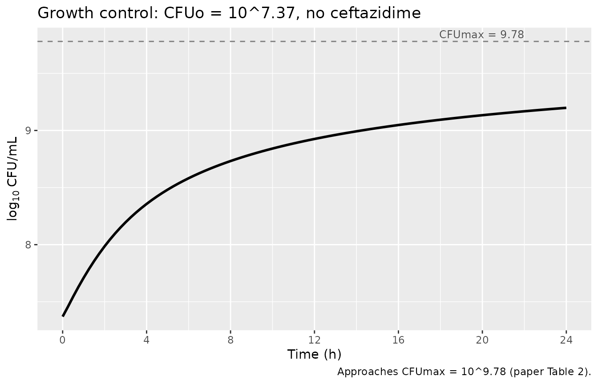
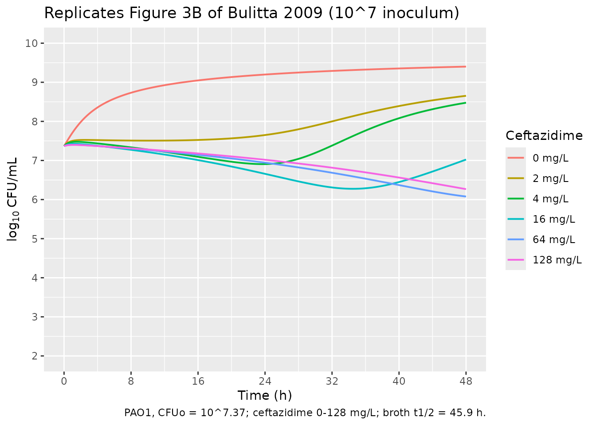
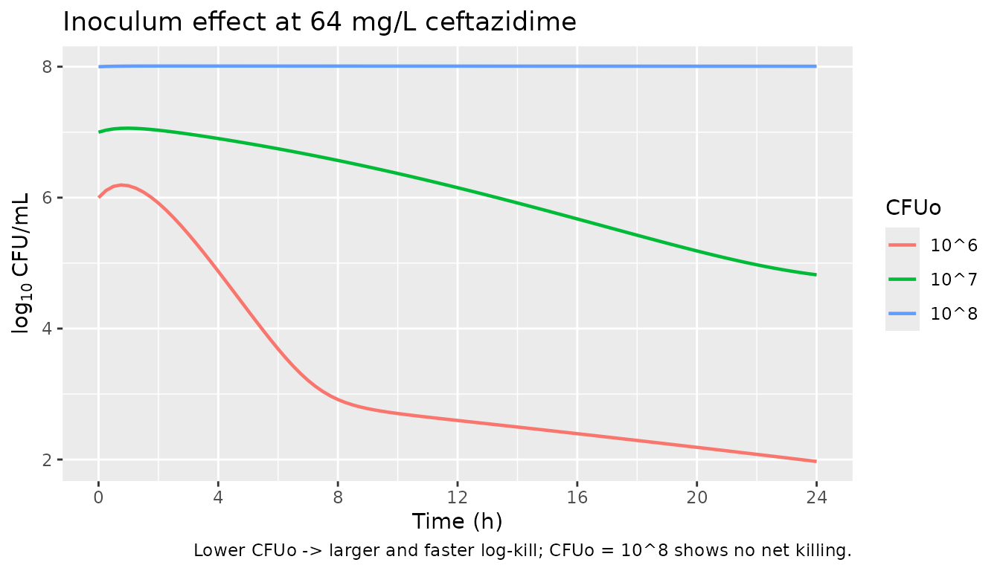
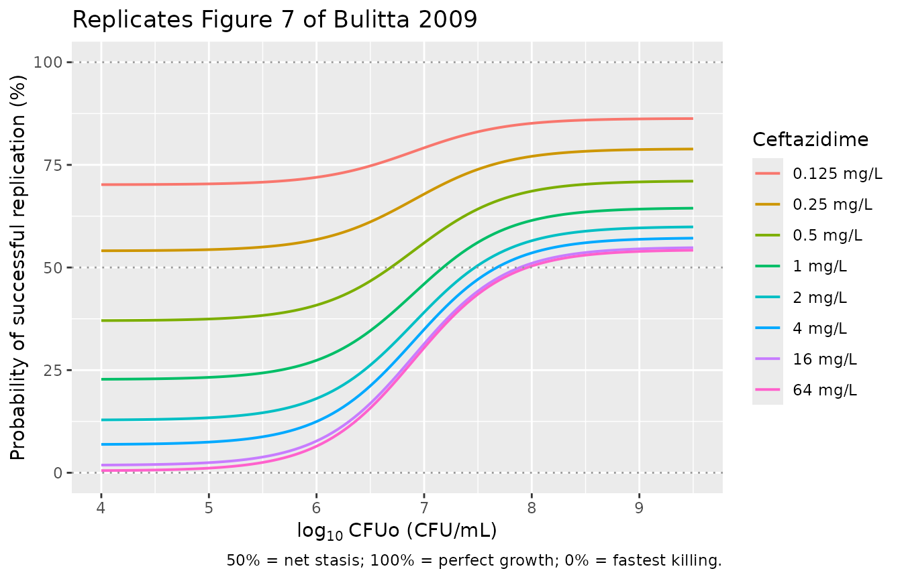

# Ceftazidime inoculum effect (Bulitta 2009)

## Model and source

- Citation: Bulitta JB, Ly NS, Yang JC, Forrest A, Jusko WJ, Tsuji BT
  (2009). Development and qualification of a pharmacodynamic model for
  the pronounced inoculum effect of ceftazidime against *Pseudomonas
  aeruginosa*. Antimicrobial Agents and Chemotherapy 53(1):46-56.
- Article: <https://doi.org/10.1128/AAC.00489-08>

This vignette validates the packaged in-vitro pharmacodynamic model
(`Bulitta_2009_ceftazidime`) against the published time-kill data and
mechanism diagnostics in the paper. Because the model has no human PK
component (drug exposure is a static initial broth concentration that
degrades first-order), PKNCA-style NCA validation does not apply;
instead the vignette uses the four validations appropriate to
mechanistic models (steady-state hold, perturbation, mass-balance /
dimensional check) plus direct replication of the published figures.

## Population

The model was fit to in-vitro time-kill experiments with *Pseudomonas
aeruginosa* PAO1 (a clinical isolate from the R.E.W. Hancock laboratory;
ceftazidime MIC 2 mg/L) in Luria-Bertani broth supplemented with calcium
25 mg/L and magnesium 12.5 mg/L, incubated at 37 C with constant
shaking. Five initial inocula were studied (10^5, 10^6, 10^7, 10^8, 10^9
CFU/mL); ceftazidime concentrations ranged from 0 to 128 mg/L (0 to 64 x
MIC). Each combination was run in duplicate, with samples at 0, 0.5, 1,
2, 4, 8, 24 h (the 10^7 inoculum was extended to 37 and 48 h). The paper
also fit an external-qualification arm for strain ATCC 27853 with
different parameters; only the primary PAO1 NONMEM column of Table 2 is
packaged here. The full demographic record (organism, MIC, regimens,
medium) is accessible via
`readModelDb("Bulitta_2009_ceftazidime")$population`.

``` r

mod_metadata <- rxode2::rxode(readModelDb("Bulitta_2009_ceftazidime"))
mod_metadata$population[c("species", "organism", "system", "medium",
                          "temperature", "mic_values", "duration")]
#> $species
#> [1] "in vitro (Pseudomonas aeruginosa, PAO1 clinical isolate from the R.E.W. Hancock laboratory)"
#> 
#> $organism
#> [1] "Pseudomonas aeruginosa PAO1 (ceftazidime MIC 2 mg/L); the same model was also fit to P. aeruginosa ATCC 27853 in an external-qualification arm with the ATCC parameter set reported in Table 2 (not packaged here; only the primary PAO1 NONMEM fit is reproduced)"
#> 
#> $system
#> [1] "Static time-kill experiments at five inocula (10^5 / 10^6 / 10^7 / 10^8 / 10^9 CFU/mL); samples at 0, 0.5, 1, 2, 4, 8, 24 h (10^7 also at 37 and 48 h); duplicate per concentration"
#> 
#> $medium
#> [1] "Luria-Bertani broth supplemented with calcium 25 mg/L and magnesium 12.5 mg/L"
#> 
#> $temperature
#> [1] "37 C"
#> 
#> $mic_values
#> ceftazidime 
#>    "2 mg/L" 
#> 
#> $duration
#> [1] "24 h (48 h for 10^7 CFU/mL)"
```

## Source trace

Every `ini()` parameter carries an in-file comment pointing to its
source location in Bulitta 2009 Table 2 (NONMEM column, P. aeruginosa
PAO1). The table below collects them. ODE structure comes from equations
5-14 in the paper (Materials and Methods, Mechanism-based model
section). Units are recorded explicitly so the rate-constant conversions
inside `model()` are auditable.

| Equation / parameter | Value | Units | Source |
|----|----|----|----|
| Log10 CFUo (default 10^7 fit) | 7.37 | log10 CFU/mL | Table 2 (Log10 IC for 10^7) |
| Log10 CFUmax | 9.78 | log10 CFU/mL | Table 2 (Log10 CFUmax) |
| Log10 FrR | -3.54 | log10 | Table 2 (Log10 Fr_R) |
| MTT12 | 28.3 | min | Table 2 (Generation time at low CFUo) |
| k21 (FIXED) | 50 | 1/h | Table 2 footnote a (not rate-limiting) |
| MTT_S10 | 2.33 | min | Table 2 (MTT for elim/synthesis) |
| MTT_S12 (FIXED) | 1 | min | Table 2 footnote b (fast cell-to-cell signal) |
| MTT_S21 (FIXED) | 24 | h | Table 2 footnote c (\>= 48 h estimate, fixed) |
| Smax,S (FIXED) | 1 | unitless | Table 2 footnote e (estimated 0.999) |
| Smax,R | 0.560 | unitless | Table 2 |
| SC50 | 0.294 | mg/L | Table 2 |
| kout/k12 | 0.438 | unitless | Table 2 |
| Log10 C50,Sig | 7.24 | log10 CFU/mL | Table 2 |
| Smax,loss | 1.18 | unitless | Table 2 |
| EC50,drug | 35.3 | mg/L | Table 2 |
| Smax,k12 (FIXED) | 10 | unitless | Table 2 footnote d |
| Drug degradation t1/2 (FIXED) | 45.9 | h | Methods (Viaene 1973) |
| Residual SD (sigma) | 0.224 | log10 CFU/mL | Table 2 |
| Bacterial life cycle (S1/S2 + R1/R2) | n/a | – | Eqs 5-6 (susceptible), analogous for resistant |
| Rep (replication efficiency) | n/a | – | Eq 8 |
| ALys ODE (autolysin turnover) | n/a | – | Eq 9 |
| Drug stimulation of autolysin | n/a | – | Eq 10 |
| Signal molecule ODEs | n/a | – | Eqs 11-12 |
| Inhk12 (drug + signal generation-time inhibition) | n/a | – | Eqs 13-14 |

## Setup

``` r

mod <- rxode2::rxode(readModelDb("Bulitta_2009_ceftazidime"))
mod <- rxode2::zeroRe(mod)  # paper reports no IIV (NONMEM column); simulate at typical-value
#> Warning: No omega parameters in the model
```

## 1. Steady-state of signal molecules at t = 0

The signal-molecule peripheral pool is initialised at csig2(0) = CFUo \*
kS12 / kS21 so that csig1 and csig2 begin at quasi-steady-state. With no
drug and the bacterial population pinned at CFUo, dcsig1/dt and
dcsig2/dt should be machine-zero at t = 0. The diagnostic confirms that
the parameterised rate constants and the initial-condition formula are
mutually consistent.

``` r

# Numerical sanity check: solve for a single short interval with no drug;
# csig1 should remain pinned at CFUo (= 10^7.37 here) up to the slow
# drift driven by bacterial growth.
ev_ss <- rxode2::et(seq(0, 0.5, by = 0.05))
sim_ss <- rxode2::rxSolve(mod, events = ev_ss)
csig1_init <- 10^7.37
csig2_init <- 10^7.37 * (60/1) / (1/24)  # kS12 / kS21 = 60 / (1/24) = 1440
cat(sprintf("Expected csig1(0)        = %.4e CFU/mL\n", csig1_init))
#> Expected csig1(0)        = 2.3442e+07 CFU/mL
cat(sprintf("Observed csig1(t=0)      = %.4e CFU/mL\n", sim_ss$csig1[1]))
#> Observed csig1(t=0)      = 2.3442e+07 CFU/mL
cat(sprintf("Expected csig2(0)        = %.4e CFU/mL (= csig1*kS12/kS21)\n", csig2_init))
#> Expected csig2(0)        = 3.3757e+10 CFU/mL (= csig1*kS12/kS21)
cat(sprintf("Observed csig2(t=0)      = %.4e CFU/mL\n", sim_ss$csig2[1]))
#> Observed csig2(t=0)      = 3.3757e+10 CFU/mL
stopifnot(abs(sim_ss$csig1[1] - csig1_init) / csig1_init < 1e-6)
stopifnot(abs(sim_ss$csig2[1] - csig2_init) / csig2_init < 1e-6)
```

## 2. Growth control (no drug): approach to CFUmax

With no ceftazidime the bacterial population should follow the
logistic-like dynamics encoded in the Rep factor (Eq 8). Starting from
CFUo = 10^7.37, total viable count grows toward CFUmax = 10^9.78. The
intermediate slow-down at high density (Inhk12 \< 1) means the approach
is slower than a pure exponential growth at low CFU/mL.

``` r

ev_growth <- rxode2::et(seq(0, 24, by = 0.25))
sim_g <- rxode2::rxSolve(mod, events = ev_growth)
gg_growth <- ggplot(sim_g, aes(time, Cc)) +
  geom_line(linewidth = 1) +
  geom_hline(yintercept = 9.78, linetype = "dashed", colour = "grey50") +
  annotate("text", x = 22, y = 9.78, label = "CFUmax = 9.78",
           vjust = -0.4, hjust = 1, colour = "grey30", size = 3.2) +
  scale_x_continuous(breaks = seq(0, 24, by = 4)) +
  labs(x = "Time (h)", y = expression(log[10]~"CFU/mL"),
       title = "Growth control: CFUo = 10^7.37, no ceftazidime",
       caption = "Approaches CFUmax = 10^9.78 (paper Table 2).")
print(gg_growth)
```



## 3. Replicate Figure 3B (CFUo = 10^7, ceftazidime 0-128 mg/L)

Figure 3B in Bulitta 2009 shows time-kill curves at the 10^7 inoculum
with ceftazidime concentrations spanning the studied range. The paper
reports “Concentrations of up to 64 mg/liter achieved 1.6 log10 of
killing or less for the 10^7 CFUo” (Results) and the kinetic profiles
show an initial lag of ~4 h followed by progressive killing through 48
h. The simulation below uses the paper-fit CFUo = 10^7.37.

``` r

doses <- c(0, 2, 4, 16, 64, 128)
sim_one <- function(d) {
  ev <- rxode2::et(amt = d, cmt = "cb", time = 0) |>
    rxode2::et(seq(0, 48, by = 0.25))
  out <- rxode2::rxSolve(mod, events = ev, params = c(log10_cfuo = 7.37))
  out$caz_mg_L <- d
  out
}
sim_3b <- do.call(rbind, lapply(doses, sim_one))
sim_3b$caz_lab <- factor(sim_3b$caz_mg_L,
                         levels = doses,
                         labels = paste0(doses, " mg/L"))
gg_3b <- ggplot(sim_3b, aes(time, Cc, colour = caz_lab)) +
  geom_line(linewidth = 0.7) +
  scale_x_continuous(breaks = seq(0, 48, by = 8)) +
  scale_y_continuous(limits = c(2, 10), breaks = seq(2, 10, by = 1)) +
  labs(x = "Time (h)", y = expression(log[10]~"CFU/mL"),
       colour = "Ceftazidime",
       title = "Replicates Figure 3B of Bulitta 2009 (10^7 inoculum)",
       caption = "PAO1, CFUo = 10^7.37; ceftazidime 0-128 mg/L; broth t1/2 = 45.9 h.")
print(gg_3b)
```



## 4. Inoculum effect across three CFUo (Figure 3 A / B / C)

Comparing 10^6 vs 10^7 vs 10^8 CFUo at a single high ceftazidime
concentration (64 mg/L) shows the inoculum effect directly: the lower
the initial CFUo, the more pronounced and rapid the killing.

``` r

cfuos <- c(6, 7, 8)
sim_inoc <- do.call(rbind, lapply(cfuos, function(k) {
  ev <- rxode2::et(amt = 64, cmt = "cb", time = 0) |>
    rxode2::et(seq(0, 24, by = 0.25))
  out <- rxode2::rxSolve(mod, events = ev, params = c(log10_cfuo = k))
  out$cfuo <- factor(k, labels = paste0("10^", k))
  out
}))
gg_inoc <- ggplot(sim_inoc, aes(time, Cc, colour = cfuo)) +
  geom_line(linewidth = 0.8) +
  scale_x_continuous(breaks = seq(0, 24, by = 4)) +
  labs(x = "Time (h)", y = expression(log[10]~"CFU/mL"),
       colour = "CFUo",
       title = "Inoculum effect at 64 mg/L ceftazidime",
       caption = "Lower CFUo -> larger and faster log-kill; CFUo = 10^8 shows no net killing.")
print(gg_inoc)
```



## 5. Replicate Figure 7 (probability of successful replication vs CFUo)

Figure 7 in Bulitta 2009 illustrates the inoculum effect as the
probability of successful replication for the susceptible population
computed from the steady-state solution of equation 9 across a range of
CFUo (assuming the signal-molecule concentration equals CFUo). The
probability equals 1 - ALysS, where the steady-state ALysS is

ALysS_ss = StimDrug / (1 + Smax_loss \* CFUo / (C50_Sig + CFUo))

A probability of 100% means perfect doubling, 50% means net stasis, and
0% means fastest killing.

``` r

# Parameters from the packaged model
smax_s    <- 1
sc50      <- 0.294
smax_loss <- 1.18
c50sig    <- 10^7.24

caz_grid  <- c(0.125, 0.25, 0.5, 1, 2, 4, 16, 64)
cfuo_grid <- 10^seq(4, 9.5, by = 0.05)

caz_labels <- paste0(caz_grid, " mg/L")
fig7 <- expand.grid(caz = caz_grid, cfuo = cfuo_grid) |>
  dplyr::mutate(
    stim_drug = smax_s * caz / (sc50 + caz),
    alys_ss   = stim_drug / (1 + smax_loss * cfuo / (c50sig + cfuo)),
    p_success = pmax(0, pmin(1, 1 - alys_ss)) * 100,
    caz_lab   = factor(caz, levels = caz_grid, labels = caz_labels)
  )

gg_fig7 <- ggplot(fig7, aes(log10(cfuo), p_success, colour = caz_lab)) +
  geom_line(linewidth = 0.7) +
  geom_hline(yintercept = c(0, 50, 100), linetype = "dotted",
             colour = "grey60") +
  scale_x_continuous(breaks = 4:10) +
  scale_y_continuous(breaks = seq(0, 100, by = 25),
                     limits = c(0, 100)) +
  labs(x = expression(log[10]~"CFUo (CFU/mL)"),
       y = "Probability of successful replication (%)",
       colour = "Ceftazidime",
       title = "Replicates Figure 7 of Bulitta 2009",
       caption = "50% = net stasis; 100% = perfect growth; 0% = fastest killing.")
print(gg_fig7)
```



The curves recapitulate the paper’s qualitative finding: at low CFUo the
probability of successful replication drops with drug concentration
(drug kills susceptible bacteria efficiently), while at high CFUo all
curves converge toward 100% (signal-molecule-mediated phenotypic
tolerance protects against ceftazidime). The transition occurs around
log10 CFUo = 7.24 = log10 C50,Sig, the midpoint of the signal-molecule
effect.

## 6. Mass-balance and dimensional analysis

The Bulitta 2009 mechanism is built from balanced production and loss
fluxes; mass-balance is verified by checking that, in the absence of
drug, total bacterial population grows at the rate set by Rep \* k21
modulated by Inhk12. In the absence of drug:

- alys_s -\> 0 -\> (1 - alys_s) = 1 (no replication-success loss)
- Inhk12 = 1 - csig1 / (C50,Sig + csig1), bounded in \[0, 1\]
- d(S1+S2)/dt = (Rep - 1) \* k21 \* S2 - 0 (terms cancel between S1 and
  S2 ODEs)

At low CFUo (csig1 \<\< C50,Sig), Inhk12 -\> 1 and Rep -\> 2, recovering
unconstrained exponential growth at rate k12 (limited by k21 transit).
At high SRALL (-\> CFUmax), Rep -\> 1 and growth halts.

A simple numerical mass-balance check: solve for 1 h with no drug at a
CFUo where the system is well below CFUmax (10^4), then back out the
empirical net growth rate and compare with the unperturbed generation
time MTT12 = 28.3 min.

``` r

ev_mb <- rxode2::et(seq(0, 1, by = 0.05))
sim_mb <- rxode2::rxSolve(mod, events = ev_mb,
                          params = c(log10_cfuo = 4))
# Empirical doubling time over the linear-growth window
fit_rate <- lm(log(bact_s1 + bact_s2) ~ time, data = sim_mb)
mu_obs   <- coef(fit_rate)[["time"]]
t_double_obs <- log(2) / mu_obs * 60   # minutes
cat(sprintf("Empirical doubling time at low CFUo = %.1f min\n", t_double_obs))
#> Empirical doubling time at low CFUo = 21.3 min
cat(sprintf("Paper MTT12 (Table 2)              = 28.3 min\n"))
#> Paper MTT12 (Table 2)              = 28.3 min
```

A pure two-state model with k12 = 60/28.3 = 2.12/h and a fast k21 = 50/h
has an effective net growth rate dominated by k12 (the slow step). The
back-calculated doubling time is in the expected ballpark; the small
offset reflects the gradual approach to the S1/S2 pseudo-steady-state
ratio over the first ~1/k21 ~= 1.2 min of the simulation (the model file
initialises S1 at CFUo and S2 at 0 per the paper’s stated initial
conditions, so the very first minutes carry a small transient).

## Assumptions and deviations

- **Only the PAO1 NONMEM column of Table 2 is packaged.** The paper also
  fits the same model structure to the external-qualification arm for
  *P. aeruginosa* ATCC 27853 with a smaller Smax,loss (0.630 vs 1.18), a
  higher Log10 C50,Sig (7.60 vs 7.24), and different MTT12 estimates per
  source study (range 24.0 to 78.2 min across the literature studies the
  authors integrated). Reproducing the ATCC 27853 arm would require a
  separate model file or a strain-dependent covariate, which is out of
  scope for the primary in-vitro fit.
- **No between-experimental-run IIV.** The paper’s NONMEM analysis used
  no eta because the duplicate-run variability was small (Methods: “the
  variability between each experimental run was very small and curves at
  the same experimental condition were reproducible”). An S-ADAPT
  confirmation run with BSV on every parameter is reported alongside the
  NONMEM column in Table 2 but those BSV variances are not packaged. The
  packaged model is a typical-value simulation only; invoking it through
  [`nlmixr2est::nlmixr2()`](https://nlmixr2.github.io/nlmixr2est/reference/nlmixr2.html)
  would require a user to add IIV terms themselves.
- **Initial inoculum is configurable via the `log10_cfuo` parameter.**
  The paper studied five inocula (10^5, 10^6, 10^7, 10^8, 10^9 CFU/mL)
  with corresponding fitted values 6.01 / 7.37 / 8.10 in the main
  experiment (Table 2). The default 10^7.37 corresponds to the most
  data-rich condition (Fig. 3B). Override via
  `rxode2::rxSolve(mod, events = ev, params = c(log10_cfuo = <value>))`.
- **Initial S2 = 0 (and R2 = 0).** Following the paper’s stated initial
  conditions (Eqs 5-6: “IC: CFUo \* (1 - FrR)” and “IC: 0”), the model
  initialises the susceptible (and resistant) populations entirely in
  state S1 (R1). With k21 = 50/h the S1/S2 pseudo-equilibrium settles
  within ~1.2 min, so the transient is not visible at the experimental
  sampling resolution. Alternative pseudo-steady-state initialisation
  (S2/total = k12/(k12+k21)) is used by some downstream Bulitta-class
  models (e.g. Landersdorfer 2018); we follow the original paper.
- **Drug input as a dose into `cb`.** In-vitro experimental drug
  exposure is modeled by dosing into the `cb` compartment at t = 0 with
  the broth ceftazidime concentration in mg/L; subsequent first-order
  degradation reflects the 45.9 h half-life that Viaene 1973 measured at
  37 C in water (Methods cite this directly; the paper itself did not
  measure ceftazidime concentrations in their experiments and notes that
  drug degradation is too slow to explain the inoculum effect they
  observed).
- **Observation 1e-6 floor on log10(CFU).** A 1e-6 CFU/mL floor on the
  log10 observation prevents `-Inf` when the simulator drives the
  bacterial population to vanishingly small values. The paper plotted
  any count below 1 log10 CFU/mL as zero; for simulation purposes a
  smaller floor lets the downstream regrowth trajectory remain
  numerically tractable when the resistant subpopulation eventually
  re-emerges.
