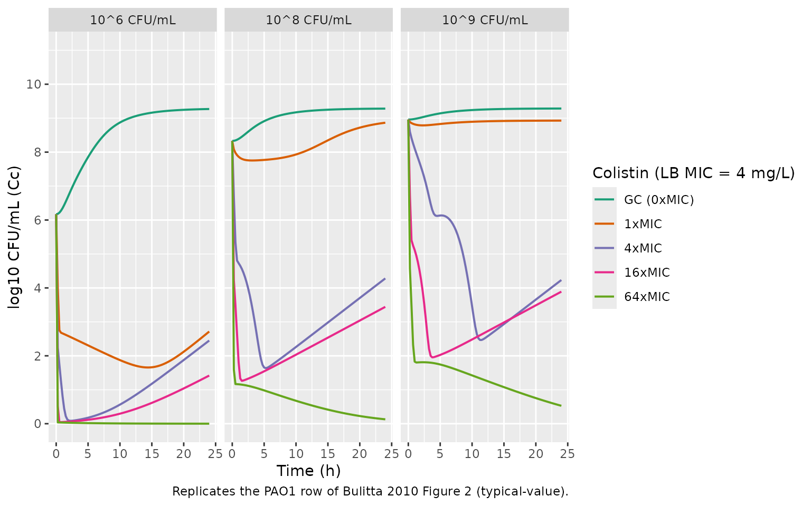
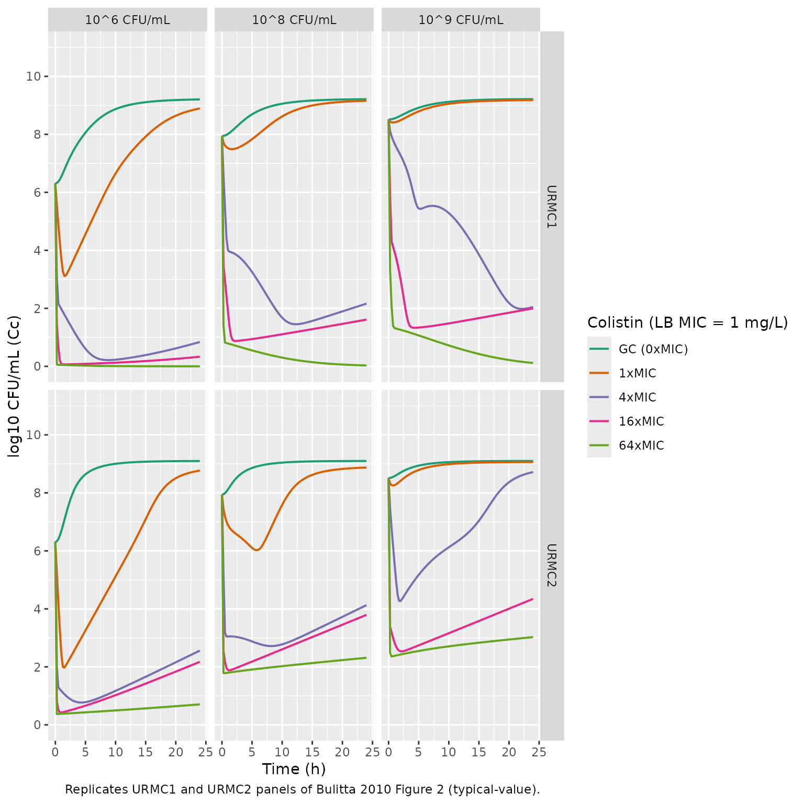
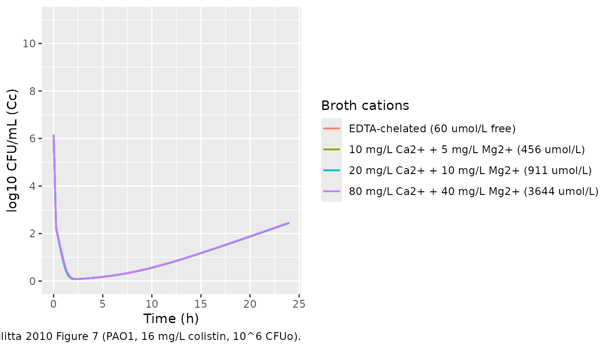

# Colistin time-kill against P. aeruginosa with inoculum effect (Bulitta 2010)

## Models and source

Three companion model files cover the three P. aeruginosa strains
studied:

- `Bulitta_2010_colistin_PAO1` – NONMEM VI primary fit on the PAO1
  reference strain (results shown in the paper’s main text and figures).

- `Bulitta_2010_colistin_URMC1` – S-ADAPT fit on clinical isolate URMC1
  (external qualification).

- `Bulitta_2010_colistin_URMC2` – S-ADAPT fit on clinical isolate URMC2
  (external qualification).

- Citation: Bulitta JB, Yang JC, Yohonn L, Ly NS, Brown SV, D’Hondt RE,
  Jusko WJ, Forrest A, Tsuji BT. (2010). Attenuation of colistin
  bactericidal activity by high inoculum of Pseudomonas aeruginosa
  characterized by a new mechanism-based population pharmacodynamic
  model. Antimicrobial Agents and Chemotherapy 54(5):2051-2062.
  <doi:10.1128/AAC.00881-09>.

- Article: <https://doi.org/10.1128/AAC.00881-09>

## Population

The packaged models were developed from static in-vitro time-kill
experiments in supplemented cation-adjusted Luria-Bertani (LB) broth at
37 C. Each strain was studied across multiple initial inocula (CFUo):

- PAO1 (genetically characterised reference strain from the R.E.W.
  Hancock Laboratory, University of British Columbia; LB-broth MIC 4.0
  mg/L): four initial inocula 10^4, 10^6, 10^8, and 10^9 CFU/mL across
  11 colistin concentrations up to 256 mg/L (64x MIC). Sampling at 0,
  0.25, 0.5, 1, 2, 3, 4, 8, 12, 16, 24 h.
- URMC1 and URMC2 (two clinical isolates from the University of
  Rochester Medical Center; LB-broth MIC 1.0 mg/L each): three initial
  inocula 10^6, 10^8, and 10^9 CFU/mL across 9 colistin concentrations
  up to 64 mg/L (64x MIC). Sampling at 0, 0.5, 1, 2, 4, 6, 8, 24 h.

There is no human or animal cohort – the models are typical-value
in-vitro PD simulations. The paper reports CV 24% inter-experiment IIV
on the three growth half-lives for PAO1 (NONMEM, jointly parameterised
as a difference in VGmax, Table 1 footnote b); the packaged models omit
these etas and provide deterministic simulation per the Wicha 2017 /
Landersdorfer 2018 in-vitro PD precedent. The complete population
metadata is available via
`readModelDb("Bulitta_2010_colistin_PAO1")$population` (and similarly
for the two URMC strains).

## Mechanism overview

The structural model (Bulitta 2010 Figure 1) has three pieces:

1.  **Bacterial population dynamics** – three pre-existing
    subpopulations of different susceptibility to colistin (S =
    susceptible, I = intermediate, R = least-susceptible) plus a lag
    compartment that initially holds the susceptible cells. The lag
    compartment has no growth and no natural death but IS subject to
    colistin killing and signal-molecule inhibition; a first-order rate
    constant `klag` transfers cells from the lag compartment into the
    replicating susceptible compartment. Each replicating subpopulation
    X (in S, I, R) grows via a saturable Michaelis-Menten-style function
    with maximal velocity VGmax_X and half-saturation density CFUm, dies
    first-order at kd = 0.3 /h, and is killed second-order by effective
    colistin at the target site with rate constant k2X.

2.  **Receptor occupancy** (Bulitta 2010 Eqs. 1-2; Figure 1B) – colistin
    must competitively displace Mg2+ and Ca2+ from LPS binding sites in
    the outer membrane to be active at the target site. The fractional
    occupancy by cations FrCations (Eq. 1) drops as broth colistin
    rises; the fraction NOT occupied (1 - FrCations) feeds a Hill-10
    function (Eq. 2) that produces the effective colistin concentration
    Ccolistin,eff. Dissociation constants Kd_Cations = 200 umol/L and
    Kd_Colistin = 0.3 umol/L are FIXED per Schindler & Osborn (1979);
    the Hill coefficient was initially estimated 10-20 and then FIXED to
    10 for stability (Table 1 footnote e).

3.  **Signal molecules** (Bulitta 2010 Eqs. 4, 5, 10) – all viable
    bacteria are assumed to synthesise freely diffusible signal
    molecules whose concentration tracks CFUALL with first-order
    degradation (kdeg). Through a single Hill-1 function with IC50,
    signal molecules inhibit both replication (maximum reduction ImaxRep
    on the growth rate) and killing (maximum reduction ImaxKill on the
    colistin effect). This is the mechanism that produces the *inoculum
    effect*: at high CFUo, signal molecules saturate inhibition and
    colistin killing is markedly attenuated.

The drug colistin concentration `Ccolistin` (mg/L) and cation
concentration `Ccations` (umol/L) are external time-varying covariates
supplied from the data; the model has no human PK component.

## Source trace

Per-parameter source-location comments live inline in the three `.R`
files next to each `ini()` entry; the table below collects them for
one-glance audit. All NONMEM PAO1 values come from Bulitta 2010 Table 1
NONMEM column. URMC1 and URMC2 values come from the S-ADAPT columns (the
only fit reported for those strains).

| Parameter (paper symbol) | File name | PAO1 (NONMEM) | URMC1 | URMC2 | Units | Source |
|----|----|---:|---:|---:|----|----|
| t1/2(kg,low CFU)\_S | `t12_kg_low_s` | 22.2 | 17.9 | 17.0 | min | Table 1 |
| t1/2(kg,low CFU)\_I | `t12_kg_low_i` | 28.7 | 21.7 | 24.8 | min | Table 1 |
| t1/2(kg,low CFU)\_R | `t12_kg_low_r` | 62.4 | 86.8 | 76.2 | min | Table 1 |
| kd (FIXED) | `kd_nat` | 0.3 | 0.3 | 0.3 | 1/h | Table 1 footnote (a) |
| t1/2(klag) | `t12_klag` | 1.31 | 1.36 | 0.967 | h | Table 1 |
| log10 POPmax | `log10_popmax` | 9.59 | 9.68 | 9.16 | log10 CFU/mL | Table 1 |
| log10 CFUo (10^6) | `log10_cfu0` | 6.17 | 6.35 | 6.17 | log10 CFU/mL | Table 1 (Log10 CFUo,6) |
| log10 FrI | `log10_fr_i` | -3.43 | -3.97 | -4.93 | log10 fraction | Table 1 |
| log10 FrR | `log10_fr_r` | -7.19 | -7.16 | -6.18 | log10 fraction | Table 1 |
| log10 FrSig | `log10_fr_sig` | -1.89 | -1.96 | -2.50 | log10 ml/CFU | Table 1 |
| log10 IC50 | `log10_ic50_sig` | 6.17 | 6.27 | 6.07 | log10 | Table 1 |
| t1/2(kdeg) | `t12_kdeg` | 0.970 | 1.30 | 3.57 | h | Table 1 |
| ImaxRep | `imax_rep` | 0.422 | 0.569 | 0.111 | fraction | Table 1 |
| ImaxKill | `imax_kill` | 0.992 | 0.999 | 0.999 | fraction | Table 1 |
| EC50 (receptor) | `ec50_rec` | 0.537 | 0.316 | 0.123 | unitless | Table 1 |
| Hill (FIXED) | `hill_rec` | 10 | 10 | 10 | unitless | Table 1 footnote (e) |
| Kd Cations (FIXED) | `kdiss_cation` | 200 | 200 | 200 | umol/L | Methods + Table 1 footnote (g) |
| Kd Colistin (FIXED) | `kdiss_colistin` | 0.3 | 0.3 | 0.3 | umol/L | Methods + Table 1 footnote (g) |
| Mm colistin (FIXED) | `mw_colistin` | 1.163 | 1.163 | 1.163 | mg/umol | Methods, after Eq. 1 |
| k2S | `lk2s` | 5.72 | 7.88 | 10.4 | L/(mg\*h) | Table 1 |
| k2I | `lk2i` | 0.369 | 0.627 | 0.522 | L/(mg\*h) | Table 1 |
| k2R | `lk2r` | 0.00210 | 0.00573 | 0.00312 | L/(mg\*h) | Table 1 |
| Residual SD_CFU | `addSd` | 0.474 | 0.478 | 0.478 | log10 CFU/mL | Table 1 footnote (h) |

Governing equations (Bulitta 2010 Eqs. 1-10) implemented in `model()`:

| Equation | Role |
|----|----|
| Eq. 1 | FrCations = Ccations / (Kd_Cations + Ccations + (Kd_Cations/Kd_Colistin) \* Ccolistin / Mm) |
| Eq. 2 | Ccolistin_eff = (1 - FrCations)^Hill / (EC50^Hill + (1 - FrCations)^Hill) \* Ccolistin |
| Eq. 3 | CFUALL = bact_slag + bact_s + bact_i + bact_r |
| Eq. 4 | INHKill = 1 - ImaxKill \* signal / (IC50 + signal) |
| Eq. 5 | INHRep = 1 - ImaxRep \* signal / (IC50 + signal) |
| Eq. 6 | d/dt(bact_slag) = (-klag - INHKill \* k2S \* Ccolistin_eff) \* bact_slag |
| Eq. 7 | d/dt(bact_s) = (INHRep \* VGmax_S / (CFUm + CFUALL) - kd - INHKill \* k2S \* Ccolistin_eff) \* bact_s + klag \* bact_slag |
| Eq. 8 | d/dt(bact_i) = (INHRep \* VGmax_I / (CFUm + CFUALL) - kd - INHKill \* k2I \* Ccolistin_eff) \* bact_i |
| Eq. 9 | d/dt(bact_r) = (INHRep \* VGmax_R / (CFUm + CFUALL) - kd - INHKill \* k2R \* Ccolistin_eff) \* bact_r |
| Eq. 10 | d/dt(signal) = (CFUALL - signal) \* kdeg |

Compartment and observation conventions:

| Compartment | Units | Meaning |
|----|----|----|
| `bact_slag` | CFU/mL | susceptible-population cells in growth-lag phase |
| `bact_s` | CFU/mL | replicating susceptible cells |
| `bact_i` | CFU/mL | intermediate-susceptibility cells |
| `bact_r` | CFU/mL | least-susceptible (resistant) cells |
| `signal` | unitless | hypothetical quorum-style signal molecules tracking CFUALL |
| `Cc` | log10 CFU/mL | observation: log10(CFUALL + 1) |

### Growth-function reparameterisation

The paper parameterises growth as `INHRep * VGmax_X / (CFUm + CFUALL)`
(Eqs. 7-9) but reports the per-subpopulation low-density growth
half-life t1/2(kg,low CFU)\_X and a single shared POPmax instead of
VGmax_X and CFUm directly (paper page 2052, paragraph (ii) Growth
model). The packaged model reconstructs CFUm and VGmax_X inside
`model()` from these reported parameters by combining:

- `kg_low_X = ln(2) / t1/2(kg,low CFU)_X` (definition of half-life)
- `VGmax_X = kg_low_X * CFUm` (the low-density limit of the saturable
  form)
- `POPmax = VGmax_S / kd - CFUm` (the would-be susceptible plateau
  without signal-molecule inhibition, used to *define* POPmax; the
  observed plateau is approximately POPmax \* (1 - ImaxRep) per Table 1
  footnote c)

giving `CFUm = POPmax * kd / (kg_low_S - kd)` and
`VGmax_X = kg_low_X * CFUm` for each subpopulation. This is a
deterministic back-derivation – no information loss.

## Helper: build a time-kill scenario

The static time-kill design holds `Ccolistin` and `Ccations` constant
over the 24 h window. The helper below builds an `et()` event table for
an arbitrary combination of colistin concentration, cation
concentration, and initial inoculum. The initial inoculum is overridden
via the `params` argument to `rxSolve()` (the model carries a default
`log10_cfu0` of ~6.17, representing the 10^6 CFU/mL experiments).

``` r

mod_pao1  <- readModelDb("Bulitta_2010_colistin_PAO1")  |> rxode2::zeroRe()
#> Warning: No omega parameters in the model
mod_urmc1 <- readModelDb("Bulitta_2010_colistin_URMC1") |> rxode2::zeroRe()
#> Warning: No omega parameters in the model
mod_urmc2 <- readModelDb("Bulitta_2010_colistin_URMC2") |> rxode2::zeroRe()
#> Warning: No omega parameters in the model

# MIC (LB broth) per Bulitta 2010 Methods
MIC_LB <- c(PAO1 = 4.0, URMC1 = 1.0, URMC2 = 1.0)

# Standard supplemented LB broth cation concentration
CATIONS_DEFAULT <- 1138  # umol/L (sum of 0.514 mmol/L Mg2+ + 0.624 mmol/L Ca2+)

build_scenario <- function(mod, label, log10_cfu0, ccolistin,
                           ccations = CATIONS_DEFAULT,
                           times = seq(0, 24, by = 0.25)) {
  ev <- rxode2::et(amt = 0, cmt = "bact_slag", time = 0)
  ev <- rxode2::et(ev, times)
  ev <- as.data.frame(ev)
  ev$Ccolistin <- ccolistin
  ev$Ccations  <- ccations
  params <- mod$theta
  params["log10_cfu0"] <- log10_cfu0
  out <- as.data.frame(rxode2::rxSolve(mod, events = ev, params = params))
  out$scenario  <- label
  out$ccolistin <- ccolistin
  out$ccations  <- ccations
  out$log10_cfu0 <- log10_cfu0
  out
}
```

## Replicate Figure 2 (PAO1 at three inocula)

Bulitta 2010 Figure 2 shows time-kill profiles for three P. aeruginosa
strains at low (10^6, top), intermediate (10^8, middle), and high (10^9,
bottom) initial inocula across a range of colistin concentrations. The
panels below reproduce the PAO1 row for representative colistin
concentrations (growth control, 1x, 4x, 16x, and 64x MIC). The carrying
capacity sets the growth-control asymptote at approximately
`POPmax * (1 - ImaxRep) = 10^9.35` (paper Table 1 footnote c); regrowth
at high concentrations in the 10^6 cohort is the resistant-subpopulation
emergence visible in Figure 3.

``` r

inocula <- c("10^6 CFU/mL" = 6.17, "10^8 CFU/mL" = 8.33, "10^9 CFU/mL" = 8.96)
mults   <- c("GC (0xMIC)" = 0, "1xMIC" = 1, "4xMIC" = 4, "16xMIC" = 16, "64xMIC" = 64)

panels_pao1 <- expand.grid(inoc_label = names(inocula),
                           mult_label = names(mults),
                           stringsAsFactors = FALSE)
panels_pao1 <- do.call(rbind, lapply(seq_len(nrow(panels_pao1)), function(i) {
  build_scenario(
    mod_pao1,
    label       = sprintf("%s, %s", panels_pao1$inoc_label[i], panels_pao1$mult_label[i]),
    log10_cfu0  = inocula[[panels_pao1$inoc_label[i]]],
    ccolistin   = mults[[panels_pao1$mult_label[i]]] * MIC_LB[["PAO1"]]
  ) |>
    mutate(inoc_label = panels_pao1$inoc_label[i],
           mult_label = panels_pao1$mult_label[i])
}))

panels_pao1 <- panels_pao1 |>
  mutate(inoc_label = factor(inoc_label, levels = names(inocula)),
         mult_label = factor(mult_label, levels = names(mults)))

ggplot(panels_pao1, aes(time, Cc, color = mult_label)) +
  geom_line(linewidth = 0.7) +
  facet_wrap(~ inoc_label, ncol = 3) +
  scale_y_continuous(limits = c(0, 11), breaks = seq(0, 10, 2)) +
  scale_color_brewer(palette = "Dark2") +
  labs(x = "Time (h)", y = "log10 CFU/mL (Cc)", color = "Colistin (LB MIC = 4 mg/L)",
       caption = "Replicates the PAO1 row of Bulitta 2010 Figure 2 (typical-value).")
```



## Replicate Figure 2 (URMC1 and URMC2)

The same simulation grid for the two clinical isolates. Their LB-broth
MIC is 1 mg/L, four-fold lower than PAO1, so the absolute colistin
concentrations at each x-MIC level are correspondingly lower.

``` r

urmc_strains <- list("URMC1" = mod_urmc1, "URMC2" = mod_urmc2)
inocula_urmc <- c("10^6 CFU/mL" = 6.31, "10^8 CFU/mL" = 7.94, "10^9 CFU/mL" = 8.51)
# 10^6, 10^8, 10^9 CFUo log10 values averaged across URMC1 (6.35/7.82/8.42) and
# URMC2 (6.17/8.07/8.61) -- Table 1 Log10 CFUo,6/8/9 rows; published values
# used per-strain so the figure mirrors the paper's design.
panels_urmc <- do.call(rbind, lapply(names(urmc_strains), function(strain) {
  this_mod <- urmc_strains[[strain]]
  this_mic <- MIC_LB[[strain]]
  grid <- expand.grid(inoc_label = names(inocula_urmc), mult_label = names(mults),
                      stringsAsFactors = FALSE)
  do.call(rbind, lapply(seq_len(nrow(grid)), function(i) {
    build_scenario(
      this_mod,
      label      = sprintf("%s, %s, %s", strain, grid$inoc_label[i], grid$mult_label[i]),
      log10_cfu0 = inocula_urmc[[grid$inoc_label[i]]],
      ccolistin  = mults[[grid$mult_label[i]]] * this_mic
    ) |>
      mutate(strain = strain,
             inoc_label = grid$inoc_label[i],
             mult_label = grid$mult_label[i])
  }))
}))

panels_urmc <- panels_urmc |>
  mutate(inoc_label = factor(inoc_label, levels = names(inocula_urmc)),
         mult_label = factor(mult_label, levels = names(mults)),
         strain     = factor(strain, levels = c("URMC1", "URMC2")))

ggplot(panels_urmc, aes(time, Cc, color = mult_label)) +
  geom_line(linewidth = 0.7) +
  facet_grid(strain ~ inoc_label) +
  scale_y_continuous(limits = c(0, 11), breaks = seq(0, 10, 2)) +
  scale_color_brewer(palette = "Dark2") +
  labs(x = "Time (h)", y = "log10 CFU/mL (Cc)", color = "Colistin (LB MIC = 1 mg/L)",
       caption = "Replicates URMC1 and URMC2 panels of Bulitta 2010 Figure 2 (typical-value).")
```



## Inoculum effect on apparent kill rate

Bulitta 2010 reports that the apparent kill-rate constant of the
susceptible PAO1 population is “23-fold slower at the 10^9 CFUo and
6-fold slower at the 10^8 CFUo than at the 10^6 CFUo” (abstract and
Results paragraph 1). The mechanism is signal-molecule mediated
inhibition of killing – at high inocula the signal molecules saturate
`INHKill` toward `1 - ImaxKill` (0.008 for PAO1 NONMEM). We extract the
apparent susceptible-population kill rate from the model by simulating a
low colistin concentration (just enough to induce visible killing
without rapidly clearing) at each inoculum and fitting a one-phase
log-linear slope over the first 1 h.

``` r

cc_test <- 4   # mg/L colistin (1x LB-broth MIC for PAO1)
sims <- bind_rows(lapply(c("10^6" = 6.17, "10^8" = 8.33, "10^9" = 8.96),
                         function(l) {
  build_scenario(mod_pao1, sprintf("CFUo=10^%.2f", l),
                 log10_cfu0 = l, ccolistin = cc_test,
                 times = seq(0, 1, by = 0.02))
}), .id = "cfu0_label")

# Apparent slope of log10(CFU_all) over t in [0, 0.5] h
apparent_kill <- sims |>
  filter(time <= 0.5) |>
  group_by(cfu0_label) |>
  summarise(
    n = n(),
    slope_log10_per_h = coef(lm(Cc ~ time))[["time"]],
    .groups = "drop"
  ) |>
  mutate(kill_rate_h = -slope_log10_per_h * log(10),
         relative_to_10e6 = kill_rate_h / first(kill_rate_h))
apparent_kill |>
  knitr::kable(digits = 3,
               caption = sprintf("Apparent susceptible-population kill rate (PAO1, %g mg/L colistin).", cc_test))
```

| cfu0_label |   n | slope_log10_per_h | kill_rate_h | relative_to_10e6 |
|:-----------|----:|------------------:|------------:|-----------------:|
| 10^6       |  26 |            -7.264 |      16.725 |            1.000 |
| 10^8       |  26 |            -0.607 |       1.399 |            0.084 |
| 10^9       |  26 |            -0.180 |       0.415 |            0.025 |

Apparent susceptible-population kill rate (PAO1, 4 mg/L colistin).
{.table}

The relative-to-10^6 column should land in the rough neighbourhood of
the paper’s reported 6-fold (10^8) and 23-fold (10^9) attenuations; the
exact numbers depend on the window chosen and on the integration of the
lag compartment, but the qualitative pattern is preserved.

## Key qualitative checks

**Growth control plateau (PAO1).** With no drug, total CFU/mL must climb
from `10^cfu0` and approach `POPmax * (1 - ImaxRep)` (Bulitta 2010 Table
1 footnote c). For PAO1 NONMEM this expected plateau is
`10^9.59 * (1 - 0.422) = 10^9.35`.

``` r

gc <- panels_pao1 |> filter(inoc_label == "10^6 CFU/mL", mult_label == "GC (0xMIC)")
sprintf("PAO1 GC at  0 h: log10 CFU/mL = %.2f", gc$Cc[gc$time == 0])
#> [1] "PAO1 GC at  0 h: log10 CFU/mL = 6.17"
sprintf("PAO1 GC at 24 h: log10 CFU/mL = %.2f", gc$Cc[gc$time == 24])
#> [1] "PAO1 GC at 24 h: log10 CFU/mL = 9.27"
sprintf("Expected asymptote = log10(10^9.59 * (1 - 0.422)) = %.2f", log10(10^9.59 * (1 - 0.422)))
#> [1] "Expected asymptote = log10(10^9.59 * (1 - 0.422)) = 9.35"
```

**Rapid killing at low inoculum and high colistin.** Bulitta 2010
Results: “concentrations of \>= 16x the MIC resulted in bacterial
reductions to undetectable concentrations within 30 min” (for the 10^6
CFUo). The model should drive `Cc` toward zero on that schedule.

``` r

rapid <- panels_pao1 |>
  filter(inoc_label == "10^6 CFU/mL", mult_label == "16xMIC", time <= 0.6) |>
  arrange(time)
rapid |>
  select(time, Cc) |>
  knitr::kable(digits = 3,
               caption = "PAO1 at 10^6 CFU/mL inoculum, 16x MIC colistin (64 mg/L) -- early kinetics.")
```

| time |    Cc |
|-----:|------:|
| 0.00 | 6.170 |
| 0.25 | 0.518 |
| 0.50 | 0.048 |

PAO1 at 10^6 CFU/mL inoculum, 16x MIC colistin (64 mg/L) – early
kinetics. {.table}

**Attenuation at high inoculum.** At 10^9 CFUo the same colistin
concentrations produce markedly less log10 CFU reduction.

``` r

attn <- panels_pao1 |>
  filter(mult_label == "16xMIC", time %in% c(0, 1, 4, 24)) |>
  select(inoc_label, time, Cc) |>
  arrange(inoc_label, time)
attn |>
  knitr::kable(digits = 3,
               caption = "PAO1 at 16x MIC colistin: log10 CFU/mL by inoculum and time.")
```

| inoc_label  | time |    Cc |
|:------------|-----:|------:|
| 10^6 CFU/mL |    0 | 6.170 |
| 10^6 CFU/mL |    1 | 0.049 |
| 10^6 CFU/mL |    4 | 0.094 |
| 10^6 CFU/mL |   24 | 1.418 |
| 10^8 CFU/mL |    0 | 8.330 |
| 10^8 CFU/mL |    1 | 1.809 |
| 10^8 CFU/mL |    4 | 1.452 |
| 10^8 CFU/mL |   24 | 3.442 |
| 10^9 CFU/mL |    0 | 8.960 |
| 10^9 CFU/mL |    1 | 5.115 |
| 10^9 CFU/mL |    4 | 1.960 |
| 10^9 CFU/mL |   24 | 3.890 |

PAO1 at 16x MIC colistin: log10 CFU/mL by inoculum and time. {.table}

## Cation effect (qualitative replication of Figure 7)

Bulitta 2010 Figure 7 shows the impact of cation concentration on
colistin killing: EDTA-chelated broth enhances colistin killing (panel
A), addition of cations (panels C-E) progressively inhibits it. We
replicate the qualitative trend at 10^6 CFUo and a representative
colistin concentration of 16 mg/L by varying `Ccations`.

``` r

# Five cation conditions per Bulitta 2010 Methods bullet (iii)
cation_set <- c(
  "EDTA-chelated (60 umol/L free)" = 60,
  "No cations added (estimated free 60 umol/L)" = 60,
  "10 mg/L Ca2+ + 5 mg/L Mg2+ (456 umol/L)" = (10/40.08 + 5/24.305) * 1000,
  "20 mg/L Ca2+ + 10 mg/L Mg2+ (911 umol/L)" = (20/40.08 + 10/24.305) * 1000,
  "80 mg/L Ca2+ + 40 mg/L Mg2+ (3644 umol/L)" = (80/40.08 + 40/24.305) * 1000
)
# de-duplicate the first two (paper assigns the same free Mg/Ca estimate to both)
cation_set <- cation_set[c(1, 3, 4, 5)]
panels_cat <- bind_rows(lapply(names(cation_set), function(lbl) {
  build_scenario(mod_pao1, lbl,
                 log10_cfu0 = 6.17,
                 ccolistin  = 16,
                 ccations   = cation_set[[lbl]])
})) |> mutate(scenario = factor(scenario, levels = names(cation_set)))

ggplot(panels_cat, aes(time, Cc, color = scenario)) +
  geom_line(linewidth = 0.7) +
  scale_y_continuous(limits = c(0, 11), breaks = seq(0, 10, 2)) +
  labs(x = "Time (h)", y = "log10 CFU/mL (Cc)", color = "Broth cations",
       caption = "Qualitative replication of Bulitta 2010 Figure 7 (PAO1, 16 mg/L colistin, 10^6 CFUo).")
```



## Assumptions and deviations

- **PAO1 is the primary NONMEM fit; URMC1 / URMC2 are S-ADAPT fits.**
  The paper reports both NONMEM and S-ADAPT estimates for PAO1 (Table 1,
  NONMEM column for “results shown” + S-ADAPT column for cross-method
  comparison) and S-ADAPT only for URMC1 / URMC2 (the paper’s primary
  cross-strain external qualification). The three packaged model files
  use NONMEM for PAO1 and S-ADAPT for the URMC strains, matching the
  paper’s narrative.
- **No random effects.** The paper reports CV 24% IIV on the three
  growth half-lives (joint, parameterised as a difference in VGmax) for
  PAO1 NONMEM (Table 1 footnote b), and CV 12% for PAO1 S-ADAPT, but no
  etas for URMC1 / URMC2 (Table 1). The packaged models omit all etas
  for typical- value simulation, consistent with the Wicha 2017 and
  Landersdorfer 2018 in-vitro PD precedents in this package. Downstream
  users wanting to simulate replicate variability should add etas
  manually.
- **Initial-inoculum override via `log10_cfu0` parameter.** The default
  `log10_cfu0` is the Table 1 Log10 CFUo,6 value for each strain
  (i.e. the 10^6 CFU/mL design). To simulate the 10^4, 10^8, or 10^9
  CFUo experiments, override via the `params` argument to `rxSolve()`
  (the helper `build_scenario` does this). The “set to zero if less than
  1 cell would have been expected in 20 mL of broth” piecewise rule
  (paper paragraph after Eq. 9; relevant at 10^4 inocula where 10^-7.19
  \* 2e5 = 0.013 cells in the least-susceptible subpopulation) is NOT
  implemented – the model always initialises at FrR \* cfu0 (a value of
  ~0.013 cells/mL evolves identically under the ODE as 0 cells/mL would,
  so the simulation behaviour is unaffected).
- **Cation concentration is the supplemented broth concentration (1138
  umol/L by default), not the EDTA-derived free-ion estimate (60
  umol/L).** Per Table 1 footnote (f), Bulitta 2010 fit the
  receptor-occupancy model with the SUPPLEMENTED sum 0.514 mmol/L Mg2+ +
  0.624 mmol/L Ca2+ = 1.138 mmol/L (the EC50 estimate absorbs the
  difference between supplemented and free-ion concentrations). Users
  simulating the EDTA / cation-chelated experiments should set
  `Ccations` to the free-ion estimate (60 umol/L).
- **No PKNCA validation.** This is an in-vitro PD model with constant
  drug concentrations and no PK; NCA parameters (Cmax / Tmax / AUC /
  half-life) do not apply. Validation here consists of replicating
  published time-kill figures (Figures 2 + 7 of the paper) and verifying
  the published carrying- capacity asymptote, the rapid kill at low
  inoculum, and the inoculum effect on apparent kill rate – matching the
  validation pattern of the three precedent in-vitro PD vignettes (Wicha
  2017, Landersdorfer 2018, Sadouki 2025).
- **External qualification datasets (Gunderson et al., Li et al.).** The
  paper externally qualifies the structural model by reestimating
  selected growth and killing parameters against two literature
  time-kill datasets (Bulitta 2010 Results paragraph “external model
  qualification”; references 31 and 41). The packaged models reproduce
  the PAO1 / URMC1 / URMC2 in-house fits only – the Gunderson and Li
  reestimates are not packaged.
- **Cooperativity of cation displacement.** The Hill coefficient on the
  receptor occupancy was initially estimated to fall between 10 and 20
  and was then FIXED at 10 to improve model stability (Table 1 footnote
  e). The packaged models use `hill_rec <- fixed(10)`.
