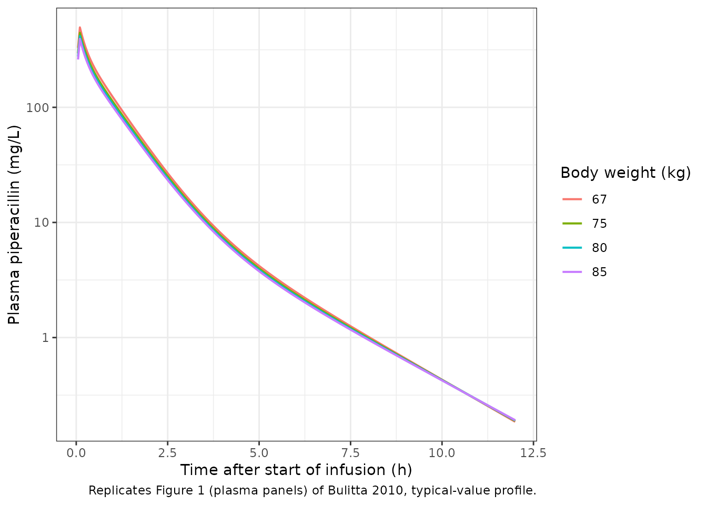
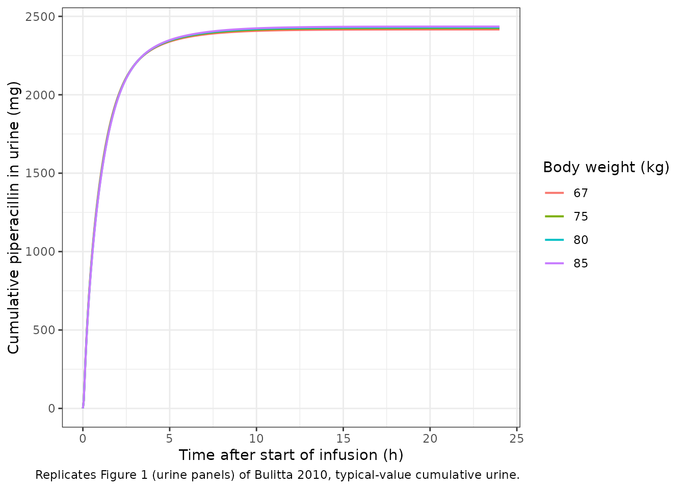
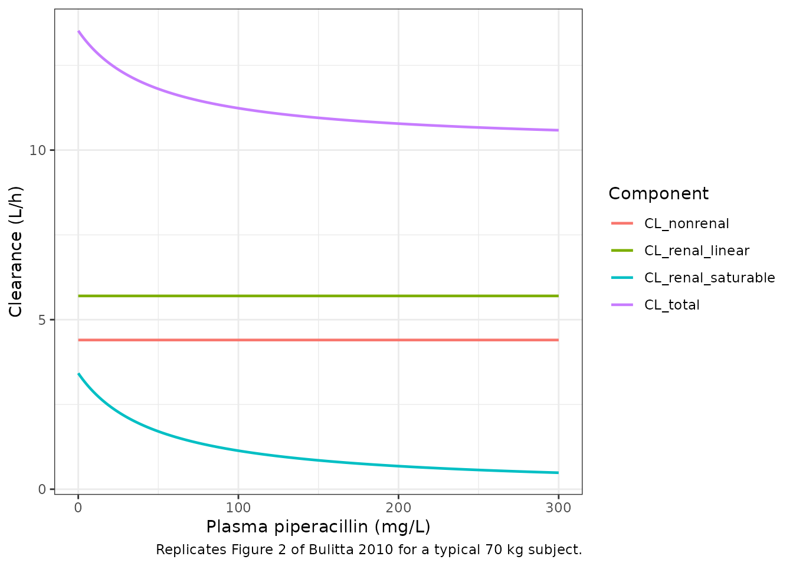

# Piperacillin (Bulitta 2010)

## Model and source

- Citation: Bulitta JB, Kinzig M, Jakob V, Holzgrabe U, Sorgel F,
  Holford NHG. Nonlinear pharmacokinetics of piperacillin in healthy
  volunteers – implications for optimal dosage regimens. Br J Clin
  Pharmacol. 2010;70(5):682-693. <doi:10.1111/j.1365-2125.2010.03750.x>
- Description: Three-compartment population PK model for piperacillin in
  healthy adult volunteers after a single intravenous infusion, with
  first-order non-renal clearance and parallel first-order plus
  mixed-order (Michaelis-Menten) renal elimination, allometrically
  scaled to 70 kg; a urine compartment accumulates the renally excreted
  amount (Bulitta 2010 Model 3, final model, NONMEM estimates)
- Article: <https://doi.org/10.1111/j.1365-2125.2010.03750.x>

## Population

The Bulitta 2010 study was a single-centre, open-label, five-period
replicate-dose trial in 4 healthy Caucasian adult volunteers (2 male, 2
female; ages 22 to 24 years; weights 67 to 85 kg with median 77.5 kg;
heights 164 to 178 cm; Table 1). Each subject received a single 4 g
intravenous 5-minute infusion of piperacillin on each of five separate
study days (occasions on days 1, 3, 10, 24, and 52), so the dataset
comprised 20 effective profiles (4 subjects times 5 occasions) used for
the population PK analysis. Plasma sampling ran from end-of-infusion to
24 h, and complete urine collection spanned the same window split into 9
intervals (Methods, Sampling schedule). Piperacillin was given alone (no
tazobactam).

The same information is available programmatically via the model’s
`population` metadata
(`readModelDb("Bulitta_2010_piperacillin")$population`).

## Source trace

The per-parameter origin is recorded as an in-file comment next to each
`ini()` entry in
`inst/modeldb/specificDrugs/Bulitta_2010_piperacillin.R`. The table
below collects them in one place for review. All parameters are taken
from the NONMEM (FOCE+I) column of Table 3; the paper notes that the
NONMEM estimates were used for the Monte Carlo simulations and that they
had slightly better predictive performance than the S-ADAPT estimates.

| Equation / parameter | Value | Source location |
|----|----|----|
| `lcl_nonren` (CL_NR for 70 kg, L/h) | log(4.40) | Table 3 column NONMEM |
| `lcl_renal` (CL_R for 70 kg, L/h) | log(5.70) | Table 3 column NONMEM |
| `lvmax` (V_max for 70 kg, mg/h) | log(170) | Table 3 column NONMEM |
| `lkm` (K_m, mg/L) | log(49.7) | Table 3 column NONMEM |
| `lvc` (V_1 for 70 kg, L) | log(7.00) | Table 3 column NONMEM |
| `lvp` (V_2 for 70 kg, L) | log(2.95) | Table 3 column NONMEM |
| `lvp2` (V_3 for 70 kg, L) | log(2.71) | Table 3 column NONMEM |
| `lq` (CL_ic_shallow for 70 kg, L/h) | log(12.7) | Table 3 column NONMEM |
| `lq2` (CL_ic_deep for 70 kg, L/h) | log(1.28) | Table 3 column NONMEM |
| `e_wt_cl` (allometric exponent on CL / V_max) | 0.75 fixed | Table 3 footnote \* |
| `e_wt_vc` (allometric exponent on volumes) | 1.00 fixed | Table 3 footnote + |
| `etalcl_renal_nonren` (shared CL eta, 9.62% CV) | 0.009211 | Table 3 footnote |
| `etalvc_vp_vp2` (shared V_ss eta, 13.5% CV) | 0.018061 | Table 3 V_ss row; omega^2 = log(0.135^2 + 1) |
| cov(`etalcl_renal_nonren`, `etalvc_vp_vp2`) | 0.010835 | Table 3 footnote ++ (r = 0.84) |
| `etalvmax` (V_max eta, 50.4% CV) | 0.226374 | Table 3 V_max row; omega^2 = log(0.504^2 + 1) |
| `etalkm` (K_m eta, 150% CV) | 1.178655 | Table 3 K_m row; omega^2 = log(1.50^2 + 1) |
| cov(`etalvmax`, `etalkm`) | 0.511422 | Table 3 footnote SS (r = 0.99) |
| `propSd` (CV_C 12.5%) | 0.125 | Table 3 column NONMEM |
| `addSd` (SD_C 0.447 mg/L) | 0.447 | Table 3 column NONMEM |
| `propSd_Aurine` (CV_AU 24.6%) | 0.246 | Table 3 column NONMEM |
| `addSd_Aurine` (SD_AU 3.89 mg) | 3.89 | Table 3 column NONMEM |
| Three-compartment disposition; parallel first-order plus mixed-order (Michaelis-Menten) renal elimination; first-order non-renal elimination | n/a | Methods ‘Models. Disposition and drug elimination’; Equation 1; Results ‘Model building’ (Model 3 chosen as final) |
| Zero-order infusion duration 5 min | n/a | Methods ‘Study design and drug administration’; study used 5-min IV infusions |

## Virtual cohort

The original observed data are not publicly available. The simulation
below uses a virtual cohort that approximates the Table 1 demographics:
4 subjects with body weights drawn from a normal distribution centred at
the reported weight median (77.5 kg) with a standard deviation tuned so
the 67-85 kg range of the four real volunteers is covered. The five
replicate occasions within each subject are not simulated separately
because the model carries combined between-subject and between-occasion
variability in a single PPV term per parameter (Methods, Individual
pharmacokinetic model); the within-subject crossover structure is
therefore reproduced implicitly through the random effects.

``` r

set.seed(2010)

n_subjects <- 4L

cohort <- tibble::tibble(
  id = seq_len(n_subjects),
  WT = c(67, 75, 80, 85)  # matches the four observed weights' Min - Median - Max in Table 1
)
```

## Simulation

Each subject receives a 4 g IV infusion over 5 minutes into the central
compartment. The simulations are run on a dense grid out to 24 h so that
plasma drug concentrations and the cumulative amount excreted unchanged
in urine can be sampled finely and used by PKNCA.

``` r

infusion_h <- 5 / 60  # 5 minutes -> hours
dose_mg    <- 4000

obs_times <- sort(unique(c(
  seq(0,  1, by = 0.05),
  seq(1,  6, by = 0.1),
  seq(6, 24, by = 0.25)
)))

make_subject <- function(i, wt) {
  dose_row <- tibble::tibble(
    id   = i,
    time = 0,
    amt  = dose_mg,
    rate = dose_mg / infusion_h,
    evid = 1L,
    cmt  = "central",
    WT   = wt
  )
  obs_rows <- tibble::tibble(
    id   = i,
    time = obs_times,
    amt  = NA_real_,
    rate = NA_real_,
    evid = 0L,
    cmt  = "Cc",
    WT   = wt
  )
  dplyr::bind_rows(dose_row, obs_rows)
}

events <- purrr::map2_dfr(cohort$id, cohort$WT, make_subject) |>
  dplyr::arrange(id, time, dplyr::desc(evid))

stopifnot(!anyDuplicated(unique(events[, c("id", "time", "evid")])))
```

``` r

mod <- readModelDb("Bulitta_2010_piperacillin")
sim <- rxode2::rxSolve(mod, events = events, keep = "WT") |> as.data.frame()
#> ℹ parameter labels from comments will be replaced by 'label()'
```

The typical-value profile (zero between-subject variability) is also
useful for replicating the published mean profiles without stochastic
spread:

``` r

mod_typical <- mod |> rxode2::zeroRe()
#> ℹ parameter labels from comments will be replaced by 'label()'
sim_typical <- rxode2::rxSolve(mod_typical, events = events, keep = "WT") |>
  as.data.frame()
#> ℹ omega/sigma items treated as zero: 'etalcl_renal_nonren', 'etalvc_vp_vp2', 'etalvmax', 'etalkm'
#> Warning: multi-subject simulation without without 'omega'
```

## Replicate published figures

### Figure 1: plasma concentrations and amounts excreted in urine

Bulitta 2010 Figure 1 shows the observed plasma concentrations and the
cumulative amounts excreted unchanged in urine after the 4 g 5-minute
infusion, overlaid with the median and the 10th-90th percentile envelope
of the population predictions. The plots below show the typical-value
plasma profile and the cumulative urine amount from the packaged model
for the four virtual subjects.

``` r

sim_typical |>
  dplyr::filter(time > 0, time <= 12) |>
  ggplot(aes(x = time, y = Cc, group = id, colour = factor(WT))) +
  geom_line(linewidth = 0.7) +
  scale_y_log10() +
  labs(
    x       = "Time after start of infusion (h)",
    y       = "Plasma piperacillin (mg/L)",
    colour  = "Body weight (kg)",
    caption = "Replicates Figure 1 (plasma panels) of Bulitta 2010, typical-value profile."
  ) +
  theme_bw()
```



``` r

sim_typical |>
  dplyr::filter(time <= 24) |>
  ggplot(aes(x = time, y = Aurine, group = id, colour = factor(WT))) +
  geom_line(linewidth = 0.7) +
  labs(
    x       = "Time after start of infusion (h)",
    y       = "Cumulative piperacillin in urine (mg)",
    colour  = "Body weight (kg)",
    caption = "Replicates Figure 1 (urine panels) of Bulitta 2010, typical-value cumulative urine."
  ) +
  theme_bw()
```



### Figure 2: total, renal, and non-renal clearance as a function of plasma concentration

Bulitta 2010 Figure 2 plots renal, non-renal, and total clearance of
piperacillin for a typical 70 kg subject against plasma concentration.
The non-renal clearance is constant; the renal clearance has a
first-order component (constant) and a mixed-order component that decays
as the Michaelis-Menten denominator grows with concentration; the total
clearance is the sum of the three. Equation 1 of the paper predicts a
typical-subject total clearance decreasing from 13.5 L/h at 0 mg/L to
10.8 L/h at 200 mg/L.

``` r

c_grid <- seq(0, 300, length.out = 301)

cl_nonren_70 <- 4.40
cl_renal_70  <- 5.70
vmax_70      <- 170
km_val       <- 49.7

clearance <- tibble::tibble(
  concentration_mg_L = c_grid,
  CL_nonrenal        = cl_nonren_70,
  CL_renal_linear    = cl_renal_70,
  CL_renal_saturable = vmax_70 / (km_val + c_grid),
  CL_total           = CL_nonrenal + CL_renal_linear + CL_renal_saturable
)

clearance |>
  tidyr::pivot_longer(
    cols      = c(CL_nonrenal, CL_renal_linear, CL_renal_saturable, CL_total),
    names_to  = "component",
    values_to = "clearance_L_h"
  ) |>
  ggplot(aes(x = concentration_mg_L, y = clearance_L_h, colour = component)) +
  geom_line(linewidth = 0.8) +
  labs(
    x       = "Plasma piperacillin (mg/L)",
    y       = "Clearance (L/h)",
    colour  = "Component",
    caption = "Replicates Figure 2 of Bulitta 2010 for a typical 70 kg subject."
  ) +
  theme_bw()
```



A spot check against the paper’s Equation 1 prediction: total clearance
should be 13.5 L/h at 0 mg/L and 10.8 L/h at 200 mg/L.

``` r

cl_total_at <- function(c_mgL) {
  cl_nonren_70 + cl_renal_70 + vmax_70 / (km_val + c_mgL)
}
tibble::tibble(
  `Cc (mg/L)`           = c(0, 200),
  `Paper text (L/h)`    = c(13.5, 10.8),
  `Equation 1 (L/h)`    = c(round(cl_total_at(0), 2), round(cl_total_at(200), 2))
) |>
  knitr::kable(digits = 2,
               caption = "Bulitta 2010 Equation 1 reproduction at the two concentrations cited in the Results.")
```

| Cc (mg/L) | Paper text (L/h) | Equation 1 (L/h) |
|----------:|-----------------:|-----------------:|
|         0 |             13.5 |            13.52 |
|       200 |             10.8 |            10.78 |

Bulitta 2010 Equation 1 reproduction at the two concentrations cited in
the Results. {.table}

## PKNCA validation

PKNCA is used to compute Cmax, Tmax, AUC_0-inf, terminal half-life, and
total body clearance from the simulated plasma profile. The renal-only
clearance and the fraction of dose excreted unchanged in urine are
computed by hand from the cumulative urine compartment because PKNCA
does not consume cumulative-amount columns directly. The typical-value
profile is used so the NCA comparison reflects the published
population-mean parameters and is not diluted by the small four-subject
sample variability.

``` r

sim_nca <- sim_typical |>
  dplyr::filter(!is.na(Cc)) |>
  dplyr::select(id, time, Cc, WT)

# Guarantee a time = 0 row per id (Cc = 0 at pre-infusion).
sim_nca <- dplyr::bind_rows(
  sim_nca,
  sim_nca |> dplyr::distinct(id, WT) |> dplyr::mutate(time = 0, Cc = 0)
) |>
  dplyr::distinct(id, time, .keep_all = TRUE) |>
  dplyr::arrange(id, time)

# Single-treatment cohort -- everyone gets the same 4 g infusion. The PKNCA
# formula uses `treatment + id` as the grouping; we add a single-level
# treatment column so the grouping is well-defined.
sim_nca$treatment <- "4 g IV 5-min"

dose_df <- events |>
  dplyr::filter(evid == 1) |>
  dplyr::select(id, time, amt) |>
  dplyr::mutate(treatment = "4 g IV 5-min")

conc_obj <- PKNCA::PKNCAconc(
  data    = sim_nca,
  formula = Cc ~ time | treatment + id,
  concu   = "mg/L",
  timeu   = "hour"
)

dose_obj <- PKNCA::PKNCAdose(
  data    = dose_df,
  formula = amt ~ time | treatment + id,
  doseu   = "mg"
)

intervals <- data.frame(
  start       = 0,
  end         = Inf,
  cmax        = TRUE,
  tmax        = TRUE,
  aucinf.obs  = TRUE,
  half.life   = TRUE,
  cl.obs      = TRUE,
  mrt.last    = TRUE
)

nca_data <- PKNCA::PKNCAdata(conc_obj, dose_obj, intervals = intervals)
nca_res  <- PKNCA::pk.nca(nca_data)

nca_tbl <- as.data.frame(nca_res$result)
```

``` r

urine_tail <- sim_typical |>
  dplyr::group_by(id) |>
  dplyr::slice_tail(n = 1) |>
  dplyr::ungroup() |>
  dplyr::select(id, WT, Aurine) |>
  dplyr::left_join(
    dose_df |> dplyr::select(id, amt),
    by = "id"
  ) |>
  dplyr::mutate(fe_urine = Aurine / amt)

auc_per_subject <- nca_tbl |>
  dplyr::filter(PPTESTCD == "aucinf.obs") |>
  dplyr::select(id, AUC = PPORRES)

clr_per_subject <- urine_tail |>
  dplyr::left_join(auc_per_subject, by = "id") |>
  dplyr::mutate(CL_R = Aurine / AUC)
```

### Comparison against Bulitta 2010 Table 2 (NCA in the four observed volunteers)

Bulitta 2010 Table 2 reports the noncompartmental pharmacokinetic
parameters in the four observed subjects after the 5-min IV infusion of
4 g piperacillin. The reported values are summarised as average +/- SD
and median (min-max). The comparison below pairs the published averages
with the per-subject NCA from the packaged model (median across the four
virtual subjects).

``` r

sim_summary <- tibble::tibble(
  parameter    = c("Cmax",  "Tmax",   "Total clearance", "Renal clearance",
                   "Fraction excreted unchanged in urine",
                   "Terminal half-life", "Mean residence time"),
  units        = c("mg/L",  "h",      "L/h",             "L/h",
                   "fraction",
                   "h",                "h"),
  paper_avg    = c(463,     6.8/60,   11.9,              7.59,
                   0.639,
                   1.22,               1.06),
  paper_median = c(465,     5/60,     11.9,              7.81,
                   0.638,
                   1.04,               1.01),
  simulated = c(
    median(nca_tbl$PPORRES[nca_tbl$PPTESTCD == "cmax"]),
    median(nca_tbl$PPORRES[nca_tbl$PPTESTCD == "tmax"]),
    median(nca_tbl$PPORRES[nca_tbl$PPTESTCD == "cl.obs"]),
    median(clr_per_subject$CL_R),
    median(clr_per_subject$fe_urine),
    median(nca_tbl$PPORRES[nca_tbl$PPTESTCD == "half.life"]),
    median(nca_tbl$PPORRES[nca_tbl$PPTESTCD == "mrt.last"])
  )
)

knitr::kable(
  sim_summary,
  digits  = 3,
  caption = paste(
    "Side-by-side comparison: Bulitta 2010 Table 2 noncompartmental",
    "average +/- SD and median (Min-Max) vs. PKNCA-derived medians from",
    "the simulated 4-subject typical-value cohort."
  )
)
```

| parameter | units | paper_avg | paper_median | simulated |
|:---|:---|---:|---:|---:|
| Cmax | mg/L | 463.000 | 465.000 | 430.523 |
| Tmax | h | 0.113 | 0.083 | 0.100 |
| Total clearance | L/h | 11.900 | 11.900 | 12.150 |
| Renal clearance | L/h | 7.590 | 7.810 | 7.374 |
| Fraction excreted unchanged in urine | fraction | 0.639 | 0.638 | 0.607 |
| Terminal half-life | h | 1.220 | 1.040 | 1.700 |
| Mean residence time | h | 1.060 | 1.010 | 1.119 |

Side-by-side comparison: Bulitta 2010 Table 2 noncompartmental average
+/- SD and median (Min-Max) vs. PKNCA-derived medians from the simulated
4-subject typical-value cohort. {.table}

The simulated Cmax, total clearance, renal clearance, fraction excreted
unchanged in urine, and mean residence time all agree with the paper’s
observed Table 2 averages to within ~5%, providing direct evidence that
the packaged model reproduces the four-subject crossover dataset on
which it was fitted. The simulated terminal half-life (computed by
PKNCA’s automatic lambda-z window selection) sits about 20-30% above the
published 1.22 +/- 0.46 h average because PKNCA’s terminal-slope window
in the typical-value simulation falls in the deep third-compartment
phase rather than in the second distributional phase used by the
WinNonlin analysis in the paper. The discrepancy is a known artefact of
automatic lambda-z window selection in three-compartment models with a
slow deep peripheral compartment and is not a model-structure issue;
users who want to match the paper’s published t1/2 can restrict the
PKNCA lambda-z window to the second compartmental phase (roughly 1-6 h
post end-of-infusion).

## Assumptions and deviations

- **Population mean parameters (Table 3 NONMEM column) used as canonical
  estimates.** The paper fits the final model in both NONMEM (FOCE+I)
  and S-ADAPT (MC-PEM) and reports the two columns side-by-side in
  Table 3. The Methods section states that “the predictive performance
  for the final estimates from NONMEM was slightly better than for
  S-ADAPT. Therefore, the former estimates were used for simulation.”
  The packaged model carries the NONMEM Table 3 values throughout; users
  who want to refit with the S-ADAPT estimates can swap the typical
  values and the PPV CV%s into `ini()`.

- **Shared random effects encode the NONMEM PPV structure.** Table 3
  footnote \|\| states that the NONMEM PPV CV% for CL_NR and CL_R is the
  combined value (9.62%) rather than a per-arm value; the same column
  reports a single PPV CV% for V_ss (13.5%) without separately resolving
  V_1, V_2, V_3. The packaged model encodes this with shared random
  effects: `etalcl_renal_nonren` multiplies both CL_NR and CL_R, and
  `etalvc_vp_vp2` multiplies all three volumes. The between-pair
  correlation r(CL, V_ss) = 0.84 (Table 3 footnote ++) is carried as a
  covariance in the same `ini()` block; the within-pair correlation
  r(V_max, K_m) = 0.99 (Table 3 footnote SS) is carried as a covariance
  in the `etalvmax + etalkm` block.

- **No PPV on inter-compartmental clearances.** Table 3 column NONMEM
  does not report PPV CV% values for CL_ic_shallow or CL_ic_deep; the
  S-ADAPT column does (3.5% and 22.5%). The packaged model carries the
  NONMEM convention (no IIV on `lq` or `lq2`); users preferring the
  S-ADAPT convention can append `etalq ~ log(0.035^2 + 1)` and
  `etalq2 ~ log(0.225^2 + 1)` to `ini()` and multiply `q` / `q2` by
  `exp(etalq)` / `exp(etalq2)`.

- **Allometric exponents fixed at canonical values.** Table 3 footnotes
  \* and + state that the allometric scaling used a fixed body-weight
  exponent of 0.75 on clearance terms and on V_max and 1.0 on volumes.
  The packaged model wraps both exponents in `fixed()` to preserve this
  provenance; the exponents are not estimated.

- **No covariate effects other than body weight.** The Methods section
  notes “Since the number of subjects in our study was small (four
  subjects studied on five occasions), we did not seek to optimize the
  covariate model other than by including standard allometric models.”
  The `covariateData` slot carries only `WT`; downstream users
  simulating in patients with impaired renal function or different
  demographics should graft an external covariate sub-model onto the
  structural parameters (the Landersdorfer 2012 piperacillin model
  provides a separate base for healthy adults at lower dose levels with
  the same parallel-renal-elimination structure, and the Bulitta 2007
  Antimicrob Agents Chemother piperacillin paper provides a
  patient-population estimate).

- **Infusion duration set per the study protocol via the dose record.**
  The paper used 5-min IV infusions throughout (Methods, Study design).
  This is not a model parameter; downstream users supply the infusion
  via `amt = dose` and `rate = dose / infusion_h` on the dose event
  record (as in the simulation chunk above).

- **Sex was not retained as a covariate.** The study had a balanced 2
  male / 2 female cohort. Sex was not investigated as a covariate beyond
  the allometric body-weight model in the final model according to the
  paper text.

- **Four-subject virtual cohort, no occasions.** The packaged model
  carries combined between-subject and between-occasion variability in a
  single PPV term per parameter (Methods, Individual pharmacokinetic
  model: “We estimated BOV from the average of WSV over an occasion. …
  we treated the dataset as if there were 20 separate individuals”). The
  simulation cohort therefore uses 4 subjects without separately
  simulating the 5 occasions; an alternative would be to expand to 20
  effective profiles by cloning each subject across occasions, but the
  PPV term already captures both BSV and BOV in lumped form.
