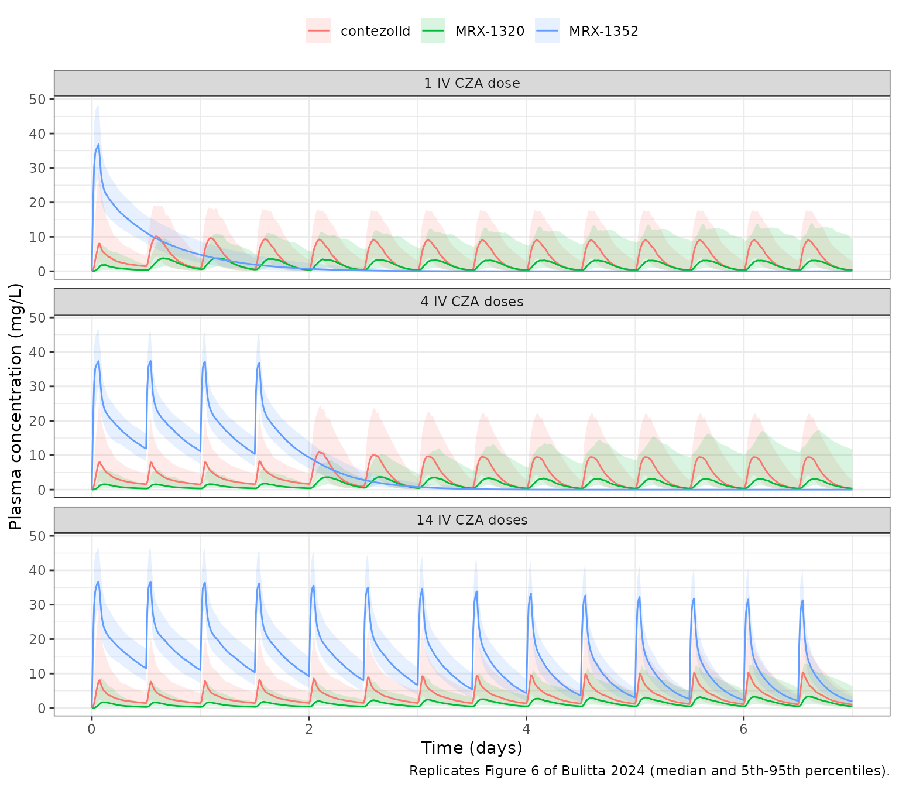

# Contezolid acefosamil and contezolid (Bulitta 2024)

## Model and source

- Citation: Bulitta JB, Fang E, Stryjewski ME, Wang W, Atiee GJ, Stark
  JG, Hafkin B. Population pharmacokinetic rationale for intravenous
  contezolid acefosamil followed by oral contezolid dosage regimens.
  Antimicrob Agents Chemother. 2024;68(4):e01400-23.
  <doi:10.1128/aac.01400-23>. Preliminary results presented as Bulitta
  JB, Hafkin B, Fang E. 1118. Population Pharmacokinetics of Contezolid
  Acefosamil and Contezolid - Rationale for a Safe and Effective Loading
  Dose Regimen. Open Forum Infect Dis. 2021;8(Suppl 1):S651.
  <doi:10.1093/ofid/ofab466.1311>.
- Description: Integrated population PK model for the intravenous double
  prodrug contezolid acefosamil (CZA), its intermediate MRX-1352, active
  contezolid and the inactive metabolite MRX-1320, jointly fitted to 110
  healthy volunteers (IV CZA 150-2400 mg; oral contezolid 400-1200 mg
  fed/fasting) and 74 adult phase 2 patients with acute bacterial skin
  and skin structure infection (oral contezolid 800 mg q12h with food).
  CZA (amount only, not assayed) converts to MRX-1352 by
  Michaelis-Menten kinetics with a first-order loss; MRX-1352,
  contezolid and MRX-1320 each have two-compartment disposition. The
  MRX-1352-to-contezolid conversion clearance is auto-induced by
  MRX-1352 concentration (sigmoid Emax) and rises sigmoidally with time
  since the first dose; the MRX-1352 loss clearance shares the same
  auto-induction EC50 and Hill coefficient. Contezolid is converted
  entirely by first-order clearance to MRX-1320, which is eliminated by
  parallel linear and Michaelis-Menten routes. Oral contezolid passes
  three transit compartments (each with mean time Tlag/3) and a gut
  compartment with first-order absorption; lag time, absorption
  half-life and relative bioavailability depend on the fed state and the
  400/800/1200 mg dose level. Allometric weight scaling (70 kg;
  exponents 0.75 clearances, 1 volumes). Separate typical contezolid
  clearance and between-subject variability for healthy volunteers and
  patients. Fitted in S-ADAPT (importance sampling).
- Article: <https://doi.org/10.1128/aac.01400-23>
- Preliminary conference abstract (IDWeek 2021 poster 1118):
  <https://doi.org/10.1093/ofid/ofab466.1311>

The 2021 abstract reported an earlier cut of the same analysis (for
example an apparent contezolid clearance of 13.1 L/h in healthy
volunteers and a steady-state volume of 20.5 L). Its numbers were
superseded by the full paper, which is the source for every value in
this model. No correction notice for the 2024 paper was found as of
2026-09-29.

## Population

The model was fitted simultaneously to 184 adults from three studies
(Bulitta 2024 Table 1 and Results paragraph 1):

- **MRX4-002** – 66 healthy volunteers given IV contezolid acefosamil
  (CZA): single doses of 150 to 2400 mg over 60 or 90 min, and 600 or
  900 mg q12h or 2100 mg q24h for 10 days. MRX-1352, contezolid and
  MRX-1320 were measured. Age 35.9 +/- 10.2 years, weight 77.9 +/- 10.0
  kg; 37 Caucasian, 26 Black, 1 Asian, 2 other.
- **MRX-I-02** – 44 healthy volunteers given oral contezolid: single
  doses of 400, 800 or 1200 mg with and without a high-fat meal
  (crossover), and 800 mg q12h with food for 14 or 28 days. Age 24.6 +/-
  3.3 years, weight 71.2 +/- 12.7 kg; 42 Caucasian, 2 Asian.
- **MRX-I-03** – 74 phase 2 patients with acute bacterial skin and skin
  structure infection (ABSSSI) given 800 mg oral contezolid q12h with
  food for 10 days, sampled at 4 and 5 h post-dose on days 3 and 7. Age
  38.4 +/- 10.7 years, weight 82.8 +/- 21.7 kg; 42 Caucasian, 10 Black,
  20 Hispanic, 2 other.

Across the three studies 68 of 184 subjects (37%) were female. The same
information is available programmatically via
`readModelDb("Bulitta_2024_contezolid")()$population`.

## Model structure

The IV prodrug CZA is converted to the intermediate MRX-1352 by
Michaelis-Menten kinetics on the CZA *amount* (Vmax 802 mg/h, AM50 0.96
mg), with a parallel first-order loss of CZA (half-life 19.7 min). CZA
itself was not fitted (most of its concentrations were below the
quantification limit), so it is carried as an amount in `depot_iv`.
MRX-1352, contezolid and MRX-1320 each have two-compartment disposition.
Every conversion flux is scaled by the product-to-substrate
molecular-mass ratio (CZA 552.33, MRX-1352 487.30, contezolid 408.33,
MRX-1320 444.36 Da).

The MRX-1352 to contezolid conversion clearance has two features
(Bulitta 2024 equations 1-7):

- an immediate sigmoid **auto-induction** by the MRX-1352 concentration,
  `IND = Emax * C^H / (C^H + EC50^H)`, which also drives the MRX-1352
  loss clearance with its own maximum `Emax_Loss` but the same EC50 and
  H; and
- a **time-dependent increase** of the base clearance from `CL_1352,0` =
  1.46 L/h to `CL_1352,SS` = 6.60 L/h, with half-maximal change at
  `TC50` = 116 h after the first dose.

Contezolid is converted entirely, by first-order clearance, to MRX-1320,
which is eliminated by parallel linear and Michaelis-Menten routes. Oral
contezolid passes three transit compartments, each with mean time Tlag/3
(Bulitta 2024 Figure 2), and a gut compartment with first-order
absorption.

## Source trace

Every value is from Bulitta 2024 Table 2 (‘Population mean’ and
‘Between-subject variability’ columns) unless stated otherwise. The same
origin is recorded as an in-file comment next to each `ini()` entry in
`inst/modeldb/specificDrugs/Bulitta_2024_contezolid.R`.

| Equation / parameter | Value | Source location |
|----|----|----|
| `lcl` / `lcl_csssi` (contezolid CL, healthy / patient) | 10.2 / 11.3 L/h | Table 2, CL_Con,HV and CL_Con,PA |
| `lq`, `lvc`, `lvp` (contezolid CLd, V1, V2) | 69.9 L/h, 3.0 L (fixed), 14.1 L | Table 2; V1 fixed per Results |
| `lfdepot` (F, 800 mg fed) | 0.640 | Table 2 and footnote e |
| `lfdepot_400fed`, `_400fasted`, `_800fasted`, `_1200fed`, `_1200fasted` | 0.924, 0.606, 0.467, 0.820, 0.485 | Table 2, F_rel rows (800 mg fed fixed to 1) |
| `lmtt` / `lmtt_fasted` (Tlag fed / fasting) | 47.5 / 22.5 min | Table 2; ktr = 3/Tlag from Figure 2 |
| `lka` / `lka_fasted` | log(2)/(59.3 min), log(2)/(69.4 min) | Table 2, T_1/2,abs rows |
| `lvmax_cza`, `lkm_cza`, `lkel_cza` | 802 mg/h, 0.960 mg, log(2)/(19.7 min) | Table 2, CZA rows |
| `lcl_mrx1352`, `lcl_ss_mrx1352` | 1.46, 6.60 L/h | Table 2, CL_1352,0 and CL_1352,SS; equation 4 |
| `lcl_t50_mrx1352`, `lcl_time_hill_mrx1352` | 116 h, 2.72 | Table 2, TC_50 and Ht; equation 3 |
| `lemax_mrx1352`, `lec50_mrx1352`, `lhill_mrx1352` | 145, 64.9 mg/L, 7.01 | Table 2; equations 1, 2, 5 |
| `lcl_loss_mrx1352`, `lemax_loss_mrx1352` | 0.00987 L/h, 29,400 | Table 2; equations 6, 7 |
| `lq_mrx1352`, `lvc_mrx1352`, `lvp_mrx1352` | 10.2 L/h, 7.61 L, 13.0 L | Table 2 |
| `lcl_mrx1320`, `lvmax_mrx1320`, `lkm_mrx1320` | 0.853 L/h, 74.2 mg/h, 0.657 mg/L | Table 2 |
| `lq_mrx1320`, `lvc_mrx1320`, `lvp_mrx1320` | 16.4 L/h, 29.6 L, 67.9 L | Table 2 |
| `e_wt_cl`, `e_wt_vc` | 0.75, 1 (fixed), 70 kg | Methods, ‘Covariate effects’ |
| Between-subject variances | BSV^2 | Table 2 BSV column, footnote c |
| `etalvmax_mrx1320` / `etalkm_mrx1320` covariance | r = 0.949 | Table 2 footnote f |
| `etaiov_lfdepot_oc1`, `_oc2` (BOV on F) | 0.135^2 | Table 2 footnote d |
| Residual errors (six additive, six proportional terms) | see model file | Table 2 footnote h |
| Molecular masses in conversion fluxes | 552.33 / 487.30 / 408.33 / 444.36 Da | Methods, ‘Population pharmacokinetics’ |
| `d/dt(depot_iv)` … `d/dt(peripheral1_mrx1320)` | n/a | Figure 2 and equations 1-7 |

## Simulation helpers

The paper’s Monte Carlo simulations (Methods, ‘Designing optimal IV and
oral dosage regimens’) used phase 2 patients (the larger clearance
variability), body weight with mean 70 kg and 20% CV, a 2000 mg CZA
loading dose as a 90-min infusion at 0 h, then 1000 mg CZA over 60 min
q12h, then 800 mg oral contezolid q12h with food starting 12 h after the
last IV dose.

``` r

mod <- readModelDb("Bulitta_2024_contezolid")

obs_grid <- seq(0, 168, by = 0.25)

# One subject's event records for a regimen with `n_iv` IV CZA doses followed
# by oral contezolid. Observation rows sit on the contezolid `central` state
# with dvid = 1; rxSolve still returns all three endpoint columns.
make_regimen <- function(id, n_iv, t_end = 168) {
  iv_t <- c(0, 12 * seq_len(n_iv - 1))
  iv_amt <- c(2000, rep(1000, n_iv - 1))
  iv_dur <- c(1.5, rep(1, n_iv - 1))
  po_t <- 12 * n_iv + 12 * (0:100)
  po_t <- po_t[po_t < t_end]
  dplyr::bind_rows(
    data.frame(
      id = id, time = iv_t, amt = iv_amt, rate = iv_amt / iv_dur,
      cmt = "depot_iv", evid = 1L, dvid = NA_integer_
    ),
    if (length(po_t) > 0) {
      data.frame(
        id = id, time = po_t, amt = 800, rate = 0,
        cmt = "transit1", evid = 1L, dvid = NA_integer_
      )
    },
    data.frame(
      id = id, time = obs_grid[obs_grid <= t_end], amt = 0, rate = 0,
      cmt = "central", evid = 0L, dvid = 1L
    )
  )
}

# Covariates for the patient Monte Carlo cohort.
add_patient_covariates <- function(ev, wt) {
  ev |>
    dplyr::left_join(data.frame(id = seq_along(wt), WT = wt), by = "id") |>
    dplyr::mutate(
      DIS_CSSSI = 1, FED = 1, DOSE_CONTEZOLID_MG = 800,
      STUDY_MRX4002 = 0, OCC = 1
    ) |>
    dplyr::arrange(id, time, dplyr::desc(evid))
}

# Trapezoidal AUC of a finely gridded typical-value profile over [a, b].
auc_window <- function(time, conc, a, b) {
  k <- time >= a & time <= b
  x <- time[k]
  y <- conc[k]
  sum(diff(x) * (head(y, -1) + tail(y, -1)) / 2)
}
```

## Typical-value reproduction of Table 3

Table 3 of Bulitta 2024 lists the Monte Carlo medians of daily AUCs for
the three analytes. The typical patient (70 kg, all random effects at
zero) is solved for each regimen and compared cell by cell. A
typical-value prediction is not the median of a non-linear Monte Carlo
simulation, so agreement within roughly 15% is the expectation; cells
where the published median is below 5 mg\*h/L (MRX-1352 after IV dosing
stops) are shown but not gated.

``` r

regimens <- c("1 IV CZA dose" = 1, "4 IV CZA doses" = 4, "14 IV CZA doses" = 14)
days <- c(1, 2, 3, 4, 7)

typical <- lapply(names(regimens), function(reg) {
  ev <- make_regimen(1, regimens[[reg]]) |>
    add_patient_covariates(wt = 70)
  s <- as.data.frame(rxode2::rxSolve(mod, ev, omega = NA, sigma = NA, returnType = "data.frame"))
  do.call(rbind, lapply(days, function(d) {
    data.frame(
      regimen = reg, day = d,
      analyte = c("contezolid", "MRX-1352", "MRX-1320"),
      sim = c(
        auc_window(s$time, s$Cc, 24 * (d - 1), 24 * d),
        auc_window(s$time, s$Cc_mrx1352, 24 * (d - 1), 24 * d),
        auc_window(s$time, s$Cc_mrx1320, 24 * (d - 1), 24 * d)
      )
    )
  }))
}) |> dplyr::bind_rows()
#> ℹ parameter labels from comments will be replaced by 'label()'
#> Warning: some etas defaulted to non-mu referenced, possible parsing error: etalcl_csssi, etalfdepot_400fasted, etalfdepot_800fasted, etalfdepot_1200fed, etalfdepot_1200fasted, etalmtt_fasted, etalka_fasted, etaiov_lfdepot_oc1, etaiov_lfdepot_oc2
#> as a work-around try putting the mu-referenced expression on a simple line

# Bulitta 2024 Table 3, medians of 1,000 simulated patients (mg*h/L).
published_t3 <- tibble::tribble(
  ~regimen, ~day, ~analyte, ~published,
  "1 IV CZA dose", 1, "contezolid", 103, "1 IV CZA dose", 1, "MRX-1352", 334, "1 IV CZA dose", 1, "MRX-1320", 36.9,
  "1 IV CZA dose", 2, "contezolid", 103, "1 IV CZA dose", 2, "MRX-1352", 58.7, "1 IV CZA dose", 2, "MRX-1320", 48.3,
  "1 IV CZA dose", 3, "contezolid", 95.9, "1 IV CZA dose", 3, "MRX-1352", 7.36, "1 IV CZA dose", 3, "MRX-1320", 42.7,
  "1 IV CZA dose", 4, "contezolid", 94.2, "1 IV CZA dose", 4, "MRX-1352", 0.53, "1 IV CZA dose", 4, "MRX-1320", 40.7,
  "1 IV CZA dose", 7, "contezolid", 94.1, "1 IV CZA dose", 7, "MRX-1352", 0, "1 IV CZA dose", 7, "MRX-1320", 40.3,
  "4 IV CZA doses", 1, "contezolid", 76.3, "4 IV CZA doses", 1, "MRX-1352", 461, "4 IV CZA doses", 1, "MRX-1320", 19.3,
  "4 IV CZA doses", 2, "contezolid", 77.5, "4 IV CZA doses", 2, "MRX-1352", 432, "4 IV CZA doses", 2, "MRX-1320", 21.6,
  "4 IV CZA doses", 3, "contezolid", 106, "4 IV CZA doses", 3, "MRX-1352", 93.2, "4 IV CZA doses", 3, "MRX-1320", 50.6,
  "4 IV CZA doses", 4, "contezolid", 91.9, "4 IV CZA doses", 4, "MRX-1352", 6.89, "4 IV CZA doses", 4, "MRX-1320", 43.5,
  "4 IV CZA doses", 7, "contezolid", 89.6, "4 IV CZA doses", 7, "MRX-1352", 0, "4 IV CZA doses", 7, "MRX-1320", 39.4,
  "14 IV CZA doses", 1, "contezolid", 76.8, "14 IV CZA doses", 1, "MRX-1352", 467, "14 IV CZA doses", 1, "MRX-1320", 19.6,
  "14 IV CZA doses", 2, "contezolid", 77.5, "14 IV CZA doses", 2, "MRX-1352", 435, "14 IV CZA doses", 2, "MRX-1320", 22.7,
  "14 IV CZA doses", 3, "contezolid", 84.8, "14 IV CZA doses", 3, "MRX-1352", 384, "14 IV CZA doses", 3, "MRX-1320", 27.9,
  "14 IV CZA doses", 4, "contezolid", 91.9, "14 IV CZA doses", 4, "MRX-1352", 320, "14 IV CZA doses", 4, "MRX-1320", 32.9,
  "14 IV CZA doses", 7, "contezolid", 98.4, "14 IV CZA doses", 7, "MRX-1352", 218, "14 IV CZA doses", 7, "MRX-1320", 42.3
)

cmp_t3 <- dplyr::inner_join(typical, published_t3, by = c("regimen", "day", "analyte")) |>
  dplyr::mutate(pct_diff = 100 * (sim - published) / published)
stopifnot(nrow(cmp_t3) == nrow(published_t3))

cmp_t3 |>
  dplyr::mutate(sim = signif(sim, 3), pct_diff = ifelse(published >= 5, round(pct_diff, 1), NA)) |>
  dplyr::rename(
    "Regimen" = regimen, "Day" = day, "Analyte" = analyte,
    "Typical-value AUC (mg*h/L)" = sim,
    "Table 3 median (mg*h/L)" = published,
    "% difference" = pct_diff
  ) |>
  knitr::kable(caption = "Daily AUC of the typical 70 kg patient against the Monte Carlo medians of Bulitta 2024 Table 3.")
```

| Regimen | Day | Analyte | Typical-value AUC (mg\*h/L) | Table 3 median (mg\*h/L) | % difference |
|:---|---:|:---|---:|---:|---:|
| 1 IV CZA dose | 1 | contezolid | 1.00e+02 | 103.00 | -2.8 |
| 1 IV CZA dose | 1 | MRX-1352 | 3.47e+02 | 334.00 | 3.8 |
| 1 IV CZA dose | 1 | MRX-1320 | 3.70e+01 | 36.90 | 0.3 |
| 1 IV CZA dose | 2 | contezolid | 9.89e+01 | 103.00 | -4.0 |
| 1 IV CZA dose | 2 | MRX-1352 | 6.13e+01 | 58.70 | 4.4 |
| 1 IV CZA dose | 2 | MRX-1320 | 4.82e+01 | 48.30 | -0.1 |
| 1 IV CZA dose | 3 | contezolid | 9.21e+01 | 95.90 | -4.0 |
| 1 IV CZA dose | 3 | MRX-1352 | 8.19e+00 | 7.36 | 11.3 |
| 1 IV CZA dose | 3 | MRX-1320 | 4.14e+01 | 42.70 | -3.1 |
| 1 IV CZA dose | 4 | contezolid | 9.08e+01 | 94.20 | -3.6 |
| 1 IV CZA dose | 4 | MRX-1352 | 6.07e-01 | 0.53 | NA |
| 1 IV CZA dose | 4 | MRX-1320 | 3.95e+01 | 40.70 | -3.0 |
| 1 IV CZA dose | 7 | contezolid | 9.06e+01 | 94.10 | -3.7 |
| 1 IV CZA dose | 7 | MRX-1352 | 4.60e-06 | 0.00 | NA |
| 1 IV CZA dose | 7 | MRX-1320 | 3.91e+01 | 40.30 | -2.9 |
| 4 IV CZA doses | 1 | contezolid | 8.17e+01 | 76.30 | 7.1 |
| 4 IV CZA doses | 1 | MRX-1352 | 4.78e+02 | 461.00 | 3.7 |
| 4 IV CZA doses | 1 | MRX-1320 | 2.18e+01 | 19.30 | 13.1 |
| 4 IV CZA doses | 2 | contezolid | 8.15e+01 | 77.50 | 5.2 |
| 4 IV CZA doses | 2 | MRX-1352 | 4.47e+02 | 432.00 | 3.4 |
| 4 IV CZA doses | 2 | MRX-1320 | 2.30e+01 | 21.60 | 6.4 |
| 4 IV CZA doses | 3 | contezolid | 1.07e+02 | 106.00 | 1.4 |
| 4 IV CZA doses | 3 | MRX-1352 | 9.70e+01 | 93.20 | 4.1 |
| 4 IV CZA doses | 3 | MRX-1320 | 5.12e+01 | 50.60 | 1.1 |
| 4 IV CZA doses | 4 | contezolid | 9.24e+01 | 91.90 | 0.6 |
| 4 IV CZA doses | 4 | MRX-1352 | 7.19e+00 | 6.89 | 4.4 |
| 4 IV CZA doses | 4 | MRX-1320 | 4.24e+01 | 43.50 | -2.5 |
| 4 IV CZA doses | 7 | contezolid | 9.06e+01 | 89.60 | 1.1 |
| 4 IV CZA doses | 7 | MRX-1352 | 5.47e-05 | 0.00 | NA |
| 4 IV CZA doses | 7 | MRX-1320 | 3.91e+01 | 39.40 | -0.7 |
| 14 IV CZA doses | 1 | contezolid | 8.17e+01 | 76.80 | 6.4 |
| 14 IV CZA doses | 1 | MRX-1352 | 4.78e+02 | 467.00 | 2.4 |
| 14 IV CZA doses | 1 | MRX-1320 | 2.18e+01 | 19.60 | 11.3 |
| 14 IV CZA doses | 2 | contezolid | 8.15e+01 | 77.50 | 5.2 |
| 14 IV CZA doses | 2 | MRX-1352 | 4.47e+02 | 435.00 | 2.7 |
| 14 IV CZA doses | 2 | MRX-1320 | 2.30e+01 | 22.70 | 1.2 |
| 14 IV CZA doses | 3 | contezolid | 9.03e+01 | 84.80 | 6.5 |
| 14 IV CZA doses | 3 | MRX-1352 | 3.95e+02 | 384.00 | 3.0 |
| 14 IV CZA doses | 3 | MRX-1320 | 2.87e+01 | 27.90 | 3.0 |
| 14 IV CZA doses | 4 | contezolid | 9.77e+01 | 91.90 | 6.3 |
| 14 IV CZA doses | 4 | MRX-1352 | 3.31e+02 | 320.00 | 3.4 |
| 14 IV CZA doses | 4 | MRX-1320 | 3.57e+01 | 32.90 | 8.6 |
| 14 IV CZA doses | 7 | contezolid | 1.04e+02 | 98.40 | 6.0 |
| 14 IV CZA doses | 7 | MRX-1352 | 2.22e+02 | 218.00 | 1.8 |
| 14 IV CZA doses | 7 | MRX-1320 | 4.68e+01 | 42.30 | 10.5 |

Daily AUC of the typical 70 kg patient against the Monte Carlo medians
of Bulitta 2024 Table 3. {.table}

``` r

gated <- cmp_t3 |> dplyr::filter(published >= 5)
# Deterministic solve, so these bounds are machine-independent. Observed
# during authoring: median |% diff| 3.7%, maximum 13.1% (MRX-1320 on day 1 of
# the multi-IV regimens, where a typical-value prediction and a skewed Monte
# Carlo median diverge most).
stopifnot(
  nrow(gated) == 42,
  median(abs(gated$pct_diff)) < 6,
  max(abs(gated$pct_diff)) < 18
)
```

## Apparent clearance and oral bioavailability

Table 2 footnote b states that, after accounting for the bioavailability
of 800 mg oral contezolid with food, the apparent total clearance was
16.0 L/h in healthy volunteers and 17.7 L/h in patients, and that 1600
mg/day gives a typical AUC0-24 of 90.4 mg\*h/L in 70 kg patients.
Contezolid disposition is linear, so single-dose AUC from PKNCA gives
CL/F directly, and the ratio of AUCs across dose and meal conditions
returns the relative bioavailabilities of Table 2. The terminal
half-life of contezolid is about 1.3 h, so AUC0-24 captures the whole
profile; the profile is not extended further because solver round-off
makes the far tail fluctuate around zero.

``` r

oral_conditions <- tibble::tribble(
  ~treatment, ~dose, ~FED, ~DIS_CSSSI,
  "HV 800 mg fed", 800, 1, 0,
  "HV 800 mg fasting", 800, 0, 0,
  "HV 400 mg fed", 400, 1, 0,
  "HV 400 mg fasting", 400, 0, 0,
  "HV 1200 mg fed", 1200, 1, 0,
  "HV 1200 mg fasting", 1200, 0, 0,
  "Patient 800 mg fed", 800, 1, 1
)

oral_ev <- lapply(seq_len(nrow(oral_conditions)), function(i) {
  cond <- oral_conditions[i, ]
  dplyr::bind_rows(
    data.frame(id = i, time = 0, amt = cond$dose, cmt = "transit1", evid = 1L, dvid = NA_integer_),
    data.frame(id = i, time = seq(0, 24, by = 0.05), amt = 0, cmt = "central", evid = 0L, dvid = 1L)
  ) |>
    dplyr::mutate(
      treatment = cond$treatment, WT = 70, FED = cond$FED, DIS_CSSSI = cond$DIS_CSSSI,
      DOSE_CONTEZOLID_MG = cond$dose, STUDY_MRX4002 = 0, OCC = 1
    )
}) |> dplyr::bind_rows()

oral_sim <- rxode2::rxSolve(
  mod, oral_ev,
  omega = NA, sigma = NA, keep = "treatment", returnType = "data.frame"
)

oral_conc <- oral_sim |>
  dplyr::filter(!is.na(Cc)) |>
  dplyr::select(id, time, Cc, treatment)
oral_dose <- oral_ev |>
  dplyr::filter(evid == 1) |>
  dplyr::select(id, time, amt, treatment)

oral_nca <- PKNCA::pk.nca(PKNCA::PKNCAdata(
  PKNCA::PKNCAconc(oral_conc, Cc ~ time | treatment + id),
  PKNCA::PKNCAdose(oral_dose, amt ~ time | treatment + id),
  intervals = data.frame(start = 0, end = 24, auclast = TRUE, cmax = TRUE, tmax = TRUE)
))

oral_auc <- as.data.frame(oral_nca) |>
  dplyr::filter(PPTESTCD == "auclast") |>
  dplyr::select(treatment, auc = PPORRES) |>
  dplyr::left_join(oral_conditions, by = "treatment") |>
  dplyr::mutate(
    cl_f = dose / auc,
    frel = (auc / dose) / (auc[treatment == "HV 800 mg fed"] / 800)
  )

oral_auc |>
  dplyr::select(treatment, auc, cl_f, frel) |>
  dplyr::mutate(dplyr::across(c(auc, cl_f, frel), ~ signif(.x, 4))) |>
  dplyr::rename(
    "Condition" = treatment, "AUC0-24 (mg*h/L)" = auc,
    "Dose / AUC (L/h)" = cl_f, "Relative F vs 800 mg fed" = frel
  ) |>
  knitr::kable(caption = "Typical-value single oral doses (70 kg).")
```

| Condition | AUC0-24 (mg\*h/L) | Dose / AUC (L/h) | Relative F vs 800 mg fed |
|:---|---:|---:|---:|
| HV 1200 mg fasting | 36.52 | 32.86 | 0.4850 |
| HV 1200 mg fed | 61.74 | 19.44 | 0.8200 |
| HV 400 mg fasting | 15.21 | 26.30 | 0.6060 |
| HV 400 mg fed | 23.19 | 17.25 | 0.9240 |
| HV 800 mg fasting | 23.44 | 34.13 | 0.4670 |
| HV 800 mg fed | 50.19 | 15.94 | 1.0000 |
| Patient 800 mg fed | 45.31 | 17.66 | 0.9027 |

Typical-value single oral doses (70 kg). {.table}

``` r

got <- function(tr, col) {
  v <- oral_auc[[col]][oral_auc$treatment == tr]
  if (length(v) != 1L) stop("no unique row for ", tr)
  v
}
stopifnot(
  # Table 2 footnote b: CL/F 16.0 L/h (healthy) and 17.7 L/h (patients).
  abs(got("HV 800 mg fed", "cl_f") / 16.0 - 1) < 0.01,
  abs(got("Patient 800 mg fed", "cl_f") / 17.7 - 1) < 0.01,
  # Table 2 relative bioavailabilities (linear disposition, so exact).
  abs(got("HV 800 mg fasting", "frel") / 0.467 - 1) < 0.01,
  abs(got("HV 400 mg fed", "frel") / 0.924 - 1) < 0.01,
  abs(got("HV 400 mg fasting", "frel") / 0.606 - 1) < 0.01,
  abs(got("HV 1200 mg fed", "frel") / 0.820 - 1) < 0.01,
  abs(got("HV 1200 mg fasting", "frel") / 0.485 - 1) < 0.01,
  # Footnote b: 2 x 800 mg/day gives a typical AUC0-24 of 90.4 mg*h/L in
  # patients; at steady state AUC0-24 = 1600 / (CL/F).
  abs(1600 / got("Patient 800 mg fed", "cl_f") / 90.4 - 1) < 0.01
)
```

## Monte Carlo simulation (Figure 6 and Table 3)

A virtual patient cohort of 200 per regimen (the paper used 1,000) with
weight drawn from a normal distribution with mean 70 kg and 20% CV,
truncated to 40-120 kg, is simulated over the first 7 days of each
regimen.

``` r

set.seed(20240228)
rxode2::rxSetSeed(20240228)
n_per_arm <- 200

mc_events <- lapply(seq_along(regimens), function(k) {
  wt <- pmin(pmax(rnorm(n_per_arm, 70, 14), 40), 120)
  ev <- lapply(seq_len(n_per_arm), function(i) make_regimen(i, regimens[[k]])) |>
    dplyr::bind_rows() |>
    add_patient_covariates(wt = wt)
  ev$id <- ev$id + (k - 1) * n_per_arm
  ev$treatment <- names(regimens)[k]
  ev
}) |> dplyr::bind_rows()
stopifnot(!anyDuplicated(unique(mc_events[, c("id", "time", "evid", "cmt")])))

mc_sim <- rxode2::rxSolve(mod, mc_events, keep = "treatment", returnType = "data.frame")
```

``` r

# Replicates Figure 6 of Bulitta 2024 (first three rows): median and 5th-95th
# percentiles of the three analytes over the first days of each regimen.
mc_sim |>
  dplyr::select(treatment, time, contezolid = Cc, `MRX-1352` = Cc_mrx1352, `MRX-1320` = Cc_mrx1320) |>
  tidyr::pivot_longer(-c(treatment, time), names_to = "analyte", values_to = "conc") |>
  dplyr::group_by(treatment, analyte, time) |>
  dplyr::summarise(
    q05 = quantile(conc, 0.05), q50 = median(conc), q95 = quantile(conc, 0.95),
    .groups = "drop"
  ) |>
  dplyr::mutate(treatment = factor(treatment, levels = names(regimens))) |>
  ggplot(aes(time / 24, q50, colour = analyte, fill = analyte)) +
  geom_ribbon(aes(ymin = q05, ymax = q95), alpha = 0.15, colour = NA) +
  geom_line() +
  facet_wrap(~treatment, ncol = 1) +
  labs(
    x = "Time (days)", y = "Plasma concentration (mg/L)", colour = NULL, fill = NULL,
    caption = "Replicates Figure 6 of Bulitta 2024 (median and 5th-95th percentiles)."
  ) +
  theme_bw() +
  theme(legend.position = "top")
```



### PKNCA of the Monte Carlo cohort

Daily AUCs (days 1, 3 and 7) are computed with PKNCA separately for each
analyte and compared against the Table 3 medians.

``` r

nca_one <- function(sim, conc_col, analyte) {
  conc <- sim |>
    dplyr::select(id, time, treatment, Cc = dplyr::all_of(conc_col)) |>
    dplyr::filter(!is.na(Cc))
  dose <- mc_events |>
    dplyr::filter(evid == 1) |>
    dplyr::select(id, time, amt, treatment)
  res <- PKNCA::pk.nca(PKNCA::PKNCAdata(
    PKNCA::PKNCAconc(conc, Cc ~ time | treatment + id),
    PKNCA::PKNCAdose(dose, amt ~ time | treatment + id),
    intervals = data.frame(
      start = c(0, 48, 144), end = c(24, 72, 168), auclast = TRUE
    )
  ))
  as.data.frame(res) |>
    dplyr::mutate(analyte = analyte, day = end / 24)
}

mc_nca <- dplyr::bind_rows(
  nca_one(mc_sim, "Cc", "contezolid"),
  nca_one(mc_sim, "Cc_mrx1352", "MRX-1352"),
  nca_one(mc_sim, "Cc_mrx1320", "MRX-1320")
)
#> Warning in assert_conc(conc, any_missing_conc = any_missing_conc): Negative
#> concentrations found
#> Warning in assert_conc(conc, any_missing_conc = any_missing_conc): Negative
#> concentrations found
#> Warning in log(conc.2/conc.1): NaNs produced
#> Warning in assert_conc(conc, any_missing_conc = any_missing_conc): Negative
#> concentrations found
#> Warning in log(conc.2/conc.1): NaNs produced
#> Warning in assert_conc(conc, any_missing_conc = any_missing_conc): Negative
#> concentrations found
#> Warning in log(conc.2/conc.1): NaNs produced
#> Warning in assert_conc(conc, any_missing_conc = any_missing_conc): Negative
#> concentrations found
#> Warning in log(conc.2/conc.1): NaNs produced
#> Warning in assert_conc(conc, any_missing_conc = any_missing_conc): Negative
#> concentrations found
#> Warning in log(conc.2/conc.1): NaNs produced
#> Warning in assert_conc(conc, any_missing_conc = any_missing_conc): Negative
#> concentrations found
#> Warning in log(conc.2/conc.1): NaNs produced
#> Warning in assert_conc(conc, any_missing_conc = any_missing_conc): Negative
#> concentrations found
#> Warning in log(conc.2/conc.1): NaNs produced
#> Warning in assert_conc(conc, any_missing_conc = any_missing_conc): Negative
#> concentrations found
#> Warning in log(conc.2/conc.1): NaNs produced
#> Warning in assert_conc(conc, any_missing_conc = any_missing_conc): Negative
#> concentrations found
#> Warning in log(conc.2/conc.1): NaNs produced
#> Warning in assert_conc(conc, any_missing_conc = any_missing_conc): Negative
#> concentrations found
#> Warning in log(conc.2/conc.1): NaNs produced
#> Warning in assert_conc(conc, any_missing_conc = any_missing_conc): Negative
#> concentrations found
#> Warning in log(conc.2/conc.1): NaNs produced
#> Warning in assert_conc(conc, any_missing_conc = any_missing_conc): Negative
#> concentrations found
#> Warning in log(conc.2/conc.1): NaNs produced
#> Warning in assert_conc(conc, any_missing_conc = any_missing_conc): Negative
#> concentrations found
#> Warning in log(conc.2/conc.1): NaNs produced
#> Warning in assert_conc(conc, any_missing_conc = any_missing_conc): Negative
#> concentrations found
#> Warning in log(conc.2/conc.1): NaNs produced
#> Warning in assert_conc(conc, any_missing_conc = any_missing_conc): Negative
#> concentrations found
#> Warning in log(conc.2/conc.1): NaNs produced
#> Warning in assert_conc(conc, any_missing_conc = any_missing_conc): Negative
#> concentrations found
#> Warning in log(conc.2/conc.1): NaNs produced
#> Warning in assert_conc(conc, any_missing_conc = any_missing_conc): Negative
#> concentrations found
#> Warning in log(conc.2/conc.1): NaNs produced
#> Warning in assert_conc(conc, any_missing_conc = any_missing_conc): Negative
#> concentrations found
#> Warning in log(conc.2/conc.1): NaNs produced
#> Warning in assert_conc(conc, any_missing_conc = any_missing_conc): Negative
#> concentrations found
#> Warning in log(conc.2/conc.1): NaNs produced
#> Warning in assert_conc(conc, any_missing_conc = any_missing_conc): Negative
#> concentrations found
#> Warning in log(conc.2/conc.1): NaNs produced
#> Warning in assert_conc(conc, any_missing_conc = any_missing_conc): Negative
#> concentrations found
#> Warning in log(conc.2/conc.1): NaNs produced
#> Warning in assert_conc(conc, any_missing_conc = any_missing_conc): Negative
#> concentrations found
#> Warning in log(conc.2/conc.1): NaNs produced
#> Warning in assert_conc(conc, any_missing_conc = any_missing_conc): Negative
#> concentrations found
#> Warning in log(conc.2/conc.1): NaNs produced
#> Warning in assert_conc(conc, any_missing_conc = any_missing_conc): Negative
#> concentrations found
#> Warning in log(conc.2/conc.1): NaNs produced
#> Warning in assert_conc(conc, any_missing_conc = any_missing_conc): Negative
#> concentrations found
#> Warning in log(conc.2/conc.1): NaNs produced
#> Warning in assert_conc(conc, any_missing_conc = any_missing_conc): Negative
#> concentrations found
#> Warning in log(conc.2/conc.1): NaNs produced
#> Warning in assert_conc(conc, any_missing_conc = any_missing_conc): Negative
#> concentrations found
#> Warning in log(conc.2/conc.1): NaNs produced
#> Warning in assert_conc(conc, any_missing_conc = any_missing_conc): Negative
#> concentrations found
#> Warning in log(conc.2/conc.1): NaNs produced
#> Warning in assert_conc(conc, any_missing_conc = any_missing_conc): Negative
#> concentrations found
#> Warning in log(conc.2/conc.1): NaNs produced
#> Warning in assert_conc(conc, any_missing_conc = any_missing_conc): Negative
#> concentrations found
#> Warning in log(conc.2/conc.1): NaNs produced
#> Warning in assert_conc(conc, any_missing_conc = any_missing_conc): Negative
#> concentrations found
#> Warning in log(conc.2/conc.1): NaNs produced
#> Warning in assert_conc(conc, any_missing_conc = any_missing_conc): Negative
#> concentrations found
#> Warning in log(conc.2/conc.1): NaNs produced
#> Warning in assert_conc(conc, any_missing_conc = any_missing_conc): Negative
#> concentrations found
#> Warning in log(conc.2/conc.1): NaNs produced
#> Warning in assert_conc(conc, any_missing_conc = any_missing_conc): Negative
#> concentrations found
#> Warning in log(conc.2/conc.1): NaNs produced
#> Warning in assert_conc(conc, any_missing_conc = any_missing_conc): Negative
#> concentrations found
#> Warning in log(conc.2/conc.1): NaNs produced
#> Warning in assert_conc(conc, any_missing_conc = any_missing_conc): Negative
#> concentrations found
#> Warning in log(conc.2/conc.1): NaNs produced
#> Warning in assert_conc(conc, any_missing_conc = any_missing_conc): Negative
#> concentrations found
#> Warning in log(conc.2/conc.1): NaNs produced
#> Warning in assert_conc(conc, any_missing_conc = any_missing_conc): Negative
#> concentrations found
#> Warning in log(conc.2/conc.1): NaNs produced
#> Warning in assert_conc(conc, any_missing_conc = any_missing_conc): Negative
#> concentrations found
#> Warning in log(conc.2/conc.1): NaNs produced
#> Warning in assert_conc(conc, any_missing_conc = any_missing_conc): Negative
#> concentrations found
#> Warning in log(conc.2/conc.1): NaNs produced
#> Warning in assert_conc(conc, any_missing_conc = any_missing_conc): Negative
#> concentrations found
#> Warning in log(conc.2/conc.1): NaNs produced
#> Warning in assert_conc(conc, any_missing_conc = any_missing_conc): Negative
#> concentrations found
#> Warning in log(conc.2/conc.1): NaNs produced
#> Warning in assert_conc(conc, any_missing_conc = any_missing_conc): Negative
#> concentrations found
#> Warning in log(conc.2/conc.1): NaNs produced
#> Warning in assert_conc(conc, any_missing_conc = any_missing_conc): Negative
#> concentrations found
#> Warning in log(conc.2/conc.1): NaNs produced
#> Warning in assert_conc(conc, any_missing_conc = any_missing_conc): Negative
#> concentrations found
#> Warning in log(conc.2/conc.1): NaNs produced
#> Warning in assert_conc(conc, any_missing_conc = any_missing_conc): Negative
#> concentrations found
#> Warning in log(conc.2/conc.1): NaNs produced
#> Warning in assert_conc(conc, any_missing_conc = any_missing_conc): Negative
#> concentrations found
#> Warning in log(conc.2/conc.1): NaNs produced
#> Warning in assert_conc(conc, any_missing_conc = any_missing_conc): Negative
#> concentrations found
#> Warning in log(conc.2/conc.1): NaNs produced
#> Warning in assert_conc(conc, any_missing_conc = any_missing_conc): Negative
#> concentrations found
#> Warning in log(conc.2/conc.1): NaNs produced
#> Warning in assert_conc(conc, any_missing_conc = any_missing_conc): Negative
#> concentrations found
#> Warning in log(conc.2/conc.1): NaNs produced
#> Warning in assert_conc(conc, any_missing_conc = any_missing_conc): Negative
#> concentrations found
#> Warning in log(conc.2/conc.1): NaNs produced
#> Warning in assert_conc(conc, any_missing_conc = any_missing_conc): Negative
#> concentrations found
#> Warning in log(conc.2/conc.1): NaNs produced
#> Warning in assert_conc(conc, any_missing_conc = any_missing_conc): Negative
#> concentrations found
#> Warning in log(conc.2/conc.1): NaNs produced
#> Warning in assert_conc(conc, any_missing_conc = any_missing_conc): Negative
#> concentrations found
#> Warning in log(conc.2/conc.1): NaNs produced
#> Warning in assert_conc(conc, any_missing_conc = any_missing_conc): Negative
#> concentrations found
#> Warning in log(conc.2/conc.1): NaNs produced
#> Warning in assert_conc(conc, any_missing_conc = any_missing_conc): Negative
#> concentrations found
#> Warning in log(conc.2/conc.1): NaNs produced
#> Warning in assert_conc(conc, any_missing_conc = any_missing_conc): Negative
#> concentrations found
#> Warning in log(conc.2/conc.1): NaNs produced
#> Warning in assert_conc(conc, any_missing_conc = any_missing_conc): Negative
#> concentrations found
#> Warning in log(conc.2/conc.1): NaNs produced
#> Warning in assert_conc(conc, any_missing_conc = any_missing_conc): Negative
#> concentrations found
#> Warning in log(conc.2/conc.1): NaNs produced
#> Warning in assert_conc(conc, any_missing_conc = any_missing_conc): Negative
#> concentrations found
#> Warning in log(conc.2/conc.1): NaNs produced
#> Warning in assert_conc(conc, any_missing_conc = any_missing_conc): Negative
#> concentrations found
#> Warning in log(conc.2/conc.1): NaNs produced
#> Warning in assert_conc(conc, any_missing_conc = any_missing_conc): Negative
#> concentrations found
#> Warning in log(conc.2/conc.1): NaNs produced
#> Warning in assert_conc(conc, any_missing_conc = any_missing_conc): Negative
#> concentrations found
#> Warning in log(conc.2/conc.1): NaNs produced
#> Warning in assert_conc(conc, any_missing_conc = any_missing_conc): Negative
#> concentrations found
#> Warning in log(conc.2/conc.1): NaNs produced
#> Warning in assert_conc(conc, any_missing_conc = any_missing_conc): Negative
#> concentrations found
#> Warning in log(conc.2/conc.1): NaNs produced
#> Warning in assert_conc(conc, any_missing_conc = any_missing_conc): Negative
#> concentrations found
#> Warning in log(conc.2/conc.1): NaNs produced
#> Warning in assert_conc(conc, any_missing_conc = any_missing_conc): Negative
#> concentrations found
#> Warning in log(conc.2/conc.1): NaNs produced
#> Warning in assert_conc(conc, any_missing_conc = any_missing_conc): Negative
#> concentrations found
#> Warning in log(conc.2/conc.1): NaNs produced
#> Warning in assert_conc(conc, any_missing_conc = any_missing_conc): Negative
#> concentrations found
#> Warning in log(conc.2/conc.1): NaNs produced
#> Warning in assert_conc(conc, any_missing_conc = any_missing_conc): Negative
#> concentrations found
#> Warning in log(conc.2/conc.1): NaNs produced
#> Warning in assert_conc(conc, any_missing_conc = any_missing_conc): Negative
#> concentrations found
#> Warning in log(conc.2/conc.1): NaNs produced
#> Warning in assert_conc(conc, any_missing_conc = any_missing_conc): Negative
#> concentrations found
#> Warning in log(conc.2/conc.1): NaNs produced
#> Warning in assert_conc(conc, any_missing_conc = any_missing_conc): Negative
#> concentrations found
#> Warning in log(conc.2/conc.1): NaNs produced
#> Warning in assert_conc(conc, any_missing_conc = any_missing_conc): Negative
#> concentrations found
#> Warning in log(conc.2/conc.1): NaNs produced
#> Warning in assert_conc(conc, any_missing_conc = any_missing_conc): Negative
#> concentrations found
#> Warning in log(conc.2/conc.1): NaNs produced
#> Warning in assert_conc(conc, any_missing_conc = any_missing_conc): Negative
#> concentrations found
#> Warning in log(conc.2/conc.1): NaNs produced
#> Warning in assert_conc(conc, any_missing_conc = any_missing_conc): Negative
#> concentrations found
#> Warning in log(conc.2/conc.1): NaNs produced
#> Warning in assert_conc(conc, any_missing_conc = any_missing_conc): Negative
#> concentrations found
#> Warning in log(conc.2/conc.1): NaNs produced
#> Warning in assert_conc(conc, any_missing_conc = any_missing_conc): Negative
#> concentrations found
#> Warning in log(conc.2/conc.1): NaNs produced
#> Warning in assert_conc(conc, any_missing_conc = any_missing_conc): Negative
#> concentrations found
#> Warning in log(conc.2/conc.1): NaNs produced
#> Warning in assert_conc(conc, any_missing_conc = any_missing_conc): Negative
#> concentrations found
#> Warning in log(conc.2/conc.1): NaNs produced
#> Warning in assert_conc(conc, any_missing_conc = any_missing_conc): Negative
#> concentrations found
#> Warning in log(conc.2/conc.1): NaNs produced
#> Warning in assert_conc(conc, any_missing_conc = any_missing_conc): Negative
#> concentrations found
#> Warning in log(conc.2/conc.1): NaNs produced
#> Warning in assert_conc(conc, any_missing_conc = any_missing_conc): Negative
#> concentrations found
#> Warning in log(conc.2/conc.1): NaNs produced
#> Warning in assert_conc(conc, any_missing_conc = any_missing_conc): Negative
#> concentrations found
#> Warning in log(conc.2/conc.1): NaNs produced
#> Warning in assert_conc(conc, any_missing_conc = any_missing_conc): Negative
#> concentrations found
#> Warning in log(conc.2/conc.1): NaNs produced
#> Warning in assert_conc(conc, any_missing_conc = any_missing_conc): Negative
#> concentrations found
#> Warning in log(conc.2/conc.1): NaNs produced
#> Warning in assert_conc(conc, any_missing_conc = any_missing_conc): Negative
#> concentrations found
#> Warning in log(conc.2/conc.1): NaNs produced
#> Warning in assert_conc(conc, any_missing_conc = any_missing_conc): Negative
#> concentrations found
#> Warning in log(conc.2/conc.1): NaNs produced
#> Warning in assert_conc(conc, any_missing_conc = any_missing_conc): Negative
#> concentrations found
#> Warning in log(conc.2/conc.1): NaNs produced
#> Warning in assert_conc(conc, any_missing_conc = any_missing_conc): Negative
#> concentrations found
#> Warning in log(conc.2/conc.1): NaNs produced
#> Warning in assert_conc(conc, any_missing_conc = any_missing_conc): Negative
#> concentrations found
#> Warning in log(conc.2/conc.1): NaNs produced
#> Warning in assert_conc(conc, any_missing_conc = any_missing_conc): Negative
#> concentrations found
#> Warning in log(conc.2/conc.1): NaNs produced
#> Warning in assert_conc(conc, any_missing_conc = any_missing_conc): Negative
#> concentrations found
#> Warning in log(conc.2/conc.1): NaNs produced
#> Warning in assert_conc(conc, any_missing_conc = any_missing_conc): Negative
#> concentrations found
#> Warning in log(conc.2/conc.1): NaNs produced
#> Warning in assert_conc(conc, any_missing_conc = any_missing_conc): Negative
#> concentrations found
#> Warning in log(conc.2/conc.1): NaNs produced
#> Warning in assert_conc(conc, any_missing_conc = any_missing_conc): Negative
#> concentrations found
#> Warning in log(conc.2/conc.1): NaNs produced

reference_mc <- published_t3 |>
  dplyr::filter(day %in% c(1, 3, 7), published >= 5) |>
  dplyr::rename(treatment = regimen, auclast = published)

cmp_mc <- nlmixr2lib::ncaComparisonTable(
  simulated = mc_nca |> dplyr::semi_join(reference_mc, by = c("treatment", "day", "analyte")),
  reference = reference_mc,
  by = c("treatment", "analyte", "day"),
  units = c(auclast = "mg*h/L"),
  tolerance_pct = 20
)
knitr::kable(
  cmp_mc,
  caption = "Median daily AUC of 200 simulated patients per regimen vs Bulitta 2024 Table 3 medians. * differs by >20%."
)
```

| NCA parameter     | treatment       | analyte    | day | Reference | Simulated | % diff |
|:------------------|:----------------|:-----------|----:|:----------|:----------|:-------|
| AUClast (mg\*h/L) | 1 IV CZA dose   | contezolid |   1 | 103       | 99.6      | -3.3%  |
| AUClast (mg\*h/L) | 1 IV CZA dose   | contezolid |   3 | 95.9      | 96.2      | +0.3%  |
| AUClast (mg\*h/L) | 1 IV CZA dose   | contezolid |   7 | 94.1      | 94.7      | +0.7%  |
| AUClast (mg\*h/L) | 1 IV CZA dose   | MRX-1352   |   1 | 334       | 321       | -4.0%  |
| AUClast (mg\*h/L) | 1 IV CZA dose   | MRX-1352   |   3 | 7.36      | 6.76      | -8.2%  |
| AUClast (mg\*h/L) | 1 IV CZA dose   | MRX-1320   |   1 | 36.9      | 37.4      | +1.5%  |
| AUClast (mg\*h/L) | 1 IV CZA dose   | MRX-1320   |   3 | 42.7      | 46        | +7.8%  |
| AUClast (mg\*h/L) | 1 IV CZA dose   | MRX-1320   |   7 | 40.3      | 39.7      | -1.5%  |
| AUClast (mg\*h/L) | 4 IV CZA doses  | contezolid |   1 | 76.3      | 83        | +8.8%  |
| AUClast (mg\*h/L) | 4 IV CZA doses  | contezolid |   3 | 106       | 116       | +9.0%  |
| AUClast (mg\*h/L) | 4 IV CZA doses  | contezolid |   7 | 89.6      | 98.9      | +10.3% |
| AUClast (mg\*h/L) | 4 IV CZA doses  | MRX-1352   |   1 | 461       | 462       | +0.2%  |
| AUClast (mg\*h/L) | 4 IV CZA doses  | MRX-1352   |   3 | 93.2      | 84.7      | -9.2%  |
| AUClast (mg\*h/L) | 4 IV CZA doses  | MRX-1320   |   1 | 19.3      | 20.4      | +5.7%  |
| AUClast (mg\*h/L) | 4 IV CZA doses  | MRX-1320   |   3 | 50.6      | 48.3      | -4.5%  |
| AUClast (mg\*h/L) | 4 IV CZA doses  | MRX-1320   |   7 | 39.4      | 39.3      | -0.2%  |
| AUClast (mg\*h/L) | 14 IV CZA doses | contezolid |   1 | 76.8      | 73.3      | -4.5%  |
| AUClast (mg\*h/L) | 14 IV CZA doses | contezolid |   3 | 84.8      | 84.7      | -0.1%  |
| AUClast (mg\*h/L) | 14 IV CZA doses | contezolid |   7 | 98.4      | 98.7      | +0.3%  |
| AUClast (mg\*h/L) | 14 IV CZA doses | MRX-1352   |   1 | 467       | 453       | -3.1%  |
| AUClast (mg\*h/L) | 14 IV CZA doses | MRX-1352   |   3 | 384       | 369       | -4.0%  |
| AUClast (mg\*h/L) | 14 IV CZA doses | MRX-1352   |   7 | 218       | 215       | -1.5%  |
| AUClast (mg\*h/L) | 14 IV CZA doses | MRX-1320   |   1 | 19.6      | 20.9      | +6.5%  |
| AUClast (mg\*h/L) | 14 IV CZA doses | MRX-1320   |   3 | 27.9      | 26.4      | -5.3%  |
| AUClast (mg\*h/L) | 14 IV CZA doses | MRX-1320   |   7 | 42.3      | 43        | +1.7%  |

Median daily AUC of 200 simulated patients per regimen vs Bulitta 2024
Table 3 medians. \* differs by \>20%. {.table}

All simulated medians fall within about 10% of the published medians,
with no row beyond the 20% flag; the largest differences are the
contezolid AUCs of the 4-dose regimen, which the simulation places about
9-10% above Table 3.

``` r

mc_med <- mc_nca |>
  dplyr::filter(PPTESTCD == "auclast") |>
  dplyr::group_by(treatment, analyte, day) |>
  dplyr::summarise(sim = median(PPORRES), .groups = "drop") |>
  dplyr::inner_join(
    reference_mc |> dplyr::rename(published = auclast),
    by = c("treatment", "analyte", "day")
  ) |>
  dplyr::mutate(pct_diff = 100 * (sim - published) / published)
stopifnot(nrow(mc_med) == nrow(reference_mc))
# Centre and envelope of the cohort medians, not per-cell extremes (the
# cohort differs across rxode2 builds and thread counts).
stopifnot(
  abs(median(mc_med$pct_diff)) < 10,
  quantile(abs(mc_med$pct_diff), 0.9) < 25
)
```

## Assumptions and deviations

- **Superseded abstract.** The IDWeek 2021 abstract is the preliminary
  report of this analysis. Its apparent contezolid clearances (13.1 and
  14.5 L/h) and steady-state volume (20.5 L) differ from the final paper
  (16.0 and 17.7 L/h apparent; 17.1 L true Vss). The model uses only the
  2024 values.
- **Between-subject variability scale.** Table 2 reports BSV as the
  ‘apparent coefficient of variation of a normal distribution on natural
  logarithmic scale’, i.e. the SD of the log-scale random effect, so
  each variance is BSV^2 (the S-ADAPT convention of this group, as in
  `Bulitta_2019_pefloxacin`). For the large terms the alternative
  `log(1 + CV^2)` reading would differ materially (CLd of contezolid:
  1.877 vs 1.066).
- **Allometric scaling of MRX-1320 and of the two Vmax terms.** The
  Methods state that all clearances (exponent 0.75) and volumes (1.0)
  were scaled to 70 kg. Table 2 footnote a, which also carries the
  division-by-F note, marks the contezolid, CZA Vmax and MRX-1352
  clearances and volumes but not the MRX-1320 rows. The maintainers
  followed the Methods statement and scaled every clearance, both
  Michaelis-Menten maximum rates (as clearance-like capacities) and
  every volume; AM50, EC50 and Km are not scaled. At the 70 kg reference
  weight the choice has no effect.
- **Time after first dose.** The time-dependent MRX-1352 clearance uses
  time past the first dose; the model uses solver time `t`, so a data
  set must start at the first dose.
- **Occasions for the between-occasion variability of F.** The paper
  does not define the occasions. Two occasion slots are provided (the
  two crossover periods of the single-dose food-effect part of
  MRX-I-02); `OCC` values other than 1 or 2 switch the BOV off. The
  simulations above use `OCC = 1`.
- **Dose-level bands for the relative bioavailability.** Table 2 gives
  F_rel only at 400, 800 and 1200 mg. The model applies the 400 mg row
  below 600 mg, the 800 mg row from 600 to 1000 mg and the 1200 mg row
  above 1000 mg.
- **Residual error form.** The paper states a combined additive and
  proportional residual error without giving the combination rule; the
  nlmixr2 default (variances added) is used. Contezolid and MRX-1320
  have separate terms after IV CZA (`STUDY_MRX4002 = 1`) and after oral
  contezolid.
- **Numerical guard.** The MRX-1352 concentration in the Hill term is
  floored at zero, because solver round-off after washout can give tiny
  negative values and a negative number raised to the non-integer Hill
  coefficient is not defined. This does not change any
  positive-concentration prediction.
- **Monte Carlo design.** 200 patients per regimen instead of 1,000, the
  56-IV-dose regimen and days 14 and 28 are not simulated, and body
  weight is truncated to 40-120 kg. The paper’s Monte Carlo was run in
  Berkeley Madonna; its treatment of the fixed BSV terms and of the BOV
  is not described, and all model random effects are included here.
- **Supplement.** The supplement (additional modelling details and
  diagnostic plots, Figures S1-S3) was not available to the maintainers.
  The main text, Table 2, equations 1-7 and Figure 2 fully specify the
  structural model; the close typical-value reproduction of Table 3
  indicates that nothing structural was lost.
