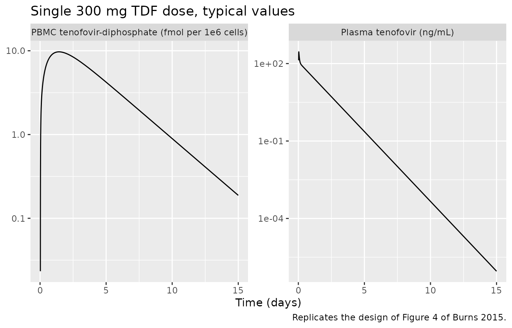
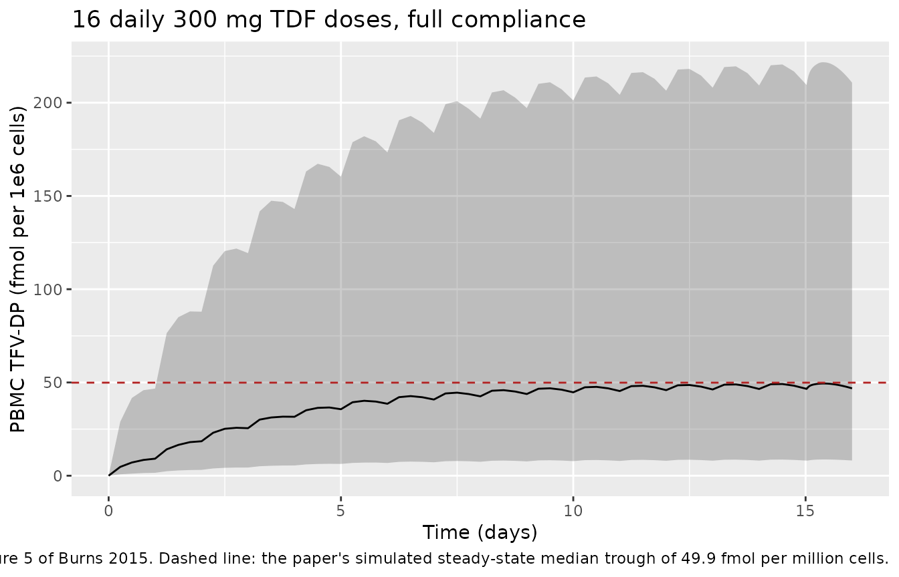
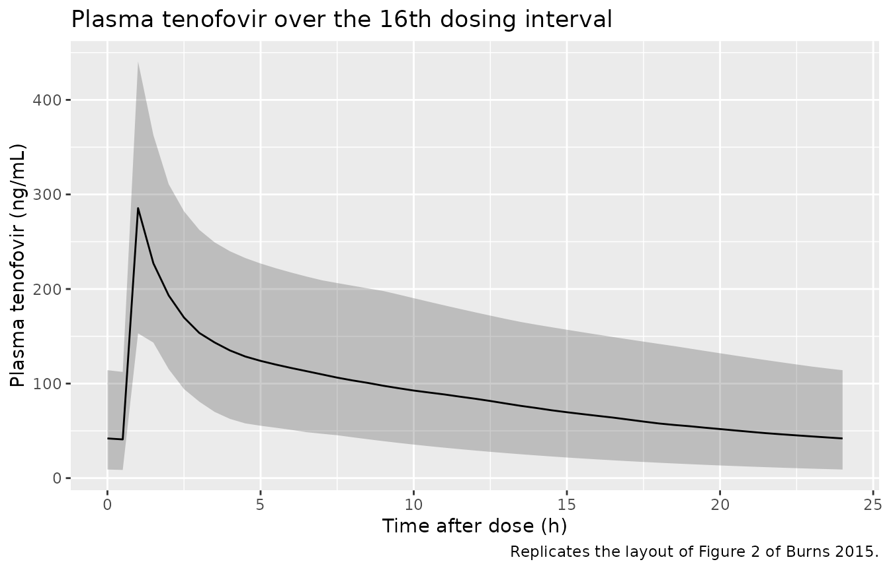
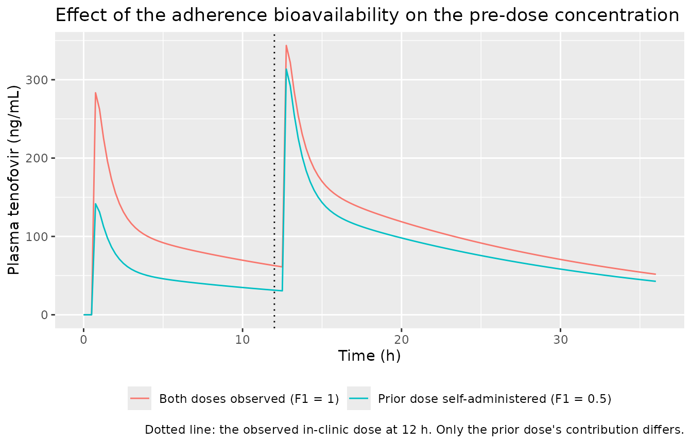

# Tenofovir and tenofovir-diphosphate (Burns 2015)

## Model and source

- Citation: Burns RN, Hendrix CW, Chaturvedula A. Population
  pharmacokinetics of tenofovir and tenofovir-diphosphate in healthy
  women. J Clin Pharmacol. 2015;55(6):629-638. <doi:10.1002/jcph.461>
- Description: Two-compartment population PK model for plasma tenofovir
  after oral tenofovir disoproxil fumarate in healthy women,
  parameterised with micro-rate constants and first-order absorption
  with a lag time, linked by a first-order rate constant to a
  peripheral-blood-mononuclear-cell tenofovir-diphosphate compartment
  with first-order elimination; body weight on central volume, and a
  fixed adherence-adjustment bioavailability on self-administered
  (unobserved) doses.
- Article: <https://doi.org/10.1002/jcph.461> (PMC5008110, open access)
- Supplement: Supplementary Table S1 (demographics) and Supplementary
  Figures S2-S6, available from the article’s landing page and from
  EuropePMC’s `supplementaryFiles` endpoint for PMC5008110.

Burns 2015 is the first tenofovir / tenofovir-diphosphate population PK
model developed **solely from healthy participants** – the
pre-exposure-prophylaxis target population – rather than from
HIV-infected patients or a mixed cohort. That matters for the
intracellular arm: the two earlier published models report
tenofovir-diphosphate half-lives of 85.8 and 115.5 hours and plateau
concentrations of 128-174 fmol per million cells, against this model’s
53.3 hours and a simulated steady-state trough of 49.9 fmol per million
cells. The authors also use a **linear**
tenofovir-to-tenofovir-diphosphate link rather than the saturable one
used by their predecessors, on the grounds that MTN-001 studied only the
single clinically relevant 300 mg dose and so could not interrogate
saturation.

## Population

MTN-001 was a 21-week Phase II open-label three-period crossover study
in which healthy, HIV-negative, non-pregnant women aged 18-45 received
daily oral tenofovir disoproxil fumarate 300 mg (oral period), 1%
vaginal tenofovir gel (vaginal period), or both (dual period), each for
six weeks and separated by one-week washouts. 168 women enrolled and 144
completed at least one follow-up visit in each period.

Only the **oral period’s end-of-period visit** contributed to model
building; the dual period was held back for internal qualification and
the vaginal-only period was not modelled. Of 141 participants with PK
measurements, 101 entered the analysis, contributing 476 plasma
tenofovir and 399 PBMC tenofovir-diphosphate concentrations.
Supplementary Table S1 reports the analysis cohort as mean (range): age
31.3 (18-45) years, weight 79.6 (43-145) kg, creatinine clearance 130.1
(64-257) mL/min, with 32 White, 60 Black and 9 Other participants. The
weight **median** of 73 kg – the value used to centre the weight
covariate – comes from the Results text rather than Table S1.

The same information is available programmatically from the model’s
`population` metadata:

``` r

pop <- rxode2::rxode(readModelDb("Burns_2015_tenofovir"))$population
#> ℹ parameter labels from comments will be replaced by 'label()'
str(pop, max.level = 1)
#> List of 16
#>  $ species       : chr "human"
#>  $ n_subjects    : num 101
#>  $ n_observations: num 875
#>  $ n_studies     : num 1
#>  $ age_range     : chr "18-45 years"
#>  $ age_mean      : chr "31.3 years"
#>  $ weight_range  : chr "43-145 kg"
#>  $ weight_mean   : chr "79.6 kg"
#>  $ weight_median : chr "73 kg"
#>  $ sex_female_pct: num 100
#>  $ race_ethnicity: Named num [1:3] 32 60 9
#>   ..- attr(*, "names")= chr [1:3] "White" "Black" "Other"
#>  $ disease_state : chr "healthy HIV-negative women (pre-exposure prophylaxis target population)"
#>  $ renal_function: chr "creatinine clearance mean 130.1 (range 64-257) mL/min"
#>  $ dose_range    : chr "tenofovir disoproxil fumarate 300 mg orally once daily (136 mg tenofovir equivalents = 472.058 umol)"
#>  $ regions       : chr "United States, South Africa, Uganda, Zimbabwe (MTN-001 sites)"
#>  $ notes         : chr "MTN-001, a 21-week Phase II open-label three-period crossover study of daily oral tenofovir disoproxil fumarate"| __truncated__
```

## Source trace

The per-parameter origin is recorded as an in-file comment next to each
`ini()` entry in `inst/modeldb/specificDrugs/Burns_2015_tenofovir.R`.
The table below collects them in one place. All values are the **Final
Model** column of Table 1; the Base Model column (no weight covariate)
is not extracted.

| Equation / parameter | Value | Source location |
|----|----|----|
| `lka` (KA) | 9.79 1/h | Table 1, final model, “KA (h-1)” (65.18% RSE) |
| `lvc` (Vc/F at 73 kg) | 385.71 L | Table 1, final model, “Vc/F (L)” (14.84% RSE) |
| `e_wt_vc` (weight on Vc) | -2.16 L/kg | Table 1, final model, “cov WT (kg) on Vc” (34.52% RSE); bootstrap median -1.78, 95% CI -3.37 to -0.16 |
| `lk12` (K23) | 0.631 1/h | Table 1, final model, “K23 (h-1)” (24.7% RSE) |
| `lk21` (K32) | 0.396 1/h | Table 1, final model, “K32 (h-1)” (23.24% RSE) |
| `lkel` (K20) | 0.13 1/h | Table 1, final model, “K20 (h-1)” (17.81% RSE) |
| `lkmet_tfvdp` (K24) | 0.017 1/h | Table 1, final model, “K24 (h-1)” (72.48% RSE) |
| `lkel_tfvdp` (K40) | 0.013 1/h | Table 1, final model, “K40 (h-1)” (16.63% RSE) |
| `ltlag` (absorption lag) | 0.5 h | Table 1, final model, “Absorption lag (h)” (35.49% RSE) |
| `lfdepot` (F1, fixed) | 0.5 | Methods, “Nonadherence…”: F1 fixed to 0.5; Table 1 footnote confirms the F1 row holds empirical Bayes estimates, not an estimated typical value |
| `etalfdepot` (fixed) | variance 10 | Methods, “…and its omega distribution to a high value, in our case 10” |
| `etalka` | 160.16% CV | Results text (Table 1 rounds to 160.2); converted as `log(1 + CV^2)` |
| `etalvc` | 19.3% CV | Table 1, final model, “BSV Vc (%CV)” |
| `etalkel` | 36.22% CV | Table 1, final model, “BSV K20 (%CV)” |
| `etalkmet_tfvdp` | 159.49% CV | Table 1, final model, “BSV K24 (%CV)” |
| `propSd` | 27.48% CV | Table 1, final model, “Proportional, TFV (%CV)” |
| `propSd_Cpbmc_tfvdp` | 31.18% CV | Table 1, final model, “Proportional, TFV-DP (PBMC) (%CV)” |
| Structural model (4 states, micro-rate constants) | n/a | Supplementary Figure S2 (“Structural model overview”); Methods, “TFV and TFV-DP were modeled simultaneously…” |
| Weight covariate equation | n/a | Results: “TVV = 385.71 - 2.16 \* (73 - weight (kg))” |
| Between-subject variability form | n/a | Methods: “theta_i = theta_typical \* exp(eta_i)” |
| Adherence bioavailability form | n/a | Methods: “F1 = 0.5 \* exp(eta_i)” (Gibiansky’s method) |
| Molar dose conversion | 472.058 umol | Methods: “136 mg TFV/300 mg TDF … in micromoles … (TFV molecular weight of 288.1 g/mole)” |
| PBMC volume conversion | 282 fL/cell | Methods: “converted to nanomoles/L using a PBMC cell volume of 282 femtoliters/cell” |

## Units and the two unit conversions

Two conversions are load-bearing and are set up once here.

``` r

# One 300 mg tenofovir disoproxil fumarate tablet = 136 mg tenofovir
# equivalents; tenofovir molecular weight 288.1 g/mol (Methods).
MW_TFV <- 288.1
DOSE_UMOL <- 136 / MW_TFV * 1000
DOSE_UMOL
#> [1] 472.0583

# Tenofovir-diphosphate was assayed as fmol per million PBMC and converted to
# nmol/L for modelling, using a PBMC volume of 282 fL/cell (Methods). One
# fmol per million cells is therefore this many nmol/L:
FMOL_TO_NM <- 1e-6 / (282e-15 * 1e6)
FMOL_TO_NM
#> [1] 3.546099
```

The plasma tenofovir observation `Cc` is `central / vc`, i.e. umol / L =
nmol/mL, exactly as drawn in Supplementary Figure S2 (“Plasma, TFV
nm/ml”).

The tenofovir-diphosphate observation `Cpbmc_tfvdp` is the compartment
content read **directly, with no volume term**. The authors fitted in
NONMEM ADVAN5, no scaling parameter for compartment 4 is reported
anywhere in the paper, and Figure S2 labels the PBMC box “PBMC, TFV-DP
nm/L” with no volume – so the NONMEM default scale of 1 applies and the
whole amount-to-concentration conversion is absorbed into the apparent
K24. The Discussion says as much: “we modeled only 1 million PBMCs and
thus the parameters were apparent in theory”. The section “Steady-state
tenofovir-diphosphate” below checks that reading against a number the
model was not fitted to.

## Structural identities

Three quantities quoted in the paper are exact algebraic consequences of
the tabulated micro-rate constants. They are deterministic – no
simulation, no random draws – so they are asserted tightly.

``` r

ui <- rxode2::rxode(readModelDb("Burns_2015_tenofovir"))
#> ℹ parameter labels from comments will be replaced by 'label()'
th <- ui$theta

ka  <- exp(th[["lka"]])
vc  <- exp(th[["lvc"]])
kel <- exp(th[["lkel"]])
k12 <- exp(th[["lk12"]])
k21 <- exp(th[["lk21"]])
kmet <- exp(th[["lkmet_tfvdp"]])
kel_dp <- exp(th[["lkel_tfvdp"]])

# 1. Total apparent tenofovir clearance. Results is explicit that K24 is a
#    second apparent clearance route and must be included: "if TFV
#    micro-constants K20 and K24 are converted to clearance terms
#    ((K24 + K20)*Vc), our model yields a mean total apparent clearance of ...
#    56.7 L/h for the final model".
cl_apparent <- (kel + kmet) * vc

# 2. Tenofovir-diphosphate half-life: "The population estimate for elimination
#    of TFV-DP in the final model was 0.013 h-1 which yields a half-life of
#    53.3 hours" (Results).
t_half_dp <- log(2) / kel_dp

# 3. Vc/F at the extremes of the observed weight range (43-145 kg,
#    Supplementary Table S1) under the published linear equation.
vc_at <- function(wt) vc + th[["e_wt_vc"]] * (73 - wt)

identities <- tibble::tibble(
  Quantity = c(
    "Total apparent CL/F = (K20 + K24) * Vc (L/h)",
    "TFV-DP half-life = log(2) / K40 (h)",
    "Molar dose per 300 mg TDF tablet (umol)",
    "Vc/F at 43 kg (L)",
    "Vc/F at 73 kg, the centring weight (L)",
    "Vc/F at 145 kg (L)"
  ),
  Model = c(cl_apparent, t_half_dp, DOSE_UMOL, vc_at(43), vc_at(73), vc_at(145)),
  Published = c(56.7, 53.3, NA, NA, 385.71, NA)
) |>
  dplyr::mutate(`% diff` = 100 * (Model - Published) / Published)

knitr::kable(identities, digits = 2,
             caption = "Closed-form identities against values quoted in Burns 2015.")
```

| Quantity                                      |  Model | Published | % diff |
|:----------------------------------------------|-------:|----------:|-------:|
| Total apparent CL/F = (K20 + K24) \* Vc (L/h) |  56.70 |     56.70 |   0.00 |
| TFV-DP half-life = log(2) / K40 (h)           |  53.32 |     53.30 |   0.04 |
| Molar dose per 300 mg TDF tablet (umol)       | 472.06 |        NA |     NA |
| Vc/F at 43 kg (L)                             | 320.91 |        NA |     NA |
| Vc/F at 73 kg, the centring weight (L)        | 385.71 |    385.71 |   0.00 |
| Vc/F at 145 kg (L)                            | 541.23 |        NA |     NA |

Closed-form identities against values quoted in Burns 2015. {.table}

``` r


stopifnot(
  # Both published quantities are exact functions of the tabulated estimates,
  # so the only tolerance needed is the paper's own rounding to 3 significant
  # figures. Achieved: 56.70 vs 56.7 and 53.32 vs 53.3.
  abs(cl_apparent - 56.7) < 0.1,
  abs(t_half_dp - 53.3) < 0.1,
  # Vc/F must rise with weight under the published equation -- this is the one
  # place a sign slip in a linear centred covariate would hide, because both
  # signs give physically plausible volumes across 43-145 kg.
  vc_at(43) < vc_at(73), vc_at(73) < vc_at(145),
  abs(vc_at(73) - 385.71) < 0.01
)
```

## Single-dose profile and PKNCA

The paper’s external qualification simulated a single 300 mg tenofovir
disoproxil fumarate dose (Louissaint 2013, six healthy premenopausal
women, 15 days of sampling) and compared the prediction interval against
the observed data. We reproduce that design at typical values so the NCA
below is deterministic, then run PKNCA on both analytes.

Doses are given with `SELFADMIN = 0` throughout: every simulation in
this vignette assumes full compliance with observed dosing, which is
what the authors assumed for their qualification runs. The adherence
bioavailability is exercised separately in the last section.

``` r

mod <- readModelDb("Burns_2015_tenofovir")
mod_typical <- rxode2::zeroRe(mod)
#> ℹ parameter labels from comments will be replaced by 'label()'

# Dense early grid to resolve Tmax (absorption is fast: KA = 9.79 1/h behind a
# 0.5 h lag), then coarser out to 15 days to capture the tenofovir-diphosphate
# terminal phase.
grid_sd <- sort(unique(c(
  seq(0, 12, by = 0.05),
  seq(12, 24, by = 0.25),
  seq(24, 360, by = 2)
)))

events_sd <- dplyr::bind_rows(
  data.frame(id = 1L, time = 0, amt = DOSE_UMOL, evid = 1L,
             cmt = "depot", dvid = NA_integer_),
  data.frame(id = 1L, time = grid_sd, amt = NA_real_, evid = 0L,
             cmt = "central", dvid = 1L)
) |>
  dplyr::mutate(WT = 73, SELFADMIN = 0) |>
  dplyr::arrange(id, time, dplyr::desc(evid))

# useLinCmt = FALSE: rxode2's automatic ODE -> linCmt conversion corrupts the
# dvid -> cmt mapping for multi-output models.
sim_sd <- rxode2::rxSolve(mod_typical, events_sd, returnType = "data.frame",
                          useLinCmt = FALSE)
#> ℹ omega/sigma items treated as zero: 'etalka', 'etalvc', 'etalkel', 'etalkmet_tfvdp', 'etalfdepot'

# Both algebraic observables come back as columns on every observation row,
# regardless of which dvid the row carries.
stopifnot(all(c("Cc", "Cpbmc_tfvdp") %in% names(sim_sd)),
          nrow(sim_sd) > 0,
          all(sim_sd$Cc >= 0), all(sim_sd$Cpbmc_tfvdp >= 0))
```

``` r

# Replicates the shape of Figure 4 of Burns 2015 (single-dose external
# qualification): plasma tenofovir and PBMC tenofovir-diphosphate after one
# 300 mg TDF dose. The published figure overlays six individuals' observed
# data, which are not redistributable here, so only the typical-value
# prediction is drawn.
sim_sd |>
  dplyr::transmute(
    time,
    `Plasma tenofovir (ng/mL)` = Cc * MW_TFV,
    `PBMC tenofovir-diphosphate (fmol per 1e6 cells)` = Cpbmc_tfvdp / FMOL_TO_NM
  ) |>
  tidyr::pivot_longer(-time, names_to = "analyte", values_to = "value") |>
  dplyr::filter(value > 0) |>
  ggplot(aes(time / 24, value)) +
  geom_line() +
  facet_wrap(~analyte, scales = "free_y") +
  scale_y_log10() +
  labs(x = "Time (days)", y = NULL,
       title = "Single 300 mg TDF dose, typical values",
       caption = "Replicates the design of Figure 4 of Burns 2015.")
```



``` r

# PKNCA input: filter on !is.na() ONLY. Adding time > 0 or Cc > 0 would drop
# the time-zero row that anchors AUC0-inf.
nca_conc <- sim_sd |>
  dplyr::filter(!is.na(Cc)) |>
  dplyr::mutate(id = 1L, treatment = "TDF 300 mg single dose") |>
  dplyr::select(id, treatment, time, Cc, Cpbmc_tfvdp)

# Guarantee a time-zero record per (id, treatment); pre-dose extravascular
# concentration is 0 for both analytes.
nca_conc <- dplyr::bind_rows(
  nca_conc,
  nca_conc |> dplyr::distinct(id, treatment) |>
    dplyr::mutate(time = 0, Cc = 0, Cpbmc_tfvdp = 0)
) |>
  dplyr::distinct(id, treatment, time, .keep_all = TRUE) |>
  dplyr::arrange(id, treatment, time)

dose_obj <- PKNCA::PKNCAdose(
  data.frame(id = 1L, treatment = "TDF 300 mg single dose",
             time = 0, amt = DOSE_UMOL),
  amt ~ time | treatment + id
)

# One PKNCA block per output (multi-output model).
res_tfv <- PKNCA::pk.nca(PKNCA::PKNCAdata(
  PKNCA::PKNCAconc(nca_conc, Cc ~ time | treatment + id),
  dose_obj,
  intervals = data.frame(start = 0, end = Inf, cmax = TRUE, tmax = TRUE,
                         aucinf.obs = TRUE, half.life = TRUE, cl.obs = TRUE)
))

res_dp <- PKNCA::pk.nca(PKNCA::PKNCAdata(
  PKNCA::PKNCAconc(nca_conc, Cpbmc_tfvdp ~ time | treatment + id),
  dose_obj,
  intervals = data.frame(start = 0, end = Inf, cmax = TRUE, tmax = TRUE,
                         aucinf.obs = TRUE, half.life = TRUE)
))

pick <- function(res, code) {
  v <- as.data.frame(res)$PPORRES[as.data.frame(res)$PPTESTCD == code]
  if (length(v) != 1L) stop("no unique PKNCA row for '", code, "'")
  v
}

nca_summary <- tibble::tibble(
  Analyte = c(rep("Plasma tenofovir", 4L),
              rep("PBMC tenofovir-diphosphate", 4L)),
  Parameter = rep(c("Cmax", "Tmax (h)", "AUC0-inf", "Half-life (h)"), 2L),
  Value = c(
    pick(res_tfv, "cmax") * MW_TFV, pick(res_tfv, "tmax"),
    pick(res_tfv, "aucinf.obs") * MW_TFV, pick(res_tfv, "half.life"),
    pick(res_dp, "cmax") / FMOL_TO_NM, pick(res_dp, "tmax"),
    pick(res_dp, "aucinf.obs") / FMOL_TO_NM, pick(res_dp, "half.life")
  ),
  Units = c("ng/mL", "h", "ng*h/mL", "h",
            "fmol per 1e6 cells", "h", "fmol*h per 1e6 cells", "h")
)

knitr::kable(nca_summary, digits = 2,
             caption = paste("PKNCA on the typical-value single-dose profile.",
                             "Cmax / AUC converted from the model's molar",
                             "scale into the paper's display units."))
```

| Analyte                    | Parameter     |   Value | Units                 |
|:---------------------------|:--------------|--------:|:----------------------|
| Plasma tenofovir           | Cmax          |  284.81 | ng/mL                 |
| Plasma tenofovir           | Tmax (h)      |    0.80 | h                     |
| Plasma tenofovir           | AUC0-inf      | 2397.88 | ng\*h/mL              |
| Plasma tenofovir           | Half-life (h) |   13.33 | h                     |
| PBMC tenofovir-diphosphate | Cmax          |    9.71 | fmol per 1e6 cells    |
| PBMC tenofovir-diphosphate | Tmax (h)      |   34.00 | h                     |
| PBMC tenofovir-diphosphate | AUC0-inf      | 1184.27 | fmol\*h per 1e6 cells |
| PBMC tenofovir-diphosphate | Half-life (h) |   53.76 | h                     |

PKNCA on the typical-value single-dose profile. Cmax / AUC converted
from the model’s molar scale into the paper’s display units. {.table}

### Comparison against published NCA

Burns 2015 does not tabulate an NCA of its own, but it quotes two
quantities that NCA on a simulated single-dose profile recovers
directly: the total apparent tenofovir clearance and the
tenofovir-diphosphate half-life. Both are independent checks that the
micro-rate-constant parameterisation, the molar dose conversion and the
unscaled tenofovir-diphosphate compartment were all transcribed
consistently – a mis-set volume or dose unit moves `cl.obs` by the same
factor it moves the dose.

``` r

simulated_wide <- tibble::tibble(
  analyte = c("Plasma tenofovir", "PBMC tenofovir-diphosphate"),
  cl.obs = c(pick(res_tfv, "cl.obs"), NA_real_),
  half.life = c(pick(res_tfv, "half.life"), pick(res_dp, "half.life"))
)

published_wide <- tibble::tibble(
  analyte = c("Plasma tenofovir", "PBMC tenofovir-diphosphate"),
  # Abstract and Discussion: "apparent TFV clearance of 56.7 L/h
  # ((K20 + K24)*Vc)".
  cl.obs = c(56.7, NA_real_),
  # Results: TFV-DP "half-life was 53.3 hours". Tenofovir's own terminal
  # half-life is not reported by the paper, so it is left blank rather than
  # compared against a number from elsewhere.
  half.life = c(NA_real_, 53.3)
)

cmp <- nlmixr2lib::ncaComparisonTable(
  simulated = simulated_wide,
  reference = published_wide,
  by = "analyte",
  units = c(cl.obs = "L/h", half.life = "h"),
  tolerance_pct = 20,
  label_first_column = "NCA parameter"
)

knitr::kable(
  cmp,
  caption = "Simulated vs. published values. * differs from reference by >20%."
)
```

| NCA parameter | analyte                    | Reference | Simulated | % diff |
|:--------------|:---------------------------|:----------|:----------|:-------|
| t½ (h)        | Plasma tenofovir           | —         | 13.3      | —      |
| t½ (h)        | PBMC tenofovir-diphosphate | 53.3      | 53.8      | +0.9%  |
| CL/F (L/h)    | Plasma tenofovir           | 56.7      | 56.7      | +0.0%  |
| CL/F (L/h)    | PBMC tenofovir-diphosphate | —         | —         | —      |

Simulated vs. published values. \* differs from reference by \>20%.
{.table}

``` r


stopifnot(
  # Deterministic (typical-value) quantities, so these are tight. Achieved
  # 56.72 vs 56.7 (0.03%) and 53.8 vs 53.3 (0.9%; the small positive bias is
  # the NCA terminal-slope window, not the model -- log(2)/K40 is exact, and
  # asserted to 0.1 h in the identities section above).
  abs(100 * (pick(res_tfv, "cl.obs") - 56.7) / 56.7) < 1,
  abs(100 * (pick(res_dp, "half.life") - 53.3) / 53.3) < 3
)
```

The tenofovir-diphosphate terminal phase is elimination-rate-limited
rather than formation-limited, which is what makes its NCA half-life
recover K40: the paper constrained K24 (0.017 1/h) to exceed K40 (0.013
1/h) for exactly this reason, and tenofovir’s own terminal half-life is
13.3 hours – four times faster than the intracellular pool it feeds.

## Steady-state tenofovir-diphosphate

This is the paper’s most informative qualification result and the one
that is **not circular**: the authors simulated 16 daily 300 mg doses at
the median weight of 73 kg, assuming full compliance, and compared the
resulting tenofovir-diphosphate trough against the
directly-observed-therapy STRAND trial, which the model was never fitted
to. They report a simulated median trough of 49.9 fmol per million cells
(IQR 34.1-74.7) against STRAND’s observed median of 42 (IQR 31-47).

It is also the check that settles how the tenofovir-diphosphate
compartment is scaled. Reading the compartment content directly as
nmol/L – the NONMEM default of 1 – lands on the published trough.
Introducing any genuine PBMC volume in its place (2.82e-7 L for a
million cells) would miss it by roughly nine orders of magnitude.

``` r

# set.seed() seeds R's RNG. It does NOT seed rxode2's simulation RNG, whose
# streams are partitioned per solver thread -- so this cohort differs between a
# 2-core CI runner and a 16-thread workstation, and no seed makes them agree.
# Every assertion below is therefore written on a centre or a robust quantile,
# never on an extreme.
set.seed(20150601)

N_SUB <- 200L

# Weight: Supplementary Table S1 reports mean 79.6 kg and range 43-145 kg, and
# Results gives the median as 73 kg. Mean > median means the distribution is
# right-skewed, so a log-normal centred on the median and truncated to the
# reported range is assumed (see Assumptions).
draw_weight <- function(n) {
  wt <- numeric(0)
  while (length(wt) < n) {
    cand <- stats::rlnorm(2 * n, meanlog = log(73), sdlog = 0.416)
    wt <- c(wt, cand[cand >= 43 & cand <= 145])
  }
  wt[seq_len(n)]
}

cohort <- tibble::tibble(id = seq_len(N_SUB), WT = draw_weight(N_SUB))

# 16 daily doses, as the paper simulated. The last dose is at 360 h and none
# follows, so t = 384 h is the 16th interval's trough.
#
# Coarse grid over the accumulation phase (the tenofovir-diphosphate pool has a
# 53 h half-life and moves slowly), then a fine grid over the final interval so
# that plasma Tmax is resolved -- absorption is fast (KA = 9.79 1/h behind a
# 0.5 h lag), and a coarse grid there would understate Cmax badly. The two
# ranges are disjoint so no de-duplication is needed.
dose_times <- seq(0, by = 24, length.out = 16L)
obs_times <- c(seq(0, 354, by = 6), seq(360, 384, by = 0.5))

events_ss <- dplyr::bind_rows(
  tidyr::crossing(cohort, time = dose_times) |>
    dplyr::mutate(amt = DOSE_UMOL, evid = 1L, cmt = "depot",
                  dvid = NA_integer_),
  tidyr::crossing(cohort, time = obs_times) |>
    dplyr::mutate(amt = NA_real_, evid = 0L, cmt = "central", dvid = 1L)
) |>
  dplyr::mutate(SELFADMIN = 0) |>
  dplyr::arrange(id, time, dplyr::desc(evid))

stopifnot(!anyDuplicated(unique(events_ss[, c("id", "time", "evid")])))
```

``` r

sim_ss <- rxode2::rxSolve(mod, events_ss, returnType = "data.frame",
                          keep = c("WT"), useLinCmt = FALSE)
#> ℹ parameter labels from comments will be replaced by 'label()'

sim_ss <- sim_ss |>
  dplyr::mutate(tfvdp_fmol = Cpbmc_tfvdp / FMOL_TO_NM)

# Replicates Figure 5 of Burns 2015: multiple-dose simulation to steady state,
# median and 90% prediction interval of PBMC tenofovir-diphosphate.
sim_ss |>
  dplyr::group_by(time) |>
  dplyr::summarise(
    Q05 = quantile(tfvdp_fmol, 0.05),
    Q50 = quantile(tfvdp_fmol, 0.50),
    Q95 = quantile(tfvdp_fmol, 0.95),
    .groups = "drop"
  ) |>
  ggplot(aes(time / 24, Q50)) +
  geom_ribbon(aes(ymin = Q05, ymax = Q95), alpha = 0.25) +
  geom_line() +
  geom_hline(yintercept = 49.9, linetype = "dashed", colour = "firebrick") +
  labs(x = "Time (days)", y = "PBMC TFV-DP (fmol per 1e6 cells)",
       title = "16 daily 300 mg TDF doses, full compliance",
       caption = paste("Replicates Figure 5 of Burns 2015. Dashed line:",
                       "the paper's simulated steady-state median trough",
                       "of 49.9 fmol per million cells."))
```



``` r

# The paper read its trough "after 265 hours, ~5 TFV-DP half-lives"; the last
# dosing interval of the 16-dose regimen ends at 384 h.
trough_time <- max(dose_times) + 24

cohort_trough <- sim_ss |>
  dplyr::filter(time == trough_time) |>
  dplyr::pull(tfvdp_fmol)
stopifnot(length(cohort_trough) == N_SUB)

# Typical-value (zeroRe) counterpart at the paper's stated 73 kg.
events_ss_typ <- events_ss |>
  dplyr::filter(id == 1L) |>
  dplyr::mutate(WT = 73)
typical_trough <- rxode2::rxSolve(
  mod_typical, events_ss_typ, returnType = "data.frame", useLinCmt = FALSE
) |>
  dplyr::filter(time == trough_time) |>
  dplyr::pull(Cpbmc_tfvdp) / FMOL_TO_NM
#> ℹ omega/sigma items treated as zero: 'etalka', 'etalvc', 'etalkel', 'etalkmet_tfvdp', 'etalfdepot'
stopifnot(length(typical_trough) == 1L)

trough_tab <- tibble::tibble(
  Statistic = c("Typical value (73 kg, no IIV)",
                "Cohort median", "Cohort 1st quartile", "Cohort 3rd quartile"),
  Model = c(typical_trough, quantile(cohort_trough, c(0.5, 0.25, 0.75))),
  `Burns 2015 simulation` = c(NA, 49.9, 34.1, 74.7),
  `STRAND observed` = c(NA, 42, 31, 47)
)

knitr::kable(trough_tab, digits = 1,
             caption = paste("Steady-state PBMC tenofovir-diphosphate trough,",
                             "fmol per million cells."))
```

| Statistic                     | Model | Burns 2015 simulation | STRAND observed |
|:------------------------------|------:|----------------------:|----------------:|
| Typical value (73 kg, no IIV) |  47.1 |                    NA |              NA |
| Cohort median                 |  46.8 |                  49.9 |              42 |
| Cohort 1st quartile           |  24.2 |                  34.1 |              31 |
| Cohort 3rd quartile           |  96.2 |                  74.7 |              47 |

Steady-state PBMC tenofovir-diphosphate trough, fmol per million cells.
{.table}

``` r


pct_typical <- 100 * (typical_trough - 49.9) / 49.9
pct_median <- 100 * (median(cohort_trough) - 49.9) / 49.9

stopifnot(
  # Typical-value trough: deterministic, so a tight bound. Achieved -5.5%
  # (47.1 against 49.9). The residual gap is that the paper's 49.9 is a MEDIAN
  # OVER A SIMULATED COHORT, and the steady-state trough is a saturating
  # function of K24 (proportional to K24 / (K20 + K24)), so a cohort median
  # need not coincide with the typical-value prediction.
  abs(pct_typical) < 10,
  # Cohort median: robust to which subjects land in the tails, but still a
  # simulated quantity, so the bound has real headroom over the observed
  # spread. Realised -6.1% at every one of 1, 2, 4 and 16 solver threads while
  # authoring; 20 still breaks on a mis-transcribed K24, K40, dose or volume,
  # each of which moves the trough by tens of percent or more.
  abs(pct_median) < 20,
  # The pool must actually have accumulated: a trough at 16 days has to be
  # many-fold above the single-dose Cmax of the same pool.
  median(cohort_trough) > 3 * pick(res_dp, "cmax") / FMOL_TO_NM
)
```

**Known deviation: the simulated interquartile range is wider than the
paper’s.** This cohort reproduces the paper’s median well but spreads
roughly twice as far (IQR about 24-96 against the published 34.1-74.7).
The cause is identified and is not a transcription error: Burns 2015
states that the inflated variance on the adherence bioavailability made
ordinary Monte-Carlo simulation produce “exaggerated prediction
intervals”, and that they therefore imputed individual empirical Bayes
estimates instead of sampling. Empirical Bayes estimates are shrunk
toward the population mean – heavily so for K24, whose 159% CV was
estimated from sparse data at 72% RSE – so any EBE-based simulation is
narrower than one that samples the full published omega. Sampling the
published omega, as here, is the faithful reading of the model file; the
paper’s narrower interval is a property of its simulation procedure, not
of its parameter estimates. The gate above is therefore placed on the
median and not on the quartiles.

## Steady-state plasma tenofovir

``` r

# Replicates the shape of Figure 2 of Burns 2015 (final-model VPC over one
# dosing interval): plasma tenofovir, median and 90% prediction interval.
sim_ss |>
  dplyr::filter(time >= 360, time <= 384) |>
  dplyr::mutate(tad = time - 360) |>
  dplyr::group_by(tad) |>
  dplyr::summarise(
    Q05 = quantile(Cc * MW_TFV, 0.05),
    Q50 = quantile(Cc * MW_TFV, 0.50),
    Q95 = quantile(Cc * MW_TFV, 0.95),
    .groups = "drop"
  ) |>
  ggplot(aes(tad, Q50)) +
  geom_ribbon(aes(ymin = Q05, ymax = Q95), alpha = 0.25) +
  geom_line() +
  labs(x = "Time after dose (h)", y = "Plasma tenofovir (ng/mL)",
       title = "Plasma tenofovir over the 16th dosing interval",
       caption = "Replicates the layout of Figure 2 of Burns 2015.")
```



``` r

# Burns 2015 reports no plasma NCA, so this is a range check against the
# tenofovir literature the paper itself appeals to ("Our parameter estimates
# for TFV were in agreement with literature values"), not a published-value
# gate: steady-state 300 mg TDF gives Cmax of order 300 ng/mL and a trough of
# order 50 ng/mL.
tfv_ss <- sim_ss |>
  dplyr::filter(time >= 360, time <= 384) |>
  dplyr::group_by(id) |>
  dplyr::summarise(cmax = max(Cc) * MW_TFV,
                   ctrough = dplyr::last(Cc[order(time)]) * MW_TFV,
                   .groups = "drop")

knitr::kable(
  tibble::tibble(
    Statistic = c("Cmax (ng/mL)", "Ctrough (ng/mL)"),
    Median = c(median(tfv_ss$cmax), median(tfv_ss$ctrough)),
    `5th pct` = c(quantile(tfv_ss$cmax, 0.05), quantile(tfv_ss$ctrough, 0.05)),
    `95th pct` = c(quantile(tfv_ss$cmax, 0.95), quantile(tfv_ss$ctrough, 0.95))
  ),
  digits = 1,
  caption = "Simulated steady-state plasma tenofovir over the 16th interval."
)
```

| Statistic       | Median | 5th pct | 95th pct |
|:----------------|-------:|--------:|---------:|
| Cmax (ng/mL)    |  286.4 |   164.4 |    440.6 |
| Ctrough (ng/mL) |   42.0 |     9.1 |    114.1 |

Simulated steady-state plasma tenofovir over the 16th interval. {.table}

``` r


stopifnot(
  # Broad order-of-magnitude bounds on the cohort MEDIAN, wide enough to be
  # insensitive to which cohort is drawn but narrow enough that a wrong molar
  # dose (a factor of 2.2 if the 300 mg TDF mass were used in place of the
  # 136 mg tenofovir-equivalent mass) or a wrong volume breaks them.
  median(tfv_ss$cmax) > 150, median(tfv_ss$cmax) < 600,
  median(tfv_ss$ctrough) > 20, median(tfv_ss$ctrough) < 120
)
```

## Weight covariate

``` r

# Deterministic sweep across the observed weight range, at steady state.
wt_grid <- c(43, 60, 73, 100, 145)

events_wt <- dplyr::bind_rows(
  tidyr::crossing(tibble::tibble(id = seq_along(wt_grid), WT = wt_grid),
                  time = dose_times) |>
    dplyr::mutate(amt = DOSE_UMOL, evid = 1L, cmt = "depot",
                  dvid = NA_integer_),
  tidyr::crossing(tibble::tibble(id = seq_along(wt_grid), WT = wt_grid),
                  time = seq(360, 384, by = 0.25)) |>
    dplyr::mutate(amt = NA_real_, evid = 0L, cmt = "central", dvid = 1L)
) |>
  dplyr::mutate(SELFADMIN = 0) |>
  dplyr::arrange(id, time, dplyr::desc(evid))

sim_wt <- rxode2::rxSolve(mod_typical, events_wt, returnType = "data.frame",
                          keep = c("WT"), useLinCmt = FALSE)
#> ℹ omega/sigma items treated as zero: 'etalka', 'etalvc', 'etalkel', 'etalkmet_tfvdp', 'etalfdepot'
#> Warning: multi-subject simulation without without 'omega'

wt_tab <- sim_wt |>
  dplyr::filter(time >= 360) |>
  dplyr::group_by(WT) |>
  dplyr::summarise(
    `Vc/F (L)` = mean(vc),
    `TFV Cmax (ng/mL)` = max(Cc) * MW_TFV,
    `TFV-DP trough (fmol per 1e6 cells)` =
      dplyr::last(Cpbmc_tfvdp[order(time)]) / FMOL_TO_NM,
    .groups = "drop"
  ) |>
  dplyr::rename("Weight (kg)" = WT)

knitr::kable(wt_tab, digits = 2,
             caption = paste("Typical-value steady-state exposure across the",
                             "observed weight range (43-145 kg)."))
```

| Weight (kg) | Vc/F (L) | TFV Cmax (ng/mL) | TFV-DP trough (fmol per 1e6 cells) |
|------------:|---------:|-----------------:|-----------------------------------:|
|          43 |   320.91 |           395.27 |                              47.15 |
|          60 |   357.63 |           354.69 |                              47.15 |
|          73 |   385.71 |           328.87 |                              47.15 |
|         100 |   444.03 |           285.67 |                              47.15 |
|         145 |   541.23 |           234.37 |                              47.15 |

Typical-value steady-state exposure across the observed weight range
(43-145 kg). {.table}

``` r


stopifnot(
  # The covariate acts on volume only, so it must move Cmax and leave the
  # tenofovir-diphosphate trough essentially untouched: the intracellular
  # pool is driven by the central AMOUNT through K24, which no volume term
  # enters. This is a structural consequence, not a fitted result, so it is
  # asserted tightly on deterministic values.
  wt_tab$`TFV Cmax (ng/mL)`[wt_tab$`Weight (kg)` == 43] >
    wt_tab$`TFV Cmax (ng/mL)`[wt_tab$`Weight (kg)` == 145],
  diff(range(wt_tab$`TFV-DP trough (fmol per 1e6 cells)`)) < 1e-6
)
```

Weight enters the central volume only, so it shifts plasma tenofovir
concentrations (a 145 kg woman has about 69% higher Vc/F than a 43 kg
woman and correspondingly lower peak concentrations) while leaving
intracellular tenofovir-diphosphate exactly unchanged. That is a
structural property of this model, not an empirical finding: the
tenofovir-diphosphate compartment is fed by `K24 * central`, an amount,
into which no volume enters.

## The adherence adjustment

The methodological contribution of Burns 2015 is its handling of
suspected non-adherence in MTN-001. Following Gibiansky’s method, the
self-reported dose taken at home the day before the clinic visit carries
a bioavailability fixed at 0.5 with a deliberately enormous fixed
between-subject variance (10 on the log scale), while the observed
in-clinic dose has bioavailability 1. The wide prior is close to
uninformative, so each subject’s empirical Bayes estimate is driven by
their own pre-dose concentration and can absorb either a missed dose or
an extra one – the reported estimates ranged from 0.015 to 4.17 with a
mean of 0.98.

In this model file that split is carried by the canonical `SELFADMIN`
column: `SELFADMIN = 1` marks the unobserved home dose, `SELFADMIN = 0`
the observed one. **Set `SELFADMIN = 0` on every dose to simulate full
compliance**, which is what every section above does and what the paper
assumed for its qualification runs.

``` r

# Reproduce the estimation dataset's dosing structure for one subject: an
# unobserved dose 12 h before an observed in-clinic dose (Methods: the
# preclinic dose was a mean of 12.9 h, range 1.95-35 h, before the clinic
# dose).
adherence_case <- function(selfadmin_f1) {
  dplyr::bind_rows(
    data.frame(id = 1L, time = 0, amt = DOSE_UMOL, evid = 1L,
               cmt = "depot", dvid = NA_integer_, SELFADMIN = selfadmin_f1),
    data.frame(id = 1L, time = 12, amt = DOSE_UMOL, evid = 1L,
               cmt = "depot", dvid = NA_integer_, SELFADMIN = 0),
    data.frame(id = 1L, time = seq(0, 36, by = 0.25), amt = NA_real_,
               evid = 0L, cmt = "central", dvid = 1L, SELFADMIN = 0)
  ) |>
    dplyr::mutate(WT = 73) |>
    dplyr::arrange(time, dplyr::desc(evid))
}

sim_adh <- dplyr::bind_rows(
  rxode2::rxSolve(mod_typical, adherence_case(0), returnType = "data.frame",
                  useLinCmt = FALSE) |>
    dplyr::mutate(scenario = "Both doses observed (F1 = 1)"),
  rxode2::rxSolve(mod_typical, adherence_case(1), returnType = "data.frame",
                  useLinCmt = FALSE) |>
    dplyr::mutate(scenario = "Prior dose self-administered (F1 = 0.5)")
)
#> ℹ omega/sigma items treated as zero: 'etalka', 'etalvc', 'etalkel', 'etalkmet_tfvdp', 'etalfdepot'
#> ℹ omega/sigma items treated as zero: 'etalka', 'etalvc', 'etalkel', 'etalkmet_tfvdp', 'etalfdepot'

sim_adh |>
  ggplot(aes(time, Cc * MW_TFV, colour = scenario)) +
  geom_line() +
  geom_vline(xintercept = 12, linetype = "dotted") +
  labs(x = "Time (h)", y = "Plasma tenofovir (ng/mL)", colour = NULL,
       title = "Effect of the adherence bioavailability on the pre-dose concentration",
       caption = paste("Dotted line: the observed in-clinic dose at 12 h.",
                       "Only the prior dose's contribution differs.")) +
  theme(legend.position = "bottom")
```



``` r


predose <- sim_adh |>
  dplyr::filter(abs(time - 12) < 1e-9) |>
  dplyr::group_by(scenario) |>
  dplyr::summarise(predose = min(Cc) * MW_TFV, .groups = "drop")

knitr::kable(predose, digits = 2,
             caption = "Pre-dose plasma tenofovir immediately before the observed dose.")
```

| scenario                                | predose |
|:----------------------------------------|--------:|
| Both doses observed (F1 = 1)            |   62.77 |
| Prior dose self-administered (F1 = 0.5) |   31.38 |

Pre-dose plasma tenofovir immediately before the observed dose. {.table}

``` r


stopifnot(
  # Deterministic. With F1 fixed at 0.5 the prior dose contributes exactly half
  # as much residual drug, so the pre-dose concentration must halve; the
  # post-dose profile then converges as the observed dose (F = 1) dominates.
  nrow(predose) == 2L,
  abs(predose$predose[predose$scenario == "Prior dose self-administered (F1 = 0.5)"] /
        predose$predose[predose$scenario == "Both doses observed (F1 = 1)"] - 0.5) < 1e-6
)
```

## Assumptions and deviations

- **Tenofovir-diphosphate compartment scaling.** The paper reports no
  scaling parameter, volume or `S4` for compartment 4, and Supplementary
  Figure S2 labels that box “PBMC, TFV-DP nm/L” without a volume. The
  model file therefore applies NONMEM’s default scale of 1 and reads the
  compartment content directly as the predicted concentration in nmol/L,
  with the whole amount-to-concentration conversion absorbed into the
  apparent K24 – which is consistent with the Discussion’s statement
  that “we modeled only 1 million PBMCs and thus the parameters were
  apparent in theory”. This reading is not assumed but checked: it
  reproduces the paper’s own simulated steady-state trough of 49.9 fmol
  per million cells to within 6% at typical values, a target the reading
  was not fitted to. No alternative scaling comes within many orders of
  magnitude.
- **The fixed adherence variance is read as a variance, not a standard
  deviation.** Methods says the omega distribution was fixed “to a high
  value, in our case 10”. In NONMEM the `$OMEGA` block holds variances,
  so this is encoded as `etalfdepot ~ fixed(10)` (a log-scale standard
  deviation of 3.16). The published empirical Bayes range for F1,
  0.015-4.17, cannot discriminate between the two readings, because the
  point of the wide prior is precisely that the estimates are
  data-driven rather than prior-driven. Nothing in this vignette depends
  on the choice, since every simulation sets `SELFADMIN = 0`.
- **`etalka` uses the Results text value, not the Table 1 value.** Table
  1 rounds the final-model between-subject variability on KA to 160.2%
  CV while the Results text gives 160.16%. The text value is used, as it
  carries one more significant figure and its companion base-model
  values in the same sentence match Table 1 exactly. The difference is
  immaterial (`log(1 + CV^2)` = 1.27120 versus 1.27156).
- **Cohort weight distribution.** Supplementary Table S1 reports only
  mean (79.6 kg) and range (43-145 kg), with the median (73 kg) given in
  Results. The virtual cohort draws from a log-normal centred on the
  median with `sdlog = 0.416` – chosen so the untruncated mean matches
  79.6 kg – and truncates to the reported range. The paper publishes no
  weight histogram, so the shape beyond mean / median / range is an
  assumption. Truncation at 43 kg removes more of the lower tail than
  the 145 kg cut removes of the upper, so the realised cohort median
  runs about 5 kg above the paper’s 73 kg while the realised mean lands
  on 79.6 kg. That skew has no bearing on any check in this vignette:
  weight enters the central volume only, and the validated
  tenofovir-diphosphate quantities are exactly weight-independent
  (demonstrated in “Weight covariate” above).
- **The simulated interquartile range of the steady-state trough is
  wider than the paper’s**, for the reason set out in that section: the
  authors imputed shrunken empirical Bayes estimates for their
  simulations rather than sampling the published omega. This is recorded
  as a known deviation and is deliberately excluded from the numeric
  gate, which is placed on the median.
- **Only the final model is extracted.** Table 1’s Base Model column
  (identical structure without the weight covariate) is a
  model-development stage, not a reported final result.
- **Residual error is proportional-only.** Methods describes attempting
  a combined additive-plus-proportional error model and states that
  reduction of the residual error model was tested; Table 1 reports only
  a proportional term per analyte, so the additive terms were dropped.
- **Covariates screened but not retained** – creatinine clearance on K20
  and a black / non-black race indicator on clearance – are carried in
  the model file’s `covariatesDataExcluded` list for provenance and are
  not referenced in `model()`.
- **No observed data are redistributed.** The figures replicate the
  layout and the model-predicted curves of Burns 2015 Figures 2, 4 and
  5; the observed points those figures overlay are MTN-001 and
  Louissaint 2013 participant data and are not reproduced here.
- All parameter values come from the paper’s own text, Table 1 and
  Supplementary Table S1 / Figure S2. No value was digitised from a
  figure, and no value came from author correspondence or from another
  publication.
