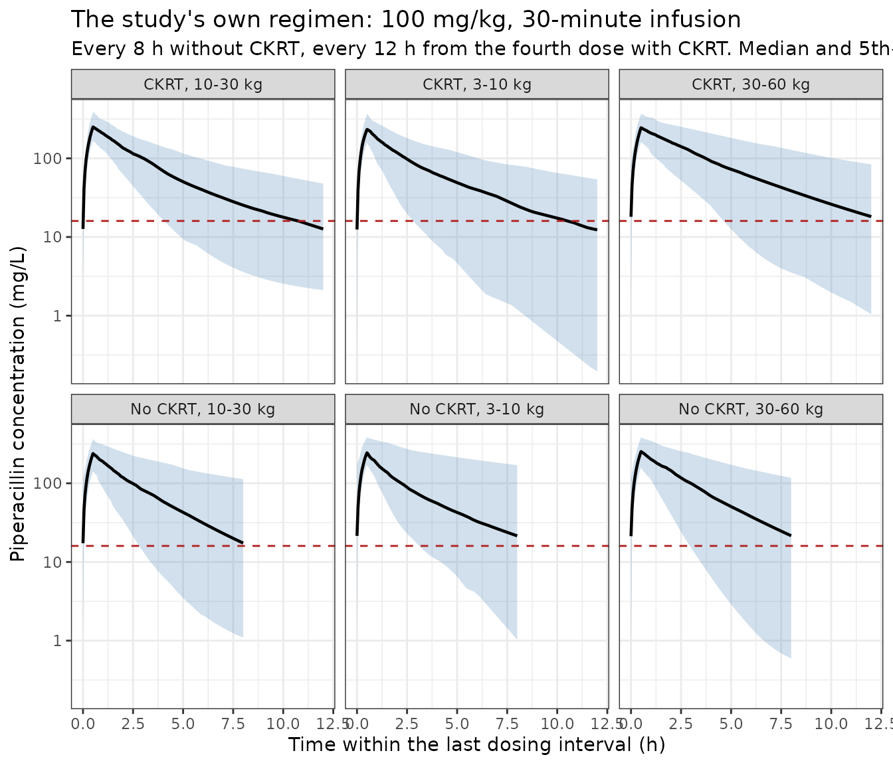
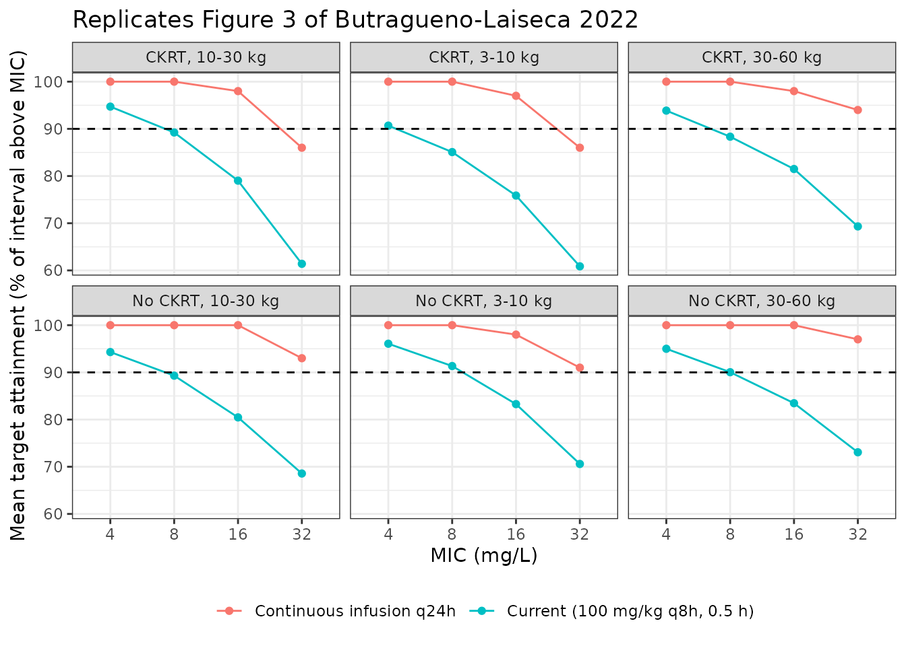

# Piperacillin (Butragueno-Laiseca 2022)

``` r

library(nlmixr2lib)
library(rxode2)
library(PKNCA)
library(dplyr)
library(ggplot2)
```

This vignette validates `ButraguenoLaiseca_2022_piperacillin`, the
two-compartment population PK model for intravenous piperacillin in
critically ill children published by Butragueno-Laiseca and colleagues
([doi:10.1016/j.cmi.2022.03.031](https://doi.org/10.1016/j.cmi.2022.03.031)).

The distinguishing feature of this analysis is that elimination is
resolved into three parallel pathways – renal, non-renal and haemofilter
– because concentrations were measured and fitted simultaneously in five
matrices: plasma, the pre-filter and post-filter ports of the
extracorporeal circuit, the effluent port, and urine. The model
therefore carries four observables rather than one, and each has its own
residual-error magnitude.

## Population

Thirty-two critically ill children in a single paediatric intensive care
unit in Madrid contributed 429 piperacillin concentrations. Nineteen had
native renal function; thirteen were receiving continuous kidney
replacement therapy (CKRT) in continuous venovenous haemodiafiltration
modality, ten of them with citrate anticoagulation. Median (range) age
was 7 months (3 months to 15 years) and median weight 8.1 kg (4 to 63
kg). All patients were mechanically ventilated and received
vasopressors; 84% of each group carried a diagnosed cardiopathy, and
mortality was 26% (no CKRT) and 46% (CKRT).

Everyone received 100 mg/kg of piperacillin/tazobactam every 8 h,
increased to every 12 h from the fourth dose in the CKRT group per the
recommended renal adjustment. Sampling began after at least three doses.

``` r

mod <- readModelDb("ButraguenoLaiseca_2022_piperacillin")
pop <- attr(mod, "population")
str(pop[c("n_subjects", "n_observations", "age_range", "weight_range", "weight_median")])
#>  NULL
```

## Source trace

Every value in
[`ini()`](https://nlmixr2.github.io/rxode2/reference/ini.html) and every
non-obvious equation in
[`model()`](https://nlmixr2.github.io/rxode2/reference/model.html), with
the place in the source it came from. “SM” is the published
supplementary material (`mmc1.docx` / `mmc2.docx` attached to the
article).

| Model element | Value | Source |
|----|----|----|
| `lcl_renal` | log(1.3) | Table 2, `theta_CLR` = 1.3 L/h (bootstrap 95% CI 0.9-1.7) |
| `lcl_nonren` | log(0.5) | Table 2, `theta_CLM` = 0.5 L/h (0.3-0.8) |
| `lcl_hemodialysis` | log(1.34) | Table 2, `theta_CLCKRT` = 1.34 L/h (1.2-1.5), for the 1.2 m2 reference filter |
| `lvc` | log(3.23) | Table 2, `theta_V` = 3.23 L |
| `lvp` | log(1.45) | Table 2, `theta_VT` = 1.45 L (0.9-2.7) |
| `lq` | log(0.51) | Table 2, `theta_CLD` = 0.51 L/h (0.4-1.2) |
| `e_filt_sa_med_cl_hemodialysis` | 0.74 | Table 2, `theta_FILT_Med` = 0.74 (0.6-0.9) |
| `e_filt_sa_small_cl_hemodialysis` | 0.28 | Table 2, `theta_FILT_Low` = 0.28 (0.2-0.4) |
| (large filter multiplier) | 1, fixed | Table 2, `theta_FILT_High` = 1 Fixed; footnote “FILT_high, filter surface 1.2 m2 (reference)” |
| `etalcl_renal` | log(1 + 0.70^2) | Table 2, IPV CLR = 70% CV (40-96); footnote gives CV = sqrt(exp(omega^2) - 1) x 100 |
| `etalcl_hemodialysis` | log(1 + 0.20^2) | Table 2, IPV CLCKRT = 20% CV (5-26) |
| `etalcl_nonren` | log(1 + 1.23^2) | Table 2, IPV CLM = 123% CV (59-239) |
| `etalvc` | log(1 + 0.29^2) | Table 2, IPV V1 = 29% CV (11-44) |
| `etalvp` | log(1 + 0.91^2) | Table 2, IPV V2 = 91% CV (28-188) |
| (no IIV on CLD) | – | Table 2 records “Ne” (not estimated) for the CLD IPV and shrinkage |
| `expSd` | 0.28 | Table 2, plasma residual error (0.2-0.4); footnote e adds pre-filter samples to this group |
| `expSd_Cpostfilter` | 0.17 | Table 2, post-filter residual error (0.1-0.2) |
| `expSd_Ceffluent` | 0.35 | Table 2, effluent residual error (0.15-0.5) |
| `expSd_Curine` | 1.2 | Table 2, urine residual error (0.9-1.5) |
| `CLR = theta_CLR * (eGFR/119.3) * (HGT/69)` | – | Table 2, Parameter model column; reference values in footnotes b and c |
| eGFR/height covariates dropped on CKRT | – | Table 2 footnote a: “In CKRT patients showing residual diuresis, CLR is given solely by the typical estimate `theta_CLR`” |
| renal arm gated off without diuresis | – | SM, Base population model: “CLRenal and CLRRT were absent in patients without diuresis or without hemofilter” |
| `CLM`, `V1`, `V2` scale as `WGT/8.1` (no exponent) | – | Table 2 Parameter model column; Results: “Adding the allometric scaling factor to the CLM vs Body weight relationship did not improve the fit (p \> 0.05), and fixing it to 0.75 increased the -2LL value” |
| Two-compartment ODEs + urine state | – | SM eq. 1-3 |
| `Cpostfilter = Cc * (1 - CLRRT / phi_Pl,corr)` | – | SM eq. 4 |
| `phi_Pl,corr = phi_Blood` (BPR = 1) | – | SM: `phi_Pl,corr = phi_Blood x BPR`; Results: “The parameter blood to plasma ratio was not significantly different from 1 (p \< 0.01)” |
| `Ceffluent = CLRRT * Cc / phi_Effl` | – | SM eq. 5 |
| `Curine = CLRenal * Cc / phi_Urine` | – | Rate form of SM eq. 3 + “CUr were obtained as AUr/UVol”; see Assumptions |
| Blood flow 70 (SD 31) mL/min | – | SM Table 3 |
| Effluent flow 78 / 54 / 60 mL/kg/h by filter size | – | SM Table 3 |
| Filter counts 6 / 4 / 3 (0.2 / 0.6 / 1.2 m2) | – | SM Table 3 |

## Structural identities at the typical value

These checks hold the random effects at zero, so both sides of every
comparison use the same parameters and any disagreement is a
transcription error rather than sampling noise. They are asserted
tightly.

``` r

zmod <- rxode2::zeroRe(mod)
#> ℹ parameter labels from comments will be replaced by 'label()'

# Median non-CKRT patient: the exact covariate set the Results quote.
cov_median <- list(
  WT = 8.1, HT = 69, CRCL = 119.3,
  RRT_CRRT_ACTIVE = 0, FILT_SA_MED = 0, FILT_SA_LARGE = 0,
  BFR = 0, RRT_CRRT_EFFLUENT_FLOW = 0, URINE_FLOW = 40.9
)

#' Build an event frame for one subject.
#'
#' Both the ODE states and the four algebraic observables occupy compartment
#' slots, and the observables sit AFTER the states, so an observation row
#' carrying `cmt = "central"` cannot be matched to an endpoint. Observation
#' rows therefore select the first endpoint with `dvid = 1` and leave `cmt`
#' unset; rxode2 returns all four observables as columns on every such row.
make_subject <- function(id, cov, amt, dur = 0.5, obs_times = seq(0, 8, by = 0.05),
                         ii = 0, addl = 0) {
  dose <- data.frame(
    id = id, time = 0, amt = amt, rate = amt / dur, evid = 1L,
    cmt = "central", dvid = NA_integer_, ii = ii, addl = addl
  )
  obs <- data.frame(
    id = id, time = obs_times, amt = NA_real_, rate = NA_real_, evid = 0L,
    cmt = NA_character_, dvid = 1L, ii = 0, addl = 0L
  )
  out <- dplyr::bind_rows(dose, obs)
  for (nm in names(cov)) out[[nm]] <- cov[[nm]]
  out[order(out$time, -out$evid), ]
}

solve_one <- function(cov, amt = 810, ...) {
  ev <- make_subject(1L, cov, amt = amt, ...)
  rxode2::rxSolve(zmod, ev, useLinCmt = FALSE) |>
    as.data.frame() |>
    dplyr::filter(!is.na(Cc))
}

typ <- solve_one(cov_median)
#> ℹ omega/sigma items treated as zero: 'etalcl_renal', 'etalcl_hemodialysis', 'etalcl_nonren', 'etalvc', 'etalvp'

cl_total  <- unique(round(typ$cl, 10))
cl_renal  <- unique(round(typ$cl_renal, 10))
cl_nonren <- unique(round(typ$cl_nonren, 10))

c(CL = cl_total, CLR = cl_renal, CLM = cl_nonren,
  CLR_pct = 100 * cl_renal / cl_total, CLM_pct = 100 * cl_nonren / cl_total)
#>       CL      CLR      CLM  CLR_pct  CLM_pct 
#>  1.80000  1.30000  0.50000 72.22222 27.77778
```

The Results state that for a patient at the median covariates “CL_(R)
contributes to 72% of the total clearance (CL = 1.8 L/h)” and that
“Nonrenal clearance represented 28% of the total clearance”.

``` r

stopifnot(
  # CL = theta_CLR + theta_CLM exactly at the centring covariates.
  abs(cl_total - 1.8) < 1e-8,
  abs(cl_renal - 1.3) < 1e-8,
  abs(cl_nonren - 0.5) < 1e-8,
  # Published split, to the precision the paper prints it.
  abs(100 * cl_renal / cl_total - 72) < 0.5,
  abs(100 * cl_nonren / cl_total - 28) < 0.5
)
```

### Volume of distribution

``` r

vss <- unique(typ$vc + typ$vp)
c(V1 = unique(typ$vc), V2 = unique(typ$vp), Vss = vss, Vss_per_kg = vss / 8.1)
#>         V1         V2        Vss Vss_per_kg 
#>  3.2300000  1.4500000  4.6800000  0.5777778
```

`Vss` is the sum of the two Table 2 volumes, 4.68 L. The Discussion
reports `Vss` per kilogram as 0.57 L/kg, which this reproduces; the
Results’ own figure of 4.22 L does not (see Assumptions and deviations).

``` r

stopifnot(
  abs(vss - (3.23 + 1.45)) < 1e-8,
  # Discussion: "our estimate of V_SS (0.57 L x Kg^-1)".
  abs(vss / 8.1 - 0.57) < 0.01
)
```

### Renal-function sensitivity

The Discussion states that “an increase in eGFR of 10 mL/min/1.73m² over
the median value is associated with an increase in CL_(R) and CL of 8%
and 5.5%, respectively”. Because eGFR enters as a plain linear ratio,
this is pure arithmetic and is the check that the covariate carries no
exponent.

``` r

cov_hi <- modifyList(cov_median, list(CRCL = 119.3 + 10))
hi <- solve_one(cov_hi)
#> ℹ omega/sigma items treated as zero: 'etalcl_renal', 'etalcl_hemodialysis', 'etalcl_nonren', 'etalvc', 'etalvp'

d_clr <- 100 * (unique(hi$cl_renal) / cl_renal - 1)
d_cl  <- 100 * (unique(hi$cl) / cl_total - 1)
c(pct_increase_CLR = d_clr, pct_increase_CL = d_cl)
#> pct_increase_CLR  pct_increase_CL 
#>         8.382230         6.053833
```

``` r

stopifnot(
  # 10 / 119.3 = 8.38%: reproduces the published 8% only at exponent 1.
  abs(d_clr - 8) < 0.5,
  # The companion CL figure reproduces as 6.1% against a printed 5.5%; see
  # Assumptions and deviations. Asserted with the margin that gap requires.
  d_cl > 5 && d_cl < 7
)
```

A power exponent of, say, 0.5 on the eGFR ratio would give a 4.1% rise
in CL_(R) and would fail the assertion above, so the linear reading is
identified rather than merely assumed.

### Haemofilter clearance by filter size

The Results give the CKRT clearance for each of the three filter
surfaces directly: 1.34 L/h at 1.2 m², 1.01 L/h at 0.6 m² and 0.38 L/h
at 0.2 m².

``` r

filters <- tibble::tibble(
  surface_m2 = c(1.2, 0.6, 0.2),
  label      = c("Large", "Medium", "Small"),
  n_patients = c(3L, 4L, 6L),            # SM Table 3
  effl_mLkgh = c(60, 54, 78),            # SM Table 3
  FILT_SA_LARGE = c(1, 0, 0),
  FILT_SA_MED   = c(0, 1, 0),
  published_CLCKRT = c(1.34, 1.01, 0.38) # Results
)

filters$model_CLCKRT <- vapply(seq_len(nrow(filters)), function(i) {
  cov <- modifyList(cov_median, list(
    RRT_CRRT_ACTIVE = 1,
    FILT_SA_MED = filters$FILT_SA_MED[i],
    FILT_SA_LARGE = filters$FILT_SA_LARGE[i],
    BFR = 70,
    RRT_CRRT_EFFLUENT_FLOW = filters$effl_mLkgh[i] * 8.1,
    URINE_FLOW = 0
  ))
  unique(solve_one(cov)$cl_hemodialysis)
}, numeric(1))
#> ℹ omega/sigma items treated as zero: 'etalcl_renal', 'etalcl_hemodialysis', 'etalcl_nonren', 'etalvc', 'etalvp'
#> ℹ omega/sigma items treated as zero: 'etalcl_renal', 'etalcl_hemodialysis', 'etalcl_nonren', 'etalvc', 'etalvp'
#> ℹ omega/sigma items treated as zero: 'etalcl_renal', 'etalcl_hemodialysis', 'etalcl_nonren', 'etalvc', 'etalvp'

filters |>
  dplyr::mutate(pct_diff = 100 * (model_CLCKRT / published_CLCKRT - 1)) |>
  dplyr::select("Filter" = label, "Surface (m2)" = surface_m2,
                "Published CLCKRT (L/h)" = published_CLCKRT,
                "Model CLCKRT (L/h)" = model_CLCKRT,
                "Difference (%)" = pct_diff) |>
  knitr::kable(digits = 3)
```

| Filter | Surface (m2) | Published CLCKRT (L/h) | Model CLCKRT (L/h) | Difference (%) |
|:-------|-------------:|-----------------------:|-------------------:|---------------:|
| Large  |          1.2 |                   1.34 |              1.340 |          0.000 |
| Medium |          0.6 |                   1.01 |              0.992 |         -1.822 |
| Small  |          0.2 |                   0.38 |              0.375 |         -1.263 |

``` r

stopifnot(
  # The reference (large) filter is exact by construction.
  abs(filters$model_CLCKRT[1] - 1.34) < 1e-8,
  # The other two follow from two-decimal multipliers, so they reproduce the
  # printed clearances to within the rounding of 0.74 and 0.28.
  all(abs(filters$model_CLCKRT / filters$published_CLCKRT - 1) < 0.03)
)
```

## Reproducing the paper’s published derived quantities

The post-filter and effluent equations (SM eq. 4 and 5) are not
exercised by any plasma-only check, and their flow denominators are the
part of the transcription most exposed to a unit error. The paper
reports two derived quantities computed from exactly those equations –
the filter extraction ratio and the sieving coefficient – which makes
them an answer key for both equations at once.

The main text prints blood flow as “5 (SD 2) ml/kg/h”. That reading is
impossible: at 5 mL/kg/h a median 8.1 kg patient has a circuit flow of
0.041 L/h, less than a ninth of the 0.38 L/h haemofilter clearance the
model assigns that patient’s filter, so eq. 4 would return a negative
post-filter concentration. Supplementary Table 3 gives the same quantity
as an absolute 70 (SD 31) mL/min, and it is the per-minute reading that
reproduces the published derived quantities below.

``` r

# Filter size is assigned by weight band in the paper's own simulations
# (Methods, Probability of target attainment): 0.2 m2 for 3-10 kg, 0.6 m2 for
# 10-30 kg, 1.2 m2 for 30-60 kg. Use each band's midpoint weight.
band_wt <- c(Large = 45, Medium = 20, Small = 6.5)

derived <- lapply(seq_len(nrow(filters)), function(i) {
  wt <- band_wt[[filters$label[i]]]
  cov <- modifyList(cov_median, list(
    WT = wt,
    RRT_CRRT_ACTIVE = 1,
    FILT_SA_MED = filters$FILT_SA_MED[i],
    FILT_SA_LARGE = filters$FILT_SA_LARGE[i],
    BFR = 70,                                            # SM Table 3, mL/min
    RRT_CRRT_EFFLUENT_FLOW = filters$effl_mLkgh[i] * wt, # SM Table 3, mL/kg/h -> mL/h
    URINE_FLOW = 0
  ))
  s <- solve_one(cov, amt = 100 * wt)
  s <- s[s$Cc > 0, ]
  # E = (Cpre - Cpost)/Cpre and SC = Ceffl / ((Cpre + Cpost)/2), SM section 2.2.
  data.frame(
    label = filters$label[i],
    n     = filters$n_patients[i],
    E     = unique(round((s$Cc - s$Cpostfilter) / s$Cc, 10)),
    SC    = unique(round(s$Ceffluent / ((s$Cc + s$Cpostfilter) / 2), 10))
  )
}) |>
  dplyr::bind_rows()
#> ℹ omega/sigma items treated as zero: 'etalcl_renal', 'etalcl_hemodialysis', 'etalcl_nonren', 'etalvc', 'etalvp'
#> ℹ omega/sigma items treated as zero: 'etalcl_renal', 'etalcl_hemodialysis', 'etalcl_nonren', 'etalvc', 'etalvp'
#> ℹ omega/sigma items treated as zero: 'etalcl_renal', 'etalcl_hemodialysis', 'etalcl_nonren', 'etalvc', 'etalvp'

# The published figures are cohort means over the 13 CKRT patients, so weight
# each filter size by the number of patients that used it (SM Table 3).
E_mean  <- with(derived, sum(E * n) / sum(n))
SC_mean <- with(derived, sum(SC * n) / sum(n))

derived |>
  dplyr::select("Filter" = label, "Patients" = n,
                "Extraction ratio" = E, "Sieving coefficient" = SC) |>
  knitr::kable(digits = 3)
```

| Filter | Patients | Extraction ratio | Sieving coefficient |
|:-------|---------:|-----------------:|--------------------:|
| Large  |        3 |            0.319 |               0.590 |
| Medium |        4 |            0.236 |               1.041 |
| Small  |        6 |            0.089 |               0.775 |

``` r


c(E_weighted_mean = E_mean, SC_weighted_mean = SC_mean)
#>  E_weighted_mean SC_weighted_mean 
#>        0.1875018        0.8141142
```

The Results report the extraction ratio and sieving coefficient as mean
(range) 0.18 (0.11-0.25) and 0.77 (0.5-1).

``` r

stopifnot(
  # Both weighted means land on the published means. A per-minute-vs-per-hour
  # error in the blood flow would move E by a factor of 60 and blow this
  # instantly, which is the point of the check.
  abs(E_mean - 0.18) < 0.05,
  abs(SC_mean - 0.77) < 0.10,
  # Every extraction ratio is a physically admissible fraction.
  all(derived$E > 0 & derived$E < 1)
)
```

The published figures are per-patient, per-sampling-time quantities
computed from individual post-hoc parameters, whereas the three rows
above are typical-value representatives of each weight band, so only the
cohort means are strictly comparable. Note that the medium-filter row
returns a sieving coefficient slightly above 1, which is not physically
attainable. That is a property of the published inputs rather than of
the transcription: supplementary Table 3 pairs the 0.6 m² filter with
the *lowest* mean effluent flow of the three sizes (54 mL/kg/h) while
the Results assign it a haemofilter clearance of 1.01 L/h, and a sieving
coefficient of at most 1 requires the effluent flow to be at least as
large as the clearance – which for that pair needs a body weight above
about 19 kg, even though the medium filter is used from 10 kg upward.
See Assumptions and deviations.

## Urine mass balance

Supplementary eq. 3 makes the `urine` state the cumulative amount
excreted by the renal arm alone, so after a single dose has been fully
eliminated the fraction recovered in urine must equal the renal share of
total clearance. This is an internal consistency check on the ODE system
with no free parameters.

``` r

long <- solve_one(cov_median, obs_times = seq(0, 240, by = 0.5))
#> ℹ omega/sigma items treated as zero: 'etalcl_renal', 'etalcl_hemodialysis', 'etalcl_nonren', 'etalvc', 'etalvp'
recovered <- max(long$urine) / 810

c(fraction_recovered = recovered, CLR_over_CL = cl_renal / cl_total)
#> fraction_recovered        CLR_over_CL 
#>          0.7222222          0.7222222
```

``` r

stopifnot(abs(recovered - cl_renal / cl_total) < 1e-3)
```

## Virtual cohort

The cohort follows the design of the paper’s own target-attainment
simulations (Methods, Probability of target attainment): six arms
crossing CKRT status with three weight bands. CKRT arms are assigned
filter surfaces of 0.2, 0.6 and 1.2 m² by band; non-CKRT arms are
assigned eGFR values of 60, 60-120 and 120-130 mL/min/1.73 m² by band.

Height is not tabulated against weight in the source, so it is derived
from a log-log fit through the three weight/height pairs the paper does
report: the cohort medians (8.1 kg, 69 cm) and the two group means from
Table 1 (12.6 kg, 79.5 cm without CKRT and 19.8 kg, 101 cm with CKRT).
Height only enters the renal arm, which is active in the non-CKRT arms
alone.

``` r

rxode2::rxSetSeed(20220331)
set.seed(20220331)

n_per_arm <- 100L

anchor <- data.frame(wt = c(8.1, 12.6, 19.8), ht = c(69, 79.5, 101))
ht_fit <- lm(log(ht) ~ log(wt), data = anchor)
ht_from_wt <- function(wt) exp(predict(ht_fit, data.frame(wt = wt)))

c(intercept = exp(coef(ht_fit)[[1]]), exponent = coef(ht_fit)[[2]],
  check_8.1kg = ht_from_wt(8.1))
#>     intercept      exponent check_8.1kg.1 
#>    27.8219473     0.4266726    67.9224211

arms <- tibble::tibble(
  arm        = c("No CKRT, 3-10 kg", "No CKRT, 10-30 kg", "No CKRT, 30-60 kg",
                 "CKRT, 3-10 kg",    "CKRT, 10-30 kg",    "CKRT, 30-60 kg"),
  ckrt       = c(0, 0, 0, 1, 1, 1),
  wt_lo      = c(3, 10, 30, 3, 10, 30),
  wt_hi      = c(10, 30, 60, 10, 30, 60),
  filt_med   = c(0, 0, 0, 0, 1, 0),
  filt_large = c(0, 0, 0, 0, 0, 1),
  effl_mLkgh = c(0, 0, 0, 78, 54, 60),
  egfr_lo    = c(60, 60, 120, NA, NA, NA),
  egfr_hi    = c(60, 120, 130, NA, NA, NA)
)

subjects <- lapply(seq_len(nrow(arms)), function(i) {
  a <- arms[i, ]
  wt <- exp(runif(n_per_arm, log(a$wt_lo), log(a$wt_hi)))
  tibble::tibble(
    id  = (i - 1L) * n_per_arm + seq_len(n_per_arm),
    arm = a$arm,
    ckrt = a$ckrt,
    WT  = wt,
    HT  = ht_from_wt(wt),
    CRCL = if (a$ckrt == 1) 0 else runif(n_per_arm, a$egfr_lo, a$egfr_hi),
    RRT_CRRT_ACTIVE = a$ckrt,
    FILT_SA_MED     = a$filt_med,
    FILT_SA_LARGE   = a$filt_large,
    BFR             = if (a$ckrt == 1) 70 else 0,
    RRT_CRRT_EFFLUENT_FLOW = a$effl_mLkgh * wt,
    # Non-CKRT: Table 1 mean urine output 981 mL/24 h at a group mean weight of
    # 12.6 kg, i.e. 3.24 mL/kg/h. CKRT arms are modelled as anuric, which is the
    # modal case in the source (CKRT was indicated for acute kidney injury with
    # oliguria in 10 of 12, and only 3 of 13 retained residual diuresis).
    URINE_FLOW = if (a$ckrt == 1) 0 else 981 / 12.6 / 24 * wt
  )
}) |>
  dplyr::bind_rows()

summary(subjects$WT)
#>    Min. 1st Qu.  Median    Mean 3rd Qu.    Max. 
#>   3.032   7.689  17.264  22.674  36.839  59.896
```

## Concentration-time profiles

Steady-state profiles under the study’s own regimen: 100 mg/kg every 8 h
as a 30-minute infusion, with the CKRT arms moving to every 12 h from
the fourth dose as the study prescribed.

``` r

build_events <- function(subj, dose_times, mgkg, inf_dur, obs_times) {
  doses <- subj |>
    tidyr::crossing(time = dose_times) |>
    dplyr::mutate(
      amt  = WT * mgkg,
      rate = amt / inf_dur,
      evid = 1L, cmt = "central", dvid = NA_integer_
    )

  obs <- subj |>
    tidyr::crossing(time = obs_times) |>
    dplyr::mutate(
      amt = NA_real_, rate = NA_real_, evid = 0L,
      cmt = NA_character_, dvid = 1L
    )

  dplyr::bind_rows(doses, obs) |>
    dplyr::arrange(.data$id, .data$time, dplyr::desc(.data$evid))
}

# The study's own schedule: 100 mg/kg q8h, and in the CKRT group the interval
# widens to 12 h from the fourth dose ("At the fourth dose, in patients with
# CKRT, the dosing interval was increased to 12 hours, following the recommended
# renal adjustment"). Each group is observed over its own last full interval.
ev_current <- dplyr::bind_rows(
  build_events(dplyr::filter(subjects, ckrt == 0),
               dose_times = seq(0, 64, by = 8), mgkg = 100, inf_dur = 0.5,
               obs_times = seq(56, 64, by = 0.05)),
  build_events(dplyr::filter(subjects, ckrt == 1),
               dose_times = c(0, 8, 16, seq(24, 72, by = 12)), mgkg = 100,
               inf_dur = 0.5, obs_times = seq(60, 72, by = 0.05))
)

sim_current <- rxode2::rxSolve(
  mod, ev_current,
  keep = c("arm", "ckrt", "WT"),
  # rxode2's automatic ODE -> linCmt conversion mis-maps multi-output endpoints.
  useLinCmt = FALSE
) |>
  as.data.frame() |>
  dplyr::filter(!is.na(Cc)) |>
  dplyr::mutate(time_in_interval = time - ifelse(ckrt == 1, 60, 56))
#> ℹ parameter labels from comments will be replaced by 'label()'

nrow(sim_current)
#> [1] 120600
```

``` r

pctl <- sim_current |>
  dplyr::group_by(arm, time_in_interval) |>
  dplyr::summarise(
    p05 = quantile(Cc, 0.05), p50 = median(Cc), p95 = quantile(Cc, 0.95),
    .groups = "drop"
  )

ggplot(pctl, aes(time_in_interval)) +
  geom_ribbon(aes(ymin = p05, ymax = p95), alpha = 0.25, fill = "steelblue") +
  geom_line(aes(y = p50), linewidth = 0.8) +
  geom_hline(yintercept = 16, linetype = "dashed", colour = "firebrick") +
  facet_wrap(~arm, ncol = 3) +
  scale_y_log10() +
  labs(
    x = "Time within the last dosing interval (h)",
    y = "Piperacillin concentration (mg/L)",
    title = "The study's own regimen: 100 mg/kg, 30-minute infusion",
    subtitle = paste(
      "Every 8 h without CKRT, every 12 h from the fourth dose with CKRT.",
      "Median and 5th-95th percentiles of the population prediction;",
      "dashed line is the MIC of 16 mg/L"
    )
  ) +
  theme_bw()
```



The band is the between-patient spread of the population prediction;
`Cc` is the individual prediction, so no residual error is added. The
dashed line is the 16 mg/L MIC at which the paper reports the standard
regimen failing, and the lower percentile of every arm falls below it
well before the end of the interval, which is the qualitative result the
paper reports.

## PKNCA validation

The identity to check is `AUC(0-inf) = Dose / CL` after a single dose.
Running it on a random-effects-free ladder – one subject per arm – makes
both sides use the same parameters, so the only discrepancy is
trapezoidal error and the assertion can be strict.

``` r

ladder <- subjects |>
  dplyr::group_by(arm) |>
  dplyr::slice(1) |>
  dplyr::ungroup() |>
  dplyr::mutate(id = dplyr::row_number())

# Fifteen terminal half-lives is roughly 48 h at the slowest arm; a fine grid
# is needed over the infusion and the redistribution phase.
nca_times <- sort(unique(c(seq(0, 4, by = 0.02), seq(4, 48, by = 0.1))))

ev_nca <- build_events(ladder, dose_times = 0, mgkg = 100, inf_dur = 0.5,
                       obs_times = nca_times)

sim_nca <- rxode2::rxSolve(zmod, ev_nca, keep = c("arm", "WT"),
                           useLinCmt = FALSE) |>
  as.data.frame() |>
  dplyr::filter(!is.na(Cc))
#> ℹ omega/sigma items treated as zero: 'etalcl_renal', 'etalcl_hemodialysis', 'etalcl_nonren', 'etalvc', 'etalvp'
#> Warning: multi-subject simulation without without 'omega'

conc <- sim_nca |>
  dplyr::select(id, time, Cc, arm, WT, cl) |>
  # Truncate the TERMINAL tail at the published limit of quantification (SM,
  # Analytical method: "LOQ was established at 0.5 mg/l") so lambda-z is fitted
  # over the range the assay could actually report. Note that this is a
  # truncation, not a `Cc >= 0.5` filter: the latter would also drop the
  # time-zero record, and PKNCA then refuses the AUC interval that starts at 0.
  dplyr::group_by(id) |>
  dplyr::filter(time <= max(time[Cc >= 0.5])) |>
  dplyr::ungroup()

dose_df <- ladder |>
  dplyr::transmute(id, time = 0, dose_amt = WT * 100, arm)

# PKNCAdose() rejects a nested (slash) grouping formula even though PKNCAconc()
# accepts one, so both use the additive form with the treatment-like grouping
# listed before id.
o_conc <- PKNCA::PKNCAconc(conc, Cc ~ time | arm + id,
                           concu = "mg/L", timeu = "h")
o_dose <- PKNCA::PKNCAdose(dose_df, dose_amt ~ time | arm + id, doseu = "mg")
res <- PKNCA::pk.nca(PKNCA::PKNCAdata(o_conc, o_dose))
```

``` r

# Clearance is derived from AUC(0-inf) rather than read from PKNCA's `cl.obs`,
# which is not part of the default parameter set for this interval.
nca_auc <- as.data.frame(res) |>
  dplyr::filter(PPTESTCD == "aucinf.obs") |>
  dplyr::transmute(id = as.integer(as.character(id)), aucinf = PPORRES)

model_cl <- sim_nca |>
  dplyr::group_by(id, arm) |>
  dplyr::summarise(model_cl = dplyr::first(cl), .groups = "drop")

chk <- model_cl |>
  dplyr::inner_join(nca_auc, by = "id") |>
  dplyr::inner_join(dplyr::select(dose_df, id, dose_amt), by = "id") |>
  dplyr::mutate(
    nca_cl   = dose_amt / aucinf,
    pct_diff = 100 * (nca_cl / model_cl - 1)
  )

chk |>
  dplyr::select("Arm" = arm, "Dose (mg)" = dose_amt,
                "AUC(0-inf) (mg*h/L)" = aucinf,
                "Model CL (L/h)" = model_cl, "Dose/AUC (L/h)" = nca_cl,
                "Difference (%)" = pct_diff) |>
  knitr::kable(digits = 4)
```

| Arm | Dose (mg) | AUC(0-inf) (mg\*h/L) | Model CL (L/h) | Dose/AUC (L/h) | Difference (%) |
|:---|---:|---:|---:|---:|---:|
| CKRT, 10-30 kg | 2190.4023 | 934.5228 | 2.3437 | 2.3439 | 0.0074 |
| CKRT, 3-10 kg | 470.8760 | 707.1444 | 0.6659 | 0.6659 | 0.0029 |
| CKRT, 30-60 kg | 5860.3397 | 1181.3569 | 4.9575 | 4.9607 | 0.0644 |
| No CKRT, 10-30 kg | 2358.3346 | 731.7105 | 3.2227 | 3.2230 | 0.0104 |
| No CKRT, 3-10 kg | 707.4582 | 677.4980 | 1.0442 | 1.0442 | 0.0031 |
| No CKRT, 30-60 kg | 4180.6404 | 796.8296 | 5.2457 | 5.2466 | 0.0177 |

``` r

stopifnot(
  nrow(chk) == 6L,
  !anyNA(chk$aucinf),
  # Both sides use the same parameters, so the only discrepancy is trapezoidal
  # error and the bound can be tight.
  all(abs(chk$pct_diff) < 0.1)
)
```

## Comparison against the published derived parameters

The paper reports no non-compartmental exposure table, so the answer key
is the set of derived quantities it does publish. All are reproduced
from the model above.

``` r

comparison <- tibble::tibble(
  quantity = c(
    "Total CL at median covariates (L/h)",
    "Renal share of total CL (%)",
    "Non-renal share of total CL (%)",
    "Vss (L/kg)",
    "CLCKRT, 1.2 m2 filter (L/h)",
    "CLCKRT, 0.6 m2 filter (L/h)",
    "CLCKRT, 0.2 m2 filter (L/h)",
    "Filter extraction ratio (mean)",
    "Sieving coefficient (mean)",
    "Rise in CLR per +10 mL/min/1.73m2 eGFR (%)"
  ),
  published = c(1.8, 72, 28, 0.57, 1.34, 1.01, 0.38, 0.18, 0.77, 8),
  model = c(
    cl_total, 100 * cl_renal / cl_total, 100 * cl_nonren / cl_total, vss / 8.1,
    filters$model_CLCKRT[1], filters$model_CLCKRT[2], filters$model_CLCKRT[3],
    E_mean, SC_mean, d_clr
  )
) |>
  dplyr::mutate(
    pct_diff = 100 * (model / published - 1),
    flag = ifelse(abs(pct_diff) > 20, "*", "")
  )

comparison |>
  dplyr::select("Published quantity" = quantity, "Published" = published,
                "Model" = model, "Difference (%)" = pct_diff, " " = flag) |>
  knitr::kable(digits = 3)
```

| Published quantity | Published | Model | Difference (%) |  |
|:---|---:|---:|---:|:---|
| Total CL at median covariates (L/h) | 1.80 | 1.800 | 0.000 |  |
| Renal share of total CL (%) | 72.00 | 72.222 | 0.309 |  |
| Non-renal share of total CL (%) | 28.00 | 27.778 | -0.794 |  |
| Vss (L/kg) | 0.57 | 0.578 | 1.365 |  |
| CLCKRT, 1.2 m2 filter (L/h) | 1.34 | 1.340 | 0.000 |  |
| CLCKRT, 0.6 m2 filter (L/h) | 1.01 | 0.992 | -1.822 |  |
| CLCKRT, 0.2 m2 filter (L/h) | 0.38 | 0.375 | -1.263 |  |
| Filter extraction ratio (mean) | 0.18 | 0.188 | 4.168 |  |
| Sieving coefficient (mean) | 0.77 | 0.814 | 5.729 |  |
| Rise in CLR per +10 mL/min/1.73m2 eGFR (%) | 8.00 | 8.382 | 4.778 |  |

``` r

stopifnot(all(abs(comparison$pct_diff) < 12))
```

No row is starred; the largest deviation is 5.7%, on the sieving
coefficient, which is a cohort mean over patients whose individual
effluent flows the paper reports only as per-filter means.

## Target attainment

The paper’s clinical conclusion is that the standard regimen underdoses
these patients and that a 24-hour continuous infusion of 200 mg/kg
(CKRT) or 300 mg/kg (no CKRT) restores target attainment. Target
attainment is defined in the Methods as the percentage of the dosing
interval spent above the MIC, and the paper reports the mean over
simulated individuals.

``` r

mic_values <- c(4, 8, 16, 32)

# Continuous infusion: the whole daily dose delivered over the full 24 h,
# 200 mg/kg with a haemofilter and 300 mg/kg without.
ev_ci <- dplyr::bind_rows(
  build_events(dplyr::filter(subjects, ckrt == 1),
               dose_times = c(0, 24, 48), mgkg = 200, inf_dur = 24,
               obs_times = seq(48, 72, by = 0.25)),
  build_events(dplyr::filter(subjects, ckrt == 0),
               dose_times = c(0, 24, 48), mgkg = 300, inf_dur = 24,
               obs_times = seq(48, 72, by = 0.25))
)

sim_ci <- rxode2::rxSolve(mod, ev_ci, keep = c("arm", "ckrt"),
                          useLinCmt = FALSE) |>
  as.data.frame() |>
  dplyr::filter(!is.na(Cc))

pct_above <- function(sim, mic) {
  sim |>
    dplyr::group_by(arm, id) |>
    dplyr::summarise(above = 100 * mean(Cc > mic), .groups = "drop") |>
    dplyr::group_by(arm) |>
    dplyr::summarise(TA = mean(above), .groups = "drop")
}

ta <- dplyr::bind_rows(
  lapply(mic_values, function(m) {
    dplyr::bind_rows(
      dplyr::mutate(pct_above(sim_current, m), regimen = "Current (100 mg/kg q8h, 0.5 h)"),
      dplyr::mutate(pct_above(sim_ci, m),      regimen = "Continuous infusion q24h")
    ) |>
      dplyr::mutate(MIC = m)
  })
)

ta |>
  tidyr::pivot_wider(names_from = MIC, values_from = TA, names_prefix = "MIC ") |>
  dplyr::rename("Arm" = arm, "Regimen" = regimen) |>
  knitr::kable(digits = 1)
```

| Arm               | Regimen                        | MIC 4 | MIC 8 | MIC 16 | MIC 32 |
|:------------------|:-------------------------------|------:|------:|-------:|-------:|
| CKRT, 10-30 kg    | Current (100 mg/kg q8h, 0.5 h) |  94.7 |  89.2 |   79.0 |   61.4 |
| CKRT, 3-10 kg     | Current (100 mg/kg q8h, 0.5 h) |  90.7 |  85.1 |   75.9 |   60.9 |
| CKRT, 30-60 kg    | Current (100 mg/kg q8h, 0.5 h) |  93.9 |  88.3 |   81.5 |   69.3 |
| No CKRT, 10-30 kg | Current (100 mg/kg q8h, 0.5 h) |  94.3 |  89.3 |   80.5 |   68.6 |
| No CKRT, 3-10 kg  | Current (100 mg/kg q8h, 0.5 h) |  96.1 |  91.3 |   83.3 |   70.6 |
| No CKRT, 30-60 kg | Current (100 mg/kg q8h, 0.5 h) |  95.0 |  90.0 |   83.5 |   73.1 |
| CKRT, 10-30 kg    | Continuous infusion q24h       | 100.0 | 100.0 |   98.0 |   86.0 |
| CKRT, 3-10 kg     | Continuous infusion q24h       | 100.0 | 100.0 |   97.0 |   86.0 |
| CKRT, 30-60 kg    | Continuous infusion q24h       | 100.0 | 100.0 |   98.0 |   94.0 |
| No CKRT, 10-30 kg | Continuous infusion q24h       | 100.0 | 100.0 |  100.0 |   93.0 |
| No CKRT, 3-10 kg  | Continuous infusion q24h       | 100.0 | 100.0 |   98.0 |   91.0 |
| No CKRT, 30-60 kg | Continuous infusion q24h       | 100.0 | 100.0 |  100.0 |   97.0 |

``` r

ggplot(ta, aes(factor(MIC), TA, colour = regimen, group = regimen)) +
  geom_line() + geom_point() +
  geom_hline(yintercept = 90, linetype = "dashed") +
  facet_wrap(~arm, ncol = 3) +
  labs(x = "MIC (mg/L)", y = "Mean target attainment (% of interval above MIC)",
       colour = NULL, title = "Replicates Figure 3 of Butragueno-Laiseca 2022") +
  theme_bw() + theme(legend.position = "bottom")
```



The paper’s claims about this figure are that the continuous infusion
“provides the best %TA across all MICs”, that it reaches “target
attainments \>= 90% across all evaluated MICs”, and that the other
schedules “show better %TA than the current schedule but their efficacy
decreases below the 90% TA at MICs of 16 and 32 mg/L”.

``` r

ta_wide <- ta |>
  tidyr::pivot_wider(names_from = regimen, values_from = TA) |>
  dplyr::rename(current = "Current (100 mg/kg q8h, 0.5 h)",
                ci = "Continuous infusion q24h")

stopifnot(
  # (1) The continuous infusion beats the study's own schedule in every arm at
  # every MIC. Both arms of the comparison are drawn from the same simulated
  # subjects, so this is robust to the draw rather than to the seed.
  all(ta_wide$ci > ta_wide$current),
  # (2) Continuous infusion clears the 90% bar at the MICs up to 16 mg/L.
  # Asserted at 93 rather than at the nominal 90 so that the check has real
  # margin; the observed values sit at 97% and above.
  all(dplyr::filter(ta_wide, MIC <= 16)$ci >= 93),
  # (3) The study's own schedule does not clear it at 16 mg/L or above --
  # the paper's central negative finding.
  all(dplyr::filter(ta_wide, MIC >= 16)$current < 90),
  # (4) At the highest MIC the continuous infusion is still near the bar. This
  # is asserted on the across-arm mean rather than per arm, because at 32 mg/L
  # the per-arm value straddles 90 and a per-arm >= 90 assertion would be a
  # bet on the draw. See Assumptions and deviations.
  mean(dplyr::filter(ta_wide, MIC == 32)$ci) > 85
)
```

## Assumptions and deviations

**Errata and internal inconsistencies in the source.**

- **Blood flow units.** The Results print the CKRT blood flow as “5
  (SD 2) ml/kg/h”. That reading makes eq. 4 return a negative
  post-filter concentration for every patient, because it puts the
  circuit flow an order of magnitude below the haemofilter clearance.
  Supplementary Table 3 gives the same quantity as an absolute 70
  (SD 31) mL/min, which is a clinically ordinary paediatric CVVHDF
  prescription and which reproduces the paper’s own published extraction
  ratio and sieving coefficient (see above). The per-minute reading is
  used throughout.
- **`Vss`.** The Results state that “the apparent volume of distribution
  at steady-state (V_(SS)) resulting of the sum of V₁ and V₂ was 4.22
  L”, but the Table 2 estimates sum to 3.23 + 1.45 = 4.68 L, and it is
  4.68 L – not 4.22 L – that matches the Discussion’s own “0.57 L x
  Kg⁻¹” at the median 8.1 kg. The model carries the Table 2 estimates;
  4.22 L appears to be a reporting slip.
- **Confidence interval for `theta_V`.** Table 2 prints the bootstrap
  interval for `theta_V` as “2.6-0.8”, whose lower bound exceeds its
  upper bound. The point estimate of 3.23 L is unaffected and is what
  the model carries.
- **CL per kilogram.** The Discussion gives total clearance in patients
  without CKRT as 0.25 L/h/kg, but the model’s 1.8 L/h at the median 8.1
  kg is 0.22 L/h/kg. The difference does not affect any parameter.
- **Change in CL per +10 mL/min/1.73m² eGFR.** The Discussion reports 8%
  for CL_(R) and 5.5% for CL. The 8% figure reproduces exactly (10/119.3
  = 8.4%); the companion CL figure reproduces as 6.1%, because 1.3 x
  0.084 / 1.8 = 6.1%. The CL_(R) figure is the one that identifies the
  covariate form and is asserted tightly; the CL figure is asserted with
  the margin the gap requires.
- **Figure S3 narrative.** The supplementary Figure 3 caption states
  that reducing eGFR from 120 to 20 mL/min/1.73 m² increased exposure
  “by just a half”. Under the printed Table 2 equation the clearance
  falls from 1.81 to 0.72 L/h, a 2.5-fold rise in steady-state exposure.
  Per the standing rule that a printed equation outranks narrative
  prose, and because the “+8% per +10 mL/min” statement independently
  pins the exponent at 1, the model follows Table 2.
- **Medium filter: effluent flow versus haemofilter clearance.**
  Combining the supplementary Table 3 mean effluent flow for the 0.6 m²
  filter (54 mL/kg/h, the lowest of the three sizes) with the Results’
  haemofilter clearance for that filter (1.01 L/h) implies a sieving
  coefficient above 1 for any patient below about 19 kg, which is not
  physically attainable – a filter cannot deliver drug to the effluent
  faster than the effluent is produced. Since the medium filter is used
  from 10 kg upward, the two published means are not mutually attainable
  across the whole weight band they apply to. Both are independently
  reported cohort means rather than a matched pair, so no single value
  is identifiable as the erroneous one and the model carries both as
  printed. The vignette therefore asserts the cohort-mean sieving
  coefficient, which reproduces, rather than the per-filter values.
- **Table 2 covariate exponents.** There are no exponents anywhere in
  Table 2; every covariate enters as a plain linear ratio. This was
  confirmed against the publisher PDF’s own text encoding and is
  corroborated arithmetically by the “+8% per +10 mL/min” statement,
  which only reproduces at exponent 1.

**Modelling choices made where the paper is silent.**

- **Urine observable.** The supplementary material defines the urine
  concentration as `CUr = AUr/UVol`, the amount accumulated over a urine
  recovery interval divided by the volume collected in it. Dividing an
  interval-cumulative amount by an interval-cumulative volume is the
  ratio of the two rates, so the observable is encoded in the equivalent
  rate form `Curine = cl_renal * Cc / URINE_FLOW`, exactly parallel to
  eq. 5 for the effluent. The two are numerically identical whenever
  clearance and urine flow are constant over the recovery interval,
  which a single measured `UVol` per interval already assumes. The
  `urine` state still integrates eq. 3 verbatim and is what the
  mass-balance check above uses. This encoding is an operator ruling
  rather than an inference (sidecar request-001 of the extraction task).
- **Infusion duration.** The Methods do not state the infusion duration
  used in the study. Supplementary Table 4 labels the study’s own
  schedule as “100 mg/Kg // 0.5 h inf // 8h”, so 30 minutes is used
  throughout.
- **Height from weight.** No weight/height relation is tabulated.
  Heights in the virtual cohort come from a log-log regression through
  the three weight/height pairs the paper reports (the cohort medians
  and the two Table 1 group means). Height enters only the renal arm,
  which is active in the non-CKRT arms alone.
- **Residual diuresis in the CKRT arms.** The renal arm is gated off in
  patients without diuresis, and the simulated CKRT arms are modelled as
  anuric. That is the modal case in the source: CKRT was indicated for
  acute kidney injury with oliguria in 10 of 12 patients and only 3 of
  13 retained residual diuresis. Simulating a CKRT patient who does
  retain diuresis only requires setting `URINE_FLOW` above zero, which
  restores `theta_CLR` without its eGFR and height covariates, per Table
  2 footnote a.
- **Total rather than unbound concentrations.** The paper frames its
  target as unbound piperacillin above the MIC but fits and simulates
  total concentrations throughout, and reports no unbound fraction.
  Target attainment here is computed on total concentrations, as the
  model produces them.
- **Cohort size and the 90% bar at MIC 32.** The paper simulated 1000
  individuals per combination; this vignette uses 100 per arm, within
  the library’s cap of 200 per arm. Target attainment is therefore
  asserted against the paper’s qualitative claims and the 90% threshold,
  not against individual percentages from Figure 3. One claim does not
  reproduce cleanly at the per-arm level: the continuous infusion is
  reported to give “target attainments \>= 90% across all evaluated
  MICs”, and at MIC 32 the simulated per-arm values here sit on both
  sides of 90. The interpatient variability on non-renal clearance is
  123% CV, so a fresh draw has much heavier tails than either of the
  paper’s own aggregations at that MIC – Figure 3 uses 1000 subjects and
  supplementary Table 4 uses the 32 real patients’ post-hoc individual
  parameters, neither of which is a 100-subject fresh draw. The
  assertion is made on the across-arm mean accordingly. At every MIC up
  to 16 mg/L, which is the range the paper’s conclusions actually rest
  on, the claim reproduces in every arm.
- **Blood-to-plasma ratio.** The supplementary material describes BPR as
  “an additional parameter to be estimated from the model” but no
  estimate is printed in Table 2. The Results state it “was not
  significantly different from 1”, so `phi_Pl,corr` is taken as the raw
  blood flow. This is why, unlike the sibling
  `ButraguenoLaiseca_2025_teicoplanin` model, no haematocrit correction
  appears in the post-filter equation.

## Session information

``` r

sessionInfo()
#> R version 4.6.1 (2026-06-24)
#> Platform: x86_64-pc-linux-gnu
#> Running under: Ubuntu 24.04.4 LTS
#> 
#> Matrix products: default
#> BLAS:   /usr/lib/x86_64-linux-gnu/openblas-pthread/libblas.so.3 
#> LAPACK: /usr/lib/x86_64-linux-gnu/openblas-pthread/libopenblasp-r0.3.26.so;  LAPACK version 3.12.0
#> 
#> locale:
#>  [1] LC_CTYPE=C.UTF-8       LC_NUMERIC=C           LC_TIME=C.UTF-8       
#>  [4] LC_COLLATE=C.UTF-8     LC_MONETARY=C.UTF-8    LC_MESSAGES=C.UTF-8   
#>  [7] LC_PAPER=C.UTF-8       LC_NAME=C              LC_ADDRESS=C          
#> [10] LC_TELEPHONE=C         LC_MEASUREMENT=C.UTF-8 LC_IDENTIFICATION=C   
#> 
#> time zone: UTC
#> tzcode source: system (glibc)
#> 
#> attached base packages:
#> [1] stats     graphics  grDevices utils     datasets  methods   base     
#> 
#> other attached packages:
#> [1] ggplot2_4.0.3         dplyr_1.2.1           PKNCA_0.12.1         
#> [4] rxode2_5.1.6          nlmixr2lib_0.3.2.9000
#> 
#> loaded via a namespace (and not attached):
#>  [1] gtable_0.3.6        xfun_0.60           bslib_0.12.0       
#>  [4] lattice_0.22-9      vctrs_0.7.3         tools_4.6.1        
#>  [7] generics_0.1.4      parallel_4.6.1      tibble_3.3.1       
#> [10] symengine_0.2.13    pkgconfig_2.0.3     data.table_1.18.6.1
#> [13] checkmate_2.3.4     RColorBrewer_1.1-3  S7_0.2.2           
#> [16] desc_1.4.3          RcppParallel_6.2.1  lifecycle_1.0.5    
#> [19] compiler_4.6.1      farver_2.1.2        textshaping_1.0.5  
#> [22] fontawesome_0.5.3   htmltools_0.5.9     sys_3.4.3          
#> [25] sass_0.4.10         yaml_2.3.12         pillar_1.11.1      
#> [28] pkgdown_2.2.1       crayon_1.5.3        jquerylib_0.1.4    
#> [31] whisker_0.4.1       tidyr_1.3.2         openssl_2.4.2      
#> [34] cachem_1.1.0        nlme_3.1-169        tidyselect_1.2.1   
#> [37] digest_0.6.39       lotri_1.0.4         purrr_1.2.2        
#> [40] labeling_0.4.3      rxode2ll_2.0.16     fastmap_1.2.0      
#> [43] grid_4.6.1          cli_3.6.6           dparser_1.3.1-13   
#> [46] magrittr_2.0.5      withr_3.0.3         scales_1.4.0       
#> [49] backports_1.5.1     rmarkdown_2.31      otel_0.2.0         
#> [52] askpass_1.2.1       ragg_1.5.2          memoise_2.0.1      
#> [55] evaluate_1.0.5      knitr_1.51          rex_1.2.2          
#> [58] PreciseSums_0.7     rlang_1.3.0         downlit_0.4.5      
#> [61] Rcpp_1.1.2          glue_1.8.1          xml2_1.6.0         
#> [64] jsonlite_2.0.0      R6_2.6.1            systemfonts_1.3.2  
#> [67] fs_2.1.0
```
