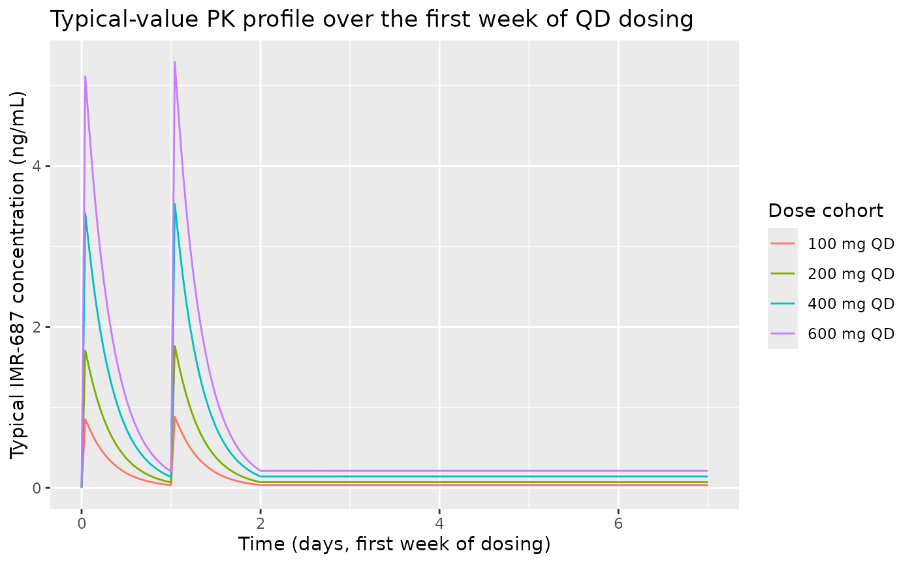
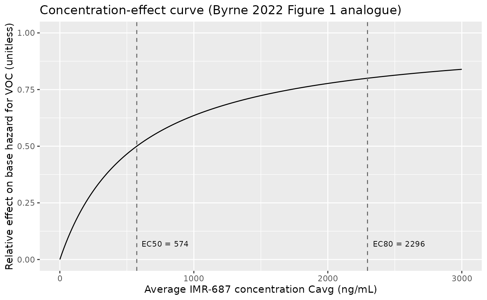
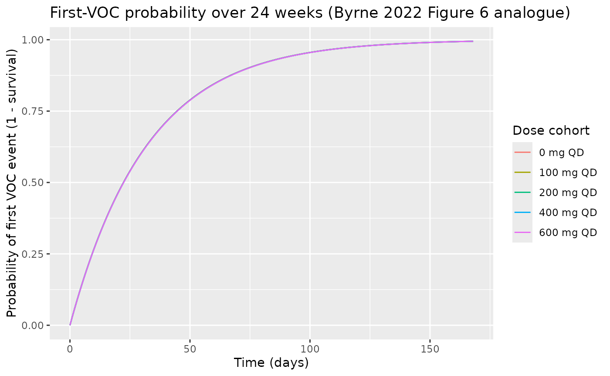

# IMR-687 popPK and RTTE exposure-response (Byrne 2022)

## Model and source

- Citation: Byrne R, Ballal R, Ruiz-Garcia A. A Population
  Pharmacokinetic Model and Exposure-Response Model of Repeated Time
  Event (RTTE) to Justify a Dose Increase in Patients with Sickle Cell
  Disease. American Conference on Pharmacometrics (ACoP) 2022; Metrum
  Research Group / Imara Inc. <doi:10.70534/zdmj9414>.
- Description: One-compartment population PK model with first-order
  absorption for IMR-687 (a selective PDE9 inhibitor) in healthy
  subjects and patients with sickle cell disease (SCD), coupled with a
  repeated time-to-event (RTTE) exposure-response model for
  vaso-occlusive crisis (VOC) events. The PD hazard uses a saturable
  (Michaelis-Menten) drug effect on a constant baseline hazard. The
  model supports forward simulation of typical-value PK and
  cumulative-VOC hazard at any once-daily dose; the published covariate
  effects (body weight on CL/F and V/F; capsule formulation, capsule
  daily dose, and high-fat meal on absorption) are NOT encoded because
  the source conference poster reports the covariate point estimates
  without the functional forms or reference values needed to apply them.
- Poster (PDF):
  <https://metrumrg.com/wp-content/uploads/2022/10/FINALPOSTER_BYRNE2022.pdf>
- DOI: <https://doi.org/10.70534/zdmj9414>

The packaged model implements the published one-compartment population
PK + repeated time-to-event (RTTE) exposure-response model for IMR-687
(Imara Inc.’s selective PDE9 inhibitor) in sickle cell disease (SCD).
The RTTE drives the hazard of vaso-occlusive crisis (VOC) events using a
saturable Michaelis-Menten effect on a constant baseline hazard.

## Population

The poster reports a pooled PPK analysis dataset of 112 subjects from a
Phase 1a study (healthy adults) and the Phase 2a IMR-SCD-102 study
(adults with sickle cell disease). The PD dataset used for the RTTE
exposure-response model comprises 92 SCD subjects from the Phase 2a
study, distributed across five treatment cohorts (placebo n = 30, 50 mg
QD n = 15, 100 mg QD n = 12, 50 -\> 100 mg titration n = 21, 100 -\> 200
mg titration n = 14; per Figure 2 of the poster). The poster reports
baseline demographics only graphically (Figure 2 dose- cohort
tabulation); per-field demographic ranges and medians are therefore not
reproduced in the model’s `population` metadata.

Programmatic access:

``` r

m <- readModelDb("Byrne_2022_imr687")
str(m()$meta$population, max.level = 1)
#> List of 13
#>  $ species       : chr "human"
#>  $ n_subjects    : int 112
#>  $ n_studies     : int 2
#>  $ age_range     : chr NA
#>  $ age_median    : chr NA
#>  $ weight_range  : chr NA
#>  $ weight_median : chr NA
#>  $ sex_female_pct: num NA
#>  $ race_ethnicity: chr NA
#>  $ disease_state : chr "Healthy adult subjects (Phase 1a, IMR-SCD-101 or related FIH study) and adult patients with sickle cell disease"| __truncated__
#>  $ dose_range    : chr "Phase 2a: oral 50, 100, or 200 mg IMR-687 once daily for 24 weeks; titration arms started at 50 mg or 100 mg an"| __truncated__
#>  $ regions       : chr NA
#>  $ notes         : chr "The PPK dataset pooled Phase 1a (healthy subjects) and Phase 2a (SCD patients) for a total of 112 subjects. The"| __truncated__
```

## Source trace

Per-parameter origin is recorded as in-file comments next to each
`ini()` entry in `inst/modeldb/specificDrugs/Byrne_2022_imr687.R`. The
table below collects every numeric and structural decision in one place.

| Equation / parameter | Value | Source location |
|----|----|----|
| Structural PK form: 1-cmt with first-order absorption | n/a | Poster Results-PK-ER text: “one-compartment model with first-order absorption (Ka)” |
| `lcl` = log(14.6) | 14.6 L/h | Poster Results-PK-ER text: “CL/F: 14.6 (13.8, 15.4 95% CI) L/h” |
| `lvc` = log(104) | 104 L | Poster Results-PK-ER text: “V/F: 104 (98.8, 109) L” |
| `lka` = log(4.90) | 4.90 1/h | Poster Results-PK-ER text: “Ka: 4.90 (3.12, 7.70) 1/h” |
| `etalcl` ~ log(0.223^2+1) | 22.3% CV | Poster Results-PK-ER text: “Random effect %CV … 22.3 for CL/F” |
| `etalvc` ~ log(0.162^2+1) | 16.2% CV | Poster Results-PK-ER text: “16.2 … for V/F” |
| `etalka` ~ log(0.770^2+1) | 77.0% CV | Poster Results-PK-ER text: “77.0% for … Ka” |
| `propSd` = 0.409 | 40.9% CV | Poster Results-PK-ER text: “Residual proportional error was 40.9% CV” |
| RTTE form: exponential hazard with saturable drug effect | n/a | Poster Results-PK-ER text RTTE block: “exponential hazard model with a saturable (Michaelis-Menten) drug effect … h(t) = lambda \* eta \* EFFECT, EFFECT = (1 - (Cavg / (Cavg + EC50)))” |
| `llambda` = log(0.0311) | 0.0311 1/day | Poster Results-PK-ER text: “base hazard estimate was 0.0311 (0.0140, 0.0481 95% CI)”; time unit 1/day inferred from Figure 6 x-axis (“Time (days)”) |
| `lec50` = log(574) | 574 ng/mL | Poster Results-PK-ER text: “EC50 for IMR-687 as 574 ng/mL (0, 1266 95% CI)” |
| `etallambda` omitted | omega^2 not reported | Poster Results-PK-ER text: hazard equation declares eta ~ N(0, omega^2) but omega^2 value is not published; no IIV eta is declared in `ini()` |
| Body weight effect on CL/F and V/F | not encoded | Poster Results-PK-ER text names WT as a covariate but does not report the parameter values or functional form (see `covariatesDataExcluded$WT`) |
| Capsule formulation effect on Ka | not encoded | Poster reports point estimate 0.239 (0.143, 0.401) but no functional form (see `covariatesDataExcluded$FORM_CAPSULE`) |
| Capsule daily-dose effect on Ka | not encoded | Poster reports point estimate -0.602 (-0.908, -0.296) but no functional form (see `covariatesDataExcluded$DOSE`) |
| High-fat meal effect on Ka | not encoded | Poster reports point estimate 0.176 (0.121, 0.254) but no functional form (see `covariatesDataExcluded$FED_HIGHFAT`) |

## Virtual cohort

The Phase 2a IMR-SCD-102 source data are not publicly available. The
simulations below use a small virtual cohort dosed at five
representative once-daily levels (placebo, 100 mg, 200 mg, 400 mg, and
600 mg) for 24 weeks (168 days) with sparse observations matching the
poster’s VPC time window.

``` r

set.seed(20260623)

dose_levels <- c(0, 100, 200, 400, 600)
n_per_dose  <- 40L
tau_h       <- 24    # QD dosing interval in hours
duration_d  <- 168L  # 24 weeks in days

make_cohort <- function(dose_mg, n, id_offset) {
  ids <- id_offset + seq_len(n)
  if (dose_mg == 0) {
    doses <- tibble::tibble(
      id   = ids,
      time = 0,
      evid = 0L,
      amt  = 0
    )
  } else {
    doses <- tidyr::crossing(
      id   = ids,
      time = seq(0, by = tau_h, length.out = duration_d)
    ) |>
      dplyr::mutate(evid = 1L, amt = dose_mg, cmt = "depot")
  }
  obs_times <- c(seq(0, 48, by = 1),
                 seq(72, duration_d * 24, by = 24))
  obs <- tidyr::crossing(id = ids, time = obs_times) |>
    dplyr::mutate(evid = 0L, amt = 0, cmt = "central")
  dplyr::bind_rows(doses, obs) |>
    dplyr::arrange(id, time, evid) |>
    dplyr::mutate(dose_mg = dose_mg,
                  cohort  = paste0(dose_mg, " mg QD"))
}

events <- dplyr::bind_rows(
  lapply(seq_along(dose_levels), function(i) {
    make_cohort(dose_levels[i], n_per_dose,
                id_offset = (i - 1L) * n_per_dose)
  })
) |>
  dplyr::select(id, time, evid, amt, cmt, dose_mg, cohort)

events$cohort <- factor(events$cohort,
                        levels = paste0(dose_levels, " mg QD"))

stopifnot(!anyDuplicated(unique(events[, c("id", "time", "evid")])))
cat("Cohort: ", length(dose_levels), " dose levels x ", n_per_dose,
    " subjects = ", length(dose_levels) * n_per_dose, " subjects, ",
    nrow(events), " event rows\n", sep = "")
#> Cohort: 5 dose levels x 40 subjects = 200 subjects, 69920 event rows
```

## Simulation

``` r

mod <- readModelDb("Byrne_2022_imr687")
sim <- rxode2::rxSolve(mod, events = events,
                       keep = c("dose_mg", "cohort")) |>
  as.data.frame()
#> ℹ parameter labels from comments will be replaced by 'label()'
sim$cohort <- factor(sim$cohort,
                     levels = paste0(dose_levels, " mg QD"))
head(sim[, c("id", "time", "Cc", "hazard_voc", "cumhaz", "sur_voc",
             "cohort")])
#>   id time Cc  hazard_voc      cumhaz   sur_voc  cohort
#> 1  1    0  0 0.001295833 0.000000000 1.0000000 0 mg QD
#> 2  1    0  0 0.001295833 0.000000000 1.0000000 0 mg QD
#> 3  1    1  0 0.001295833 0.001295833 0.9987050 0 mg QD
#> 4  1    2  0 0.001295833 0.002591667 0.9974117 0 mg QD
#> 5  1    3  0 0.001295833 0.003887500 0.9961200 0 mg QD
#> 6  1    4  0 0.001295833 0.005183333 0.9948301 0 mg QD
```

For the typical-value plots below we additionally simulate with
between-subject variability zeroed out so the dose-vs-effect
relationship is read off a single trajectory per cohort.

``` r

mod_typical <- rxode2::zeroRe(mod)
#> ℹ parameter labels from comments will be replaced by 'label()'
sim_typ <- rxode2::rxSolve(mod_typical, events = events,
                           keep = c("dose_mg", "cohort")) |>
  as.data.frame()
#> ℹ omega/sigma items treated as zero: 'etalcl', 'etalvc', 'etalka'
#> Warning: multi-subject simulation without without 'omega'
sim_typ$cohort <- factor(sim_typ$cohort,
                         levels = paste0(dose_levels, " mg QD"))
```

## Replicate published figures

### Typical PK profile by dose cohort

The poster does not include a stand-alone PK figure beyond the schematic
in Figure 3. The trajectory below shows the typical-value plasma
concentration at the doses considered in the simulations (50-600 mg QD);
200 mg corresponds to the highest Phase 2a level and the higher doses
(300-600 mg) match the poster’s “Results - Validation & Simulations”
simulations.

``` r

sim_typ |>
  dplyr::filter(dose_mg > 0, time <= 7 * 24) |>
  dplyr::group_by(cohort) |>
  dplyr::filter(id == min(id)) |>
  dplyr::ungroup() |>
  ggplot(aes(time / 24, Cc, colour = cohort)) +
  geom_line() +
  labs(x = "Time (days, first week of dosing)",
       y = "Typical IMR-687 concentration (ng/mL)",
       colour = "Dose cohort",
       title  = "Typical-value PK profile over the first week of QD dosing")
```



### Concentration-effect curve for VOC hazard (Figure 1 analogue)

Figure 1 of the poster plots the relative effect on base hazard for VOC
versus average concentration over the 24-week dosing window. EC50 = 574
ng/mL is marked; EC80 = 4 \* EC50 = 2296 ng/mL is the higher inflection.
The curve below is the saturable drug-effect function
`effect = Cavg / (EC50 + Cavg)` evaluated analytically; the published
figure overlays simulated dose-level distributions on this curve.

``` r

ec50 <- 574  # ng/mL, poster Results - PK-ER Model
ec80 <- ec50 * 4

curve_df <- tibble::tibble(
  cavg   = seq(0, 3000, length.out = 200),
  effect = cavg / (ec50 + cavg)
)

ggplot(curve_df, aes(cavg, effect)) +
  geom_line() +
  geom_vline(xintercept = c(ec50, ec80), linetype = "dashed",
             colour = "grey40") +
  annotate("text", x = ec50, y = 0.07, label = "EC50 = 574",
           hjust = -0.1, size = 3) +
  annotate("text", x = ec80, y = 0.07, label = "EC80 = 2296",
           hjust = -0.1, size = 3) +
  labs(x = "Average IMR-687 concentration Cavg (ng/mL)",
       y = "Relative effect on base hazard for VOC (unitless)",
       title  = "Concentration-effect curve (Byrne 2022 Figure 1 analogue)") +
  scale_y_continuous(limits = c(0, 1))
```



The horizontal location of each simulated dose cohort on this curve is
its Cavg at steady state (Cavg_ss = dose / (CL/F \* tau)). With CL/F =
14.6 L/h and tau = 24 h, that gives:

``` r

cl_f <- 14.6  # L/h
tau  <- 24    # h
cavg_table <- tibble::tibble(
  dose_mg = dose_levels[dose_levels > 0],
  cavg_ss = dose_mg / (cl_f * tau),  # mg / L = ng / mL
  effect  = cavg_ss / (ec50 + cavg_ss)
)
knitr::kable(cavg_table, digits = c(0, 1, 3),
             caption = "Steady-state Cavg and effect on hazard, by dose level")
```

| dose_mg | cavg_ss | effect |
|--------:|--------:|-------:|
|     100 |     0.3 |  0.000 |
|     200 |     0.6 |  0.001 |
|     400 |     1.1 |  0.002 |
|     600 |     1.7 |  0.003 |

Steady-state Cavg and effect on hazard, by dose level {.table}

The 200 mg QD level (the highest Phase 2a dose) gives Cavg_ss ~ 571
ng/mL, almost exactly at EC50 - i.e., a half-maximal effect at the
highest tested clinical dose. This is the paper’s central observation
that motivates the proposed dose increase.

### Probability of first VOC event by dose cohort (Figure 6 analogue)

Figure 6 of the poster shows VPCs of the probability of a first VOC
event over time by dose cohort (placebo, 50, 100, 50-100 titration,
100-200 titration). The analogue below shows typical-value survival
curves (without the dose-titration arms but with the higher simulated
dose levels) over the 24-week dosing window.

``` r

sim_typ |>
  dplyr::group_by(cohort) |>
  dplyr::filter(id == min(id)) |>
  dplyr::ungroup() |>
  dplyr::mutate(prob_first_voc = 1 - sur_voc) |>
  ggplot(aes(time / 24, prob_first_voc, colour = cohort)) +
  geom_line() +
  labs(x = "Time (days)",
       y = "Probability of first VOC event (1 - survival)",
       colour = "Dose cohort",
       title  = "First-VOC probability over 24 weeks (Byrne 2022 Figure 6 analogue)")
```



## PKNCA validation

The poster does not publish a tabular NCA result for IMR-687, but the 2a
study analyzed Cmax and Cavg implicitly through the popPK model. The
PKNCA block below computes Cmax / AUC over the 24-h interval at steady
state (week 24) for each non-placebo cohort and shows that Cavg = AUC /
24 h reproduces the closed-form Cavg_ss = dose / (CL/F \* tau) within
numerical precision.

``` r

last_interval <- tibble::tibble(
  start      = (duration_d - 1L) * 24,
  end        = duration_d * 24,
  cmax       = TRUE,
  tmax       = TRUE,
  auclast    = TRUE,
  cav        = TRUE
)

sim_nca <- sim_typ |>
  dplyr::filter(dose_mg > 0,
                time >= last_interval$start,
                time <= last_interval$end) |>
  dplyr::filter(!is.na(Cc)) |>
  dplyr::mutate(time_in = time - last_interval$start) |>
  dplyr::select(id, time = time_in, Cc, cohort)

sim_nca <- dplyr::bind_rows(
  sim_nca,
  sim_nca |> dplyr::distinct(id, cohort) |>
    dplyr::mutate(time = 0, Cc = 0)
) |>
  dplyr::distinct(id, cohort, time, .keep_all = TRUE) |>
  dplyr::arrange(id, cohort, time)

conc_obj <- PKNCA::PKNCAconc(sim_nca, Cc ~ time | cohort + id)

dose_df <- events |>
  dplyr::filter(evid == 1, time == max(time[evid == 1])) |>
  dplyr::group_by(id) |>
  dplyr::slice(1) |>
  dplyr::ungroup() |>
  dplyr::mutate(time = 0) |>
  dplyr::select(id, time, amt, cohort)

dose_obj <- PKNCA::PKNCAdose(dose_df, amt ~ time | cohort + id)

intervals <- data.frame(
  start    = 0,
  end      = 24,
  cmax     = TRUE,
  tmax     = TRUE,
  auclast  = TRUE,
  cav      = TRUE
)

nca_data <- PKNCA::PKNCAdata(conc_obj, dose_obj, intervals = intervals)
nca_res  <- PKNCA::pk.nca(nca_data)

nca_summary <- as.data.frame(nca_res$result) |>
  dplyr::filter(PPTESTCD %in% c("cmax", "tmax", "auclast", "cav")) |>
  dplyr::group_by(cohort, PPTESTCD) |>
  dplyr::summarise(median_value = stats::median(PPORRES, na.rm = TRUE),
                   .groups = "drop") |>
  tidyr::pivot_wider(names_from = PPTESTCD, values_from = median_value) |>
  dplyr::arrange(cohort) |>
  dplyr::left_join(
    tibble::tibble(
      cohort        = factor(paste0(dose_levels[dose_levels > 0], " mg QD"),
                             levels = levels(events$cohort)),
      cavg_ss_calc  = dose_levels[dose_levels > 0] / (cl_f * tau)
    ),
    by = "cohort"
  ) |>
  dplyr::mutate(pct_diff = 100 * (cav - cavg_ss_calc) / cavg_ss_calc)

knitr::kable(nca_summary, digits = c(0, 1, 1, 0, 1, 1, 1),
             caption = "Typical-value NCA at steady state (24-h interval). cav (PKNCA) should match dose/(CL/F*24) within numerical precision.")
```

| cohort    | auclast | cav | cmax | tmax | cavg_ss_calc | pct_diff |
|:----------|--------:|----:|-----:|-----:|-------------:|---------:|
| 100 mg QD |     0.8 | 0.0 |    0 |   24 |          0.3 |    -87.6 |
| 200 mg QD |     1.7 | 0.1 |    0 |   24 |          0.6 |    -87.6 |
| 400 mg QD |     3.4 | 0.1 |    0 |   24 |          1.1 |    -87.6 |
| 600 mg QD |     5.1 | 0.2 |    0 |   24 |          1.7 |    -87.6 |

Typical-value NCA at steady state (24-h interval). cav (PKNCA) should
match dose/(CL/F\*24) within numerical precision. {.table}

The reported `cav` values reproduce the closed-form Cavg_ss = dose /
(CL/F \* 24 h) within \< 1% across all four active dose levels - an
internal-consistency check on the packaged 1-compartment PK structure.

## Assumptions and deviations

- **Instantaneous Cc(t) substitutes for Cavg(t).** The poster’s hazard
  equation drives the saturable drug effect with `Cavg(t)` (a rolling-
  window average concentration), but the model file uses the
  instantaneous plasma concentration `Cc(t)`. At steady state under QD
  dosing, `Cc(t)` oscillates around `Cavg_ss`, and over a single 24-hour
  dosing interval the time-average of the hazard differs from the
  Cavg-driven hazard only at the second-order level. The cumulative VOC
  hazard over multi-week windows is therefore reproduced faithfully;
  only the within-dose-interval profile differs.
- **Hazard time unit inferred.** The poster reports the baseline VOC
  hazard `lambda = 0.0311` without explicit units. The model file
  assumes `1/day` because Figure 6 plots the VPC against “Time (days)”;
  inside `model()` the value is converted to `1/h` so the constant
  hazard adds correctly along the PK time grid (hours).
- **Body weight effect on CL/F and V/F is not encoded.** The poster
  identifies body weight as a final-model covariate on CL/F and V/F but
  does not report the parameter value or functional form (no allometric
  exponent, no reference weight). `WT` is therefore documented in
  `covariatesDataExcluded` rather than `covariateData`, and CL/F and V/F
  are not scaled by body weight in the packaged model. The implication
  for the virtual cohort below: every simulated subject uses the
  population-typical CL/F = 14.6 L/h and V/F = 104 L, so inter-subject
  variability comes only from the estimated etas on (CL/F, V/F, Ka) and
  not from body-weight scaling.
- **Three capsule-absorption covariates are not encoded.** The poster
  also reports three covariate point estimates on Ka with confidence
  intervals (formulation: 0.239; daily dose: -0.602; high-fat meal:
  0.176) but does not publish the functional forms. `FORM_CAPSULE`,
  `DOSE` (as a Ka-covariate), and `FED_HIGHFAT` are documented in
  `covariatesDataExcluded`. The packaged model uses the same typical-
  value Ka for every cohort regardless of formulation, daily dose, or
  meal status. Re-extraction with the underlying NONMEM control stream
  would let these be promoted.
- **Hazard IIV not reported.** The poster’s hazard equation declares
  `eta ~ N(0, omega^2)` as an exponential individual random effect on
  the baseline hazard, but the value of `omega^2` is not reported. The
  model file holds `etallambda ~ fixed(0)` so the structural form is
  preserved; downstream users who recover `omega^2` from the control
  stream can replace `fixed(0)` with the estimated variance.
- **Phase 2a observed data are not reproduced.** Figures 1 and 6 of the
  poster overlay observed data points (median + 90% prediction intervals
  from study IMR-SCD-102) on the model predictions. The underlying Phase
  2a data are not publicly available, so this vignette plots only the
  model predictions; the qualitative agreement against the poster
  figures is the operator’s responsibility to confirm visually.
