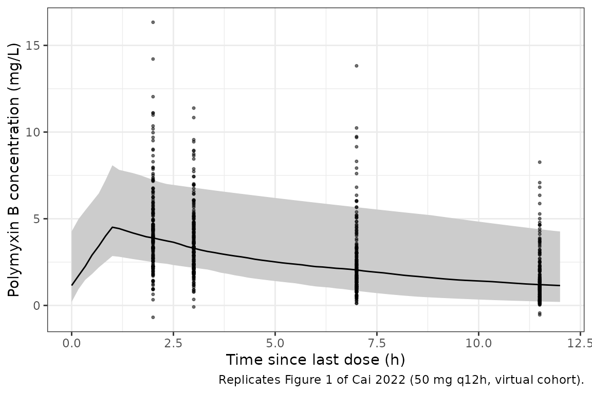
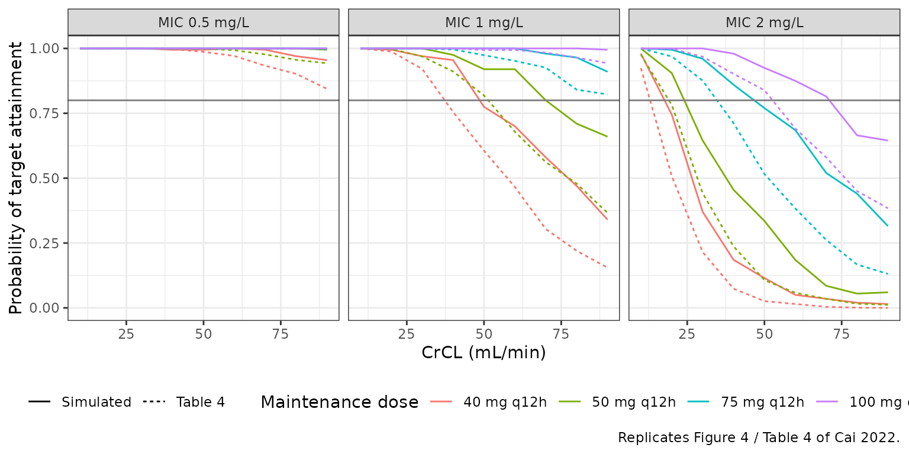
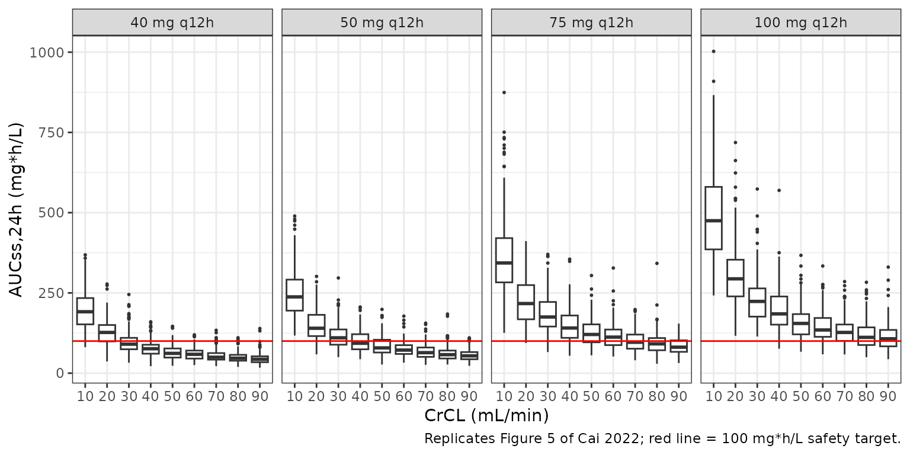

# Polymyxin B (Cai 2022)

## Model and source

- Citation: Cai X-J, Chen Y, Zhang X-S, Wang Y-Z, Zhou W-B, Zhang C-H,
  Wu B, Song H-Z, Yang H, Yu X-B. Population pharmacokinetic analysis,
  renal safety, and dosing optimization of polymyxin B in lung
  transplant recipients with pneumonia: A prospective study. Front
  Pharmacol. 2022;13:1019411. <doi:10.3389/fphar.2022.1019411>. PMCID
  PMC9608142.
- Description: One-compartment intravenous population PK model for
  polymyxin B in Chinese adult lung transplant recipients with
  carbapenem-resistant Gram-negative pneumonia (Cai 2022).
  Cockcroft-Gault creatinine clearance is the sole retained covariate,
  entering clearance as a power term normalized to the cohort median of
  78.49 mL/min with exponent 0.681. Independent exponential
  inter-individual variability on CL and V; proportional residual error.
- Article: [Front Pharmacol.
  2022;13:1019411](https://doi.org/10.3389/fphar.2022.1019411) (open
  access, PMC9608142)

## Population

Cai 2022 is a single-centre prospective study run at the Affiliated Wuxi
People’s Hospital of Nanjing Medical University (China) between January
2020 and December 2021. Thirty-four adult lung transplant recipients
with pneumonia caused by carbapenem-resistant Gram-negative organisms,
treated with intravenous polymyxin B sulfate for at least 3 days,
contributed 164 plasma concentrations (0.56-11.66 mg/L). Every patient
also inhaled polymyxin B sulfate 25 mg q12h. Polymyxin B was infused
over 1 hour q12h; four samples per patient were drawn at least 48 h
after starting therapy, 0.5 h before an infusion and 1, 2 and 6 h after
the end of the infusion. No concentrations were collected during
extracorporeal membrane oxygenation or renal replacement therapy.

The cohort (Table 1) was 25 men and 9 women (26.5% female), mean age 56
+/- 12.8 years, mean weight 52.2 +/- 10.0 kg, mean height 166.9 +/- 7.2
cm, and Cockcroft-Gault creatinine clearance 80.8 +/- 30.0 mL/min
(median 78.49 mL/min, Results 3.3). The isolated organisms were *A.
baumannii* (47.5%), *P. aeruginosa* (30%), *K. pneumoniae* (17.5%) and
*E. cloacae* (5%). The daily intravenous dose had a median of 100 (range
100-150).

The same information is available programmatically via the model’s
`population` metadata
(`rxode2::rxode(readModelDb("Cai_2022_polymyxinB"))$population`).

## Source trace

| Model element | Value | Source location |
|----|----|----|
| One-compartment disposition, first-order elimination, IV infusion | – | Results 3.3: one-compartment model fit better than two-compartment |
| Exponential IIV, `P_i = P x exp(eta_i)` | Eq. 1 | Methods 2.4.1 |
| Proportional residual error, `Y = F + F x EPS(1)` | Eq. 3 | Methods 2.4.1; Results 3.3 ‘Proportional error model was selected’ |
| `lcl` = log(1.72) | CL 1.72 L/h | Table 3, row ‘theta CL’ (RSE 8%; bootstrap median 1.72, 95% CI 1.44-1.99); Eq. 5 |
| `lvc` = log(14.4) | V 14.4 L | Table 3, row ‘theta V’ (RSE 11%; bootstrap median 14.3, 95% CI 11.4-17.4); Eq. 6 |
| `e_crcl_cl` = 0.681 | CrCL exponent on CL | Table 3, row ‘CrCL on CL (theta 1)’ (RSE 20%; bootstrap 95% CI 0.360-1.002); Eq. 5 |
| CrCL normalising constant 78.49 mL/min | – | Eq. 5; Results 3.3 ‘78.49 is the median value of CrCL for the included patients’ |
| CrCL estimating equation | Cockcroft-Gault | Table 4 footnote |
| `etalcl` variance | 0.326^2 = 0.1063 | Table 3, row ‘omega CL \[%\]’ = 32.6 (footnote: ‘square root of between-subject variability’) |
| `etalvc` variance | 0.406^2 = 0.1648 | Table 3, row ‘omega V \[%\]’ = 40.6 |
| `propSd` | 0.379 | Table 3, row ‘sigma pro (%)’ = 37.9 |

## Typical-value closed-form check

For a linear one-compartment model at steady state, the AUC over 24
hours is the daily dose divided by CL, whatever the volume. With random
effects zeroed and 1-hour infusions continued for 20 days (the terminal
half-life is about 24 h at CrCL 10 mL/min), the integrated AUC must
reproduce `2 x MD / CL` at every CrCL, where CL is Eq. 5 evaluated
directly. Both sides use the same parameters, so the bound is tight.

``` r

mod <- readModelDb("Cai_2022_polymyxinB")
mod_tv <- rxode2::zeroRe(mod)
#> ℹ parameter labels from comments will be replaced by 'label()'
crcl_check <- c(10, 30, 50, 78.49, 90)
tv_subj <- tibble::tibble(id = seq_along(crcl_check), CRCL = crcl_check)
tv_events <- dplyr::bind_rows(
  tv_subj |>
    tidyr::expand_grid(time = seq(0, 492, by = 12)) |>
    dplyr::mutate(amt = 50, rate = 50, evid = 1L, cmt = "central"),
  tv_subj |>
    tidyr::expand_grid(time = seq(480, 504, by = 0.05)) |>
    dplyr::mutate(amt = NA_real_, rate = NA_real_, evid = 0L, cmt = "central")
) |>
  dplyr::arrange(id, time, dplyr::desc(evid)) |>
  as.data.frame()

tv_sim <- rxode2::rxSolve(mod_tv, tv_events, returnType = "data.frame")
#> ℹ omega/sigma items treated as zero: 'etalcl', 'etalvc'
#> Warning: multi-subject simulation without without 'omega'
tv_check <- tv_sim |>
  dplyr::group_by(id) |>
  dplyr::summarise(
    CRCL = dplyr::first(CRCL),
    cl = dplyr::first(cl),
    auc = sum(diff(time) * (utils::head(Cc, -1) + utils::tail(Cc, -1)) / 2),
    .groups = "drop"
  ) |>
  dplyr::mutate(
    cl_expected = 1.72 * (CRCL / 78.49)^0.681,
    auc_expected = 2 * 50 / cl_expected,
    pct_diff = 100 * (auc - auc_expected) / auc_expected
  )

tv_check |>
  dplyr::select(CRCL, cl, cl_expected, auc, auc_expected, pct_diff) |>
  dplyr::rename(
    "CrCL (mL/min)" = CRCL, "CL model (L/h)" = cl,
    "CL Eq. 5 (L/h)" = cl_expected, "AUC24 integrated" = auc,
    "2 x 50 mg / CL" = auc_expected, "% diff" = pct_diff
  ) |>
  knitr::kable(digits = 4, caption = "Typical-value steady-state AUC24 at 50 mg q12h.")
```

| CrCL (mL/min) | CL model (L/h) | CL Eq. 5 (L/h) | AUC24 integrated | 2 x 50 mg / CL | % diff |
|---:|---:|---:|---:|---:|---:|
| 10.00 | 0.4228 | 0.4228 | 236.5055 | 236.5049 | 3e-04 |
| 30.00 | 0.8935 | 0.8935 | 111.9235 | 111.9233 | 2e-04 |
| 50.00 | 1.2652 | 1.2652 | 79.0391 | 79.0390 | 2e-04 |
| 78.49 | 1.7200 | 1.7200 | 58.1396 | 58.1395 | 1e-04 |
| 90.00 | 1.8880 | 1.8880 | 52.9665 | 52.9665 | 1e-04 |

Typical-value steady-state AUC24 at 50 mg q12h. {.table}

``` r


stopifnot(
  max(abs(tv_check$cl - tv_check$cl_expected)) < 1e-8,
  max(abs(tv_check$pct_diff)) < 0.1
)
```

## Virtual study cohort and observed AUC (Table 2)

Table 2 reports a Bayesian-estimated AUC of 69.66 +/- 35.92 mg\*h/L
across the 34 patients (the Methods describe AUC0-24 from 10-minute
individual predictions). A virtual cohort of 200 patients is built from
Table 1: CrCL is drawn from a normal distribution with the Table 1 mean
and SD (80.81 +/- 29.97 mL/min), truncated to 15-180 mL/min, and every
patient receives 100 mg loading followed by 50 mg q12h (the Table 1
median daily dose of 100) as 1-hour infusions. The day-3 interval (48-72
h, inside the sampling window that started at least 48 h into therapy)
is analysed with PKNCA on the individual predictions.

``` r

n_cohort <- 200L # cap: never more than 200 participants per arm
set.seed(20221013)
rxode2::rxSetSeed(20221013)
cohort <- tibble::tibble(
  id = seq_len(n_cohort),
  CRCL = pmin(pmax(stats::rnorm(n_cohort, 80.81, 29.97), 15), 180),
  treatment = "50 mg q12h (100 mg loading)"
)
coh_doses <- cohort |>
  tidyr::expand_grid(time = seq(0, 72, by = 12)) |>
  dplyr::mutate(
    amt = ifelse(time == 0, 100, 50), rate = amt, evid = 1L, cmt = "central"
  )
coh_obs <- cohort |>
  tidyr::expand_grid(time = seq(0, 72, by = 1 / 6)) |>
  dplyr::mutate(amt = NA_real_, rate = NA_real_, evid = 0L, cmt = "central")
coh_events <- dplyr::bind_rows(coh_doses, coh_obs) |>
  dplyr::select(id, time, amt, rate, evid, cmt, CRCL) |>
  dplyr::arrange(id, time, dplyr::desc(evid)) |>
  as.data.frame()

coh_sim <- rxode2::rxSolve(mod, coh_events, returnType = "data.frame") |>
  dplyr::left_join(dplyr::select(cohort, id, treatment), by = "id")
#> ℹ parameter labels from comments will be replaced by 'label()'

coh_conc <- coh_sim |>
  dplyr::filter(!is.na(Cc)) |>
  dplyr::select(id, time, Cc, treatment)
conc_obj <- PKNCA::PKNCAconc(coh_conc, Cc ~ time | treatment + id,
                             concu = "mg/L", timeu = "h")
dose_obj <- PKNCA::PKNCAdose(
  dplyr::select(coh_doses, id, time, amt, treatment),
  amt ~ time | treatment + id, doseu = "mg"
)
intervals <- data.frame(start = 48, end = 72, auclast = TRUE, cmax = TRUE,
                        cmin = TRUE, cav = TRUE)
nca_res <- PKNCA::pk.nca(PKNCA::PKNCAdata(conc_obj, dose_obj,
                                          intervals = intervals))
nca_long <- as.data.frame(nca_res) |>
  dplyr::select(treatment, id, PPTESTCD, PPORRES)
coh_auc <- nca_long |> dplyr::filter(PPTESTCD == "auclast")

summary(nca_res)
#>  Interval Start Interval End                   treatment   N AUClast (h*mg/L)
#>              48           72 50 mg q12h (100 mg loading) 200      60.2 [44.4]
#>  Cmax (mg/L) Cmin (mg/L)  Cav (mg/L)
#>  4.57 [32.0]  1.05 [109] 2.51 [44.4]
#> 
#> Caption: AUClast, Cmax, Cmin, Cav: geometric mean and geometric coefficient of variation; N: number of subjects
```

``` r

auc_tab <- tibble::tibble(
  Source = c("Cai 2022 Table 2 (n = 34)", "Simulated virtual cohort (n = 200)"),
  mean_auc = c(69.66, mean(coh_auc$PPORRES)),
  sd_auc = c(35.92, stats::sd(coh_auc$PPORRES))
)
auc_tab |>
  dplyr::rename(
    " " = Source, "Mean AUC0-24 (mg*h/L)" = mean_auc, "SD" = sd_auc
  ) |>
  knitr::kable(digits = 1, caption = "Day-3 AUC0-24: Table 2 versus a virtual cohort.")
```

|                                    | Mean AUC0-24 (mg\*h/L) |   SD |
|:-----------------------------------|-----------------------:|-----:|
| Cai 2022 Table 2 (n = 34)          |                   69.7 | 35.9 |
| Simulated virtual cohort (n = 200) |                   66.4 | 33.9 |

Day-3 AUC0-24: Table 2 versus a virtual cohort. {.table}

``` r


auc_pct_diff <- 100 * (mean(coh_auc$PPORRES) - 69.66) / 69.66
# Structural: a mis-transcribed CL, exponent or normalising constant moves the
# cohort mean by tens of percent. The bound leaves room for the unreported
# per-patient dose mix (Table 1: 100-150 per day) and CrCL distribution.
stopifnot(abs(auc_pct_diff) < 25)
```

With every virtual patient on the median daily dose of 100 mg, the
simulated mean AUC0-24 is somewhat below the observed 69.66 mg\*h/L, as
expected because some patients received 150 mg/day; the order of
magnitude and spread agree.

## Replicate Figure 1: concentration versus time after dose

Replicates Figure 1 of Cai 2022 (polymyxin B concentration against time
since the last dose), using the day-3 dosing interval of the virtual
cohort with observations at the study’s sampling times (0.5 h before the
next infusion and 1, 2 and 6 h after the end of the infusion) plus the
5th, 50th and 95th percentiles of the individual predictions.

``` r

interval <- coh_sim |>
  dplyr::filter(time >= 60, time <= 72) |>
  dplyr::mutate(tad = time - 60)
pi_band <- interval |>
  dplyr::group_by(tad) |>
  dplyr::summarise(
    p05 = stats::quantile(Cc, 0.05), p50 = stats::median(Cc),
    p95 = stats::quantile(Cc, 0.95), .groups = "drop"
  )
set.seed(164)
samples <- interval |>
  dplyr::filter(abs(tad - 2) < 1e-6 | abs(tad - 3) < 1e-6 |
                  abs(tad - 7) < 1e-6 | abs(tad - 11.5) < 1e-6) |>
  dplyr::mutate(dv = Cc * (1 + 0.379 * stats::rnorm(dplyr::n())))

ggplot2::ggplot(pi_band, ggplot2::aes(tad)) +
  ggplot2::geom_ribbon(ggplot2::aes(ymin = p05, ymax = p95), fill = "grey80") +
  ggplot2::geom_line(ggplot2::aes(y = p50)) +
  ggplot2::geom_point(data = samples, ggplot2::aes(y = dv), size = 0.6,
                      alpha = 0.5) +
  ggplot2::labs(
    x = "Time since last dose (h)",
    y = "Polymyxin B concentration (mg/L)",
    caption = "Replicates Figure 1 of Cai 2022 (50 mg q12h, virtual cohort)."
  ) +
  ggplot2::theme_bw()
```



## Replicate Table 4 and Figures 4-5: PTA and AUCss by CrCL

The paper simulates four regimens (loading dose twice the maintenance
dose, then 40, 50, 75 or 100 mg q12h) at CrCL 10-90 mL/min. Efficacy is
fAUC0-24/MIC \>= 20 on day 3 with an unbound fraction of 0.42, so the
total AUC0-24 target is `20 x MIC / 0.42`. Safety is AUCss,24h \< 100
mg\*h/L. Day 3 is read as 48-72 h after the loading dose, and AUCss,24h
is taken over 216-240 h. The paper simulated an unstated number of
patients per scenario; 200 per scenario are used here, and the AUC is
computed on the individual predictions.

``` r

regimens <- tibble::tibble(md = c(40, 50, 75, 100)) |>
  dplyr::mutate(regimen = paste0(2 * md, " + ", md, " mg"))
crcl_levels <- seq(10, 90, by = 10)
arms <- tidyr::expand_grid(regimens, CRCL = crcl_levels) |>
  dplyr::mutate(arm = dplyr::row_number())
n_per_arm <- 200L # cap: never more than 200 participants per arm
pta_subj <- arms |>
  tidyr::expand_grid(rep = seq_len(n_per_arm)) |>
  dplyr::mutate(id = (arm - 1L) * n_per_arm + rep)

pta_doses <- pta_subj |>
  tidyr::expand_grid(time = seq(0, 228, by = 12)) |>
  dplyr::mutate(
    amt = ifelse(time == 0, 2 * md, md), rate = amt, evid = 1L, cmt = "central"
  )
pta_obs <- pta_subj |>
  tidyr::expand_grid(time = c(seq(48, 72, by = 0.25), seq(216, 240, by = 0.25))) |>
  dplyr::mutate(amt = NA_real_, rate = NA_real_, evid = 0L, cmt = "central")
pta_events <- dplyr::bind_rows(pta_doses, pta_obs) |>
  dplyr::select(id, time, amt, rate, evid, cmt, CRCL) |>
  dplyr::arrange(id, time, dplyr::desc(evid)) |>
  as.data.frame()

rxode2::rxSetSeed(1019411)
pta_sim <- rxode2::rxSolve(mod, pta_events, returnType = "data.frame")

trap <- function(t, c) sum(diff(t) * (utils::head(c, -1) + utils::tail(c, -1)) / 2)
pta_auc <- pta_sim |>
  dplyr::group_by(id) |>
  dplyr::summarise(
    auc_d3 = trap(time[time <= 72], Cc[time <= 72]),
    auc_ss = trap(time[time >= 216], Cc[time >= 216]),
    .groups = "drop"
  ) |>
  dplyr::left_join(dplyr::select(pta_subj, id, regimen, md, CRCL), by = "id")
```

``` r

table4 <- tibble::tribble(
  ~CRCL, ~MIC, ~`40`, ~`50`, ~`75`, ~`100`,
  10, 0.5, 1, 1, 1, 1,
  10, 1, 1, 1, 1, 1,
  10, 2, 0.924, 0.976, 1, 1,
  20, 0.5, 1, 1, 1, 1,
  20, 1, 0.988, 0.998, 1, 1,
  20, 2, 0.508, 0.782, 0.969, 0.999,
  30, 0.5, 1, 1, 1, 1,
  30, 1, 0.921, 0.969, 0.999, 1,
  30, 2, 0.215, 0.442, 0.876, 0.968,
  40, 0.5, 0.997, 1, 1, 1,
  40, 1, 0.755, 0.911, 0.996, 1,
  40, 2, 0.074, 0.237, 0.712, 0.902,
  50, 0.5, 0.987, 0.999, 0.999, 1,
  50, 1, 0.606, 0.819, 0.974, 0.994,
  50, 2, 0.026, 0.107, 0.516, 0.839,
  60, 0.5, 0.971, 0.993, 1, 1,
  60, 1, 0.466, 0.679, 0.952, 0.994,
  60, 2, 0.015, 0.058, 0.383, 0.691,
  70, 0.5, 0.933, 0.977, 1, 1,
  70, 1, 0.304, 0.562, 0.926, 0.984,
  70, 2, 0.004, 0.035, 0.262, 0.58,
  80, 0.5, 0.902, 0.956, 0.999, 0.999,
  80, 1, 0.22, 0.479, 0.841, 0.965,
  80, 2, 0.001, 0.016, 0.167, 0.45,
  90, 0.5, 0.844, 0.943, 0.997, 1,
  90, 1, 0.155, 0.366, 0.823, 0.943,
  90, 2, 0, 0.012, 0.131, 0.384
) |>
  tidyr::pivot_longer(c(`40`, `50`, `75`, `100`), names_to = "md",
                      values_to = "pta_paper") |>
  dplyr::mutate(md = as.numeric(md))

pta_sim_tab <- pta_auc |>
  tidyr::expand_grid(MIC = c(0.5, 1, 2)) |>
  dplyr::group_by(CRCL, MIC, md) |>
  dplyr::summarise(pta_sim = mean(0.42 * auc_d3 / MIC >= 20), .groups = "drop")

pta_cmp <- dplyr::inner_join(table4, pta_sim_tab, by = c("CRCL", "MIC", "md"))

pta_cmp |>
  dplyr::filter(MIC == 2) |>
  dplyr::mutate(md = paste0(2 * md, " + ", md)) |>
  dplyr::rename(
    "CrCL (mL/min)" = CRCL, "MIC (mg/L)" = MIC, "Regimen (mg)" = md,
    "PTA Table 4" = pta_paper, "PTA simulated" = pta_sim
  ) |>
  knitr::kable(digits = 3, caption = paste(
    "Probability of fAUC0-24/MIC >= 20 on day 3 at MIC = 2 mg/L:",
    "Cai 2022 Table 4 versus simulation."
  ))
```

| CrCL (mL/min) | MIC (mg/L) | Regimen (mg) | PTA Table 4 | PTA simulated |
|--------------:|-----------:|:-------------|------------:|--------------:|
|            10 |          2 | 80 + 40      |       0.924 |         0.980 |
|            10 |          2 | 100 + 50     |       0.976 |         1.000 |
|            10 |          2 | 150 + 75     |       1.000 |         1.000 |
|            10 |          2 | 200 + 100    |       1.000 |         1.000 |
|            20 |          2 | 80 + 40      |       0.508 |         0.745 |
|            20 |          2 | 100 + 50     |       0.782 |         0.905 |
|            20 |          2 | 150 + 75     |       0.969 |         0.995 |
|            20 |          2 | 200 + 100    |       0.999 |         1.000 |
|            30 |          2 | 80 + 40      |       0.215 |         0.370 |
|            30 |          2 | 100 + 50     |       0.442 |         0.645 |
|            30 |          2 | 150 + 75     |       0.876 |         0.960 |
|            30 |          2 | 200 + 100    |       0.968 |         1.000 |
|            40 |          2 | 80 + 40      |       0.074 |         0.185 |
|            40 |          2 | 100 + 50     |       0.237 |         0.455 |
|            40 |          2 | 150 + 75     |       0.712 |         0.860 |
|            40 |          2 | 200 + 100    |       0.902 |         0.980 |
|            50 |          2 | 80 + 40      |       0.026 |         0.115 |
|            50 |          2 | 100 + 50     |       0.107 |         0.335 |
|            50 |          2 | 150 + 75     |       0.516 |         0.770 |
|            50 |          2 | 200 + 100    |       0.839 |         0.925 |
|            60 |          2 | 80 + 40      |       0.015 |         0.050 |
|            60 |          2 | 100 + 50     |       0.058 |         0.185 |
|            60 |          2 | 150 + 75     |       0.383 |         0.685 |
|            60 |          2 | 200 + 100    |       0.691 |         0.875 |
|            70 |          2 | 80 + 40      |       0.004 |         0.035 |
|            70 |          2 | 100 + 50     |       0.035 |         0.085 |
|            70 |          2 | 150 + 75     |       0.262 |         0.520 |
|            70 |          2 | 200 + 100    |       0.580 |         0.815 |
|            80 |          2 | 80 + 40      |       0.001 |         0.020 |
|            80 |          2 | 100 + 50     |       0.016 |         0.055 |
|            80 |          2 | 150 + 75     |       0.167 |         0.440 |
|            80 |          2 | 200 + 100    |       0.450 |         0.665 |
|            90 |          2 | 80 + 40      |       0.000 |         0.015 |
|            90 |          2 | 100 + 50     |       0.012 |         0.060 |
|            90 |          2 | 150 + 75     |       0.131 |         0.315 |
|            90 |          2 | 200 + 100    |       0.384 |         0.645 |

Probability of fAUC0-24/MIC \>= 20 on day 3 at MIC = 2 mg/L: Cai 2022
Table 4 versus simulation. {.table}

``` r

pta_cmp |>
  tidyr::pivot_longer(c(pta_paper, pta_sim), names_to = "source",
                      values_to = "pta") |>
  dplyr::mutate(
    source = ifelse(source == "pta_paper", "Table 4", "Simulated"),
    regimen = factor(paste0(md, " mg q12h"),
                     levels = paste0(c(40, 50, 75, 100), " mg q12h")),
    MIC = paste("MIC", MIC, "mg/L")
  ) |>
  ggplot2::ggplot(ggplot2::aes(CRCL, pta, colour = regimen, linetype = source)) +
  ggplot2::geom_line() +
  ggplot2::geom_hline(yintercept = 0.8, colour = "grey50") +
  ggplot2::facet_wrap(~MIC) +
  ggplot2::labs(
    x = "CrCL (mL/min)", y = "Probability of target attainment",
    colour = "Maintenance dose", linetype = NULL,
    caption = "Replicates Figure 4 / Table 4 of Cai 2022."
  ) +
  ggplot2::theme_bw() +
  ggplot2::theme(legend.position = "bottom")
```



``` r

pta_auc |>
  dplyr::mutate(regimen = factor(paste0(md, " mg q12h"),
                                 levels = paste0(c(40, 50, 75, 100), " mg q12h"))) |>
  ggplot2::ggplot(ggplot2::aes(factor(CRCL), auc_ss)) +
  ggplot2::geom_boxplot(outlier.size = 0.4) +
  ggplot2::geom_hline(yintercept = 100, colour = "red") +
  ggplot2::facet_wrap(~regimen, nrow = 1) +
  ggplot2::labs(
    x = "CrCL (mL/min)", y = "AUCss,24h (mg*h/L)",
    caption = "Replicates Figure 5 of Cai 2022; red line = 100 mg*h/L safety target."
  ) +
  ggplot2::theme_bw()
```



The simulated PTA has the same shape as Table 4 – falling with CrCL and
rising with dose – but sits above the published values in every cell
where the published PTA is neither 0 nor 1. The table below converts
each PTA into the median clearance it implies at an inter-individual SD
of 0.326. Table 4 implies a clearance about 22-24% above Eq. 5 at every
CrCL from 20 to 90 mL/min (about 2.1 L/h at the median CrCL instead of
1.72 L/h), while the same calculation on the simulated PTA recovers Eq.
5. A constant offset across the CrCL range means the shape of the CrCL
power term is reproduced and only the scale differs. The same offset
shows in the safety thresholds the paper reads off Figure 5 (for example
“CrCL \< 70 ml/min … under dosage of 100 mg q12h”): with Eq. 5 as
printed, the median AUCss,24h at 100 mg q12h exceeds 100 mg\*h/L up to a
CrCL of about 98 mL/min. The Table 2 observed AUC (above) is instead
consistent with Eq. 5 as printed, as are Table 3, the text under Eq. 5
and the Discussion (“The CL was estimated at 1.72 L/h”), so the model is
encoded from Table 3 and the simulation offset is recorded rather than
tuned away. The paper does not state the number of simulated patients,
the AUC window, the infusion duration or the dose basis used in its
Monte Carlo simulations, so the cause cannot be identified.

``` r

# PTA = P(CL <= 2 * MD / target) with log(CL) ~ N(log(CL_median), 0.326^2),
# so CL_median = (2 * MD / target) * exp(-qnorm(PTA) * 0.326).
implied_cl <- function(pta, md, mic) {
  2 * md / (20 * mic / 0.42) * exp(-stats::qnorm(pta) * 0.326)
}
implied <- pta_cmp |>
  dplyr::filter(pta_paper > 0.05, pta_paper < 0.95,
                pta_sim > 0.05, pta_sim < 0.95) |>
  dplyr::mutate(
    cl_eq5 = 1.72 * (CRCL / 78.49)^0.681,
    ratio_paper = implied_cl(pta_paper, md, MIC) / cl_eq5,
    ratio_sim = implied_cl(pta_sim, md, MIC) / cl_eq5
  )
implied_tab <- implied |>
  dplyr::group_by(CRCL) |>
  dplyr::summarise(
    ratio_paper = stats::median(ratio_paper),
    ratio_sim = stats::median(ratio_sim),
    n = dplyr::n(),
    .groups = "drop"
  )
implied_tab |>
  dplyr::rename(
    "CrCL (mL/min)" = CRCL,
    "Implied by Table 4 / Eq. 5" = ratio_paper,
    "Implied by simulation / Eq. 5" = ratio_sim,
    "Cells used" = n
  ) |>
  knitr::kable(digits = 2, caption = paste(
    "Median clearance implied by the PTA values relative to Eq. 5, using",
    "cells with 0.05 < PTA < 0.95 on both sides. The simulation column is a",
    "control: it recovers Eq. 5 apart from sampling noise and, at low CrCL,",
    "the day-3 interval not yet being at steady state."
  ))
```

| CrCL (mL/min) | Implied by Table 4 / Eq. 5 | Implied by simulation / Eq. 5 | Cells used |
|---:|---:|---:|---:|
| 20 | 1.22 | 1.00 | 2 |
| 30 | 1.22 | 1.04 | 2 |
| 40 | 1.22 | 1.02 | 3 |
| 50 | 1.23 | 1.04 | 5 |
| 60 | 1.22 | 0.98 | 5 |
| 70 | 1.24 | 0.99 | 4 |
| 80 | 1.24 | 1.00 | 4 |
| 90 | 1.23 | 0.99 | 5 |

Median clearance implied by the PTA values relative to Eq. 5, using
cells with 0.05 \< PTA \< 0.95 on both sides. The simulation column is a
control: it recovers Eq. 5 apart from sampling noise and, at low CrCL,
the day-3 interval not yet being at steady state. {.table}

``` r


# Control: back-calculating clearance from the simulated PTA must recover
# Eq. 5. A wrong CrCL exponent or normalising constant would move this ratio
# away from 1 in a CrCL-dependent way.
stopifnot(abs(stats::median(implied$ratio_sim) - 1) < 0.1)
```

## Assumptions and deviations

- **Eq. 5 operator.** The typeset Eq. 5 reads
  `CL (L/h) = 1.72 + (CrCL/78.49)^0.681`. The text immediately below
  calls 1.72 “the typical value of clearance” and 0.681 “the exponential
  value for CrCL”, Table 3 labels 1.72 as theta CL, and the Discussion
  states “The CL was estimated at 1.72 L/h”. Read additively, clearance
  at the median CrCL would be 2.72 L/h and would vary by only about 0.75
  L/h across CrCL 10-90 mL/min, which cannot produce the strong CrCL
  dependence of Table 4 (PTA at MIC 2 for 80 + 40 mg falls from 0.92 at
  CrCL 10 to 0 at CrCL 90). The model therefore uses the multiplicative
  power form `CL = 1.72 x (CrCL/78.49)^0.681`; the CrCL dependence of
  Table 4 is reproduced with a constant scale offset (see above).
- **IIV scale.** The Table 3 footnote defines omega as the “square root
  of between-subject variability”, so 32.6% and 40.6% are read as
  SD(eta) x 100 and squared to variances of 0.1063 and 0.1648. Reading
  them as log-normal CVs instead would give 0.1009 and 0.1527, a
  negligible difference for these magnitudes.
- **Covariate units.** CrCL is the raw Cockcroft-Gault estimate in
  mL/min (not normalised to 1.73 m^2) and is stored in the canonical
  `CRCL` column with mL/min units. The body weight used in the
  Cockcroft-Gault equation is not stated.
- **Dose units.** Table 1 lists the daily intravenous dose as “100
  \[100, 150\] IU”; with the Methods’ 1.25-1.5 mg/kg q12h maintenance
  regimen and a mean weight of 52 kg, these are read as mg (equivalently
  units of 10,000 IU). All doses in the simulations are in mg of
  polymyxin B sulfate, matching the paper’s simulated regimens.
- **Inhaled polymyxin B.** Every patient also inhaled 25 mg q12h; the
  paper could not estimate its contribution, and the model (like the
  paper’s simulations) carries only the intravenous dose.
- **Age summary.** Table 1 gives the age as 56 +/- 12.76 years; the
  Results text quotes 52.15 +/- 10.00, which is the Table 1 body weight.
  The table value is used.
- **Virtual cohort.** CrCL is drawn from a truncated normal distribution
  with the Table 1 mean and SD, and every virtual patient receives the
  median daily dose; the per-patient dose and CrCL distribution are not
  reported.
- **Monte Carlo simulation details.** Day 3 is read as 48-72 h after a
  loading dose of twice the maintenance dose, with 1-hour infusions. The
  paper does not state the number of simulated patients or whether
  residual error was added; the AUC here is computed from individual
  predictions.
- **Published simulations versus the model.** Table 4 and the Figure 5
  thresholds imply a clearance about 23% above Eq. 5 at every CrCL,
  while Table 2, Table 3 and the text agree with Eq. 5. The model
  follows Table 3; the simulated PTA and AUCss here are correspondingly
  higher than published.
- **Base model.** The base-model estimates (Supplementary Table S1) are
  not encoded; only the final model is.
- **No errata** were found for this article (Crossref and Europe PMC
  check, October 2026).
