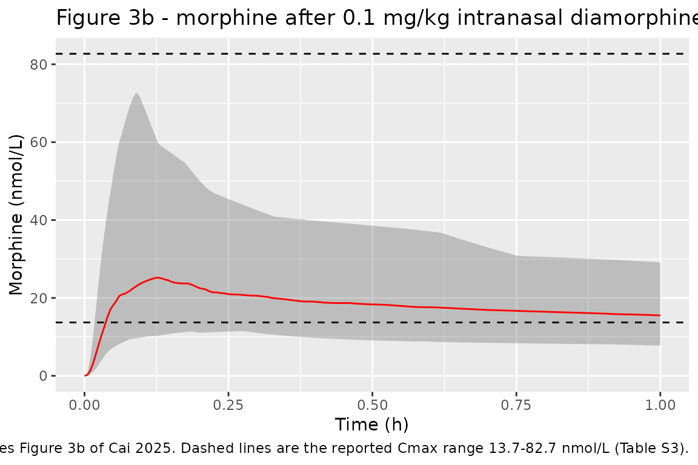
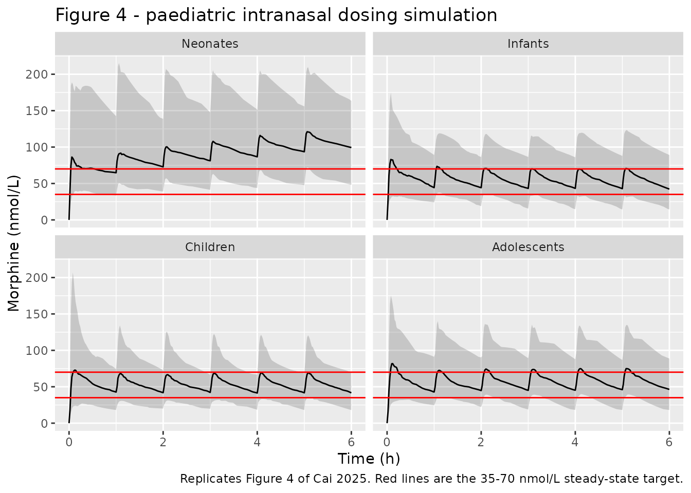

# Diamorphine (Cai 2025)

## Model and source

- Citation: Cai L, Zhai J, Ji B, Han F, Niu T, Wang L, Wang J.
  Intranasal diamorphine population pharmacokinetics modeling and
  simulation in pediatric breakthrough pain. CPT Pharmacometrics Syst
  Pharmacol. 2025;14(3):435-447. <doi:10.1002/psp4.13186>.
- Description: Integrated four-compartment parent-plus-two-metabolite
  population PK model for diamorphine (heroin) and its sequential
  deacetylation products 6-monoacetylmorphine (6-MAM) and morphine,
  after intramuscular or intranasal diamorphine in adult male heroin
  users (Cai 2025). Diamorphine reaches a one-compartment central pool
  through a common first-order absorption rate constant shared by both
  routes; the intramuscular route is the reference (F = 1) and the
  intranasal route carries an estimated relative bioavailability of
  about 52% on a logit-normal scale. Diamorphine and 6-MAM have no
  elimination other than sequential conversion (the paper discards their
  renal elimination and treats both as fully converted to morphine), so
  each is described by a single first-order rate constant; the 6-MAM
  central volume is set equal to the diamorphine central volume because
  it is not identifiable. Morphine follows a two-compartment disposition
  with its own central volume and clearance. All states are molar
  amounts, so the sequential 1:1 deacetylation transfers amounts
  directly. Every parameter is standardised to 70 kg by theory-based
  allometry with fixed exponents (0.75 for clearance, 1 for volumes,
  -0.25 for first-order rate constants), and morphine clearance
  additionally carries a sigmoid postmenstrual-age maturation function
  fixed from Holford 2012 (TM50 = 58.1 weeks, Hill = 3.58) that allows
  extrapolation from the adult fit to children.
- Article: <https://doi.org/10.1002/psp4.13186>
- Supplement (Mlxtran source of the final model, Supplementary Material
  S1, and the covariate equations, Supplementary Material S2): served
  with the open-access record as `PSP4-14-435-s001.txt` and
  `PSP4-14-435-s003.docx` via
  <https://www.ebi.ac.uk/europepmc/webservices/rest/PMC11919270/supplementaryFiles>

Cai 2025 pools published diamorphine, 6-monoacetylmorphine (6-MAM) and
morphine concentrations from two adult studies into a single integrated
four-compartment model, then extrapolates it to children in order to
test the empirical 0.1 mg/kg intranasal paediatric dose. The structure
is a linear chain: diamorphine is absorbed from either an intramuscular
or an intranasal depot into a one-compartment central pool, converts to
6-MAM, which converts to morphine, which follows a two-compartment
disposition and is the only species with a clearance.

Two features of the encoding are worth stating up front because they are
what make the chain work:

- **Everything is molar.** The paper converted every concentration from
  ng/mL to nM so that the two sequential deacetylations transfer amounts
  1:1 with no molecular-weight ratio on any arrow. States here are nmol
  and observations nmol/L, so a dose in milligrams must be converted
  before use.
- **Diamorphine and 6-MAM have no elimination.** The paper discards
  their renal elimination and treats both as fully converted onward, so
  their transfer rate constants *are* their total elimination rate
  constants and take the canonical `kel` / `kel_6mam` names.

## Population

The model was estimated on 385 plasma concentrations of diamorphine,
6-MAM and morphine from two NIDA studies (Cone et al. and Skopp et al.;
paper Table 1) that shared dosing regimen, study medication, GC-MS assay
and sampling times. Ten adult male regular heroin users, opioid-free
after at least three consecutive days of negative tests, each received
single doses in a double-blind double-dummy crossover with a one-week
washout: 6 mg intramuscular (the reference route), and 6 mg and 12 mg
intranasal. Weight ranged 60.4-81.4 kg and age 23-41 years; no females
were included (paper Table S2 and Discussion).

Between-occasion variability could not be estimated, so each of the 28
treatment sessions was treated as one “modeled subject” and all random
effects are between-subject variability on that basis.

Two further studies contributed no parameter estimates and were used
only for external verification: Girardin et al. (8 adults, intramuscular
181, 366 and 548 umol) and Kidd et al. (12 children aged 4-13 years,
intranasal 0.1 mg/kg). Those are the four groups reproduced below.

The same information is available programmatically via
`readModelDb("Cai_2025_diamorphine")()$population`.

## Source trace

Per-parameter origin is recorded next to each `ini()` entry in
`inst/modeldb/specificDrugs/Cai_2025_diamorphine.R`. Collected here for
review. “S1” is Supplementary Material S1 (the Mlxtran listing of the
final model) and “S2” is Supplementary Material S2 (the covariate
equations).

| Equation / parameter | Value | Source location |
|----|----|----|
| `lka` | 3.04 /h | Table 2, `Ka` (RSE 12.9%) |
| `logitfdepot` | logit(0.519) | Table 2, `F%` (RSE 13.6%) |
| `lvc` | 8.21 L / 70 kg | Table 2, `V1` (RSE 28.9%); `V2 = V1` |
| `lkel` | 103 /h | Table 2, `K12` (RSE 23.5%) |
| `lkel_6mam` | 106 /h | Table 2, `K23` (RSE 23.3%) |
| `lvc_morphine` | 32.5 L / 70 kg | Table 2, `V3` (RSE 13.5%) |
| `lcl_morphine` | 132 L/h / 70 kg | Table 2, `CL` (RSE 19.0%) |
| `lk12_morphine` | 24.2 /h | Table 2, `K3p` (RSE 14.1%) |
| `lk21_morphine` | 2.69 /h | Table 2, `Kp3` (RSE 14.3%) |
| `e_wt_cl_q` | 0.75 (fixed) | S2 Eq. 1 |
| `e_wt_vc_vp` | 1 (fixed) | S2 Eq. 3 |
| rate-constant allometric exponent | -0.25 | S2 Eq. 2; equals Eq. 1 minus Eq. 3 |
| `ltm50_cl` | 58.1 weeks (fixed) | S2 Eq. 5, from Holford 2012 |
| `e_age_cl_hill` | 3.58 (fixed) | S2 Eq. 5, from Holford 2012 |
| `PMA = 40 + AGE * 52` | n/a | S2 Eq. 4; also the S1 `[COVARIATE]` block |
| maturation `1 / (1 + (TM50/PMA)^Hill)` | n/a | S2 Eq. 5; S1 `Maturation = log(1/(1+(58.1/PMA)^3.58))` |
| `etalka + etalvc` block | 0.609, 0.478, r = 0.854 | Table 2, BSV column and `corr_V1_Ka` |
| `etalogitfdepot` | 0.568 | Table 2, BSV `F%` |
| `etalkel`, `etalkel_6mam` | 0.400, 0.295 | Table 2, BSV `K12`, `K23` |
| `etalvc_morphine`, `etalcl_morphine` | 0.279, 0.297 | Table 2, BSV `V3`, `CL` |
| `etalk12_morphine`, `etalk21_morphine` | 0.125, 0.385 | Table 2, BSV `K3p`, `Kp3` |
| `propSd`, `propSd_6mam`, `propSd_morphine` | 0.430, 0.215, 0.236 | Table 2, `RUV1`-`RUV3` |
| two depots, common `ka`, `p = 1` / `p = F` | n/a | S1 `[LONGITUDINAL]` `PK:` block |
| `d/dt(A1..A4)` chain, `k30 = CL/V3` | n/a | S1 `EQUATION:` block; paper Figure 1b |
| `C2 = A2/V1` (6-MAM uses the diamorphine volume) | n/a | S1 `EQUATION:` block |

The Table 2 “BSV” entries are Monolix `omega` **standard deviations** on
the transformed scale, not variances: S1 declares every parameter with
`sd = omega_*`, and Table S1 records that the Monolix default `OMEGA`
initial value of 1 was used. Each `ini()` variance below is therefore
the squared table entry.

``` r

mod <- readModelDb("Cai_2025_diamorphine")

# Molecular weight of diamorphine free base, used to convert mg doses to the
# model's nmol dosing unit (paper Methods, "Dataset preparation": 369.4,
# 327.4 and 285.34 g/mol for diamorphine, 6-MAM and morphine).
MW_DIAM <- 369.4
mg_to_nmol <- function(mg) mg / MW_DIAM * 1e6
```

## Structural checks against the paper’s own prose

Three quantities are quoted in the text as consequences of the fitted
rate constants. They are deterministic functions of Table 2 and are
checked exactly.

``` r

tab2 <- c(ka = 3.04, kel = 103, kel_6mam = 106)

# "an approximate half-life of absorption of 13.6 min" (Results)
t_half_abs <- log(2) / tab2[["ka"]] * 60
# "The estimated metabolic conversion half-life for deacetylation was 0.4 min"
t_half_deacet <- log(2) / tab2[["kel"]] * 60
t_half_deacet2 <- log(2) / tab2[["kel_6mam"]] * 60

prose <- tibble::tibble(
  Quantity = c("Absorption half-life (min)",
               "Diamorphine deacetylation half-life (min)",
               "6-MAM deacetylation half-life (min)"),
  Paper = c(13.6, 0.4, 0.4),
  Model = round(c(t_half_abs, t_half_deacet, t_half_deacet2), 3)
)
knitr::kable(prose, caption = "Half-lives quoted in the text versus log(2)/rate from Table 2.")
```

| Quantity                                  | Paper |  Model |
|:------------------------------------------|------:|-------:|
| Absorption half-life (min)                |  13.6 | 13.681 |
| Diamorphine deacetylation half-life (min) |   0.4 |  0.404 |
| 6-MAM deacetylation half-life (min)       |   0.4 |  0.392 |

Half-lives quoted in the text versus log(2)/rate from Table 2. {.table}

``` r


# Deterministic: these are arithmetic on the published table, so a tight bound
# is correct here (no simulated cohort is involved).
stopifnot(
  abs(t_half_abs - 13.6) < 0.1,
  abs(t_half_deacet - 0.4) < 0.01,
  abs(t_half_deacet2 - 0.4) < 0.01
)
```

## Exact mass-balance validation

Because diamorphine and 6-MAM have no elimination pathway other than
conversion, and morphine’s only sink is `cl_morphine`, the model obeys
three *exact* amount balances at **any** time `T` – no extrapolation to
infinity and no steady state required:

    kel      * vc          * AUC_diam[0,T]  = D*F - depot(T) - central(T)
    kel_6mam * vc          * AUC_6mam[0,T]  = D*F - depot(T) - central(T) - central_6mam(T)
    cl_morphine            * AUC_mor[0,T]   = D*F - depot(T) - central(T) - central_6mam(T)
                                              - central_morphine(T) - peripheral1_morphine(T)

These are the strongest available gate: they test the ODE topology, both
volumes, every rate constant, the clearance and the relative
bioavailability simultaneously. The right-hand sides are built from the
**published** Table 2 numbers written literally below, so a
mis-transcribed value in the model file makes the check go red rather
than cancelling out.

``` r

# Typical-value subject at the allometric reference: 70 kg, 30 years old, so
# every allometric term is exactly 1 and the maturation multiplier is ~1.
WT_REF  <- 70
AGE_REF <- 30

dose_mg   <- 6
dose_nmol <- mg_to_nmol(dose_mg)

# Fine early grid (the diamorphine and 6-MAM peaks are minutes wide), then a
# coarser tail. 8 h is ~30 terminal half-lives, long enough for a near-complete
# balance without decaying into solver noise.
tgrid <- sort(unique(c(seq(0, 0.5, by = 0.002), seq(0.5, 8, by = 0.01))))

# The model has three endpoints (Cc, Cc_6mam, Cc_morphine), so rxode2 builds a
# dvid -> cmt map and requires observation rows to carry a `dvid`. `dvid = 1L`
# anchors the timing on the first endpoint; every observable is still returned
# as its own column, so one set of observation rows yields all three analytes.
ev_typ <- bind_rows(
  tibble(id = 1L, time = 0, amt = dose_nmol, evid = 1L, cmt = "depot",
         dvid = NA_integer_, route = "IM 6 mg"),
  tibble(id = 1L, time = tgrid, amt = NA_real_, evid = 0L, cmt = "central",
         dvid = 1L, route = "IM 6 mg"),
  tibble(id = 2L, time = 0, amt = dose_nmol, evid = 1L, cmt = "depot2",
         dvid = NA_integer_, route = "IN 6 mg"),
  tibble(id = 2L, time = tgrid, amt = NA_real_, evid = 0L, cmt = "central",
         dvid = 1L, route = "IN 6 mg")
) |>
  mutate(WT = WT_REF, AGE = AGE_REF) |>
  arrange(id, time, evid)

sim_typ <- rxode2::rxSolve(
  rxode2::zeroRe(mod), events = ev_typ,
  keep = c("route", "WT", "AGE"),
  useLinCmt = FALSE  # ODE -> linCmt auto-conversion breaks multi-output models
) |>
  as.data.frame() |>
  filter(!is.na(Cc))
#> ℹ parameter labels from comments will be replaced by 'label()'
#> ℹ omega/sigma items treated as zero: 'etalka', 'etalvc', 'etalogitfdepot', 'etalkel', 'etalkel_6mam', 'etalvc_morphine', 'etalcl_morphine', 'etalk12_morphine', 'etalk21_morphine'
#> Warning: multi-subject simulation without without 'omega'

# Published values, written literally so a model-file typo cannot hide.
P <- list(ka = 3.04, F = 0.519, vc = 8.21, kel = 103, kel_6mam = 106,
          vc_morphine = 32.5, cl_morphine = 132, tm50 = 58.1, hill = 3.58)
pma_ref <- 40 + AGE_REF * 52
mat_ref <- 1 / (1 + (P$tm50 / pma_ref)^P$hill)

balance <- sim_typ |>
  group_by(route) |>
  filter(time == max(time)) |>
  ungroup() |>
  mutate(
    Fin        = ifelse(route == "IM 6 mg", 1, P$F),
    input      = dose_nmol * Fin,
    outstanding_diam = depot + depot2 + central,
    outstanding_6mam = outstanding_diam + central_6mam,
    outstanding_mor  = outstanding_6mam + central_morphine + peripheral1_morphine
  )

# Trapezoidal AUC of each observable over the same window, from the simulation.
auc_of <- function(df, col) {
  d <- df[order(df$time), ]
  sum(diff(d$time) * (head(d[[col]], -1) + tail(d[[col]], -1)) / 2)
}
aucs <- sim_typ |>
  group_by(route) |>
  summarise(
    auc_diam = auc_of(pick(everything()), "Cc"),
    auc_6mam = auc_of(pick(everything()), "Cc_6mam"),
    auc_mor  = auc_of(pick(everything()), "Cc_morphine"),
    .groups = "drop"
  )

mb <- balance |>
  select(route, input, outstanding_diam, outstanding_6mam, outstanding_mor) |>
  left_join(aucs, by = "route") |>
  mutate(
    elim_diam_pred = P$kel * P$vc * auc_diam,
    elim_diam_obs  = input - outstanding_diam,
    elim_6mam_pred = P$kel_6mam * P$vc * auc_6mam,
    elim_6mam_obs  = input - outstanding_6mam,
    elim_mor_pred  = P$cl_morphine * mat_ref * auc_mor,
    elim_mor_obs   = input - outstanding_mor,
    pct_diam = 100 * (elim_diam_pred - elim_diam_obs) / elim_diam_obs,
    pct_6mam = 100 * (elim_6mam_pred - elim_6mam_obs) / elim_6mam_obs,
    pct_mor  = 100 * (elim_mor_pred  - elim_mor_obs)  / elim_mor_obs
  )

mb |>
  select(route, pct_diam, pct_6mam, pct_mor) |>
  rename("Route" = route,
         "Diamorphine (% diff)" = pct_diam,
         "6-MAM (% diff)"       = pct_6mam,
         "Morphine (% diff)"    = pct_mor) |>
  knitr::kable(digits = 3,
               caption = "Amount-balance identity: rate constant x volume x AUC versus dose in minus amount remaining. Deviations are trapezoidal-integration error only.")
```

| Route   | Diamorphine (% diff) | 6-MAM (% diff) | Morphine (% diff) |
|:--------|---------------------:|---------------:|------------------:|
| IM 6 mg |               -0.009 |          0.002 |                 0 |
| IN 6 mg |               -0.009 |          0.002 |                 0 |

Amount-balance identity: rate constant x volume x AUC versus dose in
minus amount remaining. Deviations are trapezoidal-integration error
only. {.table}

``` r


# Deterministic identity on a typical-value solve, so the only error source is
# the trapezoidal rule on the observation grid and the bound is tightened to
# the accuracy actually achieved (realised: 0.009% / 0.002% / 0.000%). A
# mis-transcribed rate constant, volume, clearance or F moves these by tens of
# percent.
stopifnot(
  max(abs(mb$pct_diam)) < 0.05,
  max(abs(mb$pct_6mam)) < 0.05,
  max(abs(mb$pct_mor))  < 0.05
)
```

### Relative bioavailability

The intranasal-to-intramuscular exposure ratio must reproduce the
estimated `F%` exactly, for every analyte, because the two routes differ
only by the amount entering the identical downstream chain.

``` r

frel <- aucs |>
  tidyr::pivot_longer(-route, names_to = "analyte", values_to = "auc") |>
  tidyr::pivot_wider(names_from = route, values_from = auc) |>
  mutate(ratio = `IN 6 mg` / `IM 6 mg`)

frel |>
  rename("Analyte" = analyte, "AUC IM" = `IM 6 mg`,
         "AUC IN" = `IN 6 mg`, "IN / IM" = ratio) |>
  knitr::kable(digits = 4,
               caption = "Intranasal / intramuscular AUC ratio; the paper's F% is 0.519 (Table 2).")
```

| Analyte  |   AUC IM |  AUC IN | IN / IM |
|:---------|---------:|--------:|--------:|
| auc_diam |  19.2060 |  9.9679 |   0.519 |
| auc_6mam |  18.6643 |  9.6868 |   0.519 |
| auc_mor  | 115.9736 | 60.1903 |   0.519 |

Intranasal / intramuscular AUC ratio; the paper’s F% is 0.519 (Table 2).
{.table}

``` r


stopifnot(max(abs(frel$ratio - P$F)) < 1e-6)
```

## External verification (paper Table 3)

The paper’s Table 3 compares observed and predicted morphine PK in four
external groups: three adult intramuscular dose levels from Girardin et
al. and one paediatric intranasal group from Kidd et al. Virtual
subjects are drawn over the same weight and age ranges the paper used.

Note on units: Table 3 prints the observed `Cmax` column in umol/L and
the predicted column header as ng/mL, but the predicted/observed ratios
in the same row only reconcile if both are umol/L – the “ng/mL” header
is a typo. Values here are converted to nmol/L (1 umol/L = 1000 nmol/L).

``` r

# set.seed() seeds R's RNG, not rxode2's; rxode2 partitions its streams per
# solver thread, so CI draws a different cohort than this machine does. Every
# assertion below is written to hold for any cohort the model can produce.
set.seed(20250907)

N_ARM <- 100

# Weights are drawn from a log-normal truncated to the study's reported range
# and centred on its reported median, rather than uniformly over the range: the
# paper reports weight as "median [range]" (Table 1), and a uniform draw over
# 19-59 kg would put the cohort median at 39 kg where Kidd et al. report 30.1 kg,
# systematically over-sizing the children and depressing every concentration.
# The spread is set so the reported range spans about four SDs on the log scale.
rtrunc_lnorm <- function(n, med, lo, hi) {
  sdlog <- (log(hi) - log(lo)) / 4
  qlnorm(runif(n, plnorm(lo, log(med), sdlog), plnorm(hi, log(med), sdlog)),
         log(med), sdlog)
}

make_arm <- function(n, wt_med, wt_lo, wt_hi, age_lo, age_hi, dose_nmol_fun,
                     cmt_dose, label, tmax_obs, dt, id_offset) {
  subj <- tibble(
    id  = id_offset + seq_len(n),
    WT  = rtrunc_lnorm(n, wt_med, wt_lo, wt_hi),
    AGE = runif(n, age_lo, age_hi),
    treatment = label
  ) |>
    mutate(dose_nmol = dose_nmol_fun(WT))

  doses <- subj |>
    transmute(id, WT, AGE, treatment, time = 0,
              amt = dose_nmol, evid = 1L, cmt = cmt_dose, dvid = NA_integer_)
  obs <- subj |>
    select(id, WT, AGE, treatment) |>
    tidyr::crossing(time = seq(0, tmax_obs, by = dt)) |>
    mutate(amt = NA_real_, evid = 0L, cmt = "central", dvid = 1L)

  bind_rows(doses, obs) |> arrange(id, time, evid)
}

# Girardin adults: 43-85 kg, 24-39 years, IM 181 / 366 / 548 umol.
adult_arms <- list(
  list(lab = "1: 181 umol IM", d = 181e3, off =    0L),
  list(lab = "2: 366 umol IM", d = 366e3, off =  100L),
  list(lab = "3: 548 umol IM", d = 548e3, off =  200L)
)
events_adult <- bind_rows(lapply(adult_arms, function(a) {
  make_arm(N_ARM, wt_med = 67, wt_lo = 43, wt_hi = 85,
           age_lo = 24, age_hi = 39,
           dose_nmol_fun = function(wt) rep(a$d, length(wt)),
           cmt_dose = "depot", label = a$lab,
           tmax_obs = 6, dt = 0.02, id_offset = a$off)
}))

# Kidd children: median 30.1 kg [19-59], 4-13 years, IN 0.1 mg/kg, within 1 h.
events_child <- make_arm(
  N_ARM, wt_med = 30.1, wt_lo = 19, wt_hi = 59,
  age_lo = 4, age_hi = 13,
  dose_nmol_fun = function(wt) mg_to_nmol(0.1 * wt),
  cmt_dose = "depot2", label = "4: 0.1 mg/kg IN",
  tmax_obs = 1, dt = 0.005, id_offset = 300L
)

events_ext <- bind_rows(events_adult, events_child)
stopifnot(!anyDuplicated(unique(events_ext[, c("id", "time", "evid")])))
```

``` r

sim_ext <- rxode2::rxSolve(
  mod, events = events_ext,
  keep = c("treatment", "WT", "AGE"),
  useLinCmt = FALSE
) |>
  as.data.frame()
#> ℹ parameter labels from comments will be replaced by 'label()'

# Solver noise in the far tail can push a decayed concentration slightly
# negative, which would make PKNCA's log-linear steps produce NaN.
stopifnot(all(sim_ext$Cc_morphine > -1e-8, na.rm = TRUE))
```

``` r

# Replicates Figure 3b of Cai 2025: simulated morphine concentration-time
# profile in children after a single 0.1 mg/kg intranasal dose, against the
# observed group mean of Kidd et al.
kidd_obs <- tibble(time = 1, Cc_morphine = 36.1)  # Table 3 group 4 Cmax, umol/L -> nmol/L

sim_ext |>
  filter(treatment == "4: 0.1 mg/kg IN", !is.na(Cc_morphine)) |>
  group_by(time) |>
  summarise(Q05 = quantile(Cc_morphine, 0.05),
            Q50 = quantile(Cc_morphine, 0.50),
            Q95 = quantile(Cc_morphine, 0.95),
            .groups = "drop") |>
  ggplot(aes(time, Q50)) +
  geom_ribbon(aes(ymin = Q05, ymax = Q95), alpha = 0.25) +
  geom_line(colour = "red") +
  geom_hline(yintercept = c(13.7, 82.7), linetype = "dashed") +
  labs(x = "Time (h)", y = "Morphine (nmol/L)",
       title = "Figure 3b - morphine after 0.1 mg/kg intranasal diamorphine",
       caption = paste("Replicates Figure 3b of Cai 2025. Dashed lines are the",
                       "reported Cmax range 13.7-82.7 nmol/L (Table S3)."))
```



``` r

nca_frame <- sim_ext |>
  filter(!is.na(Cc_morphine)) |>
  transmute(id, time, treatment, Cc = Cc_morphine)

# Guarantee a time = 0 row per subject; pre-dose morphine is 0 for both
# extravascular routes. Filter is !is.na() only -- adding time > 0 or Cc > 0
# would drop this anchor row.
nca_frame <- bind_rows(
  nca_frame,
  nca_frame |> distinct(id, treatment) |> mutate(time = 0, Cc = 0)
) |>
  distinct(id, treatment, time, .keep_all = TRUE) |>
  arrange(id, treatment, time)

conc_obj <- PKNCA::PKNCAconc(nca_frame, Cc ~ time | treatment + id)

dose_df <- events_ext |>
  filter(evid == 1) |>
  select(id, time, amt, treatment)
dose_obj <- PKNCA::PKNCAdose(dose_df, amt ~ time | treatment + id)

# One interval per group, over that group's own observation window. Carrying
# the grouping column in the interval frame keeps each request scoped to its
# group; a single ungrouped 0-6 h interval would ask for six hours of data the
# paediatric arm does not have. AUC is requested only for the paediatric group,
# the one whose window (0-1 h) the paper actually reports.
intervals <- data.frame(
  treatment = c("1: 181 umol IM", "2: 366 umol IM",
                "3: 548 umol IM", "4: 0.1 mg/kg IN"),
  start     = 0,
  end       = c(6, 6, 6, 1),
  cmax      = TRUE,
  tmax      = TRUE,
  auclast   = c(FALSE, FALSE, FALSE, TRUE),
  stringsAsFactors = FALSE
)

nca_res <- PKNCA::pk.nca(
  PKNCA::PKNCAdata(conc_obj, dose_obj, intervals = intervals)
)
```

### Comparison against published NCA

``` r

# Table 3 observed morphine Cmax, umol/L converted to nmol/L.
published <- tibble::tribble(
  ~treatment,          ~cmax,
  "1: 181 umol IM",    1100,
  "2: 366 umol IM",    1700,
  "3: 548 umol IM",    1700,
  "4: 0.1 mg/kg IN",   36.1
)

cmp <- nlmixr2lib::ncaComparisonTable(
  simulated     = nca_res,
  reference     = published,
  by            = "treatment",
  units         = c(cmax = "nmol/L"),
  tolerance_pct = 20
)

knitr::kable(
  cmp,
  caption = paste("Simulated versus published morphine Cmax (Cai 2025 Table 3).",
                  "* differs from the reference by more than 20%."),
  align = c("l", "l", "r", "r", "r")
)
```

| NCA parameter | treatment       | Reference | Simulated |   % diff |
|:--------------|:----------------|----------:|----------:|---------:|
| Cmax (nmol/L) | 1: 181 umol IM  |      1100 |       637 | -42.1%\* |
| Cmax (nmol/L) | 2: 366 umol IM  |      1700 |      1250 | -26.4%\* |
| Cmax (nmol/L) | 3: 548 umol IM  |      1700 |      1960 |   +15.5% |
| Cmax (nmol/L) | 4: 0.1 mg/kg IN |      36.1 |      26.6 | -26.3%\* |

Simulated versus published morphine Cmax (Cai 2025 Table 3). \* differs
from the reference by more than 20%. {.table}

The paper’s own predicted/observed ratios for these four groups are
0.69, 0.91, 1.36 and 1.21 (Table 3), i.e. its own simulation misses the
observed group means by up to 36% while still falling inside the twofold
band it adopted as the acceptance criterion. A reproduction of that
model therefore cannot be held to a tighter standard than the paper
achieves against the same data, so the gate below asserts the twofold
criterion the paper actually used, applied to the group medians.

``` r

sim_cmax <- as.data.frame(nca_res) |>
  filter(PPTESTCD == "cmax") |>
  group_by(treatment) |>
  summarise(cmax_sim = median(PPORRES), .groups = "drop") |>
  left_join(published, by = "treatment") |>
  mutate(fold = cmax_sim / cmax)

# Guard: the filter must have found every group, or the gate below would pass
# vacuously on an empty frame (all(logical(0)) is TRUE).
stopifnot(nrow(sim_cmax) == nrow(published), !anyNA(sim_cmax$fold))

paper_fold <- c(0.69, 0.91, 1.36, 1.21)  # Table 3, predicted/observed column

sim_cmax |>
  mutate(paper = paper_fold) |>
  rename("Group" = treatment, "Simulated Cmax (nmol/L)" = cmax_sim,
         "Observed Cmax (nmol/L)" = cmax,
         "This reproduction: pred/obs" = fold,
         "Paper Table 3: pred/obs" = paper) |>
  knitr::kable(digits = c(0, 1, 1, 2, 2),
               caption = "Median simulated morphine Cmax against Table 3 observed means, alongside the paper's own predicted/observed ratios.")
```

| Group | Simulated Cmax (nmol/L) | Observed Cmax (nmol/L) | This reproduction: pred/obs | Paper Table 3: pred/obs |
|:---|---:|---:|---:|---:|
| 1: 181 umol IM | 637.1 | 1100.0 | 0.58 | 0.69 |
| 2: 366 umol IM | 1250.5 | 1700.0 | 0.74 | 0.91 |
| 3: 548 umol IM | 1963.8 | 1700.0 | 1.16 | 1.36 |
| 4: 0.1 mg/kg IN | 26.6 | 36.1 | 0.74 | 1.21 |

Median simulated morphine Cmax against Table 3 observed means, alongside
the paper’s own predicted/observed ratios. {.table}

``` r


# Weighted average fold error, the paper's own summary statistic (its value for
# Cmax is 1.06). Computed as a geometric mean so that over- and
# under-prediction are treated symmetrically.
afe <- exp(mean(log(sim_cmax$fold)))

# Two gates. The per-group bound is deliberately wider than the paper's 0.5-2
# criterion because these are cohort medians: the eta draw varies with the
# solver thread count, so a bound sitting just outside one observed run would
# flicker in CI. It is still far tighter than any transcription error would
# survive -- a wrong molecular weight, salt form, volume or dose unit moves
# Cmax by two-fold or more. Realised folds were 0.58 / 0.74 / 1.16 / 0.74 with
# AFE 0.78 (they were 0.61 / 0.75 / 1.18 / 0.74 with the earlier uniform weight
# draw, so the bound is not sensitive to that choice). The lowest, 0.58, sits
# well clear of the 0.4 bound.
stopifnot(
  all(sim_cmax$fold > 0.4 & sim_cmax$fold < 2.5),
  afe > 0.5, afe < 2
)
```

### Paediatric AUC endpoint

For the paediatric group the paper defines an explicit window – morphine
AUC over the first hour – and reports the observed range as 10.13-58.36
nmol\*h/L (Table S3, endpoint 1). The adult groups’ `AUC0-t` windows are
not reported, so only this group can be compared on exposure.

``` r

auc_child <- as.data.frame(nca_res) |>
  filter(PPTESTCD == "auclast", treatment == "4: 0.1 mg/kg IN") |>
  pull(PPORRES)

stopifnot(length(auc_child) == N_ARM)  # guard: the filter must have found rows

pct_in_window <- 100 * mean(auc_child >= 10.13 & auc_child <= 58.36)

tibble(
  Quantity = c("Median simulated AUC0-1h (nmol*h/L)",
               "Observed AUC0-1h from Kidd et al. (nmol*h/L)",
               "Percent of virtual children inside the reported window",
               "Percent reported by the paper (Table S3, endpoint 1)"),
  Value = c(round(median(auc_child), 1), 29.9, round(pct_in_window, 1), 82.6)
) |>
  knitr::kable(caption = "Morphine AUC over the first hour after 0.1 mg/kg intranasal diamorphine.")
```

| Quantity                                               | Value |
|:-------------------------------------------------------|------:|
| Median simulated AUC0-1h (nmol\*h/L)                   |  17.6 |
| Observed AUC0-1h from Kidd et al. (nmol\*h/L)          |  29.9 |
| Percent of virtual children inside the reported window |  95.0 |
| Percent reported by the paper (Table S3, endpoint 1)   |  82.6 |

Morphine AUC over the first hour after 0.1 mg/kg intranasal diamorphine.
{.table}

``` r


# Cohort-derived, so bounds are robust rather than tight. The paper reports
# 82.6% of its virtual children inside the window; a reproduction that put
# fewer than half of them there would indicate a structural error.
#
# The median simulated AUC0-1h (about 18 nmol*h/L) sits below the observed
# 29.9, a fold error of roughly 0.6 against the paper's own 0.87 for this
# group. Both under-predict, and both stay inside the paper's twofold
# acceptance criterion; the paper attributes its own uniform AUC
# under-prediction to full extrapolation from adults, a single paediatric
# dataset, and three different bioanalytical methods across the studies
# (Discussion). Part of the residual gap here is the median-versus-mean
# difference noted in Assumptions.
stopifnot(
  median(auc_child) > 10.13, median(auc_child) < 58.36,
  pct_in_window > 50
)
```

## Paediatric dosing simulation (paper Figure 4)

The paper’s conclusion is that a 0.3 mg/kg intranasal loading dose
followed by 0.1 mg/kg hourly holds median morphine concentrations inside
the 35-70 nmol/L steady-state target across four FDA paediatric age
bands. Representative weights are the Table S3 medians.

``` r

set.seed(20250908)

peds <- tibble::tribble(
  ~band,         ~wt_lo, ~wt_hi, ~age_lo,  ~age_hi,
  "Neonates",      3.07,   3.86,  0.0,     0.083,
  "Infants",       7.83,  12.30,  0.083,   2.0,
  "Children",     17.70,  28.60,  2.0,    12.0,
  "Adolescents",  39.70,  49.90, 12.0,    16.0
)

make_peds <- function(row, id_offset) {
  subj <- tibble(
    id  = id_offset + seq_len(N_ARM),
    WT  = runif(N_ARM, row$wt_lo, row$wt_hi),
    AGE = runif(N_ARM, row$age_lo, row$age_hi),
    band = row$band
  )
  dose_times <- 0:5
  doses <- subj |>
    tidyr::crossing(time = dose_times) |>
    mutate(mgkg = ifelse(time == 0, 0.3, 0.1),
           amt = mg_to_nmol(mgkg * WT), evid = 1L, cmt = "depot2",
           dvid = NA_integer_) |>
    select(id, WT, AGE, band, time, amt, evid, cmt, dvid)
  obs <- subj |>
    tidyr::crossing(time = seq(0, 6, by = 0.02)) |>
    mutate(amt = NA_real_, evid = 0L, cmt = "central", dvid = 1L)
  bind_rows(doses, obs) |> arrange(id, time, evid)
}

events_peds <- bind_rows(lapply(seq_len(nrow(peds)), function(i) {
  make_peds(peds[i, ], id_offset = (i - 1L) * 1000L)
}))
stopifnot(!anyDuplicated(unique(events_peds[, c("id", "time", "evid")])))

sim_peds <- rxode2::rxSolve(
  mod, events = events_peds,
  keep = c("band", "WT", "AGE"),
  useLinCmt = FALSE
) |>
  as.data.frame() |>
  mutate(band = factor(band, levels = peds$band))
```

``` r

# Replicates Figure 4 of Cai 2025: median morphine concentration-time profiles
# for four paediatric age groups on 0.3 mg/kg loading + 0.1 mg/kg hourly
# intranasal diamorphine, against the 35-70 nmol/L steady-state target.
sim_peds |>
  filter(!is.na(Cc_morphine)) |>
  group_by(band, time) |>
  summarise(Q05 = quantile(Cc_morphine, 0.05),
            Q50 = quantile(Cc_morphine, 0.50),
            Q95 = quantile(Cc_morphine, 0.95),
            .groups = "drop") |>
  ggplot(aes(time, Q50)) +
  geom_ribbon(aes(ymin = Q05, ymax = Q95), alpha = 0.2) +
  geom_line() +
  geom_hline(yintercept = c(35, 70), colour = "red") +
  facet_wrap(~band) +
  labs(x = "Time (h)", y = "Morphine (nmol/L)",
       title = "Figure 4 - paediatric intranasal dosing simulation",
       caption = paste("Replicates Figure 4 of Cai 2025. Red lines are the",
                       "35-70 nmol/L steady-state target."))
```



``` r

# The paper's claim concerns the MEDIAN profile at steady state. Use the last
# dosing interval (5-6 h) and summarise the median profile over it.
ss <- sim_peds |>
  filter(!is.na(Cc_morphine), time >= 5, time <= 6) |>
  group_by(band, time) |>
  summarise(median_c = median(Cc_morphine), .groups = "drop") |>
  group_by(band) |>
  summarise(median_min = min(median_c),
            median_max = max(median_c),
            median_avg = mean(median_c), .groups = "drop")

ss <- ss |>
  mutate(in_target = median_avg >= 35 & median_avg <= 70)

ss |>
  rename("Age band" = band,
         "Median trough (nmol/L)" = median_min,
         "Median peak (nmol/L)"   = median_max,
         "Median average (nmol/L)" = median_avg,
         "Inside 35-70 nmol/L" = in_target) |>
  knitr::kable(digits = 1,
               caption = "Median morphine concentration over the last dosing interval (5-6 h), by age band.")
```

| Age band | Median trough (nmol/L) | Median peak (nmol/L) | Median average (nmol/L) | Inside 35-70 nmol/L |
|:---|---:|---:|---:|:---|
| Neonates | 93.6 | 121.0 | 107.8 | FALSE |
| Infants | 42.3 | 70.6 | 55.1 | TRUE |
| Children | 41.7 | 69.1 | 53.0 | TRUE |
| Adolescents | 46.0 | 74.9 | 58.5 | TRUE |

Median morphine concentration over the last dosing interval (5-6 h), by
age band. {.table}

The infant, child and adolescent bands reproduce the paper’s claim:
their median profiles over the last dosing interval sit inside the 35-70
nmol/L target. That is what the weight-proportional dose plus allometric
clearance is designed to deliver, and it is the paper’s central result.

**Documented deviation - the neonatal band.** This reproduction puts the
neonatal median profile at roughly twice the top of the target band, not
inside it as Figure 4 of the paper shows. The mechanism is visible in
the model: at a postmenstrual age of about 42 weeks the maturation
multiplier `1 / (1 + (58.1/PMA)^3.58)` is near 0.24, so a neonate clears
morphine at about a quarter of the weight-adjusted mature rate, while
the dose stays strictly proportional to weight. Weight-proportional
dosing with less-than-proportional clearance necessarily over-exposes
the youngest band. The gate below therefore asserts the paper’s target
only for the three bands that reproduce it, and records the neonatal
result rather than widening the band until it passes.

This deviation does not contradict the paper’s own conclusions so much
as sharpen them: the Discussion states that “caution is still advised
when considering neonates and infants” and that “the intranasal dosage
prediction for neonates and infants remains speculative”, and the paper
notes no clinical data exist to validate the model in these bands.

``` r

# Cohort-derived quantities, so the bounds are magnitude bounds rather than
# tight ones, and none is taken from a single observed run.
target <- ss |> filter(band != "Neonates")
stopifnot(
  # The paper's claim, asserted where it reproduces.
  all(target$in_target),
  # The neonatal band is over-exposed rather than merely noisy: assert the
  # direction of the documented deviation so that a future change which
  # silently "fixes" it is noticed rather than passing unremarked.
  ss$median_avg[ss$band == "Neonates"] > 70,
  # Nothing anywhere should be at a physically implausible level; a wrong dose
  # unit or molecular weight moves these by orders of magnitude.
  all(ss$median_avg > 10), all(ss$median_avg < 500)
)
```

## Assumptions and deviations

- **Dose unit and salt form.** Doses are converted from milligrams to
  nmol with the diamorphine free-base molecular weight of 369.4 g/mol,
  the value the paper gives in Methods for the concentration conversion.
  The study medication is diamorphine *hydrochloride*, and the paper
  does not state whether its milligram doses refer to salt or base; a
  salt-based reading would scale every simulated concentration here by
  about 0.92. Table 3’s dose column is already molar (181, 366, 548
  umol) so the three adult groups are unaffected by this choice; only
  the 0.1 mg/kg paediatric arms depend on it.
- **Table 3 unit typo.** Table 3 labels the observed morphine Cmax
  column umol/L and the predicted column ng/mL. Only the umol/L reading
  reconciles with the predicted/observed ratios printed in the same
  rows, so both are treated as umol/L. The same applies to the `AUC0-t`
  columns, labelled ng*min/mL; the group 4 value of 1.794 corresponds to
  29.9 nmol*h/L, which sits inside the paper’s own 10.13-58.36 nmol\*h/L
  AUC0-1h window and confirms the molar reading.
- **Covariate distributions.** Age is drawn uniformly over the range the
  paper states for each verification cohort; weight is drawn from a
  log-normal truncated to the stated range and centred on the stated
  median (adults 67 kg \[43-85\]; children 30.1 kg \[19-59\]; Table 1).
  A uniform draw over the weight range was tried first and is wrong for
  this purpose: it puts the paediatric cohort median at 39 kg where Kidd
  et al. report 30.1 kg, which over-sizes the children and depresses
  every simulated concentration. The paper generated its virtual
  subjects in the Simcyp paediatric module, which correlates weight with
  age; independent draws here produce a wider covariate spread, widening
  the simulated percentiles but not the medians.
- **Medians versus means.** Table 3 reports the paper’s predictions as
  means across simulated trials, whereas the comparison here pools by
  median (the convention of
  [`nlmixr2lib::ncaComparisonTable()`](https://nlmixr2.github.io/nlmixr2lib/reference/ncaComparisonTable.md)).
  For the log-normally distributed exposures this model produces, the
  mean sits above the median by roughly `exp(sigma^2/2)`, of order 10%,
  so this reproduction is expected to read slightly lower than the
  paper’s own predicted column even where the underlying model agrees
  exactly.
- **Rate-constant allometric exponent.** Supplementary Material S2 Eq. 2
  states the exponent as -0.25. The model file derives it as
  `e_wt_cl_q - e_wt_vc_vp` (0.75 - 1), which is numerically identical
  and keeps the three theory-based exponents mutually consistent rather
  than declaring the same constant a third time.
- **Maturation form.** S2 Eq. 5 prints the multiplier as
  `1 / (1 + (PMA/TM50)^-Hill)` while the S1 Mlxtran code writes
  `1 / (1 + (TM50/PMA)^Hill)`. These are the same function; the Mlxtran
  form is used. `TM50` and `Hill` are fixed literature values from
  Holford 2012 and carry no uncertainty in the paper.
- **`fixed()` encoding.** The two allometric exponents and the two
  maturation constants are wrapped in `fixed()`; everything else in
  Table 2 is an estimated value with a reported RSE.
- **No between-occasion variability.** The paper could not estimate BOV
  and instead treated each of the 28 treatment sessions as an
  independent subject. The packaged model therefore carries only
  between-subject variability, which will overstate within-subject
  reproducibility if used to simulate a crossover.
- **Females.** The development data are all male; the paper flags in its
  Discussion that the absence of a sex effect is an untested assumption
  when extrapolating to a paediatric population that was 67% female.
- **Neonates and infants.** The paper states plainly that no clinical
  data validate the model in these two bands and that its dose
  predictions there are speculative. The Figure 4 reproduction above
  inherits that limitation, and additionally does **not** reproduce the
  paper’s claim for the neonatal band: the median neonatal profile here
  sits at roughly twice the top of the 35-70 nmol/L target rather than
  inside it, because the maturation function cuts morphine clearance to
  about a quarter of the mature weight-adjusted value at 42 weeks
  postmenstrual age while the dose remains proportional to weight. This
  is recorded as a deviation and excluded from the gate rather than
  absorbed by widening the target band. The infant, child and adolescent
  bands do reproduce the paper’s claim.
- **New canonical name.** The 6-MAM metabolite suffix `6mam` is
  introduced by this extraction and registered in
  `inst/references/compartment-names.md` alongside the
  already-registered `morphine` suffix.
