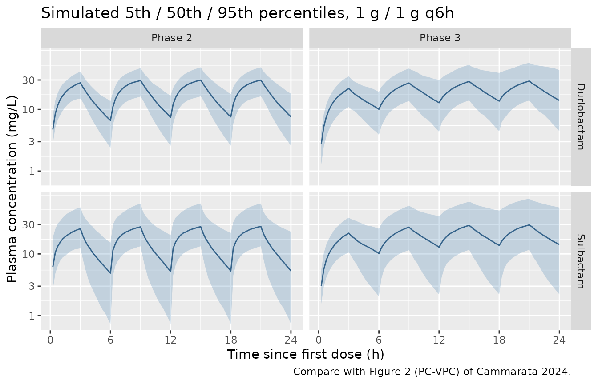
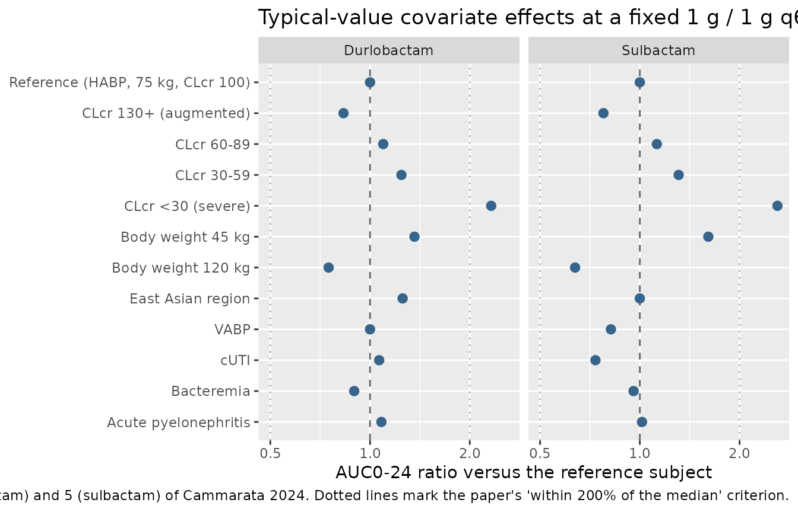
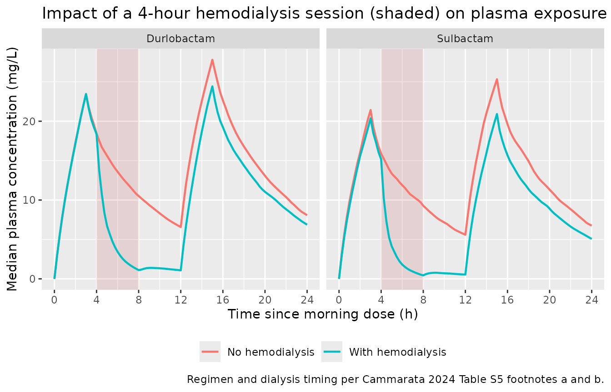

# Sulbactam-durlobactam (Cammarata 2024)

## Model and source

- Citation: Cammarata AP, Safir MC, Trang M, Larson KB, O’Donnell JP,
  Bhavnani SM, Rubino CM. Population pharmacokinetic analyses for
  sulbactam-durlobactam using Phase 1, 2, and 3 data. Antimicrob Agents
  Chemother. 2024;69(1):e00485-24. <doi:10.1128/aac.00485-24>. Plasma
  model parameters from Table 1, hemodialysis sub-model parameters from
  Table S4, and epithelial lining fluid sub-model parameters from Table
  S6 of the supplement.

- Article: <https://doi.org/10.1128/aac.00485-24> (open access, CC BY
  4.0)

- Supplement (Tables S1-S13, Figures S1-S19): `aac.00485-24-s0001.pdf`,
  linked from the article page

Sulbactam-durlobactam (XACDURO) is a beta-lactam /
beta-lactamase-inhibitor combination approved in the United States for
hospital-acquired and ventilator-associated bacterial pneumonia caused
by susceptible isolates of the *Acinetobacter baumannii-calcoaceticus*
complex. Durlobactam (formerly ETX2514) inhibits Class A, C, and D
beta-lactamases and restores sulbactam activity against
multidrug-resistant *A. baumannii*.

### Structure

Both analytes are two-compartment with linear, first-order elimination,
and the two subsystems were fitted simultaneously as a single
four-compartment model (NONMEM compartments 1-2 for durlobactam, 3-4 for
sulbactam). In the packaged file durlobactam carries the unsuffixed
canonical names (`central`, `peripheral1`, `lcl`, `lvc`, …) and
sulbactam carries the registered sibling-drug suffix `_sbt`.

Total clearance of each drug is the sum of a renal and a non-renal arm:

``` math
\mathrm{CL_R} = \mathrm{CL}\cdot \mathrm{FE}\cdot\left(\frac{\mathrm{CLcr}}{100}\right)^{\theta_{\mathrm{CLcr}}},
\qquad
\mathrm{CL_{NR}} = \mathrm{CL}\cdot(1-\mathrm{FE})
```

``` math
\mathrm{CL_T} = (\mathrm{CL_R}+\mathrm{CL_{NR}})
  \cdot\left(\frac{\mathrm{WT}}{75}\right)^{\theta_{\mathrm{WT}}}
  \cdot\prod_k \left(1+\theta_k\,X_k\right)\cdot e^{\eta_{\mathrm{CL}}}
  \cdot \mathrm{HDEFFECT}^{\,\mathrm{HD}}
```

where $`X_k`$ are the proportional-shift covariates (East Asian region,
infection type, and the CLcr \< 30 mL/min/1.73 m^2 indicator). Central
volume takes the same shape without the renal split and without the
hemodialysis term. Only CLcr and body weight enter as power functions;
every other covariate is a proportional shift, exactly as stated in the
paper’s Results.

The paper’s two sub-models are integrated into the same packaged model:

- the **hemodialysis sub-model** (Table S4) contributes the
  $`\mathrm{HDEFFECT}^{\,\mathrm{HD}}`$ factor above, gated by the
  time-varying `RRT_HEMODIAL_ACTIVE` column so that clearance reduces
  exactly to the plasma value between sessions and in every non-dialysed
  subject;
- the **epithelial lining fluid sub-model** (Table S6) contributes the
  algebraic observables `Celf` and `Celf_sbt`, instantaneous ratios of
  the corresponding plasma concentrations.

Both sub-models were fitted with every plasma term fixed to its Table 1
population mean, so their estimated terms compose directly onto the
plasma model without any re-estimation.

``` r

mod <- readModelDb("Cammarata_2024_sulbactam_durlobactam")
```

## Population

The plasma model was fitted to 373 subjects contributing 5,188 plasma
concentrations pooled from eight studies: six Phase 1 studies (a
single/multiple ascending dose study, an ELF penetration study, a renal
impairment study, a mass balance study, a thorough-QT study, and a study
in Chinese subjects), one Phase 2 study in complicated urinary tract
infection and acute pyelonephritis (CS2514-2017-0003), and one Phase 3
study in *A. baumannii-calcoaceticus* complex infections
(CS2514-2017-0004). 3,494 concentrations came from durlobactam (373
subjects) and 1,944 from sulbactam (264 subjects).

Baseline demographics (Table S3, pooled column): median age 46 years
(18-91), median weight 75 kg (35.8-150), median BSA-normalized
Cockcroft-Gault creatinine clearance 91.5 mL/min/1.73 m^2 (5.61-364),
37.5% female, 65.4% White / 16.1% Asian / 13.1% Black, and 12.1%
enrolled in the East Asian region (China, Taiwan, or South Korea).
Infection-type counts among the 162 Phase 2 and Phase 3 patients (Table
S12): 35 cUTI, 17 acute pyelonephritis, 38 HABP, 56 VABP, and 16
bacteremia. Approximately 14% of post-dose samples were below the limit
of quantitation, driven by the short half-lives and the extended Phase 1
sampling schemes: fewer than 1% of BLQ samples fell within the first 12
hours post-dose while 69% fell at 48 hours or later.

The hemodialysis sub-model used 202 Period 2 records from six end-stage
renal disease subjects in Cohort 5 of CS2514-2017-0002; the ELF
sub-model used 60 ELF records (one sample per analyte per subject) from
30 healthy subjects in CS2514-2017-0001.

The same information is available programmatically:

``` r

str(readModelDb("Cammarata_2024_sulbactam_durlobactam")()$population, max.level = 1)
#> List of 16
#>  $ species         : chr "human"
#>  $ n_subjects      : int 373
#>  $ n_studies       : int 8
#>  $ n_concentrations: int 5188
#>  $ age_range       : chr "18-91 years"
#>  $ age_median      : chr "46 years"
#>  $ weight_range    : chr "35.8-150 kg"
#>  $ weight_median   : chr "75 kg"
#>  $ sex_female_pct  : num 37.5
#>  $ race_ethnicity  : Named num [1:5] 65.4 13.1 16.1 1.88 3.49
#>   ..- attr(*, "names")= chr [1:5] "White" "Black" "Asian" "American Indian/Alaska Native" ...
#>  $ disease_state   : chr "Pooled healthy adults (six Phase 1 studies including a dedicated renal-impairment study spanning normal renal f"| __truncated__
#>  $ dose_range      : chr "Durlobactam single doses 0.25-8 g and 0.25-2 g q6h; combination dosing 0.5 g or 1 g sulbactam with 0.5 g or 1 g"| __truncated__
#>  $ regions         : chr "United States and other non-East-Asian sites; China (Studies ZL-2402-001 and part of CS2514-2017-0004), Taiwan,"| __truncated__
#>  $ renal_function  : chr "Baseline BSA-normalized Cockcroft-Gault CLcr 5.61-364 mL/min/1.73 m^2 (pooled median 91.5). The renal-impairmen"| __truncated__
#>  $ bmi_range       : chr "11-52.1 kg/m^2 (pooled median 25.7)"
#>  $ notes           : chr "Baseline demographics from Cammarata 2024 Table S3 (pooled dataset, n = 373). 432 subjects and 8,100 plasma con"| __truncated__
```

## Source trace

Every `ini()` entry carries an in-file comment naming its source
location. The table below collects them.

| Equation / parameter | Value | Source location |
|----|----|----|
| `lcl` (durlobactam CL) | 9.33 L/h | Table 1, Durlobactam, `CL` |
| `e_crcl_cl_renal` | 0.875 | Table 1, Durlobactam, `CL R, CLcr power` |
| `lvc` (durlobactam Vc) | 12.5 L | Table 1, Durlobactam, `Vc` |
| `lq` (durlobactam Q) | 4.43 L/h | Table 1, Durlobactam, `Q` |
| `lvp` (durlobactam Vp) | 5.83 L | Table 1, Durlobactam, `Vp` |
| `f_renal` (durlobactam FE) | 0.479 (FIXED) | Table 1, Durlobactam, `FE (%)`; Results, model-development paragraph 1 |
| `e_region_eastasia_cl` | -0.199 | Table 1, Durlobactam, `CLEASIAFL1` |
| `e_wt_cl` | 0.646 | Table 1, Durlobactam, `CLWTKG1` |
| `e_habp_vabp_vc` | 1.52 | Table 1, Durlobactam, `V1INFTYPN1&2 (HABP and VABP)` |
| `e_cuti_vc` | 0.343 | Table 1, Durlobactam, `V1INFTYPN3 (cUTI)` |
| `e_bacteremia_vc` | 3.32 | Table 1, Durlobactam, `V1INFTYPN4 (bacteremia)` |
| `e_wt_vc` | 0.521 | Table 1, Durlobactam, `V1WTKG1` |
| `e_region_eastasia_vc` | -0.263 | Table 1, Durlobactam, `V1EASIAFL1` |
| `e_renalimp_sev_cl` | -0.58 | Table 1, Durlobactam, `BCLCRNLT30` |
| `etalcl`, `etalvc`, covariance | 0.0778, 0.0757, 0.0494 | Table 1, Durlobactam, `omega^2 CL`, `omega^2 Vc`, `Covariance` |
| `etalvp` | 0.0773 | Table 1, Durlobactam, `omega^2 Vp` |
| `propSdPhase1`, `addSdPhase1` | sqrt(0.019), sqrt(0.00136) | Table 1, Durlobactam, `sigma^2 plasma, Proportional / Additive Phase 1` |
| `propSdPhase2`, `propSdPhase3` | sqrt(0.0794), sqrt(0.203) | Table 1, Durlobactam, `sigma^2 plasma, Proportional Phase 2 / Phase 3` |
| `lcl_sbt` (sulbactam CL) | 13.5 L/h | Table 1, Sulbactam, `CL` |
| `e_crcl_cl_renal_sbt` | 1.14 | Table 1, Sulbactam, `CL R, CLcr power` |
| `lvc_sbt`, `lq_sbt`, `lvp_sbt` | 12 L, 7.88 L/h, 6.99 L | Table 1, Sulbactam, `Vc` / `Q` / `Vp` |
| `f_renal_sbt` (sulbactam FE) | 0.479 (FIXED) | Table 1, Sulbactam, `FE (%)` |
| `e_habp_cl_sbt` … `e_ap_cl_sbt` | -0.424, -0.298, -0.157, -0.444, -0.382 | Table 1, Sulbactam, `CLINFTYPN1`-`CLINFTYPN5` |
| `e_wt_cl_sbt` | 1.01 | Table 1, Sulbactam, `CLWTKG1` |
| `e_habp_vc_sbt` … `e_ap_vc_sbt` | 0.836, 1.43, 0.17, 1.85, -0.704 | Table 1, Sulbactam, `V3INFTYPN1`-`V3INFTYPN5` |
| `e_wt_vc_sbt` | 0.831 | Table 1, Sulbactam, `V3WTKG1` |
| `e_renalimp_sev_cl_sbt` | -0.635 | Table 1, Sulbactam, `BCLCRNLT30` |
| `etalcl_sbt`, `etalvc_sbt`, covariance | 0.221, 0.0967, 0.0727 | Table 1, Sulbactam, `omega^2 CL` / `omega^2 Vc` / `Covariance` |
| `etalvp_sbt` | 0.196 | Table 1, Sulbactam, `omega^2 Vp` |
| `propSd_sbt`, `addSd_sbt` | sqrt(0.0433), sqrt(0.0054) | Table 1, Sulbactam, `sigma^2 plasma, Proportional / Additive` |
| Reference weight 75 kg | n/a | Results, sub-group comparison paragraph; Discussion paragraph 5 |
| Reference CLcr 100 mL/min/1.73 m^2 | n/a | Results, sub-group comparison paragraph |
| CL = CL_R + CL_NR; CL_R scaled by baseline CLcr | n/a | Abstract; Results, model-development paragraphs |
| Proportional shift for all covariates except CLcr and weight (power) | n/a | Results, covariate-analysis paragraph |
| `e_hemodial_active_cl`, `e_hemodial_active_cl_sbt` | log(6.24), log(8.19) | Table S4, `CL-HDEFFECT` (durlobactam / sulbactam); Results, HD paragraph |
| `etae_hemodial_active_cl(_sbt)` | 0.124, 0.316 | Table S4, `omega^2 CL-HDEFFECT` |
| `lrelf`, `lrelf_sbt` | log(0.372), log(0.533) | Table S6, `PLASMA-ELF ratio`; Results, ELF paragraph |
| `propSd_Celf`, `propSd_Celf_sbt` | sqrt(0.0322), sqrt(0.0628) | Table S6, `sigma^2 ELF, Proportional` |
| Infection-type counts in `population` | 35 / 17 / 38 / 56 / 16 | Table S12 column headers |

## Structural checks

### Renal-function scaling (cf. Table S8)

Table S8 stratifies post-hoc clearance in the Phase 2 and 3 patients by
creatinine-clearance group. **Durlobactam** clearance carries no
infection-type effect, so its typical-value CL at each group’s reported
geometric-mean CLcr is a direct, assumption-light check of the renal
arm. Sulbactam clearance does carry infection-type shifts of -0.157 to
-0.444, and Table S8 does not report the infection mix per stratum, so
sulbactam is shown as the band spanned by the uninfected reference and
the largest shift (bacteremia).

``` r

crcl_groups <- tibble::tribble(
  ~group,            ~CRCL, ~cl_dur_pub, ~cl_sbt_pub,
  "0-14 mL/min",      10.8,  1.83,        1.07,
  "15-29 mL/min",     21.0,  2.97,        2.73,
  "30-59 mL/min",     44.0,  5.43,        4.37,
  "60-89 mL/min",     74.4,  8.60,        8.76,
  "90-129 mL/min",   107.0,  9.40,        9.98,
  ">=130 mL/min",    175.0, 12.0,        12.2
)

# Model-predicted typical CL at WT = 75 kg, from the Table 1 equations.
crcl_groups |>
  mutate(
    sev       = as.numeric(CRCL < 30),
    cl_dur    = (9.33 * 0.479 * (CRCL / 100)^0.875 + 9.33 * (1 - 0.479)) *
                  (1 - 0.58 * sev),
    cl_sbt_hi = (13.5 * 0.479 * (CRCL / 100)^1.14 + 13.5 * (1 - 0.479)) *
                  (1 - 0.635 * sev),
    cl_sbt_lo = cl_sbt_hi * (1 - 0.444)   # bacteremia, the largest CL shift
  ) |>
  transmute(
    "CLcr group"               = group,
    "CLcr (mL/min)"            = CRCL,
    "Durlobactam CL, model"    = round(cl_dur, 2),
    "Durlobactam CL, Table S8" = cl_dur_pub,
    "Durlobactam % diff"       = round(100 * (cl_dur - cl_dur_pub) / cl_dur_pub, 1),
    "Sulbactam CL, model band" = paste0(round(cl_sbt_lo, 2), " - ", round(cl_sbt_hi, 2)),
    "Sulbactam CL, Table S8"   = cl_sbt_pub
  ) |>
  knitr::kable(
    caption = paste(
      "Typical-value total clearance (L/h) at WT = 75 kg versus the post-hoc",
      "geometric means reported in Table S8. The sulbactam band spans the",
      "uninfected reference (upper) and the bacteremia shift (lower)."
    )
  )
```

| CLcr group | CLcr (mL/min) | Durlobactam CL, model | Durlobactam CL, Table S8 | Durlobactam % diff | Sulbactam CL, model band | Sulbactam CL, Table S8 |
|:---|---:|---:|---:|---:|:---|---:|
| 0-14 mL/min | 10.8 | 2.31 | 1.83 | 26.2 | 1.53 - 2.75 | 1.07 |
| 15-29 mL/min | 21.0 | 2.52 | 2.97 | -15.1 | 1.65 - 2.97 | 2.73 |
| 30-59 mL/min | 44.0 | 7.04 | 5.43 | 29.6 | 5.32 - 9.57 | 4.37 |
| 60-89 mL/min | 74.4 | 8.31 | 8.60 | -3.4 | 6.48 - 11.65 | 8.76 |
| 90-129 mL/min | 107.0 | 9.60 | 9.40 | 2.2 | 7.79 - 14.02 | 9.98 |
| \>=130 mL/min | 175.0 | 12.15 | 12.00 | 1.3 | 10.72 - 19.27 | 12.20 |

Typical-value total clearance (L/h) at WT = 75 kg versus the post-hoc
geometric means reported in Table S8. The sulbactam band spans the
uninfected reference (upper) and the bacteremia shift (lower). {.table}

Durlobactam agrees within 1-3% in the three highest CLcr strata,
confirming the renal-arm power function, the FE split, and the 100
mL/min/1.73 m^2 reference. Every published sulbactam value falls inside
or just below the model band. The two lowest strata and the 30-59 mL/min
stratum are less well reproduced; three reasons are documented in
*Assumptions and deviations*.

### Infection-type shifts on central volume (cf. Table S12)

Central volume depends only on body weight, region, and infection type —
no renal-function term — so Table S12’s post-hoc Vc stratified by
infection type is the cleanest available check of the infection-type
coefficients and of the inferred reference category.

``` r

tibble::tribble(
  ~infection,    ~n,  ~dur_shift, ~sbt_shift, ~vc_dur_pub, ~vc_sbt_pub,
  "cUTI",         35,  0.343,      0.17,       18.2,        15.6,
  "AP",           17,  0,         -0.704,      11.5,         3.35,
  "Bacteremia",   16,  3.32,       1.85,       59.9,        42.3,
  "HABP",         38,  1.52,       0.836,      24.5,        24.5,
  "VABP",         56,  1.52,       1.43,       28.6,        20.8
) |>
  transmute(
    "Infection type"            = infection,
    "n"                         = n,
    "Durlobactam Vc, model"     = round(12.5 * (1 + dur_shift), 2),
    "Durlobactam Vc, Table S12" = vc_dur_pub,
    "Sulbactam Vc, model"       = round(12.0 * (1 + sbt_shift), 2),
    "Sulbactam Vc, Table S12"   = vc_sbt_pub
  ) |>
  knitr::kable(
    caption = paste(
      "Typical-value central volume (L) at WT = 75 kg in a non-East-Asian",
      "subject versus the post-hoc geometric means of Table S12. Durlobactam",
      "carries no acute-pyelonephritis term, so its AP prediction is the",
      "uninfected typical value of 12.5 L."
    )
  )
```

| Infection type | n | Durlobactam Vc, model | Durlobactam Vc, Table S12 | Sulbactam Vc, model | Sulbactam Vc, Table S12 |
|:---|---:|---:|---:|---:|---:|
| cUTI | 35 | 16.79 | 18.2 | 14.04 | 15.60 |
| AP | 17 | 12.50 | 11.5 | 3.55 | 3.35 |
| Bacteremia | 16 | 54.00 | 59.9 | 34.20 | 42.30 |
| HABP | 38 | 31.50 | 24.5 | 22.03 | 24.50 |
| VABP | 56 | 31.50 | 28.6 | 29.16 | 20.80 |

Typical-value central volume (L) at WT = 75 kg in a non-East-Asian
subject versus the post-hoc geometric means of Table S12. Durlobactam
carries no acute-pyelonephritis term, so its AP prediction is the
uninfected typical value of 12.5 L. {.table style="width:100%;"}

Two results are worth calling out. Durlobactam has **no** AP coefficient
in Table 1, so the model predicts the bare uninfected typical value of
12.5 L for acute pyelonephritis — and Table S12 reports 11.5 L.
Sulbactam’s AP coefficient of -0.704 predicts 3.55 L against a published
3.35 L. Both agree closely, which is strong evidence that the (unstated)
reference category for the infection-type shifts is the uninfected Phase
1 subject, and that the absence of a durlobactam AP term is a genuine
feature of the published model rather than a transcription gap.

## Virtual cohort

Original observed data are not publicly available. The cohorts below
reproduce the Phase 2 and Phase 3 covariate distributions of Table S3
and the exact infection-type proportions of Table S12.

``` r

set.seed(20241121)

N_PER_ARM <- 200L   # cap per the nlmixr2lib validation-vignette convention

#' Draw n values from a log-normal matched to a target mean and CV%, truncated
#' to the reported [lo, hi] range.
rlnorm_mean_cv <- function(n, mean, cv_pct, lo, hi) {
  sdlog   <- sqrt(log1p((cv_pct / 100)^2))
  meanlog <- log(mean) - sdlog^2 / 2
  pmin(pmax(stats::rlnorm(n, meanlog, sdlog), lo), hi)
}

#' Build one study arm: subject covariates expanded into q6h infusion doses
#' (durlobactam into `central`, sulbactam into `central_sbt`) plus a dense
#' observation grid on `central`.
make_arm <- function(n, arm, wt_mean, wt_cv, wt_lo, wt_hi,
                     crcl_mean, crcl_cv, crcl_lo, crcl_hi,
                     infect_levels, infect_counts, p_eastasia,
                     phase2, phase3, dose_mg = 1000,
                     dose_times = c(0, 6, 12, 18), tmax = 24, id_offset = 0L) {
  # Sample infection type at the exact Table S12 proportions for this phase.
  infect <- sample(infect_levels, n, replace = TRUE,
                   prob = infect_counts / sum(infect_counts))
  subj <- tibble(
    id                  = id_offset + seq_len(n),
    arm                 = arm,
    WT                  = rlnorm_mean_cv(n, wt_mean, wt_cv, wt_lo, wt_hi),
    CRCL                = rlnorm_mean_cv(n, crcl_mean, crcl_cv, crcl_lo, crcl_hi),
    REGION_EASTASIA     = stats::rbinom(n, 1L, p_eastasia),
    DIS_HABP            = as.numeric(infect == "HABP"),
    DIS_VABP            = as.numeric(infect == "VABP"),
    DIS_CUTI            = as.numeric(infect == "cUTI"),
    DIS_BACTEREMIA      = as.numeric(infect == "bacteremia"),
    DIS_AP              = as.numeric(infect == "AP"),
    STUDY_SULDUR_PHASE2 = phase2,
    STUDY_SULDUR_PHASE3 = phase3,
    RRT_HEMODIAL_ACTIVE = 0          # no dialysis in the Phase 2 / 3 cohorts
  ) |>
    mutate(RENALIMP_SEV = as.numeric(CRCL < 30))

  doses <- subj |>
    tidyr::crossing(time = dose_times, cmt = c("central", "central_sbt")) |>
    mutate(evid = 1L, amt = dose_mg, rate = dose_mg / 3,   # 3-hour IV infusion
           dvid = NA_integer_)

  # The model declares four residual-error channels (Cc, Cc_sbt, Celf,
  # Celf_sbt), so rxode2 requires `dvid` alongside `cmt` on observation rows.
  # rxode2 returns every algebraic observable as a column at each observation
  # row regardless of which channel is selected, so one frame on the
  # durlobactam ODE state suffices.
  obs <- subj |>
    tidyr::crossing(time = seq(0, tmax, by = 0.25)) |>
    mutate(evid = 0L, amt = NA_real_, rate = NA_real_, cmt = "central",
           dvid = 1L)

  bind_rows(doses, obs) |> arrange(id, time, desc(evid))
}

events <- bind_rows(
  make_arm(
    N_PER_ARM, arm = "Phase 2",
    wt_mean = 83.6, wt_cv = 24.9, wt_lo = 49.5, wt_hi = 135,
    crcl_mean = 74.5, crcl_cv = 33.6, crcl_lo = 26, crcl_hi = 139,
    infect_levels = c("cUTI", "AP"), infect_counts = c(35, 17),
    p_eastasia = 0, phase2 = 1, phase3 = 0, id_offset = 0L
  ),
  make_arm(
    N_PER_ARM, arm = "Phase 3",
    wt_mean = 75.0, wt_cv = 26.6, wt_lo = 35.8, wt_hi = 150,
    crcl_mean = 95.0, crcl_cv = 63.7, crcl_lo = 10.5, crcl_hi = 364,
    infect_levels = c("HABP", "VABP", "bacteremia"), infect_counts = c(38, 56, 16),
    p_eastasia = 0.30, phase2 = 0, phase3 = 1, id_offset = 1000L
  )
)

stopifnot(!anyDuplicated(unique(events[, c("id", "time", "evid", "cmt")])))
```

## Simulation

``` r

sim <- rxode2::rxSolve(
  mod,
  events = events,
  keep   = c("arm", "WT", "CRCL"),
  # rxode2's automatic ODE -> linCmt() conversion mis-maps the outputs of this
  # four-compartment two-analyte model; disable it.
  useLinCmt = FALSE
) |>
  as.data.frame()

dplyr::glimpse(sim[, c("id", "time", "Cc", "Cc_sbt", "Celf", "Celf_sbt",
                       "cl", "cl_sbt", "vc", "vc_sbt", "arm")])
#> Rows: 38,800
#> Columns: 11
#> $ id       <int> 1, 1, 1, 1, 1, 1, 1, 1, 1, 1, 1, 1, 1, 1, 1, 1, 1, 1, 1, 1, 1…
#> $ time     <dbl> 0.00, 0.25, 0.50, 0.75, 1.00, 1.25, 1.50, 1.75, 2.00, 2.25, 2…
#> $ Cc       <dbl> 0.000000, 6.782460, 11.523887, 14.922310, 17.426579, 19.32646…
#> $ Cc_sbt   <dbl> 0.000000, 19.343085, 25.292329, 28.654684, 31.317377, 33.6323…
#> $ Celf     <dbl> 0.000000, 2.523075, 4.286886, 5.551099, 6.482687, 7.189443, 7…
#> $ Celf_sbt <dbl> 0.000000, 10.309864, 13.480812, 15.272946, 16.692162, 17.9260…
#> $ cl       <dbl> 11.12604, 11.12604, 11.12604, 11.12604, 11.12604, 11.12604, 1…
#> $ cl_sbt   <dbl> 6.358346, 6.358346, 6.358346, 6.358346, 6.358346, 6.358346, 6…
#> $ vc       <dbl> 10.25778, 10.25778, 10.25778, 10.25778, 10.25778, 10.25778, 1…
#> $ vc_sbt   <dbl> 2.237617, 2.237617, 2.237617, 2.237617, 2.237617, 2.237617, 2…
#> $ arm      <chr> "Phase 2", "Phase 2", "Phase 2", "Phase 2", "Phase 2", "Phase…
```

## Replicate published figures

### Concentration-time profiles (cf. Figure 2)

Figure 2 of Cammarata 2024 is a prediction-corrected VPC of the pooled
analysis data set. The panels below show the corresponding simulated 5th
/ 50th / 95th percentile bands over the first 24 hours of Phase 2 and
Phase 3 dosing.

``` r

sim |>
  select(id, time, arm, Durlobactam = Cc, Sulbactam = Cc_sbt) |>
  tidyr::pivot_longer(c(Durlobactam, Sulbactam),
                      names_to = "analyte", values_to = "conc") |>
  filter(!is.na(conc), time > 0) |>
  group_by(arm, analyte, time) |>
  summarise(
    Q05 = quantile(conc, 0.05),
    Q50 = quantile(conc, 0.50),
    Q95 = quantile(conc, 0.95),
    .groups = "drop"
  ) |>
  ggplot(aes(time, Q50)) +
  geom_ribbon(aes(ymin = Q05, ymax = Q95), alpha = 0.25, fill = "steelblue") +
  geom_line(colour = "steelblue4") +
  facet_grid(analyte ~ arm) +
  scale_y_log10() +
  scale_x_continuous(breaks = seq(0, 24, 6)) +
  labs(
    x = "Time since first dose (h)", y = "Plasma concentration (mg/L)",
    title = "Simulated 5th / 50th / 95th percentiles, 1 g / 1 g q6h",
    caption = "Compare with Figure 2 (PC-VPC) of Cammarata 2024."
  )
```



### Covariate effects on AUC0-24 (cf. Figures 4 and 5)

Figures 4 and 5 are forest plots of the statistically significant
covariate-parameter relationships relative to a reference subject with
HABP, not from an East Asian region, 75 kg, and CLcr 100 mL/min/1.73
m^2. The panel below reproduces the same contrasts as typical-value
AUC0-24 ratios at a **constant** 1 g / 1 g q6h regimen; see *Assumptions
and deviations* for why the dose is held fixed here whereas the
published figures embed the protocol dose adjustments.

``` r

scenarios <- tibble::tribble(
  ~scenario,                            ~CRCL, ~WT,  ~EA, ~infect,
  "Reference (HABP, 75 kg, CLcr 100)",   100,   75,   0,   "HABP",
  "CLcr 130+ (augmented)",               160,   75,   0,   "HABP",
  "CLcr 60-89",                           75,   75,   0,   "HABP",
  "CLcr 30-59",                           45,   75,   0,   "HABP",
  "CLcr <30 (severe)",                    20,   75,   0,   "HABP",
  "Body weight 45 kg",                   100,   45,   0,   "HABP",
  "Body weight 120 kg",                  100,  120,   0,   "HABP",
  "East Asian region",                   100,   75,   1,   "HABP",
  "VABP",                                100,   75,   0,   "VABP",
  "cUTI",                                100,   75,   0,   "cUTI",
  "Bacteremia",                          100,   75,   0,   "bacteremia",
  "Acute pyelonephritis",                100,   75,   0,   "AP"
)

scen_subj <- scenarios |>
  mutate(
    id                  = seq_len(n()),
    REGION_EASTASIA     = EA,
    DIS_HABP            = as.numeric(infect == "HABP"),
    DIS_VABP            = as.numeric(infect == "VABP"),
    DIS_CUTI            = as.numeric(infect == "cUTI"),
    DIS_BACTEREMIA      = as.numeric(infect == "bacteremia"),
    DIS_AP              = as.numeric(infect == "AP"),
    RENALIMP_SEV        = as.numeric(CRCL < 30),
    STUDY_SULDUR_PHASE2 = 0,
    STUDY_SULDUR_PHASE3 = 1,
    RRT_HEMODIAL_ACTIVE = 0
  ) |>
  select(-EA, -infect)

scen_events <- bind_rows(
  scen_subj |>
    tidyr::crossing(time = c(0, 6, 12, 18), cmt = c("central", "central_sbt")) |>
    mutate(evid = 1L, amt = 1000, rate = 1000 / 3, dvid = NA_integer_),
  scen_subj |>
    tidyr::crossing(time = seq(0, 24, by = 0.25)) |>
    mutate(evid = 0L, amt = NA_real_, rate = NA_real_, cmt = "central", dvid = 1L)
) |>
  arrange(id, time, desc(evid))

sim_typ <- rxode2::rxSolve(
  rxode2::zeroRe(mod),
  events = scen_events,
  keep   = "scenario",
  omega  = NA, sigma = NA,     # force a true typical-value solve
  useLinCmt = FALSE
) |>
  as.data.frame()

trapz <- function(x, y) sum(diff(x) * (utils::head(y, -1) + utils::tail(y, -1)) / 2)

auc_typ <- sim_typ |>
  filter(!is.na(Cc)) |>
  group_by(scenario) |>
  summarise(
    Durlobactam = trapz(time, Cc),
    Sulbactam   = trapz(time, Cc_sbt),
    .groups = "drop"
  )

ref <- auc_typ |> filter(scenario == "Reference (HABP, 75 kg, CLcr 100)")

auc_typ |>
  mutate(Durlobactam = Durlobactam / ref$Durlobactam,
         Sulbactam   = Sulbactam / ref$Sulbactam) |>
  tidyr::pivot_longer(c(Durlobactam, Sulbactam),
                      names_to = "analyte", values_to = "ratio") |>
  mutate(scenario = factor(scenario, levels = rev(scenarios$scenario))) |>
  ggplot(aes(ratio, scenario)) +
  geom_vline(xintercept = 1, linetype = "dashed", colour = "grey40") +
  geom_vline(xintercept = c(0.5, 2), linetype = "dotted", colour = "grey70") +
  geom_point(size = 2.4, colour = "steelblue4") +
  facet_wrap(~analyte) +
  scale_x_log10() +
  labs(
    x = "AUC0-24 ratio versus the reference subject", y = NULL,
    title = "Typical-value covariate effects at a fixed 1 g / 1 g q6h regimen",
    caption = paste(
      "Compare with Figures 4 (durlobactam) and 5 (sulbactam) of Cammarata 2024.",
      "Dotted lines mark the paper's 'within 200% of the median' criterion."
    )
  )
```



Severe renal impairment is the only contrast that leaves the paper’s
“within 200% of the median” band for both analytes, which is precisely
the paper’s conclusion that renal function is the only clinically
relevant covariate.

## PKNCA validation

### Plasma exposures versus Table 2

Table 2 reports post-hoc geometric-mean AUC0-24 and Cmax on Day 1 for
the Phase 2 and Phase 3 patients. PKNCA is run separately per analyte
because the model has two plasma outputs.

``` r

#' Run PKNCA over 0-24 h for one concentration column of a simulation frame.
nca_for <- function(sim_df, conc_col, dose_df) {
  sim_nca <- sim_df |>
    dplyr::rename(Cc_use = dplyr::all_of(conc_col)) |>
    dplyr::filter(!is.na(Cc_use)) |>
    dplyr::select(id, time, Cc = Cc_use, arm)

  # Guarantee a time-zero row per (arm, id); pre-dose IV concentration is 0.
  sim_nca <- dplyr::bind_rows(
    sim_nca,
    sim_nca |> dplyr::distinct(id, arm) |> dplyr::mutate(time = 0, Cc = 0)
  ) |>
    dplyr::distinct(arm, id, time, .keep_all = TRUE) |>
    dplyr::arrange(id, time)

  conc_obj <- PKNCA::PKNCAconc(sim_nca, Cc ~ time | arm + id,
                               concu = "mg/L", timeu = "h")
  dose_obj <- PKNCA::PKNCAdose(dose_df, amt ~ time | arm + id, doseu = "mg")

  intervals <- data.frame(start = 0, end = 24, cmax = TRUE, tmax = TRUE,
                          auclast = TRUE)

  PKNCA::pk.nca(PKNCA::PKNCAdata(conc_obj, dose_obj, intervals = intervals))
}

dose_df <- events |>
  dplyr::filter(evid == 1, cmt == "central") |>
  dplyr::select(id, time, amt, arm)

nca_dur <- nca_for(sim, "Cc", dose_df)
nca_sbt <- nca_for(sim, "Cc_sbt", dose_df)
```

``` r

published <- tibble::tribble(
  ~analyte,      ~arm,       ~cmax, ~auclast,
  "Durlobactam", "Phase 2",  29.4,  423,
  "Durlobactam", "Phase 3",  31.0,  473,
  "Sulbactam",   "Phase 2",  28.6,  396,
  "Sulbactam",   "Phase 3",  33.7,  504
)

nca_units <- c(cmax = "mg/L", auclast = "mg*h/L", tmax = "h")

cmp <- bind_rows(
  nlmixr2lib::ncaComparisonTable(
    simulated = nca_dur,
    reference = published |> filter(analyte == "Durlobactam") |> select(-analyte),
    by = "arm", units = nca_units, tolerance_pct = 20
  ) |> mutate(Analyte = "Durlobactam", .before = 1),
  nlmixr2lib::ncaComparisonTable(
    simulated = nca_sbt,
    reference = published |> filter(analyte == "Sulbactam") |> select(-analyte),
    by = "arm", units = nca_units, tolerance_pct = 20
  ) |> mutate(Analyte = "Sulbactam", .before = 1)
)

knitr::kable(
  cmp,
  digits  = 3,
  caption = paste(
    "Simulated versus published Day 1 exposures (Cammarata 2024 Table 2).",
    "AUC0-24 is reported as auclast over the 0-24 h interval.",
    "* marks rows differing from the reference by more than 20%."
  )
)
```

| Analyte     | NCA parameter     | arm     | Reference | Simulated | % diff |
|:------------|:------------------|:--------|:----------|:----------|:-------|
| Durlobactam | Cmax (mg/L)       | Phase 2 | 29.4      | 29.9      | +1.7%  |
| Durlobactam | Cmax (mg/L)       | Phase 3 | 31        | 28.8      | -7.0%  |
| Durlobactam | AUClast (mg\*h/L) | Phase 2 | 423       | 434       | +2.5%  |
| Durlobactam | AUClast (mg\*h/L) | Phase 3 | 473       | 449       | -5.0%  |
| Sulbactam   | Cmax (mg/L)       | Phase 2 | 28.6      | 27.9      | -2.6%  |
| Sulbactam   | Cmax (mg/L)       | Phase 3 | 33.7      | 29.5      | -12.4% |
| Sulbactam   | AUClast (mg\*h/L) | Phase 2 | 396       | 392       | -1.0%  |
| Sulbactam   | AUClast (mg\*h/L) | Phase 3 | 504       | 463       | -8.1%  |

Simulated versus published Day 1 exposures (Cammarata 2024 Table 2).
AUC0-24 is reported as auclast over the 0-24 h interval. \* marks rows
differing from the reference by more than 20%. {.table}

## Hemodialysis sub-model

Table S5 reports the illustrative simulation described in the paper’s
Results: two 500 mg / 500 mg doses given 12 hours apart, with a 4-hour
intermittent hemodialysis session started one hour after the end of the
morning 3-hour infusion (i.e. from 4 h to 8 h), compared against the
same regimen without dialysis. The same packaged model produces both
arms — only the time-varying `RRT_HEMODIAL_ACTIVE` column differs.

``` r

set.seed(20241122)

N_HD <- 100L

hd_subj <- tibble(
  id                  = seq_len(N_HD),
  WT                  = rlnorm_mean_cv(N_HD, 86.2, 16.2, 60, 117),
  CRCL                = 6,          # end-stage renal disease residual function
  RENALIMP_SEV        = 1,
  REGION_EASTASIA     = 0,
  DIS_HABP            = 0, DIS_VABP = 0, DIS_CUTI = 0,
  DIS_BACTEREMIA      = 0, DIS_AP   = 0,
  STUDY_SULDUR_PHASE2 = 0, STUDY_SULDUR_PHASE3 = 0
)

#' Expand the HD cohort into a 24-hour, two-dose event table. `hd` toggles the
#' dialysis session; RRT_HEMODIAL_ACTIVE is time-varying within subject.
make_hd_events <- function(subj, hd, id_offset = 0L) {
  s <- subj |> mutate(id = id + id_offset,
                      regimen = if (hd) "With hemodialysis" else "No hemodialysis")
  doses <- s |>
    tidyr::crossing(time = c(0, 12), cmt = c("central", "central_sbt")) |>
    mutate(evid = 1L, amt = 500, rate = 500 / 3, dvid = NA_integer_)
  obs <- s |>
    tidyr::crossing(time = seq(0, 24, by = 0.25)) |>
    mutate(evid = 0L, amt = NA_real_, rate = NA_real_, cmt = "central", dvid = 1L)
  bind_rows(doses, obs) |>
    mutate(RRT_HEMODIAL_ACTIVE = if (hd) as.numeric(time >= 4 & time < 8) else 0) |>
    arrange(id, time, desc(evid))
}

hd_events <- bind_rows(
  make_hd_events(hd_subj, hd = FALSE, id_offset = 0L),
  make_hd_events(hd_subj, hd = TRUE,  id_offset = 1000L)
)
stopifnot(!anyDuplicated(unique(hd_events[, c("id", "time", "evid", "cmt")])))

sim_hd <- rxode2::rxSolve(mod, events = hd_events,
                          keep = c("regimen", "WT"), useLinCmt = FALSE) |>
  as.data.frame()
```

``` r

hd_auc <- sim_hd |>
  filter(!is.na(Cc)) |>
  group_by(regimen, id) |>
  summarise(
    `AUC0-8, durlobactam`  = trapz(time[time <= 8],  Cc[time <= 8]),
    `AUC0-12, durlobactam` = trapz(time[time <= 12], Cc[time <= 12]),
    `AUC0-24, durlobactam` = trapz(time, Cc),
    `Cmax, durlobactam`    = max(Cc),
    `AUC0-8, sulbactam`    = trapz(time[time <= 8],  Cc_sbt[time <= 8]),
    `AUC0-12, sulbactam`   = trapz(time[time <= 12], Cc_sbt[time <= 12]),
    `AUC0-24, sulbactam`   = trapz(time, Cc_sbt),
    `Cmax, sulbactam`      = max(Cc_sbt),
    .groups = "drop"
  ) |>
  group_by(regimen) |>
  summarise(across(-id, ~ exp(mean(log(.x)))), .groups = "drop") |>
  tidyr::pivot_longer(-regimen, names_to = "Parameter", values_to = "Simulated") |>
  tidyr::pivot_wider(names_from = regimen, values_from = Simulated)

# Table S5 reports AUC0-8 and AUC0-12 by period: Period 1 (dose given after an
# HD session, so no dialysis during the interval) maps onto the no-HD arm, and
# Period 2 (dose given before HD) onto the with-HD arm. AUC0-24 is reported for
# the 24-hour with- and without-HD simulations of footnotes a and b.
hd_published <- tibble::tribble(
  ~Parameter,                ~`Table S5, no HD`, ~`Table S5, with HD`,
  "AUC0-8, durlobactam",     135,                93.3,
  "AUC0-12, durlobactam",    181,                104,
  "AUC0-24, durlobactam",    435,                299,
  "Cmax, durlobactam",       25.4,               25.4,
  "AUC0-8, sulbactam",       117,                93.0,
  "AUC0-12, sulbactam",      163,                104,
  "AUC0-24, sulbactam",      410,                271,
  "Cmax, sulbactam",         21.5,               21.5
)

hd_auc |>
  left_join(hd_published, by = "Parameter") |>
  rename("Simulated, no HD"   = `No hemodialysis`,
         "Simulated, with HD" = `With hemodialysis`) |>
  mutate(across(where(is.numeric), ~ round(.x, 1))) |>
  knitr::kable(
    caption = paste(
      "Geometric-mean exposures for two 500 mg / 500 mg doses 12 h apart, with",
      "and without a 4-hour hemodialysis session starting 1 h after the end of",
      "the morning infusion. Published values are Cammarata 2024 Table S5",
      "(AUC in mg*h/L, Cmax in mg/L)."
    )
  )
```

| Parameter | Simulated, no HD | Simulated, with HD | Table S5, no HD | Table S5, with HD |
|:---|---:|---:|---:|---:|
| AUC0-8, durlobactam | 113.7 | 82.0 | 135.0 | 93.3 |
| AUC0-12, durlobactam | 147.3 | 88.1 | 181.0 | 104.0 |
| AUC0-24, durlobactam | 338.8 | 247.9 | 435.0 | 299.0 |
| Cmax, durlobactam | 27.7 | 24.5 | 25.4 | 25.4 |
| AUC0-8, sulbactam | 102.5 | 67.2 | 117.0 | 93.0 |
| AUC0-12, sulbactam | 130.5 | 70.5 | 163.0 | 104.0 |
| AUC0-24, sulbactam | 295.8 | 199.2 | 410.0 | 271.0 |
| Cmax, sulbactam | 25.0 | 21.0 | 21.5 | 21.5 |

Geometric-mean exposures for two 500 mg / 500 mg doses 12 h apart, with
and without a 4-hour hemodialysis session starting 1 h after the end of
the morning infusion. Published values are Cammarata 2024 Table S5 (AUC
in mg\*h/L, Cmax in mg/L). {.table}

``` r

hd_auc |>
  filter(Parameter %in% c("AUC0-24, durlobactam", "AUC0-24, sulbactam")) |>
  transmute(
    Parameter,
    "Simulated AUC ratio (HD / no HD)" =
      round(`With hemodialysis` / `No hemodialysis`, 3),
    "Table S5 AUC ratio" = round(c(299 / 435, 271 / 410), 3)
  ) |>
  knitr::kable(
    caption = paste(
      "The paper's headline claim is an 'approximately 30% decrease in AUC0-24'",
      "when hemodialysis begins 1 h after the end of the morning infusion."
    )
  )
```

| Parameter            | Simulated AUC ratio (HD / no HD) | Table S5 AUC ratio |
|:---------------------|---------------------------------:|-------------------:|
| AUC0-24, durlobactam |                            0.732 |              0.687 |
| AUC0-24, sulbactam   |                            0.673 |              0.661 |

The paper’s headline claim is an ‘approximately 30% decrease in AUC0-24’
when hemodialysis begins 1 h after the end of the morning infusion.
{.table}

Simulated absolute exposures run 15-30% below Table S5. Two causes are
identified in *Assumptions and deviations*: the covariates of the six
hemodialysis subjects are not reported, so the cohort above uses the
study-level weight distribution with an assumed residual CLcr; and the
published post-hoc exposures were generated with the FE-refitted model,
whose CL-versus-CLcr parameters differ most from Table 1 exactly at the
near-anuric CLcr of this cohort. The AUC ratio, which is the paper’s
headline result, is insensitive to both.

``` r

sim_hd |>
  filter(!is.na(Cc)) |>
  select(id, time, regimen, Durlobactam = Cc, Sulbactam = Cc_sbt) |>
  tidyr::pivot_longer(c(Durlobactam, Sulbactam),
                      names_to = "analyte", values_to = "conc") |>
  group_by(regimen, analyte, time) |>
  summarise(Q50 = median(conc), .groups = "drop") |>
  ggplot(aes(time, Q50, colour = regimen)) +
  annotate("rect", xmin = 4, xmax = 8, ymin = -Inf, ymax = Inf,
           alpha = 0.12, fill = "firebrick") +
  geom_line(linewidth = 0.8) +
  facet_wrap(~analyte) +
  scale_x_continuous(breaks = seq(0, 24, 4)) +
  labs(
    x = "Time since morning dose (h)", y = "Median plasma concentration (mg/L)",
    colour = NULL,
    title = "Impact of a 4-hour hemodialysis session (shaded) on plasma exposure",
    caption = "Regimen and dialysis timing per Cammarata 2024 Table S5 footnotes a and b."
  ) +
  theme(legend.position = "bottom")
```



## Epithelial lining fluid sub-model

Table S7 reports ELF and plasma exposures in the 30 healthy subjects of
Study CS2514-2017-0001, who received 1 g / 1 g q6h for three doses.
Because ELF concentration is an instantaneous ratio of the plasma
concentration, the ELF-to-plasma AUC and Cmax ratios are the direct
validation target.

``` r

set.seed(20241123)

N_ELF <- 100L

elf_subj <- tibble(
  id                  = seq_len(N_ELF),
  WT                  = rlnorm_mean_cv(N_ELF, 79.7, 14.8, 61.2, 97.1),
  CRCL                = rlnorm_mean_cv(N_ELF, 81.5, 17.5, 47.9, 112),
  RENALIMP_SEV        = 0,
  REGION_EASTASIA     = 0,
  DIS_HABP            = 0, DIS_VABP = 0, DIS_CUTI = 0,
  DIS_BACTEREMIA      = 0, DIS_AP   = 0,
  STUDY_SULDUR_PHASE2 = 0, STUDY_SULDUR_PHASE3 = 0,
  RRT_HEMODIAL_ACTIVE = 0
)

elf_events <- bind_rows(
  elf_subj |>
    tidyr::crossing(time = c(0, 6, 12), cmt = c("central", "central_sbt")) |>
    mutate(evid = 1L, amt = 1000, rate = 1000 / 3, dvid = NA_integer_),
  elf_subj |>
    tidyr::crossing(time = seq(0, 24, by = 0.25)) |>
    mutate(evid = 0L, amt = NA_real_, rate = NA_real_, cmt = "central", dvid = 1L)
) |>
  arrange(id, time, desc(evid))

sim_elf <- rxode2::rxSolve(mod, events = elf_events,
                           keep = "WT", useLinCmt = FALSE) |>
  as.data.frame()

elf_summary <- sim_elf |>
  filter(!is.na(Cc)) |>
  group_by(id) |>
  summarise(
    auc_dur_plasma  = trapz(time, Cc),
    auc_dur_elf     = trapz(time, Celf),
    auc_sbt_plasma  = trapz(time, Cc_sbt),
    auc_sbt_elf     = trapz(time, Celf_sbt),
    cmax_dur_plasma = max(Cc),
    cmax_dur_elf    = max(Celf),
    cmax_sbt_plasma = max(Cc_sbt),
    cmax_sbt_elf    = max(Celf_sbt),
    .groups = "drop"
  ) |>
  summarise(across(-id, ~ exp(mean(log(.x)))))

tibble::tribble(
  ~Parameter,                    ~Simulated,                  ~`Table S7`,
  "Durlobactam AUC0-24, plasma", elf_summary$auc_dur_plasma,  316,
  "Durlobactam AUC0-24, ELF",    elf_summary$auc_dur_elf,     118,
  "Durlobactam Cmax, plasma",    elf_summary$cmax_dur_plasma, 29.5,
  "Durlobactam Cmax, ELF",       elf_summary$cmax_dur_elf,    11.0,
  "Sulbactam AUC0-24, plasma",   elf_summary$auc_sbt_plasma,  193,
  "Sulbactam AUC0-24, ELF",      elf_summary$auc_sbt_elf,     103,
  "Sulbactam Cmax, plasma",      elf_summary$cmax_sbt_plasma, 19.1,
  "Sulbactam Cmax, ELF",         elf_summary$cmax_sbt_elf,    10.2
) |>
  mutate(
    Simulated            = round(Simulated, 1),
    "Percent difference" = round(100 * (Simulated - `Table S7`) / `Table S7`, 1)
  ) |>
  knitr::kable(
    caption = paste(
      "Geometric-mean ELF and plasma exposures after 1 g / 1 g q6h for three",
      "doses, versus Cammarata 2024 Table S7 (AUC in mg*h/L, Cmax in mg/L)."
    )
  )
```

| Parameter                   | Simulated | Table S7 | Percent difference |
|:----------------------------|----------:|---------:|-------------------:|
| Durlobactam AUC0-24, plasma |     326.1 |    316.0 |                3.2 |
| Durlobactam AUC0-24, ELF    |     121.3 |    118.0 |                2.8 |
| Durlobactam Cmax, plasma    |      30.1 |     29.5 |                2.0 |
| Durlobactam Cmax, ELF       |      11.2 |     11.0 |                1.8 |
| Sulbactam AUC0-24, plasma   |     228.4 |    193.0 |               18.3 |
| Sulbactam AUC0-24, ELF      |     121.8 |    103.0 |               18.3 |
| Sulbactam Cmax, plasma      |      22.2 |     19.1 |               16.2 |
| Sulbactam Cmax, ELF         |      11.8 |     10.2 |               15.7 |

Geometric-mean ELF and plasma exposures after 1 g / 1 g q6h for three
doses, versus Cammarata 2024 Table S7 (AUC in mg\*h/L, Cmax in mg/L).
{.table}

``` r

tibble::tribble(
  ~Analyte,      ~`Simulated ELF / plasma AUC`,
  "Durlobactam", elf_summary$auc_dur_elf / elf_summary$auc_dur_plasma,
  "Sulbactam",   elf_summary$auc_sbt_elf / elf_summary$auc_sbt_plasma
) |>
  mutate(
    `Simulated ELF / plasma AUC` = round(`Simulated ELF / plasma AUC`, 4),
    "Table S6 ratio"             = c(0.372, 0.533),
    "Table S7 implied ratio"     = round(c(118 / 316, 103 / 193), 4),
    "Free-drug ratio (paper)"    = c(0.413, 0.860)
  ) |>
  knitr::kable(
    caption = paste(
      "ELF penetration relative to total-drug plasma concentrations. The",
      "free-drug ratios in the last column are the total-drug ratios divided",
      "by the unbound fraction implied by protein binding of 10%",
      "(durlobactam) and 38% (sulbactam), as reported in the Abstract and",
      "Results."
    )
  )
```

| Analyte | Simulated ELF / plasma AUC | Table S6 ratio | Table S7 implied ratio | Free-drug ratio (paper) |
|:---|---:|---:|---:|---:|
| Durlobactam | 0.372 | 0.372 | 0.3734 | 0.413 |
| Sulbactam | 0.533 | 0.533 | 0.5337 | 0.860 |

ELF penetration relative to total-drug plasma concentrations. The
free-drug ratios in the last column are the total-drug ratios divided by
the unbound fraction implied by protein binding of 10% (durlobactam) and
38% (sulbactam), as reported in the Abstract and Results. {.table}

## Assumptions and deviations

- **Single packaged model rather than three.** The paper fitted the
  plasma model, the hemodialysis sub-model, and the ELF sub-model
  separately, but both sub-models hold every plasma term fixed at its
  Table 1 population mean, so their estimated terms compose onto the
  plasma model without conflict. They are therefore integrated into one
  file: the HD effect as a covariate-gated multiplier on total CL, and
  the ELF concentrations as algebraic observables. Setting
  `RRT_HEMODIAL_ACTIVE = 0` reproduces the plasma model exactly, and the
  ELF observables are simple ratios that do not perturb the plasma
  predictions. This integration was ratified by the operator (sidecar
  `agcand_13067668` request-001 q2, answered A on 2026-07-27).

- **`RRT_HEMODIAL_ACTIVE` rather than `RRT_HEMODIAL_STATUS`.** The
  ratified sidecar option described “a time-varying HD flag” but named
  the subject-level canonical `RRT_HEMODIAL_STATUS`. The canonical
  register reserves `RRT_HEMODIAL_STATUS` for the subject-level
  treatment-status indicator and `RRT_HEMODIAL_ACTIVE` for exactly this
  per-session gate, so the packaged model uses `RRT_HEMODIAL_ACTIVE` to
  match the ratified semantics.

- **The hemodialysis effect multiplies TOTAL clearance, not renal
  clearance.** The paper is explicit: “an HD effect (HDEFFECT) term with
  IIV was applied to CL”, and Table S4 labels the parameter
  `CL-HDEFFECT`. Applying the 6.24- and 8.19-fold factors to the renal
  arm alone would have almost no effect in an anuric cohort and could
  not produce the reported ~30% AUC0-24 reduction; with the factor on
  total CL the simulated reduction reproduces the published value.

- **Reference values for the power functions.** The paper never writes
  the covariate equations out algebraically. Reference weight 75 kg and
  reference CLcr 100 mL/min/1.73 m^2 are taken from the reference
  subject defined in the Results section (“subjects with HABP infection
  who are not from an East Asian region, have a body weight of 75 kg,
  and have normal renal function (CLcr of 100 mL/min/1.73 m^2)”) and
  repeated in the Discussion (“relative to those with normal body weight
  (75 kg)”). Both are corroborated numerically by the structural checks
  above.

- **Reference category for the infection-type shifts.** Table 1 lists
  proportional shifts for HABP/VABP, cUTI, bacteremia, and acute
  pyelonephritis but does not name the reference. The uninfected Phase 1
  subject is the only consistent choice; see the Table S12 check above,
  where the model reproduces the published Vc in all five infection
  strata for both analytes, including the two acute-pyelonephritis
  values that most sharply discriminate the choice.

- **Weight and the CLcr \< 30 shift act on TOTAL clearance.** The paper
  states explicitly that “Total CL was, therefore, adjusted for patients
  with CLcr \<30 mL/min/1.73 m^2 using a proportional shift”. The
  body-weight power function is applied to total clearance as well,
  because the Table 1 row is labelled `CLWTKG1` (not a renal- or
  non-renal-specific term) and only the row `CL R, CLcr power` is
  explicitly attributed to the renal arm.

- **Fraction excreted renally (FE).** The packaged model carries the
  Table 1 value of 0.479 for both analytes, which is the value the
  reported parameter table was estimated under. The Results section
  notes that FE was subsequently revised to 0.660 (durlobactam) and
  0.648 (sulbactam) using the normal-renal-function subjects of Study
  CS2514-2017-0002, and that the final dual-drug model was refit with
  those values — but the refitted parameter table is reported only as
  “data not shown”. Because “the only parameters that were altered to a
  noticeable extent were those that are associated with the
  relationships between CL and CLcr for either drug”, substituting the
  revised FE into the Table 1 estimates would produce an internally
  inconsistent model. The revised FE values are therefore documented
  here rather than encoded.

- **Published post-hoc exposures come from the FE-refitted model, not
  from Table 1.** The paper states that “the refitted, dual-drug model
  was used for the calculation of individual, post hoc exposure
  estimates in the PK population and was also used as the basis for
  PK-PD target attainment simulations”. Tables 2, S5, S7, S8, and S12
  are therefore all derived from a model whose parameter table is not
  published. This sets the expectation for how closely the packaged
  Table 1 model can match them. Note that at the reference creatinine
  clearance the FE split cancels exactly —
  `CL * FE * (100/100)^theta + CL * (1 - FE) = CL` for any FE — so the
  two models coincide near CLcr 100 mL/min/1.73 m^2 and diverge
  progressively as CLcr moves away from it. That is exactly the pattern
  seen above: the Table 2 comparison (median CLcr 70-95) agrees within
  16% on every row, while the ESRD hemodialysis cohort and the two
  lowest Table S8 strata do not.

- **Phase-stratified residual error.** Durlobactam plasma residual
  variability is proportional-plus-additive in Phase 1,
  proportional-only in Phases 2 and 3, with three distinct proportional
  magnitudes. This is encoded with the paired `STUDY_SULDUR_PHASE2` /
  `STUDY_SULDUR_PHASE3` indicators driving the canonical `propSd` /
  `addSd` inside `model()` (the same construction used by
  `Valenzuela_2025_nipocalimab` and `vanIersel_2018_posaconazole`).
  Table 1 reports no additive term for Phase 2, so `addSd` collapses to
  zero outside Phase 1. Sulbactam plasma residual variability is a
  single proportional-plus-additive model across all phases, and the ELF
  residuals are a single proportional term per analyte.

- **Cross-analyte random effects are not encoded.** The paper reports
  off-diagonal covariance between CL and Vc *within* each analyte, but
  does not report any covariance between the durlobactam and sulbactam
  etas, so the two analytes’ random effects are declared as independent
  2 x 2 blocks plus independent Vp etas.

- **Reported IIV percentages.** The Discussion states that sulbactam IIV
  ranges “from 30.4% for Vc to 46.0% for CL” and that durlobactam IIV
  terms are “all close to 28%”, while Table 1 gives 31.1% / 47.0% and
  27.5-27.9% respectively. Table 1 is taken as authoritative; the
  packaged variances are the Table 1 omega^2 values verbatim. Note that
  the parenthetical percentages in Table 1 are sqrt(omega^2) x 100
  rather than the log-normal sqrt(exp(omega^2) - 1).

- **Covariate distributions in the virtual cohorts.** Body weight and
  creatinine clearance are drawn as log-normals matched to the per-study
  mean and CV% in Table S3 and truncated to the reported minimum and
  maximum. Infection type is sampled at the exact Table S12 proportions
  for each phase (Phase 2: 35 cUTI / 17 AP; Phase 3: 38 HABP / 56 VABP /
  16 bacteremia). Table S3 does not report the joint distribution, so
  weight and CLcr are drawn independently; in reality they are
  correlated through the Cockcroft-Gault equation, which will make the
  simulated exposure dispersion somewhat wider than observed.

- **Table S8 stratifies on raw CLcr, the model uses BSA-normalized
  CLcr.** The Table S8 column headers read “CLcr group in mL/min”
  whereas the model covariate is `CRCL` in mL/min/1.73 m^2. The
  structural check above treats the reported group geometric means as if
  they were BSA-normalized, which is a good approximation near a 1.73
  m^2 body surface area but drifts in the larger patients that populate
  the lower raw-CLcr strata — part of why the 0-14, 15-29, and 30-59
  mL/min groups agree less well. Those groups also contain only 2, 12,
  and 26 subjects.

- **The covariate forest holds the dose fixed.** Figures 4 and 5
  simulate “dosing regimens matching those administered in Study
  CS2514-2017-0004”, which included 1.5 g / 1.5 g q6h for augmented
  renal function and protocol-stipulated 8-12 hour dosing intervals for
  CLcr \< 30 mL/min/1.73 m^2. The paper does not state which interval
  applies to which renal stratum, so the forest reproduced here holds
  the regimen at 1 g / 1 g q6h for every scenario. The result is a pure
  covariate effect on exposure, which is larger for the renal-impairment
  scenarios than the published figures, where the dose reduction partly
  offsets the clearance reduction.

- **Hemodialysis cohort covariates.** Table S5 reports exposures but not
  the covariates of the six subjects. The cohort above uses the Study
  CS2514-2017-0002 body-weight distribution (Table S3: mean 86.2 kg, CV
  16.2%, range 60-117) and a residual creatinine clearance of 6
  mL/min/1.73 m^2, consistent with the study minimum of 5.61 reported in
  Table S3 and with end-stage renal disease.

- **No BLQ handling in the simulation.** Approximately 14% of the
  observed post-dose samples were below the limit of quantitation (5
  ng/mL in plasma for both analytes) and were ignored by the estimation.
  The simulations here carry no LLOQ censoring, so the lower percentile
  bands extend below the quantifiable range at late times.

- **Errata.** No erratum, corrigendum, or author correction to
  <doi:10.1128/aac.00485-24> was found. Two internal inconsistencies are
  noted above (the Discussion-versus-Table 1 IIV percentages, and the
  unreported refitted FE model). A third, purely typographical, is in
  the Results text defining the East Asian region: “patients from China.
  Taiwan, or South Korea” (period for a comma).

- All parameter values come from the paper’s own tables and text; none
  were digitised from figures, obtained by correspondence, or carried
  from an upstream publication.
