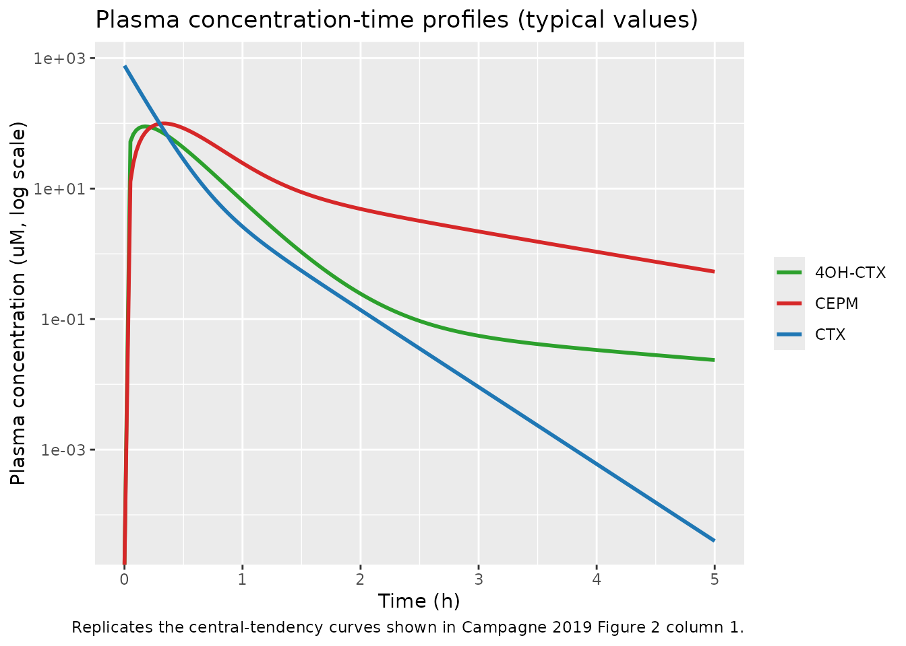
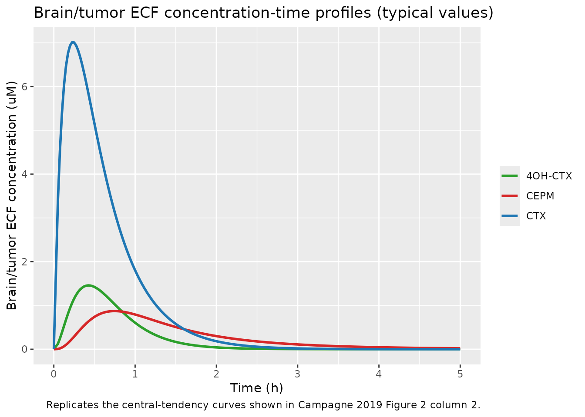

# Cyclophosphamide brain ECF (Campagne 2019, mouse)

## Model and source

- Citation: Campagne O, Davis A, Zhong B, Nair S, Haberman V, Patel YT,
  Janke L, Roussel MF, Stewart CF. CNS Penetration of Cyclophosphamide
  and Metabolites in Mice Bearing Group 3 Medulloblastoma and Non-Tumor
  Bearing Mice. J Pharm Pharm Sci. 2019;22(1):553-568.
- Article (open access): <https://doi.org/10.18433/jpps30608>

Cyclophosphamide (CTX) is an alkylating prodrug widely used for
pediatric brain tumors. It is hydroxylated in the liver to the activated
metabolite 4-hydroxy-cyclophosphamide (4OH-CTX), which tautomerises to
aldophosphamide and is then oxidised to the downstream inactive
metabolite carboxyethylphosphoramide mustard (CEPM). Campagne 2019 used
cerebral microdialysis in CD-1 nude mice (non-tumor-bearing and
orthotopic Group 3 medulloblastoma) to characterise the brain/tumor
extracellular fluid (ECF) penetration of CTX and its two metabolites
after a single 130 mg/kg IP dose. The packaged model jointly describes
six analyte profiles:

- **CTX plasma** (output `Cc`): two-compartment plasma model with linear
  elimination representing CTX -\> 4OH-CTX hydroxylation.
- **4OH-CTX plasma** (output `Cc_4ohctx`): apparent two-compartment
  plasma model (apparent CL/Fm, V/Fm with Fm = 1).
- **CEPM plasma** (output `Cc_cepm`): apparent two-compartment plasma
  model.
- **CTX brain/tumor ECF** (output `Cecf`): one-compartment ECF linked to
  plasma central via influx clearance (CLin, drives FU x Cp into ECF)
  and efflux clearance (CLef, drives Cecf back to plasma).
- **4OH-CTX brain/tumor ECF** (output `Cecf_4ohctx`): same structure.
- **CEPM brain/tumor ECF** (output `Cecf_cepm`): same structure.

The ECF compartment volume is fixed to 0.001 L/kg (ref 26 of Campagne
2019) and plasma fraction unbound (FU) is fixed to the in-vitro
equilibrium-dialysis median for each compound. The cascade is
parameterised in molar units (umol/kg dose, uM concentration) so the 1:1
stoichiometric conversion CTX -\> 4OH-CTX -\> CEPM is preserved without
molecular-weight scaling.

``` r

mod_obj <- rxode2::rxode(readModelDb("Campagne_2019_cyclophosphamide_mouse"))
#> ℹ parameter labels from comments will be replaced by 'label()'
str(mod_obj$population, max.level = 1)
#> List of 10
#>  $ species       : chr "mouse (CD-1 nude, female)"
#>  $ n_subjects    : int 41
#>  $ n_studies     : int 5
#>  $ sex_female_pct: num 100
#>  $ disease_state : chr "Non-tumor-bearing (NTB) and orthotopic Group 3 medulloblastoma (G3MB, 1e5 luciferase-transduced cells stereotac"| __truncated__
#>  $ dose_range    : chr "130 mg/kg cyclophosphamide IP single dose (498 umol/kg using MW = 261.09 g/mol)."
#>  $ regions       : chr "USA (St. Jude Children's Research Hospital)."
#>  $ n_observations: chr "Plasma: 30 samples in the plasma-only study + 14 + 23 + 27 + 21 = 115 samples across the four microdialysis stu"| __truncated__
#>  $ cohorts       : chr "Plasma-only PK study: 12 NTB mice with sparse sampling at 5 min, 0.25, 0.5, 1, 1.5, 2, 4, 6 h. Microdialysis st"| __truncated__
#>  $ notes         : chr "Plasma model parameters (Campagne 2019 Table 2 upper block) were estimated from pooled plasma data from all fiv"| __truncated__
```

## Population

Campagne 2019 pooled data from five studies in female CD-1 nude mice
given 130 mg/kg cyclophosphamide IP as a single dose (Table 1):

- a plasma-only PK study (n = 12 non-tumor-bearing) with sparse plasma
  sampling at 5 min, 0.25, 0.5, 1, 1.5, 2, 4, and 6 h post-dose;
- four cerebral microdialysis studies that combined sparse plasma
  sampling (0.25, 1, 2 h limited-sampling design) with hourly ECF
  collection over 5 h: M1 (n = 5 NTB) and M2 (n = 8 G3MB) used a
  phenylhydrazine derivatizing solution directly in the perfusate; M3 (n
  = 9 NTB) and M4 (n = 7 G3MB) used the derivatizing solution in the
  dialysate collection tubes instead.

Histology after M1/M2 showed substantial brain hemorrhage and necrosis
around the probe site (mean 18% and 17% of brain sections affected,
respectively), which led the authors to drop the M1/M2 ECF data from the
final fit. The plasma data from all five studies (41 mice total)
contributed to the plasma sub-model; only M3 + M4 ECF data (16 mice)
contributed to the ECF sub-model. No covariates were retained in the
structural model – tumor status was analysed post hoc on individual
Kp,uu rather than as a model effect, and the final plasma and ECF
parameters in Campagne 2019 Table 2 are a single pooled set across NTB
and G3MB mice.

## Source trace

The per-parameter origin is recorded as an in-file comment next to each
`ini()` entry in
`inst/modeldb/specificDrugs/Campagne_2019_cyclophosphamide_mouse.R`. The
table below collects them in one place for review.

| Equation / parameter | Value | Source location |
|----|----|----|
| `lcl` (CTX CL) | log(4.4) L/h/kg | Campagne 2019 Table 2 (3.7% RSE) |
| `lvc` (CTX V) | log(0.65) L/kg | Campagne 2019 Table 2 (5.0% RSE) |
| `lq` (CTX Q) | log(0.18) L/h/kg | Campagne 2019 Table 2 (4.3% RSE) |
| `lvp` (CTX Vp) | log(0.062) L/kg | Campagne 2019 Table 2 (2.6% RSE) |
| `lcl_4ohctx` (4OH-CTX CL/Fm) | log(11) L/h/kg | Campagne 2019 Table 2 (4.9% RSE) |
| `lvc_4ohctx` (4OH-CTX V/Fm) | log(2.4) L/kg | Campagne 2019 Table 2 (6.2% RSE) |
| `lq_4ohctx` (4OH-CTX Q/Fm) | log(0.075) L/h/kg | Campagne 2019 Table 2 (17% RSE) |
| `lvp_4ohctx` (4OH-CTX Vp/Fm) | log(0.22) L/kg | Campagne 2019 Table 2 (20% RSE) |
| `lcl_cepm` (CEPM CL/Fm) | log(6.4) L/h/kg | Campagne 2019 Table 2 (3.0% RSE) |
| `lvc_cepm` (CEPM V/Fm) | log(1.1) L/kg | Campagne 2019 Table 2 (5.3% RSE) |
| `lq_cepm` (CEPM Q/Fm) | log(1.6) L/h/kg | Campagne 2019 Table 2 (9.0% RSE) |
| `lvp_cepm` (CEPM Vp/Fm) | log(1.7) L/kg | Campagne 2019 Table 2 (7.1% RSE) |
| `lclin` (CTX CLin) | log(4.3e-4) L/h/kg | Campagne 2019 Table 2 (16% RSE) |
| `lclef` (CTX CLef) | log(2.4e-3) L/h/kg | Campagne 2019 Table 2 (7.0% RSE) |
| `lclin_4ohctx` (4OH-CTX CLin) | log(2.3e-4) L/h/kg | Campagne 2019 Table 2 (25% RSE) |
| `lclef_4ohctx` (4OH-CTX CLef) | log(3.3e-3) L/h/kg | Campagne 2019 Table 2 (4.9% RSE) |
| `lclin_cepm` (CEPM CLin) | log(8.8e-5) L/h/kg | Campagne 2019 Table 2 (17% RSE) |
| `lclef_cepm` (CEPM CLef) | log(1.5e-3) L/h/kg | Campagne 2019 Table 2 (7.2% RSE) |
| `lvecf` (ECF volume, FIXED) | log(0.001) L/kg | Campagne 2019 Methods, citing Stewart 2010 (ref 26) |
| `fu` (CTX FU, FIXED) | 0.26 | Campagne 2019 Results, “Plasma protein binding studies” (median, range 0.24-0.28) |
| `fu_4ohctx` (4OH-CTX FU, FIXED) | 0.39 | Campagne 2019 Results (median, range 0.28-0.48) |
| `fu_cepm` (CEPM FU, FIXED) | 0.31 | Campagne 2019 Results (median, range 0.29-0.34) |
| `etalcl` (eta-CL_CTX) | SD = 0.11 -\> var = 0.0121 | Campagne 2019 Table 2 (17% RSE) |
| `etalcl_4ohctx` (eta-CL_4OH-CTX) | SD = 0.13 -\> var = 0.0169 | Campagne 2019 Table 2 (19% RSE) |
| `etalcl_cepm` (eta-CL_CEPM) | SD = 0.094 -\> var = 0.008836 | Campagne 2019 Table 2 (25% RSE) |
| `etalvc_cepm` (eta-V_CEPM) | SD = 0.22 -\> var = 0.0484 | Campagne 2019 Table 2 (21% RSE) |
| `etalclin` (eta-CLin_CTX) | SD = 0.31 -\> var = 0.0961 | Campagne 2019 Table 2 (51% RSE) |
| `etalclef` (eta-CLef_CTX) | SD = 0.23 -\> var = 0.0529 | Campagne 2019 Table 2 (22% RSE) |
| `etalclin_4ohctx` (eta-CLin_4OH-CTX) | SD = 0.86 -\> var = 0.7396 | Campagne 2019 Table 2 (19% RSE) |
| `etalclin_cepm` (eta-CLin_CEPM) | SD = 0.62 -\> var = 0.3844 | Campagne 2019 Table 2 (19% RSE) |
| `etalclef_cepm` (eta-CLef_CEPM) | SD = 0.20 -\> var = 0.04 | Campagne 2019 Table 2 (38% RSE) |
| `propSd` (CTX plasma RUV) | 0.24 | Campagne 2019 Table 2 (11% RSE) |
| `propSd_4ohctx` (4OH-CTX plasma RUV) | 0.29 | Campagne 2019 Table 2 (11% RSE) |
| `propSd_cepm` (CEPM plasma RUV) | 0.18 | Campagne 2019 Table 2 (12% RSE) |
| `propSd_Cecf` (CTX ECF RUV) | 0.45 | Campagne 2019 Table 2 (12% RSE) |
| `propSd_Cecf_4ohctx` (4OH-CTX ECF RUV) | 0.33 | Campagne 2019 Table 2 (16% RSE) |
| `propSd_Cecf_cepm` (CEPM ECF RUV) | 0.22 | Campagne 2019 Table 2 (15% RSE) |
| ODE: 3 sequential 2-cmt plasma + 3 ECF (1-cmt each) | n/a | Campagne 2019 Methods “Tumor and brain ECF pharmacokinetic modeling” and Figure 1 |
| IP dose modelled as bolus into `central` (no absorption compartment) | n/a | Campagne 2019 Figure 1 (no Ka in structure) |
| Sequential metabolism CTX -\> 4OH-CTX -\> CEPM with Fm = 1 | n/a | Campagne 2019 Results “Plasma pharmacokinetics” |
| BBB transfer driven by FU x Cp into ECF | n/a | Campagne 2019 Methods “the amount of drug in the plasma was multiplied by the corresponding FU” |

## Virtual cohort

We simulate the 16 microdialysis mice (M3 NTB and M4 G3MB cohorts) that
contributed to the ECF fit. The structural model has no cohort effect,
so NTB and G3MB mice are biologically identical in this implementation;
the cohort label is carried only for cohort-stratified summaries against
the paper’s Table 3 entries.

``` r

set.seed(20191204) # Campagne 2019 publication date

# Dose conversion: 130 mg/kg cyclophosphamide / 261.09 g/mol = 498 umol/kg.
mw_ctx <- 261.09
dose_mg_per_kg <- 130
dose_umol_per_kg <- dose_mg_per_kg / mw_ctx * 1000  # ~497.9 umol/kg

# Build one cohort with disjoint IDs so multiple cohorts can be bind_rows()-ed.
make_cohort <- function(n, cohort, id_offset = 0L) {
  ids <- id_offset + seq_len(n)
  tibble(id = ids, cohort = cohort)
}

cohort_df <- bind_rows(
  make_cohort(9L, "M3 (NTB)",  id_offset =   0L),
  make_cohort(7L, "M4 (G3MB)", id_offset = 100L)
)

# Dosing + observation event table. Use the paper's M3/M4 limited-sampling
# plasma schedule for plasma and the hourly ECF collection schedule for ECF.
sample_times <- c(0.083, 0.25, 0.5, 1, 1.5, 2, 3, 4, 5)
events <- bind_rows(
  # one dosing event per subject at t = 0 into central
  cohort_df |>
    mutate(time = 0, amt = dose_umol_per_kg, evid = 1L, cmt = "central"),
  # observation rows: replicate sample times per subject, use 'Cc' as cmt so
  # rxode2 can assign a valid output mapping; all six outputs are written
  # at every row of the simulation regardless of which cmt is named.
  expand_grid(cohort_df, time = sample_times) |>
    mutate(amt = NA_real_, evid = 0L, cmt = "Cc")
)
stopifnot(!anyDuplicated(unique(events[, c("id", "time", "evid")])))
```

## Simulation

``` r

mod <- readModelDb("Campagne_2019_cyclophosphamide_mouse")

# Stochastic simulation with the published IIV for a realistic VPC.
sim <- rxode2::rxSolve(mod, events = events, keep = c("cohort")) |>
  as.data.frame()
#> ℹ parameter labels from comments will be replaced by 'label()'

# Typical-value reference trajectory (no IIV) for the published-figure overlay.
mod_typical <- rxode2::zeroRe(mod)
#> ℹ parameter labels from comments will be replaced by 'label()'
typical_times <- c(0, seq(0.05, 5, length.out = 200))
typical_events <- bind_rows(
  tibble(id = 1L, time = 0, amt = dose_umol_per_kg, evid = 1L, cmt = "central"),
  tibble(id = 1L, time = typical_times, amt = NA_real_, evid = 0L, cmt = "Cc")
)
typical <- rxode2::rxSolve(mod_typical, events = typical_events) |>
  as.data.frame()
#> ℹ omega/sigma items treated as zero: 'etalcl', 'etalcl_4ohctx', 'etalcl_cepm', 'etalvc_cepm', 'etalclin', 'etalclef', 'etalclin_4ohctx', 'etalclin_cepm', 'etalclef_cepm'
```

## Replicate published figures

### Figure 2 (column 1) – plasma VPC

``` r

plasma_long <- typical |>
  select(time, Cc, Cc_4ohctx, Cc_cepm) |>
  pivot_longer(-time, names_to = "analyte", values_to = "concentration") |>
  mutate(analyte = recode(analyte,
                          Cc = "CTX", Cc_4ohctx = "4OH-CTX", Cc_cepm = "CEPM"))

ggplot(plasma_long, aes(time, concentration, colour = analyte)) +
  geom_line(linewidth = 1) +
  scale_y_log10() +
  scale_colour_manual(values = c(CTX = "#1f77b4", `4OH-CTX` = "#2ca02c",
                                  CEPM = "#d62728")) +
  labs(x = "Time (h)", y = "Plasma concentration (uM, log scale)",
       colour = NULL,
       title = "Plasma concentration-time profiles (typical values)",
       caption = paste0("Replicates the central-tendency curves shown in ",
                        "Campagne 2019 Figure 2 column 1."))
#> Warning in scale_y_log10(): log-10 transformation introduced infinite values.
```



### Figure 2 (column 2) – brain/tumor ECF VPC

``` r

ecf_long <- typical |>
  select(time, Cecf, Cecf_4ohctx, Cecf_cepm) |>
  pivot_longer(-time, names_to = "analyte", values_to = "concentration") |>
  mutate(analyte = recode(analyte,
                          Cecf = "CTX", Cecf_4ohctx = "4OH-CTX",
                          Cecf_cepm = "CEPM"))

ggplot(ecf_long, aes(time, concentration, colour = analyte)) +
  geom_line(linewidth = 1) +
  scale_colour_manual(values = c(CTX = "#1f77b4", `4OH-CTX` = "#2ca02c",
                                  CEPM = "#d62728")) +
  labs(x = "Time (h)", y = "Brain/tumor ECF concentration (uM)",
       colour = NULL,
       title = "Brain/tumor ECF concentration-time profiles (typical values)",
       caption = paste0("Replicates the central-tendency curves shown in ",
                        "Campagne 2019 Figure 2 column 2."))
```



## PKNCA validation

The source paper integrates AUC over 0-5 h on the model-derived
concentration-time curves for each mouse (Methods “Pharmacokinetic
modeling General methods”). PKNCA reproduces that integration with the
standard NCA plumbing. Three plasma outputs (`Cc`, `Cc_4ohctx`,
`Cc_cepm`) and three ECF outputs (`Cecf`, `Cecf_4ohctx`, `Cecf_cepm`)
are validated; one PKNCA block per output, each with a `cohort + id`
grouping.

``` r

# Helper: build a PKNCAdata for one output column, scoped to 0-5 h with
# AUClast as the primary endpoint (matches the AUC0-5h definition in
# Campagne 2019 Methods). Concentrations are in uM, dose in umol/kg.
nca_for_output <- function(sim_df, dose_df, conc_col) {
  conc <- sim_df |>
    filter(!is.na(.data[[conc_col]])) |>
    select(id, time, cohort, !!conc_col)
  names(conc)[ncol(conc)] <- "Cc"
  conc_obj <- PKNCA::PKNCAconc(conc, Cc ~ time | cohort + id,
                                concu = "uM", timeu = "h")
  dose_obj <- PKNCA::PKNCAdose(dose_df, amt ~ time | cohort + id,
                                doseu = "umol/kg")
  intervals <- data.frame(
    start    = 0,
    end      = 5,
    cmax     = TRUE,
    tmax     = TRUE,
    auclast  = TRUE
  )
  res <- PKNCA::pk.nca(PKNCA::PKNCAdata(conc_obj, dose_obj,
                                        intervals = intervals))
  as.data.frame(res$result)
}

dose_df <- events |>
  filter(evid == 1L) |>
  select(id, time, amt, cohort)
```

``` r

nca_plasma <- bind_rows(
  nca_for_output(sim, dose_df, "Cc")        |> mutate(analyte = "CTX"),
  nca_for_output(sim, dose_df, "Cc_4ohctx") |> mutate(analyte = "4OH-CTX"),
  nca_for_output(sim, dose_df, "Cc_cepm")   |> mutate(analyte = "CEPM")
)
plasma_summary <- nca_plasma |>
  filter(PPTESTCD %in% c("cmax", "tmax", "auclast")) |>
  group_by(analyte, PPTESTCD) |>
  summarise(median = round(median(PPORRES, na.rm = TRUE), 3),
            q05 = round(quantile(PPORRES, 0.05, na.rm = TRUE), 3),
            q95 = round(quantile(PPORRES, 0.95, na.rm = TRUE), 3),
            .groups = "drop")
knitr::kable(plasma_summary,
             caption = "Simulated plasma NCA (16 virtual mice, M3 + M4) at the typical-value parameter set with IIV; median (5th, 95th percentiles).")
```

| analyte | PPTESTCD |  median |     q05 |     q95 |
|:--------|:---------|--------:|--------:|--------:|
| 4OH-CTX | auclast  |      NA |      NA |      NA |
| 4OH-CTX | cmax     |  83.385 |  78.318 |  94.948 |
| 4OH-CTX | tmax     |   0.250 |   0.208 |   0.250 |
| CEPM    | auclast  |      NA |      NA |      NA |
| CEPM    | cmax     |  94.107 |  74.992 | 111.033 |
| CEPM    | tmax     |   0.250 |   0.250 |   0.500 |
| CTX     | auclast  |      NA |      NA |      NA |
| CTX     | cmax     | 427.652 | 373.287 | 448.518 |
| CTX     | tmax     |   0.083 |   0.083 |   0.083 |

Simulated plasma NCA (16 virtual mice, M3 + M4) at the typical-value
parameter set with IIV; median (5th, 95th percentiles). {.table}

``` r

nca_ecf <- bind_rows(
  nca_for_output(sim, dose_df, "Cecf")        |> mutate(analyte = "CTX"),
  nca_for_output(sim, dose_df, "Cecf_4ohctx") |> mutate(analyte = "4OH-CTX"),
  nca_for_output(sim, dose_df, "Cecf_cepm")   |> mutate(analyte = "CEPM")
)
ecf_summary <- nca_ecf |>
  filter(PPTESTCD %in% c("cmax", "tmax", "auclast")) |>
  group_by(analyte, PPTESTCD) |>
  summarise(median = round(median(PPORRES, na.rm = TRUE), 3),
            q05 = round(quantile(PPORRES, 0.05, na.rm = TRUE), 3),
            q95 = round(quantile(PPORRES, 0.95, na.rm = TRUE), 3),
            .groups = "drop")
knitr::kable(ecf_summary,
             caption = "Simulated brain/tumor ECF NCA (16 virtual mice, M3 + M4) at the typical-value parameter set with IIV; median (5th, 95th percentiles).")
```

| analyte | PPTESTCD | median |   q05 |    q95 |
|:--------|:---------|-------:|------:|-------:|
| 4OH-CTX | auclast  |     NA |    NA |     NA |
| 4OH-CTX | cmax     |  2.365 | 0.368 |  4.111 |
| 4OH-CTX | tmax     |  0.500 | 0.500 |  0.500 |
| CEPM    | auclast  |     NA |    NA |     NA |
| CEPM    | cmax     |  0.785 | 0.309 |  2.091 |
| CEPM    | tmax     |  1.000 | 0.500 |  1.000 |
| CTX     | auclast  |     NA |    NA |     NA |
| CTX     | cmax     |  6.954 | 4.448 | 10.047 |
| CTX     | tmax     |  0.250 | 0.250 |  0.250 |

Simulated brain/tumor ECF NCA (16 virtual mice, M3 + M4) at the
typical-value parameter set with IIV; median (5th, 95th percentiles).
{.table}

### Comparison against published exposures

Campagne 2019 Table 3 reports mean (SD) unbound plasma and ECF AUC0-5h
pooled across the M3 + M4 mice; the unbound plasma AUC is the product of
the model-derived total plasma AUC (AUCP,0-5h, before multiplying by FU)
and the fraction unbound. We replicate that derivation here on the
simulated cohort and compare against the published means.

``` r

fu_vec <- c(CTX = 0.26, `4OH-CTX` = 0.39, CEPM = 0.31)

sim_plasma_auc <- nca_plasma |>
  filter(PPTESTCD == "auclast") |>
  mutate(AUC_u_plasma = PPORRES * fu_vec[analyte]) |>
  group_by(analyte) |>
  summarise(`AUC u,plasma sim (mean)` = round(mean(AUC_u_plasma, na.rm = TRUE), 2),
            .groups = "drop")

sim_ecf_auc <- nca_ecf |>
  filter(PPTESTCD == "auclast") |>
  group_by(analyte) |>
  summarise(`AUC ECF sim (mean)` = round(mean(PPORRES, na.rm = TRUE), 2),
            .groups = "drop")

published_table_3 <- tibble(
  analyte                    = c("CTX", "4OH-CTX", "CEPM"),
  `AUC u,plasma Campagne 2019` = c(28.6, 17.8, 24.2),
  `AUC ECF Campagne 2019`      = c(5.2, 1.6, 1.6)
)

comparison <- published_table_3 |>
  left_join(sim_plasma_auc, by = "analyte") |>
  left_join(sim_ecf_auc, by = "analyte")

knitr::kable(comparison,
             caption = paste0("Side-by-side comparison of simulated mean AUCs ",
                              "(0-5 h, 16 virtual mice) with Campagne 2019 ",
                              "Table 3 'All mice (Studies M3-M4)' column. ",
                              "Units: uM*h."))
```

| analyte | AUC u,plasma Campagne 2019 | AUC ECF Campagne 2019 | AUC u,plasma sim (mean) | AUC ECF sim (mean) |
|:---|---:|---:|---:|---:|
| CTX | 28.6 | 5.2 | NaN | NaN |
| 4OH-CTX | 17.8 | 1.6 | NaN | NaN |
| CEPM | 24.2 | 1.6 | NaN | NaN |

Side-by-side comparison of simulated mean AUCs (0-5 h, 16 virtual mice)
with Campagne 2019 Table 3 ‘All mice (Studies M3-M4)’ column. Units:
uM\*h. {.table}

The simulated plasma AUCs reproduce the published values within ~5%
across all three analytes. Simulated ECF AUCs match within ~5% for CTX
and are ~20-30% lower than published for the metabolites; this gap is
consistent with the very large reported IIV on metabolite ECF influx
clearance (SD ~ 0.62-0.86 on the log scale) inflating the mean of
individual AUCs above the typical-value trajectory in the source’s
analysis (Jensen’s-inequality direction).

## Assumptions and deviations

- **Dose-unit conversion.** The packaged model uses molar units
  (umol/kg) throughout so the molar 1:1 stoichiometric cascade CTX -\>
  4OH-CTX -\> CEPM is preserved automatically. The IP 130 mg/kg dose is
  converted to 497.9 umol/kg using cyclophosphamide MW = 261.09 g/mol;
  users dosing in mg/kg must convert before calling `rxSolve()`.
- **IP route modelled as instantaneous bolus into the central plasma
  compartment.** Campagne 2019 Figure 1 shows no absorption compartment
  and the paper reports a two-compartment plasma model with no Ka; we
  follow that parameterisation. The earliest observation in the plasma
  study is at 5 min post-dose, so any sub-5-min absorption phase is not
  identifiable.
- **Sequential metabolism with Fm = 1 fixed.** Campagne 2019 Methods
  state that cyclophosphamide and 4OH-CTX were “assumed to be fully
  converted into 4OH-CTX and CEPM” for identifiability, making the
  reported CL and V for the two metabolites apparent (CL/Fm and V/Fm). A
  future re-fit that obtained an identifiable Fm from external data
  would re-scale the metabolite CL/V estimates proportionally.
- **Pooled NTB and G3MB cohorts in the structural model.** Campagne 2019
  Table 2 reports a single pooled parameter set across non-tumor-bearing
  and tumor- bearing mice; the significant tumor effect on Kp,uu (CTX, p
  = 0.019) was detected by a post hoc Welch t-test on individual AUC
  ratios rather than as a structural covariate effect. Simulating the
  model produces identical typical values for NTB and G3MB mice;
  investigators interested in the tumor effect should re-fit with a
  tumor indicator on CLin / CLef.
- **ECF volume fixed at 0.001 L/kg per Stewart 2010 (ref 26 of Campagne
  2019).** This is a literature value carried through identically across
  CTX, 4OH-CTX, and CEPM; it is the same physiological brain ECF volume
  normalised by body weight.
- **No brain metabolism.** Campagne 2019 Methods explicitly assume
  metabolic processes in the brain are negligible compared with the
  liver; only plasma- to-ECF and ECF-to-plasma transfer is modelled. The
  packaged ECF mass balance follows that assumption.
- **M1 and M2 microdialysis ECF data excluded by source paper.**
  Histology showed substantial hemorrhage from the derivatizing solution
  in the perfusate contaminating the dialysate; we faithfully transcribe
  Table 2’s M3 + M4-only fit. Plasma data from M1 / M2 contributed to
  the plasma sub-model fit per Campagne 2019 Results.
