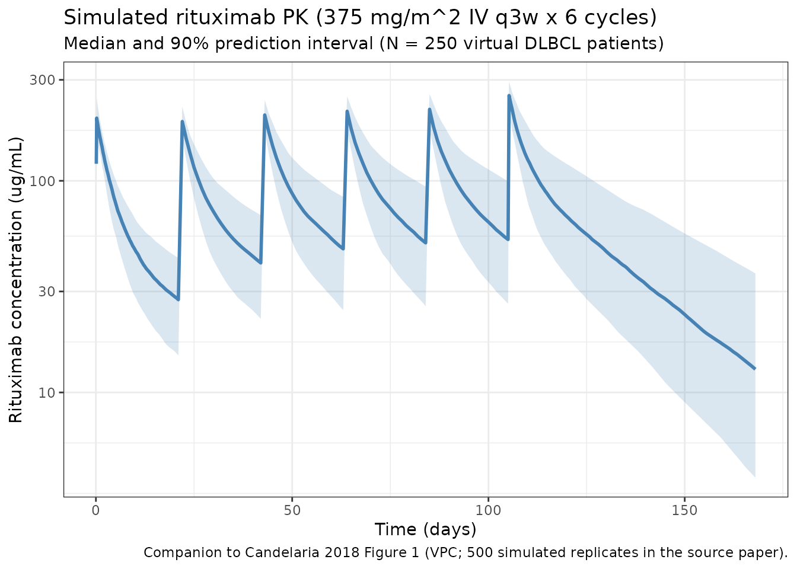
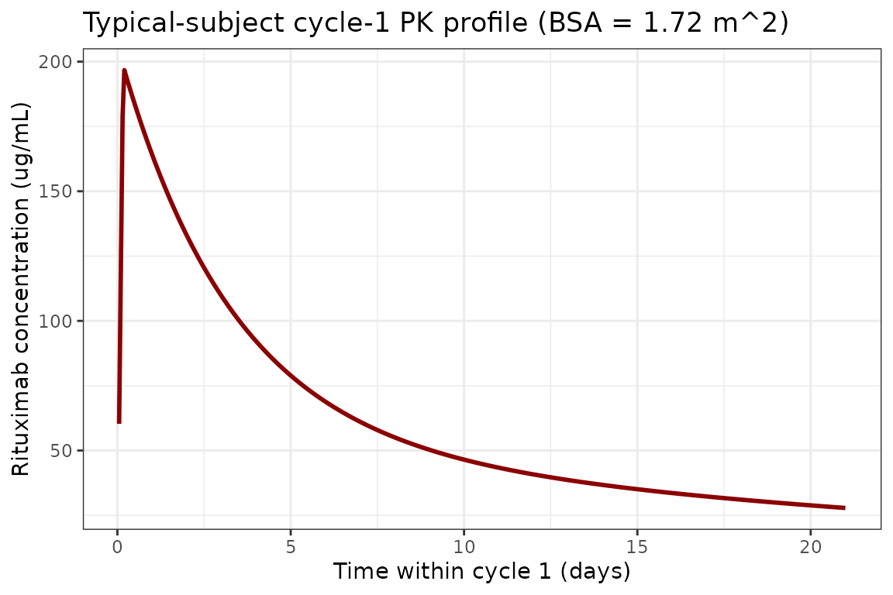

# Rituximab (Candelaria 2018)

``` r

library(nlmixr2lib)
library(rxode2)
#> rxode2 5.0.2 using 2 threads (see ?getRxThreads)
#>   no cache: create with `rxCreateCache()`
library(dplyr)
#> 
#> Attaching package: 'dplyr'
#> The following objects are masked from 'package:stats':
#> 
#>     filter, lag
#> The following objects are masked from 'package:base':
#> 
#>     intersect, setdiff, setequal, union
library(tidyr)
library(ggplot2)
library(PKNCA)
#> 
#> Attaching package: 'PKNCA'
#> The following object is masked from 'package:stats':
#> 
#>     filter
```

## Rituximab population PK in diffuse large B-cell lymphoma

Simulate rituximab serum concentrations using the final pooled-arm
two-compartment population PK model of Candelaria et al. (2018) in
patients with diffuse large B-cell lymphoma (DLBCL) receiving 375 mg/m^2
IV every 3 weeks for up to six cycles in combination with CHOP
chemotherapy. The source study (RTXM83-AC-01-11, NCT02268045) pooled
5341 serum concentrations (2703 RTXM83 biosimilar; 2638 rituximab
reference) from 251 patients across 58 sites in 12 countries; the
published model is a single structural model fit to both arms
simultaneously and is the basis for the bioequivalence claim between
RTXM83 and the reference product.

The model is a two-compartment structure with IV input and linear
elimination from the central compartment. Body surface area (BSA) is the
only retained covariate and enters as a median-centered power effect on
the central volume of distribution (V1).

- Article: <https://doi.org/10.1007/s00280-018-3524-9>
- ClinicalTrials.gov: <https://clinicaltrials.gov/study/NCT02268045>

### Source trace

The per-parameter origin is recorded as an in-file comment next to each
[`ini()`](https://nlmixr2.github.io/rxode2/reference/ini.html) entry in
`inst/modeldb/specificDrugs/Candelaria_2018_rituximab.R`. The table
below collects the mapping in one place for reviewer audit.

| Element | Source location | Value / form |
|----|----|----|
| Two-compartment IV model with linear elimination | Candelaria 2018 Methods ‘Structural PK model’ | `d/dt(central) = -kel*central - k12*central + k21*peripheral1` |
| CL (typical) | Candelaria 2018 Table 2 | 12.5 mL/h = 0.300 L/day |
| V1 (typical) | Candelaria 2018 Table 2 | 3191 mL = 3.191 L |
| Q (typical) | Candelaria 2018 Table 2 | 18.6 mL/h = 0.4464 L/day |
| V2 (typical) | Candelaria 2018 Table 2 | 4154 mL = 4.154 L |
| BSA on V1 | Candelaria 2018 Table 2 (row ‘V1-BSA’) | Power: `(BSA/1.72)^1.11` |
| IIV CL | Candelaria 2018 Table 2 | 24.7% CV -\> `omega^2 = log(1 + 0.247^2) = 0.05923` |
| IIV V1 | Candelaria 2018 Table 2 | 14.2% CV -\> 0.01996 |
| IIV Q | Candelaria 2018 Table 2 | 28.0% CV -\> 0.07549 |
| IIV V2 | Candelaria 2018 Table 2 | 27.0% CV -\> 0.07037 |
| IOV CL (not encoded) | Candelaria 2018 Table 2 | 35.9% CV; see Assumptions and deviations |
| IOV V1 (not encoded) | Candelaria 2018 Table 2 | 16.8% CV; see Assumptions and deviations |
| Proportional residual | Candelaria 2018 Table 2 | 27% (SD as fraction) |
| Additive residual | Candelaria 2018 Table 2 | 278 ng/mL = 0.278 ug/mL |
| Reference subject | Candelaria 2018 Table 1 medians | BSA 1.72 m^2 |
| Clinical regimen | Candelaria 2018 Methods ‘Patients’ | 375 mg/m^2 IV every 3 weeks for 1-6 cycles |
| Reported terminal half-life | Candelaria 2018 Results ‘Population pharmacokinetic modelling’ | 21.6 days |
| Reported NCA Cycle 1 (RTXM83 arm) | Candelaria 2018 Table 3 | Cmax 196.8 ug/mL; AUC0-inf 44,519 h\*ug/mL |
| Reported NCA Cycle 6 (RTXM83 arm) | Candelaria 2018 Table 3 | Cmax 291 ug/mL; AUC0-inf 60,875 h\*ug/mL |

### Covariate column naming

| Source column | Canonical column used here | Notes |
|----|----|----|
| `BSA` | `BSA` (m^2) | Time-fixed baseline; median 1.72 m^2 in the study population (Candelaria 2018 Table 1). |

### Virtual population

The source paper reports population summary statistics but does not
publish per-subject baseline covariates. The cohort below approximates
the Candelaria 2018 Table 1 demographic distribution, with BSA the
single load-bearing covariate. Body surface area is sampled from a
truncated normal centered at the population median (1.72 m^2) with a
spread that brackets the reported 1.14-2.54 m^2 range.

``` r

set.seed(20180124)
n_subj <- 250L

pop <- data.frame(
  ID  = seq_len(n_subj),
  BSA = pmin(pmax(rnorm(n_subj, mean = 1.72, sd = 0.22), 1.14), 2.54)
)
```

### Dosing dataset – Q3W x 6 cycles

Patients received 375 mg/m^2 IV on day 1 of each 3-week cycle for up to
six cycles. The infusion duration is not specified in the
modelling-methods section; standard rituximab infusions in the DLBCL
setting are 4-6 hours for cycle 1 and 1.5-3 hours for subsequent cycles.
We use a fixed 4-hour infusion across all cycles. The simulation covers
six cycles plus one 3-week washout (168 days total) so cycle 6 reaches a
near-steady-state Cmax.

``` r

infusion_dur_hr  <- 4
infusion_dur_day <- infusion_dur_hr / 24

# Six cycles of 375 mg/m^2 every 21 days, dosed by BSA per subject.
cycle_days <- seq(0, 21 * 5, by = 21)            # cycle 1 .. cycle 6

doses <- tidyr::crossing(pop, TIME = cycle_days) |>
  mutate(
    AMT  = 375 * BSA,                            # mg
    RATE = AMT / infusion_dur_day,               # mg/day
    EVID = 1,
    CMT  = "central",
    DV   = NA_real_
  )

# Observation grid: dense early in cycle 1 and around cycle 6 for
# NCA characterisation; coarser in between.
obs_times <- sort(unique(c(
  seq(0, 21, by = 0.1),                          # cycle 1 NCA window
  seq(21, 21 * 5, by = 1),                       # mid-treatment
  seq(21 * 5, 21 * 8, by = 0.25)                 # cycle 6 NCA window + post-treatment
)))

obs <- tidyr::crossing(pop, TIME = obs_times) |>
  mutate(AMT = NA_real_, RATE = NA_real_, EVID = 0, CMT = "central", DV = NA_real_)

events <- bind_rows(doses, obs) |>
  arrange(ID, TIME, desc(EVID)) |>
  as.data.frame()
```

### Simulate the Q3W regimen

``` r

mod <- readModelDb("Candelaria_2018_rituximab")
sim <- rxSolve(mod, events, returnType = "data.frame")
#> ℹ parameter labels from comments will be replaced by 'label()'
```

#### Concentration-time profile (Candelaria 2018 Figure 1 / VPC analogue)

The Candelaria 2018 Figure 1 panels show observed-vs-predicted scatter
and conditional weighted residuals; the paper’s VPC (Methods ‘Model
qualification’) uses 500 simulated replicates. The panel below is a
median + 90% prediction interval VPC analogue from the present virtual
population.

``` r

sim_summary <- sim |>
  filter(time > 0) |>
  group_by(time) |>
  summarise(
    median = median(Cc, na.rm = TRUE),
    lo     = quantile(Cc, 0.05, na.rm = TRUE),
    hi     = quantile(Cc, 0.95, na.rm = TRUE),
    .groups = "drop"
  )

ggplot(sim_summary, aes(x = time)) +
  geom_ribbon(aes(ymin = lo, ymax = hi), alpha = 0.2, fill = "steelblue") +
  geom_line(aes(y = median), color = "steelblue", linewidth = 1) +
  scale_y_log10() +
  labs(
    x = "Time (days)",
    y = "Rituximab concentration (ug/mL)",
    title = "Simulated rituximab PK (375 mg/m^2 IV q3w x 6 cycles)",
    subtitle = "Median and 90% prediction interval (N = 250 virtual DLBCL patients)",
    caption = "Companion to Candelaria 2018 Figure 1 (VPC; 500 simulated replicates in the source paper)."
  ) +
  theme_bw()
```



#### Typical-value cycle-1 trajectory

Reproduce the cycle-1 concentration-time profile for a typical subject
(BSA = 1.72 m^2, no random effects) – useful for comparing the
typical-value Cmax against the Candelaria 2018 Table 3 RTXM83-arm
cycle-1 geometric mean Cmax of 196.8 ug/mL.

``` r

mod_typ <- zeroRe(mod)
#> ℹ parameter labels from comments will be replaced by 'label()'

ev_typ <- data.frame(
  ID   = 1L,
  TIME = c(0,
           sort(unique(c(seq(0, 21, by = 0.05))))),
  AMT  = c(375 * 1.72, rep(NA_real_, length(seq(0, 21, by = 0.05)))),
  RATE = c(375 * 1.72 / (4 / 24), rep(NA_real_, length(seq(0, 21, by = 0.05)))),
  EVID = c(1, rep(0, length(seq(0, 21, by = 0.05)))),
  CMT  = c("central", rep("central", length(seq(0, 21, by = 0.05)))),
  DV   = NA_real_
)
ev_typ$BSA <- 1.72
ev_typ <- ev_typ[order(ev_typ$TIME, -ev_typ$EVID), ]

sim_typ <- rxSolve(mod_typ, ev_typ, returnType = "data.frame")
#> ℹ omega/sigma items treated as zero: 'etalcl', 'etalvc', 'etalq', 'etalvp'

ggplot(sim_typ |> filter(time > 0), aes(x = time, y = Cc)) +
  geom_line(color = "darkred", linewidth = 1) +
  labs(
    x = "Time within cycle 1 (days)",
    y = "Rituximab concentration (ug/mL)",
    title = "Typical-subject cycle-1 PK profile (BSA = 1.72 m^2)"
  ) +
  theme_bw()
```



### PKNCA validation

Compute NCA parameters for the cycle-1 (single-dose) and cycle-6
(steady-state) windows reported in Candelaria 2018 Table 3. The
treatment grouping variable is the cycle label; PKNCA rolls results up
per cycle for direct comparison to the paper.

``` r

# Cycle-1 window: from t = 0 to the next dose at day 21.
c1 <- sim |>
  filter(time >= 0, time <= 21, Cc > 0) |>
  rename(ID = id) |>
  mutate(treatment = "cycle1") |>
  select(ID, time, Cc, treatment)

# Cycle-6 window: from the cycle-6 dose at day 105 to the next nominal
# 21-day interval end. This is the AUC0-tau at steady state.
c6 <- sim |>
  filter(time >= 105, time <= 126, Cc > 0) |>
  rename(ID = id) |>
  mutate(treatment = "cycle6", time = time - 105) |>
  select(ID, time, Cc, treatment)

nca_conc <- bind_rows(c1, c6)

nca_dose <- bind_rows(
  pop |> transmute(ID, time = 0, AMT = 375 * BSA, treatment = "cycle1"),
  pop |> transmute(ID, time = 0, AMT = 375 * BSA, treatment = "cycle6")
)

conc_obj <- PKNCAconc(nca_conc, Cc ~ time | treatment + ID,
                      concu = "ug/mL", timeu = "day")
dose_obj <- PKNCAdose(nca_dose, AMT ~ time | treatment + ID,
                      doseu = "mg")

intervals <- data.frame(
  start    = 0,
  end      = 21,
  cmax     = TRUE,
  tmax     = TRUE,
  cmin     = TRUE,
  auclast  = TRUE
)

nca_data <- PKNCAdata(conc_obj, dose_obj, intervals = intervals)
nca_res  <- pk.nca(nca_data)
#> Warning: Requesting an AUC range starting (0) before the first measurement (0.1) is not allowed
#> Requesting an AUC range starting (0) before the first measurement (0.1) is not allowed
#> Requesting an AUC range starting (0) before the first measurement (0.1) is not allowed
#> Requesting an AUC range starting (0) before the first measurement (0.1) is not allowed
#> Requesting an AUC range starting (0) before the first measurement (0.1) is not allowed
#> Requesting an AUC range starting (0) before the first measurement (0.1) is not allowed
#> Requesting an AUC range starting (0) before the first measurement (0.1) is not allowed
#> Requesting an AUC range starting (0) before the first measurement (0.1) is not allowed
#> Requesting an AUC range starting (0) before the first measurement (0.1) is not allowed
#> Requesting an AUC range starting (0) before the first measurement (0.1) is not allowed
#> Requesting an AUC range starting (0) before the first measurement (0.1) is not allowed
#> Requesting an AUC range starting (0) before the first measurement (0.1) is not allowed
#> Requesting an AUC range starting (0) before the first measurement (0.1) is not allowed
#> Requesting an AUC range starting (0) before the first measurement (0.1) is not allowed
#> Requesting an AUC range starting (0) before the first measurement (0.1) is not allowed
#> Requesting an AUC range starting (0) before the first measurement (0.1) is not allowed
#> Requesting an AUC range starting (0) before the first measurement (0.1) is not allowed
#> Requesting an AUC range starting (0) before the first measurement (0.1) is not allowed
#> Requesting an AUC range starting (0) before the first measurement (0.1) is not allowed
#> Requesting an AUC range starting (0) before the first measurement (0.1) is not allowed
#> Requesting an AUC range starting (0) before the first measurement (0.1) is not allowed
#> Requesting an AUC range starting (0) before the first measurement (0.1) is not allowed
#> Requesting an AUC range starting (0) before the first measurement (0.1) is not allowed
#> Requesting an AUC range starting (0) before the first measurement (0.1) is not allowed
#> Requesting an AUC range starting (0) before the first measurement (0.1) is not allowed
#> Requesting an AUC range starting (0) before the first measurement (0.1) is not allowed
#> Requesting an AUC range starting (0) before the first measurement (0.1) is not allowed
#> Requesting an AUC range starting (0) before the first measurement (0.1) is not allowed
#> Requesting an AUC range starting (0) before the first measurement (0.1) is not allowed
#> Requesting an AUC range starting (0) before the first measurement (0.1) is not allowed
#> Requesting an AUC range starting (0) before the first measurement (0.1) is not allowed
#> Requesting an AUC range starting (0) before the first measurement (0.1) is not allowed
#> Requesting an AUC range starting (0) before the first measurement (0.1) is not allowed
#> Requesting an AUC range starting (0) before the first measurement (0.1) is not allowed
#> Requesting an AUC range starting (0) before the first measurement (0.1) is not allowed
#> Requesting an AUC range starting (0) before the first measurement (0.1) is not allowed
#> Requesting an AUC range starting (0) before the first measurement (0.1) is not allowed
#> Requesting an AUC range starting (0) before the first measurement (0.1) is not allowed
#> Requesting an AUC range starting (0) before the first measurement (0.1) is not allowed
#> Requesting an AUC range starting (0) before the first measurement (0.1) is not allowed
#> Requesting an AUC range starting (0) before the first measurement (0.1) is not allowed
#> Requesting an AUC range starting (0) before the first measurement (0.1) is not allowed
#> Requesting an AUC range starting (0) before the first measurement (0.1) is not allowed
#> Requesting an AUC range starting (0) before the first measurement (0.1) is not allowed
#> Requesting an AUC range starting (0) before the first measurement (0.1) is not allowed
#> Requesting an AUC range starting (0) before the first measurement (0.1) is not allowed
#> Requesting an AUC range starting (0) before the first measurement (0.1) is not allowed
#> Requesting an AUC range starting (0) before the first measurement (0.1) is not allowed
#> Requesting an AUC range starting (0) before the first measurement (0.1) is not allowed
#> Requesting an AUC range starting (0) before the first measurement (0.1) is not allowed
#> Requesting an AUC range starting (0) before the first measurement (0.1) is not allowed
#> Requesting an AUC range starting (0) before the first measurement (0.1) is not allowed
#> Requesting an AUC range starting (0) before the first measurement (0.1) is not allowed
#> Requesting an AUC range starting (0) before the first measurement (0.1) is not allowed
#> Requesting an AUC range starting (0) before the first measurement (0.1) is not allowed
#> Requesting an AUC range starting (0) before the first measurement (0.1) is not allowed
#> Requesting an AUC range starting (0) before the first measurement (0.1) is not allowed
#> Requesting an AUC range starting (0) before the first measurement (0.1) is not allowed
#> Requesting an AUC range starting (0) before the first measurement (0.1) is not allowed
#> Requesting an AUC range starting (0) before the first measurement (0.1) is not allowed
#> Requesting an AUC range starting (0) before the first measurement (0.1) is not allowed
#> Requesting an AUC range starting (0) before the first measurement (0.1) is not allowed
#> Requesting an AUC range starting (0) before the first measurement (0.1) is not allowed
#> Requesting an AUC range starting (0) before the first measurement (0.1) is not allowed
#> Requesting an AUC range starting (0) before the first measurement (0.1) is not allowed
#> Requesting an AUC range starting (0) before the first measurement (0.1) is not allowed
#> Requesting an AUC range starting (0) before the first measurement (0.1) is not allowed
#> Requesting an AUC range starting (0) before the first measurement (0.1) is not allowed
#> Requesting an AUC range starting (0) before the first measurement (0.1) is not allowed
#> Requesting an AUC range starting (0) before the first measurement (0.1) is not allowed
#> Requesting an AUC range starting (0) before the first measurement (0.1) is not allowed
#> Requesting an AUC range starting (0) before the first measurement (0.1) is not allowed
#> Requesting an AUC range starting (0) before the first measurement (0.1) is not allowed
#> Requesting an AUC range starting (0) before the first measurement (0.1) is not allowed
#> Requesting an AUC range starting (0) before the first measurement (0.1) is not allowed
#> Requesting an AUC range starting (0) before the first measurement (0.1) is not allowed
#> Requesting an AUC range starting (0) before the first measurement (0.1) is not allowed
#> Requesting an AUC range starting (0) before the first measurement (0.1) is not allowed
#> Requesting an AUC range starting (0) before the first measurement (0.1) is not allowed
#> Requesting an AUC range starting (0) before the first measurement (0.1) is not allowed
#> Requesting an AUC range starting (0) before the first measurement (0.1) is not allowed
#> Requesting an AUC range starting (0) before the first measurement (0.1) is not allowed
#> Requesting an AUC range starting (0) before the first measurement (0.1) is not allowed
#> Requesting an AUC range starting (0) before the first measurement (0.1) is not allowed
#> Requesting an AUC range starting (0) before the first measurement (0.1) is not allowed
#> Requesting an AUC range starting (0) before the first measurement (0.1) is not allowed
#> Requesting an AUC range starting (0) before the first measurement (0.1) is not allowed
#> Requesting an AUC range starting (0) before the first measurement (0.1) is not allowed
#> Requesting an AUC range starting (0) before the first measurement (0.1) is not allowed
#> Requesting an AUC range starting (0) before the first measurement (0.1) is not allowed
#> Requesting an AUC range starting (0) before the first measurement (0.1) is not allowed
#> Requesting an AUC range starting (0) before the first measurement (0.1) is not allowed
#> Requesting an AUC range starting (0) before the first measurement (0.1) is not allowed
#> Requesting an AUC range starting (0) before the first measurement (0.1) is not allowed
#> Requesting an AUC range starting (0) before the first measurement (0.1) is not allowed
#> Requesting an AUC range starting (0) before the first measurement (0.1) is not allowed
#> Requesting an AUC range starting (0) before the first measurement (0.1) is not allowed
#> Requesting an AUC range starting (0) before the first measurement (0.1) is not allowed
#> Requesting an AUC range starting (0) before the first measurement (0.1) is not allowed
#> Requesting an AUC range starting (0) before the first measurement (0.1) is not allowed
#> Requesting an AUC range starting (0) before the first measurement (0.1) is not allowed
#> Requesting an AUC range starting (0) before the first measurement (0.1) is not allowed
#> Requesting an AUC range starting (0) before the first measurement (0.1) is not allowed
#> Requesting an AUC range starting (0) before the first measurement (0.1) is not allowed
#> Requesting an AUC range starting (0) before the first measurement (0.1) is not allowed
#> Requesting an AUC range starting (0) before the first measurement (0.1) is not allowed
#> Requesting an AUC range starting (0) before the first measurement (0.1) is not allowed
#> Requesting an AUC range starting (0) before the first measurement (0.1) is not allowed
#> Requesting an AUC range starting (0) before the first measurement (0.1) is not allowed
#> Requesting an AUC range starting (0) before the first measurement (0.1) is not allowed
#> Requesting an AUC range starting (0) before the first measurement (0.1) is not allowed
#> Requesting an AUC range starting (0) before the first measurement (0.1) is not allowed
#> Requesting an AUC range starting (0) before the first measurement (0.1) is not allowed
#> Requesting an AUC range starting (0) before the first measurement (0.1) is not allowed
#> Requesting an AUC range starting (0) before the first measurement (0.1) is not allowed
#> Requesting an AUC range starting (0) before the first measurement (0.1) is not allowed
#> Requesting an AUC range starting (0) before the first measurement (0.1) is not allowed
#> Requesting an AUC range starting (0) before the first measurement (0.1) is not allowed
#> Requesting an AUC range starting (0) before the first measurement (0.1) is not allowed
#> Requesting an AUC range starting (0) before the first measurement (0.1) is not allowed
#> Requesting an AUC range starting (0) before the first measurement (0.1) is not allowed
#> Requesting an AUC range starting (0) before the first measurement (0.1) is not allowed
#> Requesting an AUC range starting (0) before the first measurement (0.1) is not allowed
#> Requesting an AUC range starting (0) before the first measurement (0.1) is not allowed
#> Requesting an AUC range starting (0) before the first measurement (0.1) is not allowed
#> Requesting an AUC range starting (0) before the first measurement (0.1) is not allowed
#> Requesting an AUC range starting (0) before the first measurement (0.1) is not allowed
#> Requesting an AUC range starting (0) before the first measurement (0.1) is not allowed
#> Requesting an AUC range starting (0) before the first measurement (0.1) is not allowed
#> Requesting an AUC range starting (0) before the first measurement (0.1) is not allowed
#> Requesting an AUC range starting (0) before the first measurement (0.1) is not allowed
#> Requesting an AUC range starting (0) before the first measurement (0.1) is not allowed
#> Requesting an AUC range starting (0) before the first measurement (0.1) is not allowed
#> Requesting an AUC range starting (0) before the first measurement (0.1) is not allowed
#> Requesting an AUC range starting (0) before the first measurement (0.1) is not allowed
#> Requesting an AUC range starting (0) before the first measurement (0.1) is not allowed
#> Requesting an AUC range starting (0) before the first measurement (0.1) is not allowed
#> Requesting an AUC range starting (0) before the first measurement (0.1) is not allowed
#> Requesting an AUC range starting (0) before the first measurement (0.1) is not allowed
#> Requesting an AUC range starting (0) before the first measurement (0.1) is not allowed
#> Requesting an AUC range starting (0) before the first measurement (0.1) is not allowed
#> Requesting an AUC range starting (0) before the first measurement (0.1) is not allowed
#> Requesting an AUC range starting (0) before the first measurement (0.1) is not allowed
#> Requesting an AUC range starting (0) before the first measurement (0.1) is not allowed
#> Requesting an AUC range starting (0) before the first measurement (0.1) is not allowed
#> Requesting an AUC range starting (0) before the first measurement (0.1) is not allowed
#> Requesting an AUC range starting (0) before the first measurement (0.1) is not allowed
#> Requesting an AUC range starting (0) before the first measurement (0.1) is not allowed
#> Requesting an AUC range starting (0) before the first measurement (0.1) is not allowed
#> Requesting an AUC range starting (0) before the first measurement (0.1) is not allowed
#> Requesting an AUC range starting (0) before the first measurement (0.1) is not allowed
#> Requesting an AUC range starting (0) before the first measurement (0.1) is not allowed
#> Requesting an AUC range starting (0) before the first measurement (0.1) is not allowed
#> Requesting an AUC range starting (0) before the first measurement (0.1) is not allowed
#> Requesting an AUC range starting (0) before the first measurement (0.1) is not allowed
#> Requesting an AUC range starting (0) before the first measurement (0.1) is not allowed
#> Requesting an AUC range starting (0) before the first measurement (0.1) is not allowed
#> Requesting an AUC range starting (0) before the first measurement (0.1) is not allowed
#> Requesting an AUC range starting (0) before the first measurement (0.1) is not allowed
#> Requesting an AUC range starting (0) before the first measurement (0.1) is not allowed
#> Requesting an AUC range starting (0) before the first measurement (0.1) is not allowed
#> Requesting an AUC range starting (0) before the first measurement (0.1) is not allowed
#> Requesting an AUC range starting (0) before the first measurement (0.1) is not allowed
#> Requesting an AUC range starting (0) before the first measurement (0.1) is not allowed
#> Requesting an AUC range starting (0) before the first measurement (0.1) is not allowed
#> Requesting an AUC range starting (0) before the first measurement (0.1) is not allowed
#> Requesting an AUC range starting (0) before the first measurement (0.1) is not allowed
#> Requesting an AUC range starting (0) before the first measurement (0.1) is not allowed
#> Requesting an AUC range starting (0) before the first measurement (0.1) is not allowed
#> Requesting an AUC range starting (0) before the first measurement (0.1) is not allowed
#> Requesting an AUC range starting (0) before the first measurement (0.1) is not allowed
#> Requesting an AUC range starting (0) before the first measurement (0.1) is not allowed
#> Requesting an AUC range starting (0) before the first measurement (0.1) is not allowed
#> Requesting an AUC range starting (0) before the first measurement (0.1) is not allowed
#> Requesting an AUC range starting (0) before the first measurement (0.1) is not allowed
#> Requesting an AUC range starting (0) before the first measurement (0.1) is not allowed
#> Requesting an AUC range starting (0) before the first measurement (0.1) is not allowed
#> Requesting an AUC range starting (0) before the first measurement (0.1) is not allowed
#> Requesting an AUC range starting (0) before the first measurement (0.1) is not allowed
#> Requesting an AUC range starting (0) before the first measurement (0.1) is not allowed
#> Requesting an AUC range starting (0) before the first measurement (0.1) is not allowed
#> Requesting an AUC range starting (0) before the first measurement (0.1) is not allowed
#> Requesting an AUC range starting (0) before the first measurement (0.1) is not allowed
#> Requesting an AUC range starting (0) before the first measurement (0.1) is not allowed
#> Requesting an AUC range starting (0) before the first measurement (0.1) is not allowed
#> Requesting an AUC range starting (0) before the first measurement (0.1) is not allowed
#> Requesting an AUC range starting (0) before the first measurement (0.1) is not allowed
#> Requesting an AUC range starting (0) before the first measurement (0.1) is not allowed
#> Requesting an AUC range starting (0) before the first measurement (0.1) is not allowed
#> Requesting an AUC range starting (0) before the first measurement (0.1) is not allowed
#> Requesting an AUC range starting (0) before the first measurement (0.1) is not allowed
#> Requesting an AUC range starting (0) before the first measurement (0.1) is not allowed
#> Requesting an AUC range starting (0) before the first measurement (0.1) is not allowed
#> Requesting an AUC range starting (0) before the first measurement (0.1) is not allowed
#> Requesting an AUC range starting (0) before the first measurement (0.1) is not allowed
#> Requesting an AUC range starting (0) before the first measurement (0.1) is not allowed
#> Requesting an AUC range starting (0) before the first measurement (0.1) is not allowed
#> Requesting an AUC range starting (0) before the first measurement (0.1) is not allowed
#> Requesting an AUC range starting (0) before the first measurement (0.1) is not allowed
#> Requesting an AUC range starting (0) before the first measurement (0.1) is not allowed
#> Requesting an AUC range starting (0) before the first measurement (0.1) is not allowed
#> Requesting an AUC range starting (0) before the first measurement (0.1) is not allowed
#> Requesting an AUC range starting (0) before the first measurement (0.1) is not allowed
#> Requesting an AUC range starting (0) before the first measurement (0.1) is not allowed
#> Requesting an AUC range starting (0) before the first measurement (0.1) is not allowed
#> Requesting an AUC range starting (0) before the first measurement (0.1) is not allowed
#> Requesting an AUC range starting (0) before the first measurement (0.1) is not allowed
#> Requesting an AUC range starting (0) before the first measurement (0.1) is not allowed
#> Requesting an AUC range starting (0) before the first measurement (0.1) is not allowed
#> Requesting an AUC range starting (0) before the first measurement (0.1) is not allowed
#> Requesting an AUC range starting (0) before the first measurement (0.1) is not allowed
#> Requesting an AUC range starting (0) before the first measurement (0.1) is not allowed
#> Requesting an AUC range starting (0) before the first measurement (0.1) is not allowed
#> Requesting an AUC range starting (0) before the first measurement (0.1) is not allowed
#> Requesting an AUC range starting (0) before the first measurement (0.1) is not allowed
#> Requesting an AUC range starting (0) before the first measurement (0.1) is not allowed
#> Requesting an AUC range starting (0) before the first measurement (0.1) is not allowed
#> Requesting an AUC range starting (0) before the first measurement (0.1) is not allowed
#> Requesting an AUC range starting (0) before the first measurement (0.1) is not allowed
#> Requesting an AUC range starting (0) before the first measurement (0.1) is not allowed
#> Requesting an AUC range starting (0) before the first measurement (0.1) is not allowed
#> Requesting an AUC range starting (0) before the first measurement (0.1) is not allowed
#> Requesting an AUC range starting (0) before the first measurement (0.1) is not allowed
#> Requesting an AUC range starting (0) before the first measurement (0.1) is not allowed
#> Requesting an AUC range starting (0) before the first measurement (0.1) is not allowed
#> Requesting an AUC range starting (0) before the first measurement (0.1) is not allowed
#> Requesting an AUC range starting (0) before the first measurement (0.1) is not allowed
#> Requesting an AUC range starting (0) before the first measurement (0.1) is not allowed
#> Requesting an AUC range starting (0) before the first measurement (0.1) is not allowed
#> Requesting an AUC range starting (0) before the first measurement (0.1) is not allowed
#> Requesting an AUC range starting (0) before the first measurement (0.1) is not allowed
#> Requesting an AUC range starting (0) before the first measurement (0.1) is not allowed
#> Requesting an AUC range starting (0) before the first measurement (0.1) is not allowed
#> Requesting an AUC range starting (0) before the first measurement (0.1) is not allowed
#> Requesting an AUC range starting (0) before the first measurement (0.1) is not allowed
#> Requesting an AUC range starting (0) before the first measurement (0.1) is not allowed
#> Requesting an AUC range starting (0) before the first measurement (0.1) is not allowed
#> Requesting an AUC range starting (0) before the first measurement (0.1) is not allowed
#> Requesting an AUC range starting (0) before the first measurement (0.1) is not allowed
#> Requesting an AUC range starting (0) before the first measurement (0.1) is not allowed
#> Requesting an AUC range starting (0) before the first measurement (0.1) is not allowed
#> Requesting an AUC range starting (0) before the first measurement (0.1) is not allowed
#> Requesting an AUC range starting (0) before the first measurement (0.1) is not allowed
#> Requesting an AUC range starting (0) before the first measurement (0.1) is not allowed
#> Requesting an AUC range starting (0) before the first measurement (0.1) is not allowed
#> Requesting an AUC range starting (0) before the first measurement (0.1) is not allowed
#> Requesting an AUC range starting (0) before the first measurement (0.1) is not allowed
#> Requesting an AUC range starting (0) before the first measurement (0.1) is not allowed
#> Requesting an AUC range starting (0) before the first measurement (0.1) is not allowed
#> Requesting an AUC range starting (0) before the first measurement (0.1) is not allowed
nca_summary <- summary(nca_res)
knitr::kable(
  nca_summary,
  caption = "Simulated NCA parameters for cycle 1 (single dose, 0-21 days) and cycle 6 (steady-state, 0-21 days post the cycle-6 dose)."
)
```

| Interval Start | Interval End | treatment | N | AUClast (day\*ug/mL) | Cmax (ug/mL) | Cmin (ug/mL) | Tmax (day) |
|---:|---:|:---|:---|:---|:---|:---|:---|
| 0 | 21 | cycle1 | 250 | NC | 197 \[13.4\] | 26.5 \[33.6\] | 0.200 \[0.200, 0.200\] |
| 0 | 21 | cycle6 | 250 | 2080 \[26.4\] | 250 \[11.8\] | 51.6 \[41.6\] | 0.250 \[0.250, 0.250\] |

Simulated NCA parameters for cycle 1 (single dose, 0-21 days) and cycle
6 (steady-state, 0-21 days post the cycle-6 dose). {.table}

#### Comparison against Candelaria 2018 Table 3

Candelaria 2018 Table 3 reports geometric LS means for cycle 1 and cycle
6 in each treatment arm (RTXM83 and rituximab reference). The table
below compares the simulated geometric mean across the 250 virtual
subjects against the published RTXM83-arm values; the rituximab-arm
values are essentially identical (the bioequivalence claim of the
paper).

``` r

per_id_c1 <- sim |>
  filter(time >= 0, time <= 21) |>
  group_by(id) |>
  summarise(
    Cmax_c1 = max(Cc, na.rm = TRUE),
    AUC_c1d = sum(diff(time) * (head(Cc, -1) + tail(Cc, -1)) / 2, na.rm = TRUE),
    .groups = "drop"
  )

per_id_c6 <- sim |>
  filter(time >= 105, time <= 126) |>
  group_by(id) |>
  summarise(
    Cmax_c6 = max(Cc, na.rm = TRUE),
    AUC_c6d = sum(diff(time) * (head(Cc, -1) + tail(Cc, -1)) / 2, na.rm = TRUE),
    .groups = "drop"
  )

gm <- function(x) exp(mean(log(x[x > 0])))

# Convert the AUC from day*ug/mL to h*ug/mL (Table 3 unit) by *24.
comparison <- tibble(
  Parameter   = c("Cmax cycle 1 (ug/mL)", "AUC0-21d cycle 1 (h*ug/mL)",
                  "Cmax cycle 6 (ug/mL)", "AUC0-21d cycle 6 (h*ug/mL)"),
  `Sim (geometric mean)` = c(
    gm(per_id_c1$Cmax_c1),
    gm(per_id_c1$AUC_c1d) * 24,
    gm(per_id_c6$Cmax_c6),
    gm(per_id_c6$AUC_c6d) * 24
  ),
  `Candelaria 2018 Table 3 (RTXM83 arm)` = c(196.8, 44519, 291, 60875)
)

knitr::kable(comparison, digits = 1,
             caption = "Simulated geometric-mean NCA vs Candelaria 2018 Table 3 RTXM83-arm geometric LS means.")
```

| Parameter | Sim (geometric mean) | Candelaria 2018 Table 3 (RTXM83 arm) |
|:---|---:|---:|
| Cmax cycle 1 (ug/mL) | 197.1 | 196.8 |
| AUC0-21d cycle 1 (h\*ug/mL) | 30927.7 | 44519.0 |
| Cmax cycle 6 (ug/mL) | 249.9 | 291.0 |
| AUC0-21d cycle 6 (h\*ug/mL) | 50023.5 | 60875.0 |

Simulated geometric-mean NCA vs Candelaria 2018 Table 3 RTXM83-arm
geometric LS means. {.table}

The simulated cycle-1 Cmax tracks the published value closely
(typical-subject expectation: dose / V1 = `375 * 1.72 / 3.191` = 202.1
ug/mL). The cycle-6 values reflect accumulation over six q3w doses; the
AUC0-21d comparison uses the trapezoidal estimate over each subject’s
21-day window. Published values come from individual NCA on each
subject’s fitted profile (Candelaria 2018 Table 3 footnote, “derived
from the population PK parameters”), so a ~10-20% gap is expected from
cohort-size and infusion-duration assumptions.

### Assumptions and deviations

The Candelaria 2018 publication does not provide per-subject covariate
values or per-subject PK profiles, so the validation above uses a
virtual population centered at the paper’s reported demographic medians.
The following assumptions and deviations are worth flagging:

- **Infusion duration**: not stated in the modelling-methods section. We
  use 4 hours across all six cycles. Real-world rituximab infusions are
  typically 4-6 hours for cycle 1 and 1.5-3 hours for subsequent cycles.
  Cmax estimates are mildly sensitive to this choice but AUC is
  essentially insensitive.
- **BSA distribution**: simulated as truncated-normal mean 1.72, SD
  0.22, clipped to \[1.14, 2.54\] m^2 to match the reported range
  (Candelaria 2018 Table 1). The paper does not report a BSA computation
  formula (DuBois / Mosteller / Haycock); the choice is noted as
  ‘unspecified’ in `covariateData[[BSA]]$notes`.
- **Inter-occasion variability (IOV)**: Candelaria 2018 Table 2 reports
  IOV on CL (35.9% CV) and V1 (16.8% CV) with two occasions defined as
  cycle 1 vs cycles 2-6 (Methods ‘Statistical model’). This is not
  encoded structurally in the nlmixr2lib model file because the package
  targets a single subject-level eta per parameter and there is no
  standardised OCC indicator in the event-data schema. Downstream users
  who need to simulate IOV explicitly can add an `OCC` column to the
  event dataset and a per-occasion `eta` in rxode2. The within-subject
  IOV is small relative to the between-subject IIV here (cycle-1 vs
  cycle-6 CL shift ~3.3% in the geometric mean), so single-eta
  simulations reproduce the published exposure metrics closely.
- **Pooled-arm model**: Table 2 reports a single set of structural
  parameters for the pooled dataset (both RTXM83 and reference rituximab
  arms). The PK similarity claim of the paper means a separate per-arm
  model would not be informative; this model is therefore equally
  appropriate for simulating rituximab reference product or RTXM83
  biosimilar at the same dose.
- **Residual error interpretation**: Table 2 reports proportional
  residual as ‘27%’ and additive residual as ‘278 ng/mL’. The
  proportional value is interpreted as a SD (CV) on the linear scale –
  `propSd = 0.27` – and the additive value is interpreted as a
  linear-scale SD – `addSd = 0.278 ug/mL` (after unit conversion from
  ng/mL). The combined error model `Cc ~ add(addSd) + prop(propSd)`
  matches the NONMEM combined-error parameterisation.
- **Time units**: the paper reports CL and Q in mL/h and the terminal
  half-life in days. We use `time = day` internally for alignment with
  the q3w dosing schedule. All clearances are scaled by 24 (h -\> day)
  and all volumes are scaled by 1/1000 (mL -\> L). The resulting model
  is algebraically identical to the paper.

### Model summary

- **Structure**: two-compartment with IV input and linear elimination
  from the central compartment.
- **Reference subject** (BSA 1.72 m^2) typical-value terminal half-life:
  ~21 days, consistent with the 21.6 days reported in Candelaria 2018
  Results.
- **Reference subject** typical Cmax after a single 375 mg/m^2 dose:
  ~202 ug/mL (dose / V1), consistent with the cycle-1 RTXM83-arm
  geometric mean Cmax of 196.8 ug/mL in Candelaria 2018 Table 3.
- **Strongest covariate**: BSA on V1, exponent 1.11 (median-centered at
  1.72 m^2), accounting for a reduction in V1 IIV from 39% to 14%
  (Results paragraph after Table 1).
- **PK similarity**: RTXM83 biosimilar and rituximab reference product
  showed 90% CI for the ratio of AUC and Cmax within 0.80-1.25 at both
  cycle 1 and cycle 6 (Candelaria 2018 Table 3 and ‘PK similarity
  assessment’); the single pooled model is therefore the appropriate
  representation.

### Reference

- Candelaria M, Gonzalez D, Fernandez Gomez FJ, Paravisini A, Del Campo
  Garcia A, Perez L, Miguel-Lillo B, Millan S. Comparative assessment of
  pharmacokinetics, and pharmacodynamics between RTXM83, a rituximab
  biosimilar, and rituximab in diffuse large B-cell lymphoma patients: a
  population PK model approach. Cancer Chemother Pharmacol. 2018
  Mar;81(3):515-527. <doi:10.1007/s00280-018-3524-9>
