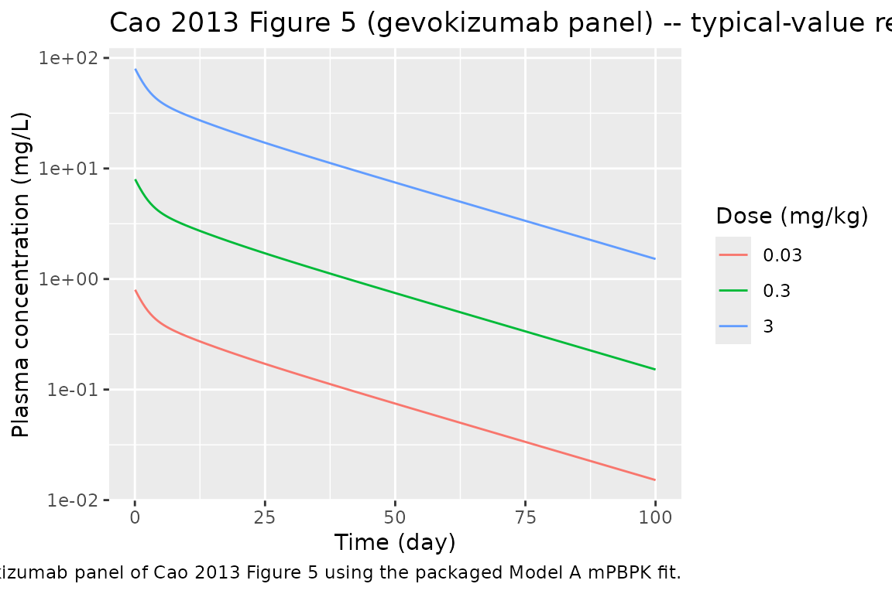

# Cao_2013_gevokizumab

## Model and source

- Citation: Cao Y, Balthasar JP, Jusko WJ. Second-generation minimal
  physiologically-based pharmacokinetic model for monoclonal antibodies.
  *J Pharmacokinet Pharmacodyn.* 2013 Oct;40(5):597-607.
- Article: <https://doi.org/10.1007/s10928-013-9332-2>
- Source data digitised from Cavelti-Weder C et al. *Diabetes Care.*
  2012;35(8):1654-1662 (PMID 22699287).

This is the **gevokizumab** entry from the 12-fit Cao 2013 mAb cohort.
The structural model (4-compartment mPBPK: plasma + tight-tissue
interstitial fluid + leaky-tissue interstitial fluid + lymph) is shared
by all 12 mAbs in the paper; each mAb has its own values of `sigma1`,
`sigma2`, and `CLp` (Model A) or `CLi` (Model B). This file uses **Model
A** (clearance from plasma) per the operator’s choice for the canonical
entries.

## Population

Cao et al. fit the mPBPK model to gevokizumab plasma concentration
profiles digitised from Cavelti-Weder 2012, anti-IL-1beta humanized IgG2
in adults with type 2 diabetes mellitus. Doses: 0.01, 0.03, 0.1, 0.3, 1,
3 mg/kg IV. Cao 2013 does not reproduce the underlying Cavelti-Weder
2012 demographics; consult the source publication for age, sex, and
other baseline characteristics. Cao 2013 used a 70 kg reference body
weight when assigning the human physiological constants (V_p = 2.6 L,
ISF = 15.6 L, lymph flow = 2.9 L/day).

The packaged metadata (`readModelDb("Cao_2013_gevokizumab")$population`)
records this study context.

## Source trace

| Equation / parameter | Value | Source location |
|----|----|----|
| 4-compartment mPBPK ODE system | – | Cao 2013 Eqs 1-4 (page 3, Model A) |
| Lumped tissue-volume splits (V_tight = 0.65 \* ISF \* Kp; V_leaky = 0.35 \* ISF \* Kp) | – | Cao 2013 Eq 6 |
| Lymph-flow splits (L1 = 0.33 \* L; L2 = 0.67 \* L) | – | Cao 2013 Eq 7 |
| `sigma1` (vascular reflection coefficient, tight tissues) | 0.931 | Cao 2013 Table 2, gevokizumab Model A (CV 2.58%) |
| `sigma2` (vascular reflection coefficient, leaky tissues) | 0.837 | Cao 2013 Table 2, gevokizumab Model A (CV 2.63%) |
| `CLp` (plasma clearance) | 0.00668 L/hr = 0.16032 L/day | Cao 2013 Table 2, gevokizumab Model A (CV 1.87%) |
| `sigmaL` (lymphatic capillary reflection coefficient) | 0.2 (fixed) | Cao 2013 Methods (assumed) |
| `Kp` (available ISF fraction for native IgG1) | 0.8 | Cao 2013 Methods, refs 22-23 |
| `Vplasma` for 70 kg adult | 2.6 L | Cao 2013 Table 2 footnote |
| `ISF` total interstitial fluid for 70 kg adult | 15.6 L | Cao 2013 Methods (refs 24-25) |
| Total lymph flow for 70 kg adult | 2.9 L/day | Cao 2013 Methods (refs 24-25) |
| `Vlymph` (assumed equal to plasma volume) | 2.6 L | Cao 2013 Methods, ref 21 |

## Virtual cohort

The packaged model has no IIV and no residual error – it is a
typical-value structural mPBPK model fit by Cao 2013 to digitised mean
profiles in ADAPT 5. Simulation reproduces the paper’s typical-value
fits.

``` r

obs_times <- sort(unique(c(seq(0, 1, by = 0.05),
                            seq(1, 14, by = 0.5),
                            seq(14, 100, by = 2))))

make_dose_panel <- function(dose_mg_per_kg, weight_kg = 70, id) {
  amt <- dose_mg_per_kg * weight_kg
  rxode2::et(amt = amt, cmt = "plasma", id = id) |>
    rxode2::et(time = obs_times, id = id)
}

events <- dplyr::bind_rows(
  as.data.frame(make_dose_panel(0.03,  id = 1L)) |> dplyr::mutate(dose_mg_per_kg = 0.03),
  as.data.frame(make_dose_panel(0.3,  id = 2L)) |> dplyr::mutate(dose_mg_per_kg = 0.3),
  as.data.frame(make_dose_panel(3,  id = 3L)) |> dplyr::mutate(dose_mg_per_kg = 3)
)
stopifnot(!anyDuplicated(unique(events[, c("id", "time", "evid")])))
```

## Simulation

``` r

mod <- readModelDb("Cao_2013_gevokizumab")
sim <- rxode2::rxSolve(rxode2::rxode2(mod), events = events,
                       keep = "dose_mg_per_kg") |>
  as.data.frame()
```

## Replicate Figure 5 (gevokizumab panel)

``` r

sim |>
  dplyr::filter(time > 0) |>
  ggplot2::ggplot(ggplot2::aes(time, Cc,
                                colour = factor(dose_mg_per_kg))) +
  ggplot2::geom_line() +
  ggplot2::scale_y_log10() +
  ggplot2::labs(
    x = "Time (day)", y = "Plasma concentration (mg/L)",
    colour = "Dose (mg/kg)",
    title = "Cao 2013 Figure 5 (gevokizumab panel) -- typical-value reproduction",
    caption = "Replicates the gevokizumab panel of Cao 2013 Figure 5 using the packaged Model A mPBPK fit."
  )
```



## PKNCA validation

Run NCA on the simulated plasma profile to compute Cmax, t_max, AUC_inf,
and terminal half-life. The packaged model has no IIV, so a single
trajectory per dose group represents the “typical” patient.

``` r

sim_nca <- sim |>
  dplyr::filter(!is.na(Cc), Cc > 0) |>
  dplyr::transmute(id = id, time = time, conc = Cc,
                   dose_mg_per_kg = dose_mg_per_kg)

dose_df <- events |>
  dplyr::filter(evid == 1) |>
  dplyr::transmute(id = id, time = time, amt = amt,
                   dose_mg_per_kg = dose_mg_per_kg)

conc_obj <- PKNCA::PKNCAconc(sim_nca, conc ~ time | dose_mg_per_kg + id)
dose_obj <- PKNCA::PKNCAdose(dose_df, amt ~ time | dose_mg_per_kg + id)

intervals <- data.frame(
  start      = 0,
  end        = Inf,
  cmax       = TRUE,
  tmax       = TRUE,
  aucinf.obs = TRUE,
  half.life  = TRUE
)

nca <- PKNCA::pk.nca(PKNCA::PKNCAdata(conc_obj, dose_obj, intervals = intervals))
nca_summary <- summary(nca)
knitr::kable(nca_summary, caption = "Simulated NCA parameters by dose group (Cao 2013 gevokizumab Model A typical-value fit).")
```

| start | end | dose_mg_per_kg | N   | cmax  | tmax  | half.life | aucinf.obs |
|------:|----:|---------------:|:----|:------|:------|:----------|:-----------|
|     0 | Inf |           0.03 | 1   | 0.808 | 0.000 | 21.5      | 13.1       |
|     0 | Inf |           0.30 | 1   | 8.08  | 0.000 | 21.5      | 131        |
|     0 | Inf |           3.00 | 1   | 80.8  | 0.000 | 21.5      | 1310       |

Simulated NCA parameters by dose group (Cao 2013 gevokizumab Model A
typical-value fit). {.table}

The terminal half-life predicted by the typical-value mPBPK fit
corresponds to gevokizumab’s reported half-life of approximately 2-3
weeks in the underlying Cavelti-Weder 2012 study; Cmax and AUC scale
linearly with dose because the model is purely linear (no TMDD, no
concentration-dependent clearance).

## Assumptions and deviations

- **No IIV, no residual error.** Cao 2013 fit the mPBPK model in ADAPT 5
  to digitised mean profiles using a typical-value variance model
  `V_i = (intercept + slope * Y_hat)^2` (Eq 9). Cao 2013 does not report
  the values of `intercept` and `slope`. The packaged model is a
  structural typical-value fit; downstream users wanting between-subject
  variability must add their own IIV.
- **Compartment names deviate from the nlmixr2lib canonical set**
  (`plasma`, `tight`, `leaky`, `lymph` instead of `central`,
  `peripheral1`, `peripheral2`, `effect`). The deviation is necessary
  because the four mPBPK compartments are mechanistically distinct
  (plasma vs. tight-tissue ISF vs. leaky-tissue ISF vs. lymph) and
  forcing them into the canonical PK-style names would obscure the
  physiology.
  [`checkModelConventions()`](https://nlmixr2.github.io/nlmixr2lib/reference/checkModelConventions.md)
  raises this as four warnings (one per compartment) and no errors.
- **Kp = 0.8 is hard-coded for native IgG1.** Siltuximab is a chimeric
  IgG1; native-IgG1 Kp is appropriate. Cao 2013 also uses Kp = 0.4 for
  native IgG4 elsewhere in the cohort, but the value is not estimated
  and is not modified subject-to-subject.
- **70 kg reference body weight.** Cao 2013 used a fixed 70 kg adult
  plasma volume, ISF volume, and lymph flow (Vplasma = 2.6 L, ISF = 15.6
  L, L = 2.9 L/day). For paediatric or markedly under- or over-weight
  subjects, the user must rescale these constants.
- **Model A (clearance from plasma) used by default.** Cao 2013 also
  reports Model B (clearance from interstitial fluid; CLi = 0.0193 L/hr
  for gevokizumab); Model A is used here for consistency across the 12
  nlmixr2lib entries from this paper. Cao 2013 reports a slightly lower
  objective-function value for Model B in 7 of 10 human mAbs but notes
  that Model A is more reasonable on the latent constraint sigma1 \>
  sigma2.
