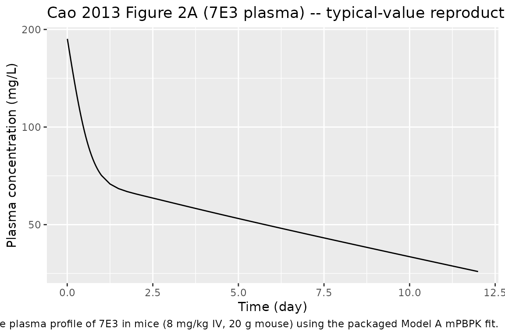

# Mab7E3 (Cao 2013)

## Model and source

- Citation: Cao Y, Balthasar JP, Jusko WJ. Second-generation minimal
  physiologically-based pharmacokinetic model for monoclonal antibodies.
  *J Pharmacokinet Pharmacodyn.* 2013 Oct;40(5):597-607.
- Article: <https://doi.org/10.1007/s10928-013-9332-2>
- Source data: Garg A, Balthasar JP. *J Pharmacokinet Pharmacodyn.*
  2007;34(5):687-709 (PMID 17636457).

This is the **mab7E3** preclinical mouse entry from the 12-fit Cao 2013
mAb cohort. 7E3 is the parent murine anti-GPIIb/IIIa IgG1 mAb (the
chimeric Fab fragment of which is approved as abciximab). The function
name is `mab7E3` because R identifiers cannot start with a digit; the
antibody is referred to as 7E3 in the source publications.

## Population

Cao et al. fit the mPBPK model to plasma profiles of 7E3 in mice from
Garg & Balthasar (2007). The mouse system parameters Cao 2013 used for
fitting are: V_p = 0.85 mL, ISF = 4.35 mL, total lymph flow = 0.12 mL/hr
(= 2.88 mL/day), assumed body weight 20 g, K_p = 0.8 (native IgG1),
sigma_L = 0.2. The dosing reported in Cao 2013 Figure 2 was a single 8
mg/kg IV bolus (= 0.16 mg in a 20 g mouse).

## Source trace

| Equation / parameter | Value | Source location |
|----|----|----|
| 4-compartment mPBPK ODE system | – | Cao 2013 Eqs 1-4 (Model A) |
| `sigma1` (vascular reflection coefficient, tight tissues) | 0.95, fixed | Cao 2013 Table 1 (7E3 Model A); footnote b “Assumed” |
| `sigma2` (vascular reflection coefficient, leaky tissues) | 0.421 | Cao 2013 Table 1 (7E3 Model A; CV 10.4%) |
| `CLp` (plasma clearance) | 0.499e-5 L/hr = 1.1976e-4 L/day | Cao 2013 Table 1 (7E3 Model A; CV 14.1%) |
| Mouse `Vplasma` | 0.85 mL = 0.00085 L | Cao 2013 Table 1 footnote |
| Mouse total ISF volume | 4.35 mL = 0.00435 L | Cao 2013 Table 1 footnote |
| Mouse total lymph flow | 0.12 mL/hr = 2.88 mL/day | Cao 2013 Table 1 footnote |

## Virtual cohort

The packaged model has no IIV. We simulate the single 8 mg/kg IV dose
reported in Cao 2013 Figure 2.

``` r

obs_times <- sort(unique(c(seq(0, 1/24, by = 1/240),
                            seq(1/24, 1, by = 1/24),
                            seq(1, 12, by = 0.25))))

ev <- rxode2::et(amt = 0.16, cmt = "plasma", id = 1L) |>
  rxode2::et(time = obs_times, id = 1L)
events <- as.data.frame(ev) |> dplyr::mutate(dose_mg_per_kg = 8)
stopifnot(!anyDuplicated(unique(events[, c("id", "time", "evid")])))
```

## Simulation

``` r

mod <- readModelDb("Cao_2013_mab7E3")
sim <- rxode2::rxSolve(rxode2::rxode2(mod), events = events,
                       keep = "dose_mg_per_kg") |>
  as.data.frame()
#> rxode2 already building model, waiting for lock file removal
#> lock file: "/tmp/RtmpsUWktn/rxode2/rx_c57570cdbd8c4a7151c3ee5bc6cb4139__.rxd/rx_c57570cdbd8c4a7151c3ee5bc6cb4139_.c.lock"
#> ..
# rxSolve drops the id column when there is a single subject; add it back
# so PKNCA's `~ ... | id` formula has the column it expects.
if (!"id" %in% names(sim)) sim$id <- 1L
```

## Replicate Figure 2 (7E3 in mice)

``` r

sim |>
  dplyr::filter(time > 0) |>
  ggplot2::ggplot(ggplot2::aes(time, Cc)) +
  ggplot2::geom_line() +
  ggplot2::scale_y_log10() +
  ggplot2::labs(
    x = "Time (day)", y = "Plasma concentration (mg/L)",
    title = "Cao 2013 Figure 2A (7E3 plasma) -- typical-value reproduction",
    caption = "Replicates the plasma profile of 7E3 in mice (8 mg/kg IV, 20 g mouse) using the packaged Model A mPBPK fit."
  )
```



## PKNCA validation

``` r

sim_nca <- sim |>
  dplyr::filter(!is.na(Cc)) |>
  dplyr::transmute(id = id, time = time, conc = Cc,
                   dose_mg_per_kg = dose_mg_per_kg)
dose_df <- events |>
  dplyr::filter(evid == 1) |>
  dplyr::transmute(id = id, time = time, amt = amt,
                   dose_mg_per_kg = dose_mg_per_kg)
conc_obj <- PKNCA::PKNCAconc(sim_nca, conc ~ time | dose_mg_per_kg + id)
dose_obj <- PKNCA::PKNCAdose(dose_df, amt ~ time | dose_mg_per_kg + id)
intervals <- data.frame(start = 0, end = Inf,
                        cmax = TRUE, tmax = TRUE,
                        aucinf.obs = TRUE, half.life = TRUE)
nca <- PKNCA::pk.nca(PKNCA::PKNCAdata(conc_obj, dose_obj, intervals = intervals))
knitr::kable(summary(nca),
             caption = "Simulated NCA parameters for Cao 2013 mab7E3 (Model A typical-value fit; 8 mg/kg single IV in 20 g mouse).")
```

| start | end | dose_mg_per_kg | N   | cmax | tmax  | half.life | aucinf.obs |
|------:|----:|---------------:|:----|:-----|:------|:----------|:-----------|
|     0 | Inf |              8 | 1   | 188  | 0.000 | 12.9      | 1310       |

Simulated NCA parameters for Cao 2013 mab7E3 (Model A typical-value fit;
8 mg/kg single IV in 20 g mouse). {.table}

## Assumptions and deviations

- **Preclinical-only entry.** Filed under
  `inst/modeldb/pharmacokinetics/` rather than `specificDrugs/` because
  nlmixr2lib’s `specificDrugs` tier is reserved for human drugs.
- **No IIV, no residual error.** The packaged model is a structural
  typical-value mPBPK fit. Cao 2013’s variance model
  `V_i = (intercept + slope * Y_hat)^2` (Eq 9) has its parameter values
  un-reported, and there is no biological-variability layer over a
  single mean profile.
- **Compartment names deviate from the canonical set** (`plasma`,
  `tight`, `leaky`, `lymph`). The deviation is necessary because the
  four mPBPK compartments are mechanistically distinct;
  [`checkModelConventions()`](https://nlmixr2.github.io/nlmixr2lib/reference/checkModelConventions.md)
  raises four warnings (one per compartment) and no errors.
- **sigma1 = 0.95 was fixed (assumed).** Cao 2013 Table 1 footnote b
  states “Assumed” for sigma1; CV is reported as not applicable.
- **Concentration unit.** The packaged model returns `Cc` in mg/L. Cao
  2013 Figure 2A plots 7E3 plasma in mg/L; the simulated curve is in
  those units. Tissue compartments hold amounts in mg; concentrations
  would need to be divided by the corresponding ISF tissue volume
  (vtight, vleaky) to compare against Cao 2013 Figure 2B.
- **Mouse system parameters are hard-coded** for a 20 g body weight (V_p
  = 0.85 mL, ISF = 4.35 mL, lymph flow = 2.88 mL/day). These are the
  values Cao 2013 used during fitting; rescaling for different mouse
  strains or weights requires recomputing all four physiological
  constants.
