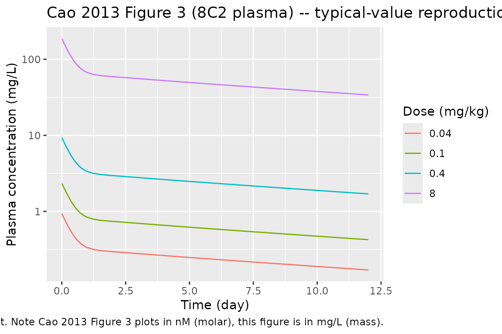

# Mab8C2 (Cao 2013)

## Model and source

- Citation: Cao Y, Balthasar JP, Jusko WJ. Second-generation minimal
  physiologically-based pharmacokinetic model for monoclonal antibodies.
  *J Pharmacokinet Pharmacodyn.* 2013 Oct;40(5):597-607.
- Article: <https://doi.org/10.1007/s10928-013-9332-2>
- Source data: Abuqayyas L, Balthasar JP. *Int J Pharm.*
  2012;439(1-2):8-16 (PMID 23018115).

This is the **mab8C2** preclinical mouse entry from the 12-fit Cao 2013
mAb cohort. 8C2 is a murine IgG1 anti-topotecan mAb used by Abuqayyas &
Balthasar as a non-binding carrier antibody. The function name is
`mab8C2` because R identifiers cannot start with a digit; the antibody
is referred to as 8C2 in the source publications.

## Population

Cao et al. fit the mPBPK model to plasma profiles of 8C2 in mice from
Abuqayyas & Balthasar (2012). The mouse system parameters Cao 2013 used
for fitting are: V_p = 0.85 mL, ISF = 4.35 mL, total lymph flow = 0.12
mL/hr (= 2.88 mL/day), assumed body weight 20 g, K_p = 0.8 (native
IgG1), sigma_L = 0.2. Cao 2013 Figure 3 shows the fitted plasma profiles
at four single IV doses: 0.04, 0.1, 0.4, and 8 mg/kg.

## Source trace

| Equation / parameter | Value | Source location |
|----|----|----|
| 4-compartment mPBPK ODE system | – | Cao 2013 Eqs 1-4 (Model A) |
| `sigma1` (vascular reflection coefficient, tight tissues) | 0.943 | Cao 2013 Table 1 (8C2 Model A; CV 30.7%) |
| `sigma2` (vascular reflection coefficient, leaky tissues) | 0.378 | Cao 2013 Table 1 (8C2 Model A; CV 34.2%) |
| `CLp` (plasma clearance) | 0.525e-5 L/hr = 1.260e-4 L/day | Cao 2013 Table 1 (8C2 Model A; CV 46.5%) |
| Mouse `Vplasma` | 0.85 mL = 0.00085 L | Cao 2013 Table 1 footnote |
| Mouse total ISF volume | 4.35 mL = 0.00435 L | Cao 2013 Table 1 footnote |
| Mouse total lymph flow | 0.12 mL/hr = 2.88 mL/day | Cao 2013 Table 1 footnote |

## Virtual cohort

``` r

obs_times <- sort(unique(c(seq(0, 1/24, by = 1/240),
                            seq(1/24, 1, by = 1/24),
                            seq(1, 12, by = 0.25))))

# Doses in mg per 20 g mouse: 0.04, 0.1, 0.4, 8 mg/kg -> 0.0008, 0.002, 0.008, 0.16 mg
make_panel <- function(dose_kg, id) {
  rxode2::et(amt = dose_kg * 0.020, cmt = "plasma", id = id) |>
    rxode2::et(time = obs_times, id = id)
}

events <- dplyr::bind_rows(
  as.data.frame(make_panel(0.04, id = 1L)) |> dplyr::mutate(dose_mg_per_kg = 0.04),
  as.data.frame(make_panel(0.1,  id = 2L)) |> dplyr::mutate(dose_mg_per_kg = 0.1),
  as.data.frame(make_panel(0.4,  id = 3L)) |> dplyr::mutate(dose_mg_per_kg = 0.4),
  as.data.frame(make_panel(8,    id = 4L)) |> dplyr::mutate(dose_mg_per_kg = 8)
)
stopifnot(!anyDuplicated(unique(events[, c("id", "time", "evid")])))
```

## Simulation

``` r

mod <- readModelDb("Cao_2013_mab8C2")
sim <- rxode2::rxSolve(rxode2::rxode2(mod), events = events,
                       keep = "dose_mg_per_kg") |>
  as.data.frame()
```

## Replicate Figure 3 (8C2 in mice)

``` r

sim |>
  dplyr::filter(time > 0) |>
  ggplot2::ggplot(ggplot2::aes(time, Cc, colour = factor(dose_mg_per_kg))) +
  ggplot2::geom_line() +
  ggplot2::scale_y_log10() +
  ggplot2::labs(
    x = "Time (day)", y = "Plasma concentration (mg/L)",
    colour = "Dose (mg/kg)",
    title = "Cao 2013 Figure 3 (8C2 plasma) -- typical-value reproduction",
    caption = "Replicates the dose-escalation plasma panel of 8C2 in mice using the packaged Model A mPBPK fit. Note Cao 2013 Figure 3 plots in nM (molar), this figure is in mg/L (mass)."
  )
```



## PKNCA validation

``` r

sim_nca <- sim |>
  dplyr::filter(!is.na(Cc)) |>
  dplyr::transmute(id = id, time = time, conc = Cc,
                   dose_mg_per_kg = dose_mg_per_kg)
dose_df <- events |>
  dplyr::filter(evid == 1) |>
  dplyr::transmute(id = id, time = time, amt = amt,
                   dose_mg_per_kg = dose_mg_per_kg)
conc_obj <- PKNCA::PKNCAconc(sim_nca, conc ~ time | dose_mg_per_kg + id)
dose_obj <- PKNCA::PKNCAdose(dose_df, amt ~ time | dose_mg_per_kg + id)
intervals <- data.frame(start = 0, end = Inf,
                        cmax = TRUE, tmax = TRUE,
                        aucinf.obs = TRUE, half.life = TRUE)
nca <- PKNCA::pk.nca(PKNCA::PKNCAdata(conc_obj, dose_obj, intervals = intervals))
knitr::kable(summary(nca),
             caption = "Simulated NCA parameters for Cao 2013 mab8C2 (Model A typical-value fit; single IV in 20 g mouse).")
```

| start | end | dose_mg_per_kg | N   | cmax  | tmax  | half.life | aucinf.obs |
|------:|----:|---------------:|:----|:------|:------|:----------|:-----------|
|     0 | Inf |           0.04 | 1   | 0.941 | 0.000 | 12.9      | 6.25       |
|     0 | Inf |           0.10 | 1   | 2.35  | 0.000 | 12.9      | 15.6       |
|     0 | Inf |           0.40 | 1   | 9.41  | 0.000 | 12.9      | 62.5       |
|     0 | Inf |           8.00 | 1   | 188   | 0.000 | 12.9      | 1250       |

Simulated NCA parameters for Cao 2013 mab8C2 (Model A typical-value fit;
single IV in 20 g mouse). {.table}

## Assumptions and deviations

- **Preclinical-only entry.** Filed under
  `inst/modeldb/pharmacokinetics/` rather than `specificDrugs/` because
  nlmixr2lib’s `specificDrugs` tier is reserved for human drugs.
- **No IIV, no residual error.** The packaged model is a structural
  typical-value mPBPK fit. Cao 2013’s variance model
  `V_i = (intercept + slope * Y_hat)^2` (Eq 9) has its parameter values
  un-reported, and there is no biological-variability layer over a
  single mean profile.
- **Compartment names deviate from the canonical set** (`plasma`,
  `tight`, `leaky`, `lymph`);
  [`checkModelConventions()`](https://nlmixr2.github.io/nlmixr2lib/reference/checkModelConventions.md)
  raises four warnings (one per compartment) and no errors.
- **Concentration unit.** The packaged model returns `Cc` in mg/L. Cao
  2013 Figure 3 plots 8C2 in nM (molar units following the original
  Abuqayyas 2012 measurements). Conversion: nM = (mg/L) / MW(mAb) \* 1e6
  with MW(mAb) ~ 1.5e5 g/mol (so 1 mg/L ~ 6.67 nM for a typical 150 kDa
  IgG1).
- **Mouse system parameters are hard-coded** for a 20 g body weight (V_p
  = 0.85 mL, ISF = 4.35 mL, lymph flow = 2.88 mL/day). These are the
  values Cao 2013 used during fitting; rescaling for different mouse
  strains or weights requires recomputing all four physiological
  constants.
- **CV% on fitted parameters is high** (30.7% for sigma1, 34.2% for
  sigma2, 46.5% for CLp) – consistent with Cao 2013’s note that 8C2 had
  a higher objective-function value (Obj = 772053 vs 5057 for 7E3)
  reflecting the dose-range data and per-dose precision.
