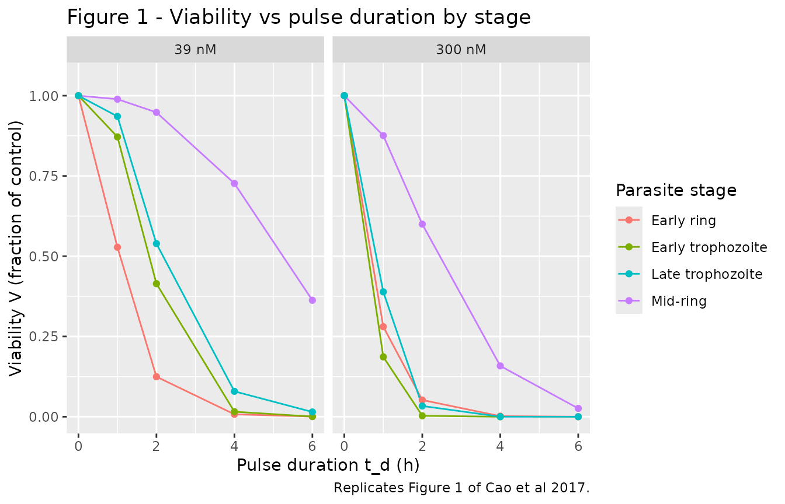
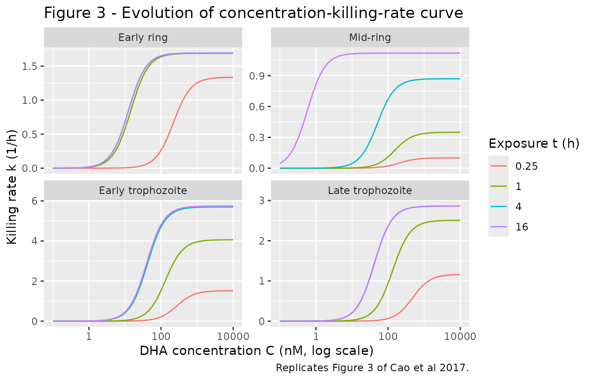
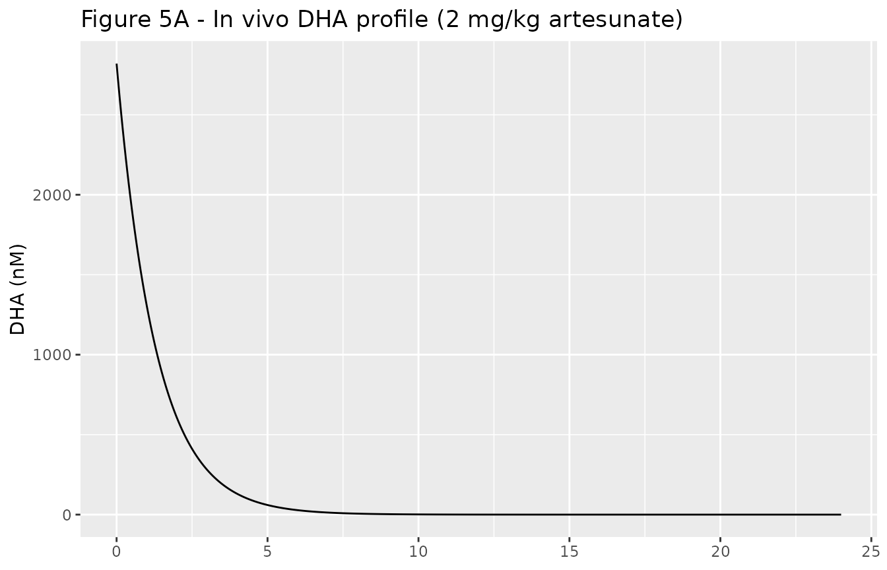
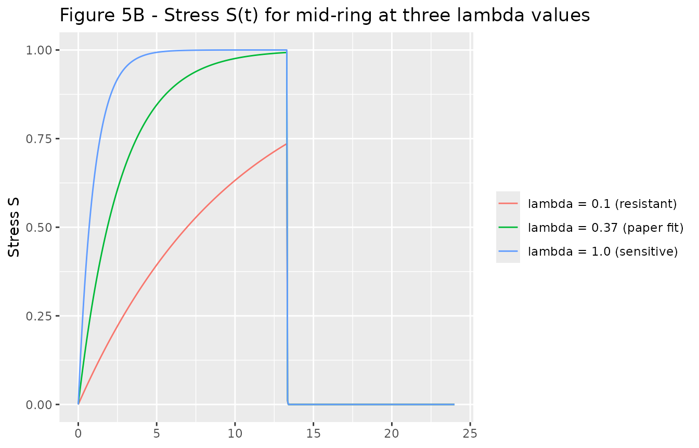
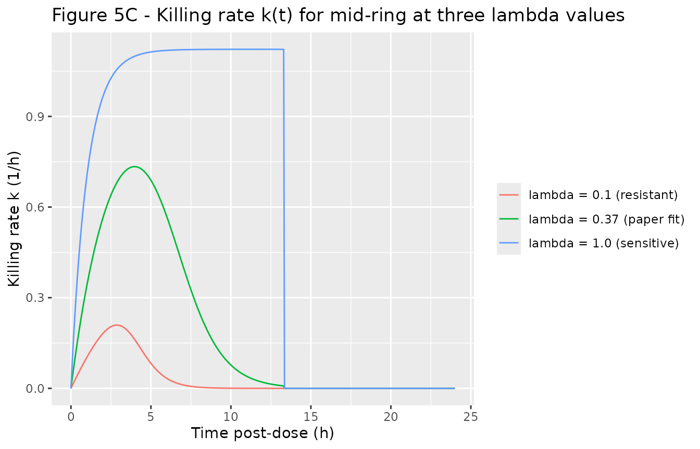

# Artemisinin/DHA dynamic stress PD (Cao 2017)

## Model and source

- Citation: Cao P, Klonis N, Zaloumis S, et al. A dynamic stress model
  explains the delayed drug effect in artemisinin treatment of
  *Plasmodium falciparum*. Antimicrob Agents Chemother.
  2017;61(12):e00618-17.
- Description: In vitro (P. falciparum 3D7 laboratory strain) dynamic
  stress PD model in which the dihydroartemisinin (DHA) parasite killing
  rate `k = kmax(S) * C^hill / (Kc(S)^hill + C^hill)` is modulated by a
  time-developing cell stress S(t) that accumulates while drug
  concentration C exceeds C\* = 0.1 nM and resets to zero otherwise.
- Article: <https://doi.org/10.1128/AAC.00618-17>

The paper fits the model by nonlinear mixed effects (NONMEM 7.3.0 +
Perl-speaks-NONMEM 3.7.6) separately to viability data for each of four
parasite life-cycle stages, giving four independent parameter sets
(Table 1). Each stage-specific fit is packaged as its own model file:

| Stage             | Model name                 | Age (h post-infection) |
|-------------------|----------------------------|------------------------|
| Early ring        | `Cao_2017_dha_ring_early`  | 2                      |
| Mid-ring          | `Cao_2017_dha_ring_mid`    | 7.5                    |
| Early trophozoite | `Cao_2017_dha_troph_early` | 24                     |
| Late trophozoite  | `Cao_2017_dha_troph_late`  | 34                     |

All four files share the same structural ODE form; only the four
stage-specific parameters lambda, alpha, beta1, beta2 differ between
them. The Hill coefficient gamma (paper symbol) is fixed across stages
at 1.7892 (Table 1 footnote a; pooled mean of the four stage estimates
in Table S1).

## Population

The model was calibrated against in vitro viability data from tightly
age-synchronized *Plasmodium falciparum* 3D7 cultures (\>80% of
parasites within a 1-hour age window) treated with a single drug pulse
of dihydroartemisinin (DHA) for 1, 2, 4, or 6 hours before washing.
Viability was assessed in the trophozoite stage of the following
intraerythrocytic life cycle, 48 hours after pulse start, with M3
censoring at the 0.005 limit of detection. The viability data were
sourced from Klonis et al. 2013 (Cao 2017 reference 7); experiments were
performed in technical duplicates.

`readModelDb("Cao_2017_dha_ring_early")$population` returns the same
metadata programmatically once the package is loaded.

## Source trace

Per-parameter sources are recorded inline in each
`inst/modeldb/specificDrugs/Cao_2017_dha_<stage>.R`. The combined table
below collects them in one place for review.

| Equation / parameter | Value | Units | Source location |
|----|----|----|----|
| Killing rate (eq 5) | `k = kmax(S) * C^hill / (Kc(S)^hill + C^hill)` | 1/h | Paper eq 5 |
| Stress accumulation (eq 6) | `dS/dt = lambda*(1-S)` while C \> C\*, else S decays to 0 | 1/h | Paper eq 6 + Fig 6 legend |
| kmax modulation (eq 7) | `kmax(S) = alpha * S` | 1/h | Paper eq 7 |
| Kc modulation (eq 8) | `Kc(S) = beta1*(1-S) + beta2` | nM | Paper eq 8 |
| Parasite kinetics (eq 4) | `dN/dt = -k(C, S) * N`, N(0) = 1 | unitless | Paper eq 4 + eq 17 |
| In vitro PK (eq 13) | `C(t) = C0 * 0.5^(t/8)` while pulse on, else 0 | nM | Paper eq 13, page 5 (t1/2 = 8 h, ref 21) |
| In vivo PK (eq 18) | biphasic: linear rise to Cmax at tm, exponential decay | nM | Paper eq 18 (used in vignette below; not in model file) |
| `lambda` (early ring) | 6.2504 | 1/h | Table 1 (SE 0.5745) |
| `alpha` (early ring) | 1.6915 | 1/h | Table 1 (SE 0.1378) |
| `beta1` (early ring) | 990.84 | nM | Table 1 (SE 373.49) |
| `beta2` (early ring) | 12.519 | nM | Table 1 (SE 1.0631) |
| `lambda` (mid-ring) | 0.3729 | 1/h | Table 1 (SE 0.1406) |
| `alpha` (mid-ring) | 1.1224 | 1/h | Table 1 (SE 0.2455) |
| `beta1` (mid-ring) | 224.39 | nM | Table 1 (SE 112.12) |
| `beta2` (mid-ring) | 9.97e-4 | nM | Table 1 (SE 1.26e-4) |
| `lambda` (early troph) | 1.2290 | 1/h | Table 1 (SE 0.2249) |
| `alpha` (early troph) | 5.7434 | 1/h | Table 1 (SE 0.7460) |
| `beta1` (early troph) | 317.64 | nM | Table 1 (SE 86.143) |
| `beta2` (early troph) | 39.570 | nM | Table 1 (SE 4.6038) |
| `lambda` (late troph) | 2.0906 | 1/h | Table 1 (SE 0.2909) |
| `alpha` (late troph) | 2.8626 | 1/h | Table 1 (SE 0.1591) |
| `beta1` (late troph) | 740.02 | nM | Table 1 (SE 178.77) |
| `beta2` (late troph) | 41.405 | nM | Table 1 (SE 3.6606) |
| `hill` (= gamma) | 1.7892 | unitless | Table 1 footnote a (Table S1 pooled mean) |
| `Cstar` (= C\*) | 0.1 | nM | Fig 6 legend |
| `kdrug_pulse` (in vitro) | `log(2)/8` ~ 0.0866 | 1/h | Page 5 (DHA in vitro t1/2 = 8 h, ref 21) |
| `kdrug_pulse` (in vivo) | `log(2)/0.9` ~ 0.770 | 1/h | Paper eq 18 (DHA in vivo t1/2 = 0.9 h, refs 2 + 21) |
| Cmax (in vivo, 2 mg/kg artesunate) | 2820 | nM | Paper eq 18 narrative (refs 2 + 21) |
| tm (time to Cmax, in vivo) | 1 | h | Paper eq 18 narrative |

### Dimensional analysis

Every state and every term in the ODE system carries explicit units:

- `central` (nM): drug concentration. d/dt(central) = -kdrug (1/h) \*
  central (nM) = (nM/h). Matches d(central)/dt.
- `stress` (unitless, in \[0, 1\]): d/dt(stress) = lambda (1/h) \* (1 -
  stress) (unitless) = (1/h). The (1 - above_thresh) decay branch has
  the same 1/h units. Matches d(stress)/dt.
- `parasites` (unitless, fraction of N(0) = 1): d/dt(parasites) =
  -k_kill (1/h) \* parasites (unitless) = (1/h). Matches
  d(parasites)/dt.
- `k_kill` (1/h):
  `kmax (1/h) * Ceps^hill (nM^hill) / (Kceps^hill + Ceps^hill) (nM^hill)`.
  The numerator and denominator concentration powers cancel, leaving
  1/h.
- `Kc` (nM): `beta1 (nM) * (1 - stress) (unitless) + beta2 (nM)` = (nM).

All units are internally consistent.

## Loading the four stage models

``` r

mods <- list(
  ring_early  = readModelDb("Cao_2017_dha_ring_early"),
  ring_mid    = readModelDb("Cao_2017_dha_ring_mid"),
  troph_early = readModelDb("Cao_2017_dha_troph_early"),
  troph_late  = readModelDb("Cao_2017_dha_troph_late")
)
```

Each model has three ODE states (`central`, `stress`, `parasites`) and
exposes the eight design parameters in `ini()`. The structural form is
identical across stages; only the four stage-specific paper values
differ.

## Replicate Figure 1: viability vs pulse duration by initial DHA concentration

Figure 1 of the paper shows the four-stage viability curves at initial
DHA concentrations of approximately 39 nM (left panel) and 300 nM (right
panel) for pulse durations 1, 2, 4, and 6 h. The dynamic stress model
produces stage-specific viability curves that the standard (stationary)
model cannot reproduce.

``` r

pulse_durations <- c(0, 1, 2, 4, 6)
concentrations  <- c(39, 300)
stages          <- names(mods)
stage_labels    <- c(ring_early = "Early ring",
                     ring_mid   = "Mid-ring",
                     troph_early = "Early trophozoite",
                     troph_late = "Late trophozoite")

simulate_viability <- function(stage, c0, td) {
  if (td <= 0) return(1)  # paper convention: V(td=0) = 1
  ev <- et(amt = c0, time = 0, cmt = "central") |>
        et(time = c(td, 48))
  s <- rxSolve(mods[[stage]], ev, params = c(tend_pulse = td))
  s$parasites[which.min(abs(s$time - 48))]
}

grid <- expand.grid(
  stage = stages,
  c0    = concentrations,
  td    = pulse_durations,
  stringsAsFactors = FALSE
)
grid$viability <- mapply(simulate_viability, grid$stage, grid$c0, grid$td)
grid$stage_lab <- stage_labels[grid$stage]
grid$c0_lab    <- factor(paste0(grid$c0, " nM"),
                         levels = paste0(concentrations, " nM"))

ggplot(grid, aes(td, viability, colour = stage_lab)) +
  geom_line() +
  geom_point() +
  facet_wrap(~ c0_lab) +
  scale_y_continuous(limits = c(0, 1.05)) +
  labs(x = "Pulse duration t_d (h)",
       y = "Viability V (fraction of control)",
       colour = "Parasite stage",
       title = "Figure 1 - Viability vs pulse duration by stage",
       caption = "Replicates Figure 1 of Cao et al 2017.")
#> Warning: Removed 1 row containing missing values or values outside the scale range
#> (`geom_line()`).
#> Warning: Removed 1 row containing missing values or values outside the scale range
#> (`geom_point()`).
```



Per Cao 2017 Fig 1 and Fig 4, the mid-ring panel shows the strongest
delay: viability at t_d = 1 h remains close to 1 even at 300 nM, because
the slow stress accumulation rate (lambda = 0.37 /h, half-life of
unstressed state ~1.86 h) keeps S near zero through the entire 1-hour
pulse. Trophozoite stages drop to near-zero viability by t_d = 4 h at
300 nM. Early ring is intermediate.

## Replicate Figure 3: concentration vs killing rate curve evolution

Figure 3 of the paper plots k(C, S(t)) as a function of C at several
exposure durations t, showing how the curve evolves from k = 0
(unstressed) toward the stationary curve
`alpha * C^hill / (beta2^hill + C^hill)` (fully stressed). The mid-ring
stage shows the slowest approach to the stationary curve.

``` r

build_kc_curve <- function(stage, t_evals, c_grid = exp(seq(log(0.1), log(10000), length.out = 50))) {
  # Hold drug at a constant level c_grid[i] for the duration t_eval, then read
  # off the killing rate k_kill at time t_eval. We do this by simulating with
  # tend_pulse > t_eval (so the pulse is always active) and kdrug_pulse = 0
  # (so the drug level stays exactly at C0 throughout). The model returns
  # k_kill as a derived variable at every output time.
  rows <- vector("list", length(t_evals))
  for (j in seq_along(t_evals)) {
    t_ev <- t_evals[j]
    ks <- numeric(length(c_grid))
    for (i in seq_along(c_grid)) {
      ev <- et(amt = c_grid[i], time = 0, cmt = "central") |>
            et(time = t_ev)
      s <- rxSolve(mods[[stage]], ev,
                   params = c(tend_pulse = max(t_ev + 1, 48),
                              kdrug_pulse = 0))
      ks[i] <- s$k_kill[which.min(abs(s$time - t_ev))]
    }
    rows[[j]] <- data.frame(stage = stage, t = t_ev, C = c_grid, k = ks)
  }
  do.call(rbind, rows)
}

t_evals <- c(0.25, 1, 4, 16)
fig3 <- do.call(rbind, lapply(stages, build_kc_curve, t_evals = t_evals))
fig3$stage_lab <- factor(stage_labels[fig3$stage], levels = stage_labels)

ggplot(fig3, aes(C, k, colour = factor(t))) +
  geom_line() +
  facet_wrap(~ stage_lab, scales = "free_y") +
  scale_x_log10() +
  labs(x = "DHA concentration C (nM, log scale)",
       y = "Killing rate k (1/h)",
       colour = "Exposure t (h)",
       title = "Figure 3 - Evolution of concentration-killing-rate curve",
       caption = "Replicates Figure 3 of Cao et al 2017.")
```



The mid-ring panel shows the most pronounced delay: at t = 0.25 h the
curve is essentially flat (k ~ 0), at t = 1 h it has only crept up to
about a third of the stationary value, and at t = 16 h it has approached
the stationary form `alpha * C^hill / (beta2^hill + C^hill)` with the
very small mid-ring beta2 = 9.97e-4 nM giving a sub-nanomolar
half-maximal concentration.

## Replicate Figure 5: in vivo PK + stress + killing rate for the mid-ring stage

Figure 5 of the paper shows the in vivo DHA concentration profile
following a single 2 mg/kg artesunate dose (Cmax = 2820 nM, tm = 1 h,
t1/2 = 0.9 h per paper eq 18), the corresponding mid-ring stress
trajectory S(t), and the resulting time-varying killing rate k(t). The
black trace is the published lambda = 0.37 /h fit; the red trace shows
how a smaller lambda (drug-tolerant resistance phenotype) delays the
killing-rate trajectory.

``` r

# In vivo simulation: override kdrug_pulse to log(2)/0.9 to match the in vivo
# DHA half-life, and set tend_pulse very large so the wash-out branch never
# triggers (drug profile is driven purely by the bolus dose and first-order
# decay).
in_vivo_params <- function(lambda_override = NULL) {
  p <- c(kdrug_pulse = log(2) / 0.9, tend_pulse = 1e6)
  if (!is.null(lambda_override)) p["lambda"] <- lambda_override
  p
}

# 24-h horizon, single 2820 nM bolus into central at t = 0. The paper's
# eq 18 starts with a linear rise to Cmax over 1 h, but for the stress and
# killing-rate trajectories the difference between the linear rise and a
# pure exponential decay from Cmax is small (S is integrated, k is bounded
# by alpha); we use the exponential approximation for simplicity.
ev_vivo <- et(amt = 2820, time = 0, cmt = "central") |>
           et(seq(0, 24, by = 0.05))

sim_paper <- rxSolve(mods$ring_mid, ev_vivo,
                    params = in_vivo_params()) |> as.data.frame()
sim_lower <- rxSolve(mods$ring_mid, ev_vivo,
                    params = in_vivo_params(lambda_override = 0.1)) |>
             as.data.frame()
sim_higher <- rxSolve(mods$ring_mid, ev_vivo,
                     params = in_vivo_params(lambda_override = 1.0)) |>
              as.data.frame()

fig5 <- bind_rows(
  mutate(sim_paper,  variant = "lambda = 0.37 (paper fit)"),
  mutate(sim_lower,  variant = "lambda = 0.1 (resistant)"),
  mutate(sim_higher, variant = "lambda = 1.0 (sensitive)")
) |>
  mutate(variant = factor(variant,
                          levels = c("lambda = 0.1 (resistant)",
                                     "lambda = 0.37 (paper fit)",
                                     "lambda = 1.0 (sensitive)")))

# Top: DHA concentration
p_conc <- ggplot(filter(fig5, variant == "lambda = 0.37 (paper fit)"),
                 aes(time, central)) +
  geom_line() +
  labs(x = NULL, y = "DHA (nM)",
       title = "Figure 5A - In vivo DHA profile (2 mg/kg artesunate)")

# Middle: stress S(t)
p_stress <- ggplot(fig5, aes(time, stress, colour = variant)) +
  geom_line() +
  labs(x = NULL, y = "Stress S",
       colour = NULL,
       title = "Figure 5B - Stress S(t) for mid-ring at three lambda values")

# Bottom: killing rate k(t)
p_kill <- ggplot(fig5, aes(time, k_kill, colour = variant)) +
  geom_line() +
  labs(x = "Time post-dose (h)", y = "Killing rate k (1/h)",
       colour = NULL,
       title = "Figure 5C - Killing rate k(t) for mid-ring at three lambda values")

p_conc
```



``` r

p_stress
```



``` r

p_kill
```



Figure 5C is the central result: when lambda is reduced (drug-tolerant
phenotype), the stress trajectory peaks lower and later, and the area
under the killing-rate curve drops substantially – even though the DHA
concentration profile is unchanged. This is the exposure-time mechanism
of artemisinin resistance the paper proposes in Discussion.

## Mass-balance / state sanity check

In the absence of drug, the parasite count should remain at its initial
value N(0) = 1 indefinitely (paper eq 4 with k = 0). The stress variable
should stay at 0 (paper eq 6 with C \< C\*).

``` r

ev_zero <- et(amt = 0, time = 0, cmt = "central") |>
           et(seq(0, 48, by = 0.5))
sim_zero <- rxSolve(mods$ring_early, ev_zero) |> as.data.frame()
cat(sprintf("Max |parasites - 1| over 48 h, no drug: %.3e\n",
            max(abs(sim_zero$parasites - 1))))
#> Max |parasites - 1| over 48 h, no drug: 0.000e+00
cat(sprintf("Max |stress|     over 48 h, no drug: %.3e\n",
            max(abs(sim_zero$stress))))
#> Max |stress|     over 48 h, no drug: 0.000e+00
cat(sprintf("Max |central|    over 48 h, no drug: %.3e\n",
            max(abs(sim_zero$central))))
#> Max |central|    over 48 h, no drug: 0.000e+00
```

All three should be zero (or numerical noise \<1e-10).

## Assumptions and deviations

- **No residual error or IIV.** The paper estimated between-duplicate
  (`sigma_b^2`) and within-duplicate (`sigma_w^2`) residual variances by
  NLME with M3-method handling at the 0.005 limit of detection, but the
  numeric variances are NOT reported in Cao 2017 Table 1. Per nlmixr2lib
  policy on unreported variance components for mechanistic models, the
  four model files are encoded as typical-value deterministic mechanisms
  without `~ propSd` / `~ addSd` / `eta*` terms. They are intended for
  simulation, not refitting.
- **Stress reset approximation.** The paper specifies an instantaneous
  reset of the stress variable S(t) to zero whenever C \< C\* = 0.1 nM
  (Fig 6 legend). The model files encode this with a fast first-order
  decay rate (`kreset = 100 /h`, effective half-life ~25 s) that is
  ODE-solver-friendly and mathematically near-equivalent on the
  timescales of parasite killing (1-6 h in vitro pulses; 24-h in vivo
  dosing intervals).
- **Wash-out approximation.** The paper’s in vitro experimental design
  (Klonis 2013, Cao 2017 reference 7) physically replaces the drug
  medium with drug-free medium at the end of each pulse. The model files
  encode this with a time-switched DHA elimination rate that jumps from
  `kdrug_pulse = log(2)/8 /h` to `kreset = 100 /h` when
  `time >= tend_pulse`, producing the same effectively-instant wash-out
  behaviour.
- **Numerical floor on decay.** The post-wash exponential decay of
  `central` and `stress` at rate 100/h reaches subnormal floating- point
  values over multi-day observation horizons, which can contaminate
  downstream Hill-power and parasite-kinetic terms with NaN. Each ODE
  rate term carries an `(<state> > 1e-9)` indicator factor that halts
  the decay once the state is numerically indistinguishable from zero.
  This is a numerical hygiene fix only; it does not change the paper’s
  mathematical specification.
- **In vivo PK approximation in Figure 5.** The paper’s eq 18 gives a
  biphasic in vivo DHA profile (linear rise from 0 to Cmax over tm = 1
  h, then exponential decay with t1/2 = 0.9 h). The Figure 5 vignette
  block uses a single bolus into `central` at t = 0 followed by
  exponential decay at `log(2)/0.9 /h`, which differs from the biphasic
  form during the first hour but matches the Cmax and elimination
  half-life. The integrated stress accumulation and area under the
  killing-rate curve are similar.
- **Figure 6 not reproduced.** The paper’s Figure 6 simulates a full
  age-structured PDE for parasite clearance under the AS7 regimen (2
  mg/kg artesunate q24h x 7 days), with parasites of different ages
  experiencing stage-specific killing parameters simultaneously.
  Reproducing the full age-structured PDE in rxode2 is out of scope for
  this stage-specific model series; the four per-stage models supplied
  here are the building blocks. A user wanting the AS7 simulation can
  drive each stage’s model with the in vivo PK profile and assemble the
  per-stage clearance curves into the population-level simulation post
  hoc.
