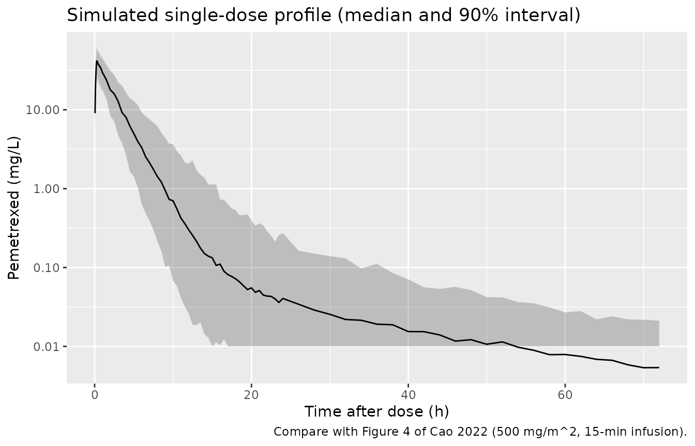
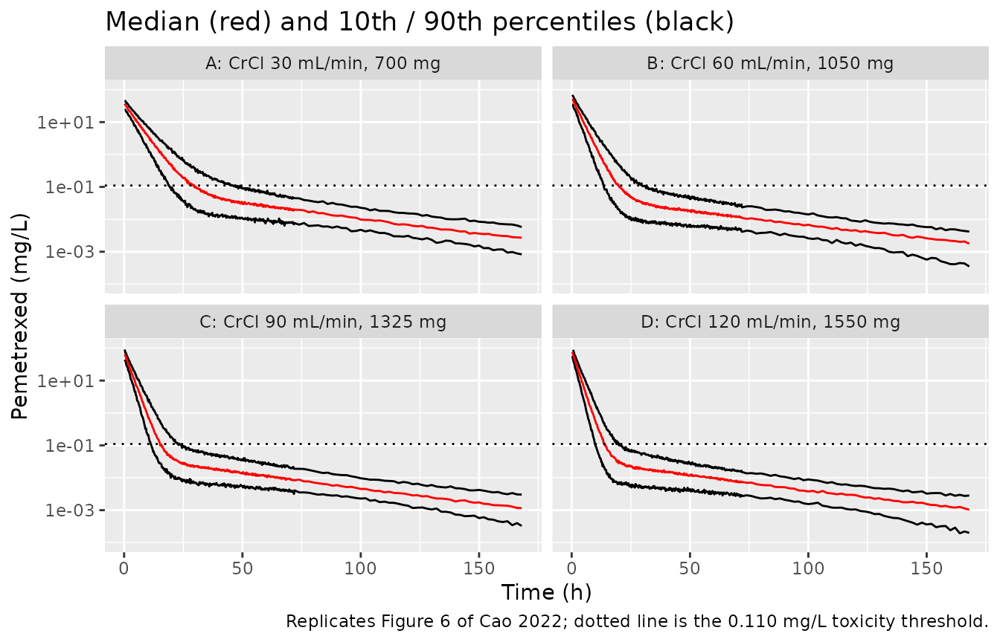

# Pemetrexed (Cao 2022)

## Model and source

    #> ℹ parameter labels from comments will be replaced by 'label()'

- Citation: Cao P, Guo W, Wang J, Wu S, Huang Y, Wang Y, Liu Y, Zhang Y
  (2022). Population pharmacokinetic study of pemetrexed in chinese
  primary advanced non-small cell lung carcinoma patients. Frontiers in
  Pharmacology 13:954242. <doi:10.3389/fphar.2022.954242>. Final
  parameter estimates from Table 2 and the final-model equation in the
  Results (‘Final PPK model validation’).

- Description: Two-compartment population PK model with first-order
  elimination for intravenous pemetrexed (15-minute infusion, 500
  mg/m^2) in Chinese adults with primary advanced non-small cell lung
  carcinoma (Cao 2022; 116 patients, 192 plasma concentrations).
  Clearance (8.29 L/h at the cohort mean) scales as a power function of
  Cockcroft-Gault creatinine clearance normalised to 93.6 mL/min
  (exponent 0.58); intercompartmental clearance is raised in ERCC1
  rs3212986 C/C homozygotes and in CYP3A5 rs776746 T/C (*1/*3)
  heterozygotes (exponential effects). Exponential interindividual
  variability on clearance and intercompartmental clearance (none on the
  volumes, dropped for \>99% shrinkage) and a proportional residual
  error.

- Article: <https://doi.org/10.3389/fphar.2022.954242>

Cao and colleagues ran a prospective population PK study of intravenous
pemetrexed in 116 Chinese adults with primary advanced non-small cell
lung carcinoma, genotyping every patient across a panel of transporter,
metabolic-enzyme and DNA-repair SNPs. A two-compartment model with
first-order elimination described the 192 plasma concentrations.
Cockcroft-Gault creatinine clearance was the covariate retained on
clearance (a power function), and two gene polymorphisms, ERCC1
rs3212986 and CYP3A5 rs776746, were retained on intercompartmental
clearance Q. The paper’s practical conclusion is that BSA-based dosing
overexposes patients with poor renal function and underexposes those
with high renal function, so a renal-function-based dose is preferable.
This vignette checks the packaged encoding against closed-form exposure,
then reproduces the paper’s exposure simulations (Table 3, the
recommended renal-function-based doses, and the toxicity-threshold
profiles of Figure 6) and the single-dose concentration-time profile of
Figure 4.

## Population

116 Chinese adults (69 male, 47 female) enrolled at Wuhan Union Hospital
between February 2018 and December 2019 contributed 192 plasma samples
(one to three per patient). Median age was 57 years (range 27-73) and
median body surface area 1.7 m^2 (range 1.4-2.0). All received
pemetrexed 500 mg/m^2 as a 15-minute intravenous infusion at the first
chemotherapy cycle, combined in 111 of 116 patients with a platinum
agent (cisplatin/carboplatin/nedaplatin 43:37:31). Cockcroft-Gault
creatinine clearance had a median of 89.5 mL/min (mean 93.6, SD 26.5,
range 47.5-179.7). Samples were drawn at 0.5, 1, 3, 5, 7, 24, 48 or 72 h
after infusion (Cao 2022 Table 1 and Methods).

The same information is available programmatically via the model’s
`population` metadata
(`readModelDb("Cao_2022_pemetrexed")()$population`).

## Source trace

The final model is specified by the final-model equation in the Results
and by Table 2 (final-model estimates with RSEs and bootstrap medians,
so they are final estimates). The per-parameter origin is also recorded
as an in-file comment next to each `ini()` entry in
`inst/modeldb/specificDrugs/Cao_2022_pemetrexed.R`.

| Equation / parameter | Value | Source location |
|----|----|----|
| `lcl` (typical CL at CRCL = 93.6 mL/min) | 8.29 L/h | Table 2 CL row (RSE 4.43%) |
| `lvc` (central volume V1) | 18.94 L | Table 2 V1 row (RSE 5.94%) |
| `lq` (intercompartmental clearance Q, reference genotype) | 0.10 L/h | Table 2 Q row (RSE 18.03%) |
| `lvp` (peripheral volume V2) | 5.12 L | Table 2 V2 row (RSE 18.85%) |
| `e_crcl_cl` | 0.58 | Table 2 theta_1 (RSE 26.90%); final-model equation |
| `e_ercc1_q` | 0.83 | Table 2 theta_2 (RSE 29.66%); final-model equation |
| `e_cyp3a5_q` | 0.62 | Table 2 theta_3 (RSE 36.45%); final-model equation |
| `var(etalcl)` | 0.0561 | Table 2 IIV(omega%) CL = 5.61, a variance x 100 (see the variance check) |
| `var(etalq)` | 0.2417 | Table 2 IIV(omega%) Q = 24.17, a variance x 100 |
| `propSd` | 0.2472 | Table 2 residual sigma(%) = 24.72 (RSE 14.11%) |
| `CL = 8.29 * (CRCL/93.6)^0.58 * exp(eta_CL)` | n/a | Final-model equation; CrClMean = 93.6 |
| `Q = 0.10 * exp(0.83*ERCC1_CC) * exp(0.62*CYP3A5_het) * exp(eta_Q)` | n/a | Final-model equation; genotype rules in text |
| `V1`, `V2` no IIV (dropped for 99.5%/99.97% shrinkage) | n/a | Results final-model text |
| two-compartment ODEs, first-order elimination | n/a | Results base-model text |
| `Cc ~ prop(propSd)` | n/a | Methods: proportional residual (smallest OFV) |

## Structural verification

These checks do not depend on a random draw, so tight bounds are
correct.

### Variance scale against Table 2

Table 2 prints `IIV(omega%)` of 5.61 (CL) and 24.17 (Q) without saying
what the percentage is. Phoenix NLME reports the Omega matrix as
variances, and the packaged model reads the percentages as those
variances x 100 (`omega^2` = 0.0561 and 0.2417). Read instead as an SD
or CV, the CL variability would be only about 5.6%.

Table 3 decides between the two readings without any random draw. Its
single-dose AUC is `Dose / CL`, so at a fixed creatinine clearance the
AUC spread comes only from `eta_CL`, and the 97.5th / 2.5th percentile
ratio is `exp(2 x 1.96 x sqrt(omega^2_CL))`. Every row of Table 3 has a
ratio of about 2.70 (for example 248.72 / 92.08 at CrCl 30 mL/min and
700 mg).

``` r

om <- ui$omega
t3_ci <- data.frame(lo = c(92.08, 111.81, 118.39, 61.54, 74.72, 92.30,
                           59.03, 83.33, 92.01, 49.93, 70.50, 91.06),
                    hi = c(248.72, 302.02, 319.79, 166.22, 201.83, 249.32,
                           159.44, 225.09, 248.54, 134.88, 190.42, 245.96))
paper_ratio <- median(t3_ci$hi / t3_ci$lo)

ci_ratio <- function(v) exp(2 * qnorm(0.975) * sqrt(v))
var_chk <- data.frame(
  reading = c("variance x 100 (packaged)", "SD x 100", "log-normal CV"),
  omega2_cl = c(om["etalcl", "etalcl"], 0.0561^2, log(1 + 0.0561^2))
) |>
  dplyr::mutate(auc_ci_ratio = ci_ratio(omega2_cl))

knitr::kable(
  var_chk |>
    dplyr::rename("Reading of 'IIV(omega%) = 5.61'" = reading,
                  "omega^2 on CL" = omega2_cl,
                  "Implied AUC 97.5/2.5 pct ratio" = auc_ci_ratio),
  digits = c(0, 5, 2),
  caption = sprintf("Implied Table 3 AUC 95%% interval width; Table 3 median ratio = %.2f.",
                    paper_ratio)
)
```

| Reading of ‘IIV(omega%) = 5.61’ | omega^2 on CL | Implied AUC 97.5/2.5 pct ratio |
|:---|---:|---:|
| variance x 100 (packaged) | 0.05610 | 2.53 |
| SD x 100 | 0.00315 | 1.25 |
| log-normal CV | 0.00314 | 1.25 |

Implied Table 3 AUC 95% interval width; Table 3 median ratio = 2.70.
{.table}

``` r


# Packaged variances are exactly the printed percentages / 100.
stopifnot(abs(om["etalcl", "etalcl"] - 0.0561) < 1e-12,
          abs(om["etalq", "etalq"] - 0.2417) < 1e-12)
# The packaged reading reproduces the Table 3 interval width to within 10%
# (Table 3 is a finite simulation and may carry residual error, so it runs
# slightly wider); the SD/CV readings imply an interval less than half as wide.
stopifnot(abs(var_chk$auc_ci_ratio[1] / paper_ratio - 1) < 0.10,
          all(var_chk$auc_ci_ratio[2:3] < paper_ratio / 2))
```

Two further features of the paper agree with the variance reading: the
eta-shrinkage on CL is only 13.89%, which a 5.6% CV could not give from
one to three samples per patient against a 24.7% residual error, and the
individual clearances plotted in Figure 2A scatter by roughly +/-30%
around the creatinine clearance trend. The 10th-90th percentile bands of
Figure 6, reproduced below, are also as wide as the variance reading
implies.

### Covariate and genotype relations

The solved individual clearance must equal `8.29 * (CRCL/93.6)^0.58`,
and the solved intercompartmental clearance must equal
`0.10 * exp(0.83 * ERCC1_CC) * exp(0.62 * CYP3A5_het)`.

``` r

typ <- rxode2::zeroRe(ui)
grid <- expand.grid(CRCL = c(47.5, 89.5, 93.6, 179.7),
                    SNP_ERCC1_RS3212986_CC = c(0, 1),
                    CYP3A5_STAR1_HET = c(0, 1))
grid$id <- seq_len(nrow(grid))
ev_cov <- do.call(rbind, lapply(grid$id, function(i) {
  data.frame(id = i, time = c(0, 1), amt = c(850, 0), rate = c(850 / 0.25, 0),
             evid = c(1, 0), cmt = "central",
             CRCL = grid$CRCL[i],
             SNP_ERCC1_RS3212986_CC = grid$SNP_ERCC1_RS3212986_CC[i],
             CYP3A5_STAR1_HET = grid$CYP3A5_STAR1_HET[i])
}))
cov_chk <- rxode2::rxSolve(typ, ev_cov, returnType = "data.frame") |>
  dplyr::group_by(id) |>
  dplyr::summarise(CRCL = CRCL[1], ercc1 = SNP_ERCC1_RS3212986_CC[1],
                   cyp = CYP3A5_STAR1_HET[1], cl_solved = cl[1], q_solved = q[1],
                   .groups = "drop") |>
  dplyr::mutate(cl_eq = 8.29 * (CRCL / 93.6)^0.58,
                q_eq = 0.10 * exp(0.83 * ercc1) * exp(0.62 * cyp),
                cl_err = abs(cl_solved / cl_eq - 1),
                q_err = abs(q_solved / q_eq - 1))
#> ℹ omega/sigma items treated as zero: 'etalcl', 'etalq'
#> Warning: multi-subject simulation without without 'omega'

# Same arithmetic on both sides; any error is floating point.
stopifnot(max(cov_chk$cl_err) < 1e-10, max(cov_chk$q_err) < 1e-10)
cat(sprintf("CL range %.2f-%.2f L/h; Q range %.3f-%.3f L/h across the grid\n",
            min(cov_chk$cl_solved), max(cov_chk$cl_solved),
            min(cov_chk$q_solved), max(cov_chk$q_solved)))
#> CL range 5.59-12.10 L/h; Q range 0.100-0.426 L/h across the grid
```

### Closed-form single-dose exposure

For a linear model the total AUC from a single intravenous dose is
exactly `Dose / CL`, independent of the distribution parameters. The ODE
solve over a long horizon must reproduce it.

``` r

set.seed(954242)
n_cf <- 20
cf_par <- data.frame(id = seq_len(n_cf), CRCL = exp(rnorm(n_cf, log(93.6), 0.28)))
obs_t <- c(seq(0, 1, by = 0.05), seq(1.5, 24, by = 0.5), seq(26, 336, by = 2))
ev_cf <- do.call(rbind, lapply(seq_len(n_cf), function(i) {
  rbind(
    data.frame(id = i, time = 0, amt = 850, rate = 850 / 0.25, evid = 1,
               cmt = "central", CRCL = cf_par$CRCL[i],
               SNP_ERCC1_RS3212986_CC = 0, CYP3A5_STAR1_HET = 0),
    data.frame(id = i, time = obs_t, amt = 0, rate = 0, evid = 0,
               cmt = "central", CRCL = cf_par$CRCL[i],
               SNP_ERCC1_RS3212986_CC = 0, CYP3A5_STAR1_HET = 0)
  )
}))
sim_cf <- rxode2::rxSolve(typ, ev_cf, returnType = "data.frame",
                          rtol = 1e-10, atol = 1e-12, maxsteps = 1e6)
#> ℹ omega/sigma items treated as zero: 'etalcl', 'etalq'
#> Warning: multi-subject simulation without without 'omega'
auc_cf <- sim_cf |>
  dplyr::filter(time > 0) |>
  dplyr::group_by(id) |>
  dplyr::summarise(
    auc = sum(diff(time) * (head(Cc, -1) + tail(Cc, -1)) / 2) +
      tail(Cc, 1) / (cl[1] / vc[1]),
    cl = cl[1], .groups = "drop") |>
  dplyr::mutate(auc_eq = 850 / cl, rel_err = abs(auc / auc_eq - 1))

cat(sprintf("max relative error of trapezoidal AUC0-inf vs Dose/CL: %.3g\n",
            max(auc_cf$rel_err)))
#> max relative error of trapezoidal AUC0-inf vs Dose/CL: 0.000919
# Trapezoidal error on this dense grid plus tail extrapolation is well under 1%;
# a wrong clearance or dose moves Dose/CL by tens of percent.
stopifnot(max(auc_cf$rel_err) < 0.01)
```

## Reproducing the published exposure simulations

The paper’s practical results (Table 3 and the typical-patient AUC) rest
on the typical-value single-dose AUC, `Dose / CL`, at the reference
genotype. The table below reproduces the paper’s dosing simulation: the
median simulated AUC equals the typical AUC because the clearance is
log-normal, so the typical value is the median.

``` r

# Paper Table 3: median simulated AUC (mg*h/L) by renal function and dose.
table3 <- tibble::tribble(
  ~CRCL, ~dose, ~auc_paper,
  30,  700,  165.41,
  30,  850,  200.86,
  30,  900,  212.67,
  60,  700,  110.54,
  60,  850,  134.23,
  60, 1050,  165.81,
  90,  850,  106.03,
  90, 1200,  149.70,
  90, 1325,  165.29,
  120, 850,   89.70,
  120, 1200, 126.64,
  120, 1550, 163.57
)
table3 <- table3 |>
  dplyr::mutate(cl = 8.29 * (CRCL / 93.6)^0.58,
                auc_typical = dose / cl,
                pct_diff = 100 * (auc_typical / auc_paper - 1))

knitr::kable(
  table3 |>
    dplyr::rename("CrCl (mL/min)" = CRCL, "Dose (mg)" = dose,
                  "Paper median AUC" = auc_paper, "CL (L/h)" = cl,
                  "Typical AUC = Dose/CL" = auc_typical,
                  "Difference (%)" = pct_diff),
  digits = c(0, 0, 2, 3, 2, 1),
  caption = "Typical single-dose AUC vs the Table 3 median simulated AUC (mg*h/L)."
)
```

| CrCl (mL/min) | Dose (mg) | Paper median AUC | CL (L/h) | Typical AUC = Dose/CL | Difference (%) |
|---:|---:|---:|---:|---:|---:|
| 30 | 700 | 165.41 | 4.285 | 163.36 | -1.2 |
| 30 | 850 | 200.86 | 4.285 | 198.37 | -1.2 |
| 30 | 900 | 212.67 | 4.285 | 210.04 | -1.2 |
| 60 | 700 | 110.54 | 6.405 | 109.28 | -1.1 |
| 60 | 850 | 134.23 | 6.405 | 132.70 | -1.1 |
| 60 | 1050 | 165.81 | 6.405 | 163.93 | -1.1 |
| 90 | 850 | 106.03 | 8.104 | 104.89 | -1.1 |
| 90 | 1200 | 149.70 | 8.104 | 148.08 | -1.1 |
| 90 | 1325 | 165.29 | 8.104 | 163.51 | -1.1 |
| 120 | 850 | 89.70 | 9.575 | 88.77 | -1.0 |
| 120 | 1200 | 126.64 | 9.575 | 125.33 | -1.0 |
| 120 | 1550 | 163.57 | 9.575 | 161.88 | -1.0 |

Typical single-dose AUC vs the Table 3 median simulated AUC (mg\*h/L).
{.table}

``` r


# Structural: a mis-transcribed CL, dose or CrCl exponent moves every row by
# tens of percent. The typical AUC reproduces the paper's simulated medians to
# within a few percent (residual difference is the 0.58 exponent rounding and
# the simulation's 0-168h truncation vs 0-inf).
stopifnot(abs(median(table3$pct_diff)) < 5,
          max(abs(table3$pct_diff)) < 8)
```

The paper recommends 700, 1050, 1325 and 1550 mg for patients with CrCl
of 30, 60, 90 and 120 mL/min to hit the 164 mg\*h/L target AUC. The
typical AUC at those pairings is:

``` r

rec <- tibble::tribble(
  ~CRCL, ~dose,
  30,  700,
  60, 1050,
  90, 1325,
  120, 1550
) |>
  dplyr::mutate(cl = 8.29 * (CRCL / 93.6)^0.58, auc = dose / cl)
knitr::kable(rec |>
  dplyr::rename("CrCl (mL/min)" = CRCL, "Recommended dose (mg)" = dose,
                "CL (L/h)" = cl, "Typical AUC (mg*h/L)" = auc),
  digits = c(0, 0, 2, 1),
  caption = "Typical AUC at the paper's renal-function-based recommended doses.")
```

| CrCl (mL/min) | Recommended dose (mg) | CL (L/h) | Typical AUC (mg\*h/L) |
|--------------:|----------------------:|---------:|----------------------:|
|            30 |                   700 |     4.28 |                 163.4 |
|            60 |                  1050 |     6.41 |                 163.9 |
|            90 |                  1325 |     8.10 |                 163.5 |
|           120 |                  1550 |     9.58 |                 161.9 |

Typical AUC at the paper’s renal-function-based recommended doses.
{.table}

``` r


# All four recommended pairings land within 2% of the stated 164 mg*h/L target.
stopifnot(max(abs(rec$auc - 164)) < 164 * 0.02)
```

## Virtual cohort and concentration-time profile (Figure 4)

The observed data are not public. The cohort below draws Cockcroft-Gault
creatinine clearance log-normally around the cohort mean 93.6 mL/min
(log SD matched to the SD/mean of 26.5/93.6), truncated to the observed
47.5-179.7 mL/min window, and assigns the two genotypes by their
Supplementary Table S2 frequencies (ERCC1 C/C 45/116; CYP3A5 *1/*3
49/116). All receive 850 mg (500 mg/m^2 at the median 1.7 m^2 BSA) as a
15-minute infusion.

``` r

# set.seed() fixes the covariate and genotype draw. rxSetSeed() fixes rxode2's
# eta and residual draws within one rxode2 build and thread count only, so the
# assertions below are on the median and on robust quantiles, never on extremes.
set.seed(20220825)
n_sub <- 200
draw_crcl <- function(n) {
  x <- exp(rnorm(n, log(93.6), 26.5 / 93.6))
  bad <- x < 47.5 | x > 179.7
  while (any(bad)) {
    x[bad] <- exp(rnorm(sum(bad), log(93.6), 26.5 / 93.6))
    bad <- x < 47.5 | x > 179.7
  }
  x
}
cohort <- data.frame(
  id = seq_len(n_sub),
  CRCL = draw_crcl(n_sub),
  SNP_ERCC1_RS3212986_CC = rbinom(n_sub, 1, 45 / 116),
  CYP3A5_STAR1_HET = rbinom(n_sub, 1, 49 / 116)
)

obs_grid <- sort(unique(c(seq(0, 1, by = 0.05), seq(1.5, 24, by = 0.5),
                          c(48, 72), seq(26, 72, by = 2))))
events <- do.call(rbind, lapply(cohort$id, function(i) {
  p <- cohort[i, ]
  rbind(
    data.frame(id = i, time = 0, amt = 850, rate = 850 / 0.25, evid = 1,
               cmt = "central", CRCL = p$CRCL,
               SNP_ERCC1_RS3212986_CC = p$SNP_ERCC1_RS3212986_CC,
               CYP3A5_STAR1_HET = p$CYP3A5_STAR1_HET),
    data.frame(id = i, time = obs_grid, amt = 0, rate = 0, evid = 0,
               cmt = "central", CRCL = p$CRCL,
               SNP_ERCC1_RS3212986_CC = p$SNP_ERCC1_RS3212986_CC,
               CYP3A5_STAR1_HET = p$CYP3A5_STAR1_HET)
  )
}))

rxode2::rxSetSeed(20220825)
sim <- rxode2::rxSolve(ui, events, returnType = "data.frame", maxsteps = 1e6)
stopifnot(!anyNA(sim$Cc))
summary(cohort$CRCL)
#>    Min. 1st Qu.  Median    Mean 3rd Qu.    Max. 
#>   48.11   74.79   94.09   95.02  112.90  171.28
```

Figure 4 of the paper is a visual predictive check on a semilog
concentration-time axis to about 72 h. The band below is the simulated
median and 5th-95th percentile (with residual error).

``` r

prof <- sim |>
  dplyr::filter(time > 0) |>
  dplyr::group_by(time) |>
  dplyr::summarise(p05 = quantile(sim, 0.05), p50 = median(sim),
                   p95 = quantile(sim, 0.95), .groups = "drop")

ggplot(prof, aes(time, p50)) +
  geom_ribbon(aes(ymin = pmax(p05, 0.01), ymax = p95), alpha = 0.25) +
  geom_line() +
  scale_y_log10() +
  labs(x = "Time after dose (h)", y = "Pemetrexed (mg/L)",
       title = "Simulated single-dose profile (median and 90% interval)",
       caption = "Compare with Figure 4 of Cao 2022 (500 mg/m^2, 15-min infusion).")
```



``` r


# At 0.5 h the median concentration is tens of mg/L (850 mg into a 19 L
# central volume); a dose or volume error by a factor of ten leaves this window.
peak <- prof$p50[which.min(abs(prof$time - 0.5))]
stopifnot(peak > 10, peak < 200)
```

## Renal-function-based doses against the toxicity threshold (Figure 6)

Figure 6 of the paper simulates the four recommended regimens (700,
1050, 1325 and 1550 mg for CrCl 30, 60, 90 and 120 mL/min) at the
reference genotype (`theta_ERCC1 = theta_CYP3A5 = 0`) and plots the
median and 10th / 90th percentiles against the 0.110 mg/L toxicity
threshold for vitamin-supplemented patients. The crossing times below
were read by the maintainers from the figure’s semilog panels, to about
+/-3 h.

``` r

fig6 <- data.frame(panel = c("A", "B", "C", "D"), CRCL = c(30, 60, 90, 120),
                   dose = c(700, 1050, 1325, 1550),
                   t_p50_fig = c(28, 20, 15, 13), t_p90_fig = c(44, 30, 24, 21))
n_arm <- 200
t6 <- c(seq(0.25, 72, by = 0.25), seq(74, 168, by = 2))
ev6 <- do.call(rbind, lapply(seq_len(nrow(fig6)), function(j) {
  do.call(rbind, lapply(seq_len(n_arm), function(k) {
    id <- (j - 1) * n_arm + k
    rbind(
      data.frame(id = id, time = 0, amt = fig6$dose[j], rate = fig6$dose[j] / 0.25,
                 evid = 1, cmt = "central"),
      data.frame(id = id, time = t6, amt = 0, rate = 0, evid = 0, cmt = "central")
    ) |>
      dplyr::mutate(CRCL = fig6$CRCL[j], SNP_ERCC1_RS3212986_CC = 0,
                    CYP3A5_STAR1_HET = 0, panel = fig6$panel[j])
  }))
}))
rxode2::rxSetSeed(20220826)
sim6 <- rxode2::rxSolve(ui, ev6, returnType = "data.frame", keep = "panel",
                        maxsteps = 1e6)
q6 <- sim6 |>
  dplyr::group_by(panel, time) |>
  dplyr::summarise(p10 = quantile(sim, 0.1), p50 = median(sim),
                   p90 = quantile(sim, 0.9), .groups = "drop")

first_below <- function(time, conc) min(time[time > 1 & conc < 0.110])
cross <- q6 |>
  dplyr::group_by(panel) |>
  dplyr::summarise(t_p50_sim = first_below(time, p50),
                   t_p90_sim = first_below(time, p90), .groups = "drop") |>
  dplyr::left_join(fig6, by = "panel")

knitr::kable(
  cross |>
    dplyr::select(panel, CRCL, dose, t_p50_fig, t_p50_sim, t_p90_fig, t_p90_sim) |>
    dplyr::rename("Panel" = panel, "CrCl (mL/min)" = CRCL, "Dose (mg)" = dose,
                  "Median, Figure 6 (h)" = t_p50_fig,
                  "Median, simulated (h)" = t_p50_sim,
                  "90th pct, Figure 6 (h)" = t_p90_fig,
                  "90th pct, simulated (h)" = t_p90_sim),
  digits = 1,
  caption = "Time at which the concentration falls below 0.110 mg/L."
)
```

| Panel | CrCl (mL/min) | Dose (mg) | Median, Figure 6 (h) | Median, simulated (h) | 90th pct, Figure 6 (h) | 90th pct, simulated (h) |
|:---|---:|---:|---:|---:|---:|---:|
| A | 30 | 700 | 28 | 29.2 | 44 | 46.0 |
| B | 60 | 1050 | 20 | 20.0 | 30 | 29.8 |
| C | 90 | 1325 | 15 | 15.2 | 24 | 22.8 |
| D | 120 | 1550 | 13 | 14.0 | 21 | 19.0 |

Time at which the concentration falls below 0.110 mg/L. {.table}

``` r


# Median and 90th-percentile curves of a 200-subject arm are stable across
# rxode2 builds; the bounds cover the reading error of the figure. The
# 90th-percentile crossing is driven by the CL variance, so a 5.6% CV on CL
# would put it within a few hours of the median instead of 10-16 h later.
stopifnot(
  all(abs(cross$t_p50_sim / cross$t_p50_fig - 1) < 0.3),
  all(abs(cross$t_p90_sim / cross$t_p90_fig - 1) < 0.3)
)

ggplot(q6 |> dplyr::left_join(fig6, by = "panel"),
       aes(time, p50)) +
  geom_line(aes(y = p10)) +
  geom_line(aes(y = p90)) +
  geom_line(colour = "red") +
  geom_hline(yintercept = 0.110, linetype = "dotted") +
  facet_wrap(~ sprintf("%s: CrCl %g mL/min, %g mg", panel, CRCL, dose)) +
  scale_y_log10(limits = c(1e-4, 100)) +
  labs(x = "Time (h)", y = "Pemetrexed (mg/L)",
       title = "Median (red) and 10th / 90th percentiles (black)",
       caption = "Replicates Figure 6 of Cao 2022; dotted line is the 0.110 mg/L toxicity threshold.")
#> Warning: Removed 1 row containing missing values or values outside the scale range
#> (`geom_line()`).
```



## PKNCA validation

Non-compartmental analysis of the single-dose profile on the individual
predictions. The extrapolated AUC0-inf times clearance must equal the
dose for every subject, an independent mass-balance check. The paper
reports no NCA of its own, but its exposure target is an AUC, so Cmax
and AUC are the relevant summaries.

``` r

conc <- sim |>
  dplyr::filter(!is.na(Cc)) |>
  dplyr::select(id, time, Cc)
# Defensive time-zero record so PKNCA does not warn about an AUC starting before
# the first measurement.
conc <- dplyr::bind_rows(
  conc,
  conc |> dplyr::group_by(id) |> dplyr::slice_min(time, n = 1) |>
    dplyr::mutate(time = 0, Cc = 0) |> dplyr::ungroup()
) |>
  dplyr::distinct(id, time, .keep_all = TRUE) |>
  dplyr::arrange(id, time)

dose_df <- events |>
  dplyr::filter(evid == 1) |>
  dplyr::select(id, time, amt)

o_conc <- PKNCA::PKNCAconc(conc, Cc ~ time | id)
o_dose <- PKNCA::PKNCAdose(dose_df, amt ~ time | id)
intervals <- data.frame(start = 0, end = Inf, cmax = TRUE, tmax = TRUE,
                        auclast = TRUE, aucinf.obs = TRUE, half.life = TRUE)
nca <- PKNCA::pk.nca(PKNCA::PKNCAdata(o_conc, o_dose, intervals = intervals))
nca_res <- as.data.frame(nca$result)

nca_summary <- nca_res |>
  dplyr::group_by(PPTESTCD) |>
  dplyr::summarise(median = median(PPORRES, na.rm = TRUE), .groups = "drop") |>
  tidyr::pivot_wider(names_from = PPTESTCD, values_from = median)

knitr::kable(
  nca_summary |>
    dplyr::select(cmax, tmax, auclast, aucinf.obs, half.life) |>
    dplyr::rename("Cmax (mg/L)" = cmax, "Tmax (h)" = tmax,
                  "AUClast (mg*h/L)" = auclast,
                  "AUC0-inf (mg*h/L)" = aucinf.obs, "t1/2 (h)" = half.life),
  digits = 2,
  caption = "Median single-dose NCA parameters (simulated, individual predictions)."
)
```

| Cmax (mg/L) | Tmax (h) | AUClast (mg\*h/L) | AUC0-inf (mg\*h/L) | t1/2 (h) |
|------------:|---------:|------------------:|-------------------:|---------:|
|       42.48 |     0.25 |            104.68 |             104.97 |    22.09 |

Median single-dose NCA parameters (simulated, individual predictions).
{.table}

``` r


auc_chk <- nca_res |>
  dplyr::filter(PPTESTCD == "aucinf.obs") |>
  dplyr::left_join(sim |> dplyr::distinct(id, cl), by = "id") |>
  dplyr::left_join(cohort |> dplyr::transmute(id, dose = 850), by = "id") |>
  dplyr::mutate(rel_err = PPORRES * cl / dose - 1)

cat(sprintf("AUC0-inf x CL / Dose - 1: median %.2g, 90th pct |err| %.2g\n",
            median(auc_chk$rel_err), quantile(abs(auc_chk$rel_err), 0.9)))
#> AUC0-inf x CL / Dose - 1: median -2.1e-05, 90th pct |err| 8.3e-05
# Extrapolated-AUC error is small on this dense grid; a wrong clearance or dose
# handling moves this by tens of percent.
stopifnot(abs(median(auc_chk$rel_err)) < 0.03,
          quantile(abs(auc_chk$rel_err), 0.9) < 0.05)

# The median simulated AUC0-inf should land near the paper's typical-patient
# exposure of about 102-106 mg*h/L at 850 mg.
med_auc <- nca_summary$aucinf.obs
stopifnot(med_auc > 90, med_auc < 120)
```

## Assumptions and deviations

- **Covariate distribution.** The paper does not publish per-subject
  covariate values. The virtual cohort draws Cockcroft-Gault creatinine
  clearance log-normally around the cohort mean 93.6 mL/min with a
  spread matched to the reported SD and truncated to the observed range,
  and assigns the two retained genotypes by their Supplementary Table S2
  frequencies. Comparisons therefore test the centre of the exposure
  distribution, not its tails.
- **Dose.** 500 mg/m^2 at the median BSA of 1.7 m^2 is encoded as a
  fixed 850 mg dose; body weight and individual BSA are not tabulated.
- **IIV percent convention.** Table 2 reports IIV as `omega%` without
  saying what the percentage is. It is read as the Phoenix Omega
  diagonal (variance) x 100, so `omega^2` = 0.0561 on CL and 0.2417 on Q
  (about 24% and 52% CV). Reading it as an SD or CV would make CL
  variability about 5.6%, which is inconsistent with the Table 3 AUC
  intervals, the 13.89% CL eta-shrinkage and the Figure 2A scatter (see
  the variance-scale check).
- **Residual error scale.** The residual sigma(%) of 24.72 is read as
  the proportional SD (Phoenix estimates the proportional error as a
  standard deviation), unlike the Omega entries. The paper gives nothing
  that separates this from a variance reading (SD 0.497).
- **No IIV on V1/V2.** The authors dropped the random effects on both
  volumes for shrinkage of 99.51% and 99.97%, so the packaged model has
  IIV only on CL and Q, as reported.
- **Residual error form.** A proportional model was selected (smallest
  OFV).
- **CYP3A5 genotype mapping.** rs776746 is CYP3A5*3. On the strand Cao
  2022 reports, the T/C heterozygote is the* 1/*3 genotype, which is
  encoded with the existing `CYP3A5_STAR1_HET` canonical; its reference
  (T/T or C/C) is the union of* 1/*1 and* 3/\*3, matching the paper’s
  heterozygote-specific effect.

### Errata

- No erratum or corrigendum to Cao 2022 was found as of the maintainers’
  literature check (2026-10). The final-model equation and Table 2 are
  internally consistent (the bootstrap medians match the point estimates
  to within the reported bias), and the typical-value AUC reproduces the
  Table 3 simulated medians to within a few percent.
