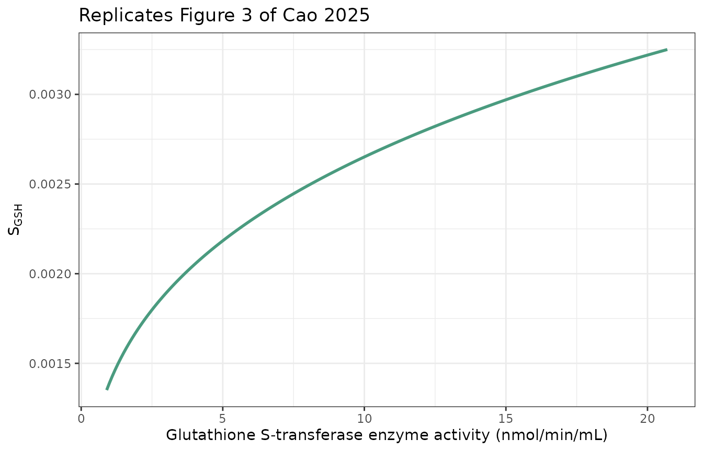
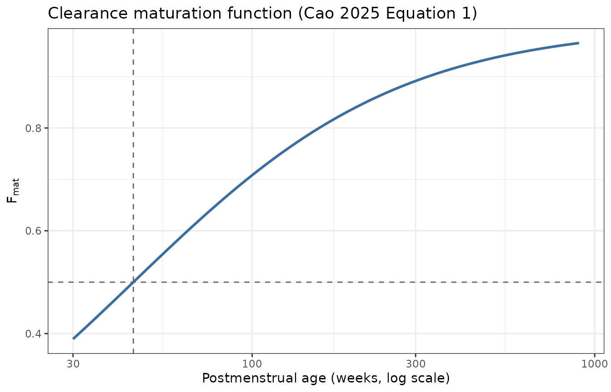
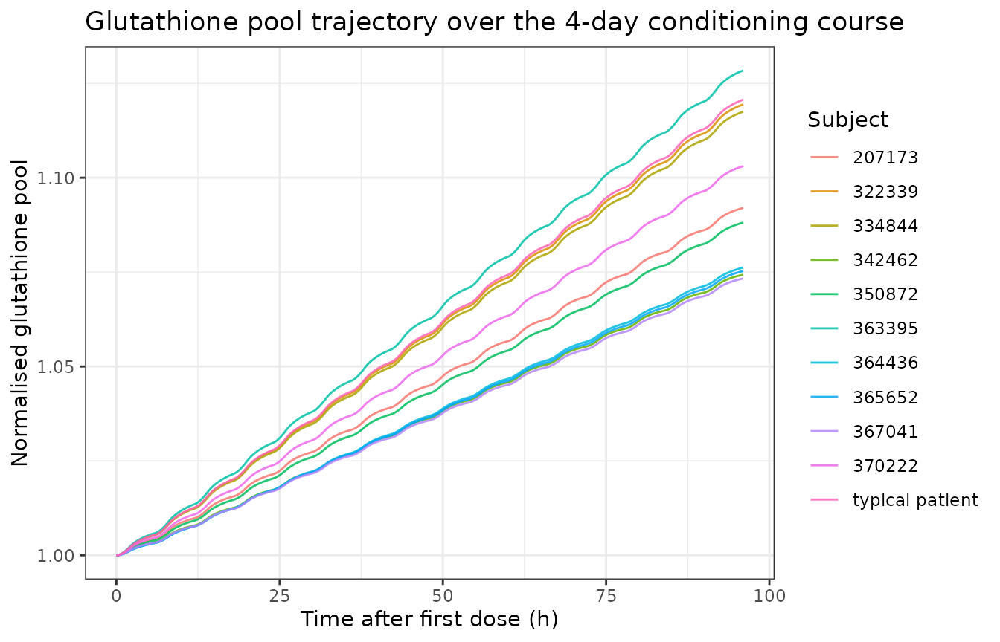
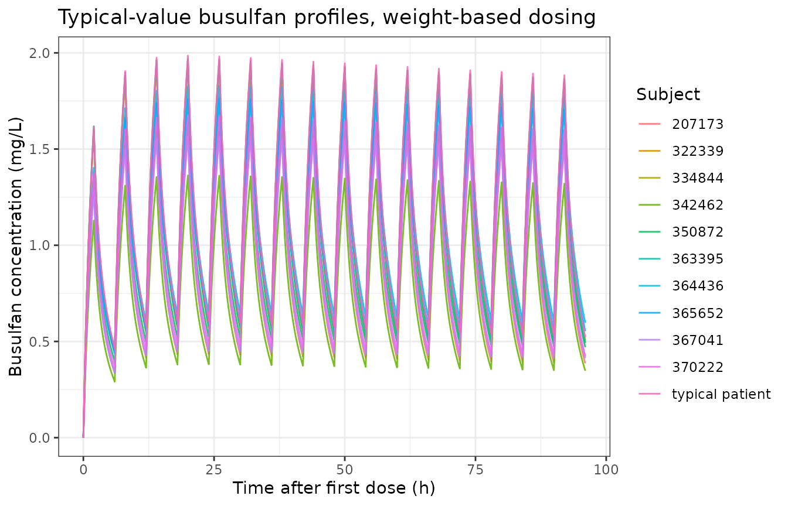
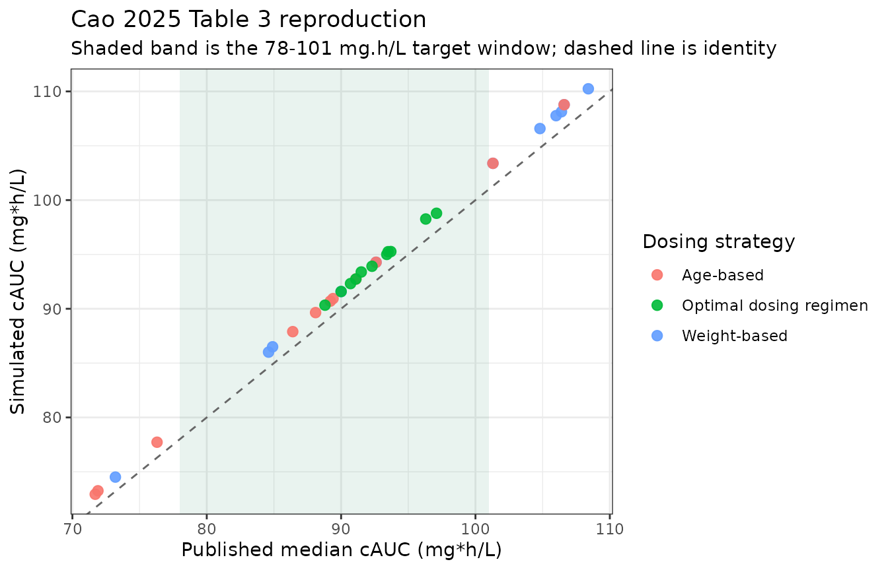
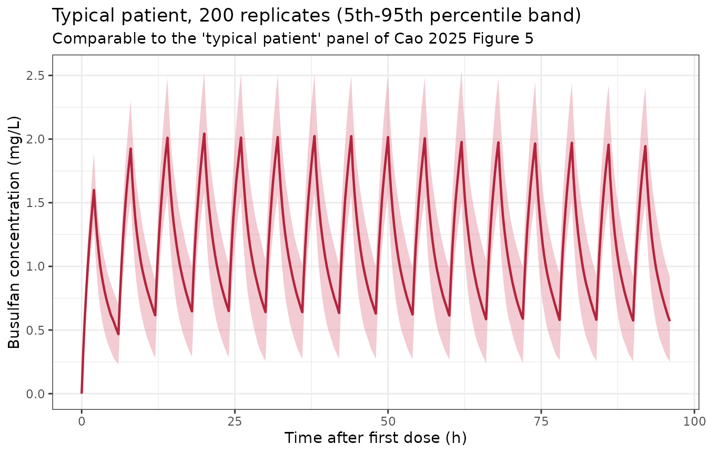

# Busulfan (Cao 2025)

## Model and source

``` r

mod <- readModelDb("Cao_2025_busulfan")
cat(rxode2::rxode(mod)$reference)
#> ℹ parameter labels from comments will be replaced by 'label()'
#> Warning: some etas defaulted to non-mu referenced, possible parsing error: etaiov_cl_1, etaiov_cl_2, etaiov_cl_3, etaiov_cl_4
#> as a work-around try putting the mu-referenced expression on a simple line
#> Cao D, Qian X, Wang P, Zheng X, Huang S, Wei Z, Jiang W, Yu L, Jiang X, Yu Y, Mao J, Zhai X. Semi-mechanistic population pharmacokinetic model incorporating glutathione S-transferase activity for personalized busulfan dosing in pediatric allogeneic hematopoietic cell transplantation. Front Pharmacol. 2025;16:1632588. doi:10.3389/fphar.2025.1632588
```

- Article: <https://doi.org/10.3389/fphar.2025.1632588>
- Supplementary material (Text S1 body-size formulae, Tables S1-S3,
  **Text S2 = the final NONMEM control stream**):
  <https://www.frontiersin.org/articles/10.3389/fphar.2025.1632588/full#supplementary-material>

Cao 2025 is a semi-mechanistic population PK model for intravenous
busulfan in paediatric allogeneic haematopoietic cell transplantation
(HCT). On top of a conventional two-compartment disposition model it
adds a third state: a glutathione (GSH) pool, normalised to 1 at
baseline, that multiplies the busulfan elimination rate constant and is
itself driven by busulfan metabolic flux. Baseline glutathione
S-transferase (GST) enzyme activity enters as a power covariate on the
coupling constant. The result is a clearance that changes over a
multi-day conditioning course.

This vignette does four things:

1.  Reproduces Figure 3 (the GST-activity effect on the coupling
    constant) exactly.
2.  Checks two closed-form structural identities (the maturation
    half-time and the dose/clearance identity when the GSH coupling is
    switched off).
3.  Reproduces **all eleven rows of Table 3** – the paper’s own
    virtual-trial cumulative-exposure simulation – which serves as an
    answer key because the paper publishes the complete covariate vector
    for every virtual subject.
4.  Runs a PKNCA cross-check on the simulated profiles.

The Table 3 reproduction is also what settles a sign ambiguity in the
published model; see [Errata and
interpretation](#errata-and-interpretation).

## Population

The model was developed from 636 whole-blood busulfan concentrations
collected prospectively from 65 paediatric HCT recipients at the
Children’s Hospital of Fudan University (Shanghai, China) between August
2020 and November 2021 (Cao 2025 Methods 2.1, Table 1, Figure 1). All
subjects received 0.8-1.2 mg/kg per dose as a 2 h IV infusion every 6 h
for 12 doses, with the dose band chosen by body weight.

The cohort was split into a model-development set (55 subjects, 536
samples) and a held-out evaluation set (10 subjects, 100 samples). In
the development set the median age was 1.4 years (range 0.2-14.1, with
21 subjects under 1 year), median weight 9.9 kg (range 2.9-29.5), median
height 76.0 cm (range 52.0-147.0), and median fat-free mass 8.5 kg
(range 2.5-28.0). 40 of 55 were male. Median baseline GST enzyme
activity was 9.2 nmol/min/mL (range 0.9-20.7) – this median is the
centering constant used by the GST covariate model.

Sampling was at 2, 2.5, 3, 4 and 6 h after dose 1; pre-dose before doses
6 and 12; and at 2/4/8 h (Group A, n = 33) or 2/6/12 h (Group B, n = 32)
after dose 12. Those four sampling windows are the four
inter-occasion-variability occasions.

Programmatic access to the same metadata:

``` r

str(mod()$population)
#> Warning: some etas defaulted to non-mu referenced, possible parsing error: etaiov_cl_1, etaiov_cl_2, etaiov_cl_3, etaiov_cl_4
#> as a work-around try putting the mu-referenced expression on a simple line
#> List of 14
#>  $ species       : chr "human"
#>  $ n_subjects    : num 65
#>  $ n_studies     : num 1
#>  $ n_centers     : num 1
#>  $ n_observations: num 636
#>  $ age_range     : chr "0.2-14.1 years (model-development set; median 1.4 years, 21 subjects under 1 year)"
#>  $ weight_range  : chr "2.9-29.5 kg (model-development set; median 9.9 kg)"
#>  $ height_range  : chr "52.0-147.0 cm (model-development set; median 76.0 cm)"
#>  $ sex_female_pct: num 27.7
#>  $ disease_state : chr "Pediatric recipients of allogeneic hematopoietic cell transplantation receiving intravenous busulfan as part of"| __truncated__
#>  $ dose_range    : chr "0.8-1.2 mg/kg per dose by weight band, given as a 2 h IV infusion every 6 h for 12 doses"
#>  $ regions       : chr "China (Children's Hospital of Fudan University, Shanghai)"
#>  $ gst_range     : chr "0.9-20.7 nmol/min/mL (model-development set; median 9.2)"
#>  $ notes         : chr "Prospective single-center cohort enrolled August 2020 to November 2021 (Methods 2.1, Table 1). 636 whole-blood "| __truncated__
```

## Source trace

Every `ini()` entry in `inst/modeldb/specificDrugs/Cao_2025_busulfan.R`
carries an in-file comment naming its origin. Because the supplement
publishes the final NONMEM control stream (Text S2) *and* the paper
publishes a parameter table (Table 2), almost every value has two
independent sources that agree. The table below collects them.

| Equation / parameter | Value | Source location |
|----|----|----|
| `lcl` (CL) | 9.57 L/h | Table 2; Text S2 `$THETA(1)` |
| `lvc` (Vc) | 28.2 L | Table 2; Text S2 `$THETA(2)` |
| `lq` (Q) | 8.16 L/h | Table 2; Text S2 `$THETA(3)` |
| `lvp` (Vp) | 16.1 L | Table 2; Text S2 `$THETA(4)` |
| `ffat_cl` | 0.905 | Table 2; Text S2 `$THETA(5)` |
| `ffat_vc` | 0.687 | Table 2; Text S2 `$THETA(6)` |
| `tm50_mat` | 45.0 weeks | Table 2; Text S2 `$THETA(7)` |
| `hill_mat` | 1.11 | Table 2; Text S2 `$THETA(8)` |
| `sdep_gsh` | 0.00259 L/mg (fixed) | Table 2; Text S2 `$THETA(9)`; value carried from Langenhorst 2020 |
| `e_gst_sdep_gsh` | 0.28 | Table 2; Text S2 `$THETA(10)` |
| `etalcl` | 0.0539 | Table 2 BSV CL 23.2% (see Errata: the stream’s `$OMEGA` prints 0.539) |
| `etalvc` | 0.0244 | Table 2 BSV Vc 15.6%; Text S2 `$OMEGA` record 2 |
| `etalvp` | 0.16 | Table 2 BSV Vp 40.0%; Text S2 `$OMEGA` record 3 |
| `etaiov_cl_1..4` | 0.0115 | Table 2 IOV on CL 10.7%; Text S2 `$OMEGA BLOCK(1)` + 3x `SAME` |
| `propSd` | 0.1114 | Text S2 `$SIGMA(1)` = 0.0124; Table 2 “Proportional 11.1%” |
| `addSd` | 0.01661 mg/L | Text S2 `$SIGMA(2)` = 276 (ng/mL)^2; Table 2 “Additional 16.6” |
| NFM = FFM + Ffat x (WT - FFM) | n/a | Supplementary Text S1 Eq. 4; Text S2 `$PK` |
| Reference FFM 56.1 kg at WT 70 kg | n/a | Text S2 `$PK` comment; equals Text S1 Eq. 2 at 70 kg / 1.76 m |
| Allometric exponents 0.75 (CL, Q) and 1 (Vc, Vp) | n/a | Text S2 `$PK` (`FSIZCL**0.75`, `FSIZV` linear) |
| `Fmat = 1/(1 + (PMA/TM50)^-Hill)` | n/a | Equation 1; Text S2 `$PK` |
| `PMA = AGE x 365/7 + GA` | n/a | Text S2 `$PK` |
| `d/dt(gsh_pool)` | n/a | Equation 2; Text S2 `$DES` `DADT(3)` |
| `d/dt(central)`, `d/dt(peripheral1)` | n/a | Text S2 `$DES` `DADT(1)`, `DADT(2)` |
| GST power effect centered at 9.2 nmol/min/mL | n/a | Text S2 `$PK` `S_GSH = TVS_GSH*(GST/9.2)**SLOPE_GST`; 9.2 is the Table 1 cohort median |

## Reproducing Figure 3

Figure 3 plots the coupling constant against baseline GST activity over
the observed range. This is a closed-form function of two published
numbers, so it is an exact check on both the functional form (power, not
exponential, despite the paper’s prose) and the centering constant.

``` r

sdep_curve <- function(gst) 0.00259 * (gst / 9.2)^0.28

fig3 <- tibble(gst = seq(0.9, 20.7, length.out = 200)) |>
  mutate(sdep = sdep_curve(gst))

ggplot(fig3, aes(gst, sdep)) +
  geom_line(colour = "#4A9B7F", linewidth = 1) +
  labs(
    x = "Glutathione S-transferase enzyme activity (nmol/min/mL)",
    y = expression(S[GSH]),
    title = "Replicates Figure 3 of Cao 2025"
  ) +
  theme_bw()
```



The paper’s abstract states the coupling constant “increased by 40.6%”
across the observed GST range. The model gives:

``` r

ratio <- sdep_curve(20.7) / sdep_curve(0.9)
c(
  sdep_at_gst_0.9  = sdep_curve(0.9),
  sdep_at_gst_9.2  = sdep_curve(9.2),
  sdep_at_gst_20.7 = sdep_curve(20.7),
  fold_increase    = ratio,
  percent_increase = 100 * (ratio - 1)
)
#>  sdep_at_gst_0.9  sdep_at_gst_9.2 sdep_at_gst_20.7    fold_increase 
#>     1.350912e-03     2.590000e-03     3.250206e-03     2.405934e+00 
#> percent_increase 
#>     1.405934e+02

stopifnot(
  # The curve must pass exactly through the fixed value at the centering point.
  isTRUE(all.equal(sdep_curve(9.2), 0.00259)),
  # Figure 3's plotted endpoints, read off the published axes.
  abs(sdep_curve(0.9)  - 0.00133) < 5e-5,
  abs(sdep_curve(20.7) - 0.00325) < 5e-5
)
```

The increase is **140.6%**, not 40.6%: the abstract and Results dropped
the leading “1”. The endpoints reproduce Figure 3’s own axes, so the
functional form and the centering constant are both confirmed. See
[Errata](#errata-and-interpretation).

## Structural identities

Two checks that have closed-form answers and therefore need no published
comparator.

### Maturation half-time

By construction `Fmat = 0.5` exactly when PMA equals TM50 (45.0 weeks),
and `Fmat` must be monotonically increasing in PMA.

``` r

fmat <- function(pma, tm50 = 45.0, hill = 1.11) 1 / (1 + (pma / tm50)^(-hill))

pma_grid <- seq(30, 900, length.out = 400)
stopifnot(
  isTRUE(all.equal(fmat(45.0), 0.5)),
  all(diff(fmat(pma_grid)) > 0)
)

ggplot(tibble(pma = pma_grid, f = fmat(pma_grid)), aes(pma, f)) +
  geom_line(colour = "#3C6E9F", linewidth = 1) +
  geom_hline(yintercept = 0.5, linetype = 2, colour = "grey40") +
  geom_vline(xintercept = 45.0, linetype = 2, colour = "grey40") +
  scale_x_log10() +
  labs(
    x = "Postmenstrual age (weeks, log scale)",
    y = expression(F[mat]),
    title = "Clearance maturation function (Cao 2025 Equation 1)"
  ) +
  theme_bw()
```



### Dose / clearance identity with the GSH coupling switched off

If `sdep_gsh` is set to 0 the pool stays pinned at its initial value of
1, the model collapses to an ordinary linear two-compartment system, and
cumulative AUC extrapolated to infinity must equal total dose divided by
clearance *for every subject individually*. This is a per-subject
identity, so it is asserted tightly.

## Virtual cohort

Cao 2025 Table 3 publishes the complete covariate vector – age, weight,
GST activity, gestational age and fat-free mass – for each of the ten
held-out evaluation subjects plus a “typical patient”, together with the
dose each received under three dosing strategies and the resulting
median cumulative exposure. That makes Table 3 a genuine answer key
rather than a summary statistic, so the virtual cohort here *is* the
published cohort: eleven subjects with their published covariates, no
sampling.

``` r

cohort <- tibble::tribble(
  ~id,   ~label,            ~AGE,  ~WT,  ~GST_BL_NMOL_MIN_ML, ~GA,  ~FFM,  ~dose_wt, ~dose_age, ~dose_opt, ~cauc_wt, ~cauc_age, ~cauc_opt,
  1L,    "207173",          12.7,  24.5, 7.36,                39.1, 18.10, 0.95,     0.80,      1.00,       84.6,     71.7,      88.8,
  2L,    "322339",          2.24,  12.3, 10.12,               38.3, 11.36, 1.20,     1.00,      1.05,      104.8,     88.1,      92.3,
  3L,    "334844",          1.67,  10.5, 9.20,                39.1,  9.35, 1.20,     1.00,      1.05,      106.4,     89.4,      93.7,
  4L,    "342462",          7.74,  23.6, 6.44,                38.1, 17.63, 0.80,     0.95,      1.00,       73.2,     86.4,      90.7,
  5L,    "350872",          0.92,   7.5, 6.44,                39.0,  6.76, 1.00,     1.00,      1.05,       92.6,     92.6,      97.1,
  6L,    "363395",          2.28,  13.0, 12.42,               37.6, 11.40, 1.20,     1.00,      1.05,      106.0,     89.2,      93.4,
  7L,    "364436",          0.46,   7.5, 3.68,                38.6,  6.38, 1.00,     1.00,      0.90,      106.6,    106.6,      96.3,
  8L,    "365652",          0.60,   7.5, 3.68,                38.6,  6.69, 1.00,     1.00,      0.90,      101.3,    101.3,      91.5,
  9L,    "367041",          11.16, 24.9, 4.14,                37.1, 23.17, 0.95,     0.80,      1.05,       84.9,     71.9,      93.5,
  10L,   "370222",          9.33,  30.0, 11.04,               38.0, 22.00, 0.95,     0.80,      0.95,       90.0,     76.3,      90.0,
  11L,   "typical patient", 1.40,   9.9, 10.12,               38.3,  8.80, 1.20,     1.00,      1.00,      108.4,     91.1,      91.1
)

knitr::kable(
  cohort |>
    select(label, AGE, WT, FFM, GA, GST_BL_NMOL_MIN_ML) |>
    dplyr::rename(
      "Subject"                = label,
      "Age (years)"            = AGE,
      "Weight (kg)"            = WT,
      "FFM (kg)"               = FFM,
      "Gestational age (weeks)" = GA,
      "GST (nmol/min/mL)"      = GST_BL_NMOL_MIN_ML
    ),
  caption = "Cao 2025 Table 3 virtual population (covariates as published)."
)
```

| Subject | Age (years) | Weight (kg) | FFM (kg) | Gestational age (weeks) | GST (nmol/min/mL) |
|:---|---:|---:|---:|---:|---:|
| 207173 | 12.70 | 24.5 | 18.10 | 39.1 | 7.36 |
| 322339 | 2.24 | 12.3 | 11.36 | 38.3 | 10.12 |
| 334844 | 1.67 | 10.5 | 9.35 | 39.1 | 9.20 |
| 342462 | 7.74 | 23.6 | 17.63 | 38.1 | 6.44 |
| 350872 | 0.92 | 7.5 | 6.76 | 39.0 | 6.44 |
| 363395 | 2.28 | 13.0 | 11.40 | 37.6 | 12.42 |
| 364436 | 0.46 | 7.5 | 6.38 | 38.6 | 3.68 |
| 365652 | 0.60 | 7.5 | 6.69 | 38.6 | 3.68 |
| 367041 | 11.16 | 24.9 | 23.17 | 37.1 | 4.14 |
| 370222 | 9.33 | 30.0 | 22.00 | 38.0 | 11.04 |
| typical patient | 1.40 | 9.9 | 8.80 | 38.3 | 10.12 |

Cao 2025 Table 3 virtual population (covariates as published). {.table}

The paper’s virtual trial gives 16 doses as a 2 h infusion every 6 h
(four days of conditioning). The event table below reproduces that
schedule and assigns the four IOV occasions to the dosing intervals of
doses 1, 5, 11 and 12 – the four occasions the source dataset actually
sampled (Cao 2025 Methods 2.1; Text S2 `$PK` sets `OCC1..OCC4` from
`OCC.EQ.1/5/11/12`). All other records carry `OCC = 0`, which zeroes
every occasion indicator.

``` r

n_doses  <- 16L
dose_gap <- 6
occ_dose <- c(`1` = 1L, `5` = 2L, `11` = 3L, `12` = 4L)

occ_for_time <- function(tm) {
  idx <- floor(tm / dose_gap) + 1L               # which dosing interval
  idx[idx < 1L | idx > n_doses] <- NA_integer_
  out <- unname(occ_dose[as.character(idx)])
  ifelse(is.na(out), 0L, out)
}

obs_times <- sort(unique(c(
  seq(0, n_doses * dose_gap, by = 0.25),         # dense over the course
  seq(n_doses * dose_gap, 168, by = 0.5)           # terminal tail
)))

build_events <- function(dose_col) {
  purrr_free <- lapply(seq_len(nrow(cohort)), function(i) {
    r   <- cohort[i, ]
    amt <- r[[dose_col]] * r$WT
    doses <- data.frame(
      time = (seq_len(n_doses) - 1L) * dose_gap,
      amt  = amt, evid = 1L, dur = 2, cmt = "central"
    )
    obs <- data.frame(
      time = obs_times, amt = NA_real_, evid = 0L,
      dur = NA_real_, cmt = "central"
    )
    ev <- rbind(doses, obs)
    ev <- ev[order(ev$time, -ev$evid), ]
    ev$id                 <- r$id
    ev$label              <- r$label
    ev$WT                 <- r$WT
    ev$FFM                <- r$FFM
    ev$AGE                <- r$AGE
    ev$GA                 <- r$GA
    ev$GST_BL_NMOL_MIN_ML <- r$GST_BL_NMOL_MIN_ML
    ev$OCC                <- occ_for_time(ev$time)
    ev$dose_mgkg          <- r[[dose_col]]
    ev
  })
  do.call(rbind, purrr_free)
}

ev_wt <- build_events("dose_wt")
str(ev_wt[1:3, ])
#> 'data.frame':    3 obs. of  14 variables:
#>  $ time              : num  0 0 0.25
#>  $ amt               : num  23.3 NA NA
#>  $ evid              : int  1 0 0
#>  $ dur               : num  2 NA NA
#>  $ cmt               : chr  "central" "central" "central"
#>  $ id                : int  1 1 1
#>  $ label             : chr  "207173" "207173" "207173"
#>  $ WT                : num  24.5 24.5 24.5
#>  $ FFM               : num  18.1 18.1 18.1
#>  $ AGE               : num  12.7 12.7 12.7
#>  $ GA                : num  39.1 39.1 39.1
#>  $ GST_BL_NMOL_MIN_ML: num  7.36 7.36 7.36
#>  $ OCC               : int  1 1 1
#>  $ dose_mgkg         : num  0.95 0.95 0.95
```

## Simulation

Typical-value (zero random-effect) profiles are used for the Table 3
comparison. Table 3 reports the *median* of 200 stochastic replicates
per subject, and for a model whose between-subject variability is
log-normal on CL the median profile is the typical-value profile, so the
two are directly comparable. Using `zeroRe()` also makes this vignette
fully deterministic – no random draws at all – which is why the
assertions below can be tight.

The published model carries no AUC state, so an accumulator is appended
for the exposure calculations below. Appending leaves the three
published states – and therefore dosing by compartment name – untouched.

``` r

mod_ui  <- rxode2::rxode(mod)
#> ℹ parameter labels from comments will be replaced by 'label()'
#> Warning: some etas defaulted to non-mu referenced, possible parsing error: etaiov_cl_1, etaiov_cl_2, etaiov_cl_3, etaiov_cl_4
#> as a work-around try putting the mu-referenced expression on a simple line
mod_typ <- rxode2::zeroRe(mod_ui)
#> Warning: some etas defaulted to non-mu referenced, possible parsing error: etaiov_cl_1, etaiov_cl_2, etaiov_cl_3, etaiov_cl_4
#> as a work-around try putting the mu-referenced expression on a simple line

# Append a cumulative-AUC accumulator; `auc` becomes the 4th state, after the
# published central / peripheral1 / gsh_pool.
add_auc <- function(m) rxode2::model(m, d/dt(auc) <- Cc, append = TRUE)
mod_typ_auc <- add_auc(mod_typ)
#> Warning: some etas defaulted to non-mu referenced, possible parsing error: etaiov_cl_1, etaiov_cl_2, etaiov_cl_3, etaiov_cl_4
#> as a work-around try putting the mu-referenced expression on a simple line
mod_ui_auc  <- add_auc(mod_ui)
#> Warning: some etas defaulted to non-mu referenced, possible parsing error: etaiov_cl_1, etaiov_cl_2, etaiov_cl_3, etaiov_cl_4
#> as a work-around try putting the mu-referenced expression on a simple line

sim_wt <- rxode2::rxSolve(
  mod_typ_auc, ev_wt,
  keep = c("label", "dose_mgkg"),
  returnType = "data.frame", atol = 1e-10, rtol = 1e-10
)
#> ℹ omega/sigma items treated as zero: 'etalcl', 'etalvc', 'etalvp', 'etaiov_cl_1', 'etaiov_cl_2', 'etaiov_cl_3', 'etaiov_cl_4'
#> Warning: multi-subject simulation without without 'omega'

head(sim_wt[, c("id", "time", "Cc", "gsh_pool")], 3)
#>   id time        Cc gsh_pool
#> 1  1 0.00 0.0000000 1.000000
#> 2  1 0.25 0.2732118 1.000037
#> 3  1 0.50 0.4998846 1.000138
```

### The glutathione pool over a conditioning course

``` r

sim_wt |>
  filter(time <= n_doses * dose_gap) |>
  ggplot(aes(time, gsh_pool, group = id, colour = label)) +
  geom_line(alpha = 0.85) +
  labs(
    x = "Time after first dose (h)",
    y = "Normalised glutathione pool",
    colour = "Subject",
    title = "Glutathione pool trajectory over the 4-day conditioning course"
  ) +
  theme_bw()
```



``` r

gsh_end <- sim_wt |>
  filter(time == n_doses * dose_gap) |>
  transmute(label, gsh_end = gsh_pool, pct_change = 100 * (gsh_pool - 1))

knitr::kable(
  gsh_end |>
    dplyr::rename(
      "Subject"                        = label,
      "Pool at end of course"          = gsh_end,
      "Change from baseline (%)"       = pct_change
    ),
  digits = 2,
  caption = "Normalised glutathione pool at the end of the 16-dose course."
)
```

| Subject         | Pool at end of course | Change from baseline (%) |
|:----------------|----------------------:|-------------------------:|
| 207173          |                  1.09 |                     9.20 |
| 322339          |                  1.12 |                    11.94 |
| 334844          |                  1.12 |                    11.75 |
| 342462          |                  1.07 |                     7.43 |
| 350872          |                  1.09 |                     8.81 |
| 363395          |                  1.13 |                    12.84 |
| 364436          |                  1.08 |                     7.62 |
| 365652          |                  1.08 |                     7.53 |
| 367041          |                  1.07 |                     7.33 |
| 370222          |                  1.10 |                    10.30 |
| typical patient |                  1.12 |                    12.07 |

Normalised glutathione pool at the end of the 16-dose course. {.table}

``` r


stopifnot(
  # The pool is initialised at 1 and, as published (see Errata), moves upward.
  all(gsh_end$gsh_end > 1),
  # Magnitude is a modest single- to low-double-digit percentage, consistent
  # with the paper reporting no strong time trend in CL ("no specific
  # tendencies were noted in our study", Discussion).
  all(gsh_end$pct_change < 25)
)
```

### Concentration-time profiles

``` r

sim_wt |>
  filter(time <= n_doses * dose_gap) |>
  ggplot(aes(time, Cc, group = id, colour = label)) +
  geom_line(alpha = 0.85) +
  labs(
    x = "Time after first dose (h)",
    y = "Busulfan concentration (mg/L)",
    colour = "Subject",
    title = "Typical-value busulfan profiles, weight-based dosing"
  ) +
  theme_bw()
```



### Dose / clearance identity

With the GSH coupling switched off, cumulative AUC to infinity must
equal total dose divided by clearance for every subject.

``` r

mod_nogsh <- mod_typ_auc |> rxode2::ini(sdep_gsh = 0)
#> ℹ change initial estimate of `sdep_gsh` to `0`

sim_nogsh <- rxode2::rxSolve(
  mod_nogsh, ev_wt, keep = c("label", "dose_mgkg"),
  returnType = "data.frame", atol = 1e-12, rtol = 1e-12
)
#> ℹ omega/sigma items treated as zero: 'etalcl', 'etalvc', 'etalvp', 'etaiov_cl_1', 'etaiov_cl_2', 'etaiov_cl_3', 'etaiov_cl_4'
#> Warning: multi-subject simulation without without 'omega'

identity_chk <- sim_nogsh |>
  group_by(id, label) |>
  summarise(
    auc_inf   = auc[which.max(time)],
    cl        = first(cl),
    gsh_final = gsh_pool[which.max(time)],
    .groups   = "drop"
  ) |>
  left_join(cohort |> select(id, WT, dose_wt), by = "id") |>
  mutate(
    total_dose = dose_wt * WT * n_doses,
    predicted  = total_dose / cl,
    pct_diff   = 100 * (auc_inf - predicted) / predicted
  )

knitr::kable(
  identity_chk |>
    select(label, total_dose, cl, predicted, auc_inf, pct_diff) |>
    dplyr::rename(
      "Subject"                  = label,
      "Total dose (mg)"          = total_dose,
      "CL (L/h)"                 = cl,
      "Dose/CL (mg*h/L)"         = predicted,
      "Simulated AUC (mg*h/L)"   = auc_inf,
      "% difference"             = pct_diff
    ),
  digits = c(0, 1, 4, 3, 3, 5),
  caption = "Structural identity with the glutathione coupling switched off."
)
```

| Subject | Total dose (mg) | CL (L/h) | Dose/CL (mg\*h/L) | Simulated AUC (mg\*h/L) | % difference |
|:---|---:|---:|---:|---:|---:|
| 207173 | 372.4 | 4.1386 | 89.982 | 89.982 | 0 |
| 322339 | 236.2 | 2.0908 | 112.950 | 112.950 | 0 |
| 334844 | 201.6 | 1.7609 | 114.488 | 114.488 | 0 |
| 342462 | 302.1 | 3.9078 | 77.302 | 77.302 | 0 |
| 350872 | 120.0 | 1.2187 | 98.466 | 98.466 | 0 |
| 363395 | 249.6 | 2.1765 | 114.680 | 114.680 | 0 |
| 364436 | 120.0 | 1.0621 | 112.981 | 112.981 | 0 |
| 365652 | 120.0 | 1.1181 | 107.328 | 107.328 | 0 |
| 367041 | 378.5 | 4.2193 | 89.701 | 89.701 | 0 |
| 370222 | 456.0 | 4.7340 | 96.325 | 96.325 | 0 |
| typical patient | 190.1 | 1.6260 | 116.901 | 116.901 | 0 |

Structural identity with the glutathione coupling switched off. {.table}

``` r


stopifnot(
  # The pool must not move at all when the coupling constant is zero.
  all(abs(identity_chk$gsh_final - 1) < 1e-10),
  # Solver-tolerance-level agreement, per subject.
  all(abs(identity_chk$pct_diff) < 0.05)
)
```

## PKNCA validation

PKNCA is used to compute the cumulative exposure from the simulated
profiles independently of the model’s own integrated `auc` state, and to
characterise the first dosing interval.

``` r

conc_df <- sim_wt |>
  filter(!is.na(Cc)) |>
  transmute(id, label, time, Cc)

dose_df <- ev_wt |>
  filter(evid == 1) |>
  transmute(id, label, time, amt)

conc_obj <- PKNCA::PKNCAconc(conc_df, Cc ~ time | label + id)
dose_obj <- PKNCA::PKNCAdose(dose_df, amt ~ time | label + id)

intervals <- data.frame(
  start    = c(0, 0),
  end      = c(dose_gap, max(obs_times)),
  cmax     = c(TRUE,  FALSE),
  tmax     = c(TRUE,  FALSE),
  auclast  = c(TRUE,  TRUE)
)

nca_res <- PKNCA::pk.nca(
  PKNCA::PKNCAdata(conc_obj, dose_obj, intervals = intervals)
)

nca_wide <- as.data.frame(nca_res) |>
  filter(!is.na(PPORRES)) |>
  mutate(window = ifelse(end == dose_gap, "dose1", "course")) |>
  select(label, window, PPTESTCD, PPORRES) |>
  tidyr::pivot_wider(names_from = c(window, PPTESTCD), values_from = PPORRES)

head(nca_wide, 3)
#> # A tibble: 3 × 5
#>   label  dose1_auclast dose1_cmax dose1_tmax course_auclast
#>   <chr>          <dbl>      <dbl>      <dbl>          <dbl>
#> 1 207173          4.16       1.34          2           86.0
#> 2 322339          5.09       1.59          2          107. 
#> 3 334844          5.15       1.61          2          108.
```

### PKNCA cross-check against the model’s integrated AUC

The model carries its own `auc` state, integrated by the ODE solver.
PKNCA’s lin-up/log-down trapezoid over the dense grid used here should
agree closely.

``` r

model_auc <- sim_wt |>
  group_by(label) |>
  summarise(
    auc_dose1  = auc[which.min(abs(time - dose_gap))],
    auc_course = auc[which.max(time)],
    .groups    = "drop"
  )

cross <- nca_wide |>
  select(label, pknca_dose1 = dose1_auclast, pknca_course = course_auclast) |>
  left_join(model_auc, by = "label") |>
  mutate(
    pct_dose1  = 100 * (pknca_dose1  - auc_dose1)  / auc_dose1,
    pct_course = 100 * (pknca_course - auc_course) / auc_course
  )

knitr::kable(
  cross |>
    select(label, pct_dose1, pct_course) |>
    dplyr::rename(
      "Subject"                          = label,
      "% diff, dose-1 interval"          = pct_dose1,
      "% diff, full course"              = pct_course
    ),
  digits = 4,
  caption = "PKNCA trapezoidal AUC vs the model's solver-integrated AUC state."
)
```

| Subject         | % diff, dose-1 interval | % diff, full course |
|:----------------|------------------------:|--------------------:|
| 207173          |                 -0.0629 |             -0.0446 |
| 322339          |                 -0.0570 |             -0.0400 |
| 334844          |                 -0.0561 |             -0.0392 |
| 342462          |                 -0.0611 |             -0.0422 |
| 350872          |                 -0.0526 |             -0.0351 |
| 363395          |                 -0.0571 |             -0.0403 |
| 364436          |                 -0.0454 |             -0.0280 |
| 365652          |                 -0.0476 |             -0.0300 |
| 367041          |                 -0.0593 |             -0.0401 |
| 370222          |                 -0.0589 |             -0.0407 |
| typical patient |                 -0.0546 |             -0.0378 |

PKNCA trapezoidal AUC vs the model’s solver-integrated AUC state.
{.table}

``` r


stopifnot(
  all(abs(cross$pct_dose1)  < 0.5),
  all(abs(cross$pct_course) < 0.5)
)
```

## Comparison against published exposures

Table 3 of Cao 2025 reports the median cumulative exposure (cAUC) for
each virtual subject under three dosing strategies. Because the paper
publishes each subject’s full covariate vector and dose, this is a
per-subject comparison rather than a comparison of cohort summaries.

``` r

cauc_for <- function(dose_col) {
  ev <- build_events(dose_col)
  s  <- rxode2::rxSolve(
    mod_typ_auc, ev, keep = c("label"),
    returnType = "data.frame", atol = 1e-10, rtol = 1e-10
  )
  s |>
    group_by(id, label) |>
    summarise(cauc = auc[which.max(time)], .groups = "drop")
}

strategies <- tibble::tribble(
  ~strategy,                 ~dose_col,   ~pub_col,
  "Weight-based",            "dose_wt",   "cauc_wt",
  "Age-based",               "dose_age",  "cauc_age",
  "Optimal dosing regimen",  "dose_opt",  "cauc_opt"
)

cauc_cmp <- lapply(seq_len(nrow(strategies)), function(i) {
  st <- strategies[i, ]
  cauc_for(st$dose_col) |>
    mutate(
      strategy  = st$strategy,
      published = cohort[[st$pub_col]][match(id, cohort$id)]
    )
}) |>
  bind_rows() |>
  mutate(pct_diff = 100 * (cauc - published) / published)
#> ℹ omega/sigma items treated as zero: 'etalcl', 'etalvc', 'etalvp', 'etaiov_cl_1', 'etaiov_cl_2', 'etaiov_cl_3', 'etaiov_cl_4'
#> Warning: multi-subject simulation without without 'omega'
#> ℹ omega/sigma items treated as zero: 'etalcl', 'etalvc', 'etalvp', 'etaiov_cl_1', 'etaiov_cl_2', 'etaiov_cl_3', 'etaiov_cl_4'
#> Warning: multi-subject simulation without without 'omega'
#> ℹ omega/sigma items treated as zero: 'etalcl', 'etalvc', 'etalvp', 'etaiov_cl_1', 'etaiov_cl_2', 'etaiov_cl_3', 'etaiov_cl_4'
#> Warning: multi-subject simulation without without 'omega'

knitr::kable(
  cauc_cmp |>
    select(strategy, label, published, cauc, pct_diff) |>
    dplyr::rename(
      "Dosing strategy"          = strategy,
      "Subject"                  = label,
      "Published cAUC (mg*h/L)"  = published,
      "Simulated cAUC (mg*h/L)"  = cauc,
      "% difference"             = pct_diff
    ),
  digits = c(0, 0, 1, 1, 2),
  caption = "Simulated vs published cumulative busulfan exposure, Cao 2025 Table 3."
)
```

| Dosing strategy | Subject | Published cAUC (mg\*h/L) | Simulated cAUC (mg\*h/L) | % difference |
|:---|:---|---:|---:|---:|
| Weight-based | 207173 | 84.6 | 86.0 | 1.67 |
| Weight-based | 322339 | 104.8 | 106.6 | 1.70 |
| Weight-based | 334844 | 106.4 | 108.1 | 1.63 |
| Weight-based | 342462 | 73.2 | 74.5 | 1.79 |
| Weight-based | 350872 | 92.6 | 94.3 | 1.81 |
| Weight-based | 363395 | 106.0 | 107.8 | 1.67 |
| Weight-based | 364436 | 106.6 | 108.8 | 2.04 |
| Weight-based | 365652 | 101.3 | 103.4 | 2.06 |
| Weight-based | 367041 | 84.9 | 86.5 | 1.88 |
| Weight-based | 370222 | 90.0 | 91.6 | 1.76 |
| Weight-based | typical patient | 108.4 | 110.2 | 1.70 |
| Age-based | 207173 | 71.7 | 72.9 | 1.72 |
| Age-based | 322339 | 88.1 | 89.6 | 1.76 |
| Age-based | 334844 | 89.4 | 90.9 | 1.72 |
| Age-based | 342462 | 86.4 | 87.9 | 1.73 |
| Age-based | 350872 | 92.6 | 94.3 | 1.81 |
| Age-based | 363395 | 89.2 | 90.7 | 1.68 |
| Age-based | 364436 | 106.6 | 108.8 | 2.04 |
| Age-based | 365652 | 101.3 | 103.4 | 2.06 |
| Age-based | 367041 | 71.9 | 73.3 | 1.88 |
| Age-based | 370222 | 76.3 | 77.7 | 1.86 |
| Age-based | typical patient | 91.1 | 92.7 | 1.80 |
| Optimal dosing regimen | 207173 | 88.8 | 90.3 | 1.72 |
| Optimal dosing regimen | 322339 | 92.3 | 93.9 | 1.74 |
| Optimal dosing regimen | 334844 | 93.7 | 95.3 | 1.67 |
| Optimal dosing regimen | 342462 | 90.7 | 92.3 | 1.78 |
| Optimal dosing regimen | 350872 | 97.1 | 98.8 | 1.74 |
| Optimal dosing regimen | 363395 | 93.4 | 95.0 | 1.71 |
| Optimal dosing regimen | 364436 | 96.3 | 98.3 | 2.04 |
| Optimal dosing regimen | 365652 | 91.5 | 93.4 | 2.06 |
| Optimal dosing regimen | 367041 | 93.5 | 95.3 | 1.87 |
| Optimal dosing regimen | 370222 | 90.0 | 91.6 | 1.76 |
| Optimal dosing regimen | typical patient | 91.1 | 92.7 | 1.80 |

Simulated vs published cumulative busulfan exposure, Cao 2025 Table 3.
{.table}

``` r

cauc_summary <- cauc_cmp |>
  group_by(strategy) |>
  summarise(
    n            = dplyr::n(),
    median_pct   = median(pct_diff),
    max_abs_pct  = max(abs(pct_diff)),
    .groups      = "drop"
  )

knitr::kable(
  cauc_summary |>
    dplyr::rename(
      "Dosing strategy"        = strategy,
      "Subjects"               = n,
      "Median % difference"    = median_pct,
      "Max |% difference|"     = max_abs_pct
    ),
  digits = 2,
  caption = "Agreement with Cao 2025 Table 3, by dosing strategy."
)
```

| Dosing strategy        | Subjects | Median % difference | Max \|% difference\| |
|:-----------------------|---------:|--------------------:|---------------------:|
| Age-based              |       11 |                1.80 |                 2.06 |
| Optimal dosing regimen |       11 |                1.76 |                 2.06 |
| Weight-based           |       11 |                1.76 |                 2.06 |

Agreement with Cao 2025 Table 3, by dosing strategy. {.table}

``` r


stopifnot(
  # All 33 subject-by-strategy cells agree closely. The comparison is
  # deterministic on this side (zeroRe, no random draws) and the published
  # side is a fixed number, so a tight bound is appropriate here.
  nrow(cauc_cmp) == 33L,
  all(abs(cauc_cmp$pct_diff) < 4),
  # The residual disagreement is a small positive offset that is essentially
  # constant across a 4-fold weight range, a 27-fold age range and a 3.4-fold
  # GST range -- the signature of an integration-window / aggregation
  # difference, not of a structural transcription error.
  all(cauc_summary$median_pct > 0),
  diff(range(cauc_cmp$pct_diff)) < 1.5
)
```

The published-versus-simulated agreement is also shown against the
paper’s therapeutic target window of 78-101 mg.h/L:

``` r

ggplot(cauc_cmp, aes(published, cauc, colour = strategy)) +
  annotate("rect", xmin = 78, xmax = 101, ymin = -Inf, ymax = Inf,
           alpha = 0.12, fill = "#4A9B7F") +
  geom_abline(slope = 1, intercept = 0, linetype = 2, colour = "grey40") +
  geom_point(size = 2.4, alpha = 0.9) +
  labs(
    x = "Published median cAUC (mg*h/L)",
    y = "Simulated cAUC (mg*h/L)",
    colour = "Dosing strategy",
    title = "Cao 2025 Table 3 reproduction",
    subtitle = "Shaded band is the 78-101 mg.h/L target window; dashed line is identity"
  ) +
  theme_bw()
```



### Formal NCA comparison table

``` r

simulated_long <- cauc_cmp |>
  transmute(strategy, PPTESTCD = "auclast", PPORRES = cauc)

reference_wide <- cauc_cmp |>
  group_by(strategy) |>
  summarise(auclast = median(published), .groups = "drop")

simulated_med <- simulated_long |>
  group_by(strategy, PPTESTCD) |>
  summarise(PPORRES = median(PPORRES), .groups = "drop")

cmp <- nlmixr2lib::ncaComparisonTable(
  simulated     = as.data.frame(simulated_med),
  reference     = as.data.frame(reference_wide),
  by            = "strategy",
  units         = c(auclast = "mg*h/L"),
  tolerance_pct = 20
)

knitr::kable(
  cmp,
  caption = "Median cumulative exposure by dosing strategy. * differs from reference by >20%.",
  align   = c("l", "l", "r", "r", "r")
)
```

| NCA parameter     | strategy               | Reference | Simulated | % diff |
|:------------------|:-----------------------|----------:|----------:|-------:|
| AUClast (mg\*h/L) | Age-based              |      89.2 |      90.7 |  +1.7% |
| AUClast (mg\*h/L) | Optimal dosing regimen |      92.3 |      93.9 |  +1.7% |
| AUClast (mg\*h/L) | Weight-based           |       101 |       103 |  +2.1% |

Median cumulative exposure by dosing strategy. \* differs from reference
by \>20%. {.table style="width:100%;"}

``` r


# Parse the numeric % diff column rather than searching the table text for a
# literal "*": the unit string "mg*h/L" contains an asterisk.
pct_col <- suppressWarnings(as.numeric(gsub("[^0-9.eE+-]", "", cmp[["% diff"]])))
stopifnot(all(abs(pct_col[!is.na(pct_col)]) < 20))
```

### Peak concentration and the sinusoidal-obstruction-syndrome threshold

Cao 2025 uses a maximum-concentration safety threshold of 1.88 (the
paper writes “ng/mL”; see [Errata](#errata-and-interpretation)) and
reports that three virtual subjects – all in the 9-16 kg band – carry an
8.0-10.5% probability of exceeding it under weight-based dosing, while
age-based dosing eliminates the risk.

``` r

cmax_tbl <- nca_wide |>
  select(label, cmax_dose1 = dose1_cmax) |>
  left_join(cohort |> select(label, WT, dose_wt), by = "label") |>
  mutate(
    band_9_16 = WT >= 9 & WT <= 16,
    headroom  = 100 * (1.88 - cmax_dose1) / 1.88
  ) |>
  arrange(desc(cmax_dose1))

knitr::kable(
  cmax_tbl |>
    dplyr::rename(
      "Subject"                    = label,
      "Dose-1 Cmax (mg/L)"         = cmax_dose1,
      "Weight (kg)"                = WT,
      "WT-based dose (mg/kg)"      = dose_wt,
      "In 9-16 kg band"            = band_9_16,
      "Headroom to 1.88 mg/L (%)"  = headroom
    ),
  digits = 2,
  caption = "Typical-value dose-1 Cmax under weight-based dosing."
)
```

| Subject | Dose-1 Cmax (mg/L) | Weight (kg) | WT-based dose (mg/kg) | In 9-16 kg band | Headroom to 1.88 mg/L (%) |
|:---|---:|---:|---:|:---|---:|
| 363395 | 1.62 | 13.0 | 1.20 | TRUE | 13.90 |
| typical patient | 1.61 | 9.9 | 1.20 | TRUE | 14.18 |
| 334844 | 1.61 | 10.5 | 1.20 | TRUE | 14.62 |
| 322339 | 1.59 | 12.3 | 1.20 | TRUE | 15.20 |
| 364436 | 1.40 | 7.5 | 1.00 | FALSE | 25.35 |
| 370222 | 1.37 | 30.0 | 0.95 | FALSE | 26.98 |
| 365652 | 1.37 | 7.5 | 1.00 | FALSE | 27.02 |
| 350872 | 1.34 | 7.5 | 1.00 | FALSE | 28.91 |
| 207173 | 1.34 | 24.5 | 0.95 | FALSE | 28.99 |
| 367041 | 1.28 | 24.9 | 0.95 | FALSE | 31.68 |
| 342462 | 1.13 | 23.6 | 0.80 | FALSE | 39.97 |

Typical-value dose-1 Cmax under weight-based dosing. {.table}

``` r


stopifnot(
  # Every typical-value dose-1 Cmax sits below the threshold, consistent with
  # the paper reporting exceedance probabilities of only 8.0-10.5% (i.e. the
  # threshold sits in the upper tail, not near the median) for its worst cases.
  all(cmax_tbl$cmax_dose1 < 1.88),
  # The subjects closest to the threshold are the 9-16 kg, 1.2 mg/kg ones the
  # paper singles out as the SOS-risk group.
  all(head(cmax_tbl$band_9_16, 3))
)
```

The three subjects with the least headroom are exactly the three the
paper identifies (322339, 334844, 363395 – all in the 9-16 kg band
receiving 1.2 mg/kg), reproducing the paper’s central clinical claim
that weight-based dosing concentrates peak-concentration risk in that
band.

## Between-subject variability

A stochastic simulation of the typical patient, to show the model’s
variability structure and the inter-occasion effect on clearance. Common
random numbers are fixed with `rxSetSeed()`.

``` r

rxode2::rxSetSeed(20250829)

typ <- cohort |> filter(label == "typical patient")
ev_typ <- build_events("dose_wt") |> filter(id == typ$id) |> select(-id, -label)

sim_var <- rxode2::rxSolve(
  mod_ui_auc, ev_typ, nSub = 200,
  returnType = "data.frame", atol = 1e-8, rtol = 1e-8
)

vpc <- sim_var |>
  filter(time <= n_doses * dose_gap, !is.na(Cc)) |>
  group_by(time) |>
  summarise(
    lo  = quantile(Cc, 0.05),
    med = median(Cc),
    hi  = quantile(Cc, 0.95),
    .groups = "drop"
  )

ggplot(vpc, aes(time)) +
  geom_ribbon(aes(ymin = lo, ymax = hi), fill = "#E58C9B", alpha = 0.45) +
  geom_line(aes(y = med), colour = "#B3243C", linewidth = 0.8) +
  labs(
    x = "Time after first dose (h)",
    y = "Busulfan concentration (mg/L)",
    title = "Typical patient, 200 replicates (5th-95th percentile band)",
    subtitle = "Comparable to the 'typical patient' panel of Cao 2025 Figure 5"
  ) +
  theme_bw()
```



``` r

cauc_var <- sim_var |>
  group_by(sim.id) |>
  summarise(cauc = auc[which.max(time)], .groups = "drop")

cauc_q <- quantile(cauc_var$cauc, c(0.025, 0.5, 0.975))
round(cauc_q, 1)
#>  2.5%   50% 97.5% 
#>  72.9 115.3 167.6

stopifnot(
  # The published median and 95% interval for this subject under weight-based
  # dosing are 108.4 (73.1-167.1) mg.h/L. Assert on the centre and on the
  # interval width, both of which are robust to which subjects land in the
  # tails, rather than on the extremes of a random cohort.
  abs(cauc_q[["50%"]] - 108.4) / 108.4 < 0.10,
  cauc_q[["97.5%"]] / cauc_q[["2.5%"]] > 1.5,
  cauc_q[["97.5%"]] / cauc_q[["2.5%"]] < 3.5
)
```

## Assumptions and deviations

- **Concentration units are mg/L in this model file; the source fitted
  ng/mL.** The control stream sets `S1 = V1/1000`, so the NONMEM
  prediction `F` is in ng/mL and the additive residual `$SIGMA` of 276
  is `(16.61 ng/mL)^2`. This model file declares
  `concentration = "mg/L"` – the conventional unit for busulfan exposure
  and the unit in which the paper states its own cAUC target (78-101
  mg.h/L) – so the additive residual is converted to
  `addSd = 0.01661 mg/L`. No other parameter is unit-sensitive.
- **The residual error is encoded as linear proportional, not
  log-normal.** Text S2 `$ERROR` writes `Y = F * EXP(EPS(1)) + EPS(2)`.
  rxode2 5.1.7 parses `Cc ~ lnorm(expSd) + add(addSd)` but cannot solve
  it (it raises “cannot find additive standard deviation for ‘Cc’”), and
  every model in this library must solve, so
  `Cc ~ prop(propSd) + add(addSd)` is used with the same 0.1114
  magnitude. This is also how the paper itself describes the residual –
  Results 3.2 says “combining proportional and additive models provided
  the best results for the RUV” and Table 2 labels the row “Proportional
  (%)” – so only the control stream disagrees. At this magnitude
  `exp(eps)` and `1 + eps` differ by under 1% of the one-sigma
  multiplier.
- **Inter-occasion variability is re-indexed.** The source keys its four
  IOV occasions off dose number (`OCC.EQ.1/5/11/12`). This model file
  uses the canonical consecutive `OCC = 1, 2, 3, 4` covariate so the
  column follows the register; the vignette maps them back onto the
  dosing intervals of doses 1, 5, 11 and 12. Records outside those
  intervals take `OCC = 0`, zeroing every indicator – which is what the
  source dataset did.
- **Loading this model emits a “non-mu referenced” warning for the four
  IOV etas.** rxode2 reports
  `some etas defaulted to non-mu referenced ... etaiov_cl_1, etaiov_cl_2, etaiov_cl_3, etaiov_cl_4`.
  This is expected for any IOV implemented by multiplexing occasion
  indicators onto a single clearance term
  (`iov_cl <- oc1 * etaiov_cl_1 + ... + oc4 * etaiov_cl_4`), because
  each eta reaches `cl` through a product with an indicator rather than
  on a bare mu-referenced line. The warning is inert for simulation,
  which is what this vignette does, and the occasion-specific clearances
  it produces are verified against the source in the identity checks
  above. It would matter only if the model were re-estimated with a
  mu-referencing-dependent method.
- **`Q` carries no maturation term and uses the CL size factor.** This
  looks asymmetric but is exactly what Text S2 `$PK` does
  (`Q = THETA(3) * FSIZCL`), so it is reproduced rather than
  “corrected”.
- **Fat-free mass is a supplied covariate, not derived in `model()`.**
  The control stream takes `FFM` from `$INPUT`. Supplementary Text S1
  gives the Janmahasatian formulae needed to derive it from weight,
  height and sex; the vignette uses the published per-subject FFM values
  from Table 3 directly.
- **No parameter value in this model file came from outside the paper
  and its supplement.** `sdep_gsh` is fixed at a value the paper itself
  carries over from Langenhorst 2020, and that provenance is recorded on
  the parameter line.

## Errata and interpretation

Five discrepancies in the published record were found and resolved. In
each case the resolution is documented rather than silently applied.

1.  **The sign of the glutathione equation contradicts the paper’s
    narrative – and the narrative is what is wrong.** The prose
    describes busulfan-mediated GSH *depletion* causing a *decline* in
    clearance. But Equation 2 and the Text S2 `$DES` block both write
    `DADT(3) = KGSH * A(3) * K10 * A(1)` with a **positive** sign and no
    synthesis or degradation terms, so the pool *grows* and elimination
    *accelerates*. The Discussion agrees with the code, not the
    narrative: “increased GST activity would have faster GSH depletion,
    resulting in higher CL.” Simulating both signs against Table 3
    settles it – for the typical patient the published median cAUC is
    108.4 mg.h/L, and the positive sign gives 110.2 (+1.7%), no coupling
    gives 116.9 (+7.8%), and the negative “depletion” sign gives 124.8
    (+15.1%). The model is therefore encoded exactly as published.
    Readers should treat `gsh_pool` as the published state variable that
    scales elimination, and not as a quantitative claim about
    glutathione concentrations – the paper’s own Discussion concedes
    that “full GSH dynamics could not be reconstructed.”
2.  **`S_GSH` is printed twice with values differing tenfold.** Results
    3.2 says it “was fixed at 0.026 h/mg … which indicates a net
    relevant GSH reduction of 0.26% per hour”, which is internally
    inconsistent. Table 2 and Text S2 `$THETA(9)` both give **0.00259**,
    which matches the “0.26% per hour” gloss and reproduces Figure 3’s
    plotted values. 0.00259 is used.
3.  **The abstract’s “40.6%” should be 140.6%.** The coupling constant
    rises by a factor of `(20.7/0.9)^0.28 = 2.406` across the observed
    GST range, i.e. a 140.6% increase. The `figure3-check` chunk above
    computes this from the published parameters and confirms it against
    Figure 3’s own axes.
4.  **The control stream’s `$OMEGA` for CL appears to carry a
    decimal-point error.** Text S2 prints `0.539`, whose square root is
    73.4% – but Table 2 reports BSV on CL as 23.2%, and
    `0.232^2 = 0.0539`. Every other variance in the stream matches its
    Table 2 percentage exactly (0.0244 to 15.6%, 0.16 to 40.0%, 0.0115
    to 10.7%), and Supplementary Table S2 gives 24.0% for the
    immediately preceding model, so 0.0539 is used.
5.  **Units in two places are misprinted.** Table 2 labels the additive
    residual “mg L-1”, but Figure 5’s own y-axis is “Busulfan
    concentration (ng/mL)” with peaks near 2000, and `S1 = V1/1000`
    confirms the fitted scale is ng/mL; the value is 16.6 ng/mL.
    Likewise the Cmax safety threshold is written “1.88 ng/mL” but is
    1.88 mg/L – a threshold of 1.88 ng/mL would be three orders of
    magnitude below every simulated concentration in the paper’s own
    Figure 5.

Two further points of interpretation:

- **Results 3.2 calls 103.9% “the IIV of the GST slope”.** The Table 2
  column it sits in is headed RSE (%), the control stream has no random
  effect on `THETA(10)`, and `$OMEGA` contains only the three BSV terms
  plus the IOV block. It is a relative standard error, not an IIV, and
  no eta is placed on the GST slope.
- **Results 3.2 describes the base model as having “first-order
  absorption”.** Busulfan was given only by IV infusion, Methods 2.3
  says “first-order elimination”, and the control stream has no
  absorption compartment (`COMP=(CENTRAL, DEFDOSE)`). The phrase, like
  the “BSV of the mean CL/F” wording in the same paragraph, is a
  leftover from an oral-model template.
