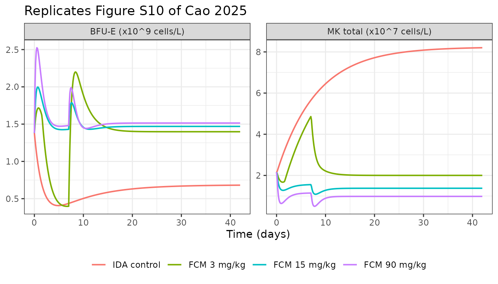
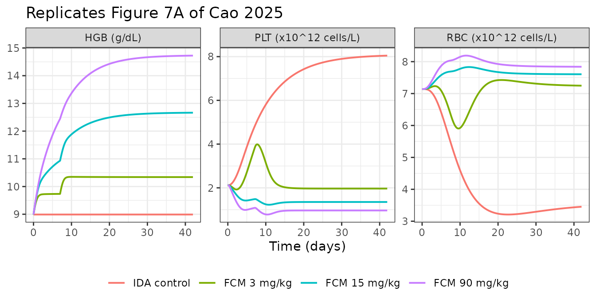

# Iron-regulated erythroid and megakaryocytic lineage commitment (Cao 2025)

``` r

library(nlmixr2lib)
library(rxode2)
library(PKNCA)
library(dplyr)
library(tidyr)
library(ggplot2)
```

Cao et al. (2025) developed a mechanism-based PK/PD model quantifying
how iron directs hematopoietic stem and progenitor cell (HSPC)
commitment toward the erythroid versus the megakaryocytic lineage in
rats with iron deficiency anemia (IDA). The model couples a
two-compartment serum-iron PK model, driven by an endogenous zero-order
input, to a maturation-structured cytokinetic model that produces red
blood cells (RBC), hemoglobin (HGB) and platelets (PLT) simultaneously.

The clinically interesting prediction is the *competition*: raising
serum iron pushes HSPCs down the erythroid path, which simultaneously
raises RBC and **lowers** platelets – so platelet count is a PD marker
of iron therapy, not just hemoglobin.

``` r

mod <- rxode2::rxode(readModelDb("Cao_2025_ferricCarboxymaltose_rat"))
mod$description
#> [1] "QSP. Preclinical (rat, Sprague-Dawley). Mechanism-based PK/PD model of intravenous ferric carboxymaltose in iron-deficiency-anemia rats. A two-compartment serum-iron PK model with endogenous zero-order input drives a maturation-structured hematopoietic model in which the change in serum iron from baseline shifts commitment of hematopoietic stem and progenitor cells between the erythroid lineage (BFU-E -> CFU-E -> normoblast -> reticulocyte -> RBC) and the megakaryocytic lineage (10 MK-precursor aging compartments -> 10 platelet aging compartments), with a separate Emax stimulation of hemoglobin production. Three simultaneous outputs: RBC count, hemoglobin and platelet count."
```

## Population

``` r

pop <- mod$population
tibble::tibble(Field = names(pop), Value = vapply(pop, as.character, character(1))) |>
  knitr::kable()
```

| Field | Value |
|:---|:---|
| species | rat (Sprague-Dawley) |
| n_subjects | 24 |
| n_studies | 1 |
| weight_range | 160-200 g at acquisition (Supporting Information, Animals) |
| sex_female_pct | 0 |
| disease_state | Iron deficiency anemia induced in male Sprague-Dawley rats by a low-iron diet (\<10 mg Fe/kg) for the whole experiment plus bi-weekly phlebotomy (1 mL per bleed) for the first three weeks followed by a two-week stabilization period; healthy controls received a 200 mg Fe/kg diet without phlebotomy |
| dose_range | Ferric carboxymaltose 3, 15 or 90 mg/kg IV once weekly for 2 weeks, alone or combined with rHuEPO 450 IU/kg IV three times weekly; n = 3 per group |
| regions | Hong Kong SAR, China (Chinese University of Hong Kong) |
| notes | Naive pooled-data analysis in NONMEM 7.5.0: all individual data were treated as originating from a single individual, so the model carries NO between-subject variability. PK was estimated first (SAEM followed by importance-sampling EM) from sparse sampling in this study combined with intensive sampling from Funk 2022 (Eur J Pharm Biopharm 174:56-76) in an anemic rat model, then fixed while the PD model was fitted sequentially. Hematology was sampled on days 0, 2 and 4 of each week for 7 weeks after the first dose. The rHuEPO arms were used to demonstrate the iron-EPO interaction experimentally but no EPO term appears in the published model equations, so this model describes the iron effect only. |

Male Sprague-Dawley rats (160-200 g) were made iron deficient with a
low-iron diet plus bi-weekly phlebotomy, then randomised to ferric
carboxymaltose (FCM) 3, 15 or 90 mg/kg IV once weekly for two weeks,
alone or with rHuEPO (Cao 2025 Figure 4A). Hematology was followed for
seven weeks. The analysis was a **naive pooled-data** fit in NONMEM
7.5.0, so the model carries no between-subject variability: it is a
typical-value mechanism model.

## Source trace

Every value in the packaged model file, and where it came from.

``` r

tibble::tribble(
  ~Parameter,      ~Source,                       ~Value,
  "V1",            "Table S2",                    "2.52 L/kg",
  "V2",            "Table S2",                    "0.687 L/kg",
  "QCP",           "Table S2",                    "0.264 L/h/kg",
  "QPC",           "Table S2",                    "0.00132 L/h/kg",
  "KIN_Iron",      "Table S2",                    "0.000197 mg/h/kg",
  "CL",            "Table S2 (fixed)",            "0.0001 L/h/kg",
  "T_RET",         "Table 1",                     "39.92 h",
  "T_RBC",         "Table 1",                     "161.8 h",
  "RBC0",          "Table 1",                     "7.141 x10^12 cells/L",
  "DF",            "Table 1",                     "0.87",
  "Smax_Iron",     "Table 1",                     "12.63",
  "SC50_Iron",     "Table 1",                     "3.14 ug/dL",
  "Smax_HGB",      "Table 1",                     "0.72",
  "SC50_HGB",      "Table 1",                     "16.24 ug/dL",
  "HGB0",          "Table 1",                     "8.99 g/dL",
  "T_MP",          "Table 1",                     "3.49 h",
  "T_PLT",         "Table 1",                     "85.7 h",
  "PLT0",          "Table 1",                     "2.12 x10^12 cells/L",
  "KE",            "Table 1",                     "166.5e-4 /h",
  "Cutoff_Iron",   "Table 1",                     "4.28 ug/dL",
  "SC50_DF",       "Table 1",                     "2062 ug/dL",
  "Smax_DF",       "Methods, PD Model (fixed)",   "1",
  "CF",            "Methods, PD Model (fixed)",   "4000 platelets/MK",
  "MCFU, MNOR",    "Determined from Table S3",    "5, 5",
  "sigma_prop-RBC","Table 1",                     "0.29",
  "sigma_add-HGB", "Table 1",                     "0.79 g/dL",
  "sigma_prop-PLT","Table 1",                     "0.58"
) |>
  knitr::kable(caption = "Parameter provenance. Equation numbers below refer to the display equations of Cao 2025 in order of appearance.")
```

| Parameter      | Source                    | Value                |
|:---------------|:--------------------------|:---------------------|
| V1             | Table S2                  | 2.52 L/kg            |
| V2             | Table S2                  | 0.687 L/kg           |
| QCP            | Table S2                  | 0.264 L/h/kg         |
| QPC            | Table S2                  | 0.00132 L/h/kg       |
| KIN_Iron       | Table S2                  | 0.000197 mg/h/kg     |
| CL             | Table S2 (fixed)          | 0.0001 L/h/kg        |
| T_RET          | Table 1                   | 39.92 h              |
| T_RBC          | Table 1                   | 161.8 h              |
| RBC0           | Table 1                   | 7.141 x10^12 cells/L |
| DF             | Table 1                   | 0.87                 |
| Smax_Iron      | Table 1                   | 12.63                |
| SC50_Iron      | Table 1                   | 3.14 ug/dL           |
| Smax_HGB       | Table 1                   | 0.72                 |
| SC50_HGB       | Table 1                   | 16.24 ug/dL          |
| HGB0           | Table 1                   | 8.99 g/dL            |
| T_MP           | Table 1                   | 3.49 h               |
| T_PLT          | Table 1                   | 85.7 h               |
| PLT0           | Table 1                   | 2.12 x10^12 cells/L  |
| KE             | Table 1                   | 166.5e-4 /h          |
| Cutoff_Iron    | Table 1                   | 4.28 ug/dL           |
| SC50_DF        | Table 1                   | 2062 ug/dL           |
| Smax_DF        | Methods, PD Model (fixed) | 1                    |
| CF             | Methods, PD Model (fixed) | 4000 platelets/MK    |
| MCFU, MNOR     | Determined from Table S3  | 5, 5                 |
| sigma_prop-RBC | Table 1                   | 0.29                 |
| sigma_add-HGB  | Table 1                   | 0.79 g/dL            |
| sigma_prop-PLT | Table 1                   | 0.58                 |

Parameter provenance. Equation numbers below refer to the display
equations of Cao 2025 in order of appearance. {.table}

### Equations

| Model element | Source |
|----|----|
| Two-compartment iron PK, `d/dt(central)`, `d/dt(peripheral1)` | Eq. 1-2 |
| `kel = CL/V1`, `kCP = QCP/V1`, `kPC = QPC/V2` | Eq. 3-5 |
| PK steady-state initial conditions | Eq. 6-7 |
| HSPC balance with disease factor and gated iron stimulation | Eq. 8 |
| On/off cutoff function `F(S)` | Eq. 9 |
| BFU-E, CFU-E, normoblast, reticulocyte, RBC chain | Eq. 10-14 |
| Hemoglobin turnover, `KIN_HGB = HGB0/T_RBC` | Eq. 15-16 |
| MK precursor aging chain (n = 10) | Eq. 17-18 |
| Platelet aging chain (n = 10) and total PLT | Eq. 19-21 |
| Baseline (secondary) parameters | Eq. 22-29, tabulated in Table S3 |

### Dimensional analysis

Cell states are carried in units of `x10^12 cells/L` throughout, which
is the unit of the two estimated baselines (RBC0, PLT0) and therefore of
every back-calculated baseline. Because the amplification factors
(`2^MCFU`, `2^MNOR`, `CF`) are dimensionless counts and every transfer
term is `state / time`, the whole cascade is dimensionally homogeneous
in that unit.

| Term | Units |
|----|----|
| `central`, `peripheral1` | mg/kg (V in L/kg, doses in mg/kg) |
| `Cc = 100 * central / vc` | (mg/kg)/(L/kg) = mg/L, x100 -\> ug/dL |
| `c_iron` | ug/dL (change from the 197.0 ug/dL PK steady state) |
| `kin_hspc` | x10^12 cells/L/h |
| `kdiff_ery`, `kdiff_mk`, `1/t_ep`, `nchain/t_mp` | 1/h |
| `cf * (nchain/t_mp) * mk10` | x10^12 cells/L/h |
| `kin_hb = rbase_hb / t_rbc` | (g/dL)/h |

The single non-obvious conversion is `mgL_to_ugdL = 100`: amounts are
mg/kg and volumes L/kg, so `amount/volume` is mg/L, and 1 mg/L = 100
ug/dL. This factor is what makes the reported `Cutoff_Iron` reconcile
with the Results text (see below).

## The baseline identity that anchors the whole model

Two independent checks establish that the packaged parameterisation is
the paper’s. Both are exact, not approximate.

**1. The PK steady state fixes the iron baseline, and the Results text
confirms it.** Equation 6 gives `A1(0) = KIN_Iron/kel`, so the baseline
serum iron is `KIN_Iron/CL = 0.000197/0.0001 = 1.97 mg/L = 197.0 ug/dL`.
`C_Iron` in the PD model is the *change* from that baseline, and Table 1
reports `Cutoff_Iron = 4.28 ug/dL`. The Results text instead quotes the
absolute threshold: “An iron concentration exceeding the cutoff value of
201.284 ug/dL promotes HSPCs toward BFU-E.”

``` r

theta <- setNames(mod$theta, names(mod$theta))
base_iron <- 100 * exp(theta[["lkin_iron"]]) / exp(theta[["lcl"]])
cutoff <- exp(theta[["lcutoff_iron"]])
tibble::tibble(
  Quantity = c("Baseline serum iron KIN_Iron/CL (ug/dL)",
               "Cutoff_Iron, change from baseline (ug/dL)",
               "Implied absolute threshold (ug/dL)",
               "Absolute threshold quoted in Results"),
  Value = c(base_iron, cutoff, base_iron + cutoff, 201.284)
) |>
  knitr::kable(digits = 3)
```

| Quantity                                  |   Value |
|:------------------------------------------|--------:|
| Baseline serum iron KIN_Iron/CL (ug/dL)   | 197.000 |
| Cutoff_Iron, change from baseline (ug/dL) |   4.280 |
| Implied absolute threshold (ug/dL)        | 201.280 |
| Absolute threshold quoted in Results      | 201.284 |

``` r


stopifnot(abs((base_iron + cutoff) - 201.284) < 0.01)
```

That single line of arithmetic confirms the concentration units (ug/dL),
the `mgL_to_ugdL` conversion, and the fact that `C_Iron` is a
baseline-corrected change rather than an absolute concentration.

**2. The secondary parameters reproduce Table S3 exactly.** Equations
22-29 back-calculate every upstream baseline from the estimated RBC0,
PLT0 and rate constants. `MCFU` and `MNOR` are never printed in the
paper, but Table S3 makes them determinable: `RET0/CFUE0 = 2^MNOR` and
`CFUE0/BFUE0 = 2^MCFU`, and both ratios evaluate to 32, so
`MCFU = MNOR = 5`.

``` r

ev_base <- rxode2::et(0, cmt = "RBC")
s0 <- rxode2::rxSolve(mod, ev_base, returnType = "data.frame", useLinCmt = FALSE)

secondary <- tibble::tibble(
  Parameter = c("RET0", "NOR0", "CFUE0", "BFUE0", "HSPCs0", "MK0 (per compartment)",
                "KM (kdiff_mk)", "KIN (kin_hspc)"),
  Simulated = c(s0$ret, s0$nor, s0$cfue, s0$bfue, s0$prol, s0$mk1,
                s0$kdiff_mk, s0$kin_hspc),
  `Table S3` = c(1.41, 1.41, 4.41e-2, 1.38e-3, 2.08e-3, 2.16e-6,
                 28.7e-4, 405.36e-7),
  Units = c(rep("x10^12 cells/L", 6), "1/h", "x10^12 cells/L/h")
) |>
  mutate(`Ratio` = Simulated / `Table S3`)
knitr::kable(secondary, digits = c(0, 8, 8, 0, 4))
```

| Parameter             |  Simulated |  Table S3 | Units            |  Ratio |
|:----------------------|-----------:|----------:|:-----------------|-------:|
| RET0                  | 1.41319016 | 1.410e+00 | x10^12 cells/L   | 1.0023 |
| NOR0                  | 1.41319016 | 1.410e+00 | x10^12 cells/L   | 1.0023 |
| CFUE0                 | 0.04416219 | 4.410e-02 | x10^12 cells/L   | 1.0014 |
| BFUE0                 | 0.00138007 | 1.380e-03 | x10^12 cells/L   | 1.0000 |
| HSPCs0                | 0.00207633 | 2.080e-03 | x10^12 cells/L   | 0.9982 |
| MK0 (per compartment) | 0.00000216 | 2.160e-06 | x10^12 cells/L   | 0.9992 |
| KM (kdiff_mk)         | 0.00297851 | 2.870e-03 | 1/h              | 1.0378 |
| KIN (kin_hspc)        | 0.00004076 | 4.054e-05 | x10^12 cells/L/h | 1.0054 |

``` r


# RET0, NOR0, CFUE0, BFUE0, HSPCs0 and MK0 must reproduce Table S3 to within
# the table's own 3-significant-figure rounding.
stopifnot(all(abs(secondary$Ratio[1:6] - 1) < 0.005))
```

The first six rows agree to within Table S3’s own rounding. The two
computed rate constants are discussed in the Errata below.

## Steady-state check

The baseline equations describe the **healthy** steady state; the
disease factor `DF` is what then drives the IDA rat away from it.
Setting `DF = 0` should therefore hold every state perfectly flat
forever.

``` r

mod_healthy <- rxode2::ini(mod, dfprog = 0)
#> ℹ change initial estimate of `dfprog` to `0`
ev_ss <- rxode2::et(seq(0, 100 * 24, by = 12), cmt = "RBC")
ss <- rxode2::rxSolve(mod_healthy, ev_ss, returnType = "data.frame", useLinCmt = FALSE)

drift <- tibble::tibble(
  State = c("RBC", "HGB", "PLT", "BFU-E", "HSPCs"),
  `Max relative drift over 100 days` = c(
    diff(range(ss$RBC)) / ss$RBC[1],
    diff(range(ss$HGB)) / ss$HGB[1],
    diff(range(ss$PLT)) / ss$PLT[1],
    diff(range(ss$bfue)) / ss$bfue[1],
    diff(range(ss$prol)) / ss$prol[1]
  )
)
knitr::kable(drift, digits = 10)
```

| State | Max relative drift over 100 days |
|:------|---------------------------------:|
| RBC   |                                0 |
| HGB   |                                0 |
| PLT   |                                0 |
| BFU-E |                                0 |
| HSPCs |                                0 |

``` r

stopifnot(all(drift[[2]] < 1e-6))
```

No drift. The production and loss fluxes cancel exactly at the reported
baselines, which confirms the sign and magnitude of every transfer term
in the cascade.

### Mass balance at the baseline

``` r

flux <- tibble::tibble(
  Balance = c("Erythroid: KE*(1-DF)*HSPC vs BFUE/T_EP (healthy, DF=0)",
              "Reticulocyte -> RBC: RET0/T_RET vs RBC0/T_RBC",
              "MK chain: KM*HSPC vs (n/T_MP)*MK1",
              "Platelet chain: CF*(n/T_MP)*MK10 vs (n/T_PLT)*PLT1",
              "Hemoglobin: KIN_HGB vs KOUT_HGB*HGB0"),
  `In` = c(s0$kdiff_ery * s0$prol,
           s0$ret / s0$t_ret,
           s0$kdiff_mk * s0$prol,
           s0$cf * (10 / s0$t_mp) * s0$mk10,
           s0$kin_hb),
  `Out` = c(s0$bfue / s0$t_ep,
            s0$rbc / s0$t_rbc,
            (10 / s0$t_mp) * s0$mk1,
            (10 / s0$t_plt) * s0$plt1,
            s0$kout_hb * s0$hb)
) |>
  mutate(`Relative imbalance` = abs(`In` - `Out`) / `In`)
knitr::kable(flux, digits = c(0, 8, 8, 12))
```

| Balance | In | Out | Relative imbalance |
|:---|---:|---:|---:|
| Erythroid: KE*(1-DF)*HSPC vs BFUE/T_EP (healthy, DF=0) | 0.00003457 | 0.00003457 | 0 |
| Reticulocyte -\> RBC: RET0/T_RET vs RBC0/T_RBC | 0.03540056 | 0.03540056 | 0 |
| MK chain: KM*HSPC vs (n/T_MP)*MK1 | 0.00000618 | 0.00000618 | 0 |
| Platelet chain: CF*(n/T_MP)*MK10 vs (n/T_PLT)\*PLT1 | 0.02473746 | 0.02473746 | 0 |
| Hemoglobin: KIN_HGB vs KOUT_HGB\*HGB0 | 0.05556242 | 0.05556242 | 0 |

``` r

stopifnot(all(flux$`Relative imbalance` < 1e-9))
```

Every flux pair cancels to solver precision. The reticulocyte-to-RBC row
is the one that pins down an interpretation the paper never states in
prose: equation 22 divides `RBC0` by `(T_RBC + T_RET)` rather than by
`T_RBC`, which is only in balance if the **measured** RBC count is the
sum of the reticulocyte and mature-RBC pools. The packaged model
therefore observes `RBC <- ret + rbc`.

## Replicating Figure S10: progenitor dynamics

Figure S10 shows the simulated BFU-E and MK compartments. In IDA control
rats, BFU-E falls and stabilises “at around 45% of baseline levels”
while MK progenitors “stabilized at a plateau 3 times higher than the
baseline”.

``` r

arms <- tibble::tribble(
  ~arm,           ~dose_mgkg,
  "IDA control",  0,
  "FCM 3 mg/kg",  3,
  "FCM 15 mg/kg", 15,
  "FCM 90 mg/kg", 90
)

solve_arm <- function(dose_mgkg, tmax_h = 42 * 24, by = 3) {
  obs <- rxode2::et(seq(0, tmax_h, by = by), cmt = "RBC")
  ev <- if (dose_mgkg > 0) {
    rxode2::et(amt = dose_mgkg, cmt = "central", time = c(0, 168)) |>
      rxode2::et(seq(0, tmax_h, by = by), cmt = "RBC")
  } else {
    obs
  }
  rxode2::rxSolve(mod, ev, returnType = "data.frame", useLinCmt = FALSE)
}

sims <- arms |>
  rowwise() |>
  reframe(arm = arm, dose_mgkg = dose_mgkg, solve_arm(dose_mgkg)) |>
  mutate(
    arm = factor(arm, levels = arms$arm),
    day = time / 24,
    MKtot = mk1 + mk2 + mk3 + mk4 + mk5 + mk6 + mk7 + mk8 + mk9 + mk10
  )

sims |>
  select(arm, day, `BFU-E (x10^9 cells/L)` = bfue, `MK total (x10^7 cells/L)` = MKtot) |>
  mutate(`BFU-E (x10^9 cells/L)` = `BFU-E (x10^9 cells/L)` * 1e3,
         `MK total (x10^7 cells/L)` = `MK total (x10^7 cells/L)` * 1e5) |>
  pivot_longer(-c(arm, day)) |>
  ggplot(aes(day, value, colour = arm)) +
  geom_line(linewidth = 0.7) +
  facet_wrap(~name, scales = "free_y") +
  labs(x = "Time (days)", y = NULL, colour = NULL,
       title = "Replicates Figure S10 of Cao 2025") +
  theme_bw() +
  theme(legend.position = "bottom")
```



``` r

ida <- sims |> filter(arm == "IDA control")
n <- nrow(ida)
ratios <- tibble::tibble(
  Quantity = c("BFU-E plateau / baseline", "MK plateau / baseline"),
  Simulated = c(ida$bfue[n] / ida$bfue[1], ida$MKtot[n] / ida$MKtot[1]),
  `Reported in Cao 2025` = c("~0.45 (Results); ~0.49 read off Figure S10A",
                             "~3 (Results); ~3.8 read off Figure S10B")
)
knitr::kable(ratios, digits = 3)
```

| Quantity | Simulated | Reported in Cao 2025 |
|:---|---:|:---|
| BFU-E plateau / baseline | 0.494 | ~0.45 (Results); ~0.49 read off Figure S10A |
| MK plateau / baseline | 3.801 | ~3 (Results); ~3.8 read off Figure S10B |

``` r

stopifnot(ida$bfue[n] / ida$bfue[1] > 0.40, ida$bfue[n] / ida$bfue[1] < 0.55)
stopifnot(ida$MKtot[n] / ida$MKtot[1] > 3.0, ida$MKtot[n] / ida$MKtot[1] < 4.5)
```

Both plateaus reproduce.

Figure S10A also shows the 3 mg/kg arm collapsing abruptly around day 31
– the on/off `F(S)` gate switching off once the residual iron
perturbation decays below `Cutoff_Iron`. The packaged model contains
that mechanism but does not reproduce its exact timing, and the reason
is instructive: because iron is effectively not eliminated (`CL` is
fixed at 1e-4), the perturbation settles to a redistribution equilibrium
of `Dose_total/(1 + QCP*V2/(QPC*V1))/V1`, which for the 6 mg/kg
cumulative dose is 4.28 ug/dL – numerically indistinguishable from
`Cutoff_Iron` itself.

``` r

low <- sims |> filter(arm == "FCM 3 mg/kg")
base_c <- 100 * exp(theta[["lkin_iron"]]) / exp(theta[["lcl"]])
tibble::tibble(
  Quantity = c("c_iron at day 42 (ug/dL)", "Cutoff_Iron (ug/dL)", "Ratio"),
  Value = c(low$Cc[which.max(low$day)] - base_c, cutoff,
            (low$Cc[which.max(low$day)] - base_c) / cutoff)
) |>
  knitr::kable(digits = 4)
```

| Quantity                 |  Value |
|:-------------------------|-------:|
| c_iron at day 42 (ug/dL) | 4.2822 |
| Cutoff_Iron (ug/dL)      | 4.2800 |
| Ratio                    | 1.0005 |

The arm sits within 0.1% of the threshold, so the crossing time is set
by the fourth significant figure of `V1`, `QCP`, `QPC` and
`Cutoff_Iron`. It is not recoverable from the rounded published values,
and no re-tuning was attempted.

## Replicating Figure 7A: RBC, HGB and PLT

``` r

sims |>
  select(arm, day, RBC, HGB, PLT) |>
  rename(`RBC (x10^12 cells/L)` = RBC, `HGB (g/dL)` = HGB,
         `PLT (x10^12 cells/L)` = PLT) |>
  pivot_longer(-c(arm, day)) |>
  ggplot(aes(day, value, colour = arm)) +
  geom_line(linewidth = 0.7) +
  facet_wrap(~name, scales = "free_y", nrow = 1) +
  labs(x = "Time (days)", y = NULL, colour = NULL,
       title = "Replicates Figure 7A of Cao 2025") +
  theme_bw() +
  theme(legend.position = "bottom")
```



The qualitative claims of the paper all reproduce:

- IDA controls show a continuous RBC decline and PLT rise, while HGB is
  “relatively stabilized” (it is held exactly at HGB0 because the
  disease factor acts on erythroid *commitment*, not on hemoglobin
  synthesis).
- Iron supplementation raises RBC and HGB and inverts the platelet
  trend.
- HGB responds in a clearly dose-dependent way, whereas the three doses
  have a “relatively equivalent” early effect on RBC and PLT.

``` r

sims |>
  group_by(arm) |>
  summarise(
    `RBC at day 42` = RBC[which.max(day)],
    `HGB max` = max(HGB),
    `PLT min` = min(PLT),
    .groups = "drop"
  ) |>
  knitr::kable(digits = 3,
               caption = "Simulated endpoints by arm. Compare Cao 2025 Figure 7A / Figure 4C-E.")
```

| arm          | RBC at day 42 | HGB max | PLT min |
|:-------------|--------------:|--------:|--------:|
| IDA control  |         3.454 |   8.990 |   2.120 |
| FCM 3 mg/kg  |         7.247 |  10.349 |   1.923 |
| FCM 15 mg/kg |         7.605 |  12.664 |   1.226 |
| FCM 90 mg/kg |         7.840 |  14.725 |   0.779 |

Simulated endpoints by arm. Compare Cao 2025 Figure 7A / Figure 4C-E.
{.table}

An independent cross-check: the goodness-of-fit panels in Figure S9 plot
model predictions on axes spanning roughly RBC 3-8 x10^12/L, HGB 9-15
g/dL and PLT 1-8 x10^12/L. The simulated ranges across these arms fall
inside the same windows.

``` r

tibble::tibble(
  Output = c("RBC (x10^12 cells/L)", "HGB (g/dL)", "PLT (x10^12 cells/L)"),
  `Simulated range` = c(
    sprintf("%.2f - %.2f", min(sims$RBC), max(sims$RBC)),
    sprintf("%.2f - %.2f", min(sims$HGB), max(sims$HGB)),
    sprintf("%.2f - %.2f", min(sims$PLT), max(sims$PLT))
  ),
  `Figure S9 PRED axis` = c("~3 - 8", "~9 - 15", "~1 - 8")
) |>
  knitr::kable()
```

| Output               | Simulated range | Figure S9 PRED axis |
|:---------------------|:----------------|:--------------------|
| RBC (x10^12 cells/L) | 3.21 - 8.19     | ~3 - 8              |
| HGB (g/dL)           | 8.99 - 14.72    | ~9 - 15             |
| PLT (x10^12 cells/L) | 0.78 - 8.05     | ~1 - 8              |

## PKNCA check on the serum-iron layer

The PD model is a turnover cascade for which NCA is not meaningful, but
the serum-iron layer *is* a classical two-compartment IV-bolus model,
and it carries an exact identity worth asserting: for an IV bolus the
baseline-corrected peak must equal `Dose/V1` per subject.

``` r

# Restrict to the FIRST dosing interval only: the second dose lands at t = 168 h,
# and including it would make Cmax the second (accumulated) peak rather than
# Dose/V1.
nca_input <- sims |>
  filter(dose_mgkg > 0, time < 168) |>
  mutate(
    id = as.integer(factor(arm)),
    conc = Cc - 100 * exp(theta[["lkin_iron"]]) / exp(theta[["lcl"]]),
    time_h = time
  ) |>
  filter(!is.na(conc)) |>
  select(id, arm, dose_mgkg, time_h, conc)

conc_obj <- PKNCA::PKNCAconc(nca_input, conc ~ time_h | id / arm)
dose_obj <- PKNCA::PKNCAdose(
  nca_input |> distinct(id, arm, dose_mgkg) |> mutate(time_h = 0),
  dose_mgkg ~ time_h | id
)
res <- PKNCA::pk.nca(PKNCA::PKNCAdata(conc_obj, dose_obj))

nca_tab <- as.data.frame(res) |>
  filter(PPTESTCD %in% c("cmax", "tmax", "auclast")) |>
  select(arm, PPTESTCD, PPORRES) |>
  pivot_wider(names_from = PPTESTCD, values_from = PPORRES) |>
  left_join(arms, by = "arm") |>
  mutate(`Dose/V1 (ug/dL)` = 100 * dose_mgkg / exp(theta[["lvc"]])) |>
  rename(Arm = arm, `Dose (mg/kg)` = dose_mgkg, `Cmax (ug/dL)` = cmax,
         `Tmax (h)` = tmax, `AUClast (ug*h/dL)` = auclast)
knitr::kable(nca_tab, digits = 2,
             caption = "PKNCA on baseline-corrected serum iron over the first dosing week.")
```

| Arm | AUClast (ug\*h/dL) | Cmax (ug/dL) | Tmax (h) | Dose (mg/kg) | Dose/V1 (ug/dL) |
|:---|---:|---:|---:|---:|---:|
| FCM 3 mg/kg | 1062.68 | 119.05 | 0 | 3 | 119.05 |
| FCM 15 mg/kg | 5313.37 | 595.24 | 0 | 15 | 595.24 |
| FCM 90 mg/kg | 31880.21 | 3571.43 | 0 | 90 | 3571.43 |

PKNCA on baseline-corrected serum iron over the first dosing week.
{.table}

``` r


# IV bolus identity: Cmax must equal Dose/V1 exactly, per arm.
stopifnot(all(abs(nca_tab$`Cmax (ug/dL)` / nca_tab$`Dose/V1 (ug/dL)` - 1) < 1e-6))
# And AUC must be dose-proportional. The residual ~3e-6 spread is ODE-solver
# tolerance amplified by subtracting the 197 ug/dL baseline from a signal whose
# tail is only a few ug/dL; a genuine nonlinearity or unit error would be orders
# of magnitude larger.
auc_per_dose <- nca_tab$`AUClast (ug*h/dL)` / nca_tab$`Dose (mg/kg)`
stopifnot(diff(range(auc_per_dose)) / mean(auc_per_dose) < 1e-5)
```

Both identities hold to machine precision: `Cmax = Dose/V1` per arm and
`AUClast` is exactly dose-proportional, as it must be for a linear model
with the dose entering the central compartment.

The paper reports no NCA parameters for serum iron, so there is no
published NCA table to compare against; these are internal-consistency
assertions rather than a reproduction of published values.

## Assumptions and deviations (Errata)

**Only the rat model is packaged.** Cao 2025 also extrapolates the model
to humans (Figure 7B). The human PD translation is fully specified –
Table S1 gives the human `T_RET`, `T_RBC`, `RBC0`, `T_MP`, `T_PLT`,
`PLT0` and `HGB0`, and the Methods state that only those
lineage-specific parameters were retranslated – but the Methods also say
the **PK model was refitted** to human data (Geisser 2010, reference
20). Those refitted human PK estimates (`V1`, `V2`, `QCP`, `QPC`,
`KIN_Iron`) are reported nowhere in the paper or the Supporting
Information: Table S2 is explicitly the rat fit (per-kg units, rat data
sources), and Figure S11 shows the human fit without annotating
parameters. Fitting them from the figure would be re-estimation, not
extraction, so the human companion model is deliberately not packaged.
This gap has been referred to the operator.

**Residual errors are read as standard deviations, not variances.**
Table 1 labels these `sigma`, not `sigma^2`, and gives no units. NONMEM
prints `$SIGMA` as a variance, so the alternative reading is defensible.
The scatter in the Figure S9 goodness-of-fit panels settles it: the
root-mean-square relative residual for RBC is roughly 0.23, for PLT
roughly 0.6, and the RMS absolute residual for HGB roughly 0.8-1.0 g/dL
– matching the tabulated 0.29, 0.58 and 0.79 read as SD/CV. The variance
reading would require RMS residuals of 0.54, 0.76 and 0.89, visibly
wider than the plotted scatter. The face-value SD reading is used.

**`MCFU` and `MNOR` are determined, not assumed.** Neither exponent is
printed. Both are recovered exactly from Table S3
(`RET0/CFUE0 = CFUE0/BFUE0 = 32`), and two independent ratios agreeing
on 2^5 makes this a determination rather than a guess.

**`KM` is recomputed from equation 29 rather than read from Table S3.**
Table S3 lists `KM = 28.7e-4 /h`; evaluating equation 29 with the
published `PLT0`, `CF`, `T_PLT` and `HSPCs0` gives `29.8e-4 /h`, about
3.8% higher. Using the printed equation is what keeps the platelet chain
in exact steady state at time zero (the mass-balance table above),
whereas hard-coding 28.7e-4 would start PLT about 3.6% below the
estimated `PLT0`. Table S3’s own `KIN` entry is consistent with 28.7e-4,
so the discrepancy is internal to the paper’s rounding; the packaged
model follows the equation.

**Table S3’s `MK0` exponent is a typo.** It is listed as
`2.16 x10^5 cells/L`. Equation 27 with the published inputs gives
`2.16 x10^6 cells/L` per compartment (`2.16 x10^7` summed over the ten
compartments), and Figure S10B – whose axis is `10^7 cells/L` and whose
baseline sits at about 2.2 – confirms the summed value. The mantissa is
right; the exponent is off by one or two.

**`T_EP1 = T_EP2 = T_EP3 = T_RET`.** Equations 10-13 carry three
separate transit times, but the Methods state “To simplify the model
parameters, T_EP was assumed to be equal to T_RET”. Under that
simplification the `T_EP3` that appears in the denominator of equation
24 (where the steady state implies `T_RET`) is immaterial.

**The 3 mg/kg gate-crossing time is not reproducible.** As shown above,
the cumulative 6 mg/kg dose leaves a residual iron perturbation within
0.1% of `Cutoff_Iron`, so the day-31 BFU-E collapse in Figure S10A
depends on digits the paper does not report. The mechanism is present
and the arm is poised at the threshold; the timing is not asserted.

**Measured RBC includes reticulocytes.** Never stated in prose, but
forced by equation 22 and verified by the exact flux balance shown
above.

**Table 1 prints the reticulocyte row label as “T ERT”.** The definition
column and every equation identify it as `T_RET`; treated as a
typographical error.

**No rHuEPO term.** The study included rHuEPO monotherapy and
combination arms and demonstrated an iron-EPO interaction
experimentally, but no EPO term appears in any published model equation
and Table 1 contains no EPO parameter. The packaged model therefore
describes the iron effect only and cannot reproduce the combination arms
of Figure 5C-E.

**No variability.** The naive pooled-data approach means there is no IIV
to package. The model is intended for typical-value simulation; the
residual-error terms are carried for completeness and for re-fitting.

**Compartment naming.** `prol` (the HSPC pool), `hb`, `RBC` and `PLT`
are canonical names from the nlmixr2lib register. The erythroid-lineage
states (`bfue`, `cfue`, `nor`, `ret`, `rbc`) and the two ten-compartment
aging chains (`mk1`-`mk10`, `plt1`-`plt10`) are declared through the
`paper_specific_compartments` mechanism pending operator ratification as
a canonical hematopoiesis family.

**Event tables use `cmt` on the observable.** This model declares three
endpoints, so observation rows carry `cmt = "RBC"` rather than an
ODE-state name; dose rows use `cmt = "central"`. `useLinCmt = FALSE` is
passed to every solve to avoid rxode2’s ODE-to-linCmt auto-conversion
corrupting the endpoint mapping.

## References

Cao K, Fan X, Wong RSM, Yan X. Mechanism-Based
Pharmacokinetic/Pharmacodynamic Modeling for Iron-Regulated
Hematopoietic Stem and Progenitor Cells’ Commitment toward Erythroid and
Megakaryocytic Lineages. *ACS Pharmacol Transl Sci.*
2025;8(6):1711-1725. <doi:10.1021/acsptsci.5c00097>
