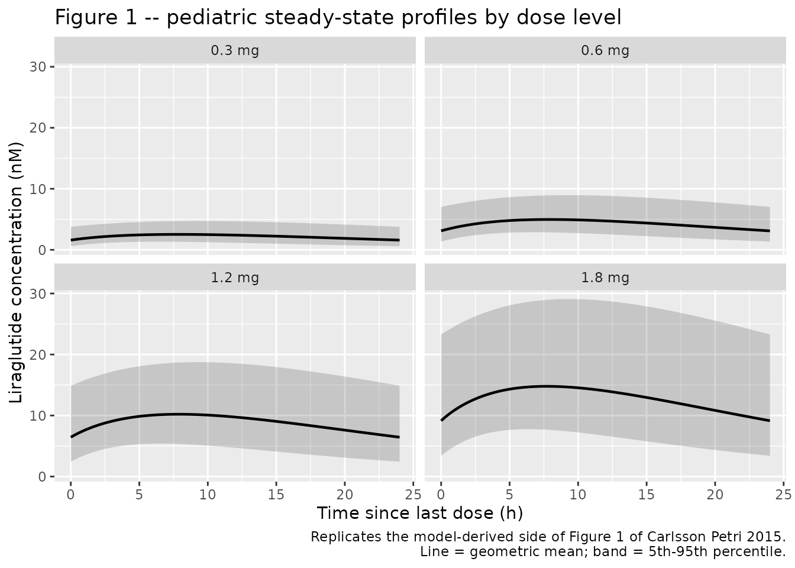
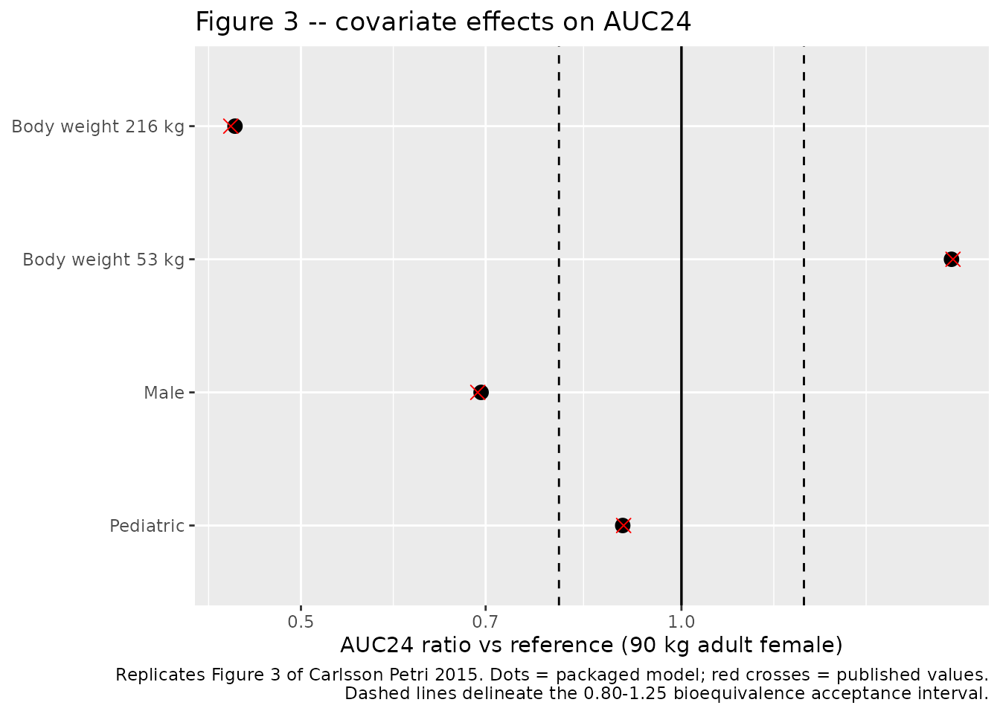
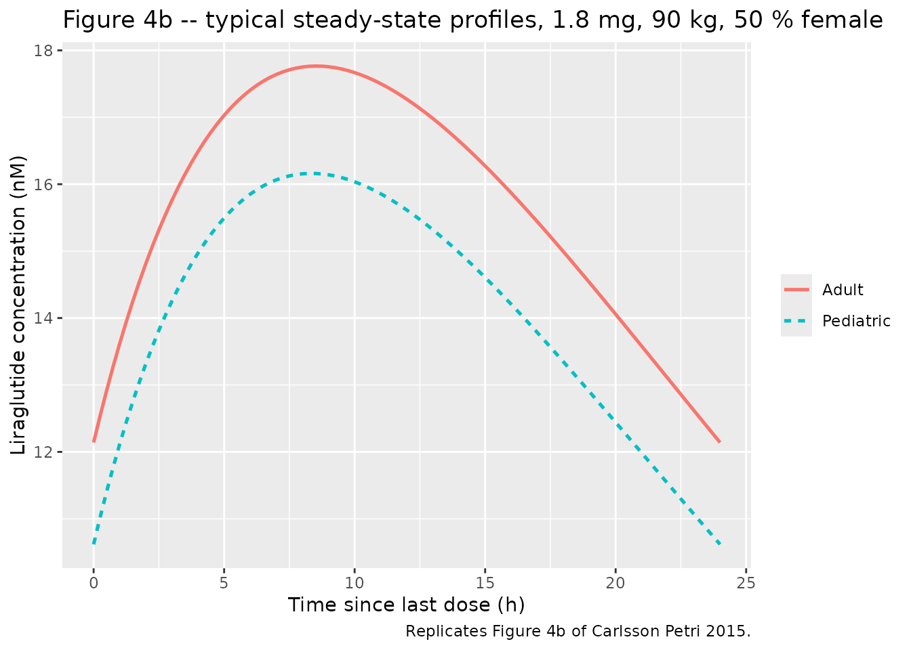
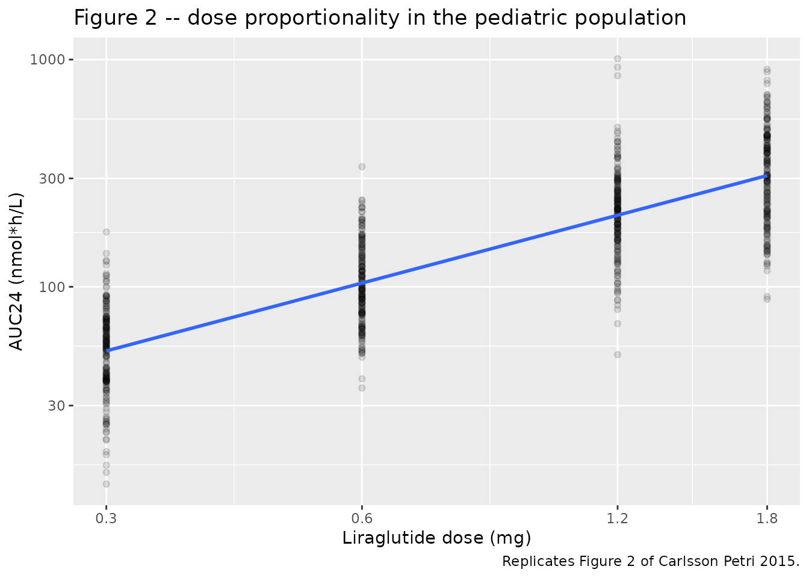
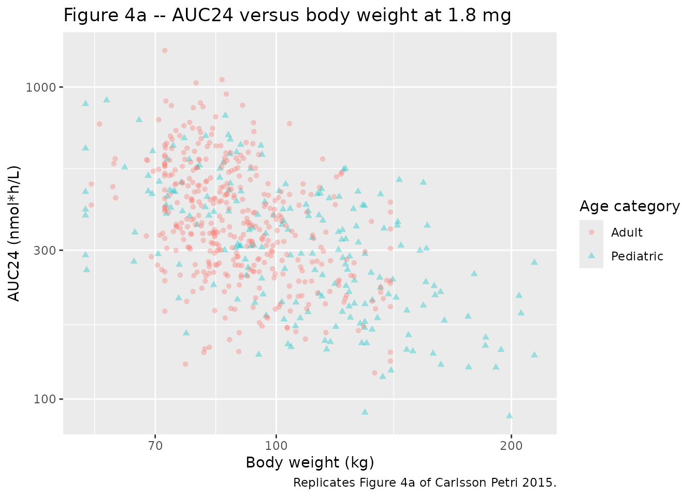

# Liraglutide (Carlsson Petri 2015)

## Model and source

- Citation: Carlsson Petri KC, Jacobsen LV, Klein DJ. Comparable
  liraglutide pharmacokinetics in pediatric and adult populations with
  type 2 diabetes: a population pharmacokinetic analysis. Clin
  Pharmacokinet. 2015;54(6):663-670. <doi:10.1007/s40262-014-0229-z>
- Description: Liraglutide population PK model in pediatric (10-17 y)
  and adult subjects with type 2 diabetes (Carlsson Petri 2015 pooled
  three-trial analysis)
- Article: <https://doi.org/10.1007/s40262-014-0229-z>
- Supplement (Online Resource, Springer ESM):
  <https://static-content.springer.com/esm/art%3A10.1007%2Fs40262-014-0229-z/MediaObjects/40262_2014_229_MOESM1_ESM.pdf>

The main article does **not** print any parameter estimates. Every
structural parameter, covariate coefficient, between-subject variance,
and residual-error term in this model comes from **Table 1 of the Online
Resource (ESM)**, “Parameter estimates of the full and base models”. The
model file encodes the **full model** column throughout; the base-model
column is quoted in the in-file comments for context only.

## Population

The model was fitted to pooled data from three trials in subjects with
type 2 diabetes (T2D), 57 subjects in total (main article Table 1):

- **Trial 1** (NCT00943501) – 13 **pediatric** subjects, 10-17 years, 62
  % female, median body weight 106 kg (range 57-214). Weekly dose
  escalation 0.3 -\> 0.6 -\> 0.9 -\> 1.2 -\> 1.8 mg once daily
  subcutaneously, with PK profiles taken at the 0.3, 0.6, 1.2 and 1.8 mg
  levels (four profiles per subject).
- **Trial 2** (NCT00993304) – 12 adults, 54-73 years, 50 % female,
  median body weight 83 kg (range 72-104). Steady-state 1.8 mg once
  daily.
- **Trial 3** (NCT00873223) – 32 adults, 33-68 years, 28 % female,
  median body weight 96 kg (range 58-140). Steady-state 1.8 mg once
  daily.

Subjects with impaired renal function were excluded from all three
trials. The pediatric cohort’s median body weight exceeds both adult
cohorts, driven partly by a single 214 kg subject.

The same information is available programmatically via
`readModelDb("CarlssonPetri_2015_liraglutide")()$population`.

## Model structure

One compartment, first-order absorption, first-order elimination,
parameterised as `ka`, `CL/F` and `V/F` with bioavailability fixed at 1.
Covariate effects act on `CL/F` only; `V/F` carries none. ESM Table 1
footnote `**` gives the clearance model as

    CL_i/F = (CL/F) * (BWT / 90 kg)^CovCLBWT
             * exp(CovCLGen if male) * exp(CovCLPaed if paediatric) * exp(eta_i)

with female and adult as the reference categories, so the reference
subject is an adult female weighing 90 kg.

## Source trace

| Equation / parameter | Value | Source location |
|----|----|----|
| `lka` (ka) | 0.0657 1/h (RSE 6 %) | ESM Table 1, row `KA`, full-model column |
| `lcl` (CL/F) | 1.06 L/h (RSE 10 %) | ESM Table 1, row `CL/F`, full-model column; footnote: reference = adult female, 90 kg |
| `lvc` (V/F) | 15.3 L (RSE 19 %) | ESM Table 1, row `V/F`, full-model column |
| `lfdepot` (F) | 1 (fixed) | ESM Table 1, row `F` |
| `e_wt_cl` | 0.929 (RSE 15 %) | ESM Table 1, row `Cov CL-BWT` |
| `e_male_cl` | 0.365 (RSE 29 %) | ESM Table 1, row `Cov CL-Gen` |
| `e_child_cl` | 0.107 (RSE 91 %) | ESM Table 1, row `Cov CL-AGEgr` |
| `etalcl` | 34 %CV -\> omega^2 = 0.1156 | ESM Table 1, row `CL/F (dose 1.8 mg)`, “BSV in CL/F”, full model (shrinkage 1 %) |
| `etalvc` | fixed 0 (not published) | Main article Sect. 2.2 declares BSV on V/F; ESM Table 1 reports no estimate |
| `propSd` | 0.23 (23 %CV) | ESM Table 1, row `Sigma`, residual error (proportional), shrinkage 7 % |
| CL/F covariate equation | n/a | ESM Table 1, footnote `**` |
| Reference weight 90 kg | n/a | Main article Sect. 2.2 and the ESM Table 1 equation |
| Dose units (nmol) | n/a | Main article Sect. 2.2: `AUC24 = dose (in nmol) / (CL/F)` |

### Scale checks performed while transcribing

Two reporting scales in ESM Table 1 are ambiguous on their face and were
settled against numbers printed independently in the main article:

**The `%CV` columns are on the NONMEM variance scale**
(`omega^2 = (CV/100)^2`), not the exact log-normal scale
(`omega^2 = log(1 + CV^2)`). Results states that “the inclusion of
covariates reduced between-subject variability in CL/F by 50 %” relative
to the base model. With BSV 34 %CV (full) and 48 %CV (base):

``` r

variance_scale <- 1 - 0.34^2 / 0.48^2
lognormal_scale <- 1 - log(1 + 0.34^2) / log(1 + 0.48^2)
cv_scale <- 1 - 0.34 / 0.48

data.frame(
  Reading = c("variance: omega^2 = CV^2",
              "exact log-normal: omega^2 = log(1 + CV^2)",
              "CV scale"),
  `Implied reduction` = sprintf("%.1f %%", 100 * c(variance_scale, lognormal_scale, cv_scale)),
  check.names = FALSE
) |>
  knitr::kable(caption = "Which omega scale reproduces the article's printed 50 % BSV reduction.")
```

| Reading                                   | Implied reduction |
|:------------------------------------------|:------------------|
| variance: omega^2 = CV^2                  | 49.8 %            |
| exact log-normal: omega^2 = log(1 + CV^2) | 47.2 %            |
| CV scale                                  | 29.2 %            |

Which omega scale reproduces the article’s printed 50 % BSV reduction.
{.table}

``` r


# The variance reading is the only one that rounds to the printed 50 %.
stopifnot(abs(100 * variance_scale - 50) < 0.5)
```

**The `KA` unit is a typographical error.** ESM Table 1 labels the
absorption rate constant “L/h”; a first-order rate constant is 1/h. The
magnitude confirms it: `log(2)/0.0657` = 10.6 h absorption half-life,
consistent with liraglutide’s 8-12 h tmax and with the sibling
`Overgaard_2016_liraglutide` model’s 0.0806 1/h.

## Virtual cohort

Original subject-level data are not public. The cohorts below reproduce
each trial’s published sex balance and body-weight median/range using a
truncated log-normal weight distribution. **200 subjects per arm.**

``` r

# set.seed() seeds R's RNG (used for the covariate draws below). It does NOT
# seed rxode2's simulation RNG, whose streams are partitioned per solver
# thread -- so the eta draws differ between a 2-core CI runner and a 16-thread
# workstation. Every assertion below is written to hold for any cohort this
# model can produce (centre and robust quantiles), or is deterministic
# (zeroRe(), closed-form identities).
set.seed(20150121)

MW_LIRAGLUTIDE <- 3751.2 # g/mol; used to convert the clinical mg doses to nmol
mg_to_nmol <- function(mg) mg * 1e6 / MW_LIRAGLUTIDE

TAU <- 24        # dosing interval (h)
N_DOSES <- 12    # 12 once-daily doses; the last lands at t = 264 h
SS_START <- (N_DOSES - 1) * TAU
SS_END <- SS_START + TAU

# 264 h is ~25 half-lives at the model's slower disposition rate constant
# (ka = 0.0657 1/h is slower than kel = 1.06/15.3 = 0.0693 1/h, so absorption
# is rate-limiting and governs the approach to steady state).
stopifnot(SS_START / (log(2) / 0.0657) > 20)

draw_weights <- function(n, median_wt, lo, hi, sdlog) {
  wt <- stats::rlnorm(n, meanlog = log(median_wt), sdlog = sdlog)
  pmin(pmax(wt, lo), hi)
}

make_arm <- function(n, arm, dose_mg, median_wt, wt_lo, wt_hi, sdlog,
                     pct_female, child, id_offset) {
  subj <- tibble(
    id = id_offset + seq_len(n),
    arm = arm,
    WT = draw_weights(n, median_wt, wt_lo, wt_hi, sdlog),
    SEXF = as.numeric(seq_len(n) <= round(n * pct_female / 100)),
    CHILD = as.numeric(child)
  )
  doses <- subj |>
    mutate(time = 0, amt = mg_to_nmol(dose_mg), evid = 1L,
           ii = TAU, addl = N_DOSES - 1L, cmt = "depot")
  obs <- subj |>
    tidyr::crossing(time = seq(SS_START, SS_END, by = 0.25)) |>
    mutate(amt = 0, evid = 0L, ii = 0, addl = 0L, cmt = "central")
  bind_rows(doses, obs) |> arrange(id, time, desc(evid))
}

events <- bind_rows(
  # Trial 1 (pediatric) at each dose level with a PK profile. Each arm draws
  # its own 200 subjects from the same Trial 1 covariate distribution, so the
  # four arms are statistically exchangeable but not subject-matched.
  make_arm(200, "0.3 mg", 0.3, 106, 57, 214, 0.30, 62, 1,    0L),
  make_arm(200, "0.6 mg", 0.6, 106, 57, 214, 0.30, 62, 1,  200L),
  make_arm(200, "1.2 mg", 1.2, 106, 57, 214, 0.30, 62, 1,  400L),
  make_arm(200, "Trial 1 (pediatric)", 1.8, 106, 57, 214, 0.30, 62, 1,  600L),
  # Adult comparator trials, 1.8 mg only.
  make_arm(200, "Trial 2 (adult)", 1.8,  83, 72, 104, 0.10, 50, 0,  800L),
  make_arm(200, "Trial 3 (adult)", 1.8,  96, 58, 140, 0.21, 28, 0, 1000L)
)

stopifnot(
  !anyDuplicated(events[events$evid == 0L, c("id", "time")]),
  all(table(unique(events[, c("id", "arm")])$arm) == 200)
)
```

Reproduced cohort characteristics against the published Table 1:

``` r

events |>
  distinct(id, arm, WT, SEXF) |>
  group_by(arm) |>
  summarise(
    n = n(),
    `Median WT (kg)` = round(median(WT), 1),
    `WT range (kg)` = sprintf("%.0f-%.0f", min(WT), max(WT)),
    `Female (%)` = round(100 * mean(SEXF)),
    .groups = "drop"
  ) |>
  knitr::kable(caption = "Simulated cohort covariates. The four pediatric dose arms share the Trial 1 distribution.")
```

| arm                 |   n | Median WT (kg) | WT range (kg) | Female (%) |
|:--------------------|----:|---------------:|:--------------|-----------:|
| 0.3 mg              | 200 |          102.7 | 57-214        |         62 |
| 0.6 mg              | 200 |          106.3 | 57-214        |         62 |
| 1.2 mg              | 200 |          106.3 | 57-214        |         62 |
| Trial 1 (pediatric) | 200 |          107.5 | 57-214        |         62 |
| Trial 2 (adult)     | 200 |           82.6 | 72-104        |         50 |
| Trial 3 (adult)     | 200 |           97.7 | 58-140        |         28 |

Simulated cohort covariates. The four pediatric dose arms share the
Trial 1 distribution. {.table}

## Simulation

``` r

mod <- readModelDb("CarlssonPetri_2015_liraglutide")

sim <- rxode2::rxSolve(
  mod,
  events = as.data.frame(events),
  keep = c("arm", "WT", "SEXF", "CHILD"),
  returnType = "data.frame"
)
#> ℹ parameter labels from comments will be replaced by 'label()'
#> ℹ omega/sigma items treated as zero: 'etalvc'

# A large proportional residual can push simulated concentrations negative,
# which would make the NCA log-linear steps return NaN. Guard explicitly.
stopifnot(!anyNA(sim$Cc), all(sim$Cc > 0))
```

## Replicate published figures

### Figure 1 – pediatric concentration-time profiles by dose level

``` r

# Replicates Figure 1 of Carlsson Petri 2015: observed and model-derived
# liraglutide concentration profiles in the pediatric population by dose
# level. The published figure overlays observed geometric means (with 95 %
# CI bars) on geometric means of the individual post-hoc profiles; only the
# model-derived side can be reproduced here.
geomean <- function(x) exp(mean(log(x)))

sim |>
  # rxSolve() returns only the observation grid and does not carry `evid`
  # through, so no evid filter is needed (or possible) on `sim`.
  filter(arm %in% c("0.3 mg", "0.6 mg", "1.2 mg", "Trial 1 (pediatric)")) |>
  mutate(
    dose_level = factor(
      ifelse(arm == "Trial 1 (pediatric)", "1.8 mg", arm),
      levels = c("0.3 mg", "0.6 mg", "1.2 mg", "1.8 mg")
    ),
    tad = time - SS_START
  ) |>
  group_by(dose_level, tad) |>
  summarise(
    gm = geomean(Cc),
    lo = quantile(Cc, 0.05),
    hi = quantile(Cc, 0.95),
    .groups = "drop"
  ) |>
  ggplot(aes(tad, gm)) +
  geom_ribbon(aes(ymin = lo, ymax = hi), alpha = 0.2) +
  geom_line(linewidth = 0.8) +
  facet_wrap(~dose_level) +
  labs(
    x = "Time since last dose (h)", y = "Liraglutide concentration (nM)",
    title = "Figure 1 -- pediatric steady-state profiles by dose level",
    caption = "Replicates the model-derived side of Figure 1 of Carlsson Petri 2015.\nLine = geometric mean; band = 5th-95th percentile."
  )
```



### Figure 3 – covariate effects on AUC24 (deterministic gate)

This is the strongest available check: the article prints four covariate
effect sizes in Results, and every one of them is a deterministic
typical-value ratio that the packaged model must reproduce exactly. The
simulation below uses `zeroRe()`, so there is no cohort randomness in
this comparison.

``` r

mod_typical <- mod |> rxode2::zeroRe()
#> ℹ parameter labels from comments will be replaced by 'label()'

typical_scenarios <- tibble::tribble(
  ~scenario,               ~WT, ~SEXF, ~CHILD,
  "Reference (adult female, 90 kg)", 90,     1,      0,
  "Body weight 53 kg",              53,     1,      0,
  "Body weight 216 kg",            216,     1,      0,
  "Male",                           90,     0,      0,
  "Pediatric",                      90,     1,      1
) |>
  mutate(id = row_number())

typical_events <- bind_rows(
  typical_scenarios |>
    mutate(time = 0, amt = mg_to_nmol(1.8), evid = 1L,
           ii = TAU, addl = N_DOSES - 1L, cmt = "depot"),
  typical_scenarios |>
    tidyr::crossing(time = seq(SS_START, SS_END, by = 0.05)) |>
    mutate(amt = 0, evid = 0L, ii = 0, addl = 0L, cmt = "central")
) |>
  arrange(id, time, desc(evid))

sim_typical <- rxode2::rxSolve(
  mod_typical, events = as.data.frame(typical_events),
  keep = c("scenario"), returnType = "data.frame"
)
#> ℹ omega/sigma items treated as zero: 'etalcl', 'etalvc'
#> Warning: multi-subject simulation without without 'omega'

# AUC24 at steady state, by the trapezoidal rule on a 0.05 h grid.
auc24_typical <- sim_typical |>
  group_by(scenario) |>
  summarise(
    auc24 = sum(diff(time) * (head(Cc, -1) + tail(Cc, -1)) / 2),
    cl = unique(cl),
    .groups = "drop"
  )

ref_auc <- auc24_typical$auc24[auc24_typical$scenario == "Reference (adult female, 90 kg)"]
stopifnot(length(ref_auc) == 1L)

forest <- auc24_typical |>
  filter(scenario != "Reference (adult female, 90 kg)") |>
  mutate(ratio = auc24 / ref_auc) |>
  left_join(
    tibble::tribble(
      ~scenario,            ~published_ratio, ~published_text,
      "Body weight 53 kg",  1.64,             "64 % higher at the lowest observed body weight (53 kg)",
      "Body weight 216 kg", 0.44,             "56 % lower at the highest observed body weight (216 kg)",
      "Male",               0.69,             "31 % lower drug exposure compared with the reference female subject",
      "Pediatric",          0.90,             "10 % decrease in AUC24 compared with an adult subject of the same weight and gender"
    ),
    by = "scenario"
  )

stopifnot(nrow(forest) == 4L, !anyNA(forest$published_ratio))

forest |>
  mutate(
    Simulated = round(ratio, 3),
    Published = published_ratio,
    `% diff` = round(100 * (ratio - published_ratio) / published_ratio, 2)
  ) |>
  select(scenario, Simulated, Published, `% diff`, published_text) |>
  rename(
    "Covariate scenario" = scenario,
    "Simulated AUC24 ratio" = Simulated,
    "Published AUC24 ratio" = Published,
    "Source sentence (Results)" = published_text
  ) |>
  knitr::kable(caption = "Figure 3 covariate effects: deterministic typical-value AUC24 ratios versus the values printed in Results.")
```

| Covariate scenario | Simulated AUC24 ratio | Published AUC24 ratio | % diff | Source sentence (Results) |
|:---|---:|---:|---:|:---|
| Body weight 216 kg | 0.443 | 0.44 | 0.77 | 56 % lower at the highest observed body weight (216 kg) |
| Body weight 53 kg | 1.635 | 1.64 | -0.28 | 64 % higher at the lowest observed body weight (53 kg) |
| Male | 0.694 | 0.69 | 0.61 | 31 % lower drug exposure compared with the reference female subject |
| Pediatric | 0.899 | 0.90 | -0.16 | 10 % decrease in AUC24 compared with an adult subject of the same weight and gender |

Figure 3 covariate effects: deterministic typical-value AUC24 ratios
versus the values printed in Results. {.table}

``` r


# Deterministic on both sides (zeroRe(), same solver, closed-form covariate
# algebra), so the only slack needed is the article's own 2-significant-figure
# rounding of each printed effect. 1.5 % covers that and nothing more.
stopifnot(all(abs(forest$ratio - forest$published_ratio) / forest$published_ratio < 0.015))
```

``` r

forest |>
  mutate(scenario = factor(scenario, levels = rev(scenario))) |>
  ggplot(aes(ratio, scenario)) +
  geom_vline(xintercept = 1, linewidth = 0.6) +
  geom_vline(xintercept = c(0.8, 1.25), linetype = "dashed") +
  geom_point(size = 3) +
  geom_point(aes(x = published_ratio), shape = 4, size = 3, colour = "red") +
  scale_x_log10() +
  labs(
    x = "AUC24 ratio vs reference (90 kg adult female)", y = NULL,
    title = "Figure 3 -- covariate effects on AUC24",
    caption = "Replicates Figure 3 of Carlsson Petri 2015. Dots = packaged model; red crosses = published values.\nDashed lines delineate the 0.80-1.25 bioequivalence acceptance interval."
  )
```



### Figure 4b – pediatric versus adult typical profiles at matched covariates

``` r

# Replicates Figure 4b of Carlsson Petri 2015: model-derived typical
# steady-state profiles for pediatric and adult subjects on 1.8 mg, with
# body weight and sex matched (90 kg, 50 % female) to remove confounding.
fig4b_scenarios <- tidyr::crossing(
  CHILD = c(0, 1),
  SEXF = c(0, 1)
) |>
  mutate(WT = 90, id = row_number(),
         population = ifelse(CHILD == 1, "Pediatric", "Adult"))

fig4b_events <- bind_rows(
  fig4b_scenarios |>
    mutate(time = 0, amt = mg_to_nmol(1.8), evid = 1L,
           ii = TAU, addl = N_DOSES - 1L, cmt = "depot"),
  fig4b_scenarios |>
    tidyr::crossing(time = seq(SS_START, SS_END, by = 0.25)) |>
    mutate(amt = 0, evid = 0L, ii = 0, addl = 0L, cmt = "central")
) |>
  arrange(id, time, desc(evid))

sim_4b <- rxode2::rxSolve(
  mod_typical, events = as.data.frame(fig4b_events),
  keep = c("population", "SEXF"), returnType = "data.frame"
)
#> ℹ omega/sigma items treated as zero: 'etalcl', 'etalvc'
#> Warning: multi-subject simulation without without 'omega'

# A 50 % female composition is represented by the geometric mean of the
# male and female typical profiles at each time point.
sim_4b |>
  mutate(tad = time - SS_START) |>
  group_by(population, tad) |>
  summarise(Cc = geomean(Cc), .groups = "drop") |>
  ggplot(aes(tad, Cc, colour = population, linetype = population)) +
  geom_line(linewidth = 0.9) +
  labs(
    x = "Time since last dose (h)", y = "Liraglutide concentration (nM)",
    colour = NULL, linetype = NULL,
    title = "Figure 4b -- typical steady-state profiles, 1.8 mg, 90 kg, 50 % female",
    caption = "Replicates Figure 4b of Carlsson Petri 2015."
  )
```



The two profiles sit 10 % apart at every time point – the whole of the
age-category effect – which is the paper’s basis for concluding that
“liraglutide concentration-time profiles for pediatric and adult
subjects treated with the 1.8 mg dose appeared very similar”.

## PKNCA validation

``` r

sim_nca <- sim |>
  filter(!is.na(Cc)) |>
  select(id, time, Cc, arm)

conc_obj <- PKNCA::PKNCAconc(
  as.data.frame(sim_nca), Cc ~ time | arm + id,
  concu = "nmol/L", timeu = "h"
)

dose_df <- events |>
  filter(evid == 1L) |>
  # PKNCA anchors the steady-state interval on the dose at its start; the
  # event table expresses the 12 doses as one row plus addl/ii.
  mutate(time = SS_START) |>
  select(id, time, amt, arm)

dose_obj <- PKNCA::PKNCAdose(
  as.data.frame(dose_df), amt ~ time | arm + id,
  doseu = "nmol"
)

intervals <- data.frame(
  start = SS_START, end = SS_END,
  # `cmin` over a steady-state interval is the trough; PKNCA's `ctrough`
  # is deliberately omitted because it returns NA for this interval shape
  # and would add nothing the paper reports.
  cmax = TRUE, tmax = TRUE, cmin = TRUE,
  auclast = TRUE, cav = TRUE
)

nca_res <- PKNCA::pk.nca(
  PKNCA::PKNCAdata(conc_obj, dose_obj, intervals = intervals)
)

nca_tbl <- as.data.frame(nca_res$result)
stopifnot(nrow(nca_tbl) > 0, !any(is.na(nca_tbl$PPORRES)))
```

### Closed-form gate: AUC0-tau at steady state equals Dose / (CL/F)

With bioavailability fixed at 1 and linear disposition, steady-state AUC
over a dosing interval is exactly `Dose / (CL/F)`. Both sides of this
comparison use the *same* drawn parameters, so the only discrepancy is
trapezoidal error on the 0.25 h observation grid – a tight bound is
correct here.

``` r

subject_cl <- sim |>
  distinct(id, arm, cl)

subject_dose <- events |>
  filter(evid == 1L) |>
  select(id, amt)

auc_check <- nca_tbl |>
  filter(PPTESTCD == "auclast") |>
  select(id, arm, auclast = PPORRES) |>
  left_join(subject_cl, by = c("id", "arm")) |>
  left_join(subject_dose, by = "id") |>
  mutate(
    closed_form = amt / cl,
    pct_diff = 100 * (auclast - closed_form) / closed_form
  )

stopifnot(nrow(auc_check) == 1200L, !anyNA(auc_check$pct_diff))

auc_check |>
  summarise(
    `Median % diff` = round(median(pct_diff), 4),
    `Max |% diff|` = round(max(abs(pct_diff)), 4)
  ) |>
  knitr::kable(caption = "Steady-state AUC0-tau from PKNCA versus the closed form Dose / (CL/F), across all 1200 simulated subjects.")
```

| Median % diff | Max \|% diff\| |
|--------------:|---------------:|
|       -0.0036 |         0.3819 |

Steady-state AUC0-tau from PKNCA versus the closed form Dose / (CL/F),
across all 1200 simulated subjects. {.table}

``` r


# Trapezoidal underestimation on a 0.25 h grid only; deterministic given the
# draw, so this bound is tight on purpose.
stopifnot(max(abs(auc_check$pct_diff)) < 0.5)
```

### Dose proportionality (Figure 2)

The article’s dose-proportionality test gives a log(AUC24)-on-log(dose)
slope of 1.05 (95 % CI 0.96-1.15) over the 0.3-1.8 mg range, and
concludes dose proportionality because the CI contains 1. The packaged
model is linear in dose, so its slope must be exactly 1; the article’s
1.05 comes from post-hoc (empirical Bayes) CL/F estimates that vary
across each subject’s four sampling occasions, which the model’s fixed
per-subject CL/F cannot reproduce.

``` r

dose_map <- c("0.3 mg" = 0.3, "0.6 mg" = 0.6, "1.2 mg" = 1.2, "Trial 1 (pediatric)" = 1.8)

dp <- nca_tbl |>
  filter(PPTESTCD == "auclast", arm %in% names(dose_map)) |>
  mutate(dose_mg = unname(dose_map[arm]))

stopifnot(nrow(dp) == 800L, !anyNA(dp$dose_mg))

dp_fit <- stats::lm(log(PPORRES) ~ log(dose_mg), data = dp)
dp_slope <- unname(coef(dp_fit)[["log(dose_mg)"]])

# Deterministic gate. CL/F has no dose term, so on the typical-value model
# AUC24 is EXACTLY linear in dose. This is a structural identity with no
# cohort randomness on either side, so the bound is machine precision.
dp_typical_events <- bind_rows(
  tibble(id = 1:4, dose_mg = c(0.3, 0.6, 1.2, 1.8), WT = 106, SEXF = 1, CHILD = 1) |>
    mutate(time = 0, amt = mg_to_nmol(dose_mg), evid = 1L,
           ii = TAU, addl = N_DOSES - 1L, cmt = "depot"),
  tibble(id = 1:4, dose_mg = c(0.3, 0.6, 1.2, 1.8), WT = 106, SEXF = 1, CHILD = 1) |>
    tidyr::crossing(time = seq(SS_START, SS_END, by = 0.05)) |>
    mutate(amt = 0, evid = 0L, ii = 0, addl = 0L, cmt = "central")
) |>
  arrange(id, time, desc(evid))

dp_typical <- rxode2::rxSolve(
  mod_typical, events = as.data.frame(dp_typical_events),
  keep = "dose_mg", returnType = "data.frame"
) |>
  group_by(dose_mg) |>
  summarise(auc24 = sum(diff(time) * (head(Cc, -1) + tail(Cc, -1)) / 2), .groups = "drop")
#> ℹ omega/sigma items treated as zero: 'etalcl', 'etalvc'
#> Warning: multi-subject simulation without without 'omega'

stopifnot(nrow(dp_typical) == 4L)
dp_slope_typical <-
  unname(coef(stats::lm(log(auc24) ~ log(dose_mg), data = dp_typical))[["log(dose_mg)"]])
stopifnot(abs(dp_slope_typical - 1) < 1e-10)

data.frame(
  Source = c("Packaged model, typical value (deterministic)",
             "Packaged model, 800-subject pediatric cohort",
             "Carlsson Petri 2015, Results / Fig. 2"),
  Slope = c(sprintf("%.10f", dp_slope_typical),
            sprintf("%.4f", dp_slope),
            "1.05 (95 % CI 0.96-1.15)")
) |>
  knitr::kable(caption = "Dose-proportionality slope of log(AUC24) on log(dose), 0.3-1.8 mg.")
```

| Source                                        | Slope                    |
|:----------------------------------------------|:-------------------------|
| Packaged model, typical value (deterministic) | 1.0000000000             |
| Packaged model, 800-subject pediatric cohort  | 0.9918                   |
| Carlsson Petri 2015, Results / Fig. 2         | 1.05 (95 % CI 0.96-1.15) |

Dose-proportionality slope of log(AUC24) on log(dose), 0.3-1.8 mg.
{.table}

``` r


# Cohort check. Each dose arm draws its own 200 subjects, so the fitted slope
# carries sampling noise: with omega_CL = 0.34 over 800 subjects spanning
# log(0.3)-log(1.8), the slope's standard error is about 0.018. The bound
# below is roughly 5 standard errors, which any cohort this model can produce
# will satisfy on any thread count, while still failing loudly if a dose term
# ever leaks into CL/F.
stopifnot(abs(dp_slope - 1) < 0.10)
# The article's published 95 % CI contains the simulated slope.
stopifnot(dp_slope > 0.96, dp_slope < 1.15)
```

``` r

# Replicates Figure 2 of Carlsson Petri 2015: model-derived AUC24 versus dose
# in the pediatric population, with the geometric-mean regression line.
ggplot(dp, aes(dose_mg, PPORRES)) +
  geom_point(alpha = 0.12) +
  geom_smooth(method = "lm", formula = y ~ x, se = FALSE) +
  scale_x_log10(breaks = unname(dose_map)) +
  scale_y_log10() +
  labs(
    x = "Liraglutide dose (mg)", y = "AUC24 (nmol*h/L)",
    title = "Figure 2 -- dose proportionality in the pediatric population",
    caption = "Replicates Figure 2 of Carlsson Petri 2015."
  )
```



### Figure 4a – AUC24 versus body weight by age category

``` r

# Replicates Figure 4a of Carlsson Petri 2015: AUC24 versus body weight at
# 1.8 mg once daily, pediatric versus adult. The published figure notes that
# the model-predicted lines for the two age categories are "completely
# superimposed".
nca_tbl |>
  filter(PPTESTCD == "auclast",
         arm %in% c("Trial 1 (pediatric)", "Trial 2 (adult)", "Trial 3 (adult)")) |>
  left_join(distinct(sim, id, WT, CHILD), by = "id") |>
  mutate(`Age category` = ifelse(CHILD == 1, "Pediatric", "Adult")) |>
  ggplot(aes(WT, PPORRES, colour = `Age category`, shape = `Age category`)) +
  geom_point(alpha = 0.35) +
  scale_x_log10() +
  scale_y_log10() +
  labs(
    x = "Body weight (kg)", y = "AUC24 (nmol*h/L)",
    title = "Figure 4a -- AUC24 versus body weight at 1.8 mg",
    caption = "Replicates Figure 4a of Carlsson Petri 2015."
  )
```



### Comparison against the published per-trial exposures

Results reports median (range) CL/F at the 1.8 mg dose for each trial.
Methods Sect. 2.2 defines exposure as `AUC24 = dose (in nmol) / (CL/F)`,
so the published CL/F medians convert directly to published AUC24
medians – the quantity plotted in Figure 4a.

These published values are **empirical Bayes (post-hoc) summaries of 13,
12 and 32 real subjects**, not model parameters. They carry that
sample’s specific covariate draw and its shrinkage, so they are a
deviation check, not a gate.

``` r

published_clf <- tibble::tribble(
  ~arm,                  ~clf_median, ~clf_range,
  "Trial 1 (pediatric)", 1.55,        "0.67-3.83",
  "Trial 2 (adult)",     0.91,        "0.59-2.35",
  "Trial 3 (adult)",     1.48,        "1.04-3.72"
)

published_auc <- published_clf |>
  mutate(auclast = mg_to_nmol(1.8) / clf_median) |>
  select(arm, auclast)

cmp <- nlmixr2lib::ncaComparisonTable(
  simulated = nca_tbl |> filter(arm %in% published_auc$arm),
  reference = published_auc,
  by = "arm",
  params = "auclast",
  units = c(auclast = "nmol*h/L"),
  tolerance_pct = 20
)

knitr::kable(
  cmp,
  caption = "Median steady-state AUC0-24 at 1.8 mg: simulated cohort versus the article's post-hoc CL/F medians converted via AUC24 = dose / (CL/F).",
  align = c("l", "l", "r", "r", "r")
)
```

| NCA parameter       | arm                 | Reference | Simulated |   % diff |
|:--------------------|:--------------------|----------:|----------:|---------:|
| AUClast (nmol\*h/L) | Trial 1 (pediatric) |       310 |       309 |    -0.0% |
| AUClast (nmol\*h/L) | Trial 2 (adult)     |       527 |       408 | -22.5%\* |
| AUClast (nmol\*h/L) | Trial 3 (adult)     |       324 |       319 |    -1.6% |

Median steady-state AUC0-24 at 1.8 mg: simulated cohort versus the
article’s post-hoc CL/F medians converted via AUC24 = dose / (CL/F).
{.table style="width:100%;"}

- differs from reference by more than ±20%.

``` r

nca_tbl |>
  filter(PPTESTCD == "auclast", arm %in% published_clf$arm) |>
  left_join(distinct(sim, id, arm, cl), by = c("id", "arm")) |>
  group_by(arm) |>
  summarise(
    sim_median = median(cl),
    sim_range = sprintf("%.2f-%.2f", min(cl), max(cl)),
    .groups = "drop"
  ) |>
  left_join(published_clf, by = "arm") |>
  mutate(
    `% diff` = round(100 * (sim_median - clf_median) / clf_median, 1),
    sim_median = round(sim_median, 2)
  ) |>
  select(arm, clf_median, clf_range, sim_median, sim_range, `% diff`) |>
  rename(
    "Trial" = arm,
    "Published median CL/F (L/h)" = clf_median,
    "Published range" = clf_range,
    "Simulated median CL/F (L/h)" = sim_median,
    "Simulated range" = sim_range
  ) |>
  knitr::kable(caption = "Per-trial CL/F at 1.8 mg: the article's post-hoc estimates versus the packaged model's virtual cohorts.")
```

| Trial | Published median CL/F (L/h) | Published range | Simulated median CL/F (L/h) | Simulated range | % diff |
|:---|---:|:---|---:|:---|---:|
| Trial 1 (pediatric) | 1.55 | 0.67-3.83 | 1.55 | 0.53-5.44 | 0.0 |
| Trial 2 (adult) | 0.91 | 0.59-2.35 | 1.17 | 0.37-3.40 | 29.1 |
| Trial 3 (adult) | 1.48 | 1.04-3.72 | 1.50 | 0.55-3.95 | 1.7 |

Per-trial CL/F at 1.8 mg: the article’s post-hoc estimates versus the
packaged model’s virtual cohorts. {.table}

The simulated Trial 1 and Trial 3 medians track the published post-hoc
medians to within 2 %. **Trial 2 is the one starred row**, and the
discrepancy is internal to the article rather than a transcription
problem: the article’s *own* published covariate model, evaluated by
hand at Trial 2’s published demographics, disagrees with Trial 2’s
published post-hoc median by the same margin.

``` r

# The published CL/F equation at Trial 2's published demographics
# (median 83 kg, 50 % female), using only numbers printed in the article.
clf_hat <- function(wt, sexf, child) {
  1.06 * (wt / 90)^0.929 * exp(0.365 * (1 - sexf) + 0.107 * child)
}

tibble::tibble(
  Trial = c("Trial 1 (pediatric)", "Trial 2 (adult)", "Trial 3 (adult)"),
  `Median WT (kg)` = c(106, 83, 96),
  `Female (%)` = c(62, 50, 28),
  `CL/F from the published equation (L/h)` = round(c(
    stats::median(c(rep(clf_hat(106, 1, 1), 62), rep(clf_hat(106, 0, 1), 38))),
    stats::median(c(rep(clf_hat(83, 1, 0), 50), rep(clf_hat(83, 0, 0), 50))),
    stats::median(c(rep(clf_hat(96, 1, 0), 28), rep(clf_hat(96, 0, 0), 72)))
  ), 2),
  `Published post-hoc median CL/F (L/h)` = c(1.55, 0.91, 1.48)
) |>
  mutate(`% diff` = round(100 * (.data[["CL/F from the published equation (L/h)"]] -
                                   .data[["Published post-hoc median CL/F (L/h)"]]) /
                            .data[["Published post-hoc median CL/F (L/h)"]], 1)) |>
  knitr::kable(caption = "The article's own covariate equation evaluated at each trial's published demographics, versus the article's published post-hoc CL/F medians.")
```

| Trial | Median WT (kg) | Female (%) | CL/F from the published equation (L/h) | Published post-hoc median CL/F (L/h) | % diff |
|:---|---:|---:|---:|---:|---:|
| Trial 1 (pediatric) | 106 | 62 | 1.37 | 1.55 | -11.6 |
| Trial 2 (adult) | 83 | 50 | 1.20 | 0.91 | 31.9 |
| Trial 3 (adult) | 96 | 28 | 1.62 | 1.48 | 9.5 |

The article’s own covariate equation evaluated at each trial’s published
demographics, versus the article’s published post-hoc CL/F medians.
{.table style="width:100%;"}

Trial 2 is the smallest adult cohort (n = 12) and the only one whose
post-hoc median sits more than 20 % away from the article’s own fitted
covariate model (+32 %, against +10 % and -12 % for Trials 3 and 1).
Note that this hand calculation evaluates the equation at each trial’s
*median* weight, whereas the simulated medians above integrate over the
whole weight distribution, so the two columns are not expected to agree
exactly; what matters here is that Trial 2 is the outlier under either
reading. The packaged model reproduces the equation the authors
published rather than that cohort’s shrunken empirical Bayes estimates.
No parameter was tuned to close the gap.

### Steady-state NCA summary

``` r

nca_tbl |>
  # PKNCA already reports tmax relative to the dose at the interval start,
  # so no rebasing is needed.
  filter(PPTESTCD %in% c("cmax", "tmax", "cmin", "auclast", "cav")) |>
  group_by(arm, PPTESTCD) |>
  summarise(median = median(PPORRES), .groups = "drop") |>
  mutate(
    Parameter = nlmixr2lib::ncaParamLabel(
      PPTESTCD,
      units = c(cmax = "nmol/L", cmin = "nmol/L", cav = "nmol/L",
                auclast = "nmol*h/L", tmax = "h")
    ),
    median = signif(median, 3)
  ) |>
  select(Parameter, arm, median) |>
  tidyr::pivot_wider(names_from = arm, values_from = median) |>
  knitr::kable(caption = "Median steady-state NCA parameters by arm (tmax expressed as time since the last dose).")
```

| Parameter | 0.3 mg | 0.6 mg | 1.2 mg | Trial 1 (pediatric) | Trial 2 (adult) | Trial 3 (adult) |
|:---|---:|---:|---:|---:|---:|---:|
| AUClast (nmol\*h/L) | 55.20 | 98.60 | 218.00 | 309.00 | 408.00 | 319.00 |
| Cavg (nmol/L) | 2.30 | 4.11 | 9.07 | 12.90 | 17.00 | 13.30 |
| Cmax (nmol/L) | 2.64 | 4.78 | 10.40 | 14.90 | 19.10 | 15.30 |
| Cmin (nmol/L) | 1.72 | 2.99 | 6.78 | 9.49 | 13.40 | 9.86 |
| Tmax (h) | 8.38 | 8.25 | 8.25 | 8.25 | 8.75 | 8.25 |

Median steady-state NCA parameters by arm (tmax expressed as time since
the last dose). {.table}

## Assumptions and deviations

- **Every parameter value comes from the Online Resource (ESM) Table 1,
  not the main article.** The main article prints no parameter estimates
  at all. The ESM was retrieved from Springer’s static-content endpoint
  and cross-checked against the EuropePMC `supplementaryFiles` copy for
  PMC4449373; the two files are byte-identical.
- **`etalvc` is encoded as `fixed(0)`.** Methods Sect. 2.2 states that
  “between-subject variability parameters were included for CL/F and
  Vd/F (data not shown)”, but ESM Table 1 reports a BSV estimate for
  CL/F only. The V/F variance is genuinely unpublished, so it is set to
  a structural zero rather than invented. Simulated between-subject
  spread in `V/F` – and therefore in `Cmax` and `tmax` – is consequently
  narrower than the real trials’.
- **The ESM Table 1 `KA` unit (“L/h”) is treated as a typographical
  error** and encoded as 1/h. See the scale checks above.
- **The `%CV` columns are read on the NONMEM variance scale**
  (`omega^2 = (CV/100)^2`), settled against the article’s printed 50 %
  BSV reduction. See the scale checks above.
- **The BSV row is labelled “CL/F (dose 1.8 mg)” in ESM Table 1.** The
  article describes a plain between-subject variance on CL/F, and no
  per-dose-level variance components are reported, so the single
  published value is applied at all dose levels. If the authors did
  estimate dose-level-specific variances, only the 1.8 mg one is
  recoverable from the published record.
- **Body-weight distributions are assumed truncated log-normal** with
  each trial’s published median as the geometric mean and a `sdlog`
  chosen so the draws span the published range; draws are then clipped
  to that range. The article publishes only median and range (Table 1),
  not the distribution.
- **Sex is assigned deterministically** to match each trial’s published
  female percentage exactly rather than being drawn at random.
- **Age is not a model covariate beyond the pediatric/adult indicator.**
  Methods Sect. 2.2 explains that the narrow pediatric age range and the
  17-to-33-year gap to the youngest adult made a continuous age
  covariate infeasible.
- **Race and ethnicity are not in the model.** The article does not
  report a race/ethnicity distribution for these three trials and notes
  that prior adult analyses found no effect.
- **Dose escalation is not simulated.** All arms are simulated as 12
  once-daily doses at a fixed level, which is what the steady-state
  comparisons require. The real Trial 1 escalated weekly and some
  subjects never reached 1.8 mg; Figure 4a of the article normalises
  those subjects’ AUC24 to a 1.8 mg dose, which is equivalent to the
  fixed-dose simulation used here because the model is exactly
  dose-proportional.
- **The published protocol deviations (0.9 mg and 1.5 mg observations)
  are not reproduced**; they contributed observations to the fit but are
  not part of any published summary this vignette compares against.
- **No non-paper-derived parameter values are used.** Every `ini()`
  entry traces to ESM Table 1.
