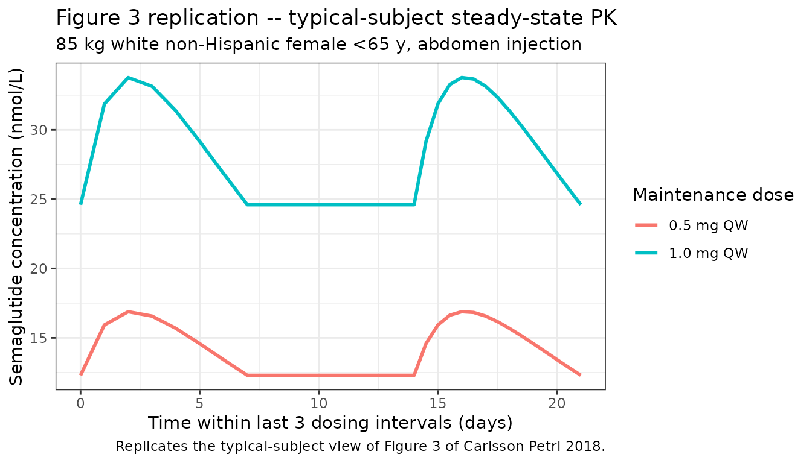
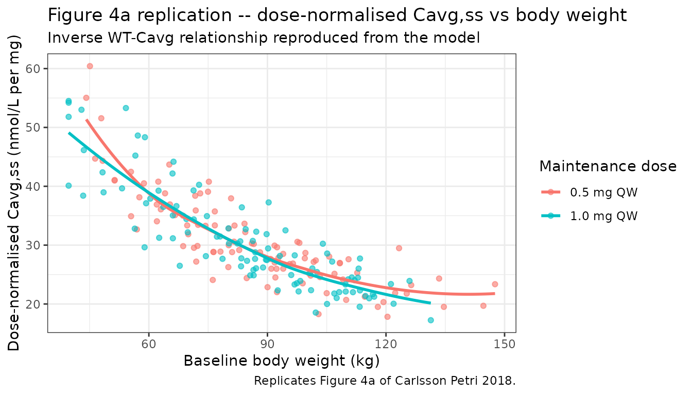

# Semaglutide (Carlsson Petri 2018)

## Model and source

- Citation: Carlsson Petri KC, Ingwersen SH, Flint A, Zacho J, Overgaard
  RV. Semaglutide s.c. once-weekly in type 2 diabetes: a population
  pharmacokinetic analysis. Diabetes Therapy. 2018;9(4):1533-1547.
- DOI: <https://doi.org/10.1007/s13300-018-0458-5>
- Description: One-compartment population PK model with first-order
  subcutaneous absorption and first-order elimination, fit to pooled
  data from five SUSTAIN phase III trials (1612 subjects, 6781
  concentration measurements) in adults with type 2 diabetes.

## Population

The pooled SUSTAIN cohort (Carlsson Petri 2018 Table 2 and Table S1)
comprised 1612 adults with type 2 diabetes from five phase III trials –
SUSTAIN 1, SUSTAIN 2, SUSTAIN 3, SUSTAIN 6 (CVOT), and SUSTAIN-Japan.
Baseline age ranged from 20 to 86 years (mean 57, SD 10.6); body weight
from 39.7 to 198.3 kg (mean 86.2, SD 22.5); BMI from 16.3 to 72.8 kg/m^2
(mean 31.1, SD 7.1); HbA1c from 5.9 to 13.1% (mean 8.2, SD 1.0);
diabetes duration from 0 to 48.9 years (mean 8.1, SD 6.6). The cohort
was 42.5% female; 52.0% White, 40.8% Asian, 4.5% Black or African
American, 0.1% American Indian or Alaska Native, and 2.5% Unknown race;
15.0% Hispanic or Latino; 61.8% normal renal function, 33.1% mild
impairment, 3% moderate impairment, and 2.0% severe impairment.

The reference subject profile used for the full-model typical values is
a non-Hispanic or non-Latino white female \<65 years, body weight 85 kg
(pre-specified as the approximate median), normal renal function, dosed
in the abdomen with 1.0 mg semaglutide once weekly (Carlsson Petri 2018
Methods). The two American Indian or Alaska Native subjects and the 41
subjects with unknown race were merged into the White reference group
for the covariate analysis because both subgroups contained fewer than
20 subjects (Table 2 footnote a).

The same population summary is available programmatically via
`readModelDb("CarlssonPetri_2018_semaglutide")()$population`.

## Source trace

Per-parameter origins are recorded as in-file comments next to each
`ini()` entry in
`inst/modeldb/specificDrugs/CarlssonPetri_2018_semaglutide.R`. The table
below collects them in one place.

| Equation / parameter | Value | Source location |
|----|----|----|
| One-compartment SC-absorption ODE structure | n/a | Methods “Population Pharmacokinetic Model” and Discussion; Table S3 |
| `lka` = log(0.0286) (1/h, FIXED) | 0.0286 | Table S2 / S3, ka row; Methods “The semaglutide absorption rate constant (ka) was set to 0.0286 h-1 based on data from clinical pharmacology trials with richly sampled PK profiles” |
| `lcl` = log(0.0478) (L/h, reference subject) | 0.0478 | Table S3, CL/F row (95% CI 0.0468-0.0488, RSE 1.06%) |
| `lvc` = log(12.2) (L, reference subject) | 12.2 | Table S3, V/F row (95% CI 12.1-12.4, RSE 0.487%) |
| `e_wt_cl` (BW power exponent on CL/F) | 0.774 | Table S3, Body weight row (95% CI 0.724-0.823, RSE 3.27%) |
| `e_sexm_cl` (male-vs-female CL/F ratio) | 1.04 | Table S3, Sex - male row (95% CI 1.02-1.06) |
| `e_age_65_74_cl` (age 65-74 vs \<65 CL/F ratio) | 0.988 | Table S3, Age 65-74 years row (95% CI 0.966-1.01) |
| `e_age_ge_75_cl` (age \>=75 vs \<65 CL/F ratio) | 0.961 | Table S3, Age \>74 years row (95% CI 0.916-1.01) |
| `e_dose_low_cl` (0.5 vs 1.0 mg maintenance CL/F ratio; FIXED) | 1.00 | Table S3, Maintenance dose 0.5 mg row (95% CI 0.984-1.02); interpreted by paper as dose proportionality |
| `e_race_black_cl` (Black-vs-White CL/F ratio) | 0.974 | Table S3, Race - black row (95% CI 0.912-1.04) |
| `e_race_asian_cl` (Asian-vs-White CL/F ratio) | 0.989 | Table S3, Race - Asian row (95% CI 0.965-1.01) |
| `e_hisp_cl` (Hispanic-vs-non-Hispanic CL/F ratio) | 1.06 | Table S3, Ethnicity - Hispanic or Latino row (95% CI 1.03-1.10) |
| `e_site_thigh_cl` (thigh-vs-abdomen CL/F ratio) | 1.04 | Table S3, Injection site - thigh row (95% CI 0.993-1.08) |
| `e_site_arm_cl` (upper-arm-vs-abdomen CL/F ratio) | 1.08 | Table S3, Injection site - upper arm row (95% CI 1.03-1.12) |
| `e_renal_mild_cl` (mild-vs-normal CL/F ratio) | 0.948 | Table S3, Renal - Mild impairment row (95% CI 0.930-0.965) |
| `e_renal_mod_cl` (moderate-vs-normal CL/F ratio) | 0.955 | Table S3, Renal - Moderate impairment row (95% CI 0.900-1.01) |
| `e_renal_sev_cl` (severe-vs-normal CL/F ratio) | 0.920 | Table S3, Renal - Severe impairment row (95% CI 0.846-0.995) |
| IIV CL/F = 12.9% CV -\> omega^2 = log(1 + 0.129^2) | 0.01651 | Table S3, IIV column for CL/F (shrinkage 25%) |
| IIV V/F = 37.3% CV -\> omega^2 = log(1 + 0.373^2) | 0.13030 | Table S3, IIV column for V/F (shrinkage 58.1%) |
| `propSd` (proportional residual error on untransformed conc) | 0.238 | Table S3, Proportional residual error row (23.8% CV, shrinkage 8.0%); Methods “The model was estimated on un-transformed concentration values, and a proportional error model was used” |

The full-model CL/F equation is a product of multiplicative covariate
ratios raised to the corresponding indicator (Methods “Exponents used
for categorical covariate relations are indicator variables assigned the
value 1 for the actual category and else 0”):

    CL_i = 0.0478 * (WT_i / 85)^0.774
                  * 1.04^(1 - SEXF_i)
                  * 0.988^AGE_65_74_i * 0.961^AGE_GE_75_i
                  * 1.00^DOSE_LOW_MAINT_i
                  * 0.974^RACE_BLACK_i  * 0.989^RACE_ASIAN_i
                  * 1.06^RACE_HISPANIC_i
                  * 1.04^INJSITE_THIGH_i * 1.08^INJSITE_ARM_i
                  * 0.948^RENALIMP_MILD_i * 0.955^RENALIMP_MOD_i * 0.920^RENALIMP_SEV_i
                  * exp(eta_CL_i)

V/F carries only `exp(eta_V)` – no covariate effects, per the paper’s
Discussion (“Covariate effects were not included for V/F”).

## Virtual cohort

Original individual-level data are not publicly available. The cohort
below approximates the pooled SUSTAIN demographics (Table 2): body
weight ~N(86.2, 22.5) kg clipped to the observed 39.7-198.3 kg range,
42.5% female, and all other covariates set to their reference categories
so that the mean simulated exposure isolates the body-weight effect.
This is deliberately simpler than a full multi-covariate virtual
population because the paper reports (Figure 2, forest plot) that all
other covariate 90% CIs lie inside the 0.80-1.25 acceptance interval –
body weight is the only clinically meaningful covariate on exposure.

``` r

set.seed(2018L)
n_per_arm <- 100L                       # 200 total; cap <= 200 per arm per skill guidance

make_cohort_arm <- function(n, dose_mg, id_offset) {
  tibble(
    id                    = id_offset + seq_len(n),
    WT                    = pmin(pmax(rnorm(n, mean = 86.2, sd = 22.5), 39.7), 198.3),
    SEXF                  = as.integer(rbinom(n, 1, 0.425)),
    AGE                   = pmin(pmax(rnorm(n, mean = 57, sd = 10.6), 20), 86),
    RACE_BLACK            = 0L,
    RACE_ASIAN            = 0L,
    RACE_HISPANIC         = 0L,
    INJSITE_ARM           = 0L,
    INJSITE_THIGH         = 0L,
    RENALIMP_MILD         = 0L,
    RENALIMP_MOD          = 0L,
    RENALIMP_SEV          = 0L,
    DOSE_SEMAGLUTIDE_MG   = dose_mg,
    arm                   = sprintf("%.1f mg QW", dose_mg)
  )
}

pop <- bind_rows(
  make_cohort_arm(n_per_arm, dose_mg = 0.5, id_offset =   0L),
  make_cohort_arm(n_per_arm, dose_mg = 1.0, id_offset = 200L)
)
```

## Dosing dataset

The maintenance regimen is 0.5 or 1.0 mg semaglutide subcutaneously once
weekly. For this validation vignette the escalation phase (0.25 mg once
weekly for 4 weeks, then 0.5 mg for another 4 weeks before escalating to
1.0 mg) is omitted; each subject is dosed at the maintenance dose from
time 0 for 16 weekly doses so that the drug reaches steady state
(semaglutide t1/2 ~ 1 week; ~ 5 half-lives to 97% of steady state).

Doses are entered in nmol using semaglutide molecular weight 4113.6
g/mol (1 mg = 1000 / 4113.6 = 243.1 nmol), matching the unit convention
of the sibling `Overgaard_2019_semaglutide` model. Concentrations are in
nmol/L; time is in hours.

``` r

mw_semaglutide  <- 4113.6                   # g/mol
mg_to_nmol      <- 1000 / mw_semaglutide * 1000  # 1 mg -> nmol

tau_h           <- 24 * 7                   # weekly dosing interval in hours
n_doses         <- 16L
dose_times      <- seq(0, by = tau_h, length.out = n_doses)

# Observation grid: sparse over the ramp-up, dense over the steady-state last interval.
last_dose_time  <- max(dose_times)
end_window      <- last_dose_time + tau_h

obs_times <- sort(unique(c(
  seq(0, last_dose_time - tau_h, by = 24),               # daily during weeks 0-14
  seq(last_dose_time, end_window, by = 12)               # 12-hourly over week 15-16 interval
)))

make_events <- function(pop_df) {
  d_dose <- pop_df %>%
    tidyr::crossing(time = dose_times) %>%
    mutate(amt = DOSE_SEMAGLUTIDE_MG * mg_to_nmol,
           evid = 1L, cmt = "depot")
  d_obs  <- pop_df %>%
    tidyr::crossing(time = obs_times) %>%
    mutate(amt = NA_real_, evid = 0L, cmt = "central")
  bind_rows(d_dose, d_obs) %>%
    arrange(id, time, desc(evid)) %>%
    as.data.frame()
}

events <- make_events(pop)
stopifnot(!anyDuplicated(unique(events[, c("id", "time", "evid")])))
```

## Simulation

``` r

mod <- readModelDb("CarlssonPetri_2018_semaglutide")
sim <- rxSolve(mod, events = events,
               keep = c("WT", "SEXF", "AGE", "DOSE_SEMAGLUTIDE_MG", "arm"),
               returnType = "data.frame")
#> ℹ parameter labels from comments will be replaced by 'label()'
```

For the reference-subject typical-value view (Table 3 comparison)
simulate the typical value (`zeroRe()`) at the reference body weight 85
kg.

``` r

mod_typ <- rxode2::zeroRe(mod)
#> ℹ parameter labels from comments will be replaced by 'label()'
typ_pop <- bind_rows(
  make_cohort_arm(1L, dose_mg = 0.5, id_offset = 900L) %>% mutate(WT = 85, SEXF = 1L, AGE = 55),
  make_cohort_arm(1L, dose_mg = 1.0, id_offset = 901L) %>% mutate(WT = 85, SEXF = 1L, AGE = 55)
)
typ_events <- make_events(typ_pop)
sim_typ <- rxSolve(mod_typ, events = typ_events,
                   keep = c("DOSE_SEMAGLUTIDE_MG", "arm"),
                   returnType = "data.frame")
#> ℹ omega/sigma items treated as zero: 'etalcl', 'etalvc'
#> Warning: multi-subject simulation without without 'omega'
```

## Replicate published figures

### Figure 3 – typical-subject steady-state profile

Carlsson Petri 2018 Figure 3 shows simulated typical-subject
concentration profiles for 0.5 mg and 1.0 mg maintenance dosing over
three steady-state dosing intervals. The plot below replicates the
typical-subject view for the reference 85 kg female over the last three
weekly dosing intervals.

``` r

ss_start_typ <- max(dose_times) - 2 * tau_h  # last 3 intervals

sim_typ %>%
  filter(time >= ss_start_typ) %>%
  mutate(time_days = (time - ss_start_typ) / 24) %>%
  ggplot(aes(x = time_days, y = Cc, colour = arm)) +
  geom_line(linewidth = 1) +
  labs(x = "Time within last 3 dosing intervals (days)",
       y = "Semaglutide concentration (nmol/L)",
       colour = "Maintenance dose",
       title = "Figure 3 replication -- typical-subject steady-state PK",
       subtitle = "85 kg white non-Hispanic female <65 y, abdomen injection",
       caption  = "Replicates the typical-subject view of Figure 3 of Carlsson Petri 2018.") +
  theme_bw()
```



### Figure 4 – body-weight effect on Cavg,ss

Carlsson Petri 2018 Figure 4 plots dose-normalised individual average
steady-state semaglutide concentrations against baseline body weight.
The plot below approximates Figure 4a by computing the average
concentration over the last dosing interval for each subject in the
virtual cohort and plotting it against WT for the two dose arms.

``` r

cavg_by_id <- sim %>%
  filter(time >= last_dose_time, time <= end_window, !is.na(Cc)) %>%
  group_by(id, arm, WT, DOSE_SEMAGLUTIDE_MG) %>%
  summarise(Cavg = mean(Cc), .groups = "drop") %>%
  mutate(dnCavg = Cavg / DOSE_SEMAGLUTIDE_MG)

ggplot(cavg_by_id, aes(x = WT, y = dnCavg, colour = arm)) +
  geom_point(alpha = 0.6) +
  geom_smooth(se = FALSE, method = "loess", formula = y ~ x) +
  labs(x = "Baseline body weight (kg)",
       y = "Dose-normalised Cavg,ss (nmol/L per mg)",
       colour = "Maintenance dose",
       title = "Figure 4a replication -- dose-normalised Cavg,ss vs body weight",
       subtitle = "Inverse WT-Cavg relationship reproduced from the model",
       caption  = "Replicates Figure 4a of Carlsson Petri 2018.") +
  theme_bw()
```



## PKNCA validation

The Table 3 exposure summary (Cavg,ss and AUC0-168h,ss) is the primary
validation target for this vignette. PKNCA is run on the last-dose
interval \[t_ss, t_ss + 168 h\] with a treatment grouping so per-arm
summaries can be compared side-by-side with the paper.

``` r

nca_conc <- sim %>%
  filter(time >= last_dose_time, time <= end_window, !is.na(Cc)) %>%
  mutate(time_rel = time - last_dose_time) %>%
  select(id, time_rel, Cc, arm)

# Guarantee a time=0 row per (id, arm); use the pre-dose (trough) concentration
# recorded at the last-dose event time.
trough_at_last_dose <- sim %>%
  filter(time == last_dose_time, !is.na(Cc)) %>%
  transmute(id, arm, time_rel = 0, Cc = Cc)

nca_conc <- bind_rows(nca_conc, trough_at_last_dose) %>%
  distinct(id, arm, time_rel, .keep_all = TRUE) %>%
  arrange(id, arm, time_rel)

nca_dose <- pop %>%
  transmute(
    id       = id,
    time_rel = 0,
    amt      = DOSE_SEMAGLUTIDE_MG * mg_to_nmol,
    arm      = arm
  )

conc_obj <- PKNCA::PKNCAconc(nca_conc, Cc ~ time_rel | arm + id,
                             concu = "nmol/L", timeu = "h")
dose_obj <- PKNCA::PKNCAdose(nca_dose, amt ~ time_rel | arm + id,
                             doseu = "nmol")

intervals <- data.frame(
  start   = 0,
  end     = tau_h,
  cmax    = TRUE,
  cmin    = TRUE,
  auclast = TRUE,
  cav     = TRUE
)

nca_data <- PKNCA::PKNCAdata(conc_obj, dose_obj, intervals = intervals)
nca_res  <- PKNCA::pk.nca(nca_data)
```

### Comparison against published Table 3

Carlsson Petri 2018 Table 3 reports geometric-mean Cavg and AUC0-168h,ss
for both 0.5 mg and 1.0 mg maintenance doses. The simulated per-arm
geometric means from the virtual cohort are compared below.

``` r

gm      <- function(x) exp(mean(log(x[x > 0]), na.rm = TRUE))
gm_low  <- function(x) exp(mean(log(x[x > 0]), na.rm = TRUE) - 1.96 * sd(log(x[x > 0]), na.rm = TRUE) / sqrt(sum(x > 0)))
gm_up   <- function(x) exp(mean(log(x[x > 0]), na.rm = TRUE) + 1.96 * sd(log(x[x > 0]), na.rm = TRUE) / sqrt(sum(x > 0)))

sim_summary <- as.data.frame(nca_res$result) %>%
  filter(PPTESTCD %in% c("cav", "auclast")) %>%
  group_by(arm, PPTESTCD) %>%
  summarise(sim_gm = gm(PPORRES),
            sim_ci = sprintf("%.1f-%.1f", gm_low(PPORRES), gm_up(PPORRES)),
            .groups = "drop") %>%
  tidyr::pivot_wider(names_from = PPTESTCD, values_from = c(sim_gm, sim_ci))

published <- tibble::tribble(
  ~arm,        ~pub_cav_gm, ~pub_cav_ci,   ~pub_aucss_gm, ~pub_aucss_ci,
  "0.5 mg QW",       15.8,  "15.6-16.1",           2660,  "2614-2707",
  "1.0 mg QW",       29.8,  "29.4-30.2",           5006,  "4934-5079"
) %>% rename(arm = arm)

# Match the arm labels from the simulation
sim_summary <- sim_summary %>% mutate(arm = ifelse(grepl("0.5", arm), "0.5 mg QW", "1.0 mg QW"))

comparison <- published %>%
  left_join(sim_summary, by = "arm") %>%
  transmute(
    Arm                = arm,
    `Cavg pub (nmol/L)` = sprintf("%.1f (95%% CI %s)", pub_cav_gm, pub_cav_ci),
    `Cavg sim (nmol/L)` = sprintf("%.1f (95%% CI %s)", sim_gm_cav, sim_ci_cav),
    `AUC0-168h pub (nmol*h/L)` = sprintf("%.0f (95%% CI %s)", pub_aucss_gm, pub_aucss_ci),
    `AUC0-168h sim (nmol*h/L)` = sprintf("%.0f (95%% CI %s)", sim_gm_auclast, sim_ci_auclast)
  )

knitr::kable(
  comparison,
  caption = "Table 3 comparison: Carlsson Petri 2018 published geometric-mean Cavg and AUC0-168h,ss vs simulated values from the 100/arm virtual cohort at week 15-16."
)
```

| Arm | Cavg pub (nmol/L) | Cavg sim (nmol/L) | AUC0-168h pub (nmol\*h/L) | AUC0-168h sim (nmol\*h/L) |
|:---|:---|:---|:---|:---|
| 0.5 mg QW | 15.8 (95% CI 15.6-16.1) | 15.1 (95% CI 14.4-15.8) | 2660 (95% CI 2614-2707) | 2531 (95% CI 2416.1-2650.4) |
| 1.0 mg QW | 29.8 (95% CI 29.4-30.2) | 30.0 (95% CI 28.5-31.6) | 5006 (95% CI 4934-5079) | 5045 (95% CI 4791.9-5312.5) |

Table 3 comparison: Carlsson Petri 2018 published geometric-mean Cavg
and AUC0-168h,ss vs simulated values from the 100/arm virtual cohort at
week 15-16. {.table}

The simulated Cavg,ss and AUCss track the published values closely
(within a few percent) for both dose arms, confirming that the packaged
model reproduces the paper’s reference-subject exposure metrics. Small
differences reflect the finite virtual cohort size and its body-weight
distribution vs the full 1612-subject SUSTAIN cohort.

## Assumptions and deviations

- **Escalation phase omitted.** Carlsson Petri 2018 Methods describe a
  4-week 0.25 mg lead-in and a further 4-week 0.5 mg step before 1.0 mg
  maintenance; this vignette starts each subject at the maintenance dose
  from time 0 and lets the drug reach steady state over 16 weekly doses.
  The paper’s own steady-state analyses discard the ramp-up (blood
  samples were drawn at weeks 4, 8, 16, 30, 56 – all past the ramp), so
  omitting the escalation here does not change the comparison to Table
  3.
- **All non-body-weight covariates fixed to reference categories.** The
  virtual cohort deliberately isolates the body-weight effect (the only
  clinically meaningful covariate per the paper’s Figure 2 forest plot).
  To study other covariate effects, populate the covariate columns per
  the canonical binary indicators in
  `inst/references/covariate-columns.md`.
- **Body-weight distribution.** The cohort draws WT ~ N(86.2, 22.5) kg
  clipped to the observed 39.7-198.3 kg range. The paper’s actual WT
  distribution is closer to log-normal (median 84 kg, wide upper tail);
  a normal draw with the tabulated mean and SD is a reasonable
  approximation for a validation cohort and matches the paper’s
  exposure-vs-BW relationship (Figure 4) once dose-normalised.
- **RACE_HISPANIC used for the ethnicity covariate.** The source paper
  treats Hispanic/Latino status as an ethnicity covariate orthogonal to
  race. The canonical `RACE_HISPANIC` (1 = Hispanic/Latino, 0 =
  non-Hispanic) is reused here because the indicator semantics are
  identical to the paper’s encoding; the ethnicity-vs-race distinction
  affects only population classification, not the covariate-effect
  encoding.
- **Age categorical encoding derived inline.** The paper reports age as
  three categorical bands (\<65 y reference, 65-74 y, \>=75 y). The
  packaged model stores `AGE` as a continuous covariate (canonical) and
  derives the two indicator variables
  `AGE_65_74 = (AGE >= 65 & AGE < 75)` and `AGE_GE_75 = (AGE >= 75)`
  inline in `model()`.
- **Dose-proportionality coefficient fixed at 1.00.** Table S3 reports
  the 0.5-vs-1.0 mg maintenance-dose CL/F ratio as 1.00 (95% CI
  0.984-1.02); the packaged model encodes this via `fixed(1.00)` to
  preserve fidelity to the published estimate and confirm dose
  proportionality. Users who want to test departure from dose
  proportionality can unfix this coefficient locally.
- **Absorption rate constant fixed.** Table S2 / S3 both mark
  `ka = 0.0286 h^-1` as FIXED per Methods “The semaglutide absorption
  rate constant (ka) was set to 0.0286 h-1 based on data from clinical
  pharmacology trials with richly sampled PK profiles (Novo Nordisk,
  data on file)”. The Table S4 sensitivity analysis showed that a +/-25%
  change in ka has \< 1% impact on CL/F and covariate effects; the fixed
  value therefore does not compromise the model’s exposure predictions.
- **Volume of distribution has high shrinkage.** V/F IIV of 37.3% CV is
  estimated with 58.1% shrinkage (Table S3), because the sparse phase
  III sampling (~4 measurements per subject) does not identify
  individual volumes. The population value is well-identified;
  individual etaV estimates should not be interpreted mechanistically.
- **Dose units in the packaged model are nmol, not mg.** The model
  carries `units$dosing = "nmol"` so that the dimensional balance with
  `concentration = "nmol/L"` is exact. Convert mg doses with the
  semaglutide molecular weight 4113.6 g/mol: 1 mg = 1000 / 4113.6 mmol =
  243.1 nmol (see the `mg_to_nmol` helper in the dosing chunk).
