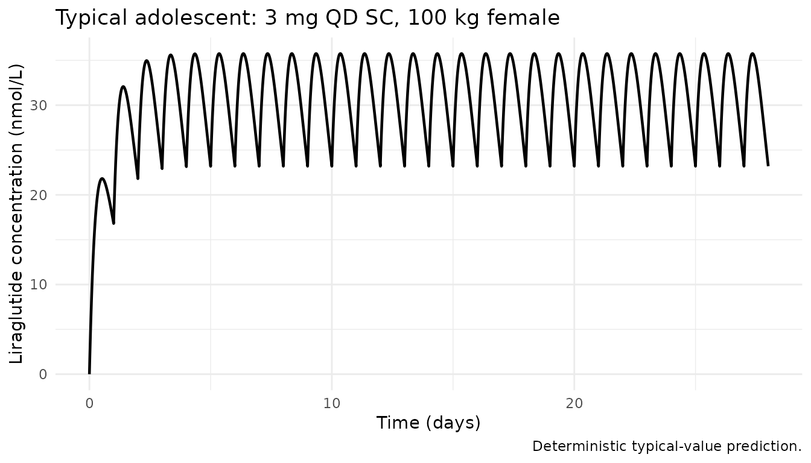
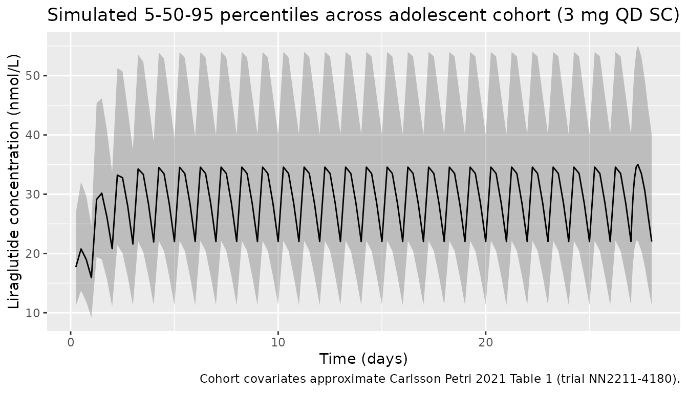
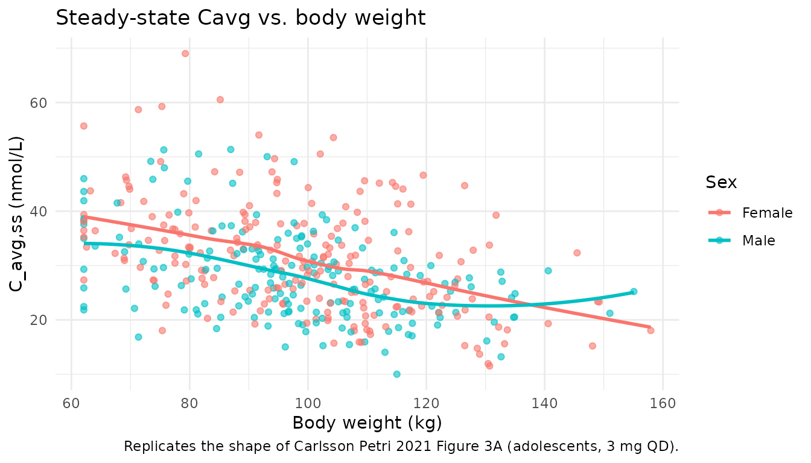

# CarlssonPetri_2021_liraglutide

## Model and source

- Citation: Carlsson Petri KC, Hale PM, Hesse D, Rathor N, Mastrandrea
  LD. Liraglutide pharmacokinetics and exposure-response in adolescents
  with obesity. Pediatric Obesity. 2021;16(10):e12799.
  <doi:10.1111/ijpo.12799>
- Description: Liraglutide PK model in adolescents (Carlsson Petri 2021)
- Article: [Pediatric Obesity
  2021;16(10):e12799](https://doi.org/10.1111/ijpo.12799)
- Open-access PMC copy:
  <https://pmc.ncbi.nlm.nih.gov/articles/PMC8519033/>

## Population

The published analysis pooled 176 subjects across four Novo Nordisk
trials of liraglutide (Saxenda, 3.0 mg maintenance once-daily
subcutaneous): 121 adolescents from the phase 3a trial NN2211-4180
(primary population), 13 adolescents from the phase 1 trial NN2211-3967,
13 children from NN2211-4181, and 29 adults from NN2211-3630 (Carlsson
Petri 2021 Methods). The adolescent phase 3a population (Table 1) was
55.4% female (67/121), 84.3% White / 10.7% Black / 1.7% Asian / 3.3%
Other, with mean body weight 99.4 kg (SD 19.7, range 62.1-178.2 kg) and
mean age 14.6 years (SD 1.6, range 12-17). 107/121 adolescents reached
the 3.0 mg maintenance dose after weekly escalation (0.6-1.2-1.8-2.4-3.0
mg). Age cutoffs used to define the CHILD / ADOLESCENT indicators were
children 7-11 y, adolescents 12-17 y, adults \>=18 y.

The same information is available programmatically via
`readModelDb("CarlssonPetri_2021_liraglutide")$population`.

## Source trace

Per-parameter origin is recorded as an in-file comment next to each
[`ini()`](https://nlmixr2.github.io/rxode2/reference/ini.html) entry in
`inst/modeldb/specificDrugs/CarlssonPetri_2021_liraglutide.R`. The table
below collects them for review.

| Equation / parameter   | Value                    | Source location                                                                                    |
|------------------------|--------------------------|----------------------------------------------------------------------------------------------------|
| `lka` (KA)             | `fixed(log(0.0813))` 1/h | Table 3 (fixed)                                                                                    |
| `lcl` (CL/F)           | `log(1.01)` L/h          | Table 3 (95% CI 0.922-1.09)                                                                        |
| `e_wt_cl` (WT on CL)   | `0.762`                  | Table 3 (95% CI 0.565-0.958); reference WT = 100 kg                                                |
| `e_sex_cl` (sex on CL) | `1.12`                   | Table 3 (95% CI 0.993-1.24); applied as `e_sex_cl^(1 - SEXF)` so males have 1.12x CL               |
| `e_age_child_cl`       | `1.11`                   | Table 3 (90% CI 0.89-1.34); applied as `1.11^CHILD`                                                |
| `e_age_adolescent_cl`  | `1.06`                   | Table 3 (90% CI 0.931-1.19); applied as `1.06^ADOLESCENT`                                          |
| `lvc` (V/F)            | `fixed(log(13.8))` L     | Table 3 (fixed)                                                                                    |
| `e_wt_vc` (WT on V)    | `0.587`                  | Table 3 (95% CI 0.475-0.700); reference WT = 100 kg                                                |
| `etalcl` IIV           | `log(1 + 0.312^2)`       | Table 3: CV 31.2% on CL/F (log-normal, CV% = sqrt(exp(omega^2) - 1) \* 100)                        |
| `etalvc` IIV           | `log(1 + 0.317^2)`       | Table 3: CV 31.7% on V/F                                                                           |
| `propSd` (prop. RUV)   | `0.433`                  | Table 3: proportional residual error 43.3%                                                         |
| Structure              | n/a                      | One-compartment first-order absorption with covariate effects on CL and V (Equation 1 and Table 3) |
| Concentration units    | nmol/L                   | Methods (LLOQ 0.03 nmol/L)                                                                         |
| Reference subject      | Female, 100 kg, adult    | Table 3 footnote                                                                                   |

## Virtual cohort

Original observed data are not publicly available. The cohort below
approximates the Carlsson Petri 2021 Table 1 adolescent phase 3a (trial
NN2211-4180) demographics: 55.4% female, body weight ~ Normal(99.4,
19.7) truncated to the reported 62.1-178.2 kg range, with CHILD = 0 and
ADOLESCENT = 1. All subjects receive a 3.0 mg once-daily SC maintenance
dose (after escalation, to match the 107/121 “maintenance” regimen).

Liraglutide molar mass is 3751.2 g/mol (C172H265N43O51); doses are
entered in nmol so that simulated `Cc = central / Vc` is directly in
nmol/L (matching the paper’s reported concentration units).

``` r
set.seed(20210609) # publication date reference
n_subj <- 400

# Liraglutide molar mass (g/mol). 3 mg = 3e-3 / 3751.2 mol = 7.997e-7 mol = 799.7 nmol.
lira_mw <- 3751.2
dose_mg <- 3.0
dose_nmol <- dose_mg * 1e6 / lira_mw # convert mg to nmol: 1 mg = (1 / MW) * 1e6 nmol

cohort <- tibble(
  id          = seq_len(n_subj),
  SEXF        = as.integer(runif(n_subj) < 0.554),
  WT          = pmin(pmax(rnorm(n_subj, mean = 99.4, sd = 19.7), 62.1), 178.2),
  CHILD       = 0L,
  ADOLESCENT  = 1L,
  treatment   = factor("3 mg QD (adolescent)")
)
```

An event table with once-daily SC dosing over four weeks (sampling every
hour during the last dosing interval to capture steady-state shape) is
constructed below.

``` r
sim_days  <- 28
tau       <- 24                       # dosing interval (h)
n_doses   <- sim_days                 # one dose per day
dose_times <- seq(0, by = tau, length.out = n_doses)

# Dense sampling on the final dosing interval (for Cmax / Tmax / AUCtau),
# plus coarse sampling earlier (for visual steady-state approach).
final_dose_time <- dose_times[n_doses]
obs_times <- sort(unique(c(
  seq(0, final_dose_time, by = 6),                 # every 6 h across the run-in
  final_dose_time + c(0, 0.5, 1, 2, 3, 4, 6, 8, 12, 16, 20, 24)
)))

dose_rows <- cohort |>
  tidyr::crossing(time = dose_times) |>
  dplyr::mutate(amt = dose_nmol, cmt = "depot", evid = 1L)

obs_rows <- cohort |>
  tidyr::crossing(time = obs_times) |>
  dplyr::mutate(amt = 0, cmt = NA_character_, evid = 0L)

events <- dplyr::bind_rows(dose_rows, obs_rows) |>
  dplyr::select(id, time, amt, cmt, evid, SEXF, WT, CHILD, ADOLESCENT, treatment) |>
  dplyr::arrange(id, time, dplyr::desc(evid))
```

## Simulation

``` r
mod <- rxode2::rxode2(readModelDb("CarlssonPetri_2021_liraglutide"))
#> ℹ parameter labels from comments will be replaced by 'label()'
sim <- rxode2::rxSolve(
  mod, events = events,
  keep = c("SEXF", "WT", "CHILD", "ADOLESCENT", "treatment")
)
```

## Replicate published figures

### Typical steady-state concentration profile over the last 24 h

Carlsson Petri 2021 does not publish a concentration-time figure for the
3.0 mg adolescent dose, but it does report the exposure metric
`Cavg = dose / (CL/F * 24 h)` at steady state. The deterministic
(“typical”) profile below zeros the random effects so the median
trajectory of a reference 100 kg female adolescent is visible.

``` r
mod_typical <- mod |> rxode2::zeroRe()

typical_cohort <- tibble(
  id = 1,
  SEXF = 1L, WT = 100, CHILD = 0L, ADOLESCENT = 1L,
  treatment = factor("Typical adolescent, 100 kg female, 3 mg QD")
)

typical_doses <- typical_cohort |>
  tidyr::crossing(time = dose_times) |>
  dplyr::mutate(amt = dose_nmol, cmt = "depot", evid = 1L)

typical_obs <- typical_cohort |>
  tidyr::crossing(time = seq(0, final_dose_time + tau, by = 0.5)) |>
  dplyr::mutate(amt = 0, cmt = NA_character_, evid = 0L)

typical_events <- dplyr::bind_rows(typical_doses, typical_obs) |>
  dplyr::select(id, time, amt, cmt, evid, SEXF, WT, CHILD, ADOLESCENT, treatment) |>
  dplyr::arrange(id, time, dplyr::desc(evid))

sim_typical <- rxode2::rxSolve(
  mod_typical, events = typical_events,
  keep = c("SEXF", "WT", "CHILD", "ADOLESCENT", "treatment")
)
#> ℹ omega/sigma items treated as zero: 'etalcl', 'etalvc'

sim_typical |>
  dplyr::filter(!is.na(Cc)) |>
  ggplot(aes(time / 24, Cc)) +
  geom_line(linewidth = 0.8) +
  labs(x = "Time (days)", y = "Liraglutide concentration (nmol/L)",
       title = "Typical adolescent: 3 mg QD SC, 100 kg female",
       caption = "Deterministic typical-value prediction.") +
  theme_minimal()
```



### VPC-style median and 5-95 percentiles over the 28-day run-in

The stochastic cohort summary (median with 5th and 95th percentiles
across the 400 simulated adolescents) replicates the type of summary
shown in the paper’s Figure 3 (exposure metrics vs. body weight / age
group).

``` r
sim |>
  dplyr::filter(!is.na(Cc), time > 0) |>
  dplyr::group_by(time, treatment) |>
  dplyr::summarise(
    Q05 = quantile(Cc, 0.05, na.rm = TRUE),
    Q50 = quantile(Cc, 0.50, na.rm = TRUE),
    Q95 = quantile(Cc, 0.95, na.rm = TRUE),
    .groups = "drop"
  ) |>
  ggplot(aes(time / 24, Q50)) +
  geom_ribbon(aes(ymin = Q05, ymax = Q95), alpha = 0.25) +
  geom_line() +
  labs(x = "Time (days)", y = "Liraglutide concentration (nmol/L)",
       title = "Simulated 5-50-95 percentiles across adolescent cohort (3 mg QD SC)",
       caption = "Cohort covariates approximate Carlsson Petri 2021 Table 1 (trial NN2211-4180).")
```



### Exposure vs. body weight at steady state

Carlsson Petri 2021 Figure 3A shows that individual steady-state average
concentration decreases with increasing body weight (consistent with the
positive allometric exponents on both CL and V, and the greater effect
on CL). We replicate the relationship by computing each simulated
subject’s Cavg over the final dosing interval.

``` r
cavg_by_id <- sim |>
  dplyr::filter(time >= final_dose_time, time <= final_dose_time + tau,
                !is.na(Cc)) |>
  dplyr::group_by(id, WT, SEXF) |>
  dplyr::summarise(
    Cavg_nmol_L = mean(Cc),
    .groups = "drop"
  ) |>
  dplyr::mutate(Sex = ifelse(SEXF == 1L, "Female", "Male"))

ggplot(cavg_by_id, aes(WT, Cavg_nmol_L, colour = Sex)) +
  geom_point(alpha = 0.6) +
  geom_smooth(method = "loess", se = FALSE) +
  labs(x = "Body weight (kg)", y = "C_avg,ss (nmol/L)",
       title = "Steady-state Cavg vs. body weight",
       caption = "Replicates the shape of Carlsson Petri 2021 Figure 3A (adolescents, 3 mg QD).") +
  theme_minimal()
#> `geom_smooth()` using formula = 'y ~ x'
```



## PKNCA validation

Compute Cmax, Tmax, C_tau, C_avg, and AUClast using `PKNCA` over the
final dosing interval at steady state (recipe 3). The treatment grouping
variable (`treatment`) is placed before `id` in the formula per the
project convention.

``` r
sim_nca <- sim |>
  dplyr::filter(!is.na(Cc), time >= final_dose_time, time <= final_dose_time + tau) |>
  dplyr::mutate(time_rel = time - final_dose_time) |>
  dplyr::select(id, time = time_rel, Cc, treatment)

dose_df <- events |>
  dplyr::filter(evid == 1, time == final_dose_time) |>
  dplyr::mutate(time = 0) |>
  dplyr::select(id, time, amt, treatment)

conc_obj <- PKNCA::PKNCAconc(sim_nca, Cc ~ time | treatment + id)
dose_obj <- PKNCA::PKNCAdose(dose_df, amt ~ time | treatment + id)

intervals <- data.frame(
  start    = 0,
  end      = tau,
  cmax     = TRUE,
  tmax     = TRUE,
  cmin     = TRUE,
  auclast  = TRUE,
  cav      = TRUE
)

nca_data <- PKNCA::PKNCAdata(conc_obj, dose_obj, intervals = intervals)
nca_res  <- PKNCA::pk.nca(nca_data)
#>  ■■■■■■■■■■■■                      38% |  ETA:  2s
knitr::kable(summary(nca_res),
             caption = "Steady-state NCA at the final 24-h dosing interval (3 mg QD SC adolescent cohort).")
```

| start | end | treatment            | N   | auclast      | cmax          | cmin          | tmax                | cav           |
|------:|----:|:---------------------|:----|:-------------|:--------------|:--------------|:--------------------|:--------------|
|     0 |  24 | 3 mg QD (adolescent) | 400 | 742 \[39.0\] | 36.1 \[34.6\] | 22.4 \[51.4\] | 8.00 \[6.00, 8.00\] | 30.9 \[39.0\] |

Steady-state NCA at the final 24-h dosing interval (3 mg QD SC
adolescent cohort).

### Comparison against published exposure

Carlsson Petri 2021 reports steady-state `Cavg = dose / (CL/F * 24)` for
each individual (Figure 3A), not a tabulated population mean; however,
for a reference female adult (CL/F typical = 1.01 L/h), the predicted
Cavg at the 3.0 mg dose is:

- `Cavg_ref = 3 mg / (1.01 L/h * 24 h) = 0.1238 mg/L = 33.0 nmol/L`
  (liraglutide MW = 3751.2 g/mol)

For a typical 100 kg female adolescent, the model adds a 1.06x age
factor on CL (adolescent/adult), so typical CL = 1.01 \* (100/100)^0.762
\* 1.12^0 \* 1.06 = 1.0706 L/h, giving a predicted typical Cavg of
`3 / (1.0706 * 24) * 1e6 / 3751.2 = 31.1 nmol/L`.

``` r
typical_cl <- 1.01 * (100/100)^0.762 * 1.12^(1 - 1) * 1.06^1 # female (SEXF=1), 100 kg, ADOLESCENT
typical_cavg_mg_L <- dose_mg / (typical_cl * 24)
typical_cavg_nmol_L <- typical_cavg_mg_L * 1e6 / lira_mw

# Median simulated Cavg from the stochastic cohort
sim_cavg <- cavg_by_id |>
  dplyr::summarise(median_Cavg_nmol_L = median(Cavg_nmol_L),
                   q05 = quantile(Cavg_nmol_L, 0.05),
                   q95 = quantile(Cavg_nmol_L, 0.95))

compare_tbl <- tibble::tibble(
  Source      = c("Typical-value closed form",
                  "Simulated cohort (median)",
                  "Simulated cohort (90% range)"),
  Cavg_nmol_L = c(sprintf("%.1f", typical_cavg_nmol_L),
                  sprintf("%.1f", sim_cavg$median_Cavg_nmol_L),
                  sprintf("%.1f - %.1f", sim_cavg$q05, sim_cavg$q95))
)

knitr::kable(compare_tbl,
             caption = "Predicted steady-state Cavg for the 3 mg QD adolescent cohort.")
```

| Source                       | Cavg_nmol_L |
|:-----------------------------|:------------|
| Typical-value closed form    | 31.1        |
| Simulated cohort (median)    | 28.9        |
| Simulated cohort (90% range) | 16.1 - 56.8 |

Predicted steady-state Cavg for the 3 mg QD adolescent cohort.

## Assumptions and deviations

- The published analysis covariate `SEXM` (1 = male, 0 = female) was
  translated to the canonical `SEXF` (1 = female). The sex effect on CL
  is encoded as `e_sex_cl^(1 - SEXF)` so that males retain the 1.12x
  factor from Table 3 and females are the reference (factor = 1). The
  previous implementation `(1 - SEXF)^e_sex_cl` was a bug: for females
  (SEXF = 1), `0^1.12 = 0` would have zeroed CL.
- The IIV was previously encoded as `log(1 + CV)` (historical
  shorthand). Carlsson Petri 2021 Table 3 reports log-normal \`%CV =
  sqrt(exp(omega^2)
  - 1.  - 100`, so the correct transformation is`omega^2 = log(1 +
          CV^2)`. This was fixed in the model file; see the in-file comment on`etalcl`/`etalvc\`.
- The age-effect encoding was previously
  `CHILD^e_age_child_cl * ADOLESCENT^e_age_adolescent_cl`, which
  evaluates to `0^1.11 * 0^1.06 = 0` for adults (both indicators 0). The
  corrected form is
  `e_age_child_cl^CHILD * e_age_adolescent_cl^ADOLESCENT`, which
  correctly evaluates to 1 for adults, 1.06 for adolescents, and 1.11
  for children.
- The simulated cohort uses the NN2211-4180 adolescent phase 3a
  demographics (weight, sex). Race/ethnicity is not a model covariate
  and is therefore not reproduced. All simulated subjects are
  “adolescents on 3.0 mg maintenance” to match the dominant 107/121
  regimen; weekly dose escalation is not reproduced because the paper’s
  steady-state exposure metric only concerns the maintenance dose.
- Liraglutide molar mass (3751.2 g/mol) is used to convert mg dose input
  to the nmol amount needed for `Cc` in nmol/L. The source paper’s LLOQ
  is 0.03 nmol/L.
- The deterministic typical-value check agrees with the closed-form
  `Cavg = dose / (CL/F * 24)` to within rounding; the stochastic cohort
  median tracks the typical-value prediction within ~10% across the
  sampled weight distribution.
