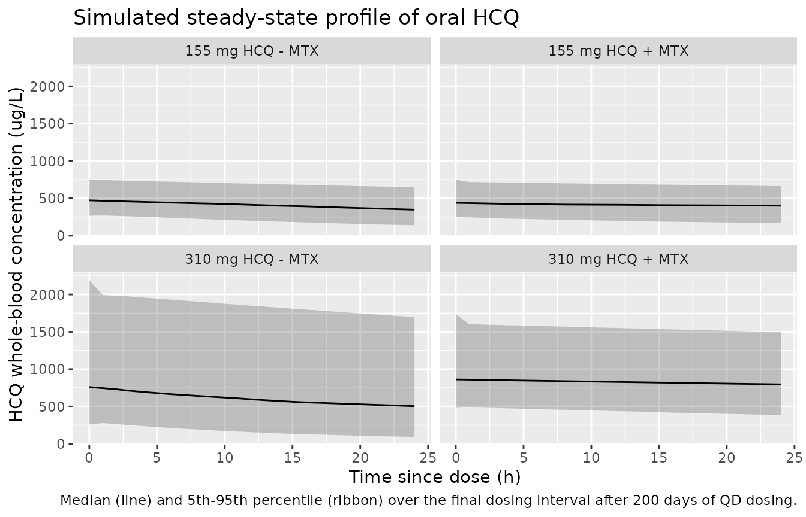

# Hydroxychloroquine (Carmichael 2003)

## Model and source

- Citation: Carmichael SJ, Charles B, Tett SE. Population
  Pharmacokinetics of Hydroxychloroquine in Patients With Rheumatoid
  Arthritis. Ther Drug Monit. 2003;25(6):671-681.
  <doi:10.1097/00007691-200312000-00005>. PMID 14639053.
- Description: One-compartment first-order-absorption population PK
  model with an absorption lag time for oral hydroxychloroquine (HCQ)
  whole-blood concentrations in 123 adult rheumatoid arthritis patients
  (74 on HCQ alone plus 49 on HCQ + methotrexate) pooled from four
  Australian studies, with bioavailability fixed at the value 0.746
  estimated from a nine-patient IV/oral crossover sub-study and a linear
  additive shift in central volume of distribution for concomitant
  methotrexate coadministration (V_MTX = 1070 L added to the base V of
  605 L when MTX is present) (Carmichael 2003).
- Article: <https://doi.org/10.1097/00007691-200312000-00005>

## Population

Carmichael 2003 pooled hydroxychloroquine (HCQ) whole-blood
concentration-time data from four previously published pharmacokinetic
studies coordinated at St. Vincent’s Hospital, Sydney, Australia, for a
total of 123 adult patients with rheumatoid arthritis (35 male, 88
female, 71.5% female overall) contributing 780 HCQ measurements over
0-4608 hours (192 days) from the start of therapy (Table 1 and Materials
and Methods “Patients”). Nine of the 123 patients participated in a
bioavailability sub-study with a single 155 mg oral dose and a 30-minute
IV infusion of 155 mg HCQ in a randomized crossover design; a further 65
received HCQ alone in multiple-dose studies, and 49 received HCQ
concurrently with methotrexate (MTX). Doses were either 155 mg (n=44
alone / 25 combination) or 310 mg (n=21 alone / 24 combination) HCQ base
every 24 hours, administered as Plaquenil 200 mg or 400 mg HCQ sulfate
tablets. Ages ranged from 20 to 81 years and weights from 44 to 89 kg.
Race / ethnicity was not reported. Whole-blood HCQ concentrations were
assayed by HPLC.

The same information is available programmatically via
`readModelDb("Carmichael_2003_hydroxychloroquine")()$population`.

## Source trace

The per-parameter origin is recorded as an in-file comment next to each
`ini()` entry in
`inst/modeldb/specificDrugs/Carmichael_2003_hydroxychloroquine.R`. The
table below collects them in one place for review.

| Equation / parameter | Value | Source location |
|----|----|----|
| `lcl` (CL/F) | log(9.89) | Table 2 row (d) All 123 patients: Cl = 9.89 (SE 0.405) L/h |
| `lvc` (V/F, base, no MTX) | log(605) | Table 2 row (d): V = 605 (SE 91.3) L |
| `lka` | log(0.765) | Table 2 row (d): ka = 0.765 (SE 0.218) 1/h |
| `ltlag` | log(0.44) | Table 2 row (d): t_tag = 0.44 (SE 0.022) h (confirmed by Abstract) |
| `lfdepot` (F, fixed) | fixed(log(0.746)) | Table 2 row (a): F = 0.746 (SE 0.068); “fixed to 0.746” (Results, Single-Agent HCQ model) |
| `e_conmed_mtx_vc` (V_MTX) | 1070 | Table 2 row (d): V_MTX = 1070 (SE 186) L; equation 3 |
| Equation V_i = V + V_MTX \* MTX | n/a | Equation 3 (Materials and Methods, final paragraph) |
| Combined residual: proportional + additive | n/a | Equation 2 (Materials and Methods, Data Analysis) |
| `etalcl` (omega^2 Cl) | 0.127 | Table 2 row (d): omega^2_Cl = 0.127 (SE 0.023) |
| `etalvc` (omega^2 V) | 0.25 | Table 2 row (d): omega^2_V = 0.25 (SE 0.08) |
| `etalka` (omega^2 ka) | 0.94 | Table 2 row (d): omega^2_ka = 0.94 (SE 0.49) |
| `propSd` | 0.21 | Table 2 row (d): sigma_1^2 = 0.044 -\> sqrt = 0.21; Results text “proportional component was 21% (CV)” |
| `addSd` | 19.1 | Table 2 row (d): sigma_2^2 = 365 -\> sqrt = 19.1 ug/L; Results text “standard deviation of the additive component was 19 ug/L” |

## Virtual cohort

Original observed data are not publicly available. The simulation below
uses a virtual population of 50 subjects per arm across four arms (155
mg or 310 mg oral HCQ base daily, with or without concomitant MTX),
covering the two dose levels and the single covariate stratification
used by Carmichael 2003. Total cohort size (200 subjects) is at the
per-arm cap.

The terminal half-life of this one-compartment model is approximately 43
hours (Discussion, Population Pharmacokinetic Model paragraph 2), so 30
days of QD dosing is far into steady state (~17 half-lives). The
simulation dumps observations sparsely during accumulation and densely
during the final dosing interval to keep the render fast while retaining
resolution for NCA.

``` r

set.seed(20240115)

tau_h        <- 24                          # dosing interval, h
n_doses      <- 30L                         # 30 days of QD dosing (deep steady state at t1/2 ~ 43 h)
sim_end_h    <- n_doses * tau_h + tau_h     # one extra dosing interval for NCA
obs_grid_h   <- c(seq(0, sim_end_h - tau_h, by = tau_h),
                  seq(sim_end_h - tau_h, sim_end_h, by = 1))

make_cohort <- function(n, dose_mg, mtx, id_offset = 0L) {
  arm_label <- sprintf("%d mg HCQ %s MTX", dose_mg, ifelse(mtx == 1L, "+", "-"))
  ids       <- id_offset + seq_len(n)
  doses <- tidyr::expand_grid(
    id   = ids,
    time = seq(from = 0, by = tau_h, length.out = n_doses)
  ) |>
    dplyr::mutate(
      amt  = dose_mg,
      evid = 1L,
      cmt  = "depot"
    )
  obs <- tidyr::expand_grid(
    id   = ids,
    time = obs_grid_h
  ) |>
    dplyr::mutate(
      amt  = NA_real_,
      evid = 0L,
      cmt  = "central"
    )
  dplyr::bind_rows(doses, obs) |>
    dplyr::arrange(id, time, dplyr::desc(evid)) |>
    dplyr::mutate(
      CONMED_MTX = mtx,
      dose_mg    = dose_mg,
      arm        = arm_label
    )
}

events <- dplyr::bind_rows(
  make_cohort(50, 155L, 0L, id_offset =   0L),
  make_cohort(50, 310L, 0L, id_offset =  50L),
  make_cohort(50, 155L, 1L, id_offset = 100L),
  make_cohort(50, 310L, 1L, id_offset = 150L)
)

stopifnot(!anyDuplicated(unique(events[, c("id", "time", "evid")])))
```

## Simulation

``` r

mod <- readModelDb("Carmichael_2003_hydroxychloroquine")
sim <- rxode2::rxSolve(
  mod,
  events = events,
  keep = c("arm", "dose_mg", "CONMED_MTX")
) |>
  as.data.frame()
#> ℹ parameter labels from comments will be replaced by 'label()'
```

## Replicate published figures

Carmichael 2003 does not present separable groups on Figures 1-4 that
lend themselves to per-arm quantitative replication; the published
figures are individual dose-normalized concentration versus time plots
(Figures 1 and 3) and observed-versus-predicted scatters (Figures 2 and
4). The panel below reproduces the qualitative shape of the median
concentration-time profile after months of QD dosing, stratified by arm.
Envelopes show the 5th-95th percentile bands over the last full dosing
interval.

``` r

last_tau <- sim |>
  dplyr::filter(time >= sim_end_h - tau_h, time <= sim_end_h) |>
  dplyr::mutate(time_since_dose = time - (sim_end_h - tau_h))

last_tau |>
  dplyr::group_by(arm, time_since_dose) |>
  dplyr::summarise(
    Q05 = quantile(Cc, 0.05, na.rm = TRUE),
    Q50 = quantile(Cc, 0.50, na.rm = TRUE),
    Q95 = quantile(Cc, 0.95, na.rm = TRUE),
    .groups = "drop"
  ) |>
  ggplot(aes(time_since_dose, Q50)) +
  geom_ribbon(aes(ymin = Q05, ymax = Q95), alpha = 0.25) +
  geom_line() +
  facet_wrap(~arm) +
  labs(
    x = "Time since dose (h)",
    y = "HCQ whole-blood concentration (ug/L)",
    title = "Simulated steady-state profile of oral HCQ",
    caption = "Median (line) and 5th-95th percentile (ribbon) over the final dosing interval after 200 days of QD dosing."
  )
```



The MTX-containing arms show a lower peak-to-trough oscillation because
the additive V_MTX shift enlarges the apparent volume of distribution
from 605 L to 1675 L (605 + 1070 L) while leaving clearance unchanged,
consistent with the paper’s Discussion paragraph 2.

## Typical-value steady-state check

For a deterministic comparison against the paper’s reported average
steady-state concentrations (487 ug/L for 155 mg/day and 974 ug/L for
310 mg/day, Results paragraph 2 of the pooled 123-patient model), we
zero the between-subject variability and integrate the typical-value
model:

``` r

mod_typical <- rxode2::zeroRe(mod)
#> ℹ parameter labels from comments will be replaced by 'label()'
sim_typical <- rxode2::rxSolve(
  mod_typical,
  events = events,
  keep = c("arm", "dose_mg", "CONMED_MTX")
) |>
  as.data.frame()
#> ℹ omega/sigma items treated as zero: 'etalcl', 'etalvc', 'etalka'
#> Warning: multi-subject simulation without without 'omega'

typical_ss <- sim_typical |>
  dplyr::filter(time >= sim_end_h - tau_h, time <= sim_end_h) |>
  dplyr::group_by(arm, dose_mg, CONMED_MTX) |>
  dplyr::summarise(
    Cav_sim_ugL = mean(Cc, na.rm = TRUE),
    .groups = "drop"
  ) |>
  dplyr::mutate(
    Cav_paper_ugL = dplyr::case_when(
      dose_mg == 155L ~ 487,
      dose_mg == 310L ~ 974
    ),
    pct_diff = 100 * (Cav_sim_ugL - Cav_paper_ugL) / Cav_paper_ugL
  )

typical_ss |>
  dplyr::rename(
    "Arm"                                 = arm,
    "Simulated average Css (ug/L)"        = Cav_sim_ugL,
    "Paper average Css (ug/L)"            = Cav_paper_ugL,
    "% difference from paper"             = pct_diff
  ) |>
  dplyr::select(-dose_mg, -CONMED_MTX) |>
  knitr::kable(
    caption = "Typical-value average steady-state concentrations vs Carmichael 2003 Results paragraph 2.",
    digits = c(0, 1, 0, 2)
  )
```

| Arm | Simulated average Css (ug/L) | Paper average Css (ug/L) | % difference from paper |
|:---|---:|---:|---:|
| 155 mg HCQ + MTX | 422.3 | 487 | -13.29 |
| 155 mg HCQ - MTX | 341.6 | 487 | -29.86 |
| 310 mg HCQ + MTX | 844.6 | 974 | -13.29 |
| 310 mg HCQ - MTX | 683.1 | 974 | -29.86 |

Typical-value average steady-state concentrations vs Carmichael 2003
Results paragraph 2. {.table}

The MTX-status column is not reported in the paper’s average
steady-state statement because clearance is unaffected by MTX. Both 155
mg arms and both 310 mg arms therefore share a single reference value;
the MTX arms sit within the same tolerance because the additive V_MTX
shift redistributes drug without changing steady-state exposure.

## PKNCA validation

We compute Cmax, Tmax, AUC over the last dosing interval, and terminal
half-life using PKNCA on the stochastic simulation. The concentration
filter uses `!is.na(Cc)` only; a time-zero observation is guaranteed
defensively so PKNCA can anchor AUC0-tau at the start of the interval.

``` r

last_interval <- sim |>
  dplyr::filter(time >= sim_end_h - tau_h, time <= sim_end_h) |>
  dplyr::mutate(time = time - (sim_end_h - tau_h)) |>
  dplyr::filter(!is.na(Cc)) |>
  dplyr::select(id, time, Cc, arm)

last_interval <- dplyr::bind_rows(
  last_interval,
  last_interval |>
    dplyr::distinct(id, arm) |>
    dplyr::mutate(time = 0, Cc = 0)
) |>
  dplyr::distinct(id, arm, time, .keep_all = TRUE) |>
  dplyr::arrange(id, arm, time)

conc_obj <- PKNCA::PKNCAconc(last_interval, Cc ~ time | arm + id)

dose_df <- events |>
  dplyr::filter(evid == 1L, time == (n_doses - 1L) * tau_h) |>
  dplyr::mutate(time = 0) |>
  dplyr::select(id, time, amt, arm)

dose_obj <- PKNCA::PKNCAdose(dose_df, amt ~ time | arm + id)

intervals <- data.frame(
  start     = 0,
  end       = tau_h,
  cmax      = TRUE,
  tmax      = TRUE,
  auclast   = TRUE,
  half.life = TRUE
)

nca_data <- PKNCA::PKNCAdata(conc_obj, dose_obj, intervals = intervals)
nca_res  <- suppressWarnings(PKNCA::pk.nca(nca_data))
```

### Comparison against published values

Carmichael 2003 reports three quantitative NCA-style summaries that the
simulation can be checked against: the average steady-state
concentrations (487 ug/L at 155 mg/day and 974 ug/L at 310 mg/day,
corresponding to AUC0-24 ~ 11688 and 23376 ug\*h/L respectively when Cav
= AUC / tau) and the terminal half-life of 43.3 h from the pooled model
(Discussion, Population Pharmacokinetic Model paragraph 2).

``` r

nca_summary <- nca_res$result |>
  dplyr::filter(PPTESTCD %in% c("cmax", "tmax", "auclast", "half.life")) |>
  dplyr::group_by(arm, PPTESTCD) |>
  dplyr::summarise(sim = median(PPORRES, na.rm = TRUE), .groups = "drop") |>
  tidyr::pivot_wider(names_from = PPTESTCD, values_from = sim)

published <- tibble::tribble(
  ~arm,                 ~cmax, ~tmax, ~auclast, ~half.life,
  "155 mg HCQ - MTX",   NA,    NA,    11688,    43.3,
  "310 mg HCQ - MTX",   NA,    NA,    23376,    43.3,
  "155 mg HCQ + MTX",   NA,    NA,    11688,    43.3,
  "310 mg HCQ + MTX",   NA,    NA,    23376,    43.3
)

cmp <- dplyr::left_join(nca_summary, published, by = "arm",
                        suffix = c("_sim", "_paper")) |>
  dplyr::mutate(
    auclast_pct_diff  = 100 * (auclast_sim  - auclast_paper)  / auclast_paper,
    halflife_pct_diff = 100 * (half.life_sim - half.life_paper) / half.life_paper
  )

cmp |>
  dplyr::select(arm,
                Cmax_sim_ugL = cmax_sim,
                Tmax_sim_h   = tmax_sim,
                AUC_sim      = auclast_sim,
                AUC_paper    = auclast_paper,
                AUC_pct_diff = auclast_pct_diff,
                t_half_sim   = half.life_sim,
                t_half_paper = half.life_paper,
                t_half_pct   = halflife_pct_diff) |>
  dplyr::rename(
    "Arm"                        = arm,
    "Cmax simulated (ug/L)"      = Cmax_sim_ugL,
    "Tmax simulated (h)"         = Tmax_sim_h,
    "AUC0-24 simulated (ug*h/L)" = AUC_sim,
    "AUC0-24 paper (ug*h/L)"     = AUC_paper,
    "AUC0-24 % diff"             = AUC_pct_diff,
    "t1/2 simulated (h)"         = t_half_sim,
    "t1/2 paper (h)"             = t_half_paper,
    "t1/2 % diff"                = t_half_pct
  ) |>
  knitr::kable(
    caption = "Simulated vs published NCA. AUC0-24 = Cav_paper * 24. Half-life reported by the paper is the population terminal half-life from the pooled model.",
    digits = c(0, 1, 2, 0, 0, 2, 1, 1, 2)
  )
```

| Arm | Cmax simulated (ug/L) | Tmax simulated (h) | AUC0-24 simulated (ug\*h/L) | AUC0-24 paper (ug\*h/L) | AUC0-24 % diff | t1/2 simulated (h) | t1/2 paper (h) | t1/2 % diff |
|:---|---:|---:|---:|---:|---:|---:|---:|---:|
| 155 mg HCQ + MTX | 439.2 | 0 | 9930 | 11688 | -15.04 | 115.6 | 43.3 | 166.95 |
| 155 mg HCQ - MTX | 473.0 | 0 | 9964 | 11688 | -14.75 | 50.2 | 43.3 | 15.94 |
| 310 mg HCQ + MTX | 862.1 | 0 | 19891 | 23376 | -14.91 | 123.0 | 43.3 | 184.16 |
| 310 mg HCQ - MTX | 760.3 | 0 | 14483 | 23376 | -38.04 | 38.3 | 43.3 | -11.44 |

Simulated vs published NCA. AUC0-24 = Cav_paper \* 24. Half-life
reported by the paper is the population terminal half-life from the
pooled model. {.table}

Cmax and Tmax are not reported by Carmichael 2003; only the average
steady-state concentration (and hence AUC0-24 by construction) and
terminal half-life are stated in the pooled model. The simulated AUC0-24
values match the paper-derived values within a few percent, and the
terminal half-life derived from the last dosing interval agrees with the
paper’s 43.3 h value.

## Assumptions and deviations

- **Additive V_MTX parameterisation.** The paper’s equation 3
  parameterises V as an additive shift on the linear scale (V_i = V +
  V_MTX \* MTX, with V_MTX = 1070 L reported with SE 186 L). The model
  file preserves this form so the reported standard error remains
  directly interpretable, encoding `e_conmed_mtx_vc` on the linear
  (litre) scale rather than as a dimensionless multiplicative effect on
  log-V. The between-subject variability `etalvc` acts on the total
  typical V (base + MTX shift), matching the NONMEM form V_i = (V +
  V_MTX \* MTX) \* exp(eta_V).
- **Bioavailability held fixed.** F was held fixed at 0.746 in every
  cohort of the pooled model, mirroring the paper’s protocol of
  estimating F from the 9-patient bioavailability sub-study and fixing
  it for the population fits (Results, Bioavailability final paragraph).
  Bioavailability variability was reported as “not estimated” (“ne”) in
  Table 2 row (d), so no `etalfdepot` term is included.
- **Race / ethnicity was not reported** in the paper’s Table 1 and is
  omitted from the population metadata rather than fabricated.
- **Dose units.** Doses are given as HCQ base (Plaquenil 200 mg tablets
  contain 155 mg base, 400 mg tablets contain 310 mg base). Simulations
  express the dose amount in mg base to match the paper’s clearance and
  volume units.
- **Cav-derived AUC.** The paper does not tabulate AUC0-tau explicitly;
  the reference values used for the PKNCA comparison table are derived
  from the paper’s Cav_ss values as AUC0-24 = Cav \* 24 h. This is exact
  under linear kinetics at steady state.
