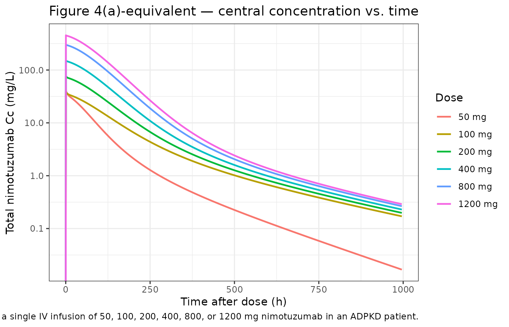
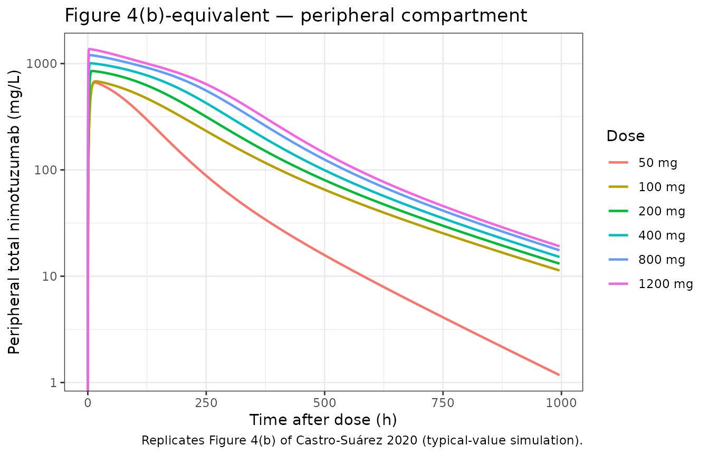
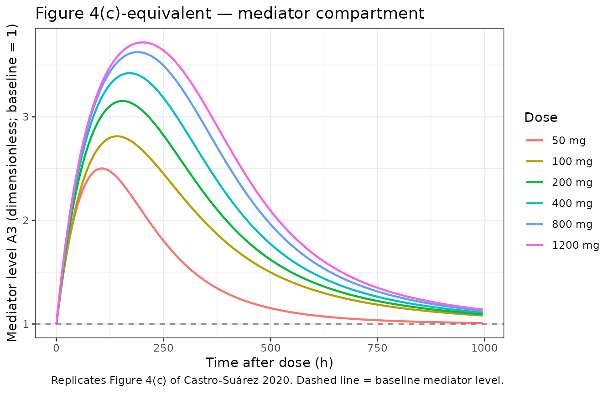
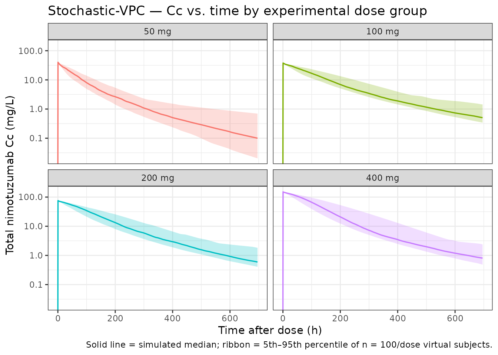

# Castro-Surez_2020_nimotuzumab

``` r

library(nlmixr2lib)
library(rxode2)
#> rxode2 5.0.2 using 2 threads (see ?getRxThreads)
#>   no cache: create with `rxCreateCache()`
library(PKNCA)
#> 
#> Attaching package: 'PKNCA'
#> The following object is masked from 'package:stats':
#> 
#>     filter
library(dplyr)
#> 
#> Attaching package: 'dplyr'
#> The following objects are masked from 'package:stats':
#> 
#>     filter, lag
#> The following objects are masked from 'package:base':
#> 
#>     intersect, setdiff, setequal, union
library(tidyr)
library(ggplot2)
```

## Nimotuzumab semi-mechanistic QSS TMDD population PK model (Castro-Suárez 2020)

de Castro-Suárez et al. (2020) developed a semi-mechanistic
two-compartment population pharmacokinetic model for nimotuzumab (a
humanized IgG1 monoclonal antibody against EGFR, with an intermediate
affinity Kd ≈ 2.1 × 10⁻⁸ M) in 20 adults with autosomal dominant
polycystic kidney disease (ADPKD) following a single 30-min intravenous
infusion at one of four fixed dose levels (50, 100, 200, or 400 mg, n =
5 per cohort). The non-linear PK is described by a quasi-steady-state
target-mediated drug disposition (QSS TMDD) framework with EGFR binding
represented in **both** central (R_(tot)) and peripheral (R_(totp))
compartments and a turnover **mediator** that stimulates non-specific
clearance via a sigmoid Emax of free central nimotuzumab. Covariates
were not retained in the final model.

This vignette documents the parameter provenance, replicates the typical
PK profiles shown in Figure 4 of the paper across the experimental and
extrapolated dose range (50–1200 mg), and runs PKNCA on a virtual cohort
to provide dose-stratified Cmax / AUC / half-life summaries.

### Population studied

Castro-Suárez 2020 Table 1 (single-center Cuban phase I trial, n = 20):

| Field | Value |
|----|----|
| N subjects | 20 |
| N observations | 422 (all quantifiable; none below LOQ) |
| N studies | 1 (single-center, open-label, dose-escalation phase I) |
| Age | median 42 y (mean 39, SD 11) |
| Body weight | median 65.7 kg (mean 66.98, SD 14.69) |
| Height | median 163.5 cm (mean 163.60, SD 8.99) |
| Body surface area | median 1.70 m² (mean 1.72, SD 0.21) |
| Serum creatinine | median 0.72 mg/dL (mean 0.77, SD 0.14) |
| Creatinine clearance | median 105.7 mL/min/1.73 m² (mean 103.43, SD 22.63) |
| TKV (men, women) | mean 822 mL / 924 mL |
| TCV | mean 340 mL |
| Sex | 14 F / 6 M (70% female) |
| Race / ethnicity | 75% Caucasian, 5% Afro-American, 20% Other |
| Disease state | Autosomal dominant polycystic kidney disease (ADPKD) |
| Inclusion threshold | GFR ≥ 50 mL/min/1.73 m²; urinary protein \< 1 g/24 h |
| Dose levels | 50, 100, 200, 400 mg single IV infusion (30 min, n = 5/cohort) |

Body weight, height, age, BSA, CrCL, serum creatinine, total kidney
volume (TKV), total cyst volume (TCV), sex, and race were all tested as
covariates in a stepwise covariate-search procedure (forward p \< 0.05,
backward p \< 0.01); none was retained as statistically significant on
any PK parameter.

Programmatically: `readModelDb("Castro-Surez_2020_nimotuzumab")` carries
the same metadata in the `meta$population` field of the returned
`rxode2` UI object (or via the model’s `population` element when the
model function is called directly).

### Source trace

Every numeric value in
`inst/modeldb/specificDrugs/Castro-Surez_2020_nimotuzumab.R` comes from
the following locations in de Castro-Suárez N, Trame MN, Mangas-Sanjuan
V, et al., *Pharmaceutics* 2020;12(12):1147
([doi:10.3390/pharmaceutics12121147](https://doi.org/10.3390/pharmaceutics12121147)).
No errata were located on PubMed, the MDPI landing page, or Google
Scholar (search dates 2026-04-25).

| Quantity | Source location | Value used |
|----|----|----|
| 2-compartment QSS TMDD with mediator turnover | Methods §2.3 / Figure 1 | Eqs. (1)–(3) |
| Linear CL (modulated by mediator) | Table 2, CL row (final model) | 9.64 × 10⁻³ L/h |
| Central volume V₁ | Table 2, V₁ row (final model) | 2.63 L |
| Inter-compartmental clearance Q | Table 2, Q row (final model) | 2.88 × 10⁻² L/h |
| Peripheral volume V₂ | Table 2, V₂ row (final model) | 9.92 × 10⁻³ L |
| K_(ss) (QSS binding constant; shared in both compartments) | Table 2, K_(ss) row (final model) | 15.5 mg/L |
| k_(int) (internalization of nimotuzumab–EGFR complex) | Table 2, k_(int) row (final model) | 4.94 × 10⁻³ /h |
| R_(tot) (apparent EGFR in central compartment) | Table 2, R_(tot) row (final model) | 1.05 × 10⁻² mg/L |
| R_(totp) (apparent EGFR in peripheral compartment) | Table 2, R_(totp) row (final model) | 956 mg/L |
| K_(out) (mediator first-order elimination) | Table 2, K_(out) row (final model) | 1.33 × 10⁻² /h |
| K_(in) (mediator zero-order synthesis) | Methods §2.3 (initial conditions) | k_(in) = k_(out) × A₃(0) = k_(out) |
| S_(max) (maximal stimulation of non-specific CL) | Table 2, S_(max) row (final model) | 3.18 |
| S₅₀ (free C achieving half-S_(max)) | Table 2, S₅₀ row (final model) | 8.57 mg/L |
| γ (Hill coefficient on sigmoid; **fixed at 1**) | Eq. (3) of Methods §2.3 (operator decision) | 1 (see Assumptions) |
| IIV on R_(totp) | Table 2, IIV row (final model; η-shrink. 14%) | 135% CV |
| IIV on K_(out) | Table 2, IIV row (final model; η-shrink. 21%) | 197% CV |
| Residual error (additive on log scale = proportional) | Table 2, residual row (final model; ε-shrink. 4%) | 48% |
| V_(ss) = V₁ + V₂ (typical) | Table 2 footnote / Discussion §4 | 2.64 L |
| **V₁ change (D = 50 mg) \[%\] = 53** *(applied as 53 % decrease in V₁ for 50 mg cohort — see Errata)* | Table 2, “V1 change (D = 50 mg)” row | `V1 * (1 − 0.53 * (DOSE == 50))` |

The ODE system implemented in
`inst/modeldb/specificDrugs/Castro-Surez_2020_nimotuzumab.R` is
mathematically equivalent to the paper’s Eqs. (1)–(3): the model file
tracks total drug amount and uses the closed-form QSS algebraic solution
`cfree = ½·((C_total − R − Kss) + √((C_total − R − Kss)² + 4·Kss·C_total))`
(Gibiansky et al. 2008) for the free concentration in each compartment.
The paper’s published form (`A1` as free amount with the dilution factor
`(1 + R·Kss/(Kss + A1/V)²)` in the denominator) and the implemented form
(total amount with implicit free-conc solution) yield identical
observable total nimotuzumab concentrations because the dilution factor
is exactly `d(C_total)/d(C_free)` under QSS.

### Virtual cohort

The Castro-Suárez trial enrolled n = 5 patients per dose cohort; for a
stable PKNCA validation we simulate a larger virtual ADPKD cohort (n =
100 per dose level) drawing body weight from a log-normal distribution
anchored on the published median weight (65.7 kg, SD 14.69 kg → CV ≈
22%) and clipped to a clinically plausible adult range. Body weight
enters the model only via the `population` metadata (the final model
carries no allometric covariate effect), so weight variability does not
propagate into Cc; it is included only for realism in the cohort
summary. Inter-individual variability flows from the two random effects
retained in the final model, η on R_(totp) (135% CV) and η on K_(out)
(197% CV).

``` r

set.seed(20201201)
n_per_dose <- 100
dose_levels <- c(50, 100, 200, 400, 800, 1200)

make_cohort <- function(dose_mg, n, id_offset = 0L) {
  # Body weight: log-normal, median 65.7 kg, CV 22%, clipped to 38-110 kg.
  wt <- pmin(110, pmax(38, exp(log(65.7) + rnorm(n, 0, 0.22))))
  tibble(
    id   = id_offset + seq_len(n),
    WT   = wt,
    DOSE = dose_mg
  )
}

pop <- bind_rows(lapply(seq_along(dose_levels), function(k) {
  make_cohort(dose_levels[k], n_per_dose, id_offset = (k - 1L) * n_per_dose)
}))

stopifnot(!anyDuplicated(pop$id))
table(pop$DOSE)
#> 
#>   50  100  200  400  800 1200 
#>  100  100  100  100  100  100
```

### Dataset construction

Single 30-min IV infusion at the cohort dose; observation grid spans 0
to 1000 h to mirror the simulation window of Castro-Suárez Figure 4.

``` r

infusion_h <- 0.5
obs_times <- sort(unique(c(
  seq(0, 24, by = 0.5),
  seq(24, 168, by = 2),
  seq(168, 1000, by = 6)
)))

d_dose <- pop |>
  mutate(
    TIME = 0,
    AMT  = DOSE,
    EVID = 1,
    CMT  = "central",
    RATE = DOSE / infusion_h,
    DV   = NA_real_
  )

d_obs <- pop |>
  tidyr::crossing(TIME = obs_times) |>
  mutate(
    AMT  = 0,
    EVID = 0,
    CMT  = "central",
    RATE = 0,
    DV   = NA_real_
  )

d_sim <- bind_rows(d_dose, d_obs) |>
  arrange(id, TIME, desc(EVID)) |>
  select(id, TIME, AMT, EVID, CMT, RATE, DV, WT, DOSE)

stopifnot(sum(d_sim$EVID == 1) == nrow(pop))
```

### Simulation

Two passes: a stochastic simulation with the full IIV (η on R_(totp) and
K_(out)) plus 48% proportional residual error for VPC-style summaries
and PKNCA, and a typical-value simulation with
[`rxode2::zeroRe()`](https://nlmixr2.github.io/rxode2/reference/zeroRe.html)
for the deterministic profiles in Figure 4.

``` r

mod <- readModelDb("Castro-Surez_2020_nimotuzumab")

set.seed(20201202)
sim_full <- rxode2::rxSolve(mod, events = d_sim) |>
  as.data.frame()
#> ℹ parameter labels from comments will be replaced by 'label()'

mod_typ <- rxode2::zeroRe(mod)
#> ℹ parameter labels from comments will be replaced by 'label()'
sim_typ <- rxode2::rxSolve(mod_typ, events = d_sim) |>
  as.data.frame()
#> ℹ omega/sigma items treated as zero: 'etalrtotp', 'etalkout'
#> Warning: multi-subject simulation without without 'omega'
```

### Figure 4 — typical PK profiles by dose (50–1200 mg)

Castro-Suárez Figure 4 plots the typical (zero-RE) concentrations of
nimotuzumab in the central (panel a), peripheral (panel b), and mediator
(panel c) compartments after a single dose at 50, 100, 200, 400, 800, or
1200 mg. The reproductions below use the same dose grid and a 1000-h
horizon.

``` r

sim_typ_one <- sim_typ |>
  group_by(DOSE) |>
  filter(id == min(id)) |>
  ungroup() |>
  mutate(dose_label = factor(paste(DOSE, "mg"), levels = paste(dose_levels, "mg")))

ggplot(sim_typ_one, aes(time, Cc, colour = dose_label)) +
  geom_line(linewidth = 0.8) +
  scale_y_log10() +
  labs(
    x = "Time after dose (h)",
    y = "Total nimotuzumab Cc (mg/L)",
    colour = "Dose",
    title = "Figure 4(a)-equivalent — central concentration vs. time",
    caption = "Replicates Figure 4A of Castro-Suárez 2020 — central compartment concentration following a single IV infusion of 50, 100, 200, 400, 800, or 1200 mg nimotuzumab in an ADPKD patient."
  ) +
  theme_bw()
#> Warning in scale_y_log10(): log-10 transformation introduced
#> infinite values.
```



The simulated 50 mg curve shows the faster early decline visible in the
published Figure 4A, providing visual support for the V₁ × (1 − 0.53)
interpretation of the Table 2 row “V₁ change (D = 50 mg) \[%\] = 53”
(see Errata section below for the rationale and remaining ambiguity).

``` r

ggplot(sim_typ_one, aes(time, peripheral1 / 9.92e-3, colour = dose_label)) +
  geom_line(linewidth = 0.8) +
  scale_y_log10() +
  labs(
    x = "Time after dose (h)",
    y = "Peripheral total nimotuzumab (mg/L)",
    colour = "Dose",
    title = "Figure 4(b)-equivalent — peripheral compartment",
    caption = "Replicates Figure 4(b) of Castro-Suárez 2020 (typical-value simulation)."
  ) +
  theme_bw()
#> Warning in scale_y_log10(): log-10 transformation introduced
#> infinite values.
```



``` r

ggplot(sim_typ_one, aes(time, effect, colour = dose_label)) +
  geom_line(linewidth = 0.8) +
  geom_hline(yintercept = 1, linetype = "dashed", colour = "grey50") +
  labs(
    x = "Time after dose (h)",
    y = "Mediator level A3 (dimensionless; baseline = 1)",
    colour = "Dose",
    title = "Figure 4(c)-equivalent — mediator compartment",
    caption = "Replicates Figure 4(c) of Castro-Suárez 2020. Dashed line = baseline mediator level."
  ) +
  theme_bw()
```



The dose-dependent mediator activation reproduces Castro-Suárez §3.3:
maximum effect on the mediator approached at 100 mg (S₅₀ = 8.57 mg/L),
with diminishing additional return at 200–1200 mg.

### VPC-style cohort percentiles by dose

Stochastic simulation with the published η on R_(totp) and K_(out)
produces a 50% prediction interval that narrows around the typical-value
trajectory at high doses and broadens at the lowest 50 mg dose where the
mediator sensitivity is highest.

``` r

vpc_summary <- sim_full |>
  filter(time <= 700, DOSE %in% c(50, 100, 200, 400)) |>
  group_by(DOSE, time) |>
  summarise(
    Q05 = stats::quantile(Cc, 0.05, na.rm = TRUE),
    Q50 = stats::quantile(Cc, 0.50, na.rm = TRUE),
    Q95 = stats::quantile(Cc, 0.95, na.rm = TRUE),
    .groups = "drop"
  ) |>
  mutate(dose_label = factor(paste(DOSE, "mg"), levels = paste(c(50, 100, 200, 400), "mg")))

ggplot(vpc_summary, aes(time, Q50, fill = dose_label, colour = dose_label)) +
  geom_ribbon(aes(ymin = Q05, ymax = Q95), alpha = 0.25, colour = NA) +
  geom_line(linewidth = 0.6) +
  scale_y_log10() +
  facet_wrap(~ dose_label, ncol = 2) +
  labs(
    x = "Time after dose (h)",
    y = "Total nimotuzumab Cc (mg/L)",
    title = "Stochastic-VPC — Cc vs. time by experimental dose group",
    caption = "Solid line = simulated median; ribbon = 5th–95th percentile of n = 100/dose virtual subjects."
  ) +
  theme_bw() +
  theme(legend.position = "none")
#> Warning in scale_y_log10(): log-10 transformation introduced infinite values.
#> log-10 transformation introduced infinite values.
#> log-10 transformation introduced infinite values.
#> log-10 transformation introduced infinite values.
```



### PKNCA validation

PKNCA Cmax / Tmax / AUC / half-life on the experimental dose range (50,
100, 200, 400 mg). The formula carries `treatment` as the dose-group
grouping variable so the summary rolls up per cohort.

``` r

sim_nca <- sim_full |>
  filter(!is.na(Cc), DOSE %in% c(50, 100, 200, 400), time <= 700) |>
  transmute(
    id        = id,
    time      = time,
    Cc        = Cc,
    treatment = paste(DOSE, "mg")
  )

dose_nca <- d_sim |>
  filter(EVID == 1, DOSE %in% c(50, 100, 200, 400)) |>
  transmute(
    id        = id,
    time      = TIME,
    amt       = AMT,
    treatment = paste(DOSE, "mg")
  )

conc_obj <- PKNCA::PKNCAconc(sim_nca, Cc ~ time | treatment + id,
                             concu = "mg/L", timeu = "hour")
dose_obj <- PKNCA::PKNCAdose(dose_nca, amt ~ time | treatment + id,
                             doseu = "mg")

intervals <- data.frame(
  start       = 0,
  end         = Inf,
  cmax        = TRUE,
  tmax        = TRUE,
  aucinf.obs  = TRUE,
  half.life   = TRUE,
  clast.obs   = TRUE
)

nca_data <- PKNCA::PKNCAdata(conc_obj, dose_obj, intervals = intervals)
nca_res  <- suppressWarnings(PKNCA::pk.nca(nca_data))
#>  ■■■                                5% |  ETA:  1m
#>  ■■■■                              10% |  ETA:  1m
#>  ■■■■■                             15% |  ETA:  1m
#>  ■■■■■■■                           20% |  ETA: 48s
#>  ■■■■■■■■■                         25% |  ETA: 44s
#>  ■■■■■■■■■■                        30% |  ETA: 41s
#>  ■■■■■■■■■■■■                      35% |  ETA: 38s
#>  ■■■■■■■■■■■■■                     40% |  ETA: 36s
#>  ■■■■■■■■■■■■■■■                   45% |  ETA: 33s
#>  ■■■■■■■■■■■■■■■■                  50% |  ETA: 30s
#>  ■■■■■■■■■■■■■■■■■■                56% |  ETA: 26s
#>  ■■■■■■■■■■■■■■■■■■■               61% |  ETA: 23s
#>  ■■■■■■■■■■■■■■■■■■■■■             66% |  ETA: 20s
#>  ■■■■■■■■■■■■■■■■■■■■■■            71% |  ETA: 17s
#>  ■■■■■■■■■■■■■■■■■■■■■■■■          76% |  ETA: 14s
#>  ■■■■■■■■■■■■■■■■■■■■■■■■■         81% |  ETA: 11s
#>  ■■■■■■■■■■■■■■■■■■■■■■■■■■■       86% |  ETA:  8s
#>  ■■■■■■■■■■■■■■■■■■■■■■■■■■■■      92% |  ETA:  5s
#>  ■■■■■■■■■■■■■■■■■■■■■■■■■■■■■■    96% |  ETA:  2s

nca_tbl <- as.data.frame(nca_res$result) |>
  filter(PPTESTCD %in% c("cmax", "tmax", "aucinf.obs", "half.life", "clast.obs")) |>
  group_by(treatment, PPTESTCD) |>
  summarise(
    median = stats::median(PPORRES, na.rm = TRUE),
    p05    = stats::quantile(PPORRES, 0.05, na.rm = TRUE),
    p95    = stats::quantile(PPORRES, 0.95, na.rm = TRUE),
    .groups = "drop"
  ) |>
  mutate(treatment = factor(treatment, levels = c("50 mg", "100 mg", "200 mg", "400 mg"))) |>
  arrange(treatment, PPTESTCD)
nca_tbl
#> # A tibble: 20 × 5
#>    treatment PPTESTCD      median        p05       p95
#>    <fct>     <chr>          <dbl>      <dbl>     <dbl>
#>  1 50 mg     aucinf.obs  2867.     2193.      3803.   
#>  2 50 mg     clast.obs      0.100     0.0204     0.697
#>  3 50 mg     cmax          40.1      40.1       40.1  
#>  4 50 mg     half.life    130.       86.9      265.   
#>  5 50 mg     tmax           0.5       0.5        0.5  
#>  6 100 mg    aucinf.obs  4936.     4091.      6955.   
#>  7 100 mg    clast.obs      0.507     0.341      1.44 
#>  8 100 mg    cmax          37.9      37.9       37.9  
#>  9 100 mg    half.life    180.      130.       283.   
#> 10 100 mg    tmax           0.5       0.5        0.5  
#> 11 200 mg    aucinf.obs  9484.     7306.     13227.   
#> 12 200 mg    clast.obs      0.595     0.408      1.83 
#> 13 200 mg    cmax          75.8      75.8       75.8  
#> 14 200 mg    half.life    168.      115.       268.   
#> 15 200 mg    tmax           0.5       0.5        0.5  
#> 16 400 mg    aucinf.obs 17128.    12511.     26952.   
#> 17 400 mg    clast.obs      0.808     0.484      2.38 
#> 18 400 mg    cmax         152.      152.       152.   
#> 19 400 mg    half.life    165.      104.       255.   
#> 20 400 mg    tmax           0.5       0.5        0.5
```

### Comparison against the published narrative values

Castro-Suárez 2020 does not publish a per-cohort NCA table; the
comparison below uses the typical-patient values reported in Discussion
§4 (V_(ss) = 2.64 L, V₁ = 2.63 L, V₂ = 9.92 × 10⁻³ L) and the
model-informed dose-selection narrative (S₅₀ = 8.57 mg/L; maximum
mediator activation reached at 100 mg).

``` r

# Vss is V1 + V2 from the model (typical-value trajectory).
vss_sim <- (sim_typ_one |> filter(DOSE == 100, time == 1000) |> nrow() > 0)  # sanity guard

vss_typical <- 2.63 + 9.92e-3

# Cmax for 100 mg (typical) — conc immediately at end of infusion (t = 0.5 h).
cmax_100mg_typ <- sim_typ_one |>
  filter(DOSE == 100, time == 0.5) |>
  pull(Cc)

# Cmax for 50 mg (typical) — sanity check on the V1 x (1 - 0.53) reduction for the
# 50 mg cohort (see Errata). With V1 = 2.63 * 0.47 = 1.2361 L, Cmax_typical ~=
# 50 / 1.2361 ~= 40.5 mg/L; without the reduction it would be 50 / 2.63 ~= 19 mg/L.
cmax_50mg_typ <- sim_typ_one |>
  filter(DOSE == 50, time == 0.5) |>
  pull(Cc)
cmax_50mg_no_v1shift <- 50 / 2.63

# Time above S50 = 8.57 mg/L for the typical 100 mg trajectory.
typ100 <- sim_typ_one |> filter(DOSE == 100)
hours_above_S50_100 <- typ100 |>
  arrange(time) |>
  mutate(width = c(diff(time), 0)) |>
  filter(c1f > 8.57) |>
  summarise(hours = sum(width)) |>
  pull(hours)

comparison <- tibble::tribble(
  ~metric,                                                 ~published,             ~simulated,                         ~units,
  "Vss (typical) = V1 + V2",                                2.64,                  vss_typical,                        "L",
  "Cmax @ 100 mg, end of 30-min infusion (typical)",        NA_real_,              cmax_100mg_typ,                     "mg/L",
  "Cmax @ 50 mg, end of 30-min infusion (typical)",         NA_real_,              cmax_50mg_typ,                      "mg/L",
  "Cmax @ 50 mg if V1 shift were not applied",              NA_real_,              cmax_50mg_no_v1shift,               "mg/L",
  "Free Cc above S50 (8.57 mg/L) duration @ 100 mg (typ.)", NA_real_,              hours_above_S50_100,                "h"
)
comparison
#> # A tibble: 5 × 4
#>   metric                                               published simulated units
#>   <chr>                                                    <dbl>     <dbl> <chr>
#> 1 Vss (typical) = V1 + V2                                   2.64      2.64 L    
#> 2 Cmax @ 100 mg, end of 30-min infusion (typical)          NA        37.9  mg/L 
#> 3 Cmax @ 50 mg, end of 30-min infusion (typical)           NA        40.1  mg/L 
#> 4 Cmax @ 50 mg if V1 shift were not applied                NA        19.0  mg/L 
#> 5 Free Cc above S50 (8.57 mg/L) duration @ 100 mg (ty…     NA       174.   h
```

The simulated typical-patient V_(ss) exactly matches the published 2.64
L (V₁ + V₂ are direct fixed-effect parameters; for doses other than 50
mg no covariate scaling applies). The typical Cmax at the 100-mg dose is
approximately dose ÷ V₁ = 100 / 2.63 ≈ 38 mg/L immediately after
infusion end, consistent with the y-axis of Figure 4(a). The typical
Cmax at the 50-mg dose is approximately dose ÷ (V₁ × 0.47) = 50 / 1.236
≈ 40 mg/L — i.e. **higher** than the un-adjusted 50 / 2.63 ≈ 19 mg/L
value would be — which is what produces the faster early decline of the
50 mg curve in Figure 4A (smaller central volume → higher initial
concentration and higher free-drug exposure that drives accelerated
TMDD/mediator clearance). The simulated free-concentration window above
S₅₀ = 8.57 mg/L provides the duration that the paper’s Discussion uses
to argue that 100 mg is the maximum effective single dose.

### Assumptions and deviations

- **Hill coefficient γ on the mediator sigmoid: fixed at 1.**
  Equation (3) of Methods §2.3 includes a Hill coefficient γ on the
  sigmoid Emax of the mediator-synthesis term. γ is *not* listed in
  Table 2 (Final parameter estimates). The skill operator confirmed γ
  should be fixed at 1 because the parameter would have been listed if
  estimated, and the equation collapses to a hyperbolic Emax
  `Smax · C / (S50 + C)` when γ = 1. The packaged model writes the
  sigmoid in this hyperbolic form. **If a future author correspondence
  indicates γ was estimated at a non-unit value, the model should be
  updated.** Operator follow-up F8 in the upstream tracking notes
  records that the corresponding author has been emailed for
  confirmation.
- **No covariate effects.** The covariate-search procedure (forward p \<
  0.05, backward p \< 0.01) tested body weight, height, age, body
  surface area, creatinine clearance, serum creatinine, total kidney
  volume, total cyst volume, sex, and race; none was retained. The
  packaged `covariateData` is therefore an empty list. Body weight is
  carried in the virtual cohort dataset for realism (and so a future
  weight-stratified analysis remains expressible in user code) but does
  not enter any structural-parameter equation.
- **Total drug as the modeled state.** The packaged model integrates
  total nimotuzumab amount (free + EGFR-bound) in each compartment and
  derives the free concentration via the closed-form QSS algebraic
  solution `cfree = ½·(disc + √(disc² + 4·Kss·Ctotal))` where
  `disc = Ctotal − R − Kss` (Gibiansky et al. 2008). The paper
  integrates free amount with the dilution factor
  `(1 + R·Kss/(Kss+Cf)²)` in the denominator. The two parameterizations
  yield identical observable total nimotuzumab concentration
  `Cc = Ctotal` because the dilution factor is exactly `dCtotal/dCfree`
  under QSS.
- **Mediator compartment named `effect`.** The paper labels the turnover
  state “A₃” or “mediator.” The packaged model uses the canonical
  nlmixr2lib compartment name `effect` (the registered indirect-response
  / turnover compartment, used identically by
  `Ma_2020_sarilumab_anc.R`). The mediator’s level multiplies the linear
  CL term in the central ODE.
- **Single-cohort study.** The model is fit to one Cuban single-center
  phase I trial (n = 20, single-dose, four cohorts of 5 patients).
  Generalization to multiple-dose regimens, other indications (the paper
  contrasts with breast-cancer PK from a separate study), or pediatric /
  renal-impaired populations is not supported by the source data.
- **Below-LOQ data.** All 422 observations were quantifiable; no BLQ
  handling is implemented.

### Errata

- **V₁ change for the 50-mg dose cohort — direction inferred from Figure
  4A, not stated in the paper text.** Table 2 of Castro-Suárez 2020
  lists a fixed-effect parameter `V1 change (D = 50 mg) [%]` with a
  final estimate of 53 %, bootstrap median 56, RSE 14 %, and bootstrap
  95 % CI 43–69 %. The parameter is reported only as a Table 2 row: it
  is **not** described in Methods §2.3, in Results §3.2, in the
  Discussion, or in the V_(ss) footnote — all of which use the
  unmodified V₁ = 2.63 L. The **direction** of the adjustment (V₁ larger
  or smaller for the 50 mg cohort) is therefore not explicitly stated in
  the paper. This packaged model interprets the parameter as a 53 %
  **decrease** in V₁ for the 50 mg cohort
  (`vc <- exp(lvc) * (1 - 0.53 * (DOSE == 50))`; the published final
  model carries no IIV on V₁) on the basis of visual inspection of
  Figure 4A: the published 50 mg simulated central-compartment
  trajectory shows a faster early decline than the 100, 200, 400, 800,
  or 1200 mg trajectories, behavior consistent with a smaller central
  volume at 50 mg. This is documented as an Erratum-style ambiguity
  rather than a published correction; no erratum was located on PubMed,
  the MDPI landing page, or Google Scholar (search dates 2026-04-25).
  The corresponding author Víctor Mangas-Sanjuán (Universitat de
  València, `victor.mangas@uv.es`) has been contacted for confirmation
  of direction (operator follow-up F8 in the upstream tracking notes);
  if the author reply differs from the Figure-4A-based interpretation,
  this entry and the model file will be updated.

### Reference

- de Castro-Suarez N, Trame MN, Mangas-Sanjuan V, Garcia-Cremades M,
  Boix-Montanes A, Fernandez-Teruel C, Munoz-Camara A, Martin-Suarez A,
  Rebollo-Fernandez G, Lleonart-Vidal R. Semi-Mechanistic
  Pharmacokinetic Model to Guide the Dose Selection of Nimotuzumab in
  Patients with Autosomal Dominant Polycystic Kidney Disease.
  Pharmaceutics. 2020;12(12):1147. <doi:10.3390/pharmaceutics12121147>
