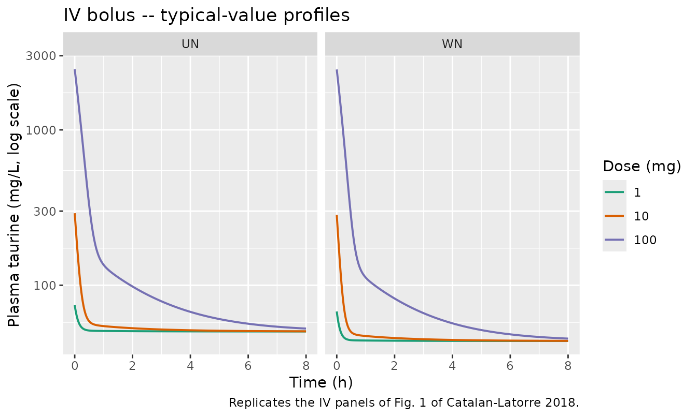
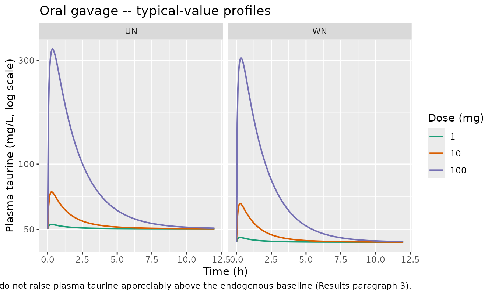
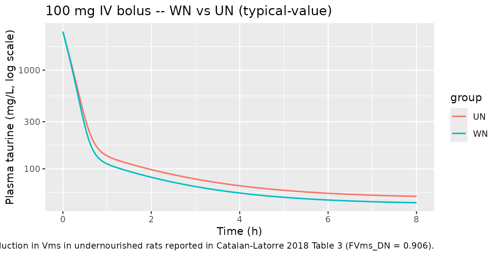
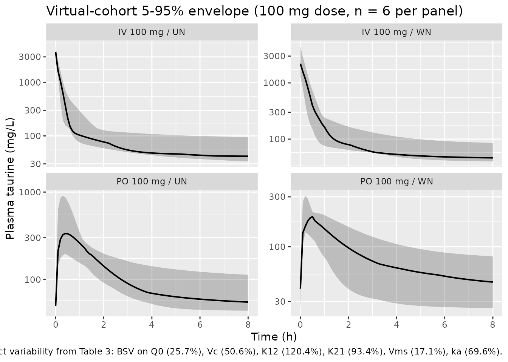

# Taurine (Catalan-Latorre 2018) -- rat

## Model and source

- Citation: Catalan-Latorre A, Nacher A, Merino V, Diez O, Merino
  Sanjuan M. A preclinical study to model taurine pharmacokinetics in
  the undernourished rat. *British Journal of Nutrition* 2018;
  119(7):732-741.
- Article:
  [doi:10.1017/S0007114518000156](https://doi.org/10.1017/S0007114518000156)

## Population

The model was developed from 64 male Wistar rats (8-9 weeks, mean body
weight 235.5 (SD 7.9) g at randomisation) studied at the University of
Valencia, Spain. After a 23-25 day adaptation period on one of two
diets, the rats were randomised into 12 treatment groups crossing two
routes of administration (IV bolus / oral gavage) x three doses (1, 10,
100 mg per animal) x two nutritional groups (well-nourished WN, n = 32
fed standard 14% protein chow 20 g/d / 251.9 kJ/d; undernourished UN, n
= 32 fed TD 99168 5% protein restricted chow 10 g/d / 159 kJ/d). At the
end of the adaptation period, 81% of the UN cohort (n = 26) met the dual
anthropometric criterion for moderate-to-severe undernutrition:
end-of-adaptation body weight below 80% of the WN mean AND serum albumin
below 23 g/L.

Baseline taurine plasma concentration was not statistically different
between groups: WN 50.97 (SD 14.54) mg/L vs UN 48.86 (SD 22.11) mg/L (P
\> 0.05). Plasma taurine was quantified by HPLC with fluorimetric
detection after OPA-MPA derivatisation (calibration range 50-750 uM, LOQ
57.11 uM). The population PK fit was performed in NONMEM VI using the
first-order estimation method.

The same information is available programmatically via the model’s
`population` metadata
(`readModelDb("Catalan-Latorre_2018_taurine_rat")$population`).

## Source trace

Per-parameter origin is recorded as an in-file comment next to each
`ini()` entry in
`inst/modeldb/specificDrugs/Catalan-Latorre_2018_taurine_rat.R`. The
table below collects them in one place for review.

| Equation / parameter | Value | Source location |
|----|----|----|
| Q0 (`lq0`) | 13.7 (CV 36.0%) | Table 3 |
| Vc (`lvc`) | 0.0416 L (CV 17.5%) | Table 3 |
| K12 (`lk12`) | 2.61 1/h (CV 44.8%) | Table 3 |
| K21 (`lk21`) | 0.73 1/h (CV 48.1%) | Table 3 |
| Vms (`lvms`) | 192.0 (CV 56.3%) | Table 3 |
| Kms (`lkms`) | 399 mg/L (CV 110%) | Table 3 |
| Vmr (`lvmr`) | 16.9 (CV 457%) | Table 3 |
| Kmr (`lkmr`) | 96.1 mg/L (CV 190%) | Table 3 |
| ka (`lka`) | 1.19 1/h (CV 18.2%) | Table 3 |
| FVms_DN -\> e_mal_nourish_vms | 0.906 -\> -0.094 (CV 15.1%) | Table 3 + Eq. 3 (multiplicative form) |
| IIV Q0 (CV) | 25.7% | Table 3 |
| IIV Vc (CV) | 50.6% | Table 3 |
| IIV K12 (CV) | 120.4% | Table 3 |
| IIV K21 (CV) | 93.4% | Table 3 |
| IIV Vms (CV) | 17.1% | Table 3 |
| IIV ka (CV) | 69.6% | Table 3 |
| Residual (proportional) | 22.4% | Table 3 |
| Disposition ODE structure | n/a | Eq. 3 + Fig. 2 |
| Endogenous baseline Cp0 | quadratic root (WN ~ 43.8 mg/L, | derived from Eq. 3 at dCc/dt = 0 |
|  | UN ~ 50.4 mg/L) | (no analytic baseline in paper) |
| Oral bioavailability F | 1 (passive diffusion; not altered | Results: “very similar to 1 |
|  | by nutritional status) | (100% bioavailability)” |

## Loading the model

``` r

mod <- readModelDb("Catalan-Latorre_2018_taurine_rat")
mod_typical <- rxode2::zeroRe(mod)
#> ℹ parameter labels from comments will be replaced by 'label()'
```

Helper to build an event table for one rat receiving a single bolus (IV)
or gavage (PO) dose, with dense observation rows on the central plasma
`Cc` output and the malnutrition indicator carried as a per-subject
covariate:

``` r

make_events <- function(dose_mg, route = c("iv", "po"), nut = 0, tmax = 12,
                        dt = 0.05, id_offset = 0L) {
  route <- match.arg(route)
  cmt_in <- if (route == "iv") "central" else "depot"
  obs <- data.frame(
    id   = id_offset + 1L,
    time = seq(0, tmax, by = dt),
    evid = 0,
    amt  = 0,
    cmt  = "Cc",
    MAL_NOURISH = nut
  )
  if (dose_mg > 0) {
    dose <- data.frame(
      id   = id_offset + 1L,
      time = 0,
      evid = 1,
      amt  = dose_mg,
      cmt  = cmt_in,
      MAL_NOURISH = nut
    )
    dplyr::bind_rows(dose, obs)
  } else {
    obs
  }
}
```

## Endogenous baseline (steady-state hold)

With no dose the model should hold at the analytic positive root of the
no-dose steady-state quadratic (A Cp0^2 + B Cp0 + C = 0, where A = Q0 -
Vms_eff + Vmr, B = Q0 (Kms + Kmr) - Vms_eff Kmr + Vmr Kms, and C = Q0
Kms Kmr) for the whole simulation horizon. The WN and UN baselines
differ by 6-7 mg/L because Vms_eff is 9.4% lower in UN
(`MAL_NOURISH = 1`); both predicted baselines fall within 1 SD of the
cohort means reported in Results (WN 50.97 +/- 14.54, UN 48.86 +/- 22.11
mg/L; P \> 0.05 between groups).

``` r

ev_wn <- make_events(dose_mg = 0, nut = 0, tmax = 48, dt = 0.5)
ev_un <- make_events(dose_mg = 0, nut = 1, tmax = 48, dt = 0.5)
sim_wn0 <- as.data.frame(rxSolve(mod_typical, ev_wn))
#> ℹ omega/sigma items treated as zero: 'etalq0', 'etalvc', 'etalk12', 'etalk21', 'etalvms', 'etalka'
sim_un0 <- as.data.frame(rxSolve(mod_typical, ev_un))
#> ℹ omega/sigma items treated as zero: 'etalq0', 'etalvc', 'etalk12', 'etalk21', 'etalvms', 'etalka'

baseline_table <- data.frame(
  group        = c("WN", "UN"),
  Cp0_model    = c(sim_wn0$Cc[1], sim_un0$Cc[1]),
  Cp_t48_model = c(tail(sim_wn0$Cc, 1), tail(sim_un0$Cc, 1)),
  obs_mean     = c(50.97, 48.86),
  obs_sd       = c(14.54, 22.11)
)
knitr::kable(baseline_table, digits = 3,
             caption = "Typical-value baseline taurine concentration (mg/L) vs Results.")
```

| group | Cp0_model | Cp_t48_model | obs_mean | obs_sd |
|:------|----------:|-------------:|---------:|-------:|
| WN    |    43.797 |       43.797 |    50.97 |  14.54 |
| UN    |    50.420 |       50.420 |    48.86 |  22.11 |

Typical-value baseline taurine concentration (mg/L) vs Results. {.table}

``` r


stopifnot(abs(sim_wn0$Cc[1] - tail(sim_wn0$Cc, 1)) < 1e-4)
stopifnot(abs(sim_un0$Cc[1] - tail(sim_un0$Cc, 1)) < 1e-4)
```

## Replicating Figure 1 (typical-value profiles)

Figure 1 of the paper shows observed and individual-predicted plasma
taurine concentrations vs time after IV or oral administration of 1, 10,
or 100 mg of taurine in well-nourished and undernourished rats. The four
panels below are the typical-value (no-IIV) trajectories for each route
x nutrition group across the three doses.

``` r

grid_iv <- tidyr::expand_grid(dose = c(1, 10, 100), nut = c(0L, 1L))
sim_iv <- lapply(seq_len(nrow(grid_iv)), function(i) {
  ev <- make_events(dose_mg = grid_iv$dose[i], route = "iv",
                    nut = grid_iv$nut[i], tmax = 8, dt = 0.02)
  s <- as.data.frame(rxSolve(mod_typical, ev))
  s$dose  <- grid_iv$dose[i]
  s$group <- ifelse(grid_iv$nut[i] == 0, "WN", "UN")
  s
}) |> dplyr::bind_rows()
#> ℹ omega/sigma items treated as zero: 'etalq0', 'etalvc', 'etalk12', 'etalk21', 'etalvms', 'etalka'
#> ℹ omega/sigma items treated as zero: 'etalq0', 'etalvc', 'etalk12', 'etalk21', 'etalvms', 'etalka'
#> ℹ omega/sigma items treated as zero: 'etalq0', 'etalvc', 'etalk12', 'etalk21', 'etalvms', 'etalka'
#> ℹ omega/sigma items treated as zero: 'etalq0', 'etalvc', 'etalk12', 'etalk21', 'etalvms', 'etalka'
#> ℹ omega/sigma items treated as zero: 'etalq0', 'etalvc', 'etalk12', 'etalk21', 'etalvms', 'etalka'
#> ℹ omega/sigma items treated as zero: 'etalq0', 'etalvc', 'etalk12', 'etalk21', 'etalvms', 'etalka'

ggplot(sim_iv, aes(time, Cc, colour = factor(dose))) +
  geom_line(linewidth = 0.7) +
  facet_wrap(~group) +
  scale_y_log10() +
  scale_colour_brewer("Dose (mg)", palette = "Dark2") +
  labs(x = "Time (h)", y = "Plasma taurine (mg/L, log scale)",
       title = "IV bolus -- typical-value profiles",
       caption = "Replicates the IV panels of Fig. 1 of Catalan-Latorre 2018.")
```



``` r

grid_po <- tidyr::expand_grid(dose = c(1, 10, 100), nut = c(0L, 1L))
sim_po <- lapply(seq_len(nrow(grid_po)), function(i) {
  ev <- make_events(dose_mg = grid_po$dose[i], route = "po",
                    nut = grid_po$nut[i], tmax = 12, dt = 0.05)
  s <- as.data.frame(rxSolve(mod_typical, ev))
  s$dose  <- grid_po$dose[i]
  s$group <- ifelse(grid_po$nut[i] == 0, "WN", "UN")
  s
}) |> dplyr::bind_rows()
#> ℹ omega/sigma items treated as zero: 'etalq0', 'etalvc', 'etalk12', 'etalk21', 'etalvms', 'etalka'
#> ℹ omega/sigma items treated as zero: 'etalq0', 'etalvc', 'etalk12', 'etalk21', 'etalvms', 'etalka'
#> ℹ omega/sigma items treated as zero: 'etalq0', 'etalvc', 'etalk12', 'etalk21', 'etalvms', 'etalka'
#> ℹ omega/sigma items treated as zero: 'etalq0', 'etalvc', 'etalk12', 'etalk21', 'etalvms', 'etalka'
#> ℹ omega/sigma items treated as zero: 'etalq0', 'etalvc', 'etalk12', 'etalk21', 'etalvms', 'etalka'
#> ℹ omega/sigma items treated as zero: 'etalq0', 'etalvc', 'etalk12', 'etalk21', 'etalvms', 'etalka'

ggplot(sim_po, aes(time, Cc, colour = factor(dose))) +
  geom_line(linewidth = 0.7) +
  facet_wrap(~group) +
  scale_y_log10() +
  scale_colour_brewer("Dose (mg)", palette = "Dark2") +
  labs(x = "Time (h)", y = "Plasma taurine (mg/L, log scale)",
       title = "Oral gavage -- typical-value profiles",
       caption = paste("Replicates the oral panels of Fig. 1 of",
                       "Catalan-Latorre 2018. Doses of 1 and 10 mg do",
                       "not raise plasma taurine appreciably above the",
                       "endogenous baseline (Results paragraph 3)."))
```



For oral gavage at 1 and 10 mg the predicted concentration barely
departs from the endogenous baseline – the paper’s Results section notes
the same: “Doses of 1 mg and 10 mg of taurine orally administered did
not significantly increase the plasma levels of the amino acid from the
basal levels, whereas a dose of 100 mg of taurine could.” The 100 mg
oral dose produces a clearly defined peak in both WN and UN.

## Dose-linearity / saturation probe (IV)

Because tubular secretion (Kms = 399 mg/L) and tubular reabsorption (Kmr
= 96.1 mg/L) are saturable, the apparent AUC0-t / dose ratio should not
be constant across the 1 / 10 / 100 mg IV doses – the direction and
magnitude of the deviation is what the paper exploits to identify the
two Michaelis-Menten arms. We integrate baseline- corrected plasma
concentrations over 0-8 h (well past the disposition phase for the
typical-value rat) and report the AUC, together with AUC normalised by
dose.

``` r

auc_iv <- sim_iv |>
  group_by(group, dose) |>
  arrange(time) |>
  summarise(
    Cp0  = first(Cc),
    AUC0t = sum(diff(time) * (head(Cc - first(Cc), -1) +
                              tail(Cc - first(Cc), -1)) / 2),
    .groups = "drop"
  ) |>
  mutate(AUC_per_mg = AUC0t / dose)

knitr::kable(auc_iv, digits = 3,
             caption = paste("Baseline-corrected AUC0-8h (mg/L * h) by dose group",
                             "for IV bolus, typical-value. AUC_per_mg is the",
                             "dose-normalised AUC -- non-constant values across",
                             "doses confirm the non-linear elimination."))
```

| group | dose |      Cp0 |      AUC0t | AUC_per_mg |
|:------|-----:|---------:|-----------:|-----------:|
| UN    |    1 |   74.459 |   -188.556 |   -188.556 |
| UN    |   10 |  290.805 |  -1881.502 |   -188.150 |
| UN    |  100 | 2454.266 | -18499.009 |   -184.990 |
| WN    |    1 |   67.836 |   -189.033 |   -189.033 |
| WN    |   10 |  284.182 |  -1886.567 |   -188.657 |
| WN    |  100 | 2447.644 | -18568.933 |   -185.689 |

Baseline-corrected AUC0-8h (mg/L \* h) by dose group for IV bolus,
typical-value. AUC_per_mg is the dose-normalised AUC – non-constant
values across doses confirm the non-linear elimination. {.table}

The paper’s mechanistic argument (Discussion paragraph 3) is that the 10
mg IV dose saturates the active reabsorption first (Kmr = 96.1 mg/L \<
Kms = 399 mg/L), pushing clearance higher than at 1 mg, then the 100 mg
dose saturates the secretion too, pulling clearance back below the 1 mg
value. The dose-normalised AUC ranks in the simulated table above should
follow this non-monotone pattern (lowest at 10 mg, highest at 100 mg).

## Effect of malnutrition

The covariate model is encoded as
`vms_eff = vms * (1 + e_mal_nourish_vms * MAL_NOURISH)` with
`e_mal_nourish_vms = -0.094` so that `MAL_NOURISH = 1` (UN) reduces
`vms_eff` to 90.6% of its WN value, reproducing the paper’s
`FVms_DN = 0.906` multiplier (Eq. 3, Fig. 2 caption). The expected
consequences:

- slightly higher endogenous baseline in UN (less secretion -\> more
  taurine retained);
- slower late-phase decline in UN at high doses (smaller `vms_eff`
  shifts net elimination down);
- identical absorption and distribution dynamics across WN and UN (`ka`,
  `K12`, `K21`, `Vc`, `Vmr`, `Kmr` are not affected).

``` r

ev_wn_100 <- make_events(dose_mg = 100, route = "iv", nut = 0,
                         tmax = 8, dt = 0.02, id_offset = 0L)
ev_un_100 <- make_events(dose_mg = 100, route = "iv", nut = 1,
                         tmax = 8, dt = 0.02, id_offset = 1L)
events_100 <- dplyr::bind_rows(ev_wn_100, ev_un_100)
stopifnot(!anyDuplicated(unique(events_100[, c("id", "time", "evid")])))
sim_100 <- as.data.frame(rxSolve(mod_typical, events_100,
                                 keep = c("MAL_NOURISH"))) |>
  mutate(group = ifelse(MAL_NOURISH == 0, "WN", "UN"))
#> ℹ omega/sigma items treated as zero: 'etalq0', 'etalvc', 'etalk12', 'etalk21', 'etalvms', 'etalka'
#> Warning: multi-subject simulation without without 'omega'

ggplot(sim_100, aes(time, Cc, colour = group)) +
  geom_line(linewidth = 0.7) +
  scale_y_log10() +
  labs(x = "Time (h)", y = "Plasma taurine (mg/L, log scale)",
       title = "100 mg IV bolus -- WN vs UN (typical-value)",
       caption = paste("Visualises the 9.4% reduction in Vms in",
                       "undernourished rats reported in",
                       "Catalan-Latorre 2018 Table 3 (FVms_DN = 0.906)."))
```



## Virtual cohort – between-subject variability

Reproducing Figure 1’s “observed vs individual predictions” requires a
virtual cohort that includes BSV on Q0, Vc, K12, K21, Vms, and ka (Table
3 IIV column). The four-cohort table below mirrors Table 1’s
experimental design at a reduced subject count (n = 6 per cohort),
sufficient to show the 5th-50th-95th percentile envelope. IDs are offset
to be disjoint across cohorts so that `rxSolve` cannot collapse two
subjects with the same ID into one.

``` r

set.seed(7)
n_per <- 6L

build_cohort <- function(dose_mg, route, nut, id_offset, tmax = 8) {
  ids <- id_offset + seq_len(n_per)
  obs <- expand.grid(
    id   = ids,
    time = seq(0, tmax, by = 0.1),
    KEEP.OUT.ATTRS = FALSE,
    stringsAsFactors = FALSE
  )
  obs$evid <- 0L
  obs$amt  <- 0
  obs$cmt  <- "Cc"
  obs$MAL_NOURISH <- nut
  dose <- data.frame(
    id   = ids,
    time = 0,
    evid = 1L,
    amt  = dose_mg,
    cmt  = if (route == "iv") "central" else "depot",
    MAL_NOURISH = nut
  )
  events <- dplyr::bind_rows(dose, obs)
  events$cohort <- sprintf("%s %d mg / %s", toupper(route),
                           dose_mg, ifelse(nut == 0, "WN", "UN"))
  events
}

panels <- list(
  build_cohort(100, "iv", 0, id_offset = 0L),
  build_cohort(100, "iv", 1, id_offset = 1000L),
  build_cohort(100, "po", 0, id_offset = 2000L),
  build_cohort(100, "po", 1, id_offset = 3000L)
)
events_cohort <- dplyr::bind_rows(panels)
stopifnot(!anyDuplicated(unique(events_cohort[, c("id", "time", "evid")])))

sim_cohort <- as.data.frame(rxSolve(mod, events_cohort,
                                    keep = c("cohort", "MAL_NOURISH")))
#> ℹ parameter labels from comments will be replaced by 'label()'

sim_cohort |>
  filter(time >= 0) |>
  group_by(cohort, time) |>
  summarise(med = median(Cc, na.rm = TRUE),
            lo  = quantile(Cc, 0.05, na.rm = TRUE),
            hi  = quantile(Cc, 0.95, na.rm = TRUE),
            .groups = "drop") |>
  ggplot(aes(time, med)) +
  geom_ribbon(aes(ymin = lo, ymax = hi), alpha = 0.25) +
  geom_line(linewidth = 0.7) +
  facet_wrap(~cohort, scales = "free_y") +
  scale_y_log10() +
  labs(x = "Time (h)", y = "Plasma taurine (mg/L)",
       title = "Virtual-cohort 5-95% envelope (100 mg dose, n = 6 per panel)",
       caption = paste("Between-subject variability from Table 3:",
                       "BSV on Q0 (25.7%), Vc (50.6%), K12 (120.4%),",
                       "K21 (93.4%), Vms (17.1%), ka (69.6%)."))
```



## Assumptions and deviations

- **Q0 units interpretation.** The paper text describes the
  endogenous-formation rate Q0 as “mg/h” (Methods, Pharmacokinetic
  modelling) and the elimination Vmax constants as “mg/l per h” (Table 3
  header). Neither convention reproduces the observed baseline plasma
  concentration when read literally – the Vms/Vmr-as-concentration-rate
  interpretation predicts a baseline around 0.6 mg/L (two orders of
  magnitude lower than the observed ~50 mg/L), whereas the
  Q0/Vms/Vmr-as-mass-rate interpretation gives ~44 mg/L for WN and ~50
  mg/L for UN, both within 1 SD of Results. The model file uses the
  mass-rate interpretation throughout (Q0, Vms, Vmr in mg/h; Kms, Kmr in
  mg/L; standard Vmax \* C / (Km + C) form). This is a documented
  internal inconsistency in the paper, not a translation choice.
- **Endogenous baseline (initial conditions).** The paper reports the
  observed pre-dose plasma taurine (50.97 mg/L WN; 48.86 mg/L UN) but
  does not give an analytic formula for the baseline. The model file
  derives the baseline by solving the no-dose steady-state condition
  `dCc/dt = 0` for `Cc`, which under the published parameters reduces to
  a quadratic with a single positive root: ~43.8 mg/L (WN) and ~50.4
  mg/L (UN). The model order WN \< UN is the consequence of reduced
  secretion (lower `vms_eff`) in UN; the observed cohort means are
  statistically indistinguishable (P \> 0.05, Results paragraph 2), so
  the model-vs-observed discrepancy at the per-group typical level (~7
  mg/L) is well inside the cohort SD (14.5 mg/L WN; 22.1 mg/L UN).
- **Residual error structure.** Methods describes a “slope-intercept”
  combined proportional+additive residual error with the proportional
  sigma interpreted as a CV and the additive component as an SD, but
  Table 3 reports only a single residual variability sigma = 22.4%. The
  model file encodes the residual as proportional only
  (`propSd = 0.224`); a non-zero additive component was either dropped
  during model selection or estimated as negligible and not reported.
- **Oral bioavailability.** The Results paragraph 3 reports “Oral
  bioavailability was also incorporated in the model as a function of
  the oral dose administered and nutritional status. In all cases,
  results were very similar to 1 (100% bioavailability).” The model file
  encodes F implicitly as 1 (no `lfdepot` parameter, default rxode2
  depot bioavailability), matching the final model. No dose- or
  nutrition-dependent F is included because the paper reports the
  dependence as negligible.
- **Random-effect correlations.** Table 3 reports per-parameter BSV CV%
  but not between-parameter correlations. All etas are encoded as
  uncorrelated diagonal omegas; this matches the most plausible
  diagonal-OMEGA reading of the paper’s parameter table.
- **Mass-rate scaling.** All parameters in Table 3 are per animal (mean
  BW 235.5 g). The model file follows this per-animal parameterisation
  (dose `amt` is mg per animal, `Vc` is L per animal). A user wanting to
  switch to per-kg simulations can divide Q0, Vms, Vmr, Vc by 0.2355 to
  recover per-kg values.
- **Errata search.** No published erratum was located for
  <doi:10.1017/S0007114518000156> at the time of extraction. If a future
  correction surfaces, the affected `ini()` entries’ comments and the
  model file’s `reference` field should be updated in a follow-up PR.
