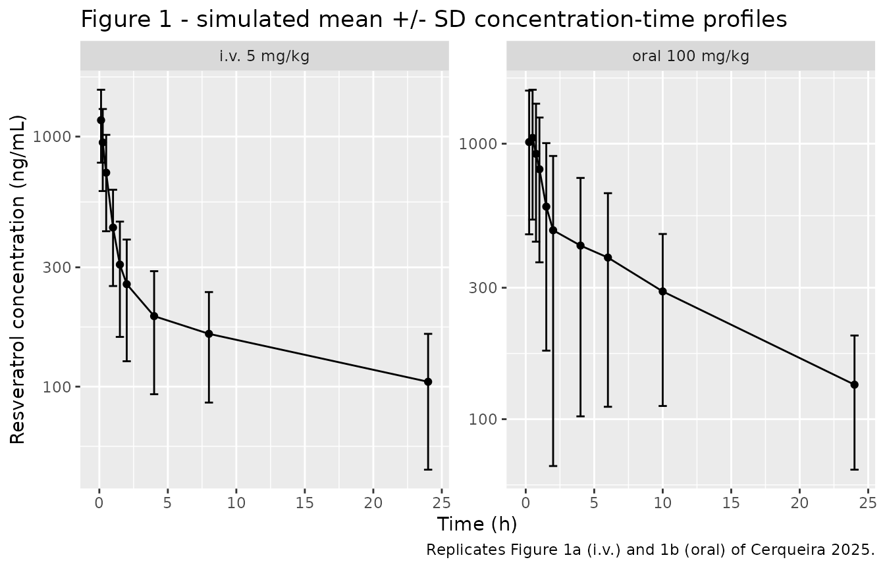
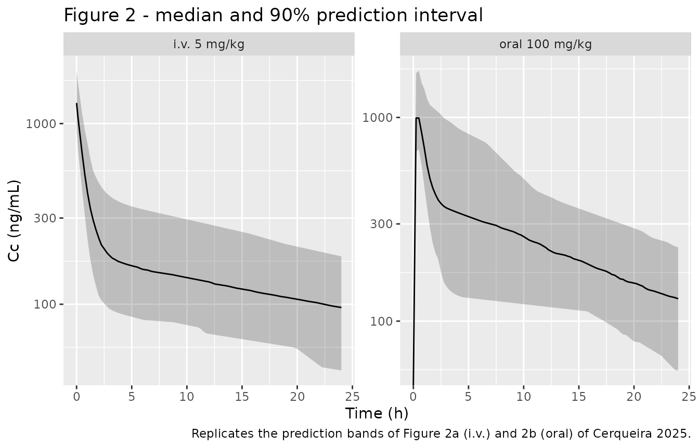

# Resveratrol in rats, intravenous and oral (Cerqueira 2025)

## Model and source

Cerqueira and colleagues fitted **two separate population PK models** to
two separate groups of male Wistar rats: a 5 mg/kg intravenous bolus arm
and a 100 mg/kg oral gavage arm. The two arms share no parameters –
every micro-constant was re-estimated per route (Table 1) – so they are
packaged as two independent model files.

``` r

mod_iv <- readModelDb("Cerqueira_2025_resveratrol_rat_iv")
mod_po <- readModelDb("Cerqueira_2025_resveratrol_rat_oral")

ui_iv <- rxode2::rxode(mod_iv)
#> ℹ parameter labels from comments will be replaced by 'label()'
ui_po <- rxode2::rxode(mod_po)
#> ℹ parameter labels from comments will be replaced by 'label()'
```

- Citation: Cerqueira C, Santos V, Araujo J, Pereira L, Batista F,
  Soares D, Azeredo F, Ferreira E. Development of a Population
  Pharmacokinetic Model Characterizing the Tissue Distribution of
  Resveratrol After Administration by Different Routes and Doses in
  Rats. Nutrients. 2025;17(1):181. <doi:10.3390/nu17010181>.
- Article: <https://doi.org/10.3390/nu17010181>
- Models: `Cerqueira_2025_resveratrol_rat_iv`,
  `Cerqueira_2025_resveratrol_rat_oral`

Intravenous arm description:

> Preclinical (rat). Two-compartment population PK model for resveratrol
> (3,5,4’-trihydroxy-trans-stilbene) after a single 5 mg/kg intravenous
> bolus into the caudal lateral vein of male Wistar rats. Fitted in
> Monolix 2020R1 (SAEM) and parameterised in micro-constant form exactly
> as the authors report it: a single central volume V (L/kg),
> first-order elimination k10 from central, and inter-compartmental rate
> constants k12 and k21 between the central and peripheral compartments.
> Because every dose, volume and clearance term in the source is
> normalised to body weight, the model is coded on a per-kilogram basis:
> the dosed amount is ug/kg and the volume is L/kg, so central/vc lands
> directly in ng/mL, the units the assay and Figures 1a and 2a report.
> All disposition parameters are true (non-apparent) values because the
> dose was given intravenously. The intravenous arm of the paper; see
> Cerqueira_2025_resveratrol_rat_oral for the separately fitted 100
> mg/kg oral arm.

Oral arm description:

> Preclinical (rat). Two-compartment population PK model with
> first-order absorption for resveratrol
> (3,5,4’-trihydroxy-trans-stilbene) after a single 100 mg/kg oral
> gavage dose to male Wistar rats. Fitted in Monolix 2020R1 (SAEM) and
> parameterised in micro-constant form exactly as the authors report it:
> first-order absorption ka from the gavage depot, a single central
> volume V (L/kg), first-order elimination k10 from central, and
> inter-compartmental rate constants k12 and k21. No bioavailability
> term was fitted, so the full 100 mg/kg dose enters the depot and V is
> an apparent volume V/F; the rate constants remain true rate constants.
> Non-compartmental analysis in the same paper put absolute oral
> bioavailability at roughly 6%. Because every dose and volume term in
> the source is normalised to body weight, the model is coded on a
> per-kilogram basis: the dosed amount is ug/kg and the volume is L/kg,
> so central/vc lands directly in ng/mL, the units the assay and Figures
> 1b and 2b report. The oral arm of the paper; see
> Cerqueira_2025_resveratrol_rat_iv for the separately fitted 5 mg/kg
> intravenous arm.

## Population

Twenty-four male Wistar rats, 2-3 months old and 250-300 g, from the
Health Sciences Institute vivarium of the Federal University of Bahia
(Methods 2.2). Animals were held on a 12 h light-dark cycle with ad
libitum food and water and randomised without stratification to the
dosing groups, all animals being of similar baseline weight, age, and
health status. Six rats received a single 5 mg/kg intravenous bolus via
the caudal lateral vein, six received a single 100 mg/kg oral gavage
dose, and a further twelve received 10 mg/kg intravenously for the
descriptive tissue-distribution assay. Resveratrol (purity \> 98%) was
given as a 3 mg/mL solution in 10% DMSO made up to volume with saline.
Ethics protocol 43/2016.

Plasma was sampled from the caudal vein at 0.125, 0.25, 0.5, 1, 1.5, 2,
4, 8 and 24 h after the intravenous dose, and at 0.25, 0.5, 0.75, 1,
1.5, 2, 4, 6, 10 and 24 h after the oral dose (Methods 2.5). Resveratrol
was quantified by HPLC-UV at 310 nm over a 62.5-5000 ng/mL calibration
range (LLOQ 62.5 ng/mL). The population fits were run in Monolix 2020R1
by SAEM.

Two measurements from the paper are *not* model parameters and are
recorded only in the model metadata: plasma protein binding was 79 +/-
5% and linear over 0.5-50 ug/mL (Results 3.4), and oral bioavailability
was estimated by non-compartmental analysis at approximately 6% (Results
3.2).

``` r

str(ui_iv$population)
#> List of 10
#>  $ species       : chr "rat (Wistar, male)"
#>  $ n_subjects    : int 6
#>  $ n_studies     : int 1
#>  $ age_range     : chr "2-3 months"
#>  $ weight_range  : chr "250-300 g"
#>  $ sex_female_pct: num 0
#>  $ disease_state : chr "Healthy (no disease model)"
#>  $ dose_range    : chr "Single 5 mg/kg intravenous bolus via the caudal lateral vein. Resveratrol (purity > 98%) formulated as a 3 mg/m"| __truncated__
#>  $ regions       : chr "Brazil (Federal University of Bahia, Salvador)"
#>  $ notes         : chr "Serial caudal-vein sampling at 0.125, 0.25, 0.5, 1, 1.5, 2, 4, 8 and 24 h post-dose; resveratrol quantified by "| __truncated__
```

## Source trace

Per-parameter provenance is recorded as an in-file comment next to each
`ini()` entry in
`inst/modeldb/specificDrugs/Cerqueira_2025_resveratrol_rat_iv.R` and
`..._rat_oral.R`. The table below collects them in one place.

| Equation / parameter | i.v. value | Oral value | Source location |
|----|----|----|----|
| `lvc` (V) | 3.60 L/kg | 22.20 L/kg (apparent, V/F) | Table 1, rows “V (L/kg)” |
| `lkel` (k10) | 0.17 1/h | 0.43 1/h | Table 1, rows “k10 (h-1)” |
| `lk12` | 1.20 1/h | 4.09 1/h | Table 1, rows “k12 (h-1)” |
| `lk21` | 0.26 1/h | 0.44 1/h | Table 1, rows “k21 (h-1)” |
| `lka` | n/a | 1.88 1/h | Table 1, row “ka (h-1)” |
| `etalvc` | 0.97 | 5.60 | Table 1, BSV columns (see conversion below) |
| `etalkel` | 0.07 | 0.09 | Table 1, BSV columns |
| `etalk12` | 0.29 | 0.45 | Table 1, BSV columns |
| `etalk21` | 0.11 | 0.33 | Table 1, BSV columns |
| `etalka` | n/a | 0.49 | Table 1, BSV columns |
| `propSd` | 0.22 | 0.41 | Table 1, “Residual variability / b” |
| Log-normal IIV, `theta_i = theta * exp(eta)` | – | – | Methods 2.5, first equation |
| Proportional residual error, `Y_ij = F_ij * (1 + eps_ij)` | – | – | Methods 2.5, second equation |
| `d/dt(central)`, `d/dt(peripheral1)` (i.v.) | – | – | Results 3.2, first equation pair |
| `d/dt(depot)`, `d/dt(central)`, `d/dt(peripheral1)` (oral) | – | – | Results 3.2, second equation triple |

``` r

dplyr::bind_rows(
  tibble::as_tibble(ui_iv$iniDf) |> dplyr::mutate(arm = "i.v."),
  tibble::as_tibble(ui_po$iniDf) |> dplyr::mutate(arm = "oral")
) |>
  dplyr::filter(!is.na(name)) |>
  dplyr::select(arm, name, est, label) |>
  dplyr::rename(Arm = arm, Parameter = name, Estimate = est, Label = label) |>
  knitr::kable(digits = 6, caption = "Packaged ini() values for both arms.")
```

| Arm | Parameter | Estimate | Label |
|:---|:---|---:|:---|
| i.v. | lvc | 1.280934 | Central volume of distribution V (log L/kg) |
| i.v. | lkel | -1.771957 | Elimination rate constant from central k10 (log 1/h) |
| i.v. | lk12 | 0.182322 | Rate constant central -\> peripheral1 k12 (log 1/h) |
| i.v. | lk21 | -1.347074 | Rate constant peripheral1 -\> central k21 (log 1/h) |
| i.v. | propSd | 0.220000 | Proportional residual error (fraction) |
| i.v. | etalvc | 0.070086 | Table 1, BSV i.v.: V = 0.97 (RSE 29.4%) |
| i.v. | etalkel | 0.156619 | Table 1, BSV i.v.: k10 = 0.07 (RSE 19.1%) |
| i.v. | etalk12 | 0.056761 | Table 1, BSV i.v.: k12 = 0.29 (RSE 24.6%) |
| i.v. | etalk21 | 0.164662 | Table 1, BSV i.v.: k21 = 0.11 (RSE 20.5%) |
| oral | lka | 0.631272 | First-order absorption rate constant ka (log 1/h) |
| oral | lvc | 3.100092 | Apparent central volume of distribution V/F (log L/kg) |
| oral | lkel | -0.843970 | Elimination rate constant from central k10 (log 1/h) |
| oral | lk12 | 1.408545 | Rate constant central -\> peripheral1 k12 (log 1/h) |
| oral | lk21 | -0.820981 | Rate constant peripheral1 -\> central k21 (log 1/h) |
| oral | propSd | 0.410000 | Proportional residual error (fraction) |
| oral | etalka | 0.065724 | Table 1, BSV Oral: ka = 0.49 (RSE 33%) |
| oral | etalvc | 0.061689 | Table 1, BSV Oral: V = 5.60 (RSE 13.6%) |
| oral | etalkel | 0.042875 | Table 1, BSV Oral: k10 = 0.09 (RSE 26.5%) |
| oral | etalk12 | 0.012033 | Table 1, BSV Oral: k12 = 0.45 (RSE 22%) |
| oral | etalk21 | 0.446287 | Table 1, BSV Oral: k21 = 0.33 (RSE 29.3%) |

Packaged ini() values for both arms. {.table}

### Units and dimensional analysis

Every dose, volume, and clearance term in the source is normalised to
body weight (mg/kg, L/kg, L/h/kg), so both models are coded on a
per-kilogram basis. The state amounts carry ug/kg and the volumes carry
L/kg, which makes `Cc <- central / vc` land directly in the units the
assay reports:

``` math
\frac{\mu g/kg}{L/kg} = \frac{\mu g}{L} = \frac{ng}{mL}
```

A 5 mg/kg intravenous dose therefore enters as `amt = 5000` and a 100
mg/kg oral dose as `amt = 100000`.

``` r

dose_iv <- 5000      # ug/kg == 5 mg/kg
dose_po <- 100000    # ug/kg == 100 mg/kg

c0_iv_analytic <- dose_iv / exp(ui_iv$theta[["lvc"]])
cat(sprintf("Analytic i.v. C(0) = dose/V = %.0f/%.2f = %.1f ng/mL (%.2f ug/mL)\n",
            dose_iv, exp(ui_iv$theta[["lvc"]]), c0_iv_analytic, c0_iv_analytic / 1000))
#> Analytic i.v. C(0) = dose/V = 5000/3.60 = 1388.9 ng/mL (1.39 ug/mL)
```

## Virtual cohort

The observed rat data are not published in machine-readable form, so the
figures below use virtual cohorts of 100 rats per arm drawn from the
packaged IIV. The paper’s own sampling schedule is reproduced exactly; a
finer grid is added purely so the plotted curves are smooth.

``` r

set.seed(20250103)
n_per_arm <- 100L

times_iv <- c(0.125, 0.25, 0.5, 1, 1.5, 2, 4, 8, 24)
times_po <- c(0.25, 0.5, 0.75, 1, 1.5, 2, 4, 6, 10, 24)

# `id_offset` keeps the two arms' subject ids disjoint so they can be
# bind_rows()-ed for the pooled NCA without rxSolve merging them.
make_arm <- function(n, dose_amt, dose_cmt, sample_times, arm_label, id_offset) {
  plot_grid <- sort(unique(c(sample_times, seq(0, 24, by = 0.25))))
  ids <- id_offset + seq_len(n)
  dplyr::bind_rows(
    tibble::tibble(id = ids, time = 0, amt = dose_amt, evid = 1L, cmt = dose_cmt),
    tidyr::crossing(id = ids, time = plot_grid) |>
      dplyr::mutate(amt = NA_real_, evid = 0L, cmt = "central")
  ) |>
    dplyr::mutate(arm = arm_label) |>
    dplyr::arrange(id, time, dplyr::desc(evid))
}

ev_iv <- make_arm(n_per_arm, dose_iv, "central", times_iv, "i.v. 5 mg/kg",   0L)
ev_po <- make_arm(n_per_arm, dose_po, "depot",   times_po, "oral 100 mg/kg", 1000L)

stopifnot(!anyDuplicated(unique(ev_iv[, c("id", "time", "evid")])))
stopifnot(!anyDuplicated(unique(ev_po[, c("id", "time", "evid")])))
stopifnot(length(intersect(ev_iv$id, ev_po$id)) == 0L)
```

Observation rows point at the `central` ODE state, never at the
algebraic observable `Cc`; rxode2 returns `Cc` as an output column
regardless.

## Simulation

``` r

sim_iv <- rxode2::rxSolve(mod_iv, events = ev_iv, keep = "arm", useLinCmt = FALSE) |>
  as.data.frame()
#> ℹ parameter labels from comments will be replaced by 'label()'
sim_po <- rxode2::rxSolve(mod_po, events = ev_po, keep = "arm", useLinCmt = FALSE) |>
  as.data.frame()
#> ℹ parameter labels from comments will be replaced by 'label()'

sim <- dplyr::bind_rows(sim_iv, sim_po)

# `Cc` is the individual prediction (IPRED); `sim` carries the proportional
# residual error and is the observed-scale quantity the paper's NCA was run on.
stopifnot(all(c("Cc", "sim") %in% names(sim)))
stopifnot(nrow(sim) > 0, !anyNA(sim$Cc))
```

## Replicate published figures

### Figure 1 – mean concentration-time profiles

Figure 1a of the source plots the intravenous arm on a linear axis in
ug/mL; Figure 1b plots the oral arm on a log axis in ng/mL. Both are
mean +/- SD of n = 6 at the paper’s sampling times.

``` r

# Replicates Figure 1a and 1b of Cerqueira 2025: mean +/- SD of the
# observed-scale concentration at the paper's own sampling times.
fig1 <- sim |>
  dplyr::filter(
    (arm == "i.v. 5 mg/kg"   & time %in% times_iv) |
    (arm == "oral 100 mg/kg" & time %in% times_po)
  ) |>
  dplyr::group_by(arm, time) |>
  dplyr::summarise(
    mean_c = mean(sim),
    sd_c   = stats::sd(sim),
    .groups = "drop"
  )

ggplot(fig1, aes(time, mean_c)) +
  geom_line() +
  geom_point() +
  geom_errorbar(aes(ymin = pmax(mean_c - sd_c, 1), ymax = mean_c + sd_c), width = 0.6) +
  facet_wrap(~arm, scales = "free_y") +
  scale_y_log10() +
  labs(
    x = "Time (h)", y = "Resveratrol concentration (ng/mL)",
    title = "Figure 1 - simulated mean +/- SD concentration-time profiles",
    caption = "Replicates Figure 1a (i.v.) and 1b (oral) of Cerqueira 2025."
  )
```



The simulated oral profile is a single-peak curve. The observed Figure
1b shows **two** peaks, at 2 and 6 h, which the authors attribute to
enterohepatic recirculation (Results 3.2, Discussion). The fitted model
has a single first-order absorption process and therefore cannot
reproduce the second peak; this is a limitation of the published model,
not of the encoding.

### Figure 2 – prediction intervals

``` r

# Replicates Figure 2a and 2b of Cerqueira 2025: median and 90% prediction
# interval of the individual predictions over the observed time window.
sim |>
  dplyr::group_by(arm, time) |>
  dplyr::summarise(
    Q05 = stats::quantile(Cc, 0.05),
    Q50 = stats::quantile(Cc, 0.50),
    Q95 = stats::quantile(Cc, 0.95),
    .groups = "drop"
  ) |>
  ggplot(aes(time, Q50)) +
  geom_ribbon(aes(ymin = Q05, ymax = Q95), alpha = 0.25) +
  geom_line() +
  facet_wrap(~arm, scales = "free_y") +
  scale_y_log10() +
  labs(
    x = "Time (h)", y = "Cc (ng/mL)",
    title = "Figure 2 - median and 90% prediction interval",
    caption = "Replicates the prediction bands of Figure 2a (i.v.) and 2b (oral) of Cerqueira 2025."
  )
#> Warning in scale_y_log10(): log-10 transformation introduced infinite values.
#> log-10 transformation introduced infinite values.
#> log-10 transformation introduced infinite values.
#> log-10 transformation introduced infinite values.
```



## Closed-form validation of the encoded micro-constants

Before comparing against the paper’s non-compartmental numbers, check
the encoding itself against the analytic solution of the two-compartment
system. For micro-constants $`k_{10}`$, $`k_{12}`$, $`k_{21}`$ the
hybrid rate constants are the roots of
$`\lambda^2 - (k_{10}+k_{12}+k_{21})\lambda + k_{10}k_{21} = 0`$, the
clearance is $`k_{10}V`$, and the dose-normalised AUC to infinity is
$`D/(k_{10}V)`$.

``` r

macro <- function(ui) {
  kel <- exp(ui$theta[["lkel"]])
  k12 <- exp(ui$theta[["lk12"]])
  k21 <- exp(ui$theta[["lk21"]])
  vc  <- exp(ui$theta[["lvc"]])
  a <- kel + k12 + k21
  b <- kel * k21
  disc <- sqrt(a^2 - 4 * b)
  list(
    kel = kel, vc = vc,
    alpha = (a + disc) / 2, beta = (a - disc) / 2,
    cl = kel * vc, vss = vc * (1 + k12 / k21)
  )
}

mac_iv <- macro(ui_iv)
mac_po <- macro(ui_po)

analytic <- tibble::tibble(
  Arm             = c("i.v. 5 mg/kg", "oral 100 mg/kg"),
  `alpha (1/h)`   = c(mac_iv$alpha, mac_po$alpha),
  `t1/2 alpha (h)`= log(2) / c(mac_iv$alpha, mac_po$alpha),
  `beta (1/h)`    = c(mac_iv$beta, mac_po$beta),
  `t1/2 beta (h)` = log(2) / c(mac_iv$beta, mac_po$beta),
  `CL (L/h/kg)`   = c(mac_iv$cl, mac_po$cl),
  `Vss (L/kg)`    = c(mac_iv$vss, mac_po$vss),
  `AUCinf (ng*h/mL)` = c(dose_iv / mac_iv$cl, dose_po / mac_po$cl)
)

knitr::kable(analytic, digits = 4,
             caption = "Analytic macro-constants implied by the packaged Table 1 micro-constants.")
```

| Arm | alpha (1/h) | t1/2 alpha (h) | beta (1/h) | t1/2 beta (h) | CL (L/h/kg) | Vss (L/kg) | AUCinf (ng\*h/mL) |
|:---|---:|---:|---:|---:|---:|---:|---:|
| i.v. 5 mg/kg | 1.6024 | 0.4326 | 0.0276 | 25.1292 | 0.612 | 20.2154 | 8169.935 |
| oral 100 mg/kg | 4.9216 | 0.1408 | 0.0384 | 18.0305 | 9.546 | 228.5591 | 10475.592 |

Analytic macro-constants implied by the packaged Table 1
micro-constants. {.table}

Now simulate the typical-value profile over a window long enough (240 h,
about 9 terminal half-lives for the i.v. arm and 13 for the oral arm)
that the extrapolated tail is negligible, and confirm PKNCA recovers
those analytic values from the packaged models.

``` r

long_grid <- sort(unique(c(seq(0, 24, by = 0.05), seq(24, 240, by = 1))))

solve_typical <- function(mod, dose_amt, dose_cmt, arm_label) {
  ev <- dplyr::bind_rows(
    tibble::tibble(id = 1L, time = 0, amt = dose_amt, evid = 1L, cmt = dose_cmt),
    tibble::tibble(id = 1L, time = long_grid, amt = NA_real_, evid = 0L, cmt = "central")
  ) |>
    dplyr::arrange(time, dplyr::desc(evid))
  out <- rxode2::rxSolve(rxode2::zeroRe(mod), events = ev, omega = NA,
                         useLinCmt = FALSE) |>
    as.data.frame()
  if (is.null(out$id)) out$id <- 1L
  out$arm <- arm_label
  out
}

tv <- dplyr::bind_rows(
  solve_typical(mod_iv, dose_iv, "central", "i.v. 5 mg/kg"),
  solve_typical(mod_po, dose_po, "depot",   "oral 100 mg/kg")
)
#> ℹ parameter labels from comments will be replaced by 'label()'
#> ℹ parameter labels from comments will be replaced by 'label()'

stopifnot(all(tv$Cc >= 0))

tv_conc <- tv |>
  dplyr::filter(!is.na(Cc)) |>
  dplyr::select(id, time, Cc, arm)

tv_nca <- PKNCA::pk.nca(PKNCA::PKNCAdata(
  PKNCA::PKNCAconc(tv_conc, Cc ~ time | arm + id),
  PKNCA::PKNCAdose(
    tibble::tibble(id = 1L, time = 0,
                   amt = c(dose_iv, dose_po),
                   arm = c("i.v. 5 mg/kg", "oral 100 mg/kg")),
    amt ~ time | arm + id
  ),
  intervals = data.frame(start = 0, end = Inf,
                         aucinf.obs = TRUE, half.life = TRUE, cl.obs = TRUE)
))

tv_wide <- as.data.frame(tv_nca) |>
  dplyr::select(arm, PPTESTCD, PPORRES) |>
  tidyr::pivot_wider(names_from = PPTESTCD, values_from = PPORRES)

gate <- tv_wide |>
  dplyr::mutate(
    auc_analytic  = c(dose_iv, dose_po)[match(arm, c("i.v. 5 mg/kg", "oral 100 mg/kg"))] /
                      c(mac_iv$cl, mac_po$cl)[match(arm, c("i.v. 5 mg/kg", "oral 100 mg/kg"))],
    thalf_analytic = log(2) / c(mac_iv$beta, mac_po$beta)[match(arm, c("i.v. 5 mg/kg", "oral 100 mg/kg"))],
    cl_analytic    = c(mac_iv$cl, mac_po$cl)[match(arm, c("i.v. 5 mg/kg", "oral 100 mg/kg"))],
    auc_pct   = 100 * (aucinf.obs - auc_analytic) / auc_analytic,
    thalf_pct = 100 * (half.life  - thalf_analytic) / thalf_analytic,
    cl_pct    = 100 * (cl.obs     - cl_analytic)    / cl_analytic
  )

gate |>
  dplyr::select(arm, aucinf.obs, auc_analytic, auc_pct,
                half.life, thalf_analytic, thalf_pct,
                cl.obs, cl_analytic, cl_pct) |>
  dplyr::rename(
    "Arm" = arm,
    "AUCinf PKNCA" = aucinf.obs, "AUCinf analytic" = auc_analytic, "AUC % diff" = auc_pct,
    "t1/2 PKNCA" = half.life, "t1/2 analytic" = thalf_analytic, "t1/2 % diff" = thalf_pct,
    "CL PKNCA" = cl.obs, "CL analytic" = cl_analytic, "CL % diff" = cl_pct
  ) |>
  knitr::kable(digits = 3,
               caption = "PKNCA on the typical-value profile vs the closed-form solution.")
```

| Arm | AUCinf PKNCA | AUCinf analytic | AUC % diff | t1/2 PKNCA | t1/2 analytic | t1/2 % diff | CL PKNCA | CL analytic | CL % diff |
|:---|---:|---:|---:|---:|---:|---:|---:|---:|---:|
| i.v. 5 mg/kg | 8170.043 | 8169.935 | 0.001 | 25.091 | 25.129 | -0.152 | 0.612 | 0.612 | -0.001 |
| oral 100 mg/kg | 10473.731 | 10475.592 | -0.018 | 18.005 | 18.030 | -0.139 | 9.548 | 9.546 | 0.018 |

PKNCA on the typical-value profile vs the closed-form solution. {.table
style="width:100%;"}

``` r


# Hard gate: the packaged micro-constants must reproduce the analytic solution.
stopifnot(all(abs(gate$auc_pct)   < 2))
stopifnot(all(abs(gate$thalf_pct) < 2))
stopifnot(all(abs(gate$cl_pct)    < 2))
```

The packaged models reproduce their own closed-form solution to well
under 2% on all three quantities, so the micro-constants, the volume,
and the observation equation are encoded correctly.

## PKNCA validation against the published non-compartmental analysis

The paper’s non-compartmental parameters were computed from
concentrations observed over a 24 h window at the sampling times listed
above. To make the comparison like-for-like, the simulated cohorts are
subsetted to exactly those times and the same 0-24 h window, and the NCA
is run on the observed-scale `sim` column (which carries the
proportional residual error), not on the noise-free individual
prediction.

``` r

sim_nca <- sim |>
  dplyr::filter(
    (arm == "i.v. 5 mg/kg"   & time %in% times_iv) |
    (arm == "oral 100 mg/kg" & time %in% times_po)
  ) |>
  dplyr::filter(!is.na(sim)) |>
  dplyr::mutate(Cc = pmax(sim, 0)) |>
  dplyr::select(id, time, Cc, arm)

# Time-zero anchor: the oral arm is extravascular so pre-dose Cc = 0; the i.v.
# arm is a bolus, whose t = 0 concentration is the individual dose/V.
t0 <- dplyr::bind_rows(
  sim |>
    dplyr::filter(arm == "i.v. 5 mg/kg", time == 0) |>
    dplyr::transmute(id, time = 0, Cc = pmax(sim, 0), arm),
  sim_nca |>
    dplyr::filter(arm == "oral 100 mg/kg") |>
    dplyr::distinct(id, arm) |>
    dplyr::mutate(time = 0, Cc = 0)
)

sim_nca <- dplyr::bind_rows(sim_nca, t0) |>
  dplyr::distinct(id, arm, time, .keep_all = TRUE) |>
  dplyr::arrange(arm, id, time)

stopifnot(nrow(sim_nca) > 0)
stopifnot(all(sim_nca |> dplyr::group_by(arm, id) |>
                dplyr::summarise(has0 = any(time == 0), .groups = "drop") |>
                dplyr::pull(has0)))

dose_df <- dplyr::bind_rows(ev_iv, ev_po) |>
  dplyr::filter(evid == 1) |>
  dplyr::select(id, time, amt, arm) |>
  dplyr::mutate(route = ifelse(arm == "i.v. 5 mg/kg", "intravascular", "extravascular"))

nca_res <- PKNCA::pk.nca(PKNCA::PKNCAdata(
  PKNCA::PKNCAconc(sim_nca, Cc ~ time | arm + id),
  PKNCA::PKNCAdose(dose_df, amt ~ time | arm + id, route = "route"),
  intervals = data.frame(
    start = 0, end = 24,
    cmax = TRUE, tmax = TRUE, lambda.z = TRUE, half.life = TRUE,
    aucinf.obs = TRUE, cl.obs = TRUE, vz.obs = TRUE, mrt.obs = TRUE
  )
))
```

### Comparison against published NCA

``` r

# Cerqueira 2025 Results 3.2, non-compartmental paragraphs (i.v. and oral).
# The paper reports no numeric Cmax or Tmax for either route, so those rows
# are absent from the reference.
published <- tibble::tribble(
  ~arm,             ~lambda.z, ~half.life, ~vz.obs, ~cl.obs, ~aucinf.obs, ~mrt.obs,
  "i.v. 5 mg/kg",        0.09,        9.5,     5.8,    0.39,        6076,      8.7,
  "oral 100 mg/kg",      0.12,        7.9,    23.3,    1.76,        6519,      7.7
)

cmp <- nlmixr2lib::ncaComparisonTable(
  simulated = nca_res,
  reference = published,
  by        = "arm",
  units     = c(lambda.z = "1/h", half.life = "h", vz.obs = "L/kg",
                cl.obs = "L/h/kg", aucinf.obs = "ng*h/mL", mrt.obs = "h"),
  tolerance_pct = 20
)

knitr::kable(
  cmp,
  caption = paste(
    "Simulated (packaged model, paper's sampling grid, 0-24 h) vs published",
    "non-compartmental values. * differs from the reference by more than 20%."
  )
)
```

| NCA parameter           | arm            | Reference | Simulated | % diff    |
|:------------------------|:---------------|:----------|:----------|:----------|
| AUC0-∞ (obs) (ng\*h/mL) | i.v. 5 mg/kg   | 6080      | 6760      | +11.3%    |
| AUC0-∞ (obs) (ng\*h/mL) | oral 100 mg/kg | 6520      | 9120      | +39.9%\*  |
| t½ (h)                  | i.v. 5 mg/kg   | 9.5       | 17.7      | +86.5%\*  |
| t½ (h)                  | oral 100 mg/kg | 7.9       | 10.5      | +32.4%\*  |
| λz (1/h)                | i.v. 5 mg/kg   | 0.09      | 0.0391    | -56.5%\*  |
| λz (1/h)                | oral 100 mg/kg | 0.12      | 0.0663    | -44.8%\*  |
| CL/F (L/h/kg)           | i.v. 5 mg/kg   | 0.39      | 0.74      | +89.7%\*  |
| CL/F (L/h/kg)           | oral 100 mg/kg | 1.76      | 11        | +522.9%\* |
| MRT (h)                 | i.v. 5 mg/kg   | 8.7       | 24        | +175.9%\* |
| MRT (h)                 | oral 100 mg/kg | 7.7       | 16.1      | +109.2%\* |
| Vz/F (L/kg)             | i.v. 5 mg/kg   | 5.8       | 19        | +226.9%\* |
| Vz/F (L/kg)             | oral 100 mg/kg | 23.3      | 189       | +709.4%\* |

Simulated (packaged model, paper’s sampling grid, 0-24 h) vs published
non-compartmental values. \* differs from the reference by more than
20%. {.table}

The one row that agrees is the headline exposure metric for the
intravenous arm: simulated AUC0-inf of about 6800 ng\*h/mL against a
published 6076, an 11% difference on the route where no bioavailability
term is involved.

Most other rows are starred. They are **not** encoding errors, and no
parameter has been tuned to close them. The next two sections show that
the source’s own non-compartmental table is internally inconsistent and
that its clearance and volume columns are not on the same dose basis as
its own population model, which together cap how closely any faithful
encoding of Table 1 can agree with it.

### Why the published NCA and the published model disagree

The paper reports the non-compartmental and the population results as
means of per-animal estimates, and the two sets do not reconcile with
each other. Three checks use only numbers printed in the paper – the
packaged model is not involved:

``` r

tibble::tribble(
  ~Check,                                  ~Arm,             ~`From the paper`, ~`Implied by other printed values`,
  "AUC (ng*h/mL) vs dose / CL",            "i.v. 5 mg/kg",   6076,              dose_iv / 0.39,
  "AUC (ng*h/mL) vs dose / CL",            "oral 100 mg/kg", 6519,              dose_po / 1.76,
  "t1/2 (h) vs ln(2) / ke",                "i.v. 5 mg/kg",   9.5,               log(2) / 0.09,
  "t1/2 (h) vs ln(2) / ke",                "oral 100 mg/kg", 7.9,               log(2) / 0.12,
  "Vd (L/kg) vs CL / ke",                  "i.v. 5 mg/kg",   5.8,               0.39 / 0.09,
  "Vd (L/kg) vs CL / ke",                  "oral 100 mg/kg", 23.3,              1.76 / 0.12
) |>
  dplyr::mutate(`% difference` = 100 * (`Implied by other printed values` - `From the paper`) /
                  `From the paper`) |>
  knitr::kable(digits = 2,
               caption = paste(
                 "Internal consistency of the published non-compartmental values.",
                 "Both columns are taken from Cerqueira 2025 Results 3.2 only."
               ))
```

| Check | Arm | From the paper | Implied by other printed values | % difference |
|:---|:---|---:|---:|---:|
| AUC (ng\*h/mL) vs dose / CL | i.v. 5 mg/kg | 6076.0 | 12820.51 | 111.00 |
| AUC (ng\*h/mL) vs dose / CL | oral 100 mg/kg | 6519.0 | 56818.18 | 771.58 |
| t1/2 (h) vs ln(2) / ke | i.v. 5 mg/kg | 9.5 | 7.70 | -18.93 |
| t1/2 (h) vs ln(2) / ke | oral 100 mg/kg | 7.9 | 5.78 | -26.88 |
| Vd (L/kg) vs CL / ke | i.v. 5 mg/kg | 5.8 | 4.33 | -25.29 |
| Vd (L/kg) vs CL / ke | oral 100 mg/kg | 23.3 | 14.67 | -37.05 |

Internal consistency of the published non-compartmental values. Both
columns are taken from Cerqueira 2025 Results 3.2 only. {.table}

Every one of the six checks disagrees, by 19% to 772%, using nothing but
the paper’s own printed numbers. Two separate drivers are at work.

The oral `AUC` versus `dose / CL` row is by far the largest, at +772%,
and it is not really an inconsistency: the reported oral `CL` is already
corrected for bioavailability (see the next section) while the dose is
the administered one, so this check actually recovers `AUC / F`, and its
size is simply `1 / F`.

The other five rows, spanning 19% to 111%, are genuine internal
inconsistencies. The driver there is that a mean of per-animal ratios is
not the ratio of the means, and the paper’s own per-animal spread is
wide: the standard deviations it reports correspond to coefficients of
variation of roughly 40% to 80% on `ke`, `t1/2`, `Vd`, `CL`, and `AUC`,
in a study with n = 6.

### Clearance on a common dose basis

The largest starred rows in the comparison table are the oral clearance
and volume, at +523% and +709%. Those two are not a like-for-like
comparison at all. The population model in Table 1 has no
bioavailability term, so its `V` is apparent and `k10 * V` is a `CL/F`
on the administered 100 mg/kg dose – which is what the simulated NCA
above reproduces. The paper’s reported non-compartmental clearance is
not on that basis: the Discussion states that “our study provides total
clearance, already accounting for resveratrol’s bioavailability”.

Putting the model and the paper’s own AUC on the same basis – `CL/F`
from the administered dose – narrows the gap by an order of magnitude:

``` r

tibble::tibble(
  Arm = c("i.v. 5 mg/kg", "oral 100 mg/kg"),
  `Model CL/F = k10 * V (Table 1)`      = c(mac_iv$cl, mac_po$cl),
  `NCA-implied CL/F = dose / AUC`       = c(dose_iv / 6076, dose_po / 6519),
  `Reported CL (Results 3.2)`           = c(0.39, 1.76)
) |>
  dplyr::mutate(
    `Model vs NCA-implied (%)` =
      100 * (`Model CL/F = k10 * V (Table 1)` - `NCA-implied CL/F = dose / AUC`) /
        `NCA-implied CL/F = dose / AUC`,
    # Only meaningful for the oral arm; F is 1 by definition after an i.v. bolus.
    `Implied F from reported CL (%)` = ifelse(
      Arm == "oral 100 mg/kg",
      100 * `Reported CL (Results 3.2)` / `NCA-implied CL/F = dose / AUC`,
      NA_real_
    )
  ) |>
  knitr::kable(digits = 2,
               caption = paste(
                 "Clearance on a common (administered-dose) basis. All units L/h/kg."
               ))
```

| Arm | Model CL/F = k10 \* V (Table 1) | NCA-implied CL/F = dose / AUC | Reported CL (Results 3.2) | Model vs NCA-implied (%) | Implied F from reported CL (%) |
|:---|---:|---:|---:|---:|---:|
| i.v. 5 mg/kg | 0.61 | 0.82 | 0.39 | -25.63 | NA |
| oral 100 mg/kg | 9.55 | 15.34 | 1.76 | -37.77 | 11.47 |

Clearance on a common (administered-dose) basis. All units L/h/kg.
{.table}

On that common basis the packaged model sits within 26% (i.v.) and 38%
(oral) of the clearance implied by the paper’s own AUC, rather than the
90% and 523% against the reported `CL` column. The reported column is
the outlier: back- calculating the bioavailability it implies for the
oral arm gives 11.5%, where the paper’s own non-compartmental estimate
elsewhere in the same paragraph is approximately 6%. The published `Vd`
column inherits the same offset, because it is `Vz = CL / lambda_z` and
so carries both the clearance basis and the truncated terminal slope.

The second driver is the observation window. The packaged intravenous
model implies a terminal half-life of 25.1 h and the oral model 18.0 h,
but sampling stopped at 24 h. A log-linear slope fitted to the last few
points of a 24 h profile cannot resolve a terminal phase that long, so
it reads short – which is exactly the direction of the published
half-lives (9.5 and 7.9 h) and, through `Vz = CL/lambda.z`, of the
published volumes. The simulated NCA in the comparison table above is
subject to the same truncation, which is why it is the like-for-like
comparison to run.

## Assumptions and deviations

- **Scale of the `BSV` column in Table 1 (load-bearing).** The paper
  tabulates a `BSV` value per parameter per arm but never states its
  scale. It is read here as the standard deviation of the individual
  parameter on the **natural (untransformed) scale**, i.e. an
  approximate CV of `BSV / typical value`, converted to the packaged
  variance with `omega^2 = log(1 + CV^2)`. The alternative reading –
  `BSV` is `omega`, the SD of `eta` on the log scale, as Monolix reports
  it – is untenable: for the oral arm `V` has a typical value of 22.20
  and a `BSV` of 5.60, which as an `omega` corresponds to a coefficient
  of variation of roughly 5e8 % and cannot be simulated. Under the
  natural-scale reading all nine tabulated `BSV` entries across both
  arms fall in a coherent 11-75% CV band, and each `BSV` scales with the
  magnitude of its own typical value, which is what a natural-scale SD
  does and what an `omega` has no reason to do. The per-parameter
  arithmetic is written out in the `ini()` comments of both model files.
- **Sign of the peripheral differential equation.** Results 3.2 prints
  the peripheral equation for both arms as `dP/dt = +k21*P - k12*C`. As
  printed the peripheral compartment is fed by itself and drains into
  the central compartment, so `P` grows without bound and no drug ever
  distributes out of plasma; it is not an open two-compartment model,
  and it contradicts the same paragraph’s own definition of `k12` and
  `k21` as “the distribution and redistribution rates, respectively”.
  The standard form `dP/dt = +k12*C - k21*P` is used. The depot and
  central equations are encoded exactly as printed. (The oral paragraph
  carries a second, harmless typo, naming the pair “k12 and k12”.)
- **Amounts rather than concentrations in the ODE states.** The source
  writes `C` and `P` as concentrations while reporting a single volume
  `V`, and in the oral system adds an amount `A` to a concentration
  derivative, which is dimensionally inconsistent as printed. The
  packaged states all carry amount (ug/kg) with `Cc <- central / vc`;
  this is the same system scaled by `V`, is dimensionally consistent,
  and is what the Monolix `(ka, V, k, k12, k21)` parameterisation
  integrates.
- **No bioavailability term in the oral model.** Table 1 reports no `F`
  for the oral arm, so the full 100 mg/kg dose enters the depot and `V`
  is an apparent volume `V/F`. The rate constants remain true rate
  constants. The paper’s separate non-compartmental estimate of absolute
  oral bioavailability was approximately 6% (Results 3.2); it is
  recorded in the model description but is not a fitted parameter and is
  not applied.
- **The paper’s non-compartmental clearance and volume are on a
  different dose basis than its own model.** Table 1 contains no
  bioavailability term, so its oral `V` is apparent and `k10 * V` is a
  `CL/F` on the administered dose. The Discussion states that the
  reported non-compartmental clearance is “total clearance, already
  accounting for resveratrol’s bioavailability”. The comparison table
  above therefore puts an uncorrected simulated `CL/F` next to a
  corrected published `CL`, which accounts for most of the oral
  clearance and volume discrepancy; the “Clearance on a common dose
  basis” section puts them on the same footing. No correction has been
  applied to the packaged models, which encode Table 1 exactly as
  printed.
- **Enterohepatic recirculation is not modelled.** The observed mean
  oral profile has two peaks, at 2 and 6 h, which the authors attribute
  to enterohepatic recirculation. The model they fitted has a single
  first-order absorption process, so neither their fit nor this encoding
  reproduces the second peak.
- **Conflicting oral `Vd` between the abstract and the Results.** The
  abstract gives the oral non-compartmental apparent volume of
  distribution as 13.3 L/kg; Results 3.2 gives 23.3 L/kg. The Results
  value is used in the comparison table above, on the convention that
  the detailed results section supersedes the abstract. Neither value is
  a model parameter, so the packaged models are unaffected. Note that
  `CL/ke = 1.76/0.12 = 14.7` L/kg sits closer to the abstract’s figure,
  so the discrepancy is not resolvable from the paper.
- **No covariates.** The paper screened and reported none; animals were
  randomised without stratification and were of similar baseline weight,
  age, and health status (Methods 2.2). Both models therefore carry an
  empty `covariateData`.
- **Tissue distribution is not modelled.** The title and Results 3.3
  describe resveratrol concentrations in liver, lung, kidney, heart,
  stomach, spleen, adipose tissue, and brain after a 10 mg/kg
  intravenous dose (Figure 4), but that assay is purely descriptive – no
  tissue compartments, partition coefficients, or physiologically based
  structure were fitted, and Table 1 contains no tissue parameters. The
  packaged models are the plasma two-compartment models the paper
  actually fitted.
- **Plasma protein binding is not a model parameter.** The measured 79
  +/- 5% bound fraction (Results 3.4) is recorded in the `population`
  metadata; the models are written on total plasma concentration, as the
  assay and the fits were.
- **Virtual cohorts.** 100 rats per arm, drawn from the packaged IIV
  with `set.seed(20250103)`. The published study had n = 6 per arm; the
  larger simulated cohort stabilises the percentile and mean summaries
  and does not change the typical-value predictions.
