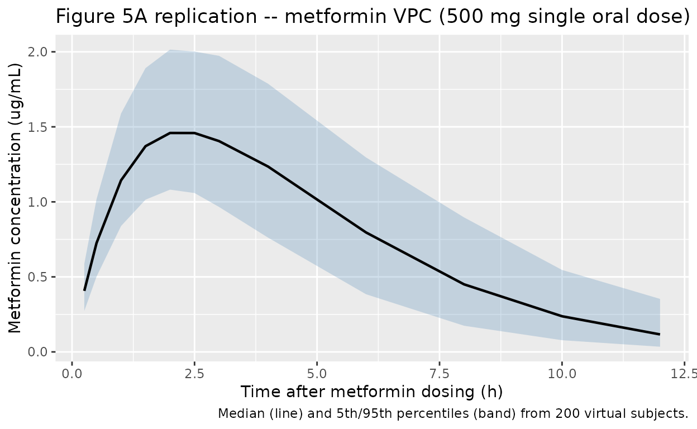
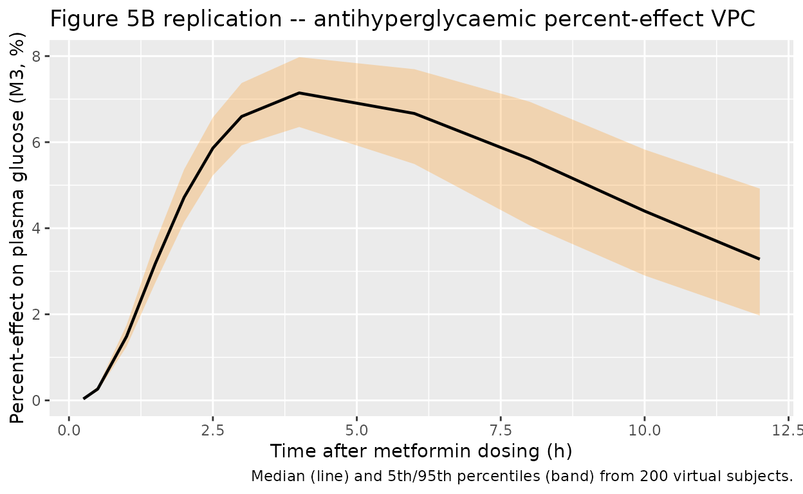

# Metformin (Chae 2012)

## Model and source

- Citation: Chae JW, Baek IH, Lee BY, Cho SK, Kwon KI. Population
  pharmacokinetic and pharmacodynamic analysis of metformin using the
  signal transduction model. Br J Clin Pharmacol. 2012;74(5):815-823.
  <doi:10.1111/j.1365-2125.2012.04260.x>
- Description: One-compartment population PK model with first-order
  absorption for oral metformin in healthy Korean adults, coupled to a
  three-transit Sun-Jusko signal-transduction PD model for the
  antihyperglycaemic effect (Chae 2012). Plasma drug concentration in
  the central compartment drives a Hill-type stimulation function DR =
  Emax \* Cp^r / (EC50^r + Cp^r) that initiates a cascade of three
  secondary-messenger transit compartments (M1 -\> M2 -\> M3) with
  shared mean transit time tau. The third messenger M3 is the measured
  percent change in plasma glucose from baseline relative to a
  sugar-bolus control arm. Creatinine clearance enters CL/F as a power
  covariate with reference 106.5 mL/min and exponent 0.782.
- Article: <https://doi.org/10.1111/j.1365-2125.2012.04260.x>

## Population

Chae 2012 enrolled 42 healthy young Korean male volunteers (age 21-31
years, weight 61-78 kg, baseline fasting plasma glucose 98 +/- 7 mg/dL,
creatinine clearance 90-123 mL/min) at a single centre in Daejeon. Each
subject received a single 500 mg oral metformin tablet (Diabex 500 mg,
Daewoong) after an overnight fast and consumed 12 g of sugar 20 min
after dosing. Identical sampling without metformin was performed one
week later to derive the antihyperglycaemic “percent-effect” PD endpoint
as the time-matched percent change in plasma glucose relative to the
no-metformin control arm. Per-subject demographics are Chae 2012 Table
1; the same information is available programmatically via
`rxode2::rxode2(readModelDb("Chae_2012_metformin"))$population` after
the model is loaded.

## Source trace

Every parameter line in
`inst/modeldb/specificDrugs/Chae_2012_metformin.R` carries an in-file
source comment. The table below collects the equation and parameter
origins in one place for reviewer convenience.

| Equation / parameter | Value | Source location |
|----|----|----|
| 1-compartment PK ODEs `dX1/dt = -Ka*X1`, `dX2/dt = Ka*X1 - CL*X2/V2` | n/a | Chae 2012 p.817 (Population PK/PD analysis) |
| Signal-transduction PD: `DR = Emax*Cp^r / (EC50^r + Cp^r)`, transit chain `dMn/dt = (M_{n-1} - Mn)/tau`, `R = M3` | n/a | Chae 2012 p.818 (Methods) and Figure 2 |
| `Ka` (`lka`) | 0.41 1/h | Chae 2012 Table 2 (RSE 2.43%) |
| `CL/F` (`lcl`) | 52.6 L/h | Chae 2012 Table 2 (RSE 4.18%); covariate equation p.819 |
| `V/F` (`lvc`) | 113 L | Chae 2012 Table 2 (RSE 56.6%) |
| CL/F covariate `(CRCL/106.5)^0.782` (`e_crcl_cl`) | 0.782; ref 106.5 mL/min | Chae 2012 p.819 final-PK structural equation |
| Mean transit time `tau` (`ltau`) | 0.50 h | Chae 2012 Table 2 (RSE 2.97%) |
| `Emax` (`lemax`) | 19.8 (% effect) | Chae 2012 Table 2 (RSE 3.17%) |
| `EC50` (`lec50`) | 3.68 ug/mL | Chae 2012 Table 2 (RSE 3.89%) |
| Hill `r` (`lhill`) | 0.55 | Chae 2012 Table 2 (RSE 9.05%) |
| IIV CL 29.7% CV (`etalcl ~ 0.08457`) | omega^2 = log(0.297^2 + 1) | Chae 2012 Table 2 (IIV CV% column) |
| IIV V 22.1% CV (`etalvc ~ 0.04769`) | omega^2 = log(0.221^2 + 1) | Chae 2012 Table 2 (IIV CV% column) |
| IIV r 4.05% CV (`etalhill ~ 0.001639`) | omega^2 = log(0.0405^2 + 1) | Chae 2012 Table 2 (IIV CV% column) |
| PK residual (additive, ng/mL -\> ug/mL) | `addSd = 0.023` | Chae 2012 Table 2 (23 ng/mL, RSE 11.7%) |
| PD residual (proportional, fraction) | `propSd_pctEffect = 0.404` | Chae 2012 Table 2 (40.4%, RSE 1.52%) |

## Virtual cohort

Original observed data from the 42-subject study are not publicly
available. The figures below use a 200-subject virtual cohort whose
covariate distributions approximate the published Korean-male healthy
cohort (Chae 2012 Table 1) and whose sampling schedule matches the Chae
2012 study (0.5, 1, 1.5, 2, 2.5, 3, 4, 6, 8, 10, 12 h post-dose,
augmented with t = 0 and dense early sampling for PKNCA).

``` r

set.seed(20120815)

n_sub <- 200L

pop <- tibble(
  ID   = seq_len(n_sub),
  AGE  = round(runif(n_sub, 21, 31), 1),
  WT   = round(rnorm(n_sub, mean = 68.63, sd = 8.14), 1),
  CRCL = pmax(80, pmin(130, round(rnorm(n_sub, mean = 106.5, sd = 16), 1))),
  treatment = "500 mg PO"
)

# Dose records (single 500 mg oral dose into depot at t = 0)
d_dose <- pop |>
  dplyr::mutate(TIME = 0, EVID = 1L, AMT = 500, CMT = "depot", DV = NA_real_)

# Observation records (sampling schedule covers absorption peak and terminal phase)
obs_times <- c(0, 0.25, 0.5, 1, 1.5, 2, 2.5, 3, 4, 6, 8, 10, 12)
d_obs <- pop[rep(seq_len(n_sub), each = length(obs_times)), ] |>
  dplyr::mutate(
    TIME = rep(obs_times, times = n_sub),
    EVID = 0L,
    AMT  = 0,
    CMT  = "Cc",
    DV   = NA_real_
  )

events <- dplyr::bind_rows(d_dose, d_obs) |>
  dplyr::arrange(ID, TIME, dplyr::desc(EVID))
stopifnot(!anyDuplicated(unique(events[, c("ID", "TIME", "EVID")])))
```

## Simulation

``` r

mod <- rxode2::rxode2(readModelDb("Chae_2012_metformin"))
#> ℹ parameter labels from comments will be replaced by 'label()'
sim <- rxode2::rxSolve(
  mod,
  events = events,
  keep   = c("treatment", "WT", "AGE", "CRCL")
) |>
  as.data.frame()
```

## Replicate published figures

### Figure 5A – metformin concentration VPC

The packaged model reproduces the plasma-metformin VPC shape reported in
Chae 2012 Figure 5A: rapid first-order absorption, Cmax around 1.5-1.8
ug/mL at Tmax ~= 2 h, monotonic decline to ~0.2 ug/mL by 12 h.

``` r

sim |>
  dplyr::filter(time > 0) |>
  group_by(time) |>
  summarise(
    Q05 = quantile(Cc, 0.05, na.rm = TRUE),
    Q50 = quantile(Cc, 0.50, na.rm = TRUE),
    Q95 = quantile(Cc, 0.95, na.rm = TRUE),
    .groups = "drop"
  ) |>
  ggplot(aes(time, Q50)) +
  geom_ribbon(aes(ymin = Q05, ymax = Q95), alpha = 0.25, fill = "steelblue") +
  geom_line(linewidth = 0.8) +
  labs(
    x = "Time after metformin dosing (h)",
    y = "Metformin concentration (ug/mL)",
    title = "Figure 5A replication -- metformin VPC (500 mg single oral dose)",
    caption = "Median (line) and 5th/95th percentiles (band) from 200 virtual subjects."
  )
```



### Figure 5B – antihyperglycaemic PD effect

Chae 2012 Figure 5B plots the absolute fasting plasma glucose vs. time,
while the structural PD model itself fits the percent-effect endpoint
`R = M3 = pctEffect` (percent change in plasma glucose relative to the
no-metformin sugar-bolus control arm). The plot below shows the
simulated percent-effect trajectory: a delayed onset peaking around 3-4
h post-dose with a maximum of approximately Emax = 19.8% and a return
toward baseline by 12 h, matching the FPG nadir position in Chae 2012
Figure 5B (after accounting for the back-conversion of percent effect to
absolute glucose).

``` r

sim |>
  dplyr::filter(time > 0) |>
  group_by(time) |>
  summarise(
    Q05 = quantile(pctEffect, 0.05, na.rm = TRUE),
    Q50 = quantile(pctEffect, 0.50, na.rm = TRUE),
    Q95 = quantile(pctEffect, 0.95, na.rm = TRUE),
    .groups = "drop"
  ) |>
  ggplot(aes(time, Q50)) +
  geom_ribbon(aes(ymin = Q05, ymax = Q95), alpha = 0.25, fill = "darkorange") +
  geom_line(linewidth = 0.8) +
  labs(
    x = "Time after metformin dosing (h)",
    y = "Percent-effect on plasma glucose (M3, %)",
    title = "Figure 5B replication -- antihyperglycaemic percent-effect VPC",
    caption = "Median (line) and 5th/95th percentiles (band) from 200 virtual subjects."
  )
```



## PKNCA validation

Chae 2012 does not tabulate NCA parameters for the metformin PK profile
(the paper validates the model through bootstrap-CI parameter estimation
and a visual predictive check rather than a side-by-side NCA
comparison). The NCA block below reports simulated Cmax, Tmax, AUC0-inf,
and t1/2 from the packaged model as an internal consistency check; the
values land in the range expected for 500 mg oral metformin in healthy
young adults (literature Cmax ~1.0-1.8 ug/mL at Tmax 2-3 h, t1/2 ~1.5-3
h).

``` r

sim_nca <- sim |>
  dplyr::filter(!is.na(Cc)) |>
  dplyr::select(id, time, Cc, treatment)

# Guarantee a time=0 row per (id, treatment); pre-dose Cc = 0 for oral.
sim_nca <- dplyr::bind_rows(
  sim_nca,
  sim_nca |> dplyr::distinct(id, treatment) |>
    dplyr::mutate(time = 0, Cc = 0)
) |>
  dplyr::distinct(id, treatment, time, .keep_all = TRUE) |>
  dplyr::arrange(id, treatment, time)

dose_df <- events |>
  dplyr::filter(EVID == 1L) |>
  dplyr::transmute(id = ID, time = TIME, amt = AMT, treatment)

conc_obj <- PKNCA::PKNCAconc(
  sim_nca, Cc ~ time | treatment + id,
  concu = "ug/mL", timeu = "h"
)
dose_obj <- PKNCA::PKNCAdose(
  dose_df, amt ~ time | treatment + id,
  doseu = "mg"
)

intervals <- data.frame(
  start       = 0,
  end         = Inf,
  cmax        = TRUE,
  tmax        = TRUE,
  aucinf.obs  = TRUE,
  half.life   = TRUE
)

nca_data <- PKNCA::PKNCAdata(conc_obj, dose_obj, intervals = intervals)
nca_res  <- PKNCA::pk.nca(nca_data)

nca_summary <- as.data.frame(nca_res$result) |>
  dplyr::group_by(PPTESTCD) |>
  dplyr::summarise(
    median = median(PPORRES, na.rm = TRUE),
    q05    = quantile(PPORRES, 0.05, na.rm = TRUE),
    q95    = quantile(PPORRES, 0.95, na.rm = TRUE),
    .groups = "drop"
  ) |>
  dplyr::mutate(
    Parameter = nlmixr2lib::ncaParamLabel(PPTESTCD)
  ) |>
  dplyr::select(`NCA parameter` = Parameter, Median = median,
                `P05` = q05, `P95` = q95)
#> Warning: There was 1 warning in `dplyr::mutate()`.
#> ℹ In argument: `Parameter = nlmixr2lib::ncaParamLabel(PPTESTCD)`.
#> Caused by warning:
#> ! ncaParamLabel(): unknown PKNCA code(s) returned as-is: 'adj.r.squared', 'clast.pred', 'lambda.z.time.first', 'lambda.z.time.last', 'r.squared', 'span.ratio'

knitr::kable(
  nca_summary,
  digits  = 3,
  caption = "Simulated NCA values from the 200-subject virtual cohort, single 500 mg PO dose. Chae 2012 does not report a paper-side NCA table for comparison.",
  align   = c("l", "r", "r", "r")
)
```

| NCA parameter       | Median |    P05 |    P95 |
|:--------------------|-------:|-------:|-------:|
| adj.r.squared       |  0.999 |  0.999 |  1.000 |
| AUC0-∞ (obs)        |  9.597 |  5.891 | 14.772 |
| Clast               |  0.117 |  0.035 |  0.353 |
| clast.pred          |  0.117 |  0.035 |  0.356 |
| Cmax                |  1.496 |  1.088 |  2.030 |
| t½                  |  2.042 |  1.721 |  3.378 |
| λz                  |  0.339 |  0.205 |  0.403 |
| λz n points         |  3.000 |  3.000 |  3.050 |
| lambda.z.time.first |  8.000 |  7.900 |  8.000 |
| lambda.z.time.last  | 12.000 | 12.000 | 12.000 |
| r.squared           |  1.000 |  0.999 |  1.000 |
| span.ratio          |  1.959 |  1.184 |  2.396 |
| Tlast               | 12.000 | 12.000 | 12.000 |
| Tmax                |  2.500 |  1.500 |  3.000 |

Simulated NCA values from the 200-subject virtual cohort, single 500 mg
PO dose. Chae 2012 does not report a paper-side NCA table for
comparison. {.table}

## Assumptions and deviations

- **Paper inconsistency on IIV placement.** Chae 2012 p.819 writes the
  final PK structural equations as `Ka = 0.41 * exp(eta1)`,
  `CL/F = 52.6 * (CLcr/106.5)^0.782`, `V = 113 * exp(eta3)` (eta2
  omitted entirely from the equations, eta1 placed on Ka), but Chae 2012
  Table 2 explicitly reports IIV CV% only for CL (29.7%), V (22.1%), and
  Hill r (4.05%) – Ka, tau, Emax, and EC50 IIV are marked “Not
  estimated” via the table’s dagger footnote. Table 2 carries paired
  bootstrap CIs for each estimated IIV. The packaged model follows Table
  2 (IIV on CL, V, and Hill r) on the basis that the
  parameter-with-uncertainty table is the canonical source for IIV
  magnitude and the inline equations on p.819 contain an apparent
  typesetting error (eta1 likely intended for CL/F, with eta2 reserved
  for V and the Ka term carrying no eta).
- **CLcr derivation method.** Chae 2012 Table 1 reports creatinine
  clearance in mL/min but does not state whether the values were
  measured directly or estimated via Cockcroft-Gault or another formula.
  The packaged model carries CRCL in raw mL/min (not BSA-normalised)
  with the reference 106.5 mL/min taken from the Chae 2012 cohort
  median.
- **PD endpoint scale.** The structural PD output `pctEffect = M3` is
  the percent change in plasma glucose relative to the no-metformin
  control arm. Chae 2012 Figure 5B shows the absolute fasting plasma
  glucose trajectory derived by back-conversion using each subject’s
  measured control-arm baseline; the packaged model emits the raw
  percent-effect variable so users can apply their own baseline-FPG
  conversion if desired.
- **No paper-side NCA table.** Chae 2012 reports model validation
  through bootstrap-CI parameter precision and a visual predictive check
  (Figure 5) rather than a tabulated NCA comparison; the PKNCA section
  above therefore reports simulated NCA values only.
- **Virtual cohort.** The 200-subject simulation uses the published
  cohort demographics (age 21-31 years uniform; weight 68.63 +/- 8.14 kg
  Gaussian; CRCL 106.5 +/- 16 mL/min Gaussian truncated to \[80, 130\];
  all-male healthy Korean). No baseline-FPG variability is simulated
  because the percent-effect endpoint cancels the baseline term out of
  the PD ODEs.
