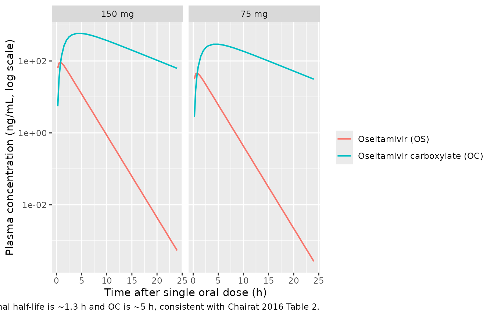
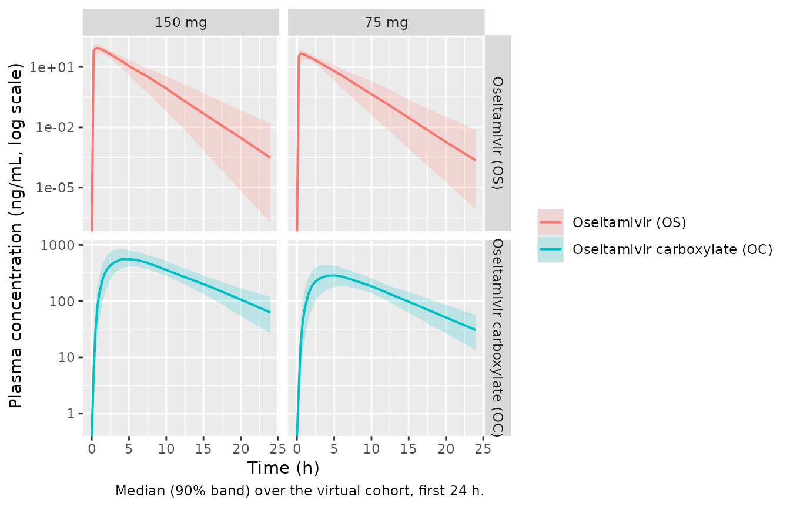

# Oseltamivir (Chairat 2016)

## Model and source

- Citation: Chairat K, Jittamala P, Hanpithakpong W, Day NPJ, White NJ,
  Pukrittayakamee S, Tarning J. Population pharmacokinetics of
  oseltamivir and oseltamivir carboxylate in obese and non-obese
  volunteers. Br J Clin Pharmacol. 2016;81(6):1103-1112.
  <doi:10.1111/bcp.12892>
- Article: <https://doi.org/10.1111/bcp.12892>

The packaged model `Chairat_2016_oseltamivir` jointly describes oral
oseltamivir (parent, OS) and its active antiviral metabolite oseltamivir
carboxylate (OC). Each analyte is described by a one-compartment
disposition model; the carboxylate appearance is delayed through a
single intermediate “metabolism” compartment whose first-order rate
constant `km` governs OC formation. The relative oral bioavailability F
is fixed to unity (so the apparent CL/F and V/F estimates fold absolute
bioavailability into the population estimates). Creatinine clearance
computed using fat-free mass (`CLCR(FFM)`) is the only formally retained
covariate; it enters CL/FOC as a linear effect centred at the population
median `CLCR(FFM) = 73 mL/min`.

## Population

Chairat 2016 enrolled 24 healthy adult Thai volunteers in an open-label
randomised crossover PK study at the Hospital for Tropical Diseases
(Bangkok). Twelve subjects were obese (BMI \>= 30 kg/m^2; median BMI
33.8, range 30.8-43.2) and twelve were non-obese (BMI \< 30; median
22.2, range 18.8-24.2). Each subject received a single oral 75 mg and
150 mg oseltamivir dose (fasted) in a random sequence, separated by a
7-day washout. Plasma was sampled at pre-dose and 0.5, 1, 1.5, 2, 3, 4,
5, 6, 7, 8, 10, 12 and 24 h post-dose. Across the 624 plasma samples
analysed, 103 (16.5%) parent and 15 (2.4%) carboxylate concentrations
were below the LLOQ (1 ng/mL OS, 10 ng/mL OC); the M3 method was
evaluated and found comparable with omitted-LLOQ data, which was the
strategy carried forward in the final model. Detailed demographic data
are reported in the companion paper Jittamala et al. 2014 (AAC
58:1615-1621). The study was registered as ClinicalTrials.gov
NCT01049763.

The same demographic facts are available programmatically via
`readModelDb("Chairat_2016_oseltamivir")()$population`.

## Source trace

The per-parameter origin is recorded as an in-file comment next to each
`ini()` entry in
`inst/modeldb/specificDrugs/Chairat_2016_oseltamivir.R`. The table below
collects the parameter values in one place for review.

| Equation / parameter | Value | Source location |
|----|----|----|
| Structural: depot -\> central (OS, 1-cmt) | n/a | Chairat 2016 Figure 1 + Results paragraph 1 |
| Structural: central -\> metabolism -\> central_oc (OC, 1-cmt) | n/a | Chairat 2016 Figure 1 |
| `ka` (absorption rate) | 2.81 1/h | Chairat 2016 Table 1 |
| `CL/FOS` (apparent OS clearance) | 585 L/h | Chairat 2016 Table 1 |
| `V/FOS` (apparent OS volume) | 1110 L | Chairat 2016 Table 1 |
| `km` (OC formation rate) | 2.13 1/h | Chairat 2016 Table 1 |
| `CL/FOC` (apparent OC clearance) | 20.6 L/h | Chairat 2016 Table 1 |
| `V/FOC` (apparent OC volume) | 159 L | Chairat 2016 Table 1 |
| `F` (relative bioavailability) | 1.0 (fixed) | Chairat 2016 Table 1 |
| Covariate effect: CLCR(FFM) on CL/FOC | +3.84% per 10 mL/min, centred 73 mL/min | Chairat 2016 Table 1 + Eq. 11 |
| BSV(F) | 17.6% CV | Chairat 2016 Table 1 |
| BSV(CL/FOS) | 16.6% CV | Chairat 2016 Table 1 |
| BSV(V/FOC) | 18.7% CV | Chairat 2016 Table 1 |
| IOV(ka) | 98.7% CV (IOV) | Chairat 2016 Table 1; encoded as IIV in the packaged model (see deviations) |
| IOV(V/FOS) | 18.6% CV (IOV) | Chairat 2016 Table 1; encoded as IIV in the packaged model |
| IOV(km) | 43.2% CV (IOV) | Chairat 2016 Table 1; encoded as IIV in the packaged model |
| Additive residual on log(OS) | 0.431 | Chairat 2016 Table 1 (encoded as ~ lnorm(expSd)) |
| Additive residual on log(OC) | 0.161 | Chairat 2016 Table 1 (encoded as ~ lnorm(expSd_oc)) |

%CV is mapped to the model’s log-normal variance via
`omega^2 = log(1 + CV^2)`, matching the NONMEM footnote in Table 1.

## Virtual cohort

The 24-subject Chairat 2016 dataset is not publicly released. The cohort
below is generated with `CLCR(FFM)` distributions that span the observed
range (48-114 mL/min, per the Discussion paragraph on renal impairment
extrapolation) and a population median at 73 mL/min (the centering value
in Equation 11).

``` r

set.seed(20260619)

N_PER_GROUP <- 100L

# Helper: build one cohort as a self-contained event table. id_offset
# shifts subject IDs so multiple cohorts can be bind_rows()-ed without
# colliding.
make_cohort <- function(n, dose_mg, treatment, id_offset = 0L) {
  # CLCR(FFM) drawn from a truncated normal centred at the population
  # median (73 mL/min) with SD broad enough to span the published cohort
  # range (48-114 mL/min). Bounds applied with pmax / pmin.
  crcl <- pmax(45, pmin(120, round(rnorm(n, mean = 73, sd = 18), 1)))
  id   <- id_offset + seq_len(n)

  # One oral dose at t = 0.
  dose <- tibble::tibble(
    id   = id,
    time = 0,
    evid = 1L,
    amt  = dose_mg,
    cmt  = "depot"
  )

  # Observation grid matching the Chairat 2016 sampling schedule (dense
  # over the absorption and early-distribution phases, then 10, 12, 24 h)
  # extended out to 36 h so the OC terminal phase is well characterised.
  obs_times <- c(0, 0.25, 0.5, 0.75, 1, 1.5, 2, 2.5, 3, 4, 5, 6, 7, 8,
                 10, 12, 16, 20, 24, 30, 36)
  obs <- tidyr::expand_grid(id = id, time = obs_times) |>
    dplyr::mutate(
      evid = 0L,
      amt  = NA_real_,
      # cmt = "Cc" picks the parent oseltamivir observation slot; the
      # metabolite Cc_oc lands in the same output dataframe as a column.
      # For this multi-output rxUi model rxode2 requires the cmt to point
      # at one of the modeled observation slots (Cc or Cc_oc), not at an
      # ODE state (depot / central / metabolism / central_oc).
      cmt  = "Cc"
    )

  covars <- tibble::tibble(id = id, CRCL = crcl, treatment = treatment)
  dplyr::bind_rows(dose, obs) |>
    dplyr::left_join(covars, by = "id") |>
    dplyr::arrange(id, time, dplyr::desc(evid))
}

events <- dplyr::bind_rows(
  make_cohort(N_PER_GROUP, dose_mg = 75,  treatment = "75 mg",  id_offset =    0L),
  make_cohort(N_PER_GROUP, dose_mg = 150, treatment = "150 mg", id_offset = 1000L)
)

stopifnot(!anyDuplicated(unique(events[, c("id", "time", "evid")])))
```

## Simulation

``` r

mod <- readModelDb("Chairat_2016_oseltamivir")

# Stochastic simulation over the virtual cohort. Carry the treatment and
# CRCL columns through via keep so they land aligned per row in the
# rxSolve output.  works around rxode2's automatic
# ODE -> linCmt conversion, which corrupts the dvid -> cmt mapping for
# multi-output models like this parent + metabolite system (see the
# known-vignette-failure-patterns.md pattern #5b reference).
sim <- rxode2::rxSolve(mod, events = events,
                       keep = c("treatment", "CRCL")
                       ) |>
  as.data.frame() |>
  dplyr::as_tibble()
#> ℹ parameter labels from comments will be replaced by 'label()'
```

For deterministic replication (typical-value profile) zero out the
random effects and simulate a single subject per dose group at the
population median CLCR(FFM):

``` r

typical_events <- dplyr::bind_rows(
  tibble::tibble(id = 1L,  time = c(0, 0.25, 0.5, 0.75, 1, 1.5, 2, 2.5, 3, 4, 5, 6, 7, 8, 10, 12, 16, 20, 24, 30, 36),
                  evid = c(1L, rep(0L, 20)),
                  amt  = c(75, rep(NA_real_, 20)),
                  cmt  = c("depot", rep("Cc", 20)),
                  treatment = "75 mg", CRCL = 73),
  tibble::tibble(id = 2L,  time = c(0, 0.25, 0.5, 0.75, 1, 1.5, 2, 2.5, 3, 4, 5, 6, 7, 8, 10, 12, 16, 20, 24, 30, 36),
                  evid = c(1L, rep(0L, 20)),
                  amt  = c(150, rep(NA_real_, 20)),
                  cmt  = c("depot", rep("Cc", 20)),
                  treatment = "150 mg", CRCL = 73)
) |>
  dplyr::arrange(id, time, dplyr::desc(evid))

mod_typical <- mod |> rxode2::zeroRe()
#> ℹ parameter labels from comments will be replaced by 'label()'
sim_typical <- rxode2::rxSolve(mod_typical, events = typical_events,
                                keep = c("treatment", "CRCL")
                                ) |>
  as.data.frame() |>
  dplyr::as_tibble()
#> ℹ omega/sigma items treated as zero: 'etalfdepot', 'etalka', 'etalcl', 'etalvc', 'etalkm', 'etalvc_oc'
#> Warning: multi-subject simulation without without 'omega'
```

## Concentration-time profiles

The typical-value profiles below illustrate the classic flip-flop shape
of the parent-metabolite system: OS peaks within the first hour, OC
peaks around 4-5 h and decays with the terminal slope of CL/FOC / V/FOC.

``` r

sim_typical |>
  dplyr::filter(time <= 24) |>
  tidyr::pivot_longer(c(Cc, Cc_oc), names_to = "analyte", values_to = "conc") |>
  dplyr::mutate(analyte = dplyr::recode(analyte,
                                          Cc = "Oseltamivir (OS)",
                                          Cc_oc = "Oseltamivir carboxylate (OC)")) |>
  ggplot(aes(time, conc, colour = analyte)) +
  geom_line(linewidth = 0.7) +
  facet_wrap(~ treatment) +
  scale_y_log10() +
  labs(x = "Time after single oral dose (h)",
       y = "Plasma concentration (ng/mL, log scale)",
       colour = NULL,
       caption = paste(
         "Chairat 2016 typical-value profiles (CLCR(FFM) = 73 mL/min;",
         "all etas = 0). The OS terminal half-life is ~1.3 h and OC is",
         "~5 h, consistent with Chairat 2016 Table 2."
       ))
```



A median-with-90% band gives a quick VPC-style check of the stochastic
cohort:

``` r

sim |>
  dplyr::filter(time <= 24) |>
  tidyr::pivot_longer(c(Cc, Cc_oc), names_to = "analyte", values_to = "conc") |>
  dplyr::mutate(analyte = dplyr::recode(analyte,
                                          Cc = "Oseltamivir (OS)",
                                          Cc_oc = "Oseltamivir carboxylate (OC)")) |>
  dplyr::group_by(time, treatment, analyte) |>
  dplyr::summarise(
    Q05 = quantile(conc, 0.05, na.rm = TRUE),
    Q50 = quantile(conc, 0.50, na.rm = TRUE),
    Q95 = quantile(conc, 0.95, na.rm = TRUE),
    .groups = "drop"
  ) |>
  ggplot(aes(time, Q50, colour = analyte, fill = analyte)) +
  geom_ribbon(aes(ymin = Q05, ymax = Q95), alpha = 0.20, colour = NA) +
  geom_line(linewidth = 0.7) +
  facet_grid(analyte ~ treatment, scales = "free_y") +
  scale_y_log10() +
  labs(x = "Time (h)", y = "Plasma concentration (ng/mL, log scale)",
       colour = NULL, fill = NULL,
       caption = "Median (90% band) over the virtual cohort, first 24 h.")
#> Warning in scale_y_log10(): log-10 transformation introduced infinite values.
#> log-10 transformation introduced infinite values.
#> log-10 transformation introduced infinite values.
#> log-10 transformation introduced infinite values.
```



## PKNCA validation

Single-dose NCA for the parent and the metabolite, computed per dose
group. PKNCA runs are split per analyte because they share the same dose
records but different concentration columns.

``` r

# Parent (OS) concentration frame: keep the column named Cc until the
# rename inside the PKNCA call. Add a time = 0 row defensively
# (extravascular pre-dose Cc = 0); see pknca-recipes.md.
sim_nca_parent <- sim |>
  dplyr::filter(!is.na(Cc)) |>
  dplyr::select(id, time, Cc, treatment)

sim_nca_parent <- dplyr::bind_rows(
  sim_nca_parent,
  sim_nca_parent |> dplyr::distinct(id, treatment) |>
    dplyr::mutate(time = 0, Cc = 0)
) |>
  dplyr::distinct(id, treatment, time, .keep_all = TRUE) |>
  dplyr::arrange(id, treatment, time)

# Metabolite (OC) concentration frame: same shape with Cc_oc.
sim_nca_oc <- sim |>
  dplyr::filter(!is.na(Cc_oc)) |>
  dplyr::select(id, time, Cc_oc, treatment)

sim_nca_oc <- dplyr::bind_rows(
  sim_nca_oc,
  sim_nca_oc |> dplyr::distinct(id, treatment) |>
    dplyr::mutate(time = 0, Cc_oc = 0)
) |>
  dplyr::distinct(id, treatment, time, .keep_all = TRUE) |>
  dplyr::arrange(id, treatment, time)

dose_df <- events |>
  dplyr::filter(evid == 1) |>
  dplyr::select(id, time, amt, treatment)

conc_obj_parent <- PKNCA::PKNCAconc(sim_nca_parent,
                                     Cc ~ time | treatment + id,
                                     concu = "ng/mL", timeu = "h")
#> Warning in assert_conc(conc, any_missing_conc = any_missing_conc): Negative
#> concentrations found
conc_obj_oc     <- PKNCA::PKNCAconc(sim_nca_oc,
                                     Cc_oc ~ time | treatment + id,
                                     concu = "ng/mL", timeu = "h")
dose_obj <- PKNCA::PKNCAdose(dose_df, amt ~ time | treatment + id,
                             doseu = "mg")

intervals <- data.frame(
  start     = 0,
  end       = 24,
  cmax      = TRUE,
  tmax      = TRUE,
  auclast   = TRUE,
  half.life = TRUE
)

nca_parent <- PKNCA::pk.nca(PKNCA::PKNCAdata(conc_obj_parent, dose_obj,
                                              intervals = intervals))
nca_oc     <- PKNCA::pk.nca(PKNCA::PKNCAdata(conc_obj_oc,     dose_obj,
                                              intervals = intervals))
```

### Comparison against published NCA (Chairat 2016 Table 2)

Chairat 2016 Table 2 reports median NCA secondary parameters separately
for non-obese and obese subjects at each dose. Because the formal final
model (the one packaged here) does NOT retain an obesity covariate – the
full-covariate analysis indicated a small (~25%) effect on CL/FOS and
(~20%) on V/FOS that did not survive backward elimination at P \< 0.001
– the comparison below uses the **non-obese** Table 2 medians as the
reference (CLCR(FFM) in non-obese was closer to the population median
used as the model’s centering value). The corresponding obese-group NCA
values are higher for CL/FOS and V/FOS by the percentages noted in the
source paper and are intentionally NOT matched by the packaged model.

``` r

published_parent <- tibble::tribble(
  ~treatment, ~cmax, ~tmax, ~auclast, ~half.life,
  "75 mg",    45.1,  0.819,      142,       1.42,
  "150 mg",   103,   0.630,      285,       1.27
)

cmp_parent <- nlmixr2lib::ncaComparisonTable(
  simulated = nca_parent,
  reference = published_parent,
  by        = "treatment",
  units     = c(cmax = "ng/mL", auclast = "ng*h/mL",
                tmax = "h",     half.life = "h"),
  tolerance_pct = 20
)

knitr::kable(
  cmp_parent,
  caption = paste(
    "Oseltamivir (OS): simulated vs Chairat 2016 Table 2 non-obese medians.",
    "* differs from reference by >20%."
  ),
  align = c("l", "l", "r", "r", "r")
)
```

| NCA parameter      | treatment | Reference | Simulated | % diff |
|:-------------------|:----------|----------:|----------:|-------:|
| Cmax (ng/mL)       | 75 mg     |      45.1 |      47.6 |  +5.6% |
| Cmax (ng/mL)       | 150 mg    |       103 |      89.4 | -13.2% |
| Tmax (h)           | 75 mg     |     0.819 |      0.75 |  -8.4% |
| Tmax (h)           | 150 mg    |      0.63 |      0.75 | +19.0% |
| AUClast (ng\*h/mL) | 75 mg     |       142 |       123 | -13.5% |
| AUClast (ng\*h/mL) | 150 mg    |       285 |       243 | -14.7% |
| t½ (h)             | 75 mg     |      1.42 |       1.3 |  -8.2% |
| t½ (h)             | 150 mg    |      1.27 |      1.23 |  -3.0% |

Oseltamivir (OS): simulated vs Chairat 2016 Table 2 non-obese medians.
\* differs from reference by \>20%. {.table}

``` r

published_oc <- tibble::tribble(
  ~treatment, ~cmax, ~tmax, ~auclast, ~half.life,
  "75 mg",    266,   4.88,      3160,       5.45,
  "150 mg",   558,   4.47,      6320,       5.45
)

cmp_oc <- nlmixr2lib::ncaComparisonTable(
  simulated = nca_oc,
  reference = published_oc,
  by        = "treatment",
  units     = c(cmax = "ng/mL", auclast = "ng*h/mL",
                tmax = "h",     half.life = "h"),
  tolerance_pct = 20
)

knitr::kable(
  cmp_oc,
  caption = paste(
    "Oseltamivir carboxylate (OC): simulated vs Chairat 2016 Table 2",
    "non-obese medians. * differs from reference by >20%."
  ),
  align = c("l", "l", "r", "r", "r")
)
```

| NCA parameter      | treatment | Reference | Simulated | % diff |
|:-------------------|:----------|----------:|----------:|-------:|
| Cmax (ng/mL)       | 75 mg     |       266 |       288 |  +8.2% |
| Cmax (ng/mL)       | 150 mg    |       558 |       563 |  +0.9% |
| Tmax (h)           | 75 mg     |      4.88 |         5 |  +2.5% |
| Tmax (h)           | 150 mg    |      4.47 |         5 | +11.9% |
| AUClast (ng\*h/mL) | 75 mg     |      3160 |      3310 |  +4.8% |
| AUClast (ng\*h/mL) | 150 mg    |      6320 |      6620 |  +4.8% |
| t½ (h)             | 75 mg     |      5.45 |      5.39 |  -1.2% |
| t½ (h)             | 150 mg    |      5.45 |      5.42 |  -0.6% |

Oseltamivir carboxylate (OC): simulated vs Chairat 2016 Table 2
non-obese medians. \* differs from reference by \>20%. {.table}

## Assumptions and deviations

- **IOV encoded as IIV.** Chairat 2016 Table 1 reports interoccasion
  variability (IOV) on `ka` (98.7% CV), `V/FOS` (18.6% CV), and `km`
  (43.2% CV). rxode2 / nlmixr2 simulation in a popPK validation context
  generally uses a single occasion per subject, so the packaged model
  encodes these components as additional IIV terms (independent
  log-normal `eta`s on each parameter). For simulating a single
  cross-over arm or a single dosing occasion this approximation gives a
  variance magnitude matching the published estimates. A workflow that
  needs explicit occasion-to-occasion variation within a subject (e.g.
  re-fitting the cross-over data) would need to layer additional IOV
  etas keyed on an OCC indicator beyond what is encoded here.

- **Obesity covariate intentionally NOT in the formal model.** The full
  covariate analysis in Chairat 2016 (Results paragraph on Figure 4 and
  Discussion) identified ~25% higher apparent CL/FOS, ~20% higher V/FOS,
  and ~10% higher CL/FOC in obese subjects, but these did NOT survive
  backward elimination at P \< 0.001 due to the small sample size (n =
  24). The packaged model reproduces the formal final model and
  therefore does not include an obesity / BMI / fat-mass effect. The
  Table 2 obese-group NCA medians are correspondingly NOT matched by the
  model; the comparison table above uses the non-obese Table 2 medians,
  whose CLCR(FFM) is closer to the population median (73 mL/min) used
  for the cohort here.

- **CLCR(FFM) reference value.** Chairat 2016 Methods describes
  continuous covariates as “centred on the median value of the
  population” and Equation 11 reads
  `CL/FOC = 20.6 * [1 + 0.0384 * (CLCR(FFM) - 73)/10]`. The 73 mL/min
  centring value is taken from Equation 11 verbatim. The Discussion
  paragraph on renal-impairment extrapolation also references a “normal
  CLCR(FFM) of 75 mL/min” – this is the rounded reference used in the
  dose-impact discussion, not the centring value used in the covariate
  equation.

- **Residual error encoding.** The paper used NONMEM “additive on
  log-transformed concentration” residuals (sd = 0.431 for OS, sd =
  0.161 for OC). This corresponds to a log-normal residual on the
  natural scale and is encoded here via `Cc ~ lnorm(expSd)` and
  `Cc_oc ~ lnorm(expSd_oc)`.

- **Concentration units.** The paper fitted the model in molar units
  (Methods paragraph 1 - concentrations were converted to equivalent
  molar concentrations and natural-log transformed before fitting). The
  reported parameter table (Table 1) is dimensionless with respect to
  mass vs molar units (CL/F and V/F have units of L/h and L only). The
  packaged model expresses dose in mg and computes
  `Cc = 1000 * central / vc`, putting concentrations in ng/mL to match
  the reported units of Chairat 2016 Table 2 (Cmax, AUC) directly.

- **Time-zero row added defensively in PKNCA blocks.** The simulation
  grid above already includes `time = 0` (pre-dose, Cc = 0 for the
  extravascular dose), but the `bind_rows()` recipe is kept for
  robustness in case the grid is later modified. PKNCA’s
  `Requesting an AUC range starting (0) before the first measurement`
  warning would otherwise fire once per subject if the grid does not
  carry a time-zero observation.
