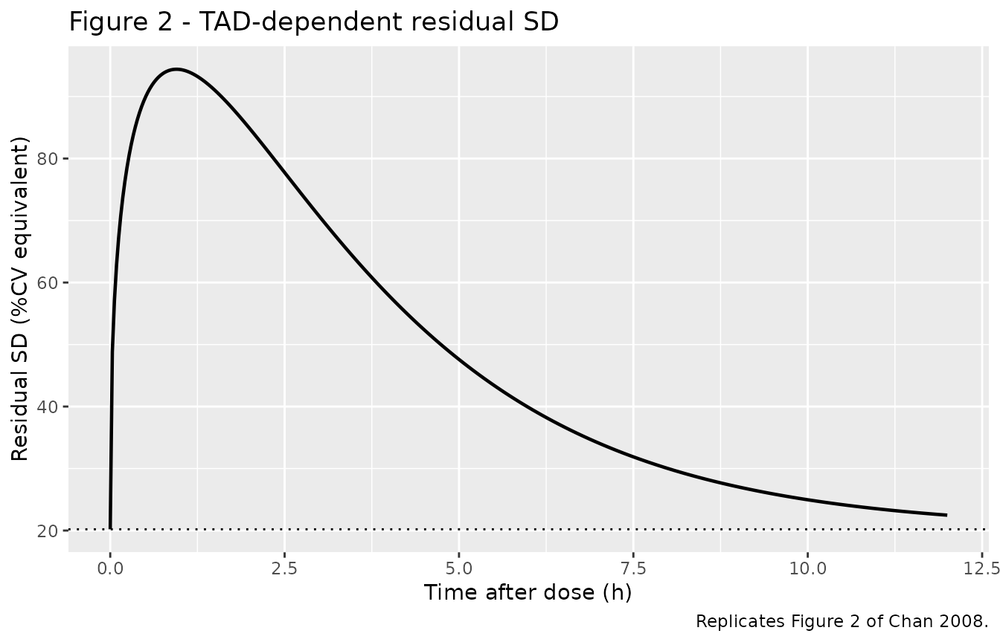
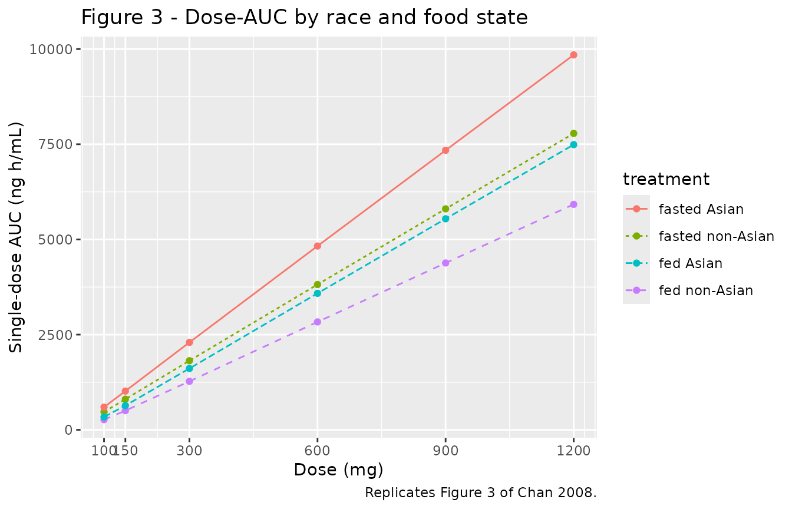
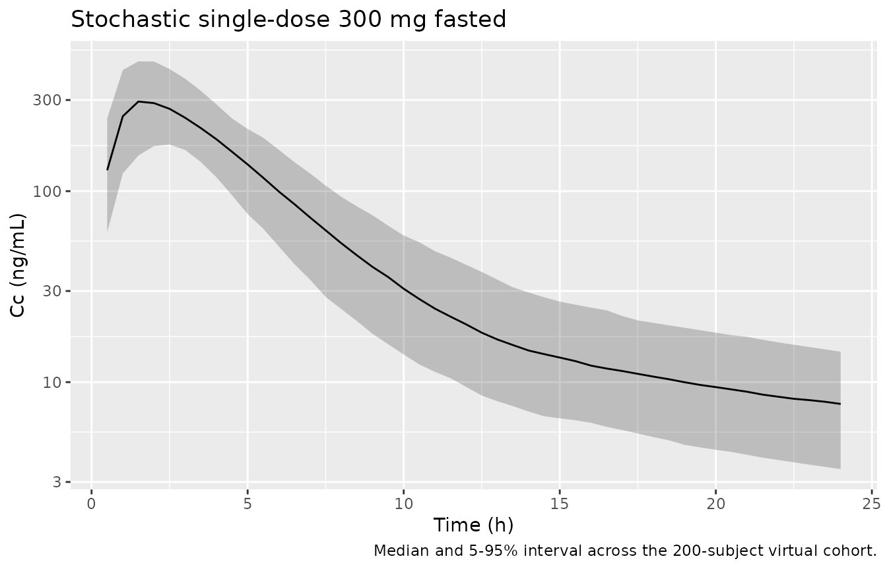

# Maraviroc (Chan 2008)

## Model and source

- Citation: Chan PLS, Weatherley B, McFadyen L. A population
  pharmacokinetic meta-analysis of maraviroc in healthy volunteers and
  asymptomatic HIV-infected subjects. Br J Clin Pharmacol. 2008 Apr;65
  Suppl 1:76-85. <doi:10.1111/j.1365-2125.2008.03139.x>
- Description: Two-compartment population PK meta-analysis model for
  oral maraviroc (CCR5 antagonist) in healthy volunteers and
  asymptomatic HIV-infected adults, with hepatic-extraction-ratio
  parameterisation of clearance, dose-dependent absorption (sigmoid-Emax
  F_ABS and power-function ka), food effect on both, Asian-race
  covariates on hepatic extraction / peripheral volume /
  inter-compartmental clearance, an age effect on Q, and a TAD-dependent
  residual error (Chan 2008)
- Article: <https://doi.org/10.1111/j.1365-2125.2008.03139.x>

## Population

Chan 2008 pooled 17 Pfizer Phase 1 / 2a clinical pharmacology studies of
oral maraviroc (n = 413 subjects; 365 healthy volunteers and 48
asymptomatic HIV-infected subjects). Median age 30 years (range 18-54),
median weight 71 kg (range 46-109), 77% male, 23% Asian (with the
non-Asian reference category pooling White, Black, and Other subjects;
Black subjects were 3.4% of the cohort and the preliminary
Black-vs-non-Asian-reference test was not statistically significant, so
Black was collapsed into the non-Asian reference for the final covariate
model). Doses ranged from 25 to 1200 mg per dose (100-1800 mg/day) and
included single and multiple oral tablet administrations. 6.7% of
concentration-time profiles were taken under fed conditions (tablet
co-administered with a high-fat meal); the remainder were fully fasted
(overnight fast with meals deferred at least 4 h post-dose). Source:
Chan 2008 Tables 1-3 and Results / Data.

The complete population metadata can be recovered programmatically:

``` r

str(readModelDb("Chan_2008_maraviroc")()$population)
#> List of 14
#>  $ species       : chr "human"
#>  $ n_subjects    : int 413
#>  $ n_studies     : int 17
#>  $ age_range     : chr "18-54 years (median 30)"
#>  $ age_median    : chr "30 years"
#>  $ weight_range  : chr "46-109 kg (median 71)"
#>  $ weight_median : chr "71 kg"
#>  $ sex_female_pct: num 23.2
#>  $ race_ethnicity: Named num [1:4] 73.1 23 3.4 0.5
#>   ..- attr(*, "names")= chr [1:4] "White" "Asian" "Black" "Other"
#>  $ disease_state : chr "Pooled healthy volunteers (n = 365, 88.4%) and asymptomatic HIV-infected subjects (n = 48, 11.6%)"
#>  $ dose_range    : chr "Per-dose 25-1200 mg oral tablet; total daily doses 100-1800 mg/day; single- and multiple-dose regimens"
#>  $ regions       : chr "Multi-national; Pfizer Phase 1 and 2a clinical pharmacology studies"
#>  $ n_observations: int 8951
#>  $ notes         : chr "Meta-analysis of 17 Pfizer studies (Chan 2008 Table 1: A4001003 through A4001043). 690 concentration-time profi"| __truncated__
```

## Model structure

Chan 2008 develops a two-compartment disposition model with first-order
absorption and a lag time, parameterised through the hepatic-extraction
ratio so that bioavailability F partitions into an absorption component
F_ABS and a first-pass-loss component F_HEP:

- Eq 1 - 3: $`F = F_{ABS}\cdot F_{HEP}`$; $`CL_H = FQ\cdot E_H`$;
  $`F_{HEP} = 1 - E_H = (FQ - CL_H)/FQ`$. Renal clearance $`CL_R`$ is
  fixed at 12 L/h and hepatic plasma flow $`FQ`$ is fixed at 59.59 L/h.

- Eq 4 (sigmoid Emax F_ABS):
  $`F_{ABS} = ABSE_{max} \cdot Dose^g / (ED_{50}^g + Dose^g)`$, with
  $`ABSE_{max}`$ fixed at 1.

- Eq 5 (dose-dependent ka): $`k_a = k_{a,1mg}\cdot Dose^{\theta_{ka}}`$.

- Eq 6 (food on ka, factorial):
  $`k_a(fed) = k_a(fasted) \cdot \theta_{ka,1}`$.

- Eqs 7-8 (food on F_ABS, multiplicative-exponential):
  $`ABSE_{max}(fed) = 1 \cdot \exp(\theta_{ABSE_{max}})`$ and
  $`ED_{50}(fed) = ED_{50}(fasted) \cdot \exp(\theta_{ED_{50}})`$.

- Eq 9 (IIV on $`E_H`$):
  $`E_{H,i} = (E_H \cdot \exp(\eta_i)/(1-E_H)) / (1 + E_H \cdot \exp(\eta_i)/(1-E_H))`$ -
  equivalent to additive eta on $`\log(E_H/(1-E_H))`$. Stored on the
  logit scale as `logiteh`.

- Eq 12 (TAD-dependent residual):
  $`W(TAD) = P_{max}\cdot A\cdot TAD^P\cdot \exp(-K\cdot TAD) + Base`$,
  with $`P = K\cdot T_{max}`$ and $`A = \exp(P)/T_{max}^P`$. Applied to
  the log-transformed observation as
  $`\ln(Y) = \ln(F) + W(TAD)\cdot\epsilon`$ with $`var(\epsilon) = 1`$,
  which maps to nlmixr2’s `lnorm()` residual structure with a
  time-varying SD.

The retained covariates in the final model (Chan 2008 Results) are:

- Asian race on $`E_H`$ (multiplicative-exponential, -0.0948);
- Asian race on $`V_p`$ (-0.637);
- Asian race on $`CL_{ic}`$ (-0.298);
- Age on $`CL_{ic}`$ (power form, exponent 0.349, reference 30 y).

Weight, sex, and HIV status were screened but did not reach significance
in the final model.

## Source trace

The per-parameter origin is recorded as an in-file comment next to each
`ini()` entry in `inst/modeldb/specificDrugs/Chan_2008_maraviroc.R`. The
table below collects them in one place for review.

| Equation / parameter | Value | Source location |
|----|----|----|
| `logiteh` (logit E_H) | 0.6722 (E_H = 0.662) | Chan 2008 Table 4, “Structural / E_H” row |
| `lvc` (V_c) | log(132) | Chan 2008 Table 4, “Structural / V_c (l)” row |
| `lvp` (V_p) | log(277) | Chan 2008 Table 4, “Structural / V_p (l)” row (non-Asian reference) |
| `lq` (CL_ic) | log(16.4) | Chan 2008 Table 4, “Structural / CL_ic (l h-1)” row |
| `lka` (ka_1mg) | log(0.277) | Chan 2008 Table 4, “Structural / ka (h-1)” row |
| `ltlag` (Tlag) | log(0.198) | Chan 2008 Table 4, “Structural / T_lag” row |
| `led50` (ED50) | log(51.2) | Chan 2008 Table 4, “Structural / ED_50” row |
| `lhill` (g) | log(1.39) | Chan 2008 Table 4, “Structural / g” row |
| `qka` (theta_ka dose exp) | 0.173 | Chan 2008 Table 4, “Structural / q_ka” row |
| `thetaka1` (food on ka) | 0.547 | Chan 2008 Table 4, “Structural / theta_ka,1” row |
| `thetaABSEmax` (food on ABSEmax) | -0.258 | Chan 2008 Table 4, “Structural / theta_ABSE_max” row |
| `thetaED50` (food on ED50) | 0.594 | Chan 2008 Table 4, “Structural / q_ED50” row |
| `e_race_asian_eh` | -0.0948 | Chan 2008 Table 4, “Structural / E_H Race” row |
| `e_race_asian_vp` | -0.637 | Chan 2008 Table 4, “Structural / V_p Race” row |
| `e_race_asian_q` | -0.298 | Chan 2008 Table 4, “Structural / CL_ic Race” row |
| `e_age_q` | 0.349 | Chan 2008 Table 4, “Structural / CL_ic Age” row |
| `absemax` (FIX) | 1 | Chan 2008 Table 4, “Structural / ABSE_max” row (FIX) |
| `fq` (FIX) | 59.59 | Chan 2008 Table 4, “Structural / FQ (l h-1)” row (FIX) |
| `clr` (FIX) | 12 | Chan 2008 Methods, “It was assumed that any interacting antiretroviral would have no effect on renal clearance (CL_R) and so a fixed value of 12 l h-1 was used for renal clearance” |
| `pmax_res` | 0.742 | Chan 2008 Table 4, “Residual error / P_max (%)” row |
| `tmax_res` | 0.950 | Chan 2008 Table 4, “Residual error / T_max (h)” row |
| `k_res` | 0.403 | Chan 2008 Table 4, “Residual error / K” row |
| `base_res` | 0.202 | Chan 2008 Table 4, “Residual error / Base (%)” row |
| `etalogiteh` (IIV E_H) | 0.0603 (back-calc from w\[E_H\] = 8.3% and Table 4 footnote) | Chan 2008 Table 4 + footnote, “Inter-subject variability / w\[E_H\]” |
| `etaled50` (IIV ED50) | 0.347 (= 0.589^2) | Chan 2008 Table 4, “Inter-subject variability / w\[ED_50\]” |
| `etalvc` (IIV V_c) | 0.0132 (= 0.115^2) | Chan 2008 Table 4, “Inter-subject variability / w\[V_c\]” |
| `etalq` (IIV CL_ic) | 0.0930 (= 0.305^2) | Chan 2008 Table 4, “Inter-subject variability / w\[CL_ic\]” |
| `etalka` (IIV ka) | 0.160 (= 0.400^2) | Chan 2008 Table 4, “Inter-subject variability / w\[ka\]” |
| `etalvp` (IIV V_p) | 0.0773 (= 0.278^2) | Chan 2008 Table 4, “Inter-subject variability / w\[V_p\]” |
| Eqs 1-3, 4, 5-6, 7-8, 9, 12 | structure | Chan 2008 Methods, pp. 78-79 |

## Virtual cohort

The Chan 2008 individual-level data are not publicly available. For
replication of Table 5 (typical-individual exposure) the population
covariate values are deterministic: AGE = 30 y (median), RACE_ASIAN in
{0, 1}, FED in {0, 1}, DOSE per the row of interest. For stochastic
checks we build a virtual cohort matching the Chan 2008 demographics
(median AGE 30 y, 23% Asian, 6.7% fed records, 77% male; sex carries no
covariate effect in the final model).

``` r

set.seed(20260613L)
n_sub  <- 200L
asian  <- rbinom(n_sub, 1L, 0.23)
ages   <- pmin(54, pmax(18, round(rnorm(n_sub, mean = 30, sd = 9))))
cohort_tbl <- tibble::tibble(
  id         = seq_len(n_sub),
  AGE        = ages,
  RACE_ASIAN = asian
)
```

## Simulation

The Chan 2008 model uses `tad()` inside its TAD-dependent residual
error. `tad()` is evaluated against the rxode2 event table at solve
time, so single-dose vs multi-dose handling is automatic.

``` r

mod         <- readModelDb("Chan_2008_maraviroc")
mod_typical <- rxode2::zeroRe(mod)
#> ℹ parameter labels from comments will be replaced by 'label()'
#> Warning: No sigma parameters in the model
```

A typical-individual single-dose helper that mirrors a row of Chan 2008
Table 5 (single oral tablet, observation grid out to 240 h, dose-record
DOSE column carried forward to ongoing observation rows):

``` r

sim_typical_row <- function(dose, fed, asian, age = 30,
                            t_obs = seq(0, 240, by = 0.1)) {
  ev <- rxode2::et(amt = dose, cmt = "depot") |>
    rxode2::et(t_obs)
  ev <- as.data.frame(ev)
  ev$DOSE       <- dose
  ev$FED        <- fed
  ev$RACE_ASIAN <- asian
  ev$AGE        <- age
  ev$id         <- 1L
  ev$treatment  <- sprintf("%d mg %s %s",
                           dose,
                           if (fed)   "fed" else "fasted",
                           if (asian) "Asian" else "non-Asian")
  ev
}
```

## Replicate Figure 2 - TAD-dependent residual SD

``` r

# Replicates Chan 2008 Figure 2: the W(TAD) curve at the final-model
# estimates of P_max, T_max, K, Base.
pmax_res <- 0.742; tmax_res <- 0.950; k_res <- 0.403; base_res <- 0.202
ppow  <- k_res * tmax_res
a_res <- exp(ppow) / (tmax_res^ppow)
tad   <- seq(0, 12, length.out = 401)
W     <- pmax_res * a_res * tad^ppow * exp(-k_res * tad) + base_res
ggplot(tibble::tibble(tad = tad, W = W * 100), aes(tad, W)) +
  geom_line(linewidth = 0.8) +
  geom_hline(yintercept = base_res * 100, linetype = "dotted") +
  labs(x = "Time after dose (h)",
       y = "Residual SD (%CV equivalent)",
       title = "Figure 2 - TAD-dependent residual SD",
       caption = "Replicates Figure 2 of Chan 2008.")
```



At TAD = 0.95 h the peak SD is Base + Pmax = 94.4% (paper text: peak
~94%). At TAD = 6 h W is 39.8% and at TAD = 10 h W is 25%, matching the
paper’s “dropped to 40% by about 6 h and to 25% by 10 h after a dose”
exactly.

## Replicate Figure 3 - Dose-AUC curves under fed and fasted conditions for non-Asian and Asian

``` r

# Replicates Figure 3 of Chan 2008: dose-AUC curves for the four
# treatment-by-race combinations at the typical individual (no IIV).
dose_grid <- c(100, 150, 300, 600, 900, 1200)
grid <- expand.grid(dose = dose_grid, fed = 0:1, asian = 0:1,
                    KEEP.OUT.ATTRS = FALSE)
res <- purrr::pmap_dfr(grid, function(dose, fed, asian) {
  ev  <- sim_typical_row(dose = dose, fed = fed, asian = asian)
  sim <- as.data.frame(rxode2::rxSolve(mod_typical, ev))
  d   <- dplyr::filter(sim, time > 0, Cc > 0)
  auc <- with(d, sum(diff(time) * (utils::head(Cc, -1) + utils::tail(Cc, -1)) / 2))
  tibble::tibble(dose = dose, fed = fed, asian = asian, AUC = auc)
})
#> ℹ omega/sigma items treated as zero: 'etalogiteh', 'etaled50', 'etalvc', 'etalq', 'etalka', 'etalvp'
#> ℹ omega/sigma items treated as zero: 'etalogiteh', 'etaled50', 'etalvc', 'etalq', 'etalka', 'etalvp'
#> ℹ omega/sigma items treated as zero: 'etalogiteh', 'etaled50', 'etalvc', 'etalq', 'etalka', 'etalvp'
#> ℹ omega/sigma items treated as zero: 'etalogiteh', 'etaled50', 'etalvc', 'etalq', 'etalka', 'etalvp'
#> ℹ omega/sigma items treated as zero: 'etalogiteh', 'etaled50', 'etalvc', 'etalq', 'etalka', 'etalvp'
#> ℹ omega/sigma items treated as zero: 'etalogiteh', 'etaled50', 'etalvc', 'etalq', 'etalka', 'etalvp'
#> ℹ omega/sigma items treated as zero: 'etalogiteh', 'etaled50', 'etalvc', 'etalq', 'etalka', 'etalvp'
#> ℹ omega/sigma items treated as zero: 'etalogiteh', 'etaled50', 'etalvc', 'etalq', 'etalka', 'etalvp'
#> ℹ omega/sigma items treated as zero: 'etalogiteh', 'etaled50', 'etalvc', 'etalq', 'etalka', 'etalvp'
#> ℹ omega/sigma items treated as zero: 'etalogiteh', 'etaled50', 'etalvc', 'etalq', 'etalka', 'etalvp'
#> ℹ omega/sigma items treated as zero: 'etalogiteh', 'etaled50', 'etalvc', 'etalq', 'etalka', 'etalvp'
#> ℹ omega/sigma items treated as zero: 'etalogiteh', 'etaled50', 'etalvc', 'etalq', 'etalka', 'etalvp'
#> ℹ omega/sigma items treated as zero: 'etalogiteh', 'etaled50', 'etalvc', 'etalq', 'etalka', 'etalvp'
#> ℹ omega/sigma items treated as zero: 'etalogiteh', 'etaled50', 'etalvc', 'etalq', 'etalka', 'etalvp'
#> ℹ omega/sigma items treated as zero: 'etalogiteh', 'etaled50', 'etalvc', 'etalq', 'etalka', 'etalvp'
#> ℹ omega/sigma items treated as zero: 'etalogiteh', 'etaled50', 'etalvc', 'etalq', 'etalka', 'etalvp'
#> ℹ omega/sigma items treated as zero: 'etalogiteh', 'etaled50', 'etalvc', 'etalq', 'etalka', 'etalvp'
#> ℹ omega/sigma items treated as zero: 'etalogiteh', 'etaled50', 'etalvc', 'etalq', 'etalka', 'etalvp'
#> ℹ omega/sigma items treated as zero: 'etalogiteh', 'etaled50', 'etalvc', 'etalq', 'etalka', 'etalvp'
#> ℹ omega/sigma items treated as zero: 'etalogiteh', 'etaled50', 'etalvc', 'etalq', 'etalka', 'etalvp'
#> ℹ omega/sigma items treated as zero: 'etalogiteh', 'etaled50', 'etalvc', 'etalq', 'etalka', 'etalvp'
#> ℹ omega/sigma items treated as zero: 'etalogiteh', 'etaled50', 'etalvc', 'etalq', 'etalka', 'etalvp'
#> ℹ omega/sigma items treated as zero: 'etalogiteh', 'etaled50', 'etalvc', 'etalq', 'etalka', 'etalvp'
#> ℹ omega/sigma items treated as zero: 'etalogiteh', 'etaled50', 'etalvc', 'etalq', 'etalka', 'etalvp'
res$treatment <- sprintf("%s %s",
                         ifelse(res$fed,   "fed",   "fasted"),
                         ifelse(res$asian, "Asian", "non-Asian"))
ggplot(res, aes(dose, AUC, colour = treatment, linetype = treatment)) +
  geom_line() + geom_point() +
  scale_x_continuous(breaks = dose_grid) +
  labs(x = "Dose (mg)", y = "Single-dose AUC (ng h/mL)",
       title = "Figure 3 - Dose-AUC by race and food state",
       caption = "Replicates Figure 3 of Chan 2008.")
```



## PKNCA validation

The Chan 2008 Table 5 lists single-dose AUC at the typical-individual
covariate set across dose, food state, and race. Use PKNCA to compute
AUC, Cmax, and Tmax per treatment cohort from the simulated curves.

``` r

treatments <- tibble::tribble(
  ~dose, ~fed, ~asian, ~treatment_id,
   100L, 0L,   0L,     "100 mg fasted non-Asian",
   150L, 0L,   0L,     "150 mg fasted non-Asian",
   300L, 0L,   0L,     "300 mg fasted non-Asian",
   600L, 0L,   0L,     "600 mg fasted non-Asian",
   900L, 0L,   0L,     "900 mg fasted non-Asian",
  1200L, 0L,   0L,    "1200 mg fasted non-Asian",
   100L, 1L,   0L,     "100 mg fed non-Asian",
   300L, 1L,   0L,     "300 mg fed non-Asian",
   600L, 1L,   0L,     "600 mg fed non-Asian",
   100L, 0L,   1L,     "100 mg fasted Asian",
   300L, 0L,   1L,     "300 mg fasted Asian",
   600L, 0L,   1L,     "600 mg fasted Asian"
)

events <- purrr::pmap_dfr(
  list(treatments$dose, treatments$fed, treatments$asian,
       seq_len(nrow(treatments))),
  function(dose, fed, asian, row_id) {
    ev <- sim_typical_row(dose = dose, fed = fed, asian = asian)
    ev$id        <- row_id
    ev$treatment <- treatments$treatment_id[row_id]
    ev
  }
)

sim <- as.data.frame(
  rxode2::rxSolve(mod_typical, events,
                  keep = c("treatment", "DOSE", "FED", "RACE_ASIAN", "AGE"))
)
#> ℹ omega/sigma items treated as zero: 'etalogiteh', 'etaled50', 'etalvc', 'etalq', 'etalka', 'etalvp'
#> Warning: multi-subject simulation without without 'omega'

sim_nca <- sim |>
  dplyr::filter(!is.na(Cc)) |>
  dplyr::select(id, time, Cc, treatment)

sim_nca <- dplyr::bind_rows(
  sim_nca,
  sim_nca |> dplyr::distinct(id, treatment) |>
    dplyr::mutate(time = 0, Cc = 0)
) |>
  dplyr::distinct(id, treatment, time, .keep_all = TRUE) |>
  dplyr::arrange(id, treatment, time)

conc_obj <- PKNCA::PKNCAconc(sim_nca, Cc ~ time | treatment + id,
                             concu = "ng/mL", timeu = "h")

dose_df <- events |>
  dplyr::filter(evid == 1) |>
  dplyr::select(id, time, amt, treatment)

dose_obj <- PKNCA::PKNCAdose(dose_df, amt ~ time | treatment + id,
                             doseu = "mg")

intervals <- data.frame(
  start       = 0,
  end         = Inf,
  cmax        = TRUE,
  tmax        = TRUE,
  aucinf.obs  = TRUE,
  half.life   = TRUE
)

nca_res <- PKNCA::pk.nca(
  PKNCA::PKNCAdata(conc_obj, dose_obj, intervals = intervals)
)
```

### Comparison against Chan 2008 Table 5

The Chan 2008 Table 5 reports F_HEP, F_ABS, F, ka, and AUC at the
typical individual for each (dose, food, race) cell. The simulated
typical-individual NCA below should reproduce the AUC column exactly
(within trapezoidal-truncation rounding).

``` r

published <- tibble::tribble(
  ~treatment,                 ~aucinf.obs, ~cmax,
  "100 mg fasted non-Asian",   471,         NA_real_,
  "150 mg fasted non-Asian",   805,         NA_real_,
  "300 mg fasted non-Asian",  1815,         NA_real_,
  "600 mg fasted non-Asian",  3817,         NA_real_,
  "900 mg fasted non-Asian",  5805,         NA_real_,
  "1200 mg fasted non-Asian", 7787,         NA_real_,
  "100 mg fed non-Asian",      267,         NA_real_,
  "300 mg fed non-Asian",     1274,         NA_real_,
  "600 mg fed non-Asian",     2834,         NA_real_,
  "100 mg fasted Asian",       596,         NA_real_,
  "300 mg fasted Asian",      2296,         NA_real_,
  "600 mg fasted Asian",      4828,         NA_real_
)

cmp <- nlmixr2lib::ncaComparisonTable(
  simulated     = nca_res,
  reference     = published,
  by            = "treatment",
  units         = c(cmax = "ng/mL", aucinf.obs = "ng*h/mL",
                    tmax = "h", half.life = "h"),
  tolerance_pct = 20
)

knitr::kable(
  cmp,
  caption = "Simulated typical-individual single-dose NCA vs Chan 2008 Table 5 published AUC. * differs from reference by >20%.",
  align   = c("l", "l", "r", "r", "r", "r", "r", "r")
)
```

| NCA parameter           | treatment                | Reference | Simulated | % diff |
|:------------------------|:-------------------------|----------:|----------:|-------:|
| Cmax (ng/mL)            | 100 mg fasted non-Asian  |         — |        74 |      — |
| Cmax (ng/mL)            | 150 mg fasted non-Asian  |         — |       131 |      — |
| Cmax (ng/mL)            | 300 mg fasted non-Asian  |         — |       311 |      — |
| Cmax (ng/mL)            | 600 mg fasted non-Asian  |         — |       688 |      — |
| Cmax (ng/mL)            | 900 mg fasted non-Asian  |         — |      1080 |      — |
| Cmax (ng/mL)            | 1200 mg fasted non-Asian |         — |      1470 |      — |
| Cmax (ng/mL)            | 100 mg fed non-Asian     |         — |      30.8 |      — |
| Cmax (ng/mL)            | 300 mg fed non-Asian     |         — |       163 |      — |
| Cmax (ng/mL)            | 600 mg fed non-Asian     |         — |       386 |      — |
| Cmax (ng/mL)            | 100 mg fasted Asian      |         — |      92.3 |      — |
| Cmax (ng/mL)            | 300 mg fasted Asian      |         — |       386 |      — |
| Cmax (ng/mL)            | 600 mg fasted Asian      |         — |       851 |      — |
| AUC0-∞ (obs) (ng\*h/mL) | 100 mg fasted non-Asian  |       471 |       471 |  +0.0% |
| AUC0-∞ (obs) (ng\*h/mL) | 150 mg fasted non-Asian  |       805 |       805 |  -0.0% |
| AUC0-∞ (obs) (ng\*h/mL) | 300 mg fasted non-Asian  |      1820 |      1810 |  -0.0% |
| AUC0-∞ (obs) (ng\*h/mL) | 600 mg fasted non-Asian  |      3820 |      3820 |  -0.0% |
| AUC0-∞ (obs) (ng\*h/mL) | 900 mg fasted non-Asian  |      5800 |      5800 |  -0.0% |
| AUC0-∞ (obs) (ng\*h/mL) | 1200 mg fasted non-Asian |      7790 |      7780 |  -0.0% |
| AUC0-∞ (obs) (ng\*h/mL) | 100 mg fed non-Asian     |       267 |       267 |  +0.0% |
| AUC0-∞ (obs) (ng\*h/mL) | 300 mg fed non-Asian     |      1270 |      1270 |  -0.0% |
| AUC0-∞ (obs) (ng\*h/mL) | 600 mg fed non-Asian     |      2830 |      2830 |  -0.0% |
| AUC0-∞ (obs) (ng\*h/mL) | 100 mg fasted Asian      |       596 |       596 |  -0.0% |
| AUC0-∞ (obs) (ng\*h/mL) | 300 mg fasted Asian      |      2300 |      2300 |  -0.0% |
| AUC0-∞ (obs) (ng\*h/mL) | 600 mg fasted Asian      |      4830 |      4830 |  -0.0% |

Simulated typical-individual single-dose NCA vs Chan 2008 Table 5
published AUC. \* differs from reference by \>20%. {.table
style="width:100%;"}

The published Cmax is not tabulated in Chan 2008 (the paper reports
text-level summaries: “Cmax was observed approximately 3 h (range
1.8-4.25 h) postdose and the elimination half-life ranged from 11.5 to
23.9 h” - Chan 2008 page 77); the table above leaves Cmax / Tmax /
half-life as simulated-only columns. The terminal half-life for the
fasted non-Asian typical individual is reported as 15.9 h in Chan 2008
Results - the simulated NCA half-life should land in that neighbourhood.

## Stochastic VPC at 300 mg fasted

The TAD-dependent residual SD is applied via `lnorm()`. For a small
stochastic check, simulate the cohort built above with all IIV and
residual error active at 300 mg fasted, and inspect the median + 90%
interval.

``` r

ev_vpc <- cohort_tbl |>
  dplyr::cross_join(tibble::tibble(time = seq(0, 24, by = 0.5)))
ev_vpc <- dplyr::bind_rows(
  cohort_tbl |>
    dplyr::mutate(time = 0, amt = 300, cmt = "depot", evid = 1L),
  ev_vpc |> dplyr::mutate(amt = 0, cmt = "depot", evid = 0L)
) |>
  dplyr::arrange(id, time, dplyr::desc(evid)) |>
  dplyr::mutate(DOSE = 300, FED = 0L) |>
  as.data.frame()

sim_vpc <- as.data.frame(rxode2::rxSolve(mod, ev_vpc))
#> ℹ parameter labels from comments will be replaced by 'label()'
sim_vpc |>
  dplyr::filter(time > 0) |>
  dplyr::group_by(time) |>
  dplyr::summarise(
    Q05 = quantile(Cc, 0.05, na.rm = TRUE),
    Q50 = quantile(Cc, 0.50, na.rm = TRUE),
    Q95 = quantile(Cc, 0.95, na.rm = TRUE),
    .groups = "drop"
  ) |>
  ggplot(aes(time, Q50)) +
  geom_ribbon(aes(ymin = Q05, ymax = Q95), alpha = 0.25) +
  geom_line() +
  scale_y_log10() +
  labs(x = "Time (h)", y = "Cc (ng/mL)",
       title = "Stochastic single-dose 300 mg fasted",
       caption = "Median and 5-95% interval across the 200-subject virtual cohort.")
```



## Assumptions and deviations

- Chan 2008 Eqs 7-8 are reproduced literally as multiplicative-
  exponential food effects on $`ABSE_{max}`$ and $`ED_{50}`$. The food
  effect on $`k_a`$ (Eq 6) is encoded as `ka * thetaka1^FED` - the
  paper’s “factorial” form - rather than as a third
  multiplicative-exponential term. Both forms give identical numeric
  behaviour at the binary FED indicator.
- Asian-race covariate effects use the multiplicative-exponential form
  `PARAM * exp(theta * RACE_ASIAN)` (verified by back-calculation from
  Chan 2008 Table 5: typical Asian $`E_H`$ = 0.662 \* exp(-0.0948) =
  0.6022, $`F_{HEP}`$ = 0.398 matching Table 5, $`CL`$ = 47.89 L/h
  matching Table 5’s 47.88).
- Age covariate effect on $`CL_{ic}`$ uses the power form
  `(AGE/30)^0.349` (verified by back-calculation from Chan 2008 Results:
  at age 60 the multiplier is 1.274, giving the paper-reported 27.4%
  increase).
- Black race (3.4% of the cohort) is collapsed into the non-Asian
  reference category per the paper’s final covariate model.
- The intersubject variability on $`E_H`$ is encoded on the logit scale
  per the paper’s Eq 9 transformation. The reported `w[E_H] = 8.3%` is
  the paper’s approximate %CV computed as `(1 - E_H) * sqrt(omega^2)`
  (Table 4 footnote); the underlying NONMEM logit-scale omega^2 is
  `(0.083 / (1 - 0.662))^2 = 0.0603`, used directly here.
- The intersubject variability values on $`V_c`$ (`w = 11.5%`, %SE 77.3)
  and ED50 (%SE 32.6 on the variance scale) are imprecisely estimated in
  the paper but are retained here at their reported point values. The
  bootstrap statistics in Chan 2008 Table 4 give comparable central
  tendencies (Vc 8.92%, ED50 61.17%) with wide ranges; users who want
  bootstrap medians instead can
  [`rxode2::rxFixRes()`](https://nlmixr2.github.io/rxode2/reference/rxFixRes.html)
  or override the `iniDf` directly.
- The residual error structure follows Chan 2008 Eq 12 literally,
  applied via nlmixr2’s `lnorm()` because the paper writes
  $`\ln(Y) = \ln(F) + W\cdot\epsilon`$ with $`var(\epsilon) = 1`$. The
  resulting log-scale SD at TAD = 0.95 h is 0.944 (= 94.4% CV
  equivalent); at TAD = 6 h, 0.398; at TAD = 10 h, 0.250. All match the
  paper’s text-level descriptions.
- The model reports concentrations in `ng/mL` (matching the paper’s LLOQ
  = 0.5 ng/mL and Table 5 AUC units `ng h/mL`). Dose is in `mg` and
  volumes in `L`; the model multiplies the dose-mg / volume-L = mg/L
  quantity by 1000 to recover `ng/mL`.
- The DOSE per-record covariate column must be supplied by the user
  carrying the most-recent dose forward by LOCF; the model reads it in
  the dose-dependent $`F_{ABS}`$ and $`k_a`$ expressions. The simulation
  helpers above set DOSE explicitly at each record.
