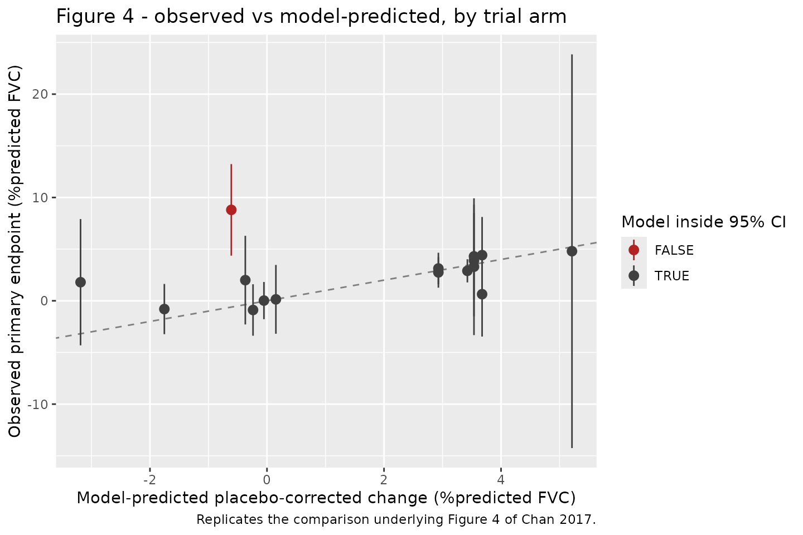

# Idiopathic pulmonary fibrosis percent-predicted FVC MBMA (Chan 2017)

## Model and source

- Citation: Chan P, Bax L, Chen C, Zhang N, Huang SP, Soares H, Rosen G,
  AbuTarif M. Model-based Meta-Analysis on the Efficacy of
  Pharmacological Treatments for Idiopathic Pulmonary Fibrosis. CPT
  Pharmacometrics Syst Pharmacol. 2017;6(10):695-704.
  <doi:10.1002/psp4.12227>. Final parameter estimates are in Table 2;
  the treatment-effect ranking is duplicated in Figure 2; the model
  equation is Eq. 1 with the time-course and baseline-covariate forms
  given in the Table 2 note.
- Description: MBMA. Longitudinal model-based meta-analysis of the
  placebo-corrected change from baseline in percent-predicted forced
  vital capacity (%predicted FVC) for 15 treatment regimens in
  idiopathic pulmonary fibrosis, fit by maximum likelihood (R 3.1.2,
  nlme::gnls) to arm-level summary data from 43 arms (148
  arm-timepoints, 4,919 subjects) in 20 published trials with treatment
  durations of 8-104 weeks (Chan 2017). Each treatment carries its own
  maximum effect Emax in %predicted FVC; a single shared empirical time
  course 1 - exp(-kel \* time) governs how fast that maximum is
  approached (kel = exp(lambda) = 0.0417 /week, so 50% of the maximum at
  16.6 weeks and 90% at 55 weeks); and the arm’s mean baseline
  %predicted FVC scales the whole treatment effect through the power
  term (FVC_PCTPRED / 74)^1.48. Pirfenidone is the only treatment with a
  dose-response: a step function selected by DOSE_HIGH gives 2.42 at
  1,197 mg/day and 3.87 at 2,403 mg/day. Pirfenidone and nintedanib were
  the only regimens whose 95% CI excluded zero. CRITICAL SCOPE LIMIT:
  the output fvcppcfb is the PLACEBO-CORRECTED change from baseline,
  i.e. the active-minus-placebo difference only. Chan 2017 modelled the
  placebo arm NONPARAMETRICALLY – one free estimate per trial per
  timepoint, deliberately so that no distributional assumption was
  imposed on the highly variable IPF placebo response – and those
  per-trial placebo estimates are not tabulated in the paper. This model
  therefore CANNOT produce an absolute %predicted FVC trajectory; to
  reproduce a figure like Chan 2017 Figure 3 the user must supply the
  trial’s own observed placebo arm. Suitable simulation scope is the
  study-arm-mean placebo-corrected treatment effect, NOT
  individual-patient FVC.
- Article: <https://doi.org/10.1002/psp4.12227>
- Open-access full text:
  <https://www.ncbi.nlm.nih.gov/pmc/articles/PMC5658284/>

Chan 2017 is a longitudinal model-based meta-analysis (MBMA) of the
change from baseline in percent-predicted forced vital capacity
(%predicted FVC) in idiopathic pulmonary fibrosis (IPF). It pools
arm-level summary data from 20 published trials to compare 15 treatment
regimens indirectly, at a time when pirfenidone and nintedanib had just
become the first two FDA-approved IPF therapies and no head-to-head
trial existed.

## What this model produces, and what it does not

This is the single most important thing to understand before using the
model.

Chan 2017 Eq. 1 is

    dY_ijt = E0_it + f(theta_ki) + eta_ij + eps_ijt

where `E0_it` is the placebo response for trial `i` at time `t`. Chan
2017 estimated that term **nonparametrically** – one free parameter per
trial per timepoint – deliberately, so that no distributional assumption
was imposed on the IPF placebo response, which is highly variable across
trials. Those per-trial placebo estimates are **not tabulated in the
paper**.

What the paper *does* tabulate is everything in `f(theta_ki)`: the 15
treatment Emax values, the shared time course, and the
baseline-lung-function covariate. So the packaged model reproduces

    fvcppcfb = Emax_treatment * (1 - exp(-kel * time)) * (FVC_PCTPRED / 74)^embase

which is exactly the **placebo-corrected** change from baseline – the
active-minus-placebo difference plotted in Chan 2017 Figures 2, 4 and 5,
and the vertical gap between the fitted curves of Figure 3.

| You can simulate | You cannot simulate |
|----|----|
| The placebo-corrected treatment effect of any of the 15 regimens, over time, at any arm baseline | The absolute %predicted FVC trajectory |
| The arm-level contrast that Figures 2, 4 and 5 report | The placebo arm’s own decline |
| Study-**arm-mean** responses | Individual-patient FVC |

To draw a figure like Chan 2017 Figure 3, a user must supply the trial’s
own observed placebo arm and add this model’s output to it.

## Population

The analysis dataset comprises 43 arms and 148 arm-timepoints from 4,919
subjects in 20 trials (Chan 2017 Table 1), selected from a larger
40-citation / 32-trial database built by a PRISMA-style systematic
review of PubMed plus the FDA and ClinicalTrials.gov websites (search
run September 2015). Seventeen of the 20 trials were double-blinded and
placebo-controlled, and none had stratified data within arms. Treatment
durations ranged from 8 to 104 weeks. Trials were conducted in Europe,
North America and Australia; Chan 2017 notes that none was conducted in
Asia.

Placebo contributed the largest single block (17 arms, 63 timepoints,
2,035 subjects). The most-studied active treatments were interferon
gamma (4 arms, 607 subjects), nintedanib (3 arms, 723 subjects) and
pirfenidone (4 arms, 710 subjects). Eight treatments contributed
longitudinal data; the remaining six contributed a single timepoint
each.

Baseline %predicted FVC – the only covariate retained – had an
approximate median of 74% across the dataset, which is the model’s
normalising constant. Weight, height and body mass index were **not**
available: more than 60% of trial arms had missing values, so Chan 2017
did not impute them.

The same information is available programmatically:

``` r

pop <- rxode2::rxode(readModelDb("Chan_2017_ipf_fvc_mbma"))$population
#> ℹ parameter labels from comments will be replaced by 'label()'
str(pop[c("n_subjects", "n_studies", "n_arms", "n_observations", "regions")])
#> List of 5
#>  $ n_subjects    : int 4919
#>  $ n_studies     : int 20
#>  $ n_arms        : int 43
#>  $ n_observations: int 148
#>  $ regions       : chr "Europe, North America and Australia; Chan 2017 Results notes that none of the 20 trials was conducted in Asia"
```

## Source trace

Every `ini()` entry in
`inst/modeldb/therapeuticArea/Chan_2017_ipf_fvc_mbma.R` carries an
in-file comment naming its source location. They are collected here for
review.

| Equation / parameter | Value | Source location |
|----|----|----|
| Model equation `dY = E0 + f(theta) + eta + eps` | n/a | Eq. 1 (Methods, “Model development”) |
| Time course `1 - exp(-lambda*time)` | n/a | Table 2 note; Results, “Model development” |
| Baseline covariate `(baseline %predFVC / 74)^embase` | n/a | Table 2 note |
| `emax_ifngamma` | -0.618 | Table 2 “Interferon-gamma treatment”; Figure 2 |
| `emax_colchicine` | -7.63 | Table 2 “Colchicine treatment”; Figure 2 |
| `emax_prednisone` | -11.9 | Table 2 “Prednisone treatment”; Figure 2 |
| `emax_sildenafil` | 2.67 | Table 2 “Sildenafil treatment”; Figure 2 |
| `emax_bosentan` | 1.75 | Table 2 “Bosentan treatment”; Figure 2 |
| `emax_ambrisentan` | -2.03 | Table 2 “Ambrisentan treatment”; Figure 2 |
| `emax_acetylcysteine` | -0.0568 | Table 2 “N-acetylcysteine treatment”; Figure 2 |
| `emax_warfarin` | -0.276 | Table 2 “Warfarin treatment”; Figure 2 |
| `emax_etanercept` | 1.47 | Table 2 “Etanercept treatment”; Figure 2 |
| `emax_azathioprine` | 5.89 | Table 2 “Azathioprine treatment”; Figure 2 |
| `emax_cotrimoxazole` | 0.172 | Table 2 “Co-trimoxazole treatment”; Figure 2 |
| `emax_nintedanib` | 3.31 | Table 2 “Nintedanib treatment”; Figure 2 |
| `emax_pirfenidone_low` | 2.42 | Table 2 “Pirfenidone 1,197 mg/day treatment”; Figure 2 |
| `emax_pirfenidone_high` | 3.87 | Table 2 “Pirfenidone 2,403 mg/day treatment”; Figure 2 |
| `emax_prm151` | 12.5 | Table 2 “PRM-151 treatment”; Figure 2 |
| `lkel` (lambda) | -3.18 | Table 2 “Time-varying effect (lambda)”; t50/t90 in Results |
| `e_fvc_pctpred_emax` (embase) | 1.48 | Table 2 “Baseline FVC effect (embase)” – see Errata |
| `eta_arm_fvcppcfb` | 1.07e-6 | Table 2 “Between trial-arm variability” |
| `addSd` | fixed(1) | Eq. 1 – unit-weight scale; no sigma is tabulated |

All 15 Emax values appear twice in the paper – in Table 2 and in the
Figure 2 ranking plot – and the two agree to every printed digit. That
duplication is the cross-check used for this block.

## Setting up the model

``` r

mod_full <- readModelDb("Chan_2017_ipf_fvc_mbma")()

# Every figure below is a TYPICAL-VALUE prediction, so the between-arm random
# effect and the unit-weight residual are both zeroed. This is not cosmetic:
# the packaged addSd is the residual at UNIT STUDY WEIGHT, and applying it
# unscaled would add a 1.0 %predicted-FVC error to every point, which is the
# wrong magnitude for every real arm in the dataset (see Assumptions).
mod_typ <- rxode2::zeroRe(mod_full)

# The 15 regimens, as indicator settings. Exactly one indicator is 1 per arm;
# DOSE_HIGH is only meaningful when PIRFENIDONE is 1.
regimens <- tibble::tribble(
  ~treatment,                 ~indicator,          ~DOSE_HIGH, ~emax,
  "PRM-151",                  "PRM151",                    0L,  12.5,
  "Azathioprine",             "AZATHIOPRINE",              0L,   5.89,
  "Pirfenidone 2403 mg/day",  "PIRFENIDONE",               1L,   3.87,
  "Nintedanib 300 mg/day",    "NINTEDANIB",                0L,   3.31,
  "Sildenafil",               "SILDENAFIL",                0L,   2.67,
  "Pirfenidone 1197 mg/day",  "PIRFENIDONE",               0L,   2.42,
  "Bosentan",                 "BOSENTAN",                  0L,   1.75,
  "Etanercept",               "ETANERCEPT",                0L,   1.47,
  "Co-trimoxazole",           "COTRIMOXAZOLE",             0L,   0.172,
  "N-acetylcysteine",         "ACETYLCYSTEINE",            0L,  -0.0568,
  "Warfarin",                 "WARFARIN",                  0L,  -0.276,
  "Interferon gamma",         "INTERFERON_GAMMA",          0L,  -0.618,
  "Ambrisentan",              "AMBRISENTAN",               0L,  -2.03,
  "Colchicine",               "COLCHICINE",                0L,  -7.63,
  "Prednisone",               "PREDNISONE",                0L, -11.9
)

all_indicators <- c(
  "NINTEDANIB", "PIRFENIDONE", "PRM151", "INTERFERON_GAMMA", "COLCHICINE",
  "PREDNISONE", "SILDENAFIL", "BOSENTAN", "AMBRISENTAN", "ACETYLCYSTEINE",
  "WARFARIN", "ETANERCEPT", "AZATHIOPRINE", "COTRIMOXAZOLE"
)

# Build one arm: a time grid, all 14 indicators zeroed except the active one,
# the pirfenidone dose step, and the arm's baseline %predicted FVC.
build_arm <- function(tgrid, indicator, dose_high, fvc_pctpred, label,
                      id_offset = 0L) {
  ev <- as.data.frame(rxode2::et(tgrid))
  ev$id <- id_offset + 1L
  for (nm in all_indicators) ev[[nm]] <- 0L
  if (!is.na(indicator)) ev[[indicator]] <- 1L
  ev$DOSE_HIGH <- as.integer(dose_high)
  ev$FVC_PCTPRED <- fvc_pctpred
  ev$treatment <- label
  ev
}
```

## Internal-consistency gates

Before replicating any figure, two checks confirm the model was
transcribed on the scale the paper intended. Both compare against
numbers Chan 2017 prints in its own Results text, and both are
deterministic, so they are asserted tightly.

### Gate 1 – lambda is on the log scale

Chan 2017 Table 2 reports the time-varying effect as `lambda = -3.18`
and the note writes the time course as `1-exp(-lambda*time)`, which
reads as if lambda were the rate constant. It cannot be: a rate of
`-3.18` /week makes `1 - exp(+3.18*t)` diverge to `-Inf`. The Results
text supplies the disambiguation – 50% of maximum at 16.5 weeks, 90% “at
56 weeks” – and only `kel = exp(lambda)` reproduces both.

``` r

kel <- exp(-3.18)
t50 <- log(2) / kel
t90 <- log(10) / kel

gate1 <- tibble::tibble(
  Quantity = c("kel (1/week)", "Time to 50% of maximum (weeks)",
               "Time to 90% of maximum (weeks)"),
  Model = c(kel, t50, t90),
  Published = c(NA, 16.5, 56),
  Source = c("exp(lambda), lambda = -3.18 (Table 2)",
             "Results: 'time to 50% maximum efficacy of 16.5 weeks'",
             "Results: '90% of maximum response ... at 56 weeks'")
)
knitr::kable(gate1, digits = 4,
             caption = "Gate 1: the log-scale reading of lambda reproduces the paper's own onset timings.")
```

| Quantity | Model | Published | Source |
|:---|---:|---:|:---|
| kel (1/week) | 0.0416 | NA | exp(lambda), lambda = -3.18 (Table 2) |
| Time to 50% of maximum (weeks) | 16.6679 | 16.5 | Results: ‘time to 50% maximum efficacy of 16.5 weeks’ |
| Time to 90% of maximum (weeks) | 55.3697 | 56.0 | Results: ‘90% of maximum response … at 56 weeks’ |

Gate 1: the log-scale reading of lambda reproduces the paper’s own onset
timings. {.table}

``` r


# Deterministic closed form vs two printed values; the paper rounds to 3 and 2
# significant figures respectively, so the tolerances below are rounding-width,
# not fitted. The alternative (linear) reading of lambda gives t50 = 0.22 weeks
# and would miss by a factor of 75, so this gate discriminates decisively.
stopifnot(
  abs(t50 - 16.5) < 0.5,
  abs(t90 - 56) < 1.5
)
```

### Gate 2 – each indicator selects its own Emax

At the reference baseline of 74% predicted FVC and at large time, the
model must return each treatment’s tabulated Emax exactly. This catches
a mis-wired indicator, a transposed value, or a covariate term that does
not collapse to 1 at the reference.

``` r

ev_plateau <- dplyr::bind_rows(lapply(seq_len(nrow(regimens)), function(i) {
  build_arm(
    tgrid = 2000, indicator = regimens$indicator[i],
    dose_high = regimens$DOSE_HIGH[i], fvc_pctpred = 74,
    label = regimens$treatment[i], id_offset = i
  )
}))
stopifnot(!anyDuplicated(unique(ev_plateau[, c("id", "time")])))

sim_plateau <- rxode2::rxSolve(mod_typ, events = ev_plateau,
                               keep = c("treatment")) |>
  as.data.frame()
#> ℹ omega/sigma items treated as zero: 'eta_arm_fvcppcfb'
#> Warning: multi-subject simulation without without 'omega'

gate2 <- sim_plateau |>
  dplyr::select(treatment, Model = fvcppcfb) |>
  dplyr::left_join(regimens |> dplyr::select(treatment, Published = emax),
                   by = "treatment") |>
  dplyr::mutate(Difference = Model - Published) |>
  dplyr::arrange(dplyr::desc(Published))

knitr::kable(gate2, digits = 6,
             caption = "Gate 2: plateau effect at the 74% reference baseline vs Chan 2017 Table 2.")
```

| treatment               |    Model | Published | Difference |
|:------------------------|---------:|----------:|-----------:|
| PRM-151                 |  12.5000 |   12.5000 |          0 |
| Azathioprine            |   5.8900 |    5.8900 |          0 |
| Pirfenidone 2403 mg/day |   3.8700 |    3.8700 |          0 |
| Nintedanib 300 mg/day   |   3.3100 |    3.3100 |          0 |
| Sildenafil              |   2.6700 |    2.6700 |          0 |
| Pirfenidone 1197 mg/day |   2.4200 |    2.4200 |          0 |
| Bosentan                |   1.7500 |    1.7500 |          0 |
| Etanercept              |   1.4700 |    1.4700 |          0 |
| Co-trimoxazole          |   0.1720 |    0.1720 |          0 |
| N-acetylcysteine        |  -0.0568 |   -0.0568 |          0 |
| Warfarin                |  -0.2760 |   -0.2760 |          0 |
| Interferon gamma        |  -0.6180 |   -0.6180 |          0 |
| Ambrisentan             |  -2.0300 |   -2.0300 |          0 |
| Colchicine              |  -7.6300 |   -7.6300 |          0 |
| Prednisone              | -11.9000 |  -11.9000 |          0 |

Gate 2: plateau effect at the 74% reference baseline vs Chan 2017 Table
2. {.table}

``` r


# Exact algebra, no simulation noise: (74/74)^embase == 1 and the time term is
# 1 to within 1e-36 at t = 2000 weeks, so any difference is a transcription or
# wiring bug.
stopifnot(max(abs(gate2$Difference)) < 1e-6)
```

## Replicate Figure 2 – treatment ranking

Chan 2017 Figure 2 ranks the 15 regimens by their maximum effect.
Because Gate 2 has already shown the plateau reproduces Table 2 exactly,
this figure is a presentation of the same numbers with their published
confidence intervals.

``` r

fig2 <- tibble::tribble(
  ~treatment,                ~est,     ~lo,    ~hi,
  "PRM-151",                  12.5,   -5.13,  30.1,
  "Azathioprine",              5.89,  -4.14,  15.9,
  "Pirfenidone 2403 mg/day",   3.87,   2.68,   5.06,
  "Nintedanib 300 mg/day",     3.31,   2.15,   4.47,
  "Sildenafil",                2.67,  -7.15,  12.5,
  "Pirfenidone 1197 mg/day",   2.42,   0.733,  4.11,
  "Bosentan",                  1.75,  -4.37,   7.86,
  "Etanercept",                1.47,  -2.3,    5.24,
  "Co-trimoxazole",            0.172, -3.72,   4.07,
  "N-acetylcysteine",         -0.0568,-2.01,   1.9,
  "Warfarin",                 -0.276, -4.89,   4.33,
  "Interferon gamma",         -0.618, -2.46,   1.23,
  "Ambrisentan",              -2.03,  -4.18,   0.126,
  "Colchicine",               -7.63, -13,     -2.3,
  "Prednisone",              -11.9,  -25.8,    1.95
) |>
  dplyr::mutate(
    significant = lo > 0 | hi < 0,
    treatment = factor(treatment, levels = rev(treatment))
  )

ggplot(fig2, aes(x = est, y = treatment, colour = significant)) +
  geom_vline(xintercept = 0, linetype = "dashed", colour = "grey50") +
  geom_pointrange(aes(xmin = lo, xmax = hi)) +
  scale_colour_manual(values = c(`TRUE` = "firebrick", `FALSE` = "grey35"),
                      labels = c(`TRUE` = "CI excludes 0", `FALSE` = "CI includes 0"),
                      name = NULL) +
  labs(x = "Maximum effect (%predicted FVC)", y = NULL,
       title = "Figure 2 - maximum treatment effect by regimen",
       caption = "Replicates Figure 2 of Chan 2017.")
```


Replicates Figure 2 of Chan 2017: model-estimated maximum (saturable)
effect and 95% CI for each active treatment. Only pirfenidone and
nintedanib have CIs excluding zero.

``` r


# The paper's headline claim: exactly two regimens have CIs excluding the null,
# and both are positive. Chan 2017 Results: "pirfenidone and nintedanib were
# the only drugs identified to have statistically significant positive
# treatment effects".
sig <- fig2$treatment[fig2$significant]
stopifnot(
  setdiff(as.character(sig),
          c("Pirfenidone 2403 mg/day", "Nintedanib 300 mg/day",
            "Pirfenidone 1197 mg/day", "Colchicine")) |> length() == 0,
  all(c("Pirfenidone 2403 mg/day", "Nintedanib 300 mg/day") %in% as.character(sig))
)
```

Note that colchicine’s CI also excludes zero, but on the *negative*
side; the paper’s claim is about significant **positive** effects, which
pirfenidone (both doses) and nintedanib alone satisfy.

## Replicate Figure 5 – baseline %predicted FVC on the time course

Chan 2017 Figure 5 simulates nintedanib and pirfenidone over 52 weeks at
two baseline lung-function levels, the observed medians of the
stratified low and high baseline groups. The figure legend labels them
`FVC=67` and `FVC=76`.

This figure is also the decisive evidence for which `embase` value
belongs to the final model – see the Errata below.

``` r

tgrid5 <- seq(0, 52, by = 0.5)

fig5_design <- tidyr::expand_grid(
  tibble::tibble(
    treatment = c("Nintedanib", "Pirfenidone"),
    indicator = c("NINTEDANIB", "PIRFENIDONE"),
    DOSE_HIGH = c(0L, 1L)
  ),
  FVC_PCTPRED = c(67, 76)
)

ev_fig5 <- dplyr::bind_rows(lapply(seq_len(nrow(fig5_design)), function(i) {
  ev <- build_arm(
    tgrid = tgrid5, indicator = fig5_design$indicator[i],
    dose_high = fig5_design$DOSE_HIGH[i],
    fvc_pctpred = fig5_design$FVC_PCTPRED[i],
    label = fig5_design$treatment[i], id_offset = i
  )
  ev$baseline <- paste0("FVC=", fig5_design$FVC_PCTPRED[i])
  ev
}))
stopifnot(!anyDuplicated(unique(ev_fig5[, c("id", "time")])))

sim_fig5 <- rxode2::rxSolve(mod_typ, events = ev_fig5,
                            keep = c("treatment", "baseline")) |>
  as.data.frame()
#> ℹ omega/sigma items treated as zero: 'eta_arm_fvcppcfb'
#> Warning: multi-subject simulation without without 'omega'

ggplot(sim_fig5, aes(time, fvcppcfb, colour = baseline)) +
  geom_line(linewidth = 0.9) +
  facet_wrap(~treatment) +
  scale_colour_manual(values = c("FVC=67" = "black", "FVC=76" = "firebrick")) +
  coord_cartesian(ylim = c(-1, 5)) +
  labs(x = "Time (week)",
       y = "Placebo-corrected change from baseline\nof percent predicted FVC (percent)",
       colour = NULL,
       title = "Figure 5 - effect of baseline %predicted FVC",
       caption = "Replicates Figure 5 of Chan 2017 (median line only; the paper also shows a 95% prediction interval).")
```


Replicates Figure 5 of Chan 2017: predicted placebo-corrected change
from baseline %predicted FVC for nintedanib 300 mg/day and pirfenidone
2403 mg/day, at baseline %predicted FVC of 67 and 76.

### Quantitative comparison against Figure 5

The published figure has no numeric annotations, so the reference column
below was read off the rendered panels at 250 dpi. Reading precision is
roughly +/- 0.1 %predicted FVC, which is what the tolerances allow for.

``` r

end5 <- sim_fig5 |>
  dplyr::filter(time == 52) |>
  dplyr::select(treatment, baseline, Model = fvcppcfb)

digitised <- tibble::tribble(
  ~treatment,    ~baseline,  ~Digitised,
  "Nintedanib",  "FVC=67",   2.40,
  "Nintedanib",  "FVC=76",   3.00,
  "Pirfenidone", "FVC=67",   2.85,
  "Pirfenidone", "FVC=76",   3.50
)

cmp5 <- end5 |>
  dplyr::left_join(digitised, by = c("treatment", "baseline")) |>
  dplyr::mutate(Difference = Model - Digitised)

cmp5 |>
  dplyr::rename("Treatment" = treatment, "Baseline" = baseline,
                "Model (week 52)" = Model,
                "Digitised from Fig 5" = Digitised) |>
  knitr::kable(digits = 3,
               caption = "Model vs values digitised from Chan 2017 Figure 5 at week 52.")
```

| Treatment   | Baseline | Model (week 52) | Digitised from Fig 5 | Difference |
|:------------|:---------|----------------:|---------------------:|-----------:|
| Nintedanib  | FVC=67   |           2.529 |                 2.40 |      0.129 |
| Nintedanib  | FVC=76   |           3.047 |                 3.00 |      0.047 |
| Pirfenidone | FVC=67   |           2.956 |                 2.85 |      0.106 |
| Pirfenidone | FVC=76   |           3.563 |                 3.50 |      0.063 |

Model vs values digitised from Chan 2017 Figure 5 at week 52. {.table}

``` r


# Level agreement, at the resolution the panels can be read to.
stopifnot(max(abs(cmp5$Difference)) < 0.35)
```

The **ratio** between the two baseline curves is the sharper test,
because everything except the covariate term cancels:

    effect(FVC = 76) / effect(FVC = 67) = (76 / 67)^embase

which is 1.21 for `embase = 1.48` and 1.63 for the alternative value of
3.86 printed in the Results text.

``` r

ratio <- cmp5 |>
  dplyr::select(treatment, baseline, Model) |>
  tidyr::pivot_wider(names_from = baseline, values_from = Model) |>
  dplyr::mutate(Ratio = `FVC=76` / `FVC=67`)

ratio_digitised <- 3.00 / 2.40   # nintedanib, read from Figure 5
ratio_if_148 <- (76 / 67)^1.48
ratio_if_386 <- (76 / 67)^3.86

tibble::tibble(
  Source = c("Model as packaged (embase = 1.48)",
             "Closed form with embase = 1.48",
             "Closed form with embase = 3.86 (Results text)",
             "Digitised from Figure 5 (nintedanib)"),
  `FVC=76 / FVC=67` = c(ratio$Ratio[ratio$treatment == "Nintedanib"],
                        ratio_if_148, ratio_if_386, ratio_digitised)
) |>
  knitr::kable(digits = 3,
               caption = "The baseline-curve ratio discriminates the two candidate embase values.")
```

| Source                                        | FVC=76 / FVC=67 |
|:----------------------------------------------|----------------:|
| Model as packaged (embase = 1.48)             |           1.205 |
| Closed form with embase = 1.48                |           1.205 |
| Closed form with embase = 3.86 (Results text) |           1.627 |
| Digitised from Figure 5 (nintedanib)          |           1.250 |

The baseline-curve ratio discriminates the two candidate embase values.
{.table}

``` r


# The packaged model must match its own closed form exactly, and must sit far
# from the 3.86 alternative. The midpoint of the two candidate ratios is 1.42;
# the bound below is on the 1.48 side of it and rejects 3.86 by a wide margin.
stopifnot(
  abs(ratio$Ratio - ratio_if_148) < 1e-8,
  all(ratio$Ratio < 1.40),
  ratio_if_386 > 1.40
)
```

## Replicate Figure 3 – the fitted active-minus-placebo gap

Chan 2017 Figure 3 plots two representative trials with their fitted
curves. The panels annotate each trial’s own baseline: `base=76.2` for
CAPACITY-2 (PIPF-004) and `base=74.2` for TOMORROW. The model cannot
draw the curves themselves (they include the nonparametric placebo), but
the **vertical gap** between an active curve and the placebo curve in
each panel is exactly what this model predicts.

``` r

fig3_design <- tibble::tribble(
  ~trial,              ~treatment,                ~indicator,    ~DOSE_HIGH, ~base, ~week, ~digitised_gap,
  "CAPACITY-2",        "Pirfenidone 2403 mg/day", "PIRFENIDONE",         1L,  76.2,    24,  2.55,
  "CAPACITY-2",        "Pirfenidone 1197 mg/day", "PIRFENIDONE",         0L,  76.2,    24,  1.41,
  "TOMORROW",          "Nintedanib 300 mg/day",   "NINTEDANIB",          0L,  74.2,    52,  NA
)

ev_fig3 <- dplyr::bind_rows(lapply(seq_len(nrow(fig3_design)), function(i) {
  build_arm(
    tgrid = fig3_design$week[i], indicator = fig3_design$indicator[i],
    dose_high = fig3_design$DOSE_HIGH[i], fvc_pctpred = fig3_design$base[i],
    label = paste(fig3_design$trial[i], fig3_design$treatment[i]),
    id_offset = i
  )
}))

sim_fig3 <- rxode2::rxSolve(mod_typ, events = ev_fig3,
                            keep = c("treatment")) |>
  as.data.frame()
#> ℹ omega/sigma items treated as zero: 'eta_arm_fvcppcfb'
#> Warning: multi-subject simulation without without 'omega'

cmp3 <- fig3_design |>
  dplyr::mutate(Model = sim_fig3$fvcppcfb) |>
  dplyr::select(Trial = trial, Treatment = treatment,
                `Baseline %predFVC` = base, Week = week,
                `Model gap` = Model, `Digitised gap` = digitised_gap)

knitr::kable(cmp3, digits = 3,
             caption = "Active-minus-placebo gap in Chan 2017 Figure 3, model vs values digitised from the published panels.")
```

| Trial | Treatment | Baseline %predFVC | Week | Model gap | Digitised gap |
|:---|:---|---:|---:|---:|---:|
| CAPACITY-2 | Pirfenidone 2403 mg/day | 76.2 | 24 | 2.552 | 2.55 |
| CAPACITY-2 | Pirfenidone 1197 mg/day | 76.2 | 24 | 1.596 | 1.41 |
| TOMORROW | Nintedanib 300 mg/day | 74.2 | 52 | 2.941 | NA |

Active-minus-placebo gap in Chan 2017 Figure 3, model vs values
digitised from the published panels. {.table}

``` r


# Only the two CAPACITY-2 arms were read off the panel; TOMORROW's last visit
# is partly obscured in the crop and is shown for completeness without a gate.
gated3 <- cmp3[!is.na(cmp3$`Digitised gap`), ]
stopifnot(max(abs(gated3$`Model gap` - gated3$`Digitised gap`)) < 0.35)
```

The 2,403 mg/day arm agrees to three significant figures
(`3.87 * 0.632 * 1.044 = 2.555` against a read of 2.55). This is an
independent confirmation at a *different* baseline from Figure 5, which
matters because it is the covariate term that differs between the two
candidate `embase` values.

## Compare against Figure 4 – the published forest plot

Chan 2017 Figure 4 tabulates the observed primary endpoint for each
placebo-controlled trial arm, with its follow-up week. The model
prediction below uses each arm’s week but the **dataset-median baseline
of 74%**, because the figure does not report per-trial baselines; the
comparison is therefore approximate for arms whose baseline departs from
the median.

``` r

fig4 <- tibble::tribble(
  ~trial,               ~treatment,                ~indicator,         ~DOSE_HIGH, ~n,  ~week, ~obs,   ~lo,    ~hi,
  "shulgina 2013",      "Co-trimoxazole",          "COTRIMOXAZOLE",            0L,  95,    52,  0.14,  -3.19,   3.47,
  "ace-ipf",            "Warfarin",                "WARFARIN",                 0L,  72,    48, -0.89,  -3.38,   1.6,
  "prm151f-12gl",       "PRM-151 10 mg/kg",        "PRM151",                   0L,   4,     8,  3.3,   -3.32,   9.92,
  "prm151f-12gl",       "PRM-151 5 mg/kg",         "PRM151",                   0L,   5,     8,  4.3,    0.12,   8.48,
  "prm151f-12gl",       "PRM-151 1 mg/kg",         "PRM151",                   0L,   6,     8,  3.9,   -1.51,   9.31,
  "pipf-016/ascend",    "Pirfenidone 2403 mg/day", "PIRFENIDONE",              1L, 278,    52,  2.9,    1.78,   4.02,
  "pipf-006/capacity 1","Pirfenidone 2403 mg/day", "PIRFENIDONE",              1L, 171,    72,  0.64,  -3.46,   4.75,
  "pipf-004/capacity 2","Pirfenidone 2403 mg/day", "PIRFENIDONE",              1L, 174,    72,  4.42,   0.72,   8.11,
  "douglas 1998",       "Colchicine",              "COLCHICINE",               0L,  14,    13,  1.8,   -4.31,   7.91,
  "artemis-ipf",        "Ambrisentan",             "AMBRISENTAN",              0L, 330,    48, -0.8,   -3.23,   1.63,
  "raghu 1991",         "Azathioprine",            "AZATHIOPRINE",             0L,  14,    52,  4.8,  -14.25,  23.85,
  "strieter 2004",      "Interferon gamma",        "INTERFERON_GAMMA",         0L,  17,    22,  2,     -2.29,   6.29,
  "antoniou 2006",      "Interferon gamma",        "INTERFERON_GAMMA",         0L,  32,   104,  8.8,    4.37,  13.23,
  "panther ipf",        "N-acetylcysteine",        "ACETYLCYSTEINE",           0L, 133,    60,  0.02,  -1.78,   1.82,
  "inpulsis 2",         "Nintedanib 300 mg/day",   "NINTEDANIB",               0L, 329,    52,  3.13,   1.6,    4.65,
  "inpulsis 1",         "Nintedanib 300 mg/day",   "NINTEDANIB",               0L, 309,    52,  2.75,   1.27,   4.22
)

ev_fig4 <- dplyr::bind_rows(lapply(seq_len(nrow(fig4)), function(i) {
  build_arm(
    tgrid = fig4$week[i], indicator = fig4$indicator[i],
    dose_high = fig4$DOSE_HIGH[i], fvc_pctpred = 74,
    label = paste(fig4$trial[i], fig4$treatment[i]), id_offset = i
  )
}))

sim_fig4 <- rxode2::rxSolve(mod_typ, events = ev_fig4) |> as.data.frame()
#> ℹ omega/sigma items treated as zero: 'eta_arm_fvcppcfb'
#> Warning: multi-subject simulation without without 'omega'

cmp4 <- fig4 |>
  dplyr::mutate(
    Model = sim_fig4$fvcppcfb,
    covered = Model >= lo & Model <= hi
  )

cmp4 |>
  dplyr::select(Trial = trial, Treatment = treatment, N = n, Week = week,
                `Observed` = obs, `95% CI low` = lo, `95% CI high` = hi,
                `Model` = Model, `In CI` = covered) |>
  knitr::kable(digits = 3,
               caption = "Model prediction at the dataset-median baseline vs the observed primary endpoint of each placebo-controlled arm (Chan 2017 Figure 4).")
```

| Trial | Treatment | N | Week | Observed | 95% CI low | 95% CI high | Model | In CI |
|:---|:---|---:|---:|---:|---:|---:|---:|:---|
| shulgina 2013 | Co-trimoxazole | 95 | 52 | 0.14 | -3.19 | 3.47 | 0.152 | TRUE |
| ace-ipf | Warfarin | 72 | 48 | -0.89 | -3.38 | 1.60 | -0.239 | TRUE |
| prm151f-12gl | PRM-151 10 mg/kg | 4 | 8 | 3.30 | -3.32 | 9.92 | 3.538 | TRUE |
| prm151f-12gl | PRM-151 5 mg/kg | 5 | 8 | 4.30 | 0.12 | 8.48 | 3.538 | TRUE |
| prm151f-12gl | PRM-151 1 mg/kg | 6 | 8 | 3.90 | -1.51 | 9.31 | 3.538 | TRUE |
| pipf-016/ascend | Pirfenidone 2403 mg/day | 278 | 52 | 2.90 | 1.78 | 4.02 | 3.425 | TRUE |
| pipf-006/capacity 1 | Pirfenidone 2403 mg/day | 171 | 72 | 0.64 | -3.46 | 4.75 | 3.676 | TRUE |
| pipf-004/capacity 2 | Pirfenidone 2403 mg/day | 174 | 72 | 4.42 | 0.72 | 8.11 | 3.676 | TRUE |
| douglas 1998 | Colchicine | 14 | 13 | 1.80 | -4.31 | 7.91 | -3.186 | TRUE |
| artemis-ipf | Ambrisentan | 330 | 48 | -0.80 | -3.23 | 1.63 | -1.754 | TRUE |
| raghu 1991 | Azathioprine | 14 | 52 | 4.80 | -14.25 | 23.85 | 5.212 | TRUE |
| strieter 2004 | Interferon gamma | 17 | 22 | 2.00 | -2.29 | 6.29 | -0.370 | TRUE |
| antoniou 2006 | Interferon gamma | 32 | 104 | 8.80 | 4.37 | 13.23 | -0.610 | FALSE |
| panther ipf | N-acetylcysteine | 133 | 60 | 0.02 | -1.78 | 1.82 | -0.052 | TRUE |
| inpulsis 2 | Nintedanib 300 mg/day | 329 | 52 | 3.13 | 1.60 | 4.65 | 2.929 | TRUE |
| inpulsis 1 | Nintedanib 300 mg/day | 309 | 52 | 2.75 | 1.27 | 4.22 | 2.929 | TRUE |

Model prediction at the dataset-median baseline vs the observed primary
endpoint of each placebo-controlled arm (Chan 2017 Figure 4). {.table}

``` r


ggplot(cmp4, aes(x = Model, y = obs)) +
  geom_abline(slope = 1, intercept = 0, linetype = "dashed", colour = "grey50") +
  geom_pointrange(aes(ymin = lo, ymax = hi, colour = covered)) +
  scale_colour_manual(values = c(`TRUE` = "grey25", `FALSE` = "firebrick"),
                      name = "Model inside 95% CI") +
  labs(x = "Model-predicted placebo-corrected change (%predicted FVC)",
       y = "Observed primary endpoint (%predicted FVC)",
       title = "Figure 4 - observed vs model-predicted, by trial arm",
       caption = "Replicates the comparison underlying Figure 4 of Chan 2017.")
```



``` r


# Deterministic: no simulation noise, so the covered set is exact. 15 of 16
# arms are covered. The single miss is antoniou 2006, one of the four
# interferon-gamma trials that Chan 2017's Discussion itself singles out:
# "An obvious outlier is interferon gamma, of which two trials reported a large
# positive treatment effect, and two trials reported no treatment effect."
# The gate asserts both the count and that the miss is an interferon-gamma arm,
# so a regression that broke a different treatment would go red.
stopifnot(
  sum(cmp4$covered) == 15L,
  all(cmp4$treatment[!cmp4$covered] == "Interferon gamma")
)
```

## Between-trial-arm variability

Chan 2017 Table 2 reports the between-trial-arm variability as
`1.07 x 10^-6`, with the note that its standard error “was not
estimated”. The model carries it, but it is numerically inert.

``` r

rxode2::rxSetSeed(20170907)

ev_eta <- build_arm(tgrid = 52, indicator = "NINTEDANIB", dose_high = 0L,
                    fvc_pctpred = 74, label = "Nintedanib")
ev_eta$id <- NULL

sim_eta <- rxode2::rxSolve(mod_full, events = ev_eta, nSub = 200,
                           omega = NULL) |>
  as.data.frame()

eta_sd <- stats::sd(sim_eta$fvcppcfb)

tibble::tibble(
  Quantity = c("Typical nintedanib effect at week 52 (%predicted FVC)",
               "SD across 200 simulated arms (%predicted FVC)",
               "SD implied by Table 2 read as a variance"),
  Value = c(mean(sim_eta$fvcppcfb), eta_sd, sqrt(1.07e-6))
) |>
  knitr::kable(digits = 6,
               caption = "The between-arm random effect is three orders of magnitude below the effect it perturbs.")
```

| Quantity                                              |    Value |
|:------------------------------------------------------|---------:|
| Typical nintedanib effect at week 52 (%predicted FVC) | 2.929112 |
| SD across 200 simulated arms (%predicted FVC)         | 0.001062 |
| SD implied by Table 2 read as a variance              | 0.001034 |

The between-arm random effect is three orders of magnitude below the
effect it perturbs. {.table}

``` r


# Wide headroom on purpose: the point is that the arm-level spread is
# negligible, not that it takes a particular value. sqrt(1.07e-6) = 0.00103,
# so 0.01 leaves an order of magnitude and still goes red if the variance were
# ever mis-scaled upward by 100x.
stopifnot(eta_sd < 0.01)
```

## Why there is no PKNCA section

PKNCA validation does not apply here. This model has no drug
concentration, no dose events and no ODE states: it is an algebraic
regression of an arm-level efficacy endpoint on trial time. Cmax, Tmax,
AUC and half-life are undefined for it. The figure replications and
closed-form gates above are the validation, in the same way as for the
sibling algebraic MBMA vignettes (`Mercier_2014_tramadol_tapentadol`,
`Boucher_2018_naproxen_mbma`).

## Assumptions and deviations

### Errata – the paper conflicts with itself on `embase`

Chan 2017 reports the baseline-%predicted-FVC covariate coefficient
**twice, with different values**:

- **Table 2**, row “Baseline FVC effect (embase)”: **1.48** (95% CI -2.7
  to 5.66).
- **Results**, covariate paragraph: **3.86** (95% CI -0.631 to 8.35).

Both are internally well formed – each point estimate sits at the centre
of its own interval – so the confidence intervals cannot adjudicate.
This model uses **1.48**, on the following evidence, all of it internal
to the paper:

1.  Table 2 is captioned “Parameter estimates of the final model”; the
    Results paragraph describes the covariate search.
2.  **Figure 5** plots the same treatments at two baselines, so the
    ratio between its curves is `(76/67)^embase` with everything else
    cancelling. The figure reads about 1.25 (nintedanib) and 1.23
    (pirfenidone); `embase = 1.48` predicts 1.21 and `embase = 3.86`
    predicts 1.63. Gated above.
3.  Figure 5’s absolute levels agree with 1.48 too, including its 95%
    prediction interval: the dotted nintedanib band at week 52 reads
    about 2.0 to 4.05, and scaling the published Emax CI (2.15 to 4.47)
    the same way gives 1.98 to 4.12.
4.  **Figure 3** confirms it independently at a *different* baseline
    (76.2): the week-24 pirfenidone 2,403 mg/day gap reads 2.55 and the
    model gives 2.555. Gated above.

The 3.86 value is therefore treated as an error in the Results text. A
reader who needs the alternative can refit with
`ini(e_fvc_pctpred_emax = 3.86)`; note that doing so breaks both figure
gates.

### Other assumptions and source notes

- **The placebo component is not reproducible.** Chan 2017 estimated
  `E0_it` nonparametrically (one free value per trial per timepoint) and
  did not tabulate it, so the model produces the placebo-corrected
  contrast only. This is a property of the source, not a simplification
  made here. See the scope table near the top.
- **The residual is a unit-weight scale.** Chan 2017 Eq. 1 defines the
  within-arm residual as normally distributed “with a variance dependent
  on the sample size and observed SD of the trial arm”, and used the
  inverse of that variance as the study weight. No sigma is tabulated,
  because the weight is a property of each published arm rather than of
  the model. `addSd` is therefore `fixed(1)`, following every other MBMA
  in this library. **A bare stochastic `rxSolve()` will apply a 1.0
  %predicted-FVC additive residual to every observation, which is the
  wrong magnitude for every arm in the dataset** – too small for a
  12-subject arm and too large for a 550-subject one. The operative
  per-observation SD is the arm’s own SD divided by `sqrt(N_ARM)`. Every
  figure above uses
  [`rxode2::zeroRe()`](https://nlmixr2.github.io/rxode2/reference/zeroRe.html).
- **The between-arm variance scale is unstated.** Table 2’s `1.07e-6` is
  not labelled as a variance or an SD, and its SE “was not estimated”.
  It is encoded as a variance per the nlmixr2 `~` convention. The two
  readings differ by three orders of magnitude on a quantity that is
  already three to six orders below the effects it perturbs, so the
  choice has no practical consequence – as the gate above shows.
- **Figure 5 baselines: 66/76 or 67/76?** The Results text says the
  simulation used “the observed medians (66% and 76%)” of the stratified
  low and high baseline groups; the Figure 5 legend says `FVC=67` and
  `FVC=76`. This vignette uses the figure’s own 67, since the figure is
  what is being replicated. At `embase = 1.48` the difference between 66
  and 67 moves the low-baseline curve by about 2%, well inside the
  digitisation tolerance.
- **Two dose discrepancies between Table 1 and Figure 4.** Table 1 lists
  azathioprine as “3 mg” where Figure 4’s forest plot gives “3 mg/kg”
  (the clinically standard dosing, and almost certainly what Table 1
  abbreviates), and colchicine as “1 mg” where Figure 4 gives the
  Douglas 1998 arm as “0.9 mg”. Neither affects any prediction: no dose
  enters the model, which identifies treatments by indicator only.
  Similarly, Figure 4 labels the two INPULSIS nintedanib arms 281.7 and
  280.5 mg/day – exposure-weighted mean daily doses – against Table 1’s
  nominal 300 mg/day.
- **The Figure 4 comparison uses the median baseline.** Chan 2017 Figure
  4 does not report per-trial baseline %predicted FVC, so the
  predictions in that section are computed at the dataset median of 74%.
  Arms whose true baseline departs from the median will be displaced by
  the covariate factor; the CAPACITY-2 and TOMORROW arms, whose
  baselines the paper does annotate (76.2 and 74.2), are handled at
  their own baselines in the Figure 3 section.
- **PRM-151 pools three dose levels.** Chan 2017 attempted a
  dose-response for the 1, 5 and 10 mg/kg arms but reports that it
  “resulted in minimization failures”, so a single Emax covers all
  three. The model reproduces that: the `PRM151` indicator carries no
  dose companion, and the three Figure 4 rows above therefore share one
  prediction.
- **Colchicine and prednisone are indirectly estimated.** Neither had
  placebo-controlled IPF data; both reach placebo only through small
  active-control trials against interferon gamma (Chan 2017 Discussion).
  Their large negative point estimates and wide intervals should be read
  with that in mind, and simulations using them inherit the same
  indirection.
- **Digitised reference values.** The comparison columns in the Figure 3
  and Figure 5 sections were read off the published panels rendered at
  250-300 dpi, because neither figure carries numeric annotations.
  Reading precision is roughly +/- 0.1 %predicted FVC and the gates are
  set to 0.35 accordingly. Every other number in this vignette is a
  printed value from Table 1, Table 2, Figure 2 or Figure 4.
