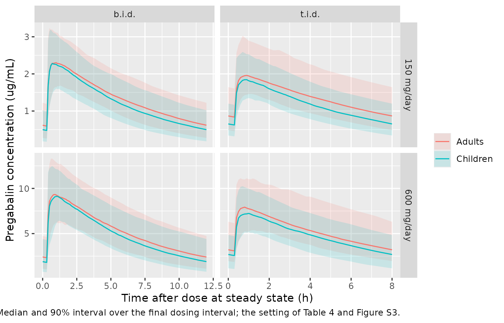
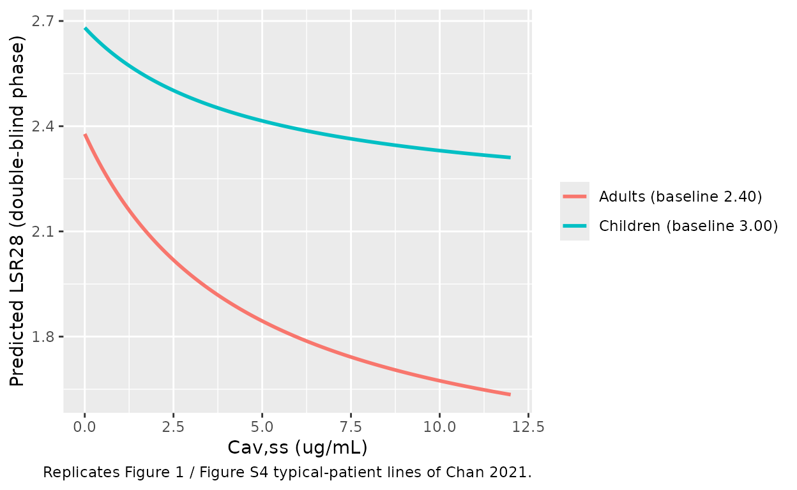

# Pregabalin PK and exposure-response in focal onset seizures (Chan 2021)

## Model and source

Chan 2021 pooled pregabalin concentrations from 10 studies (healthy
adults, adults with various degrees of renal function, and adult and
pediatric patients with focal onset seizures, FOS) into a population PK
model, then used the individual predicted average steady-state
concentrations (Cav,ss) in an exposure-response (E-R) analysis of the
log-transformed 28-day seizure rate. The two analyses were fitted
separately, so the paper contributes two model files:

- `Chan_2021_pregabalin` – the final population PK model (Table 2).
- `Chan_2021_pregabalin_lsr28` – the final E-R model (Table 3), driven
  by the Cav,ss the PK model predicts.

``` r

ui_pk <- rxode2::rxode(readModelDb("Chan_2021_pregabalin"))
#> ℹ parameter labels from comments will be replaced by 'label()'
#> Warning: some etas defaulted to non-mu referenced, possible parsing error: etalka, etalka_fed
#> as a work-around try putting the mu-referenced expression on a simple line
ui_er <- rxode2::rxode(readModelDb("Chan_2021_pregabalin_lsr28"))
```

- Citation: Chan PLS, Marshall SF, McFadyen L, Liu J. Pregabalin
  Population Pharmacokinetic and Exposure-Response Analyses for Focal
  Onset Seizures in Children (4-16 years) and Adults, to Support Dose
  Recommendations in Children. Clin Pharmacol Ther. 2021;110(1):132-140.
  <doi:10.1002/cpt.2132>. Covariate equations in Supplementary
  Information Appendix Equations I; final NONMEM control stream
  (run8.mod) in the second supplementary file.
- Description (PK): One-compartment population PK model with first-order
  absorption and an absorption lag time for oral pregabalin in pooled
  pediatric (3 months to 16 years) and adult data (Chan 2021): healthy
  adults, adults with various degrees of renal function, and adult and
  pediatric patients with focal onset seizures (10 studies). CL/F is
  proportional to body-surface-area-normalised creatinine clearance
  (CRCL, mL/min/1.73 m^2) up to an estimated breakpoint of 96.4 and
  constant above it, with estimated allometric weight exponents on CL/F
  (0.52) and V/F (0.70) and female-sex multipliers on both. ka is
  estimated as a multiple of the individual elimination rate constant
  CL/V (to avoid flip-flop), with fed and unknown-food-status effects on
  ka and a fed effect on the lag time. Residual error is combined
  proportional + additive with separate magnitudes for phase I adult,
  phase III adult, phase I pediatric (A0081074) and phase III pediatric
  (A0081041, PERIWINKLE) studies. Individual predicted average
  steady-state concentrations from this model drive the
  exposure-response model Chan_2021_pregabalin_lsr28.
- Description (E-R): Exposure-response (Emax) model for the natural
  log-transformed 28-day seizure rate (LSR28) during the 12-week
  double-blind treatment phase in pediatric (4-16 years) and adult
  patients with focal onset seizures taking adjunctive pregabalin (Chan
  2021). LSR28 = Intercept - (Intercept - Emax) \* Cav,ss / (EC50 +
  Cav,ss) + Slope_baseline \* baseline LSR28 (Appendix Equations II),
  with a common Emax (-0.924, the asymptotic intercept under maximal
  drug effect) and EC50 (4.69 ug/mL) and population-specific intercepts
  and baseline slopes for children and adults (Table 3). The drug effect
  therefore differs between populations only through the intercept,
  i.e. the placebo response. Fitted by nonlinear least squares; no
  between-subject or residual variance was reported, so the model
  returns the typical prediction only. Exposure enters as the
  per-patient column CAV, the individual predicted average steady-state
  concentration from modellib(‘Chan_2021_pregabalin’).
- Article: <https://doi.org/10.1002/cpt.2132> (open access; PMC8359225)
- Supplementary information: Appendix Equations I (covariate model) and
  II (E-R models), Tables S1-S3; the final NONMEM control stream
  (`run8.mod`) is the second supplementary file.

## Population

The PK analysis included 724 adults (median age 38 years, range 17-75;
median weight 75.5 kg, 40-180) and 255 pediatric patients aged 3 months
to 16 years (median 10 years; median weight 32.9 kg, 6.6-108), with
5,258 concentrations in total (Table 1). About half were female; most
were White (84% of adults, 69% of children), with more Asian patients
among the children (22% vs 2%). Absolute creatinine clearance ranged
42.2-261 mL/min in adults and 15.5-293 mL/min in children; normalised to
body surface area it was comparable across ages (median 149 mL/min/1.73
m^2 in children, 101 in adults).

The E-R analysis used 280 pediatric patients aged 4-16 years from the
PERIWINKLE study (A0081041) and 858 adults (including 8 adolescents aged
13-16 years) from three adult phase III studies (Table S2).

``` r

str(ui_pk$population)
#> List of 14
#>  $ species       : chr "human"
#>  $ n_subjects    : int 979
#>  $ n_studies     : int 10
#>  $ age_range     : chr "3 months to 75 years"
#>  $ age_median    : chr "10 years (children); 38 years (adults)"
#>  $ weight_range  : chr "6.6-180 kg"
#>  $ weight_median : chr "32.9 kg (children); 75.5 kg (adults)"
#>  $ sex_female_pct: num 49.8
#>  $ race_ethnicity: Named num [1:4] 80.2 5.2 6.9 7.7
#>   ..- attr(*, "names")= chr [1:4] "White" "Black" "Asian" "Other"
#>  $ disease_state : chr "Healthy adults, adults with various degrees of renal function, and adult and pediatric patients with focal onset seizures"
#>  $ dose_range    : chr "Oral pregabalin; adults 150-600 mg/day b.i.d. or t.i.d.; children 2.5-10 mg/kg/day (>= 30 kg) or 3.5-14 mg/kg/day (< 30 kg)"
#>  $ renal_function: chr "CLcr 42.2-261 mL/min in adults (excluding the renal study) and 15.5-293 mL/min in children; NCLcr median 149 mL"| __truncated__
#>  $ regions       : chr "Multinational"
#>  $ notes         : chr "724 adults and 255 pediatric patients (162 aged 3 months to < 12 years, 93 aged 12-16 years); 5,258 PK samples "| __truncated__
str(ui_er$population)
#> List of 13
#>  $ species       : chr "human"
#>  $ n_subjects    : int 1138
#>  $ n_studies     : int 4
#>  $ age_range     : chr "4-82 years"
#>  $ age_median    : chr "10 years (children); 38 years (adults)"
#>  $ weight_range  : chr "11-180 kg"
#>  $ weight_median : chr "35.6 kg (children); 74.9 kg (adults)"
#>  $ sex_female_pct: num 48.9
#>  $ race_ethnicity: Named num [1:4] 82.2 4.2 8.3 5.4
#>   ..- attr(*, "names")= chr [1:4] "White" "Black" "Asian" "Other"
#>  $ disease_state : chr "Focal onset seizures, adjunctive pregabalin or placebo"
#>  $ dose_range    : chr "Adults 150-600 mg/day; children 2.5 or 10 mg/kg/day (>= 30 kg) or 3.5 or 14 mg/kg/day (< 30 kg), b.i.d.; placebo arms included"
#>  $ regions       : chr "USA 61.8%, European Union 21.4%, Asia-Pacific 1.5%, other 15.3%"
#>  $ notes         : chr "280 pediatric patients from PERIWINKLE (A0081041) and 858 adult patients (including 8 adolescents aged 13-16 ye"| __truncated__
```

## Source trace

Every `ini()` value carries an in-file comment naming its source. The
table collects them.

| Equation / parameter | Value | Source location |
|----|----|----|
| One-compartment, first-order absorption with lag, first-order elimination | n/a | Methods ‘Population PK model’; control stream `ADVAN2 TRANS2` |
| `lcl` (CL/F at CRCL at or above the breakpoint, 70 kg male) | log(4.96) L/h | Table 2 ‘CL/F’ |
| `lcrcl_hinge` (CRCL breakpoint) | log(96.4) mL/min/1.73 m^2 | Table 2 ‘CLcr breakpoint’ |
| `cl = CL * min(CRCL, hinge)/hinge * (WT/70)^0.52 * 0.92^SEXF` | n/a | Appendix Equations I; control stream `TVCL` lines |
| `lvc` (V/F, 70 kg male) | log(39.8) L | Table 2 ‘V/F’ |
| `e_wt_cl`, `e_wt_vc` | 0.52, 0.70 | Table 2 ‘Body weight on CL/F’, ‘Body weight on V/F’ |
| `e_sexf_cl`, `e_sexf_vc` | 0.92, 0.83 | Table 2 ‘Sex on CL/F’, ‘Sex on V/F’ (male reference) |
| `lka` (fasted ka, reference subject) | log(10.0) 1/h | Table 2 ‘ka fasted’ |
| `ka = ka_ref * food factor * (CL/V) / (CL/V)_ref` | n/a | Table 2 footnote f; control stream `TVKA = EKEL*FKA` |
| `e_fed_ka` | 0.71/10.0 - 1 | Table 2 ‘Food: fed’ (ka) |
| `e_fed_missing_ka` | 1.22/10.0 - 1 | Table 2 ‘Food: unknown’ (ka) |
| `ltlag` | log(0.32) h | Table 2 ‘Tlag’ |
| `e_fed_tlag` (phase I fed records only) | 0.43 | Table 2 ‘Food: fed’ (Tlag), footnote h |
| `etalcl`, `etalvc`, `etalka`, `etalka_fed` | 0.202^2, 0.128^2, 1.17^2, 0.579^2 | Table 2 IIV rows |
| `propSdPh1Adult`, `addSdPh1Adult` | 0.166, 0.021 ug/mL | Table 2 residual rows ‘Phase I adult’ |
| `propSdPh3Adult`, `addSdPh3Adult` | 0.289, 0.047 ug/mL | Table 2 residual rows ‘Phase III adult’ |
| `propSdPh1Ped` (additive 0) | 0.298 | Table 2 ‘Phase I pediatric’; control stream `$SIGMA 8` |
| `propSdPh3Ped`, `addSdPh3Ped` | 0.350, 0.68 ug/mL | Table 2 residual rows ‘Phase III pediatric’ |
| E-R: `LSR28 = Int - (Int - Emax) * Cav/(EC50 + Cav) + Slope * baseline` | n/a | Appendix Equations II, ‘Emax treatment effect response model’ with linear baseline effect |
| `e0`, `e0_child` (intercepts) | 0.110, -0.409 | Table 3 ‘Children (C) + Adult (A)’, ‘Intercept’ |
| `e_lsr28_bl`, `e_lsr28_bl_child` (baseline slopes) | 0.945, 1.03 | Table 3 ‘Slope baseline’ |
| `rmax_lsr28` (common Emax) | -0.924 | Table 3 ‘Emax’ |
| `lec50` (common EC50) | log(4.69) ug/mL | Table 3 ‘EC50’ |

### How the Table 2 values map onto the NONMEM parameters

The control stream estimates CL/F and ka as proportionality factors
(`TVCL = THETA(1) * CLCR` below the breakpoint and `THETA(1) * THETA(5)`
above it; `KA = CL/V * THETA(3)`), but Table 2 prints both in natural
units: CL/F 4.96 L/h and ka 10.0 per hour. The printed ka is visibly not
`THETA(3)`, whose initial estimate in `run8.mod` is 77.3, and 10.0 per
hour is `THETA(3)` times the reference elimination rate constant. So
Table 2 reports typical values for the reference subject (70 kg male,
fasted, CRCL at or above the breakpoint), and 4.96 L/h is the plateau
clearance `THETA(1) * THETA(5)`. The model therefore carries these
printed values directly and rebuilds the proportionality in `model()`.
Three checks support this reading:

1.  Read the other way (4.96 L/h as `THETA(1)` per 100 mL/min/1.73 m^2),
    the plateau is 4.78 L/h and the simulated adult Cav,ss in the Table
    4 replication below rises about 4% above the published medians. The
    chosen reading lands within 1-2%.
2.  The ‘Food: fed’ and ‘Food: unknown’ ka rows (0.71 and 1.22) are fed
    and unknown-food ka *values* in per hour, not multipliers. Read as
    values, the fed ka of 0.71 per hour lowers Cmax by about 27% and
    delays Tmax to about 3 h after a single dose, matching the food
    effect in the pregabalin prescribing information (Cmax about 25-30%
    lower, Tmax about 3 h). Read as multipliers (fed ka 7.1 per hour),
    food would have almost no effect. The food-effect check below
    asserts this.
3.  The paper’s statement that the allometric exponent gives “~40%
    higher CL/F for a typical child weighing 20 kg compared with a
    typical child weighing 40 kg” (per kg) is reproduced exactly, as
    `2^(1 - 0.52) = 1.39`.

## Deterministic checks of the PK model

``` r

mod_pk <- readModelDb("Chan_2021_pregabalin")
mod_pk_typ <- rxode2::zeroRe(mod_pk)
#> ℹ parameter labels from comments will be replaced by 'label()'
#> Warning: some etas defaulted to non-mu referenced, possible parsing error: etalka, etalka_fed
#> as a work-around try putting the mu-referenced expression on a simple line
#> Warning: No sigma parameters in the model
#> Warning: some etas defaulted to non-mu referenced, possible parsing error: etalka, etalka_fed
#> as a work-around try putting the mu-referenced expression on a simple line

ref_cov <- function(WT = 70, SEXF = 0, CRCL = 120, FED = 0, FED_MISSING = 0,
                    STUDY_PHASE3 = 0) {
  data.frame(
    WT = WT,
    SEXF = SEXF,
    CRCL = CRCL,
    FED = FED,
    FED_MISSING = FED_MISSING,
    STUDY_PHASE3 = STUDY_PHASE3,
    STUDY_A0081074 = 0,
    STUDY_A0081041 = 0
  )
}

single_dose <- function(cov, dose = 150, id = 1L) {
  obs_t <- sort(unique(c(seq(0, 2, by = 0.02), seq(2, 48, by = 0.1))))
  dplyr::bind_rows(
    data.frame(id = id, time = 0, amt = dose, evid = 1L, cmt = "depot"),
    data.frame(id = id, time = obs_t, amt = NA_real_, evid = 0L, cmt = "central")
  ) |>
    dplyr::bind_cols(cov[rep(1, length(obs_t) + 1), , drop = FALSE])
}
```

``` r

ev_ref <- single_dose(ref_cov())
sim_ref <- rxode2::rxSolve(mod_pk_typ, events = ev_ref,
                           returnType = "data.frame")
#> ℹ omega/sigma items treated as zero: 'etalcl', 'etalvc', 'etalka', 'etalka_fed'
cl_ref <- sim_ref$cl[1]
vc_ref <- sim_ref$vc[1]
ka_ref <- sim_ref$ka[1]
thalf_ref <- log(2) * vc_ref / cl_ref

# Typical CL below the breakpoint scales linearly with CRCL
sim_60 <- rxode2::rxSolve(mod_pk_typ, events = single_dose(ref_cov(CRCL = 60)),
                          returnType = "data.frame")
#> ℹ omega/sigma items treated as zero: 'etalcl', 'etalvc', 'etalka', 'etalka_fed'

# Per-kg CL ratio at 20 vs 40 kg (same CRCL, sex)
cl_wt <- function(wt) {
  rxode2::rxSolve(mod_pk_typ, events = single_dose(ref_cov(WT = wt)),
                  returnType = "data.frame")$cl[1]
}
perkg_ratio <- (cl_wt(20) / 20) / (cl_wt(40) / 40)
#> ℹ omega/sigma items treated as zero: 'etalcl', 'etalvc', 'etalka', 'etalka_fed'
#> ℹ omega/sigma items treated as zero: 'etalcl', 'etalvc', 'etalka', 'etalka_fed'

data.frame(
  quantity = c("CL/F reference (L/h)", "V/F reference (L)",
               "ka reference (1/h)", "t1/2 reference (h)",
               "CL/F at CRCL 60 (L/h)", "Per-kg CL/F ratio, 20 vs 40 kg"),
  model = c(cl_ref, vc_ref, ka_ref, thalf_ref, sim_60$cl[1], perkg_ratio),
  expected = c(4.96, 39.8, 10.0, NA, 4.96 * 60 / 96.4, 1.40)
) |>
  knitr::kable(digits = 3, caption = "Typical-value checks (fasted 70 kg male).")
```

| quantity                       |  model | expected |
|:-------------------------------|-------:|---------:|
| CL/F reference (L/h)           |  4.960 |    4.960 |
| V/F reference (L)              | 39.800 |   39.800 |
| ka reference (1/h)             | 10.000 |   10.000 |
| t1/2 reference (h)             |  5.562 |       NA |
| CL/F at CRCL 60 (L/h)          |  3.087 |    3.087 |
| Per-kg CL/F ratio, 20 vs 40 kg |  1.395 |    1.400 |

Typical-value checks (fasted 70 kg male). {.table}

``` r


stopifnot(
  abs(cl_ref / 4.96 - 1) < 1e-6,
  abs(vc_ref / 39.8 - 1) < 1e-6,
  abs(ka_ref / 10.0 - 1) < 1e-6,
  abs(sim_60$cl[1] / (4.96 * 60 / 96.4) - 1) < 1e-6,
  # 'This translates to ~ 40% higher CL/F for a typical child weighing 20 kg
  # compared with a typical child weighing 40 kg' (Results)
  abs(perkg_ratio - 2^(1 - 0.52)) < 1e-6,
  abs(perkg_ratio - 1.40) < 0.02,
  # 'elimination half-life of ~ 6 hours' (Introduction)
  thalf_ref > 5, thalf_ref < 7
)
```

The fasted typical subject has a half-life of 5.56 h, consistent with
the approximately 6 h the paper quotes.

### Food effect

``` r

cmax_tmax <- function(sim) {
  i <- which.max(sim$Cc)
  c(cmax = sim$Cc[i], tmax = sim$time[i])
}
fasted <- cmax_tmax(sim_ref)
fed <- cmax_tmax(rxode2::rxSolve(
  mod_pk_typ, events = single_dose(ref_cov(FED = 1, STUDY_PHASE3 = 0)),
  returnType = "data.frame"
))
#> ℹ omega/sigma items treated as zero: 'etalcl', 'etalvc', 'etalka', 'etalka_fed'
unknown <- cmax_tmax(rxode2::rxSolve(
  mod_pk_typ, events = single_dose(ref_cov(FED_MISSING = 1, STUDY_PHASE3 = 1)),
  returnType = "data.frame"
))
#> ℹ omega/sigma items treated as zero: 'etalcl', 'etalvc', 'etalka', 'etalka_fed'
food_tab <- rbind(fasted = fasted, fed = fed, unknown = unknown)
knitr::kable(food_tab, digits = 3,
             caption = "Typical single-dose 150 mg Cmax (ug/mL) and Tmax (h) by food status.")
```

|         |  cmax | tmax |
|:--------|------:|-----:|
| fasted  | 3.566 | 0.76 |
| fed     | 2.602 | 3.40 |
| unknown | 2.907 | 2.40 |

Typical single-dose 150 mg Cmax (ug/mL) and Tmax (h) by food status.
{.table}

``` r


# Fed Cmax falls ~27% and Tmax moves to ~3 h. The alternative reading of the
# Table 2 'Food: fed' row as a ka multiplier (fed ka 7.1/h) would leave the
# Cmax ratio above 0.95 and Tmax below 1 h, and fails both bounds.
stopifnot(
  fed[["cmax"]] / fasted[["cmax"]] > 0.65,
  fed[["cmax"]] / fasted[["cmax"]] < 0.80,
  fed[["tmax"]] > 2.5, fed[["tmax"]] < 4
)
```

## Replicate Table 4: steady-state exposure in children vs adults

Table 4 compares simulated steady-state Cav,ss, Cmax,ss and Cmin,ss in
children aged 4-16 years (2.5 or 10 mg/kg/day if at least 30 kg; 3.5 or
14 mg/kg/day if under 30 kg; capped at 150 or 600 mg/day) against adults
(150 or 600 mg/day), under fasted conditions, for b.i.d. and t.i.d.
regimens. The paper bootstrapped the covariates of its own pediatric and
adult FOS patients, which are not public; the virtual cohorts below
approximate them from Tables 1 and S2.

``` r

rxode2::rxSetSeed(20210701)
set.seed(20210701)

n_per_arm <- 200L

make_adults <- function(n) {
  data.frame(
    WT = pmin(pmax(exp(rnorm(n, log(75.5), 0.2)), 40), 180),
    SEXF = rbinom(n, 1, 0.5),
    CRCL = pmin(pmax(exp(rnorm(n, log(101), 0.22)), 49), 227),
    population = "Adults"
  )
}

make_children <- function(n) {
  # Table S2: median 35.6 kg (range 11-108); Table 4 footnotes: 391 of 1,000
  # simulated children weighed < 30 kg. A log-normal with sdlog 0.6 puts 39%
  # below 30 kg.
  data.frame(
    WT = pmin(pmax(exp(rnorm(n, log(35.6), 0.6)), 11), 108),
    SEXF = rbinom(n, 1, 0.45),
    # Table 1: NCLcr median 149 (range 74-315) mL/min/1.73 m^2
    CRCL = pmin(pmax(exp(rnorm(n, log(149), 0.25)), 74), 315),
    population = "Children"
  )
}

daily_dose <- function(population, WT, level) {
  if (population == "Adults") {
    return(ifelse(level == "150 mg/day", 150, 600))
  }
  per_kg <- if (level == "150 mg/day") {
    ifelse(WT < 30, 3.5, 2.5)
  } else {
    ifelse(WT < 30, 14, 10)
  }
  cap <- ifelse(level == "150 mg/day", 150, 600)
  pmin(per_kg * WT, cap)
}

arms <- tidyr::expand_grid(
  population = c("Adults", "Children"),
  level = c("150 mg/day", "600 mg/day"),
  freq = c("b.i.d.", "t.i.d.")
)

build_arm <- function(i) {
  a <- arms[i, ]
  cov <- if (a$population == "Adults") make_adults(n_per_arm) else make_children(n_per_arm)
  cov$id <- (i - 1L) * n_per_arm + seq_len(n_per_arm)
  cov$level <- a$level
  cov$freq <- a$freq
  cov$daily <- daily_dose(a$population, cov$WT, a$level)
  cov
}
subjects <- dplyr::bind_rows(lapply(seq_len(nrow(arms)), build_arm)) |>
  dplyr::mutate(
    treatment = paste(population, level, freq, sep = " | "),
    tau = ifelse(freq == "b.i.d.", 12, 8),
    FED = 0, FED_MISSING = 0, STUDY_PHASE3 = 1,
    STUDY_A0081074 = 0, STUDY_A0081041 = 0
  )
stopifnot(!anyDuplicated(subjects$id))

# Five days of dosing (about 20 adult half-lives) then a dense final interval
t_end <- 120
doses <- subjects |>
  dplyr::rowwise() |>
  dplyr::reframe(
    id = id, treatment = treatment,
    time = seq(0, t_end - tau, by = tau),
    amt = daily / (24 / tau)
  ) |>
  dplyr::mutate(evid = 1L, cmt = "depot")
obs <- subjects |>
  dplyr::rowwise() |>
  dplyr::reframe(
    id = id, treatment = treatment,
    time = seq(t_end - tau, t_end, by = 0.1)
  ) |>
  dplyr::mutate(evid = 0L, cmt = "central", amt = NA_real_)
events <- dplyr::bind_rows(doses, obs) |>
  dplyr::left_join(
    subjects |> dplyr::select(id, WT, SEXF, CRCL, FED, FED_MISSING,
                              STUDY_PHASE3, STUDY_A0081074, STUDY_A0081041),
    by = "id"
  ) |>
  dplyr::arrange(id, time, dplyr::desc(evid))
stopifnot(!anyDuplicated(events[, c("id", "time", "evid")]))

subjects |>
  dplyr::group_by(population) |>
  dplyr::summarise(
    n = dplyr::n(),
    `median WT (kg)` = median(WT),
    `% < 30 kg` = 100 * mean(WT < 30),
    `median CRCL` = median(CRCL),
    `% female` = 100 * mean(SEXF),
    .groups = "drop"
  ) |>
  knitr::kable(digits = 1, caption = "Virtual cohorts (all arms pooled).")
```

| population |   n | median WT (kg) | % \< 30 kg | median CRCL | % female |
|:-----------|----:|---------------:|-----------:|------------:|---------:|
| Adults     | 800 |           75.5 |        0.0 |       101.3 |     52.8 |
| Children   | 800 |           35.9 |       38.8 |       149.0 |     39.8 |

Virtual cohorts (all arms pooled). {.table}

``` r

sim_ss <- rxode2::rxSolve(mod_pk, events = events,
                          keep = c("treatment"),
                          returnType = "data.frame")
#> ℹ parameter labels from comments will be replaced by 'label()'
#> Warning: some etas defaulted to non-mu referenced, possible parsing error: etalka, etalka_fed
#> as a work-around try putting the mu-referenced expression on a simple line
stopifnot(all(sim_ss$Cc >= -1e-6 * max(sim_ss$Cc, na.rm = TRUE), na.rm = TRUE))
```

The exposures below are computed from the individual predictions (`Cc`,
with IIV but without residual error).

``` r

# One PKNCA call per population (800 subject-intervals each), with the
# dosing-interval window carried per treatment in the intervals table.
nca_pop <- function(pop) {
  s <- subjects[subjects$population == pop, ]
  conc <- sim_ss |>
    dplyr::filter(treatment %in% s$treatment, !is.na(Cc)) |>
    dplyr::mutate(Cc = pmax(Cc, 0)) |>
    dplyr::select(id, time, Cc, treatment)
  dose <- doses |>
    dplyr::filter(treatment %in% s$treatment) |>
    dplyr::select(id, time, amt, treatment)
  intervals <- s |>
    dplyr::distinct(treatment, tau) |>
    dplyr::transmute(treatment, start = t_end - tau, end = t_end,
                     cmax = TRUE, cmin = TRUE, cav = TRUE)
  conc_obj <- PKNCA::PKNCAconc(conc, Cc ~ time | treatment + id,
                               concu = "ug/mL", timeu = "h")
  dose_obj <- PKNCA::PKNCAdose(dose, amt ~ time | treatment + id, doseu = "mg")
  PKNCA::pk.nca(PKNCA::PKNCAdata(conc_obj, dose_obj, intervals = intervals))
}
nca_adults <- nca_pop("Adults")
nca_children <- nca_pop("Children")

med_tbl <- dplyr::bind_rows(
  as.data.frame(nca_adults$result),
  as.data.frame(nca_children$result)
) |>
  dplyr::filter(PPTESTCD %in% c("cav", "cmax", "cmin")) |>
  dplyr::select(id, PPTESTCD, PPORRES) |>
  dplyr::left_join(
    subjects |> dplyr::select(id, population, level, freq, WT),
    by = "id"
  )
stopifnot(nrow(med_tbl) == 3L * nrow(subjects), !anyNA(med_tbl$PPORRES))
```

### Adult medians against Table 4

``` r

published_adults <- tibble::tribble(
  ~treatment,                          ~cav, ~cmax, ~cmin,
  "Adults | 150 mg/day | b.i.d.",      1.34, 2.43,  0.60,
  "Adults | 600 mg/day | b.i.d.",      5.37, 9.73,  2.39,
  "Adults | 150 mg/day | t.i.d.",      1.34, 1.97,  0.81,
  "Adults | 600 mg/day | t.i.d.",      5.35, 7.86,  3.23
)
cmp <- nlmixr2lib::ncaComparisonTable(
  simulated = nca_adults,
  reference = published_adults,
  by = "treatment",
  units = c(cav = "ug/mL", cmax = "ug/mL", cmin = "ug/mL"),
  tolerance_pct = 20
)
knitr::kable(cmp, caption = paste(
  "Simulated vs published (Table 4) adult steady-state medians.",
  "* differs from the reference by >20%."
))
```

| NCA parameter | treatment                      | Reference | Simulated | % diff |
|:--------------|:-------------------------------|:----------|:----------|:-------|
| Cmax (ug/mL)  | Adults \| 150 mg/day \| b.i.d. | 2.43      | 2.39      | -1.5%  |
| Cmax (ug/mL)  | Adults \| 600 mg/day \| b.i.d. | 9.73      | 9.8       | +0.8%  |
| Cmax (ug/mL)  | Adults \| 150 mg/day \| t.i.d. | 1.97      | 2.01      | +1.9%  |
| Cmax (ug/mL)  | Adults \| 600 mg/day \| t.i.d. | 7.86      | 8.16      | +3.8%  |
| Cmin (ug/mL)  | Adults \| 150 mg/day \| b.i.d. | 0.6       | 0.594     | -1.1%  |
| Cmin (ug/mL)  | Adults \| 600 mg/day \| b.i.d. | 2.39      | 2.34      | -2.1%  |
| Cmin (ug/mL)  | Adults \| 150 mg/day \| t.i.d. | 0.81      | 0.837     | +3.3%  |
| Cmin (ug/mL)  | Adults \| 600 mg/day \| t.i.d. | 3.23      | 3.09      | -4.4%  |
| Cavg (ug/mL)  | Adults \| 150 mg/day \| b.i.d. | 1.34      | 1.34      | -0.1%  |
| Cavg (ug/mL)  | Adults \| 600 mg/day \| b.i.d. | 5.37      | 5.33      | -0.7%  |
| Cavg (ug/mL)  | Adults \| 150 mg/day \| t.i.d. | 1.34      | 1.37      | +2.2%  |
| Cavg (ug/mL)  | Adults \| 600 mg/day \| t.i.d. | 5.35      | 5.27      | -1.6%  |

Simulated vs published (Table 4) adult steady-state medians. \* differs
from the reference by \>20%. {.table}

``` r

adult_meds <- med_tbl |>
  dplyr::filter(population == "Adults") |>
  dplyr::group_by(level, freq, PPTESTCD) |>
  dplyr::summarise(sim = median(PPORRES), .groups = "drop") |>
  dplyr::mutate(treatment = paste("Adults", level, freq, sep = " | ")) |>
  dplyr::inner_join(
    published_adults |>
      tidyr::pivot_longer(-treatment, names_to = "PPTESTCD", values_to = "pub"),
    by = c("treatment", "PPTESTCD")
  ) |>
  dplyr::mutate(pct_diff = 100 * (sim / pub - 1))
stopifnot(nrow(adult_meds) == 12L)
# Cav,ss is dose / CL/F and is insensitive to absorption; a mis-transcribed
# CL/F, breakpoint or weight exponent moves it by tens of percent. The
# envelope also covers Cmax and Cmin, which depend on the assumed CRCL and
# weight distributions of the virtual adults.
stopifnot(
  all(abs(adult_meds$pct_diff[adult_meds$PPTESTCD == "cav"]) < 10),
  abs(median(adult_meds$pct_diff)) < 10,
  max(abs(adult_meds$pct_diff)) < 25
)
```

### Children-to-adult ratios against Table 4

``` r

med_by <- med_tbl |>
  dplyr::mutate(wtgrp = ifelse(population == "Adults", "Adults",
                               ifelse(WT < 30, "< 30 kg", ">= 30 kg"))) |>
  dplyr::group_by(level, freq, PPTESTCD) |>
  dplyr::group_modify(function(d, k) {
    adult <- median(d$PPORRES[d$population == "Adults"])
    ch <- d[d$population == "Children", ]
    data.frame(
      All = median(ch$PPORRES) / adult,
      `< 30 kg` = median(ch$PPORRES[ch$WT < 30]) / adult,
      `>= 30 kg` = median(ch$PPORRES[ch$WT >= 30]) / adult,
      check.names = FALSE
    )
  }) |>
  dplyr::ungroup()

# Table 4 reports one ratio per frequency; the ratios are dose-level
# independent in a linear model, so the two levels are averaged here.
ratio_sim <- med_by |>
  dplyr::group_by(freq, PPTESTCD) |>
  dplyr::summarise(dplyr::across(c(All, `< 30 kg`, `>= 30 kg`), mean),
                   .groups = "drop")
ratio_pub <- tibble::tribble(
  ~freq,    ~PPTESTCD, ~All_pub, ~lt30_pub, ~ge30_pub,
  "b.i.d.", "cav",     0.91,     0.89,      0.92,
  "t.i.d.", "cav",     0.90,     0.88,      0.91,
  "b.i.d.", "cmax",    1.01,     1.05,      0.99,
  "t.i.d.", "cmax",    0.99,     1.02,      0.97,
  "b.i.d.", "cmin",    0.75,     0.68,      0.80,
  "t.i.d.", "cmin",    0.78,     0.72,      0.81
)
ratio_cmp <- dplyr::inner_join(ratio_sim, ratio_pub, by = c("freq", "PPTESTCD"))
stopifnot(nrow(ratio_cmp) == 6L)
ratio_cmp |>
  dplyr::select(PPTESTCD, freq, All, All_pub, `< 30 kg`, lt30_pub,
                `>= 30 kg`, ge30_pub) |>
  dplyr::rename(
    "Parameter" = PPTESTCD,
    "Frequency" = freq,
    "All (sim)" = All,
    "All (Table 4)" = All_pub,
    "< 30 kg (sim)" = `< 30 kg`,
    "< 30 kg (Table 4)" = lt30_pub,
    ">= 30 kg (sim)" = `>= 30 kg`,
    ">= 30 kg (Table 4)" = ge30_pub
  ) |>
  knitr::kable(digits = 2, caption = "Median ratio, children (4-16 years) to adults.")
```

| Parameter | Frequency | All (sim) | All (Table 4) | \< 30 kg (sim) | \< 30 kg (Table 4) | \>= 30 kg (sim) | \>= 30 kg (Table 4) |
|:---|:---|---:|---:|---:|---:|---:|---:|
| cav | b.i.d. | 0.92 | 0.91 | 0.90 | 0.89 | 0.92 | 0.92 |
| cmax | b.i.d. | 0.98 | 1.01 | 1.03 | 1.05 | 0.96 | 0.99 |
| cmin | b.i.d. | 0.79 | 0.75 | 0.67 | 0.68 | 0.86 | 0.80 |
| cav | t.i.d. | 0.89 | 0.90 | 0.85 | 0.88 | 0.90 | 0.91 |
| cmax | t.i.d. | 0.94 | 0.99 | 0.97 | 1.02 | 0.92 | 0.97 |
| cmin | t.i.d. | 0.79 | 0.78 | 0.70 | 0.72 | 0.84 | 0.81 |

Median ratio, children (4-16 years) to adults. {.table}

``` r


# The pediatric dosing rule (40% more per kg below 30 kg) should bring both
# weight groups to within ~10-30% of adult exposure; a wrong weight exponent
# or a mis-applied dose rule separates the < 30 kg and >= 30 kg ratios.
stopifnot(
  abs(median(ratio_cmp$All - ratio_cmp$All_pub)) < 0.1,
  max(abs(ratio_cmp$All - ratio_cmp$All_pub)) < 0.2,
  max(abs(ratio_cmp$`< 30 kg` - ratio_cmp$lt30_pub)) < 0.25,
  max(abs(ratio_cmp$`>= 30 kg` - ratio_cmp$ge30_pub)) < 0.25
)
```

``` r

sim_ss |>
  dplyr::filter(!is.na(Cc)) |>
  dplyr::mutate(tad = time - min(time), .by = treatment) |>
  tidyr::separate(treatment, c("population", "level", "freq"), sep = " \\| ") |>
  dplyr::group_by(population, level, freq, tad) |>
  dplyr::summarise(
    Q05 = quantile(Cc, 0.05), Q50 = median(Cc), Q95 = quantile(Cc, 0.95),
    .groups = "drop"
  ) |>
  ggplot(aes(tad, Q50, colour = population, fill = population)) +
  geom_ribbon(aes(ymin = Q05, ymax = Q95), alpha = 0.15, colour = NA) +
  geom_line() +
  facet_grid(level ~ freq, scales = "free") +
  labs(x = "Time after dose at steady state (h)",
       y = "Pregabalin concentration (ug/mL)",
       colour = NULL, fill = NULL,
       caption = paste("Median and 90% interval over the final dosing interval;",
                       "the setting of Table 4 and Figure S3."))
```



## Exposure-response model

The E-R model predicts the log-transformed 28-day seizure rate during
the double-blind phase (LSR28) from the patient’s Cav,ss and observed
baseline LSR28. Table 3 footnote a gives the placebo response at the
median baseline (3.00 in children, 2.40 in adults) as a check.

``` r

mod_er <- readModelDb("Chan_2021_pregabalin_lsr28")
er_pred <- function(CAV, LSR28_BL, CHILD) {
  d <- data.frame(id = seq_along(CAV), time = 0, evid = 0L,
                  CAV = CAV, LSR28_BL = LSR28_BL, CHILD = CHILD)
  out <- rxode2::rxSolve(mod_er, events = d, returnType = "data.frame")
  if (is.null(out$id)) out$id <- 1L
  out$lsr28[match(d$id, out$id)]
}

placebo <- er_pred(CAV = c(0, 0), LSR28_BL = c(3.00, 2.40), CHILD = c(1, 0))
stopifnot(
  # Table 3 'Placebo response' C: 2.68, A: 2.38 (computed as intercept +
  # slope * median baseline; printed to 2 decimals)
  abs(placebo[1] - 2.68) < 0.005,
  abs(placebo[2] - 2.38) < 0.005
)
knitr::kable(
  data.frame(population = c("Children", "Adults"),
             `median baseline LSR28` = c(3.00, 2.40),
             `model placebo response` = placebo,
             `Table 3` = c(2.68, 2.38), check.names = FALSE),
  digits = 3, caption = "Placebo response at the median baseline (Table 3 footnote a)."
)
```

| population | median baseline LSR28 | model placebo response | Table 3 |
|:-----------|----------------------:|-----------------------:|--------:|
| Children   |                   3.0 |                  2.681 |    2.68 |
| Adults     |                   2.4 |                  2.378 |    2.38 |

Placebo response at the median baseline (Table 3 footnote a). {.table}

The paper also reports observed changes from baseline in LSR28 (Results;
Figure 2): group means of -0.0296 (adult placebo), -0.313 (pediatric
placebo), -0.545 (adults, 600 mg/day b.i.d.) and -0.551 (children, 10
mg/kg/day). The typical predictions at the median baseline and at the
median Cav,ss of each regimen (Table 4: 5.37 ug/mL in adults; 0.91 times
that in children) should be close to those means.

``` r

cav_adult_600 <- 5.37
cav_child_10 <- 0.91 * 5.37
cfb <- er_pred(
  CAV = c(0, 0, cav_adult_600, cav_child_10),
  LSR28_BL = c(2.40, 3.00, 2.40, 3.00),
  CHILD = c(0, 1, 0, 1)
) - c(2.40, 3.00, 2.40, 3.00)
cfb_tab <- data.frame(
  group = c("Adults, placebo", "Children, placebo",
            "Adults, 600 mg/day", "Children, 10 mg/kg/day"),
  model = cfb,
  observed_mean = c(-0.0296, -0.313, -0.545, -0.551)
)
knitr::kable(cfb_tab, digits = 3,
             caption = "Typical change from baseline in LSR28 vs observed group means.")
```

| group                  |  model | observed_mean |
|:-----------------------|-------:|--------------:|
| Adults, placebo        | -0.022 |        -0.030 |
| Children, placebo      | -0.319 |        -0.313 |
| Adults, 600 mg/day     | -0.574 |        -0.545 |
| Children, 10 mg/kg/day | -0.582 |        -0.551 |

Typical change from baseline in LSR28 vs observed group means. {.table}

``` r

# Typical predictions at the median covariates against observed group means:
# the drug-arm differences are about 0.03, the placebo differences about 0.01.
stopifnot(max(abs(cfb_tab$model - cfb_tab$observed_mean)) < 0.1)
```

``` r

# Replicates Figure 1 and the typical-patient lines of Figure S4: predicted
# LSR28 against Cav,ss at the median baseline of each population.
grid <- seq(0, 12, by = 0.1)
er_curve <- dplyr::bind_rows(
  data.frame(population = "Children (baseline 3.00)", CAV = grid,
             lsr28 = er_pred(grid, rep(3.00, length(grid)), rep(1, length(grid)))),
  data.frame(population = "Adults (baseline 2.40)", CAV = grid,
             lsr28 = er_pred(grid, rep(2.40, length(grid)), rep(0, length(grid))))
)
ggplot(er_curve, aes(CAV, lsr28, colour = population)) +
  geom_line(linewidth = 1) +
  labs(x = "Cav,ss (ug/mL)", y = "Predicted LSR28 (double-blind phase)",
       colour = NULL,
       caption = "Replicates Figure 1 / Figure S4 typical-patient lines of Chan 2021.")
```



## Assumptions and deviations

- **Reporting convention of Table 2.** Table 2 prints CL/F (4.96 L/h),
  ka (10.0 per hour) and the fed and unknown-food ka rows (0.71 and
  1.22) as reference-subject typical values in natural units, while the
  NONMEM parameters are proportionality factors (footnotes c, f, g). The
  maintainers took 4.96 L/h as the plateau CL/F reached at or above the
  CRCL breakpoint and rebuilt the proportionality in `model()`. The
  section “How the Table 2 values map onto the NONMEM parameters” gives
  the evidence.
- **ka scales with the individual elimination rate constant.** As in the
  control stream, `ka` is a multiple of each subject’s own `CL/V`,
  including its CL and V random effects and covariates. Table 2’s ka of
  10.0 per hour applies to the reference subject only; a child with a
  higher CL/V absorbs faster.
- **IIV scale.** Table 2’s IIV percentages are taken as `sqrt(omega^2)`,
  the same convention as its residual SD rows, which match
  `sqrt($SIGMA)` of the supplied control stream. On that scale, the
  control stream’s initial estimates also sit closest to the base-model
  IIVs quoted in the Results. IIV on Tlag was 0 by design and is
  omitted.
- **Fed-state ka random effect.** The control stream replaces (does not
  add to) the ka random effect with a separate one for fed records in
  phase I studies. The model declares both etas and selects one with
  `FED * (1 - STUDY_PHASE3)`. This breaks mu-referencing for `etalka`
  and `etalka_fed` (a load-time warning), which matters only for
  re-estimation. The paper did not use fed conditions in its
  simulations; neither does this vignette beyond the food-effect check.
- **Phase flag for the pediatric PK study.** The control stream sets its
  phase I flag from a `FLAGPHASE` data column that is not published. The
  pediatric phase I study A0081074 is assumed to be phase I
  (`STUDY_PHASE3 = 0`). This affects only fed records in that study, and
  its residual error is set by its own study indicator either way.
- **Residual error form.** `$ERROR` uses `F * exp(eps_prop) + eps_add`,
  encoded as the combined `add() + prop()` form. The phase I pediatric
  additive SD was held at 0 in the control stream (it has no Table 2
  row).
- **Race and age** were screened (Table S1) but not retained. They
  appear in `covariatesDataExcluded`.
- **Virtual cohorts.** The Table 4 simulations bootstrapped the paper’s
  own patients. Here adults and children are drawn from log-normal
  weight and CRCL distributions matched to the medians and ranges of
  Tables 1 and S2 and to the 39% of simulated children under 30 kg.
  Exposures come from individual predictions without residual error, at
  200 subjects per arm rather than 1,000.
- **E-R model variability.** The E-R model was fitted by nonlinear least
  squares, and Table 3 reports estimates and standard errors only. With
  no between-subject or residual variance, the model returns typical
  predictions. The adult-only fit in the first row of Table 3 was a
  development step and is not encoded.
- **Pediatric indicator in the E-R model.** `CHILD = 1` identifies the
  pediatric population (PERIWINKLE, 4-16 years). The 8 adolescents from
  adult study 1008-034 were analysed with the adult parameters (Table 3
  footnote b), so they take `CHILD = 0`.
- No erratum or correction notice for Chan 2021 was found in Europe PMC
  as of 2026-09-28.
