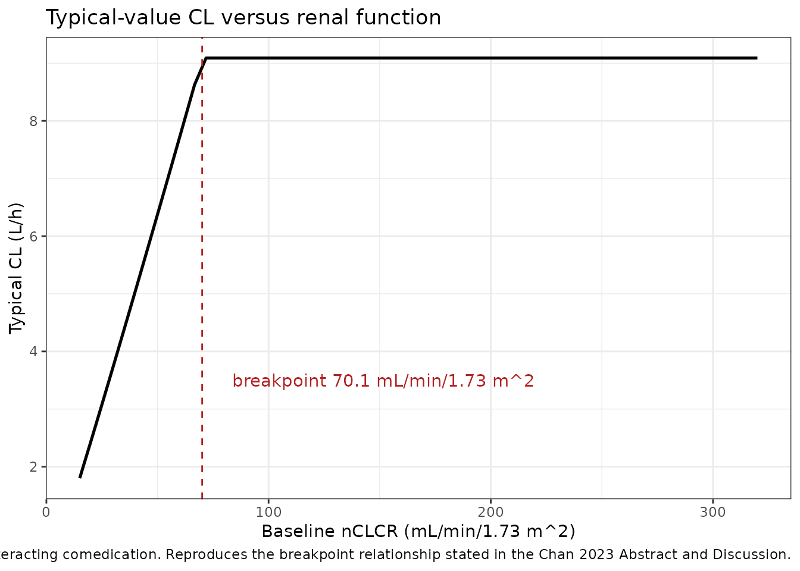
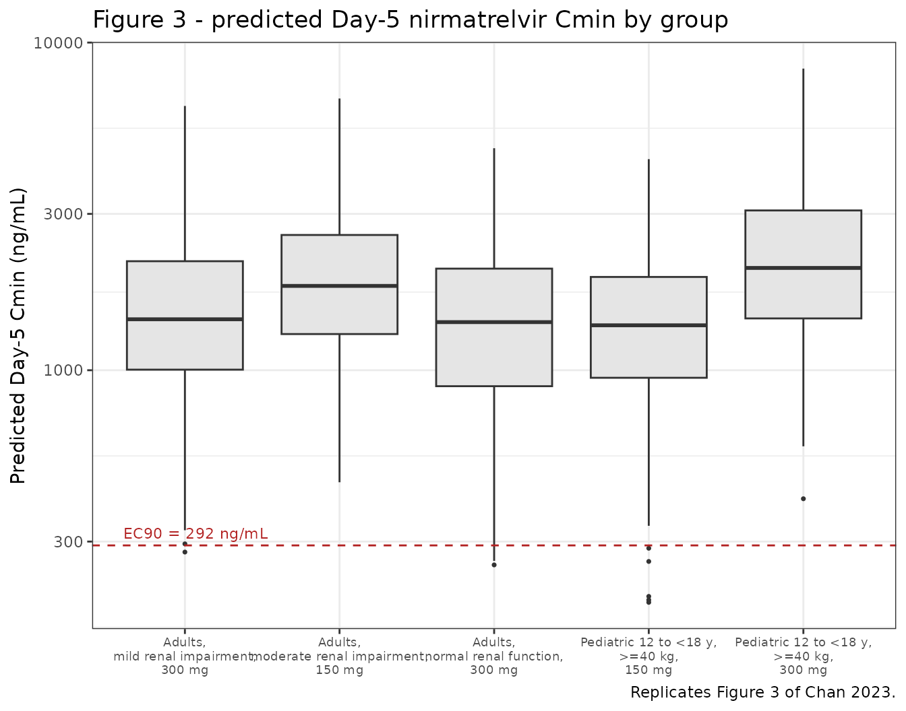
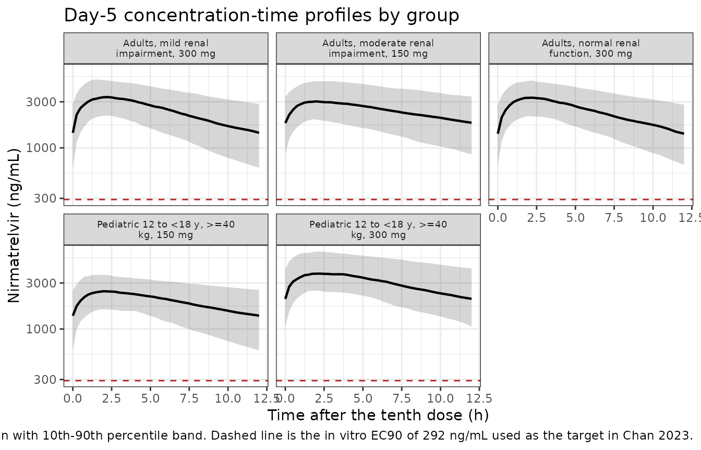

# Nirmatrelvir/ritonavir (Chan 2023)

## Model and source

- Citation: Chan PLS, Singh RSP, Cox DS, Shi H, Damle B, Nicholas T.
  Dosing recommendation of nirmatrelvir/ritonavir using an integrated
  population pharmacokinetic analysis. CPT Pharmacometrics Syst
  Pharmacol. 2023;12(12):1897-1910. <doi:10.1002/psp4.13039>
- Description: Two-compartment population PK model with first-order
  absorption for nirmatrelvir coadministered with ritonavir 100 mg
  (PAXLOVID) in adults with and without COVID-19 (Chan 2023; pooled
  analysis of 8 phase I and phase II/III studies, N = 1237). Allometric
  baseline body weight on clearances (fixed 0.75) and volumes (fixed 1)
  referenced to 70 kg; a breakpoint power model for BSA-normalized
  creatinine clearance on CL (CL scales with nCLCR below the estimated
  70.1 mL/min/1.73 m2 breakpoint and is independent of nCLCR at or above
  it); fractional carbamazepine, itraconazole and COVID-19 effects on
  CL; a power effect of age on central volume referenced to 45 years;
  and a relative-bioavailability model combining a dose power function
  (referenced to 300 mg) with a fractional 150-mg-tablet formulation
  effect. Combined additive plus proportional residual error with
  separate proportional magnitudes for the phase I and phase II/III
  data.
- Article: <https://doi.org/10.1002/psp4.13039>
- Supplement (NONMEM control stream, Data S1; Tables S1-S3): served with
  the open-access article record in Europe PMC as
  `PSP4-12-1897-s001.docx` through `PSP4-12-1897-s004.docx`.

Nirmatrelvir is a SARS-CoV-2 main-protease (3CL) inhibitor
coadministered with ritonavir 100 mg as a pharmacokinetic enhancer
(PAXLOVID). Chan 2023 pooled plasma nirmatrelvir concentrations from
eight completed phase I and phase II/III studies to build an integrated
population PK model, and used it to support the approved 300/100 mg
twice-daily adult regimen, a reduced 150/100 mg regimen in moderate
renal impairment, and the 300/100 mg regimen in adolescents 12 to \< 18
years old weighing at least 40 kg.

## Population

The analysis data set contained 1237 participants contributing 5149
plasma nirmatrelvir samples, of which 4404 were evaluable and 745
(14.5%) were below the 10 ng/mL limit of quantitation and excluded
rather than imputed (Chan 2023 Results, “Observed data”). Most
participants – 1087 (87.9%) – came from the phase II/III EPIC-HR study
(NCT04960202) in nonhospitalized symptomatic adults with COVID-19 at
increased risk of progression to severe illness, sampled sparsely in an
outpatient setting. The remaining 150 (12.1%) came from seven phase I
studies with serial in-clinic sampling: a first-in-human single/multiple
ascending dose study, dedicated renal- and hepatic-impairment studies,
and drug-drug interaction studies with dabigatran, midazolam,
carbamazepine and itraconazole (Table 1).

Baseline demographics (Chan 2023 Table 2, “All” column): median age 45.0
years (range 18.0-86.0), median body weight 79.4 kg (range 42.0-158),
46.9% female, median baseline body mass index 27.9 kg/m^2 (range
16.6-58.1). Race was 69.9% White, 13.1% Asian, 8.5% Black/African
American, 7.7% American Indian/Alaska Native, 0.3% other and 0.5%
unknown. Median baseline body surface area-normalized creatinine
clearance (nCLCR) was 119 mL/min/1.73 m^2 (range 15.8-318), with 84.5%
of participants having normal renal function (nCLCR \>= 90), 11.9% mild
impairment (60 to \< 90), 2.8% moderate impairment (30 to \< 60) and
0.8% severe impairment (\< 30).

The same information is available programmatically via the model’s
`population` metadata
(`readModelDb("Chan_2023_nirmatrelvir")()$population`).

## Source trace

The per-parameter origin is recorded as an in-file comment next to each
`ini()` entry in `inst/modeldb/specificDrugs/Chan_2023_nirmatrelvir.R`.
The table below collects them in one place for review. “Table 3” is the
final-model parameter table of Chan 2023; “Data S1” is the NONMEM
control stream supplied as supplementary information.

| Equation / parameter | Value | Source location |
|----|----|----|
| `lcl` (CL) | 9.09 L/h | Table 3, row `CL, L/h`; also Results paragraph “CL = 9.09 L/h at 300 mg” |
| `lvc` (V2) | 56.9 L | Table 3, row `V2, L`; Results “V2 = 56.9 L” |
| `lq` (Q) | 1.28 L/h | Table 3, row `Q, L/h` |
| `lvp` (V3) | 12.8 L | Table 3, row `V3, L`; Results “V3 = 12.8 L at 300 mg” |
| `lka` (ka) | 0.873 1/h | Table 3, row `ka, 1/h`; Results “ka = 0.873/h” |
| `lfdepot` (F1) | 1, fixed | Table 3 Note “Fixed parameters: F1 = 1, normalized to 300 mg”; Data S1 `$THETA 1 FIX ;F1_1mg` |
| `e_wt_cl_q` | 0.75, fixed | Results “standard allometric scaling of BBWT with fixed exponents of 0.75 for CLs”; Data S1 `CLWT = (BBWT/70)**0.75` |
| `e_wt_vc_vp` | 1, fixed | Results “… and 1 for volumes”; Data S1 `VWT = (BBWT/70)` |
| `e_crcl_bp_cl` (nCLCR breakpoint) | 70.1 mL/min/1.73 m^2 | Table 3, row `nCLCR breakpoint`; Abstract “up to 70 mL/min/1.73 m2” |
| `e_crcl_cl` (power below breakpoint) | 1.05 | Table 3, row `nCLCR power < nCLCR breakpoint`; Results “below the estimated breakpoint (1.05)” |
| `e_dose_fdepot` | -0.409 | Table 3, row `F1 power`; Results “a dose effect on F1 (normalized to 300 mg) modeled by a power function (-0.409)” |
| `e_cbz_cl` | 0.740 | Table 3, row `Effect of carbamazepine on CL`; Results “carbamazepine (0.740)” |
| `e_itraconazole_cl` | -0.308 | Table 3, row `Effect of itraconazole on CL`; Results “itraconazole (-0.308)” |
| `e_form_nmv_tab150_fdepot` | -0.379 | Table 3, row `Effect of 150-mg tablet on F1`; Results “a fractional formulation effect (150-mg tablet) on F1 (-0.379)” |
| `e_age_vc` | -0.425 | Table 3, row `Power of age effect on V2`; Results “an age effect on V2 (normalized to 45 years) modeled by a power function (-0.425)” |
| `e_dis_covid19_cl` | -0.341 | Table 3, row `Effect of COVID-19 on CL`; Results “a fractional COVID-19 effect on CL (-0.341)” |
| `etalcl` | 0.359^2 = 0.128881 | Table 3, row `IIV CL, %CV` = 35.9; footnote “CV, coefficient of variation (computed as sqrt(omega^2) x 100%)” |
| `etalvc` | 0.273^2 = 0.074529 | Table 3, row `IIV V2, %CV` = 27.3 |
| `etalka` | 0.607^2 = 0.368449 | Table 3, row `IIV ka, %CV` = 60.7 |
| `etalvp` | 0.587^2 = 0.344569 | Table 3, row `V3 IIV, %CV` = 58.7 |
| `propSdPhase1` | 0.324 | Table 3, row `Proportional error phase I, %` = 32.4 |
| `propSdPhase23` | 1.39 | Table 3, row `error phase II/III, %` = 139 |
| `addSd` | 10 ng/mL, fixed | Table 3 Note “additive error = 10 ng/ml”; Data S1 `$THETA 10 FIX ;Add_Err ;Fix to LLOQ` |
| Two-compartment disposition with first-order absorption | n/a | Data S1 `$SUBROUTINES ADVAN4 TRANS4`; Methods “Model development” |
| `clCov` fractional comedication / disease multipliers | n/a | Data S1 `CLDRUG = 1; IF(DRUG.EQ.3) CLDRUG = 1+THETA(13); IF(DRUG.EQ.4) CLDRUG = 1+THETA(14)` and `CLPTST = 1; IF(PTST.EQ.1) CLPTST = 1+THETA(17)` |
| `crclCl` breakpoint model | n/a | Data S1 `CLR = TVCL; IF (NCLCR.LT.THETA(8)) CLR = TVCL*(NCLCR/THETA(8))**THETA(9)` |
| `fdepot` dose power + formulation effect | n/a | Data S1 `F1FFORM = 1; IF(FFORM.EQ.2) F1FFORM = 1+THETA(15)` and `F1 = TVF1*(DOSE/300)**THETA(11)` |
| `Cc = central / vc * 1000` (mg/L to ng/mL) | n/a | Data S1 `S2 = V2/1000` with AMT in mg and DV in ng/mL |
| Combined additive + proportional residual, study-switched | n/a | Data S1 `$ERROR`: `W = SQRT(THETA(6)**2 + THETA(7)**2/IPRED**2)`, `IF (PROT.EQ.1005) W = SQRT(THETA(12)**2 + THETA(7)**2/IPRED**2)`, `Y = LPRED+EPS(1)*W` with `$SIGMA 1 FIX` |

Note that the `$THETA` / `$OMEGA` values printed in the Data S1 control
stream are **initial** estimates (for example `Pop_CL` starts at 9.874
L/h and `CL_CLCR_BRK` at 59.3 mL/min/1.73 m^2). Every value in the model
file is taken from the Table 3 final-estimate column; Data S1 is used
only to fix the *structure* of each covariate relation.

## Virtual cohort

The original observed data are not publicly available. The cohorts below
are virtual populations whose covariate distributions approximate the
published trial demographics and the simulation design described in Chan
2023 Methods, “Nirmatrelvir exposure simulations”. Chan 2023 simulated
5000 subjects per group; 200 per arm is used here, which is ample for
the exposure summaries being compared and keeps the vignette inside the
build time budget.

All five arms use the 150-mg tablet formulation and the COVID-19 patient
state, matching the published simulations (Table 4 footnote b:
“Nirmatrelvir 150-mg tablet b.i.d. administered with ritonavir 100 mg
for 5 days”; Table 4 header: “simulated subjects with COVID-19”).
Neither carbamazepine nor itraconazole is coadministered.

``` r

set.seed(20231201)

nPerArm <- 200L

# Rejection sampler for a truncated distribution.
rtrunc <- function(n, rfun, lo, hi, ...) {
  x <- rfun(n, ...)
  bad <- which(x < lo | x > hi)
  iter <- 0L
  while (length(bad) > 0L && iter < 200L) {
    x[bad] <- rfun(length(bad), ...)
    bad <- which(x < lo | x > hi)
    iter <- iter + 1L
  }
  pmin(pmax(x, lo), hi)
}

# CDC 2000 growth-chart 50th-percentile body weight (kg), sex-averaged, by
# integer age from 12 to 18 years. Chan 2023 sampled pediatric weights from the
# CDC charts; this lookup reproduces the central tendency of those charts.
cdcWeight50 <- c(
  `12` = 41, `13` = 46, `14` = 51, `15` = 56,
  `16` = 61, `17` = 64, `18` = 66
)

# Adult covariates. Age and weight follow the phase II/III (COVID-19) column of
# Table 2; nCLCR is either sampled from the observed distribution truncated to
# the normal range, or drawn uniformly across a renal-impairment band exactly as
# Chan 2023 describes.
adultCovariates <- function(n, crclLower = NA, crclUpper = NA, normalRenal = FALSE) {
  tibble(
    WT = rtrunc(n, rlnorm, 42, 158, meanlog = log(79.8), sdlog = 0.22),
    AGE = rtrunc(n, rnorm, 18, 86, mean = 46, sd = 15),
    CRCL =
      if (normalRenal) {
        rtrunc(n, rlnorm, 90, 318, meanlog = log(124), sdlog = 0.28)
      } else {
        runif(n, crclLower, crclUpper)
      }
  )
}

# Pediatric covariates: age uniform on 12 to < 18 years, weight lognormal around
# the age-specific CDC 50th percentile, resampled until >= 40 kg (the weight band
# Chan 2023 reports); nCLCR fixed at 100 mL/min/1.73 m^2 per the paper.
pediatricCovariates <- function(n) {
  age <- runif(n, 12, 18)
  weight <- as.numeric(cdcWeight50[as.character(floor(age))]) * rlnorm(n, 0, 0.20)
  tooLight <- which(weight < 40)
  iter <- 0L
  while (length(tooLight) > 0L && iter < 200L) {
    age[tooLight] <- runif(length(tooLight), 12, 18)
    weight[tooLight] <-
      as.numeric(cdcWeight50[as.character(floor(age[tooLight]))]) *
      rlnorm(length(tooLight), 0, 0.20)
    tooLight <- which(weight < 40)
    iter <- iter + 1L
  }
  tibble(WT = weight, AGE = age, CRCL = 100)
}

# Dosing: b.i.d. for 5 days = 10 doses at 0, 12, ..., 108 h. Observations are
# dense over the first and the tenth dosing intervals (where Chan 2023 reports
# Day-1 and Day-5 exposures) and coarse in between.
doseTimes <- seq(0, 108, by = 12)
obsTimes <- sort(unique(c(seq(0, 12, by = 0.25), seq(14, 106, by = 4),
                          seq(108, 120, by = 0.25))))

makeArm <- function(covariates, dose, label, idOffset) {
  subjects <- covariates |>
    mutate(
      id = idOffset + row_number(),
      treatment = label,
      DOSE_NMV_MG = dose,
      CONMED_CBZ = 0,
      CONMED_ITRACONAZOLE = 0,
      DIS_COVID19 = 1,
      FORM_NMV_TAB150 = 1,
      STUDY_NMV_PHASE23 = 1
    )
  doses <- subjects |>
    crossing(time = doseTimes) |>
    mutate(evid = 1L, amt = dose, cmt = "depot")
  observations <- subjects |>
    crossing(time = obsTimes) |>
    mutate(evid = 0L, amt = NA_real_, cmt = "central")
  bind_rows(doses, observations) |>
    arrange(id, time, desc(evid))
}

events <- bind_rows(
  makeArm(adultCovariates(nPerArm, normalRenal = TRUE), 300,
          "Adults, normal renal function, 300 mg", 0L),
  makeArm(adultCovariates(nPerArm, 60, 90), 300,
          "Adults, mild renal impairment, 300 mg", 200L),
  makeArm(adultCovariates(nPerArm, 30, 60), 150,
          "Adults, moderate renal impairment, 150 mg", 400L),
  makeArm(pediatricCovariates(nPerArm), 150,
          "Pediatric 12 to <18 y, >=40 kg, 150 mg", 600L),
  makeArm(pediatricCovariates(nPerArm), 300,
          "Pediatric 12 to <18 y, >=40 kg, 300 mg", 800L)
)

stopifnot(!anyDuplicated(unique(events[, c("id", "time", "evid")])))
```

## Simulation

Chan 2023 Methods state that concentration profiles were “simulated
using parameter estimates from the final population PK model
incorporating IIV but not residual errors or model uncertainty”, which
is exactly what `rxSolve()` returns in the `Cc` column.

``` r

mod <- readModelDb("Chan_2023_nirmatrelvir")

sim <- rxode2::rxSolve(
  mod,
  events = as.data.frame(events),
  keep = c("treatment", "WT", "AGE", "CRCL", "DOSE_NMV_MG")
) |>
  as.data.frame()
#> ℹ parameter labels from comments will be replaced by 'label()'

# rxSolve can silently drop subjects; assert the full cohort came back.
stopifnot(length(unique(sim$id)) == 5L * nPerArm)
```

### Typical-value clearance across renal function

The paper’s headline structural finding is that “nirmatrelvir clearance
(CL) increased proportionally to body surface area-normalized creatinine
CL (nCLCR) up to 70 mL/min/1.73 m^2 and was independent of nCLCR above
the breakpoint” (Abstract). The typical-value curve below reproduces
that shape directly from the packaged model with the random effects
zeroed.

``` r

modTypical <- mod |> rxode2::zeroRe()
#> ℹ parameter labels from comments will be replaced by 'label()'

crclGrid <- tibble(
  id = seq_len(60),
  CRCL = seq(15, 320, length.out = 60),
  WT = 70, AGE = 45,
  DOSE_NMV_MG = 300, CONMED_CBZ = 0, CONMED_ITRACONAZOLE = 0,
  DIS_COVID19 = 0, FORM_NMV_TAB150 = 0, STUDY_NMV_PHASE23 = 0
)

crclEvents <- bind_rows(
  crclGrid |> mutate(time = 0, evid = 1L, amt = 300, cmt = "depot"),
  crclGrid |> mutate(time = 1, evid = 0L, amt = NA_real_, cmt = "central")
) |>
  arrange(id, time, desc(evid))

simTypical <- rxode2::rxSolve(
  modTypical, events = as.data.frame(crclEvents), keep = "CRCL"
) |>
  as.data.frame()
#> ℹ omega/sigma items treated as zero: 'etalcl', 'etalvc', 'etalka', 'etalvp'
#> Warning: multi-subject simulation without without 'omega'

simTypical |>
  distinct(id, CRCL, cl) |>
  ggplot(aes(CRCL, cl)) +
  geom_line(linewidth = 0.9) +
  geom_vline(xintercept = 70.1, linetype = "dashed", colour = "firebrick") +
  annotate("text", x = 70.1, y = 3.5, hjust = -0.1, colour = "firebrick",
           label = "breakpoint 70.1 mL/min/1.73 m^2") +
  labs(
    x = "Baseline nCLCR (mL/min/1.73 m^2)",
    y = "Typical CL (L/h)",
    title = "Typical-value CL versus renal function",
    caption = paste(
      "Reference subject: 70 kg, 45 years, no COVID-19, no interacting",
      "comedication. Reproduces the breakpoint relationship stated in the",
      "Chan 2023 Abstract and Discussion."
    )
  ) +
  theme_bw()
```



At the reference subject the model returns CL = 9.09 L/h at nCLCR above
the breakpoint, matching the published typical value of 9.09 L/h.

## Replicate published figures

``` r

# Replicates Figure 3 of Chan 2023: distribution of predicted Day-5 nirmatrelvir
# Cmin by dosing regimen and renal function / pediatric weight group, against the
# in vitro EC90 target of 292 ng/mL.
# rxSolve returns observation records only, so no evid filter is needed here.
day5 <- sim |>
  filter(time >= 108, time <= 120)

cminDay5 <- day5 |>
  group_by(treatment, id) |>
  summarise(Cmin = min(Cc), .groups = "drop")

cminDay5 |>
  ggplot(aes(treatment, Cmin)) +
  geom_boxplot(outlier.size = 0.6, fill = "grey90") +
  scale_x_discrete(labels = function(x) gsub(", ", ",\n", x, fixed = TRUE)) +
  geom_hline(yintercept = 292, linetype = "dashed", colour = "firebrick") +
  annotate("text", x = 0.6, y = 292, vjust = -0.6, hjust = 0,
           colour = "firebrick", size = 3, label = "EC90 = 292 ng/mL") +
  scale_y_log10() +
  labs(
    x = NULL, y = "Predicted Day-5 Cmin (ng/mL)",
    title = "Figure 3 - predicted Day-5 nirmatrelvir Cmin by group",
    caption = "Replicates Figure 3 of Chan 2023."
  ) +
  theme_bw() +
  theme(axis.text.x = element_text(size = 7))
```



``` r

# Companion to Figure 1 of Chan 2023: median and 10th-90th percentile
# nirmatrelvir concentration over the tenth (Day-5) dosing interval.
day5 |>
  mutate(tad = time - 108) |>
  group_by(treatment, tad) |>
  summarise(
    Q10 = quantile(Cc, 0.10),
    Q50 = median(Cc),
    Q90 = quantile(Cc, 0.90),
    .groups = "drop"
  ) |>
  ggplot(aes(tad, Q50)) +
  geom_ribbon(aes(ymin = Q10, ymax = Q90), alpha = 0.2) +
  geom_line(linewidth = 0.8) +
  geom_hline(yintercept = 292, linetype = "dashed", colour = "firebrick") +
  facet_wrap(~treatment, ncol = 3, labeller = label_wrap_gen(28)) +
  scale_y_log10() +
  labs(
    x = "Time after the tenth dose (h)", y = "Nirmatrelvir (ng/mL)",
    title = "Day-5 concentration-time profiles by group",
    caption = paste(
      "Median with 10th-90th percentile band. Dashed line is the in vitro",
      "EC90 of 292 ng/mL used as the target in Chan 2023."
    )
  ) +
  theme_bw() +
  theme(strip.text = element_text(size = 7))
```



## PKNCA validation

Chan 2023 Table S3 reports Day-5 exposure over the tenth dosing
interval, so the NCA interval is 108 to 120 h.

``` r

simNca <- sim |>
  filter(!is.na(Cc)) |>
  select(id, time, Cc, treatment)

# Guarantee a time = 0 record per subject; nirmatrelvir is given orally, so the
# correct pre-dose value is 0.
simNca <- bind_rows(
  simNca,
  simNca |> distinct(id, treatment) |> mutate(time = 0, Cc = 0)
) |>
  distinct(id, treatment, time, .keep_all = TRUE) |>
  arrange(id, treatment, time)

doseDf <- events |>
  filter(evid == 1L) |>
  select(id, time, amt, treatment)

concObj <- PKNCA::PKNCAconc(
  as.data.frame(simNca), Cc ~ time | treatment + id,
  concu = "ng/mL", timeu = "h"
)
doseObj <- PKNCA::PKNCAdose(
  as.data.frame(doseDf), amt ~ time | treatment + id,
  doseu = "mg"
)

intervals <- data.frame(
  start = 108, end = 120,
  cmax = TRUE, tmax = TRUE, cmin = TRUE, auclast = TRUE, cav = TRUE
)

ncaRes <- PKNCA::pk.nca(PKNCA::PKNCAdata(concObj, doseObj, intervals = intervals))
```

### Comparison against published NCA

Chan 2023 Table S3 reports geometric means.
[`ncaComparisonTable()`](https://nlmixr2.github.io/nlmixr2lib/reference/ncaComparisonTable.md)
summarises the simulated per-subject values by their median; for the
log-normally distributed exposures produced by this model the two
statistics coincide to within a few percent, so the comparison is
like-for-like.

``` r

publishedS3 <- tibble::tribble(
  ~treatment,                                    ~auclast, ~cmax, ~cmin,
  "Adults, normal renal function, 300 mg",          27345,  3160,  1327,
  "Adults, mild renal impairment, 300 mg",          28247,  3237,  1394,
  "Adults, moderate renal impairment, 150 mg",      29534,  3035,  1773,
  "Pediatric 12 to <18 y, >=40 kg, 150 mg",         24099,  2550,  1372,
  "Pediatric 12 to <18 y, >=40 kg, 300 mg",         36309,  3843,  2066
)

cmp <- nlmixr2lib::ncaComparisonTable(
  simulated = ncaRes,
  reference = publishedS3,
  by = "treatment",
  units = c(auclast = "ng*h/mL", cmax = "ng/mL", cmin = "ng/mL"),
  tolerance_pct = 20
)

knitr::kable(
  cmp,
  caption = paste(
    "Simulated versus published Day-5 nirmatrelvir exposure",
    "(Chan 2023 Table S3). * differs from reference by >20%."
  ),
  align = c("l", "l", "r", "r", "r")
)
```

| NCA parameter | treatment | Reference | Simulated | % diff |
|:---|:---|---:|---:|---:|
| Cmax (ng/mL) | Adults, normal renal function, 300 mg | 3160 | 3370 | +6.8% |
| Cmax (ng/mL) | Adults, mild renal impairment, 300 mg | 3240 | 3440 | +6.2% |
| Cmax (ng/mL) | Adults, moderate renal impairment, 150 mg | 3040 | 3060 | +1.0% |
| Cmax (ng/mL) | Pediatric 12 to \<18 y, \>=40 kg, 150 mg | 2550 | 2480 | -2.9% |
| Cmax (ng/mL) | Pediatric 12 to \<18 y, \>=40 kg, 300 mg | 3840 | 3820 | -0.5% |
| Cmin (ng/mL) | Adults, normal renal function, 300 mg | 1330 | 1400 | +5.7% |
| Cmin (ng/mL) | Adults, mild renal impairment, 300 mg | 1390 | 1430 | +2.6% |
| Cmin (ng/mL) | Adults, moderate renal impairment, 150 mg | 1770 | 1810 | +2.0% |
| Cmin (ng/mL) | Pediatric 12 to \<18 y, \>=40 kg, 150 mg | 1370 | 1370 | -0.0% |
| Cmin (ng/mL) | Pediatric 12 to \<18 y, \>=40 kg, 300 mg | 2070 | 2050 | -0.7% |
| AUClast (ng\*h/mL) | Adults, normal renal function, 300 mg | 27300 | 28700 | +5.0% |
| AUClast (ng\*h/mL) | Adults, mild renal impairment, 300 mg | 28200 | 29200 | +3.5% |
| AUClast (ng\*h/mL) | Adults, moderate renal impairment, 150 mg | 29500 | 29500 | -0.1% |
| AUClast (ng\*h/mL) | Pediatric 12 to \<18 y, \>=40 kg, 150 mg | 24100 | 23400 | -2.9% |
| AUClast (ng\*h/mL) | Pediatric 12 to \<18 y, \>=40 kg, 300 mg | 36300 | 36900 | +1.5% |

Simulated versus published Day-5 nirmatrelvir exposure (Chan 2023 Table
S3). \* differs from reference by \>20%. {.table}

Every AUC over the dosing interval, Cmax and Cmin agrees with the
published geometric mean well inside the 20% tolerance, across all five
simulated groups and both dose levels. In particular the model
reproduces the two findings the paper’s dosing recommendations rest on:
moderate renal impairment at the reduced 150 mg dose gives Day-5
exposure comparable to normal renal function at 300 mg, and adolescents
weighing at least 40 kg given 300 mg sit roughly 30% above the adult
reference, driven by allometric scaling on the lower pediatric body
weight.

### Day-5 Cmin distribution and target attainment (Table 4)

Chan 2023 Table 4 reports the median and 10th/90th percentiles of Day-5
Cmin together with the percentage of simulated subjects achieving Cmin
\>= EC90 (292 ng/mL), and the ratio of the group median Cmin to that of
adults with normal renal function. The table below places the simulated
and published values side by side.

``` r

publishedT4 <- tibble::tribble(
  ~treatment,                                    ~refMedian, ~refP10, ~refP90, ~refPct, ~refRatio,
  "Adults, normal renal function, 300 mg",             1417,     593,    2731,    98.0,        NA,
  "Adults, mild renal impairment, 300 mg",             1478,     639,    2862,    98.4,      1.04,
  "Adults, moderate renal impairment, 150 mg",         1839,     880,    3466,    99.7,      1.30,
  "Pediatric 12 to <18 y, >=40 kg, 150 mg",            1445,     693,    2581,    99.3,      1.02,
  "Pediatric 12 to <18 y, >=40 kg, 300 mg",            2177,    1044,    3889,    99.8,      1.54
)

simT4 <- cminDay5 |>
  group_by(treatment) |>
  summarise(
    simMedian = median(Cmin),
    simP10 = quantile(Cmin, 0.10),
    simP90 = quantile(Cmin, 0.90),
    simPct = 100 * mean(Cmin >= 292),
    .groups = "drop"
  )

adultNormalMedian <-
  simT4$simMedian[simT4$treatment == "Adults, normal renal function, 300 mg"]

publishedT4 |>
  left_join(simT4, by = "treatment") |>
  mutate(
    simRatio = ifelse(is.na(refRatio), NA_real_, simMedian / adultNormalMedian),
    across(c(refMedian, refP10, refP90, simMedian, simP10, simP90), ~ round(.x)),
    across(c(refPct, simPct), ~ round(.x, 1)),
    across(c(refRatio, simRatio), ~ round(.x, 2))
  ) |>
  select(treatment,
         refMedian, simMedian, refP10, simP10, refP90, simP90,
         refPct, simPct, refRatio, simRatio) |>
  rename(
    "Group" = treatment,
    "Median Cmin, published" = refMedian,
    "Median Cmin, simulated" = simMedian,
    "10th pctile, published" = refP10,
    "10th pctile, simulated" = simP10,
    "90th pctile, published" = refP90,
    "90th pctile, simulated" = simP90,
    "% >= EC90, published" = refPct,
    "% >= EC90, simulated" = simPct,
    "Ratio to normal, published" = refRatio,
    "Ratio to normal, simulated" = simRatio
  ) |>
  knitr::kable(
    caption = paste(
      "Predicted Day-5 nirmatrelvir Cmin (ng/mL) and target attainment:",
      "simulated versus Chan 2023 Table 4."
    )
  )
```

| Group | Median Cmin, published | Median Cmin, simulated | 10th pctile, published | 10th pctile, simulated | 90th pctile, published | 90th pctile, simulated | % \>= EC90, published | % \>= EC90, simulated | Ratio to normal, published | Ratio to normal, simulated |
|:---|---:|---:|---:|---:|---:|---:|---:|---:|---:|---:|
| Adults, normal renal function, 300 mg | 1417 | 1402 | 593 | 666 | 2731 | 2799 | 98.0 | 98.5 | NA | NA |
| Adults, mild renal impairment, 300 mg | 1478 | 1431 | 639 | 622 | 2862 | 2845 | 98.4 | 99.5 | 1.04 | 1.02 |
| Adults, moderate renal impairment, 150 mg | 1839 | 1809 | 880 | 857 | 3466 | 3363 | 99.7 | 100.0 | 1.30 | 1.29 |
| Pediatric 12 to \<18 y, \>=40 kg, 150 mg | 1445 | 1371 | 693 | 602 | 2581 | 2510 | 99.3 | 97.5 | 1.02 | 0.98 |
| Pediatric 12 to \<18 y, \>=40 kg, 300 mg | 2177 | 2052 | 1044 | 1067 | 3889 | 4193 | 99.8 | 100.0 | 1.54 | 1.46 |

Predicted Day-5 nirmatrelvir Cmin (ng/mL) and target attainment:
simulated versus Chan 2023 Table 4. {.table}

## Assumptions and deviations

- **Simulation covariate distributions.** Chan 2023 sampled adult
  covariates “from a multivariate normal density based on the covariance
  of age, weight, and nCLCR observed in the population PK data in the
  phase II/III study”. That covariance matrix is not published, so age,
  weight and nCLCR are sampled independently here from marginal
  distributions matched to the Table 2 COVID-19 column (weight
  lognormal, geometric mean 79.8 kg, truncated to 42-158 kg; age normal,
  mean 46 years, SD 15, truncated to 18-86 years; nCLCR lognormal,
  geometric mean 124 mL/min/1.73 m^2, truncated to the normal-renal band
  \>= 90). Ignoring the covariance affects the spread of the simulated
  exposures more than their central tendency.
- **Renal-impairment arms** follow the paper exactly: nCLCR is drawn
  uniformly across the category interval (mild 60-90, moderate 30-60
  mL/min/1.73 m^2), with age and weight from the adult distributions
  above.
- **Pediatric weight distribution.** Chan 2023 sampled adolescent
  weights from the US CDC pediatric growth charts. Those charts are not
  redistributed with this package, so weight is drawn lognormally (GSD
  1.22) around the sex-averaged CDC 2000 50th-percentile weight for the
  subject’s integer age and resampled until it reaches the \>= 40 kg
  band the paper reports. nCLCR is fixed at 100 mL/min/1.73 m^2 exactly
  as the paper specifies.
- **Cohort size.** 200 subjects per arm versus 5000 in the paper. The
  comparison statistics (geometric mean AUC, Cmax, Cmin) are stable at
  this size; the extreme percentiles and the percentage achieving Cmin
  \>= EC90 carry more Monte-Carlo noise than the published values.
- **Additive residual error.** Chan 2023 Results note that during model
  development the additive error was fixed to 0.0001 ng/mL because of
  model instability. That is an intermediate development value; the
  final model fixes it at 10 ng/mL (Table 3 Note and Data S1
  `$THETA 10 FIX ... ;Fix to LLOQ`), which is what the model file
  encodes. Residual error is not applied in the simulations above,
  matching the paper’s simulation design.
- **Log-domain residual error.** The source fits log-transformed
  concentrations with `W = sqrt(prop^2 + add^2 / IPRED^2)` and `EPS(1)`
  fixed to 1. On the linear scale this is
  `IPRED * W = sqrt(prop^2 * IPRED^2 + add^2)`, i.e. exactly a combined
  proportional plus additive error, so it is encoded as
  `Cc ~ add(addSd) + prop(propSd)` rather than as a log-normal error.
- **Study-dependent residual error.** The two proportional residual
  magnitudes (32.4% for phase I, 139% for phase II/III) are selected
  inside `model()` by the `STUDY_NMV_PHASE23` covariate, mirroring the
  `IF (PROT.EQ.1005)` switch in the source `$ERROR` block. Set
  `STUDY_NMV_PHASE23 = 0` to obtain the phase I residual magnitude.
- **`DOSE_NMV_MG` rather than the bare `DOSE` canonical.** The dose
  amount must be supplied as a model covariate to drive the
  relative-bioavailability power function. rxode2’s event translation
  consumes a data column literally named `DOSE`, so the drug-qualified
  `DOSE_<drug>_<units>` canonical is used instead; the model will not
  solve if the column is renamed back to `DOSE`.
- **Confounding acknowledged by the authors.** Chan 2023 Discussion
  notes that the 150-mg tablet was evaluated only among healthy
  participants in a single single-dose study, so the estimated
  formulation effect on F1 and the COVID-19 effect on CL are likely
  partially confounded. Both are retained as published; users simulating
  the phase I suspension or 100-mg-tablet condition should set
  `FORM_NMV_TAB150 = 0` and `DIS_COVID19 = 0` together.
- **No covariance matrix on the random effects.** Chan 2023 reports that
  although including an omega block reduced the objective function
  value, it was not retained “because all correlations were \< 0.6”, so
  the four IIV terms are encoded as independent diagonal variances.
  Eta-shrinkage was above 30% for all four (Table 3), reflecting the
  sparse phase II/III sampling.
- **No IIV on Q.** The source control stream defines `Q = TVQ*CLWT` with
  no `ETA`, and Table 3 reports no IIV for Q.
- **Hepatic impairment.** Hepatic impairment was screened as a covariate
  on CL and F1 (Table S2) but was not retained in the final model, so no
  hepatic covariate appears in the model file.
- **Severe renal impairment.** Chan 2023 states that dosing
  recommendations for adults with severe renal impairment could not be
  made because of limited information (10 participants, 0.8% of the
  analysis set). The breakpoint power model extrapolates below 30
  mL/min/1.73 m^2, but that region is not supported by the published
  simulations and is not validated here.
