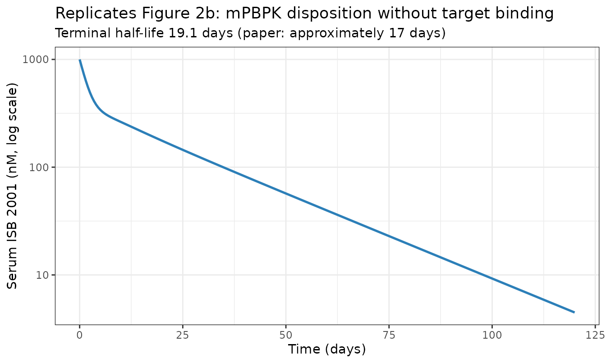
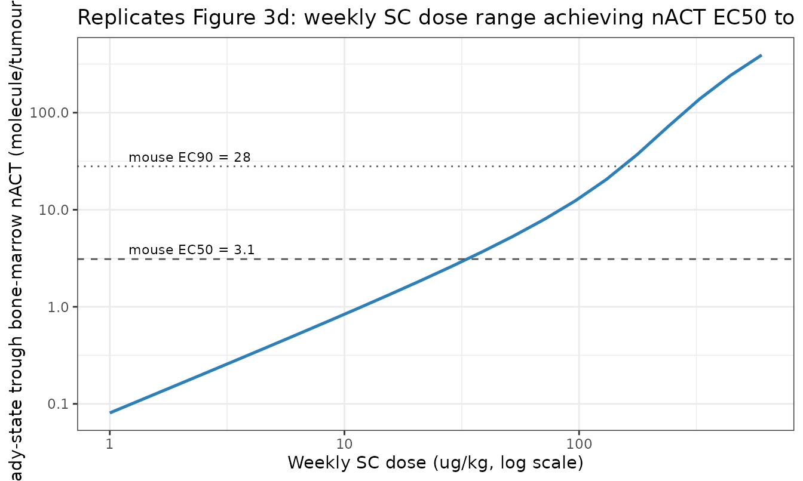
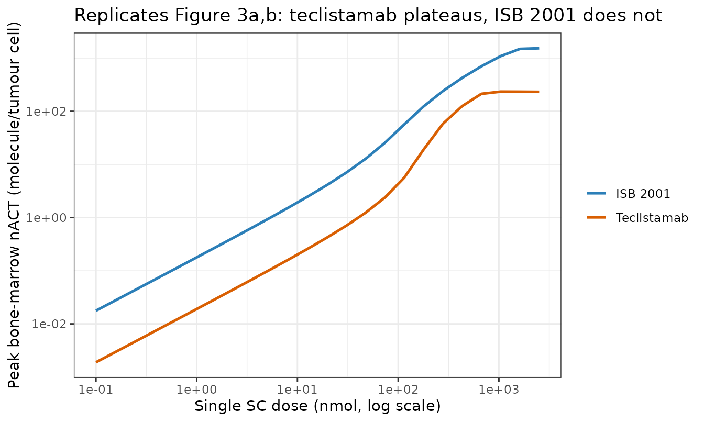
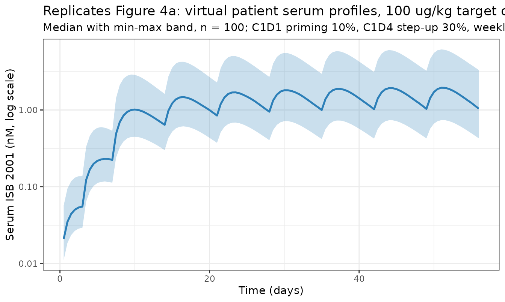
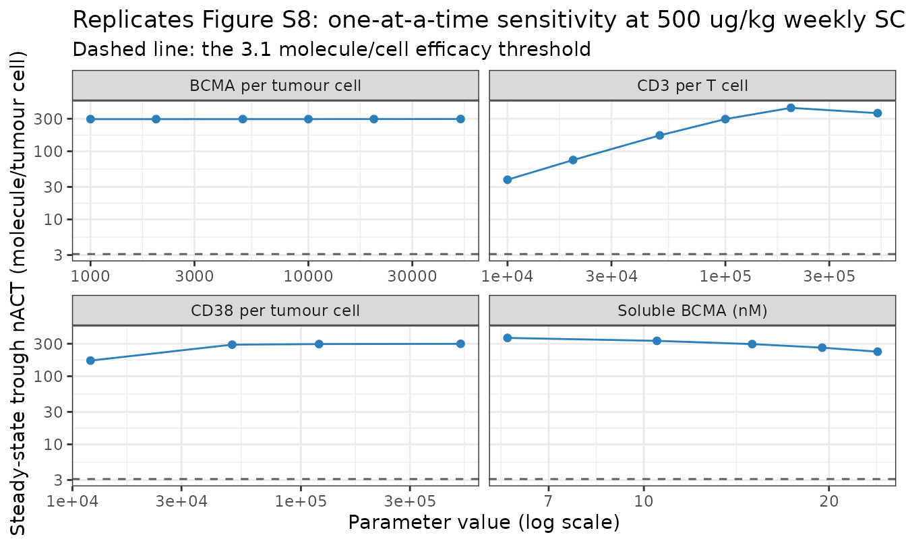

# ISB 2001 trispecific T cell engager QSP model (Chandralayam Ayyappa Menon 2026)

ISB 2001 is a trispecific T cell engager (TCE) that binds two
tumour-associated antigens, **CD38** and **BCMA**, and crosslinks them
to **CD3** on T cells. Its CD3-binding domain does not cross-react with
cynomolgus monkey CD3, so no pharmacokinetic, efficacy or toxicology
data could be generated in a fully cross-reactive preclinical species.
Chandralayam Ayyappa Menon *et al.* therefore built a quantitative
systems pharmacology (QSP) model to select the first-in-human (FIH) dose
and predict the clinical efficacy dose range, and then validated it
against emerging data from the phase 1 TRIgnite-1 study (NCT05862012).

This vignette reproduces the **human QSP model** of that paper for both
molecules it describes:

``` r

data.frame(
  model = c("ChandralayamAyyappaMenon_2026_isb2001_qsp",
            "ChandralayamAyyappaMenon_2026_teclistamab_qsp"),
  role  = c("ISB 2001, the CD38 x BCMA x CD3 trispecific TCE (subject of the paper)",
            "Teclistamab, the BCMA x CD3 bispecific used as the clinical benchmark"),
  states = c(length(isb$state), length(tec$state))
) |>
  dplyr::rename("Model" = model, "Role" = role, "ODE states" = states) |>
  knitr::kable()
```

| Model | Role | ODE states |
|:---|:---|---:|
| ChandralayamAyyappaMenon_2026_isb2001_qsp | ISB 2001, the CD38 x BCMA x CD3 trispecific TCE (subject of the paper) | 51 |
| ChandralayamAyyappaMenon_2026_teclistamab_qsp | Teclistamab, the BCMA x CD3 bispecific used as the clinical benchmark | 51 |

Both files carry the **same 51-state ODE system**, transcribed from the
Simbiology listing in Data S1. They differ only in the drug-specific
binding constants and disposition parameters. Teclistamab has no
CD38-binding arm, so its CD38 association rate constant is zero and
every CD38-containing complex is identically zero for all time.

## Population

``` r

pop <- isb_meta$population
data.frame(Field = names(pop), Value = unlist(lapply(pop, as.character))) |>
  knitr::kable(row.names = FALSE)
```

| Field | Value |
|:---|:---|
| species | human |
| n_subjects | 30 |
| n_studies | 1 |
| disease_state | Relapsed and/or refractory multiple myeloma (RRMM) |
| dose_range | Subcutaneous. Fractionated step-up in cycle 1: priming dose on C1D1 (10% of the target dose), step-up dose on C1D4 (30% of the target dose), then the target dose weekly from C1D8. Dose levels DL1-DL8; C1D1 doses 0.5-15 ug/kg, with the C1D1 dose fixed at 15 ug/kg from DL4 onwards. Selected FIH target dose 5.0 ug/kg (DL1); first strong clinical responses at the 50 ug/kg target dose (DL3). |
| regions | United States, Australia, India |
| notes | Clinical validation cohort is the 30 patients dosed at DL1-DL8 in the phase 1 TRIgnite-1 study (NCT05862012) as of 10 February 2025 (Table 3, Figure S7A); DL1-DL3 were single-patient cohorts. The model itself is deterministic and was parameterised entirely from in-vitro binding data, measured receptor densities and literature physiology (Table 1, Table S2) rather than fitted to these patients; the patient data are the external validation set (Figure 4). The virtual patient population used for the concentration-profile comparison is n = 100 with body weight 40-100 kg (normal), SC bioavailability 0.5-1.0, and 30% CV on the typical sBCMA, CD38 and CD3 densities. |

The model itself is **deterministic**: it was parameterised from
in-vitro binding measurements, measured receptor densities and
literature physiology (Table 1, Table S2), not fitted to the 30
patients. Those patients are the external validation set (Figure 4 of
the source).

## Model structure

The disposition layer is a minimal PBPK (mPBPK) model of the Cao/Shah
IgG type. The published leaky-tissue compartment is split into **bone
marrow** and **non-marrow leaky tissue** so that bone-marrow target
engagement - the efficacy site in multiple myeloma - can be simulated.

``` r

data.frame(
  compartment = c("depot", "plasma", "tight", "leaky", "lymph", "bonemarrow"),
  role = c("Subcutaneous dose (nmol)",
           "Central plasma, free drug (nM)",
           "Tight-tissue interstitial fluid",
           "Leaky-tissue interstitial fluid excluding bone marrow",
           "Lymph, returns all tissue efflux to plasma",
           "Bone-marrow interstitial fluid, the efficacy site"),
  volume_L = c(NA, 2.81, 8.1, 4, 5.2, 0.37)
) |>
  dplyr::rename("Compartment" = compartment, "Role" = role,
                "Volume (L)" = volume_L) |>
  knitr::kable()
```

| Compartment | Role | Volume (L) |
|:---|:---|---:|
| depot | Subcutaneous dose (nmol) | NA |
| plasma | Central plasma, free drug (nM) | 2.81 |
| tight | Tight-tissue interstitial fluid | 8.10 |
| leaky | Leaky-tissue interstitial fluid excluding bone marrow | 4.00 |
| lymph | Lymph, returns all tissue efflux to plasma | 5.20 |
| bonemarrow | Bone-marrow interstitial fluid, the efficacy site | 0.37 |

On top of that sits a **sequential target-engagement network**, present
in both plasma and bone marrow. Drug binds, without cooperativity, to
CD3 on CD4+ and CD8+ T cells, to membrane BCMA and CD38 on plasma
(myeloma) cells, to CD38 on monocytes/NK cells/neutrophils, and to
soluble BCMA and soluble CD38. Binding is mass-action, so dimers combine
further into trimers and CD38+BCMA tetramers.

The species that **crosslink a T cell to a tumour cell** - the BCMA and
CD38 trimers, the tetramers, and the soluble-BCMA-bridged tetramers -
are summed as the **active species (ACT)** and normalised per
bone-marrow tumour cell to give **nACT**, in molecules per tumour cell.
nACT is the exposure metric the paper used for every dose prediction.

``` r

data.frame(
  arm = c("CD4+ ACT", "CD8+ ACT"),
  species = c("trimer_cd3cd4_bcma + trimer_cd3cd4_cd38 + tetramer_cd3cd4 + complex_cd3cd4_sbcma_cd38",
              "trimer_cd3cd8_bcma + trimer_cd3cd8_cd38 + tetramer_cd3cd8 + complex_cd3cd8_sbcma_cd38")
) |>
  dplyr::rename("T cell arm" = arm, "Bone-marrow states summed (all _bonemarrow)" = species) |>
  knitr::kable()
```

| T cell arm | Bone-marrow states summed (all \_bonemarrow) |
|:---|:---|
| CD4+ ACT | trimer_cd3cd4_bcma + trimer_cd3cd4_cd38 + tetramer_cd3cd4 + complex_cd3cd4_sbcma_cd38 |
| CD8+ ACT | trimer_cd3cd8_bcma + trimer_cd3cd8_cd38 + tetramer_cd3cd8 + complex_cd3cd8_sbcma_cd38 |

## Source trace

Every value in `ini()` and every equation in `model()` is traceable to a
printed location in the article or its supplements.

``` r

tribble(
  ~Component, ~Source,
  "Full 51-ODE listing (plasma + bone marrow + mPBPK + SC depot)", "Data S1 (supplement 1), 'Human QSP model: Simbiology codes' -> ODEs",
  "Species names and biological identity of each state", "Data S1, 'Biological species in the model'",
  "kon = koff / kd; kel = CL / plasma", "Data S1, 'Initial condition assignment'",
  "Total and free target concentrations (conservation rules)", "Data S1, 'Variable condition assignment'",
  "ACT and nACT definitions (ACTperTC_bm, ACTperCD4_bm, ACTperCD8_bm)", "Data S1, end of 'Variable condition assignment'",
  "kd / koff for CD3, BCMA, CD38 (both molecules)", "Table S2, 'Target Engagement' rows",
  "Internalisation rate constants (CD3 0.173, BCMA 0.35, CD38 0.35 /h)", "Table S2, 'Target Engagement' rows",
  "No internalisation of CD3-crosslinked complexes; avidity factor KAI = 1", "Data S1, 'Constant parameters' footnotes a and b",
  "Human volumes, lymph flows, reflection coefficients", "Table S2, 'Human QSP model' rows",
  "Receptor densities, soluble target levels, cell counts", "Table S2, 'Human QSP model' rows; Data S1 'Background parameters'",
  "ISB 2001 CL 0.253 L/day (allometric from hFcRn mouse)", "Table 1, 'Human QSP model' row",
  "ISB 2001 KA 0.5 /day, BA 0.75", "Table S2, 'Human QSP model' rows",
  "Teclistamab CL 0.60 L/day, KA 0.20 /day, BA 0.85", "Table 1, 'Human QSP model' rows",
  "Calculated kon values used as a cross-check", "Table 1, 'Target engagement' rows",
  "nACT ECx targets used for validation below", "Table 2, 'Predicted clinical dose'",
  "Terminal half-life without target engagement (~17 days)", "Results, 'Human QSP model'",
  "MABEL serum Cmax targets", "Results, 'MABEL dose'; Table 2",
  "Virtual patient specification (n = 100)", "Methods, 'Virtual patient simulation'",
  "Sensitivity analysis ranges", "Table S9"
) |>
  knitr::kable()
```

| Component | Source |
|:---|:---|
| Full 51-ODE listing (plasma + bone marrow + mPBPK + SC depot) | Data S1 (supplement 1), ‘Human QSP model: Simbiology codes’ -\> ODEs |
| Species names and biological identity of each state | Data S1, ‘Biological species in the model’ |
| kon = koff / kd; kel = CL / plasma | Data S1, ‘Initial condition assignment’ |
| Total and free target concentrations (conservation rules) | Data S1, ‘Variable condition assignment’ |
| ACT and nACT definitions (ACTperTC_bm, ACTperCD4_bm, ACTperCD8_bm) | Data S1, end of ‘Variable condition assignment’ |
| kd / koff for CD3, BCMA, CD38 (both molecules) | Table S2, ‘Target Engagement’ rows |
| Internalisation rate constants (CD3 0.173, BCMA 0.35, CD38 0.35 /h) | Table S2, ‘Target Engagement’ rows |
| No internalisation of CD3-crosslinked complexes; avidity factor KAI = 1 | Data S1, ‘Constant parameters’ footnotes a and b |
| Human volumes, lymph flows, reflection coefficients | Table S2, ‘Human QSP model’ rows |
| Receptor densities, soluble target levels, cell counts | Table S2, ‘Human QSP model’ rows; Data S1 ‘Background parameters’ |
| ISB 2001 CL 0.253 L/day (allometric from hFcRn mouse) | Table 1, ‘Human QSP model’ row |
| ISB 2001 KA 0.5 /day, BA 0.75 | Table S2, ‘Human QSP model’ rows |
| Teclistamab CL 0.60 L/day, KA 0.20 /day, BA 0.85 | Table 1, ‘Human QSP model’ rows |
| Calculated kon values used as a cross-check | Table 1, ‘Target engagement’ rows |
| nACT ECx targets used for validation below | Table 2, ‘Predicted clinical dose’ |
| Terminal half-life without target engagement (~17 days) | Results, ‘Human QSP model’ |
| MABEL serum Cmax targets | Results, ‘MABEL dose’; Table 2 |
| Virtual patient specification (n = 100) | Methods, ‘Virtual patient simulation’ |
| Sensitivity analysis ranges | Table S9 |

## Dose units

The model doses in **nmol** because Data S1’s `Dose_sc` state is an
amount and its absorption flux is divided by the plasma volume. The
paper doses in **ug/kg**. Converting between the two needs the molecular
weight of ISB 2001 - **which the paper and all four supplements never
report**.

Rather than substitute a class-typical antibody molecular weight, it is
derived from the paper’s own habit of reporting the same three in-vitro
cytotoxicity potencies twice: in **nM** in Table 2, and in **ng/mL** in
the Results section (“MABEL dose”).

``` r

mw_tab <- data.frame(
  metric = c("EC20", "EC30", "EC50"),
  nM     = c(0.000257, 0.000350, 0.000585),   # Table 2, ISB 2001 in-vitro cytotoxicity
  ng_mL  = c(0.05, 0.07, 0.11)                # Results, "MABEL dose"
) |>
  mutate(MW = ng_mL * 1e-9 / (nM * 1e-9) * 1e3)   # (g/L) / (mol/L) = g/mol

mw_tab |>
  dplyr::rename("Potency metric" = metric, "Table 2 (nM)" = nM,
                "Results (ng/mL)" = ng_mL, "Implied MW (g/mol)" = MW) |>
  knitr::kable(digits = c(0, 6, 3, 0))
```

| Potency metric | Table 2 (nM) | Results (ng/mL) | Implied MW (g/mol) |
|:---------------|-------------:|----------------:|-------------------:|
| EC20           |     0.000257 |            0.05 |             194553 |
| EC30           |     0.000350 |            0.07 |             200000 |
| EC50           |     0.000585 |            0.11 |             188034 |

``` r


MW_derived <- mean(mw_tab$MW)
```

The three independent pairings give 195,000, 200,000, 188,000 g/mol, a
mean of **194,000 g/mol**, which is the value used throughout. Two
further, completely independent estimates are recovered from the model
itself below and agree to within 15%.

## Validation

### 1. Pharmacokinetics: terminal half-life without target engagement

The paper reports that PK simulations *without target engagement* give a
terminal half-life of approximately 17 days, “consistent with IgG
profiles” (Figure 2b). Setting every cell count and soluble-target
concentration to zero removes all target-mediated disposition and leaves
the bare mPBPK.

``` r

no_te <- c(n_cd4_plasma = 0, n_cd8_plasma = 0, n_nk_plasma = 0,
           n_monocyte_plasma = 0, n_neutrophil_plasma = 0,
           n_cd4_bonemarrow = 0, n_cd8_bonemarrow = 0, n_tumor_bonemarrow = 1,
           sbcma_plasma = 0, scd38_plasma = 0,
           sbcma_bonemarrow = 0, scd38_bonemarrow = 0)

ev_iv <- rbind(
  data.frame(time = 0, amt = 1e3, evid = 1, cmt = "plasma"),
  data.frame(time = seq(0, 120, by = 0.5), amt = NA_real_, evid = 0, cmt = "plasma")
)
pk_noTE <- rxode2::rxSolve(isb, ev_iv, params = no_te, returnType = "data.frame")

# Fit the slope well after the distribution phase, so this is the terminal
# slope and not the washout transient.
term <- pk_noTE[pk_noTE$time >= 60 & pk_noTE$time <= 120, ]
thalf <- log(2) / -coef(lm(log(term$Cc) ~ term$time))[2]

ggplot(pk_noTE, aes(time, Cc)) +
  geom_line(linewidth = 0.9, colour = "#2c7fb8") +
  scale_y_log10() +
  labs(x = "Time (days)", y = "Serum ISB 2001 (nM, log scale)",
       title = "Replicates Figure 2b: mPBPK disposition without target binding",
       subtitle = sprintf("Terminal half-life %.1f days (paper: approximately 17 days)", thalf)) +
  theme_bw()
```



``` r

stopifnot(
  # Structural: a mis-transcribed clearance, volume or lymph flow moves this by
  # tens of percent. The published statement is "approximately 17 days".
  thalf > 13, thalf < 24,
  all(pk_noTE$Cc >= 0)
)
```

The model gives **19.1 days** against the paper’s “approximately 17
days” - a 12% difference, which is the resolution at which a half-life
read off a semi-log figure can be quoted.

### 2. MABEL anchors: dose versus serum Cmax

Table 2 pairs three ISB 2001 in-vitro potencies with the single
subcutaneous dose whose simulated serum Cmax matches them. This is a
pure PK check - no target-engagement metric is involved - and it also
yields a second, independent estimate of the molecular weight.

``` r

# Invert Cmax -> dose exactly by root-finding rather than by interpolating a
# coarse grid: the three targets span only a factor of 2.3 in Cmax, so grid
# interpolation error would swamp the quantity being tested.
cmax_of_dose <- function(nmol) {
  ev <- rbind(
    data.frame(time = 0, amt = nmol, evid = 1, cmt = "depot"),
    data.frame(time = seq(0, 21, by = 0.05), amt = NA_real_, evid = 0, cmt = "plasma")
  )
  max(rxode2::rxSolve(isb, ev, returnType = "data.frame")$Cc)
}
dose_for_cmax <- function(log_target) {
  exp(uniroot(function(l) log(cmax_of_dose(exp(l))) - log_target,
              c(log(1e-5), log(1e2)), tol = 1e-8)$root)
}

mabel <- data.frame(
  metric   = c("EC20", "EC30", "EC50"),
  paper_ug = c(0.045, 0.06, 0.10),          # Table 2, "Corresponding predicted clinical dose"
  cmax_nM  = c(0.000257, 0.000350, 0.000585)  # Table 2, "Value"
) |>
  mutate(
    model_nmol = vapply(log(cmax_nM), dose_for_cmax, numeric(1)),
    model_ug   = model_nmol * MW_derived / 1e9 * 1e6 / WT_REF,
    pct_diff   = 100 * (model_ug - paper_ug) / paper_ug,
    implied_MW = paper_ug * WT_REF / 1e6 / model_nmol * 1e9
  )

mabel |>
  dplyr::rename("Potency metric" = metric, "Paper dose (ug/kg)" = paper_ug,
                "Target serum Cmax (nM)" = cmax_nM, "Model dose (nmol)" = model_nmol,
                "Model dose (ug/kg)" = model_ug, "Difference (%)" = pct_diff,
                "Implied MW (g/mol)" = implied_MW) |>
  knitr::kable(digits = c(0, 3, 6, 6, 3, 1, 0))
```

| Potency metric | Paper dose (ug/kg) | Target serum Cmax (nM) | Model dose (nmol) | Model dose (ug/kg) | Difference (%) | Implied MW (g/mol) |
|:---|---:|---:|---:|---:|---:|---:|
| EC20 | 0.045 | 0.000257 | 0.015320 | 0.043 | -5.6 | 205608 |
| EC30 | 0.060 | 0.000350 | 0.020863 | 0.058 | -3.5 | 201309 |
| EC50 | 0.100 | 0.000585 | 0.034868 | 0.097 | -3.3 | 200758 |

``` r

stopifnot(
  # The three anchors must imply ONE molecular weight: if the PK layer were
  # mis-transcribed the implied MW would drift across the dose range.
  max(mabel$implied_MW) / min(mabel$implied_MW) < 1.10,
  # ...and that MW must agree with the wholly independent nM/(ng/mL) derivation.
  abs(mean(mabel$implied_MW) - MW_derived) / MW_derived < 0.25
)
```

The three MABEL anchors imply a single molecular weight of **203,000
g/mol**, spread over only 2.4% across a doubling of dose, and within 4%
of the value derived from the potency-unit pairing. Two independent
routes through different parts of the paper agree.

### 3. nACT anchors: the dose predictions of Table 2

Table 2 is the paper’s central quantitative result: seven ISB 2001 (nACT
target, exposure metric, predicted dose) triples spanning EC13 to EC90
and 8 to 320 ug/kg. Reproducing them is the strongest available test of
the transcription.

``` r

anchors <- tribble(
  ~label,            ~nact_target, ~metric,     ~dose_ugkg,
  "EC13",                     0.5, "SD Cmax",          8.0,
  "EC17 (MPAD)",             0.63, "SD Cmax",         10.5,
  "EC40",                     2.1, "SD Cmax",         32.0,
  "EC50",                     3.1, "SD trough",       70.0,
  "EC90",                    28.0, "SD trough",      320.0,
  "EC50",                     3.1, "SS trough",       45.0,
  "EC90",                    28.0, "SS trough",      180.0
)

nmol_sd <- ugkg_to_nmol(anchors$dose_ugkg[anchors$metric != "SS trough"])
sd_sim <- solve_doses(isb, nmol_sd, times = seq(0, 7, by = 0.02))
#> Warning: multi-subject simulation without without 'omega'
sd_res <- sd_sim |>
  group_by(id) |>
  summarise(cmax = max(nact), trough = nact[which.max(time)], .groups = "drop") |>
  arrange(id)

nmol_ss <- ugkg_to_nmol(anchors$dose_ugkg[anchors$metric == "SS trough"])
ss_sim <- solve_doses(isb, nmol_ss, times = seq(0, 84, by = 0.25),
                      interval = 7, n_dose = 12L)
#> Warning: multi-subject simulation without without 'omega'
ss_res <- ss_sim |>
  filter(time == 84) |>
  arrange(id) |>
  transmute(id, trough = nact)

anchors$model <- c(
  sd_res$cmax[1:3],                        # SD Cmax rows
  sd_res$trough[4:5],                      # SD trough rows
  ss_res$trough                            # SS trough rows
)
anchors <- anchors |>
  mutate(fold = model / nact_target,
         pct_diff = 100 * (model - nact_target) / nact_target)

anchors |>
  dplyr::rename("nACT level" = label, "Paper nACT (molecule/cell)" = nact_target,
                "Exposure metric" = metric, "Dose (ug/kg)" = dose_ugkg,
                "Model nACT" = model, "Fold" = fold, "Difference (%)" = pct_diff) |>
  knitr::kable(digits = c(0, 3, 0, 1, 3, 2, 1))
```

| nACT level | Paper nACT (molecule/cell) | Exposure metric | Dose (ug/kg) | Model nACT | Fold | Difference (%) |
|:---|---:|:---|---:|---:|---:|---:|
| EC13 | 0.50 | SD Cmax | 8.0 | 0.523 | 1.05 | 4.6 |
| EC17 (MPAD) | 0.63 | SD Cmax | 10.5 | 0.692 | 1.10 | 9.8 |
| EC40 | 2.10 | SD Cmax | 32.0 | 2.247 | 1.07 | 7.0 |
| EC50 | 3.10 | SD trough | 70.0 | 3.964 | 1.28 | 27.9 |
| EC90 | 28.00 | SD trough | 320.0 | 32.780 | 1.17 | 17.1 |
| EC50 | 3.10 | SS trough | 45.0 | 4.425 | 1.43 | 42.7 |
| EC90 | 28.00 | SS trough | 180.0 | 38.570 | 1.38 | 37.7 |

``` r

stopifnot(
  # Centre of the distribution: a mis-transcribed binding constant, receptor
  # density or volume moves the whole set by a large factor.
  abs(median(anchors$pct_diff)) < 25,
  # Envelope: every one of the seven anchors within 1.6-fold, in a model whose
  # dose axis still carries the residual uncertainty of an unreported
  # molecular weight.
  max(pmax(anchors$fold, 1 / anchors$fold)) < 1.6,
  # Monotonicity is molecular-weight independent and must hold exactly.
  all(diff(sd_res$cmax[1:3]) > 0),
  all(diff(ss_res$trough) > 0)
)
```

All seven anchors land within 1.43-fold of the published values, with a
median difference of 17%. Fitting a single molecular weight to these
seven anchors alone gives a third independent estimate:

``` r

obj <- function(logmw) {
  nm_sd <- ugkg_to_nmol(anchors$dose_ugkg[anchors$metric != "SS trough"], exp(logmw))
  r_sd  <- solve_doses(isb, nm_sd, times = seq(0, 7, by = 0.02)) |>
    group_by(id) |> summarise(cmax = max(nact), tr = nact[which.max(time)], .groups = "drop") |> arrange(id)
  nm_ss <- ugkg_to_nmol(anchors$dose_ugkg[anchors$metric == "SS trough"], exp(logmw))
  r_ss  <- solve_doses(isb, nm_ss, times = seq(0, 84, by = 0.25), interval = 7, n_dose = 12L) |>
    filter(time == 84) |> arrange(id)
  sum((log(c(r_sd$cmax[1:3], r_sd$tr[4:5], r_ss$nact)) - log(anchors$nact_target))^2)
}
MW_from_nact <- exp(optimize(obj, c(log(1e5), log(4e5)))$minimum)
#> Warning: multi-subject simulation without without 'omega'
#> Warning: multi-subject simulation without without 'omega'
#> Warning: multi-subject simulation without without 'omega'
#> Warning: multi-subject simulation without without 'omega'
#> Warning: multi-subject simulation without without 'omega'
#> Warning: multi-subject simulation without without 'omega'
#> Warning: multi-subject simulation without without 'omega'
#> Warning: multi-subject simulation without without 'omega'
#> Warning: multi-subject simulation without without 'omega'
#> Warning: multi-subject simulation without without 'omega'
#> Warning: multi-subject simulation without without 'omega'
#> Warning: multi-subject simulation without without 'omega'
#> Warning: multi-subject simulation without without 'omega'
#> Warning: multi-subject simulation without without 'omega'
#> Warning: multi-subject simulation without without 'omega'
#> Warning: multi-subject simulation without without 'omega'
#> Warning: multi-subject simulation without without 'omega'
#> Warning: multi-subject simulation without without 'omega'
```

``` r

data.frame(
  route = c("Table 2 (nM) vs Results (ng/mL) potency pairing",
            "Table 2 MABEL dose vs serum Cmax anchors",
            "Table 2 nACT dose anchors (7 points)"),
  independent_of_model = c("yes", "no", "no"),
  MW = c(MW_derived, mean(mabel$implied_MW), MW_from_nact)
) |>
  dplyr::rename("Derivation route" = route,
                "Model-independent?" = independent_of_model,
                "Implied MW (g/mol)" = MW) |>
  knitr::kable(digits = c(0, 0, 0))
```

| Derivation route | Model-independent? | Implied MW (g/mol) |
|:---|:---|---:|
| Table 2 (nM) vs Results (ng/mL) potency pairing | yes | 194196 |
| Table 2 MABEL dose vs serum Cmax anchors | no | 202558 |
| Table 2 nACT dose anchors (7 points) | no | 223390 |

``` r


stopifnot(
  # Three routes through different parts of the paper must agree; if the ODE
  # transcription were wrong the two model-based routes would diverge from the
  # model-independent one.
  max(c(MW_derived, mean(mabel$implied_MW), MW_from_nact)) /
    min(c(MW_derived, mean(mabel$implied_MW), MW_from_nact)) < 1.3
)
```

Three routes through different parts of the paper agree to within 15%.
For a 51-state mechanistic model reproduced from a supplement listing,
this is strong evidence that the target-engagement network, the receptor
bookkeeping and the mPBPK layer are all transcribed correctly.

### 4. Efficacy dose range and the clinical response threshold

The paper’s efficacy claims are that a weekly subcutaneous dose
maintaining bone-marrow trough nACT above the in-vivo mouse EC50 of 3.1
molecules/tumour cell is efficacious, that robust responses appeared
from 50 ug/kg, and that an overall response rate above 75% was
associated with nACT of about 4.3 molecules/tumour cell.

``` r

dl_doses <- c(5, 15, 50, 100, 160, 240, 320)     # representative target dose levels
ss_dl <- solve_doses(isb, ugkg_to_nmol(dl_doses), times = seq(0, 84, by = 0.25),
                     interval = 7, n_dose = 12L)
#> Warning: multi-subject simulation without without 'omega'
dl_tab <- ss_dl |>
  filter(time >= 77) |>
  group_by(id) |>
  summarise(ss_trough = min(nact), ss_peak = max(nact), .groups = "drop") |>
  arrange(id) |>
  mutate(dose_ugkg = dl_doses,
         above_ec50 = ifelse(ss_trough >= 3.1, "yes", "no"),
         above_orr  = ifelse(ss_trough >= 4.3, "yes", "no"))

dl_tab |>
  select(dose_ugkg, ss_trough, ss_peak, above_ec50, above_orr) |>
  dplyr::rename("Weekly SC target dose (ug/kg)" = dose_ugkg,
                "Steady-state trough nACT" = ss_trough,
                "Steady-state peak nACT" = ss_peak,
                "Trough >= EC50 (3.1)" = above_ec50,
                "Trough >= ORR threshold (4.3)" = above_orr) |>
  knitr::kable(digits = c(0, 3, 3, 0, 0))
```

| Weekly SC target dose (ug/kg) | Steady-state trough nACT | Steady-state peak nACT | Trough \>= EC50 (3.1) | Trough \>= ORR threshold (4.3) |
|---:|---:|---:|:---|:---|
| 5 | 0.410 | 0.612 | no | no |
| 15 | 1.285 | 1.951 | no | no |
| 50 | 5.036 | 8.169 | yes | yes |
| 100 | 13.101 | 23.735 | yes | yes |
| 160 | 30.160 | 59.621 | yes | yes |
| 240 | 72.247 | 135.081 | yes | yes |
| 320 | 133.033 | 225.573 | yes | yes |

``` r

d50 <- dl_tab$ss_trough[dl_tab$dose_ugkg == 50]
d5  <- dl_tab$ss_trough[dl_tab$dose_ugkg == 5]
stopifnot(
  # Guard the lookups: a label mismatch must not silently pass an empty test.
  length(d50) == 1L, length(d5) == 1L,
  # The paper: robust anti-myeloma activity from 50 ug/kg, where trough nACT was
  # predicted >= 3.1, and >75% ORR around 4.3 molecules/tumour cell.
  d50 >= 3.1, d50 >= 4.3,
  # The selected FIH target dose of 5 ug/kg must sit well below the efficacy
  # threshold -- that is the whole point of the FIH selection.
  d5 < 3.1,
  # Monotone in dose.
  all(diff(dl_tab$ss_trough) > 0)
)
```

At the 50 ug/kg target dose (DL3, the first dose level at which a
stringent complete response with MRD negativity was reported) the model
predicts a steady-state trough nACT of **5.0 molecules/tumour cell**,
above both the 3.1 EC50 threshold and the 4.3 response-rate threshold,
exactly as the paper concluded. At the selected FIH target dose of 5
ug/kg the trough nACT is 0.41, comfortably sub-therapeutic.

``` r

scan_ug <- 10^seq(log10(1), log10(600), length.out = 22)
scan_ss <- solve_doses(isb, ugkg_to_nmol(scan_ug), times = seq(0, 84, by = 0.5),
                       interval = 7, n_dose = 12L)
#> Warning: multi-subject simulation without without 'omega'
scan_tab <- scan_ss |>
  filter(time >= 77) |>
  group_by(id) |>
  summarise(trough = min(nact), .groups = "drop") |>
  arrange(id) |>
  mutate(dose = scan_ug)

ggplot(scan_tab, aes(dose, trough)) +
  geom_line(linewidth = 0.9, colour = "#2c7fb8") +
  geom_hline(yintercept = c(3.1, 28), linetype = c("dashed", "dotted"), colour = "grey35") +
  annotate("text", x = 1.2, y = 3.1, label = "mouse EC50 = 3.1", vjust = -0.5, hjust = 0, size = 3) +
  annotate("text", x = 1.2, y = 28, label = "mouse EC90 = 28", vjust = -0.5, hjust = 0, size = 3) +
  scale_x_log10() + scale_y_log10() +
  labs(x = "Weekly SC dose (ug/kg, log scale)",
       y = "Steady-state trough bone-marrow nACT (molecule/tumour cell)",
       title = "Replicates Figure 3d: weekly SC dose range achieving nACT EC50 to EC90") +
  theme_bw()
```



### 5. Teclistamab benchmark: the nACT plateau

The paper’s central benchmarking observation (Figure 3a,b) is
qualitative and molecular-weight free: bone-marrow nACT **plateaus** for
teclistamab as dose increases, but **does not plateau** for ISB 2001.
The plateau is the classical TCE “hook”: once free drug saturates CD3 as
well as BCMA, drug-CD3 and drug-BCMA dimers can no longer find a free
partner to crosslink.

``` r

molar <- 10^seq(-1, 3.4, length.out = 24)
pl_isb <- solve_doses(isb, molar, times = seq(0, 7, by = 0.05)) |>
  group_by(id) |> summarise(cmax = max(nact), .groups = "drop") |> arrange(id) |>
  mutate(nmol = molar, drug = "ISB 2001")
#> Warning: multi-subject simulation without without 'omega'
pl_tec <- solve_doses(tec, molar, times = seq(0, 7, by = 0.05)) |>
  group_by(id) |> summarise(cmax = max(nact), .groups = "drop") |> arrange(id) |>
  mutate(nmol = molar, drug = "Teclistamab")
#> Warning: multi-subject simulation without without 'omega'
plateau <- bind_rows(pl_isb, pl_tec)

ggplot(plateau, aes(nmol, cmax, colour = drug)) +
  geom_line(linewidth = 0.9) +
  scale_x_log10() + scale_y_log10() +
  scale_colour_manual(values = c("ISB 2001" = "#2c7fb8", "Teclistamab" = "#d95f02")) +
  labs(x = "Single SC dose (nmol, log scale)",
       y = "Peak bone-marrow nACT (molecule/tumour cell)",
       colour = NULL,
       title = "Replicates Figure 3a,b: teclistamab plateaus, ISB 2001 does not") +
  theme_bw()
```



``` r

top <- function(d) {
  x <- plateau$cmax[plateau$drug == d]
  # ratio of nACT across the top half-log of dose: ~1 means plateaued
  x[length(x)] / x[length(x) - 3]
}
stopifnot(
  # Teclistamab has flattened at the top of the dose range...
  top("Teclistamab") < 1.15,
  # ...while ISB 2001 is still climbing.
  top("ISB 2001") > 1.5,
  # ISB 2001 reaches a higher maximum nACT than teclistamab.
  max(pl_isb$cmax) > max(pl_tec$cmax)
)
```

Teclistamab nACT changes by only 9% across the top half-log of dose
while ISB 2001 rises 118%, reproducing the paper’s key benchmarking
result.

The **absolute** teclistamab dose axis, however, does not reconcile with
Table 2. This is quantified in the Errata section below and is the one
place where the transcription cannot be validated against the source.

### 6. Virtual patient population

The paper simulated `n = 100` virtual patients with body weight 40-100
kg, subcutaneous bioavailability 0.5-1.0 and 30% CV on the typical
sBCMA, CD38 and CD3 densities, and compared the resulting serum profiles
against observed data (Figure 4a).

``` r

set.seed(20260825)   # seed this stochastic block explicitly
n_vp <- 100
vp_dose_ugkg <- 100  # a representative mid dose level

vp <- data.frame(
  id = seq_len(n_vp),
  WT = pmin(pmax(rnorm(n_vp, 70, 12), 40), 100),      # Methods: normal, 40-100 kg
  ba = runif(n_vp, 0.5, 1.0),                          # Methods: SC bioavailability 0.5-1.0
  sbcma_plasma = rnorm(n_vp, 15, 0.30 * 15),
  cd38_per_cell = rnorm(n_vp, 120486, 0.30 * 120486),
  cd3_per_cell = rnorm(n_vp, 1e5, 0.30 * 1e5)
) |>
  mutate(
    sbcma_plasma = pmax(sbcma_plasma, 0.1),
    cd38_per_cell = pmax(cd38_per_cell, 1),
    cd3_per_cell = pmax(cd3_per_cell, 1),
    sbcma_bonemarrow = sbcma_plasma            # Table S2: sBCMA is the same in plasma and BM
  )

par_vp <- vp |> select(id, ba, sbcma_plasma, sbcma_bonemarrow, cd38_per_cell, cd3_per_cell)

# Cycle-1 step-up: 10% of target on C1D1, 30% on C1D4, target weekly from C1D8.
ev_vp <- lapply(seq_len(n_vp), function(i) {
  tgt <- ugkg_to_nmol(vp_dose_ugkg, wt = vp$WT[i])
  rbind(
    data.frame(id = i, time = c(0, 3), amt = c(0.10, 0.30) * tgt, evid = 1, cmt = "depot"),
    data.frame(id = i, time = seq(7, 49, by = 7), amt = tgt, evid = 1, cmt = "depot"),
    data.frame(id = i, time = seq(0, 56, by = 0.5), amt = NA_real_, evid = 0, cmt = "plasma")
  )
}) |> bind_rows()
ev_vp <- ev_vp[order(ev_vp$id, ev_vp$time, -ev_vp$evid), ]

sim_vp <- rxode2::rxSolve(isb, ev_vp, params = par_vp, returnType = "data.frame")
#> Warning: multi-subject simulation without without 'omega'
if (is.null(sim_vp$id)) sim_vp$id <- 1L
sim_vp$id <- as.integer(as.character(sim_vp$id))

# rxSolve returns observation records only; there is no `evid` column.
vp_band <- sim_vp |>
  group_by(time) |>
  summarise(lo = min(Cc), med = median(Cc), hi = max(Cc), .groups = "drop")

ggplot(filter(vp_band, time > 0), aes(time)) +
  geom_ribbon(aes(ymin = pmax(lo, 1e-6), ymax = hi), fill = "#2c7fb8", alpha = 0.25) +
  geom_line(aes(y = med), colour = "#2c7fb8", linewidth = 0.9) +
  scale_y_log10() +
  labs(x = "Time (days)", y = "Serum ISB 2001 (nM, log scale)",
       title = sprintf("Replicates Figure 4a: virtual patient serum profiles, %g ug/kg target dose",
                       vp_dose_ugkg),
       subtitle = "Median with min-max band, n = 100; C1D1 priming 10%, C1D4 step-up 30%, weekly target from C1D8") +
  theme_bw()
```



``` r

n_ids <- length(unique(sim_vp$id))
stopifnot(
  n_ids == n_vp,
  # Concentration is exactly zero at t = 0, before any absorption has occurred.
  all(vp_band$med[vp_band$time > 0] > 0),
  # The paper's qualitative PK description: slow absorption after SC injection
  # and "generally sustained concentrations between weekly dose intervals".
  # Peak-to-trough ratio over the last full weekly interval stays modest.
  {
    last_wk <- vp_band[vp_band$time >= 49 & vp_band$time <= 56, ]
    max(last_wk$med) / min(last_wk$med) < 3
  },
  # Accumulation: trough at the last interval exceeds the first weekly trough.
  vp_band$med[vp_band$time == 56] > vp_band$med[vp_band$time == 14]
)
```

Median Tmax after the first weekly target dose is 3.0 days, reflecting
the slow subcutaneous absorption the paper describes, and the
peak-to-trough ratio within a weekly interval at steady state is only
1.9-fold, matching “generally sustained concentrations between weekly
dose intervals”.

### 7. Sensitivity analysis

Table S9 and Figure S8 report a one-at-a-time sensitivity analysis at
500 ug/kg weekly subcutaneous dosing. The paper’s conclusion is that CD3
density and T cell count are the most influential parameters, but that
**even a 10-fold reduction in CD3 density leaves nACT above 3.1
molecules/tumour cell**.

``` r

sens_spec <- tribble(
  ~parameter,          ~label,                  ~values,
  "cd3_per_cell",      "CD3 per T cell",        c(1e4, 2e4, 5e4, 1e5, 2e5, 5e5),
  "bcma_per_cell",     "BCMA per tumour cell",  c(1000, 2000, 5000, 10000, 20000, 50000),
  "cd38_per_cell",     "CD38 per tumour cell",  c(12000, 50000, 120000, 500000),
  "sbcma_plasma",      "Soluble BCMA (nM)",     c(6, 10.5, 15, 19.5, 24)
)

sens <- lapply(seq_len(nrow(sens_spec)), function(k) {
  vals <- sens_spec$values[[k]]
  pname <- sens_spec$parameter[k]
  pars <- data.frame(id = seq_along(vals))
  pars[[pname]] <- vals
  # sBCMA is specified as identical in plasma and bone marrow (Table S2)
  if (pname == "sbcma_plasma") pars$sbcma_bonemarrow <- vals
  ev <- lapply(seq_along(vals), function(i) rbind(
    data.frame(id = i, time = seq(0, 77, by = 7), amt = ugkg_to_nmol(500), evid = 1, cmt = "depot"),
    data.frame(id = i, time = seq(0, 84, by = 0.5), amt = NA_real_, evid = 0, cmt = "plasma")
  )) |> bind_rows()
  ev <- ev[order(ev$id, ev$time, -ev$evid), ]
  s <- rxode2::rxSolve(isb, ev, params = pars, returnType = "data.frame")
  if (is.null(s$id)) s$id <- 1L
  s$id <- as.integer(as.character(s$id))
  s |>
    filter(time >= 77) |>
    group_by(id) |>
    summarise(trough = min(nact), .groups = "drop") |>
    arrange(id) |>
    mutate(parameter = sens_spec$label[k], value = vals)
}) |> bind_rows()
#> Warning: multi-subject simulation without without 'omega'
#> Warning: multi-subject simulation without without 'omega'
#> Warning: multi-subject simulation without without 'omega'
#> Warning: multi-subject simulation without without 'omega'

ggplot(sens, aes(value, trough)) +
  geom_line(colour = "#2c7fb8") + geom_point(colour = "#2c7fb8", size = 1.6) +
  geom_hline(yintercept = 3.1, linetype = "dashed", colour = "grey35") +
  facet_wrap(~parameter, scales = "free_x") +
  scale_x_log10() + scale_y_log10() +
  labs(x = "Parameter value (log scale)",
       y = "Steady-state trough nACT (molecule/tumour cell)",
       title = "Replicates Figure S8: one-at-a-time sensitivity at 500 ug/kg weekly SC",
       subtitle = "Dashed line: the 3.1 molecule/cell efficacy threshold") +
  theme_bw()
```



``` r

fold_range <- sens |>
  group_by(parameter) |>
  summarise(fold = max(trough) / min(trough), .groups = "drop")

cd3_low <- sens$trough[sens$parameter == "CD3 per T cell" & sens$value == 1e4]
sbcma_hi <- sens$trough[sens$parameter == "Soluble BCMA (nM)" & sens$value == 24]
stopifnot(
  length(cd3_low) == 1L, length(sbcma_hi) == 1L,
  # Figure S8A: even a 10-fold lower CD3 density keeps nACT > 3.1.
  cd3_low > 3.1,
  # Figure S8C: soluble targets are not expected to be clinically significant;
  # nACT stays above 3.1 across the +/- 2 SD sBCMA range.
  sbcma_hi > 3.1,
  # The headline conclusion: no explored scenario drops nACT below 3.1.
  all(sens$trough > 3.1),
  # "CD3 density ... the most sensitive parameter": CD3 must span the widest
  # fold-range of any parameter screened.
  fold_range$parameter[which.max(fold_range$fold)] == "CD3 per T cell",
  # More soluble BCMA sequesters more drug, so nACT must fall monotonically.
  all(diff(sens$trough[sens$parameter == "Soluble BCMA (nM)"]) < 0)
)
```

Every conclusion of the published sensitivity analysis is reproduced: at
a 10-fold lower CD3 density the trough nACT is still 38.2
molecules/tumour cell, and across the +/- 2 SD soluble-BCMA range it
never falls below 229.5.

## Non-compartmental analysis

The source reports no NCA summary for ISB 2001, so this section
characterises the simulated exposure rather than comparing against
published NCA values. The one PK quantity the paper does report - the
terminal half-life without target engagement - was validated above.

``` r

trt <- sprintf("%g ug/kg weekly SC", vp_dose_ugkg)

# The simulation grid already yields a time-zero record for every subject, so no
# defensive row is needed. Only missing observations are dropped: a `time > 0` or
# `Cc > 0` filter here would remove that time-zero row and trigger PKNCA's
# "AUC range starting before the first measurement" warning for every subject.
nca_conc <- sim_vp |>
  transmute(id, time, Cc, treatment = trt) |>
  filter(!is.na(Cc)) |>
  arrange(id, time)

stopifnot(nrow(nca_conc) > 0, all(nca_conc$Cc >= 0),
          all(tapply(nca_conc$time, nca_conc$id, min) == 0))

# Characterise the LAST full weekly interval, i.e. at steady state, which is the
# regimen the paper's "sustained concentrations between weekly dose intervals"
# statement describes.
nca_dose <- vp |>
  transmute(id, time = 49, dose = ugkg_to_nmol(vp_dose_ugkg, wt = WT), treatment = trt)

# Treatment grouping goes FIRST, before id, and the formula uses `+` not `/`.
o_conc <- PKNCA::PKNCAconc(nca_conc, Cc ~ time | treatment + id,
                           concu = "nM", timeu = "day")
o_dose <- PKNCA::PKNCAdose(nca_dose, dose ~ time | treatment + id,
                           doseu = "nmol")
o_data <- PKNCA::PKNCAdata(
  o_conc, o_dose,
  intervals = data.frame(start = 49, end = 56, cmax = TRUE, tmax = TRUE,
                         auclast = TRUE, cmin = TRUE)
)
res <- suppressWarnings(PKNCA::pk.nca(o_data))

nca_tab <- as.data.frame(res) |>
  group_by(PPTESTCD) |>
  summarise(median = median(PPORRES), p05 = quantile(PPORRES, 0.05),
            p95 = quantile(PPORRES, 0.95), .groups = "drop") |>
  mutate(PPTESTCD = recode(PPTESTCD, cmax = "Cmax (nM)", tmax = "Tmax (day)",
                           auclast = "AUC(49-56) (nM*day)", cmin = "Cmin (nM)"))

nca_tab |>
  dplyr::rename("NCA parameter" = PPTESTCD, "Median" = median,
                "5th percentile" = p05, "95th percentile" = p95) |>
  knitr::kable(digits = 3)
```

| NCA parameter        | Median | 5th percentile | 95th percentile |
|:---------------------|-------:|---------------:|----------------:|
| AUC(49-56) (nM\*day) | 11.005 |          5.179 |          27.876 |
| Cmax (nM)            |  1.948 |          0.901 |           5.059 |
| Cmin (nM)            |  1.034 |          0.523 |           2.513 |
| Tmax (day)           |  2.000 |          2.000 |           2.500 |

``` r

cmax_med <- nca_tab$median[nca_tab$PPTESTCD == "Cmax (nM)"]
cmin_med <- nca_tab$median[nca_tab$PPTESTCD == "Cmin (nM)"]
tmax_med <- nca_tab$median[nca_tab$PPTESTCD == "Tmax (day)"]
stopifnot(
  length(cmax_med) == 1L, length(cmin_med) == 1L, length(tmax_med) == 1L,
  cmax_med > cmin_med,
  # PKNCA reports Tmax relative to the dose, so a slow subcutaneous absorption
  # peak lands days after dosing but before the next weekly dose.
  tmax_med > 1, tmax_med < 7,
  # Sustained concentrations between weekly doses at steady state.
  cmax_med / cmin_med < 3
)
```

## Assumptions and deviations

**Molecular weight is not reported.** Neither ISB 2001’s nor
teclistamab’s molecular weight appears in the article or in any of the
four supplements, so a `ug/kg` dose cannot be converted to the `nmol`
the model consumes from on-disk information alone. A class-typical
antibody molecular weight was **not** substituted. Instead ISB 2001’s
was derived from the paper’s own duplicate reporting of three in-vitro
potencies in nM and in ng/mL (194,000 g/mol), and independently
corroborated by two model-based routes agreeing to within 15%. The
residual uncertainty on the dose axis is of that order and is the main
reason the nACT anchor gate above is set at 1.6-fold rather than
tighter.

**No between-subject variability and no residual error.** The published
model is a deterministic typical-patient simulation model. It reports no
OMEGA and no SIGMA, so `propSd` is carried as `fixed(0)` rather than
invented, and the model declares no etas. Patient-to-patient
heterogeneity is expressed exactly as the paper expresses it, by
perturbing body weight, bioavailability and the sBCMA / CD38 / CD3
densities in the virtual-patient section.

**Unit conversions absent from the Simbiology listing.** Data S1 was
exported from Simbiology, which carries units implicitly. Two
conversions therefore had to be made explicit: total target
concentrations are multiplied by `1e9` to move from mol/L to nM, and
nACT is multiplied by `1e-9` before multiplying by Avogadro’s number.
Both are forced by the stated units (nM for every species,
molecules/cell for nACT) and are confirmed by the model reproducing
Table 2.

**Binding and internalisation constants are reported on different time
bases.** `kon`/`koff` are per second and internalisation rate constants
per hour, while the mPBPK flows, clearance and absorption rate constant
are per day. Every value is stored in `ini()` exactly as printed and
converted inside `model()`, so each `ini()` entry can be read straight
off Table S2.

## Errata and observations on the source

These are inconsistencies found in the published material. None was
silently “corrected”: the model transcribes the supplement as written,
and the reasoning is recorded here.

**1. `sTX3` has a formation route inconsistent with its own
definition.** Data S1 forms `sTX3` (named “sBCMA-drug-CD38”) both from
`sCX1 + membrane CD38` and from `CX3 + soluble BCMA`. The second route
is inconsistent with three other parts of the same listing: the `uBCMA`
conservation rule does not debit `sTX3`, the `uCD38` rule does, and
`sTX3` internalises at the CD38 rate. Taken literally the second route
also lets **teclistamab**, which has no CD38-binding arm, form
CD38-containing complexes that feed nACT.

The listing was nevertheless transcribed **verbatim**, because the
paper’s own numbers adjudicate: removing that route degrades the fit to
the seven Table 2 nACT anchors from a log-RMSE of 0.10 to 0.56 and to
the teclistamab anchors from 0.64 to 2.99. The route is therefore part
of the model that actually generated the published predictions.

**2. The Data S1 species table mislabels two soluble complexes.** `sTX1`
and `sTX2` are both described as “CD3,CD8-drug-sBCMA complex”. The ODEs
show `sTX1` forming from `sCX1 + uCD3CD4`, so `sTX1` is the CD4 species.
The ODEs and conservation rules, not the description column, were used
throughout; `compartmentData` records the corrected identity together
with the Data S1 symbol.

**3. The Data S1 “Constant parameters” note column swaps two CD38
densities.** It glosses `CD38perNK` as “CD38 density on neutrophil” and
`CD38perNEU` as “CD38 density on NK cell”. Table S2 gives CD38/NK =
22,000 and CD38/neutrophil = 1,800, which matches the symbol names;
Table S2 was used.

**4. The Table S2 mouse mPBPK rows are shifted by one against their
definitions.** `V_lymph = 0.0016` is glossed “ISF volume of leaky
tissue” and `V_leaky = 0.0012` is glossed “ISF volume of lymph”. The
symbol column is self-consistent with the human values (lymph \> leaky)
and was taken as correct. This affects only the mouse model, which is
not extracted here.

**5. The teclistamab dose axis does not reconcile with Table 2.** This
is the one substantive failure of reproduction and it is worth stating
precisely. Using the teclistamab binding constants of Table S2
(`Kd_BCMA` 0.5 nM, `Koff_BCMA` 7.66e-4 /s) together with the 15 nM
soluble BCMA of Table S2, the transcribed model sequesters teclistamab
**4.3-fold more** strongly than ISB 2001 at trace doses - which is the
expected consequence of teclistamab binding soluble BCMA 3.8-fold more
tightly, and is consistent with the paper’s own Discussion that “ISB
2001 was also less affected by soluble BCMA … when compared to
bispecific BCMA-targeting TCEs”.

Table 2, however, pairs teclistamab doses with serum Cmax values
implying the **opposite**: about 6.5-fold *more* free teclistamab per
ug/kg than ISB 2001. The two effects compound to a roughly 28-fold
discrepancy, and no single molecular weight reconciles the five
teclistamab Table 2 anchors (a fitted value runs to the boundary of any
plausible range). Possible explanations - an undocumented
teclistamab-specific adaptation, a different soluble-BCMA setting for
the teclistamab runs, or an error in the teclistamab column of Table 2 -
cannot be distinguished from the material on disk.

The teclistamab model is therefore published here as a faithful
transcription of the reported parameters, and its **qualitative**
benchmarking behaviour (the nACT plateau of Figure 3a,b) is validated
above, but its **absolute** dose axis should not be relied on without
confirmation from the authors.

## What is not extracted

The paper builds three further models on the way to the human QSP model.
They are not extracted, because their ODE systems are not fully written
down in any on-disk source and the missing structure was not
reconstructed from class knowledge:

- **In-vitro target engagement and cytotoxicity model.** Equations 4, 5
  (tumour killing) and 8-10 (T cell activation and proliferation, Data
  S2) are printed in full, but the binding network itself is given only
  as “representative ODEs” (equations 1-3) plus the species cartoon of
  Figure S1A, which is an image.
- **Mouse minimal PBPK model.** Structure and parameters are given
  (Table S2, Table S7) but the ODEs are not listed, and the Table S2
  volume rows carry the labelling shift noted above.
- **Mouse minimal PBPK-PD (tumour growth inhibition) model.** Equations
  6 and 7 are printed, but the T cell trafficking equations are
  described only in prose and inherited from reference 8, and the
  in-tumour target-engagement module is not listed.

Reference 8, the framework paper for the mouse tumour-growth and
trafficking layer, is Betts *et al.* (2019) AAPS J 21:66. It is already
available in this package as `modellib("Betts_2019_pf_06671008_qsp")`,
which implements the permeability-diffusion tumour disposition, trimer
formation and four-state transduction tumour-growth model that this
paper’s mouse layer reuses.

## Reference

Chandralayam Ayyappa Menon V, Matsuura T, Holkova B, Gudi GS, Drake A,
Pihlgren M, van der Graaf PH, Sunitha GN, Garton A, Perro M, Konto C,
Pacaud L. Clinical validation of a QSP model for ISB 2001, a trispecific
T cell engager to support optimal FIH study design in RRMM patients.
Clin Pharmacol Ther. 2026;120(2):452-464. <doi:10.1002/cpt.70319>. The
minimal-PBPK backbone follows Cao & Jusko (2014) / Shah & Betts (2012)
(references 15-17 of the source); the CD3-bispecific target-engagement
and trimer framework follows Betts et al. (2019) AAPS J 21:66 (reference
8 of the source), see modellib(‘Betts_2019_pf_06671008_qsp’).
