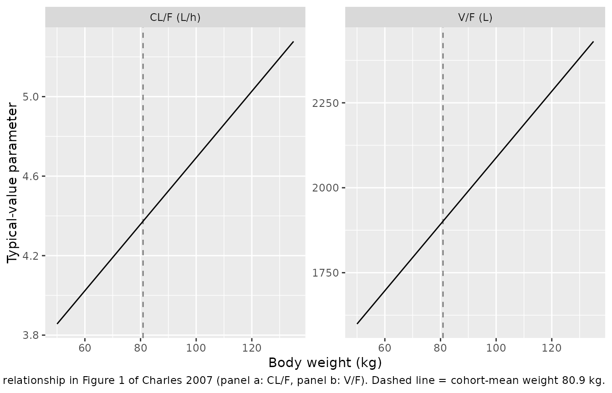
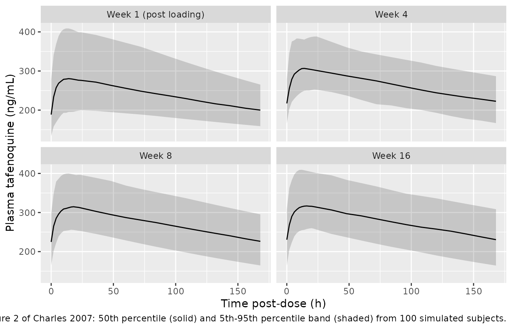

# Tafenoquine (Charles 2007)

``` r

library(nlmixr2lib)
library(rxode2)
#> rxode2 5.1.2 using 2 threads (see ?getRxThreads)
#>   no cache: create with `rxCreateCache()`
library(dplyr)
#> 
#> Attaching package: 'dplyr'
#> The following objects are masked from 'package:stats':
#> 
#>     filter, lag
#> The following objects are masked from 'package:base':
#> 
#>     intersect, setdiff, setequal, union
library(tidyr)
library(ggplot2)
library(PKNCA)
#> 
#> Attaching package: 'PKNCA'
#> The following object is masked from 'package:stats':
#> 
#>     filter
```

## Tafenoquine popPK in adult Australian soldiers (Charles 2007)

Replicate the population pharmacokinetic model of tafenoquine reported
by Charles et al. (2007) in 490 Australian soldiers on weekly malaria
prophylaxis during a 6-month East Timor deployment. Tafenoquine is an
8-aminoquinoline antimalarial whose oral disposition is slow
(elimination half-life ~13 days); the published structural model is one
compartment with first-order absorption and first-order elimination,
with the cohort-mean body weight (80.9 kg) entering both CL/F and V/F as
a centered linear effect.

- Citation: Charles BG, Miller AK, Nasveld PE, Reid MG, Harris IE,
  Edstein MD. Population pharmacokinetics of tafenoquine during malaria
  prophylaxis in healthy subjects. Antimicrob Agents Chemother.
  2007;51(8):2709-2715. <doi:10.1128/AAC.01183-06>
- Article: <https://doi.org/10.1128/AAC.01183-06>

## Population

The Charles 2007 cohort comprised 490 healthy adult Australian soldiers
(476 males, 14 females) recruited into a prospective randomised
double-blind phase III prophylaxis trial. Mean (SD) age was 25.4 (5.3)
years (range 18-47), mean (SD) weight was 80.9 (11.9) kg (range 50-135),
and 482 of 490 subjects were of Caucasian background (Charles 2007
Results paragraph 1). All subjects were G6PD-normal and judged healthy
on physical examination. Subjects received a 3-day loading regimen of
200 mg tafenoquine base orally once daily, followed by 200 mg orally
once weekly for approximately 6 months. Sparse sampling returned 1,925
plasma concentration-time points to the popPK fit (Charles 2007 Results
paragraph 1).

The same demographics are available programmatically via the model’s
metadata (`readModelDb("Charles_2007_tafenoquine")$population`).

## Source trace

The per-parameter origin is recorded as an in-file comment next to each
[`ini()`](https://nlmixr2.github.io/rxode2/reference/ini.html) entry in
`inst/modeldb/specificDrugs/Charles_2007_tafenoquine.R`. The table below
collects them in one place. Concentrations in the source paper are
reported in ng/mL; the model uses ug/mL (= mg/L) to align with the rest
of the nlmixr2lib registry, so 22.9 ng/mL becomes 0.0229 ug/mL on the
additive RUV line.

| Parameter / equation | Value | Source |
|----|----|----|
| `ka` (Ka) | 0.243 1/h | Table 2 final model (theta_3) |
| `cl` partial (theta_1, CL/F) | 3.02 L/h | Table 2 final model (theta_1) |
| `vc` partial (theta_2, V/F) | 1,110 L | Table 2 final model (theta_2) |
| `e_wt_cl` (linear WT/80.9 effect on CL/F) | 0.448 | Table 2 final model (theta_4) |
| `e_wt_vc` (linear WT/80.9 effect on V/F) | 0.713 | Table 2 final model (theta_5) |
| Typical CL/F at WT = 80.9 kg | 4.37 L/h | Results paragraph 4 (= theta_1 x (1 + theta_4)) |
| Typical V/F at WT = 80.9 kg | 1,901 L | Results paragraph 4 (= theta_2 x (1 + theta_5)) |
| IIV CL/F | 18% CV (omega^2 = 0.0319) | Table 2 final model |
| IIV V/F | 22% CV (omega^2 = 0.0473) | Table 2 final model |
| IIV Ka | 76% CV (omega^2 = 0.456) | Table 2 final model |
| Proportional RUV | 5.9% CV (`propSd = 0.059`) | Table 2 final model |
| Additive RUV | 22.9 ng/mL (`addSd = 0.0229` ug/mL) | Table 2 final model |
| Structural model | 1-compartment, first-order absorption + elimination | Methods “Population pharmacokinetic modeling” paragraph 1; Table 1 model 9 (final) |
| Centered weight parameterization | `theta * (1 + e * WT / 80.9)` | Table 1 footnote d, Table 2 footnote a |
| Combined add+prop residual error | `C = C_pred * (1 + eps_1) + eps_2` | Methods “Population pharmacokinetic modeling” paragraph 4 |

## Virtual cohort

``` r

set.seed(20070521)

n_subj <- 100L

# Weight distribution matches Charles 2007: mean 80.9 kg, SD 11.9 kg,
# truncated to the observed 50-135 kg range to avoid pathological tails.
sample_wt <- function(n) {
  wt <- rnorm(n, mean = 80.9, sd = 11.9)
  while (any(wt < 50 | wt > 135)) {
    bad <- wt < 50 | wt > 135
    wt[bad] <- rnorm(sum(bad), mean = 80.9, sd = 11.9)
  }
  wt
}

cohort <- tibble(
  id = seq_len(n_subj),
  WT = sample_wt(n_subj)
)
```

Build the dosing regimen used in the trial: 200 mg orally on study days
0, 1, 2 (loading), then 200 mg every 7 days for 20 maintenance weeks
(week 4, 8, 16 sampling fall inside that window, so the simulation
covers the published VPC panels in Figure 2 of Charles 2007).

``` r

loading_times <- c(0, 24, 48)                          # hours
maint_times   <- 48 + 7 * 24 * seq_len(20)             # weekly from week 1 to week 20
dose_times    <- c(loading_times, maint_times)

# Observation grid: dense after the last loading dose for the week-1 panel,
# plus 12 sampling timepoints across each maintenance week (week 4, 8, 16).
panel_starts  <- c(48, 4 * 7 * 24 + 48, 8 * 7 * 24 + 48, 16 * 7 * 24 + 48)
panel_obs <- unique(unlist(
  lapply(panel_starts, function(t0) t0 + c(seq(0, 24, by = 2), seq(36, 168, by = 12)))
))

events <- bind_rows(
  cohort |>
    tidyr::crossing(time = dose_times) |>
    mutate(amt = 200, evid = 1L, cmt = "depot"),
  cohort |>
    tidyr::crossing(time = panel_obs) |>
    mutate(amt = 0,   evid = 0L, cmt = NA_character_)
) |>
  arrange(id, time, desc(evid))
```

## Simulation

``` r

mod <- readModelDb("Charles_2007_tafenoquine")
sim <- rxode2::rxSolve(mod, events = events, keep = c("WT")) |>
  as.data.frame()
#> ℹ parameter labels from comments will be replaced by 'label()'
```

## Replicate published figures

### Figure 1 - Weight effect on individual CL/F and V/F

The published Figure 1 shows a positive linear association between body
weight and individual estimates of CL/F (panel a) and V/F (panel b).
Here we plot the typical-value relationship (zero between-subject
variability) over the 50-135 kg weight range observed in the cohort.

``` r

mod_typical <- rxode2::zeroRe(mod)
#> ℹ parameter labels from comments will be replaced by 'label()'

wt_grid <- tibble(
  id = seq_along(seq(50, 135, by = 5)),
  WT = seq(50, 135, by = 5)
)
events_typical <- bind_rows(
  wt_grid |> mutate(time = 0,  amt = 200, evid = 1L, cmt = "depot"),
  wt_grid |> mutate(time = 24, amt = 0,   evid = 0L, cmt = NA_character_)
) |>
  arrange(id, time, desc(evid))

sim_typ <- rxode2::rxSolve(mod_typical, events = events_typical,
                           keep = c("WT")) |>
  as.data.frame() |>
  group_by(id, WT) |>
  summarise(
    `CL/F (L/h)` = unique(cl),
    `V/F (L)`    = unique(vc),
    .groups      = "drop"
  ) |>
  tidyr::pivot_longer(c(`CL/F (L/h)`, `V/F (L)`),
                      names_to = "Parameter", values_to = "Value")
#> ℹ omega/sigma items treated as zero: 'etalcl', 'etalvc', 'etalka'
#> Warning: multi-subject simulation without without 'omega'

ggplot(sim_typ, aes(WT, Value)) +
  geom_line() +
  geom_vline(xintercept = 80.9, linetype = 2, alpha = 0.5) +
  facet_wrap(~ Parameter, scales = "free_y") +
  labs(x = "Body weight (kg)", y = "Typical-value parameter",
       caption = "Replicates the qualitative relationship in Figure 1 of Charles 2007 (panel a: CL/F, panel b: V/F). Dashed line = cohort-mean weight 80.9 kg.")
```



### Figure 2 - Visual predictive check after loading and maintenance doses

Charles 2007 Figure 2 shows degenerate VPC plots of plasma tafenoquine
versus post-dose time for four sampling windows: (a) week 1 (post third
loading dose), (b) week 4, (c) week 8, (d) week 16. Convert ug/mL to
ng/mL (x 1000) for direct comparison with the paper.

``` r

sim_vpc <- sim |>
  mutate(
    week_panel = case_when(
      time >= 48                  & time <= 48 + 200                  ~ "Week 1 (post loading)",
      time >= 4 * 7 * 24 + 48     & time <= 4 * 7 * 24 + 48  + 200    ~ "Week 4",
      time >= 8 * 7 * 24 + 48     & time <= 8 * 7 * 24 + 48  + 200    ~ "Week 8",
      time >= 16 * 7 * 24 + 48    & time <= 16 * 7 * 24 + 48 + 200    ~ "Week 16",
      TRUE                                                            ~ NA_character_
    ),
    panel_start = case_when(
      week_panel == "Week 1 (post loading)" ~ 48,
      week_panel == "Week 4"  ~ 4  * 7 * 24 + 48,
      week_panel == "Week 8"  ~ 8  * 7 * 24 + 48,
      week_panel == "Week 16" ~ 16 * 7 * 24 + 48,
      TRUE                    ~ NA_real_
    ),
    postdose_h = time - panel_start,
    Cc_ngml    = Cc * 1000
  ) |>
  filter(!is.na(week_panel), postdose_h >= 0, postdose_h <= 200)

vpc <- sim_vpc |>
  group_by(week_panel, postdose_h) |>
  summarise(
    Q05 = quantile(Cc_ngml, 0.05, na.rm = TRUE),
    Q50 = quantile(Cc_ngml, 0.50, na.rm = TRUE),
    Q95 = quantile(Cc_ngml, 0.95, na.rm = TRUE),
    .groups = "drop"
  )

ggplot(vpc, aes(postdose_h, Q50)) +
  geom_ribbon(aes(ymin = Q05, ymax = Q95), alpha = 0.2) +
  geom_line() +
  facet_wrap(~ factor(week_panel,
                      levels = c("Week 1 (post loading)", "Week 4", "Week 8", "Week 16"))) +
  labs(x = "Time post-dose (h)", y = "Plasma tafenoquine (ng/mL)",
       caption = "Replicates Figure 2 of Charles 2007: 50th percentile (solid) and 5th-95th percentile band (shaded) from 100 simulated subjects.")
```



## PKNCA validation

NCA is assessed over the week-16 dosing interval (168 h post-dose
sampling window) - the last published Figure 2 panel, by which time the
profile is at functional steady state given the ~13-day half-life and
weekly dosing. The window matches the trough-sample timing reported in
Charles 2007 Results paragraph 4 (n=162 subjects at week 4, 8, 16, drawn
within 5% of the 168-h post-dose target).

``` r

tau      <- 168                                # hours
start_ss <- 16 * 7 * 24 + 48                   # = 2736 h: time of week-16 dose
end_ss   <- start_ss + tau                     # = 2904 h: 168 h post-dose

# Tag a single "treatment" so the PKNCA formula has a group; this also gives
# the side-by-side comparison table below a clean join key.
sim_nca <- sim |>
  filter(time >= start_ss,
         time <= end_ss) |>
  mutate(treatment = "200 mg PO QW (week 16 interval)",
         Cc_ngml   = Cc * 1000) |>
  select(id, time, Cc = Cc_ngml, treatment)

# The week-16 maintenance dose (subset of all maintenance doses)
dose_df <- tibble(id = cohort$id) |>
  mutate(time      = start_ss,
         amt       = 200,
         treatment = "200 mg PO QW (week 16 interval)")

conc_obj <- PKNCA::PKNCAconc(sim_nca, Cc ~ time | treatment + id,
                             concu = "ng/mL", timeu = "hr")
dose_obj <- PKNCA::PKNCAdose(dose_df, amt ~ time | treatment + id,
                             doseu = "mg")

intervals <- data.frame(
  start   = start_ss,
  end     = end_ss,
  cmax    = TRUE,
  cmin    = TRUE,
  tmax    = TRUE,
  auclast = TRUE,
  cav     = TRUE
)

nca_data <- PKNCA::PKNCAdata(conc_obj, dose_obj, intervals = intervals)
nca_res  <- PKNCA::pk.nca(nca_data)
nca_summary <- summary(nca_res)
knitr::kable(nca_summary,
             caption = paste0(
               "Simulated steady-state NCA over a 168-h dosing interval at ",
               "week 20 (200 mg PO once weekly)."
             ))
```

| Interval Start | Interval End | treatment | N | AUClast (hr\*ng/mL) | Cmax (ng/mL) | Cmin (ng/mL) | Tmax (hr) | Cav (ng/mL) |
|---:|---:|:---|:---|:---|:---|:---|:---|:---|
| 2736 | 2904 | 200 mg PO QW (week 16 interval) | 100 | 45900 \[16.7\] | 319 \[14.9\] | 225 \[20.5\] | 14.0 \[4.00, 48.0\] | 273 \[16.7\] |

Simulated steady-state NCA over a 168-h dosing interval at week 20 (200
mg PO once weekly). {.table style="width:100%;"}

### Comparison against published NCA

Charles 2007 reports steady-state-equivalent observed concentrations at
weeks 4, 8 and 16: peak 321 +/- 63 ng/mL within 5% of the typical Tmax
(21.4 h post-dose, 42 subjects across the three weeks), and trough 221
+/- 57 ng/mL within 5% of the 168-h post-dose target (162 subjects
across the three weeks). The typical-value t_half is reported as 12.7
+/- 3.0 days.

``` r

res_tbl <- as.data.frame(nca_res$result) |>
  group_by(PPTESTCD) |>
  summarise(simulated_median = median(PPORRES, na.rm = TRUE),
            simulated_p05    = quantile(PPORRES, 0.05, na.rm = TRUE),
            simulated_p95    = quantile(PPORRES, 0.95, na.rm = TRUE),
            .groups          = "drop")

# Typical-value half-life from the typical-value CL/F and V/F at 80.9 kg.
typ_clf  <- 3.02  * (1 + 0.448 * 80.9 / 80.9)
typ_vf   <- 1110  * (1 + 0.713 * 80.9 / 80.9)
typ_half <- log(2) * typ_vf / typ_clf  / 24            # days

comparison <- tibble::tibble(
  metric    = c("Peak (ng/mL, ~21 h post-dose)",
                "Trough (ng/mL, 168 h post-dose)",
                "Half-life (days, typical)"),
  published = c("321 +/- 63 (n=42, weeks 4/8/16)",
                "221 +/- 57 (n=162, weeks 4/8/16)",
                "12.7 +/- 3.0"),
  simulated = c(
    sprintf("%.0f (5th-95th %.0f-%.0f) [cmax]",
            res_tbl$simulated_median[res_tbl$PPTESTCD == "cmax"],
            res_tbl$simulated_p05[res_tbl$PPTESTCD == "cmax"],
            res_tbl$simulated_p95[res_tbl$PPTESTCD == "cmax"]),
    sprintf("%.0f (5th-95th %.0f-%.0f) [cmin]",
            res_tbl$simulated_median[res_tbl$PPTESTCD == "cmin"],
            res_tbl$simulated_p05[res_tbl$PPTESTCD == "cmin"],
            res_tbl$simulated_p95[res_tbl$PPTESTCD == "cmin"]),
    sprintf("%.1f", typ_half)
  )
)

knitr::kable(comparison,
             caption = "Side-by-side comparison of simulated steady-state metrics with values reported in Charles 2007 (Results paragraphs 4-5).")
```

| metric | published | simulated |
|:---|:---|:---|
| Peak (ng/mL, ~21 h post-dose) | 321 +/- 63 (n=42, weeks 4/8/16) | 318 (5th-95th 260-411) \[cmax\] |
| Trough (ng/mL, 168 h post-dose) | 221 +/- 57 (n=162, weeks 4/8/16) | 230 (5th-95th 164-308) \[cmin\] |
| Half-life (days, typical) | 12.7 +/- 3.0 | 12.6 |

Side-by-side comparison of simulated steady-state metrics with values
reported in Charles 2007 (Results paragraphs 4-5). {.table}

## Assumptions and deviations

- **IIV correlation between CL/F and V/F not reported.** Charles 2007
  (Results paragraph 4) states that a covariance between omega^2(CL/F)
  and omega^2(V/F) was estimated (OFV decreased from 22,265 to 22,248
  versus the diagonal-only model) but the numeric value is not given in
  Table 2. The packaged model uses independent diagonal IIVs; simulated
  joint CL/F + V/F distributions will therefore be uncorrelated, and
  joint exposure metrics (e.g. correlated extremes) will be modestly
  less extreme than the authors’ final fit. Diagonal CV% values match
  Table 2.
- **Inter-occasion variability on CL/F not encoded.** Charles 2007
  estimates an IOV of 18% CV on CL/F (Table 2) on top of the 18% IIV.
  Encoding IOV would require an OCC covariate column and an
  occasion-multiplexed eta; packaged simulations therefore underestimate
  the total within-subject between-occasion spread. Same convention as
  `Hodiamont_2017_gentamicin` and `Ekhart_2008_carboplatin`.
- **Race / Caucasian fraction.** 482 of 490 subjects (98.4%) were
  Caucasian (Charles 2007 Results paragraph 1); race was not screened as
  a covariate and is not encoded in the model. The virtual cohort above
  uses the cohort-mean WT and SD without stratifying by race.
- **Sex.** 14 of 490 subjects (2.9%) were female. Sex on CL/F (delta-OFV
  = -3) and V/F (delta-OFV = -12) was screened but not retained in the
  final model (Table 1 models 7-8); the virtual cohort treats subjects
  as exchangeable.
- **AGE, CRCL, phospholipidosis.** Documented in
  `covariatesDataExcluded` for source-trace completeness; none retained
  in the final model.
- **Concentration units.** Charles 2007 reports concentrations in ng/mL;
  the model uses ug/mL (= mg/L) to align with the rest of nlmixr2lib.
  Conversion factor: 1 ug/mL = 1000 ng/mL.
- **Sampling and dosing windows.** The simulation uses the post-third
  loading dose + weekly maintenance through week 20 - long enough to
  cover the published Figure 2 panels (week 1 post-loading + weeks
  4/8/16 maintenance). The trial ran for 6 months (~26 weeks);
  steady-state NCA here uses the week-20 interval, which is functionally
  at steady state given the ~13-day half-life.
