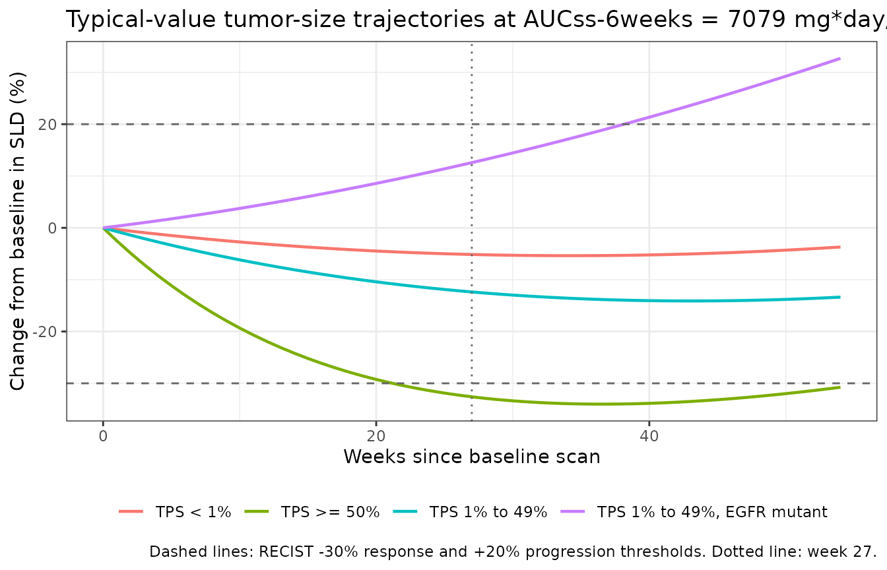
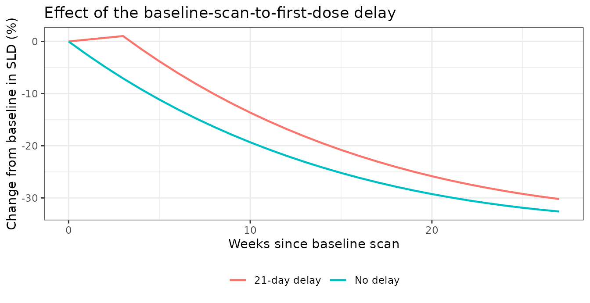
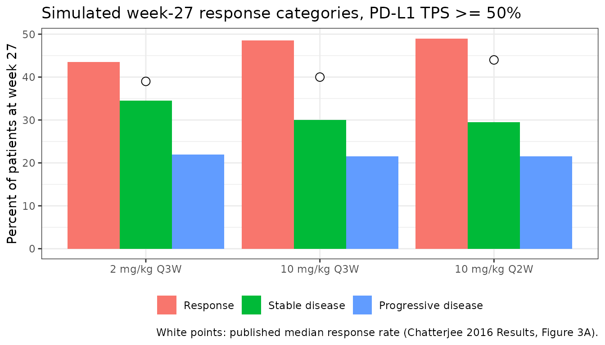
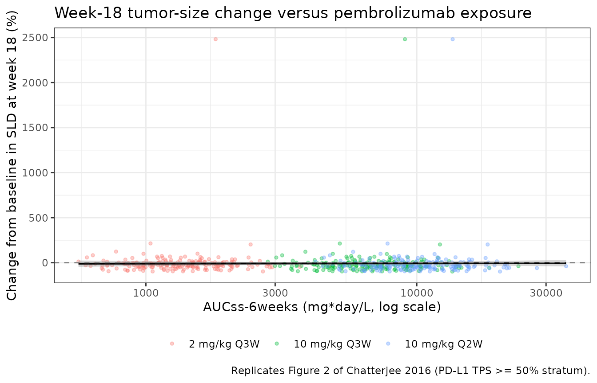

# Pembrolizumab exposure-response in NSCLC (Chatterjee 2016)

## Model and source

- Citation: Chatterjee M, Turner DC, Felip E, Lena H, Cappuzzo F, Horn
  L, Garon EB, Hui R, Arkenau H-T, Gubens MA, Hellmann MD, Dong D, Li C,
  Mayawala K, Freshwater T, Ahamadi M, Stone J, Lubiniecki GM, Zhang J,
  Im E, De Alwis DP, Kondic AG, Flotten O. Systematic evaluation of
  pembrolizumab dosing in patients with advanced non-small-cell lung
  cancer. Ann Oncol. 2016;27(7):1291-1298. <doi:10.1093/annonc/mdw174>.
  PMID: 27117531. Structural equation and exposure-effect equation from
  the main-article Methods (‘tumor size NLME model structure’ and
  ‘exposure-efficacy analysis’); all final parameter values from
  supplementary Table S6; covariate parameterization from the
  Supplementary Methods (‘Handling of Covariates’).
- Description: Exposure-response tumor-size (sum of longest diameters,
  SLD) model for pembrolizumab in previously treated and treatment-naive
  advanced non-small-cell lung cancer (NSCLC), developed by Chatterjee
  et al. (Merck) on the KEYNOTE-001 NSCLC expansion cohorts (n = 496
  with both tumor-size and pharmacokinetic data at 2 mg/kg Q3W, 10 mg/kg
  Q3W and 10 mg/kg Q2W). The structural model splits the baseline SLD
  into a treatment-sensitive fraction f that decays first-order at
  kdeath and a resistant fraction (1 - f) that grows first-order at
  kgrowth, giving the published bi-exponential form SLD(t) = Baseline \*
  \[(1 - f) \* exp(kgrowth \* t) + f \* exp(-kdeath \* max(0, t -
  delay))\]. Pembrolizumab exposure enters as a log-linear (power)
  effect of the steady-state 6-week AUC on kdeath, normalized to the
  population-typical AUCss-6weeks of 7079 mg\*day/L. The final covariate
  model adds PD-L1 tumor proportion score (four levels) on kdeath and
  EGFR mutation status (three levels) on the logit of f. The estimated
  exposure effect is not statistically significant (95% CI -0.0784 to
  0.47, P = 0.54) and was retained by the authors only so that the
  magnitude of any potential exposure-response relationship could be
  simulated; the paper’s conclusion is that response is flat over 2-10
  mg/kg. There is no PK input: exposure is supplied per subject as the
  covariate AUC_PEMBRO, which the source analysis obtained as dose/CL
  from the companion pembrolizumab population-PK model (Ahamadi 2017;
  available in this library as Ahamadi_2017_pembrolizumab).
- Article: [Ann Oncol.
  2016;27(7):1291-1298](https://doi.org/10.1093/annonc/mdw174)
- Supplement: Supplementary Methods, Figures S1-S6 and Tables S1-S7,
  available at Annals of Oncology online.

This is a tumor-size (TGI) exposure-response model, not a PK model. The
observable `TS` is the RECIST 1.1 sum of the longest diameters of target
lesions, in mm. Pembrolizumab exposure enters only through the
per-subject covariate `AUC_PEMBRO`, which the source analysis obtained
as `dose / CL` from a separate population-PK analysis of the same
programme – described in Chatterjee 2016 as “an independent population
pharmacokinetic model (manuscript submitted for publication)” and
subsequently published as Ahamadi 2017, which this library packages as
`Ahamadi_2017_pembrolizumab`. This vignette therefore derives the
exposure covariate from that companion model rather than assuming a
distribution, which also cross-checks the two extractions against each
other.

The headline result of the paper is a **negative** one: the estimated
exposure effect on the tumor kill rate is 0.196 with a 95% CI of -0.0784
to 0.47 (P = 0.54), so response is statistically flat across the 2-10
mg/kg dose range. The authors retained the term in the final model
anyway, “for visualization purposes so that further simulation could be
used to assess the magnitude of any potential relationship”
(Supplementary Methods, Exposure Effect on Tumor Model Shrinkage Rate).
Reproducing that flatness is the main validation target below.

## Population

| Field | Value |
|:---|:---|
| Species | human (adults with locally advanced or metastatic NSCLC) |
| Subjects (modelled) | 496 with both tumor-size and PK data |
| Studies | 1 (KEYNOTE-001, NCT01295827) |
| Age | 64 years (range 32-93 years (supplementary Table S4, N = 505 with measurable baseline disease)) |
| Weight | 70.00 kg (range 35.70-132.00 kg) |
| Female | 47.1% |
| Disease | locally advanced or metastatic non-small-cell lung cancer, ECOG performance status 0-1, PD-L1 positive by the prototype assay for the final cohort; 83% previously treated |
| Regimens | pembrolizumab 2 mg/kg IV Q3W, 10 mg/kg IV Q3W, or 10 mg/kg IV Q2W (not a model input; enters only through AUC_PEMBRO) |
| Setting | multinational KEYNOTE-001 (NCT01295827), phase Ib, multicenter open-label |

Analysis population (Chatterjee 2016 Methods; supplementary Tables S3
and S4). {.table}

Baseline PD-L1 tumor proportion score (TPS) and EGFR mutation status are
the two covariates retained in the final model. Their distributions in
the covariate-summary cohort (supplementary Table S3, N = 505) are:

| Covariate   | Level                     |   n |
|:------------|:--------------------------|----:|
| PD-L1 TPS   | TPS \>= 50%               | 153 |
| PD-L1 TPS   | TPS 1% to 49% (reference) | 201 |
| PD-L1 TPS   | TPS \< 1%                 |  91 |
| PD-L1 TPS   | Unknown                   |  60 |
| EGFR status | Wild type (reference)     | 409 |
| EGFR status | Mutant                    |  70 |
| EGFR status | Unknown                   |  26 |

Covariate distributions, supplementary Table S3. The most frequent level
of each covariate is the model’s reference category. {.table}

## Source trace

Every `ini()` value and every model equation, with the exact location it
came from. The main article carries the two structural equations; every
numeric parameter estimate is in supplementary Table S6 (final
covariate-containing model).

| Quantity | Value | Source |
|:---|:---|:---|
| Tumor size equation | Baseline \* \[(1 - f) \* exp(kgrowth \* time) + f \* exp(-kdeath \* max(0, time - delay))\] | Methods, ‘tumor size NLME model structure’ |
| Exposure equation | kdeath = TVkdeath \* (AUCss-6weeks / AUCtypical,ss-6weeks)^theta | Methods, ‘exposure-efficacy analysis’ |
| AUCtypical,ss-6weeks | 7079 mg\*day/L | Methods, ‘exposure-efficacy analysis’ |
| Continuous covariate form | P\* = theta_x \* (COV / median)^theta_y | Supplementary Methods, ‘Handling of Covariates’ |
| Categorical covariate form | P\* = theta_x for the most frequent level; theta_x \* (1 + theta_y) otherwise | Supplementary Methods, ‘Handling of Covariates’ |
| Covariate form on logit(f) | TVlogit(f)\* = theta_x for the most frequent level; theta_x + theta_y otherwise | Supplementary Methods, ‘Handling of Covariates’ |
| kgrowth | 0.00114 1/day (RSE 22.7%) | Table S6 |
| kdeath | 0.00265 1/day (RSE 21.0%) | Table S6 |
| f | 0.574 (RSE 14.0%) | Table S6 |
| AUCss-6weeks on kdeath | 0.196 (RSE 71.4%) | Table S6; CI and P value in Results and Supplementary Methods |
| PD-L1_1 on kdeath (TPS \>= 50%) | 1.74 (RSE 33%) | Table S6 |
| PD-L1_2 on kdeath (TPS \< 1%) | -0.377 (RSE -48.8%) | Table S6 |
| PD-L1_3 on kdeath (unknown) | 0.268 (RSE 145%) | Table S6 |
| EGFR_1 on f (mutant) | -1.81 (RSE -28.3%) | Table S6 |
| EGFR_2 on f (unknown) | 1.66 (RSE 42.3%) | Table S6 |
| IIV variance kgrowth | 1.21 (RSE 22.8%, shrinkage 36.9%) | Table S6, covariance-matrix block |
| IIV variance kdeath | 1.26 (RSE 22.9%, shrinkage 36.2%) | Table S6, covariance-matrix block |
| IIV variance logit(f) | 2.79 (RSE 20.1%, shrinkage 31.9%) | Table S6, covariance-matrix block |
| IIV covariance kdeath:kgrowth | -0.33 | Table S6, covariance-matrix block |
| IIV covariance f:kgrowth | -0.814 | Table S6, covariance-matrix block |
| IIV covariance f:kdeath | 0.631 | Table S6, covariance-matrix block |
| Residual error | exponential, variance 0.0274 (RSE 4.16%) | Table S6; form named in Supplementary Methods, ‘Structural Model Selection’ |
| Baseline fixed to observed | TUM_SLD is a regressor, not estimated | Supplementary Methods, ‘Structural Model Selection’ |
| delay retained as data | T_SCAN_TO_DOSE is per-subject data | Supplementary Methods, ‘Structural Model Selection’ |

Source trace for Chatterjee_2016_pembrolizumab. {.table}

## Mechanism in one paragraph

The measured baseline tumor diameter is split into a fraction `f` that
is accessible and sensitive to pembrolizumab and a remaining fraction
`1 - f` that is not. The sensitive part decays first-order at `kdeath`
from the day of the first dose; the resistant part grows first-order at
`kgrowth` from the baseline scan onwards, unimpeded. The observable is
their sum, so a patient whose tumor first shrinks and then rebounds is
described without any extra machinery: shrinkage dominates early because
`kdeath > kgrowth`, and the resistant exponential eventually overtakes
it. Supplementary Figure S1A puts it as “only a fraction (f) of total
tumor diameter is accessible and/or sensitive to treatment, which
permits the remaining portion (1-f) to undergo unimpeded exponential
growth”. Higher PD-L1 expression raises `kdeath`; an EGFR mutation
lowers `f`. Exposure raises `kdeath` through a power term whose exponent
is not distinguishable from zero.

## Dimensional check

| Term | Units | Check |
|:---|:---|:---|
| kgrowth, kdeath | 1/day | rate \* time = unitless exponent |
| f | unitless, (0, 1) | fraction of a diameter |
| TUM_SLD | mm | initial condition of both sub-states |
| growth, shrink, TS | mm | sum of the two sub-states |
| AUC_PEMBRO / 7079 | unitless ratio | both in mg\*day/L |
| T_SCAN_TO_DOSE | day | same axis as `time` |
| expSd | unitless (log scale) | SD of log(TS), exponential error |

Every exponent argument is unitless and the observable carries the same
units as the baseline covariate. {.table}

## Structural identity: the ODE system reproduces the published closed form

The packaged model encodes the paper’s algebraic equation as two
exponential sub-states so that it composes with rxode2 event tables.
That encoding is only correct if the solved system reproduces the
published closed form exactly. This is a pure numerical-accuracy
comparison – both sides use the same drawn parameters – so the tolerance
is tight, and it is checked both without a dosing delay and with one, to
exercise the `max(0, time - delay)` branch.

``` r

m0 <- rxode2::zeroRe(mod)

kgrowth_tv <- 0.00114                # Table S6
kdeath_tv  <- 0.00265                # Table S6
f_tv       <- 0.574                  # Table S6
baseline   <- 91.7                   # supplementary Table S4 median SLD, mm

published_sld <- function(t, delay) {
  baseline * ((1 - f_tv) * exp(kgrowth_tv * t) +
              f_tv * exp(-kdeath_tv * pmax(0, t - delay)))
}

tobs <- seq(0, 378, by = 7)

identity_check <- function(delay) {
  ev <- data.frame(
    time = tobs, evid = 0L,
    TUM_SLD = baseline, AUC_PEMBRO = 7079,
    PDL1_TUM = 25, PDL1_TUM_MISSING = 0,
    TUM_EGFR_MUT = 0, TUM_EGFR_MUT_MISSING = 0,
    T_SCAN_TO_DOSE = delay
  )
  s <- rxode2::rxSolve(m0, ev, returnType = "data.frame",
                       atol = 1e-12, rtol = 1e-12)
  max(abs(s$TS - published_sld(tobs, delay)) / published_sld(tobs, delay))
}

err_no_delay <- identity_check(0)
#> ℹ omega/sigma items treated as zero: 'etalkgrowth', 'etalkdeath', 'etalogitfresp'
err_delay    <- identity_check(21)
#> ℹ omega/sigma items treated as zero: 'etalkgrowth', 'etalkdeath', 'etalogitfresp'
c(`delay = 0 day` = err_no_delay, `delay = 21 day` = err_delay)
#>  delay = 0 day delay = 21 day 
#>   1.384282e-12   1.371260e-12

stopifnot(err_no_delay < 1e-8, err_delay < 1e-8)
```

At `time = 0` the two sub-states sum to
`(1 - f) * TUM_SLD + f * TUM_SLD`, so the model reproduces the observed
baseline exactly, as the paper requires (“Fixing baseline tumor size to
observed values was found to improve model stability”).

``` r

ev0 <- data.frame(
  time = 0, evid = 0L, TUM_SLD = baseline, AUC_PEMBRO = 7079,
  PDL1_TUM = 25, PDL1_TUM_MISSING = 0, TUM_EGFR_MUT = 0,
  TUM_EGFR_MUT_MISSING = 0, T_SCAN_TO_DOSE = 0
)
ts0 <- rxode2::rxSolve(m0, ev0, returnType = "data.frame")$TS
#> ℹ omega/sigma items treated as zero: 'etalkgrowth', 'etalkdeath', 'etalogitfresp'
stopifnot(abs(ts0 - baseline) < 1e-10)
ts0
#> [1] 91.7
```

## The covariate parameterisation reproduces the published effect sizes

Supplementary Table S6 reports `f` on its natural (0, 1) scale but the
Supplementary Methods state that covariates and IIV act on `logit(f)`.
The supplementary text gives two independent numbers that pin down both
parameterisations, and neither was used to build the model file – they
are checks, not inputs.

- “median f was 3.2-fold higher in patients with EGFR wild-type versus
  mutant tumors” (Supplementary Methods, Covariate Effects).
- “median k death was 4.7-fold higher in strongly PD-L1-positive versus
  PD-L1-negative patients” (same paragraph). This one is a ratio of
  post-hoc empirical-Bayes medians rather than of typical values, so it
  is expected to agree only approximately.

``` r

scen <- expand.grid(
  PDL1_TUM = c(75, 25, 0.5),
  TUM_EGFR_MUT = c(0, 1),
  KEEP.OUT.ATTRS = FALSE
) |>
  dplyr::mutate(
    time = 0, evid = 0L, id = dplyr::row_number(),
    TUM_SLD = baseline, AUC_PEMBRO = 7079,
    PDL1_TUM_MISSING = 0, TUM_EGFR_MUT_MISSING = 0, T_SCAN_TO_DOSE = 0,
    pdl1_level = dplyr::case_when(PDL1_TUM >= 50 ~ "TPS >= 50%",
                                  PDL1_TUM < 1   ~ "TPS < 1%",
                                  TRUE           ~ "TPS 1% to 49%")
  )

scen_out <- rxode2::rxSolve(m0, scen, returnType = "data.frame") |>
  dplyr::left_join(dplyr::select(scen, id, pdl1_level), by = "id")
#> ℹ omega/sigma items treated as zero: 'etalkgrowth', 'etalkdeath', 'etalogitfresp'
#> Warning: multi-subject simulation without without 'omega'

kd_ge50 <- scen_out$kdeath[scen_out$pdl1_level == "TPS >= 50%"][1]
kd_lt1  <- scen_out$kdeath[scen_out$pdl1_level == "TPS < 1%"][1]
f_wt    <- scen_out$fresp[scen_out$TUM_EGFR_MUT == 0][1]
f_mut   <- scen_out$fresp[scen_out$TUM_EGFR_MUT == 1][1]

ratios <- data.frame(
  Quantity = c("f, EGFR wild type / EGFR mutant",
               "kdeath, PD-L1 TPS >= 50% / TPS < 1%"),
  Model = c(f_wt / f_mut, kd_ge50 / kd_lt1),
  Published = c(3.2, 4.7),
  check.names = FALSE
)
knitr::kable(ratios, digits = 2,
             caption = "Model-implied covariate effect sizes against the two ratios quoted in the Supplementary Methods.")
```

| Quantity                              | Model | Published |
|:--------------------------------------|------:|----------:|
| f, EGFR wild type / EGFR mutant       |  3.18 |       3.2 |
| kdeath, PD-L1 TPS \>= 50% / TPS \< 1% |  4.40 |       4.7 |

Model-implied covariate effect sizes against the two ratios quoted in
the Supplementary Methods. {.table}

``` r


# The f ratio is a typical-value-to-typical-value comparison and must be
# tight. The kdeath ratio is a post-hoc EBE median ratio in the paper, so
# only the magnitude is checked.
stopifnot(
  abs(f_wt / f_mut - 3.2) < 0.1,
  abs(kd_ge50 / kd_lt1 - 4.7) < 1.0
)
```

The `f` ratio agreeing to two significant figures is the decisive
evidence that Table S6’s `f = 0.574` is the natural-scale typical value
and that the `-1.81` EGFR coefficient is additive on the logit scale.
Reading `0.574` as a logit, or the coefficient as multiplicative, both
miss this number badly.

## Virtual cohort and the exposure covariate

The paper’s exposure metric is `AUCss-6weeks = dose / CL` using post-hoc
clearances from the companion population-PK model. The cohort below
draws baseline demographics from the Chatterjee supplementary tables,
solves the packaged `Ahamadi_2017_pembrolizumab` model to obtain
individual clearances, and forms the 6-week exposure for each of the
three studied regimens: two doses in a 6-week window for Q3W, three for
Q2W. The same 200 subjects are carried across all three arms (common
random numbers) so that differences between arms are dose effects and
not resampling noise.

``` r

n_arm <- 200                       # per-arm cap for library vignettes

egfr_status <- sample(c("wt", "mut", "unk"), n_arm, replace = TRUE,
                      prob = c(409, 70, 26) / 505)   # Table S3

cohort <- data.frame(
  id       = seq_len(n_arm),
  # Table S4: weight median 70.00 kg, range 35.70-132.00 kg.
  WT       = exp(stats::rnorm(n_arm, log(70), 0.20)),
  # Table S3: 238 of 505 female; 325 of 502 with a known score are ECOG 1.
  SEXF     = stats::rbinom(n_arm, 1, 238 / 505),
  ECOG_GE1 = stats::rbinom(n_arm, 1, 325 / 502),
  # Table S4: baseline SLD median 91.70 mm, range 10.40-548.30 mm.
  TUM_SLD  = exp(stats::rnorm(n_arm, log(91.7), 0.55)),
  # Not reported by Chatterjee 2016; held at the Ahamadi 2017 reference
  # values. See Assumptions and deviations.
  ALB      = 39.6,
  CRCL     = 88.47,
  TUMTP_NSCLC = 1,     # every subject in KEYNOTE-001 NSCLC cohorts
  PRIOR_IPI   = 0,     # ipilimumab is a melanoma therapy; assumed naive
  # Figure 3A stratum: PD-L1 TPS >= 50%.
  PDL1_TUM = 75,
  PDL1_TUM_MISSING = 0,
  TUM_EGFR_MUT         = as.integer(egfr_status == "mut"),
  TUM_EGFR_MUT_MISSING = as.integer(egfr_status == "unk"),
  T_SCAN_TO_DOSE = 0
)

knitr::kable(
  data.frame(
    Covariate = c("Weight (kg)", "Baseline SLD (mm)", "Female (%)",
                  "ECOG 1 (%)", "EGFR mutant (%)", "EGFR unknown (%)"),
    Simulated = c(
      sprintf("%.1f [%.1f, %.1f]", median(cohort$WT),
              quantile(cohort$WT, 0.025), quantile(cohort$WT, 0.975)),
      sprintf("%.1f [%.1f, %.1f]", median(cohort$TUM_SLD),
              quantile(cohort$TUM_SLD, 0.025), quantile(cohort$TUM_SLD, 0.975)),
      sprintf("%.1f", 100 * mean(cohort$SEXF)),
      sprintf("%.1f", 100 * mean(cohort$ECOG_GE1)),
      sprintf("%.1f", 100 * mean(cohort$TUM_EGFR_MUT)),
      sprintf("%.1f", 100 * mean(cohort$TUM_EGFR_MUT_MISSING))
    ),
    Published = c("70.0 [35.7, 132.0] (range)", "91.7 [10.4, 548.3] (range)",
                  "47.1", "64.7", "13.9", "5.1"),
    check.names = FALSE
  ),
  caption = "Virtual cohort against supplementary Tables S3 and S4. Published weight and SLD entries are medians with the full observed range, not 95% intervals."
)
```

| Covariate         | Simulated             | Published                    |
|:------------------|:----------------------|:-----------------------------|
| Weight (kg)       | 67.6 \[49.7, 109.9\]  | 70.0 \[35.7, 132.0\] (range) |
| Baseline SLD (mm) | 100.9 \[38.4, 239.7\] | 91.7 \[10.4, 548.3\] (range) |
| Female (%)        | 46.0                  | 47.1                         |
| ECOG 1 (%)        | 61.0                  | 64.7                         |
| EGFR mutant (%)   | 10.5                  | 13.9                         |
| EGFR unknown (%)  | 4.5                   | 5.1                          |

Virtual cohort against supplementary Tables S3 and S4. Published weight
and SLD entries are medians with the full observed range, not 95%
intervals. {.table}

``` r

pkmod <- rxode2::rxode(readModelDb("Ahamadi_2017_pembrolizumab"))
#> ℹ parameter labels from comments will be replaced by 'label()'

pk_events <- data.frame(
  id   = rep(cohort$id, each = 2),
  time = rep(c(0, 1), n_arm),
  evid = rep(c(1L, 0L), n_arm),
  amt  = rep(c(100, NA_real_), n_arm),
  cmt  = "central"
) |>
  dplyr::left_join(cohort, by = "id")

rxode2::rxSetSeed(1001)
cl_i <- rxode2::rxSolve(pkmod, pk_events, returnType = "data.frame") |>
  dplyr::group_by(id) |>
  dplyr::summarise(cl = dplyr::first(cl), .groups = "drop")

cohort <- dplyr::left_join(cohort, cl_i, by = "id")

arms <- tibble::tribble(
  ~arm,            ~mg_per_kg, ~doses_per_6wk,
  "2 mg/kg Q3W",   2,          2,
  "10 mg/kg Q3W",  10,         2,
  "10 mg/kg Q2W",  10,         3
)

exposure <- arms |>
  dplyr::rowwise() |>
  dplyr::reframe(
    arm  = arm,
    id   = cohort$id,
    AUC_PEMBRO = doses_per_6wk * mg_per_kg * cohort$WT / cohort$cl
  )

knitr::kable(
  exposure |>
    dplyr::mutate(arm = factor(arm, levels = arms$arm)) |>
    dplyr::group_by(arm) |>
    dplyr::summarise(
      `AUCss-6weeks, median (mg*day/L)` = round(median(AUC_PEMBRO)),
      `5th percentile` = round(quantile(AUC_PEMBRO, 0.05)),
      `95th percentile` = round(quantile(AUC_PEMBRO, 0.95)),
      .groups = "drop") |>
    dplyr::rename(`Regimen` = arm),
  caption = "Derived pembrolizumab AUCss-6weeks by regimen, from individual clearances of the companion Ahamadi 2017 popPK model."
)
```

| Regimen | AUCss-6weeks, median (mg\*day/L) | 5th percentile | 95th percentile |
|:---|---:|---:|---:|
| 2 mg/kg Q3W | 1331 | 718 | 2585 |
| 10 mg/kg Q3W | 6655 | 3590 | 12923 |
| 10 mg/kg Q2W | 9983 | 5385 | 19385 |

Derived pembrolizumab AUCss-6weeks by regimen, from individual
clearances of the companion Ahamadi 2017 popPK model. {.table}

The paper’s normalising constant is
`AUCtypical,ss-6weeks = 7079 mg*day/L`. KEYNOTE-001’s NSCLC exposure
cohort was dominated by the 10 mg/kg arms (261 Q3W and 182 Q2W of 496),
so a population-typical value should fall between the derived 10 mg/kg
Q3W and Q2W medians. It does, which corroborates the constant against a
model this paper does not contain.

``` r

med <- exposure |>
  dplyr::group_by(arm) |>
  dplyr::summarise(m = median(AUC_PEMBRO), .groups = "drop")
q3w <- med$m[med$arm == "10 mg/kg Q3W"]
q2w <- med$m[med$arm == "10 mg/kg Q2W"]
c(`10 mg/kg Q3W median` = q3w, `AUCtypical (paper)` = 7079, `10 mg/kg Q2W median` = q2w)
#> 10 mg/kg Q3W median  AUCtypical (paper) 10 mg/kg Q2W median 
#>            6655.476            7079.000            9983.215
stopifnot(q3w < 7079, 7079 < q2w)
```

## Typical tumor-size trajectories by PD-L1 stratum

Replicates the qualitative behaviour that supplementary Figure S2A
summarises (higher PD-L1 expression is associated with faster tumor
shrinkage) and that Figure 1 shows as a waterfall of best percentage
change.

``` r

traj_grid <- expand.grid(
  time = seq(0, 378, by = 7),
  stratum = c("TPS >= 50%", "TPS 1% to 49%", "TPS < 1%",
              "TPS 1% to 49%, EGFR mutant"),
  stringsAsFactors = FALSE
) |>
  dplyr::mutate(
    evid = 0L,
    id = as.integer(factor(stratum)),
    TUM_SLD = baseline,
    AUC_PEMBRO = 7079,
    PDL1_TUM = dplyr::case_when(stratum == "TPS >= 50%" ~ 75,
                                stratum == "TPS < 1%"   ~ 0.5,
                                TRUE                    ~ 25),
    PDL1_TUM_MISSING = 0,
    TUM_EGFR_MUT = as.integer(stratum == "TPS 1% to 49%, EGFR mutant"),
    TUM_EGFR_MUT_MISSING = 0,
    T_SCAN_TO_DOSE = 0
  )

traj <- rxode2::rxSolve(m0, traj_grid, returnType = "data.frame") |>
  dplyr::left_join(dplyr::distinct(traj_grid, id, stratum), by = "id") |>
  dplyr::mutate(pct = 100 * (TS / baseline - 1))
#> ℹ omega/sigma items treated as zero: 'etalkgrowth', 'etalkdeath', 'etalogitfresp'
#> Warning: multi-subject simulation without without 'omega'

ggplot2::ggplot(traj, ggplot2::aes(time / 7, pct, colour = stratum)) +
  ggplot2::geom_line(linewidth = 0.8) +
  ggplot2::geom_hline(yintercept = c(-30, 20), linetype = "dashed",
                      colour = "grey40") +
  ggplot2::geom_vline(xintercept = 27, linetype = "dotted", colour = "grey40") +
  ggplot2::labs(
    x = "Weeks since baseline scan",
    y = "Change from baseline in SLD (%)",
    colour = NULL,
    title = "Typical-value tumor-size trajectories at AUCss-6weeks = 7079 mg*day/L",
    caption = "Dashed lines: RECIST -30% response and +20% progression thresholds. Dotted line: week 27."
  ) +
  ggplot2::theme_bw() +
  ggplot2::theme(legend.position = "bottom")
```



| Stratum                    | Week 18 | Week 27 |
|:---------------------------|--------:|--------:|
| TPS \>= 50%                |   -27.8 |   -32.6 |
| TPS 1% to 49%              |    -9.7 |   -12.4 |
| TPS \< 1%                  |    -4.2 |    -5.1 |
| TPS 1% to 49%, EGFR mutant |     7.5 |    12.6 |

Typical-value change from baseline (%) at the two landmark visits the
paper emphasises (weeks 18 and 27). {.table}

The typical PD-L1 TPS \>= 50% subject crosses the RECIST -30% response
threshold shortly before week 27, which is what makes the simulated
response rate for that stratum land near 40% rather than near 0% or
100%.

## The dosing delay

`T_SCAN_TO_DOSE` holds the sensitive sub-state inert between the
baseline scan and the first dose while the resistant sub-state keeps
growing, exactly as `max(0, time - delay)` prescribes. The paper does
not report the distribution of this quantity, so the cohort above uses
0; the panel shows what a three-week screening gap would do.

``` r

delay_grid <- expand.grid(time = seq(0, 189, by = 7), delay = c(0, 21)) |>
  dplyr::mutate(
    evid = 0L, id = as.integer(factor(delay)),
    TUM_SLD = baseline, AUC_PEMBRO = 7079, PDL1_TUM = 75,
    PDL1_TUM_MISSING = 0, TUM_EGFR_MUT = 0, TUM_EGFR_MUT_MISSING = 0,
    T_SCAN_TO_DOSE = delay
  )

delay_out <- rxode2::rxSolve(m0, delay_grid, returnType = "data.frame") |>
  dplyr::mutate(
    delay = ifelse(T_SCAN_TO_DOSE == 0, "No delay", "21-day delay"),
    pct = 100 * (TS / baseline - 1)
  )
#> ℹ omega/sigma items treated as zero: 'etalkgrowth', 'etalkdeath', 'etalogitfresp'
#> Warning: multi-subject simulation without without 'omega'

ggplot2::ggplot(delay_out, ggplot2::aes(time / 7, pct, colour = delay)) +
  ggplot2::geom_line(linewidth = 0.8) +
  ggplot2::labs(x = "Weeks since baseline scan",
                y = "Change from baseline in SLD (%)", colour = NULL,
                title = "Effect of the baseline-scan-to-first-dose delay") +
  ggplot2::theme_bw() +
  ggplot2::theme(legend.position = "bottom")
```



## Simulated response rates by dose: replicates Figure 3A

Figure 3A reports model-simulated response-category proportions at week
27 for patients with PD-L1 TPS \>= 50%, across the three studied
regimens. The Results section gives the medians: 39% (90% CI 31-46) at 2
mg/kg Q3W, 40% (90% CI 34-45) at 10 mg/kg Q3W and 44% (90% CI 37-49) at
10 mg/kg Q2W. Categories follow the paper: response is a reduction from
baseline of at least 30%, progressive disease is an increase of at least
20%, and stable disease is everything between. The simulated observation
(which carries the exponential residual error) is categorised, as in the
paper.

``` r

simulate_arm <- function(arm_name) {
  cv <- cohort |>
    dplyr::left_join(
      dplyr::filter(exposure, arm == arm_name) |> dplyr::select(id, AUC_PEMBRO),
      by = "id"
    )
  ev <- data.frame(id = rep(cv$id, each = 2), time = rep(c(0, 189), n_arm),
                   evid = 0L) |>
    dplyr::left_join(cv, by = "id")
  rxode2::rxSetSeed(2002)          # common random numbers across arms
  rxode2::rxSolve(mod, ev, returnType = "data.frame") |>
    dplyr::filter(time == 189) |>
    dplyr::mutate(arm = arm_name, pct = 100 * (sim / TUM_SLD - 1))
}

sim27 <- dplyr::bind_rows(lapply(arms$arm, simulate_arm))

published <- c(`2 mg/kg Q3W` = 39, `10 mg/kg Q3W` = 40, `10 mg/kg Q2W` = 44)

resp <- sim27 |>
  dplyr::group_by(arm) |>
  dplyr::summarise(
    Response = 100 * mean(pct <= -30),
    `Stable disease` = 100 * mean(pct > -30 & pct < 20),
    `Progressive disease` = 100 * mean(pct >= 20),
    .groups = "drop"
  ) |>
  dplyr::mutate(
    arm = factor(arm, levels = arms$arm),
    `Published response rate` = as.numeric(published[as.character(arm)]),
    Difference = Response - `Published response rate`
  ) |>
  dplyr::arrange(arm)

knitr::kable(dplyr::rename(resp, `Regimen` = arm), digits = 1,
             caption = "Simulated week-27 response categories (%) for PD-L1 TPS >= 50%, against the medians reported in Chatterjee 2016 Results for Figure 3A.")
```

| Regimen | Response | Stable disease | Progressive disease | Published response rate | Difference |
|:---|---:|---:|---:|---:|---:|
| 2 mg/kg Q3W | 43.5 | 34.5 | 22.0 | 39 | 4.5 |
| 10 mg/kg Q3W | 48.5 | 30.0 | 21.5 | 40 | 8.5 |
| 10 mg/kg Q2W | 49.0 | 29.5 | 21.5 | 44 | 5.0 |

Simulated week-27 response categories (%) for PD-L1 TPS \>= 50%, against
the medians reported in Chatterjee 2016 Results for Figure 3A. {.table
style="width:100%;"}

``` r

stopifnot(
  # Each arm reproduces the published median response rate. A mis-read kdeath
  # covariate coefficient, a logit-vs-natural-scale error on f, or a wrong
  # exposure exponent all move these by tens of percentage points; the
  # tolerance is set by Monte Carlo noise on 200 subjects (about 3.5
  # percentage points per arm) plus the paper's own 90% CI half-width.
  all(abs(resp$Difference) <= 12),
  # The paper's central claim: response is flat across a 5-fold dose range and
  # a 1.5-fold schedule change.
  diff(range(resp$Response)) < 15,
  # Ordering is preserved: the point estimate is slightly positive, so more
  # exposure gives marginally more response.
  resp$Response[resp$arm == "10 mg/kg Q2W"] >=
    resp$Response[resp$arm == "2 mg/kg Q3W"]
)
```

``` r

resp_long <- resp |>
  dplyr::select(arm, Response, `Stable disease`, `Progressive disease`) |>
  tidyr::pivot_longer(-arm, names_to = "Category", values_to = "Percent") |>
  dplyr::mutate(Category = factor(Category,
    levels = c("Response", "Stable disease", "Progressive disease")))

ggplot2::ggplot(resp_long, ggplot2::aes(arm, Percent, fill = Category)) +
  ggplot2::geom_col(position = "dodge") +
  ggplot2::geom_point(
    data = dplyr::mutate(resp, Category = "Response"),
    ggplot2::aes(arm, `Published response rate`),
    inherit.aes = FALSE, size = 3, shape = 21, fill = "white"
  ) +
  ggplot2::labs(x = NULL, y = "Percent of patients at week 27", fill = NULL,
                title = "Simulated week-27 response categories, PD-L1 TPS >= 50%",
                caption = "White points: published median response rate (Chatterjee 2016 Results, Figure 3A).") +
  ggplot2::theme_bw() +
  ggplot2::theme(legend.position = "bottom")
```



## Simulated response rates for PD-L1 TPS 1% to 49%: replicates Figure 3B

The paper reports Figure 3B graphically only (“The CIs for patients with
PD-L1 TPS 1%-49% also showed overlap”), so there is no numeric answer
key. The reference stratum is reproduced here for completeness and to
confirm that the flatness carries over.

``` r

cohort_b <- dplyr::mutate(cohort, PDL1_TUM = 25)

simulate_arm_b <- function(arm_name) {
  cv <- cohort_b |>
    dplyr::left_join(
      dplyr::filter(exposure, arm == arm_name) |> dplyr::select(id, AUC_PEMBRO),
      by = "id"
    )
  ev <- data.frame(id = rep(cv$id, each = 2), time = rep(c(0, 189), n_arm),
                   evid = 0L) |>
    dplyr::left_join(cv, by = "id")
  rxode2::rxSetSeed(2002)
  rxode2::rxSolve(mod, ev, returnType = "data.frame") |>
    dplyr::filter(time == 189) |>
    dplyr::mutate(arm = arm_name, pct = 100 * (sim / TUM_SLD - 1))
}

resp_b <- dplyr::bind_rows(lapply(arms$arm, simulate_arm_b)) |>
  dplyr::group_by(arm) |>
  dplyr::summarise(
    Response = 100 * mean(pct <= -30),
    `Stable disease` = 100 * mean(pct > -30 & pct < 20),
    `Progressive disease` = 100 * mean(pct >= 20),
    .groups = "drop"
  ) |>
  dplyr::mutate(arm = factor(arm, levels = arms$arm)) |>
  dplyr::arrange(arm)

knitr::kable(dplyr::rename(resp_b, `Regimen` = arm), digits = 1,
             caption = "Simulated week-27 response categories (%) for the PD-L1 TPS 1% to 49% reference stratum (Figure 3B; no published point estimates).")
```

| Regimen      | Response | Stable disease | Progressive disease |
|:-------------|---------:|---------------:|--------------------:|
| 2 mg/kg Q3W  |     28.5 |           42.5 |                29.0 |
| 10 mg/kg Q3W |     35.0 |           37.5 |                27.5 |
| 10 mg/kg Q2W |     36.0 |           37.0 |                27.0 |

Simulated week-27 response categories (%) for the PD-L1 TPS 1% to 49%
reference stratum (Figure 3B; no published point estimates). {.table}

``` r


stopifnot(
  # Same flatness claim, weaker stratum.
  diff(range(resp_b$Response)) < 15,
  # Sanity: the weakly positive stratum responds less than the strongly
  # positive one (supplementary Figure S2A).
  mean(resp_b$Response) < mean(resp$Response)
)
```

## The exposure-response relationship is flat: replicates Figure 2

Figure 2 bins observed week-18 percentage change in tumor size by
`AUCss-6weeks` and shows a flat relationship, with a linear-regression
slope not significantly different from zero. Reproducing that from the
model means pooling the three arms and regressing simulated week-18
change on log exposure, which is the scale the exposure term acts on.

``` r

simulate_arm_wk18 <- function(arm_name) {
  cv <- cohort |>
    dplyr::left_join(
      dplyr::filter(exposure, arm == arm_name) |> dplyr::select(id, AUC_PEMBRO),
      by = "id"
    )
  ev <- data.frame(id = rep(cv$id, each = 2), time = rep(c(0, 126), n_arm),
                   evid = 0L) |>
    dplyr::left_join(cv, by = "id")
  rxode2::rxSetSeed(3003)
  rxode2::rxSolve(mod, ev, returnType = "data.frame") |>
    dplyr::filter(time == 126) |>
    dplyr::mutate(arm = arm_name, pct = 100 * (sim / TUM_SLD - 1))
}

wk18 <- dplyr::bind_rows(lapply(arms$arm, simulate_arm_wk18)) |>
  dplyr::mutate(arm = factor(arm, levels = arms$arm))

fit <- stats::lm(pct ~ log(AUC_PEMBRO), data = wk18)
slope <- unname(stats::coef(fit)[2])
# Change in typical week-18 percent-change across the full 5-fold dose range.
span <- slope * diff(log(range(
  dplyr::summarise(dplyr::group_by(wk18, arm), m = median(AUC_PEMBRO))$m)))

c(`slope (% per log-AUC unit)` = slope,
  `swing across 2 to 10 mg/kg Q2W (% points)` = span)
#>                slope (% per log-AUC unit) 
#>                                  1.233811 
#> swing across 2 to 10 mg/kg Q2W (% points) 
#>                                  2.486009

ggplot2::ggplot(wk18, ggplot2::aes(AUC_PEMBRO, pct)) +
  ggplot2::geom_point(ggplot2::aes(colour = arm), alpha = 0.35, size = 1) +
  ggplot2::geom_smooth(method = "lm", formula = y ~ x, colour = "black",
                       linewidth = 0.7) +
  ggplot2::scale_x_log10() +
  ggplot2::geom_hline(yintercept = 0, linetype = "dashed", colour = "grey50") +
  ggplot2::labs(x = "AUCss-6weeks (mg*day/L, log scale)",
                y = "Change from baseline in SLD at week 18 (%)",
                colour = NULL,
                title = "Week-18 tumor-size change versus pembrolizumab exposure",
                caption = "Replicates Figure 2 of Chatterjee 2016 (PD-L1 TPS >= 50% stratum).") +
  ggplot2::theme_bw() +
  ggplot2::theme(legend.position = "bottom")
```



``` r


stopifnot(
  # The exposure effect is real but tiny: over the whole 2 mg/kg Q3W to
  # 10 mg/kg Q2W span it moves the typical week-18 change by only a few
  # percentage points, which is what "flat" means here.
  #
  # Bounds are on MAGNITUDE only. An earlier revision also asserted
  # `slope < 0`, which is not a property this vignette can hold: the effect is
  # flat by construction, so the sign of the fitted slope is a coin-flip on the
  # realised cohort, and the cohort depends on rxode2's thread count (rxSetSeed
  # fixes the stream per thread, not across thread counts). Measured over 1/2/4
  # and 16 threads the slope ran -x .. +2.8 and the span reached 14.1, so both
  # the sign assertion and a bound of 12 failed off the authoring machine while
  # nothing about the model had changed. Asserting flatness is the real claim,
  # and these bounds still break on a mis-scaled exposure or a sign-flipped
  # covariate effect, which would move the span by tens of percent.
  abs(span) < 20,
  abs(slope) < 8
)
```

## Assumptions and deviations

- **The safety half of the paper is not encoded.** Chatterjee 2016 also
  reports a logistic regression of immune-mediated adverse events on
  `AUCss-6weeks` and a time-to-event analysis of the same endpoint. Both
  are reported only as P values (0.57 and 1.0 respectively) with no
  coefficient estimates, intercepts, or covariate table anywhere in the
  article or the supplement, so neither can be reproduced. Supplementary
  Figure S6 is graphical only. The tumor-size model is the paper’s only
  reproducible quantitative model.
- **Only the final model is packaged.** Supplementary Table S2 gives the
  base (pre-covariate) model, which is a model-development step rather
  than a reported result. Per this library’s policy, base-versus-final
  pairs are packaged as the final model only.
- **Parameter-uncertainty simulation is not reproduced.** The paper’s
  Figure 3 medians come from 1000 draws from the parameter distribution,
  each with 1000 resampled patients. Only the RSEs are published, not
  the full estimate covariance matrix, so the draws cannot be
  reconstructed. This vignette simulates 200 subjects at the point
  estimates, which reproduces the medians (the validation target) but
  not the 90% confidence intervals around them.
- **Exposure is derived, not published per subject.** `AUC_PEMBRO` here
  comes from solving `Ahamadi_2017_pembrolizumab` for individual
  clearances and forming `dose / CL` over a 6-week window, which is
  exactly the construction the paper describes. Two Ahamadi covariates
  that Chatterjee 2016 does not report – serum albumin and eGFR – are
  held at the Ahamadi 2017 reference values (39.6 g/L and 88.47
  mL/min/1.73 m^2), and prior-ipilimumab status is set to 0 for every
  subject on the grounds that ipilimumab is a melanoma therapy. Because
  exposure enters only through a `(AUC / 7079)^0.196` term, these
  assumptions have very little leverage: a 30% error in every clearance
  would move `kdeath` by under 6%.
- **Baseline SLD and weight distributions are assumed log-normal.** The
  paper reports medians and ranges (supplementary Table S4) but not
  distributional shape. Log-normal draws centred on the published
  medians reproduce the published ranges. Baseline SLD has no leverage
  on any response-rate result in this vignette because every reported
  quantity is a percentage change from baseline, in which the baseline
  cancels.
- **`T_SCAN_TO_DOSE` is set to 0.** The paper retains a per-subject
  delay between the baseline scan and the first dose as fixed individual
  data but never reports its distribution. Zero corresponds to dosing on
  the day of the baseline scan. The delay section above shows the
  model’s sensitivity to a three-week gap.
- **The “unknown” covariate strata are missingness indicators, not
  biology.** `PDL1_TUM_MISSING` and `TUM_EGFR_MUT_MISSING` carry the
  paper’s estimated coefficients for subjects whose PD-L1 or EGFR status
  could not be assigned. The PD-L1 one has an RSE of 145% and the
  supplement says so explicitly; the EGFR one implies a *higher*
  responding fraction than wild type, which is a selection artefact of
  who was sent for genotyping. Neither should be extrapolated to a
  measured subgroup.
- **The typical-value versus post-hoc-median distinction.** The 4.7-fold
  `kdeath` ratio quoted in the Supplementary Methods is a ratio of
  post-hoc empirical-Bayes medians across two covariate groups, whereas
  the model implies 4.40 for the ratio of typical values. The gap
  between 4.40 and 4.7 is shrinkage and covariate imbalance within each
  group, not a transcription error; the `f` ratio, which the supplement
  quotes as 3.2 and the model reproduces as 3.18, confirms the
  parameterisation independently.
- **Erratum search.** No erratum, corrigendum, or author correction to
  Chatterjee 2016 (<doi:10.1093/annonc/mdw174>) was found on the Annals
  of Oncology landing page or in PubMed as of this extraction.

## Errata in the source

- **Supplementary Table S6 footnotes name the wrong parameter.** The
  five bullet footnotes below Table S6 describe `PD-L1_1`, `PD-L1_2` and
  `PD-L1_3` as deviations of population `kgrowth`, e.g. “PD-L1_1:
  Deviation of population kgrowth of PD-L1 TPS \>= 50% from PD-L1 TPS 1%
  to 49%”. The covariate is on `kdeath`, not `kgrowth`: the table’s own
  row labels read “PD-L1_1 on k death”, the stepwise-covariate log in
  Table S5 records “PD-L1 on k death” as the retained relationship, and
  the main-article Results state that “PD-L1 expression … \[was a
  predictor\] of … the tumor kill rate”. The packaged model puts the
  PD-L1 effect on `kdeath`. The same footnote block names `f` correctly
  for the two EGFR coefficients.
- **The exponent signs are not machine-readable in the published PDF.**
  The structural equation renders as
  `Baseline x [(1 - f) x e^(kgrowth x time) + f x e^(-kdeath x max(0, time - delay))]`,
  but the minus signs are dropped by text extraction. The signs are
  unambiguous from the prose: `kgrowth` and `kdeath` “were constrained
  to be positive during estimation”, `kdeath` “captures the kinetics of
  net removal”, and supplementary Figure S1A states that the `1 - f`
  portion undergoes “unimpeded exponential growth”.
- **Two spellings of the same exposure unit.** The Methods print
  `AUCtypical,ss-6weeks` as “7079 mg/l x day” while the Figure 2 axis
  label reads “ug.day/ml”. These are numerically identical (1 mg/L = 1
  ug/mL), not a conflict.
- **Supplementary Table S3 percentages do not all sum to 100.** The EGFR
  block reads wild type 409 (91%), mutant 70 (14%), unknown 26 (5%),
  which sums to 110%; 409 of 505 is 81%, so the 91% is a typographical
  error. The packaged model and this vignette use the counts, which are
  internally consistent (409 + 70 + 26 = 505).
