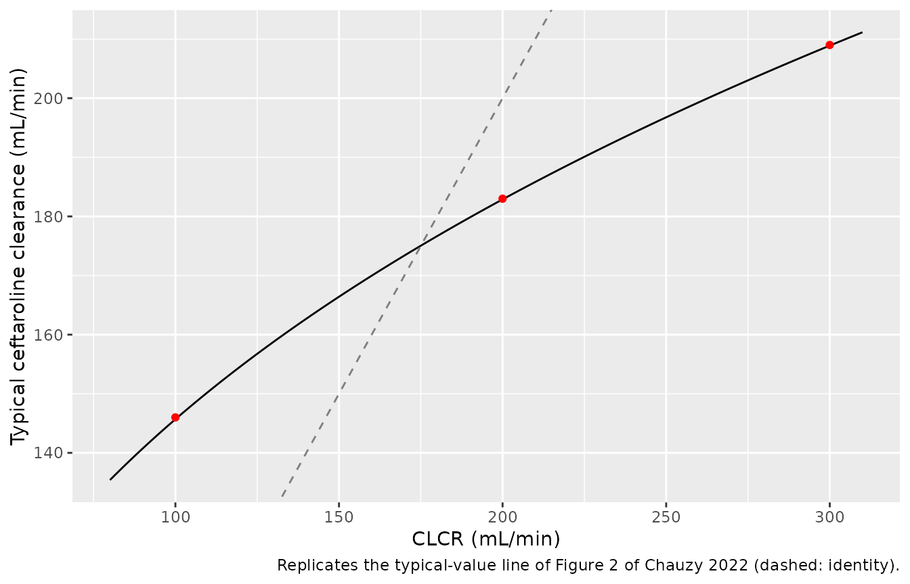
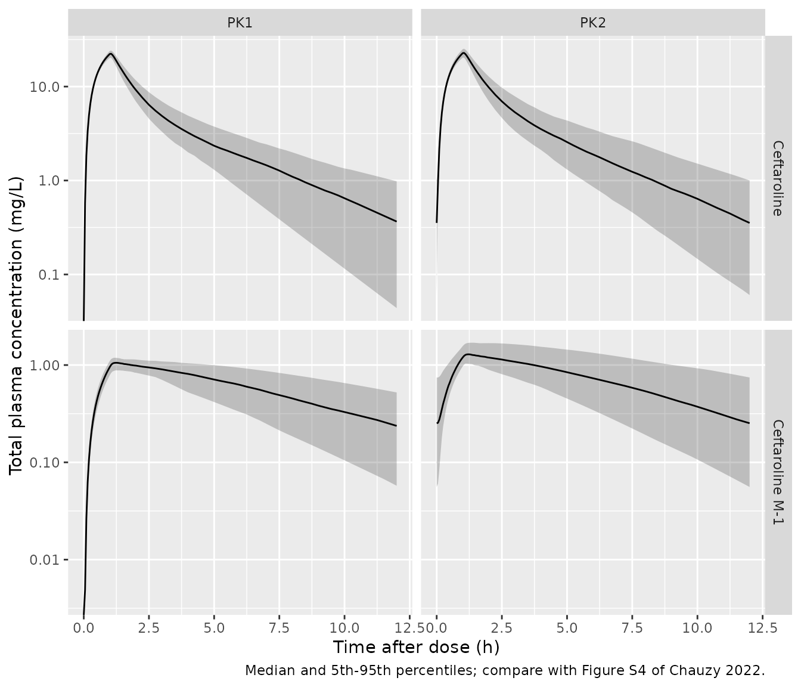
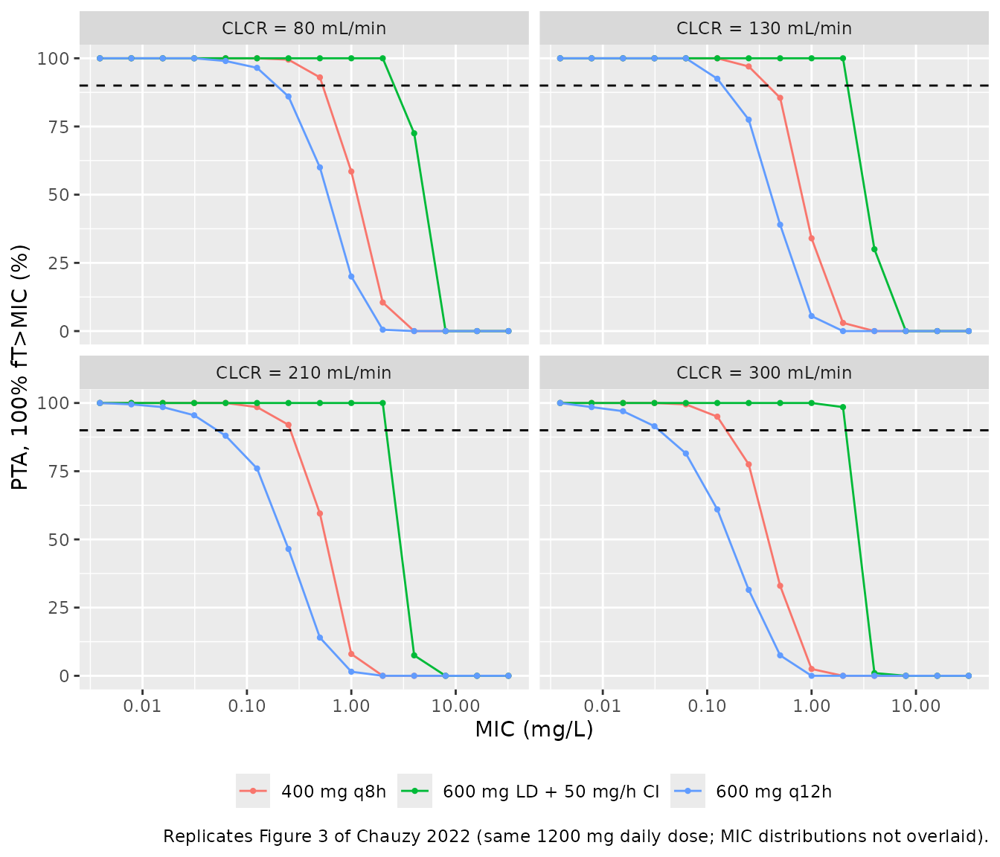
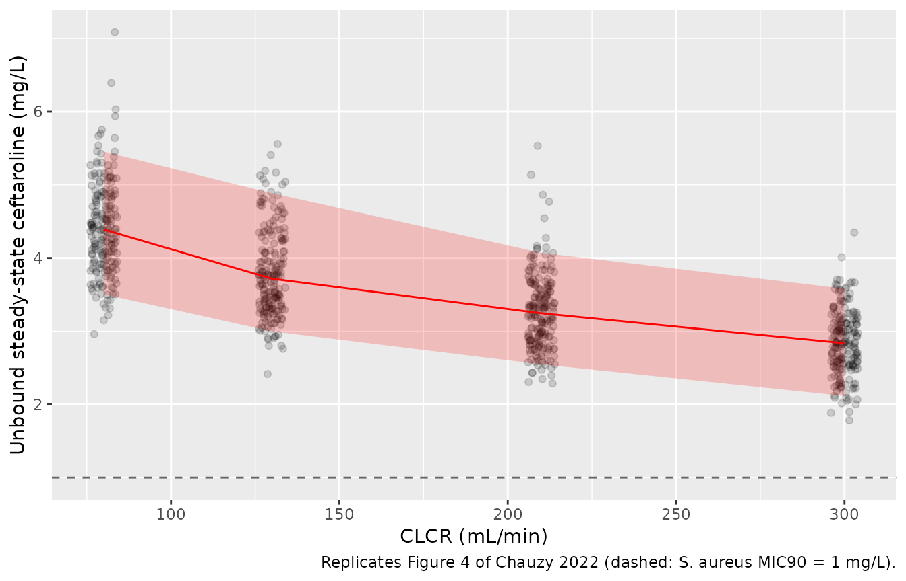

# Ceftaroline fosamil, ceftaroline and ceftaroline M-1 in ICU patients with augmented renal clearance (Chauzy 2022)

## Model and source

- Citation: Chauzy A, Gregoire N, Ferrandiere M, Lasocki S, Ashenoune K,
  Seguin P, Boisson M, Couet W, Marchand S, Mimoz O, Dahyot-Fizelier C.
  Population pharmacokinetic/pharmacodynamic study suggests continuous
  infusion of ceftaroline daily dose in ventilated critical care
  patients with early-onset pneumonia and augmented renal clearance. J
  Antimicrob Chemother. 2022;77(11):3173-3179.
  <doi:10.1093/jac/dkac299>. Model structure is Supplementary Figure S2
  and the Supplementary ‘Population pharmacokinetic analysis’ methods
  (molecular weights, complete fosamil-to-ceftaroline conversion,
  apparent /fm M-1 parameters); final parameter estimates and simulated
  secondary parameters are Supplementary Table S2; the IIV and residual
  variance-covariance matrix is Supplementary Table S3; per-patient
  covariates are Supplementary Table S1; the CLCR-clearance power
  relationship is main-text Equation 2 and Figure 2.
- Description: Joint population PK model for the prodrug ceftaroline
  fosamil, its active moiety ceftaroline and the inactive open-ring
  metabolite ceftaroline M-1 in 18 mechanically ventilated ICU adults
  with early-onset pneumonia and augmented renal clearance (measured
  urinary creatinine clearance 83-309 mL/min) receiving ceftaroline
  fosamil 600 mg every 12 h as a 1 h IV infusion. One-compartment
  ceftaroline fosamil with complete conversion to ceftaroline;
  two-compartment ceftaroline whose clearance forms M-1 (fraction fm,
  unidentified); two-compartment M-1 with apparent (/fm) parameters.
  Molar-mass ratios convert the amounts between the three analytes.
  Power effects of creatinine clearance (centred at 180 mL/min) on
  ceftaroline clearance and M-1 apparent clearance; full-block
  exponential IIV on ceftaroline clearance, ceftaroline peripheral
  volume and M-1 apparent clearance; additive error for ceftaroline
  fosamil and proportional errors for ceftaroline and M-1. All
  concentrations are total plasma concentrations.
- Article: <https://doi.org/10.1093/jac/dkac299> (open access;
  PMC9616540)

Ceftaroline fosamil is the water-soluble N-phosphono prodrug of
ceftaroline, a cephalosporin active against methicillin-resistant
*Staphylococcus aureus* (MRSA) and *Streptococcus pneumoniae*. Plasma
phosphatases convert the prodrug to ceftaroline within minutes, and
ceftaroline is partly hydrolysed to the microbiologically inactive
open-ring metabolite ceftaroline M-1. Chauzy and colleagues measured all
three analytes in ventilated ICU patients with early-onset pneumonia,
most of whom had augmented renal clearance (ARC), and fit them
simultaneously. The model was then used to compare the probability of
target attainment (PTA, 100% fT\>MIC) of five dosing regimens across
creatinine clearances of 80-300 mL/min.

## Population

Eighteen mechanically ventilated adults (13 men, 5 women; all Caucasian)
with early-onset pneumonia were enrolled in five French
university-hospital ICUs between February 2017 and May 2018
(NCT03025841). Inclusion required an MDRD eGFR above 80 mL/min/1.73 m^2.
Mean (SD) age was 46 (17) years (range 21-77), weight 73 (12) kg
(53-95.6), BMI 25.2 (4.7) kg/m^2 and SAPS II 45 (12) (main text Table
1). Creatinine clearance was measured from a 24 h urine collection on
each PK day: 83-267 mL/min on the first dose (PK1) and 100-309 mL/min on
the fifth to ninth dose (PK2), varying by about +/- 20% within a patient
between occasions (Supplementary Table S1 and Figure S1). All patients
received ceftaroline fosamil 600 mg every 12 h as a 1 h infusion; seven
plasma samples were drawn on each occasion (pre-dose, 1, 2, 4, 6, 9 and
12 h).

The same information is available programmatically via
`readModelDb("Chauzy_2022_ceftaroline")()$population`.

## Source trace

Every `ini()` value carries an in-file comment pointing to its source.
The table below collects them. “Table S” and “Figure S” refer to the
paper’s Supplementary data.

| Equation / parameter | Value | Source location |
|----|----|----|
| `lcl` (ceftaroline fosamil CL) | log(668) L/h | Table S2 |
| `lvc` (ceftaroline fosamil V1) | log(44.9) L | Table S2 |
| `lcl_ceftaroline` (CL at CLCR 180 mL/min) | log(10.6) L/h | Table S2; main text Equation 2 |
| `e_crcl_cl_ceftaroline` | 0.328 | Table S2 (CLCR,cov1); Equation 2 |
| `lvc_ceftaroline` (V2) | log(13.2) L | Table S2 |
| `lq_ceftaroline` (Q1) | log(6.79) L/h | Table S2 |
| `lvp_ceftaroline` (V3) | log(12) L | Table S2 |
| `lcl_m1` (CL/fm at CLCR 180 mL/min) | log(65.1) L/h | Table S2 |
| `e_crcl_cl_m1` | 0.419 | Table S2 (CLCR,cov2) |
| `lvc_m1` (V4/fm) | log(18) L | Table S2 |
| `lq_m1` (Q2/fm) | log(299) L/h | Table S2 |
| `lvp_m1` (V5/fm) | log(211) L | Table S2 |
| `etalcl_ceftaroline`, `etalvp_ceftaroline`, `etalcl_m1` block | 0.0226; -0.0274, 0.103; 0.0294, -0.0359, 0.0953 | Table S3 (diagonal = Table S2 %CV squared: 15%, 32.1%, 30.9%) |
| `addSd` (ceftaroline fosamil) | 0.271 mg/L | Table S2 |
| `propSd_ceftaroline` | 0.228 | Table S2 (22.8%); Table S3 variance 0.052 |
| `propSd_m1` | 0.222 | Table S2 (22.2%); Table S3 variance 0.0493 |
| Structure: 1-cmt fosamil -\> 2-cmt ceftaroline -\> 2-cmt M-1 | n/a | Figure S2 |
| Complete fosamil-to-ceftaroline conversion; apparent /fm M-1 parameters | n/a | Supplementary ‘Population pharmacokinetic analysis’ |
| Molecular weights 684.7 / 604.7 / 622.7 g/mol | n/a | Supplementary ‘Population pharmacokinetic analysis’ |
| `CL = CLpop * (CLCR/180)^cov` | n/a | Main text Equation 2, Figure 2 legend, Table S2 |
| Unbound fraction 0.8 (PTA only, not in `model()`) | n/a | Methods ‘PTA and cumulative fraction of response’ |

## Virtual cohort

The paper’s secondary parameters (Table S2) were computed from 18,000
profiles simulated with the covariates of the 18 enrolled patients. The
cohort below uses the per-patient creatinine clearances of Supplementary
Table S1, replicated 10 times for PK1 (180 subjects) and 12 times for
the 15 patients with a PK2 occasion (180 subjects).

``` r

# Supplementary Table S1: measured urinary CLCR (mL/min) on PK1 and PK2.
# Patients 1007, 4001 and 5001 had no PK2 occasion.
patients <- tibble::tribble(
  ~patient, ~crcl_pk1, ~crcl_pk2,
  1001, 211, 144,
  1002, 267, 268,
  1003, 206, 309,
  1004, 198, 180,
  1005, 244, 208,
  1006, 231, 217,
  1007, 166, NA,
  1008, 115, 113,
  1009, 248, 198,
  1010, 189, 100,
  1011, 169, 192,
  2001, 123, 127,
  3001, 222, 140,
  4001, 116, NA,
  5001, 83, NA,
  5002, 169, 190,
  5003, 137, 114,
  5004, 173, 209
)
stopifnot(nrow(patients) == 18, sum(!is.na(patients$crcl_pk2)) == 15)

# Doses are mg of ceftaroline fosamil into `central`. Observation rows carry
# dvid = 1 (the model has three endpoints); rxSolve returns Cc, Cc_ceftaroline
# and Cc_m1 on every observation row.
make_occasion <- function(crcl, n_rep, occasion, id_offset, ss) {
  subj <- tibble(
    id = id_offset + seq_len(length(crcl) * n_rep),
    CRCL = rep(crcl, times = n_rep),
    occasion = occasion
  )
  obs_times <- sort(unique(c(seq(0, 2, by = 0.05), seq(2.25, 12, by = 0.25),
                             if (ss == 0) seq(12.5, 48, by = 0.5))))
  doses <- subj |>
    mutate(time = 0, evid = 1L, amt = 600, dur = 1, ii = if (ss == 1) 12 else 0,
           ss = ss, cmt = "central", dvid = NA_integer_)
  obs <- tidyr::crossing(subj, time = obs_times) |>
    mutate(evid = 0L, amt = 0, dur = 0, ii = 0, ss = 0L,
           cmt = NA_character_, dvid = 1L)
  bind_rows(doses, obs) |> arrange(id, time, desc(evid))
}

events <- bind_rows(
  make_occasion(patients$crcl_pk1, 10, "PK1", 0L, ss = 0L),
  make_occasion(na.omit(patients$crcl_pk2), 12, "PK2", 1000L, ss = 1L)
)
stopifnot(!anyDuplicated(unique(events[, c("id", "time", "evid")])))
```

## Simulation

``` r

mod <- readModelDb("Chauzy_2022_ceftaroline")
rxode2::rxSetSeed(20221101)
sim <- rxode2::rxSolve(
  mod, events = events, keep = c("occasion", "CRCL"),
  returnType = "data.frame", useLinCmt = FALSE
)
#> ℹ parameter labels from comments will be replaced by 'label()'
stopifnot(!anyNA(sim$Cc_ceftaroline), !anyNA(sim$Cc_m1))
```

## Replicate published figures

### Figure 2: ceftaroline clearance versus creatinine clearance

The Discussion quotes three typical values of ceftaroline clearance read
from Equation 2: 146 mL/min at a CLCR of 100 mL/min, 183 mL/min at 200
mL/min and 209 mL/min at 300 mL/min. These are closed-form checks of the
covariate relationship and must hold exactly to the printed precision.

``` r

cl_typ <- function(crcl) 10.6 * (crcl / 180)^0.328 * 1000 / 60  # L/h -> mL/min
fig2 <- tibble(CRCL = seq(80, 310, by = 1), cl = cl_typ(CRCL))
disc <- tibble(CRCL = c(100, 200, 300), published = c(146, 183, 209),
               model = round(cl_typ(CRCL)))
stopifnot(all(abs(disc$model - disc$published) <= 1))
knitr::kable(disc |> dplyr::rename("CLCR (mL/min)" = CRCL,
                                   "Published CL (mL/min)" = published,
                                   "Model CL (mL/min)" = model),
             caption = "Typical ceftaroline clearance quoted in the Discussion.")
```

| CLCR (mL/min) | Published CL (mL/min) | Model CL (mL/min) |
|--------------:|----------------------:|------------------:|
|           100 |                   146 |               146 |
|           200 |                   183 |               183 |
|           300 |                   209 |               209 |

Typical ceftaroline clearance quoted in the Discussion. {.table}

``` r


ggplot(fig2, aes(CRCL, cl)) +
  geom_line() +
  geom_abline(slope = 1, intercept = 0, linetype = "dashed", colour = "grey50") +
  geom_point(data = disc, aes(y = published), colour = "red") +
  labs(x = "CLCR (mL/min)", y = "Typical ceftaroline clearance (mL/min)",
       caption = "Replicates the typical-value line of Figure 2 of Chauzy 2022 (dashed: identity).")
```



### Figure S4: simulated concentrations on PK1 and PK2

``` r

sim |>
  select(id, time, occasion, Cc_ceftaroline, Cc_m1) |>
  pivot_longer(c(Cc_ceftaroline, Cc_m1), names_to = "analyte", values_to = "conc") |>
  mutate(analyte = recode(analyte, Cc_ceftaroline = "Ceftaroline", Cc_m1 = "Ceftaroline M-1")) |>
  filter(time <= 12) |>
  group_by(occasion, analyte, time) |>
  summarise(Q05 = quantile(conc, 0.05), Q50 = median(conc), Q95 = quantile(conc, 0.95),
            .groups = "drop") |>
  ggplot(aes(time, Q50)) +
  geom_ribbon(aes(ymin = Q05, ymax = Q95), alpha = 0.25) +
  geom_line() +
  facet_grid(analyte ~ occasion, scales = "free_y") +
  scale_y_log10() +
  labs(x = "Time after dose (h)", y = "Total plasma concentration (mg/L)",
       caption = "Median and 5th-95th percentiles; compare with Figure S4 of Chauzy 2022.")
#> Warning in scale_y_log10(): log-10 transformation introduced infinite values.
#> log-10 transformation introduced infinite values.
#> log-10 transformation introduced infinite values.
#> log-10 transformation introduced infinite values.
```



## PKNCA validation

Table S2 reports the mean of the simulated secondary parameters. PKNCA
is run per analyte and occasion; the per-subject results are averaged
(means, to match the paper’s summary statistic) before comparison.

``` r

sim_nca <- sim |>
  select(id, time, occasion, Cc, Cc_ceftaroline, Cc_m1) |>
  pivot_longer(c(Cc, Cc_ceftaroline, Cc_m1), names_to = "analyte", values_to = "Cc") |>
  mutate(analyte = recode(analyte, Cc = "Ceftaroline fosamil",
                          Cc_ceftaroline = "Ceftaroline", Cc_m1 = "Ceftaroline M-1")) |>
  filter(!is.na(Cc))
stopifnot(all(sim_nca$time >= 0), any(sim_nca$time == 0))

dose_df <- events |>
  filter(evid == 1) |>
  select(id, time, amt, occasion) |>
  tidyr::crossing(analyte = unique(sim_nca$analyte))

conc_obj <- PKNCA::PKNCAconc(sim_nca, Cc ~ time | occasion + analyte + id)
#> Warning in assert_conc(conc, any_missing_conc = any_missing_conc): Negative
#> concentrations found
dose_obj <- PKNCA::PKNCAdose(dose_df, amt ~ time | occasion + analyte + id)

analytes <- unique(sim_nca$analyte)
intervals <- bind_rows(
  # PK1 (first dose): Cmax and the 12 h trough (last observation in 0-12 h).
  data.frame(occasion = "PK1", analyte = analytes, start = 0, end = 12,
             cmax = TRUE, clast.obs = TRUE),
  # PK1 AUC0-inf; ceftaroline fosamil has no Table S2 AUC.
  data.frame(occasion = "PK1", analyte = c("Ceftaroline", "Ceftaroline M-1"),
             start = 0, end = Inf, aucinf.obs = TRUE),
  # PK2 (steady state): Cmax, Cmin and AUC0-12.
  data.frame(occasion = "PK2", analyte = analytes, start = 0, end = 12,
             cmax = TRUE, cmin = TRUE, auclast = TRUE)
) |>
  mutate(across(where(is.logical), ~ dplyr::coalesce(.x, FALSE)))
nca_res <- PKNCA::pk.nca(PKNCA::PKNCAdata(conc_obj, dose_obj, intervals = intervals))
#> Warning in assert_conc(conc = conc): Negative concentrations found
#> Warning in assert_conc(conc = conc): Negative concentrations found
#> Warning in assert_conc(conc = conc): Negative concentrations found
#> Warning in assert_conc(conc, any_missing_conc = any_missing_conc): Negative
#> concentrations found
#> Warning in assert_conc(conc = conc): Negative concentrations found
#> Warning in assert_conc(conc, any_missing_conc = any_missing_conc): Negative
#> concentrations found
#> Warning in assert_conc(conc = conc): Negative concentrations found
#> Warning in assert_conc(conc, any_missing_conc = any_missing_conc): Negative
#> concentrations found
#> Warning in assert_conc(conc = conc): Negative concentrations found
#> Warning in assert_conc(conc, any_missing_conc = any_missing_conc): Negative
#> concentrations found
#> Warning in assert_conc(conc = conc): Negative concentrations found
#> Warning in assert_conc(conc, any_missing_conc = any_missing_conc): Negative
#> concentrations found
#> Warning in assert_conc(conc = conc): Negative concentrations found
#> Warning in assert_conc(conc, any_missing_conc = any_missing_conc): Negative
#> concentrations found
#> Warning in assert_conc(conc = conc): Negative concentrations found
#> Warning in assert_conc(conc, any_missing_conc = any_missing_conc): Negative
#> concentrations found
#> Warning in assert_conc(conc = conc): Negative concentrations found
#> Warning in assert_conc(conc, any_missing_conc = any_missing_conc): Negative
#> concentrations found
#> Warning in assert_conc(conc = conc): Negative concentrations found
#> Warning in assert_conc(conc, any_missing_conc = any_missing_conc): Negative
#> concentrations found
#> Warning in assert_conc(conc = conc): Negative concentrations found
#> Warning in assert_conc(conc, any_missing_conc = any_missing_conc): Negative
#> concentrations found
#> Warning in assert_conc(conc = conc): Negative concentrations found
#> Warning in assert_conc(conc, any_missing_conc = any_missing_conc): Negative
#> concentrations found
#> Warning in assert_conc(conc = conc): Negative concentrations found
#> Warning in assert_conc(conc, any_missing_conc = any_missing_conc): Negative
#> concentrations found
#> Warning in assert_conc(conc = conc): Negative concentrations found
#> Warning in assert_conc(conc, any_missing_conc = any_missing_conc): Negative
#> concentrations found
#> Warning in assert_conc(conc = conc): Negative concentrations found
#> Warning in assert_conc(conc, any_missing_conc = any_missing_conc): Negative
#> concentrations found
#> Warning in assert_conc(conc = conc): Negative concentrations found
#> Warning in assert_conc(conc, any_missing_conc = any_missing_conc): Negative
#> concentrations found
#> Warning in assert_conc(conc = conc): Negative concentrations found
#> Warning in assert_conc(conc, any_missing_conc = any_missing_conc): Negative
#> concentrations found
#> Warning in assert_conc(conc = conc): Negative concentrations found
#> Warning in assert_conc(conc, any_missing_conc = any_missing_conc): Negative
#> concentrations found
#> Warning in assert_conc(conc = conc): Negative concentrations found
#> Warning in assert_conc(conc, any_missing_conc = any_missing_conc): Negative
#> concentrations found
#> Warning in assert_conc(conc = conc): Negative concentrations found
#> Warning in assert_conc(conc, any_missing_conc = any_missing_conc): Negative
#> concentrations found
#> Warning in assert_conc(conc = conc): Negative concentrations found
#> Warning in assert_conc(conc, any_missing_conc = any_missing_conc): Negative
#> concentrations found
#> Warning in assert_conc(conc = conc): Negative concentrations found
#> Warning in assert_conc(conc, any_missing_conc = any_missing_conc): Negative
#> concentrations found
#> Warning in assert_conc(conc = conc): Negative concentrations found
#> Warning in assert_conc(conc, any_missing_conc = any_missing_conc): Negative
#> concentrations found
#> Warning in assert_conc(conc = conc): Negative concentrations found
#> Warning in assert_conc(conc, any_missing_conc = any_missing_conc): Negative
#> concentrations found
#> Warning in assert_conc(conc = conc): Negative concentrations found
#> Warning in assert_conc(conc, any_missing_conc = any_missing_conc): Negative
#> concentrations found
#> Warning in assert_conc(conc = conc): Negative concentrations found
#> Warning in assert_conc(conc, any_missing_conc = any_missing_conc): Negative
#> concentrations found
#> Warning in assert_conc(conc = conc): Negative concentrations found
#> Warning in assert_conc(conc, any_missing_conc = any_missing_conc): Negative
#> concentrations found
#> Warning in assert_conc(conc = conc): Negative concentrations found
#> Warning in assert_conc(conc, any_missing_conc = any_missing_conc): Negative
#> concentrations found
#> Warning in assert_conc(conc = conc): Negative concentrations found
#> Warning in assert_conc(conc, any_missing_conc = any_missing_conc): Negative
#> concentrations found
#> Warning in assert_conc(conc = conc): Negative concentrations found
#> Warning in assert_conc(conc, any_missing_conc = any_missing_conc): Negative
#> concentrations found
#> Warning in assert_conc(conc = conc): Negative concentrations found
#> Warning in assert_conc(conc, any_missing_conc = any_missing_conc): Negative
#> concentrations found
#> Warning in assert_conc(conc = conc): Negative concentrations found
#> Warning in assert_conc(conc, any_missing_conc = any_missing_conc): Negative
#> concentrations found
#> Warning in assert_conc(conc = conc): Negative concentrations found
#> Warning in assert_conc(conc, any_missing_conc = any_missing_conc): Negative
#> concentrations found
#> Warning in assert_conc(conc = conc): Negative concentrations found
#> Warning in assert_conc(conc, any_missing_conc = any_missing_conc): Negative
#> concentrations found
#> Warning in assert_conc(conc = conc): Negative concentrations found
#> Warning in assert_conc(conc, any_missing_conc = any_missing_conc): Negative
#> concentrations found
#> Warning in assert_conc(conc = conc): Negative concentrations found
#> Warning in assert_conc(conc, any_missing_conc = any_missing_conc): Negative
#> concentrations found
#> Warning in assert_conc(conc = conc): Negative concentrations found
#> Warning in assert_conc(conc, any_missing_conc = any_missing_conc): Negative
#> concentrations found
#> Warning in assert_conc(conc = conc): Negative concentrations found
#> Warning in assert_conc(conc, any_missing_conc = any_missing_conc): Negative
#> concentrations found
#> Warning in assert_conc(conc = conc): Negative concentrations found
#> Warning in assert_conc(conc, any_missing_conc = any_missing_conc): Negative
#> concentrations found
#> Warning in assert_conc(conc = conc): Negative concentrations found
#> Warning in assert_conc(conc, any_missing_conc = any_missing_conc): Negative
#> concentrations found
#> Warning in assert_conc(conc = conc): Negative concentrations found
#> Warning in assert_conc(conc, any_missing_conc = any_missing_conc): Negative
#> concentrations found
#> Warning in assert_conc(conc = conc): Negative concentrations found
#> Warning in assert_conc(conc, any_missing_conc = any_missing_conc): Negative
#> concentrations found
#> Warning in assert_conc(conc = conc): Negative concentrations found
#> Warning in assert_conc(conc, any_missing_conc = any_missing_conc): Negative
#> concentrations found
#> Warning in assert_conc(conc = conc): Negative concentrations found
#> Warning in assert_conc(conc, any_missing_conc = any_missing_conc): Negative
#> concentrations found
#> Warning in assert_conc(conc = conc): Negative concentrations found
#> Warning in assert_conc(conc, any_missing_conc = any_missing_conc): Negative
#> concentrations found
#> Warning in assert_conc(conc = conc): Negative concentrations found
#> Warning in assert_conc(conc, any_missing_conc = any_missing_conc): Negative
#> concentrations found
#> Warning in assert_conc(conc = conc): Negative concentrations found
#> Warning in assert_conc(conc, any_missing_conc = any_missing_conc): Negative
#> concentrations found
#> Warning in assert_conc(conc = conc): Negative concentrations found
#> Warning in assert_conc(conc, any_missing_conc = any_missing_conc): Negative
#> concentrations found
#> Warning in assert_conc(conc = conc): Negative concentrations found
#> Warning in assert_conc(conc, any_missing_conc = any_missing_conc): Negative
#> concentrations found
#> Warning in assert_conc(conc = conc): Negative concentrations found
#> Warning in assert_conc(conc, any_missing_conc = any_missing_conc): Negative
#> concentrations found
#> Warning in assert_conc(conc = conc): Negative concentrations found
#> Warning in assert_conc(conc, any_missing_conc = any_missing_conc): Negative
#> concentrations found
#> Warning in assert_conc(conc = conc): Negative concentrations found
#> Warning in assert_conc(conc, any_missing_conc = any_missing_conc): Negative
#> concentrations found
#> Warning in assert_conc(conc = conc): Negative concentrations found
#> Warning in assert_conc(conc, any_missing_conc = any_missing_conc): Negative
#> concentrations found
#> Warning in assert_conc(conc = conc): Negative concentrations found
#> Warning in assert_conc(conc, any_missing_conc = any_missing_conc): Negative
#> concentrations found
#> Warning in assert_conc(conc = conc): Negative concentrations found
#> Warning in assert_conc(conc, any_missing_conc = any_missing_conc): Negative
#> concentrations found
#> Warning in assert_conc(conc = conc): Negative concentrations found
#> Warning in assert_conc(conc, any_missing_conc = any_missing_conc): Negative
#> concentrations found
#> Warning in assert_conc(conc = conc): Negative concentrations found
#> Warning in assert_conc(conc, any_missing_conc = any_missing_conc): Negative
#> concentrations found
#> Warning in assert_conc(conc = conc): Negative concentrations found
#> Warning in assert_conc(conc, any_missing_conc = any_missing_conc): Negative
#> concentrations found
#> Warning in assert_conc(conc = conc): Negative concentrations found
#> Warning in assert_conc(conc, any_missing_conc = any_missing_conc): Negative
#> concentrations found
#> Warning in assert_conc(conc = conc): Negative concentrations found
#> Warning in assert_conc(conc, any_missing_conc = any_missing_conc): Negative
#> concentrations found
#> Warning in assert_conc(conc = conc): Negative concentrations found
#> Warning in assert_conc(conc, any_missing_conc = any_missing_conc): Negative
#> concentrations found
#> Warning in assert_conc(conc = conc): Negative concentrations found
#> Warning in assert_conc(conc, any_missing_conc = any_missing_conc): Negative
#> concentrations found
#> Warning in assert_conc(conc = conc): Negative concentrations found
#> Warning in assert_conc(conc, any_missing_conc = any_missing_conc): Negative
#> concentrations found
#> Warning in assert_conc(conc = conc): Negative concentrations found
#> Warning in assert_conc(conc, any_missing_conc = any_missing_conc): Negative
#> concentrations found
#> Warning in assert_conc(conc = conc): Negative concentrations found
#> Warning in assert_conc(conc, any_missing_conc = any_missing_conc): Negative
#> concentrations found
#> Warning in assert_conc(conc = conc): Negative concentrations found
#> Warning in assert_conc(conc, any_missing_conc = any_missing_conc): Negative
#> concentrations found
#> Warning in assert_conc(conc = conc): Negative concentrations found
#> Warning in assert_conc(conc, any_missing_conc = any_missing_conc): Negative
#> concentrations found
#> Warning in assert_conc(conc = conc): Negative concentrations found
#> Warning in assert_conc(conc, any_missing_conc = any_missing_conc): Negative
#> concentrations found
#> Warning in assert_conc(conc = conc): Negative concentrations found
#> Warning in assert_conc(conc, any_missing_conc = any_missing_conc): Negative
#> concentrations found
#> Warning in assert_conc(conc = conc): Negative concentrations found
#> Warning in assert_conc(conc, any_missing_conc = any_missing_conc): Negative
#> concentrations found
#> Warning in assert_conc(conc = conc): Negative concentrations found
#> Warning in assert_conc(conc, any_missing_conc = any_missing_conc): Negative
#> concentrations found
#> Warning in assert_conc(conc = conc): Negative concentrations found
#> Warning in assert_conc(conc, any_missing_conc = any_missing_conc): Negative
#> concentrations found
#> Warning in assert_conc(conc = conc): Negative concentrations found
#> Warning in assert_conc(conc, any_missing_conc = any_missing_conc): Negative
#> concentrations found
#> Warning in assert_conc(conc = conc): Negative concentrations found
#> Warning in assert_conc(conc, any_missing_conc = any_missing_conc): Negative
#> concentrations found
#> Warning in assert_conc(conc = conc): Negative concentrations found
#> Warning in assert_conc(conc, any_missing_conc = any_missing_conc): Negative
#> concentrations found
#> Warning in assert_conc(conc = conc): Negative concentrations found
#> Warning in assert_conc(conc, any_missing_conc = any_missing_conc): Negative
#> concentrations found
#> Warning in assert_conc(conc = conc): Negative concentrations found
#> Warning in assert_conc(conc, any_missing_conc = any_missing_conc): Negative
#> concentrations found
#> Warning in assert_conc(conc = conc): Negative concentrations found
#> Warning in assert_conc(conc, any_missing_conc = any_missing_conc): Negative
#> concentrations found
#> Warning in assert_conc(conc = conc): Negative concentrations found
#> Warning in assert_conc(conc, any_missing_conc = any_missing_conc): Negative
#> concentrations found
#> Warning in assert_conc(conc = conc): Negative concentrations found
#> Warning in assert_conc(conc, any_missing_conc = any_missing_conc): Negative
#> concentrations found
#> Warning in assert_conc(conc = conc): Negative concentrations found
#> Warning in assert_conc(conc, any_missing_conc = any_missing_conc): Negative
#> concentrations found
#> Warning in assert_conc(conc = conc): Negative concentrations found
#> Warning in assert_conc(conc, any_missing_conc = any_missing_conc): Negative
#> concentrations found
#> Warning in assert_conc(conc = conc): Negative concentrations found
#> Warning in assert_conc(conc, any_missing_conc = any_missing_conc): Negative
#> concentrations found
#> Warning in assert_conc(conc = conc): Negative concentrations found
#> Warning in assert_conc(conc, any_missing_conc = any_missing_conc): Negative
#> concentrations found
#> Warning in assert_conc(conc = conc): Negative concentrations found
#> Warning in assert_conc(conc, any_missing_conc = any_missing_conc): Negative
#> concentrations found
#> Warning in assert_conc(conc = conc): Negative concentrations found
#> Warning in assert_conc(conc, any_missing_conc = any_missing_conc): Negative
#> concentrations found
#> Warning in assert_conc(conc = conc): Negative concentrations found
#> Warning in assert_conc(conc, any_missing_conc = any_missing_conc): Negative
#> concentrations found
#> Warning in assert_conc(conc = conc): Negative concentrations found
#> Warning in assert_conc(conc, any_missing_conc = any_missing_conc): Negative
#> concentrations found
#> Warning in assert_conc(conc = conc): Negative concentrations found
#> Warning in assert_conc(conc, any_missing_conc = any_missing_conc): Negative
#> concentrations found
#> Warning in assert_conc(conc = conc): Negative concentrations found
#> Warning in assert_conc(conc, any_missing_conc = any_missing_conc): Negative
#> concentrations found
#> Warning in assert_conc(conc = conc): Negative concentrations found
#> Warning in assert_conc(conc, any_missing_conc = any_missing_conc): Negative
#> concentrations found
#> Warning in assert_conc(conc = conc): Negative concentrations found
#> Warning in assert_conc(conc, any_missing_conc = any_missing_conc): Negative
#> concentrations found
#> Warning in assert_conc(conc = conc): Negative concentrations found
#> Warning in assert_conc(conc, any_missing_conc = any_missing_conc): Negative
#> concentrations found
#> Warning in assert_conc(conc = conc): Negative concentrations found
#> Warning in assert_conc(conc, any_missing_conc = any_missing_conc): Negative
#> concentrations found
#> Warning in assert_conc(conc = conc): Negative concentrations found
#> Warning in assert_conc(conc, any_missing_conc = any_missing_conc): Negative
#> concentrations found
#> Warning in assert_conc(conc = conc): Negative concentrations found
#> Warning in assert_conc(conc, any_missing_conc = any_missing_conc): Negative
#> concentrations found
#> Warning in assert_conc(conc = conc): Negative concentrations found
#> Warning in assert_conc(conc, any_missing_conc = any_missing_conc): Negative
#> concentrations found
#> Warning in assert_conc(conc = conc): Negative concentrations found
#> Warning in assert_conc(conc, any_missing_conc = any_missing_conc): Negative
#> concentrations found
#> Warning in assert_conc(conc = conc): Negative concentrations found
#> Warning in assert_conc(conc, any_missing_conc = any_missing_conc): Negative
#> concentrations found
#> Warning in assert_conc(conc = conc): Negative concentrations found
#> Warning in assert_conc(conc, any_missing_conc = any_missing_conc): Negative
#> concentrations found
#> Warning in assert_conc(conc = conc): Negative concentrations found
#> Warning in assert_conc(conc, any_missing_conc = any_missing_conc): Negative
#> concentrations found
#> Warning in assert_conc(conc = conc): Negative concentrations found
#> Warning in assert_conc(conc, any_missing_conc = any_missing_conc): Negative
#> concentrations found
#> Warning in assert_conc(conc = conc): Negative concentrations found
#> Warning in assert_conc(conc, any_missing_conc = any_missing_conc): Negative
#> concentrations found
#> Warning in assert_conc(conc = conc): Negative concentrations found
#> Warning in assert_conc(conc, any_missing_conc = any_missing_conc): Negative
#> concentrations found
#> Warning in assert_conc(conc = conc): Negative concentrations found
#> Warning in assert_conc(conc, any_missing_conc = any_missing_conc): Negative
#> concentrations found
#> Warning in assert_conc(conc = conc): Negative concentrations found
#> Warning in assert_conc(conc, any_missing_conc = any_missing_conc): Negative
#> concentrations found
#> Warning in assert_conc(conc = conc): Negative concentrations found
#> Warning in assert_conc(conc, any_missing_conc = any_missing_conc): Negative
#> concentrations found
#> Warning in assert_conc(conc = conc): Negative concentrations found
#> Warning in assert_conc(conc, any_missing_conc = any_missing_conc): Negative
#> concentrations found
#> Warning in assert_conc(conc = conc): Negative concentrations found
#> Warning in assert_conc(conc, any_missing_conc = any_missing_conc): Negative
#> concentrations found
#> Warning in assert_conc(conc = conc): Negative concentrations found
#> Warning in assert_conc(conc, any_missing_conc = any_missing_conc): Negative
#> concentrations found
#> Warning in assert_conc(conc = conc): Negative concentrations found
#> Warning in assert_conc(conc, any_missing_conc = any_missing_conc): Negative
#> concentrations found
#> Warning in assert_conc(conc = conc): Negative concentrations found
#> Warning in assert_conc(conc, any_missing_conc = any_missing_conc): Negative
#> concentrations found
#> Warning in assert_conc(conc = conc): Negative concentrations found
#> Warning in assert_conc(conc, any_missing_conc = any_missing_conc): Negative
#> concentrations found
#> Warning in assert_conc(conc = conc): Negative concentrations found
#> Warning in assert_conc(conc, any_missing_conc = any_missing_conc): Negative
#> concentrations found
#> Warning in assert_conc(conc = conc): Negative concentrations found
#> Warning in assert_conc(conc, any_missing_conc = any_missing_conc): Negative
#> concentrations found
#> Warning in assert_conc(conc = conc): Negative concentrations found
#> Warning in assert_conc(conc, any_missing_conc = any_missing_conc): Negative
#> concentrations found
#> Warning in assert_conc(conc = conc): Negative concentrations found
#> Warning in assert_conc(conc, any_missing_conc = any_missing_conc): Negative
#> concentrations found
#> Warning in assert_conc(conc = conc): Negative concentrations found
#> Warning in assert_conc(conc, any_missing_conc = any_missing_conc): Negative
#> concentrations found
#> Warning in assert_conc(conc = conc): Negative concentrations found
#> Warning in assert_conc(conc, any_missing_conc = any_missing_conc): Negative
#> concentrations found
#> Warning in assert_conc(conc = conc): Negative concentrations found
#> Warning in assert_conc(conc, any_missing_conc = any_missing_conc): Negative
#> concentrations found
#> Warning in assert_conc(conc = conc): Negative concentrations found
#> Warning in assert_conc(conc, any_missing_conc = any_missing_conc): Negative
#> concentrations found
#> Warning in assert_conc(conc = conc): Negative concentrations found
#> Warning in assert_conc(conc, any_missing_conc = any_missing_conc): Negative
#> concentrations found
#> Warning in assert_conc(conc = conc): Negative concentrations found
#> Warning in assert_conc(conc, any_missing_conc = any_missing_conc): Negative
#> concentrations found
#> Warning in assert_conc(conc = conc): Negative concentrations found
#> Warning in assert_conc(conc, any_missing_conc = any_missing_conc): Negative
#> concentrations found
#> Warning in assert_conc(conc = conc): Negative concentrations found
#> Warning in assert_conc(conc, any_missing_conc = any_missing_conc): Negative
#> concentrations found
#> Warning in assert_conc(conc = conc): Negative concentrations found
#> Warning in assert_conc(conc, any_missing_conc = any_missing_conc): Negative
#> concentrations found
#> Warning in assert_conc(conc = conc): Negative concentrations found
#> Warning in assert_conc(conc, any_missing_conc = any_missing_conc): Negative
#> concentrations found
#> Warning in assert_conc(conc = conc): Negative concentrations found
#> Warning in assert_conc(conc, any_missing_conc = any_missing_conc): Negative
#> concentrations found
#> Warning in assert_conc(conc = conc): Negative concentrations found
#> Warning in assert_conc(conc, any_missing_conc = any_missing_conc): Negative
#> concentrations found
#> Warning in assert_conc(conc = conc): Negative concentrations found
#> Warning in assert_conc(conc, any_missing_conc = any_missing_conc): Negative
#> concentrations found
#> Warning in assert_conc(conc = conc): Negative concentrations found
#> Warning in assert_conc(conc, any_missing_conc = any_missing_conc): Negative
#> concentrations found
#> Warning in assert_conc(conc = conc): Negative concentrations found
#> Warning in assert_conc(conc, any_missing_conc = any_missing_conc): Negative
#> concentrations found
#> Warning in assert_conc(conc = conc): Negative concentrations found
#> Warning in assert_conc(conc, any_missing_conc = any_missing_conc): Negative
#> concentrations found
#> Warning in assert_conc(conc = conc): Negative concentrations found
#> Warning in assert_conc(conc, any_missing_conc = any_missing_conc): Negative
#> concentrations found
#> Warning in assert_conc(conc = conc): Negative concentrations found
#> Warning in assert_conc(conc, any_missing_conc = any_missing_conc): Negative
#> concentrations found
#> Warning in assert_conc(conc = conc): Negative concentrations found
#> Warning in assert_conc(conc, any_missing_conc = any_missing_conc): Negative
#> concentrations found
#> Warning in assert_conc(conc = conc): Negative concentrations found
#> Warning in assert_conc(conc, any_missing_conc = any_missing_conc): Negative
#> concentrations found
#> Warning in assert_conc(conc = conc): Negative concentrations found
#> Warning in assert_conc(conc, any_missing_conc = any_missing_conc): Negative
#> concentrations found
#> Warning in assert_conc(conc = conc): Negative concentrations found
#> Warning in assert_conc(conc, any_missing_conc = any_missing_conc): Negative
#> concentrations found
#> Warning in assert_conc(conc = conc): Negative concentrations found
#> Warning in assert_conc(conc, any_missing_conc = any_missing_conc): Negative
#> concentrations found
#> Warning in assert_conc(conc = conc): Negative concentrations found
#> Warning in assert_conc(conc, any_missing_conc = any_missing_conc): Negative
#> concentrations found
#> Warning in assert_conc(conc = conc): Negative concentrations found
#> Warning in assert_conc(conc, any_missing_conc = any_missing_conc): Negative
#> concentrations found
#> Warning in assert_conc(conc = conc): Negative concentrations found
#> Warning in assert_conc(conc, any_missing_conc = any_missing_conc): Negative
#> concentrations found
#> Warning in assert_conc(conc = conc): Negative concentrations found
#> Warning in assert_conc(conc, any_missing_conc = any_missing_conc): Negative
#> concentrations found
#> Warning in assert_conc(conc = conc): Negative concentrations found
#> Warning in assert_conc(conc, any_missing_conc = any_missing_conc): Negative
#> concentrations found
#> Warning in assert_conc(conc = conc): Negative concentrations found
#> Warning in assert_conc(conc, any_missing_conc = any_missing_conc): Negative
#> concentrations found
#> Warning in assert_conc(conc = conc): Negative concentrations found
#> Warning in assert_conc(conc, any_missing_conc = any_missing_conc): Negative
#> concentrations found
#> Warning in assert_conc(conc = conc): Negative concentrations found
#> Warning in assert_conc(conc, any_missing_conc = any_missing_conc): Negative
#> concentrations found
#> Warning in assert_conc(conc = conc): Negative concentrations found
#> Warning in assert_conc(conc, any_missing_conc = any_missing_conc): Negative
#> concentrations found
#> Warning in assert_conc(conc = conc): Negative concentrations found
#> Warning in assert_conc(conc, any_missing_conc = any_missing_conc): Negative
#> concentrations found
#> Warning in assert_conc(conc = conc): Negative concentrations found
#> Warning in assert_conc(conc, any_missing_conc = any_missing_conc): Negative
#> concentrations found
#> Warning in assert_conc(conc = conc): Negative concentrations found
#> Warning in assert_conc(conc, any_missing_conc = any_missing_conc): Negative
#> concentrations found
#> Warning in assert_conc(conc = conc): Negative concentrations found
#> Warning in assert_conc(conc, any_missing_conc = any_missing_conc): Negative
#> concentrations found
#> Warning in assert_conc(conc = conc): Negative concentrations found
#> Warning in assert_conc(conc, any_missing_conc = any_missing_conc): Negative
#> concentrations found
#> Warning in assert_conc(conc = conc): Negative concentrations found
#> Warning in assert_conc(conc, any_missing_conc = any_missing_conc): Negative
#> concentrations found
#> Warning in assert_conc(conc = conc): Negative concentrations found
#> Warning in assert_conc(conc, any_missing_conc = any_missing_conc): Negative
#> concentrations found
#> Warning in assert_conc(conc = conc): Negative concentrations found
#> Warning in assert_conc(conc, any_missing_conc = any_missing_conc): Negative
#> concentrations found
#> Warning in assert_conc(conc = conc): Negative concentrations found
#> Warning in assert_conc(conc, any_missing_conc = any_missing_conc): Negative
#> concentrations found
#> Warning in assert_conc(conc = conc): Negative concentrations found
#> Warning in assert_conc(conc, any_missing_conc = any_missing_conc): Negative
#> concentrations found
#> Warning in assert_conc(conc = conc): Negative concentrations found
#> Warning in assert_conc(conc, any_missing_conc = any_missing_conc): Negative
#> concentrations found
#> Warning in assert_conc(conc = conc): Negative concentrations found
#> Warning in assert_conc(conc, any_missing_conc = any_missing_conc): Negative
#> concentrations found
#> Warning in assert_conc(conc = conc): Negative concentrations found
#> Warning in assert_conc(conc, any_missing_conc = any_missing_conc): Negative
#> concentrations found
#> Warning in assert_conc(conc = conc): Negative concentrations found
#> Warning in assert_conc(conc, any_missing_conc = any_missing_conc): Negative
#> concentrations found
#> Warning in assert_conc(conc = conc): Negative concentrations found
#> Warning in assert_conc(conc, any_missing_conc = any_missing_conc): Negative
#> concentrations found
#> Warning in assert_conc(conc = conc): Negative concentrations found
#> Warning in assert_conc(conc, any_missing_conc = any_missing_conc): Negative
#> concentrations found
#> Warning in assert_conc(conc = conc): Negative concentrations found
#> Warning in assert_conc(conc, any_missing_conc = any_missing_conc): Negative
#> concentrations found
#> Warning in assert_conc(conc = conc): Negative concentrations found
#> Warning in assert_conc(conc, any_missing_conc = any_missing_conc): Negative
#> concentrations found
#> Warning in assert_conc(conc = conc): Negative concentrations found
#> Warning in assert_conc(conc, any_missing_conc = any_missing_conc): Negative
#> concentrations found
#> Warning in assert_conc(conc = conc): Negative concentrations found
#> Warning in assert_conc(conc, any_missing_conc = any_missing_conc): Negative
#> concentrations found
#> Warning in assert_conc(conc = conc): Negative concentrations found
#> Warning in assert_conc(conc, any_missing_conc = any_missing_conc): Negative
#> concentrations found
#> Warning in assert_conc(conc = conc): Negative concentrations found
#> Warning in assert_conc(conc, any_missing_conc = any_missing_conc): Negative
#> concentrations found
#> Warning in assert_conc(conc = conc): Negative concentrations found
#> Warning in assert_conc(conc, any_missing_conc = any_missing_conc): Negative
#> concentrations found
#> Warning in assert_conc(conc = conc): Negative concentrations found
#> Warning in assert_conc(conc, any_missing_conc = any_missing_conc): Negative
#> concentrations found
#> Warning in assert_conc(conc = conc): Negative concentrations found
#> Warning in assert_conc(conc, any_missing_conc = any_missing_conc): Negative
#> concentrations found
#> Warning in assert_conc(conc = conc): Negative concentrations found
#> Warning in assert_conc(conc, any_missing_conc = any_missing_conc): Negative
#> concentrations found
#> Warning in assert_conc(conc = conc): Negative concentrations found
#> Warning in assert_conc(conc, any_missing_conc = any_missing_conc): Negative
#> concentrations found
#> Warning in assert_conc(conc = conc): Negative concentrations found
#> Warning in assert_conc(conc, any_missing_conc = any_missing_conc): Negative
#> concentrations found
#> Warning in assert_conc(conc = conc): Negative concentrations found
#> Warning in assert_conc(conc, any_missing_conc = any_missing_conc): Negative
#> concentrations found
#> Warning in assert_conc(conc = conc): Negative concentrations found
#> Warning in assert_conc(conc, any_missing_conc = any_missing_conc): Negative
#> concentrations found
#> Warning in assert_conc(conc = conc): Negative concentrations found
#> Warning in assert_conc(conc, any_missing_conc = any_missing_conc): Negative
#> concentrations found
#> Warning in assert_conc(conc, any_missing_conc = any_missing_conc): Negative
#> concentrations found
#> Warning in log(conc.2/conc.1): NaNs produced
#> Warning in assert_conc(conc = conc): Negative concentrations found
#> Warning in assert_conc(conc = conc): Negative concentrations found
#> Warning in assert_conc(conc, any_missing_conc = any_missing_conc): Negative
#> concentrations found
#> Warning in log(conc.2/conc.1): NaNs produced
#> Warning in assert_conc(conc = conc): Negative concentrations found
#> Warning in assert_conc(conc = conc): Negative concentrations found
#> Warning in assert_conc(conc, any_missing_conc = any_missing_conc): Negative
#> concentrations found
#> Warning in log(conc.2/conc.1): NaNs produced
#> Warning in assert_conc(conc = conc): Negative concentrations found
#> Warning in assert_conc(conc = conc): Negative concentrations found
#> Warning in assert_conc(conc, any_missing_conc = any_missing_conc): Negative
#> concentrations found
#> Warning in log(conc.2/conc.1): NaNs produced
#> Warning in assert_conc(conc = conc): Negative concentrations found
#> Warning in assert_conc(conc = conc): Negative concentrations found
#> Warning in assert_conc(conc, any_missing_conc = any_missing_conc): Negative
#> concentrations found
#> Warning in log(conc.2/conc.1): NaNs produced
#> Warning in assert_conc(conc = conc): Negative concentrations found
#> Warning in assert_conc(conc = conc): Negative concentrations found
#> Warning in assert_conc(conc, any_missing_conc = any_missing_conc): Negative
#> concentrations found
#> Warning in log(conc.2/conc.1): NaNs produced
#> Warning in assert_conc(conc = conc): Negative concentrations found
#> Warning in assert_conc(conc = conc): Negative concentrations found
#> Warning in assert_conc(conc, any_missing_conc = any_missing_conc): Negative
#> concentrations found
#> Warning in log(conc.2/conc.1): NaNs produced
#> Warning in assert_conc(conc = conc): Negative concentrations found
#> Warning in assert_conc(conc = conc): Negative concentrations found
#> Warning in assert_conc(conc, any_missing_conc = any_missing_conc): Negative
#> concentrations found
#> Warning in log(conc.2/conc.1): NaNs produced
#> Warning in assert_conc(conc = conc): Negative concentrations found
#> Warning in assert_conc(conc = conc): Negative concentrations found
#> Warning in assert_conc(conc, any_missing_conc = any_missing_conc): Negative
#> concentrations found
#> Warning in log(conc.2/conc.1): NaNs produced
#> Warning in assert_conc(conc = conc): Negative concentrations found
#> Warning in assert_conc(conc = conc): Negative concentrations found
#> Warning in assert_conc(conc, any_missing_conc = any_missing_conc): Negative
#> concentrations found
#> Warning in log(conc.2/conc.1): NaNs produced
#> Warning in assert_conc(conc = conc): Negative concentrations found
#> Warning in assert_conc(conc = conc): Negative concentrations found
#> Warning in assert_conc(conc, any_missing_conc = any_missing_conc): Negative
#> concentrations found
#> Warning in log(conc.2/conc.1): NaNs produced
#> Warning in assert_conc(conc = conc): Negative concentrations found
#> Warning in assert_conc(conc = conc): Negative concentrations found
#> Warning in assert_conc(conc, any_missing_conc = any_missing_conc): Negative
#> concentrations found
#> Warning in log(conc.2/conc.1): NaNs produced
#> Warning in assert_conc(conc = conc): Negative concentrations found
#> Warning in assert_conc(conc = conc): Negative concentrations found
#> Warning in assert_conc(conc, any_missing_conc = any_missing_conc): Negative
#> concentrations found
#> Warning in log(conc.2/conc.1): NaNs produced
#> Warning in assert_conc(conc = conc): Negative concentrations found
#> Warning in assert_conc(conc = conc): Negative concentrations found
#> Warning in assert_conc(conc, any_missing_conc = any_missing_conc): Negative
#> concentrations found
#> Warning in log(conc.2/conc.1): NaNs produced
#> Warning in assert_conc(conc = conc): Negative concentrations found
#> Warning in assert_conc(conc = conc): Negative concentrations found
#> Warning in assert_conc(conc, any_missing_conc = any_missing_conc): Negative
#> concentrations found
#> Warning in log(conc.2/conc.1): NaNs produced
#> Warning in assert_conc(conc = conc): Negative concentrations found
#> Warning in assert_conc(conc = conc): Negative concentrations found
#> Warning in assert_conc(conc, any_missing_conc = any_missing_conc): Negative
#> concentrations found
#> Warning in log(conc.2/conc.1): NaNs produced
#> Warning in assert_conc(conc = conc): Negative concentrations found
#> Warning in assert_conc(conc = conc): Negative concentrations found
#> Warning in assert_conc(conc, any_missing_conc = any_missing_conc): Negative
#> concentrations found
#> Warning in log(conc.2/conc.1): NaNs produced
#> Warning in assert_conc(conc = conc): Negative concentrations found
#> Warning in assert_conc(conc = conc): Negative concentrations found
#> Warning in assert_conc(conc, any_missing_conc = any_missing_conc): Negative
#> concentrations found
#> Warning in log(conc.2/conc.1): NaNs produced
#> Warning in assert_conc(conc = conc): Negative concentrations found
#> Warning in assert_conc(conc = conc): Negative concentrations found
#> Warning in assert_conc(conc, any_missing_conc = any_missing_conc): Negative
#> concentrations found
#> Warning in log(conc.2/conc.1): NaNs produced
#> Warning in assert_conc(conc = conc): Negative concentrations found
#> Warning in assert_conc(conc = conc): Negative concentrations found
#> Warning in assert_conc(conc, any_missing_conc = any_missing_conc): Negative
#> concentrations found
#> Warning in log(conc.2/conc.1): NaNs produced
#> Warning in assert_conc(conc = conc): Negative concentrations found
#> Warning in assert_conc(conc = conc): Negative concentrations found
#> Warning in assert_conc(conc, any_missing_conc = any_missing_conc): Negative
#> concentrations found
#> Warning in log(conc.2/conc.1): NaNs produced
#> Warning in assert_conc(conc = conc): Negative concentrations found
#> Warning in assert_conc(conc = conc): Negative concentrations found
#> Warning in assert_conc(conc, any_missing_conc = any_missing_conc): Negative
#> concentrations found
#> Warning in log(conc.2/conc.1): NaNs produced
#> Warning in assert_conc(conc = conc): Negative concentrations found
#> Warning in assert_conc(conc = conc): Negative concentrations found
#> Warning in assert_conc(conc, any_missing_conc = any_missing_conc): Negative
#> concentrations found
#> Warning in log(conc.2/conc.1): NaNs produced
#> Warning in assert_conc(conc = conc): Negative concentrations found
#> Warning in assert_conc(conc = conc): Negative concentrations found
#> Warning in assert_conc(conc, any_missing_conc = any_missing_conc): Negative
#> concentrations found
#> Warning in log(conc.2/conc.1): NaNs produced
#> Warning in assert_conc(conc = conc): Negative concentrations found
#> Warning in assert_conc(conc = conc): Negative concentrations found
#> Warning in assert_conc(conc, any_missing_conc = any_missing_conc): Negative
#> concentrations found
#> Warning in log(conc.2/conc.1): NaNs produced
#> Warning in assert_conc(conc = conc): Negative concentrations found
#> Warning in assert_conc(conc = conc): Negative concentrations found
#> Warning in assert_conc(conc, any_missing_conc = any_missing_conc): Negative
#> concentrations found
#> Warning in log(conc.2/conc.1): NaNs produced
#> Warning in assert_conc(conc = conc): Negative concentrations found
#> Warning in assert_conc(conc = conc): Negative concentrations found
#> Warning in assert_conc(conc, any_missing_conc = any_missing_conc): Negative
#> concentrations found
#> Warning in log(conc.2/conc.1): NaNs produced
#> Warning in assert_conc(conc = conc): Negative concentrations found
#> Warning in assert_conc(conc = conc): Negative concentrations found
#> Warning in assert_conc(conc, any_missing_conc = any_missing_conc): Negative
#> concentrations found
#> Warning in log(conc.2/conc.1): NaNs produced
#> Warning in assert_conc(conc = conc): Negative concentrations found
#> Warning in assert_conc(conc = conc): Negative concentrations found
#> Warning in assert_conc(conc, any_missing_conc = any_missing_conc): Negative
#> concentrations found
#> Warning in log(conc.2/conc.1): NaNs produced
#> Warning in assert_conc(conc = conc): Negative concentrations found
#> Warning in assert_conc(conc = conc): Negative concentrations found
#> Warning in assert_conc(conc, any_missing_conc = any_missing_conc): Negative
#> concentrations found
#> Warning in log(conc.2/conc.1): NaNs produced
#> Warning in assert_conc(conc = conc): Negative concentrations found
#> Warning in assert_conc(conc = conc): Negative concentrations found
#> Warning in assert_conc(conc, any_missing_conc = any_missing_conc): Negative
#> concentrations found
#> Warning in log(conc.2/conc.1): NaNs produced
#> Warning in assert_conc(conc = conc): Negative concentrations found
#> Warning in assert_conc(conc = conc): Negative concentrations found
#> Warning in assert_conc(conc, any_missing_conc = any_missing_conc): Negative
#> concentrations found
#> Warning in log(conc.2/conc.1): NaNs produced
#> Warning in assert_conc(conc = conc): Negative concentrations found
#> Warning in assert_conc(conc = conc): Negative concentrations found
#> Warning in assert_conc(conc, any_missing_conc = any_missing_conc): Negative
#> concentrations found
#> Warning in log(conc.2/conc.1): NaNs produced
#> Warning in assert_conc(conc = conc): Negative concentrations found
#> Warning in assert_conc(conc = conc): Negative concentrations found
#> Warning in assert_conc(conc, any_missing_conc = any_missing_conc): Negative
#> concentrations found
#> Warning in log(conc.2/conc.1): NaNs produced
#> Warning in assert_conc(conc = conc): Negative concentrations found
#> Warning in assert_conc(conc = conc): Negative concentrations found
#> Warning in assert_conc(conc, any_missing_conc = any_missing_conc): Negative
#> concentrations found
#> Warning in log(conc.2/conc.1): NaNs produced
#> Warning in assert_conc(conc = conc): Negative concentrations found
#> Warning in assert_conc(conc = conc): Negative concentrations found
#> Warning in assert_conc(conc, any_missing_conc = any_missing_conc): Negative
#> concentrations found
#> Warning in log(conc.2/conc.1): NaNs produced
#> Warning in assert_conc(conc = conc): Negative concentrations found
#> Warning in assert_conc(conc = conc): Negative concentrations found
#> Warning in assert_conc(conc, any_missing_conc = any_missing_conc): Negative
#> concentrations found
#> Warning in log(conc.2/conc.1): NaNs produced
#> Warning in assert_conc(conc = conc): Negative concentrations found
#> Warning in assert_conc(conc = conc): Negative concentrations found
#> Warning in assert_conc(conc, any_missing_conc = any_missing_conc): Negative
#> concentrations found
#> Warning in log(conc.2/conc.1): NaNs produced
#> Warning in assert_conc(conc = conc): Negative concentrations found
#> Warning in assert_conc(conc = conc): Negative concentrations found
#> Warning in assert_conc(conc, any_missing_conc = any_missing_conc): Negative
#> concentrations found
#> Warning in log(conc.2/conc.1): NaNs produced
#> Warning in assert_conc(conc = conc): Negative concentrations found
#> Warning in assert_conc(conc = conc): Negative concentrations found
#> Warning in assert_conc(conc, any_missing_conc = any_missing_conc): Negative
#> concentrations found
#> Warning in log(conc.2/conc.1): NaNs produced
#> Warning in assert_conc(conc = conc): Negative concentrations found
#> Warning in assert_conc(conc = conc): Negative concentrations found
#> Warning in assert_conc(conc, any_missing_conc = any_missing_conc): Negative
#> concentrations found
#> Warning in log(conc.2/conc.1): NaNs produced
#> Warning in assert_conc(conc = conc): Negative concentrations found
#> Warning in assert_conc(conc = conc): Negative concentrations found
#> Warning in assert_conc(conc, any_missing_conc = any_missing_conc): Negative
#> concentrations found
#> Warning in log(conc.2/conc.1): NaNs produced
#> Warning in assert_conc(conc = conc): Negative concentrations found
#> Warning in assert_conc(conc = conc): Negative concentrations found
#> Warning in assert_conc(conc, any_missing_conc = any_missing_conc): Negative
#> concentrations found
#> Warning in log(conc.2/conc.1): NaNs produced
#> Warning in assert_conc(conc = conc): Negative concentrations found
#> Warning in assert_conc(conc = conc): Negative concentrations found
#> Warning in assert_conc(conc, any_missing_conc = any_missing_conc): Negative
#> concentrations found
#> Warning in log(conc.2/conc.1): NaNs produced
#> Warning in assert_conc(conc = conc): Negative concentrations found
#> Warning in assert_conc(conc = conc): Negative concentrations found
#> Warning in assert_conc(conc, any_missing_conc = any_missing_conc): Negative
#> concentrations found
#> Warning in log(conc.2/conc.1): NaNs produced
#> Warning in assert_conc(conc = conc): Negative concentrations found
#> Warning in assert_conc(conc = conc): Negative concentrations found
#> Warning in assert_conc(conc, any_missing_conc = any_missing_conc): Negative
#> concentrations found
#> Warning in log(conc.2/conc.1): NaNs produced
#> Warning in assert_conc(conc = conc): Negative concentrations found
#> Warning in assert_conc(conc = conc): Negative concentrations found
#> Warning in assert_conc(conc, any_missing_conc = any_missing_conc): Negative
#> concentrations found
#> Warning in log(conc.2/conc.1): NaNs produced
#> Warning in assert_conc(conc = conc): Negative concentrations found
#> Warning in assert_conc(conc = conc): Negative concentrations found
#> Warning in assert_conc(conc, any_missing_conc = any_missing_conc): Negative
#> concentrations found
#> Warning in log(conc.2/conc.1): NaNs produced
#> Warning in assert_conc(conc = conc): Negative concentrations found
#> Warning in assert_conc(conc = conc): Negative concentrations found
#> Warning in assert_conc(conc, any_missing_conc = any_missing_conc): Negative
#> concentrations found
#> Warning in log(conc.2/conc.1): NaNs produced
#> Warning in assert_conc(conc = conc): Negative concentrations found
#> Warning in assert_conc(conc = conc): Negative concentrations found
#> Warning in assert_conc(conc, any_missing_conc = any_missing_conc): Negative
#> concentrations found
#> Warning in log(conc.2/conc.1): NaNs produced
#> Warning in assert_conc(conc = conc): Negative concentrations found
#> Warning in assert_conc(conc = conc): Negative concentrations found
#> Warning in assert_conc(conc, any_missing_conc = any_missing_conc): Negative
#> concentrations found
#> Warning in log(conc.2/conc.1): NaNs produced
#> Warning in assert_conc(conc = conc): Negative concentrations found
#> Warning in assert_conc(conc = conc): Negative concentrations found
#> Warning in assert_conc(conc, any_missing_conc = any_missing_conc): Negative
#> concentrations found
#> Warning in log(conc.2/conc.1): NaNs produced
#> Warning in assert_conc(conc = conc): Negative concentrations found
#> Warning in assert_conc(conc = conc): Negative concentrations found
#> Warning in assert_conc(conc, any_missing_conc = any_missing_conc): Negative
#> concentrations found
#> Warning in log(conc.2/conc.1): NaNs produced
#> Warning in assert_conc(conc = conc): Negative concentrations found
#> Warning in assert_conc(conc = conc): Negative concentrations found
#> Warning in assert_conc(conc, any_missing_conc = any_missing_conc): Negative
#> concentrations found
#> Warning in log(conc.2/conc.1): NaNs produced
#> Warning in assert_conc(conc = conc): Negative concentrations found
#> Warning in assert_conc(conc = conc): Negative concentrations found
#> Warning in assert_conc(conc, any_missing_conc = any_missing_conc): Negative
#> concentrations found
#> Warning in log(conc.2/conc.1): NaNs produced
#> Warning in assert_conc(conc = conc): Negative concentrations found
#> Warning in assert_conc(conc = conc): Negative concentrations found
#> Warning in assert_conc(conc, any_missing_conc = any_missing_conc): Negative
#> concentrations found
#> Warning in log(conc.2/conc.1): NaNs produced
#> Warning in assert_conc(conc = conc): Negative concentrations found
#> Warning in assert_conc(conc = conc): Negative concentrations found
#> Warning in assert_conc(conc, any_missing_conc = any_missing_conc): Negative
#> concentrations found
#> Warning in log(conc.2/conc.1): NaNs produced
#> Warning in assert_conc(conc = conc): Negative concentrations found
#> Warning in assert_conc(conc = conc): Negative concentrations found
#> Warning in assert_conc(conc, any_missing_conc = any_missing_conc): Negative
#> concentrations found
#> Warning in log(conc.2/conc.1): NaNs produced
#> Warning in assert_conc(conc = conc): Negative concentrations found
#> Warning in assert_conc(conc = conc): Negative concentrations found
#> Warning in assert_conc(conc, any_missing_conc = any_missing_conc): Negative
#> concentrations found
#> Warning in log(conc.2/conc.1): NaNs produced
#> Warning in assert_conc(conc = conc): Negative concentrations found
#> Warning in assert_conc(conc = conc): Negative concentrations found
#> Warning in assert_conc(conc, any_missing_conc = any_missing_conc): Negative
#> concentrations found
#> Warning in log(conc.2/conc.1): NaNs produced
#> Warning in assert_conc(conc = conc): Negative concentrations found
#> Warning in assert_conc(conc = conc): Negative concentrations found
#> Warning in assert_conc(conc, any_missing_conc = any_missing_conc): Negative
#> concentrations found
#> Warning in log(conc.2/conc.1): NaNs produced
#> Warning in assert_conc(conc = conc): Negative concentrations found
#> Warning in assert_conc(conc = conc): Negative concentrations found
#> Warning in assert_conc(conc, any_missing_conc = any_missing_conc): Negative
#> concentrations found
#> Warning in log(conc.2/conc.1): NaNs produced
#> Warning in assert_conc(conc = conc): Negative concentrations found
#> Warning in assert_conc(conc = conc): Negative concentrations found
#> Warning in assert_conc(conc, any_missing_conc = any_missing_conc): Negative
#> concentrations found
#> Warning in log(conc.2/conc.1): NaNs produced
#> Warning in assert_conc(conc = conc): Negative concentrations found
#> Warning in assert_conc(conc = conc): Negative concentrations found
#> Warning in assert_conc(conc, any_missing_conc = any_missing_conc): Negative
#> concentrations found
#> Warning in log(conc.2/conc.1): NaNs produced
#> Warning in assert_conc(conc = conc): Negative concentrations found
#> Warning in assert_conc(conc = conc): Negative concentrations found
#> Warning in assert_conc(conc, any_missing_conc = any_missing_conc): Negative
#> concentrations found
#> Warning in log(conc.2/conc.1): NaNs produced
#> Warning in assert_conc(conc = conc): Negative concentrations found
#> Warning in assert_conc(conc = conc): Negative concentrations found
#> Warning in assert_conc(conc, any_missing_conc = any_missing_conc): Negative
#> concentrations found
#> Warning in log(conc.2/conc.1): NaNs produced
#> Warning in assert_conc(conc = conc): Negative concentrations found
#> Warning in assert_conc(conc = conc): Negative concentrations found
#> Warning in assert_conc(conc, any_missing_conc = any_missing_conc): Negative
#> concentrations found
#> Warning in log(conc.2/conc.1): NaNs produced
#> Warning in assert_conc(conc = conc): Negative concentrations found
#> Warning in assert_conc(conc = conc): Negative concentrations found
#> Warning in assert_conc(conc, any_missing_conc = any_missing_conc): Negative
#> concentrations found
#> Warning in log(conc.2/conc.1): NaNs produced
#> Warning in assert_conc(conc = conc): Negative concentrations found
#> Warning in assert_conc(conc = conc): Negative concentrations found
#> Warning in assert_conc(conc, any_missing_conc = any_missing_conc): Negative
#> concentrations found
#> Warning in log(conc.2/conc.1): NaNs produced
#> Warning in assert_conc(conc = conc): Negative concentrations found
#> Warning in assert_conc(conc = conc): Negative concentrations found
#> Warning in assert_conc(conc, any_missing_conc = any_missing_conc): Negative
#> concentrations found
#> Warning in log(conc.2/conc.1): NaNs produced
#> Warning in assert_conc(conc = conc): Negative concentrations found
#> Warning in assert_conc(conc = conc): Negative concentrations found
#> Warning in assert_conc(conc, any_missing_conc = any_missing_conc): Negative
#> concentrations found
#> Warning in log(conc.2/conc.1): NaNs produced
#> Warning in assert_conc(conc = conc): Negative concentrations found
#> Warning in assert_conc(conc = conc): Negative concentrations found
#> Warning in assert_conc(conc, any_missing_conc = any_missing_conc): Negative
#> concentrations found
#> Warning in log(conc.2/conc.1): NaNs produced
#> Warning in assert_conc(conc = conc): Negative concentrations found
#> Warning in assert_conc(conc = conc): Negative concentrations found
#> Warning in assert_conc(conc, any_missing_conc = any_missing_conc): Negative
#> concentrations found
#> Warning in log(conc.2/conc.1): NaNs produced
#> Warning in assert_conc(conc = conc): Negative concentrations found
#> Warning in assert_conc(conc = conc): Negative concentrations found
#> Warning in assert_conc(conc, any_missing_conc = any_missing_conc): Negative
#> concentrations found
#> Warning in log(conc.2/conc.1): NaNs produced
#> Warning in assert_conc(conc = conc): Negative concentrations found
#> Warning in assert_conc(conc = conc): Negative concentrations found
#> Warning in assert_conc(conc, any_missing_conc = any_missing_conc): Negative
#> concentrations found
#> Warning in log(conc.2/conc.1): NaNs produced
#> Warning in assert_conc(conc = conc): Negative concentrations found
#> Warning in assert_conc(conc = conc): Negative concentrations found
#> Warning in assert_conc(conc, any_missing_conc = any_missing_conc): Negative
#> concentrations found
#> Warning in log(conc.2/conc.1): NaNs produced
#> Warning in assert_conc(conc = conc): Negative concentrations found
#> Warning in assert_conc(conc = conc): Negative concentrations found
#> Warning in assert_conc(conc, any_missing_conc = any_missing_conc): Negative
#> concentrations found
#> Warning in log(conc.2/conc.1): NaNs produced
#> Warning in assert_conc(conc = conc): Negative concentrations found
#> Warning in assert_conc(conc = conc): Negative concentrations found
#> Warning in assert_conc(conc, any_missing_conc = any_missing_conc): Negative
#> concentrations found
#> Warning in log(conc.2/conc.1): NaNs produced
#> Warning in assert_conc(conc = conc): Negative concentrations found
#> Warning in assert_conc(conc = conc): Negative concentrations found
#> Warning in assert_conc(conc, any_missing_conc = any_missing_conc): Negative
#> concentrations found
#> Warning in log(conc.2/conc.1): NaNs produced
#> Warning in assert_conc(conc = conc): Negative concentrations found
#> Warning in assert_conc(conc = conc): Negative concentrations found
#> Warning in assert_conc(conc, any_missing_conc = any_missing_conc): Negative
#> concentrations found
#> Warning in log(conc.2/conc.1): NaNs produced
#> Warning in assert_conc(conc = conc): Negative concentrations found
#> Warning in assert_conc(conc = conc): Negative concentrations found
#> Warning in assert_conc(conc, any_missing_conc = any_missing_conc): Negative
#> concentrations found
#> Warning in log(conc.2/conc.1): NaNs produced
#> Warning in assert_conc(conc = conc): Negative concentrations found
#> Warning in assert_conc(conc = conc): Negative concentrations found
#> Warning in assert_conc(conc, any_missing_conc = any_missing_conc): Negative
#> concentrations found
#> Warning in log(conc.2/conc.1): NaNs produced
#> Warning in assert_conc(conc = conc): Negative concentrations found
#> Warning in assert_conc(conc = conc): Negative concentrations found
#> Warning in assert_conc(conc, any_missing_conc = any_missing_conc): Negative
#> concentrations found
#> Warning in log(conc.2/conc.1): NaNs produced
#> Warning in assert_conc(conc = conc): Negative concentrations found
#> Warning in assert_conc(conc = conc): Negative concentrations found
#> Warning in assert_conc(conc, any_missing_conc = any_missing_conc): Negative
#> concentrations found
#> Warning in log(conc.2/conc.1): NaNs produced
#> Warning in assert_conc(conc = conc): Negative concentrations found
#> Warning in assert_conc(conc = conc): Negative concentrations found
#> Warning in assert_conc(conc, any_missing_conc = any_missing_conc): Negative
#> concentrations found
#> Warning in log(conc.2/conc.1): NaNs produced
#> Warning in assert_conc(conc = conc): Negative concentrations found
#> Warning in assert_conc(conc = conc): Negative concentrations found
#> Warning in assert_conc(conc, any_missing_conc = any_missing_conc): Negative
#> concentrations found
#> Warning in log(conc.2/conc.1): NaNs produced
#> Warning in assert_conc(conc = conc): Negative concentrations found
#> Warning in assert_conc(conc = conc): Negative concentrations found
#> Warning in assert_conc(conc, any_missing_conc = any_missing_conc): Negative
#> concentrations found
#> Warning in log(conc.2/conc.1): NaNs produced
#> Warning in assert_conc(conc = conc): Negative concentrations found
#> Warning in assert_conc(conc = conc): Negative concentrations found
#> Warning in assert_conc(conc, any_missing_conc = any_missing_conc): Negative
#> concentrations found
#> Warning in log(conc.2/conc.1): NaNs produced
#> Warning in assert_conc(conc = conc): Negative concentrations found
#> Warning in assert_conc(conc = conc): Negative concentrations found
#> Warning in assert_conc(conc, any_missing_conc = any_missing_conc): Negative
#> concentrations found
#> Warning in log(conc.2/conc.1): NaNs produced
#> Warning in assert_conc(conc = conc): Negative concentrations found
#> Warning in assert_conc(conc = conc): Negative concentrations found
#> Warning in assert_conc(conc, any_missing_conc = any_missing_conc): Negative
#> concentrations found
#> Warning in log(conc.2/conc.1): NaNs produced
#> Warning in assert_conc(conc = conc): Negative concentrations found
#> Warning in assert_conc(conc = conc): Negative concentrations found
#> Warning in assert_conc(conc, any_missing_conc = any_missing_conc): Negative
#> concentrations found
#> Warning in log(conc.2/conc.1): NaNs produced
#> Warning in assert_conc(conc = conc): Negative concentrations found
#> Warning in assert_conc(conc = conc): Negative concentrations found
#> Warning in assert_conc(conc, any_missing_conc = any_missing_conc): Negative
#> concentrations found
#> Warning in log(conc.2/conc.1): NaNs produced
#> Warning in assert_conc(conc = conc): Negative concentrations found
#> Warning in assert_conc(conc = conc): Negative concentrations found
#> Warning in assert_conc(conc, any_missing_conc = any_missing_conc): Negative
#> concentrations found
#> Warning in log(conc.2/conc.1): NaNs produced
#> Warning in assert_conc(conc = conc): Negative concentrations found
#> Warning in assert_conc(conc = conc): Negative concentrations found
#> Warning in assert_conc(conc, any_missing_conc = any_missing_conc): Negative
#> concentrations found
#> Warning in log(conc.2/conc.1): NaNs produced
#> Warning in assert_conc(conc = conc): Negative concentrations found
#> Warning in assert_conc(conc = conc): Negative concentrations found
#> Warning in assert_conc(conc, any_missing_conc = any_missing_conc): Negative
#> concentrations found
#> Warning in log(conc.2/conc.1): NaNs produced
#> Warning in assert_conc(conc = conc): Negative concentrations found
#> Warning in assert_conc(conc = conc): Negative concentrations found
#> Warning in assert_conc(conc, any_missing_conc = any_missing_conc): Negative
#> concentrations found
#> Warning in log(conc.2/conc.1): NaNs produced
#> Warning in assert_conc(conc = conc): Negative concentrations found
#> Warning in assert_conc(conc = conc): Negative concentrations found
#> Warning in assert_conc(conc, any_missing_conc = any_missing_conc): Negative
#> concentrations found
#> Warning in log(conc.2/conc.1): NaNs produced
#> Warning in assert_conc(conc = conc): Negative concentrations found
#> Warning in assert_conc(conc = conc): Negative concentrations found
#> Warning in assert_conc(conc, any_missing_conc = any_missing_conc): Negative
#> concentrations found
#> Warning in log(conc.2/conc.1): NaNs produced
#> Warning in assert_conc(conc = conc): Negative concentrations found
#> Warning in assert_conc(conc = conc): Negative concentrations found
#> Warning in assert_conc(conc, any_missing_conc = any_missing_conc): Negative
#> concentrations found
#> Warning in log(conc.2/conc.1): NaNs produced
#> Warning in assert_conc(conc = conc): Negative concentrations found
#> Warning in assert_conc(conc = conc): Negative concentrations found
#> Warning in assert_conc(conc, any_missing_conc = any_missing_conc): Negative
#> concentrations found
#> Warning in log(conc.2/conc.1): NaNs produced
#> Warning in assert_conc(conc = conc): Negative concentrations found
#> Warning in assert_conc(conc = conc): Negative concentrations found
#> Warning in assert_conc(conc, any_missing_conc = any_missing_conc): Negative
#> concentrations found
#> Warning in log(conc.2/conc.1): NaNs produced
#> Warning in assert_conc(conc = conc): Negative concentrations found
#> Warning in assert_conc(conc = conc): Negative concentrations found
#> Warning in assert_conc(conc, any_missing_conc = any_missing_conc): Negative
#> concentrations found
#> Warning in log(conc.2/conc.1): NaNs produced
#> Warning in assert_conc(conc = conc): Negative concentrations found
#> Warning in assert_conc(conc = conc): Negative concentrations found
#> Warning in assert_conc(conc, any_missing_conc = any_missing_conc): Negative
#> concentrations found
#> Warning in log(conc.2/conc.1): NaNs produced
#> Warning in assert_conc(conc = conc): Negative concentrations found
#> Warning in assert_conc(conc = conc): Negative concentrations found
#> Warning in assert_conc(conc, any_missing_conc = any_missing_conc): Negative
#> concentrations found
#> Warning in log(conc.2/conc.1): NaNs produced
#> Warning in assert_conc(conc = conc): Negative concentrations found
#> Warning in assert_conc(conc = conc): Negative concentrations found
#> Warning in assert_conc(conc, any_missing_conc = any_missing_conc): Negative
#> concentrations found
#> Warning in log(conc.2/conc.1): NaNs produced
#> Warning in assert_conc(conc = conc): Negative concentrations found
#> Warning in assert_conc(conc = conc): Negative concentrations found
#> Warning in assert_conc(conc, any_missing_conc = any_missing_conc): Negative
#> concentrations found
#> Warning in log(conc.2/conc.1): NaNs produced
#> Warning in assert_conc(conc = conc): Negative concentrations found
#> Warning in assert_conc(conc = conc): Negative concentrations found
#> Warning in assert_conc(conc, any_missing_conc = any_missing_conc): Negative
#> concentrations found
#> Warning in log(conc.2/conc.1): NaNs produced
#> Warning in assert_conc(conc = conc): Negative concentrations found
#> Warning in assert_conc(conc = conc): Negative concentrations found
#> Warning in assert_conc(conc, any_missing_conc = any_missing_conc): Negative
#> concentrations found
#> Warning in log(conc.2/conc.1): NaNs produced
#> Warning in assert_conc(conc = conc): Negative concentrations found
#> Warning in assert_conc(conc = conc): Negative concentrations found
#> Warning in assert_conc(conc, any_missing_conc = any_missing_conc): Negative
#> concentrations found
#> Warning in log(conc.2/conc.1): NaNs produced
#> Warning in assert_conc(conc = conc): Negative concentrations found
#> Warning in assert_conc(conc = conc): Negative concentrations found
#> Warning in assert_conc(conc, any_missing_conc = any_missing_conc): Negative
#> concentrations found
#> Warning in log(conc.2/conc.1): NaNs produced
#> Warning in assert_conc(conc = conc): Negative concentrations found
#> Warning in assert_conc(conc = conc): Negative concentrations found
#> Warning in assert_conc(conc, any_missing_conc = any_missing_conc): Negative
#> concentrations found
#> Warning in log(conc.2/conc.1): NaNs produced
#> Warning in assert_conc(conc = conc): Negative concentrations found
#> Warning in assert_conc(conc = conc): Negative concentrations found
#> Warning in assert_conc(conc, any_missing_conc = any_missing_conc): Negative
#> concentrations found
#> Warning in log(conc.2/conc.1): NaNs produced
#> Warning in assert_conc(conc = conc): Negative concentrations found
#> Warning in assert_conc(conc = conc): Negative concentrations found
#> Warning in assert_conc(conc, any_missing_conc = any_missing_conc): Negative
#> concentrations found
#> Warning in log(conc.2/conc.1): NaNs produced
#> Warning in assert_conc(conc = conc): Negative concentrations found
#> Warning in assert_conc(conc = conc): Negative concentrations found
#> Warning in assert_conc(conc, any_missing_conc = any_missing_conc): Negative
#> concentrations found
#> Warning in log(conc.2/conc.1): NaNs produced
#> Warning in assert_conc(conc = conc): Negative concentrations found
#> Warning in assert_conc(conc = conc): Negative concentrations found
#> Warning in assert_conc(conc, any_missing_conc = any_missing_conc): Negative
#> concentrations found
#> Warning in log(conc.2/conc.1): NaNs produced
#> Warning in assert_conc(conc = conc): Negative concentrations found
#> Warning in assert_conc(conc = conc): Negative concentrations found
#> Warning in assert_conc(conc, any_missing_conc = any_missing_conc): Negative
#> concentrations found
#> Warning in log(conc.2/conc.1): NaNs produced
#> Warning in assert_conc(conc = conc): Negative concentrations found
#> Warning in assert_conc(conc = conc): Negative concentrations found
#> Warning in assert_conc(conc, any_missing_conc = any_missing_conc): Negative
#> concentrations found
#> Warning in log(conc.2/conc.1): NaNs produced
#> Warning in assert_conc(conc = conc): Negative concentrations found
#> Warning in assert_conc(conc = conc): Negative concentrations found
#> Warning in assert_conc(conc, any_missing_conc = any_missing_conc): Negative
#> concentrations found
#> Warning in log(conc.2/conc.1): NaNs produced
#> Warning in assert_conc(conc = conc): Negative concentrations found
#> Warning in assert_conc(conc = conc): Negative concentrations found
#> Warning in assert_conc(conc, any_missing_conc = any_missing_conc): Negative
#> concentrations found
#> Warning in log(conc.2/conc.1): NaNs produced
#> Warning in assert_conc(conc = conc): Negative concentrations found
#> Warning in assert_conc(conc = conc): Negative concentrations found
#> Warning in assert_conc(conc, any_missing_conc = any_missing_conc): Negative
#> concentrations found
#> Warning in log(conc.2/conc.1): NaNs produced
#> Warning in assert_conc(conc = conc): Negative concentrations found
#> Warning in assert_conc(conc = conc): Negative concentrations found
#> Warning in assert_conc(conc, any_missing_conc = any_missing_conc): Negative
#> concentrations found
#> Warning in log(conc.2/conc.1): NaNs produced
#> Warning in assert_conc(conc = conc): Negative concentrations found
#> Warning in assert_conc(conc = conc): Negative concentrations found
#> Warning in assert_conc(conc, any_missing_conc = any_missing_conc): Negative
#> concentrations found
#> Warning in log(conc.2/conc.1): NaNs produced
#> Warning in assert_conc(conc = conc): Negative concentrations found
#> Warning in assert_conc(conc = conc): Negative concentrations found
#> Warning in assert_conc(conc, any_missing_conc = any_missing_conc): Negative
#> concentrations found
#> Warning in log(conc.2/conc.1): NaNs produced
#> Warning in assert_conc(conc = conc): Negative concentrations found
#> Warning in assert_conc(conc = conc): Negative concentrations found
#> Warning in assert_conc(conc, any_missing_conc = any_missing_conc): Negative
#> concentrations found
#> Warning in log(conc.2/conc.1): NaNs produced
#> Warning in assert_conc(conc = conc): Negative concentrations found
#> Warning in assert_conc(conc = conc): Negative concentrations found
#> Warning in assert_conc(conc, any_missing_conc = any_missing_conc): Negative
#> concentrations found
#> Warning in log(conc.2/conc.1): NaNs produced
#> Warning in assert_conc(conc = conc): Negative concentrations found
#> Warning in assert_conc(conc = conc): Negative concentrations found
#> Warning in assert_conc(conc, any_missing_conc = any_missing_conc): Negative
#> concentrations found
#> Warning in log(conc.2/conc.1): NaNs produced
#> Warning in assert_conc(conc = conc): Negative concentrations found
#> Warning in assert_conc(conc = conc): Negative concentrations found
#> Warning in assert_conc(conc, any_missing_conc = any_missing_conc): Negative
#> concentrations found
#> Warning in log(conc.2/conc.1): NaNs produced
#> Warning in assert_conc(conc = conc): Negative concentrations found
#> Warning in assert_conc(conc = conc): Negative concentrations found
#> Warning in assert_conc(conc, any_missing_conc = any_missing_conc): Negative
#> concentrations found
#> Warning in log(conc.2/conc.1): NaNs produced
#> Warning in assert_conc(conc = conc): Negative concentrations found
#> Warning in assert_conc(conc = conc): Negative concentrations found
#> Warning in assert_conc(conc, any_missing_conc = any_missing_conc): Negative
#> concentrations found
#> Warning in log(conc.2/conc.1): NaNs produced
#> Warning in assert_conc(conc = conc): Negative concentrations found
#> Warning in assert_conc(conc = conc): Negative concentrations found
#> Warning in assert_conc(conc, any_missing_conc = any_missing_conc): Negative
#> concentrations found
#> Warning in log(conc.2/conc.1): NaNs produced
#> Warning in assert_conc(conc = conc): Negative concentrations found
#> Warning in assert_conc(conc = conc): Negative concentrations found
#> Warning in assert_conc(conc, any_missing_conc = any_missing_conc): Negative
#> concentrations found
#> Warning in log(conc.2/conc.1): NaNs produced
#> Warning in assert_conc(conc = conc): Negative concentrations found
#> Warning in assert_conc(conc = conc): Negative concentrations found
#> Warning in assert_conc(conc, any_missing_conc = any_missing_conc): Negative
#> concentrations found
#> Warning in log(conc.2/conc.1): NaNs produced
#> Warning in assert_conc(conc = conc): Negative concentrations found
#> Warning in assert_conc(conc = conc): Negative concentrations found
#> Warning in assert_conc(conc, any_missing_conc = any_missing_conc): Negative
#> concentrations found
#> Warning in log(conc.2/conc.1): NaNs produced
#> Warning in assert_conc(conc = conc): Negative concentrations found
#> Warning in assert_conc(conc = conc): Negative concentrations found
#> Warning in assert_conc(conc, any_missing_conc = any_missing_conc): Negative
#> concentrations found
#> Warning in log(conc.2/conc.1): NaNs produced
#> Warning in assert_conc(conc = conc): Negative concentrations found
#> Warning in assert_conc(conc = conc): Negative concentrations found
#> Warning in assert_conc(conc, any_missing_conc = any_missing_conc): Negative
#> concentrations found
#> Warning in log(conc.2/conc.1): NaNs produced
#> Warning in assert_conc(conc = conc): Negative concentrations found
#> Warning in assert_conc(conc = conc): Negative concentrations found
#> Warning in assert_conc(conc, any_missing_conc = any_missing_conc): Negative
#> concentrations found
#> Warning in log(conc.2/conc.1): NaNs produced
#> Warning in assert_conc(conc = conc): Negative concentrations found
#> Warning in assert_conc(conc = conc): Negative concentrations found
#> Warning in assert_conc(conc, any_missing_conc = any_missing_conc): Negative
#> concentrations found
#> Warning in log(conc.2/conc.1): NaNs produced
#> Warning in assert_conc(conc = conc): Negative concentrations found
#> Warning in assert_conc(conc = conc): Negative concentrations found
#> Warning in assert_conc(conc, any_missing_conc = any_missing_conc): Negative
#> concentrations found
#> Warning in log(conc.2/conc.1): NaNs produced
#> Warning in assert_conc(conc = conc): Negative concentrations found
#> Warning in assert_conc(conc = conc): Negative concentrations found
#> Warning in assert_conc(conc, any_missing_conc = any_missing_conc): Negative
#> concentrations found
#> Warning in log(conc.2/conc.1): NaNs produced
#> Warning in assert_conc(conc = conc): Negative concentrations found
#> Warning in assert_conc(conc = conc): Negative concentrations found
#> Warning in assert_conc(conc, any_missing_conc = any_missing_conc): Negative
#> concentrations found
#> Warning in log(conc.2/conc.1): NaNs produced
#> Warning in assert_conc(conc = conc): Negative concentrations found
#> Warning in assert_conc(conc = conc): Negative concentrations found
#> Warning in assert_conc(conc, any_missing_conc = any_missing_conc): Negative
#> concentrations found
#> Warning in log(conc.2/conc.1): NaNs produced
#> Warning in assert_conc(conc = conc): Negative concentrations found
#> Warning in assert_conc(conc = conc): Negative concentrations found
#> Warning in assert_conc(conc, any_missing_conc = any_missing_conc): Negative
#> concentrations found
#> Warning in log(conc.2/conc.1): NaNs produced
#> Warning in assert_conc(conc = conc): Negative concentrations found
#> Warning in assert_conc(conc = conc): Negative concentrations found
#> Warning in assert_conc(conc, any_missing_conc = any_missing_conc): Negative
#> concentrations found
#> Warning in log(conc.2/conc.1): NaNs produced
#> Warning in assert_conc(conc = conc): Negative concentrations found
#> Warning in assert_conc(conc = conc): Negative concentrations found
#> Warning in assert_conc(conc, any_missing_conc = any_missing_conc): Negative
#> concentrations found
#> Warning in log(conc.2/conc.1): NaNs produced
#> Warning in assert_conc(conc = conc): Negative concentrations found
#> Warning in assert_conc(conc = conc): Negative concentrations found
#> Warning in assert_conc(conc, any_missing_conc = any_missing_conc): Negative
#> concentrations found
#> Warning in log(conc.2/conc.1): NaNs produced
#> Warning in assert_conc(conc = conc): Negative concentrations found
#> Warning in assert_conc(conc = conc): Negative concentrations found
#> Warning in assert_conc(conc, any_missing_conc = any_missing_conc): Negative
#> concentrations found
#> Warning in log(conc.2/conc.1): NaNs produced
#> Warning in assert_conc(conc = conc): Negative concentrations found
#> Warning in assert_conc(conc = conc): Negative concentrations found
#> Warning in assert_conc(conc, any_missing_conc = any_missing_conc): Negative
#> concentrations found
#> Warning in log(conc.2/conc.1): NaNs produced
#> Warning in assert_conc(conc = conc): Negative concentrations found
#> Warning in assert_conc(conc = conc): Negative concentrations found
#> Warning in assert_conc(conc, any_missing_conc = any_missing_conc): Negative
#> concentrations found
#> Warning in log(conc.2/conc.1): NaNs produced
#> Warning in assert_conc(conc = conc): Negative concentrations found
#> Warning in assert_conc(conc = conc): Negative concentrations found
#> Warning in assert_conc(conc, any_missing_conc = any_missing_conc): Negative
#> concentrations found
#> Warning in log(conc.2/conc.1): NaNs produced
#> Warning in assert_conc(conc = conc): Negative concentrations found
#> Warning in assert_conc(conc = conc): Negative concentrations found
#> Warning in assert_conc(conc, any_missing_conc = any_missing_conc): Negative
#> concentrations found
#> Warning in log(conc.2/conc.1): NaNs produced
#> Warning in assert_conc(conc = conc): Negative concentrations found
#> Warning in assert_conc(conc = conc): Negative concentrations found
#> Warning in assert_conc(conc, any_missing_conc = any_missing_conc): Negative
#> concentrations found
#> Warning in log(conc.2/conc.1): NaNs produced
#> Warning in assert_conc(conc = conc): Negative concentrations found
#> Warning in assert_conc(conc = conc): Negative concentrations found
#> Warning in assert_conc(conc, any_missing_conc = any_missing_conc): Negative
#> concentrations found
#> Warning in log(conc.2/conc.1): NaNs produced
#> Warning in assert_conc(conc = conc): Negative concentrations found
#> Warning in assert_conc(conc = conc): Negative concentrations found
#> Warning in assert_conc(conc, any_missing_conc = any_missing_conc): Negative
#> concentrations found
#> Warning in log(conc.2/conc.1): NaNs produced
#> Warning in assert_conc(conc = conc): Negative concentrations found
#> Warning in assert_conc(conc = conc): Negative concentrations found
#> Warning in assert_conc(conc, any_missing_conc = any_missing_conc): Negative
#> concentrations found
#> Warning in log(conc.2/conc.1): NaNs produced
#> Warning in assert_conc(conc = conc): Negative concentrations found
#> Warning in assert_conc(conc = conc): Negative concentrations found
#> Warning in assert_conc(conc, any_missing_conc = any_missing_conc): Negative
#> concentrations found
#> Warning in log(conc.2/conc.1): NaNs produced
#> Warning in assert_conc(conc = conc): Negative concentrations found
#> Warning in assert_conc(conc = conc): Negative concentrations found
#> Warning in assert_conc(conc, any_missing_conc = any_missing_conc): Negative
#> concentrations found
#> Warning in log(conc.2/conc.1): NaNs produced
#> Warning in assert_conc(conc = conc): Negative concentrations found
#> Warning in assert_conc(conc = conc): Negative concentrations found
#> Warning in assert_conc(conc, any_missing_conc = any_missing_conc): Negative
#> concentrations found
#> Warning in log(conc.2/conc.1): NaNs produced
#> Warning in assert_conc(conc = conc): Negative concentrations found
#> Warning in assert_conc(conc = conc): Negative concentrations found
#> Warning in assert_conc(conc, any_missing_conc = any_missing_conc): Negative
#> concentrations found
#> Warning in log(conc.2/conc.1): NaNs produced
#> Warning in assert_conc(conc = conc): Negative concentrations found
#> Warning in assert_conc(conc = conc): Negative concentrations found
#> Warning in assert_conc(conc, any_missing_conc = any_missing_conc): Negative
#> concentrations found
#> Warning in log(conc.2/conc.1): NaNs produced
#> Warning in assert_conc(conc = conc): Negative concentrations found
#> Warning in assert_conc(conc = conc): Negative concentrations found
#> Warning in assert_conc(conc, any_missing_conc = any_missing_conc): Negative
#> concentrations found
#> Warning in log(conc.2/conc.1): NaNs produced
#> Warning in assert_conc(conc = conc): Negative concentrations found
#> Warning in assert_conc(conc = conc): Negative concentrations found
#> Warning in assert_conc(conc, any_missing_conc = any_missing_conc): Negative
#> concentrations found
#> Warning in log(conc.2/conc.1): NaNs produced
#> Warning in assert_conc(conc = conc): Negative concentrations found
#> Warning in assert_conc(conc = conc): Negative concentrations found
#> Warning in assert_conc(conc, any_missing_conc = any_missing_conc): Negative
#> concentrations found
#> Warning in log(conc.2/conc.1): NaNs produced
#> Warning in assert_conc(conc = conc): Negative concentrations found
#> Warning in assert_conc(conc = conc): Negative concentrations found
#> Warning in assert_conc(conc, any_missing_conc = any_missing_conc): Negative
#> concentrations found
#> Warning in log(conc.2/conc.1): NaNs produced
#> Warning in assert_conc(conc = conc): Negative concentrations found
#> Warning in assert_conc(conc = conc): Negative concentrations found
#> Warning in assert_conc(conc, any_missing_conc = any_missing_conc): Negative
#> concentrations found
#> Warning in log(conc.2/conc.1): NaNs produced
#> Warning in assert_conc(conc = conc): Negative concentrations found
#> Warning in assert_conc(conc = conc): Negative concentrations found
#> Warning in assert_conc(conc, any_missing_conc = any_missing_conc): Negative
#> concentrations found
#> Warning in log(conc.2/conc.1): NaNs produced
#> Warning in assert_conc(conc = conc): Negative concentrations found
#> Warning in assert_conc(conc = conc): Negative concentrations found
#> Warning in assert_conc(conc, any_missing_conc = any_missing_conc): Negative
#> concentrations found
#> Warning in log(conc.2/conc.1): NaNs produced
#> Warning in assert_conc(conc = conc): Negative concentrations found
#> Warning in assert_conc(conc = conc): Negative concentrations found
#> Warning in assert_conc(conc, any_missing_conc = any_missing_conc): Negative
#> concentrations found
#> Warning in log(conc.2/conc.1): NaNs produced
#> Warning in assert_conc(conc = conc): Negative concentrations found
#> Warning in assert_conc(conc = conc): Negative concentrations found
#> Warning in assert_conc(conc, any_missing_conc = any_missing_conc): Negative
#> concentrations found
#> Warning in log(conc.2/conc.1): NaNs produced
#> Warning in assert_conc(conc = conc): Negative concentrations found
#> Warning in assert_conc(conc = conc): Negative concentrations found
#> Warning in assert_conc(conc, any_missing_conc = any_missing_conc): Negative
#> concentrations found
#> Warning in log(conc.2/conc.1): NaNs produced
#> Warning in assert_conc(conc = conc): Negative concentrations found
#> Warning in assert_conc(conc = conc): Negative concentrations found
#> Warning in assert_conc(conc, any_missing_conc = any_missing_conc): Negative
#> concentrations found
#> Warning in log(conc.2/conc.1): NaNs produced
#> Warning in assert_conc(conc = conc): Negative concentrations found
#> Warning in assert_conc(conc = conc): Negative concentrations found
#> Warning in assert_conc(conc, any_missing_conc = any_missing_conc): Negative
#> concentrations found
#> Warning in log(conc.2/conc.1): NaNs produced
#> Warning in assert_conc(conc = conc): Negative concentrations found
#> Warning in assert_conc(conc = conc): Negative concentrations found
#> Warning in assert_conc(conc, any_missing_conc = any_missing_conc): Negative
#> concentrations found
#> Warning in log(conc.2/conc.1): NaNs produced
#> Warning in assert_conc(conc = conc): Negative concentrations found
#> Warning in assert_conc(conc = conc): Negative concentrations found
#> Warning in assert_conc(conc, any_missing_conc = any_missing_conc): Negative
#> concentrations found
#> Warning in log(conc.2/conc.1): NaNs produced
#> Warning in assert_conc(conc = conc): Negative concentrations found
#> Warning in assert_conc(conc = conc): Negative concentrations found
#> Warning in assert_conc(conc, any_missing_conc = any_missing_conc): Negative
#> concentrations found
#> Warning in log(conc.2/conc.1): NaNs produced
#> Warning in assert_conc(conc = conc): Negative concentrations found
#> Warning in assert_conc(conc = conc): Negative concentrations found
#> Warning in assert_conc(conc, any_missing_conc = any_missing_conc): Negative
#> concentrations found
#> Warning in log(conc.2/conc.1): NaNs produced
#> Warning in assert_conc(conc = conc): Negative concentrations found
#> Warning in assert_conc(conc = conc): Negative concentrations found
#> Warning in assert_conc(conc, any_missing_conc = any_missing_conc): Negative
#> concentrations found
#> Warning in log(conc.2/conc.1): NaNs produced
#> Warning in assert_conc(conc = conc): Negative concentrations found
#> Warning in assert_conc(conc = conc): Negative concentrations found
#> Warning in assert_conc(conc, any_missing_conc = any_missing_conc): Negative
#> concentrations found
#> Warning in log(conc.2/conc.1): NaNs produced
#> Warning in assert_conc(conc = conc): Negative concentrations found
#> Warning in assert_conc(conc = conc): Negative concentrations found
#> Warning in assert_conc(conc, any_missing_conc = any_missing_conc): Negative
#> concentrations found
#> Warning in log(conc.2/conc.1): NaNs produced
#> Warning in assert_conc(conc = conc): Negative concentrations found
#> Warning in assert_conc(conc = conc): Negative concentrations found
#> Warning in assert_conc(conc, any_missing_conc = any_missing_conc): Negative
#> concentrations found
#> Warning in log(conc.2/conc.1): NaNs produced
#> Warning in assert_conc(conc = conc): Negative concentrations found
#> Warning in assert_conc(conc = conc): Negative concentrations found
#> Warning in assert_conc(conc, any_missing_conc = any_missing_conc): Negative
#> concentrations found
#> Warning in log(conc.2/conc.1): NaNs produced
#> Warning in assert_conc(conc = conc): Negative concentrations found
#> Warning in assert_conc(conc = conc): Negative concentrations found

sim_means <- as.data.frame(nca_res) |>
  # aucinf.obs also reports clast.obs over 0-Inf; keep the 0-12 h trough only.
  filter(!(PPTESTCD == "clast.obs" & is.infinite(end))) |>
  group_by(occasion, analyte, PPTESTCD) |>
  summarise(PPORRES = mean(PPORRES, na.rm = TRUE), .groups = "drop") |>
  # Table S2's PK1 'Cmin' is the trough before the second dose.
  mutate(PPTESTCD = ifelse(occasion == "PK1" & PPTESTCD == "clast.obs", "cmin", PPTESTCD))
```

### Comparison against published secondary parameters

``` r

published <- tibble::tribble(
  ~occasion, ~analyte,              ~cmax, ~cmin, ~aucinf.obs, ~auclast,
  "PK1",     "Ceftaroline fosamil", 0.90,  NA,    NA,          NA,
  "PK1",     "Ceftaroline",         22.6,  0.42,  51.5,        NA,
  "PK1",     "Ceftaroline M-1",     1.06,  0.26,  9.04,        NA,
  "PK2",     "Ceftaroline fosamil", 0.90,  NA,    NA,          NA,
  "PK2",     "Ceftaroline",         23.1,  0.49,  NA,          52.9,
  "PK2",     "Ceftaroline M-1",     1.30,  0.33,  NA,          9.26
) |>
  pivot_longer(-c(occasion, analyte), names_to = "PPTESTCD", values_to = "PPORRES") |>
  filter(!is.na(PPORRES))

cmp <- nlmixr2lib::ncaComparisonTable(
  simulated = sim_means |> semi_join(published, by = c("occasion", "analyte", "PPTESTCD")),
  reference = published,
  by = c("occasion", "analyte"),
  units = c(cmax = "mg/L", cmin = "mg/L", aucinf.obs = "mg*h/L", auclast = "mg*h/L"),
  tolerance_pct = 20
)
knitr::kable(cmp, caption = paste(
  "Simulated (mean of 180 subjects per occasion) vs. Table S2 of Chauzy 2022.",
  "PK2 AUC is AUC0-12 at steady state. * differs from reference by >20%."
))
```

| NCA parameter | occasion | analyte | Reference | Simulated | % diff |
|:---|:---|:---|:---|:---|:---|
| Cmax (mg/L) | PK1 | Ceftaroline fosamil | 0.9 | 0.898 | -0.2% |
| Cmax (mg/L) | PK1 | Ceftaroline | 22.6 | 22.3 | -1.2% |
| Cmax (mg/L) | PK1 | Ceftaroline M-1 | 1.06 | 1.06 | -0.3% |
| Cmax (mg/L) | PK2 | Ceftaroline fosamil | 0.9 | 0.898 | -0.2% |
| Cmax (mg/L) | PK2 | Ceftaroline | 23.1 | 22.7 | -1.5% |
| Cmax (mg/L) | PK2 | Ceftaroline M-1 | 1.3 | 1.32 | +1.7% |
| Cmin (mg/L) | PK1 | Ceftaroline | 0.42 | 0.42 | -0.0% |
| Cmin (mg/L) | PK1 | Ceftaroline M-1 | 0.26 | 0.249 | -4.1% |
| Cmin (mg/L) | PK2 | Ceftaroline | 0.49 | 0.423 | -13.8% |
| Cmin (mg/L) | PK2 | Ceftaroline M-1 | 0.33 | 0.318 | -3.6% |
| AUC0-∞ (obs) (mg\*h/L) | PK1 | Ceftaroline | 51.5 | 50.8 | -1.3% |
| AUC0-∞ (obs) (mg\*h/L) | PK1 | Ceftaroline M-1 | 9.04 | 8.69 | -3.9% |
| AUClast (mg\*h/L) | PK2 | Ceftaroline | 52.9 | 51.1 | -3.4% |
| AUClast (mg\*h/L) | PK2 | Ceftaroline M-1 | 9.26 | 9.17 | -1.0% |

Simulated (mean of 180 subjects per occasion) vs. Table S2 of Chauzy
2022. PK2 AUC is AUC0-12 at steady state. \* differs from reference by
\>20%. {.table}

``` r

gate <- inner_join(sim_means, published, by = c("occasion", "analyte", "PPTESTCD"),
                   suffix = c("_sim", "_pub")) |>
  mutate(pct = 100 * (PPORRES_sim - PPORRES_pub) / PPORRES_pub)
# Cmax and AUC are set by dose, volumes and clearances: a mis-transcribed
# parameter, unit or molar-mass ratio moves them by tens of percent. The cohort
# mean of 180 subjects carries about 2% Monte Carlo error on these quantities.
stopifnot(all(abs(gate$pct[gate$PPTESTCD != "cmin"]) < 10))
# Troughs depend on the tails of the CL and V3 distributions (SD close to the
# mean in Table S2), so they get a wider envelope.
stopifnot(all(abs(gate$pct[gate$PPTESTCD == "cmin"]) < 30))
```

### Distribution and terminal half-lives

Table S2’s half-lives are the two exponents of each analyte’s own
two-compartment disposition, computed from each simulated subject’s
parameters. They are reproduced here from the individual parameters
returned by the PK1 solve.

``` r

two_cmt_half_lives <- function(cl, vc, q, vp) {
  k10 <- cl / vc; k12 <- q / vc; k21 <- q / vp
  s <- k10 + k12 + k21
  root <- sqrt(s^2 - 4 * k10 * k21)
  tibble(alpha = log(2) / ((s + root) / 2), beta = log(2) / ((s - root) / 2))
}
indiv <- sim |> filter(occasion == "PK1") |> distinct(id, .keep_all = TRUE)
hl <- bind_rows(
  two_cmt_half_lives(indiv$cl_ceftaroline, indiv$vc_ceftaroline,
                     indiv$q_ceftaroline, indiv$vp_ceftaroline) |>
    mutate(analyte = "Ceftaroline"),
  two_cmt_half_lives(indiv$cl_m1, indiv$vc_m1, indiv$q_m1, indiv$vp_m1) |>
    mutate(analyte = "Ceftaroline M-1")
) |>
  group_by(analyte) |>
  summarise(alpha_sim = mean(alpha), beta_sim = mean(beta), .groups = "drop") |>
  mutate(alpha_pub = c(0.438, 0.0324), beta_pub = c(2.67, 3.18))
knitr::kable(
  hl |> dplyr::rename("Analyte" = analyte,
                      "t1/2,alpha simulated (h)" = alpha_sim,
                      "t1/2,alpha Table S2 (h)" = alpha_pub,
                      "t1/2,beta simulated (h)" = beta_sim,
                      "t1/2,beta Table S2 (h)" = beta_pub),
  digits = 3, caption = "Mean half-lives over the PK1 cohort vs. Table S2."
)
```

| Analyte | t1/2,alpha simulated (h) | t1/2,beta simulated (h) | t1/2,alpha Table S2 (h) | t1/2,beta Table S2 (h) |
|:---|---:|---:|---:|---:|
| Ceftaroline | 0.433 | 2.654 | 0.438 | 2.67 |
| Ceftaroline M-1 | 0.032 | 2.984 | 0.032 | 3.18 |

Mean half-lives over the PK1 cohort vs. Table S2. {.table}

``` r

stopifnot(
  all(abs(hl$alpha_sim / hl$alpha_pub - 1) < 0.10),
  all(abs(hl$beta_sim / hl$beta_pub - 1) < 0.15)
)
```

## Probability of target attainment (Figure 3, Figure 4, Table S5)

The paper’s PK/PD target is an unbound ceftaroline concentration above
the MIC for the whole dosing interval at steady state, with unbound =
0.8 x total. Regimens: 600 mg every 12 h, 400 / 600 / 800 mg every 8 h
(all 1 h infusions) and a 600 mg loading dose followed by a continuous
infusion of 50 mg/h. Each regimen is simulated at CLCR 80, 130, 210 and
300 mL/min with 200 subjects per arm (the paper used 1000).

``` r

regimens <- tibble::tribble(
  ~regimen,                  ~amt, ~ii,
  "600 mg q12h",             600,  12,
  "400 mg q8h",              400,  8,
  "600 mg q8h",              600,  8,
  "800 mg q8h",              800,  8
)
crcl_grid <- c(80, 130, 210, 300)
n_arm <- 200L

arms <- tidyr::crossing(regimens, CRCL = crcl_grid) |>
  mutate(arm = row_number())

intermittent <- lapply(seq_len(nrow(arms)), function(i) {
  a <- arms[i, ]
  ids <- (a$arm - 1L) * n_arm + seq_len(n_arm)
  obs_t <- sort(unique(c(seq(0, 0.5, by = 0.01), seq(0.6, a$ii, by = 0.1))))
  bind_rows(
    tibble(id = ids, time = 0, evid = 1L, amt = a$amt, dur = 1, ii = a$ii, ss = 1L,
           cmt = "central", dvid = NA_integer_),
    tidyr::crossing(id = ids, time = obs_t) |>
      mutate(evid = 0L, amt = 0, dur = 0, ii = 0, ss = 0L, cmt = NA_character_, dvid = 1L)
  ) |>
    mutate(CRCL = a$CRCL, regimen = a$regimen)
}) |>
  bind_rows()

# Continuous infusion: 600 mg loading dose over 1 h plus 50 mg/h from time 0;
# steady state is read at 96 h (more than 30 terminal half-lives).
ci <- lapply(seq_along(crcl_grid), function(j) {
  ids <- 100000L + (j - 1L) * n_arm + seq_len(n_arm)
  bind_rows(
    tibble(id = ids, time = 0, evid = 1L, amt = 600, dur = 1, cmt = "central"),
    tibble(id = ids, time = 0, evid = 1L, amt = 50 * 96, dur = 96, cmt = "central"),
    tidyr::crossing(id = ids, time = c(48, 72, 95)) |>
      mutate(evid = 0L, amt = 0, dur = 0, cmt = NA_character_, dvid = 1L)
  ) |>
    mutate(CRCL = crcl_grid[j], regimen = "600 mg LD + 50 mg/h CI", ii = 0, ss = 0L)
}) |>
  bind_rows()

pta_events <- bind_rows(intermittent, ci) |> arrange(id, time, desc(evid))
stopifnot(!anyDuplicated(unique(pta_events[, c("id", "time", "evid")])))

sim_pta <- rxode2::rxSolve(mod, events = pta_events, keep = c("regimen", "CRCL"),
                           returnType = "data.frame", useLinCmt = FALSE)
stopifnot(!anyNA(sim_pta$Cc_ceftaroline))

# Minimum unbound concentration over the steady-state interval (intermittent)
# or at 95 h (continuous infusion).
fmin <- sim_pta |>
  filter(regimen != "600 mg LD + 50 mg/h CI" | time == 95) |>
  group_by(regimen, CRCL, id) |>
  summarise(fcmin = 0.8 * min(Cc_ceftaroline), .groups = "drop")

mics <- 2^seq(-8, 5)  # 0.0039 to 32 mg/L
pta <- tidyr::crossing(fmin, MIC = mics) |>
  group_by(regimen, CRCL, MIC) |>
  summarise(PTA = 100 * mean(fcmin > MIC), .groups = "drop")
```

``` r

pta |>
  filter(regimen %in% c("600 mg q12h", "400 mg q8h", "600 mg LD + 50 mg/h CI")) |>
  mutate(panel = factor(CRCL, levels = crcl_grid,
                        labels = paste("CLCR =", crcl_grid, "mL/min"))) |>
  ggplot(aes(MIC, PTA, colour = regimen)) +
  geom_line() +
  geom_point(size = 0.8) +
  geom_hline(yintercept = 90, linetype = "dashed") +
  scale_x_log10() +
  facet_wrap(~panel) +
  labs(x = "MIC (mg/L)", y = "PTA, 100% fT>MIC (%)", colour = NULL,
       caption = "Replicates Figure 3 of Chauzy 2022 (same 1200 mg daily dose; MIC distributions not overlaid).") +
  theme(legend.position = "bottom")
```



``` r

ci_css <- fmin |> filter(regimen == "600 mg LD + 50 mg/h CI")
ci_css |>
  group_by(CRCL) |>
  summarise(Q05 = quantile(fcmin, 0.05), Q50 = median(fcmin), Q95 = quantile(fcmin, 0.95)) |>
  ggplot(aes(CRCL, Q50)) +
  geom_point(data = ci_css, aes(y = fcmin), alpha = 0.15,
             position = position_jitter(width = 4, height = 0)) +
  geom_ribbon(aes(ymin = Q05, ymax = Q95), fill = "red", alpha = 0.2) +
  geom_line(colour = "red") +
  geom_hline(yintercept = 1, linetype = "dashed", colour = "grey40") +
  labs(x = "CLCR (mL/min)", y = "Unbound steady-state ceftaroline (mg/L)",
       caption = "Replicates Figure 4 of Chauzy 2022 (dashed: S. aureus MIC90 = 1 mg/L).")
```



The paper states that the continuous infusion keeps unbound steady-state
concentrations at least 1.5 times the *S. aureus* MIC90 of 1 mg/L
whatever the renal function. That is a statement about the bulk of the
simulated distribution, so it is checked on the 5th percentile:

``` r

ci_q05 <- ci_css |> group_by(CRCL) |> summarise(q05 = quantile(fcmin, 0.05))
ci_q05
#> # A tibble: 4 × 2
#>    CRCL   q05
#>   <dbl> <dbl>
#> 1    80  3.50
#> 2   130  3.00
#> 3   210  2.55
#> 4   300  2.12
stopifnot(all(ci_q05$q05 > 1.5))
```

### Table S5: highest CLCR with PTA of at least 90%

Table S5 gives, for each regimen and MIC, the highest CLCR (on a 10
mL/min grid from 80 to 300) at which 90% or more of patients reach the
target. A blank cell below the listed MICs means every CLCR reaches the
target; a blank cell above means none does. The table below sets each
simulated PTA against that expectation.

``` r

# Highest CLCR (mL/min) with PTA >= 90%; 0 = none of 80-300; 300 = all.
s5 <- tibble::tribble(
  ~regimen,                 ~MIC,   ~max_crcl,
  "600 mg q12h",            0.0625, 200,
  "600 mg q12h",            0.125,  130,
  "600 mg q12h",            0.25,   0,
  "400 mg q8h",             0.125,  300,
  "400 mg q8h",             0.25,   190,
  "400 mg q8h",             0.5,    90,
  "400 mg q8h",             1,      0,
  "600 mg q8h",             0.25,   300,
  "600 mg q8h",             0.5,    160,
  "600 mg q8h",             1,      0,
  "800 mg q8h",             0.25,   300,
  "800 mg q8h",             0.5,    190,
  "800 mg q8h",             1,      90,
  "800 mg q8h",             2,      0,
  "600 mg LD + 50 mg/h CI", 2,      300
) |>
  bind_rows(tibble(regimen = "600 mg q12h", MIC = 0.03125, max_crcl = 300))

s5_cmp <- tidyr::crossing(s5, CRCL = crcl_grid) |>
  mutate(expected = CRCL <= max_crcl) |>
  inner_join(pta, by = c("regimen", "CRCL", "MIC")) |>
  mutate(simulated = PTA >= 90)

s5_cmp |>
  arrange(regimen, MIC, CRCL) |>
  mutate(MIC = as.character(signif(MIC, 3))) |>
  select(regimen, MIC, CRCL, PTA, expected, simulated) |>
  dplyr::rename("Regimen" = regimen, "MIC (mg/L)" = MIC, "CLCR (mL/min)" = CRCL,
                "Simulated PTA (%)" = PTA, "Table S5: PTA >= 90%" = expected,
                "Simulated: PTA >= 90%" = simulated) |>
  knitr::kable(digits = 1, caption = "Simulated PTA (200 subjects per arm) against Table S5.")
```

| Regimen | MIC (mg/L) | CLCR (mL/min) | Simulated PTA (%) | Table S5: PTA \>= 90% | Simulated: PTA \>= 90% |
|:---|:---|---:|---:|:---|:---|
| 400 mg q8h | 0.125 | 80 | 100.0 | TRUE | TRUE |
| 400 mg q8h | 0.125 | 130 | 100.0 | TRUE | TRUE |
| 400 mg q8h | 0.125 | 210 | 98.5 | TRUE | TRUE |
| 400 mg q8h | 0.125 | 300 | 95.0 | TRUE | TRUE |
| 400 mg q8h | 0.25 | 80 | 99.5 | TRUE | TRUE |
| 400 mg q8h | 0.25 | 130 | 97.0 | TRUE | TRUE |
| 400 mg q8h | 0.25 | 210 | 92.0 | FALSE | TRUE |
| 400 mg q8h | 0.25 | 300 | 77.5 | FALSE | FALSE |
| 400 mg q8h | 0.5 | 80 | 93.0 | TRUE | TRUE |
| 400 mg q8h | 0.5 | 130 | 85.5 | FALSE | FALSE |
| 400 mg q8h | 0.5 | 210 | 59.5 | FALSE | FALSE |
| 400 mg q8h | 0.5 | 300 | 33.0 | FALSE | FALSE |
| 400 mg q8h | 1 | 80 | 58.5 | FALSE | FALSE |
| 400 mg q8h | 1 | 130 | 34.0 | FALSE | FALSE |
| 400 mg q8h | 1 | 210 | 8.0 | FALSE | FALSE |
| 400 mg q8h | 1 | 300 | 2.5 | FALSE | FALSE |
| 600 mg LD + 50 mg/h CI | 2 | 80 | 100.0 | TRUE | TRUE |
| 600 mg LD + 50 mg/h CI | 2 | 130 | 100.0 | TRUE | TRUE |
| 600 mg LD + 50 mg/h CI | 2 | 210 | 100.0 | TRUE | TRUE |
| 600 mg LD + 50 mg/h CI | 2 | 300 | 98.5 | TRUE | TRUE |
| 600 mg q12h | 0.0312 | 80 | 100.0 | TRUE | TRUE |
| 600 mg q12h | 0.0312 | 130 | 100.0 | TRUE | TRUE |
| 600 mg q12h | 0.0312 | 210 | 95.5 | TRUE | TRUE |
| 600 mg q12h | 0.0312 | 300 | 91.5 | TRUE | TRUE |
| 600 mg q12h | 0.0625 | 80 | 99.0 | TRUE | TRUE |
| 600 mg q12h | 0.0625 | 130 | 100.0 | TRUE | TRUE |
| 600 mg q12h | 0.0625 | 210 | 88.0 | FALSE | FALSE |
| 600 mg q12h | 0.0625 | 300 | 81.5 | FALSE | FALSE |
| 600 mg q12h | 0.125 | 80 | 96.5 | TRUE | TRUE |
| 600 mg q12h | 0.125 | 130 | 92.5 | TRUE | TRUE |
| 600 mg q12h | 0.125 | 210 | 76.0 | FALSE | FALSE |
| 600 mg q12h | 0.125 | 300 | 61.0 | FALSE | FALSE |
| 600 mg q12h | 0.25 | 80 | 86.0 | FALSE | FALSE |
| 600 mg q12h | 0.25 | 130 | 77.5 | FALSE | FALSE |
| 600 mg q12h | 0.25 | 210 | 46.5 | FALSE | FALSE |
| 600 mg q12h | 0.25 | 300 | 31.5 | FALSE | FALSE |
| 600 mg q8h | 0.25 | 80 | 100.0 | TRUE | TRUE |
| 600 mg q8h | 0.25 | 130 | 97.5 | TRUE | TRUE |
| 600 mg q8h | 0.25 | 210 | 95.5 | TRUE | TRUE |
| 600 mg q8h | 0.25 | 300 | 92.0 | TRUE | TRUE |
| 600 mg q8h | 0.5 | 80 | 100.0 | TRUE | TRUE |
| 600 mg q8h | 0.5 | 130 | 93.5 | TRUE | TRUE |
| 600 mg q8h | 0.5 | 210 | 79.0 | FALSE | FALSE |
| 600 mg q8h | 0.5 | 300 | 64.0 | FALSE | FALSE |
| 600 mg q8h | 1 | 80 | 85.5 | FALSE | FALSE |
| 600 mg q8h | 1 | 130 | 59.0 | FALSE | FALSE |
| 600 mg q8h | 1 | 210 | 29.5 | FALSE | FALSE |
| 600 mg q8h | 1 | 300 | 12.5 | FALSE | FALSE |
| 800 mg q8h | 0.25 | 80 | 100.0 | TRUE | TRUE |
| 800 mg q8h | 0.25 | 130 | 99.5 | TRUE | TRUE |
| 800 mg q8h | 0.25 | 210 | 97.5 | TRUE | TRUE |
| 800 mg q8h | 0.25 | 300 | 96.5 | TRUE | TRUE |
| 800 mg q8h | 0.5 | 80 | 100.0 | TRUE | TRUE |
| 800 mg q8h | 0.5 | 130 | 96.5 | TRUE | TRUE |
| 800 mg q8h | 0.5 | 210 | 89.0 | FALSE | FALSE |
| 800 mg q8h | 0.5 | 300 | 82.0 | FALSE | FALSE |
| 800 mg q8h | 1 | 80 | 96.5 | TRUE | TRUE |
| 800 mg q8h | 1 | 130 | 83.0 | FALSE | FALSE |
| 800 mg q8h | 1 | 210 | 56.0 | FALSE | FALSE |
| 800 mg q8h | 1 | 300 | 37.5 | FALSE | FALSE |
| 800 mg q8h | 2 | 80 | 62.5 | FALSE | FALSE |
| 800 mg q8h | 2 | 130 | 34.0 | FALSE | FALSE |
| 800 mg q8h | 2 | 210 | 9.0 | FALSE | FALSE |
| 800 mg q8h | 2 | 300 | 5.0 | FALSE | FALSE |

Simulated PTA (200 subjects per arm) against Table S5. {.table}

``` r


agree <- mean(s5_cmp$expected == s5_cmp$simulated)
agree
#> [1] 0.984375
# A cell whose PTA sits within a few points of 90% can flip either way with
# 200 subjects per arm (binomial SE about 2 points), so the gate allows
# 10 points of slack on each side of the threshold. A wrong clearance, volume
# or molar-mass ratio moves these PTAs by tens of points.
stopifnot(
  all(s5_cmp$PTA[s5_cmp$expected] > 80),
  all(s5_cmp$PTA[!s5_cmp$expected] < 97)
)
```

## Assumptions and deviations

- **Ceftaroline fosamil residual error.** Table S2 gives the additive
  error as 0.271 mg/L (an SD), while Table S3, whose other entries are
  variances, also prints 0.271 in the same cell. The two other residual
  errors in Table S3 are the squares of the Table S2 values (0.052 =
  0.228^2, 0.0493 = 0.222^2), so one of the two tables does not follow
  its own convention for the fosamil entry. The maintainers used the
  Table S2 value, which carries explicit mg/L units, as the SD. The
  choice only affects simulated fosamil observations with residual
  error.
- **Correlated residual errors.** The ceftaroline and M-1 proportional
  errors were estimated with a covariance of 0.0347 (correlation 0.685;
  Table S3, NONMEM L2 data item). nlmixr2 cannot express a residual
  correlation across endpoints, so the errors are independent in this
  model.
- **Fraction metabolised.** The paper does not identify the fraction
  `fm` of ceftaroline clearance that forms M-1. The M-1 compartments
  therefore hold amount/fm and are driven by the full ceftaroline
  clearance flux (scaled by the M-1 to ceftaroline molar-mass ratio);
  M-1 clearance and volumes are the paper’s apparent /fm values, so the
  predicted M-1 concentration is exact.
- **Creatinine clearance** is measured urinary CLCR in mL/min (not
  BSA-normalised) and is time-varying: supply the value measured on each
  occasion. Patients 1007, 4001 and 5001 had no PK2 occasion, so the PK2
  cohort uses the 15 remaining patients; the paper does not say how it
  handled those three when computing the PK2 secondary parameters.
- **Steady state.** PK2 was sampled between the fifth and ninth dose;
  the vignette uses a true steady state (`ss = 1`), which is what the
  PTA simulations in the paper also assume.
- **Not reproduced.** The cumulative fraction of response (Table 2)
  needs the EUCAST MIC distributions for MRSA and *S. pneumoniae*, which
  the paper does not tabulate. The continuous-infusion loading-dose
  claim in the Discussion (unbound concentration above 1 mg/L after 3
  min with the loading dose versus 30 min without) depends on how the
  loading dose was infused, which is not stated.
- **Unbound fraction.** The 0.8 unbound fraction is a literature value
  used only for PK/PD; the model itself predicts total concentrations.
