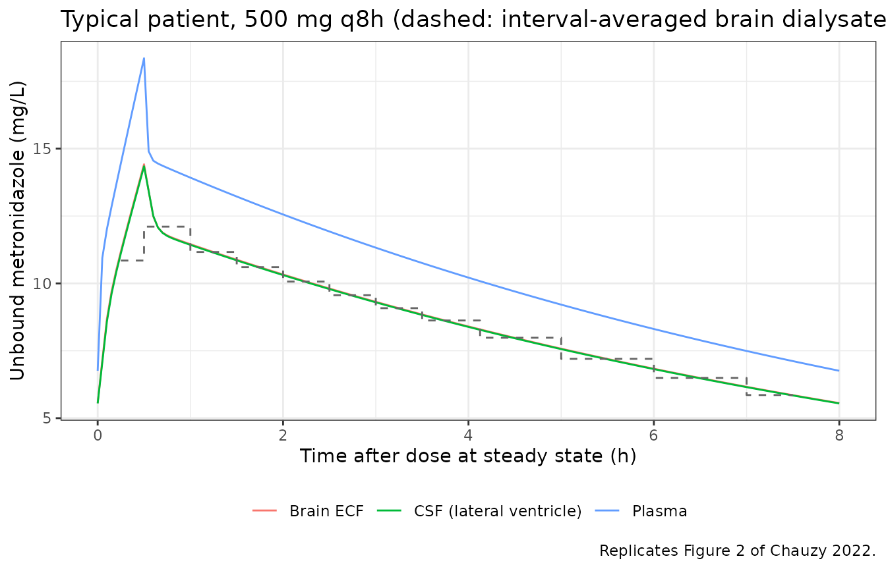
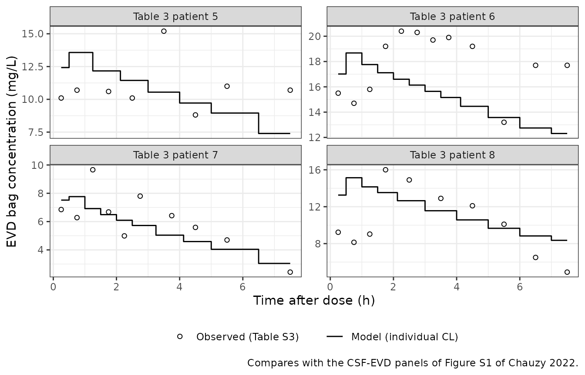
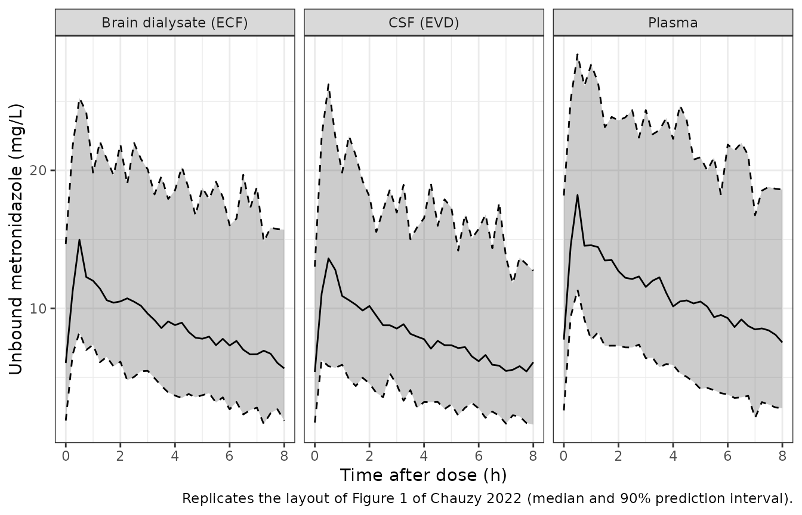
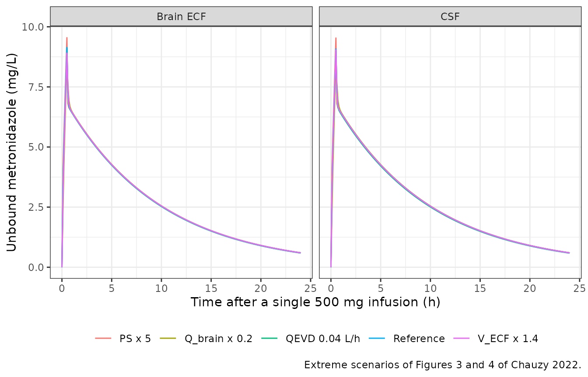

# Metronidazole CNS minimal PBPK (Chauzy 2022)

## Model and source

- Citation: Chauzy A, Bouchene S, Aranzana-Climent V, Clarhaut J, Adier
  C, Gregoire N, Couet W, Dahyot-Fizelier C, Marchand S. A Minimal
  Physiologically Based Pharmacokinetic Model to Characterize CNS
  Distribution of Metronidazole in Neuro Care ICU Patients. Antibiotics
  (Basel). 2022;11(10):1293. <doi:10.3390/antibiotics11101293>
- Description: PBPK (minimal, CNS). Unbound metronidazole in plasma,
  brain extracellular fluid (ECF) and cerebrospinal fluid (CSF) of
  brain-injured neuro-ICU adults (Chauzy 2022): a blood compartment with
  a linear total blood clearance, exchanging by perfusion with one
  lumped non-CNS tissue compartment and with a three-compartment CNS
  (brain vasculature, brain ECF, cranial CSF). The CNS compartments are
  linked by passive permeability-surface-area products across the
  blood-brain and blood-CSF barriers, ECF-to-CSF bulk flow, CSF sink
  flow back to the brain vasculature, and drainage of CSF through an
  external ventricular drain (EVD). Volumes and flows are fixed
  physiological values; only the tissue partition coefficient, clearance
  and residual errors were estimated.
- Article: <https://doi.org/10.3390/antibiotics11101293> (open access)
- Supplement: Figures S1-S4 and Tables S1-S3, available from the article
  page.

## Population

Eight brain-injured adults in the neurointensive care unit of the
University Hospital of Poitiers (France) contributed the data (Table 3):
all male, aged 34-73 years, weighing 75-115 kg, 172-180 cm tall, with
creatinine clearance 84-306 mL/min. Admission diagnoses were traumatic
brain injury (4), subarachnoid haemorrhage (3) and ventricular
haemorrhage (1). All received metronidazole 500 mg every 8 h as a 30-min
intravenous infusion for a lung infection and were sampled at steady
state after at least 2 days of treatment. Four patients (Table 3
patients 1-4) had a brain microdialysis probe in a frontal lobe and
contributed plasma and brain ECF dialysate concentrations; four
(patients 5-8) had an external ventricular drain (EVD) and contributed
plasma and EVD-collected CSF concentrations. All modelled concentrations
are unbound: plasma by ultrafiltration, dialysate after correction for
the per-patient in vivo probe recovery.

The same information is available programmatically via
`readModelDb("Chauzy_2022_metronidazole_pbpk")()$population`.

## Source trace

The per-parameter origin is recorded as an in-file comment next to each
`ini()` entry in
`inst/modeldb/specificDrugs/Chauzy_2022_metronidazole_pbpk.R`. The table
below collects them in one place.

| Equation / parameter | Value | Source location |
|----|----|----|
| `lcl` (CL) | log(7.28) L/h | Table 1 (estimated) |
| `lkp_rest` (Kp) | log(0.796) | Table 1 (estimated) |
| `fd` | 0.86 (fixed) | Table 1, footnote b |
| `ps_ecf` (PS_ECF) | 6.4 L/h (fixed) | Table 1, footnote c; Methods 4.2 (Simcyp prediction) |
| `ps_csf` (PS_CSF) | 3.2 L/h (fixed) | Table 1, footnote d (half of PS_ECF) |
| `co` | 312 L/h | Table 4 |
| `q_brain` | 42 L/h | Table 4 |
| `q_bulk` | 0.0105 L/h | Table 4 |
| `q_sink_physio` | 0.024 L/h | Table 4 |
| `v_blood` | 5.85 L | Table 4 |
| `v_brain_vasc` | 0.0637 L | Table 4 |
| `v_ecf` | 0.24 L | Table 4 |
| `v_csf` | 0.130 L | Table 4 |
| `bpr` (B/P) | 0.82 | Table 4 (PK-Sim prediction) |
| `etalcl` | 0.11681 = log(0.352^2 + 1) | Table 1, IIV 35.2 %CV |
| `propSd`, `addSd` | 0.144, 1.18 mg/L | Table 1, plasma residual error |
| `propSd_Cecf` | 0.228 | Table 1, ECF residual error |
| `propSd_Ccsf` | 0.282 | Table 1, CSF residual error |
| `v_tissue` = WT - V_blood - V_brain,vasc - V_ECF - V_CSF | n/a | Methods 4.2, text under Eq. 2 |
| `d/dt(central)` (blood) | n/a | Eq. 1 |
| `d/dt(res_tis)` (non-CNS tissue) | n/a | Eq. 2 |
| `d/dt(brain_vascular)` | n/a | Eq. 3 |
| `d/dt(brain_ecf)` | n/a | Eq. 4 |
| `d/dt(auc_brain_ecf)` (dialysate integral) | n/a | Eq. 5 |
| `d/dt(brain_csf)` | n/a | Eq. 6 |
| `q_sink` = max(0, Qsink,physio - QEVD) | n/a | Eq. 7; Figure 4 caption for the floor at 0 |
| `d/dt(evd)` (EVD collection bag) | n/a | Eq. 8 |
| `Cc` = unbound blood / B/P | n/a | Methods 4.2 (B/P conversion) |

## Event-table helper

The model needs two covariates on every row: body weight `WT` (kg),
which sets the non-CNS tissue volume, and the EVD drain flow
`CSF_DRAIN_VOL_24H` (mL/24h; 0 without a drain). The paper’s EVD flow
QEVD in L/h converts as `CSF_DRAIN_VOL_24H = QEVD * 24000`.

Doses are 500 mg infused over 0.5 h (1000 mg/h) every 8 h for 7 days,
which puts the last interval (160-168 h) at steady state (the
elimination half-life is about 7 h). Observation rows carry `dvid = 1`
and no compartment: the model has three endpoints, and every endpoint
column is returned at every observation row.

``` r

mod <- readModelDb("Chauzy_2022_metronidazole_pbpk")
mod_typical <- rxode2::zeroRe(mod)

make_events <- function(id, wt, drain, obs_times, n_dose = 21L, treatment = "500 mg q8h") {
  doses <- tibble(
    time = 8 * (seq_len(n_dose) - 1), evid = 1L, amt = 500, rate = 1000,
    cmt = "central", dvid = NA_integer_
  )
  obs <- tibble(
    time = obs_times, evid = 0L, amt = 0, rate = 0,
    cmt = NA_character_, dvid = 1L
  )
  bind_rows(doses, obs) |>
    arrange(time, desc(evid)) |>
    mutate(id = id, WT = wt, CSF_DRAIN_VOL_24H = drain, treatment = treatment) |>
    relocate(id)
}

ss_grid <- seq(160, 168, by = 0.05)
```

## Typical-patient profiles (Figure 2)

Figure 2 of the paper shows the typical-patient profiles after 500 mg
q8h in unbound plasma, brain ECF, brain dialysate, CSF in the lateral
ventricle and EVD-collected CSF. The typical patient below weighs 85 kg
(the Table 3 median) and has no drain; the dialysate is the interval
average of the brain ECF concentration over the paper’s collection
schedule (0.5 h intervals for the first 4 h, then 1 h), read off the
`auc_brain_ecf` integrator (Eq. 5).

``` r

ev_typ <- make_events(1L, wt = 85, drain = 0, obs_times = ss_grid)
sim_typ <- rxode2::rxSolve(mod_typical, ev_typ, returnType = "data.frame") |>
  mutate(tad = round(time - 160, 2))
#> ℹ omega/sigma items treated as zero: 'etalcl'

breaks <- c(seq(0, 4, by = 0.5), 5:8)
dialysate <- sim_typ |>
  filter(tad %in% breaks) |>
  arrange(tad) |>
  transmute(
    t_mid = (tad + lag(tad)) / 2,
    conc = (auc_brain_ecf - lag(auc_brain_ecf)) / (tad - lag(tad))
  ) |>
  filter(!is.na(conc))

sim_typ |>
  select(tad, Plasma = Cc, `Brain ECF` = Cecf, `CSF (lateral ventricle)` = Ccsf) |>
  pivot_longer(-tad, names_to = "matrix", values_to = "conc") |>
  ggplot(aes(tad, conc, colour = matrix)) +
  geom_line() +
  geom_step(
    data = dialysate, aes(t_mid, conc), inherit.aes = FALSE,
    colour = "grey40", linetype = "dashed", direction = "mid"
  ) +
  labs(
    x = "Time after dose at steady state (h)", y = "Unbound metronidazole (mg/L)",
    colour = NULL,
    title = "Typical patient, 500 mg q8h (dashed: interval-averaged brain dialysate)",
    caption = "Replicates Figure 2 of Chauzy 2022."
  ) +
  theme_bw() +
  theme(legend.position = "bottom")
```



As in the paper, the brain ECF and CSF profiles are almost superimposed
and slightly flatter than plasma.

## Per-patient predicted AUCs (Table S1)

Table S1 lists, for every patient, the steady-state AUC over one dosing
interval predicted from that patient’s individual profile in plasma,
brain dialysate and CSF. Clearance is the only parameter with
between-subject variability, and at steady state the plasma AUC is
`Dose / (CL * B/P)` and does not depend on body weight. Each patient’s
clearance can therefore be recovered exactly from their predicted plasma
AUC. Simulating with that clearance and the patient’s Table 3 weight
then predicts the ECF and CSF AUCs from the model structure and the
fixed physiological parameters alone, which is a direct test of Eqs. 1-7
against the authors’ own NONMEM output. The EVD patients use their mean
Table S3 drain flow (collected volume over collection time). Table S3
numbers the EVD patients 1-4; they are Table 3 patients 5-8 in the same
order (their supplement totals rank with the observed CSF AUCs of Table
S1), and they are coded 5-8 below.

``` r

# Table S3: drain flow QEVD (L/h) and measured bag concentration (mg/L) per
# collection interval; NA where the table reports 'nd' / 'na'.
s3 <- tibble::tribble(
  ~patient, ~t1, ~t2, ~qevd, ~cevd_obs,
  5L, 0, 0.5, 0.003, 10.1, 5L, 0.5, 1, 0.001, 10.7, 5L, 1, 1.5, 0, NA,
  5L, 1.5, 2, 0.003, 10.6, 5L, 2, 3, 0.016, 10.1, 5L, 3, 4, 0.0025, 15.2,
  5L, 4, 5, 0.009, 8.81, 5L, 5, 6, 0.013, 11.0, 5L, 6, 7, NA, NA,
  5L, 7, 8, 0.019, 10.7,
  6L, 0, 0.5, 0.005, 15.5, 6L, 0.5, 1, 0.007, 14.7, 6L, 1, 1.5, 0.006, 15.8,
  6L, 1.5, 2, 0.040, 19.2, 6L, 2, 2.5, 0.034, 20.4, 6L, 2.5, 3, 0.018, 20.3,
  6L, 3, 3.5, 0.012, 19.7, 6L, 3.5, 4, 0.012, 19.9, 6L, 4, 5, 0.011, 19.2,
  6L, 5, 6, 0.010, 13.2, 6L, 6, 7, 0.007, 17.7, 6L, 7, 8, 0.0045, 17.7,
  7L, 0, 0.5, 0.008, 6.85, 7L, 0.5, 1, 0.008, 6.28, 7L, 1, 1.5, 0.010, 9.66,
  7L, 1.5, 2, 0.017, 6.68, 7L, 2, 2.5, 0.009, 4.99, 7L, 2.5, 3, 0.008, 7.80,
  7L, 3, 3.5, NA, NA, 7L, 3.5, 4, 0.014, 6.42, 7L, 4, 5, 0.002, 5.59,
  7L, 5, 6, 0.013, 4.70, 7L, 6, 7, 0.003, NA, 7L, 7, 8, 0.007, 2.43,
  8L, 0, 0.5, 0.013, 9.23, 8L, 0.5, 1, 0.010, 8.14, 8L, 1, 1.5, 0.010, 9.03,
  8L, 1.5, 2, 0.006, 16.0, 8L, 2, 3, 0.012, 14.9, 8L, 3, 4, 0.015, 12.9,
  8L, 4, 5, 0.010, 12.1, 8L, 5, 6, 0.015, 10.1, 8L, 6, 7, 0.010, 6.50,
  8L, 7, 8, 0.006, 4.91
)

mean_flow <- s3 |>
  filter(!is.na(qevd)) |>
  group_by(patient) |>
  summarise(drain_lph = sum(qevd * (t2 - t1)) / sum(t2 - t1), .groups = "drop")

s1 <- tibble::tribble(
  ~patient, ~wt, ~aucp_pub, ~auce_pub, ~aucc_pub,
  1L,  90, 70.6,  56.3,  56.0,
  2L,  90, 111.4, 88.9,  88.4,
  3L,  77, 78.0,  62.3,  61.9,
  4L,  79, 57.2,  45.7,  45.4,
  5L,  90, 100.5, 80.2,  79.8,
  6L,  80, 147.3, 117.6, 116.9,
  7L, 115, 50.0,  40.0,  39.7,
  8L,  75, 109.7, 87.6,  87.1
) |>
  left_join(mean_flow, by = "patient") |>
  mutate(
    drain_lph = coalesce(drain_lph, 0),
    cl_ind = 500 / (aucp_pub * 0.82)
  )
stopifnot(sum(s1$drain_lph > 0) == 4L)

trap <- function(t, y) sum(diff(t) * (head(y, -1) + tail(y, -1)) / 2)

s1_sim <- bind_rows(lapply(seq_len(nrow(s1)), function(i) {
  ev <- make_events(s1$patient[i], s1$wt[i], s1$drain_lph[i] * 24000, ss_grid)
  o <- rxode2::rxSolve(mod_typical, ev,
    params = c(lcl = log(s1$cl_ind[i])),
    returnType = "data.frame"
  )
  tibble(
    patient = s1$patient[i],
    aucp_sim = trap(o$time, o$Cc),
    auce_sim = trap(o$time, o$Cecf),
    aucc_sim = trap(o$time, o$Ccsf)
  )
}))
#> ℹ omega/sigma items treated as zero: 'etalcl'
#> ℹ omega/sigma items treated as zero: 'etalcl'
#> ℹ omega/sigma items treated as zero: 'etalcl'
#> ℹ omega/sigma items treated as zero: 'etalcl'
#> ℹ omega/sigma items treated as zero: 'etalcl'
#> ℹ omega/sigma items treated as zero: 'etalcl'
#> ℹ omega/sigma items treated as zero: 'etalcl'
#> ℹ omega/sigma items treated as zero: 'etalcl'

s1_cmp <- s1 |>
  left_join(s1_sim, by = "patient") |>
  mutate(
    pct_p = 100 * (aucp_sim / aucp_pub - 1),
    pct_e = 100 * (auce_sim / auce_pub - 1),
    pct_c = 100 * (aucc_sim / aucc_pub - 1)
  )

s1_cmp |>
  select(patient, aucp_pub, aucp_sim, auce_pub, auce_sim, pct_e, aucc_pub, aucc_sim, pct_c) |>
  rename(
    "Patient" = patient,
    "Plasma, Table S1" = aucp_pub, "Plasma, model" = aucp_sim,
    "ECF, Table S1" = auce_pub, "ECF, model" = auce_sim, "ECF % diff" = pct_e,
    "CSF, Table S1" = aucc_pub, "CSF, model" = aucc_sim, "CSF % diff" = pct_c
  ) |>
  knitr::kable(
    digits = 1,
    caption = "Steady-state AUC over one dosing interval (mg*h/L): Table S1 individual predictions vs. the packaged model with each patient's back-calculated clearance."
  )
```

| Patient | Plasma, Table S1 | Plasma, model | ECF, Table S1 | ECF, model | ECF % diff | CSF, Table S1 | CSF, model | CSF % diff |
|---:|---:|---:|---:|---:|---:|---:|---:|---:|
| 1 | 70.6 | 70.6 | 56.3 | 57.8 | 2.7 | 56.0 | 57.6 | 2.9 |
| 2 | 111.4 | 111.4 | 88.9 | 91.2 | 2.6 | 88.4 | 91.0 | 2.9 |
| 3 | 78.0 | 78.0 | 62.3 | 63.9 | 2.5 | 61.9 | 63.7 | 2.9 |
| 4 | 57.2 | 57.2 | 45.7 | 46.8 | 2.5 | 45.4 | 46.7 | 2.9 |
| 5 | 100.5 | 100.4 | 80.2 | 82.1 | 2.4 | 79.8 | 81.9 | 2.7 |
| 6 | 147.3 | 146.9 | 117.6 | 120.2 | 2.2 | 116.9 | 119.9 | 2.6 |
| 7 | 50.0 | 50.0 | 40.0 | 40.9 | 2.2 | 39.7 | 40.8 | 2.8 |
| 8 | 109.7 | 109.5 | 87.6 | 89.6 | 2.3 | 87.1 | 89.4 | 2.6 |

Steady-state AUC over one dosing interval (mg\*h/L): Table S1 individual
predictions vs. the packaged model with each patient’s back-calculated
clearance. {.table}

``` r


# Deterministic comparison (no random effects): the plasma column reproduces
# by construction; ECF and CSF sit 2.2-3.1% above Table S1 for every patient
# (see 'Assumptions and deviations'). A mis-transcribed volume, flow or
# permeability, or a mis-wired ODE term, moves these ratios by far more.
stopifnot(
  max(abs(s1_cmp$pct_p)) < 0.5,
  max(abs(s1_cmp$pct_e)) < 4,
  max(abs(s1_cmp$pct_c)) < 4
)
```

The model reproduces the per-patient ECF and CSF AUCs within 2-3%, the
same for every patient. The residual offset is a constant ratio rather
than scatter and is discussed under *Assumptions and deviations*.

## EVD collection-bag concentrations (Table S3, Figure S1)

Table S3 lists, for each EVD patient and each collection interval, the
volume collected, the derived drain flow QEVD and the measured bag
concentration. Below, each patient is simulated with their
back-calculated clearance from Table S1 and the interval-by-interval
drain flow of Table S3 as a time-varying covariate. The predicted bag
concentration for an interval is the amount drained over it (the `evd`
state, Eq. 8) divided by the volume collected.

``` r


evd_pred <- bind_rows(lapply(5:8, function(p) {
  pt <- filter(s1, patient == p)
  tab <- filter(s3, patient == p)
  # Intervals without a recorded flow ('nd' / 'na' in Table S3) take the
  # patient's mean flow; before the PK interval the mean flow is used too.
  q_mean <- pt$drain_lph
  q_int <- ifelse(is.na(tab$qevd), q_mean, tab$qevd)
  obs_t <- 160 + sort(unique(c(tab$t1, tab$t2)))
  ev <- make_events(p, pt$wt, q_mean * 24000, sort(unique(c(obs_t, ss_grid))))
  # Time-varying drain flow: last observation carried forward within each
  # collection interval of the PK day.
  idx <- findInterval(ev$time - 160, tab$t1, rightmost.closed = TRUE)
  in_pk <- ev$time >= 160 & ev$time < 168 & idx > 0
  ev$CSF_DRAIN_VOL_24H[in_pk] <- q_int[idx[in_pk]] * 24000
  o <- rxode2::rxSolve(mod_typical, ev,
    params = c(lcl = log(pt$cl_ind)),
    returnType = "data.frame"
  ) |>
    mutate(tad = round(time - 160, 2))
  evd_at <- function(t) o$evd[match(t, o$tad)]
  tab |>
    mutate(
      vol_L = q_int * (t2 - t1),
      cevd_pred = ifelse(vol_L > 0, (evd_at(t2) - evd_at(t1)) / vol_L, NA_real_)
    )
}))
#> ℹ omega/sigma items treated as zero: 'etalcl'
#> ℹ omega/sigma items treated as zero: 'etalcl'
#> ℹ omega/sigma items treated as zero: 'etalcl'
#> ℹ omega/sigma items treated as zero: 'etalcl'

evd_pred |>
  filter(!is.na(cevd_obs)) |>
  ggplot(aes((t1 + t2) / 2)) +
  geom_point(aes(y = cevd_obs, shape = "Observed (Table S3)")) +
  geom_step(aes(y = cevd_pred, linetype = "Model (individual CL)"), direction = "mid") +
  facet_wrap(~ paste("Table 3 patient", patient), scales = "free_y") +
  scale_shape_manual(values = 1) +
  labs(
    x = "Time after dose (h)", y = "EVD bag concentration (mg/L)",
    shape = NULL, linetype = NULL,
    caption = "Compares with the CSF-EVD panels of Figure S1 of Chauzy 2022."
  ) +
  theme_bw() +
  theme(legend.position = "bottom")
```



``` r


evd_ratio <- evd_pred |>
  filter(!is.na(cevd_obs), !is.na(cevd_pred)) |>
  group_by(patient) |>
  summarise(gm_ratio = exp(mean(log(cevd_pred / cevd_obs))), .groups = "drop")
knitr::kable(
  evd_ratio |> rename("Table 3 patient" = patient, "Geometric mean predicted / observed" = gm_ratio),
  digits = 2,
  caption = "Predicted vs. observed EVD bag concentrations per patient."
)
```

| Table 3 patient | Geometric mean predicted / observed |
|----------------:|------------------------------------:|
|               5 |                                0.98 |
|               6 |                                0.88 |
|               7 |                                0.95 |
|               8 |                                1.18 |

Predicted vs. observed EVD bag concentrations per patient. {.table}

``` r


# Deterministic. Against measured data the residual CV is 28% (Table 1), and
# the per-patient Table S1 predicted / observed CSF AUC ratios are 0.83-1.06.
stopifnot(all(evd_ratio$gm_ratio > 0.7 & evd_ratio$gm_ratio < 1.3))
```

The drain carries away only a small fraction of the dose: summed over
one dosing interval, the predicted amount drained is 0.13, 0.31, 0.07,
0.2% of the 500 mg dose for patients 5-8. The paper reports that
0.1-0.4% of the dose was recovered in the collection bag (Discussion).

## Visual predictive check (Figure 1)

Figure 1 is a VPC of the final model in plasma, brain dialysate and EVD
CSF. The virtual cohort below has 100 patients without a drain (the
microdialysis group) and 100 with a constant drain flow of 0.010 L/h
(240 mL/24h, the middle of the Table S3 range), with body weight uniform
over the Table 3 range of 75-115 kg. Between-subject variability is on
clearance only; the bands include residual error.

``` r

rxode2::rxSetSeed(20221022)
set.seed(20221022)
n_arm <- 100L
cohort <- tibble(
  id = seq_len(2 * n_arm),
  WT = runif(2 * n_arm, 75, 115),
  group = rep(c("Microdialysis", "EVD"), each = n_arm),
  drain = rep(c(0, 240), each = n_arm)
)
events_vpc <- bind_rows(lapply(seq_len(nrow(cohort)), function(i) {
  make_events(cohort$id[i], cohort$WT[i], cohort$drain[i], seq(160, 168, by = 0.25),
    treatment = cohort$group[i]
  )
}))
stopifnot(!anyDuplicated(unique(events_vpc[, c("id", "time", "evid")])))

sim_vpc <- rxode2::rxSolve(mod, events_vpc, keep = c("treatment"), returnType = "data.frame")

vpc_long <- bind_rows(
  sim_vpc |> filter(treatment == "Microdialysis") |>
    transmute(id, time, matrix = "Plasma", ipred = Cc),
  sim_vpc |> filter(treatment == "Microdialysis") |>
    transmute(id, time, matrix = "Brain dialysate (ECF)", ipred = Cecf),
  sim_vpc |> filter(treatment == "EVD") |>
    transmute(id, time, matrix = "CSF (EVD)", ipred = Ccsf)
)
# Simulated observations: each matrix's individual prediction plus its own
# Table 1 residual error.
ruv <- c("Plasma" = 0.144, "Brain dialysate (ECF)" = 0.228, "CSF (EVD)" = 0.282)
vpc_long <- vpc_long |>
  mutate(
    sd = ifelse(matrix == "Plasma", sqrt(1.18^2 + (0.144 * ipred)^2), ruv[matrix] * ipred),
    obs_sim = ipred + sd * rnorm(n())
  )

vpc_long |>
  group_by(matrix, time) |>
  summarise(
    Q05 = quantile(obs_sim, 0.05), Q50 = quantile(obs_sim, 0.5), Q95 = quantile(obs_sim, 0.95),
    .groups = "drop"
  ) |>
  ggplot(aes(time - 160, Q50)) +
  geom_ribbon(aes(ymin = Q05, ymax = Q95), alpha = 0.25) +
  geom_line() +
  geom_line(aes(y = Q05), linetype = "dashed") +
  geom_line(aes(y = Q95), linetype = "dashed") +
  facet_wrap(~matrix) +
  labs(
    x = "Time after dose (h)", y = "Unbound metronidazole (mg/L)",
    caption = "Replicates the layout of Figure 1 of Chauzy 2022 (median and 90% prediction interval)."
  ) +
  theme_bw()
```



## Sensitivity analyses (Figures 3 and 4)

The paper varied the BBB/BCSFB permeabilities (100-500%), the brain ECF
volume (100-140%) and the cerebral blood flow (20-100%) one at a time
after a single 500 mg infusion, and found the CNS profiles almost
unchanged (Figure 3). Figure 4 varied the drain flow from 0 to 0.04 L/h
with the same conclusion.

``` r

ev_sd <- make_events(1L, wt = 85, drain = 0, obs_times = seq(0, 24, by = 0.1), n_dose = 1L)
run_sd <- function(params = NULL, drain = 0, label) {
  ev <- ev_sd
  ev$CSF_DRAIN_VOL_24H <- drain
  rxode2::rxSolve(mod_typical, ev, params = params, returnType = "data.frame") |>
    transmute(time, Cecf, Ccsf, scenario = label)
}
sens <- bind_rows(
  run_sd(label = "Reference"),
  run_sd(c(ps_ecf = 5 * 6.4, ps_csf = 5 * 3.2), label = "PS x 5"),
  run_sd(c(v_ecf = 1.4 * 0.24), label = "V_ECF x 1.4"),
  run_sd(c(q_brain = 0.2 * 42), label = "Q_brain x 0.2"),
  run_sd(drain = 0.04 * 24000, label = "QEVD 0.04 L/h")
)
#> ℹ omega/sigma items treated as zero: 'etalcl'
#> ℹ omega/sigma items treated as zero: 'etalcl'
#> ℹ omega/sigma items treated as zero: 'etalcl'
#> ℹ omega/sigma items treated as zero: 'etalcl'
#> ℹ omega/sigma items treated as zero: 'etalcl'

sens |>
  pivot_longer(c(Cecf, Ccsf), names_to = "matrix", values_to = "conc") |>
  mutate(matrix = recode(matrix, Cecf = "Brain ECF", Ccsf = "CSF")) |>
  ggplot(aes(time, conc, colour = scenario)) +
  geom_line() +
  facet_wrap(~matrix) +
  labs(
    x = "Time after a single 500 mg infusion (h)", y = "Unbound metronidazole (mg/L)",
    colour = NULL,
    caption = "Extreme scenarios of Figures 3 and 4 of Chauzy 2022."
  ) +
  theme_bw() +
  theme(legend.position = "bottom")
```



``` r


sens_summary <- sens |>
  group_by(scenario) |>
  summarise(cmax_ecf = max(Cecf), cmax_csf = max(Ccsf), .groups = "drop") |>
  mutate(
    pct_ecf = 100 * (cmax_ecf / cmax_ecf[scenario == "Reference"] - 1),
    pct_csf = 100 * (cmax_csf / cmax_csf[scenario == "Reference"] - 1)
  )
knitr::kable(
  sens_summary |> rename(
    "Scenario" = scenario, "ECF Cmax (mg/L)" = cmax_ecf, "CSF Cmax (mg/L)" = cmax_csf,
    "ECF % change" = pct_ecf, "CSF % change" = pct_csf
  ),
  digits = 2
)
```

| Scenario      | ECF Cmax (mg/L) | CSF Cmax (mg/L) | ECF % change | CSF % change |
|:--------------|----------------:|----------------:|-------------:|-------------:|
| PS x 5        |            9.55 |            9.53 |         4.45 |         5.03 |
| QEVD 0.04 L/h |            9.13 |            9.03 |        -0.11 |        -0.57 |
| Q_brain x 0.2 |            8.59 |            8.52 |        -6.08 |        -6.11 |
| Reference     |            9.14 |            9.08 |         0.00 |         0.00 |
| V_ECF x 1.4   |            8.90 |            9.04 |        -2.61 |        -0.43 |

``` r


# The paper's conclusion is that none of these perturbations changes the CNS
# profiles of metronidazole materially. Deterministic solves.
stopifnot(
  nrow(sens_summary) == 5L,
  max(abs(sens_summary$pct_ecf)) < 10,
  max(abs(sens_summary$pct_csf)) < 10
)
```

## PKNCA validation

Steady-state exposure over the last dosing interval of the VPC cohort,
one PKNCA analysis per matrix, compared with the mean of the eight
individual predicted AUCs of Table S1. The reference is a mean of
empirical-Bayes predictions in eight patients, so agreement within about
10% is all that can be expected.

``` r

nca_conc <- bind_rows(
  sim_vpc |> filter(treatment == "Microdialysis") |>
    transmute(id, time, conc = Cc, analyte = "Plasma", treatment),
  sim_vpc |> filter(treatment == "Microdialysis") |>
    transmute(id, time, conc = Cecf, analyte = "Brain ECF", treatment),
  sim_vpc |> filter(treatment == "EVD") |>
    transmute(id, time, conc = Ccsf, analyte = "CSF", treatment)
) |>
  filter(!is.na(conc))
# Time-zero anchor: drug-naive before the first dose.
nca_conc <- bind_rows(
  nca_conc,
  nca_conc |> distinct(id, analyte, treatment) |> mutate(time = 0, conc = 0)
) |>
  distinct(id, analyte, treatment, time, .keep_all = TRUE) |>
  arrange(id, analyte, time)

dose_df <- events_vpc |>
  filter(evid == 1) |>
  transmute(id, time, amt, treatment)

conc_obj <- PKNCA::PKNCAconc(nca_conc, conc ~ time | treatment + id / analyte)
dose_obj <- PKNCA::PKNCAdose(dose_df, amt ~ time | treatment + id)
intervals <- data.frame(start = 160, end = 168, auclast = TRUE, cmax = TRUE, cmin = TRUE)
nca_res <- PKNCA::pk.nca(PKNCA::PKNCAdata(conc_obj, dose_obj, intervals = intervals))

published <- tibble::tribble(
  ~analyte, ~auclast,
  "Plasma", 90.6,
  "Brain ECF", 72.3,
  "CSF", 71.9
)
sim_long <- as.data.frame(nca_res$result) |>
  filter(PPTESTCD %in% c("auclast", "cmax", "cmin"))
cmp <- nlmixr2lib::ncaComparisonTable(
  simulated = sim_long,
  reference = published,
  by = "analyte",
  params = "auclast",
  units = c(auclast = "mg*h/L"),
  tolerance_pct = 20
)
knitr::kable(cmp, caption = "Simulated (cohort median) vs. Table S1 mean predicted AUC over one steady-state dosing interval. * differs by >20%.")
```

| NCA parameter     | analyte   | Reference | Simulated | % diff |
|:------------------|:----------|:----------|:----------|:-------|
| AUClast (mg\*h/L) | Plasma    | 90.6      | 87        | -4.0%  |
| AUClast (mg\*h/L) | Brain ECF | 72.3      | 71.2      | -1.5%  |
| AUClast (mg\*h/L) | CSF       | 71.9      | 66.9      | -6.9%  |

Simulated (cohort median) vs. Table S1 mean predicted AUC over one
steady-state dosing interval. \* differs by \>20%. {.table}

``` r


sim_long |>
  group_by(analyte, PPTESTCD) |>
  summarise(median = median(PPORRES), p05 = quantile(PPORRES, 0.05), p95 = quantile(PPORRES, 0.95), .groups = "drop") |>
  rename("Matrix" = analyte, "Parameter" = PPTESTCD, "Median" = median, "5th pct" = p05, "95th pct" = p95) |>
  knitr::kable(digits = 1, caption = "Steady-state NCA of the virtual cohort (mg/L, mg*h/L).")
```

| Matrix    | Parameter | Median | 5th pct | 95th pct |
|:----------|:----------|-------:|--------:|---------:|
| Brain ECF | auclast   |   71.2 |    42.7 |    143.0 |
| Brain ECF | cmax      |   14.5 |    11.4 |     23.8 |
| Brain ECF | cmin      |    6.2 |     2.7 |     14.6 |
| CSF       | auclast   |   66.9 |    33.7 |    127.8 |
| CSF       | cmax      |   13.9 |    10.0 |     21.2 |
| CSF       | cmin      |    5.5 |     2.1 |     13.2 |
| Plasma    | auclast   |   87.0 |    52.1 |    174.6 |
| Plasma    | cmax      |   18.4 |    14.6 |     29.8 |
| Plasma    | cmin      |    7.6 |     3.3 |     17.8 |

Steady-state NCA of the virtual cohort (mg/L, mg\*h/L). {.table}

``` r


auc_med <- sim_long |>
  filter(PPTESTCD == "auclast") |>
  group_by(analyte) |>
  summarise(med = median(PPORRES), .groups = "drop") |>
  left_join(published, by = "analyte")
# The cohort median AUC is Dose / (CL * B/P) at the typical CL (83.8 mg*h/L in
# plasma) scaled by the median eta draw; with 100 subjects per arm the median
# eta has SD ~0.04, so +-4% is noise and a CL or B/P transcription error
# (tens of percent) is not.
stopifnot(nrow(auc_med) == 3L, all(abs(auc_med$med / auc_med$auclast - 1) < 0.2))
```

## Assumptions and deviations

- **Non-CNS tissue volume.** The paper closes the body-weight balance
  `V_blood + V_tissue + V_brain,vasc + V_ECF + V_CSF = TBW`. Body weight
  in kg is read as litres (density 1 kg/L), so `v_tissue` is computed
  per patient from `WT`.
- **Observation scale.** The model state is the unbound blood
  concentration; the measured unbound plasma concentrations were
  converted to blood with the PK-Sim B/P ratio of 0.82 for fitting. The
  packaged `Cc` is the unbound plasma concentration,
  `Cc = c_blood / bpr`, and the plasma additive residual error of 1.18
  mg/L is applied on that plasma scale as the parameter name in Table 1
  (‘sigma add,plasma’) indicates. Brain ECF and CSF predictions are the
  compartment concentrations themselves.
- **Implied B/P.** The deterministic Table S1 check above reproduces
  every patient’s ECF and CSF AUC 2.2-3.1% higher than the paper’s
  individual predictions, a constant ratio across all eight patients.
  The paper’s own Table S1 ratio of predicted ECF to predicted plasma
  AUC is 0.798-0.800 for every patient, while Eqs. 1-4 with B/P = 0.82
  give 0.819 (the brain compartments sit 0.2% below blood at steady
  state). The authors’ predictions are therefore consistent with an
  effective B/P of about 0.80 rather than the 0.82 printed in Table 4; a
  slightly larger offset in the CSF/ECF ratio (0.994 in Table S1
  vs. 0.997 here) suggests the fitted code may also differ slightly in
  the CSF sink term. The printed 0.82 is kept; the offset changes
  predicted CNS exposure relative to plasma by under 3%.
- **CSF sink flow floor.** Eq. 7 sets `Qsink = Qsink,physio - QEVD`. The
  model floors it at zero when the drain flow exceeds 0.024 L/h, which
  is how the paper states it treated that case (Figure 4 caption,
  Discussion). Table S3 contains intervals up to 0.040 L/h.
- **Drain flow covariate.** The paper’s QEVD (L/h, measured per
  collection interval) is supplied as the canonical `CSF_DRAIN_VOL_24H`
  in mL/24h (`QEVD * 24000`). Intervals in Table S3 without a recorded
  flow (‘nd’, ‘na’) and the days before the PK interval use the
  patient’s mean flow; the Table S3 patients 1-4 are Table 3 patients
  5-8 (identified from the ranking of their supplement totals against
  the observed CSF AUCs of Table S1).
- **Dialysate and EVD bag.** Eq. 5 (dialysate as the integral of the ECF
  concentration over a collection interval) and Eq. 8 (drug accumulating
  in the collection bag) are provided as the bookkeeping states
  `auc_brain_ecf` and `evd`. Both accumulate from time zero: an interval
  value is the difference between its end and start, divided by the
  interval length (dialysate) or the collected volume (bag). The
  residual errors for ECF and CSF in Table 1 apply to these interval
  quantities; the `Cecf` and `Ccsf` endpoints carry them on the
  instantaneous concentrations.
- **IIV scale.** The 35.2 %CV on clearance is converted with
  `omega^2 = log(CV^2 + 1)`; the paper does not state the conversion it
  used.
- **Alternative model with estimated permeabilities.** Table 2 and Table
  S2 report a variant in which PS_ECF (0.904 L/h) and PS_CSF (0.398 L/h)
  were estimated (with Kp 0.767, CL 7.18 L/h, fd 0.823 and similar
  residual errors). The paper retains the Simcyp-predicted values as the
  final model and states that both give similar CNS profiles (Figure
  S2); the variant can be simulated by overriding `ps_ecf`, `ps_csf`,
  `lkp_rest`, `lcl` and `fd` through `rxSolve(params = )`.
- No correction notice for this article was found as of 2026-10-10.
