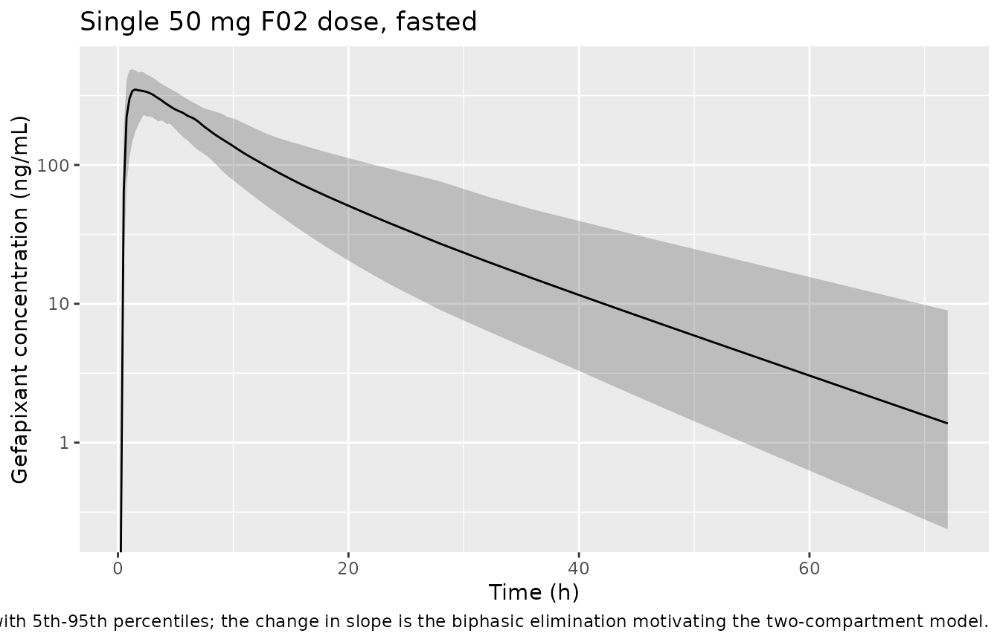
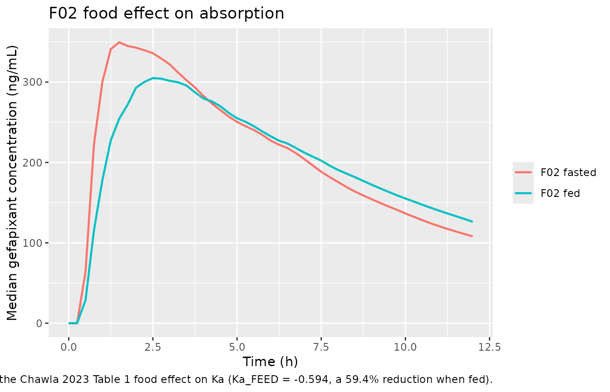
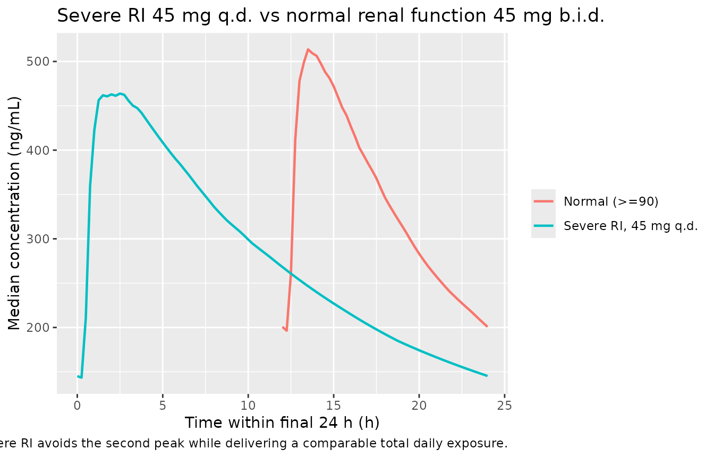

# Gefapixant (Chawla 2023)

## Model and source

- Citation: Chawla A, Largajolli A, Hussain A, et al. Population
  pharmacokinetic analysis of the P2X3-receptor antagonist gefapixant.
  CPT Pharmacometrics Syst Pharmacol. 2023;12(8):1107-1118.
  <doi:10.1002/psp4.12978>
- Description: Two-compartment population PK model with first-order
  absorption and an absorption lag time for the P2X3-receptor antagonist
  gefapixant in healthy volunteers and adults with refractory or
  unexplained chronic cough (Chawla 2023)
- Article: <https://doi.org/10.1002/psp4.12978>
- Supplement (Tables S1-S6, Figures S1-S4):
  <https://doi.org/10.1002/psp4.12978>, Supporting Information

Gefapixant is an orally administered P2X3-receptor antagonist approved
in Japan and Switzerland for refractory chronic cough (RCC) and
unexplained chronic cough (UCC). Chawla 2023 developed a population PK
model from pooled phase I, IIb, and III data in order to quantify
between- and within-participant variability and to support dosage
recommendations in renal impairment.

The structural model is two-compartment with first-order absorption and
an absorption lag time. All disposition parameters are apparent (`/F`);
no absolute bioavailability term is identifiable from oral-only data, so
relative bioavailability is fixed at 1 across formulations.

## Population

The analysis data set pooled nine studies: six intensively sampled phase
I healthy-volunteer studies (including a dedicated renal-impairment
study, a Japanese food-effect study, and a food-and-formulation study),
one phase IIb study in RCC/UCC conducted in the United Kingdom and
United States, and the two global phase III studies COUGH-1 and COUGH-2
(Chawla 2023 Tables S1 and S2).

Of 1677 participants included, 1618 had evaluable PK data (121 healthy
volunteers and 1497 with RCC or UCC), contributing 8886 measurable
gefapixant concentrations after exclusions for inconsistent dosing
times, an extra dose within 3 days of sampling, measurable
pre-first-dose concentrations, missing dose times, and `|CWRES| > 5`
outliers on the newly added phase II/III data (Chawla 2023 Figure 2).

Baseline demographics (Chawla 2023 Table S3): median age 59 years (range
18-89), median body weight 74 kg (range 35-159), median eGFR 86.9
mL/min/1.73 m^2 (range 13-243), 71.3% female, 78.5% White / 8.3% Asian /
3.6% Black / 9.5% Other, and 17.0% Hispanic. Doses spanned 7.5-150 mg
b.i.d. in phase I, up to 50 mg b.i.d. in phase IIb, and 15 and 45 mg
b.i.d. in phase III. Among the 1555 chronic-cough participants, 664 had
normal renal function, 817 mild renal impairment (RI), and 74 moderate
RI; no phase II/III participant had severe RI, and individuals with
end-stage renal disease or on hemodialysis were excluded.

The same information is available programmatically via
`readModelDb("Chawla_2023_gefapixant")()$population`.

## Source trace

Every `ini()` entry in
`inst/modeldb/specificDrugs/Chawla_2023_gefapixant.R` carries an in-file
comment naming its source location. They are collected here for review.
All point estimates come from Chawla 2023 Table 1; the centering values
and categorical reference categories come from Table 1 footnote b.

| Equation / parameter | Value | Source location |
|----|----|----|
| `lka` (Ka) | 2.25 1/h | Table 1, “Absorption rate constant (Ka)”; 95% CI 1.86-2.85, RSE 9.9% |
| `lcl` (CL/F) | 10.3 L/h | Table 1, “Apparent clearance (CL/F)”; 95% CI 10.1-10.5, RSE 1.1% |
| `lvc` (Vc/F) | 101 L | Table 1, “Apparent central volume of distribution (Vc/F)”; 95% CI 96.9-104, RSE 1.8% |
| `lq` (Q/F) | 3.51 L/h | Table 1, “Apparent intercompartmental clearance (Q/F)”; 95% CI 2.7-4.42, RSE 12.8% |
| `lvp` (Vp/F) | 32.8 L | Table 1, “Apparent peripheral volume (Vp/F)”; 95% CI 26.9-46.6, RSE 12.7% |
| `ltlag` (ALAG) | 0.432 h | Table 1, “Absorption lag time (ALAG)”; 95% CI 0.415-0.445, RSE 1.7% |
| `e_crcl_cl` | 0.375 | Table 1, “eGFR power relationship on clearance”; RSE 8.4% |
| `e_age_cl` | -0.229 | Table 1, “Age power relationship on clearance”; RSE 13.3% |
| `e_wt_cl` | 0.35 | Table 1, “Weight power relationship on clearance”; RSE 11.3% |
| `e_sex_cl` | 0.0931 | Table 1, “Sex relationship on clearance”; RSE 22.7% |
| `e_age_vc` | 0.0911 | Table 1, “Age power relationship on central volume”; RSE 37.1% |
| `e_wt_vc` | 0.541 | Table 1, “Weight power relationship on central volume”; RSE 8.4% |
| `e_sex_vc` | 0.181 | Table 1, “Sex relationship on central volume”; RSE 13.6% |
| `e_fed_ka` | -0.594 | Table 1, “Food effect on absorption rate for the F02 formulation”; RSE 7.7% |
| `etalka` variance | 0.551 | Table 1, “Interindividual variability on absorption rate (omega^2 Ka)”; 85.7% CV, RSE 18.7% |
| `etalcl` variance | 0.0708 | Table 1, “Interindividual variability on apparent clearance (omega^2 CL)”; 27.1% CV, RSE 6.7% |
| `etalcl`-`etalvc` covariance | 0.0176 | Table 1, “Covariance between CL/F and Vc/F”; RSE 22.9% |
| `etalvc` variance | 0.0161 | Table 1, “Interindividual variability on apparent central volume (omega^2 Vc)”; 12.7% CV, RSE 41.8% |
| `propSd` | 0.303 | Table 1, “Proportional residual error (sigma PROP)”; RSE 2.3% |
| `addSd` | 3.04 ng/mL | Table 1, “Additive residual error (sigma ADD)”; RSE 15.4% |
| Centering: eGFR 87.2, BW 74 kg, age 59 y | n/a | Table 1 footnote b |
| Reference categories: sex = female, fed = fasted | n/a | Table 1 footnote b |
| Continuous covariate equation `P_i = P_TV * (cov_i / median(cov))^theta * exp(eta_i)` | n/a | Methods, “Modeling strategy”, first displayed equation |
| Categorical covariate equation `P_i = P_TV * (1 + theta_cov,c * I_cov,c,i) * exp(eta_i)` | n/a | Methods, “Modeling strategy”, second displayed equation |
| Two-compartment structure with lag-time absorption | n/a | Results, “Concentration-time profiles” (biphasic elimination in Figure 3a) and Table 1 parameter set |
| Food effect restricted to the F02 formulation | n/a | Methods, “Modeling strategy”; Discussion, formulations paragraph |

### Reading the residual-error and IIV scales

Chawla 2023 Table 1 distinguishes the two scales by symbol, and both
readings were checked against the table’s own footnotes before
transcription:

- The IIV entries are labelled `omega^2` (variances). Footnote d gives
  `%CV = sqrt(exp(omega^2) - 1) * 100`; e.g. `omega^2 Ka = 0.551` yields
  `sqrt(exp(0.551) - 1) = 0.857`, matching the reported 85.7% CV. They
  are therefore entered in `ini()` as variances, which is what nlmixr2
  expects.
- The residual-error entries are labelled `sigma` (standard deviations).
  The additive term carries ng/mL units (a variance would be ng^(2/mL)2)
  and the proportional term 0.303 corresponds to 30.3% CV, consistent
  with the paper describing gefapixant as “a low- to
  moderate-variability drug”. They are therefore entered as `propSd` /
  `addSd`.

The CL/F-Vc/F term is labelled “Covariance between CL/F and Vc/F”. Read
as a covariance, 0.0176 implies a correlation of
`0.0176 / sqrt(0.0708 * 0.0161) = 0.52`, consistent with the Results
narrative that IIV was retained on both parameters *because of* their
correlation. Read instead as a correlation it would imply a near-zero
covariance, contradicting that narrative. The resulting 2x2 block is
positive definite (`0.0708 * 0.0161 = 1.14e-3 > 0.0176^2 = 3.10e-4`).

``` r

mod <- readModelDb("Chawla_2023_gefapixant")
mod
#> function() {
#>   description <- "Two-compartment population PK model with first-order absorption and an absorption lag time for the P2X3-receptor antagonist gefapixant in healthy volunteers and adults with refractory or unexplained chronic cough (Chawla 2023)"
#>   reference <- "Chawla A, Largajolli A, Hussain A, et al. Population pharmacokinetic analysis of the P2X3-receptor antagonist gefapixant. CPT Pharmacometrics Syst Pharmacol. 2023;12(8):1107-1118. doi:10.1002/psp4.12978"
#>   vignette <- "Chawla_2023_gefapixant"
#>   units <- list(time = "h", dosing = "mg", concentration = "ng/mL")
#> 
#>   # Issue #482: what each ODE state holds, in what amount units, in what
#>   # biological matrix. Derived mechanically; verified = FALSE means it has
#>   # NOT been checked against the source paper.
#>   compartmentData <- list(
#>     depot       = list(analyte = "gefapixant", units = "mg", specimen = "administration site", verified = FALSE),
#>     central     = list(analyte = "gefapixant", units = "mg", specimen = "plasma", verified = FALSE),
#>     peripheral1 = list(analyte = "gefapixant", units = "mg", specimen = "plasma", verified = FALSE)
#>   )
#> 
#>   covariateData <- list(
#>     CRCL = list(
#>       description        = "Baseline estimated glomerular filtration rate (eGFR)",
#>       units              = "mL/min/1.73 m^2",
#>       type               = "continuous",
#>       reference_category = NULL,
#>       notes              = paste(
#>         "Creatinine-based estimated GFR, BSA-normalized. Power effect on CL/F centered on the",
#>         "data median of 87.2 mL/min/1.73 m^2 (Chawla 2023 Table 1 footnote b). Added to CL/F as",
#>         "part of base-model development (not via the stepwise covariate method) because gefapixant",
#>         "is primarily renally eliminated, and retained through the final model. A sensitivity",
#>         "analysis substituting a power relationship of creatinine clearance for eGFR slightly",
#>         "worsened the objective function value and was not retained. Cohort median 86.9",
#>         "(range 13-243) mL/min/1.73 m^2 per Table S3. Individuals with end-stage renal disease or",
#>         "on hemodialysis were excluded, so the eGFR-CL/F relationship is not validated below the",
#>         "severe-RI range."
#>       ),
#>       source_name        = "eGFR"
#>     ),
#>     WT = list(
#>       description        = "Baseline body weight",
#>       units              = "kg",
#>       type               = "continuous",
#>       reference_category = NULL,
#>       notes              = paste(
#>         "Power effects on both CL/F and Vc/F centered on the data median of 74 kg",
#>         "(Chawla 2023 Table 1 footnote b). Cohort median 74 kg (range 35-159) per Table S3.",
#>         "Body mass index was deliberately not evaluated because of its high correlation with",
#>         "body weight. Fixed allometric scaling on CL/F and the volume parameters was tested as a",
#>         "sensitivity analysis and gave no improvement over these estimated exponents."
#>       ),
#>       source_name        = "BW"
#>     ),
#>     AGE = list(
#>       description        = "Baseline age",
#>       units              = "years",
#>       type               = "continuous",
#>       reference_category = NULL,
#>       notes              = paste(
#>         "Power effects on both CL/F and Vc/F centered on the data median of 59 years",
#>         "(Chawla 2023 Table 1 footnote b). Cohort median 59 years (range 18-89) per Table S3.",
#>         "The age effect on Vc/F was the least precisely estimated fixed effect in the final",
#>         "model (RSE 37.1%)."
#>       ),
#>       source_name        = "AGE"
#>     ),
#>     SEXF = list(
#>       description        = "Biological sex indicator (1 = female, 0 = male)",
#>       units              = "(binary)",
#>       type               = "binary",
#>       reference_category = "1 (female) -- inverted relative to the canonical SEXF reference",
#>       notes              = paste(
#>         "Chawla 2023 uses a MALE indicator with FEMALE as the reference category (Table 1",
#>         "footnote b: 'Categorical covariate references: sex = female'), which is the inverse of",
#>         "the canonical SEXF orientation (1 = female, reference 0 = male). To store the column",
#>         "under the canonical SEXF name while reproducing the paper's published CL/F = 10.3 L/h",
#>         "and Vc/F = 101 L verbatim (both of which are female-reference typical values), the",
#>         "effects are applied in model() through sex_male <- 1 - SEXF, so SEXF = 1 gives a factor",
#>         "of exactly 1 and SEXF = 0 gives the paper's male-vs-female fractional change. Same",
#>         "pattern as Bajaj_2017_nivolumab.R. Cohort 71.3% female per Table S3."
#>       ),
#>       source_name        = "SEX (male indicator)"
#>     ),
#>     FED = list(
#>       description        = "Fed-vs-fasted state at the time of dosing (1 = fed, 0 = fasted)",
#>       units              = "(binary)",
#>       type               = "binary",
#>       reference_category = "0 (fasted)",
#>       notes              = paste(
#>         "General fed-vs-fasted dose-record flag, not a high-fat-meal challenge, so FED applies",
#>         "rather than FED_HIGHFAT. Fractional-change effect on Ka, and applied ONLY to records",
#>         "carrying the F02 formulation (see FORM_GEF_F02): dedicated phase I relative-bioavailability",
#>         "studies had already shown that fed status affects gefapixant exposure for F02 but not for",
#>         "F04, so food effects were tested for F02 only. Food effects on absorption lag time and on",
#>         "bioavailability were also tested during base-model development but were not retained",
#>         "(nonsignificant objective-function drop or poor precision)."
#>       ),
#>       source_name        = "FED"
#>     ),
#>     FORM_GEF_F02 = list(
#>       description        = "Gefapixant F02 (wet-granulation, citric-acid-containing, film-coated immediate-release tablet) formulation indicator",
#>       units              = "(binary)",
#>       type               = "binary",
#>       reference_category = "0 (F04 / F04A gefapixant-citrate formulations)",
#>       notes              = paste(
#>         "1 = F02, the earlier wet-granulation immediate-release tablet containing citric acid as",
#>         "an acidulant (7.5, 20, and 50 mg strengths), used in several phase I studies and the",
#>         "phase IIb chronic-cough study. 0 = F04 (20A film coating, two phase I studies) or F04A",
#>         "(03K film coating, COUGH-1 and COUGH-2), both of which contain gefapixant citrate as the",
#>         "active ingredient. This indicator carries NO main effect on any PK parameter in the final",
#>         "model -- no relative-bioavailability difference between F02 and F04/F04A was retained. It",
#>         "exists solely to gate the FED effect on Ka to F02 records. Formulation assignment by study",
#>         "is tabulated in Chawla 2023 Table S2. The marketed F04B formulation (F04A without citric",
#>         "acid) is bioequivalent to F04A, so F04B records take FORM_GEF_F02 = 0."
#>       ),
#>       source_name        = "FORM"
#>     )
#>   )
#> 
#>   covariatesDataExcluded <- list(
#>     CONMED_PPI = list(
#>       description = "Concomitant proton-pump inhibitor (omeprazole) use",
#>       units       = "(binary)",
#>       type        = "binary",
#>       notes       = paste(
#>         "Tested during base-model development on absorption rate constant, absorption lag time,",
#>         "and relative bioavailability for the F02 formulation only (dedicated phase I studies had",
#>         "shown no PPI effect on F04). No PPI relationship reached the retention criteria, so PPI",
#>         "use appears nowhere in the final model. Chawla 2023 Results, 'Model development'."
#>       )
#>     ),
#>     RACE_WHITE = list(
#>       description = "White race indicator",
#>       units       = "(binary)",
#>       type        = "binary",
#>       notes       = paste(
#>         "Race was screened on CL/F and Vc/F in the stepwise covariate method and was statistically",
#>         "significant on CL/F in the integrated phase I-III analysis, but the signal was driven",
#>         "entirely by the 'multiple' race category (effect size 0.19 vs ~0.05 for every other",
#>         "category) which comprised only ~5% of the target population. 'Multiple' was therefore",
#>         "merged into 'other' and the race effect was removed from the final model as not clinically",
#>         "relevant. Chawla 2023 Results and Discussion; no retained point estimate exists."
#>       )
#>     ),
#>     RACE_ASIAN = list(
#>       description = "Asian race indicator",
#>       units       = "(binary)",
#>       type        = "binary",
#>       notes       = "Screened with the other race indicators; race removed from the final model. See RACE_WHITE note."
#>     ),
#>     RACE_BLACK = list(
#>       description = "Black / African American race indicator",
#>       units       = "(binary)",
#>       type        = "binary",
#>       notes       = "Screened with the other race indicators; race removed from the final model. See RACE_WHITE note."
#>     ),
#>     RACE_OTHER = list(
#>       description = "Race-category 'Other' indicator (includes American Indian or Alaskan Native, multiple or other, and Native Hawaiian or Pacific Islander)",
#>       units       = "(binary)",
#>       type        = "binary",
#>       notes       = paste(
#>         "Screened with the other race indicators; the 'multiple' category was merged into 'other'",
#>         "before race was dropped from the final model. See RACE_WHITE note."
#>       )
#>     ),
#>     RACE_HISPANIC = list(
#>       description = "Hispanic / Latino ethnicity indicator",
#>       units       = "(binary)",
#>       type        = "binary",
#>       notes       = paste(
#>         "Ethnicity was screened on CL/F and Vc/F in the stepwise covariate method and was not",
#>         "retained in the final model. Cohort 17.0% Hispanic per Chawla 2023 Table S3."
#>       )
#>     )
#>   )
#> 
#>   population <- list(
#>     species        = "human",
#>     n_subjects     = 1618,
#>     n_studies      = 9,
#>     age_range      = "18-89 years",
#>     age_median     = "59 years",
#>     weight_range   = "35-159 kg",
#>     weight_median  = "74 kg",
#>     sex_female_pct = 71.3,
#>     race_ethnicity = c(White = 78.5, Asian = 8.3, Black = 3.6, Other = 9.5),
#>     disease_state  = "Healthy volunteers (n = 121) and adults with refractory or unexplained chronic cough (n = 1497)",
#>     dose_range     = "7.5-150 mg oral b.i.d. (phase I, single and multiple dose); up to 50 mg b.i.d. (phase IIb); 15 and 45 mg b.i.d. (phase III COUGH-1 and COUGH-2)",
#>     regions        = "Global; United Kingdom and United States (phase IIb), Japan (one phase I study), multinational (phase III)",
#>     renal_function = paste(
#>       "eGFR median 86.9 mL/min/1.73 m^2 (range 13-243). Among the 1555 chronic-cough participants,",
#>       "664 had normal renal function, 817 mild renal impairment, and 74 moderate renal impairment;",
#>       "no phase II/III participant had severe renal impairment, which is represented only by a",
#>       "dedicated phase I renal-impairment study. Individuals with end-stage renal disease and",
#>       "individuals on hemodialysis were excluded."
#>     ),
#>     formulations   = "F02, F04, and F04A; the earlier F01 formulation was excluded",
#>     notes          = paste(
#>       "Baseline demographics from Chawla 2023 Table S3; per-study participant counts and",
#>       "formulation / food / PPI assignments from Table S2; study designs from Table S1.",
#>       "1677 participants were included in the data set and 1618 had evaluable PK data",
#>       "(8886 measurable concentrations) after exclusions for inconsistent dosing times, an extra",
#>       "dose within 3 days before sampling, measurable pre-first-dose concentrations, missing dose",
#>       "times, and |CWRES| > 5 outliers on the newly added phase II/III data."
#>     )
#>   )
#> 
#>   ini({
#>     # Structural parameters. CL/F and Vc/F are typical values at the reference
#>     # covariate set: eGFR 87.2 mL/min/1.73 m^2, age 59 y, body weight 74 kg, female.
#>     # Ka is the typical value under the fasted-state reference.
#>     lka   <- log(2.25);  label("Absorption rate constant (Ka, 1/h), fasted reference")                              # Chawla 2023 Table 1: Ka = 2.25 (95% CI 1.86, 2.85), RSE 9.9%
#>     lcl   <- log(10.3);  label("Apparent clearance (CL/F, L/h) at reference eGFR, age, weight, and female sex")     # Chawla 2023 Table 1: CL/F = 10.3 (10.1, 10.5), RSE 1.1%
#>     lvc   <- log(101);   label("Apparent central volume of distribution (Vc/F, L) at reference age, weight, sex")   # Chawla 2023 Table 1: Vc/F = 101 (96.9, 104), RSE 1.8%
#>     lq    <- log(3.51);  label("Apparent intercompartmental clearance (Q/F, L/h)")                                  # Chawla 2023 Table 1: Q/F = 3.51 (2.7, 4.42), RSE 12.8%
#>     lvp   <- log(32.8);  label("Apparent peripheral volume of distribution (Vp/F, L)")                              # Chawla 2023 Table 1: Vp/F = 32.8 (26.9, 46.6), RSE 12.7%
#>     ltlag <- log(0.432); label("Absorption lag time (ALAG, h)")                                                     # Chawla 2023 Table 1: ALAG = 0.432 (0.415, 0.445), RSE 1.7%
#> 
#>     # Covariate effects on CL/F.
#>     # Continuous covariates enter as median-centered power functions and categorical
#>     # covariates as fractional changes, per the two Chawla 2023 Methods equations:
#>     #   P_i = P_TV * (cov_i / median(cov))^theta * exp(eta_i)
#>     #   P_i = P_TV * (1 + theta_cov,c * I_cov,c,i) * exp(eta_i)
#>     e_crcl_cl <- 0.375;  label("Power exponent of eGFR on CL/F, centered at 87.2 mL/min/1.73 m^2 (unitless)")       # Chawla 2023 Table 1: Cl_eGFR = 0.375 (0.317, 0.429), RSE 8.4%
#>     e_age_cl  <- -0.229; label("Power exponent of age on CL/F, centered at 59 years (unitless)")                    # Chawla 2023 Table 1: CL_AGE = -0.229 (-0.284, -0.171), RSE 13.3%
#>     e_wt_cl   <- 0.35;   label("Power exponent of body weight on CL/F, centered at 74 kg (unitless)")               # Chawla 2023 Table 1: CL_BW = 0.35 (0.27, 0.43), RSE 11.3%
#>     e_sex_cl  <- 0.0931; label("Fractional change in CL/F for male sex vs female reference (applied as (1 - SEXF))") # Chawla 2023 Table 1: CL_SEX = 0.0931 (0.0545, 0.133), RSE 22.7%
#> 
#>     # Covariate effects on Vc/F.
#>     e_age_vc  <- 0.0911; label("Power exponent of age on Vc/F, centered at 59 years (unitless)")                    # Chawla 2023 Table 1: Vc_AGE = 0.0911 (0.0239, 0.162), RSE 37.1%
#>     e_wt_vc   <- 0.541;  label("Power exponent of body weight on Vc/F, centered at 74 kg (unitless)")               # Chawla 2023 Table 1: Vc_BW = 0.541 (0.452, 0.627), RSE 8.4%
#>     e_sex_vc  <- 0.181;  label("Fractional change in Vc/F for male sex vs female reference (applied as (1 - SEXF))") # Chawla 2023 Table 1: Vc_SEX = 0.181 (0.138, 0.234), RSE 13.6%
#> 
#>     # Covariate effect on Ka. Applies only to F02-formulation records; dedicated
#>     # phase I studies showed no food effect for the F04 formulations.
#>     e_fed_ka  <- -0.594; label("Fractional change in Ka for the fed state, F02 formulation only (vs fasted reference)") # Chawla 2023 Table 1: Ka_FEED = -0.594 (-0.675, -0.496), RSE 7.7%
#> 
#>     # Interindividual variability. Chawla 2023 Table 1 reports these as variances
#>     # (omega^2) with footnote d giving %CV = sqrt(exp(omega^2) - 1) * 100.
#>     # CL/F and Vc/F IIV are correlated; the reported CL/F-Vc/F term is a covariance.
#>     etalcl + etalvc ~ c(0.0708,
#>                         0.0176, 0.0161)  # Chawla 2023 Table 1: omega^2_CL = 0.0708 (27.1% CV, RSE 6.7%); CL-Vc covariance = 0.0176 (RSE 22.9%); omega^2_Vc = 0.0161 (12.7% CV, RSE 41.8%)
#>     etalka          ~ 0.551              # Chawla 2023 Table 1: omega^2_Ka = 0.551 (85.7% CV, RSE 18.7%); informed by phase I data only
#> 
#>     # Residual error. Chawla 2023 Table 1 reports these as standard deviations
#>     # (sigma), not variances: the additive term carries ng/mL units and the
#>     # proportional term corresponds to 30.3% CV.
#>     propSd <- 0.303; label("Proportional residual error (fraction)")  # Chawla 2023 Table 1: sigma_PROP = 0.303 (0.29, 0.316), RSE 2.3%
#>     addSd  <- 3.04;  label("Additive residual error (ng/mL)")         # Chawla 2023 Table 1: sigma_ADD = 3.04 (2.3, 3.81) ng/mL, RSE 15.4%
#>   })
#>   model({
#>     # 1. Derived covariate terms.
#>     # Chawla 2023 uses a male indicator with female as the reference category, the
#>     # inverse of the canonical SEXF orientation; (1 - SEXF) reproduces the paper's
#>     # male = 1 column while keeping the published female-reference CL/F and Vc/F.
#>     sex_male <- 1 - SEXF
#> 
#>     # Food slows gefapixant absorption for the F02 formulation only.
#>     fed_ka <- 1 + e_fed_ka * FED * FORM_GEF_F02
#> 
#>     # 2. Individual parameters.
#>     ka   <- exp(lka + etalka) * fed_ka
#>     tlag <- exp(ltlag)
#>     cl   <- exp(lcl + etalcl) *
#>       (CRCL / 87.2)^e_crcl_cl *
#>       (AGE / 59)^e_age_cl *
#>       (WT / 74)^e_wt_cl *
#>       (1 + e_sex_cl * sex_male)
#>     vc   <- exp(lvc + etalvc) *
#>       (AGE / 59)^e_age_vc *
#>       (WT / 74)^e_wt_vc *
#>       (1 + e_sex_vc * sex_male)
#>     q    <- exp(lq)
#>     vp   <- exp(lvp)
#> 
#>     # 3. Micro-constants.
#>     kel <- cl / vc
#>     k12 <- q / vc
#>     k21 <- q / vp
#> 
#>     # 4. ODE system.
#>     d/dt(depot)       <- -ka * depot
#>     d/dt(central)     <-  ka * depot - kel * central - k12 * central + k21 * peripheral1
#>     d/dt(peripheral1) <-  k12 * central - k21 * peripheral1
#> 
#>     # 5. Absorption lag time.
#>     alag(depot) <- tlag
#> 
#>     # 6. Observation and error.
#>     # Dose in mg and volume in L give mg/L; * 1000 converts to ng/mL to match the
#>     # additive residual error units and the reported concentration scale.
#>     Cc <- 1000 * central / vc
#>     Cc ~ add(addSd) + prop(propSd)
#>   })
#> }
#> <environment: 0x562dcba46fa0>
```

## Virtual cohort

Original participant-level data are not publicly available. The cohorts
below are virtual populations whose covariate distributions approximate
the published demographics (Chawla 2023 Table S3). Each arm uses 100-200
participants.

``` r

set.seed(20230815)

gm <- function(x) exp(mean(log(x[is.finite(x) & x > 0])))

# Truncated-normal draw so sampled covariates stay inside the published ranges.
rtnorm <- function(n, mean, sd, lo, hi) {
  pmin(pmax(stats::rnorm(n, mean, sd), lo), hi)
}

# Chawla 2023 Table S3, RCC/UCC column.
make_cough_subjects <- function(n, id_offset = 0L, crcl = NULL) {
  tibble(
    id   = id_offset + seq_len(n),
    AGE  = rtnorm(n, 58.9, 11.8, 19, 89),
    WT   = rtnorm(n, 77.0, 18.0, 35, 159),
    SEXF = as.numeric(stats::runif(n) < 0.749),
    CRCL = if (is.null(crcl)) rtnorm(n, 90.7, 24.0, 34.5, 243) else crcl(n)
  )
}

# Chawla 2023 Table S3, healthy-volunteer column (phase I food/formulation study).
make_hv_subjects <- function(n, id_offset = 0L) {
  tibble(
    id   = id_offset + seq_len(n),
    AGE  = rtnorm(n, 38.6, 14.1, 18, 65),
    WT   = rtnorm(n, 74.0, 13.2, 50.9, 106),
    SEXF = as.numeric(stats::runif(n) < 0.262),
    CRCL = rtnorm(n, 99.4, 27.9, 60, 164)
  )
}

# Expand per-subject covariates into a dosing row (with ii/addl) plus an
# observation grid. Observation rows use cmt = "central", the ODE state, never
# the algebraic observable Cc.
make_events <- function(subjects, dose, ii, addl, obs_times,
                        fed = 0, f02 = 0, treatment) {
  dosing <- subjects |>
    mutate(time = 0, amt = dose, evid = 1L, cmt = "depot",
           ii = ii, addl = addl)
  obs <- subjects |>
    tidyr::crossing(time = obs_times) |>
    mutate(amt = NA_real_, evid = 0L, cmt = "central",
           ii = 0, addl = 0L)
  bind_rows(dosing, obs) |>
    mutate(FED = fed, FORM_GEF_F02 = f02, treatment = treatment) |>
    arrange(id, time, desc(evid))
}
```

### Multiple-dose cohorts (45 mg b.i.d., F04A)

COUGH-1 and COUGH-2 used the F04A formulation, for which no food effect
applies, so `FORM_GEF_F02 = 0` and the `FED` covariate is inoperative
for these arms. Dosing runs for 7 days (14 doses); with a terminal
half-life near 12 h that is roughly 14 half-lives, so the final interval
is at steady state.

``` r

tau      <- 12
n_days   <- 7
t_last   <- (n_days * 24) - tau        # 156 h: time of the final b.i.d. dose
obs_first <- seq(0, tau, by = 0.25)
obs_ss    <- seq(t_last, t_last + tau, by = 0.25)
obs_bid   <- unique(c(obs_first, obs_ss))

# Renal-function strata. The paper simulated these from a pooled Merck virtual
# RI database that is not published, so representative eGFR values are drawn
# uniformly within the conventional KDIGO/FDA bins (see Assumptions).
ri_bins <- tibble::tribble(
  ~treatment,        ~lo, ~hi,
  "Normal (>=90)",    90, 130,
  "Mild RI (60-89)",  60,  89,
  "Moderate RI (30-59)", 30, 59,
  "Severe RI (15-29)",   15, 29
)

# Renal-function strata: replicates the Figure 5a / Discussion AUC ratios.
make_ri_arm <- function(k) {
  b <- ri_bins[k, ]
  make_events(
    make_cough_subjects(
      100, id_offset = 1000L * k,
      crcl = function(n) stats::runif(n, b$lo, b$hi)
    ),
    dose = 45, ii = tau, addl = (n_days * 2L) - 1L,
    obs_times = obs_bid, treatment = b$treatment
  )
}

events_bid <- bind_rows(
  # Target phase II/III population, unstratified: replicates Table S6.
  make_events(make_cough_subjects(200, id_offset = 0L),
              dose = 45, ii = tau, addl = (n_days * 2L) - 1L,
              obs_times = obs_bid, treatment = "Phase II/III population"),
  bind_rows(lapply(seq_len(nrow(ri_bins)), make_ri_arm))
)

stopifnot(!anyDuplicated(unique(events_bid[, c("id", "time", "evid")])))
```

### Severe renal impairment on 45 mg once daily

Chawla 2023 Figure 5b compares 45 mg q.d. in severe RI against 45 mg
b.i.d. in normal renal function. This arm is simulated separately
because its dosing interval (24 h) puts the steady-state window at a
different time.

``` r

tau_qd    <- 24
t_last_qd <- (n_days - 1) * 24         # 144 h: time of the final q.d. dose
obs_qd    <- seq(t_last_qd, t_last_qd + tau_qd, by = 0.25)

events_qd <- make_events(
  make_cough_subjects(100, id_offset = 9000L,
                      crcl = function(n) stats::runif(n, 15, 29)),
  dose = 45, ii = tau_qd, addl = n_days - 1L,
  obs_times = obs_qd, treatment = "Severe RI, 45 mg q.d."
)
```

### Single-dose F02 food-effect cohort

The phase I food-and-formulation study (MK-7264-025) gave healthy adults
single 50 mg doses of F02 under fasted and fed conditions. This arm
exercises the only extrinsic covariate retained in the final model, and
its long washout also supports an NCA terminal-half-life estimate.

``` r

obs_sd <- c(seq(0, 12, by = 0.25), seq(13, 24, by = 1), seq(28, 72, by = 4))

events_sd <- bind_rows(
  make_events(make_hv_subjects(100, id_offset = 20000L),
              dose = 50, ii = 0, addl = 0L, obs_times = obs_sd,
              fed = 0, f02 = 1, treatment = "F02 fasted"),
  make_events(make_hv_subjects(100, id_offset = 21000L),
              dose = 50, ii = 0, addl = 0L, obs_times = obs_sd,
              fed = 1, f02 = 1, treatment = "F02 fed")
)

stopifnot(!anyDuplicated(unique(events_sd[, c("id", "time", "evid")])))
```

## Simulation

Chawla 2023 generated its simulated exposures from the final model with
interindividual variability but *without* residual error (Methods,
“Simulations”: PK parameters were generated “by incorporating parameter
uncertainty (only on fixed effects) and by accounting for IIV for each
sampled participant”). The comparisons below therefore use the
individual-prediction column `Cc`, which carries IIV but no residual
error. Parameter uncertainty on the fixed effects is not propagated
here; the published 95% CIs are narrow (for example CL/F 10.1-10.5 L/h),
so its contribution to the geometric means is small.

``` r

keep_cols <- c("treatment", "AGE", "WT", "SEXF", "CRCL", "FED", "FORM_GEF_F02")

sim_bid <- rxode2::rxSolve(mod, events = events_bid, keep = keep_cols) |>
  as.data.frame()
#> ℹ parameter labels from comments will be replaced by 'label()'
sim_qd  <- rxode2::rxSolve(mod, events = events_qd,  keep = keep_cols) |>
  as.data.frame()
sim_sd  <- rxode2::rxSolve(mod, events = events_sd,  keep = keep_cols) |>
  as.data.frame()

nrow(sim_bid)
#> [1] 58800
```

## Replicate published figures

``` r

# Companion to Figure 3a of Chawla 2023: biphasic decline after a single oral
# dose, which is the paper's stated rationale for a two-compartment model.
sim_sd |>
  filter(treatment == "F02 fasted", !is.na(Cc), time > 0) |>
  group_by(time) |>
  summarise(Q05 = quantile(Cc, 0.05), Q50 = quantile(Cc, 0.50),
            Q95 = quantile(Cc, 0.95), .groups = "drop") |>
  ggplot(aes(time, Q50)) +
  geom_ribbon(aes(ymin = Q05, ymax = Q95), alpha = 0.25) +
  geom_line() +
  scale_y_log10() +
  labs(x = "Time (h)", y = "Gefapixant concentration (ng/mL)",
       title = "Single 50 mg F02 dose, fasted",
       caption = paste("Companion to Figure 3a of Chawla 2023: median with 5th-95th",
                       "percentiles; the change in slope is the biphasic",
                       "elimination motivating the two-compartment model."))
#> Warning in scale_y_log10(): log-10 transformation introduced infinite values.
#> log-10 transformation introduced infinite values.
#> log-10 transformation introduced infinite values.
#> log-10 transformation introduced infinite values.
```



``` r

# Replicates the Table 1 food effect on Ka (Ka_FEED = -0.594): food slows
# absorption for the F02 formulation, lowering and delaying the peak.
sim_sd |>
  filter(!is.na(Cc), time <= 12) |>
  group_by(treatment, time) |>
  summarise(Q50 = median(Cc), .groups = "drop") |>
  ggplot(aes(time, Q50, colour = treatment)) +
  geom_line(linewidth = 0.8) +
  labs(x = "Time (h)", y = "Median gefapixant concentration (ng/mL)",
       colour = NULL, title = "F02 food effect on absorption",
       caption = paste("Replicates the Chawla 2023 Table 1 food effect on Ka",
                       "(Ka_FEED = -0.594, a 59.4% reduction when fed)."))
```



``` r

# Replicates Figure 5b of Chawla 2023: severe RI on 45 mg q.d. versus normal
# renal function on 45 mg b.i.d., aligned on the final 24 h of dosing.
bind_rows(
  sim_bid |>
    filter(treatment == "Normal (>=90)", time >= 144, !is.na(Cc)) |>
    mutate(tad24 = time - 144),
  sim_qd |>
    filter(time >= 144, !is.na(Cc)) |>
    mutate(tad24 = time - 144)
) |>
  group_by(treatment, tad24) |>
  summarise(Q50 = median(Cc), .groups = "drop") |>
  ggplot(aes(tad24, Q50, colour = treatment)) +
  geom_line(linewidth = 0.8) +
  labs(x = "Time within final 24 h (h)", y = "Median concentration (ng/mL)",
       colour = NULL,
       title = "Severe RI 45 mg q.d. vs normal renal function 45 mg b.i.d.",
       caption = paste("Replicates Figure 5b of Chawla 2023: once-daily dosing in",
                       "severe RI avoids the second peak while delivering a",
                       "comparable total daily exposure."))
```



## PKNCA validation

### Steady state on 45 mg b.i.d.

Two intervals are requested: the first dosing interval (0-12 h) and the
final one (156-168 h), which gives both `AUCss,0-12` and the
accumulation ratio.

``` r

sim_nca_bid <- sim_bid |>
  filter(!is.na(Cc)) |>
  select(id, time, Cc, treatment)

# Guarantee a time-zero record per subject (pre-dose Cc = 0 is correct for an
# extravascular model); existing rows win via .keep_all on the first occurrence.
sim_nca_bid <- bind_rows(
  sim_nca_bid,
  sim_nca_bid |> distinct(id, treatment) |> mutate(time = 0, Cc = 0)
) |>
  distinct(id, treatment, time, .keep_all = TRUE) |>
  arrange(id, treatment, time)

conc_bid <- PKNCA::PKNCAconc(sim_nca_bid, Cc ~ time | treatment + id,
                             concu = "ng/mL", timeu = "h")
dose_bid <- PKNCA::PKNCAdose(
  events_bid |> filter(evid == 1) |> select(id, time, amt, treatment),
  amt ~ time | treatment + id, doseu = "mg"
)

intervals_bid <- data.frame(
  start   = c(0, t_last),
  end     = c(tau, t_last + tau),
  cmax    = TRUE,
  tmax    = TRUE,
  cmin    = TRUE,
  auclast = TRUE,
  cav     = TRUE
)

nca_bid <- PKNCA::pk.nca(
  PKNCA::PKNCAdata(conc_bid, dose_bid, intervals = intervals_bid)
)

# PKNCA emits dependency rows alongside requested parameters, and both
# intervals share the same PPTESTCD codes, so filter on start/end as well.
res_bid <- as.data.frame(nca_bid$result) |>
  filter(PPTESTCD %in% c("cmax", "tmax", "cmin", "auclast", "cav"))

res_ss    <- res_bid |> filter(start == t_last)
res_first <- res_bid |> filter(start == 0)
```

### Accumulation ratio

``` r

acc <- inner_join(
  res_first |> filter(PPTESTCD == "auclast") |> select(id, treatment, auc_first = PPORRES),
  res_ss    |> filter(PPTESTCD == "auclast") |> select(id, treatment, auc_ss    = PPORRES),
  by = c("id", "treatment")
) |>
  mutate(ratio = auc_ss / auc_first)

acc_tbl <- tibble(
  Quantity = "Accumulation ratio (AUC0-12 at steady state / after first dose)",
  Published = "1.65 (95% CI 1.61-1.70)",
  Simulated = sprintf("%.2f", gm(acc$ratio[acc$treatment == "Phase II/III population"]))
)

knitr::kable(
  acc_tbl,
  caption = paste("Accumulation ratio, geometric mean. Published value from",
                  "Chawla 2023 Results, 'Exposures in target population'.")
)
```

| Quantity | Published | Simulated |
|:---|:---|:---|
| Accumulation ratio (AUC0-12 at steady state / after first dose) | 1.65 (95% CI 1.61-1.70) | 1.66 |

Accumulation ratio, geometric mean. Published value from Chawla 2023
Results, ‘Exposures in target population’. {.table style="width:100%;"}

### Comparison against published steady-state exposures (Table S6)

Chawla 2023 Table S6 reports median geometric means across 200
simulation replicates for the phase III study population on 45 mg b.i.d.

``` r

sim_s6 <- res_ss |>
  filter(treatment == "Phase II/III population",
         PPTESTCD %in% c("auclast", "cmax", "cmin")) |>
  group_by(PPTESTCD) |>
  summarise(value = gm(PPORRES), .groups = "drop") |>
  tidyr::pivot_wider(names_from = PPTESTCD, values_from = value)

published_s6 <- tibble::tibble(auclast = 4144, cmax = 531, cmin = 201)

cmp_s6 <- nlmixr2lib::ncaComparisonTable(
  simulated = as.data.frame(sim_s6),
  reference = as.data.frame(published_s6),
  units = c(auclast = "ng*h/mL", cmax = "ng/mL", cmin = "ng/mL"),
  tolerance_pct = 20
)

knitr::kable(
  cmp_s6,
  caption = paste("Steady-state exposures on gefapixant 45 mg b.i.d. in the phase",
                  "III population: simulated geometric means vs Chawla 2023",
                  "Table S6. * differs from reference by >20%."),
  align = c("l", "r", "r", "r")
)
```

| NCA parameter      | Reference | Simulated | % diff |
|:-------------------|----------:|----------:|-------:|
| Cmax (ng/mL)       |       531 |       543 |  +2.3% |
| Cmin (ng/mL)       |       201 |       202 |  +0.6% |
| AUClast (ng\*h/mL) |      4140 |      4260 |  +2.9% |

Steady-state exposures on gefapixant 45 mg b.i.d. in the phase III
population: simulated geometric means vs Chawla 2023 Table S6. \*
differs from reference by \>20%. {.table}

``` r

attr(cmp_s6, "footnote")
#> NULL
```

### Derived parameters and half-life

Table S6 also reports CL/F, Vc/F, and a half-life. The clearance and
volume are model parameters returned directly by `rxSolve`. The
half-life needs care: the value Chawla 2023 reports is **not** the
two-compartment terminal half-life but the one-compartment-style
effective half-life computed from total apparent volume,
`ln(2) * (Vc/F + Vp/F) / (CL/F)`. Both readings are shown below.

``` r

# cl, vc, q, and vp are all assignments inside model(), so rxSolve returns them
# as columns -- no need to restate the Table 1 values here.
terminal_thalf <- function(cl, vc, q, vp) {
  k10 <- cl / vc; k12 <- q / vc; k21 <- q / vp
  s <- k10 + k12 + k21
  lambda2 <- (s - sqrt(s^2 - 4 * k10 * k21)) / 2
  log(2) / lambda2
}

subj_bid <- sim_bid |>
  filter(treatment == "Phase II/III population") |>
  distinct(id, cl, vc, q, vp) |>
  mutate(thalf_eff  = log(2) * (vc + vp) / cl,
         thalf_term = terminal_thalf(cl, vc, q, vp))

# NCA terminal half-life from the single-dose fasted arm (72 h washout).
conc_sd <- PKNCA::PKNCAconc(
  sim_sd |> filter(!is.na(Cc)) |> select(id, time, Cc, treatment),
  Cc ~ time | treatment + id, concu = "ng/mL", timeu = "h"
)
dose_sd <- PKNCA::PKNCAdose(
  events_sd |> filter(evid == 1) |> select(id, time, amt, treatment),
  amt ~ time | treatment + id, doseu = "mg"
)
nca_sd <- PKNCA::pk.nca(PKNCA::PKNCAdata(
  conc_sd, dose_sd,
  intervals = data.frame(start = 0, end = Inf, cmax = TRUE, tmax = TRUE,
                         aucinf.obs = TRUE, half.life = TRUE)
))
res_sd <- as.data.frame(nca_sd$result) |>
  filter(PPTESTCD %in% c("cmax", "tmax", "aucinf.obs", "half.life"))

derived_tbl <- tibble::tribble(
  ~Quantity, ~Published, ~Simulated,
  "CL/F (L/h)", "11",
  sprintf("%.1f", gm(subj_bid$cl)),
  "Vc/F (L)", "105",
  sprintf("%.0f", gm(subj_bid$vc)),
  "Effective half-life ln(2)*(Vc/F+Vp/F)/(CL/F) (h)", "9",
  sprintf("%.1f", gm(subj_bid$thalf_eff)),
  "Two-compartment terminal half-life (h), analytic", "not reported",
  sprintf("%.1f", gm(subj_bid$thalf_term)),
  "Terminal half-life (h), PKNCA on single 50 mg fasted dose", "6-10 (prior single-dose analyses)",
  sprintf("%.1f", gm(res_sd$PPORRES[res_sd$PPTESTCD == "half.life" &
                                      res_sd$treatment == "F02 fasted"]))
)

knitr::kable(
  derived_tbl,
  caption = paste("Derived parameters, geometric means. Published CL/F, Vc/F, and",
                  "half-life from Chawla 2023 Table S6; the 6-10 h single-dose",
                  "half-life range is from the Introduction (reference 22)."),
  align = c("l", "r", "r")
)
```

| Quantity | Published | Simulated |
|:---|---:|---:|
| CL/F (L/h) | 11 | 10.6 |
| Vc/F (L) | 105 | 104 |
| Effective half-life ln(2)\*(Vc/F+Vp/F)/(CL/F) (h) | 9 | 9.0 |
| Two-compartment terminal half-life (h), analytic | not reported | 11.8 |
| Terminal half-life (h), PKNCA on single 50 mg fasted dose | 6-10 (prior single-dose analyses) | 10.6 |

Derived parameters, geometric means. Published CL/F, Vc/F, and half-life
from Chawla 2023 Table S6; the 6-10 h single-dose half-life range is
from the Introduction (reference 22). {.table style="width:100%;"}

The effective half-life reproduces the Table S6 value, confirming that
the paper’s half-life column uses the total-apparent-volume formula
rather than a terminal-slope estimate. This also reconciles the paper’s
per-RI-category half-lives, checked next.

### Renal-impairment exposure ratios

Chawla 2023 reports AUC increases of 1.17-, 1.46-, and 1.89-fold for
mild, moderate, and severe RI relative to normal renal function
(Results, “Magnitude of covariate effects”; Figure 5a), and typical
half-lives of 8.4, 9.5, 11.5, and 15.1 h across normal, mild, moderate,
and severe RI (Results).

``` r

ri_auc <- res_ss |>
  filter(treatment %in% ri_bins$treatment, PPTESTCD == "auclast") |>
  group_by(treatment) |>
  summarise(auc_ss = gm(PPORRES), .groups = "drop")

ri_thalf <- sim_bid |>
  filter(treatment %in% ri_bins$treatment) |>
  distinct(id, treatment, cl, vc, vp) |>
  mutate(thalf_eff = log(2) * (vc + vp) / cl) |>
  group_by(treatment) |>
  summarise(thalf = gm(thalf_eff), .groups = "drop")

auc_norm <- ri_auc$auc_ss[ri_auc$treatment == "Normal (>=90)"]

published_ri <- tibble::tibble(
  treatment = ri_bins$treatment,
  auc_ratio_pub = c(1.00, 1.17, 1.46, 1.89),
  thalf_pub     = c(8.4, 9.5, 11.5, 15.1)
)

ri_tbl <- ri_auc |>
  left_join(ri_thalf, by = "treatment") |>
  left_join(published_ri, by = "treatment") |>
  mutate(
    auc_ratio_sim = auc_ss / auc_norm,
    across(c(auc_ratio_sim, auc_ratio_pub), \(x) round(x, 2)),
    across(c(thalf, thalf_pub), \(x) round(x, 1))
  ) |>
  arrange(match(treatment, ri_bins$treatment)) |>
  select(treatment, auc_ratio_pub, auc_ratio_sim, thalf_pub, thalf) |>
  rename(
    "Renal function"               = treatment,
    "AUC ratio, published"         = auc_ratio_pub,
    "AUC ratio, simulated"         = auc_ratio_sim,
    "Effective t1/2 (h), published" = thalf_pub,
    "Effective t1/2 (h), simulated" = thalf
  )

knitr::kable(
  ri_tbl,
  caption = paste("Steady-state AUC0-12 ratios relative to normal renal function",
                  "and effective half-lives by renal-function category.",
                  "Published values from Chawla 2023 Results and Figure 5a."),
  align = c("l", "r", "r", "r", "r")
)
```

| Renal function | AUC ratio, published | AUC ratio, simulated | Effective t1/2 (h), published | Effective t1/2 (h), simulated |
|:---|---:|---:|---:|---:|
| Normal (\>=90) | 1.00 | 1.00 | 8.4 | 8.7 |
| Mild RI (60-89) | 1.17 | 1.13 | 9.5 | 9.7 |
| Moderate RI (30-59) | 1.46 | 1.42 | 11.5 | 12.0 |
| Severe RI (15-29) | 1.89 | 1.73 | 15.1 | 15.1 |

Steady-state AUC0-12 ratios relative to normal renal function and
effective half-lives by renal-function category. Published values from
Chawla 2023 Results and Figure 5a. {.table}

### Severe renal impairment: once-daily versus twice-daily

``` r

conc_qd <- PKNCA::PKNCAconc(
  sim_qd |> filter(!is.na(Cc)) |> select(id, time, Cc, treatment),
  Cc ~ time | treatment + id, concu = "ng/mL", timeu = "h"
)
dose_qd <- PKNCA::PKNCAdose(
  events_qd |> filter(evid == 1) |> select(id, time, amt, treatment),
  amt ~ time | treatment + id, doseu = "mg"
)
nca_qd <- PKNCA::pk.nca(PKNCA::PKNCAdata(
  conc_qd, dose_qd,
  intervals = data.frame(start = t_last_qd, end = t_last_qd + tau_qd,
                         cmax = TRUE, cmin = TRUE, auclast = TRUE)
))
res_qd <- as.data.frame(nca_qd$result) |>
  filter(PPTESTCD %in% c("cmax", "cmin", "auclast"))

auc24_qd_severe <- gm(res_qd$PPORRES[res_qd$PPTESTCD == "auclast"])
auc24_bid_norm  <- 2 * auc_norm   # AUC0-24 = 2 x AUC0-12 at steady state

daily_tbl <- tibble::tibble(
  Regimen = c("Normal renal function, 45 mg b.i.d.",
              "Severe RI, 45 mg q.d.",
              "Severe RI, 45 mg b.i.d."),
  `AUC0-24 at steady state (ng*h/mL)` = round(c(
    auc24_bid_norm,
    auc24_qd_severe,
    2 * ri_auc$auc_ss[ri_auc$treatment == "Severe RI (15-29)"]
  )),
  `Ratio vs normal b.i.d.` = round(c(
    1,
    auc24_qd_severe / auc24_bid_norm,
    2 * ri_auc$auc_ss[ri_auc$treatment == "Severe RI (15-29)"] / auc24_bid_norm
  ), 2)
)

knitr::kable(
  daily_tbl,
  caption = paste("Total daily exposure supporting the once-daily recommendation",
                  "in severe RI (Chawla 2023 Figure 5b and Conclusions).",
                  "Cmax within the interval is also lower on q.d. dosing."),
  align = c("l", "r", "r")
)
```

| Regimen | AUC0-24 at steady state (ng\*h/mL) | Ratio vs normal b.i.d. |
|:---|---:|---:|
| Normal renal function, 45 mg b.i.d. | 8021 | 1.00 |
| Severe RI, 45 mg q.d. | 6812 | 0.85 |
| Severe RI, 45 mg b.i.d. | 13898 | 1.73 |

Total daily exposure supporting the once-daily recommendation in severe
RI (Chawla 2023 Figure 5b and Conclusions). Cmax within the interval is
also lower on q.d. dosing. {.table}

### Single-dose food effect

``` r

food_tbl <- res_sd |>
  filter(PPTESTCD %in% c("cmax", "tmax", "aucinf.obs")) |>
  group_by(treatment, PPTESTCD) |>
  summarise(value = gm(PPORRES), .groups = "drop") |>
  tidyr::pivot_wider(names_from = PPTESTCD, values_from = value) |>
  mutate(across(where(is.numeric), \(x) round(x, 2))) |>
  rename("Treatment"          = treatment,
         "Cmax (ng/mL)"       = cmax,
         "Tmax (h)"           = tmax,
         "AUC0-inf (ng*h/mL)" = aucinf.obs)

knitr::kable(
  food_tbl,
  caption = paste("Single 50 mg F02 dose, fasted vs fed, geometric means.",
                  "The paper reports no food effect on AUC (the effect is on Ka",
                  "only), so AUC0-inf should be unchanged while Tmax is later."),
  align = c("l", "r", "r", "r")
)
```

| Treatment  | AUC0-inf (ng\*h/mL) | Cmax (ng/mL) | Tmax (h) |
|:-----------|--------------------:|-------------:|---------:|
| F02 fasted |             3884.10 |       357.54 |     1.84 |
| F02 fed    |             3976.18 |       313.66 |     2.85 |

Single 50 mg F02 dose, fasted vs fed, geometric means. The paper reports
no food effect on AUC (the effect is on Ka only), so AUC0-inf should be
unchanged while Tmax is later. {.table}

Because the only retained food effect is on `Ka`, AUC is unaffected
while `Tmax` is later and `Cmax` lower under fed conditions. This is the
expected behaviour of a rate-only absorption covariate and matches the
paper’s statement that “food had no effect on AUC”.

## Assumptions and deviations

- **Sex reference-category inversion.** Chawla 2023 uses a *male*
  indicator with *female* as the reference category (Table 1 footnote
  b), the inverse of the canonical `SEXF` orientation (1 = female,
  reference 0 = male). To keep the published female-reference
  `CL/F = 10.3 L/h` and `Vc/F = 101 L` verbatim, the model applies the
  effects through `sex_male <- 1 - SEXF`, so `SEXF = 1` gives a factor
  of exactly 1 and `SEXF = 0` gives the paper’s male-vs-female
  fractional change (+9.31% on CL/F, +18.1% on Vc/F). This is the same
  pattern used by `Bajaj_2017_nivolumab.R`. Reviewers should confirm the
  sign convention: a male in this model has *higher* CL/F and Vc/F than
  a female.
- **`FORM_GEF_F02` is a gating covariate, newly registered.** The
  F02-vs-F04 formulation indicator carries no main effect on any PK
  parameter – no relative bioavailability difference between
  formulations was retained – and exists only to restrict the `FED`
  effect on `Ka` to F02 records. It is registered as a new canonical
  entry in `inst/references/covariate-columns.md` alongside this
  extraction. For simulations of the approved 45 mg b.i.d. regimen set
  `FORM_GEF_F02 = 0` (COUGH-1/COUGH-2 used F04A), which makes the food
  effect inoperative.
- **Renal-function strata eGFR values are assumed.** The paper’s RI
  simulations drew demographics from a pooled Merck virtual
  renal-impairment database (N = 2611) that is not published, so
  per-category eGFR distributions are not recoverable. Representative
  values here are drawn uniformly within the conventional KDIGO/FDA bins
  (normal \>= 90, mild 60-89, moderate 30-59, severe 15-29 mL/min/1.73
  m^2), with age, weight, and sex held at the RCC/UCC distribution
  across all four strata. The paper’s ratios additionally embed whatever
  demographic differences existed between its RI strata, so the
  simulated ratios here isolate the eGFR effect. The result is that the
  mild and moderate ratios land within 3% of the published values (1.13
  vs 1.17, 1.42 vs 1.46) while the severe-RI ratio runs about 8% low
  (1.73 vs 1.89) – all well inside the 20% review tolerance. Two known
  contributors: the normal-renal- function reference arm here averages
  about 110 mL/min/1.73 m^2 against the 104 mL/min/1.73 m^2 the paper
  reports for its normal cohort, which deflates every ratio slightly;
  and the paper’s higher-RI strata are older on average, so their
  published exposures also pick up the negative age effect on CL/F,
  which the fixed demographics used here deliberately exclude. No
  parameter was adjusted.
- **Half-life definition differs from an NCA terminal half-life.** The
  half-life values Chawla 2023 reports (Table S6: 9 h; Results: 8.4 /
  9.5 / 11.5 / 15.1 h by RI category) are reproduced by
  `ln(2) * (Vc/F + Vp/F) / (CL/F)`, a one-compartment-style effective
  half-life on the total apparent volume, not by the two-compartment
  terminal slope (about 11.7 h for the typical individual) or by a PKNCA
  `half.life` estimate. Both are tabulated above so the difference is
  explicit; this is a definitional difference, not a transcription
  error, and no parameter was adjusted to reconcile them.
- **Parameter uncertainty is not propagated.** The paper’s simulations
  sampled fixed-effect uncertainty in addition to IIV. Only IIV is
  simulated here. The published 95% CIs are narrow, so the effect on
  geometric means is small, but the simulated between-replicate spread
  is correspondingly narrower than the paper’s.
- **Residual error is excluded from the comparisons.** The paper’s
  simulated exposures are individual predictions without residual error,
  so the comparisons use the `Cc` individual-prediction column. `propSd`
  and `addSd` are still part of the packaged model for estimation use.
- **Covariate distributions are independent draws.** Age, weight, sex,
  and eGFR are sampled independently from the marginal distributions in
  Table S3. Chawla 2023 Figure S2 shows correlations among the
  continuous covariates that are not reproduced here; the marginal
  geometric-mean exposures are only mildly sensitive to this, but the
  simulated variability differs from the published CVs.
- **Body weight and eGFR are held constant over the dosing period.** The
  source analysis used baseline values for both, so this matches the
  paper.
- **Race and ethnicity are omitted from the model.** Race reached
  statistical significance on CL/F during covariate model building, but
  the signal came entirely from the ~5% “multiple” race category, which
  was merged into “other” before race was dropped from the final model
  as not clinically relevant. No retained point estimate exists, so race
  and ethnicity are documented in the model file’s
  `covariatesDataExcluded` rather than implemented. Proton-pump
  inhibitor use is documented there for the same reason (tested, not
  retained).
- **`IIV` on `Ka` was informed by phase I data only** (Table 1 footnote
  c), whereas `CL/F` and `Vc/F` IIV used all data. The packaged model
  applies the single reported `omega^2 Ka = 0.551` to every simulated
  individual regardless of study phase, which is the only behaviour the
  published parameter set supports.
- **`Vp/F` and `Q/F` carry no IIV and no covariate effects**, matching
  Table 1. The peripheral compartment is therefore identical across
  simulated individuals.
